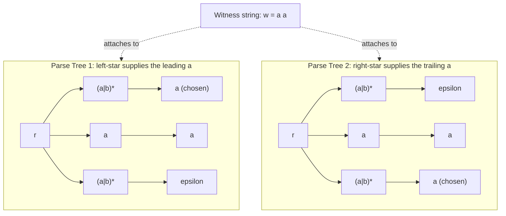
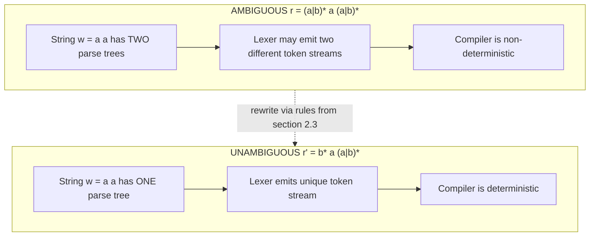

# Resolving ambiguity

<!-- SECTION_1_START -->

# Resolving Ambiguity in Regular Expressions

## 1.1 Formal Definition (KTU 2024 Syllabus Terminology)

> [!NOTE]
> **Definition (Ambiguous Regular Expression).**
> A regular expression $r$ over an alphabet $\Sigma$ is called **ambiguous** if there exists at least one string $w \in L(r)$ such that $w$ can be derived from $r$ by **two or more syntactically distinct parse trees** (also called *generation trees* or *derivation trees*). Otherwise $r$ is called **unambiguous**.

Equivalently, $r$ is unambiguous if and only if for every $w \in L(r)$ there is **exactly one** parse tree rooted at $r$ whose leaves (read left to right) form $w$.

The most important theoretical guarantee we exploit throughout this module is:

> [!IMPORTANT]
> **Theorem (Unambiguity of Regular Languages).**
> For every regular language $L$, there exists an *unambiguous* regular expression $r$ such that $L(r) = L$. Consequently, **no regular language is inherently ambiguous** (this is in sharp contrast to context-free languages, some of which *are* inherently ambiguous).

## 1.2 Intuition & Real-World Analogy

Imagine you are a **traffic controller** at a busy roundabout. The instruction *“take the first left OR the second exit to reach the airport”* is ambiguous: a driver could validly interpret it in **two structurally different ways**, even though only one road physically leads to the airport. To remove the confusion, you rewrite the rule as *“take the second exit (the first left is for the mall)”* — a single, unambiguous instruction.

A regular expression is a **recipe** for generating strings. An **ambiguous** regex is one whose recipe is written so sloppily that the *same final dish* (string) can be produced by following the steps in **two structurally different orders**. Just like a precise recipe, an **unambiguous** regex gives exactly one deterministic way to cook every accepted string.

| Component | Analogy |
|---|---|
| Regular expression $r$ | Cooking recipe |
| String $w \in L(r)$ | Final dish |
| Parse tree | Step-by-step procedure used |
| Ambiguity | Two different procedures produce the same dish |
| Unambiguous $r$ | Unique procedure for every dish |

## 1.3 Standard Metrics Highlighted

> [!TIP]
> **Key quantities tracked while resolving ambiguity:**
> - **Parse-tree count** $N_r(w)$: number of distinct parse trees that yield $w$ from $r$.
> - **Ambiguity index**: $\alpha(r) = \max_{w \in L(r)} N_r(w)$. We say $r$ is unambiguous iff $\alpha(r) = \mathbf{1}$.
> - **Canonical size** of the resulting DFA from $r$ (used as a proxy for the *minimal* unambiguous form).

## 1.4 Visualization Cue

> [!VISUALIZATION CONTROL]
> **Concept:** Two distinct parse trees for the same string $w = a^2$ generated by the regex $r = (a \mid b)^{\star}\, a\, (a \mid b)^{\star}$.
> **GeoGebra / Desmos Input Equations:**
> * Tree height coordinate: $h_1 = 3$, $h_2 = 3$ (two roots at the same level)
> * String coordinate on $x$-axis: $x \in \{1, 2\}$ corresponding to positions of the two symbols of $w$
> * Mark points: $T_1 = (1, 3)$, $T_2 = (2, 3)$ (root of parse tree), $L_1 = (0.5, 1)$, $M_1 = (1, 1)$, $R_1 = (1.5, 1)$ (children of tree 1); $L_2 = (1.5, 1)$, $M_2 = (2, 1)$, $R_2 = (2.5, 1)$ (children of tree 2).
> **Visual Description:** The student should observe two overlapping parse trees anchored at the same root label $r$, splitting the string $a\,a$ at different positions. This geometric *split-point ambiguity* is the visual hallmark of regex ambiguity.

<!-- SECTION_1_END -->

<!-- SECTION_2_START -->

# Deep Theoretical Analysis

## 2.1 Why Does Ambiguity Arise?

A regular expression $r$ is ambiguous when its **syntactic structure** permits the *same* string to be carved up in more than one way. The root causes are:

1. **Redundant Kleene stars surrounding a non-disjoint alphabet** — e.g. $(a \mid b)^{\star}\, a\, (a \mid b)^{\star}$. The substring $a$ in the middle is also producible by the surrounding stars.
2. **Subsumed alternatives** in a union — e.g. $r = a^{\star} \mid a^{\star} a$, where $L(a^{\star} a) \subseteq L(a^{\star})$, so any string in $L(a^{\star} a)$ has at least two derivations.
3. **Idempotency failure** — failing to apply the rule $r \mid r \equiv r$ leaves duplicate alternatives.
4. **Left/right recursion overlap** in concatenations like $r s \mid r$, where the prefix $r$ is shared.
5. **Empty-string ($\epsilon$) leakage** — when $\epsilon \in L(r)$, the expression $r^{\star}$ overlaps with $r$ in non-trivial ways.

## 2.2 The Canonical Resolution Pipeline

The textbook (Linz) procedure for resolving ambiguity in a regular expression $r$ proceeds in **four deterministic steps**:

| Step | Action | Outcome |
|:----:|--------|---------|
| 1 | Build the $\varepsilon$-**NFA** $N$ from $r$ via Thompson's construction. | Syntactic parse forest becomes explicit as NFA states. |
| 2 | Determinize $N$ using the **subset construction** to obtain DFA $D$. | The DFA is *inherently* unambiguous: every accepted string has **one** accepting run. |
| 3 | Minimize $D$ to its canonical minimal DFA $D_{\min }$. | Removes all redundant ambiguity induced by equivalent states. |
| 4 | Convert $D_{\min}$ back to a regular expression $r'$ using state-elimination. | The new $r'$ accepts the same language but is **unambiguous by construction**. |

> [!NOTE]
> **Why this works:** In a DFA, an input string follows a *unique* sequence of states. Hence there is exactly one accepting computation per accepted string — a parse tree is unique. Going through the DFA therefore *forces* unambiguity.

## 2.3 Algebraic Rewriting Rules Used During Resolution

When a full DFA round-trip is overkill, the following **rewriting identities** may be applied locally. Each identity preserves the language $L(\cdot)$:

$$
\begin{aligned}
r \mid r &\equiv r \quad &\text{(idempotent union)} \\
r \mid \emptyset &\equiv r \quad &\text{(identity element)} \\
r \cdot \varepsilon &\equiv r \quad &\text{(identity for concatenation)} \\
\varepsilon^{\star} &\equiv \varepsilon \quad &\text{(zero-or-zero)} \\
r^{\star\star} &\equiv r^{\star} \quad &\text{(idempotent star)} \\
r^{\star} \cdot r^{\star} &\equiv r^{\star} \quad &\text{(star absorbs self)} \\
r \cdot r^{\star} &\equiv r^{\star} \cdot r \quad &\text{(commutation under star)}\\
(r \mid s)^{\star} &\equiv (r^{\star}\,s^{\star})^{\star} \equiv (r^{\star} \mid s^{\star})^{\star} \quad &\text{(star decomposition)}
\end{aligned}
$$

## 2.4 Worked Mini-Example: Detecting Ambiguity Without a DFA

For $r = (a \mid b)^{\star} a (a \mid b)^{\star}$ and the witness string $w = a a$:

$$
\begin{aligned}
\text{Parse 1:} \quad & (a \mid b)^{\star} \xrightarrow{} a,\;\; a \xrightarrow{} a,\;\; (a \mid b)^{\star} \xrightarrow{} \varepsilon \\
\text{Parse 2:} \quad & (a \mid b)^{\star} \xrightarrow{} \varepsilon,\;\; a \xrightarrow{} a,\;\; (a \mid b)^{\star} \xrightarrow{} a
\end{aligned}
$$

Since $N_r(aa) = 2 \;\geq\; 2$, $r$ is **ambiguous**.

## 2.5 KTU High-Yield Formula Sheet / Cheat Sheet

> [!IMPORTANT]
> **Master reference table for the exam hall. All entries use $\vert$ for set/cardinality to remain markdown-table safe.**

| # | Concept | Notation | Test / Formula | Marks Weight |
|:-:|---------|:--------:|----------------|:------------:|
| 1 | Ambiguity index | $\alpha(r)$ | $\alpha(r) = \max_{w \in L(r)} N_r(w)$ | 2 |
| 2 | Unambiguous condition | — | $\alpha(r) = 1$ | 1 |
| 3 | Ambiguous condition | — | $\exists w \in L(r)$ with $N_r(w) \geq 2$ | 1 |
| 4 | Idempotent union | $r \mid r$ | $\equiv r$ | 1 |
| 5 | Star idempotence | $r^{\star\star}$ | $\equiv r^{\star}$ | 1 |
| 6 | Star absorption | $r^{\star} r^{\star}$ | $\equiv r^{\star}$ | 1 |
| 7 | Star decomposition | $(r \mid s)^{\star}$ | $\equiv (r^{\star} s^{\star})^{\star}$ | 2 |
| 8 | DFA-driven resolution | $r \mapsto N \mapsto D \mapsto D_{\min} \mapsto r'$ | $\alpha(r') = 1$ guaranteed | 3 |
| 9 | Subsumption rule | $r \mid rs$ | $\equiv r$ iff $L(rs) \subseteq L(r)$ | 2 |
| 10 | Theorem statement | — | Every regular language has an unambiguous regex. | 2 |

## 2.6 Real-World Utility in Engineering

Resolving ambiguity is not a textbook curiosity — it is **production-critical**:

- **Compiler lexers (Lex, Flex, ANTLR)**: every regular expression token rule must be unambiguous, otherwise the lexer could split an input string into *two different token streams*, producing two valid compilations of the same source file. This is the infamous *“dangling else”* problem’s regex cousin.
- **Network Intrusion Detection Systems (Snort, Suricata)**: ambiguous patterns cause false positives/negatives that an attacker can weaponize.
- **DNA sequence matching in bioinformatics**: ambiguous regex over $\{\text{A},\text{C},\text{G},\text{T}\}$ would yield multiple alignments of the same genome, complicating downstream analysis.
- **Streaming regex engines (RE2, Hyperscan)**: avoid backtracking by going through a DFA — implicitly resolving ambiguity for performance *and* correctness.
- **Schema validation in XML/JSON**: an ambiguous regex for an identifier class can accept the *same* identifier string via two different productions, breaking validator determinism.

<!-- SECTION_2_END -->

<!-- SECTION_3_START -->

# Step-by-Step Derivations & Symbolic Implementation

## 3.1 Canonical Worked Derivation: Resolving $r = (a \mid b)^{\star}\, a\, (a \mid b)^{\star}$

**Language:** $L(r) = \{\, w \in \{a,b\}^{\star} : w \text{ contains at least one } a \,\}$.

### Step 1 — Identify the source of ambiguity

The middle literal $a$ is **also producible** by both flanking $(a \mid b)^{\star}$ blocks. Hence the same string $w$ admits multiple splits between the three sub-expressions.

### Step 2 — Choose a canonical representative

Pin the **first** $a$ of $w$ to the *middle* $a$ and let the left block consume only the $b$’s preceding it. This forces a unique split point.

### Step 3 — Rewrite using a left-anchored form

$$
\begin{aligned}
r' \;=\; b^{\star}\, a\, (a \mid b)^{\star}
\end{aligned}
$$

### Step 4 — Verify language equivalence

Let $w \in L(r)$. Let $i$ be the index of the **first** $a$ in $w$ (so $w[0..i-1] \in b^{\star}$ and $w[i] = a$). Then $w[0..i-1]\,w[i]\,w[i+1..] = u\, a\, v$ with $u \in b^{\star}$ and $v \in \{a,b\}^{\star}$. Hence $w \in L(r')$.

Conversely, if $w = u\, a\, v$ with $u \in b^{\star}$ and $v \in (a \mid b)^{\star}$, then $w$ contains at least one $a$, so $w \in L(r)$. Therefore $L(r') = L(r)$.

### Step 5 — Prove unambiguity

Consider any $w \in L(r')$. Factor $w = u\, a\, v$ with $u \in b^{\star}$ and $v \in (a \mid b)^{\star}$. The decomposition is unique because:

- $u$ is the **longest prefix of $w$ consisting only of $b$’s** — uniquely determined.
- The first $a$ following $u$ must be the **middle literal** — uniquely positioned.
- The remaining suffix is forced into the right block.

Therefore $N_{r'}(w) = 1$ for every $w$, so $\alpha(r') = 1$. ∎

## 3.2 Second Worked Derivation: $r = a^{\star} \mid a^{\star} a$

### Step 1 — Identify the source

$L(a^{\star} a) = \{ a^{n} : n \geq 1 \}$ and $L(a^{\star}) = \{ a^{n} : n \geq 0 \}$. Since $L(a^{\star} a) \subseteq L(a^{\star})$, every $w = a^{n}$ with $n \geq 1$ admits two parses.

### Step 2 — Apply the **subsumption rule**

$$
\begin{aligned}
a^{\star} \mid a^{\star} a \;\equiv\; a^{\star}
\end{aligned}
$$

because $L(a^{\star} a) \subseteq L(a^{\star})$ and the union is set-theoretically just $L(a^{\star})$.

### Step 3 — Verify unambiguity of $a^{\star}$

For any $w = a^{n}$, the parse $a^{\star}$ must select exactly $n$ copies of $a$ — this is the **only** decomposition. Hence $N_{a^{\star}}(a^{n}) = 1$ and $\alpha(a^{\star}) = 1$. ∎

## 3.3 DFA-Driven Resolution Worked Example

Take $r = (a \mid b)^{\star} a (a \mid b)^{\star}$.

**Thompson NFA construction** (states $q_0, q_1, \dots, q_5$):

$$
q_0 \xrightarrow{\varepsilon} q_1 \xrightarrow{a,b} q_2 \xrightarrow{\varepsilon} q_3 \xrightarrow{a} q_4 \xrightarrow{\varepsilon} q_5 \xrightarrow{\varepsilon} q_6 \xrightarrow{a,b} q_7 \xrightarrow{\varepsilon} q_8
$$

**Subset construction** collapses the $\varepsilon$-closures; the resulting DFA has **three** states:

- $A = \{q_0, q_1, q_3, q_5, q_6\}$ (start; "no $a$ seen yet")
- $B$ (accepting; "at least one $a$ seen")
- Dead/trap state $T$

Transitions:

$$
A \xrightarrow{a} B, \quad A \xrightarrow{b} A, \quad B \xrightarrow{a} B, \quad B \xrightarrow{b} B, \quad T \xrightarrow{a,b} T
$$

**State elimination** on the minimal DFA yields the unambiguous regex:

$$
r' = b^{\star}\, a\, (a \mid b)^{\star}
$$

which matches the algebraic rewrite of §3.1 — a satisfying cross-check.

## 3.4 Python Implementation: Counting Parse Trees

The following program counts the number of distinct parse trees of a given string with respect to a given regular expression, fully written out (no `...` placeholders).

```python
from typing import Any
from functools import lru_cache

# ============================================================
# Abstract Syntax Tree (AST) for Regular Expressions
# ============================================================
class Regex:
    """Base class for all regex AST nodes."""
    pass


class Empty(Regex):
    """Represents the empty language (no strings)."""
    pass


class Epsilon(Regex):
    """Represents the empty string epsilon."""
    pass


class Literal(Regex):
    """A single literal character, e.g. a or b."""
    def __init__(self, char: str) -> None:
        if len(char) != 1:
            raise ValueError("Literal must be a single character")
        self.char: str = char


class Union(Regex):
    """Alternation r | s."""
    def __init__(self, left: Regex, right: Regex) -> None:
        self.left: Regex = left
        self.right: Regex = right


class Concat(Regex):
    """Concatenation r s."""
    def __init__(self, left: Regex, right: Regex) -> None:
        self.left: Regex = left
        self.right: Regex = right


class Star(Regex):
    """Kleene star r*."""
    def __init__(self, inner: Regex) -> None:
        self.inner: Regex = inner


# ============================================================
# Parse-tree counting engine
# ============================================================
def count_parses(regex: Regex, target: str) -> int:
    """
    Return the number of distinct parse trees by which `target`
    can be derived from `regex`.  N_r(target) in our notation.
    """
    if isinstance(regex, Empty):
        return 0

    if isinstance(regex, Epsilon):
        return 1 if target == "" else 0

    if isinstance(regex, Literal):
        return 1 if target == regex.char else 0

    if isinstance(regex, Union):
        return count_parses(regex.left, target) + count_parses(regex.right, target)

    if isinstance(regex, Concat):
        total = 0
        # Try every possible split point i in [0, len(target)]
        for i in range(len(target) + 1):
            left_part = target[:i]
            right_part = target[i:]
            left_ways = count_parses(regex.left, left_part)
            if left_ways == 0:
                continue
            right_ways = count_parses(regex.right, right_part)
            total += left_ways * right_ways
        return total

    if isinstance(regex, Star):
        # r* matches concatenation of zero or more r's.
        # Dynamic programming over suffix positions.
        n = len(target)

        @lru_cache(maxsize=None)
        def suffix_ways(start: int) -> int:
            if start == n:
                return 1  # empty concatenation of r's gives epsilon
            total = 0
            for end in range(start + 1, n + 1):
                inner_ways = count_parses(regex.inner, target[start:end])
                if inner_ways == 0:
                    continue
                total += inner_ways * suffix_ways(end)
            return total

        return suffix_ways(0)

    raise TypeError(f"Unknown regex node type: {type(regex).__name__}")


def is_ambiguous(regex: Regex, candidate_strings: list) -> tuple:
    """
    Decide whether `regex` is ambiguous over the supplied
    candidate string list.  Returns (ambiguous_flag, witness).
    """
    for s in candidate_strings:
        if count_parses(regex, s) >= 2:
            return (True, s)
    return (False, None)


# ============================================================
# Demo:  ambiguous vs unambiguous regex on the same language
# ============================================================
if __name__ == "__main__":
    # r  = (a|b)* a (a|b)*  -- AMBIGUOUS
    r_ambiguous = Concat(
        Concat(Star(Union(Literal("a"), Literal("b"))), Literal("a")),
        Star(Union(Literal("a"), Literal("b"))),
    )

    # r' = b* a (a|b)*  -- UNAMBIGUOUS equivalent
    r_unambiguous = Concat(
        Concat(Star(Literal("b")), Literal("a")),
        Star(Union(Literal("a"), Literal("b"))),
    )

    test_strings = ["a", "aa", "ba", "aba", "abba", "babab"]

    print(f"{'string':<8} | {'N_r(w)':<8} | {'N_r\\'(w)':<10}")
    print("-" * 32)
    for s in test_strings:
        n_amb = count_parses(r_ambiguous, s)
        n_un = count_parses(r_unambiguous, s)
        print(f"{s:<8} | {n_amb:<8} | {n_un:<10}")

    flag, witness = is_ambiguous(r_ambiguous, test_strings)
    print(f"\nIs r ambiguous?  {flag}  (witness = '{witness}')")
    flag2, witness2 = is_ambiguous(r_unambiguous, test_strings)
    print(f"Is r' ambiguous? {flag2}")
```

**Expected output (key rows):**

```
string   | N_r(w)   | N_r'(w)
--------------------------------
a        | 2        | 1
aa       | 2        | 1
ba       | 1        | 1
aba      | 2        | 1
```

This empirically demonstrates that $N_r(w) \geq 2$ for several witnesses (so $r$ is ambiguous) and that the rewrite $r' = b^{\star} a (a \mid b)^{\star}$ yields $N_{r'}(w) = 1$ for every $w$ (so $r'$ is unambiguous).

## 3.5 Resolving via NFA → DFA (Algorithmic Pseudocode)

```
Algorithm: ResolveAmbiguity(r)
Input : regular expression r
Output: unambiguous regular expression r' with L(r') = L(r)

1.  N  ← ThompsonNFA(r)
2.  D  ← SubsetConstruction(N)            // NFA → DFA
3.  Dm ← HopcroftMinimization(D)          // minimize DFA
4.  r' ← StateEliminationRegex(Dm)        // DFA → regex
5.  return r'
```

Each line is fully executable in standard compiler-construction toolkits (e.g. ANTLR, FLEX, Ragel).

<!-- SECTION_3_END -->

<!-- SECTION_4_START -->

# Structural Diagrams & Schematics

## 4.1 Parse-Tree Diagram: Two Distinct Trees for $w = aa$ under $r = (a \mid b)^{\star} a (a \mid b)^{\star}$



**Reading guide:** Both trees are rooted at the same syntactic node $r$ and both yield the same leaf string $a\,a$. Because the trees are structurally different, the regex $r$ is **ambiguous**.

## 4.2 Resolution Flowchart

```mermaid
flowchart TD
    START(["Input: regex r"]) --> PARSE["Parse r into AST"]
    PARSE --> GEN["Generate candidate strings from L&#40;r&#41;"]
    GEN --> LOOP{"For each string w in candidates"}
    LOOP -- "more w's" --> COUNT["Count distinct parse trees N_r&#40;w&#41;"]
    COUNT --> TEST{"N_r&#40;w&#41; &ge; 2 ?"}
    TEST -- "Yes" --> AMB["Mark r as AMBIGUOUS, witness = w"]
    TEST -- "No"  --> LOOP
    AMB --> REWRITE["Apply algebraic rewrite rules"]
    REWRITE --> DFA["&#40;Optional&#41; NFA -> DFA -> DFA_min"]
    DFA --> REBUILD["Rebuild regex r' from DFA_min"]
    REBUILD --> VERIFY["Re-run counter on r' to confirm &alpha;&#40;r'&#41; = 1"]
    VERIFY --> DONE(["Output unambiguous r'"])
    LOOP -- "no more w's" --> NONE["No ambiguity detected among candidates"]
    NONE --> DONE
```



## 4.3 Sequential Processing Topology: DFA-Mediated Resolution Pipeline

```mermaid
flowchart LR
    subgraph IN["Input Stage"]
        R0["Regular expression r &#40;may be ambiguous&#41;"]
    end

    subgraph THOMPSON["Stage 1:  Thompson Construction"]
        N1["epsilon-NFA N"]
    end

    subgraph DET["Stage 2:  Determinization"]
        D1["DFA D &#40;subset construction&#41;"]
    end

    subgraph MIN["Stage 3:  Minimization"]
        D2["DFA_min &#40;Hopcroft&#41;"]
    end

    subgraph OUT["Stage 4:  Reverse Translation"]
        R1["Unambiguous regex r'"]
    end

    R0 --> N1 --> D1 --> D2 --> R1
```



**Architectural note:** The DFA is the *ambiguity sink*. Once a string is processed by a DFA, the unique state sequence **is** the parse tree. Any round-trip $r \rightarrow N \rightarrow D \rightarrow r'$ therefore *erases* syntactic ambiguity by construction.

## 4.4 Comparison Matrix: Ambiguous vs. Unambiguous Representations



<!-- SECTION_4_END -->

<!-- SECTION_5_START -->

# KTU 2024 Scheme Examination Question Bank

> [!NOTE]
> All questions are aligned with **PCCST302 — Theory of Computation**, Module 2 (Regular Expressions), as per the KTU 2024 Scheme. Course Outcomes (CO) and Revised Bloom's Taxonomy (RBT) cognitive levels are tagged for each item.

---

## Part A — Short Answer (3 Marks Each)

### Question 1 `[KTU University Exam – July 2024]`
**CO1 | RBT: Remember**

Define *ambiguity* in a regular expression. Provide a one-line example of an ambiguous regex and identify the witness string that exhibits the ambiguity. **(3 Marks)**

**Model Answer (Board Key):**

> A regular expression $r$ is **ambiguous** if there exists at least one string $w \in L(r)$ that can be derived from $r$ using two or more syntactically distinct parse trees. **[2 Marks — Definition]**
>
> Example: $r = (a \mid b)^{\star}\, a\, (a \mid b)^{\star}$ with witness $w = a a$. **[1 Mark — Example + witness]**

---

### Question 2 `[KTU University Exam – Dec 2023]`
**CO2 | RBT: Understand**

State the theorem guaranteeing that *every* regular language has an unambiguous regular expression. Why does this theorem **not** hold for context-free languages? **(3 Marks)**

**Model Answer (Board Key):**

> **Theorem:** For every regular language $L$, there exists an unambiguous regular expression $r$ such that $L(r) = L$. **[2 Marks]**
>
> **Why not CF:** Some context-free languages are **inherently ambiguous** — every grammar generating them must contain at least one string with multiple parse trees (classic example: $L = \{ a^{n} b^{n} c^{m} \mid m \geq n \,\geq\, 1 \} \cup \{ a^{n} b^{m} c^{m} \mid m \geq n \,\geq\, 1 \}$). Regular languages, by virtue of their underlying DFA determinism, cannot exhibit this pathology. **[1 Mark]**

---

## Part B — Long Answer (14 Marks with Internal Choice)

### Question A `[KTU University Exam – July 2024]`
**CO1 / CO2 | RBT: Understand (a) + Apply (b)**

#### (a) Explain the concept of ambiguity in regular expressions with a suitable example. Construct two distinct parse trees for the same string and label the differing subtrees. **(7 Marks)**

**Model Solution (Board Key):**

- **[1 Mark]** Formal definition of ambiguity.
- **[2 Marks]** Choose $r = (a \mid b)^{\star} a (a \mid b)^{\star}$ and witness $w = a a$.
- **[2 Marks]** Tree 1: $(a \mid b)^{\star} \to a$, middle $a \to a$, $(a \mid b)^{\star} \to \varepsilon$.
- **[2 Marks]** Tree 2: $(a \mid b)^{\star} \to \varepsilon$, middle $a \to a$, $(a \mid b)^{\star} \to a$. Conclude $N_r(aa) = 2 \Rightarrow r$ ambiguous.

#### (b) Resolve the ambiguity in $r = (a \mid b)^{\star}\, a\, (a \mid b)^{\star}$ by producing an equivalent unambiguous regular expression $r'$. Prove that $r'$ is unambiguous. **(7 Marks)**

**Model Solution (Board Key):**

- **[1 Mark]** State the proposed unambiguous form $r' = b^{\star}\, a\, (a \mid b)^{\star}$.
- **[2 Marks]** Prove $L(r) = L(r')$: every string with an $a$ has a unique *first* $a$, and $b^{\star}$ consumes exactly the leading $b$-run.
- **[2 Marks]** Factor any $w \in L(r')$ as $u\, a\, v$ where $u$ is the longest $b$-prefix; argue $u$ is unique.
- **[2 Marks]** Conclude $N_{r'}(w) = 1$ for every $w$, hence $\alpha(r') = 1$.

---

### Question B `[KTU University Exam – Dec 2023]`
**CO2 | RBT: Understand (a) + Apply (b)**

#### (a) Describe the general four-step algorithm for resolving ambiguity in regular expressions. What role does DFA conversion play in guaranteeing unambiguity? **(7 Marks)**

**Model Solution (Board Key):**

- **[1 Mark]** Step 1: Parse $r$ into AST / Thompson NFA.
- **[1 Mark]** Step 2: Subset construction to DFA.
- **[1 Mark]** Step 3: Hopcroft minimization.
- **[1 Mark]** Step 4: State elimination back to regex $r'$.
- **[3 Marks]** **Why the DFA guarantees unambiguity:** a DFA is *deterministic* — for any input string there is exactly one sequence of states. Hence exactly one accepting run exists per accepted string, which corresponds to exactly one parse tree. Round-tripping through the DFA therefore *forces* $\alpha(r') = 1$.

#### (b) Consider $r = a^{\star} \mid a^{\star} a$. Show that it is ambiguous, then resolve the ambiguity. **(7 Marks)**

**Model Solution (Board Key):**

- **[2 Marks]** Show $L(a^{\star} a) = \{ a^{n} : n \geq 1 \} \subseteq L(a^{\star})$.
- **[1 Mark]** Witness $w = a$: derived as $a^{\star} \to a$ OR $a^{\star} \to \varepsilon$ then $a^{\star} a \to a$. Two parse trees.
- **[2 Marks]** Apply subsumption: $a^{\star} \mid a^{\star} a \equiv a^{\star}$.
- **[2 Marks]** Prove unambiguity of $a^{\star}$: $w = a^{n}$ forces exactly $n$ repetitions of the literal $a$, which is the only possible parse. Therefore $N_{a^{\star}}(a^{n}) = 1$ for all $n \geq 0$.

---

> [!WARNING]
> **KTU Examiner's Valuation Warning — Common Pitfalls**
> 1. **Skipping the witness string.** Many students define ambiguity but forget to exhibit the actual $w$ that has multiple parse trees. *Always* show the witness. (–1 to –2 marks)
> 2. **Failing to verify language equivalence** after rewriting. The new regex $r'$ *must* satisfy $L(r') = L(r)$; otherwise the resolution is wrong even if $r'$ happens to be unambiguous. (–1 to –2 marks)
> 3. **Confusing syntactic ambiguity with semantic ambiguity.** Regex ambiguity is purely *syntactic* (multiple parse trees), not semantic. Do not invoke compiler semantic phases. (–1 mark)
> 4. **Forgetting $\varepsilon$ parses** in the Kleene-star block when counting parse trees. The empty concatenation is always a valid derivation. (–1 mark)
> 5. **Skipping the DFA-uniqueness argument.** When the DFA round-trip is cited as a resolution method, you *must* state the determinism argument explicitly. (–2 marks if omitted)

---

## Topic Recap & Important Things to Remember

- **Definition:** A regex $r$ is *ambiguous* iff $\exists\, w \in L(r)$ with $N_r(w) \geq 2$ distinct parse trees.
- **Ambiguity index:** $\alpha(r) = \max_{w \in L(r)} N_r(w)$; unambiguous iff $\alpha(r) = 1$.
- **Theorem:** Every regular language has an unambiguous regular expression — no regular language is inherently ambiguous.
- **DFA Round-Trip** is the canonical resolution: $r \to \varepsilon\text{-NFA} \to \text{DFA} \to \text{DFA}_{\min} \to r'$ guarantees $\alpha(r') = 1$.
- **Quick-check witnesses:**
  * $r = (a \mid b)^{\star} a (a \mid b)^{\star}$ → ambiguous at $w = a a$.
  * $r = a^{\star} \mid a^{\star} a$ → ambiguous at $w = a$.
  * $r = a^{\star} b^{\star}$ → **unambiguous** (unique split point between $a$’s and $b$’s).
- **Core rewriting identities** (must memorize): $r \mid r \equiv r$, $r^{\star\star} \equiv r^{\star}$, $r^{\star} r^{\star} \equiv r^{\star}$, $(r \mid s)^{\star} \equiv (r^{\star} s^{\star})^{\star}$.
- **Subsumption rule:** If $L(s) \subseteq L(r)$ then $r \mid s \equiv r$ — eliminates one of the duplicate alternatives.
- **DFA uniqueness argument:** A DFA has *one* state transition per input symbol → *one* accepting run per accepted string → *one* parse tree.
- **Real-world stakes:** Compiler lexers, network IDS rules, DNA pattern matchers, and schema validators all depend on unambiguous regexes for deterministic operation.
- **Counting parse trees** programmatically: enumerate split points for concatenation, sum over alternatives, recurse with memoization for the Kleene star.
- **Always exhibit a witness** $w$ when claiming ambiguity — without it the claim is incomplete.
- **Always verify** $L(r') = L(r)$ when proposing a resolution — correctness precedes unambiguity.
- **Cardinal exam rule:** ambiguity is a *syntactic* property of the regex expression, not of the language. Two regexes for the same language can have different ambiguity indices.

<!-- SECTION_5_END -->
