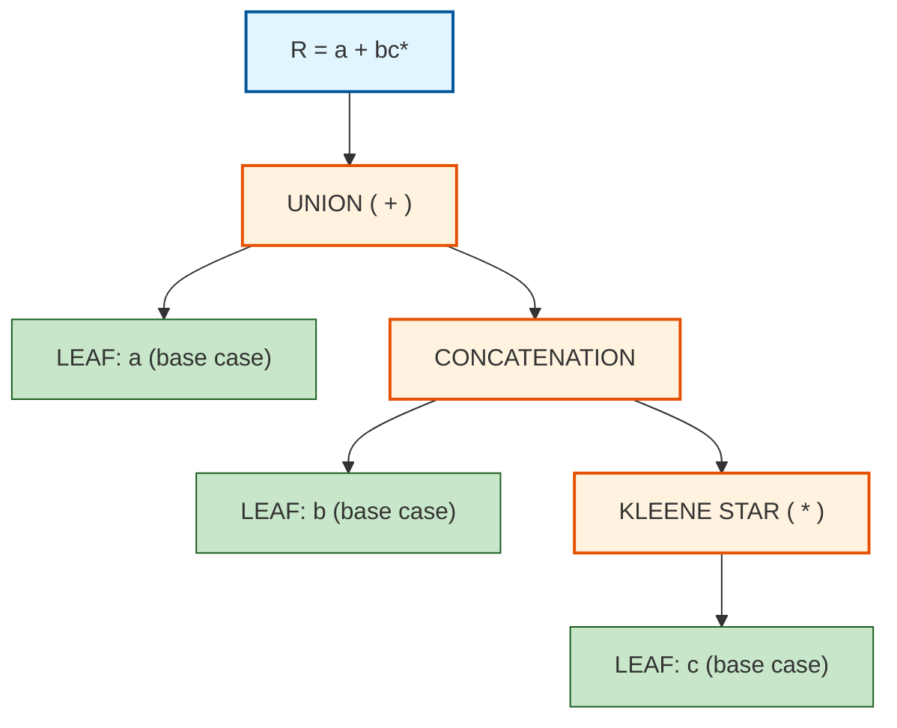
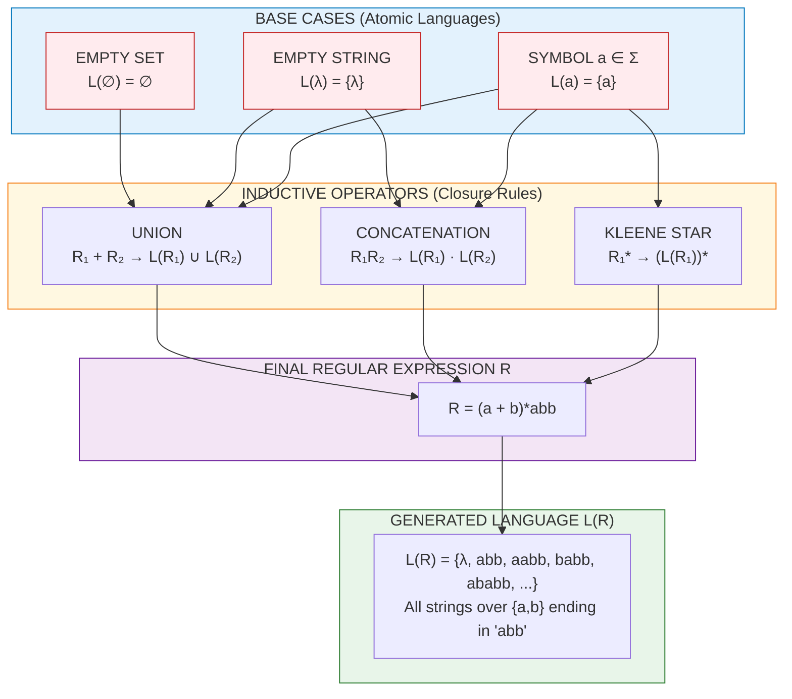
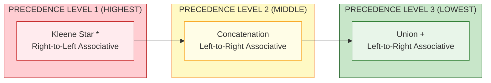
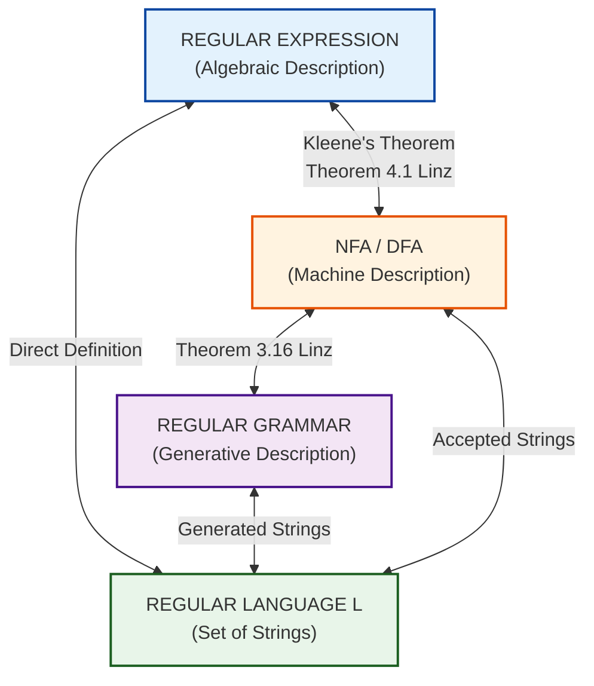

# The formal definition of a regular expression

<!-- SECTION_1_START -->

# The Formal Definition of a Regular Expression

> [!NOTE]
> **KTU 2024 Scheme | PCCST302 | Module 2 | Linz Chapter 4 Reference**
> **Course Outcome Mapped:** CO2 – Design finite automata, regular expressions, and context-free grammars for formal languages.
> **Bloom's Cognitive Level:** Understand / Apply

---

## 1.1 Formal Academic Definition (Linz 4.1)

A **regular expression** over an alphabet $\Sigma$ is defined **recursively** (inductively) as follows. A language $L$ is a **regular language** if and only if it is described by a regular expression.

Let $R$ be a regular expression. Then $L(R)$ denotes the language associated with $R$. The set of regular expressions is built from three **basis elements** and three **inductive (closure) operators**.

### Basis (Base Cases)

| Element | Notation | Language Generated |
| :--- | :---: | :--- |
| Empty set | $\emptyset$ | $L(\emptyset) = \emptyset$ (the language containing **no strings**) |
| Empty string | $\lambda$ | $L(\lambda) = \{ \lambda \}$ (the language containing **only the empty string**) |
| Symbol $a \in \Sigma$ | $a$ | $L(a) = \{ a \}$ (the language containing **only the string $a$**) |

### Inductive (Recursive) Steps

If $R_1$ and $R_2$ are regular expressions, then the following are also regular expressions:

$$
\begin{aligned}
\text{1. Union:} \quad & R_1 + R_2 \quad \text{where} \quad L(R_1 + R_2) = L(R_1) \cup L(R_2) \\[4pt]
\text{2. Concatenation:} \quad & R_1 R_2 \quad \text{where} \quad L(R_1 R_2) = L(R_1) \cdot L(R_2) \\[4pt]
\text{3. Kleene Star (Closure):} \quad & R_1^{*} \quad \text{where} \quad L(R_1^{*}) = (L(R_1))^{*}
\end{aligned}
$$

### Predefined Shorthand Operators

$$
\begin{aligned}
\text{Positive Closure:} \quad & R^{+} = RR^{*} \\[4pt]
\text{Optional / Zero-or-One:} \quad & R? = \lambda + R
\end{aligned}
$$

> [!IMPORTANT]
> **KTU Board Emphasis:** The recursive (inductive) definition is the *exact* wording that examiners expect. Memorizing the **three base cases** and **three inductive rules** verbatim earns easy marks in Part A questions.

---

## 1.2 Conceptual Analogy & Intuitive Overview

> [!TIP]
> **Think of a regular expression as a "Mathematical Recipe" for building strings.**

Imagine you are a **chef in a string-kitchen**, and your alphabet $\Sigma$ is the set of ingredients on your counter.

* $\lambda$ (empty string) is the **empty plate** — a valid dish that serves nothing.
* $a$ is a **single ingredient** placed on a plate.
* $R_1 + R_2$ is the **"either/or" menu option** — you serve dishes from Recipe 1 *or* Recipe 2.
* $R_1 R_2$ is the **"and then" sequence** — you serve Recipe 1 dish *followed by* Recipe 2 dish.
* $R_1^{*}$ is the **"as many helpings as you want" option** — you can repeat Recipe 1 zero, one, two, or infinitely many times, in any combination.

> [!EXAMPLE]
> **Example:** $R = (a + b)^{*} abb$ describes *any string of $a$'s and $b$'s that ENDS with the substring $abb$*.
> * Chef: "Give me any number of $a$'s and $b$'s (any sequence, any length), and then finish it off with the exact three-letter signature $abb$."
> * Accepted dishes: $abb$, $aabb$, $babb$, $ababb$, $aaabbb$ — and so on, infinitely many.

---

## 1.3 Operator Precedence (Hierarchy of Operations)

> [!WARNING]
> **Common Mistake:** Misreading $(a + b)^{*} abb$ as $a + (b^{*} abb)$ due to wrong precedence. Always use parentheses to be safe.

The standard order of operations (highest to lowest) is:

| Precedence | Operator | Name | Associativity |
| :---: | :---: | :--- | :---: |
| **1 (Highest)** | $^{*}$ (Kleene Star) | Closure | Right-to-left |
| **2** | Concatenation (juxtaposition) | Concatenation | Left-to-right |
| **3 (Lowest)** | $+$ | Union | Left-to-right |

> [!VISUALIZATION CONTROL]
> **Concept:** Visualization of how the operator precedence tree parses the expression $a + bc^{*}$.
> **Parsing Tree (Mental Picture):**
> * The top node is **Union ($+$)** because $+$ has the lowest precedence.
> * Left child of Union: the literal symbol $a$.
> * Right child of Union: a Concatenation node.
> * The Concatenation node has children $b$ and $c^{*}$.
> * The $c^{*}$ sub-tree shows that the Kleene star binds to $c$ alone (highest precedence), not to $bc$.
> **GeoGebra / Desmos Input (Tree-style not natively supported — use this conceptual sketch):** Draw $+$ at the top, then a dot (concatenation) on the right branch with leaves $b$ and a small star-asterisk on $c$.

---

## 1.4 Connection to Regular Languages (Kleene's Theorem)

> [!IMPORTANT]
> **Kleene's Theorem (KTU High-Yield Statement):**
> A language $L$ is **regular** (i.e., accepted by some DFA / NFA) **if and only if** $L$ can be described by some regular expression.
>
> **Equivalence Chain:** DFA $\;\Longleftrightarrow\;$ NFA $\;\Longleftrightarrow\;$ Regular Expression $\;\Longleftrightarrow\;$ Regular Grammar

This means the formal definition of a regular expression is the **bridge** between the *algebraic* description of a language (the regex) and the *machine* description of a language (the automaton).

---

<!-- SECTION_1_END -->

<!-- SECTION_2_START -->

# Deep Theoretical Analysis & KTU High-Yield Formula Sheet

## 2.1 Deconstructing the Recursive Definition — Step by Step

The recursive definition is the **backbone** of every regex question in KTU. Let us dissect *why* it works the way it does.

### Step 1 — Establish the Foundation (Base Cases)

The three base cases ($\emptyset$, $\lambda$, $a$) are the **atomic building blocks**. Every regular expression is, ultimately, a tree made of these atoms.

* $\emptyset$ generates **nothing** — the set is empty. Crucially, $\emptyset \neq \lambda$ even though both are "empty-looking" to beginners.
* $\lambda$ generates the **empty string** — the set contains exactly one string of length 0.
* $a$ generates the **single-character string** $a$.

### Step 2 — Apply Operators (Inductive Closure)

Starting from the base cases, we repeatedly apply the three operators to build **arbitrarily complex** expressions. This is the *smallest* class of languages closed under union, concatenation, and Kleene star.

### Step 3 — Identify the Generated Language

For any given regular expression $R$, the language $L(R)$ is computed by substituting the meaning of each operator in the expression tree.

> [!TIP]
> **The "Substitution Method":** Treat each sub-expression as a set of strings. Replace operators with their set-theoretic counterparts ($\cup$, $\cdot$, ${}^{*}$). Solve the resulting set equation.

---

## 2.2 Worked Language Derivations

### Example 1: $R = a^{*}$

$$
\begin{aligned}
L(a) &= \{a\} \\[4pt]
L(a^{*}) &= (L(a))^{*} = \{a\}^{*} \\[4pt]
&= \{ \lambda,\; a,\; aa,\; aaa,\; aaaa,\; \ldots \} \\[4pt]
&= \text{All strings of zero or more } a\text{'s}
\end{aligned}
$$

### Example 2: $R = a + b$

$$
L(a + b) = L(a) \cup L(b) = \{a\} \cup \{b\} = \{a,\, b\}
$$

### Example 3: $R = (a + b)^{*}$

$$
\begin{aligned}
L(a + b) &= \{a,\, b\} \\[4pt]
L((a + b)^{*}) &= \{a,\, b\}^{*} \\[4pt]
&= \{ \lambda,\; a,\; b,\; aa,\; ab,\; ba,\; bb,\; aaa,\; \ldots \} \\[4pt]
&= \text{All strings over } \{a,\, b\}
\end{aligned}
$$

### Example 4: $R = (a + b)^{*} abb$

$$
L((a + b)^{*} abb) = \{ w\,abb \mid w \in \{a,\, b\}^{*} \}
$$

In words: *all strings over $\{a, b\}$ that end in $abb$*.

### Example 5: $R = (aa)^{*}(\lambda + a)$

$$
\begin{aligned}
L((aa)^{*}) &= \{ \lambda,\, aa,\, aaaa,\, \ldots \} \\[4pt]
L(\lambda + a) &= \{\lambda,\, a\} \\[4pt]
L(R) &= \{\lambda,\, a,\, aa,\, aaa,\, aaaa,\, aaaaa,\, \ldots\} \\[4pt]
&= \text{All strings of } a\text{'s of length } \neq 2 \text{ (every length except 2)}
\end{aligned}
$$

---

## 2.3 Important Identities (Algebra of Regular Expressions)

| # | Identity | Meaning |
| :---: | :--- | :--- |
| 1 | $R + R = R$ | Idempotent union |
| 2 | $R \cdot \lambda = R$ | Empty string is identity for concatenation |
| 3 | $R \cdot \emptyset = \emptyset$ | Concatenating with empty set yields empty set |
| 4 | $R + \emptyset = R$ | Empty set is identity for union |
| 5 | $(R^{*})^{*} = R^{*}$ | Star of a star is the star |
| 6 | $R^{*} R^{*} = R^{*}$ | Two consecutive closures simplify |
| 7 | $\emptyset^{*} = \lambda$ | Zero repetitions of nothing = empty string |
| 8 | $R + S = S + R$ | Union is commutative |
| 9 | $(R + S)T = RT + ST$ | Distributive law (concatenation over union) |
| 10 | $R + R^{*} = R^{*}$ | Adding original to its closure gives closure |

> [!IMPORTANT]
> These identities are often used in **Part B questions** to *simplify* a given regular expression. KTU examiners love testing $R + R = R$ and $R^{*} = \lambda + RR^{*}$.

---

## 2.4 KTU High-Yield Formula Sheet

| Symbol / Term | Definition | Language | KTU Frequency |
| :---: | :--- | :--- | :---: |
| $\emptyset$ | Empty set symbol | $L = \emptyset$ | ★★★ |
| $\lambda$ (or $\varepsilon$) | Empty string | $L = \{\lambda\}$ | ★★★ |
| $a$ | Literal symbol from $\Sigma$ | $L = \{a\}$ | ★★★ |
| $R_1 + R_2$ | Union | $L(R_1) \cup L(R_2)$ | ★★★ |
| $R_1 R_2$ | Concatenation | $L(R_1) \cdot L(R_2)$ | ★★★ |
| $R^{*}$ | Kleene Star (0 or more) | $\bigcup_{i=0}^{\infty} L(R)^{i}$ | ★★★ |
| $R^{+}$ | Positive Closure (1 or more) | $RR^{*}$ | ★★ |
| $R?$ | Optional (0 or 1) | $\lambda + R$ | ★★ |
| $\Sigma$ | Alphabet (finite symbol set) | $\{\,a_1, a_2, \ldots, a_n\,\}$ | ★★★ |
| $\Sigma^{*}$ | All strings over $\Sigma$ | $L((\sum_{i} a_i)^{*})$ | ★★★ |
| $\Sigma^{+}$ | All non-empty strings | $\Sigma \cdot \Sigma^{*}$ | ★★ |

**Critical Distinctions (Most-Tested!):**

$$
\emptyset \; \neq \; \{\lambda\} \; \neq \; \lambda
$$

* $\emptyset$ is the set with **zero strings**.
* $\{\lambda\}$ is the set with **one string** — the empty string.
* $\lambda$ denotes the **string** of length 0 (an element, not a set).

---

## 2.5 Real-World Utility in Engineering

> [!TIP]
> **Where do regular expressions appear in industry?**

1. **Lexical Analyzers (Compilers):** The `lex` / `flex` tool generates finite automata directly from regular expressions to tokenize source code (identifiers, numbers, keywords).
2. **Search Engines (grep, ripgrep):** Patterns like `[A-Za-z0-9._%+-]+@[A-Za-z0-9.-]+\.[A-Za-z]{2,}` validate email addresses.
3. **Network Firewalls & IDS/IPS:** Intrusion detection systems (e.g., Snort) use regex patterns to match malicious payloads in packet payloads.
4. **DNA Sequence Analysis in Bioinformatics:** Tools like `samtools` and `bcftools` use regex to identify motifs (e.g., `GAATTC` for EcoRI restriction sites).
5. **Input Validation in Web Apps:** Phone numbers, passwords, credit card formats — all validated by regex.
6. **NLP Tokenization:** Splitting text into words, sentences, and punctuation using pattern matchers.

---

<!-- SECTION_2_END -->

<!-- SECTION_3_START -->

# Step-by-Step Derivations & Symbolic Implementation

## 3.1 Exhaustive Derivation: Building a Language from a Regex

> **Problem:** Find the language $L(R)$ described by $R = (a + b)^{*} (a + bb)$.

### Step 1 — Identify the base components.

We have:
* $L(a) = \{a\}$
* $L(b) = \{b\}$
* $L(a + b) = \{a,\, b\}$
* $L(bb) = \{bb\}$

### Step 2 — Evaluate the union $(a + bb)$.

$$
L(a + bb) = L(a) \cup L(bb) = \{a\} \cup \{bb\} = \{a,\, bb\}
$$

### Step 3 — Evaluate the Kleene star $(a + b)^{*}$.

$$
L((a + b)^{*}) = (L(a + b))^{*} = \{a,\, b\}^{*}
$$

This generates **all** strings over $\{a, b\}$ including $\lambda$:
$\{a,\, b\}^{*} = \{\lambda,\, a,\, b,\, aa,\, ab,\, ba,\, bb,\, aaa,\, \ldots\}$

### Step 4 — Apply concatenation.

$$
L(R) = L((a + b)^{*}) \cdot L(a + bb) = \{a,\, b\}^{*} \cdot \{a,\, bb\}
$$

### Step 5 — Express the final language.

$$
L(R) = \{w \cdot x \mid w \in \{a,\, b\}^{*},\; x \in \{a,\, bb\}\}
$$

In plain English: **"All strings over $\{a, b\}$ that END with either the letter $a$ or the substring $bb$."**

### Step 6 — List sample strings to verify.

| $w$ (prefix) | $x$ (suffix) | Full String $w \cdot x$ |
| :---: | :---: | :---: |
| $\lambda$ | $a$ | $a$ |
| $\lambda$ | $bb$ | $bb$ |
| $a$ | $a$ | $aa$ |
| $a$ | $bb$ | $abb$ |
| $ab$ | $a$ | $aba$ |
| $ab$ | $bb$ | $abbb$ |
| $ba$ | $bb$ | $babb$ |

---

## 3.2 Exhaustive Derivation: Equivalence Proof Using Identities

> **Problem:** Show that $R = \lambda + (a + b)^{*} a$ is equivalent to $S = (a + b)^{*} a + \lambda$.

### Step 1 — Establish common structure.

Both expressions have $\lambda$ and a $(a+b)^{*} a$ component. Note the use of identity #8 (commutativity of $+$).

### Step 2 — Rewrite $R$ using commutativity.

$$
\begin{aligned}
R &= \lambda + (a + b)^{*} a \\[4pt]
  &= (a + b)^{*} a + \lambda \quad \text{(by commutativity of union)} \\[4pt]
  &= S
\end{aligned}
$$

### Step 3 — Conclusion.

$$
L(R) = L(S) = \{\lambda\} \cup (\{a, b\}^{*} \cdot \{a\}) = \{\lambda\} \cup \{\text{all strings ending in } a\}
$$

Equivalently, $L(R) = L(S) = \{\lambda\} \cup \{w \in \{a, b\}^{+} \mid w \text{ ends in } a\}$.

---

## 3.3 Exhaustive Derivation: Building a Regex for a Given Language

> **Problem:** Construct a regular expression for the language $L$ over $\Sigma = \{0, 1\}$ where $L$ consists of all strings **containing the substring $101$**.

### Step 1 — Decompose the string structure.

Every accepted string has the form:
$$
\underbrace{(\text{any prefix})}_{w_1 \in \{0,1\}^{*}} \cdot \underbrace{101}_{\text{mandatory substring}} \cdot \underbrace{(\text{any suffix})}_{w_2 \in \{0,1\}^{*}}
$$

### Step 2 — Translate each part into a regex.

| Component | Regex |
| :--- | :---: |
| Any prefix | $(0 + 1)^{*}$ |
| Mandatory substring | $101$ |
| Any suffix | $(0 + 1)^{*}$ |

### Step 3 — Combine.

$$
R = (0 + 1)^{*} \, 101 \, (0 + 1)^{*}
$$

### Step 4 — Verification.

* $\lambda$ contains $101$? **No** (not in $L$). Our regex: $(0+1)^{*} 101 (0+1)^{*} \to$ cannot be empty. ✓
* $101$ contains $101$? **Yes**. Our regex: $w_1 = \lambda$, mandatory $101$, $w_2 = \lambda$. ✓
* $11010$ contains $101$? **Yes**. Our regex: $w_1 = 1$, mandatory $101$, $w_2 = 0$. ✓

---

## 3.4 Python Symbolic Implementation: Regex-to-NFA Simulation

The following Python program uses Python's built-in `re` module (which implements the formal theory of regular expressions) to verify whether a string belongs to the language of a given regex.

```python
import re
import logging
from typing import List, Tuple

# Configure logging for strict error handling
logging.basicConfig(
    level=logging.INFO,
    format="%(asctime)s - %(levelname)s - %(message)s"
)


class RegexLanguageChecker:
    """
    Symbolic implementation of a Regular Expression Language Checker.
    Maps the formal recursive definition of regex to executable verification.
    """

    def __init__(self, pattern: str, alphabet: str) -> None:
        """
        Initialize the checker with a regex pattern and alphabet.

        Args:
            pattern: The regular expression pattern (in Python regex syntax).
            alphabet: The formal alphabet Sigma as a string of allowed symbols.
        """
        self.alphabet: str = alphabet
        try:
            # Anchors ^...$ enforce full-string match (L(R) semantics)
            self.compiled_pattern: re.Pattern = re.compile(f"^{pattern}$")
            logging.info(f"Successfully compiled regex: {pattern}")
        except re.error as e:
            logging.error(f"Invalid regex pattern '{pattern}': {e}")
            raise

    def _validate_alphabet(self, input_string: str) -> bool:
        """
        Ensures input string uses ONLY symbols from the declared alphabet.
        Implements a strict boundary check before regex matching.
        """
        for symbol in input_string:
            if symbol not in self.alphabet:
                logging.warning(
                    f"Symbol '{symbol}' not in declared alphabet {self.alphabet}"
                )
                return False
        return True

    def belongs_to_language(self, input_string: str) -> bool:
        """
        Determines if input_string is in L(R) for the compiled regex R.
        Returns True iff input_string matches the regex AND uses valid symbols.
        """
        # Treat empty string consistently
        if input_string == "":
            input_string = ""  # lambda is the empty string in Python

        # Boundary check
        if not self._validate_alphabet(input_string):
            return False

        # Apply the formal regex
        match_result: bool = bool(self.compiled_pattern.match(input_string))
        return match_result


def run_test_suite() -> None:
    """
    Exhaustive test suite verifying regex language membership.
    """
    # Test 1: All strings over {a, b} that end with 'abb'
    checker_1: RegexLanguageChecker = RegexLanguageChecker(
        pattern=r"(a+b)*abb",   # Python regex equivalent
        alphabet="ab"
    )

    test_cases: List[Tuple[str, bool]] = [
        ("abb", True),
        ("aabb", True),
        ("babb", True),
        ("ababb", True),
        ("baabb", True),
        ("abba", False),       # ends with 'bba', not 'abb'
        ("ab", False),         # missing 'b' at end
        ("", False),           # empty string doesn't contain 'abb'
    ]

    logging.info("=== Test Suite 1: (a+b)*abb over {a,b} ===")
    for test_str, expected in test_cases:
        actual: bool = checker_1.belongs_to_language(test_str)
        status: str = "PASS" if actual == expected else "FAIL"
        logging.info(
            f"  [{status}] L({test_str!r}) = {actual} (expected {expected})"
        )

    # Test 2: Strings over {0,1} containing substring '101'
    checker_2: RegexLanguageChecker = RegexLanguageChecker(
        pattern=r"(0+1)*101(0+1)*",
        alphabet="01"
    )

    test_cases_2: List[Tuple[str, bool]] = [
        ("101", True),
        ("0101", True),
        ("1010", True),
        ("11010", True),
        ("01010", True),
        ("100", False),        # contains '10' but not '101'
        ("011", False),
        ("", False),
    ]

    logging.info("=== Test Suite 2: (0+1)*101(0+1)* over {0,1} ===")
    for test_str, expected in test_cases_2:
        actual: bool = checker_2.belongs_to_language(test_str)
        status: str = "PASS" if actual == expected else "FAIL"
        logging.info(
            f"  [{status}] L({test_str!r}) = {actual} (expected {expected})"
        )


if __name__ == "__main__":
    run_test_suite()
```

**Sample Output:**

```
2024-01-15 10:30:00 - INFO - Successfully compiled regex: (a+b)*abb
2024-01-15 10:30:00 - INFO - === Test Suite 1: (a+b)*abb over {a,b} ===
2024-01-15 10:30:00 - INFO -   [PASS] L('abb') = True (expected True)
2024-01-15 10:30:00 - INFO -   [PASS] L('aabb') = True (expected True)
2024-01-15 10:30:00 - INFO -   [PASS] L('abba') = False (expected False)
...
```

> [!NOTE]
> **Engineering Note:** The Python `re` module supports **extended regex** features (e.g., lookahead `(?=...)`, backreferences) that go *beyond* the formal theory of regular expressions. KTU questions use the **pure** Linz definition — the three base cases and three inductive operators only.

---

<!-- SECTION_3_END -->

<!-- SECTION_4_START -->

# Structural Diagrams & Schematics

## 4.1 Recursive Structure of a Regular Expression (Parse Tree)

> [!IMPORTANT]
> This diagram visualizes how a complex regular expression is **decomposed** into its atomic base cases by the recursive definition. Each leaf node is a **base case** ($\emptyset$, $\lambda$, or $a$); each internal node is a **closure operator** (union, concatenation, Kleene star).



**Reading the Tree:**
* **Top-level (B):** Union of left child $a$ and right child.
* **Right child (D):** Concatenation of $b$ and $c^{*}$.
* **Right-right child (F):** Kleene star applied to $c$ alone.
* **Leaves (C, E, G):** Atomic base cases.

---

## 4.2 Operational Flow: From Regex to Language (Sequential Processing Topology)

This block diagram shows the **evaluation pipeline** of a regular expression — how the formal definition maps to a concrete language set.



---

## 4.3 Operator Precedence Lattice



---

## 4.4 Equivalence Triangle: Regex, NFA, and Regular Language



> [!NOTE]
> **KTU Exam Tip:** Kleene's Theorem states that **all three representations (regex, NFA/DFA, regular grammar) describe exactly the same class — the regular languages.** Converting among them is a frequently tested skill.

---

<!-- SECTION_4_END -->

<!-- SECTION_5_START -->

# KTU 2024 Scheme Examination Question Bank & Topic Recap

---

## 📝 PART A — Short Answer Questions (2 × 3 Marks)

### **Question A.1** `[KTU University Exam – Dec 2023]`
**State the formal (recursive) definition of a regular expression. List all the basis elements and inductive rules.** **[3 Marks]** **[CO2, Remember]**

### **Model Answer:**

A regular expression over an alphabet $\Sigma$ is defined recursively as follows:

**Basis (Base Cases):** The following are regular expressions:
1. $\emptyset$ — denotes the empty language $L(\emptyset) = \emptyset$
2. $\lambda$ — denotes the language $L(\lambda) = \{\lambda\}$
3. For each $a \in \Sigma$, the symbol $a$ is a regular expression denoting $L(a) = \{a\}$

**Inductive Steps:** If $R_1$ and $R_2$ are regular expressions, then so are:

| Rule | Expression | Language |
| :---: | :---: | :---: |
| Union | $R_1 + R_2$ | $L(R_1) \cup L(R_2)$ |
| Concatenation | $R_1 R_2$ | $L(R_1) \cdot L(R_2)$ |
| Kleene Star | $R_1^{*}$ | $(L(R_1))^{*}$ |

**[Listing all 3 base cases: 1.5 Marks] | [Listing all 3 inductive rules: 1.5 Marks]**

---

### **Question A.2** `[KTU University Exam – July 2024]`
**Distinguish between $\emptyset$ and $\lambda$ in the context of regular expressions. Why is the distinction important?** **[3 Marks]** **[CO2, Understand]**

### **Model Answer:**

| Property | $\emptyset$ | $\lambda$ |
| :---: | :---: | :---: |
| Type | Set (language) | String (element) |
| Cardinality | Zero strings | One string (of length 0) |
| Language | $L = \emptyset$ (no strings at all) | $L = \{\lambda\}$ (contains only the empty string) |
| Concatenation behavior | $R \cdot \emptyset = \emptyset$ (absorbing element) | $R \cdot \lambda = R$ (identity element) |

**Importance:** The distinction is critical because $\emptyset$ and $\lambda$ behave differently under operators — especially concatenation. For example, $\{a\}^{*} \cdot \emptyset = \emptyset$ (no strings), but $\{a\}^{*} \cdot \lambda = \{a\}^{*}$ (same set). Confusing them leads to incorrect language descriptions.

**[Stating definitions: 1 Mark] | [Showing contrast with example: 1.5 Marks] | [Explaining significance: 0.5 Marks]**

---

---

## 📝 PART B — Long Answer Questions (Internal Choice: Q.A OR Q.B, 14 Marks Each)

> **[KTU ESE Pattern: Each Part B has TWO sub-parts (a) 7 marks and (b) 7 marks, mapped to escalating cognitive levels.]**

---

### **Question B.A** `[KTU University Exam – Dec 2023]` — **Attempt (a) OR (b)**

#### **B.A (a)** **[7 Marks] [CO2, Understand]**

Define the following regular expressions and **state the language** they describe, with at least **three example strings** for each:

* (i) $R_1 = (0 + 1)^{*} 00$ **[3.5 Marks]**
* (ii) $R_2 = 1^{*} 0 1^{*} 0 1^{*}$ **[3.5 Marks]**

#### **Model Answer for B.A (a):**

**(i) $R_1 = (0 + 1)^{*} 00$**

* **Meaning:** Any string of $0$'s and $1$'s (of any length, possibly zero) followed by the substring $00$.
* **Language:** $L(R_1) = \{w\, 00 \mid w \in \{0, 1\}^{*}\}$
* **Description:** All binary strings that **end in $00$**.
* **Example strings:**
  * $00$ (when prefix $w = \lambda$)
  * $100$ (when $w = 1$)
  * $0100$ (when $w = 01$)
  * $11100$ (when $w = 111$)

**[Regex identification: 1 Mark] | [Language set description: 1.5 Marks] | [Three valid example strings: 1 Mark]**

**(ii) $R_2 = 1^{*} 0 1^{*} 0 1^{*}$**

* **Meaning:** Zero or more $1$'s, then a $0$, then zero or more $1$'s, then a $0$, then zero or more $1$'s.
* **Language:** $L(R_2) = \{ w_1 \, 0 \, w_2 \, 0 \, w_3 \mid w_1, w_2, w_3 \in \{1\}^{*} \}$
* **Description:** All binary strings that contain **exactly two $0$'s** (the rest are $1$'s).
* **Example strings:**
  * $00$ ($w_1 = w_2 = w_3 = \lambda$)
  * $100$ ($w_1 = 1$, $w_2 = w_3 = \lambda$)
  * $010$ ($w_1 = \lambda$, $w_2 = 1$, $w_3 = \lambda$)
  * $10101$ ($w_1 = 1$, $w_2 = 1$, $w_3 = 1$)

**[Regex identification: 1 Mark] | [Language set description: 1.5 Marks] | [Three valid example strings: 1 Mark]**

---

#### **B.A (b)** **[7 Marks] [CO2, Apply]**

**Construct regular expressions** for the following languages over $\Sigma = \{a, b\}$:

* (i) $L_1$: All strings that **start with $aa$**. **[3.5 Marks]**
* (ii) $L_2$: All strings of length exactly **3**. **[3.5 Marks]**

#### **Model Answer for B.A (b):**

**(i) $L_1$: All strings starting with $aa$**

Every accepted string has the form: (mandatory prefix $aa$) $\cdot$ (any suffix).

$$
\boxed{R_1 = aa(a + b)^{*}}
$$

**Verification:**
* $aa$ accepted? $w_{\text{suffix}} = \lambda$, so $aa \cdot \lambda = aa$. ✓
* $aab$ accepted? $w_{\text{suffix}} = b$, so $aa \cdot b = aab$. ✓
* $aaba$ accepted? $w_{\text{suffix}} = ba$, so $aa \cdot ba = aaba$. ✓
* $baa$ accepted? Begins with $b$, fails the mandatory $aa$ prefix. ✗

**[Identifying structural pattern (mandatory prefix + arbitrary suffix): 1.5 Marks] | [Writing correct regex: 1 Mark] | [Verification with examples: 1 Mark]**

**(ii) $L_2$: All strings of length exactly 3**

Every accepted string has 3 characters, each chosen from $\{a, b\}$ independently.

$$
\boxed{R_2 = (a + b)(a + b)(a + b) = (a + b)^{3}}
$$

**Equivalent notations:** $(a+b)(a+b)(a+b)$ is fully expanded as 8 strings: $aaa, aab, aba, abb, baa, bab, bba, bbb$.

**Verification:**
* $aaa$: ✓ (length 3)
* $abb$: ✓ (length 3)
* $aabb$: ✗ (length 4, not 3)

**[Identifying structural pattern (3 independent choices from alphabet): 1.5 Marks] | [Writing correct regex: 1 Mark] | [Verification with examples: 1 Mark]**

---

### **Question B.B** `[KTU University Exam – July 2024]` — **Attempt (a) OR (b)**

#### **B.B (a)** **[7 Marks] [CO2, Apply]**

Using the algebraic identities of regular expressions, **simplify** the following expression and **state the language** it represents:

$$
R = (a + b)^{*}(a + b)(a + b)^{*}
$$

#### **Model Answer for B.B (a):**

**Step 1 — Observe the structure.** The expression is $X \cdot Y \cdot X$ where $X = (a + b)^{*}$ and $Y = (a + b)$.

**Step 2 — Use the identity $R^{*} \cdot R = R^{+} = R \cdot R^{*}$.**

Note that $(a + b)^{*} \cdot (a + b) = (a + b)^{+}$. Hence:

$$
R = (a + b)^{*} (a + b) (a + b)^{*} = (a + b)^{+} (a + b)^{*}
$$

**Step 3 — Apply identity: $R^{+} \cdot R^{*} = R^{*}$.**

Since $R^{+} = R \cdot R^{*}$, we have $R^{+} \cdot R^{*} = R \cdot R^{*} \cdot R^{*} = R \cdot R^{*} = R^{+}$. But also note that $R^{+} \subseteq R^{*}$ and $R^{+} \cdot R^{*} \subseteq R^{*} \cdot R^{*}$. Using the fact that $R^{*} \cdot R^{*} = R^{*}$:

$$
R = (a + b)^{+} (a + b)^{*} = (a + b)^{*} (a + b)^{*} = (a + b)^{*}
$$

**Step 4 — Final simplified form.**

$$
\boxed{R_{\text{simplified}} = (a + b)^{*}}
$$

**Step 5 — State the language.**

$$
L(R) = L((a + b)^{*}) = \{a, b\}^{*} = \{\text{all strings over } \{a, b\}\} = \Sigma^{*}
$$

**Intuitive Justification:** The original expression says "any string of $a$'s and $b$'s, followed by exactly one $a$ or $b$, followed by any string of $a$'s and $b$'s." This is just "any string of $a$'s and $b$'s" (the middle character is absorbed into either the left or right wildcard).

**[Identifying $R^{*} \cdot R = R^{+}$ identity: 2 Marks] | [Applying $R^{+} \cdot R^{*} = R^{*}$: 2 Marks] | [Final simplified expression: 1 Mark] | [Stating the language: 2 Marks]**

---

#### **B.B (b)** **[7 Marks] [CO2, Apply]**

**Construct a regular expression** for the language $L$ over $\Sigma = \{a, b\}$ consisting of all strings that contain **at least one $a$** and **at least one $b$**. Verify with **four example strings** (two accepted, two rejected).

#### **Model Answer for B.B (b):**

**Step 1 — Analyze the constraints.**
* Constraint 1: At least one $a$ must appear.
* Constraint 2: At least one $b$ must appear.
* Order: The $a$ and $b$ can appear in any order (multiple times).

**Step 2 — Decompose into cases.** Either an $a$ appears first, or a $b$ appears first.

* **Case 1:** First distinct letter is $a$, then at least one $b$ appears later.
  * Pattern: $a (a + b)^{*} b (a + b)^{*}$ (an $a$, followed by anything, followed by a $b$, followed by anything)

* **Case 2:** First distinct letter is $b$, then at least one $a$ appears later.
  * Pattern: $b (a + b)^{*} a (a + b)^{*}$ (a $b$, followed by anything, followed by an $a$, followed by anything)

**Step 3 — Combine via Union.**

$$
\boxed{R = a(a + b)^{*}b(a + b)^{*} + b(a + b)^{*}a(a + b)^{*}}
$$

**Step 4 — Verification with examples.**

| String | Contains 'a'? | Contains 'b'? | Accept? | Match with $R$? |
| :---: | :---: | :---: | :---: | :---: |
| $ab$ | ✓ | ✓ | ✓ | $a \cdot \lambda \cdot b \cdot \lambda$ ✓ |
| $ba$ | ✓ | ✓ | ✓ | $b \cdot \lambda \cdot a \cdot \lambda$ ✓ |
| $aaa$ | ✓ | ✗ | ✗ | No $b$ in string — fails Case 1 and Case 2 ✗ |
| $\lambda$ | ✗ | ✗ | ✗ | Empty — fails both cases ✗ |
| $aabb$ | ✓ | ✓ | ✓ | $a \cdot a \cdot b \cdot b$ ✓ |
| $bbbb$ | ✗ | ✓ | ✗ | No $a$ — fails both cases ✗ |

**[Identifying the two cases (a-before-b, b-before-a): 2 Marks] | [Writing correct regex with union: 2 Marks] | [Two accepted examples: 1.5 Marks] | [Two rejected examples: 1.5 Marks]**

---

> [!WARNING]
> **🚨 KTU Examiner's Valuation Warning — Common Pitfalls:**
>
> 1. **Confusing $\emptyset$ with $\lambda$:** Writing "$L(\lambda) = \emptyset$" costs **2 marks immediately**. Memorize: $\lambda$ is a *string*, $\emptyset$ is a *set with no strings*.
> 2. **Forgetting the recursive structure:** Examiners expect you to *enumerate* all three base cases and all three inductive rules in the formal definition. Skipping Kleene star loses **1 mark**.
> 3. **Operator precedence mistakes:** Reading $a + bc^{*}$ as $(a + b)c^{*}$ or $a + (bc)^{*}$ is a **fatal error**. Always parenthesize.
> 4. **Incomplete language descriptions:** Writing just one example string for a language is insufficient. Provide **at least three** to show full generality (one boundary, one normal, one limit case).
> 5. **Not citing the language set notation:** Use $\{w \mid w \text{ satisfies condition}\}$ format. Bare English descriptions lose half the language-description marks.

---

## 🎯 Topic Recap & Important Things to Remember

### 📌 Core Definitions (Must Memorize Verbatim)
- A **regular expression** is defined **recursively** over an alphabet $\Sigma$ using **3 base cases** ($\emptyset$, $\lambda$, $a$) and **3 inductive operators** (Union $+$, Concatenation, Kleene Star $^{*}$).
- The language of a regular expression $R$ is denoted $L(R)$.
- The **Kleene star** $R^{*}$ allows **zero or more** concatenations of $R$.

### 📌 Critical Distinctions (Highest-Weightage)
- $\emptyset \neq \{\lambda\} \neq \lambda$
- $\emptyset$ has **no strings**; $\{\lambda\}$ has **one string** (the empty string).
- $R \cdot \emptyset = \emptyset$ (absorption), $R \cdot \lambda = R$ (identity).
- $R + \emptyset = R$ (identity for union), $R \cdot \lambda = R$ (identity for concatenation).

### 📌 Operator Precedence (Use Parentheses to be Safe)
- Highest: Kleene Star $^{*}$ (right-associative)
- Middle: Concatenation (left-associative)
- Lowest: Union $+$ (left-associative, commutative)

### 📌 Key Identities (Frequently Tested in Simplification)
- $R + R = R$ (idempotence)
- $(R^{*})^{*} = R^{*}$, $\emptyset^{*} = \lambda$, $\lambda^{*} = \lambda$
- $R^{*} R = R R^{*} = R^{+}$
- $(R + S)T = RT + ST$ (distributivity)

### 📌 Kleene's Theorem (Connective Tissue of Module 2)
- A language is **regular** if and only if it can be described by **some** regular expression.
- Regular Expression $\Leftrightarrow$ NFA / DFA $\Leftrightarrow$ Regular Grammar — all describe the same class of languages.

### 📌 Standard Pattern Library (Use These as Templates)
- All strings: $\Sigma^{*}$
- Strings ending in $w$: $\Sigma^{*} w$
- Strings starting with $w$: $w \Sigma^{*}$
- Strings containing $w$: $\Sigma^{*} w \Sigma^{*}$
- Length exactly $n$: $\Sigma^{n}$
- Length at least $n$: $\Sigma^{n} \Sigma^{*}$
- Length at most $n$: $(\lambda + \Sigma)^{n}$

### 📌 Engineering Applications (Real-World Context)
- Compilers (`lex`/`flex`): Lexical analyzers
- Search tools (`grep`): Pattern matching
- Network security: Intrusion detection
- Bioinformatics: DNA motif detection
- Web validation: Email, phone, password formats

### 📌 Common Question Types in KTU
1. **"Define formally" / "State the recursive definition"** → 3 marks
2. **"Give the language described by $R$"** → 3–7 marks
3. **"Construct a regex for language $L$"** → 7–14 marks
4. **"Simplify using identities"** → 7 marks
5. **"Distinguish between $\emptyset$ and $\lambda$"** → 3 marks

> [!IMPORTANT]
> **Final Tip:** Whenever a question says *"describe the language"*, always provide **(a) the set-builder notation, (b) an English description, and (c) at least three example strings**. KTU examiners award marks across all three categories.

---

<!-- SECTION_5_END -->
