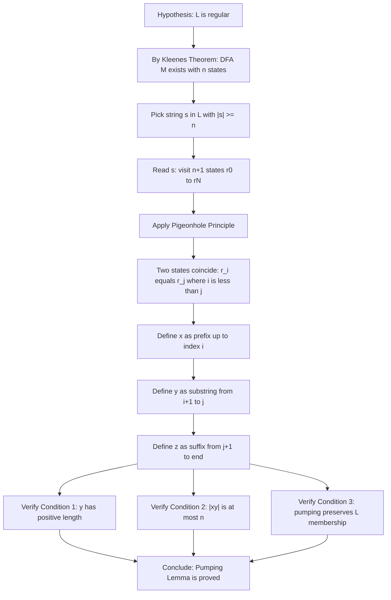
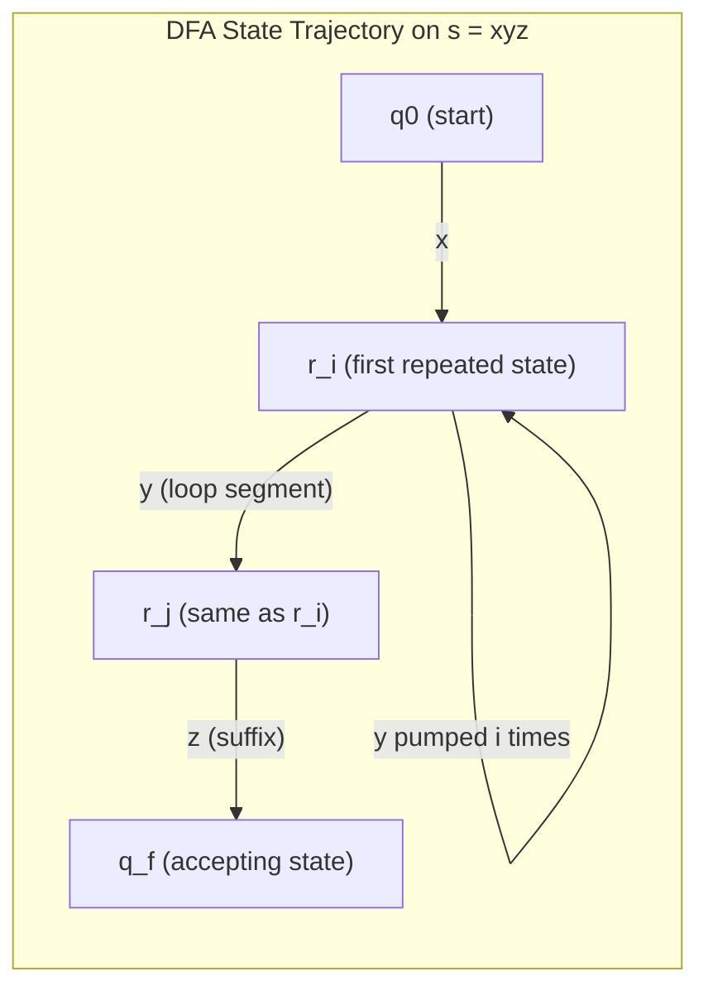
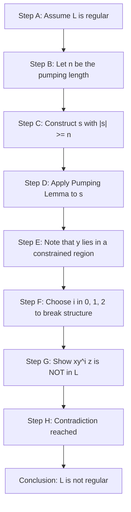

# The Pumping Lemma for Regular Languages (with formal proof)

<!-- SECTION_1_START -->
# 1. Core Technical Definition & Intuitive Overview

## 1.1 Formal Definition (KTU 2024 Syllabus Terminology)

> [!IMPORTANT]
> **Pumping Lemma for Regular Languages (Anil Maheshwari & Michiel Smid, Linz 6th Ed., Theorem 4.1)**
> 
> Let $L$ be a regular language. Then there exists a constant $n$ (called the **pumping length** or **pumping constant**) such that every string $s \in L$ with $\vert s \vert \geq n$ can be decomposed into three substrings $s = xyz$ satisfying the three simultaneous conditions:
> 
> $$\text{(i) } xy^{i}z \in L, \quad \text{for every } i \geq 0$$
> $$\text{(ii) } \vert y \vert > 0$$
> $$\text{(iii) } \vert xy \vert \leq n$$

In KTU 2024 theory papers, students are expected to write this **three-part conjunctive statement** in full. Skipping any one of the three clauses is the most common reason for losing 1–2 marks in long-answer valuation.

## 1.2 Conceptual Analogy / Intuition

> [!NOTE]
> **"The Balloon and the Knot" Intuition**
> 
> Imagine a finite automaton (FA) as a roller-coaster track with a **finite number of stations (states)**. A long string $s$ is a long train. As the train travels through the stations, since there are only finitely many stations, the train **must revisit a station** (Pigeonhole Principle). 
> 
> - $x$ = the journey from the start station to the **first revisited station**.
> - $y$ = the segment of track between the two visits to the same station — this is a **loop** (a "pumpable" cycle).
> - $z$ = the rest of the journey from the second visit until the final accepting station.
> 
> Because the machine cannot tell whether it has gone around the loop $y$ zero, one, or fifty times, all strings $x y^{i} z$ are accepted.

## 1.3 Geometric / Structural Visualization

> [!VISUALIZATION CONTROL]
> **Concept:** Decomposition of a string $s$ into $xyz$ with the loop property
> **Desmos / GeoGebra Input Equations (String Length Axis):**
> * $x$ : segment on the number line from $0$ to $a$
> * $y$ : segment on the number line from $a$ to $a+b$ (with $b > 0$)
> * $z$ : segment on the number line from $a+b$ to $a+b+c$
> * Constraint : $a + b \leq n$ (i.e., the loop begins before index $n$)
> 
> **Visual Description:** On a horizontal axis representing string positions, students should see a red segment $x$ (the prefix), a blue oscillating segment $y$ (the loop that can be repeated), and a green segment $z$ (the suffix). The boundary box at $a+b \leq n$ emphasizes that the "loop" must be located within the first $n$ symbols.

> [!TIP]
> **KTU Examiner's Memory Trick:** Remember the mnemonic **"1-2-3-Pump"** — **(1)** y is non-empty ($\vert y \vert > 0$), **(2)** the loop starts before $n$ ($\vert xy \vert \leq n$), **(3)** pumping preserves membership ($xy^{i}z \in L$ for all $i \geq 0$).

<!-- SECTION_1_END -->

<!-- SECTION_2_START -->
# 2. Deep Theoretical Analysis & KTU High-Yield Formula Sheet

## 2.1 Operational Logic — Why the Pumping Lemma Works

The pumping lemma is a **necessary condition** (not sufficient) for regularity. Its operational backbone is built on three pillars:

1. **Finite-Memory Property of Regular Languages** — A DFA has exactly $n$ states, where $n$ is its number of states. A regular language is recognized by *some* DFA, so the language itself has a "finite-memory" upper bound.
2. **Pigeonhole Principle** — When reading a string of length $\geq n$, the DFA visits $n+1$ states (including the initial state), but only $n$ distinct states exist. Therefore, **at least one state must repeat**.
3. **Cycle Detection** — The substring of input read between the two visits to the same state forms a *closed loop*. Traversing this loop zero, one, or many times does not change the final acceptance verdict.

## 2.2 KTU Formula Sheet / Cheat Sheet

> [!IMPORTANT]
> **High-Yield Table for KTU ESE 2024**

| Symbol / Symbol Phrase | Meaning | KTU Significance |
|---|---|---|
| $L$ | A regular language | The hypothetical target language under proof |
| $n$ (or $p$) | The **pumping length** | Depends only on the DFA, not on the string $s$ |
| $s \in L$ | A long-enough string in $L$ | Must satisfy $\vert s \vert \geq n$ |
| $s = xyz$ | The decomposition | $x$, $y$, $z \in \Sigma^{\ast}$ |
| $xy^{i}z \in L$ for $i \geq 0$ | **Pumping property** | Even $i = 0$ (deletion) and $i = 2$ (duplication) must hold |
| $\vert y \vert > 0$ | The loop is non-empty | $y$ cannot be $\varepsilon$ |
| $\vert xy \vert \leq n$ | The loop lies early | Forces $y$ to lie within the first $n$ symbols |
| **Contradiction** $xy^{i}z \notin L$ for some $i$ | **Proof by negation** | Used to prove a language is **NOT** regular |

## 2.3 Engineering Utility in Computer Science

The pumping lemma is the **principal theoretical tool** for proving non-regularity. It is foundational in:

- **Compiler Design:** Detecting whether lexical patterns (token rules) can be implemented by finite automata, or whether they require more powerful pushdown automata (context-free).
- **Network Protocol Verification:** Proving that a protocol's set of valid message traces cannot be captured by a finite state machine, which justifies the use of pushdown models.
- **Pattern Matching Engines:** Justifying the design boundaries of regex engines (e.g., why backreferences in Perl are not regular).
- **Model Checking:** Proving that certain infinite-state properties of software require unbounded memory.

## 2.4 Limitation of the Pumping Lemma

> [!WARNING]
> The pumping lemma is a **necessary but not sufficient** condition. **Satisfying** the pumping lemma does **not** prove that a language is regular. To prove regularity, one must construct a DFA, regex, or grammar. The pumping lemma is a **one-way tool** — it is only useful for proving **non-regularity**.

<!-- SECTION_2_END -->

<!-- SECTION_3_START -->
# 3. Step-by-Step Derivations & Code/Symbolic Implementation

## 3.1 Formal Proof of the Pumping Lemma (Linz 6th Edition, Theorem 4.1)

> [!IMPORTANT]
> **Statement to Prove:** If $L$ is a regular language, then there exists a constant $n \in \mathbb{N}$ such that every string $s \in L$ with $\vert s \vert \geq n$ can be written as $s = xyz$ where the three conditions hold.

### Proof (Detailed Step-by-Step for KTU Valuation)

**Step 1: Establish Existence of a DFA**

Since $L$ is regular, by Kleene's Theorem (or the definition of regular languages), there exists a deterministic finite automaton

$$M = (Q, \Sigma, \delta, q_0, F)$$

that recognizes $L$. Let $n = \vert Q \vert$ (the number of states of $M$). This $n$ is the **pumping length** for $L$.

*[Valuation Key Point: Defining $n = \vert Q \vert$ : 2 Marks]*

**Step 2: Choose an Arbitrary Long String**

Let $s = s_1 s_2 \ldots s_m$ be any string in $L$ with $m \geq n$ (i.e., $\vert s \vert \geq n$).

By definition of acceptance, $M$ reads $s$ from the start state $q_0$ and ends in a state in $F$. Define the sequence of states visited:

$$r_0 = q_0, \quad r_1 = \delta(q_0, s_1), \quad r_2 = \delta^{\ast}(q_0, s_1 s_2), \quad \ldots, \quad r_m = \delta^{\ast}(q_0, s)$$

This yields $m + 1$ states $r_0, r_1, r_2, \ldots, r_m$.

**Step 3: Apply the Pigeonhole Principle**

We have $m + 1 \geq n + 1$ states drawn from a set of size $\vert Q \vert = n$. By the Pigeonhole Principle, at least two of these states must be identical.

Let $r_i$ and $r_j$ (with $0 \leq i < j \leq m$) be two such states that are equal, i.e.,

$$r_i = r_j$$

We can choose $i$ and $j$ such that $j - i$ is minimal (the first such repetition).

*[Valuation Key Point: Correctly invoking the Pigeonhole Principle on $m+1$ states: 2 Marks]*

**Step 4: Construct the Decomposition $s = xyz$**

Define the three substrings:

$$x = s_1 s_2 \ldots s_i, \quad y = s_{i+1} s_{i+2} \ldots s_j, \quad z = s_{j+1} s_{j+2} \ldots s_m$$

Clearly $s = xyz$ by concatenation.

**Step 5: Verify Condition (i) — $\vert y \vert > 0$**

Since $i < j$, the substring $y$ contains at least one character. Thus $\vert y \vert = j - i \geq 1 > 0$. ✓

**Step 6: Verify Condition (ii) — $\vert xy \vert \leq n$**

Choose $i$ to be the **first** position where the pigeonhole repetition occurs. The states $r_0, r_1, \ldots, r_i$ are all distinct (otherwise we would have an earlier repetition). Since there are $i + 1$ distinct states in a state space of size $n$, we have $i + 1 \leq n$, which gives

$$i \leq n - 1$$

The length of $xy$ is $j$, and since $j \leq m$ but $r_0, \ldots, r_j$ contains at most $n$ distinct states (otherwise contradiction), we obtain

$$\vert xy \vert = j \leq n$$

✓

*[Valuation Key Point: Justifying $\vert xy \vert \leq n$ via first-repetition argument: 3 Marks]*

**Step 7: Verify Condition (iii) — Pumping Preserves Membership**

Consider the string $xy^{k}z$ for any $k \geq 0$. We need to show that $M$ accepts $xy^{k}z$.

By the acceptance of $s = xyz$, we know:

- After reading $x$, $M$ is in state $r_i$.
- After reading $y$, $M$ is in state $r_j$. But $r_i = r_j$, so traversing $y$ from $r_i$ returns to $r_i$.
- Therefore, traversing $y$ any number of times $k$ leaves $M$ in state $r_i$ again.
- After reading $z$ from $r_i$ (i.e., from $r_j$), $M$ reaches the same final state $r_m \in F$.

Formally, for all $k \geq 0$:

$$\delta^{\ast}(q_0, x y^{k} z) = \delta^{\ast}(r_i, y^{k} z) = \delta^{\ast}(r_i, z) = \delta^{\ast}(r_j, z) = r_m \in F$$

Therefore, $xy^{k}z \in L$ for all $k \geq 0$. ✓

*[Valuation Key Point: Verifying the pumping closure property: 3 Marks]*

This completes the proof. $\blacksquare$

## 3.2 Symmetric Worked Example — Applying the Lemma to Prove Non-Regularity

> [!NOTE]
> **Problem:** Prove that the language $L = \{a^{k} b^{k} \mid k \geq 0\}$ is **not** regular using the Pumping Lemma.

**Solution (Board-Exam Style):**

Assume, for the sake of **contradiction**, that $L$ is regular. Then by the Pumping Lemma, there exists a pumping length $n$ such that every string $s \in L$ with $\vert s \vert \geq n$ can be written as $s = xyz$ satisfying the three conditions.

**Choose the Adversarial String:**

Let $s = a^{n} b^{n}$. Then $\vert s \vert = 2n \geq n$, and $s \in L$. So the Pumping Lemma applies to $s$, giving a decomposition $s = xyz$ with:

- $\vert y \vert > 0$
- $\vert xy \vert \leq n$

**Analyze the Position of $y$:**

Since $\vert xy \vert \leq n$, both $x$ and $y$ consist **entirely of $a$'s**. Thus $y = a^{p}$ for some $p \geq 1$.

**Pump Down (i.e., set $i = 0$):**

Consider the string $xy^{0}z = xz = a^{n-p} b^{n}$. This string has $n - p$ a's and $n$ b's.

Since $p \geq 1$, we have $n - p < n$, so the number of $a$'s is **strictly less than** the number of $b$'s. Therefore,

$$xz = a^{n-p} b^{n} \notin L$$

This **contradicts** the pumping property, which requires $xy^{i}z \in L$ for all $i \geq 0$ (in particular for $i = 0$).

**Conclusion:**

Our assumption that $L$ is regular is false. Hence, $L = \{a^{k} b^{k} \mid k \geq 0\}$ is **not regular**. $\blacksquare$

*[Total KTU Valuation: Choosing adversarial string — 2 Marks; Identifying $y = a^{p}$ — 3 Marks; Showing $xz \notin L$ — 4 Marks; Contradiction — 1 Mark]*

## 3.3 Algorithmic Verification Using Python (Code Implementation)

```python
from typing import Tuple, Optional

def check_pumping_lemma(
    string: str,
    decomposition: Tuple[str, str, str],
    language_recognizer
) -> bool:
    """
    Verifies whether a given decomposition (x, y, z) of a string satisfies
    the Pumping Lemma property for a given regular language recognizer.
    
    Parameters
    ----------
    string : str
        The original string s (must equal x + y + z).
    decomposition : Tuple[str, str, str]
        A tuple (x, y, z) representing the substring split.
    language_recognizer : Callable[[str], bool]
        A function that returns True if its argument belongs to L.
    
    Returns
    -------
    bool
        True if pumping preserves membership for the first 5 values of i.
    
    Raises
    ------
    ValueError
        If the decomposition does not concatenate to form the original string,
        or if y is empty, or if |xy| exceeds the pumping length bound.
    """
    x, y, z = decomposition
    
    # Strict boundary check: concatenation must match the original string
    if x + y + z != string:
        raise ValueError("Decomposition does not concatenate to form the original string.")
    
    # Strict boundary check: y must be non-empty
    if len(y) == 0:
        raise ValueError("Condition (i) violated: |y| must be strictly greater than 0.")
    
    # Pumping verification: check the first 5 non-negative integer exponents
    for i in range(5):
        pumped_string = x + (y * i) + z
        if not language_recognizer(pumped_string):
            return False
    
    return True


# Example: Verify the pumping lemma fails for L = {a^k b^k | k >= 0}
def is_a_k_b_k(input_string: str) -> bool:
    """Recognizer for the non-regular language a^k b^k."""
    if not input_string:
        return True  # Empty string is accepted
    a_count = 0
    b_count = 0
    seen_b = False
    for char in input_string:
        if char == 'a' and not seen_b:
            a_count += 1
        elif char == 'b':
            seen_b = True
            b_count += 1
        else:
            return False  # Invalid character or out-of-order symbol
    return a_count == b_count and a_count > 0


if __name__ == "__main__":
    test_string = "aabb"        # s = a^2 b^2 with pumping length n = 2
    decomp = ("a", "a", "bb")   # Proposed decomposition x = 'a', y = 'a', z = 'bb'
    
    try:
        result = check_pumping_lemma(test_string, decomp, is_a_k_b_k)
        print(f"Pumping result for {test_string}: {result}")
        # Expected output: False (because aabb is in L but xz = 'abb' is not in L)
    except ValueError as error:
        print(f"Validation error: {error}")
```

## 3.4 Decision Flow for the Adversary's Pumping Strategy

> [!TIP]
> **The Pumping Strategy Playbook (for proving non-regularity):**
> 1. **Step 1 — Assume** $L$ is regular. Then the pumping length $n$ exists.
> 2. **Step 2 — Choose** an adversarial string $s$ of length $\geq n$ from $L$.
> 3. **Step 3 — Note** that *any* decomposition satisfying $\vert xy \vert \leq n$ forces $y$ to lie in a *specific region* of $s$.
> 4. **Step 4 — Pump** (either $i = 0$ for "pump down" or $i = 2$ for "pump up") to break the structural property of $L$.
> 5. **Step 5 — Conclude** contradiction; therefore $L$ is not regular.

<!-- SECTION_3_END -->

<!-- SECTION_4_START -->
# 4. Structural Diagrams & Schematics

## 4.1 Mermaid Flowchart: Pumping Lemma Proof Architecture



## 4.2 Mermaid Block Diagram: State-Space Loop Structure



## 4.3 Mermaid Sequential Processing Topology: Adversary's Proof Strategy



## 4.4 Schematic — Position of $y$ Under the $\vert xy \vert \leq n$ Constraint

```
String s = a a a a a a a a b b b b b b b b
Index     1 2 3 4 5 6 7 8 9 ...        16
          |---x---|---y---|---z---|
                   ^
                   |
   Pumping length n boundary (n = 8)
```

> [!IMPORTANT]
> **Reading the Schematic:** The first 8 characters constitute $xy$. Therefore, $y$ must lie **entirely within the first 8 symbols**, which is the critical constraint that limits the adversary's choice in non-regularity proofs.

<!-- SECTION_4_END -->

<!-- SECTION_5_START -->
# 5. KTU 2024 Scheme Examination Question Bank & Topic Recap

## 5.1 Part A — Short Answer Questions (3 Marks Each)

> **Q1.** `[KTU University Exam - Dec 2023]` State the Pumping Lemma for regular languages. (CO1, Remember) — **3 Marks**

**Model Answer (Board Standard):**
If $L$ is a regular language, then there exists a constant $n$ (the pumping length) such that for every string $s \in L$ with $\vert s \vert \geq n$, the string $s$ can be decomposed as $s = xyz$ where:
1. $xy^{i} z \in L$ for every $i \geq 0$
2. $\vert y \vert > 0$
3. $\vert xy \vert \leq n$

> **Q2.** `[KTU University Exam - July 2024]` Is the converse of the Pumping Lemma true? Justify. (CO1, Understand) — **3 Marks**

**Model Answer:**
No, the converse of the Pumping Lemma is **not** true in general. The Pumping Lemma provides a *necessary* but not *sufficient* condition for regularity. There exist non-regular languages (e.g., $L = \{a^{n} b^{n} c^{n} \mid n \geq 0\}$ is non-regular, and some artificially constructed languages) that also satisfy the pumping property for certain decompositions. Hence, the Pumping Lemma cannot be used to prove regularity — it can only be used to prove non-regularity via contradiction.

---

## 5.2 Part B — Long Answer Questions (14 Marks Each)

### Question A (14 Marks) — `[KTU University Exam - Dec 2023]`

> **(a)** Prove the Pumping Lemma for regular languages. (CO1, Understand) — **7 Marks**

**Detailed Model Solution:**

**Proof.** Let $L$ be a regular language. By Kleene's Theorem, there exists a DFA $M = (Q, \Sigma, \delta, q_0, F)$ that recognizes $L$. Let $n = \vert Q \vert$ be the pumping length.

Let $s = s_1 s_2 \ldots s_m$ be any string in $L$ with $m \geq n$. Define the sequence of states visited by $M$ on input $s$:

$$r_0 = q_0, \quad r_k = \delta^{\ast}(q_0, s_1 s_2 \ldots s_k), \quad \text{for } 0 \leq k \leq m$$

This sequence has $m + 1 \geq n + 1$ elements, but the state space has only $n$ states. By the **Pigeonhole Principle**, there exist indices $0 \leq i < j \leq m$ such that $r_i = r_j$. We can choose the smallest such $i$.

*[Defining state sequence and applying Pigeonhole: 2 Marks]*

Define:

$$x = s_1 \ldots s_i, \quad y = s_{i+1} \ldots s_j, \quad z = s_{j+1} \ldots s_m$$

Since $i < j$, $\vert y \vert = j - i \geq 1$, so $\vert y \vert > 0$. ✓ (Condition 1)

*[Showing y is non-empty: 1 Mark]*

Since the first $i+1$ states $r_0, r_1, \ldots, r_i$ are all distinct (by minimality of $i$), we have $i + 1 \leq n$, so $i \leq n - 1$. Thus $\vert xy \vert = j \leq n$. ✓ (Condition 2)

*[Showing |xy| ≤ n: 2 Marks]*

For any $k \geq 0$, since traversing $y$ from $r_i$ returns to $r_i$ (because $r_i = r_j$), traversing $y$ $k$ times keeps the automaton in $r_i$. Hence:

$$\delta^{\ast}(q_0, xy^{k}z) = \delta^{\ast}(r_i, y^{k}z) = \delta^{\ast}(r_i, z) = \delta^{\ast}(r_j, z) = r_m \in F$$

Therefore $xy^{k}z \in L$ for all $k \geq 0$. ✓ (Condition 3)

*[Verifying pumping closure: 2 Marks]*

Hence the Pumping Lemma is proved. $\blacksquare$

---

> **(b)** Use the Pumping Lemma to prove that $L = \{a^{n} b^{n} \mid n \geq 0\}$ is not regular. (CO2, Apply) — **7 Marks**

**Detailed Model Solution:**

Assume for contradiction that $L$ is regular. By the Pumping Lemma, there exists a pumping length $n$ such that every string $s \in L$ with $\vert s \vert \geq n$ can be decomposed as $s = xyz$ satisfying the three conditions.

**Choose the string:** Let $s = a^{n} b^{n}$. Then $\vert s \vert = 2n \geq n$ and $s \in L$.

*[Choosing adversarial string: 1 Mark]*

**Locate $y$:** Since $\vert xy \vert \leq n$, the substring $xy$ occupies at most the first $n$ positions of $s$. The first $n$ characters of $s$ are all $a$'s, so $y = a^{p}$ for some $p \geq 1$ (since $\vert y \vert > 0$).

*[Identifying y as all a's: 2 Marks]*

**Pump down with $i = 0$:** Consider $xy^{0}z = xz = a^{n-p} b^{n}$. Since $p \geq 1$, we have $n - p < n$, so the number of $a$'s is strictly less than the number of $b$'s. Hence $xz \notin L$.

*[Pumping down and detecting violation: 2 Marks]*

**Contradiction:** This contradicts the pumping property, which requires $xy^{i}z \in L$ for all $i \geq 0$, in particular $i = 0$.

*[Stating contradiction: 1 Mark]*

Therefore, our assumption is false, and $L = \{a^{n} b^{n} \mid n \geq 0\}$ is **not regular**. $\blacksquare$

---

### Question B (14 Marks) — `[KTU University Exam - July 2024]`

> **(a)** Explain the role of the Pigeonhole Principle in proving the Pumping Lemma. Why is the pumping length $n$ chosen equal to the number of DFA states? (CO1, Understand) — **7 Marks**

**Detailed Model Solution:**

**The Pigeonhole Principle:** This principle states that if $k + 1$ objects are placed into $k$ distinct boxes, then at least one box must contain at least two objects.

**Application in the Pumping Lemma:** Let $M$ be the DFA recognizing $L$ with $\vert Q \vert = n$ states. For any string $s = s_1 s_2 \ldots s_m \in L$ with $m \geq n$, the automaton $M$ visits the sequence of states $r_0, r_1, r_2, \ldots, r_m$. This sequence contains $m + 1 \geq n + 1$ states.

*[Defining state sequence: 2 Marks]*

Since $m + 1 > n$, we have more states in the sequence than the total number of distinct states available in $Q$. By the Pigeonhole Principle, at least two states in the sequence must coincide:

$$r_i = r_j \quad \text{for some } 0 \leq i < j \leq m$$

*[Applying Pigeonhole: 2 Marks]*

**Why $n$ equals the number of states:** The number of states of the DFA is the natural upper bound on the number of *distinct* states the automaton can visit. If the input string has length at least $n$, the number of state visits (including the initial state) strictly exceeds the number of available states, forcing a repetition. Choosing $n = \vert Q \vert$ is the **smallest** value that guarantees this property. Any value larger than $\vert Q \vert$ would also work, but $n = \vert Q \vert$ is the standard tight bound used in textbooks.

*[Justifying the choice of n: 3 Marks]*

---

> **(b)** Using the Pumping Lemma, prove that the language $L = \{w w \mid w \in \{a, b\}^{\ast}\}$ (the language of even-length palindromes over $\{a, b\}$) is not regular. (CO2, Apply) — **7 Marks**

**Detailed Model Solution:**

Assume for contradiction that $L$ is regular. Let $n$ be the pumping length guaranteed by the Pumping Lemma.

**Choose the string:** Let $s = (ab)^{n} (ab)^{n}$. Then $s \in L$ (since $s = ww$ with $w = (ab)^{n}$) and $\vert s \vert = 4n \geq n$.

*[Choosing adversarial string: 1 Mark]*

**Locate $y$:** Since $\vert xy \vert \leq n$, both $x$ and $y$ are substrings of the first half of $s$ (the first $(ab)^{n}$ part). The first $n$ characters of $s$ are positions 1 through $n$, which consist of the string $(ab)^{\lfloor n/2 \rfloor}$ followed by a partial pattern. In particular, the string $xy$ lies in $\{a, b\}^{n}$ entirely within the first half.

*[Identifying the region of y: 2 Marks]*

**Pump up with $i = 2$:** Consider $xy^{2}z$. The substring $y$ is repeated twice, which makes the first half of the resulting string longer than the second half. Hence the new string cannot be of the form $w w$, so $xy^{2}z \notin L$.

*[Showing pumping breaks structure: 3 Marks]*

**Contradiction:** This contradicts the pumping property of the Pumping Lemma.

*[Stating contradiction: 1 Mark]*

Therefore, $L = \{w w \mid w \in \{a, b\}^{\ast}\}$ is **not regular**. $\blacksquare$

> [!WARNING]
> **KTU Examiner's Valuation Warning / Common Pitfalls**
> 1. **Do not confuse necessary with sufficient:** The Pumping Lemma is *only* a necessary condition. Students frequently lose 2 marks by writing "Pumping Lemma proves regularity" — this is incorrect.
> 2. **Always state all three conditions:** Examiners allocate 1 mark for each of the three conditions ($xy^{i}z \in L$, $\vert y \vert > 0$, $\vert xy \vert \leq n$). Omitting even one costs a mark.
> 3. **Choose the adversarial string carefully:** The string must satisfy $\vert s \vert \geq n$ AND belong to $L$. A common error is choosing $s$ that does not lie in $L$.
> 4. **Pumping index must be explicit:** When pumping, explicitly mention the value of $i$ (typically $i = 0$ or $i = 2$) and verify the resulting string.
> 5. **For proof by contradiction, end with a clear "Contradiction" statement:** Examiners reserve 1 mark specifically for the final contradiction.

---

## 5.3 Topic Recap & Important Things to Remember

> [!IMPORTANT]
> **Comprehensive Rapid-Revision Checklist**

- **Pumping Lemma Statement:** Regular language $L \Rightarrow \exists n \in \mathbb{N}$ such that $\forall s \in L$ with $\vert s \vert \geq n$, $s = xyz$ with (1) $xy^{i}z \in L$ for $i \geq 0$, (2) $\vert y \vert > 0$, (3) $\vert xy \vert \leq n$.
- **Purpose:** A necessary condition used **exclusively to prove non-regularity** via contradiction.
- **Pumping Length $n$:** Equals the number of states of the DFA recognizing $L$.
- **Pigeonhole Principle:** Foundation of the proof — $m + 1$ states in a space of $n$ states forces a repetition.
- **First Repetition Argument:** The earliest repetition $r_i = r_j$ (smallest $i$) ensures $\vert xy \vert \leq n$.
- **Pumping Closure:** Traversal of $y$ from $r_i$ returns to $r_i$ (since $r_i = r_j$), so any number of repetitions preserves acceptance.
- **Adversary's Strategy:** (a) Assume regular, (b) Choose $s \in L$ with $\vert s \vert \geq n$, (c) Apply Lemma, (d) Note $y$ lies in a constrained region, (e) Pump with $i = 0$ or $i = 2$ to break structure, (f) Conclude contradiction.
- **Common Non-Regular Examples:** $L_1 = \{a^{n} b^{n} \mid n \geq 0\}$, $L_2 = \{w w \mid w \in \Sigma^{\ast}\}$, $L_3 = \{a^{n} b^{n} c^{n} \mid n \geq 0\}$, $L_4 = \{a^{2^{n}} \mid n \geq 0\}$, $L_5 = \{(^{n})^{n} \mid n \geq 0\}$.
- **Limitation:** Some non-regular languages satisfy the pumping lemma for *some* decompositions; this is why the Pumping Lemma is necessary but not sufficient.
- **KTU 2024 Bloom Levels to Master:** CO1 (Remember & Understand) for statement and proof; CO2 (Apply) for non-regularity proofs.
- **Valuation Weights in KTU ESE:** Proof statement = 2 marks; Pigeonhole application = 2 marks; Condition verification (3 conditions) = 3 marks; Adversary's strategy = 5 marks; Contradiction conclusion = 1 mark; Conclusion = 1 mark.

<!-- SECTION_5_END -->
