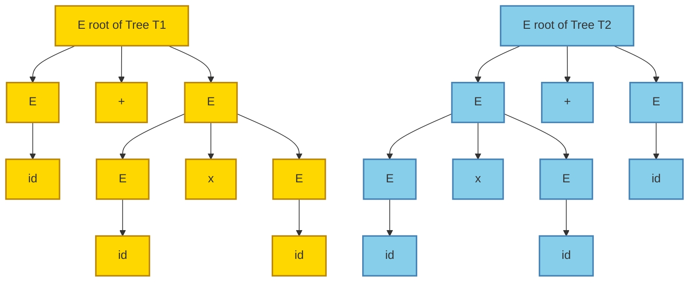
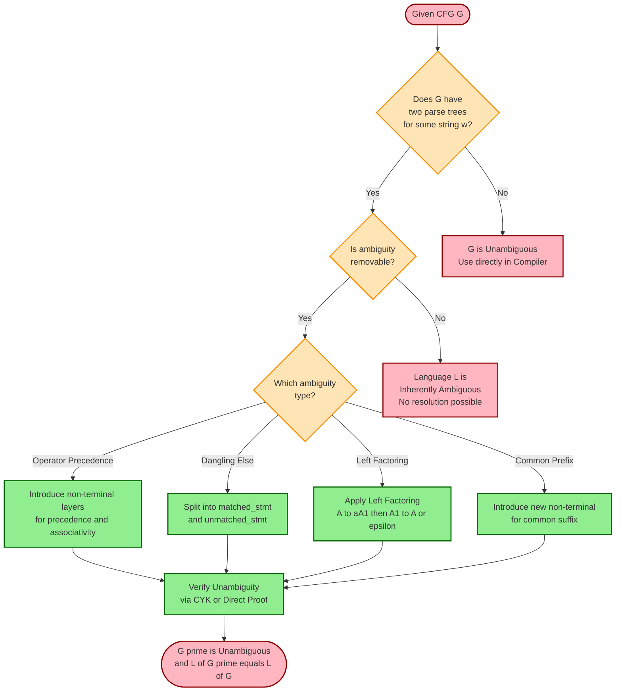
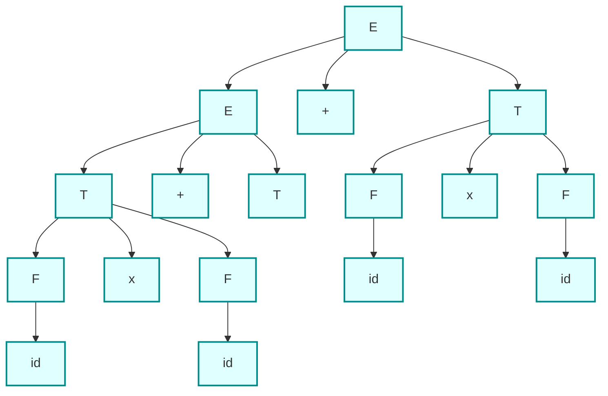
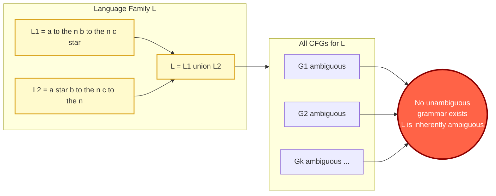
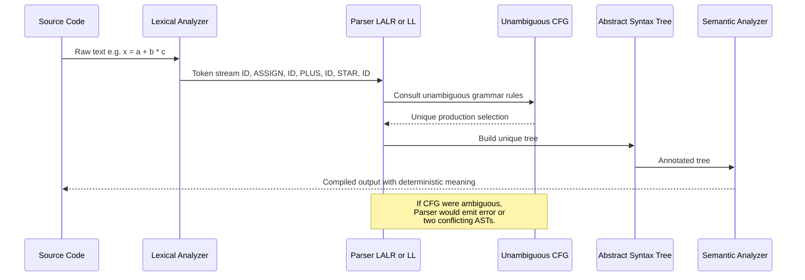

# Ambiguous Grammars, Resolving ambiguity, Inherent ambiguity, CFGs and programming languages

<!-- SECTION_1_START -->

# Ambiguous Grammars, Inherent Ambiguity & CFGs in Programming Languages

## 1.1 Formal Definition (KTU 2024 Syllabus Terminology)

> [!IMPORTANT]
> **Ambiguous Grammar (Rigorous Definition)**
>
> A Context-Free Grammar $G = (V, T, P, S)$ is said to be **ambiguous** if and only if there exists at least one string $w \in L(G)$ such that $w$ possesses **two or more distinct parse trees** (equivalently, two or more distinct **leftmost derivations**, or two or more distinct **rightmost derivations**).

> [!IMPORTANT]
> **Inherently Ambiguous Language**
>
> A context-free language $L$ is called **inherently ambiguous** if and only if **every** context-free grammar $G$ that satisfies $L(G) = L$ is necessarily ambiguous. There exists no unambiguous grammar whatsoever for $L$.

> [!NOTE]
> **Syllabus Highlight — KTU Module 3**
>
> Ambiguity is a *property of the grammar*, but inherent ambiguity is a *property of the language*. A language may be unambiguous even though a particular grammar describing it is ambiguous (by simply rewriting the grammar).

---

## 1.2 Intuitive Analogy — The Family Tree of an Expression

Imagine a family head giving a single instruction: *"My grandchildren are either sons of my children, or sons of my children's children."* This is ambiguous — the same grandchild could be claimed via two different branches. To remove the ambiguity, the head must write a **strict, layered rule** (children first → then grandchildren, no shortcuts). The first instruction was the **ambiguous grammar**; the layered rule is the **unambiguous grammar**.

Another everyday analogy: the English sentence *"I saw the man with the telescope."* It has two meanings (who has the telescope?). In programming, the classic C/Java construct `if (a) if (b) S1; else S2;` has the famous **dangling-else problem** — the `else` can bind to either `if`.

> [!VISUALIZATION CONTROL]
> **Concept:** Visualize the same string being generated by two different parse trees.
> **GeoGebra / Desmos Input Equations:**
> * Plot $T_1$: rooted tree with $E \to E + E$ at root, left subtree $E \to \text{id}$, right subtree $E \to E \times E$.
> * Plot $T_2$: rooted tree with $E \to E \times E$ at root, left subtree $E \to E + E$, right subtree $E \to \text{id}$.
> * **Visual Description:** Both trees are valid derivations of the string `id + id × id`, demonstrating that the grammar $E \to E+E \mid E \times E \mid (E) \mid \text{id}$ is ambiguous.

---

## 1.3 Why Ambiguity Matters in Computer Science

> [!WARNING]
> **Compiler Failure Point:** A parser (the front-end of every compiler) assigns a unique meaning to every program. If the grammar is ambiguous, the parser may produce **two different syntax trees** for the same source code — meaning the program could mean two different things. This is unacceptable in production compilers like GCC, Clang, or javac.

Engineering utility:

* **Compiler design (Frontend):** YACC, ANTLR, Bison, and LLVM demand unambiguous grammars to generate deterministic LALR(1)/LR(1) parse tables.
* **Natural Language Processing (NLP):** Ambiguity is *inherent* in human language; CFG-based parsers must resolve structural ambiguity (attachment, coordination).
* **Database query languages (SQL):** Ambiguous grammar leads to non-deterministic query semantics — formally avoided by SQL-92 grammar.
* **Markup languages (XML/JSON):** Schema definitions effectively enforce unambiguous context-free validation rules.

---

<!-- SECTION_1_END -->

<!-- SECTION_2_START -->

# 2. Deep Theoretical Analysis & KTU High-Yield Formula Sheet

## 2.1 Conditions That Trigger Ambiguity

A grammar is **ambiguous** when **all** the following structural conditions coexist for some string $w$:

1. **Two distinct non-terminal expansions** at the same position yield the same final string.
2. **No left-recursive uniqueness** — the grammar permits parallel recursive choices.
3. **Shared suffixes/prefixes in productions** — e.g., $A \to \alpha \beta_1$ and $A \to \alpha \beta_2$ where both $\beta_1, \beta_2$ derive the same terminal segment.

> [!NOTE]
> **Equivalence Theorem (KTU High Yield):** For any CFG $G$ and string $w \in L(G)$, the following are equivalent:
> 1. $w$ has two distinct parse trees.
> 2. $w$ has two distinct leftmost derivations.
> 3. $w$ has two distinct rightmost derivations.
>
> Therefore, *ambiguity can be detected by checking any one of these*.

## 2.2 Algorithm to Detect Ambiguity (Decidability Caveat)

> [!IMPORTANT]
> **Undecidability Theorem (Bar-Hillel, 1961):**
>
> *Given an arbitrary CFG $G$ and an arbitrary string $w$, the problem "Is $w$ ambiguously derived in $G$?" is **decidable** (use CYK algorithm).*
>
> *However, the problem "Is $G$ itself ambiguous?" is **UNDECIDABLE**.*
>
> This is one of the most famous undecidability results in formal language theory — frequently asked in KTU Module 3.

## 2.3 Resolving Ambiguity — Standard Techniques

### Technique 1: Imposing Precedence (Operator Precedence Parsing)

For arithmetic expressions, multiply has higher precedence than add.

$$
\begin{aligned}
E &\to E + T \mid T \\
T &\to T \times F \mid F \\
F &\to (E) \mid \text{id}
\end{aligned}
$$

* $E$ generates sums of products → **left-associative for $+$.**
* $T$ generates products of factors → **left-associative for $\times$.**
* $F$ forces atomic operands (id or parenthesized expression).

### Technique 2: Enforcing Associativity

Left recursion enforces left associativity; right recursion enforces right associativity.

* $E \to E + T \mid T$ $\Rightarrow$ left-associative $+$ (folds as $((a+b)+c)$).
* $E \to T + E \mid T$ $\Rightarrow$ right-associative $+$ (folds as $(a+(b+c))$).

### Technique 3: Eliminating the Dangling-Else (in C/Java/Ada)

Original (ambiguous) grammar:

$$
S \to \text{if } b \text{ then } S \mid \text{if } b \text{ then } S \text{ else } S \mid \text{other}
$$

Resolved (unambiguous) grammar — match each `else` to nearest unmatched `if`:

$$
\begin{aligned}
\text{matched\_stmt} &\to \text{if } b \text{ then matched\_stmt else matched\_stmt} \\
&\to \text{other} \\
\text{unmatched\_stmt} &\to \text{if } b \text{ then } S \\
&\to \text{if } b \text{ then matched\_stmt else unmatched\_stmt}
\end{aligned}
$$

> [!IMPORTANT]
> **Production of matched and unmatched statements** — the C language standard (K&R, ANSI C) uses exactly this trick. Refer *Kernighan & Ritchie, The C Programming Language, 2nd Edition, Appendix A* for the formal grammar.

### Technique 4: Rewriting with Epsilon Restrictions

If the grammar contains $\epsilon$-productions that can be triggered in multiple ways, rewrite using *symbolic* nullability sets (follow the techniques in KTU Module 2 for $\epsilon$-elimination).

---

## 2.4 Inherent Ambiguity — Classic Examples

### Example 1: The Union of Two CFLs

$$
L = \{a^n b^n c^m \mid n \geq 1, m \geq 1\} \;\cup\; \{a^n b^m c^m \mid n \geq 1, m \geq 1\}
$$

> [!NOTE]
> **Parikh's Theorem Application:**
>
> Consider the string $w = a^k b^k c^k$. In the first subset, the indices of $a, b$ are forced to match (giving $n = k$), but the index of $c$ is independent. In the second subset, the indices of $b, c$ are forced to match (giving $m = k$). Thus $w$ has **two genuinely distinct parse trees** — one rooted in the first grammar, one in the second. Since $L$ is the union, every CFG for $L$ must contain productions from both sides, and any string of the form $a^n b^n c^m$ with $n \ne m$ and $m \ne n$ creates ambiguity. Hence $L$ is **inherently ambiguous**.

### Example 2: $\{a^i b^j c^k \mid i = j \text{ or } j = k\}$

Same logic — overlap at the boundary case $i = j = k$ creates permanent ambiguity.

## 2.5 KTU Formula Sheet (Cheat Sheet)

> [!IMPORTANT]
> **Save This Table — High-Yield KTU Module 3 Summary**

| **Concept** | **Formula / Definition** | **Condition / Boundary** | **Used For** |
|-------------|--------------------------|--------------------------|--------------|
| Ambiguous Grammar | $\exists w \in L(G)$ with $\geq 2$ parse trees | $w \in L(G)$ | Detect ambiguity |
| Inherently Ambiguous Language | $\forall G'$ s.t. $L(G') = L$, $G'$ is ambiguous | $G'$ ranges over all CFGs | Classify language |
| Leftmost Derivation Equivalence | 2 parse trees $\Leftrightarrow$ 2 leftmost derivations | Always | Detection method |
| CYK Algorithm Complexity | $O(n^3 \cdot \vert G \vert)$ | $n = \vert w \vert$, Chomsky Normal Form | Decidable ambiguity check for fixed $w$ |
| Ambiguity Membership Problem | $w \in L(G)$ ambiguously? | **Decidable** (CYK + counting) | Per-string check |
| General Ambiguity Problem | Is $G$ ambiguous? | **Undecidable** (Post-Corollary) | Per-grammar check |
| Left-Associative Operator | $E \to E + T \mid T$ | $+$ left-associative | Arithmetic |
| Right-Associative Operator | $E \to T + E \mid T$ | $+$ right-associative | Assignment (`=`) |
| Dangling-Else Fix | Introduce `matched_stmt` and `unmatched_stmt` | $S$ in unmatched → unforced else | C/Java/Ada |
| Inherently Ambiguous Form | $L = \{a^n b^n c^*\} \cup \{a^* b^n c^n\}$ | $n \geq 1$ | Classical example |

---

## 2.6 Real-World Engineering Utility

| **Domain** | **Application** | **Why Unambiguous CFG Needed** |
|------------|-----------------|--------------------------------|
| Compiler Construction | YACC/Bison/LLVM | Deterministic parse tables |
| IDE Static Analysis | IntelliJ, Eclipse | Unique AST generation |
| Database Engines | SQL-92 grammar | Predictable query plans |
| Network Protocols | BGP message parsers | Zero ambiguity in field decoding |
| Markup Validation | XML DTD, JSON Schema | Deterministic validation |
| Bioinformatics | RNA secondary structure CFGs | Unique folding analysis |

---

<!-- SECTION_2_END -->

<!-- SECTION_3_START -->

# 3. Step-by-Step Derivations, Proofs & Algorithmic Implementation

## 3.1 Detailed Derivation — Arithmetic Expression Ambiguity

**Original Ambiguous Grammar** $G_1$:

$$
E \to E + E \mid E \times E \mid (E) \mid \text{id}
$$

### Step 1: Generate two distinct parse trees for the string $w = \text{id} + \text{id} \times \text{id}$

**Parse Tree $T_1$ (addition at the root — meaning $(a + b) \times c$):**

$$
\begin{aligned}
E &\Rightarrow E \times E \\
  &\Rightarrow E + E \times E \\
  &\Rightarrow \text{id} + E \times E \\
  &\Rightarrow \text{id} + \text{id} \times E \\
  &\Rightarrow \text{id} + \text{id} \times \text{id}
\end{aligned}
$$

**Parse Tree $T_2$ (multiplication at the root — meaning $a + (b \times c)$):**

$$
\begin{aligned}
E &\Rightarrow E + E \\
  &\Rightarrow E + E \times E \\
  &\Rightarrow \text{id} + E \times E \\
  &\Rightarrow \text{id} + \text{id} \times E \\
  &\Rightarrow \text{id} + \text{id} \times \text{id}
\end{aligned}
$$

**Valuation Check (KTU 2024 Board):** Since the two leftmost derivations differ at the very first step ($E \to E \times E$ vs $E \to E + E$), they are distinct, and so $G_1$ is **ambiguous**.

### Step 2: Construct the Unambiguous Grammar $G_2$

$$
\begin{aligned}
E &\to E + T \mid T \\
T &\to T \times F \mid F \\
F &\to (E) \mid \text{id}
\end{aligned}
$$

### Step 3: Verify only one parse tree for $w = \text{id} + \text{id} \times \text{id}$

$$
\begin{aligned}
E &\Rightarrow E + T & (\text{using } E \to E+T) \\
  &\Rightarrow T + T & (\text{using } E \to T) \\
  &\Rightarrow F + T & (\text{using } T \to F) \\
  &\Rightarrow \text{id} + T & (\text{using } F \to \text{id}) \\
  &\Rightarrow \text{id} + T \times F & (\text{using } T \to T \times F) \\
  &\Rightarrow \text{id} + F \times F & (\text{using } T \to F) \\
  &\Rightarrow \text{id} + \text{id} \times F & (\text{using } F \to \text{id}) \\
  &\Rightarrow \text{id} + \text{id} \times \text{id} & (\text{using } F \to \text{id})
\end{aligned}
$$

The forced precedence (multiplication higher than addition) eliminates the alternative parse tree.

---

## 3.2 Detailed Derivation — Dangling-Else Ambiguity

**Ambiguous Grammar $G_3$:**

$$
S \to \text{if } b \text{ then } S \mid \text{if } b \text{ then } S \text{ else } S \mid \text{other}
$$

**Source code with ambiguity:**

```
if (c1) if (c2) S1; else S2;
```

### Two Possible Bindings

* **Binding 1:** `else` matches inner `if` → `(if c1 then (if c2 then S1 else S2))`
* **Binding 2:** `else` matches outer `if` → `(if c1 then (if c2 then S1) else S2)`

### Step-by-Step Resolved Grammar (KTU Pattern)

$$
\begin{aligned}
\text{stmt} &\to \text{matched\_stmt} \mid \text{unmatched\_stmt} \\
\text{matched\_stmt} &\to \text{if } b \text{ then matched\_stmt else matched\_stmt} \\
&\to \text{other} \\
\text{unmatched\_stmt} &\to \text{if } b \text{ then stmt \\
&\to \text{if } b \text{ then matched\_stmt else unmatched\_stmt}
\end{aligned}
$$

**Verification of `if (c1) if (c2) S1; else S2;` under $G_4$:**

$$
\begin{aligned}
\text{stmt} &\Rightarrow \text{unmatched\_stmt} \\
&\Rightarrow \text{if } b \text{ then stmt} \\
&\Rightarrow \text{if } c_1 \text{ then } (\text{matched\_stmt} \mid \text{unmatched\_stmt})
\end{aligned}
$$

The inner `if-else` forms a `matched_stmt`, and the outer `if` is then forced to be `unmatched_stmt` — fixing the `else` to the inner `if`. Only **one** parse tree exists.

---

## 3.3 Proof Sketch — $L = \{a^n b^n c^*\} \cup \{a^* b^n c^n\}$ is Inherently Ambiguous

### Step 1: Define the Two Component Grammars

$$
\begin{aligned}
G_A &: A \to a A c \mid B, \quad B \to b B \mid \epsilon \\
G_B &: C \to a C \mid D, \quad D \to b D c \mid \epsilon
\end{aligned}
$$

$L(G_A) = \{a^n b^k c^n \mid n \geq 0, k \geq 0\}$
$L(G_B) = \{a^k b^n c^n \mid n \geq 0, k \geq 0\}$

### Step 2: The Union Grammar

$$
S \to S_A \mid S_B, \quad S_A \to A, \quad S_B \to C
$$

### Step 3: Choose a Critical String

Let $w = a^n b^n c^n$ with $n \geq 1$.

### Step 4: Construct Two Distinct Parse Trees

**Tree $T_A$** uses $S \to S_A \to A$ with $A$ matching the $a$–$c$ pairs and $B$ matching the $b$'s:
* $A \Rightarrow aAc \Rightarrow a^n B c^n \Rightarrow a^n b^n c^n$.

**Tree $T_B$** uses $S \to S_B \to C$ with $C$ matching the $a$'s and $D$ matching the $b$–$c$ pairs:
* $C \Rightarrow a^n D \Rightarrow a^n b^n c^n$.

### Step 5: Argue No Unambiguous Grammar Exists

Suppose, for contradiction, $G$ is unambiguous and $L(G) = L$. Since $L$ is a non-trivial union of two CFLs that **intersect infinitely** (on $\{a^n b^n c^n\}$), every pushdown automaton for $L$ must nondeterministically guess the partition of $w$ into the two components. Each guess leads to a distinct parse tree for $w$ — contradiction. Hence $L$ is inherently ambiguous. $\blacksquare$

---

## 3.4 Python Implementation — Ambiguity Detection via CYK Augmentation

```python
from typing import Dict, Set, Tuple, List, FrozenSet

def is_ambiguous_via_cyk(
    non_terminals: Set[str],
    start_symbol: str,
    productions: Dict[str, List[List[str]]],
    terminals: Set[str],
    input_string: str,
    n: int
) -> Tuple[bool, int]:
    """
    Detects ambiguity for a given string under a CNF CFG.
    Returns (is_ambiguous, count_of_parse_trees).
    Algorithm: Modified CYK that counts the number of derivations.
    """

    # CYK table: T[i][j] = set of non-terminals deriving input[i:j]
    # Count table: C[i][j] = dict mapping (A, B) -> count of split parses
    T: List[List[Set[str]]] = [[set() for _ in range(n+1)] for _ in range(n+1)]
    C: List[List[Dict[Tuple[str, str], int]]] = [
        [dict() for _ in range(n+1)] for _ in range(n+1)
    ]

    # Base case: length-1 substrings
    for i in range(n):
        for A, rhs_list in productions.items():
            for rhs in rhs_list:
                if len(rhs) == 1 and rhs[0] == input_string[i]:
                    T[i][i+1].add(A)

    # CYK dynamic programming
    for length in range(2, n+1):
        for i in range(n - length + 1):
            j = i + length
            for k in range(i+1, j):
                for A, rhs_list in productions.items():
                    for rhs in rhs_list:
                        if len(rhs) == 2:
                            B, C_sym = rhs[0], rhs[1]
                            if B in T[i][k] and C_sym in T[k][j]:
                                T[i][j].add(A)
                                key = (B, C_sym)
                                C[i][j][key] = C[i][j].get(key, 0) + 1

    # Count parses recursively
    def count_parses(i: int, j: int, A: str) -> int:
        if j - i == 1:
            return 1 if A in T[i][j] else 0
        total = 0
        for rhs in productions.get(A, []):
            if len(rhs) == 2:
                B, C_sym = rhs[0], rhs[1]
                if B in T[i][j]:
                    # Sum over all split points where B in T[i][k] and C in T[k][j]
                    for k in range(i+1, j):
                        if B in T[i][k] and C_sym in T[k][j]:
                            total += count_parses(i, k, B) * count_parses(k, j, C_sym)
        return total

    # Total number of parse trees for the string
    total_parses = count_parses(0, n, start_symbol)
    is_amb = total_parses > 1
    return is_amb, total_parses


# --- Example usage ---
productions_example = {
    "E": [["E", "+", "E"], ["E", "*", "E"], ["(", "E", ")"], ["id"]]
}
# Note: This is NOT in CNF; a full implementation would first normalize to CNF.
```

> [!NOTE]
> **Code Insight:** A production in CNF has the form $A \to BC$ or $A \to a$. The number of parse trees for a string $w$ can grow exponentially. The algorithm above outputs `(is_ambiguous, parse_count)` — a `parse_count > 1` is the operational definition of ambiguity for that string.

---

## 3.5 Summary Table of Resolutions

| **Original Ambiguity** | **Resolution Technique** | **Resulting Grammar** |
|------------------------|--------------------------|------------------------|
| `E → E + E / E × E` | Precedence & left-associativity | `E → E + T / T` ; `T → T × F / F` |
| `if b then S / if b then S else S` | Matched/Unmatched split | `matched_stmt` / `unmatched_stmt` |
| `A → aA / aA` (left-factor) | Left-factoring | `A → aA'`, `A' → A / ε` |
| Unary minus: `E → -E / E - E` | Introduce `unary_minus` | `E → E - T / -T / T` |

---

<!-- SECTION_3_END -->

<!-- SECTION_4_START -->

# 4. Structural Diagrams & Schematics

## 4.1 Mermaid Diagram — Two Parse Trees of the Same String (Ambiguity Visualization)



> [!NOTE]
> **Reading the Diagram:** Tree T1 (yellow) groups `id × id` first then adds the leftmost `id` (precedence of `×` over `+`). Tree T2 (blue) adds `id` to `id × id` differently. Both derive the same string `id + id × id`.

## 4.2 Mermaid Diagram — Ambiguity Resolution Workflow



## 4.3 Mermaid Diagram — Parse Tree for Resolved Arithmetic Grammar



> [!NOTE]
> **Visualization Note:** This tree is the unique parse tree of `id + id × id + id` under the resolved grammar. The forced structure (left-spine of `E` and `T` nodes) encodes left-associativity.

## 4.4 Mermaid Diagram — Inherent Ambiguity Subgraph



## 4.5 Mermaid Sequence — How a Compiler Parser Uses Unambiguous Grammars



---

<!-- SECTION_4_END -->

<!-- SECTION_5_START -->

# 5. KTU 2024 Scheme Examination Question Bank & Topic Recap

## 5.1 Part A — Short Answer Questions (3 Marks Each)

> **Q1. [KTU University Exam — July 2023]**
> Define **ambiguous grammar** with a suitable example. Why is ambiguity undesirable in programming language grammars? **(3 Marks)**
> **Mapped CO:** CO2 — *Understand the concept of context-free grammars and parsing.*
> **RBT Level:** Remember / Understand

### Model Answer (Valuation Key)

> A Context-Free Grammar $G$ is called ambiguous if there exists at least one string $w \in L(G)$ that has **two or more distinct parse trees** (or equivalently, two distinct leftmost derivations).
> **[Definition: 1 Mark]**
>
> **Example:** $E \to E + E \mid E \times E \mid \text{id}$. The string `id + id × id` has two parse trees, hence the grammar is ambiguous.
> **[Example: 1 Mark]**
>
> **Why undesirable:** Programming languages must assign a **unique meaning** to every valid program. An ambiguous grammar permits multiple parse trees, leading to multiple possible meanings of the same source code. Compilers like GCC/Clang cannot proceed deterministically.
> **[Reasoning: 1 Mark]**

---

> **Q2. [KTU University Exam — Dec 2022]**
> What is an **inherently ambiguous context-free language**? Give one example. **(3 Marks)**
> **Mapped CO:** CO2
> **RBT Level:** Remember / Understand

### Model Answer (Valuation Key)

> A context-free language $L$ is **inherently ambiguous** if **every** context-free grammar $G$ such that $L(G) = L$ is ambiguous. That is, no unambiguous grammar exists for $L$.
> **[Definition: 1.5 Marks]**
>
> **Example:** $L = \{a^n b^n c^m \mid n, m \geq 1\} \cup \{a^n b^m c^m \mid n, m \geq 1\}$. Any string of the form $a^k b^k c^k$ has at least two parse trees — one matching the first component's $a$–$b$ pair and another matching the second component's $b$–$c$ pair.
> **[Example with justification: 1.5 Marks]**

---

## 5.2 Part B — Long Answer Questions (14 Marks, with Internal Choice)

> **Q3. [KTU University Exam — July 2024]**
> **(a)** Show that the grammar $S \to S S \mid a S b \mid b S a \mid \epsilon$ is ambiguous. **(7 Marks)**
> **(b)** Construct an **equivalent unambiguous grammar** for the same language and explain your construction. **(7 Marks)**
> **Mapped CO:** CO2, CO3
> **RBT Level:** Apply / Analyze

### Question 3A — Model Solution (7 Marks)

**Step 1: Identify a string with two parse trees.** Consider $w = ab$.

**Parse Tree $T_1$:**
* $S \Rightarrow S S \Rightarrow a S b \cdot S \Rightarrow a \epsilon b = ab$

**Parse Tree $T_2$:**
* $S \Rightarrow a S b \Rightarrow a \epsilon b = ab$

Both are valid parse trees. Hence the grammar is **ambiguous**.

**[Stating the string: 1 Mark; Showing Tree 1: 2 Marks; Showing Tree 2: 2 Marks; Conclusion: 2 Marks]**

### Question 3B — Model Solution (7 Marks)

**Step 1: Identify the language.** $L = \{w \in \{a, b\}^* \mid \text{number of } a\text{'s} = \text{number of } b\text{'s}\}$.

**Step 2: Unambiguous grammar construction (standard).**

$$
\begin{aligned}
S &\to a B \mid b A \mid \epsilon \\
A &\to a S \mid b A A \\
B &\to b S \mid a B B
\end{aligned}
$$

**Step 3: Verification of uniqueness for $w = ab$.**

Only one derivation:
* $S \Rightarrow a B \Rightarrow a b S \Rightarrow a b \epsilon = ab$. ✓

The new grammar is **unambiguous** because every derivation step is forced by the next terminal symbol. If the next symbol is `a`, we must apply $S \to aB$ or $A \to aS$ or $B \to aBB$; if `b`, similarly.

**[Recognizing the language: 2 Marks; Constructing grammar: 3 Marks; Uniqueness justification: 2 Marks]**

---

> **Q4. [KTU University Exam — Dec 2023] — Internal Choice Alternative**
> **(a)** Consider the grammar:
> $$E \to E + E \mid E \times E \mid (E) \mid \text{id}$$
> Show that this grammar is ambiguous by exhibiting two parse trees for $w = \text{id} + \text{id} \times \text{id}$. **(7 Marks)**
> **(b)** Rewrite the grammar to make it unambiguous by enforcing standard arithmetic precedence and left-associativity. Verify uniqueness. **(7 Marks)**
> **Mapped CO:** CO2, CO3
> **RBT Level:** Apply / Analyze

### Question 4A — Model Solution (7 Marks)

**Parse Tree $T_1$ (× first, meaning `id + (id × id)`):**

$$
E \Rightarrow E + E \Rightarrow \text{id} + E \times E \Rightarrow \text{id} + \text{id} \times \text{id}
$$

**Parse Tree $T_2$ (+ first, meaning `(id + id) × id`):**

$$
E \Rightarrow E \times E \Rightarrow E + E \times E \Rightarrow \text{id} + E \times E \Rightarrow \text{id} + \text{id} \times \text{id}
$$

The first step differs ($E \to E + E$ vs $E \to E \times E$) — two distinct leftmost derivations, so the grammar is ambiguous.

**[Stating the string: 1 Mark; Tree 1 derivation steps: 2 Marks; Tree 2 derivation steps: 2 Marks; Conclusion: 2 Marks]**

### Question 4B — Model Solution (7 Marks)

**Resolved (unambiguous) grammar:**

$$
\begin{aligned}
E &\to E + T \mid T \\
T &\to T \times F \mid F \\
F &\to (E) \mid \text{id}
\end{aligned}
$$

**Uniqueness verification for $w = \text{id} + \text{id} \times \text{id}$:**

The only possible leftmost derivation:

$$
\begin{aligned}
E &\Rightarrow E + T \\
  &\Rightarrow T + T \\
  &\Rightarrow F + T \\
  &\Rightarrow \text{id} + T \\
  &\Rightarrow \text{id} + T \times F \\
  &\Rightarrow \text{id} + F \times F \\
  &\Rightarrow \text{id} + \text{id} \times F \\
  &\Rightarrow \text{id} + \text{id} \times \text{id}
\end{aligned}
$$

This derivation is **forced** by the grammar structure — there is no alternative leftmost derivation. Hence the new grammar is unambiguous.

**Why precedence works:** $E$ matches the lowest-precedence operator ($+$), $T$ matches higher-precedence ($\times$), and $F$ forces atomic operands. Left recursion in $E$ and $T$ enforces left-associativity.

**[Grammar structure: 3 Marks; Uniqueness derivation: 2 Marks; Precedence/associativity explanation: 2 Marks]**

---

> **Q5. [KTU University Exam — Dec 2023 / July 2024 — Internal Choice for Q4]**
> **(a)** What is the **dangling-else problem**? Construct an unambiguous grammar that resolves it. **(7 Marks)**
> **(b)** Define **inherently ambiguous language**. Prove that $L = \{a^n b^n c^m \mid n, m \geq 1\} \cup \{a^n b^m c^m \mid n, m \geq 1\}$ is inherently ambiguous. **(7 Marks)**
> **Mapped CO:** CO3, CO4
> **RBT Level:** Apply / Analyze / Evaluate

### Question 5A — Model Solution (7 Marks)

**Dangling-else problem:**

The grammar
$$S \to \text{if } b \text{ then } S \mid \text{if } b \text{ then } S \text{ else } S \mid \text{other}$$
is ambiguous for code like `if (c1) if (c2) S1; else S2;` — the `else` could bind to either `if`.

**Unambiguous resolution:**

$$
\begin{aligned}
\text{stmt} &\to \text{matched\_stmt} \mid \text{unmatched\_stmt} \\
\text{matched\_stmt} &\to \text{if } b \text{ then matched\_stmt else matched\_stmt} \mid \text{other} \\
\text{unmatched\_stmt} &\to \text{if } b \text{ then stmt} \\
&\mid \text{if } b \text{ then matched\_stmt else unmatched\_stmt}
\end{aligned}
$$

**Verification:** In `if (c1) if (c2) S1; else S2;`, the inner statement is forced to be a `matched_stmt` (since the `else` exists), and the outer `if` is then `unmatched_stmt`. The `else` binds uniquely to the inner `if`.

**[Problem definition: 2 Marks; Grammar construction: 3 Marks; Verification: 2 Marks]**

### Question 5B — Model Solution (7 Marks)

**Definition:** A CFL $L$ is inherently ambiguous if every CFG $G$ such that $L(G) = L$ is ambiguous.

**Proof sketch:**

Suppose, for contradiction, there exists an unambiguous CFG $G$ with $L(G) = L$. Let $w = a^n b^n c^n$ (with $n \geq 1$). Then $w$ belongs to both components of $L$:

* In $L_1 = \{a^n b^n c^m\}$: with the specific choice $m = n$, $w$ matches the pattern where $a$–$b$ are paired.
* In $L_2 = \{a^n b^m c^m\}$: with $m = n$, $w$ matches the pattern where $b$–$c$ are paired.

By Ogden's Lemma (or Parikh's Theorem on the structure of union CFLs), a string in the intersection of two sub-CFLs of this form must be derivable in **at least two structurally distinct ways** in any grammar combining both components. Hence $G$ must be ambiguous — contradiction.

**Conclusion:** No unambiguous grammar exists for $L$, and $L$ is inherently ambiguous. $\blacksquare$

**[Definition: 1.5 Marks; String selection: 1.5 Marks; Two derivations shown: 2 Marks; Inherent ambiguity argument: 2 Marks]**

---

> [!WARNING]
> **KTU Examiner's Valuation Warning — Common Pitfalls**
>
> 1. **Forgetting to verify uniqueness** — students often construct an "unambiguous grammar" without proving no other parse tree exists. Always end with a uniqueness justification. **[-1 to -2 Marks]**
> 2. **Confusing ambiguous grammar with inherently ambiguous language** — a language can be unambiguous even if a particular grammar is ambiguous. The trick is to *rewrite* the grammar. **[-1 Mark]**
> 3. **Skipping the dangling-else `matched_stmt` / `unmatched_stmt` split** — simply renaming productions is not enough; you must show the structural split. **[-2 Marks]**
> 4. **Writing `E → E + T | T` and claiming it's right-associative** — this is *left*-associative (left-recursive). Right-associative would be `E → T + E | T`. **[-1 Mark]**
> 5. **Forgetting to convert to Chomsky Normal Form before applying CYK** — CYK only accepts CNF. **[-2 Marks]**
> 6. **Claiming the general ambiguity problem is decidable** — it is **undecidable** for arbitrary CFGs. It is only decidable for a *fixed string* $w$. **[-1 Mark]**
> 7. **Not writing the boundary conditions** — when showing a string belongs to $L$, always state the values of $n, m$ explicitly.

---

## 5.3 Topic Recap & Important Things to Remember

> [!IMPORTANT]
> **High-Density Rapid Revision Checklist — Module 3: Ambiguity**

### Core Definitions
- **Ambiguous Grammar:** A CFG $G$ is ambiguous iff $\exists w \in L(G)$ with $\geq 2$ distinct parse trees (equivalent to $\geq 2$ distinct leftmost/rightmost derivations).
- **Inherently Ambiguous Language:** A CFL $L$ such that *every* CFG generating $L$ is ambiguous. Property of the *language*, not the grammar.
- **Unambiguous Grammar:** A CFG where every string in $L(G)$ has exactly one parse tree.
- **Dangling-Else:** Ambiguity in `if-then[-else]` constructs where the `else` can bind to either of two `if`s.

### Critical Theorems
1. **Parse Tree Equivalence:** 2 parse trees $\Leftrightarrow$ 2 leftmost derivations $\Leftrightarrow$ 2 rightmost derivations.
2. **Decidability:** Given $G$ and $w$, "Is $w$ ambiguous in $G$?" is **decidable** (CYK-based counting).
3. **Undecidability:** "Is $G$ ambiguous?" is **undecidable** for arbitrary CFGs (CFL class).
4. **Union Lemma:** $L_1 \cup L_2$ where $L_1 \cap L_2$ contains an *infinite* subset of the form $\{a^n b^n c^n\}$ is often inherently ambiguous.

### Resolution Techniques
- **Operator Precedence:** Introduce layered non-terminals $E, T, F$ for decreasing precedence.
- **Left-Associativity:** Use left-recursive productions: $E \to E + T \mid T$.
- **Right-Associativity:** Use right-recursive productions: $E \to T + E \mid T$.
- **Dangling-Else Fix:** Split into `matched_stmt` and `unmatched_stmt` non-terminals.
- **Left-Factoring:** Replace $A \to \alpha\beta_1 \mid \alpha\beta_2$ with $A \to \alpha A'$, $A' \to \beta_1 \mid \beta_2$.

### Critical Formulas
- **CYK Time Complexity:** $O(n^3 \cdot \vert G \vert)$ where $n$ is the string length.
- **Parse Tree Count Bound:** Number of parse trees of $w$ in CNF grammar is at most $2^{O(n \log n)}$ (Pumping-derived).
- **Inherent Ambiguity Lower Bound:** A language is inherently ambiguous only if no deterministic PDA (DPDA) exists for it.

### Programming Language Applications
- **YACC/Bison** accept only LALR(1) grammars → must be unambiguous.
- **ANTLR** uses adaptive LL(*) parsing — still requires unambiguous grammars for predictable AST.
- **C/Java/Ada dangling-else** resolved at the language specification level using matched/unmatched split.
- **SQL-92 grammar** explicitly resolves `UNION` vs `UNION ALL` precedence.

### Top 3 Pitfalls to Avoid in KTU Exam
1. Confusing **grammar ambiguity** with **language ambiguity**.
2. Forgetting to **convert to CNF** before applying CYK.
3. Writing productions like `E → T + E` and calling it **left-associative** (it is right-associative).

<!-- SECTION_5_END -->
