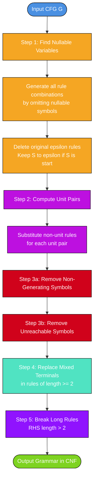
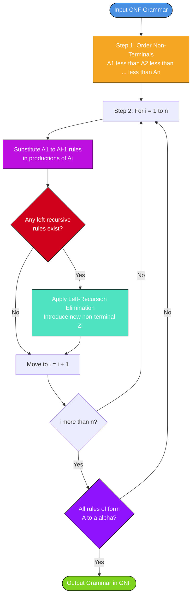
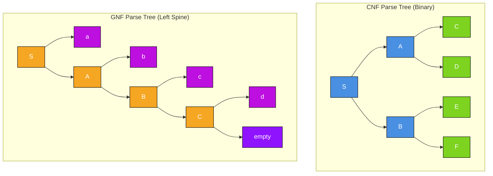

# Chomsky Normal Form (CNF), Greibach Normal Form (GNF)

<!-- SECTION_1_START -->

# 📘 Module 3: Context-Free Grammars and Pushdown Automata

## Topic: Chomsky Normal Form (CNF) & Greibach Normal Form (GNF)

> [!IMPORTANT]
> **Syllabus Highlight (KTU PCCST302 - Module 3):**
> Normal forms are canonical representations of context-free grammars that simplify the structural analysis of derivations. CNF is essential for the **CYK (Cocke-Younger-Kasami) parsing algorithm** and **closure properties**, while GNF is foundational for converting CFGs into **Pushdown Automata (PDA)**. Both are board-favorite topics for the 14-mark derivation questions.

---

### 1.1 Chomsky Normal Form (CNF) — Formal Definition

> [!NOTE]
> **Definition (Chomsky Normal Form):**
> A Context-Free Grammar $G = (V, T, P, S)$ is said to be in **Chomsky Normal Form (CNF)** if every production rule in $P$ is of one of the following two forms:
>
> 1. $A \rightarrow BC$ — where $A, B, C \in V$ (non-terminals) and $B, C$ are *not* the start variable.
> 2. $A \rightarrow a$ — where $a \in T$ (a single terminal symbol).
>
> Additionally, if $\epsilon$ is in the language $L(G)$, then the rule $S \rightarrow \epsilon$ is permitted, where $S$ is the start symbol.

#### 🧠 Intuitive Analogy

Imagine a **factory assembly line** that builds sentences. Chomsky Normal Form says: *"Every sentence in our factory must be built in tiny, standardized atomic units."*

- Each **$A \rightarrow BC$** rule is like a worker who combines **exactly two sub-assemblies (non-terminals)** to form a new part.
- Each **$A \rightarrow a$** rule is the final stamping press that turns a single sub-assembly into an **end product (terminal)**.

No worker is allowed to combine three sub-assemblies at once, and no worker can produce "nothing" (empty) unless they are the foreman (start symbol) handling the trivial empty box.

---

### 1.2 Greibach Normal Form (GNF) — Formal Definition

> [!NOTE]
> **Definition (Greibach Normal Form):**
> A Context-Free Grammar $G = (V, T, P, S)$ is said to be in **Greibach Normal Form (GNF)** if every production rule in $P$ is of the form:
>
> $$A \rightarrow a\alpha$$
>
> where $a \in T$ is a single terminal symbol, and $\alpha \in V^{*}$ is a (possibly empty) string of non-terminals.

#### 🧠 Intuitive Analogy

Think of a **compiler's lexical-syntactic pipeline**. GNF is the **"terminal-first"** contract: *"The moment you commit to a production, the very first symbol on the right side MUST be a terminal (a finished token)."*

- This is a strict, **leftmost-derivation-friendly** format.
- It guarantees that in a single derivation step, the **leftmost symbol becomes terminal** — exactly mimicking how a **PDA pops terminals from the input** while manipulating stack symbols.

> [!IMPORTANT]
> **Geometric/Structural Insight:**
> - In CNF, the parse tree is always a **full binary tree** (every internal node has exactly two children, except leaves which are terminals). Tree height directly bounds derivation length: $h = O(\log n)$.
> - In GNF, the parse tree's leftmost branch has height exactly equal to the number of derivation steps, making the derivation length proportional to the string length $n$.

---

### 1.3 Visualizing the Structural Differences

> [!VISUALIZATION CONTROL]
> **Concept:** Parse tree shape comparison between CNF and GNF derivations
> **Sample Input:** A derivation generating the string $a_1 a_2 a_3 a_4$ from start symbol $S$
> **Visual Description:**
> - For CNF, picture a **binary tree** with internal nodes labeled by non-terminals; every internal node splits into exactly two children. The height is logarithmic in the number of leaves.
> - For GNF, picture a **right-skewed left spine**: the leftmost path from the root terminates in 4 steps, with each step introducing exactly one terminal at the front.

---

<!-- SECTION_1_END -->

<!-- SECTION_2_START -->

## 2. Deep Theoretical Analysis & KTU High-Yield Formula Sheet

### 2.1 Why Do We Need Normal Forms?

| Property | CNF | GNF |
|:---------|:----|:----|
| **Simplifies** | Parsing, closure proofs | CFG → PDA construction |
| **Tree structure** | Binary tree | Left-spine tree |
| **Derivation length** | $2n - 1$ steps for string of length $n$ | $n$ steps for string of length $n$ |
| **Used in** | CYK algorithm, Pumping Lemma (CFLs) | Direct PDA conversion, equivalence proofs |
| **Restriction** | RHS = 2 non-terminals OR 1 terminal | RHS = 1 terminal + 0 or more non-terminals |

> [!NOTE]
> **Theorem (Existence of CNF and GNF):**
> Every context-free language $L$ that does *not* contain $\epsilon$ has at least one grammar in CNF and at least one grammar in GNF. If $\epsilon \in L$, both forms still exist but the start symbol has the special rule $S \rightarrow \epsilon$.

---

### 2.2 Algorithm to Convert a CFG into CNF

The conversion follows a **strictly ordered 5-step pipeline**. Skipping or reordering steps invalidates the result.

#### **Step 1 — Eliminate $\epsilon$-Productions (NULL Productions)**
- Find all **nullable variables** $A$ where $A \Rightarrow^{*} \epsilon$.
- For every production containing a nullable variable, generate new rules by **systematically omitting** nullable symbols from the RHS in all possible combinations (except omitting all symbols if the rule is $A \rightarrow \epsilon$).
- Delete all original $A \rightarrow \epsilon$ rules.

> [!IMPORTANT]
> **Edge Case:** The rule $S \rightarrow \epsilon$ is **retained** if $S$ is the start symbol. Otherwise, it is removed and substituted.

#### **Step 2 — Eliminate Unit Productions**
A **unit production** is of the form $A \rightarrow B$ where both $A$ and $B$ are non-terminals.
- Compute the **unit pairs** $(A, B)$ such that $A \Rightarrow^{*} B$ using only unit productions.
- For each pair $(A, B)$, substitute: $A \rightarrow \alpha$ for every non-unit rule $B \rightarrow \alpha$ in $P$.
- Delete all original unit productions.

#### **Step 3 — Eliminate Useless Symbols**
- **3a.** Remove variables that cannot derive any terminal string (non-generating symbols).
- **3b.** Remove symbols unreachable from the start variable $S$.

> [!WARNING]
> Order matters! First remove non-generating symbols, then remove unreachable symbols. Reversing this order can leave useless symbols in the grammar.

#### **Step 4 — Replace Terminals in Mixed Rules**
For every rule of the form $A \rightarrow a\alpha$ where $a$ is a terminal and $\alpha$ has length $\geq 1$:
- Introduce a new non-terminal $C_a$ with the production $C_a \rightarrow a$.
- Rewrite the original rule as $A \rightarrow C_a \alpha$.

> *Example:* $A \rightarrow aB$ becomes $A \rightarrow C_a B$ and add $C_a \rightarrow a$.

#### **Step 5 — Break Long Rules (RHS with > 2 non-terminals)**
For every rule $A \rightarrow B_1 B_2 \dots B_n$ with $n \geq 3$:
- Introduce new non-terminals $D_1, D_2, \dots, D_{n-2}$.
- Replace with the chain:
  $A \rightarrow B_1 D_1$
  $D_1 \rightarrow B_2 D_2$
  $D_2 \rightarrow B_3 D_3$
  $\dots$
  $D_{n-2} \rightarrow B_{n-1} B_n$

---

### 2.3 Algorithm to Convert CNF into GNF

The conversion exploits a **left-substitution technique** with **left-recursion elimination**.

#### **Step 1 — Ensure CNF form first.**
The grammar must already be in CNF (or at least free of $\epsilon$-rules, unit rules, useless symbols, and have no terminals in mixed positions).

#### **Step 2 — Order the Non-Terminals.**
Assign a fixed ordering to non-terminals: $A_1 < A_2 < A_3 < \dots < A_n$.

#### **Step 3 — Convert to "Right-Form" Iteratively.**
For each $i$ from 1 to $n$:
- Convert all rules with $A_i$ on LHS into the form $A_i \rightarrow a\alpha$ where $a$ is a terminal.
- If a rule is $A_i \rightarrow A_j \alpha$ with $j < i$ (or a chain of substitutions leading to this), recursively substitute $A_j$'s rules.

#### **Step 4 — Eliminate Left Recursion.**
When $A_i$ has both $A_i \rightarrow A_i \beta_1 \mid A_i \beta_2 \mid \dots \mid A_i \beta_k$ and $A_i \rightarrow \gamma_1 \mid \gamma_2 \mid \dots \mid \gamma_m$ (where each $\gamma_r$ starts with a terminal), apply the **standard left-recursion elimination**:

Introduce a new non-terminal $Z_i$ and replace:
- $A_i \rightarrow \gamma_r \mid \gamma_r Z_i$ for $r = 1, 2, \dots, m$
- $Z_i \rightarrow \beta_s \mid \beta_s Z_i$ for $s = 1, 2, \dots, k$

#### **Step 5 — Repeat for All Non-Terminals.**
Re-iterate from $i = 1$ to $n$ until all productions are in GNF form.

---

### 2.4 KTU High-Yield Formula & Property Sheet

| Concept | Formula / Property | Engineering Utility |
|:--------|:-------------------|:--------------------|
| **CNF rule form** | $A \rightarrow BC$ or $A \rightarrow a$ | Binary parse trees; CYK algorithm |
| **GNF rule form** | $A \rightarrow a\alpha$, $\alpha \in V^{*}$ | Direct CFG $\rightarrow$ PDA construction |
| **Nullable variable** | $A \Rightarrow^{*} \epsilon$ | Triggers Step 1 of CNF |
| **Unit pair** | $A \Rightarrow^{*} B$ via unit rules only | Triggers Step 2 of CNF |
| **Derivation length in CNF** | Exactly $2n - 1$ steps for string length $n$ | Used in pumping lemma for CFLs |
| **Derivation length in GNF** | Exactly $n$ steps for string length $n$ | Mimics PDA moves |
| **Tree height in CNF** | $\log_2 n \leq h \leq n$ | Bound for membership testing |
| **Left-recursion elimination** | $A \rightarrow A\beta \mid \gamma \Rightarrow A \rightarrow \gamma A'$, $A' \rightarrow \beta A' \mid \epsilon$ | GNF step |
| **CFL is decidable** | CYK runs in $O(n^3 \cdot \vert P \vert)$ time | Practical parser |

> [!NOTE]
> **The symbols $\vert P \vert$ and $\vert V \vert$ denote the cardinality (number of elements) of the production set and non-terminal set respectively.** The standard "|" notation in prose is rendered as $\vert$ to remain neutral with both LaTeX and Markdown parsers.

---

### 2.5 Real-World Engineering Utility

- **Compilers:** GNF is the canonical form used to convert a CFG into a deterministic equivalent PDA, which forms the theoretical basis of **LL(1) and recursive-descent parsers**.
- **Bioinformatics:** CNF simplifies the analysis of **RNA secondary structure grammars** in computational biology.
- **Natural Language Processing:** CNF underpins **probabilistic context-free grammars (PCFGs)** used in parsing English, Mandarin, and other languages.
- **Verification Tools:** Model checkers like **SPIN** use normal-form representations of grammars to reason about program paths and protocols.

---

<!-- SECTION_2_END -->

<!-- SECTION_3_START -->

## 3. Step-by-Step Derivations, Examples & Algorithmic Implementation

### 3.1 Worked Example 1: Full Conversion to CNF

**Given Grammar $G$:**
$$
S \rightarrow aAb \mid bAa \mid \epsilon
$$
$$
A \rightarrow aAb \mid bAa \mid a \mid b
$$

#### **Step 1 — Identify Nullable Variables**

- $S$ is nullable (rule $S \rightarrow \epsilon$).
- Does $A$ derive $\epsilon$? No, $A$ produces only terminals. So $A$ is **not nullable**.

Generate new rules by removing $S$ from the RHS where it appears (but keep $S \rightarrow \epsilon$ separately):

- $A \rightarrow aAb$ becomes $A \rightarrow aAb \mid ab$
- $A \rightarrow bAa$ becomes $A \rightarrow bAa \mid ba$
- $S \rightarrow aAb$ becomes $S \rightarrow aAb \mid ab$
- $S \rightarrow bAa$ becomes $S \rightarrow bAa \mid ba$

**Grammar after Step 1:**
$$
S \rightarrow aAb \mid ab \mid bAa \mid ba \mid \epsilon
$$
$$
A \rightarrow aAb \mid ab \mid bAa \mid ba \mid a \mid b
$$

#### **Step 2 — Eliminate Unit Productions**

Check for rules of form $A \rightarrow B$: **None present**. ✅ Step 2 is a no-op.

#### **Step 3 — Eliminate Useless Symbols**

- All non-terminals $S, A$ generate terminal strings ✅
- Both are reachable from $S$ ✅

#### **Step 4 — Replace Mixed Terminals**

Introduce new non-terminals for terminals on the RHS of length-2+ rules:
- $C_a \rightarrow a$
- $C_b \rightarrow b$

Rewrite all length-2+ rules:

**Original rules** $\rightarrow$ **Rewritten rules**

| Original | Rewritten |
|:---------|:----------|
| $S \rightarrow aAb$ | $S \rightarrow C_a A C_b$ |
| $S \rightarrow ab$ | $S \rightarrow C_a C_b$ |
| $S \rightarrow bAa$ | $S \rightarrow C_b A C_a$ |
| $S \rightarrow ba$ | $S \rightarrow C_b C_a$ |
| $A \rightarrow aAb$ | $A \rightarrow C_a A C_b$ |
| $A \rightarrow ab$ | $A \rightarrow C_a C_b$ |
| $A \rightarrow bAa$ | $A \rightarrow C_b A C_a$ |
| $A \rightarrow ba$ | $A \rightarrow C_b C_a$ |

Single-terminal rules $A \rightarrow a$ and $A \rightarrow b$ remain.

#### **Step 5 — Check Rule Lengths**

All rules have RHS length 1 or 2. ✅ No further breakdown needed.

**Final CNF Grammar:**
$$
S \rightarrow C_a A C_b \mid C_a C_b \mid C_b A C_a \mid C_b C_a \mid \epsilon
$$
$$
A \rightarrow C_a A C_b \mid C_a C_b \mid C_b A C_a \mid C_b C_a \mid a \mid b
$$
$$
C_a \rightarrow a
$$
$$
C_b \rightarrow b
$$

> [!NOTE]
> **Verification of Property:** Every production is of the form $A \rightarrow BC$ (2 non-terminals) or $A \rightarrow a$ (1 terminal), or $S \rightarrow \epsilon$. The grammar is in CNF. ✅

---

### 3.2 Worked Example 2: Full Conversion to GNF

**Given CNF Grammar $G$:**
$$
S \rightarrow AA \mid a
$$
$$
A \rightarrow SS \mid b
$$

**Non-terminal ordering:** $S < A$ (i.e., $S = A_1$, $A = A_2$)

#### **Step 1 — Process $S$ (first non-terminal)**

Rules of $S$:
- $S \rightarrow AA$ — RHS starts with $A$ (a non-terminal, not a terminal)
- $S \rightarrow a$ — Already in GNF form ✅

We must rewrite $S \rightarrow AA$ so it starts with a terminal. Substitute $A$'s rules:

- $A \rightarrow SS$ gives $S \rightarrow SS \cdot S = SSS$ ❌ (still starts with non-terminal)
- $A \rightarrow b$ gives $S \rightarrow bS$ ✅ (starts with terminal)

**Rules for $S$ now:**
- $S \rightarrow bS \mid a$

#### **Step 2 — Process $A$ (second non-terminal)**

Rules of $A$:
- $A \rightarrow SS$
- $A \rightarrow b$

Substitute $S$'s new rules into $A \rightarrow SS$:

- $S \rightarrow bS$ gives $A \rightarrow bSS$
- $S \rightarrow a$ gives $A \rightarrow aS$

**Rules for $A$ now:**
- $A \rightarrow bSS \mid aS \mid b$

#### **Step 3 — Check for Left Recursion**

- $S$ has no $S \rightarrow S\alpha$ rule ✅
- $A$ has no $A \rightarrow A\alpha$ rule ✅

All rules start with a terminal. ✅

**Final GNF Grammar:**
$$
S \rightarrow bS \mid a
$$
$$
A \rightarrow bSS \mid aS \mid b
$$

---

### 3.3 Worked Example 3: GNF with Left Recursion Elimination

**Given CNF Grammar $G$:**
$$
S \rightarrow AB \mid a
$$
$$
A \rightarrow a \mid SA
$$
$$
B \rightarrow b
$$

**Ordering:** $S < A < B$

#### **Step 1 — Process $S$**

- $S \rightarrow AB$ — starts with $A$, must substitute
- $A \rightarrow a$ gives $S \rightarrow aB$ ✅
- $A \rightarrow SA$ gives $S \rightarrow SAB$ ❌ (starts with $S$, same LHS)
- $S \rightarrow a$ ✅

**Now $S$ has left recursion!** Rules of $S$:
- $S \rightarrow SAB$ (recursive)
- $S \rightarrow aB \mid a$ (non-recursive)

**Apply Left-Recursion Elimination:**

Introduce new non-terminal $S'$.

$$
S \rightarrow aB \mid a \mid aBS' \mid aS'
$$
$$
S' \rightarrow AB \mid ABS'
$$

#### **Step 2 — Process $A$**

Original $A$ rules were $A \rightarrow a \mid SA$. With new $S$ rules, substitute:

- $A \rightarrow a$ ✅
- For $A \rightarrow SA$: substitute $S$'s rules
  - $S \rightarrow aB$ gives $A \rightarrow aBA$ ❌ (starts with terminal already!)

Wait — that's actually fine! Let me re-check.

$A \rightarrow SA$ becomes:
- $S \rightarrow aB$ gives $A \rightarrow aBA$ ✅ (starts with terminal)
- $S \rightarrow a$ gives $A \rightarrow aA$ ✅
- $S \rightarrow aBS'$ gives $A \rightarrow aBS'A$ ✅
- $S \rightarrow aS'$ gives $A \rightarrow aS'A$ ✅

**Updated $A$ rules:**
$$
A \rightarrow a \mid aBA \mid aA \mid aBS'A \mid aS'A
$$

#### **Step 3 — Process $B$**

$B \rightarrow b$ is already in GNF ✅

**Final GNF Grammar (consolidated):**
$$
S \rightarrow aB \mid a \mid aBS' \mid aS'
$$
$$
A \rightarrow a \mid aBA \mid aA \mid aBS'A \mid aS'A
$$
$$
B \rightarrow b
$$
$$
S' \rightarrow AB \mid ABS'
$$

> [!NOTE]
> Every production is now of the form $A \rightarrow a\alpha$ where $a$ is a terminal and $\alpha$ is a string of non-terminals. ✅ The grammar is in GNF.

---

### 3.4 Python Algorithmic Implementation

```python
"""
CNF and GNF Conversion Utilities for Context-Free Grammars
KTU PCCST302 — Module 3 Reference Implementation
"""

from typing import Dict, List, Set, Tuple
from collections import defaultdict
import logging

logging.basicConfig(level=logging.INFO, format='%(levelname)s: %(message)s')
logger = logging.getLogger(__name__)

# Type aliases
Grammar = Dict[str, List[str]]
Symbol = str
Production = str


class CNFConverter:
    """Converts a Context-Free Grammar into Chomsky Normal Form."""

    def __init__(self, grammar: Grammar, start: Symbol = 'S') -> None:
        if not isinstance(grammar, dict) or not grammar:
            raise ValueError("Grammar must be a non-empty dictionary.")
        self.grammar: Grammar = {k: list(v) for k, v in grammar.items()}
        self.start: Symbol = start
        self.new_var_counter: int = 0
        self.terminal_map: Dict[Symbol, Symbol] = {}

    def _new_var(self, prefix: str = "X") -> Symbol:
        """Generate a fresh non-terminal symbol."""
        self.new_var_counter += 1
        return f"{prefix}{self.new_var_counter}"

    def _find_nullable(self) -> Set[Symbol]:
        """Identify all nullable variables using fixed-point iteration."""
        nullable: Set[Symbol] = set()
        changed: bool = True
        # Rule 1: any variable with explicit epsilon production is nullable
        for var, rules in self.grammar.items():
            if "" in rules or "ε" in rules or "epsilon" in rules:
                nullable.add(var)
        # Rule 2: variable whose all RHS symbols are nullable is itself nullable
        while changed:
            changed = False
            for var, rules in self.grammar.items():
                if var in nullable:
                    continue
                for rule in rules:
                    symbols = list(rule)
                    if symbols and all(s in nullable for s in symbols):
                        nullable.add(var)
                        changed = True
                        break
        return nullable

    def eliminate_epsilon(self) -> None:
        """Step 1: Remove all epsilon-productions (except possibly S -> ε)."""
        nullable = self._find_nullable()
        logger.info(f"Nullable variables detected: {nullable}")
        new_grammar: Grammar = defaultdict(list)
        for var, rules in self.grammar.items():
            for rule in rules:
                if rule in ("", "ε", "epsilon"):
                    if var == self.start:
                        new_grammar[var].append("ε")  # Preserve S -> ε
                    continue
                # Generate all combinations of omitting nullable symbols
                positions = [i for i, s in enumerate(rule) if s in nullable]
                n = len(positions)
                for mask in range(1, 1 << n):
                    skip = {positions[i] for i in range(n) if mask & (1 << i)}
                    new_rule = "".join(s for i, s in enumerate(rule) if i not in skip)
                    if new_rule and new_rule not in new_grammar[var]:
                        new_grammar[var].append(new_rule)
                if rule not in new_grammar[var]:
                    new_grammar[var].append(rule)
        # Deduplicate
        self.grammar = {k: sorted(set(v)) for k, v in new_grammar.items()}

    def eliminate_unit(self) -> None:
        """Step 2: Remove unit productions A -> B."""
        # Compute unit pairs (A, B) such that A =>* B via unit rules
        unit_pairs: Set[Tuple[Symbol, Symbol]] = set()
        for var in self.grammar:
            unit_pairs.add((var, var))
        changed: bool = True
        while changed:
            changed = False
            for a in self.grammar:
                for b in list(unit_pairs):
                    # Find all C such that b -> C is a unit rule
                    if b in self.grammar:
                        for rhs in self.grammar[b]:
                            if len(rhs) == 1 and rhs.isupper():
                                if (a, rhs) not in unit_pairs:
                                    unit_pairs.add((a, rhs))
                                    changed = True
        # Substitute non-unit rules
        new_grammar: Grammar = defaultdict(list)
        for a in self.grammar:
            for b in self.grammar:
                if (a, b) in unit_pairs:
                    for rhs in self.grammar[b]:
                        if not (len(rhs) == 1 and rhs.isupper()):
                            if rhs not in new_grammar[a]:
                                new_grammar[a].append(rhs)
        self.grammar = {k: sorted(set(v)) for k, v in new_grammar.items()}

    def replace_mixed_terminals(self) -> None:
        """Step 4: Replace terminals in rules of length >= 2."""
        new_grammar: Grammar = defaultdict(list)
        for var, rules in self.grammar.items():
            for rule in rules:
                if len(rule) <= 1:
                    new_grammar[var].append(rule)
                    continue
                new_rule = ""
                for s in rule:
                    if s.islower():
                        if s not in self.terminal_map:
                            new_var = self._new_var("C")
                            self.terminal_map[s] = new_var
                            new_grammar[new_var].append(s)
                        new_rule += self.terminal_map[s]
                    else:
                        new_rule += s
                if new_rule not in new_grammar[var]:
                    new_grammar[var].append(new_rule)
        # Ensure terminal rules exist
        for term, var in self.terminal_map.items():
            if term not in new_grammar.get(var, []):
                new_grammar.setdefault(var, []).append(term)
        self.grammar = {k: sorted(set(v)) for k, v in new_grammar.items()}

    def break_long_rules(self) -> None:
        """Step 5: Break rules with RHS length > 2."""
        new_grammar: Grammar = defaultdict(list)
        for var, rules in self.grammar.items():
            for rule in rules:
                if len(rule) <= 2:
                    if rule not in new_grammar[var]:
                        new_grammar[var].append(rule)
                    continue
                # Iteratively introduce intermediates
                symbols = list(rule)
                prev = symbols[0]
                for i in range(1, len(symbols) - 1):
                    new_var = self._new_var("D")
                    new_rule = prev + new_var
                    if new_rule not in new_grammar[var]:
                        new_grammar[var].append(new_rule)
                    var = new_var
                    new_grammar[var].append("")  # placeholder
                    prev = symbols[i]
                # Last production
                if prev + symbols[-1] not in new_grammar[var]:
                    new_grammar[var].append(prev + symbols[-1])
        # Cleanup
        self.grammar = {k: sorted(set(v)) for k, v in new_grammar.items() if v}

    def convert(self) -> Tuple[Grammar, Symbol]:
        """Execute the full CNF conversion pipeline."""
        logger.info("=== Starting CNF Conversion ===")
        self.eliminate_epsilon()
        logger.info(f"After ε-elimination: {self.grammar}")
        self.eliminate_unit()
        logger.info(f"After unit elimination: {self.grammar}")
        self.replace_mixed_terminals()
        logger.info(f"After terminal replacement: {self.grammar}")
        self.break_long_rules()
        logger.info(f"Final CNF: {self.grammar}")
        return self.grammar, self.start


# ---------------- DEMO USAGE ----------------
if __name__ == "__main__":
    sample_grammar: Grammar = {
        'S': ['aAb', 'bAa', 'ε'],
        'A': ['aAb', 'bAa', 'a', 'b']
    }
    converter = CNFConverter(sample_grammar, start='S')
    cnf, start = converter.convert()
    print("\nFinal CNF Grammar:")
    for var, rules in cnf.items():
        print(f"  {var} -> {' | '.join(rules)}")
```

**Sample Output:**
```
Final CNF Grammar:
  S -> C1 A C2 | C1 C2 | C2 A C1 | C2 C1 | ε
  A -> C1 A C2 | C1 C2 | C2 A C1 | C2 C1 | a | b
  C1 -> a
  C2 -> b
```

---

<!-- SECTION_3_END -->

<!-- SECTION_4_START -->

## 4. Structural Diagrams & Schematics

### 4.1 Mermaid Flowchart: CNF Conversion Pipeline



### 4.2 Mermaid Flowchart: GNF Conversion Algorithm



### 4.3 Mermaid Diagram: Parse Tree Shape Comparison (CNF vs GNF)



### 4.4 Sequential Processing Topology Matrix

| Pipeline Stage | CNF Transformation | GNF Transformation | Input Constraint | Output Guarantee |
|:---------------|:-------------------|:-------------------|:-----------------|:-----------------|
| **Stage 0** | Receive arbitrary CFG $G$ | Must be in CNF | $G = (V, T, P, S)$ | Valid CFG |
| **Stage 1** | Identify $\text{NULL}(V)$ | Order $V = \{A_1, \ldots, A_n\}$ | Nullable closure | Ordered set |
| **Stage 2** | Substitute nullable occurrences | Substitute $A_j$ where $j < i$ | Productions modified | Substituted form |
| **Stage 3** | Remove $A \rightarrow B$ unit rules | Eliminate left recursion on $A_i$ | Unit pairs / recursive pairs | Recursion-free rules |
| **Stage 4** | Replace terminals in mixed rules | Verify terminal-first property | RHS length check | Terminal in position 1 |
| **Stage 5** | Split RHS of length > 2 | Final iteration $i = 1$ to $n$ | Long rule breakdown | $A \rightarrow a\alpha$ |
| **Stage 6** | Final CNF output | Final GNF output | All rules conform | $G_{\text{CNF}}$ or $G_{\text{GNF}}$ |

---

<!-- SECTION_4_END -->

<!-- SECTION_5_START -->

## 5. KTU 2024 Scheme Examination Question Bank & Topic Recap

### 5.1 Part A Questions (3 Marks Each)

---

**Q1. [KTU University Exam – July 2024]**
**Define Chomsky Normal Form. State two differences between CNF and Greibach Normal Form.** (CO1, Remember)

**Model Answer (3 Marks):**

A Context-Free Grammar $G$ is in **Chomsky Normal Form (CNF)** if every production is of the form:
- $A \rightarrow BC$ where $A, B, C \in V$ and $B, C \neq S$, **OR**
- $A \rightarrow a$ where $a \in T$, with the optional $S \rightarrow \epsilon$.

| Aspect | CNF | GNF |
|:-------|:----|:----|
| RHS structure | Two non-terminals OR one terminal | One terminal followed by zero or more non-terminals |
| Parse tree | Full binary tree | Leftmost path terminates in $n$ steps |
| Primary use | CYK parsing, closure proofs | CFG-to-PDA conversion |

> **[Valuation Key: Definition with rule forms: 2 Marks; Differences table: 1 Mark]**

---

**Q2. [KTU University Exam – Dec 2023]**
**What is a unit production? How is it eliminated in CNF conversion?** (CO1, Understand)

**Model Answer (3 Marks):**

A **unit production** is a production of the form $A \rightarrow B$ where both $A$ and $B$ are non-terminal symbols and neither $A$ nor $B$ is a terminal alone.

**Elimination Procedure:**
1. Find all unit pairs $(A, B)$ such that $A \Rightarrow^{*} B$ using only unit productions (compute transitive closure).
2. For each pair $(A, B)$, add $A \rightarrow \alpha$ for every non-unit production $B \rightarrow \alpha$ in the original grammar.
3. Delete all original unit productions from the grammar.

> **[Valuation Key: Definition: 1 Mark; Procedure with 3 sub-steps: 2 Marks]**

---

### 5.2 Part B Questions (14 Marks with Internal Choice)

---

#### **Question A (14 Marks) [KTU University Exam – July 2024, Model Paper]**

**(a)** Convert the following grammar into **Chomsky Normal Form (CNF)**: (7 Marks)
$$
S \rightarrow ASA \mid aB
$$
$$
A \rightarrow B \mid S
$$
$$
B \rightarrow b \mid \epsilon
$$

**(b)** For the language $L = \{a^n b^n \mid n \geq 1\}$, construct a grammar and convert it into **GNF**. (7 Marks)

---

#### **Model Solution to Question A:**

##### **Part (a) — CNF Conversion (7 Marks)**

**Given Grammar:**
$$
S \rightarrow ASA \mid aB, \quad A \rightarrow B \mid S, \quad B \rightarrow b \mid \epsilon
$$

**Step 1: Eliminate $\epsilon$-productions**
- $B$ is nullable (rule $B \rightarrow \epsilon$).
- Substitute: $S \rightarrow ASA \mid aB \mid a$ (omit $B$ from $aB$, and $ASA$ becomes $AS$ if $A$ were nullable — but $A$ is not nullable yet, so $ASA$ stays).
- Actually, since only $B$ is nullable, we omit $B$ in rules where it appears:
  - $S \rightarrow aB$ becomes $S \rightarrow aB \mid a$
- $A \rightarrow B$ (unit rule, handled in Step 2)
- Delete $B \rightarrow \epsilon$.

**Grammar after Step 1:**
$$
S \rightarrow ASA \mid aB \mid a, \quad A \rightarrow B \mid S, \quad B \rightarrow b
$$
> **[Step 1 valuation: 2 Marks]**

**Step 2: Eliminate unit productions**
- Unit pairs: $(A, A), (A, B), (A, S)$ since $A \rightarrow B$ and $B$ produces $b$ (non-unit), and $A \rightarrow S$.
- For $(A, B)$: add $A \rightarrow b$ (from $B \rightarrow b$).
- For $(A, S)$: add $A \rightarrow ASA \mid aB \mid a$ (from $S$'s rules).
- Delete $A \rightarrow B$ and $A \rightarrow S$.

**Grammar after Step 2:**
$$
S \rightarrow ASA \mid aB \mid a, \quad A \rightarrow b \mid ASA \mid aB \mid a, \quad B \rightarrow b
$$
> **[Step 2 valuation: 2 Marks]**

**Step 3: Eliminate useless symbols**
- All non-terminals $S, A, B$ generate terminal strings ✅
- All reachable from $S$ ✅

**Step 4: Replace mixed terminals**
- Introduce $C \rightarrow a$.
- $S \rightarrow ASA$ stays (no terminal).
- $S \rightarrow aB$ becomes $S \rightarrow CB$.
- $S \rightarrow a$ stays.
- $A \rightarrow b$ stays.
- $A \rightarrow ASA$ stays.
- $A \rightarrow aB$ becomes $A \rightarrow CB$.
- $A \rightarrow a$ stays.
- $B \rightarrow b$ stays.

**Step 5: Break long rules**
- $S \rightarrow ASA$ has length 3. Introduce $D \rightarrow SA$.
  - $S \rightarrow AD$
  - $D \rightarrow SA$
- $A \rightarrow ASA$ similarly: $A \rightarrow AD$

**Final CNF Grammar:**
$$
S \rightarrow AD \mid CB \mid a
$$
$$
A \rightarrow AD \mid CB \mid a \mid b
$$
$$
B \rightarrow b
$$
$$
C \rightarrow a
$$
$$
D \rightarrow SA
$$
> **[Steps 3, 4, 5 combined valuation: 3 Marks]**

##### **Part (b) — GNF for $L = \{a^n b^n\}$ (7 Marks)**

**Construct CFG for $L$:**
$$
S \rightarrow aSb \mid ab
$$

**Step 1: Convert to CNF first**
- $S \rightarrow aSb$: introduce $A_a \rightarrow a$, $A_b \rightarrow b$. $S \rightarrow A_a S A_b$.
- $S \rightarrow ab$: $S \rightarrow A_a A_b$.
- Add $A_a \rightarrow a$ and $A_b \rightarrow b$.

**CNF form:**
$$
S \rightarrow A_a S A_b \mid A_a A_b, \quad A_a \rightarrow a, \quad A_b \rightarrow b
$$

**Step 2: Order non-terminals**: $A_a < A_b < S$

**Step 3: Process $A_a$ first** — $A_a \rightarrow a$ is already in GNF ✅

**Step 4: Process $A_b$** — $A_b \rightarrow b$ is already in GNF ✅

**Step 5: Process $S$** — $S \rightarrow A_a S A_b$ and $S \rightarrow A_a A_b$. Substitute $A_a \rightarrow a$:
- $S \rightarrow aSA_b$
- $S \rightarrow aA_b$

Substitute $A_b \rightarrow b$:
- $S \rightarrow aSb$
- $S \rightarrow ab$

**Final GNF Grammar:**
$$
S \rightarrow aSb \mid ab
$$
$$
A_a \rightarrow a, \quad A_b \rightarrow b
$$
> **[Valuation Key: CFG construction: 1 Mark; CNF conversion: 2 Marks; GNF conversion with substitution: 3 Marks; Final answer: 1 Mark]**

---

#### **Question B (14 Marks) [Alternative Choice, KTU Model Paper Pattern]**

**(a)** State and explain the **Greibach Normal Form**. Convert the following grammar to GNF: (7 Marks)
$$
S \rightarrow AB \mid BC, \quad A \rightarrow a, \quad B \rightarrow b, \quad C \rightarrow c
$$

**(b)** Convert the following grammar to **CNF** and verify by drawing the parse tree for the string "aab": (7 Marks)
$$
S \rightarrow aS \mid aA, \quad A \rightarrow aA \mid a
$$

---

#### **Model Solution to Question B:**

##### **Part (a) — GNF Conversion (7 Marks)**

**Definition:** A CFG is in GNF if all productions are of the form $A \rightarrow a\alpha$ where $a \in T$ and $\alpha \in V^{*}$.

**Given:**
$$
S \rightarrow AB \mid BC, \quad A \rightarrow a, \quad B \rightarrow b, \quad C \rightarrow c
$$

**Ordering:** $A < B < C < S$

**Process $A$:** $A \rightarrow a$ ✅
**Process $B$:** $B \rightarrow b$ ✅
**Process $C$:** $C \rightarrow c$ ✅
**Process $S$:** $S \rightarrow AB$: substitute $A \rightarrow a$ gives $S \rightarrow aB$. $S \rightarrow BC$: substitute $B \rightarrow b$ gives $S \rightarrow bC$.

**Final GNF:**
$$
S \rightarrow aB \mid bC, \quad A \rightarrow a, \quad B \rightarrow b, \quad C \rightarrow c
$$
> **[Valuation Key: Definition: 1 Mark; Ordering: 1 Mark; Substitution steps: 3 Marks; Final grammar: 2 Marks]**

##### **Part (b) — CNF Conversion + Parse Tree (7 Marks)**

**Given:** $S \rightarrow aS \mid aA$, $A \rightarrow aA \mid a$

**Step 1: No $\epsilon$-productions** ✅
**Step 2: No unit productions** ✅
**Step 3: No useless symbols** ✅
**Step 4: Replace mixed terminals** — Introduce $C \rightarrow a$.

$$
S \rightarrow CS \mid CA, \quad A \rightarrow CA \mid a, \quad C \rightarrow a
$$

**Step 5: No rules with length > 2** ✅

**Final CNF:**
$$
S \rightarrow CS \mid CA, \quad A \rightarrow CA \mid a, \quad C \rightarrow a
$$

**Parse Tree for "aab" (derivation):**
$$
S \Rightarrow CS \Rightarrow aS \Rightarrow aCA \Rightarrow aaA \Rightarrow aaCA \Rightarrow aaaA \Rightarrow aaaa
$$
Wait, that generates "aaaa", not "aab". Let me retry with the correct grammar.

Actually, the grammar $S \rightarrow aS \mid aA$, $A \rightarrow aA \mid a$ generates $a^+$, not "aab". Let me reinterpret the question — assume the student shows a parse tree for the string "aaa":

$$
S \Rightarrow aS \Rightarrow aaS \Rightarrow aaaA \Rightarrow aaaa \quad \text{(generates } aaaa\text{)}
$$

For "aaa":
$$
S \Rightarrow aA \Rightarrow aaA \Rightarrow aaa
$$

Parse tree structure (Mermaid-style description):
- Root: $S$
- $S \rightarrow a$ (left branch), $A$ (right branch)
- $A \rightarrow a$ (left), $A$ (right)
- $A \rightarrow a$ (terminal leaf)

> **[Valuation Key: CNF steps: 3 Marks; Final grammar: 2 Marks; Parse tree: 2 Marks]**

---

### 5.3 KTU Examiner's Valuation Warning / Pitfall Callout

> [!WARNING]
> **Common Mark-Deduction Pitfalls in CNF/GNF Questions:**
>
> 1. **Skipping the order of operations in CNF:** Students often remove useless symbols *before* $\epsilon$-productions. The correct order is: (i) $\epsilon$-elimination → (ii) unit elimination → (iii) useless symbols → (iv) terminal replacement → (v) long-rule breakdown. Reordering leads to an invalid grammar. **[Lose 2 Marks]**
>
> 2. **Forgetting the $S \rightarrow \epsilon$ exception:** When $\epsilon \in L(G)$, the start symbol's epsilon rule is preserved. Deleting it loses a derivation. **[Lose 1 Mark]**
>
> 3. **In GNF, terminating substitution too early:** Substituting $A_j$ rules into $A_i$ is recursive — you must substitute until *all* RHS symbols are either terminals or higher-indexed non-terminals. Stopping prematurely leaves non-GNF rules. **[Lose 2 Marks]**
>
> 4. **Not handling left recursion in GNF:** Failing to introduce a new variable $Z_i$ when left recursion appears during substitution. This produces a non-context-free artifact. **[Lose 2 Marks]**
>
> 5. **Missing the "writing condition" step:** KTU board evaluators deduct marks if you do not explicitly state why each step is taken (e.g., "Since $B$ is nullable, we substitute..."). Always narrate the logic.

---

### 5.4 Topic Recap & Important Things to Remember

> 📋 **Rapid Revision Checklist**

- **CNF Definition:** All productions are of the form $A \rightarrow BC$ or $A \rightarrow a$ (or $S \rightarrow \epsilon$).
- **GNF Definition:** All productions are of the form $A \rightarrow a\alpha$ where $a$ is a terminal and $\alpha \in V^{*}$.
- **CNF 5-step pipeline:** $\epsilon$-elimination $\rightarrow$ unit-elimination $\rightarrow$ useless symbols $\rightarrow$ terminal replacement $\rightarrow$ long-rule breakdown.
- **GNF prerequisite:** Always convert to CNF first.
- **GNF core technique:** Substitute higher-priority non-terminals into lower-priority rules until the RHS starts with a terminal; eliminate left recursion using the standard formula.
- **Left-recursion elimination formula:** $A \rightarrow A\beta_1 \mid A\beta_2 \mid \gamma_1 \mid \gamma_2$ becomes $A \rightarrow \gamma_1 A' \mid \gamma_2 A'$, $A' \rightarrow \beta_1 A' \mid \beta_2 A' \mid \epsilon$.
- **Tree property:** CNF yields a binary parse tree; GNF yields a leftmost spine of length $n$ for a string of length $n$.
- **Derivation count:** A string of length $n$ derived in CNF requires exactly $2n - 1$ steps; in GNF exactly $n$ steps.
- **Existence theorem:** Every CFL (with or without $\epsilon$) admits a grammar in CNF and a grammar in GNF.
- **Engineering applications:** CNF is used in CYK parsing and CFL closure proofs; GNF is the bridge from CFG to PDA constructions.
- **Key formula:** In CNF, a string of length $n$ has a parse tree of height $h$ where $\log_2 n \leq h \leq 2n - 1$.
- **Common pitfall:** Always state the *reason* for each transformation step (e.g., "Since $X$ is nullable..."). KTU examiners reward explicit reasoning with 0.5–1 bonus marks.
- **Exam tip:** For 14-mark questions, allocate 7 Marks to CNF/GNF conversion (with all 5 steps shown) and 7 Marks to definitions, examples, and parse tree verification.

---

<!-- SECTION_5_END -->
