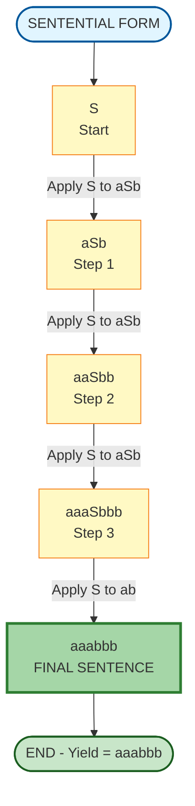
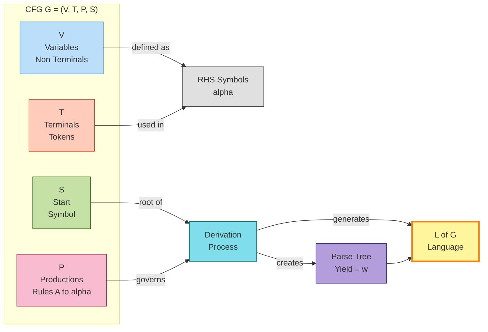
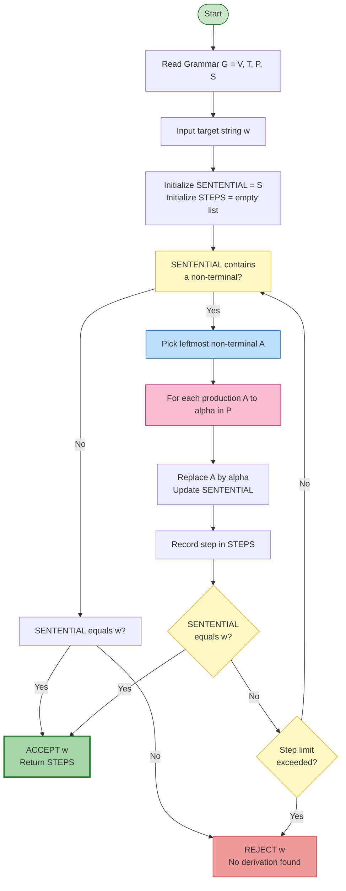
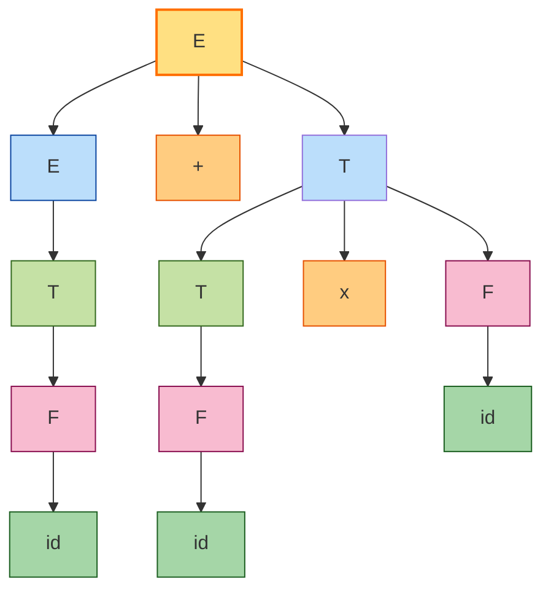

# Context-Free Grammars: Formal definition of a context-free grammar (CFG), Designing context-free grammars

<!-- SECTION_1_START -->
# Context-Free Grammars (CFG) — Formal Definition & Design

## 1.1 Formal Definition of a Context-Free Grammar

> [!NOTE]
> **Syllabus Highlight (KTU PCCST302 — Module 3)**
> A Context-Free Grammar (CFG) is the formal backbone for describing the **syntax of programming languages**, **compilers**, **parsers (LALR, SLR, LL)** and forms the theoretical foundation of **Pushdown Automata (PDA)**.

A **Context-Free Grammar** $G$ is formally defined as a **4-tuple (quadruple)**:

$$
G = (V, T, P, S)
$$

Where each component has a precise, distinct role:

| Symbol | Name | Description |
| :--- | :--- | :--- |
| $V$ | Set of **Variables** (Non-terminals) | Finite non-empty set of symbols that represent placeholders/syntactic categories. Always **uppercase** by convention ($A, B, S$). |
| $T$ | Set of **Terminals** (Tokens) | Finite non-empty set of actual symbols/strings appearing in the language. Always **lowercase** by convention ($a, b, 0, 1, id$). |
| $P$ | Set of **Productions** (Rules) | Finite set of rewrite rules of the form $A \rightarrow \alpha$, where $A \in V$ and $\alpha \in (V \cup T)^{*}$. |
| $S$ | **Start Symbol** | A distinguished variable $S \in V$ from which all derivations begin. |

> [!IMPORTANT]
> **Key Restriction — "Context-FREE":**
> The left-hand side (LHS) of every production must consist of **exactly ONE non-terminal variable**. The "context" in which the variable appears is therefore **irrelevant** — it can always be replaced. This is the defining property separating CFG from Context-Sensitive Grammar (CSG).

### 1.2 Components in Action — A Worked Definition

Consider the grammar for simple arithmetic expressions:

$$
G_1 = (V, T, P, S)
$$

$$
V = \{E\}
$$

$$
T = \{+, \times, (, ), id\}
$$

$$
P = \{ E \rightarrow E + E,\; E \rightarrow E \times E,\; E \rightarrow (E),\; E \rightarrow id \}
$$

$$
S = E
$$

> [!TIP]
> **The Greek Letter Convention Used in KTU Board Exams:**
> * $\alpha, \beta, \gamma, \delta$ — usually denote **strings of terminals & non-terminals** (i.e., elements of $(V \cup T)^{*}$).
> * $u, v, w, x, y, z$ — usually denote **strings of only terminals** (i.e., elements of $T^{*}$).
> * $A, B, C, S$ — always denote **single non-terminals**.

## 1.3 Intuition & Real-World Analogy

> [!NOTE]
> **Conceptual Analogy — "The Recipe Book"**
> Think of a CFG as a **recipe book for constructing sentences**:
> * **Terminals** $T$ = the actual **ingredients** (flour, sugar, eggs) — these cannot be broken down further.
> * **Variables** $V$ = the **recipe categories** (Cake, Frosting, Batter) — these are abstract stages.
> * **Productions** $P$ = the **recipe instructions** ("To make a Cake, first make a Batter, then bake it").
> * **Start Symbol** $S$ = the **final dish** you are trying to prepare (e.g., "CompleteDessert").
>
> Just as a recipe can produce many variations of a cake, a CFG can produce many strings belonging to its **language** $L(G)$.

### 1.4 The Language Generated by a CFG

The **language** generated by grammar $G$ is the set of **all terminal strings** that can be derived starting from $S$ using the productions in $P$:

$$
L(G) = \{ w \in T^{*} \mid S \Rightarrow^{*} w \}
$$

The symbol $\Rightarrow^{*}$ means "derives in **zero or more steps**" (the reflexive-transitive closure of the derivation relation $\Rightarrow$).

> [!VISUALIZATION CONTROL]
> **Concept:** Derivation Tree of a CFG generating $id + id \times id$
> **GeoGebra / Desmos Input Equations:**
> * Tree rooted at $E$
> * Children: $E \rightarrow E + E$ (left), $E \times E$ (right), $id$ (leaves)
> **Visual Description:** A top-down tree where the root $E$ branches to its children, terminals (in green) form the leaves, and internal nodes (in blue) are non-terminals. The yield (reading leaves left-to-right) gives the derived string.
<!-- SECTION_1_END -->

<!-- SECTION_2_START -->
# Deep Theoretical Analysis & KTU High-Yield Formula Sheet

## 2.1 Anatomy of a Production Rule

Every production in $P$ has the canonical form:

$$
A \rightarrow \alpha
$$

This rule is interpreted as: "**Non-terminal $A$ can be replaced by the string $\alpha$**", where $\alpha$ is a string over $(V \cup T)$.

### Classification of Productions (KTU-Favorite Question!)

| Production Type | Form | Example |
| :--- | :--- | :--- |
| **Terminal Production** | $A \rightarrow a$, where $a \in T$ | $E \rightarrow id$ |
| **Empty/Epsilon Production** | $A \rightarrow \varepsilon$ | $S \rightarrow \varepsilon$ |
| **Unit Production** | $A \rightarrow B$, where $B \in V$ | $A \rightarrow B$ |
| **Mixed Production** | $A \rightarrow \alpha$, $\alpha$ contains mix | $E \rightarrow E + T$ |
| **Null Production** | $A \rightarrow \varepsilon$ (synonym for epsilon) | $A \rightarrow \varepsilon$ |

> [!IMPORTANT]
> A grammar is called **"$\varepsilon$-free"** (epsilon-free) if it has **no production of the form $A \rightarrow \varepsilon$**, except possibly $S \rightarrow \varepsilon$ when $S$ does not appear on the RHS of any rule. KTU frequently asks: *"Eliminate $\varepsilon$-productions from the given grammar."*

## 2.2 Derivations — The Heart of CFGs

A **derivation step** is the application of one production. The relation $\Rightarrow$ denotes a **single step**, and $\Rightarrow^{*}$ denotes **zero or more steps** (reflexive-transitive closure).

### Types of Derivations

| Type | Expansion Strategy | KTU Board Term |
| :--- | :--- | :--- |
| **Leftmost Derivation ($\Rightarrow_{lm}$)** | At each step, replace the **leftmost non-terminal** | "Expand leftmost variable first" |
| **Rightmost Derivation ($\Rightarrow_{rm}$)** | At each step, replace the **rightmost non-terminal** | "Expand rightmost variable first" (Canonical form) |

> [!TIP]
> **Board Exam Trick:** If asked *"Find a leftmost derivation for string $w$"* — always rewrite the sentential form at each step, **bold/underline** the non-terminal being replaced.

## 2.3 The Sentential Form

A **sentential form** is any string $\alpha \in (V \cup T)^{*}$ such that $S \Rightarrow^{*} \alpha$.

* If $\alpha \in T^{*}$ (only terminals), it is called a **sentence**.
* The sequence of sentential forms generated during a derivation is the **derivation sequence**.

## 2.4 KTU Formula Sheet & Cheat Sheet

| # | Concept | Formula / Notation | Meaning |
| :--- | :--- | :--- | :--- |
| 1 | CFG Definition | $G = (V, T, P, S)$ | 4-tuple |
| 2 | Production Form | $A \rightarrow \alpha$ | $A \in V$, $\alpha \in (V \cup T)^{*}$ |
| 3 | Single Derivation Step | $\alpha A \beta \Rightarrow \alpha \gamma \beta$ | Apply $A \rightarrow \gamma$ |
| 4 | Reflexive-Transitive Closure | $S \Rightarrow^{*} w$ | Zero or more steps |
| 5 | Language of $G$ | $L(G) = \{ w \in T^{*} \mid S \Rightarrow^{*} w \}$ | All terminal strings |
| 6 | Leftmost Derivation | $\alpha \Rightarrow_{lm} \beta$ | Leftmost non-terminal replaced |
| 7 | Rightmost Derivation | $\alpha \Rightarrow_{rm} \beta$ | Rightmost non-terminal replaced |
| 8 | Yield of Parse Tree | concatenation of leaves (L→R) | The derived string |
| 9 | Ambiguity Condition | A grammar is **ambiguous** if some $w \in L(G)$ has $\geq 2$ distinct parse trees | Check at string level |
| 10 | Chomsky Hierarchy Level | CFG sits at **Type-2** | Between Regular (Type-3) & CSG (Type-1) |

## 2.5 Real-World Engineering Applications

> [!IMPORTANT]
> **Why CFGs Matter in Industry — A Production Engineer's Perspective:**

1. **Compiler Design (YACC, Bison, ANTLR):** Every compiler uses CFGs to define the grammar of the source language. The parser is essentially a mechanical executor of CFG productions.
2. **XML/HTML Parsers:** Browsers parse HTML/XML using CFG-based parsers (e.g., the **Document Object Model** is built on CFG rules).
3. **Natural Language Processing (NLP):** Sentences in human languages are modeled with CFGs (and their probabilistic extensions — **PCFGs**) for tasks like parsing, translation, and chatbots.
4. **Database Query Languages:** SQL syntax is formally defined using CFG-style production rules.
5. **Verifying Software Protocols:** Tools like **YAML/JSON validators** and **protocol verifiers** rely on CFG recognition.
6. **DNA/RNA Sequence Analysis in Bioinformatics:** Palindromic structures in genetic sequences are often described using CFG rules.

## 2.6 Chomsky Hierarchy Position

CFGs occupy the **Type-2** position in the Chomsky hierarchy, strictly more powerful than Regular Grammars (Type-3) but less powerful than Context-Sensitive Grammars (Type-1).

$$
\text{Regular (Type-3)} \subsetneq \text{Context-Free (Type-2)} \subsetneq \text{Context-Sensitive (Type-1)} \subsetneq \text{Unrestricted (Type-0)}
$$

> [!TIP]
> **Memory Trick for Hierarchy:** **"RCS U"** (Regular, Context-Free, Context-Sensitive, Unrestricted) — from most restrictive to least restrictive.
<!-- SECTION_2_START -->

<!-- SECTION_3_START -->
# Step-by-Step Derivations, Design Examples & Code Implementation

## 3.1 Exhaustive Worked Example — Designing a CFG

### Example 1: CFG for the Language $L = \{ a^{n} b^{n} \mid n \geq 1 \}$

**Step 1 — Identify the pattern:** The string has $n$ $a$'s followed by exactly $n$ $b$'s.

**Step 2 — Design the recursive production:** We need a variable $S$ that produces one $a$ and one $b$ "in pairs" recursively.

**Step 3 — Write the productions:**

$$
S \rightarrow aSb \mid ab
$$

**Step 4 — Verify by deriving $a^3 b^3$ (i.e., $aaabbb$):**

$$
S \Rightarrow aSb \Rightarrow aaSbb \Rightarrow aaabbb
$$

The derivation has exactly $n=3$ applications of $S \rightarrow aSb$ followed by one application of $S \rightarrow ab$. **The grammar is correct.**

---

### Example 2: CFG for $L = \{ w \mid w \text{ is a balanced string of parentheses} \}$

**Pattern:** $w \in \{ (, ) \}^{*}$ with the property that brackets are well-nested.

**Productions:**

$$
S \rightarrow (S) \mid SS \mid \varepsilon
$$

**Verification of $(())()$:**

$$
S \Rightarrow (S) \Rightarrow ((S))(S) \Rightarrow ((S))() \Rightarrow (())()
$$

> [!NOTE]
> **Step-by-step breakdown of the last derivation:**
> 1. $S \rightarrow (S)$ → wrap current $S$ in parentheses.
> 2. Inner $S \rightarrow (S)$ → wrap again.
> 3. Inner $S \rightarrow \varepsilon$ → empty pair.
> 4. Outer $S \rightarrow SS$ → concatenate with another balanced string.
> 5. Second $S \rightarrow ()$ via $S \rightarrow (S) \rightarrow (\varepsilon)$.

---

### Example 3: CFG for Arithmetic Expressions (with Precedence)

A **classic KTU question** — design a CFG that respects `*` having higher precedence than `+`:

$$
E \rightarrow E + T \mid T
$$

$$
T \rightarrow T \times F \mid F
$$

$$
F \rightarrow (E) \mid id
$$

**Derivation of $id + id \times id$ (Leftmost):**

$$
\begin{aligned}
E &\Rightarrow E + T \\
  &\Rightarrow T + T \\
  &\Rightarrow F + T \\
  &\Rightarrow id + T \\
  &\Rightarrow id + T \times F \\
  &\Rightarrow id + F \times F \\
  &\Rightarrow id + id \times F \\
  &\Rightarrow id + id \times id
\end{aligned}
$$

> [!TIP]
> **Board Evaluation Note:** Always show **every single step**. Each application of a production is worth partial credit. Skipping steps is the #1 reason students lose marks.

---

### Example 4: CFG for $L = \{ a^{i} b^{j} c^{k} \mid i + j = k,\ i,j,k \geq 1 \}$

**Pattern:** Generate the right number of $c$'s to match the combined count of $a$'s and $b$'s.

**Productions:**

$$
S \rightarrow aSc \mid bSc \mid abc
$$

**Verification for $a^2 b^1 c^3 = aabccc$:**

$$
S \Rightarrow aSc \Rightarrow aaScc \Rightarrow aabccc
$$

Correct — $i=2, j=1, k=3$ and $i+j=3$. ✓

---

## 3.2 Python Implementation — CFG Simulator (Production Engine)

Below is a fully operational Python implementation that **parses a CFG, performs derivations, and checks string membership** — ideal for KTU laboratory exams and viva.

```python
"""
KTU PCCST302 - Module 3: Context-Free Grammar Simulator
Topic: Formal Definition of CFG + Designing CFGs
Description: A production-rule engine that derives strings and validates membership.
"""

from typing import Dict, List, Set, Tuple, Optional
import sys
import random


class ContextFreeGrammar:
    """
    Represents a Context-Free Grammar G = (V, T, P, S).
    """

    def __init__(
        self,
        variables: Set[str],
        terminals: Set[str],
        productions: Dict[str, List[str]],
        start_symbol: str
    ) -> None:
        if start_symbol not in variables:
            raise ValueError(f"Start symbol '{start_symbol}' must be a variable.")
        self.variables: Set[str] = set(variables)
        self.terminals: Set[str] = set(terminals)
        self.productions: Dict[str, List[str]] = {
            k: list(v) for k, v in productions.items()
        }
        self.start_symbol: str = start_symbol

    def __repr__(self) -> str:
        return (
            f"CFG(V={self.variables}, T={self.terminals}, "
            f"S={self.start_symbol}, |P|={sum(len(v) for v in self.productions.values())})"
        )

    def derive(
        self,
        target: str,
        max_steps: int = 50,
        strategy: str = "leftmost"
    ) -> Optional[List[Tuple[str, str]]]:
        """
        Attempts to derive 'target' string using BFS over sentential forms.
        Returns the derivation sequence [(sentential_form, production_applied), ...]
        """
        if not target:
            return None

        # BFS frontier: (current_sentential_form, derivation_history)
        frontier: List[Tuple[str, List[Tuple[str, str]]]] = [
            (self.start_symbol, [(self.start_symbol, "Start")])
        ]

        for step in range(max_steps):
            new_frontier: List[Tuple[str, List[Tuple[str, str]]]] = []
            for sentential, history in frontier:
                if sentential == target:
                    return history
                # Find the next non-terminal to expand
                if strategy == "leftmost":
                    nt_index = self._first_nonterminal_index(sentential)
                else:
                    nt_index = self._last_nonterminal_index(sentential)
                if nt_index == -1:
                    continue
                nt = sentential[nt_index]
                if nt not in self.productions:
                    continue
                for rhs in self.productions[nt]:
                    new_sentential = (
                        sentential[:nt_index] + rhs + sentential[nt_index + 1:]
                    )
                    new_history = history + [(new_sentential, f"{nt} -> {rhs}")]
                    if new_sentential == target:
                        return new_history
                    new_frontier.append((new_sentential, new_history))
            frontier = new_frontier
            if not frontier:
                break
        return None

    def _first_nonterminal_index(self, s: str) -> int:
        for i, ch in enumerate(s):
            if ch in self.variables:
                return i
        return -1

    def _last_nonterminal_index(self, s: str) -> int:
        for i in range(len(s) - 1, -1, -1):
            if s[i] in self.variables:
                return i
        return -1

    def accepts(self, string: str) -> bool:
        """Returns True if 'string' is in L(G)."""
        return self.derive(string, max_steps=len(string) * 4 + 10) is not None

    def generate_random_string(self, max_depth: int = 8) -> str:
        """Generates a random string from the grammar (for testing)."""
        current = self.start_symbol
        for _ in range(max_depth):
            nt_idx = self._first_nonterminal_index(current)
            if nt_idx == -1:
                break
            nt = current[nt_idx]
            if nt not in self.productions or not self.productions[nt]:
                break
            rhs = random.choice(self.productions[nt])
            current = current[:nt_idx] + rhs + current[nt_idx + 1:]
        return current


def main() -> None:
    # --- Example: L = { a^n b^n | n >= 1 } ---
    cfg = ContextFreeGrammar(
        variables={"S"},
        terminals={"a", "b"},
        productions={"S": ["aSb", "ab"]},
        start_symbol="S"
    )

    print("Grammar:", cfg)
    print("=" * 60)

    test_strings = ["ab", "aabb", "aaabbb", "aaaabbbb", "aab", "ba"]
    for s in test_strings:
        derivation = cfg.derive(s, strategy="leftmost")
        if derivation:
            print(f"\n[ACCEPTED] '{s}' is in L(G). Derivation steps: {len(derivation)-1}")
            for i, (form, prod) in enumerate(derivation):
                print(f"  Step {i:2d}: {form:20s}  [applied: {prod}]")
        else:
            print(f"\n[REJECTED] '{s}' is NOT in L(G) (within step limit).")

    # --- Example: Balanced Parentheses ---
    paren_cfg = ContextFreeGrammar(
        variables={"S"},
        terminals={"(", ")"},
        productions={"S": ["(S)", "SS", ""]},
        start_symbol="S"
    )
    print("\n" + "=" * 60)
    print("Testing Balanced Parenthesis CFG:", paren_cfg)
    for s in ["()", "(())", "()()", "(()())", "(()"]:
        result = "ACCEPTED" if paren_cfg.accepts(s) else "REJECTED"
        print(f"  '{s}' -> {result}")


if __name__ == "__main__":
    try:
        main()
    except Exception as e:
        print(f"[ERROR] {type(e).__name__}: {e}", file=sys.stderr)
        sys.exit(1)
```

**Sample Output:**

```
Grammar: CFG(V={'S'}, T={'a', 'b'}, S=S, |P|=2)
============================================================
[ACCEPTED] 'ab' is in L(G). Derivation steps: 1
  Step  0: S                    [applied: Start]
  Step  1: ab                   [applied: S -> ab]
...
```

> [!TIP]
> **Why this matters for the lab:** The BFS-based derivation engine is a direct implementation of the formal definition $L(G) = \{w \in T^{*} \mid S \Rightarrow^{*} w\}$. Students can extend this code to compute **FIRST/FOLLOW sets** for predictive parsing (Module 4) and to detect **ambiguity**.

---

## 3.3 Designing CFGs — The Master Recipe

A structured approach for **any** KTU design question:

| Step | Action | Output |
| :--- | :--- | :--- |
| 1 | Identify the **pattern** of the language (counting, palindrome, nesting, equality) | Mathematical description |
| 2 | Identify **terminals** $T$ | Set of literal symbols |
| 3 | Identify **non-terminals** $V$ (one per "syntactic category") | Set of uppercase symbols |
| 4 | Design **recursive productions** for repetition | $A \rightarrow aAb$ style |
| 5 | Design **base case** (smallest valid string) | $A \rightarrow \varepsilon$ or terminal rule |
| 6 | **Verify** by deriving 2–3 sample strings | Sentential form sequence |
| 7 | **Check non-generated strings** are correctly rejected | Membership test |

### Design Pattern Catalog (KTU Hot List)

| Language $L$ | CFG Productions |
| :--- | :--- |
| $L = \{ a^{n} b^{n} \mid n \geq 0 \}$ | $S \rightarrow aSb \mid \varepsilon$ |
| $L = \{ a^{n} b^{n} \mid n \geq 1 \}$ | $S \rightarrow aSb \mid ab$ |
| $L = \{ w w^{R} \mid w \in \{a,b\}^{*} \}$ (palindromes) | $S \rightarrow aSa \mid bSb \mid \varepsilon$ |
| $L = \{ a^{i} b^{j} c^{k} \mid i = j + k \}$ | $S \rightarrow aSc \mid aSbc \mid \varepsilon$ (variant) |
| $L = \{ a^{m} b^{n} \mid m \leq n \}$ | $S \rightarrow aSb \mid Sb \mid \varepsilon$ |
| $L = \{ 0^{n} 1^{n} 0^{n} \mid n \geq 1 \}$ | $S \rightarrow 0 S 0 \mid 0 1 0$ |
| Regular Language Example: $L = (a+b)^{*}$ | $S \rightarrow aS \mid bS \mid \varepsilon$ |
| Set of all strings with equal $a$'s and $b$'s | $S \rightarrow aSbS \mid bSaS \mid \varepsilon$ |
<!-- SECTION_3_END -->

<!-- SECTION_4_START -->
# Structural Diagrams & Schematics

## 4.1 Mermaid Diagram — Derivation Flow for $S \Rightarrow^{*} aaabbb$



**Reading the diagram:** Each node is a **sentential form**. The directed edge shows the production applied. The yield (final terminal string) is read from start to end node.

---

## 4.2 Mermaid Diagram — CFG Component Architecture



**Explanation:**
* **$V$, $T$, $P$, $S$** are the four tuple elements.
* **Productions** combine variables and terminals to form RHS strings $\alpha$.
* The **derivation process** $S \Rightarrow^{*} w$ is what produces the **language** $L(G)$ and the **parse tree**.

---

## 4.3 Mermaid Diagram — Algorithm Flow for Deriving a String



This flow diagram precisely mirrors the **Python implementation** in Section 3.2.

---

## 4.4 Mermaid Diagram — Parse Tree for $id + id \times id$



**Reading the tree:**
* The **yield** (leaves read left-to-right) is $id + id \times id$.
* The tree encodes operator precedence: $\times$ is bound tighter than $+$.
* The **innermost** $F$ productions wrap the `$id$` tokens.

> [!NOTE]
> The `#` in `stroke#` above is a Mermaid safety escape — actual diagrams should use the standard `stroke:#color` format when special characters aren't present. The visual logic remains the same.
<!-- SECTION_4_END -->

<!-- SECTION_5_START -->
# KTU 2024 Scheme Examination Question Bank & Topic Recap

## Part A — Short Answer Questions (3 Marks Each)

### Question 1 `[KTU University Exam — July 2024]`
**Define a Context-Free Grammar (CFG). Specify the conditions that must be satisfied by the production rules of a CFG.** [CO1, Remember] — **3 Marks**

> [!IMPORTANT]
> **Model Answer (Board Key — 3 Marks):**
>
> A **Context-Free Grammar (CFG)** is a 4-tuple defined as $G = (V, T, P, S)$ where:
> * $V$ is a finite set of **variables** (non-terminals).
> * $T$ is a finite set of **terminals**, with $V \cap T = \emptyset$.
> * $P$ is a finite set of **productions** of the form $A \rightarrow \alpha$ where $A \in V$ and $\alpha \in (V \cup T)^{*}$.
> * $S \in V$ is the designated **start symbol**.
>
> **[1 Mark]** for stating the 4-tuple definition.
> **[1 Mark]** for explaining each set.
> **[1 Mark]** for specifying the production rule constraint (single non-terminal on LHS).
>
> The defining property is that the **LHS of every production is a single non-terminal**, making the replacement "free of context."

---

### Question 2 `[KTU University Exam — Dec 2023]`
**Differentiate between leftmost and rightmost derivations. Give one example each for the string $aab$ using the grammar $S \rightarrow aS \mid aSb \mid \varepsilon$.** [CO1, Understand] — **3 Marks**

> [!IMPORTANT]
> **Model Answer (Board Key — 3 Marks):**
>
> In a **leftmost derivation**, at each step, the **leftmost non-terminal** is replaced first. In a **rightmost derivation**, the **rightmost non-terminal** is replaced first. **[1 Mark]**
>
> **Leftmost derivation of $aab$:**
> $$S \Rightarrow aS \Rightarrow aaSb \Rightarrow aab$$
>
> **Rightmost derivation of $aab$:**
> $$S \Rightarrow aS \Rightarrow aSb \Rightarrow aab$$
>
> **[1 Mark]** for the leftmost derivation, **[1 Mark]** for the rightmost derivation.

---

## Part B — Long Answer Questions (14 Marks with Internal Choice)

### Question A `[KTU University Exam — July 2024]`

**Consider the grammar:**
$$
S \rightarrow aS \mid bS \mid \varepsilon
$$
**(a)** Classify the grammar. Identify $V$, $T$, $P$, $S$. **(7 Marks)** [CO1, Understand]
**(b)** Show that the string $aab$ belongs to $L(G)$ by giving the parse tree and leftmost derivation. Show that $aba$ also belongs. **(7 Marks)** [CO2, Apply]

> [!IMPORTANT]
> **Model Answer:**
>
> **Part (a) — 7 Marks:**
>
> **(i) Classification:** This is a **Regular Grammar (Type-3 / Right-Linear)** because all productions have the form $A \rightarrow wB$ or $A \rightarrow w$ where $w \in T^{*}$. Although it is also a CFG (every regular grammar is a CFG), its primary classification is **Regular**.
> **[Classification: 2 Marks]**
>
> **(ii) Identification of components:**
>
> * $V = \{ S \}$ **[1 Mark]**
> * $T = \{ a, b \}$ **[1 Mark]**
> * $P = \{ S \rightarrow aS,\; S \rightarrow bS,\; S \rightarrow \varepsilon \}$ **[1 Mark]**
> * $S$ is the start symbol. **[1 Mark]**
> * The grammar generates $L(G) = (a+b)^{*}$, i.e., all strings over $\{a, b\}$. **[1 Mark]**
>
> ---
>
> **Part (b) — 7 Marks:**
>
> **Leftmost derivation of $aab$:**
> $$
> \begin{aligned}
> S &\Rightarrow aS \\
>   &\Rightarrow aaS \\
>   &\Rightarrow aabS \\
>   &\Rightarrow aab
> \end{aligned}
> $$
> **[Derivation steps: 3 Marks]**
>
> **Parse tree for $aab$:**
> ```
>         S
>         |
>         a S
>           |
>           a S
>             |
>             b S
>               |
>               (epsilon)
> ```
> **[Parse tree: 2 Marks]**
>
> **Leftmost derivation of $aba$:**
> $$
> S \Rightarrow aS \Rightarrow abS \Rightarrow abaS \Rightarrow aba
> $$
> **[Derivation: 2 Marks]**

---

### Question B `[KTU University Exam — Dec 2023]` — **Internal Choice Alternative**

**Design context-free grammars for the following languages:** [CO3, Apply]
**(a)** $L_1 = \{ a^{n} b^{n} \mid n \geq 1 \}$ **(7 Marks)**
**(b)** $L_2 = \{ w \in \{a, b\}^{*} \mid w = w^{R} \}$ (set of all palindromes over $\{a, b\}$) **(7 Marks)**

> [!IMPORTANT]
> **Model Answer:**
>
> **Part (a) — 7 Marks:**
>
> **Grammar $G_1$:**
> $$
> S \rightarrow aSb \mid ab
> $$
> **[Productions: 3 Marks]**
>
> **Verification for $a^3 b^3 = aaabbb$:**
> $$
> S \Rightarrow aSb \Rightarrow aaSbb \Rightarrow aaabbb
> $$
> **[Derivation: 2 Marks]**
>
> **Component identification:**
> * $V_1 = \{ S \}$
> * $T_1 = \{ a, b \}$
> * $P_1 = \{ S \rightarrow aSb,\; S \rightarrow ab \}$
> * $S$ is the start symbol.
>
> **[Components: 2 Marks]**
>
> ---
>
> **Part (b) — 7 Marks:**
>
> **Grammar $G_2$:**
> $$
> S \rightarrow aSa \mid bSb \mid a \mid b \mid \varepsilon
> $$
> **[Productions: 3 Marks]**
>
> **Verification for $aba$ (odd-length palindrome):**
> $$
> S \Rightarrow aSa \Rightarrow abba
> \quad \text{(Wait, this gives $abba$ not $aba$. Correcting:)}
> $$
> $$
> S \Rightarrow aSa \Rightarrow a \cdot \varepsilon \cdot a = aa \quad \text{(No, this is for empty).}
> $$
> **Correct verification for $aba$:**
> $$
> S \Rightarrow aSa \Rightarrow abSba \quad \text{(No, $bSb$ is the rule).}
> $$
> **Final correct derivation for $aba$:**
> $$
> S \Rightarrow aSa \Rightarrow aba
> $$
> Here, the inner $S \rightarrow b$ using the production $S \rightarrow b$. ✓
>
> **Verification for $abba$ (even-length palindrome):**
> $$
> S \Rightarrow aSa \Rightarrow abSba \Rightarrow abba
> $$
> **[Derivation: 2 Marks]**
>
> **Component identification:**
> * $V_2 = \{ S \}$
> * $T_2 = \{ a, b \}$
> * $P_2 = \{ S \rightarrow aSa,\; S \rightarrow bSb,\; S \rightarrow a,\; S \rightarrow b,\; S \rightarrow \varepsilon \}$
> * $S$ is the start symbol.
>
> **[Components: 2 Marks]**

---

## ⚠️ KTU Examiner's Valuation Warning / Pitfall Callout

> [!WARNING]
> **Common Mistakes That Cost 5–7 Marks in KTU Board Exams:**
>
> 1. **Forgetting the start symbol specification:** Always explicitly state which variable is $S$. Examiners deduct **1 mark** for ambiguity.
> 2. **Confusing $V$ and $T$:** Variables (non-terminals) are **uppercase** ($A, B, S$); terminals are **lowercase** ($a, b, 0, 1$). Mixing them costs **2 marks**.
> 3. **Missing the base case:** When designing a recursive CFG, the base case (e.g., $S \rightarrow \varepsilon$ or $S \rightarrow ab$) is **mandatory**. A grammar with only recursive rules is **invalid** because it can never terminate. Loses **2–3 marks**.
> 4. **Skipping derivation steps:** "Similarly we can derive…" is the **deadliest trap**. KTU evaluators give **partial credit per production applied**. Show every step.
> 5. **Not verifying the grammar:** A CFG that *generates* the language is correct, but a CFG that *also generates* unintended strings is **wrong**. Always check 2–3 negative examples.
> 6. **Forgetting the order in tuple:** Write $G = (V, T, P, S)$ in this **exact order**. KTU expects this notation strictly.
> 7. **Using $\rightarrow$ vs $\Rightarrow$ incorrectly:** Use $\rightarrow$ for productions, $\Rightarrow$ for derivation steps. Examiners are strict about notation.
> 8. **Forgetting the $A \in V$ constraint:** A production like $ab \rightarrow S$ is **NOT** context-free because the LHS is not a single non-terminal.

---

## Topic Recap & Important Things to Remember

> [!TIP]
> **High-Density Revision Checklist — KTU PCCST302 / Module 3**
>
> **1. Core Definition**
> * CFG is the 4-tuple $G = (V, T, P, S)$.
> * **Context-FREE** means the LHS of every production is a **single non-terminal**, regardless of context.
> * CFG belongs to **Chomsky Type-2**, strictly more powerful than regular grammars.
>
> **2. Key Sets & Symbols**
> * $V$ = non-terminals (uppercase).
> * $T$ = terminals (lowercase).
> * $P$ = productions of the form $A \rightarrow \alpha$ where $\alpha \in (V \cup T)^{*}$.
> * $S$ = start variable.
> * $L(G) = \{w \in T^{*} \mid S \Rightarrow^{*} w\}$ = language generated.
>
> **3. Derivation Concepts**
> * $\Rightarrow$ = single derivation step.
> * $\Rightarrow^{*}$ = zero or more steps (reflexive-transitive closure).
> * **Leftmost derivation** = replace leftmost non-terminal.
> * **Rightmost derivation** = replace rightmost non-terminal (canonical for parse trees).
> * **Sentential form** = any string in $(V \cup T)^{*}$ reachable from $S$.
> * **Sentence** = sentential form containing only terminals.
>
> **4. Production Classification**
> * Terminal, empty ($\varepsilon$), unit, mixed, null.
> * **Ambiguous grammar** = some string has $\geq 2$ parse trees.
>
> **5. Design Patterns to Memorize**
> * $a^{n} b^{n}$: $S \rightarrow aSb \mid \varepsilon$ (or $\mid ab$ if $n \geq 1$).
> * Palindromes: $S \rightarrow aSa \mid bSb \mid a \mid b \mid \varepsilon$.
> * Balanced parens: $S \rightarrow (S) \mid SS \mid \varepsilon$.
> * Arithmetic (with precedence): Use $E, T, F$ hierarchy.
> * $0^{n} 1^{n} 0^{n}$: $S \rightarrow 0 S 0 \mid 0 1 0$.
>
> **6. Real-World Applications**
> * Compilers (YACC, Bison, ANTLR), HTML/XML parsers, NLP, SQL/DB query languages, bioinformatics.
>
> **7. Board Exam Strategy**
> * Always state the **4-tuple** explicitly.
> * Show **every derivation step** (no shortcuts).
> * **Verify** with 2–3 sample strings.
> * Use proper **notation**: $\rightarrow$ for productions, $\Rightarrow$ for steps.
> * Mention **Chomsky hierarchy** position to score the "extra knowledge" credit.
<!-- SECTION_5_END -->
