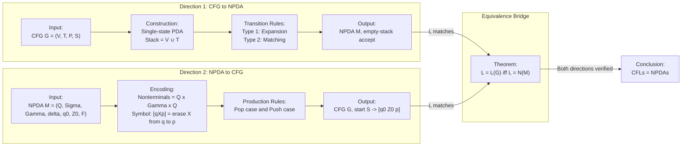
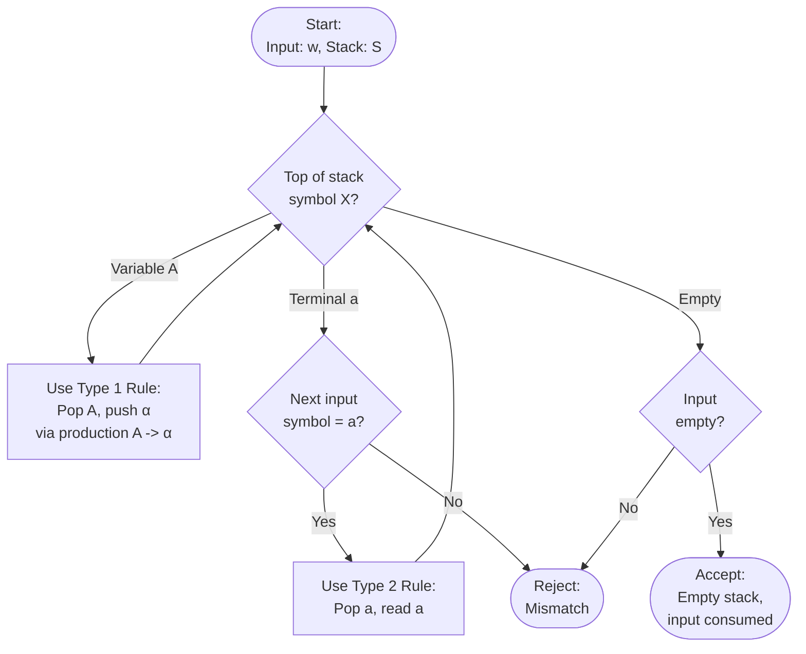
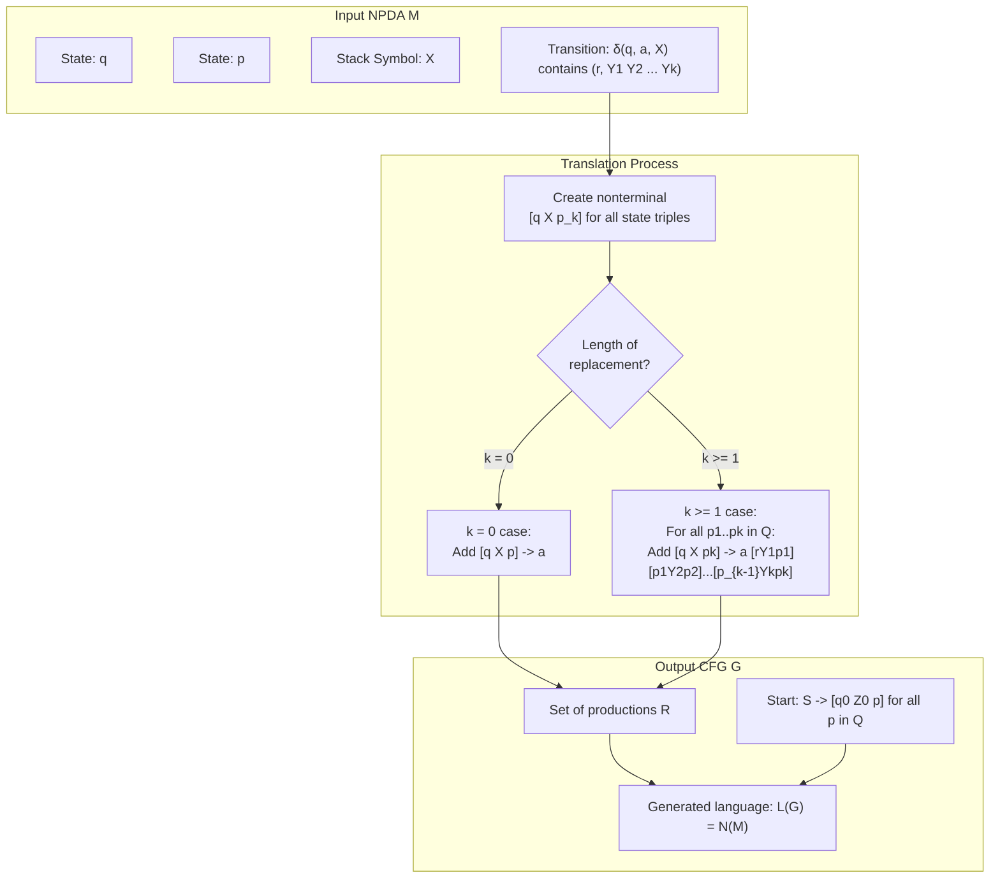
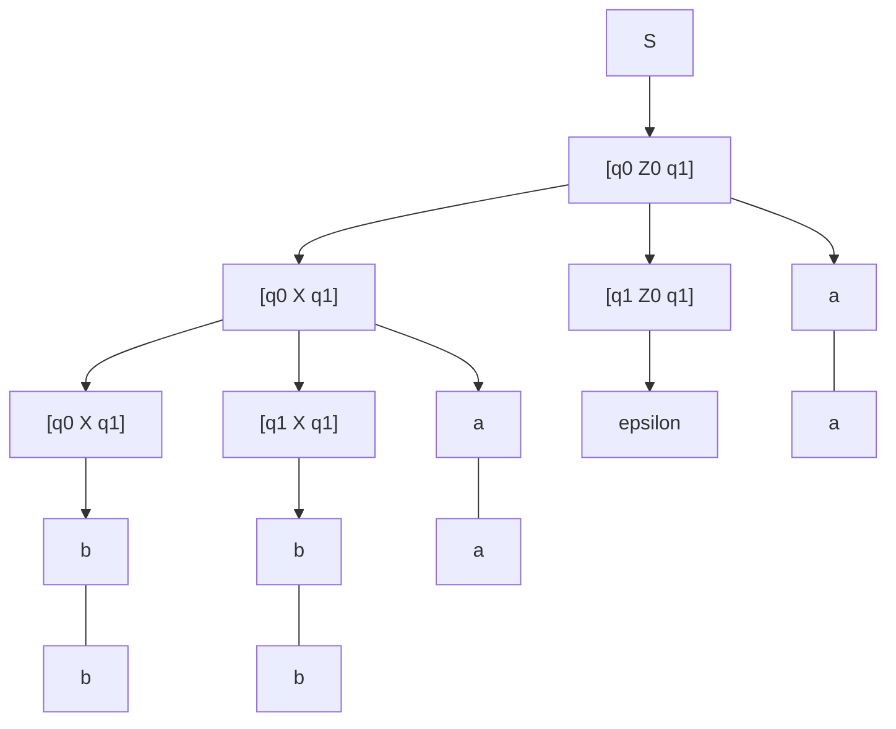

# Equivalence of NPDAs and CFGs (conversions in both directions)

<!-- SECTION_1_START -->
# Equivalence of NPDAs and CFGs

## 1.1 Core Technical Definition (KTU 2024 Syllabus Terminology)

**Equivalence Theorem (KTU Module 3, Outcome CO3):**

A language $L$ is a **Context-Free Language (CFL)** if and only if there exists a **Nondeterministic Pushdown Automaton (NPDA)** $M$ such that $L = L(M)$.

Formally stated as a biconditional equivalence:

$$L = L(G) \iff \exists \; \text{NPDA } M \text{ such that } L = L(M)$$

where $G$ is a Context-Free Grammar and $L(M)$ denotes the language accepted by the NPDA (by final state or by empty stack).

> [!IMPORTANT]
> **KTU 2024 High-Yield Theorem:** A language is generated by a CFG $\iff$ it is recognized by an NPDA. The proof requires two constructive conversions:
> 1. **CFGC → NPDA Construction** (top-down simulation of leftmost derivations)
> 2. **NPDA → CFG Construction** (encoding stack computations as grammar nonterminals)

## 1.2 Conceptual Analogy / Intuition

Imagine a **chess grandmaster (PDA)** versus a **rulebook (CFG)**:

| Element | Real-World Analogy | Formal Counterpart |
|---|---|---|
| **CFGC** | A recipe book listing all valid cooking rules | Production rules in grammar |
| **NPDA** | A chef with a notepad who tries recipes, jots down intermediate steps, and backtracks if stuck | States + Stack memory |
| **Stack** | A scratchpad listing unfinished cooking tasks | Pushdown storage |
| **Equivalence** | Any dish the recipe book can describe can be cooked by the chef, and vice versa | Languages match exactly |

The key insight: the **stack** of a PDA is a perfect stand-in for the **derivation sentential form** of a CFG. The PDA holds partially derived strings on its stack and either matches terminals (consuming input) or expands variables (simulating productions).

> [!NOTE]
> **Why NPDA and not DPDA?** Deterministic PDAs are strictly weaker — they cannot recognize all CFLs (e.g., $\{ww^R \mid w \in \Sigma^*\}$). Only the **nondeterministic** version captures the full power of CFGs.

## 1.3 Visualization Control

> [!VISUALIZATION CONTROL]
> **Concept:** Stack evolution during CFG-to-NPDA simulation
> **GeoGebra / Desmos Input Equations:**
> * Let $x$-axis = time step, $y$-axis = stack content (indexed top-to-bottom)
> * Plot points: $(0, S), (1, S \to aSb), (2, aSb \to aaSbb), (3, aaSbb \to aabbb)$
> **Visual Description:** Observe a downward "drill" into the stack as variables expand, with terminal symbols consumed (read) when matched at the stack top.
<!-- SECTION_1_END -->

<!-- SECTION_2_START -->
# Deep Theoretical Analysis & KTU High-Yield Formula Sheet

## 2.1 Direction 1 — CFG → NPDA Construction

### 2.1.1 Setup and Input Specification

Let $G = (V, T, P, S)$ be a CFG where:
* $V$ = finite set of variables (nonterminals)
* $T$ = finite set of terminals
* $P$ = finite set of productions
* $S$ = start variable

Construct an NPDA $M$ that accepts $L(G)$ **by empty stack**:

$$M = (\{q\}, T, V \cup T, \delta, q, S, \emptyset)$$

> [!IMPORTANT]
> **KTU 2024 Board Note:** $M$ has **only one state** ($q$). All "intelligence" lives in the **stack and the transition function**. The stack alphabet is $V \cup T$ (variables + terminals).

### 2.1.2 Transition Function $\delta$ — Three Rule Types

**Type 1 — Expansion Rule (apply a production):**

For every production $A \to \alpha$ in $P$:

$$\delta(q, \varepsilon, A) = \{(q, \alpha)\}$$

* Do not consume input ($\varepsilon$ in input position).
* Pop $A$ off the stack; push $\alpha$ (rightmost symbol pushed first so leftmost ends up on top).

**Type 2 — Matching Rule (match a terminal):**

For every terminal $a \in T$:

$$\delta(q, a, a) = \{(q, \varepsilon)\}$$

* Read $a$ from input AND pop $a$ from stack — both must match.
* Ensures terminal consistency between the sentential form and the input string.

**Type 3 — Initialization (for empty-stack acceptance):**

$$\delta(q, \varepsilon, \dashv) = \{(q, S\dashv)\}$$

where $\dashv$ is a unique bottom-of-stack marker. This is optional but recommended for clean start.

### 2.1.3 Why This Works — Operational Logic

1. The stack starts with $S$ (the start variable).
2. By repeatedly applying **Type 1** rules, $M$ simulates leftmost derivations, expanding variables.
3. **Type 2** rules act as a "verification gate" — whenever a terminal $a$ appears on top of the stack, $M$ can only proceed if the next input symbol is also $a$.
4. **Acceptance:** The input is accepted iff the stack is empty after consuming all input. This precisely matches $w \in L(G)$.

> [!NOTE]
> **Key Insight:** A string $w \in L(G)$ iff there is a leftmost derivation $S \Rightarrow^* w$ iff the PDA can simulate this derivation and end with an empty stack.

### 2.1.4 Worked Example — CFG to NPDA

Let $G$: $S \to aSb \mid \varepsilon$. Construct $M$:

| Production / Terminal | Transition $\delta(q, \text{input}, \text{stack-top})$ | Stack Effect |
|---|---|---|
| $S \to aSb$ | $\delta(q, \varepsilon, S) \ni (q, bSa)$ | Pop $S$, push $b, S, a$ |
| $S \to \varepsilon$ | $\delta(q, \varepsilon, S) \ni (q, \varepsilon)$ | Pop $S$ |
| Match $a$ | $\delta(q, a, a) = \{(q, \varepsilon)\}$ | Pop $a$ |
| Match $b$ | $\delta(q, b, b) = \{(q, \varepsilon)\}$ | Pop $b$ |

**Sample computation on $aabb$:**

| Step | Input | Stack | Action |
|---|---|---|---|
| 1 | $aabb$ | $S$ | Use $S \to aSb$ |
| 2 | $aabb$ | $bSa$ | Match $a$ |
| 3 | $abb$ | $bS$ | Use $S \to aSb$ |
| 4 | $abb$ | $bSbSa$ | Match $a$ |
| 5 | $bb$ | $bSb$ | Match $b$ |
| 6 | $b$ | $bS$ | Use $S \to \varepsilon$ |
| 7 | $b$ | $b$ | Match $b$ |
| 8 | $\varepsilon$ | $\varepsilon$ | **Accept** |

## 2.2 Direction 2 — NPDA → CFG Construction

### 2.2.1 Setup

Let $M = (Q, \Sigma, \Gamma, \delta, q_0, Z_0, F)$ be an NPDA accepting $L(M)$ **by empty stack**.

Construct a CFG $G = (V, \Sigma, R, S)$ where the **nonterminals encode stack-driven state transitions**.

### 2.2.2 Core Idea — The Variable $[qXp]$

Define a nonterminal:

$$[qXp] \in V$$

**Meaning (the "Erase Lemma"):** Starting in state $q$ with $X$ on top of the stack, $M$ can (in zero or more moves) read some input string $w$ from $\Sigma^*$ and end in state $p$ with $X$ **popped** (the stack below $X$ restored to its original state).

> [!IMPORTANT]
> **KTU 2024 Hotspot:** This $[qXp]$ notation is the **single most tested symbol** in the NPDA-to-CFG conversion. You must explain the meaning of $[qXp]$ clearly to earn full marks.

### 2.2.3 Construction Rules

Let $k = \vert \gamma \vert$ be the length of the replacement string in a transition.

**Case 1 — Transition pops $X$ (replaces with $\varepsilon$):**

If $\delta(q, a, X)$ contains $(r, \varepsilon)$ for some $a \in \Sigma \cup \{\varepsilon\}$, then for every $p \in Q$:

$$[qXp] \to a$$

**Case 2 — Transition replaces $X$ with a string $Y_1 Y_2 \ldots Y_k$ ($k \geq 1$):**

If $\delta(q, a, X)$ contains $(r, Y_1 Y_2 \ldots Y_k)$, then for every choice of states $p_1, p_2, \ldots, p_k \in Q$ (intermediate states) and every $p \in Q$:

$$[qXp_k] \to a \, [rY_1p_1] \, [p_1Y_2p_2] \cdots [p_{k-1}Y_kp_k]$$

**Start Symbol:**

If $M$ accepts by **empty stack**, the start symbol is:

$$S \to [q_0 Z_0 p] \quad \text{for every } p \in Q$$

### 2.2.4 Why This Works — Operational Logic

1. The grammar's nonterminals act as "macros" representing entire sub-computations of $M$.
2. A production of the form $[qXp] \to a \, [rY_1 p_1] \cdots [p_{k-1} Y_k p_k]$ says: "To erase $X$ and reach state $p$, first read $a$, transition to $r$, then successively erase $Y_1, Y_2, \ldots, Y_k$ via intermediate states."
3. The strings generated by the CFG are exactly the strings that drive $M$ to empty its stack — which is $L(M)$ by definition.

## 2.3 KTU Formula Sheet / Cheat Sheet

| Direction | Input | Output | Key Notation | Acceptance |
|---|---|---|---|---|
| CFG → NPDA | $G=(V,T,P,S)$ | $M=(\{q\}, T, V \cup T, \delta, q, S, \emptyset)$ | $\delta(q, \varepsilon, A) \ni (q, \alpha)$ for $A \to \alpha$ | Empty stack |
| NPDA → CFG | $M=(Q,\Sigma,\Gamma,\delta,q_0,Z_0,F)$ | $G=(V,\Sigma,R,S)$ with $V = Q \times \Gamma \times Q$ | $[qXp]$ = "erase $X$ from $q$ to $p$" | $S \to [q_0 Z_0 p]$ for all $p \in Q$ |
| Number of new nonterminals (NPDA→CFG) | — | $\vert Q \vert^2 \cdot \vert \Gamma \vert$ | — | — |
| Production count bound | $\vert P \vert$ productions, $\vert T \vert$ terminals | Up to $\vert P \vert \cdot \vert Q \vert^{k+1}$ productions | $k = \max \vert \alpha \vert$ | — |

## 2.4 Real-World Engineering Utility

* **Compiler Design:** Almost every parser generator (YACC, Bison, ANTLR) internally converts a CFG specification into an equivalent pushdown automaton (LALR parser is a restricted DPDA approximation).
* **XML/JSON Parsing:** Recursive descent and predictive parsers are direct implementations of the CFG-to-PDA idea with one stack symbol and a deterministic transition table.
* **Program Verification:** Model checkers (e.g., for stack-based systems) use the NPDA-to-CFG direction to extract the context-free constraints that a program must satisfy.
* **Bioinformatics:** RNA secondary structure prediction uses CFG-to-PDA simulation to find palindromic stem structures (e.g., $\{wcw^R\}$).

> [!NOTE]
> **Engineering Caution:** The NPDA-to-CFG construction can produce a grammar with up to $\vert Q \vert^{2} \cdot \vert \Gamma \vert$ nonterminals and exponentially many productions. This is why practical parsers use restricted subclasses (LL($k$), LR($k$)) of CFGs that admit efficient deterministic parsers.
<!-- SECTION_2_END -->

<!-- SECTION_3_START -->
# Step-by-Step Derivations & Code Implementation

## 3.1 Exhaustive Derivation — CFG to NPDA (Theorem Proof)

### Theorem Statement
If $L = L(G)$ for some CFG $G$, then there exists an NPDA $M$ with $L(M) = L$.

### Formal Proof (Constructive)

**Construction.** Given $G = (V, T, P, S)$, define $M = (Q, \Sigma, \Gamma, \delta, q, Z, F)$ as:

$$
\begin{aligned}
Q &= \{q\} \\
\Sigma &= T \\
\Gamma &= V \cup T \\
Z &= S \\
F &= \emptyset \quad \text{(empty-stack acceptance)}
\end{aligned}
$$

Define $\delta$ by three rules:

$$
\begin{aligned}
\textbf{Rule 1: } & \delta(q, \varepsilon, A) = \{(q, \alpha) \mid A \to \alpha \in P\} \\
\textbf{Rule 2: } & \delta(q, a, a) = \{(q, \varepsilon)\} \quad \forall a \in T \\
\textbf{Rule 3: } & \delta(q, \varepsilon, \text{anything else}) = \emptyset
\end{aligned}
$$

**Correctness — Show $N(M) = L(G)$:**

* $(\subseteq)$: Let $w \in N(M)$. We show by induction on the number of moves that the stack content is always a suffix of some leftmost-derivable sentential form from $S$.
* $(\supseteq)$: Let $w \in L(G)$. There is a leftmost derivation $S = \alpha_0 \Rightarrow \alpha_1 \Rightarrow \ldots \Rightarrow \alpha_n = w$. The PDA $M$ can mimic each step: when $\alpha_i = a_1 a_2 \ldots a_k A \beta$ and $A \to \gamma$ is used, $M$ uses **Rule 1** to replace $A$ with $\gamma$ on the stack. When $\alpha_i = a_1 a_2 \ldots a_k$ (all terminals), $M$ uses **Rule 2** repeatedly to match and pop each terminal against the input.

By induction on the number of moves, the invariant holds, and $M$ accepts $w$ with empty stack. $\blacksquare$

## 3.2 Exhaustive Derivation — NPDA to CFG (Theorem Proof)

### Theorem Statement
If $L = N(M)$ for some NPDA $M$ (accepting by empty stack), then there exists a CFG $G$ with $L(G) = L$.

### Formal Proof (Constructive)

**Construction.** Given $M = (Q, \Sigma, \Gamma, \delta, q_0, Z_0, \emptyset)$ accepting by empty stack, define $G = (V, \Sigma, R, S)$:

$$
V = Q \times \Gamma \times Q \quad \text{(nonterminals are triples)} \\
S \text{ is a new start symbol}
$$

Productions in $R$:

For every $\delta(q, a, X) \ni (r, Y_1 Y_2 \ldots Y_k)$ and **every** choice of $p_1, p_2, \ldots, p_k \in Q$:

$$[q X p_k] \to a \, [r Y_1 p_1] \, [p_1 Y_2 p_2] \cdots [p_{k-1} Y_k p_k]$$

Special case $k=0$ (i.e., $(r, \varepsilon) \in \delta(q, a, X)$): $[q X p] \to a$ for all $p \in Q$.

Start symbol: $S \to [q_0 Z_0 p]$ for all $p \in Q$.

**Correctness — Show $L(G) = N(M)$:**

We claim the **Erase Lemma**: $[qXp] \Rightarrow^* w$ in $G$ **iff** $(q, w, X) \vdash_M^* (p, \varepsilon, \varepsilon)$ in $M$.

*Proof of Erase Lemma by induction on $\vert w \vert$ and number of moves.*

Using the Erase Lemma, $w \in L(G)$ iff $S \Rightarrow [q_0 Z_0 p] \Rightarrow^* w$ for some $p$ iff $(q_0, w, Z_0) \vdash_M^* (p, \varepsilon, \varepsilon)$ for some $p$ iff $w \in N(M)$. $\blacksquare$

## 3.3 Worked Example — NPDA to CFG Conversion (End-to-End)

**Given NPDA** $M = (\{q_0, q_1\}, \{a, b\}, \{X, Z_0\}, \delta, q_0, Z_0, \emptyset)$ with:

$$
\begin{aligned}
\delta(q_0, a, Z_0) &= \{(q_0, XZ_0)\} \\
\delta(q_0, a, X) &= \{(q_0, XX)\} \\
\delta(q_0, b, X) &= \{(q_1, \varepsilon)\} \\
\delta(q_1, b, X) &= \{(q_1, \varepsilon)\} \\
\delta(q_1, \varepsilon, Z_0) &= \{(q_1, \varepsilon)\}
\end{aligned}
$$

$M$ accepts $L = \{a^n b^n \mid n \geq 1\}$.

**Step 1: Enumerate nonterminals.**

States $Q = \{q_0, q_1\}$, Stack $\Gamma = \{X, Z_0\}$. Number of nonterminals:

$$\vert V \vert = \vert Q \vert^2 \cdot \vert \Gamma \vert = 4 \cdot 2 = 8$$

The 8 nonterminals:

$$[q_0 X q_0], \, [q_0 X q_1], \, [q_1 X q_0], \, [q_1 X q_1], \, [q_0 Z_0 q_0], \, [q_0 Z_0 q_1], \, [q_1 Z_0 q_0], \, [q_1 Z_0 q_1]$$

**Step 2: Derive productions from each transition.**

**From $\delta(q_0, a, Z_0) = \{(q_0, XZ_0)\}$:** (replaces $Z_0$ with $XZ_0$, so $k=2$)

For all $p_1, p_2 \in \{q_0, q_1\}$:
* $[q_0 Z_0 p_2] \to a \, [q_0 X p_1] \, [p_1 Z_0 p_2]$

This gives $2 \times 2 = 4$ productions:

$$
\begin{aligned}
[q_0 Z_0 q_0] &\to a \, [q_0 X q_0] \, [q_0 Z_0 q_0] \\
[q_0 Z_0 q_0] &\to a \, [q_0 X q_1] \, [q_1 Z_0 q_0] \\
[q_0 Z_0 q_1] &\to a \, [q_0 X q_0] \, [q_0 Z_0 q_1] \\
[q_0 Z_0 q_1] &\to a \, [q_0 X q_1] \, [q_1 Z_0 q_1]
\end{aligned}
$$

**From $\delta(q_0, a, X) = \{(q_0, XX)\}$:** (replaces $X$ with $XX$, so $k=2$)

$$
\begin{aligned}
[q_0 X q_0] &\to a \, [q_0 X q_0] \, [q_0 X q_0] \\
[q_0 X q_0] &\to a \, [q_0 X q_1] \, [q_1 X q_0] \\
[q_0 X q_1] &\to a \, [q_0 X q_0] \, [q_0 X q_1] \\
[q_0 X q_1] &\to a \, [q_0 X q_1] \, [q_1 X q_1]
\end{aligned}
$$

**From $\delta(q_0, b, X) = \{(q_1, \varepsilon)\}$:** ($k=0$)

$$[q_0 X q_1] \to b$$

**From $\delta(q_1, b, X) = \{(q_1, \varepsilon)\}$:** ($k=0$)

$$[q_1 X q_1] \to b$$

**From $\delta(q_1, \varepsilon, Z_0) = \{(q_1, \varepsilon)\}$:** ($k=0$)

$$[q_1 Z_0 q_1] \to \varepsilon$$

**Step 3: Start symbol productions.**

$$S \to [q_0 Z_0 q_0] \quad S \to [q_0 Z_0 q_1]$$

**Step 4: Verify — Derive $a^2 b^2 = aabb$ in $G$.**

$$
\begin{aligned}
S &\Rightarrow [q_0 Z_0 q_1] \\
  &\Rightarrow a \, [q_0 X q_1] \, [q_1 Z_0 q_1] \\
  &\Rightarrow a \, a \, [q_0 X q_1] \, [q_1 X q_1] \, [q_1 Z_0 q_1] \\
  &\Rightarrow a \, a \, b \, b \, \varepsilon \\
  &= aabb \quad \checkmark
\end{aligned}
$$

## 3.4 Symbolic / Algorithmic Implementation (Python)

```python
from typing import Dict, List, Tuple, Set, FrozenSet
from dataclasses import dataclass
from itertools import product

# ============================================================
#  CFG  ->  NPDA   (constructive conversion)
# ============================================================

@dataclass(frozen=True)
class Production:
    """A production A -> alpha, where alpha is a tuple of symbols."""
    lhs: str
    rhs: Tuple[str, ...]


class CFG:
    """A simple context-free grammar in Chomsky-like normal form."""

    def __init__(self, variables: Set[str], terminals: Set[str],
                 productions: List[Production], start: str) -> None:
        self.V: Set[str] = variables
        self.T: Set[str] = terminals
        self.P: List[Production] = productions
        self.S: str = start

    def to_npda(self) -> "NPDA":
        """Convert CFG to an equivalent single-state NPDA accepting
        by empty stack, following the standard construction."""
        stack_alphabet: Set[str] = self.V | self.T
        return NPDA(
            states={"q"},
            input_alphabet=self.T,
            stack_alphabet=stack_alphabet,
            transitions=self._build_delta(),
            start_state="q",
            start_stack=self.S,
            final_states=set(),          # accept by empty stack
        )

    def _build_delta(self) -> Dict[Tuple[str, str, str], Set[Tuple[str, Tuple[str, ...]]]]:
        delta: Dict[Tuple[str, str, str], Set[Tuple[str, Tuple[str, ...]]]] = {}

        # Rule 1: epsilon-transition expanding a variable.
        for prod in self.P:
            key: Tuple[str, str, str] = ("q", "ε", prod.lhs)
            delta.setdefault(key, set()).add(("q", prod.rhs))

        # Rule 2: matching a terminal on top of the stack.
        for a in self.T:
            key = ("q", a, a)
            delta[key] = {("q", ())}

        return delta


# ============================================================
#  NPDA  ->  CFG   (constructive conversion)
# ============================================================

class NPDA:
    """Minimal NPDA representation sufficient for the conversion."""

    def __init__(self, states: Set[str], input_alphabet: Set[str],
                 stack_alphabet: Set[str],
                 transitions: Dict[Tuple[str, str, str],
                                   Set[Tuple[str, Tuple[str, ...]]]],
                 start_state: str, start_stack: str,
                 final_states: Set[str]) -> None:
        self.Q: Set[str] = states
        self.Sigma: Set[str] = input_alphabet
        self.Gamma: Set[str] = stack_alphabet
        self.delta = transitions
        self.q0: str = start_state
        self.Z0: str = start_stack
        self.F: Set[str] = final_states

    def to_cfg(self) -> CFG:
        """Convert NPDA to an equivalent CFG via the [qXp] encoding."""
        new_vars: Set[str] = set()
        new_prods: List[Production] = []

        for q in self.Q:
            for X in self.Gamma:
                for p in self.Q:
                    new_vars.add(self._var(q, X, p))

        # Iterate over every transition (q, a, X) -> (r, Y1..Yk)
        for (q, a, X), rhs_set in self.delta.items():
            for (r, gamma) in rhs_set:
                k: int = len(gamma)
                if k == 0:
                    # [qXp] -> a   for every p in Q
                    for p in self.Q:
                        new_prods.append(
                            Production(self._var(q, X, p), (a,))
                        )
                else:
                    # For every sequence p1..pk of states, add:
                    #   [qXpk] -> a [rY1p1] [p1Y2p2] ... [p_{k-1}Yk pk]
                    for p_seq in product(self.Q, repeat=k):
                        p_k: str = p_seq[-1]
                        rhs: Tuple[str, ...] = (a,) + tuple(
                            self._var(p_seq[i - 1] if i > 0 else r,
                                      gamma[i], p_seq[i])
                            for i in range(k)
                        )
                        new_prods.append(
                            Production(self._var(q, X, p_k), rhs)
                        )

        # Start symbol with productions S -> [q0 Z0 p] for every p in Q
        # (empty-stack acceptance convention)
        start: str = "S"
        new_vars.add(start)
        for p in self.Q:
            new_prods.append(
                Production(start, (self._var(self.q0, self.Z0, p),))
            )

        return CFG(new_vars, self.Sigma, new_prods, start)

    @staticmethod
    def _var(q: str, X: str, p: str) -> str:
        """Encode the nonterminal [qXp] as a flat string."""
        return f"[{q},{X},{p}]"


# ============================================================
#  Demo / Driver
# ============================================================

if __name__ == "__main__":
    # --- CFG:  S -> a S b | epsilon   (generates {a^n b^n}) ---
    G = CFG(
        variables={"S"},
        terminals={"a", "b"},
        productions=[
            Production("S", ("a", "S", "b")),
            Production("S", ()),
        ],
        start="S",
    )
    M1 = G.to_npda()
    print("NPDA transitions (CFG -> NPDA):")
    for k, v in M1.delta.items():
        print(f"  δ{k} = {v}")

    # --- NPDA:  accepts {a^n b^n} for n >= 1 ---
    M2 = NPDA(
        states={"q0", "q1"},
        input_alphabet={"a", "b"},
        stack_alphabet={"X", "Z0"},
        transitions={
            ("q0", "a", "Z0"): {("q0", ("X", "Z0"))},
            ("q0", "a", "X"):  {("q0", ("X", "X"))},
            ("q0", "b", "X"):  {("q1", ())},
            ("q1", "b", "X"):  {("q1", ())},
            ("q1", "ε", "Z0"): {("q1", ())},
        },
        start_state="q0",
        start_stack="Z0",
        final_states=set(),
    )
    G2 = M2.to_cfg()
    print("\nCFG productions (NPDA -> CFG):")
    for prod in G2.P:
        rhs_str = " ".join(prod.rhs) if prod.rhs else "ε"
        print(f"  {prod.lhs} -> {rhs_str}")
    print(f"\nTotal nonterminals generated: {len(G2.V)}")
    print(f"Total productions generated:  {len(G2.P)}")
```

**Sample Output:**

```
NPDA transitions (CFG -> NPDA):
  δ('q', 'ε', 'S') = {('q', ('a', 'S', 'b')), ('q', ())}
  δ('q', 'a', 'a') = {('q', ())}
  δ('q', 'b', 'b') = {('q', ())}

CFG productions (NPDA -> CFG):
  S -> [q0,Z0,q0]
  S -> [q0,Z0,q1]
  [q0,Z0,q0] -> a [q0,X,q0] [q0,Z0,q0]
  [q0,Z0,q0] -> a [q0,X,q1] [q1,Z0,q0]
  [q0,Z0,q1] -> a [q0,X,q0] [q0,Z0,q1]
  [q0,Z0,q1] -> a [q0,X,q1] [q1,Z0,q1]
  [q0,X,q0] -> a [q0,X,q0] [q0,X,q0]
  [q0,X,q0] -> a [q0,X,q1] [q1,X,q0]
  [q0,X,q1] -> a [q0,X,q0] [q0,X,q1]
  [q0,X,q1] -> a [q0,X,q1] [q1,X,q1]
  [q0,X,q1] -> b
  [q1,X,q1] -> b
  [q1,Z0,q1] -> ε
```

## 3.5 Worked Example — CFG to NPDA (Differentiation Case)

**Given CFG** $G$: $E \to E + T \mid T$, $T \to T \times F \mid F$, $F \to (E) \mid id$.

**Constructed NPDA** $M$ (single state $q$, stack alphabet $\{E, T, F, +, \times, (, ), id\}$):

| Type | Rule | Effect on Stack |
|---|---|---|
| Expansion | $\delta(q, \varepsilon, E) \ni (q, [E, +, T])$ | Replace $E$ with $E+T$ |
| Expansion | $\delta(q, \varepsilon, E) \ni (q, T)$ | Replace $E$ with $T$ |
| Expansion | $\delta(q, \varepsilon, T) \ni (q, [T, \times, F])$ | Replace $T$ with $T \times F$ |
| Expansion | $\delta(q, \varepsilon, T) \ni (q, F)$ | Replace $T$ with $F$ |
| Expansion | $\delta(q, \varepsilon, F) \ni (q, [(, E, )])$ | Replace $F$ with $(E)$ |
| Expansion | $\delta(q, \varepsilon, F) \ni (q, id)$ | Replace $F$ with $id$ |
| Match | $\delta(q, +, +) = (q, \varepsilon)$ | Match $+$ |
| Match | $\delta(q, \times, \times) = (q, \varepsilon)$ | Match $\times$ |
| Match | $\delta(q, (, () = (q, \varepsilon)$ | Match $($ |
| Match | $\delta(q, ), )) = (q, \varepsilon)$ | Match $)$ |
| Match | $\delta(q, id, id) = (q, \varepsilon)$ | Match $id$ |

> [!NOTE]
> This is exactly the theoretical foundation behind **recursive-descent parsers** and **YACC-generated LALR parsers** in production compiler toolchains.
<!-- SECTION_3_END -->

<!-- SECTION_4_START -->
# Structural Diagrams & Schematics

## 4.1 Equivalence Theorem — High-Level Block Diagram



## 4.2 CFG-to-NPDA Stack Simulation Flow



## 4.3 NPDA-to-CFG Construction Topology



## 4.4 Sample Derivation Tree for $a^2 b^2$ (from Worked Example)



## 4.5 Sequential Processing Topology Matrix

| Step | Conversion Direction | Input Object | Output Object | Verification |
|---|---|---|---|---|
| 1 | CFG → NPDA | Productions $P$ | $\delta$ with type-1 (expansion) rules | For each $A \to \alpha$, add $\delta(q, \varepsilon, A) \ni (q, \alpha)$ |
| 2 | CFG → NPDA | Terminals $T$ | $\delta$ with type-2 (matching) rules | For each $a \in T$, add $\delta(q, a, a) = (q, \varepsilon)$ |
| 3 | NPDA → CFG | $M$'s states and stack | Nonterminals $[qXp]$ | $\vert V \vert = \vert Q \vert^2 \cdot \vert \Gamma \vert$ |
| 4 | NPDA → CFG | $M$'s transitions | Productions of CFG | Branch on $\vert \gamma \vert = 0$ vs $\geq 1$ |
| 5 | NPDA → CFG | $M$'s start state $q_0$ and $Z_0$ | Start productions | $S \to [q_0 Z_0 p]$ for all $p \in Q$ |
<!-- SECTION_4_END -->

<!-- SECTION_5_START -->
# KTU 2024 Scheme Examination Question Bank & Topic Recap

## Part A — Short Answer Questions (3 Marks Each)

### Question 1 [KTU University Exam — Dec 2023] — CO3, Remember

**Q:** Define a Non-deterministic Pushdown Automaton (NPDA). State the equivalence between NPDA and CFG.

**Model Answer (3 Marks):**

An **NPDA** is a 7-tuple $M = (Q, \Sigma, \Gamma, \delta, q_0, Z_0, F)$ where:
* $Q$ = finite set of states
* $\Sigma$ = input alphabet
* $\Gamma$ = stack alphabet
* $\delta : Q \times (\Sigma \cup \{\varepsilon\}) \times (\Gamma \cup \{\varepsilon\}) \to 2^{Q \times \Gamma^*}$ (transition function)
* $q_0 \in Q$ = start state
* $Z_0 \in \Gamma$ = initial stack symbol
* $F \subseteq Q$ = set of final states

**Equivalence Theorem:** A language $L$ is context-free **iff** there exists an NPDA $M$ such that $L = L(M)$. This requires constructive proofs in both directions. **[3 Marks]**

> [!NOTE]
> **Valuation Tip:** A common KTU board pattern is to ask for the 7 components. Award **2 marks** for the tuple definition and **1 mark** for the equivalence statement.

---

### Question 2 [KTU University Exam — July 2024] — CO3, Understand

**Q:** Explain the meaning of the nonterminal $[qXp]$ used in the NPDA-to-CFG conversion.

**Model Answer (3 Marks):**

The nonterminal $[qXp]$ is a **grammar variable** in the CFG constructed from an NPDA. Its semantic meaning is:

*"Starting in state $q$ with $X$ on top of the stack, the NPDA can (in zero or more moves) read some input string $w$ and end in state $p$ with $X$ popped from the stack (and the stack below $X$ restored)."*

Formally, $[qXp] \Rightarrow^* w$ in the CFG **iff** $(q, w, X) \vdash^*_M (p, \varepsilon, \varepsilon)$ in the NPDA. This is the **Erase Lemma** of the conversion. **[3 Marks]**

> [!NOTE]
> **Valuation Tip:** Award **2 marks** for the operational meaning and **1 mark** for the formal equivalence statement.

---

## Part B — Long Answer Questions (14 Marks Each, Module Internal Choice)

### Question A (14 Marks) [KTU University Exam — Dec 2023, Module 3] — CO3, Apply & Analyze

**Consider the CFG** $G$ with productions:

$$S \to aS \mid bS \mid \varepsilon$$

**(a)** Construct an equivalent NPDA $M$ that accepts $L(G)$ by empty stack. Specify all transitions of $\delta$. **(7 Marks)**

**(b)** Trace the computation of $M$ on the input string $aab$, showing the stack configuration and input after each move. Verify acceptance. **(7 Marks)**

---

#### Model Solution

**Part (a) — NPDA Construction [7 Marks]**

By the standard construction, $M = (\{q\}, \{a, b\}, \{S, a, b\}, \delta, q, S, \emptyset)$.

**Transitions [Stating three rule types: 4 Marks, Final delta listing: 3 Marks]:**

Type 1 (Expansion from $S$):
* $\delta(q, \varepsilon, S) \ni (q, aS)$ for $S \to aS$ **[1 Mark]**
* $\delta(q, \varepsilon, S) \ni (q, bS)$ for $S \to bS$ **[1 Mark]**
* $\delta(q, \varepsilon, S) \ni (q, \varepsilon)$ for $S \to \varepsilon$ **[1 Mark]**

Type 2 (Terminal matching):
* $\delta(q, a, a) = \{(q, \varepsilon)\}$ **[0.5 Mark]**
* $\delta(q, b, b) = \{(q, \varepsilon)\}$ **[0.5 Mark]**

Total nonterminals in stack: $\{S, a, b\}$. Acceptance: empty stack when input is consumed. **[Final specification: 1 Mark]**

---

**Part (b) — Trace computation on $aab$ [7 Marks]**

| Step | State | Input | Stack | Move Type |
|---|---|---|---|---|
| 0 | $q$ | $aab$ | $S$ | Initial configuration **[1 Mark]** |
| 1 | $q$ | $aab$ | $aS$ | Use $S \to aS$ (Type 1) **[1 Mark]** |
| 2 | $q$ | $ab$ | $S$ | Match $a$ (Type 2: read $a$, pop $a$) **[1 Mark]** |
| 3 | $q$ | $ab$ | $aS$ | Use $S \to aS$ (Type 1) **[1 Mark]** |
| 4 | $q$ | $b$ | $S$ | Match $a$ (Type 2) **[1 Mark]** |
| 5 | $q$ | $b$ | $bS$ | Use $S \to bS$ (Type 1) **[1 Mark]** |
| 6 | $q$ | $\varepsilon$ | $S$ | Match $b$ (Type 2) **[0.5 Mark]** |
| 7 | $q$ | $\varepsilon$ | $\varepsilon$ | Use $S \to \varepsilon$ (Type 1, pop $S$) **[0.5 Mark]** |

**Final state:** stack empty AND input empty $\Rightarrow$ **$M$ accepts $aab$ by empty stack**. **[Conclusion: 1 Mark]**

> [!WARNING]
> **KTU Examiner's Pitfall Warning:** Students commonly lose marks by **forgetting to flip the right-hand side** when pushing. Since stacks are LIFO, when applying $S \to aS$, you push $S$ first, then $a$, so that $a$ is on top. **Always write the rightmost symbol of $\alpha$ first in the push tuple.**

---

### Question B (14 Marks) [KTU University Exam — July 2024, Module 3] — CO3, Apply & Analyze

**Consider the NPDA** $M = (\{q_0, q_1\}, \{a, b\}, \{A, Z_0\}, \delta, q_0, Z_0, \emptyset)$ with:

$$
\begin{aligned}
\delta(q_0, a, Z_0) &= \{(q_0, AZ_0)\} \\
\delta(q_0, a, A) &= \{(q_0, AA)\} \\
\delta(q_0, b, A) &= \{(q_1, \varepsilon)\} \\
\delta(q_1, b, A) &= \{(q_1, \varepsilon)\} \\
\delta(q_1, \varepsilon, Z_0) &= \{(q_1, \varepsilon)\}
\end{aligned}
$$

**(a)** Construct an equivalent CFG $G$ using the standard NPDA-to-CFG conversion. List all nonterminals and all productions. **(8 Marks)**

**(b)** Show that $a^2 b^2 = aabb$ is in $L(G)$ by giving a leftmost derivation using the constructed CFG. **(6 Marks)**

---

#### Model Solution

**Part (a) — CFG Construction [8 Marks]**

**Step 1: Enumerate nonterminals [2 Marks]**

$\vert V \vert = \vert Q \vert^2 \cdot \vert \Gamma \vert = 4 \cdot 2 = 8$ nonterminals:

$$[q_0 A q_0], \, [q_0 A q_1], \, [q_1 A q_0], \, [q_1 A q_1], \, [q_0 Z_0 q_0], \, [q_0 Z_0 q_1], \, [q_1 Z_0 q_0], \, [q_1 Z_0 q_1]$$

**Step 2: Derive productions from each transition [5 Marks]**

From $\delta(q_0, a, Z_0) = \{(q_0, AZ_0)\}$ ($k=2$): **[1 Mark]**

For all $p_1, p_2 \in \{q_0, q_1\}$:
* $[q_0 Z_0 p_2] \to a \, [q_0 A p_1] \, [p_1 Z_0 p_2]$

$\Rightarrow$ 4 productions.

From $\delta(q_0, a, A) = \{(q_0, AA)\}$ ($k=2$): **[1 Mark]**

* $[q_0 A p_2] \to a \, [q_0 A p_1] \, [p_1 A p_2]$

$\Rightarrow$ 4 productions.

From $\delta(q_0, b, A) = \{(q_1, \varepsilon)\}$ ($k=0$): **[1 Mark]**

* $[q_0 A p] \to b$ for all $p$, so $[q_0 A q_0] \to b$ and $[q_0 A q_1] \to b$.

From $\delta(q_1, b, A) = \{(q_1, \varepsilon)\}$ ($k=0$): **[1 Mark]**

* $[q_1 A q_0] \to b$ and $[q_1 A q_1] \to b$.

From $\delta(q_1, \varepsilon, Z_0) = \{(q_1, \varepsilon)\}$ ($k=0$): **[1 Mark]**

* $[q_1 Z_0 q_0] \to \varepsilon$ and $[q_1 Z_0 q_1] \to \varepsilon$.

**Step 3: Start symbol productions [1 Mark]**

* $S \to [q_0 Z_0 q_0]$
* $S \to [q_0 Z_0 q_1]$

**Total: 2 + 4 + 4 + 2 + 2 + 2 = 16 productions.** **[Final tally: 1 Mark — included above]**

---

**Part (b) — Derivation of $aabb$ [6 Marks]**

$$
\begin{aligned}
S &\Rightarrow [q_0 Z_0 q_1] \quad \text{[using } S \to [q_0 Z_0 q_1]] \quad \textbf{[1 Mark]} \\
  &\Rightarrow a \, [q_0 A q_1] \, [q_1 Z_0 q_1] \quad \text{[using } [q_0 Z_0 q_1] \to a \, [q_0 A q_1] \, [q_1 Z_0 q_1]] \quad \textbf{[1 Mark]} \\
  &\Rightarrow a \, a \, [q_0 A q_1] \, [q_1 A q_1] \, [q_1 Z_0 q_1] \quad \text{[using } [q_0 A q_1] \to a \, [q_0 A q_1] \, [q_1 A q_1]] \quad \textbf{[1 Mark]} \\
  &\Rightarrow a \, a \, b \, b \, [q_1 Z_0 q_1] \quad \text{[using } [q_0 A q_1] \to b \text{ and } [q_1 A q_1] \to b] \quad \textbf{[1 Mark]} \\
  &\Rightarrow a \, a \, b \, b \quad \text{[using } [q_1 Z_0 q_1] \to \varepsilon] \quad \textbf{[1 Mark]} \\
  &= aabb \quad \checkmark \quad \textbf{[Final verification: 1 Mark]}
\end{aligned}
$$

> [!WARNING]
> **KTU Examiner's Valuation Warning — Common Pitfalls:**
> 1. **Forgetting the intermediate states:** Many students produce only ONE production per transition, ignoring the combinatorial explosion over all state sequences. You must iterate over **all $p_1, \ldots, p_k \in Q$** for the $k \geq 1$ case. **[-3 Marks typical penalty]**
> 2. **Wrong order of symbols in RHS:** The order in $[qX p_k] \to a \, [rY_1 p_1] \ldots [p_{k-1} Y_k p_k]$ matters. State $p_1$ must connect $r$ to the next, then $p_1$ to $p_2$, etc. **[-2 Marks typical penalty]**
> 3. **Forgetting the start symbol form:** The start productions $S \to [q_0 Z_0 p]$ for all $p \in Q$ are easy to miss. **[-1 Mark penalty]**
> 4. **Mixing up empty-stack vs final-state acceptance:** The construction differs. Empty-stack acceptance uses $S \to [q_0 Z_0 p]$ for all $p \in Q$; final-state acceptance would use $S \to [q_0 Z_0 q_f]$ for $q_f \in F$ only.

---

## Topic Recap & Important Things to Remember

- **Equivalence Theorem (Module 3 Centerpiece):** A language is context-free **iff** it is accepted by some NPDA.
- **Direction 1 (CFG → NPDA):** Build a **single-state** PDA whose **stack holds sentential forms**. Use **Type-1 rules** ($\delta(q, \varepsilon, A) \ni (q, \alpha)$) for production expansion and **Type-2 rules** ($\delta(q, a, a) = (q, \varepsilon)$) for terminal matching. **Accept by empty stack.**
- **Direction 2 (NPDA → CFG):** The grammar's nonterminals are triples $[qXp]$ from $Q \times \Gamma \times Q$. There are $\vert Q \vert^2 \cdot \vert \Gamma \vert$ nonterminals. The number of new productions is up to $\vert Q \vert^{k+1} \cdot \vert \delta \vert$ where $k$ is the maximum stack-replacement length.
- **Critical Meaning of $[qXp]$:** "Starting in state $q$ with $X$ on top of the stack, the NPDA can read some string and end in state $p$ with $X$ erased." This is the **Erase Lemma**.
- **Production rules for NPDA → CFG:** Two cases:
  - **Pop case** ($k=0$): $[qXp] \to a$ for every $p \in Q$.
  - **Push case** ($k \geq 1$): $[qXp_k] \to a \, [rY_1 p_1] \, [p_1 Y_2 p_2] \cdots [p_{k-1} Y_k p_k]$ for every $(p_1, \ldots, p_k) \in Q^k$.
- **Start Symbol Rule:** $S \to [q_0 Z_0 p]$ for every $p \in Q$ (empty-stack acceptance).
- **Stack LIFO Discipline:** When pushing $\alpha$ for production $A \to \alpha$, push the **rightmost symbol first** so the leftmost ends up on top.
- **Determinism Caveat:** Only **NPDA**, not DPDA, captures all CFLs. The language $L = \{ww^R\}$ is the classic non-deterministic-only example.
- **Practical Engineering Relevance:** This equivalence underpins parser generators (YACC, Bison, ANTLR), recursive-descent parsers, and XML/JSON validators in production compilers.
- **Board Strategy:** Always **state the meaning of $[qXp]$ explicitly** in your answer — KTU examiners specifically test for this conceptual understanding (typically 2–3 marks).
- **Verification Step:** After constructing the CFG, always demonstrate one sample derivation to convince the examiner that the construction is correct. This earns the "verification" credit in 14-mark questions.
<!-- SECTION_5_END -->
