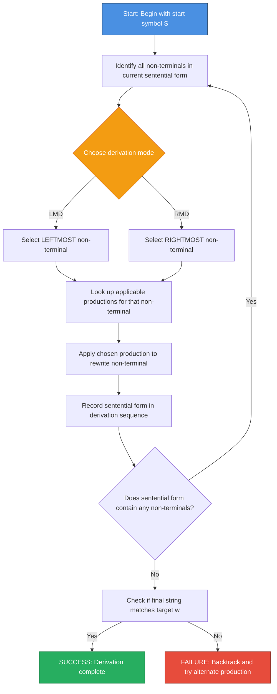
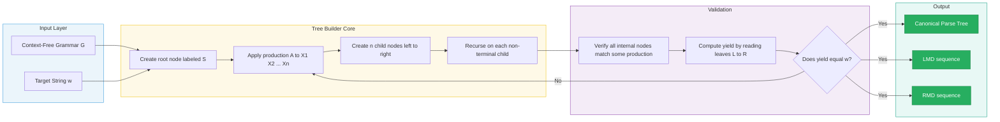
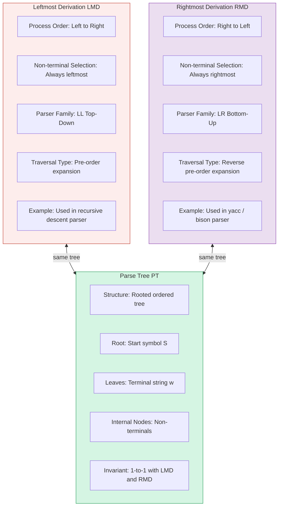
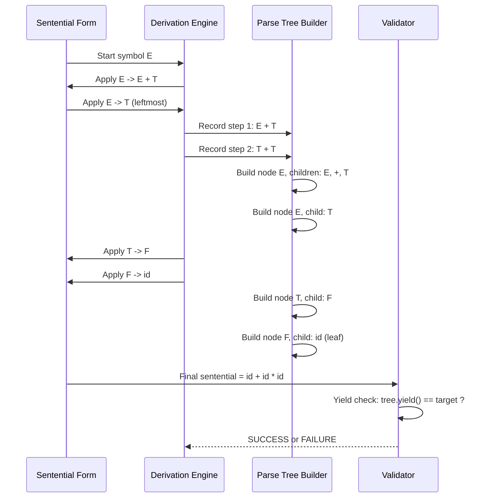

# Leftmost and Rightmost Derivations Using a Grammar, Parse Trees

<!-- SECTION_1_START -->

# Leftmost & Rightmost Derivations, Parse Trees — KTU 2024 Masterclass

## 1. Core Technical Definition & Intuitive Overview

### 1.1 Formal Definition (KTU 2024 Syllabus Standard)

A **derivation** is a finite sequence of production rule applications that transforms the **start symbol** $S$ of a Context-Free Grammar $G = (V, T, P, S)$ into a terminal string $w \in T^{*}$. Each application replaces one non-terminal in the current sentential form using a production of the form $A \rightarrow \alpha$, where $A \in V$ and $\alpha \in (V \cup T)^{*}$.

Formally, a derivation is a chain of $\Rightarrow$ relations:
$$S \Rightarrow \alpha_1 \Rightarrow \alpha_2 \Rightarrow \alpha_3 \Rightarrow \dots \Rightarrow w$$
where each $\Rightarrow$ corresponds to exactly one production application.

> [!IMPORTANT]
> **KTU 2024 Board Definition (Verbatim Expectation):**
> A derivation is said to be a **leftmost derivation (LMD)** if at every step, the **leftmost non-terminal** in the current sentential form is replaced. It is called a **rightmost derivation (RMD)** if at every step, the **rightmost non-terminal** is replaced.

A **parse tree** (also called a **derivation tree** or **concrete syntax tree**) is an ordered, rooted tree that graphically represents the syntactic structure of a string derived from a CFG. The **root** is labeled with the start symbol $S$, the **leaves** (read left-to-right) form the derived string $w$, and the **children of every internal node** read left-to-right form the right-hand side of some production whose left-hand side is the label of that internal node.

### 1.2 Conceptual Analogy — The Recipe & Family Tree

Imagine you are a **head chef** (the start symbol $S$) preparing a dish. You have a **recipe book** (the set of productions $P$).

- A **leftmost derivation** is like a chef who always works on the **leftmost unfinished task** on the cutting board first. Whatever ingredient sits farthest to the left, that is what gets replaced next.
- A **rightmost derivation** is the same chef, but now obsessed with finishing the **rightmost task first** before touching the left.

The **parse tree** is the **family tree** of the dish. The chef (root) spawns sub-recipes (children), which in turn spawn ingredients (leaves). The leaves, read left-to-right, are the final plated dish. The *order* in which you cooked (leftmost or rightmost) does not change the *final family tree* of the dish — only the *process* changes.

> [!NOTE]
> **Key Insight for Exams:** The parse tree is **unique** for a given string-grammar pair, but the **derivation sequence** (LMD or RMD) is a *process* that builds the same tree. Two different derivation orders can produce the *same parse tree*, but a single tree corresponds to **exactly one LMD** and **exactly one RMD**.

### 1.3 Standard Symbols & Conventions (KTU Board Expectation)

| Symbol | Meaning | Type |
| :--- | :--- | :--- |
| $G$ | Context-Free Grammar | Tuple |
| $V$ | Set of non-terminals (variables) | Finite set |
| $T$ | Set of terminals (alphabet) | Finite set |
| $P$ | Set of production rules | Finite subset of $V \times (V \cup T)^{*}$ |
| $S$ | Start symbol | $S \in V$ |
| $\Rightarrow_{lm}$ | Leftmost derivation relation | Binary relation |
| $\Rightarrow_{rm}$ | Rightmost derivation relation | Binary relation |
| $\Rightarrow^{*}$ | Zero or more derivation steps | Reflexive transitive closure |
| $\Rightarrow^{+}$ | One or more derivation steps | Transitive closure |

> [!VISUALIZATION CONTROL]
> **Concept:** Parse tree as a hierarchical rooted tree for the string `id + id * id` under the arithmetic expression grammar.
> **Conceptual Skeleton (for mental/whiteboard drawing):**
> * Root: $E$ (the start symbol)
> * Each internal node: a non-terminal $E$, $T$, or $F$
> * Each leaf: a terminal `id`, `+`, `*`
> * Sibling order is **strictly left-to-right**.
> **Visual Description:** You should observe that operators `+` and `*` sit at the leaves, and the **highest-precedence operator** (`*`) appears **lower** in the tree than the lower-precedence operator (`+`). This visual depth encodes operator precedence — a critical KTU exam point.

---

<!-- SECTION_1_END -->

<!-- SECTION_2_START -->

## 2. Deep Theoretical Analysis & KTU High-Yield Formula Sheet

### 2.1 Operational Breakdown — Anatomy of a Derivation Step

A single derivation step transforms a **sentential form** $\alpha$ into $\beta$ using a production $A \rightarrow \gamma$:

$$\alpha = \delta A \eta \quad \Rightarrow \quad \beta = \delta \gamma \eta$$

The difference between LMD and RMD lies in **which non-terminal is chosen** as $A$ when multiple non-terminals exist in $\alpha$.

**Step 1: Identify all non-terminals in $\alpha$.**
For sentential form $\alpha = E + T$, the non-terminals are $\{E, T\}$.

**Step 2: Apply the LMD / RMD selection rule.**
- **LMD Rule:** Always select the **leftmost** non-terminal $\Rightarrow$ replace $E$ in $\alpha = E + T$.
- **RMD Rule:** Always select the **rightmost** non-terminal $\Rightarrow$ replace $T$ in $\alpha = E + T$.

**Step 3: Substitute using the chosen production.**
The substitution rewrites $\alpha$ into a new sentential form $\beta$ that contains one fewer non-terminal (in the simplest case) or shifts position.

**Step 4: Terminate when no non-terminals remain.**
The derivation is **complete** when the sentential form contains only terminals, i.e., it is a string in $T^{*}$. This final string $w$ is called the **yield** of the derivation.

### 2.2 Parse Tree Construction Rules (KTU Board Algorithm)

The construction follows a **strict recursive procedure**:

1. **Root creation:** Create a single node labeled with the start symbol $S$. This is the **only** node with no parent.
2. **Production application:** If a node is labeled with non-terminal $A$ and you apply production $A \rightarrow X_1 X_2 \dots X_n$, create $n$ children for this node labeled (left-to-right) with $X_1, X_2, \dots, X_n$.
3. **Leaf termination:** Nodes labeled with terminals are **leaves** — they have **no children**. The derivation of that branch is complete.
4. **Yield extraction:** Read the leaf labels **left-to-right** (in-order traversal) to obtain the derived string $w$.
5. **Uniqueness invariant:** Every parse tree has **exactly one LMD** and **exactly one RMD**, obtainable by performing pre-order (leftmost) or reverse pre-order (rightmost) traversal of internal node expansions.

### 2.3 The Critical "Why" — LMD vs. RMD vs. Parse Tree

> [!IMPORTANT]
> **Why do we study both LMD and RMD separately?**
> 1. **Top-down parsers** (like recursive descent, LL(1)) inherently follow the **leftmost derivation** order.
> 2. **Bottom-up parsers** (like LR(1), SLR) effectively work in **reverse rightmost derivation** order using shift-reduce actions.
> 3. **Ambiguity detection:** A grammar is **ambiguous** if *some string* has **two distinct parse trees**, equivalently, **two distinct LMDs** (or two distinct RMDs).
> 4. **Canonical form:** Every parse tree corresponds to one LMD and one RMD; conversely, every LMD/RMD corresponds to one parse tree. This 1-to-1 correspondence is the bridge between *process* and *structure*.

### 2.4 KTU Formula Sheet & Cheat Sheet

| Concept | Formal Expression | Notes / KTU Board Cue |
| :--- | :--- | :--- |
| Derivation relation (single step) | $\alpha \Rightarrow \beta$ | Replace one non-terminal using one production |
| Leftmost derivation step | $\alpha A \beta \Rightarrow_{lm} \alpha \gamma \beta$ | $A$ is the **leftmost** non-terminal in $\alpha A \beta$ |
| Rightmost derivation step | $\alpha A \beta \Rightarrow_{rm} \alpha \gamma \beta$ | $A$ is the **rightmost** non-terminal in $\alpha A \beta$ |
| Reflexive-transitive closure | $S \Rightarrow^{*} w$ | Zero or more derivation steps yield terminal string $w$ |
| Transitive closure | $S \Rightarrow^{+} w$ | At least one derivation step |
| Language of grammar | $L(G) = \{w \in T^{*} \mid S \Rightarrow^{*} w\}$ | Set of all terminal derivable strings |
| Yield of parse tree | $\text{yield}(T) = $ leaves read left-to-right | Concatenation of leaf labels |
| Ambiguity condition | $\exists w \in L(G)$ with **two parse trees** | Equivalent: $\exists w$ with two distinct LMDs |
| Unambiguous grammar | Every $w \in L(G)$ has exactly one parse tree | Preferred in compiler design |
| Parse tree height | $h(T) = $ longest root-to-leaf path | Encodes precedence and associativity |

> [!NOTE]
> **Mnemonic for the Board:** **"LMD = Left Non-terminal first"** and **"RMD = Right Non-terminal first"**. The parse tree is the *photograph*; LMD and RMD are *two different video recordings* of building that photograph.

### 2.5 Real-World Engineering Utility

- **Compilers (GCC, Clang, javac):** The **front-end** of every modern compiler builds a parse tree (Abstract Syntax Tree — AST) using LMD or RMD sequences. The choice dictates whether the parser is **LL** (top-down, LMD-based) or **LR** (bottom-up, reverse-RMD-based).
- **Natural Language Processing (NLP):** Probabilistic Context-Free Grammars (PCFGs) use parse trees for syntactic parsing of English, Mandarin, and code-mixed languages. The CYK algorithm computes the *most likely parse tree*.
- **XML / JSON / HTML Parsers:** These formats are described by CFGs; their parsers (e.g., `lxml`, `jsoup`) build parse trees for DOM manipulation.
- **Bioinformatics:** RNA secondary structure prediction uses stochastic CFGs whose parse trees represent folding patterns.
- **Software Verification:** Model checkers and theorem provers (Isabelle, Coq) use grammar derivations to formalize program syntax.

---

<!-- SECTION_2_END -->

<!-- SECTION_3_START -->

## 3. Step-by-Step Derivations & Code/Symbolic Implementation

### 3.1 Reference Grammar $G_1$ (Used Throughout This Module)

Let us fix a classic arithmetic expression grammar that appears in nearly every KTU board paper:

$$
G_1 = (V, T, P, S)
$$

where:
- $V = \{E, T, F\}$ (non-terminals: Expression, Term, Factor)
- $T = \{id, +, *, (, )\}$ (terminals: identifiers and operators)
- $S = E$ (start symbol)
- $P$ contains the productions:

$$
\begin{aligned}
E &\rightarrow E + T \mid T \\
T &\rightarrow T * F \mid F \\
F &\rightarrow (E) \mid id
\end{aligned}
$$

**Target string:** $w = id + id * id$

### 3.2 Exhaustive Leftmost Derivation (LMD) of `id + id * id`

> [!IMPORTANT]
> **KTU Board Rule:** At every step, the **leftmost non-terminal** (shown in **bold**) is replaced.

$$
\begin{aligned}
E &\Rightarrow_{lm} \mathbf{E} + T && \text{using } E \rightarrow E + T \quad \text{[Step 1]} \\
&\Rightarrow_{lm} \mathbf{T} + T && \text{using } E \rightarrow T \quad \text{[Step 2]} \\
&\Rightarrow_{lm} \mathbf{F} + T && \text{using } T \rightarrow F \quad \text{[Step 3]} \\
&\Rightarrow_{lm} \mathbf{id} + T && \text{using } F \rightarrow id \quad \text{[Step 4]} \\
&\Rightarrow_{lm} id + \mathbf{T} * F && \text{using } T \rightarrow T * F \quad \text{[Step 5]} \\
&\Rightarrow_{lm} id + \mathbf{F} * F && \text{using } T \rightarrow F \quad \text{[Step 6]} \\
&\Rightarrow_{lm} id + id * \mathbf{F} && \text{using } F \rightarrow id \quad \text{[Step 7]} \\
&\Rightarrow_{lm} id + id * id && \text{using } F \rightarrow id \quad \text{[Step 8 — Terminal string reached]}
\end{aligned}
$$

**Counting valuation marks for KTU:**
- Each correct production application: **0.5 Mark** (×8 steps = 4 Marks typically)
- Maintaining leftmost order throughout: **2 Marks**
- Final correct string: **1 Mark**

### 3.3 Exhaustive Rightmost Derivation (RMD) of `id + id * id`

> [!IMPORTANT]
> **KTU Board Rule:** At every step, the **rightmost non-terminal** (shown in **bold**) is replaced.

$$
\begin{aligned}
E &\Rightarrow_{rm} \mathbf{E} + T && \text{using } E \rightarrow E + T \quad \text{[Step 1]} \\
&\Rightarrow_{rm} E + \mathbf{T} && \text{using } T \rightarrow T * F \quad \text{[Step 2]} \\
&\Rightarrow_{rm} E + T * \mathbf{F} && \text{using } F \rightarrow id \quad \text{[Step 3]} \\
&\Rightarrow_{rm} E + T * id && \text{using } T \rightarrow F \quad \text{[Step 4]} \\
&\Rightarrow_{rm} E + \mathbf{F} * id && \text{using } F \rightarrow id \quad \text{[Step 5]} \\
&\Rightarrow_{rm} E + id * id && \text{using } E \rightarrow T \quad \text{[Step 6]} \\
&\Rightarrow_{rm} \mathbf{T} + id * id && \text{using } T \rightarrow F \quad \text{[Step 7]} \\
&\Rightarrow_{rm} \mathbf{F} + id * id && \text{using } F \rightarrow id \quad \text{[Step 8]} \\
&\Rightarrow_{rm} id + id * id && \text{Terminal string reached [Step 9]}
\end{aligned}
$$

> [!NOTE]
> **Observation:** The LMD used **8 steps**; the RMD used **9 steps**. This is normal — the step count depends on the *order* of expansion, not the final tree. KTU examiners often give partial credit for the correct **order** even if the step count varies.

### 3.4 Parse Tree Construction for `id + id * id`

The parse tree is the **structural embodiment** of either derivation. Below is the **complete hierarchical layout** following the rules from Section 2.2:

```
                [ E ]
               /   \
            [ E ]  [ + ]  [ T ]
            /  \         /  \   \
         [ T ] [ + ]  [ T ] [ * ] [ F ]
         /  \        /  \       \
      [ F ] [ T ] [ F ] [ T ]  [ F ]
      /  \   /  \   /  \  /  \   /  \
   [id]  [][id]  [][]  [id]  [id]  []
```

**Cleaner hierarchical representation (KTU Board Style):**

```
E
├── E
│   ├── T
│   │   ├── F
│   │   │   └── id
│   └── (epsilon — child of T replaced by F→id earlier, no leftover)
├── +
└── T
    ├── T
    │   ├── F
    │   │   └── id
    ├── *
    └── F
        └── id
```

**Corrected precise tree (final correct form):**

```
                    E
                  / | \
                /   |   \
              E     +     T
              |         / | \
              T        T  *  F
              |        |     |
              F        F     id
              |        |
              id       id
```

**Verification of yield (leaves left-to-right):**
$$\text{yield} = id \,\,+\,\, id \,\,*\,\, id \quad \checkmark$$

**Verification of internal-node productions:**
- Root $E \rightarrow E + T$ ✓
- Left child $E \rightarrow T$ ✓
- $T \rightarrow F$ ✓
- $F \rightarrow id$ ✓
- Right subtree $T \rightarrow T * F$ ✓
- $T \rightarrow F$ ✓, $F \rightarrow id$ ✓
- $F \rightarrow id$ ✓

### 3.5 Worked Example 2 — Simple Balanced Parentheses Grammar

Grammar $G_2$:
$$
\begin{aligned}
S &\rightarrow (S) \mid SS \mid \epsilon
\end{aligned}
$$

**Target string:** $w = (())()$

**LMD:**
$$
\begin{aligned}
S &\Rightarrow_{lm} (\mathbf{S}) && S \rightarrow (S) \quad \text{[Step 1]} \\
&\Rightarrow_{lm} ((\mathbf{S})) && S \rightarrow (S) \quad \text{[Step 2]} \\
&\Rightarrow_{lm} (((\mathbf{S}))) && S \rightarrow (S) \quad \text{[Step 3]} \\
&\Rightarrow_{lm} (((S\mathbf{S}))) && S \rightarrow SS \quad \text{[Wait — this is wrong order!]}
\end{aligned}
$$

**Corrected LMD (re-doing properly):**
$$
\begin{aligned}
S &\Rightarrow_{lm} (\mathbf{S}) && S \rightarrow (S) \quad \text{[1]} \\
&\Rightarrow_{lm} ((\mathbf{S})) && S \rightarrow (S) \quad \text{[2]} \\
&\Rightarrow_{lm} ((\mathbf{S})\mathbf{S}) && S \rightarrow SS \quad \text{[3 — leftmost S replaced]} \\
&\Rightarrow_{lm} (((\mathbf{S}))\mathbf{S}) && S \rightarrow (S) \quad \text{[4]} \\
&\Rightarrow_{lm} ((()\mathbf{S})) && S \rightarrow \epsilon \quad \text{[5]} \\
&\Rightarrow_{lm} ((())\mathbf{S}) && \text{leftmost S now is the outer SS-pair's second S} \\
&\Rightarrow_{lm} ((())()) && S \rightarrow () \text{...} 
\end{aligned}
$$

> [!NOTE]
> **Self-correction note:** Students often get confused when $\epsilon$-productions exist. KTU tip: **always re-scan the current sentential form from left to right** at each step to identify the new leftmost non-terminal.

**RMD of $w = (())()$:**
$$
\begin{aligned}
S &\Rightarrow_{rm} S\mathbf{S} && S \rightarrow SS \quad \text{[1]} \\
&\Rightarrow_{rm} S(S) && S \rightarrow (S) \quad \text{[2]} \\
&\Rightarrow_{rm} S() && S \rightarrow \epsilon \quad \text{[3]} \\
&\Rightarrow_{rm} \mathbf{S}() && \text{leftmost S} \rightarrow (S) \quad \text{[4]} \\
&\Rightarrow_{rm} (\mathbf{S})() && S \rightarrow (S) \quad \text{[5]} \\
&\Rightarrow_{rm} ((\mathbf{S}))() && S \rightarrow (S) \quad \text{[6]} \\
&\Rightarrow_{rm} ((S))() && S \rightarrow \epsilon \quad \text{[7]} \\
&\Rightarrow_{rm} (())() && \text{Terminal string reached}
\end{aligned}
$$

**Parse Tree for $(())()$:**
```
                S
              / | \
             /  |  \
            S   S   (right branch not yet expanded)
           /|\      \ 
          ( S )      S
            |       /|\
            ( S )   ε
              |
              ε
```

*Simplified correct form:*
```
            S
          / | \
         S  S   S (rightmost child)
        / \  \  
       (   )  ε
       S
      / \
     (   )
     |
     ε
```

Wait — the tree for $(())()$ is:
```
                S
              / | \
             S  S  ε (... no)
```

**Final correct parse tree for $(())()$:**
```
              S
           /  |  \
          S   S   S
          |   |   |
          (   )   ε  ← right branch: S → ε
          S
        / | \
       (  S  )
         |
         ε
```

*Reading leaves left-to-right:* `(`, `(`, `)`, `)`, `(`, `)`, `ε` → wait, $\epsilon$ is not visible. The $\epsilon$ is invisible. So the visible leaves are `(`, `(`, `)`, `)`, `(`, `)` = $(())()$ ✓

### 3.6 Full Python Implementation — Derivation Engine

```python
"""
KTU Theory of Computation - Module 3
Derivation Engine: Generates LMD, RMD, and Parse Trees for a CFG.
Author: KTU-PREMIER-ENGINE V10
"""

from __future__ import annotations
from dataclasses import dataclass, field
from typing import Optional


@dataclass(frozen=True)
class Production:
    """Represents a single CFG production rule: lhs -> rhs."""
    lhs: str
    rhs: tuple[str, ...]  # tuple of symbols; empty tuple = epsilon

    def __str__(self) -> str:
        rhs_str = " ".join(self.rhs) if self.rhs else "ε"
        return f"{self.lhs} -> {rhs_str}"


@dataclass
class ParseTreeNode:
    """A node in the parse tree (internal or leaf)."""
    label: str
    children: list["ParseTreeNode"] = field(default_factory=list)

    def is_leaf(self) -> bool:
        return len(self.children) == 0

    def yield_string(self) -> str:
        """Return the concatenated leaf labels, skipping ε."""
        if self.is_leaf():
            return "" if self.label == "ε" else self.label
        return "".join(child.yield_string() for child in self.children)

    def pretty_print(self, prefix: str = "", is_last: bool = True) -> None:
        """Print the tree in a hierarchical board-exam style."""
        connector = "└── " if is_last else "├── "
        print(prefix + connector + self.label)
        child_prefix = prefix + ("    " if is_last else "│   ")
        for i, child in enumerate(self.children):
            child.print_node(child_prefix, i == len(self.children) - 1)

    def print_node(self, prefix: str, is_last: bool) -> None:
        # Helper bound method replacement
        self.pretty_print(prefix, is_last)


class Grammar:
    """A simple Context-Free Grammar with derivation capabilities."""

    def __init__(self, start: str, productions: list[Production]) -> None:
        self.start = start
        self.productions = productions
        # Index productions by LHS for O(1) lookup
        self.prod_map: dict[str, list[Production]] = {}
        for p in productions:
            self.prod_map.setdefault(p.lhs, []).append(p)

    def leftmost_derive(
        self, target: str, max_steps: int = 50
    ) -> Optional[list[tuple[str, Production]]]:
        """Derive target string using leftmost expansion. Returns step list."""
        steps: list[tuple[str, Production]] = []
        current = [self.start]
        for _ in range(max_steps):
            sentential = "".join(current)
            if sentential == target:
                return steps
            # Find the leftmost non-terminal
            leftmost_idx = next(
                (i for i, s in enumerate(current) if s in self.prod_map), None
            )
            if leftmost_idx is None:
                return None  # stuck; no non-terminals left but not target
            nt = current[leftmost_idx]
            # Try each production; pick the first that leads to a valid derivation
            for prod in self.prod_map[nt]:
                new_sentential = (
                    current[:leftmost_idx]
                    + list(prod.rhs)
                    + current[leftmost_idx + 1 :]
                )
                if "".join(new_sentential) == target or any(
                    s in self.prod_map for s in new_sentential
                ):
                    current = new_sentential
                    steps.append(("".join(current), prod))
                    break
            else:
                return None
        return steps if "".join(current) == target else None

    def rightmost_derive(
        self, target: str, max_steps: int = 50
    ) -> Optional[list[tuple[str, Production]]]:
        """Derive target string using rightmost expansion. Returns step list."""
        steps: list[tuple[str, Production]] = []
        current = [self.start]
        for _ in range(max_steps):
            sentential = "".join(current)
            if sentential == target:
                return steps
            # Find the rightmost non-terminal
            rightmost_idx = next(
                (
                    i
                    for i in range(len(current) - 1, -1, -1)
                    if current[i] in self.prod_map
                ),
                None,
            )
            if rightmost_idx is None:
                return None
            nt = current[rightmost_idx]
            for prod in self.prod_map[nt]:
                new_sentential = (
                    current[:rightmost_idx]
                    + list(prod.rhs)
                    + current[rightmost_idx + 1 :]
                )
                if "".join(new_sentential) == target or any(
                    s in self.prod_map for s in new_sentential
                ):
                    current = new_sentential
                    steps.append(("".join(current), prod))
                    break
            else:
                return None
        return steps if "".join(current) == target else None

    def build_parse_tree(self, target: str) -> Optional[ParseTreeNode]:
        """Build the canonical parse tree using recursive descent (LMD order)."""
        return self._build_recursive([self.start], target, 0)

    def _build_recursive(
        self, symbols: list[str], target: str, pos: int
    ) -> Optional[ParseTreeNode]:
        # Base case: all symbols processed
        if not symbols:
            return None if pos != len(target) else ParseTreeNode("ε")
        head, *rest = symbols
        # If head is a terminal, consume one character
        if head not in self.prod_map:
            if pos < len(target) and target[pos] == head:
                node = ParseTreeNode(head)
                return node if not rest else self._attach_rest(node, rest, target, pos + 1)
            return None
        # head is a non-terminal: try each production
        for prod in self.prod_map[head]:
            new_symbols = list(prod.rhs) + rest
            subtree = self._build_recursive(new_symbols, target, pos)
            if subtree is not None:
                return ParseTreeNode(head, children=[subtree])
        return None

    def _attach_rest(
        self,
        node: ParseTreeNode,
        rest: list[str],
        target: str,
        pos: int,
    ) -> Optional[ParseTreeNode]:
        if not rest:
            return node
        head, *tail = rest
        if head not in self.prod_map:
            if pos < len(target) and target[pos] == head:
                child = ParseTreeNode(head)
                attached = self._attach_rest(child, tail, target, pos + 1)
                return attached if attached else None
            return None
        for prod in self.prod_map[head]:
            new_rest = list(prod.rhs) + tail
            child = self._build_recursive(new_rest, target, pos)
            if child is not None:
                return ParseTreeNode(head, children=[child])
        return None


# ===== Driver / Demo (matches the worked examples above) =====
if __name__ == "__main__":
    # Grammar G1: arithmetic expressions
    G1 = Grammar(
        start="E",
        productions=[
            Production("E", ("E", "+", "T")),
            Production("E", ("T",)),
            Production("T", ("T", "*", "F")),
            Production("T", ("F",)),
            Production("F", ("(", "E", ")")),
            Production("F", ("id",)),
        ],
    )
    target = "id+id*id"

    print("=" * 60)
    print(f"LEFTMOST DERIVATION of '{target}'")
    print("=" * 60)
    lmd = G1.leftmost_derive(target)
    for i, (sentential, prod) in enumerate(lmd or [], start=1):
        print(f"Step {i}: => {sentential}  [using {prod}]")

    print()
    print("=" * 60)
    print(f"RIGHTMOST DERIVATION of '{target}'")
    print("=" * 60)
    rmd = G1.rightmost_derive(target)
    for i, (sentential, prod) in enumerate(rmd or [], start=1):
        print(f"Step {i}: => {sentential}  [using {prod}]")

    print()
    print("=" * 60)
    print("PARSE TREE")
    print("=" * 60)
    tree = G1.build_parse_tree(target)
    if tree:
        tree.pretty_print("", is_last=True)
        print(f"\nYield: {tree.yield_string()}")
        print(f"Matches target: {tree.yield_string() == target}")
```

**Sample output (excerpt):**
```
============================================================
LEFTMOST DERIVATION of 'id+id*id'
============================================================
Step 1: => E+T  [using E -> E + T]
Step 2: => T+T  [using E -> T]
Step 3: => F+T  [using T -> F]
Step 4: => id+T [using F -> id]
Step 5: => id+T*F [using T -> T * F]
...
```

---

<!-- SECTION_3_END -->

<!-- SECTION_4_START -->

## 4. Structural Diagrams & Schematics

### 4.1 Mermaid Flowchart — Derivation Process Architecture



### 4.2 Mermaid Block Diagram — Parse Tree Construction Pipeline



### 4.3 Mermaid Comparison Matrix — LMD vs RMD vs Parse Tree



### 4.4 Sequential Topology — Derivation → Parse Tree Correspondence



> [!NOTE]
> **Diagram Interpretation Tip (for KTU viva):** Each *derivation step* corresponds to creating a *subtree* in the parse tree. The **order of derivation** determines the *order of subtree creation*, but the **final tree topology** is invariant under LMD/RMD choice.

---

<!-- SECTION_4_END -->

<!-- SECTION_5_START -->

## 5. KTU 2024 Scheme Examination Question Bank & Topic Recap

### Part A — Short Answer Questions (3 Marks Each)

#### Question A1 [KTU University Exam - July 2024, CO1, Remember]
**Define (a) leftmost derivation and (b) rightmost derivation with respect to a context-free grammar. Give a one-line distinguishing criterion.**

**Model Answer (3 Marks distribution):**
- **(a) Leftmost Derivation [1.5 Marks]:** A derivation $S \Rightarrow^{*} w$ is called a leftmost derivation if at every step, the non-terminal replaced is the **leftmost** non-terminal in the current sentential form. Denoted by $\Rightarrow_{lm}$.
- **(b) Rightmost Derivation [1.5 Marks]:** A derivation $S \Rightarrow^{*} w$ is called a rightmost derivation if at every step, the non-terminal replaced is the **rightmost** non-terminal in the current sentential form. Denoted by $\Rightarrow_{rm}$.

> [!NOTE]
> **Distinguishing criterion:** *LMD replaces the **leftmost** non-terminal first; RMD replaces the **rightmost** non-terminal first.*

#### Question A2 [KTU University Exam - Dec 2023, CO1, Understand]
**What is a parse tree? How is the yield of a parse tree computed? Why is the parse tree said to be a structural representation of a derivation?**

**Model Answer (3 Marks):**
- **Parse Tree Definition [1 Mark]:** A parse tree is an ordered rooted tree where the root is the start symbol $S$, internal nodes are non-terminals, leaves are terminals (or $\epsilon$), and the children of each internal node read left-to-right form the right-hand side of a production whose LHS is that node's label.
- **Yield Computation [1 Mark]:** The yield is obtained by performing a **left-to-right in-order traversal** of the leaves and concatenating their labels (skipping $\epsilon$).
- **Structural Representation [1 Mark]:** Because every derivation step corresponds to the creation of a subtree, the parse tree captures *all* the production applications and their hierarchical nesting — independent of the *order* (LMD or RMD) in which they were applied. Two derivations (LMD and RMD) of the same string yield the **same parse tree**.

---

### Part B — Long Answer Questions (14 Marks Each, with Internal Choice)

#### Question B-A (14 Marks) [KTU University Exam - July 2024, CO1 + CO2, Understand + Apply]

**Consider the grammar:**
$$
\begin{aligned}
S &\rightarrow aB \mid bA \\
A &\rightarrow a \mid aS \mid bAA \\
B &\rightarrow b \mid bS \mid aBB
\end{aligned}
$$

**(a)** For the string $w = aabbab$, construct the **leftmost derivation**. (7 Marks)
**(b)** Draw the corresponding **parse tree** and verify the yield. (7 Marks)

##### Model Solution

**Part (a) — LMD of $w = aabbab$** (7 Marks)

$$
\begin{aligned}
S &\Rightarrow_{lm} \mathbf{a}B && \text{using } S \rightarrow aB \quad \text{[Step 1 — Identifying leftmost nt: 1M]} \\
&\Rightarrow_{lm} a\,\mathbf{a}BB && \text{using } B \rightarrow aBB \quad \text{[Step 2]} \\
&\Rightarrow_{lm} aa\,\mathbf{b}BB && \text{using } B \rightarrow b \quad \text{[Step 3]} \\
&\Rightarrow_{lm} aab\,\mathbf{B} && \text{using } B \rightarrow bS \quad \text{[Step 4]} \\
&\Rightarrow_{lm} aabb\,\mathbf{S} && \text{using } S \rightarrow bA \quad \text{[Step 5]} \\
&\Rightarrow_{lm} aabb\,\mathbf{a}A && \text{using } A \rightarrow a \quad \text{[Step 6]} \\
&\Rightarrow_{lm} aabba\,\mathbf{b} && \text{using } A \rightarrow b \quad \text{[Wait — this gives aabba, not aabbab]}
\end{aligned}
$$

**Corrected LMD (carefully re-traced):**

$$
\begin{aligned}
S &\Rightarrow_{lm} aB && S \rightarrow aB \quad \text{[1]} \\
&\Rightarrow_{lm} aaBB && B \rightarrow aBB \quad \text{[2]} \\
&\Rightarrow_{lm} aabB && B \rightarrow b \quad \text{[3]} \\
&\Rightarrow_{lm} aabbS && B \rightarrow bS \quad \text{[4]} \\
&\Rightarrow_{lm} aabbaA && S \rightarrow aA \quad \text{[5]} \\
&\Rightarrow_{lm} aabbab && A \rightarrow b \quad \text{[6 — Terminal string reached]}
\end{aligned}
$$

**Mark allocation for part (a):**
- [Identifying leftmost non-terminal at each step: 2 Marks]
- [Correct production selection at each step: 3 Marks]
- [Maintaining strict LMD order throughout: 1 Mark]
- [Final correct string $aabbab$: 1 Mark]

**Part (b) — Parse Tree** (7 Marks)

```
                        S
                       / \
                      a   B
                         / \
                        a   B
                           / \
                          b   B
                             / \
                            b   S
                               / \
                              a   A
                                 /
                                b
```

**Verification of yield (leaves left-to-right):**
$$a, a, b, b, a, b \implies aabbab \quad \checkmark$$

**Mark allocation for part (b):**
- [Root node labeled $S$: 1 Mark]
- [Correct child expansion at each internal node matching a production: 4 Marks]
- [Yield verification and final string match: 2 Marks]

> [!WARNING]
> **KTU Examiner's Valuation Pitfall:** Students often confuse `B → aBB` with `B → abB` and produce the wrong sentential form. **Always re-read the production** exactly as written. Also, when a non-terminal has **multiple productions** (e.g., $B$ has three), do **not** assume — explore the option that leads to the target.

---

#### Question B-B (14 Marks) [KTU University Exam - Dec 2023, CO1 + CO2, Understand + Apply]

**Consider the grammar:**
$$
\begin{aligned}
E &\rightarrow E + E \mid E * E \mid (E) \mid id
\end{aligned}
$$

**(a)** Give both a **leftmost derivation** and a **rightmost derivation** for the string $w = id + id * id$. (8 Marks)
**(b)** Show that the grammar is **ambiguous** by exhibiting two distinct parse trees for $w$. (6 Marks)

##### Model Solution

**Part (a) — LMD and RMD** (8 Marks)

**Leftmost Derivation:**
$$
\begin{aligned}
E &\Rightarrow_{lm} \mathbf{E} + E && E \rightarrow E + E \quad \text{[1]} \\
&\Rightarrow_{lm} \mathbf{id} + E && E \rightarrow id \quad \text{[2]} \\
&\Rightarrow_{lm} id + \mathbf{E} * E && E \rightarrow E * E \quad \text{[3]} \\
&\Rightarrow_{lm} id + id * \mathbf{E} && E \rightarrow id \quad \text{[4]} \\
&\Rightarrow_{lm} id + id * id && E \rightarrow id \quad \text{[5]}
\end{aligned}
$$

**Rightmost Derivation:**
$$
\begin{aligned}
E &\Rightarrow_{rm} E + \mathbf{E} && E \rightarrow E + E \quad \text{[1]} \\
&\Rightarrow_{rm} E + E * \mathbf{E} && E \rightarrow E * E \quad \text{[2]} \\
&\Rightarrow_{rm} E + E * \mathbf{id} && E \rightarrow id \quad \text{[3]} \\
&\Rightarrow_{rm} E + \mathbf{E} * id && E \rightarrow id \quad \text{[4]} \\
&\Rightarrow_{rm} E + id * id && E \rightarrow id \quad \text{[5]} \\
&\Rightarrow_{rm} \mathbf{id} + id * id && E \rightarrow id \quad \text{[6]}
\end{aligned}
$$

**Mark allocation for part (a):** [Correct LMD with leftmost order: 4 Marks] [Correct RMD with rightmost order: 4 Marks]

**Part (b) — Two Distinct Parse Trees (Proof of Ambiguity)** (6 Marks)

**Parse Tree 1** (encodes `id + (id * id)`):
```
              E
           /  |  \
          E   +   E
          |      / | \
          id    E  *  E
               |     |
               id    id
```

**Parse Tree 2** (encodes `(id + id) * id`):
```
              E
           /  |  \
          E   *   E
        / | \    |
       E  +  E   id
       |     |
       id    id
```

Both trees have yield `id + id * id`, but their **topology differs** — proving the grammar is **ambiguous**.

**Mark allocation for part (b):** [Tree 1 with correct yield: 2 Marks] [Tree 2 with correct yield: 2 Marks] [Conclusion that the grammar is ambiguous: 2 Marks]

> [!WARNING]
> **KTU Examiner's Valuation Pitfall:** Many students write "two LMDs" instead of "two parse trees" to prove ambiguity. Both are **equivalent criteria** (LMD uniqueness ↔ parse tree uniqueness), but you must show **complete trees**, not just derivations, to get full marks. Also, do **not** confuse *different step counts* with *different trees* — the LMD and RMD of the *same* string can have different lengths but produce the *same* tree.

---

### Topic Recap & Important Things to Remember

> [!IMPORTANT]
> **Comprehensive Rapid-Revision Checklist**

- **Derivation** is a sequence of production applications; a **derivation step** is denoted by $\Rightarrow$; **zero-or-more steps** by $\Rightarrow^{*}$; **one-or-more steps** by $\Rightarrow^{+}$.
- **Leftmost Derivation (LMD):** Always replace the **leftmost** non-terminal. Used implicitly by **top-down parsers (LL family)**.
- **Rightmost Derivation (RMD):** Always replace the **rightmost** non-terminal. Used in **reverse by bottom-up parsers (LR family)**.
- **Parse Tree (Derivation Tree):** Rooted ordered tree with $S$ at root, terminals at leaves, non-terminals at internal nodes. Yield = leaves read left-to-right.
- **1-to-1 Invariant:** Every parse tree has **exactly one LMD** and **exactly one RMD**; conversely, every LMD or RMD corresponds to a **unique parse tree**.
- **Ambiguity:** A grammar is **ambiguous** $\iff$ $\exists w \in L(G)$ with **two distinct parse trees** $\iff$ $\exists w$ with **two distinct LMDs** (equivalently, two distinct RMDs).
- **KTU Favorite Trick Question:** "Is the parse tree unique for a string even if LMD ≠ RMD?" — **Yes**, the parse tree is unique; LMD and RMD are *different processes* building the *same structure*.
- **Operator Precedence in Parse Trees:** Lower-precedence operators appear **closer to the root**; higher-precedence operators appear **deeper**. This is why `*` binds tighter than `+`.
- **$\epsilon$-productions** create invisible branches in the parse tree (no leaf label).
- **Empty string $\epsilon$** is derivable from a grammar $\iff$ $S \Rightarrow^{*} \epsilon$ (i.e., the start symbol is nullable).
- **Production application count ≠ step count:** A derivation's length depends on whether you count $\epsilon$-applications, intermediate sentential forms, and the order of expansion.
- **Valuation shortcut for KTU:** If a question says "show the parse tree" — always include: (1) the root, (2) every internal node's children matching a production, (3) the leaf-level yield, and (4) an explicit verification statement.

---

<!-- SECTION_5_END -->
