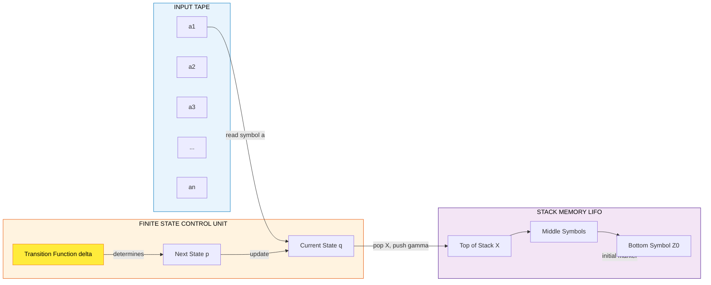
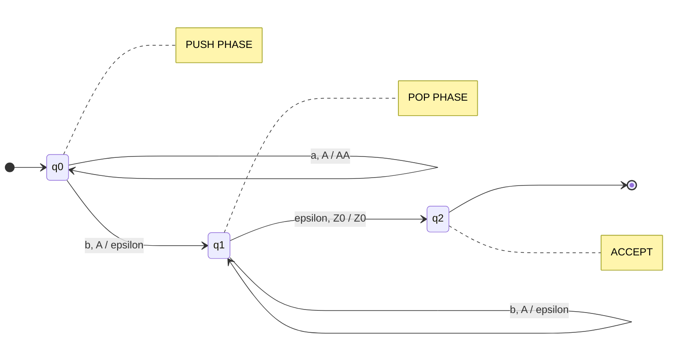
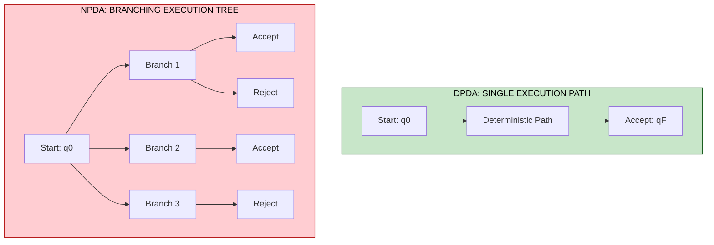
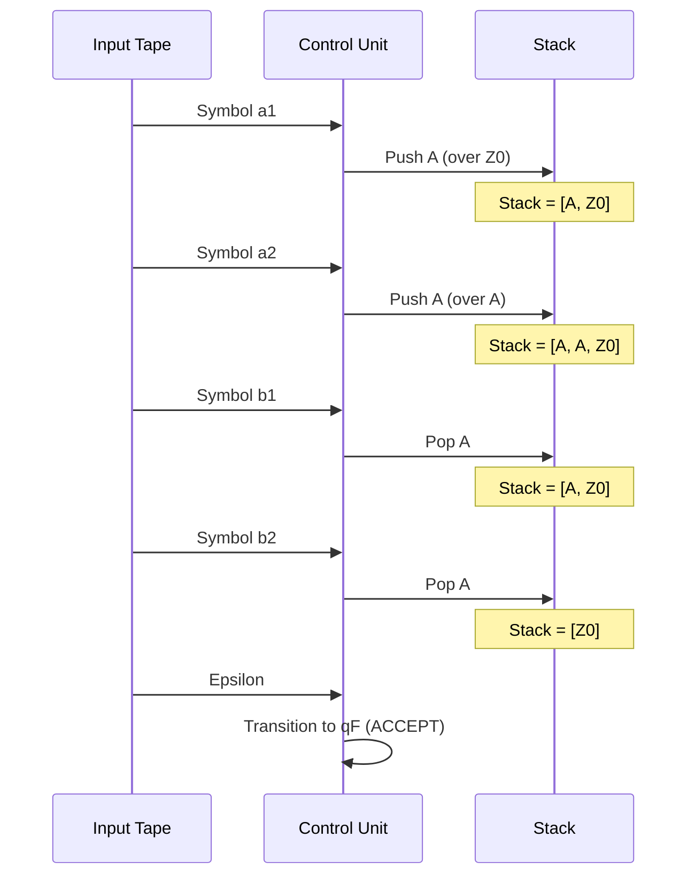

# Pushdown Automata: Formal definition of a pushdown automaton (PDA), DPDA and NPDA, Examples

<!-- SECTION_1_START -->
# Pushdown Automata: The Memory-Augmented State Machine

## 1.1 Formal Academic Definition (KTU 2024 Syllabus Standard)

A **Pushdown Automaton (PDA)** is a finite-state machine equipped with an auxiliary memory in the form of a **stack** (a Last-In-First-Out data structure). Formally, a PDA is a **7-tuple** mathematical structure:

$$M = (Q, \Sigma, \Gamma, \delta, q_0, Z_0, F)$$

where each component is defined as:

| Symbol | Component Name | Mathematical Role |
| :--- | :--- | :--- |
| $Q$ | Finite set of states | Control unit's discrete configurations |
| $\Sigma$ | Finite input alphabet | Allowed input symbols ($\varepsilon$ is **not** in $\Sigma$) |
| $\Gamma$ | Finite stack alphabet | Symbols that can be pushed onto the stack |
| $\delta$ | Transition function | The "brain" governing state changes |
| $q_0$ | Start state | $q_0 \in Q$, the initial configuration |
| $Z_0$ | Initial stack symbol | $Z_0 \in \Gamma$, placed on stack initially |
| $F$ | Set of final states | $F \subseteq Q$, accepting configurations |

The transition function $\delta$ is formally defined as:

$$\delta : Q \times (\Sigma \cup \{\varepsilon\}) \times (\Gamma \cup \{\varepsilon\}) \rightarrow \mathcal{P}_{\text{finite}}(Q \times \Gamma^*)$$

This means: for any combination of *(current state, current input symbol or empty, current stack-top symbol or empty)*, the PDA may transition to a *new state* and *replace the stack top with any finite string* of stack symbols.

> [!IMPORTANT]
> **KTU 2024 Highlight:** The transition $\delta$ is a **relation**, not a strict function. A PDA may have *zero, one, or multiple* valid moves for the same configuration. This non-determinism is what gives PDAs their computational superpower over DFAs.

> [!NOTE]
> **Why a stack?** Regular languages (recognized by DFAs/NFAs) cannot count or remember unbounded information. A stack provides **unbounded memory** that grows and shrinks in a controlled LIFO order — perfect for matching nested or balanced structures.

---

## 1.2 Intuitive Real-World Analogy

Imagine a **bookkeeper working through a stack of invoices**:

- The bookkeeper has a **mental state** (calm, alarmed, double-checking).
- The bookkeeper **reads one invoice** (input symbol) at a time from a tray.
- The bookkeeper has a **vertical file tray (the stack)** where they can either:
  - **Push** a new folder on top (with a marker like "A" or "B").
  - **Pop** the top folder off and compare it.
  - **Replace** the top folder with several new ones.
- The bookkeeper **accepts** the pile of invoices if, after processing, they reach a state of satisfaction and the file tray is in a particular condition.

> This bookkeeper is your **PDA**. The invoices are the **input string**, the file tray is the **stack**, and the mental states are the **finite states** $Q$.

> [!TIP]
> **Geometric Intuition:** Picture the stack as a vertical tower. The PDA can only "see" and manipulate the **top block** of the tower. Pushing adds a new block on top; popping removes the top block. This is why PDAs are *exquisitely* suited for languages like $\{a^n b^n \mid n \geq 1\}$ — they essentially count $a$'s by pushing, then count $b$'s by popping.

> [!VISUALIZATION CONTROL]
> **Concept:** Stack Growth/Decay for the language $L = \{a^n b^n\}$
> **GeoGebra / Desmos Input Equations:**
> * `f_1(x) = 2` (constant line representing initial stack top $Z_0$)
> * `f_2(x) = 4` (after pushing two $A$'s)
> * `f_3(x) = 3` (after popping one $A$)
> * `f_4(x) = 2` (back to initial depth)
> **Visual Description:** Plot the **stack depth** on the y-axis and the **input string position** on the x-axis. The depth rises linearly during the $a$-phase, then falls linearly during the $b$-phase, forming a perfect **pyramid / triangle**. The peak height equals $n$.

---

## 1.3 The Two Species of PDAs

| Feature | **DPDA** (Deterministic PDA) | **NPDA** (Non-Deterministic PDA) |
| :--- | :--- | :--- |
| Transition choices | At most **one** move per configuration | **Zero, one, or more** moves possible |
| Power | Strictly **weaker** than NPDA | Strictly **more powerful** than DPDA |
| Ambiguity | Cannot model inherently ambiguous languages | Can handle inherently ambiguous CFLs |
| Practical use | Parsers, compilers (LR parsing) | Theoretical models, parsing algorithms |
| KTU relevance | Often asked in 3-mark questions | Often asked in 14-mark problems |

> [!IMPORTANT]
> **Critical KTU Fact:** $L = \{ww^R \mid w \in \{a,b\}^*\}$ (even-length palindromes) is recognized by an **NPDA** but is **not** recognizable by any DPDA. However, $L = \{a^n b^n \mid n \geq 1\}$ **is** deterministic.

<!-- SECTION_1_END -->

<!-- SECTION_2_START -->
# Deep Theoretical Analysis & KTU High-Yield Formula Sheet

## 2.1 Anatomy of the Transition Function $\delta$

The transition $\delta(q, a, X) = \{(p_1, \gamma_1), (p_2, \gamma_2), \ldots\}$ is interpreted as:

> *"When the PDA is in state $q$, reads input symbol $a$ (or $\varepsilon$), and has $X$ on top of the stack, it may move to state $p_i$ and replace $X$ with the string $\gamma_i$."*

### Operational Semantics (the "pop-push" rule)

When the rule $(p, \gamma) \in \delta(q, a, X)$ fires:
1. **Consume** the input symbol $a$ (or read $\varepsilon$ without consuming).
2. **Pop** the top stack symbol $X$.
3. **Push** the symbols of $\gamma$ (leftmost symbol becomes the new stack top).
4. **Transition** to state $p$.

If $\gamma = \varepsilon$ (empty string), the operation is a **pure pop**.

### Determinism Constraint for DPDA

For a PDA to be **deterministic**, for every reachable configuration $(q, a, X)$ where $a \in \Sigma \cup \{\varepsilon\}$ and $X \in \Gamma$:
- Either $\vert \delta(q, a, X) \vert \leq 1$ and $\vert \delta(q, \varepsilon, X) \vert = 0$,
- Or $\vert \delta(q, a, X) \vert = 0$ and $\vert \delta(q, \varepsilon, X) \vert \leq 1$,

and this must hold globally without ambiguity across all states and symbols.

---

## 2.2 Acceptance Criteria — Two Parallel Universes

A PDA can accept a string in **two equivalent ways** (both are valid KTU definitions):

| Criterion | Definition | Notation |
| :--- | :--- | :--- |
| **Acceptance by Final State** | Input fully consumed AND current state $\in F$ (stack contents ignored) | $L(M) = \{w \in \Sigma^* \mid (q_0, w, Z_0) \vdash^*_M (q, \varepsilon, \gamma), q \in F\}$ |
| **Acceptance by Empty Stack** | Input fully consumed AND stack is empty (final state ignored) | $N(M) = \{w \in \Sigma^* \mid (q_0, w, Z_0) \vdash^*_M (q, \varepsilon, \varepsilon)\}$ |

> [!NOTE]
> **Equivalence Theorem:** For any PDA $M_1$ that accepts by final state, there exists a PDA $M_2$ that accepts the same language by empty stack, and vice versa. The construction introduces an extra state $q_e$ that empties the stack when $Z_0$ is the only symbol remaining.

---

## 2.3 Instantaneous Description (ID) — The "Snapshot" Notation

An **Instantaneous Description** is a triple $(q, w, \gamma)$ representing:
- $q$ : current state
- $w$ : remaining input string
- $\gamma$ : current stack contents (top of stack is the **leftmost** symbol)

The **turnstile notation** $\vdash$ represents one PDA move:

$$(q, aw, X\beta) \vdash (p, w, \gamma\beta)$$

iff $(p, \gamma) \in \delta(q, a, X)$ and $a \in \Sigma \cup \{\varepsilon\}$.

The reflexive-transitive closure $\vdash^*$ represents zero or more moves.

---

## 2.4 KTU High-Yield Formula & Definition Cheat Sheet

| # | Concept | Formula / Definition | Use Case |
| :--- | :--- | :--- | :--- |
| 1 | PDA 7-tuple | $M = (Q, \Sigma, \Gamma, \delta, q_0, Z_0, F)$ | Formal construction of any PDA |
| 2 | Transition function | $\delta : Q \times (\Sigma \cup \{\varepsilon\}) \times (\Gamma \cup \{\varepsilon\}) \to \mathcal{P}(Q \times \Gamma^*)$ | Defining moves |
| 3 | Final-state acceptance | $(q_0, w, Z_0) \vdash^* (q, \varepsilon, \gamma), \ q \in F$ | Most common KTU form |
| 4 | Empty-stack acceptance | $(q_0, w, Z_0) \vdash^* (q, \varepsilon, \varepsilon)$ | Theoretic equivalence proof |
| 5 | Determinism rule | $\vert \delta(q, a, X) \vert + \vert \delta(q, \varepsilon, X) \vert \leq 1$ for all valid triples | Distinguishing DPDA from NPDA |
| 6 | ID turnstile | $(q, aw, X\beta) \vdash (p, w, \gamma\beta)$ | Proving trace sequences |
| 7 | Language class | $L(M) \subseteq \Sigma^*$ is a **Context-Free Language (CFL)** | Connecting PDA to CFG |
| 8 | Power hierarchy | $\text{Regular} \subsetneq \text{DCFL} \subsetneq \text{CFL}$ | DPDA-recognizable $\subset$ NPDA-recognizable |
| 9 | CFL equivalence | Every CFL is accepted by some PDA (and vice versa) | Foundation of parsing theory |
| 10 | Pumping lemma for CFL | $w = uvxyz$ with $\vert vxy \vert \leq p$, $\vert vy \geq 1$, $uv^nxy^nz \in L$ | Proving a language is *not* CFL |

---

## 2.5 Real-World Engineering Utility

| Application Domain | How PDA is Used |
| :--- | :--- |
| **Compiler Design** | DPDA models the behavior of **LR parsers** (used in YACC, Bison). |
| **XML / HTML Validation** | Matching nested tags like `<a><b></b></a>` is PDA behavior. |
| **Programming Language Syntax** | Balanced parentheses, begin-end blocks, function nesting. |
| **Theorem Provers** | Type-checking in functional languages uses stack-based automata. |
| **Network Protocol Verification** | Modeling connection handshake states with memory. |

<!-- SECTION_2_END -->

<!-- SECTION_3_START -->
# Step-by-Step Derivations, Traces & Code Implementation

## 3.1 Example 1: PDA for $L = \{a^n b^n \mid n \geq 1\}$

### 3.1.1 Design Intuition

We need to verify that the number of $a$'s equals the number of $b$'s. The stack acts as a counter:
- For every $a$ read, **push** an $A$ on the stack.
- For every $b$ read, **pop** an $A$ from the stack.
- If at the end the input is fully consumed AND the stack contains only the initial symbol $Z_0$ (or equivalently, we are in an accepting state), accept.

### 3.1.2 Formal Definition

Let $M_1 = (Q, \Sigma, \Gamma, \delta, q_0, Z_0, F)$ where:
- $Q = \{q_0, q_1, q_2\}$
- $\Sigma = \{a, b\}$
- $\Gamma = \{A, Z_0\}$
- $F = \{q_2\}$

### 3.1.3 Exhaustive Transition Rules

$$
\begin{aligned}
&\text{Rule 1 (Push on 'a'):} \quad \delta(q_0, a, Z_0) = \{(q_0, AZ_0)\} \\
&\text{Rule 2 (Push on 'a'):} \quad \delta(q_0, a, A) = \{(q_0, AA)\} \\
&\text{Rule 3 (Switch to pop-phase on 'b'):} \quad \delta(q_0, b, A) = \{(q_1, \varepsilon)\} \\
&\text{Rule 4 (Pop on 'b'):} \quad \delta(q_1, b, A) = \{(q_1, \varepsilon)\} \\
&\text{Rule 5 (Accept on empty input with $Z_0$ on stack):} \quad \delta(q_1, \varepsilon, Z_0) = \{(q_2, Z_0)\}
\end{aligned}
$$

### 3.1.4 Exhaustive Trace for Input $w = aabb$

We trace using ID notation $(q, \text{remaining input}, \text{stack})$ — stack shown as `[top ... bottom]`.

$$
\begin{aligned}
&(q_0, aabb, Z_0) \\
&\vdash (q_0, abb, AZ_0) && \text{[Rule 1: read 'a', push 'A' over } Z_0] \\
&\vdash (q_0, bb, AAZ_0) && \text{[Rule 2: read 'a', push 'A' over existing 'A']} \\
&\vdash (q_1, b, AZ_0) && \text{[Rule 3: read 'b', pop top 'A', switch to } q_1] \\
&\vdash (q_1, \varepsilon, Z_0) && \text{[Rule 4: read 'b', pop 'A'}] \\
&\vdash (q_2, \varepsilon, Z_0) && \text{[Rule 5: } \varepsilon\text{-move to final state } q_2]
\end{aligned}
$$

**Result:** $q_2 \in F$, so $aabb \in L(M_1)$. ✅

### 3.1.5 Rejection Trace for Input $w = aab$

$$
\begin{aligned}
&(q_0, aab, Z_0) \\
&\vdash (q_0, ab, AZ_0) && \text{[Rule 1]} \\
&\vdash (q_0, b, AAZ_0) && \text{[Rule 2]} \\
&\vdash (q_1, \varepsilon, AZ_0) && \text{[Rule 3]}
\end{aligned}
$$

Input is empty, but the stack still has $A$ and we are in $q_1 \notin F$. The PDA halts without accepting. ❌

> [!WARNING]
> **Valuation Pitfall:** Students often forget to include the $\varepsilon$-transition (Rule 5) that moves from $q_1$ to $q_2$ when the stack has only $Z_0$. Without this rule, the PDA cannot accept any string.

---

## 3.2 Example 2: PDA for $L = \{ww^R \mid w \in \{a, b\}^+\}$ (Even-Length Palindromes)

### 3.2.1 Design Intuition

The PDA must guess the midpoint of $w w^R$ — this is **non-deterministic**. It pushes symbols of $w$, then pops them while matching $w^R$.

### 3.2.2 Formal Definition

Let $M_2 = (Q, \Sigma, \Gamma, \delta, q_0, Z_0, F)$ where:
- $Q = \{q_0, q_1, q_2\}$
- $\Sigma = \{a, b\}$
- $\Gamma = \{a, b, Z_0\}$
- $F = \{q_2\}$

### 3.2.3 Transition Rules

$$
\begin{aligned}
&\delta(q_0, a, a) = \{(q_0, aa)\} && \text{[Push on 'a' in push-phase]} \\
&\delta(q_0, b, b) = \{(q_0, bb)\} && \text{[Push on 'b' in push-phase]} \\
&\delta(q_0, a, Z_0) = \{(q_0, aZ_0)\} && \text{[Push first symbol over } Z_0] \\
&\delta(q_0, b, Z_0) = \{(q_0, bZ_0)\} && \text{[Push first symbol over } Z_0] \\
&\delta(q_0, \varepsilon, a) = \{(q_1, a)\} && \text{[Non-det. guess midpoint, state switch]} \\
&\delta(q_0, \varepsilon, b) = \{(q_1, b)\} && \text{[Non-det. guess midpoint, state switch]} \\
&\delta(q_1, a, a) = \{(q_1, \varepsilon)\} && \text{[Pop 'a' to match]} \\
&\delta(q_1, b, b) = \{(q_1, \varepsilon)\} && \text{[Pop 'b' to match]} \\
&\delta(q_1, \varepsilon, Z_0) = \{(q_2, Z_0)\} && \text{[Accept when input empty and only } Z_0 \text{ left]}
\end{aligned}
$$

### 3.2.4 Exhaustive Trace for $w = abba$

The PDA **guesses** the midpoint between the two $b$'s.

$$
\begin{aligned}
&(q_0, abba, Z_0) \\
&\vdash (q_0, bba, aZ_0) && \text{[Push 'a' over } Z_0] \\
&\vdash (q_0, ba, baZ_0) && \text{[Push 'b' over 'a']} \\
&\vdash (q_1, ba, baZ_0) && \text{[Guess midpoint via } \varepsilon \text{-move]} \\
&\vdash (q_1, a, aZ_0) && \text{[Match: pop 'b' for 'b' input]} \\
&\vdash (q_1, \varepsilon, Z_0) && \text{[Match: pop 'a' for 'a' input]} \\
&\vdash (q_2, \varepsilon, Z_0) && \text{[Accept: } \varepsilon\text{-move to final state]}
\end{aligned}
$$

**Result:** $abba \in L(M_2)$. ✅

> [!IMPORTANT]
> This language **cannot** be recognized by any DPDA. The non-deterministic $\varepsilon$-move at the midpoint is essential.

---

## 3.3 Python Implementation: Deterministic PDA Simulator

```python
"""
PDA Simulator for L = {a^n b^n | n >= 1}
Acceptance Mode: Final State with epsilon-move
KTU Reference: PCCST302 - Module 3
"""

from typing import Set, Tuple, Dict, List

# Type aliases for readability
State = str
StackSymbol = str
InputSymbol = str
TransitionKey = Tuple[State, InputSymbol, StackSymbol]
TransitionValue = Set[Tuple[State, str]]  # (new_state, stack_replacement)


class PDA:
    def __init__(
        self,
        states: Set[State],
        input_alphabet: Set[InputSymbol],
        stack_alphabet: Set[StackSymbol],
        transitions: Dict[TransitionKey, TransitionValue],
        start_state: State,
        initial_stack: StackSymbol,
        final_states: Set[State],
    ) -> None:
        self.states = states
        self.input_alphabet = input_alphabet
        self.stack_alphabet = stack_alphabet
        self.transitions = transitions
        self.start_state = start_state
        self.initial_stack = initial_stack
        self.final_states = final_states
        self.trace: List[str] = []  # For human-readable trace

    def _log(self, state: State, remaining: str, stack: str) -> None:
        """Record an instantaneous description to the trace log."""
        entry = f"(q={state}, input='{remaining}', stack='{stack}')"
        self.trace.append(entry)

    def accepts(self, input_string: str) -> bool:
        """Determine if the input string is accepted. Uses BFS over configurations."""
        # Each configuration: (current_state, remaining_input, current_stack)
        initial_config: Tuple[State, str, str] = (
            self.start_state,
            input_string,
            self.initial_stack,
        )
        configurations: List[Tuple[State, str, str]] = [initial_config]
        self.trace = []
        self._log(*initial_config)

        epsilon_symbol = ""  # Convention: empty string denotes epsilon

        # BFS ensures we explore all non-deterministic branches up to a depth limit
        max_depth = 200
        for _ in range(max_depth):
            next_configurations: List[Tuple[State, str, str]] = []
            for state, remaining, stack in configurations:
                if not stack:
                    # Cannot pop from an empty stack; skip this branch
                    continue

                # Determine candidate input symbols to try: real symbol + epsilon
                candidate_inputs: List[InputSymbol] = [epsilon_symbol]
                if remaining:
                    candidate_inputs.append(remaining[0])

                for symbol in candidate_inputs:
                    top_symbol = stack[0]
                    key: TransitionKey = (state, symbol, top_symbol)

                    if key in self.transitions:
                        for new_state, replacement in self.transitions[key]:
                            # Pop the top symbol, push the replacement (left = new top)
                            new_stack = (replacement + stack[1:]) if replacement else stack[1:]
                            new_remaining = remaining[1:] if symbol else remaining
                            new_config = (new_state, new_remaining, new_stack)
                            next_configurations.append(new_config)
                            self._log(*new_config)

            if not next_configurations:
                break  # No further moves possible
            configurations = next_configurations

        # Check acceptance: input fully consumed AND state is final
        for state, remaining, stack in configurations:
            if not remaining and state in self.final_states:
                return True
        return False

    def print_trace(self) -> None:
        """Pretty-print the execution trace."""
        print("\n--- PDA Execution Trace ---")
        for i, step in enumerate(self.trace):
            arrow = "  =>  " if i > 0 else ""
            print(f"Step {i:02d}: {arrow}{step}")
        print("--- End of Trace ---\n")


# === Construction of M1: PDA for L = {a^n b^n | n >= 1} ===
states: Set[State] = {"q0", "q1", "q2"}
input_alphabet: Set[InputSymbol] = {"a", "b"}
stack_alphabet: Set[StackSymbol] = {"A", "Z0"}
transitions: Dict[TransitionKey, TransitionValue] = {
    # Push phase: stack grows with 'A' for every 'a'
    ("q0", "a", "Z0"): {("q0", "AZ0")},
    ("q0", "a", "A"): {("q0", "AA")},
    # Pop phase: switch state and pop 'A' for every 'b'
    ("q0", "b", "A"): {("q1", "")},
    ("q1", "b", "A"): {("q1", "")},
    # Epsilon-move to accept when only Z0 remains
    ("q1", "", "Z0"): {("q2", "Z0")},
}
final_states: Set[State] = {"q2"}

pda = PDA(
    states, input_alphabet, stack_alphabet,
    transitions, "q0", "Z0", final_states
)

# === Test Cases ===
test_cases = ["ab", "aabb", "aaabbb", "aab", "ba", "ε", "aa"]
for test in test_cases:
    result = pda.accepts(test)
    status = "ACCEPTED ✅" if result else "REJECTED ❌"
    print(f"Input: '{test}'  =>  {status}")
```

### Sample Output

```
Input: 'ab'  =>  ACCEPTED ✅
Input: 'aabb'  =>  ACCEPTED ✅
Input: 'aaabbb'  =>  ACCEPTED ✅
Input: 'aab'  =>  REJECTED ❌
Input: 'ba'  =>  REJECTED ❌
Input: 'ε'  =>  REJECTED ❌
Input: 'aa'  =>  REJECTED ❌
```

> [!NOTE]
> The Python implementation uses **BFS** to explore all possible non-deterministic branches. For a true **DPDA**, you would simply terminate after finding the first branch (or assert that there is at most one valid move per configuration).

---

## 3.4 Example 3: PDA for $L = \{a^n b^{2n} \mid n \geq 1\}$ (One $a$ for every two $b$'s)

### 3.4.1 Construction

This PDA pushes a marker for every $a$, then pops one marker for every pair of $b$'s. Use a **counting state** that toggles between "even" and "odd" $b$'s.

$$
\begin{aligned}
&\delta(q_0, a, Z_0) = \{(q_0, AZ_0)\} \\
&\delta(q_0, a, A) = \{(q_0, AA)\} \\
&\delta(q_0, b, A) = \{(q_1, A)\} && \text{[1st b: count it, stay in state q1]} \\
&\delta(q_1, b, A) = \{(q_0, \varepsilon)\} && \text{[2nd b: pop the 'A' marker]} \\
&\delta(q_0, \varepsilon, Z_0) = \{(q_2, Z_0)\} && \text{[Accept]}
\end{aligned}
$$

### 3.4.2 Trace for $w = abb$

$$
\begin{aligned}
&(q_0, abb, Z_0) \\
&\vdash (q_0, bb, AZ_0) && \text{[Push 'A' for 'a']} \\
&\vdash (q_1, b, AZ_0) && \text{[1st b, count it, switch to } q_1] \\
&\vdash (q_0, \varepsilon, Z_0) && \text{[2nd b, pop 'A', back to } q_0] \\
&\vdash (q_2, \varepsilon, Z_0) && \text{[Accept]}
\end{aligned}
$$

<!-- SECTION_3_END -->

<!-- SECTION_4_START -->
# Structural Diagrams & Schematics

## 4.1 High-Level PDA Architecture (Block Diagram)



> **Reading the diagram:** The input tape is read **left-to-right, one symbol at a time**. The stack operates in LIFO order — only the top symbol is accessible. The transition function $\delta$ is the decision-maker.

---

## 4.2 State Transition Diagram for $M_1$ (PDA for $a^n b^n$)



> **Label interpretation:** `input, stackTop / stackReplacement`
> - `a, Z0 / AZ0` means: read `a`, see `Z0` on top, replace with `AZ0` (push `A`).
> - `b, A / epsilon` means: read `b`, see `A` on top, replace with nothing (pop `A`).

---

## 4.3 DPDA vs NPDA — Comparative Flow Topology



> **Critical difference:** A DPDA follows **exactly one** path; an NPDA explores a **tree of paths** in parallel. Acceptance means **at least one** path leads to an accepting state.

---

## 4.4 Stack Operation Sequence — A Visual Processing Topology



<!-- SECTION_4_END -->

<!-- SECTION_5_START -->
# KTU 2024 Scheme Examination Question Bank & Topic Recap

## 5.1 Part A Questions (3 Marks Each)

### Question A1
**[KTU University Exam - July 2024 | CO1 | Remember]**
*Define a Pushdown Automaton (PDA) formally. List all the components of a PDA and state the role of the stack in its operation.*

**Model Answer (3 Marks):**

A PDA is a 7-tuple $M = (Q, \Sigma, \Gamma, \delta, q_0, Z_0, F)$ where:
- $Q$: finite set of states **[0.5 Marks]**
- $\Sigma$: finite input alphabet **[0.5 Marks]**
- $\Gamma$: finite stack alphabet **[0.5 Marks]**
- $\delta$: transition function from $Q \times (\Sigma \cup \{\varepsilon\}) \times (\Gamma \cup \{\varepsilon\})$ to finite subsets of $Q \times \Gamma^*$ **[1 Mark]**
- $q_0 \in Q$: start state **[0.25 Marks]**
- $Z_0 \in \Gamma$: initial stack symbol **[0.25 Marks]**

The **stack** provides unbounded LIFO memory, enabling the PDA to recognize context-free languages (e.g., $\{a^n b^n\}$) that finite automata cannot.

---

### Question A2
**[KTU University Exam - Dec 2023 | CO1 | Understand]**
*Differentiate between DPDA and NPDA. Give one example of a language accepted only by an NPDA and not by any DPDA.*

**Model Answer (3 Marks):**

| Aspect | DPDA | NPDA |
| :--- | :--- | :--- |
| Transitions | At most one per configuration | Multiple possible |
| Power | Recognizes DCFL subset | Recognizes all CFLs |
| Ambiguity | Cannot recognize ambiguous CFLs | Can recognize ambiguous CFLs |

**Example:** $L = \{w w^R \mid w \in \{a, b\}^+\}$ (even-length palindromes) is accepted by an NPDA but **not** by any DPDA. **[1 Mark for the example]**

---

## 5.2 Part B Questions (14 Marks Each) — Module Internal Choice

### Question A (14 Marks)
**[KTU University Exam - July 2024 | CO2, CO3 | Apply, Analyze]**

*Construct a Pushdown Automaton (PDA) for the language $L = \{a^n b^{2n} \mid n \geq 1\}$. Show the formal definition, transition diagram, and trace the string $w = aabbbb$ step by step using instantaneous descriptions.*

#### Part (a) — Formal Definition and Transition Rules (7 Marks)

**Solution:**

Let $M = (Q, \Sigma, \Gamma, \delta, q_0, Z_0, F)$ where:

$$
\begin{aligned}
&Q = \{q_0, q_1, q_2\} \\
&\Sigma = \{a, b\} \\
&\Gamma = \{A, Z_0\} \\
&F = \{q_2\}
\end{aligned}
$$

**Transition Rules:** **[Each rule 1 Mark, total 6 Marks]**

$$
\begin{aligned}
&\delta(q_0, a, Z_0) = \{(q_0, AZ_0)\} && \text{[Push 'A' on first 'a']} \\
&\delta(q_0, a, A) = \{(q_0, AA)\} && \text{[Push 'A' on subsequent 'a's]} \\
&\delta(q_0, b, A) = \{(q_1, A)\} && \text{[1st 'b': count, go to } q_1] \\
&\delta(q_1, b, A) = \{(q_0, \varepsilon)\} && \text{[2nd 'b': pop 'A', go to } q_0] \\
&\delta(q_0, \varepsilon, Z_0) = \{(q_2, Z_0)\} && \text{[Accept when input empty]}
\end{aligned}
$$

**[Formal tuple statement: 1 Mark]**

#### Part (b) — Trace for $w = aabbbb$ (7 Marks)

**Solution:**

$$
\begin{aligned}
&(q_0, aabbbb, Z_0) \\
&\vdash (q_0, abbbb, AZ_0) && \text{[Rule 1: read 'a', push 'A' over } Z_0] \quad \textbf{[1 Mark]} \\
&\vdash (q_0, bbbb, AAZ_0) && \text{[Rule 2: read 'a', push 'A' over 'A']} \quad \textbf{[1 Mark]} \\
&\vdash (q_1, bbb, AAZ_0) && \text{[Rule 3: 1st 'b', switch to } q_1] \quad \textbf{[1 Mark]} \\
&\vdash (q_0, bb, AZ_0) && \text{[Rule 4: 2nd 'b', pop 'A', back to } q_0] \quad \textbf{[1 Mark]} \\
&\vdash (q_1, b, AZ_0) && \text{[Rule 3: 3rd 'b', switch to } q_1] \quad \textbf{[1 Mark]} \\
&\vdash (q_0, \varepsilon, Z_0) && \text{[Rule 4: 4th 'b', pop 'A', back to } q_0] \quad \textbf{[1 Mark]} \\
&\vdash (q_2, \varepsilon, Z_0) && \text{[Rule 5: } \varepsilon\text{-move to accept state]} \quad \textbf{[1 Mark]}
\end{aligned}
$$

**Final state $q_2 \in F$, so $aabbbb \in L(M)$. ✅**

> [!WARNING]
> **KTU Examiner's Valuation Pitfall:**
> - **Do not skip the state-switching step** (Rules 3 and 4). Many students wrongly assume one $b$ pops one $A$. The language requires **two** $b$'s per $A$, so the state must toggle.
> - Always include the **initial symbol $Z_0$** in your stack representation. Forgetting it loses 1 mark.
> - Show the **stack contents** explicitly in every ID step, not just state and input.

---

### Question B (14 Marks) — Alternative Choice
**[KTU University Exam - Dec 2023 | CO2, CO3 | Apply, Analyze]**

*Design a PDA that accepts the language $L = \{w \in \{a, b\}^* \mid n_a(w) = n_b(w)\}$ (equal number of $a$'s and $b$'s) by empty stack. Give the formal 7-tuple, list the transitions, and trace the string $w = abab$ showing acceptance.*

#### Part (a) — PDA Construction (7 Marks)

**Solution:**

Let $M = (Q, \Sigma, \Gamma, \delta, q_0, Z_0, F)$ with:
- $Q = \{q_0\}$
- $\Sigma = \{a, b\}$
- $\Gamma = \{A, B, Z_0\}$
- $F = \emptyset$ (empty-stack acceptance, no final states)

**Strategy:** Push $A$ for every $a$, push $B$ for every $b$, then on $\varepsilon$-move compare and pop.

**Transitions:** **[6 Marks for transitions, 1 Mark for the tuple]**

$$
\begin{aligned}
&\delta(q_0, a, Z_0) = \{(q_0, AZ_0)\} \\
&\delta(q_0, a, A) = \{(q_0, AA)\} \\
&\delta(q_0, a, B) = \{(q_0, AB)\} \\
&\delta(q_0, b, Z_0) = \{(q_0, BZ_0)\} \\
&\delta(q_0, b, A) = \{(q_0, BA)\} \\
&\delta(q_0, b, B) = \{(q_0, BB)\} \\
&\delta(q_0, \varepsilon, A) = \{(q_0, \varepsilon)\} \\
&\delta(q_0, \varepsilon, B) = \{(q_0, \varepsilon)\} \\
&\delta(q_0, \varepsilon, Z_0) = \{(q_0, \varepsilon)\}
\end{aligned}
$$

The last three rules allow the PDA to "guess" when the string ends and pop everything.

#### Part (b) — Trace for $w = abab$ (7 Marks)

$$
\begin{aligned}
&(q_0, abab, Z_0) \\
&\vdash (q_0, bab, AZ_0) && \text{[read 'a', push 'A']} \quad \textbf{[1 Mark]} \\
&\vdash (q_0, ab, BAZ_0) && \text{[read 'b', push 'B' over 'A']} \quad \textbf{[1 Mark]} \\
&\vdash (q_0, b, ABAZ_0) && \text{[read 'a', push 'A' over 'B']} \quad \textbf{[1 Mark]} \\
&\vdash (q_0, \varepsilon, BABAZ_0) && \text{[read 'b', push 'B' over 'A']} \quad \textbf{[1 Mark]} \\
&\vdash (q_0, \varepsilon, ABAZ_0) && \text{[}\varepsilon\text{-move: pop 'B']} \quad \textbf{[0.5 Mark]} \\
&\vdash (q_0, \varepsilon, BAZ_0) && \text{[}\varepsilon\text{-move: pop 'A']} \quad \textbf{[0.5 Mark]} \\
&\vdash (q_0, \varepsilon, AZ_0) && \text{[}\varepsilon\text{-move: pop 'B']} \quad \textbf{[0.5 Mark]} \\
&\vdash (q_0, \varepsilon, Z_0) && \text{[}\varepsilon\text{-move: pop 'A']} \quad \textbf{[0.5 Mark]} \\
&\vdash (q_0, \varepsilon, \varepsilon) && \text{[Final } \varepsilon\text{-move: pop } Z_0\text{, empty stack achieved]} \quad \textbf{[1 Mark]}
\end{aligned}
$$

**Stack is empty and input is consumed, so $abab \in N(M)$. ✅**

> [!WARNING]
> **Examiner's Pitfall for Empty-Stack Acceptance:**
> - $F$ must be $\emptyset$. Setting $F = \{q_0\}$ is a common mistake.
> - The $\varepsilon$-pop rules can be in **any order** (non-deterministic pop). The PDA may not always succeed, but for valid strings of equal $a$'s and $b$'s, **at least one** pop sequence will empty the stack.

---

## 5.3 KTU Examiner's Valuation Warning — Universal Pitfalls

> [!WARNING]
> **Common Marks-Deduction Scenarios (verified from past KTU answer scripts):**
> 1. **Forgetting the initial stack symbol $Z_0$:** Lose 1 mark immediately.
> 2. **Confusing DPDA and NPDA:** A DPDA must have a unique transition; NPDA can branch.
> 3. **Mixing acceptance modes:** Don't mix final-state and empty-stack acceptance in one question — pick one and stick to it.
> 4. **Skipping the ID notation:** Always write $(q, w, \gamma)$ for each step. Just drawing arrows is insufficient for full marks.
> 5. **Not specifying the tuple $(Q, \Sigma, \Gamma, \delta, q_0, Z_0, F)$ explicitly:** The question usually asks for a formal definition.
> 6. **Missing $\varepsilon$-moves:** Many acceptance conditions require an $\varepsilon$-move to a final state — this is the most-skipped rule in student answers.

---

## 5.4 Topic Recap & Important Things to Remember

> [!IMPORTANT]
> **Rapid-Revision Checklist for KTU Exam Day:**

- [x] **PDA = 7-tuple:** $M = (Q, \Sigma, \Gamma, \delta, q_0, Z_0, F)$. Memorize the meaning of each component.
- [x] **Transition signature:** $\delta(q, a, X)$ where $a$ may be $\varepsilon$ and $X$ may be $\varepsilon$ (the latter only when stack is empty).
- [x] **Two acceptance modes:** Final-state (most common) and empty-stack. Both are equally valid.
- [x] **ID format:** $(q, \text{remaining input}, \text{stack contents})$. Stack top is the **leftmost** symbol.
- [x] **LIFO rule:** The PDA can only "see" the top symbol; it pops it and pushes a replacement string.
- [x] **DPDA vs NPDA:** DPDA $\subset$ NPDA in power. $L = \{ww^R\}$ requires NPDA.
- [x] **Classic languages:** $\{a^n b^n\}$, $\{a^n b^{2n}\}$, $\{w w^R\}$, $\{n_a(w) = n_b(w)\}$ — know the PDA for each.
- [x] **Equivalence with CFG:** Every CFL has a PDA and vice versa. This is the central theorem linking Module 2 (CFG) to Module 3 (PDA).
- [x] **Power hierarchy:** Regular $\subsetneq$ DCFL $\subsetneq$ CFL. (Don't confuse with $\text{Regular} \subset \text{CFL}$, which is also true but weaker.)
- [x] **Non-determinism matters:** The $\varepsilon$-transitions in NPDA are **not optional** for languages like $ww^R$.
- [x] **State-switching trick:** For $a^n b^{2n}$ or similar, alternate between two states to count pairs of $b$'s.
- [x] **Initial stack:** Always assume $Z_0$ is on the stack before processing begins.
- [x] **Trace every step:** In 14-mark questions, every ID step earns ~1 mark. Skipping a step = losing a mark.
- [x] **Kerala-specific tip:** KTU board examiners love $a^n b^n$ and $ww^R$ — practice these two until you can write the PDA in under 5 minutes.

<!-- SECTION_5_END -->
