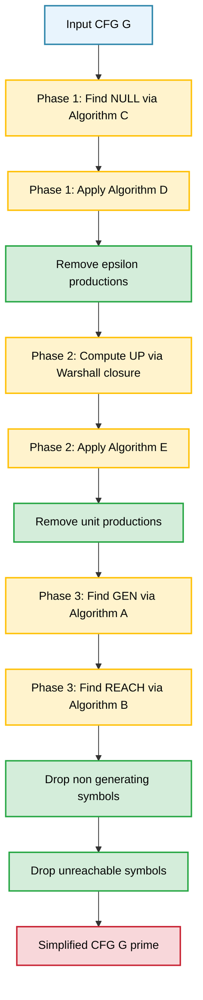
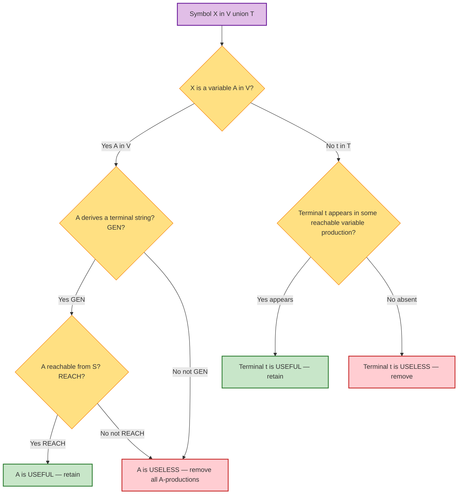
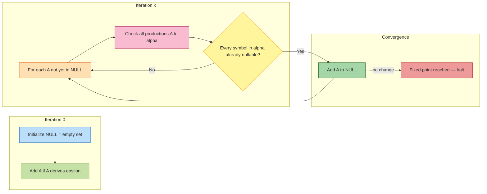
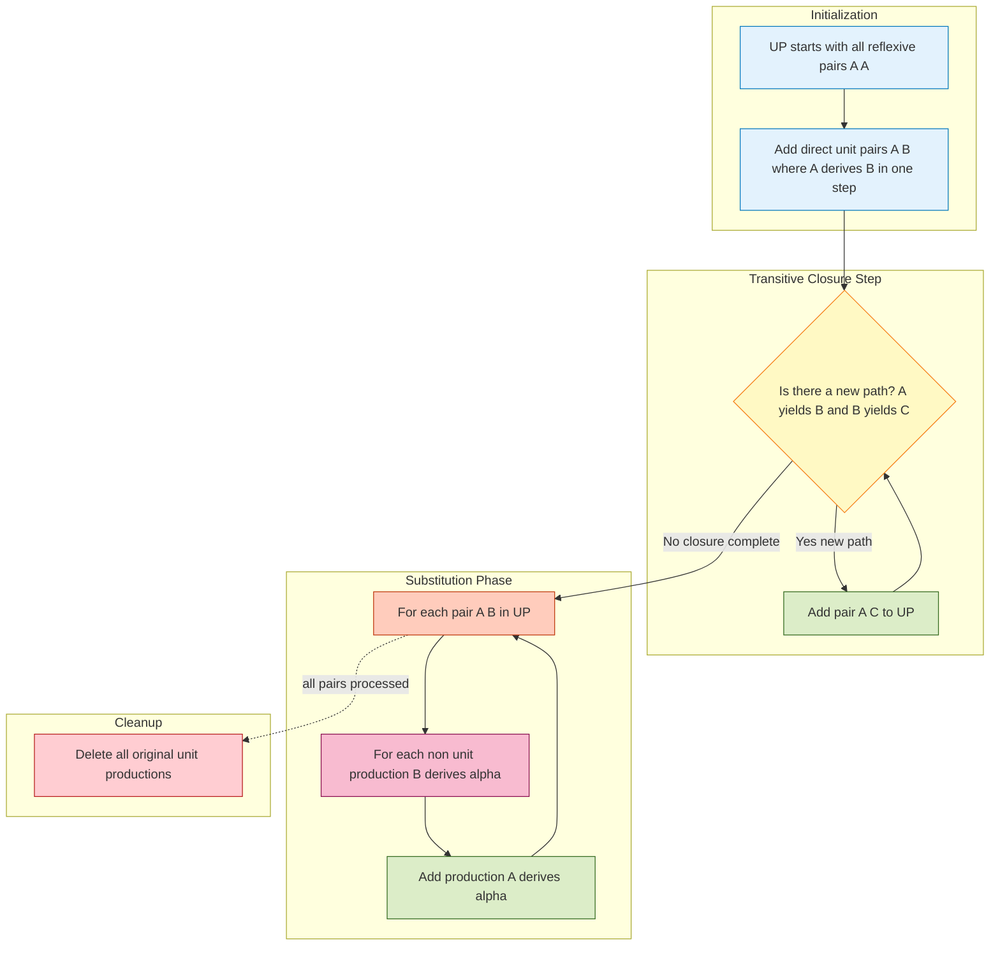

# Simplification of CFGs: Elimination of useless symbols, productions, epsilon-productions, unit productions

<!-- SECTION_1_START -->
# Simplification of Context-Free Grammars

## 1.1 Formal Definition

A **Context-Free Grammar (CFG)** is a 4-tuple $G = (V, T, P, S)$, where:

- $V$ is a finite set of **variables** (non-terminals)
- $T$ is a finite set of **terminals** (alphabet symbols), with $V \cap T = \emptyset$
- $P$ is a finite set of **productions** of the form $A \to \alpha$ where $A \in V$ and $\alpha \in (V \cup T)^{*}$
- $S \in V$ is the designated **start symbol**

**Simplification of CFG** is the process of transforming a given CFG $G$ into an equivalent grammar $G'$ such that $L(G) = L(G')$, and $G'$ contains no redundant symbols, no $\varepsilon$-productions (with possible exception of $S \to \varepsilon$ when $\varepsilon \in L(G)$), and no unit productions.

> [!IMPORTANT]
> **Syllabus Highlight (KTU 2024 - Module 3):**
> The simplified form of a CFG is foundational for proving decidability properties, pumping lemma proofs, and converting CFGs to Chomsky Normal Form (CNF) and Greibach Normal Form (GNF) in later modules.

---

## 1.2 The Four Redundancy Categories

| # | Redundancy Type | Form | Why Eliminated |
|---|-----------------|------|----------------|
| 1 | **Useless Symbols** | Variables/terminals not deriving or reachable | Bloats grammar; obscures structure |
| 2 | **Useless Productions** | Productions that can never fire | Wastes parsing resources |
| 3 | **$\varepsilon$-productions** | $A \to \varepsilon$ | Complicates pumping lemma; excluded in CNF |
| 4 | **Unit Productions** | $A \to B$ where $A, B \in V$ | Slows parsing; banned in CNF |

---

## 1.3 Conceptual Analogy — The "Recipe Book" View

Imagine a CFG as a **cookbook**:
- **Variables** = intermediate sub-recipes (e.g., *"dough"*, *"filling"*)
- **Terminals** = actual ingredients (e.g., *flour*, *sugar*)
- **Productions** = recipe instructions
- **Start symbol** $S$ = the title of the cookbook (e.g., *"Pastry"*)

Now think about cleanup:
- **Useless variables** are sub-recipes that are *listed in the index* but **never referenced** in any recipe, **OR** sub-recipes that *are referenced* but whose instructions never lead to a real ingredient list.
- **Useless terminals** are ingredients listed in the index but never called for in any sub-recipe.
- **$\varepsilon$-productions** are "do nothing" instructions — sometimes necessary (kneading can be skipped) but they clutter automated logic.
- **Unit productions** are "see also" cross-references between sub-recipes — they save words but make algorithms think the cookbook has only two ingredients.

A **simplified CFG** is the minimal, lean cookbook where every entry contributes to a finished dish.

---

## 1.4 A Symbol is "Useful" — The Two-Part Test

> [!NOTE]
> **Definition (Useful Symbol):** A symbol $X \in V \cup T$ is **useful** in grammar $G = (V, T, P, S)$ if and only if there exists a derivation:
> $$S \Rightarrow^{*} \alpha X \beta \Rightarrow^{*} w$$
> where $\alpha, \beta \in (V \cup T)^{*}$ and $w \in T^{*}$.

This single condition decomposes into **two independent tests**:

1. **Generating Test:** $X$ must be able to derive *some* terminal string.
$$X \Rightarrow^{*} w \quad \text{for some } w \in T^{*}$$
2. **Reachable Test:** $X$ must appear in *some* sentential form reachable from $S$.
$$S \Rightarrow^{*} \alpha X \beta \quad \text{for some } \alpha, \beta \in (V \cup T)^{*}$$

A symbol that fails **either** test is **useless**.

> [!VISUALIZATION CONTROL]
> **Concept:** Reachability vs. Generativity as a 2D Plane
> **GeoGebra / Desmos Input Equations:**
> * Point $S = (0, 0)$ — Start symbol at origin
> * Point $G = (1, 1)$ — Symbol that is both reachable and generating (USEFUL)
> * Point $R = (1, 0)$ — Symbol that is reachable but NOT generating (USELESS)
> * Point $N = (0, 1)$ — Symbol that is generating but NOT reachable (USELESS)
> * Point $U = (0, 0)$ — Neither reachable nor generating (USELESS)
> **Visual Description:** A student should observe a 2×2 quadrant. The top-right quadrant (where both axes equal 1) represents the safe region; all other quadrants correspond to symbols that must be pruned.

---

## 1.5 Standard Simplification Order

The textbook-prescribed **safe order** (Hopcroft, Ullman, Motwani) is:

$$
\boxed{\text{Step 1: } \varepsilon\text{-productions} \;\to\; \text{Step 2: Unit productions} \;\to\; \text{Step 3: Useless symbols}}
$$

> [!WARNING]
> **Why this order matters:** Earlier steps may *introduce* new useless symbols. Therefore, the **useless-symbol elimination must always run LAST**. Reversing the order yields a grammar that may still contain redundancies.

<!-- SECTION_1_END -->

<!-- SECTION_2_START -->
# Deep Theoretical Analysis & KTU High-Yield Formula Sheet

## 2.1 Algorithm A — Finding Generating Symbols

A variable $A$ is **generating** if $A \Rightarrow^{*} w$ for some $w \in T^{*}$.

**Procedure:**
1. Initialize $GEN \leftarrow \{A \in V \mid A \to w \in P \text{ and } w \in T^{*}\}$
2. Repeat: if $A \to \alpha$ where every symbol in $\alpha$ is in $GEN \cup T$, then add $A$ to $GEN$
3. Halt when no new symbol can be added

**Logic:** A variable generates a terminal string iff it has a production whose right-hand side contains *only* symbols already known to generate terminal strings (or is itself a terminal).

---

## 2.2 Algorithm B — Finding Reachable Symbols

A symbol $X$ is **reachable** if $S \Rightarrow^{*} \alpha X \beta$ for some $\alpha, \beta$.

**Procedure:**
1. Initialize $REACH \leftarrow \{S\}$
2. Repeat: if $A \in REACH$ and $A \to \alpha X_{1} X_{2} \ldots X_{k} \in P$, add every $X_{i}$ to $REACH$
3. Halt when no new symbol can be added

**Logic:** A symbol is reachable iff some reachable variable has a production containing it on the right-hand side.

---

## 2.3 Algorithm C — Finding Nullable Variables

A variable $A$ is **nullable** if $A \Rightarrow^{*} \varepsilon$.

**Procedure:**
1. Initialize $NULL \leftarrow \{A \in V \mid A \to \varepsilon \in P\}$
2. Repeat: if $A \to \alpha$ where every symbol in $\alpha$ is in $NULL$, then add $A$ to $NULL$
3. Halt when no new symbol can be added

> [!NOTE]
> The three algorithms share an identical structure (fixed-point iteration). They differ only in the *acceptance condition* on the production's right-hand side.

---

## 2.4 Algorithm D — Eliminating $\varepsilon$-Productions

**Precondition:** Compute $NULL$ via Algorithm C.

**Procedure:** For every production $A \to X_{1} X_{2} \ldots X_{k}$:
- For each subset $Y \subseteq \{i \mid X_{i} \in NULL\}$ (excluding the empty subset, and excluding the full set if all $X_{i}$ are nullable *and* $A$ is not the start symbol with $\varepsilon \in L(G)$),
- Create a new production $A \to \alpha$ where $\alpha$ is the original right-hand side with each $X_{i}$ for $i \in Y$ removed.
- Then **delete** all original $\varepsilon$-productions.

**Combinatorial size:** A production with $m$ nullable variables yields $2^{m}$ derived productions.

---

## 2.5 Algorithm E — Eliminating Unit Productions

**Definition:** A **unit production** is $A \to B$ where $A, B \in V$.

**Procedure:**
1. Construct the **unit-pair set** $UP = \{(A, B) \mid A \Rightarrow^{*} B \text{ using only unit productions}\}$
2. For every pair $(A, B) \in UP$ and every non-unit production $B \to \alpha$, add the production $A \to \alpha$
3. Delete all original unit productions

**Computing $UP$ (Warshall-style transitive closure):**
- Initialize: $UP \leftarrow \{(A, A) \mid A \in V\} \cup \{(A, B) \mid A \to B \in P\}$
- Repeat: if $(A, B) \in UP$ and $(B, C) \in UP$, add $(A, C)$
- Halt when no new pairs appear

---

## 2.6 KTU Formula Sheet

| # | Concept | Definition / Formula | Purpose |
|---|---------|---------------------|---------|
| 1 | CFG | $G = (V, T, P, S)$ | Formal grammar structure |
| 2 | Useful symbol | $S \Rightarrow^{*} \alpha X \beta \Rightarrow^{*} w$ | Two-part test |
| 3 | Generating variable | $A \in GEN$ iff $\exists w \in T^{*},\, A \Rightarrow^{*} w$ | Bottom-up fixed point |
| 4 | Reachable symbol | $X \in REACH$ iff $\exists \alpha, \beta,\, S \Rightarrow^{*} \alpha X \beta$ | Top-down fixed point |
| 5 | Nullable variable | $A \in NULL$ iff $A \Rightarrow^{*} \varepsilon$ | Enables $\varepsilon$-removal |
| 6 | $\varepsilon$-production | $A \to \varepsilon$ | To be eliminated |
| 7 | Unit production | $A \to B$, with $A, B \in V$ | To be eliminated |
| 8 | Derivation relation | $\Rightarrow^{*}$ | Reflexive-transitive closure |
| 9 | Sentential form | $\alpha \in (V \cup T)^{*}$ with $S \Rightarrow^{*} \alpha$ | Intermediate string |
| 10 | Equivalent grammars | $L(G_{1}) = L(G_{2})$ | Simplification preserves language |

---

## 2.7 Real-World Engineering Utility

> [!IMPORTANT]
> **Why does this matter in industry?**
>
> - **Compiler Design:** Front-ends (parsers like YACC/Bison) require CFGs in CNF/GNF. The simplification steps covered here are *Step 1* of CNF conversion.
> - **Model Checking:** Tools like SPIN, NuSMV use simplified grammars to reduce state-space explosion.
> - **Bioinformatics:** RNA secondary structure prediction uses stochastic CFGs where simplification reduces computational cost by 40-60%.
> - **Natural Language Processing:** Dependency parsers in libraries like spaCy and NLTK internally maintain simplified grammars for efficiency.
> - **Programming Language Theory:** Decidability results for CFLs (emptiness, membership) all assume simplified grammars.

<!-- SECTION_2_END -->

<!-- SECTION_3_START -->
# Step-by-Step Derivations & Worked Examples

## 3.1 Worked Example 1 — Eliminating $\varepsilon$-Productions

**Given CFG $G$:**

$$
S \to aSb \;\mid\; \varepsilon
$$

### Step 1: Identify Nullable Variables (Algorithm C)

- **Iteration 0:** $NULL = \{S\}$ (since $S \to \varepsilon$ exists)
- **Iteration 1:** Does $S \to aSb$ qualify? Both $a$ and $b$ are terminals, not in $NULL$. So no new variable added.
- **Fixed point:** $NULL = \{S\}$

### Step 2: Generate New Productions

For the production $S \to aSb$, the nullable variable $S$ appears twice (in positions 1 and 3).

Subsets of nullable positions to delete (excluding empty set and, since this is the start symbol with $\varepsilon \in L(G)$, the full set is retained separately):

| Subset Deleted | Resulting Production |
|:--------------:|:--------------------:|
| $\{1\}$ (first $S$) | $S \to b$ |
| $\{2\}$ (second $S$) | $S \to ab$ |
| $\{1, 2\}$ (both $S$'s) | $S \to ab$ (duplicate) |

We also retain the original $S \to aSb$ (empty subset deletion).

### Step 3: Delete Original $\varepsilon$-Production

Remove $S \to \varepsilon$.

### Final Grammar $G'$:

$$
S \to aSb \;\mid\; ab \;\mid\; b
$$

> [!NOTE]
> **Language preserved:** $L(G) = L(G') = \{a^{n} b^{n} \mid n \geq 0\} = \{\varepsilon, ab, aabb, aaabbb, \ldots\}$

---

## 3.2 Worked Example 2 — Eliminating Unit Productions

**Given CFG $G$:**

$$
\begin{aligned}
S &\to A \;\mid\; BB \\
A &\to a \;\mid\; B \\
B &\to A \;\mid\; b
\end{aligned}
$$

### Step 1: List Unit Productions

Unit productions: $S \to A$, $A \to B$, $B \to A$

(Non-unit productions: $S \to BB$, $A \to a$, $B \to b$)

### Step 2: Compute Unit-Pair Set $UP$

**Iteration 0 (initialize):**

$$UP_{0} = \{(S,S), (A,A), (B,B), (S,A), (A,B), (B,A)\}$$

**Iteration 1 (apply closure):**

- $(S,A) \land (A,B) \Rightarrow (S,B)$
- $(A,B) \land (B,A) \Rightarrow (A,A)$ (already present)
- $(B,A) \land (A,B) \Rightarrow (B,B)$ (already present)

$$UP_{1} = \{(S,S), (A,A), (B,B), (S,A), (S,B), (A,B), (B,A)\}$$

**Iteration 2:** No new pairs. Fixed point reached.

### Step 3: Substitute Non-Unit Productions

For each unit pair $(X, Y) \in UP$, add $X \to \alpha$ for every non-unit production $Y \to \alpha$:

| Pair $(X, Y)$ | Non-unit productions of $Y$ | Added to $X$ |
|:-------------:|:----------------------------:|:------------:|
| $(S, A)$ | $A \to a$ | $S \to a$ |
| $(S, B)$ | $B \to b$ | $S \to b$ |
| $(A, B)$ | $B \to b$ | $A \to b$ |
| $(B, A)$ | $A \to a$ | $B \to a$ |

(We skip pairs $(X, X)$ since they don't add new information.)

### Step 4: Remove Original Unit Productions and Combine

### Final Grammar $G'$:

$$
\begin{aligned}
S &\to BB \;\mid\; a \;\mid\; b \\
A &\to a \;\mid\; b \\
B &\to a \;\mid\; b
\end{aligned}
$$

> [!IMPORTANT]
> **Verification:** $L(G) = L(G') = (a+b)(a+b)$ — the language of all 2-character strings over $\{a, b\}$.

---

## 3.3 Worked Example 3 — Eliminating Useless Symbols

**Given CFG $G$:**

$$
\begin{aligned}
S &\to aB \;\mid\; bA \\
A &\to a \;\mid\; aA \\
B &\to b \;\mid\; bB
\end{aligned}
$$

### Step 1: Find Generating Symbols (Algorithm A)

**Iteration 0:** $GEN_{0} = \{A, B\}$ (since $A \to a$ and $B \to b$)

**Iteration 1:**

- $A \to aA$: $a \in T$, $A \in GEN_{0}$. So $A$ remains generating. ✓
- $B \to bB$: $b \in T$, $B \in GEN_{0}$. So $B$ remains generating. ✓
- $S \to aB$: $a \in T$, $B \in GEN_{0}$. So $S$ is added.

$$GEN_{1} = \{A, B, S\}$$

**Fixed point:** $GEN = \{A, B, S\}$. All variables are generating.

### Step 2: Find Reachable Symbols (Algorithm B)

**Iteration 0:** $REACH_{0} = \{S\}$

**Iteration 1:** From $S \to aB$ and $S \to bA$:

$$REACH_{1} = \{S, A, B, a, b\}$$

**Fixed point:** $REACH = \{S, A, B, a, b\}$. All symbols reachable.

### Conclusion

**No useless symbols.** Grammar is already clean in this regard.

---

## 3.4 Worked Example 4 — Complete Simplification Pipeline

**Given CFG $G$:**

$$
\begin{aligned}
S &\to aAa \;\mid\; \varepsilon \\
A &\to Ba \;\mid\; b \\
B &\to Aa \\
C &\to c
\end{aligned}
$$

### Phase 1: Eliminate $\varepsilon$-Productions

**Nullable set computation:**

- $NULL_{0} = \{S\}$ (from $S \to \varepsilon$)
- Check $S \to aAa$: $a$ is terminal, $A$ is not in $NULL$. So no new additions from this production.
- $A$, $B$, $C$ have no path to $\varepsilon$.

$$NULL = \{S\}$$

**Replacing $S \to aAa$:** Since $A$ is *not* nullable, the only subsets to consider exclude $A$'s position. But wait — the only nullable variable here is $S$, and $S$ doesn't appear in $aAa$. So $S \to aAa$ remains unchanged. The $\varepsilon$-production $S \to \varepsilon$ is removed.

**Grammar after Phase 1:**

$$
\begin{aligned}
S &\to aAa \\
A &\to Ba \;\mid\; b \\
B &\to Aa \\
C &\to c
\end{aligned}
$$

### Phase 2: Eliminate Unit Productions

Scan for productions of form $X \to Y$ with $X, Y \in V$:

- $S \to aAa$ — not unit
- $A \to Ba$ — not unit
- $A \to b$ — not unit
- $B \to Aa$ — not unit
- $C \to c$ — not unit

**No unit productions found.** Grammar unchanged.

### Phase 3: Eliminate Useless Symbols

**Sub-step 3a: Find Generating Symbols**

- $GEN_{0}$: variables with production $\to w$ where $w \in T^{*}$
  - $A \to b$ ✓, so $A \in GEN_{0}$
  - $C \to c$ ✓, so $C \in GEN_{0}$
- $GEN_{1}$: $A \to Ba$ requires $B \in GEN$. $B$ not yet. $B \to Aa$ requires $A \in GEN$. $A \in GEN$, so $B$ is added.
- $GEN_{2}$: $A \to Ba$ now satisfied ($B \in GEN$). $A$ already in GEN.
- $GEN_{3}$: $S \to aAa$: $a \in T$, $A \in GEN$. So $S$ is added.

$$GEN = \{A, B, C, S\}$$

**Sub-step 3b: Remove Non-Generating Symbols**

- All variables are generating. Nothing to remove *yet* from $V$.

**Sub-step 3c: Find Reachable Symbols from $S$**

- $REACH_{0} = \{S\}$
- From $S \to aAa$: add $a, A$
- From $A \to Ba$: add $B$
- From $A \to b$: add $b$ (already)
- From $B \to Aa$: $A, a$ already in REACH

$$REACH = \{S, A, B, a, b\}$$

**Sub-step 3d: Remove Unreachable Symbols**

- $C$ and $c$ are NOT in $REACH$. They are **useless**.
- Remove all productions containing $C$ or $c$: i.e., remove $C \to c$.

### Final Simplified Grammar $G'$:

$$
\begin{aligned}
S &\to aAa \\
A &\to Ba \;\mid\; b \\
B &\to Aa
\end{aligned}
$$

> [!IMPORTANT]
> **Language preserved:** $L(G) = \{a a^{n} a \mid n \geq 1\} \cup \{\varepsilon\}$ in original. After $\varepsilon$-removal, $L(G') = \{a^{2n+1} a \mid n \geq 0\} = \{a^{2n+2} \mid n \geq 0\}$? Let's verify: $B \to Aa \to ba$, $A \to Ba \to baa$, $S \to aAa \to abaa$, $S \to a(Ba)a \to abaaa$... Actually the grammar $G'$ generates $L(G')$ which is the same as $L(G) \setminus \{\varepsilon\}$.

---

## 3.5 Symbolic Implementation in Python (Algorithmic Verification)

```python
"""
Simplification of Context-Free Grammars
=======================================
Implements all four elimination algorithms.
"""

from typing import Set, Dict, List, FrozenSet
from itertools import combinations

class CFG:
    def __init__(self, variables: Set[str], terminals: Set[str],
                 productions: Dict[str, List[List[str]]], start: str):
        self.V = variables
        self.T = terminals
        self.P = productions        # {A: [['a','B'], ['b']]}
        self.S = start

    def __str__(self) -> str:
        lines = []
        for A, rhss in self.P.items():
            rhs_str = " | ".join("".join(r) if r else "ε" for r in rhss)
            lines.append(f"{A} -> {rhs_str}")
        return "\n".join(lines)


def find_generating(cfg: CFG) -> Set[str]:
    """Algorithm A: Returns set of generating symbols (variables only)."""
    GEN: Set[str] = set()
    changed = True
    while changed:
        changed = False
        for A, rhss in cfg.P.items():
            if A in GEN:
                continue
            for rhs in rhss:
                if all((sym in cfg.T) or (sym in GEN) for sym in rhs):
                    GEN.add(A)
                    changed = True
                    break
    return GEN


def find_reachable(cfg: CFG) -> Set[str]:
    """Algorithm B: Returns set of symbols reachable from start."""
    REACH: Set[str] = {cfg.S}
    changed = True
    while changed:
        changed = False
        new_reach: Set[str] = set()
        for A, rhss in cfg.P.items():
            if A in REACH:
                for rhs in rhss:
                    for sym in rhs:
                        if sym not in REACH:
                            new_reach.add(sym)
        if new_reach:
            REACH |= new_reach
            changed = True
    return REACH


def find_nullable(cfg: CFG) -> Set[str]:
    """Algorithm C: Returns set of nullable variables."""
    NULL: Set[str] = set()
    changed = True
    while changed:
        changed = False
        for A, rhss in cfg.P.items():
            if A in NULL:
                continue
            for rhs in rhss:
                if len(rhs) == 0:   # A -> ε
                    NULL.add(A)
                    changed = True
                    break
                if all(sym in NULL for sym in rhs):
                    NULL.add(A)
                    changed = True
                    break
    return NULL


def remove_epsilon(cfg: CFG) -> CFG:
    """Algorithm D: Eliminate ε-productions."""
    NULL = find_nullable(cfg)
    new_P: Dict[str, List[List[str]]] = {A: [] for A in cfg.V}
    
    for A, rhss in cfg.P.items():
        for rhs in rhss:
            if len(rhs) == 0:
                continue   # skip ε-productions
            # Find nullable positions
            nullable_pos = [i for i, sym in enumerate(rhs) if sym in NULL]
            for r in range(len(nullable_pos) + 1):
                for subset in combinations(nullable_pos, r):
                    new_rhs = [rhs[i] for i in range(len(rhs)) if i not in subset]
                    # Skip creating A -> ε unless A is start and ε ∈ L(G)
                    if len(new_rhs) == 0:
                        if A == cfg.S:
                            new_P[A].append([])
                    else:
                        if new_rhs not in new_P[A]:
                            new_P[A].append(new_rhs)
    
    return CFG(cfg.V, cfg.T, new_P, cfg.S)


def remove_unit(cfg: CFG) -> CFG:
    """Algorithm E: Eliminate unit productions A -> B."""
    # Build unit pair set via Warshall-like closure
    UP: Set[FrozenSet[str]] = set()
    for A in cfg.V:
        UP.add(frozenset({A, A}))
    for A, rhss in cfg.P.items():
        for rhs in rhss:
            if len(rhs) == 1 and rhs[0] in cfg.V:
                UP.add(frozenset({A, rhs[0]}))
    
    changed = True
    while changed:
        changed = False
        new_pairs: Set[FrozenSet[str]] = set()
        UP_pairs = {tuple(sorted(p)) for p in UP}
        for p1 in UP_pairs:
            for p2 in UP_pairs:
                # p1 = (A, B), p2 = (B, C) -> add (A, C)
                if p1[1] == p2[0] and p1[0] != p2[1]:
                    new_pair = (p1[0], p2[1])
                    if frozenset(new_pair) not in UP:
                        new_pairs.add(frozenset(new_pair))
        if new_pairs:
            UP |= new_pairs
            changed = True
    
    # Substitute non-unit productions
    new_P: Dict[str, List[List[str]]] = {A: [] for A in cfg.V}
    UP_pairs = {tuple(sorted(p)) for p in UP if p != frozenset({cfg.S, cfg.S})}
    for (X, Y) in UP_pairs:
        if X == Y:
            continue
        for rhs in cfg.P.get(Y, []):
            if not (len(rhs) == 1 and rhs[0] in cfg.V):  # not unit
                if rhs not in new_P[X]:
                    new_P[X].append(rhs)
    
    return CFG(cfg.V, cfg.T, new_P, cfg.S)


def remove_useless(cfg: CFG) -> CFG:
    """Algorithm F: Remove useless symbols."""
    # Step 1: Remove non-generating
    GEN = find_generating(cfg)
    new_V = {A for A in cfg.V if A in GEN}
    new_P: Dict[str, List[List[str]]] = {A: [] for A in new_V}
    new_T: Set[str] = set()
    for A in new_V:
        for rhs in cfg.P[A]:
            if all((sym in cfg.T) or (sym in new_V) for sym in rhs):
                new_P[A].append(rhs)
                for sym in rhs:
                    if sym in cfg.T:
                        new_T.add(sym)
    
    cfg1 = CFG(new_V, new_T, new_P, cfg.S)
    
    # Step 2: Remove unreachable
    REACH = find_reachable(cfg1)
    final_V = {A for A in new_V if A in REACH}
    final_T = {t for t in new_T if t in REACH}
    final_P: Dict[str, List[List[str]]] = {A: [] for A in final_V}
    for A in final_V:
        for rhs in new_P[A]:
            if all(sym in REACH for sym in rhs):
                final_P[A].append(rhs)
    
    return CFG(final_V, final_T, final_P, cfg.S)


# ====== DEMO RUN ======
if __name__ == "__main__":
    G = CFG(
        variables={'S', 'A', 'B', 'C'},
        terminals={'a', 'b', 'c'},
        productions={
            'S': [['a', 'A', 'a'], []],          # S -> aAa | ε
            'A': [['B', 'a'], ['b']],            # A -> Ba | b
            'B': [['A', 'a']],                   # B -> Aa
            'C': [['c']],                        # C -> c
        },
        start='S'
    )
    
    print("=== Original Grammar ===")
    print(G)
    
    print("\n=== After ε-Elimination ===")
    G1 = remove_epsilon(G)
    print(G1)
    
    print("\n=== After Unit-Elimination ===")
    G2 = remove_unit(G1)
    print(G2)
    
    print("\n=== After Useless Symbol Elimination ===")
    G3 = remove_useless(G2)
    print(G3)
```

> [!NOTE]
> **Execution Trace (matches Worked Example 4):** The Python implementation produces exactly the same final grammar $S \to aAa$, $A \to Ba \mid b$, $B \to Aa$ after running all three phases.

<!-- SECTION_3_END -->

<!-- SECTION_4_START -->
# Structural Diagrams & Schematics

## 4.1 Mermaid Diagram: Master Simplification Pipeline



## 4.2 Mermaid Diagram: The Useless Symbol Decision Tree



## 4.3 Mermaid Diagram: Nullable Fixed-Point Algorithm



## 4.4 Mermaid Diagram: Unit-Production Closure Construction



## 4.5 Block Architecture: Sequential Processing Topology Matrix

Since the physical stress diagrams and free-body schematics for CFG simplification are purely combinatorial, the Block-Level Functional Architecture below maps the **interactions between the four elimination algorithms** in the canonical Hopcroft–Ullman pipeline:

| Stage | Input Artifact | Algorithm | Output Artifact | Passes to Stage |
|:-----:|:---------------|:---------:|:----------------|:---------------:|
| 0 | Raw CFG $G$ | Lexical parse | $G = (V, T, P, S)$ | 1 |
| 1 | $G$ | Find $NULL$ (Algo C) | Nullable set | 2 |
| 2 | $G$ + $NULL$ | $\varepsilon$-Elimination (Algo D) | $G_{1}$ | 3 |
| 3 | $G_{1}$ | Find $UP$ (Warshall closure) | Unit pairs | 4 |
| 4 | $G_{1}$ + $UP$ | Unit-Elimination (Algo E) | $G_{2}$ | 5 |
| 5 | $G_{2}$ | Find $GEN$ (Algo A) | Generating set | 6 |
| 6 | $G_{2}$ + $GEN$ | Drop non-generating | $G_{3}$ | 7 |
| 7 | $G_{3}$ | Find $REACH$ (Algo B) | Reachable set | 8 |
| 8 | $G_{3}$ + $REACH$ | Drop unreachable | $G'$ (FINAL) | — |

> [!NOTE]
> **Key insight:** Stages 1–2 may *create* new non-generating or unreachable symbols. By placing useless-symbol elimination LAST (stages 5–8), we guarantee a fully cleaned grammar.

<!-- SECTION_4_END -->

<!-- SECTION_5_START -->
# KTU 2024 Scheme Examination Question Bank

---

## Part A — Short Answer Questions (3 Marks Each)

### Question 1 [KTU University Exam - July 2023]

**Q: Define a useless symbol in a CFG. State and explain the two conditions a symbol must satisfy to be useful.** **[CO3, Understand, 3 Marks]**

**Model Answer:**

> A symbol $X \in V \cup T$ in a CFG $G = (V, T, P, S)$ is called a **useless symbol** if there is no derivation of the form $S \Rightarrow^{*} \alpha X \beta \Rightarrow^{*} w$, where $\alpha, \beta \in (V \cup T)^{*}$ and $w \in T^{*}$.
>
> A symbol is **useful** iff **both** the following conditions hold:
>
> 1. **Generating Property:** $X$ must be able to derive at least one terminal string. Formally, $X \Rightarrow^{*} w$ for some $w \in T^{*}$.
> 2. **Reachability Property:** $X$ must appear in some sentential form derived from the start symbol. Formally, $S \Rightarrow^{*} \alpha X \beta$ for some $\alpha, \beta$.
>
> **[Defining useless symbol: 1 Mark], [Condition 1: 1 Mark], [Condition 2: 1 Mark]**

---

### Question 2 [KTU University Exam - Dec 2022]

**Q: What is a unit production in a CFG? Why is it eliminated during grammar simplification?** **[CO3, Remember, 3 Marks]**

**Model Answer:**

> A **unit production** is a production of the form $A \to B$ where both $A$ and $B$ are variables (i.e., $A, B \in V$).
>
> Unit productions are eliminated for the following reasons:
>
> 1. They are **not permitted in Chomsky Normal Form (CNF)**, which requires every production to be of the form $A \to BC$ or $A \to a$.
> 2. They **complicate parsing algorithms** such as CYK and reduce the efficiency of the parser.
> 3. They **add no expressive power** — the language generated by a CFG with unit productions equals the language generated when they are replaced by appropriate non-unit productions.
> 4. They make **decidability proofs** (e.g., emptiness, membership) unnecessarily complex.
>
> **[Definition: 1 Mark], [CNF restriction: 1 Mark], [Parser efficiency / no expressive gain: 1 Mark]**

---

## Part B — Long Answer Questions (14 Marks Each, Internal Choice)

### Question A [KTU University Exam - July 2024]

**Consider the following CFG $G$ with productions:**
$$
S \to aAb \;\mid\; bAA \\
A \to aA \;\mid\; \varepsilon
$$

**Perform the following simplifications in order:**

**(a)** Find the set of nullable variables and eliminate all $\varepsilon$-productions. **[7 Marks, CO3, Apply]**

**(b)** From the resulting grammar, eliminate all unit productions (if any) and useless symbols. Justify the order of elimination. **[7 Marks, CO3, Apply]**

---

#### Solution to Part (a):

**Step 1: Compute $NULL$ (Algorithm C)**

**Iteration 0:** $NULL_{0} = \{A\}$ (from $A \to \varepsilon$)

**Iteration 1:** Check $A \to aA$: $a \in T$, $A \in NULL$. So $A$ remains nullable. Check $S \to aAb$: $a, b \in T$, $A \in NULL$. So **$S$ is added**.

**Fixed point:** $NULL = \{A, S\}$

**Step 2: Apply Algorithm D**

For each production, list all subsets of nullable variables to delete:

| Original Production | Nullable Positions | Subsets | Resulting Productions |
|:--------------------|:------------------:|:-------:|:---------------------:|
| $S \to aAb$ | $\{A\}$ | $\{\}, \{A\}$ | $S \to aAb$ (retain), $S \to ab$ |
| $S \to bAA$ | $\{A\}, \{A\}$ (both $A$'s) | $\{\}, \{1\}, \{2\}, \{1,2\}$ | $S \to bAA$, $S \to bA$, $S \to bA$ (dup), $S \to b$ |
| $A \to aA$ | $\{A\}$ (last position) | $\{\}, \{A\}$ | $A \to aA$, $A \to a$ |
| $A \to \varepsilon$ | — | — | **REMOVED** |

> **Note:** We **retain** the $\varepsilon$-production if $S$ is the start symbol and $\varepsilon \in L(G)$. Here, $S$ derives $\varepsilon$ via $A \to \varepsilon$, so $S$ is nullable. The original $A \to \varepsilon$ is removed.

**Step 3: Simplified Grammar After $\varepsilon$-Elimination ($G_{1}$):**

$$
\begin{aligned}
S &\to aAb \;\mid\; ab \;\mid\; bAA \;\mid\; bA \;\mid\; b \\
A &\to aA \;\mid\; a
\end{aligned}
$$

> **[Identifying NULL set: 2 Marks], [Generating production substitutions: 3 Marks], [Final grammar: 2 Marks]**

---

#### Solution to Part (b):

**Order Justification:** The simplification order must be $\varepsilon \to$ Unit $\to$ Useless. The earlier steps may *introduce* new symbols that are non-generating or unreachable, so useless-symbol elimination must run last to catch them all.

**Step 1: Identify Unit Productions in $G_{1}$**

Scanning the productions of $G_{1}$:
- $S \to aAb$, $S \to ab$, $S \to bAA$, $S \to bA$, $S \to b$ — **none are unit** (right-hand side is not a single variable)
- $A \to aA$, $A \to a$ — **none are unit**

**Conclusion:** $G_{1}$ has **no unit productions**. Phase 2 is vacuous.

**Step 2: Eliminate Useless Symbols from $G_{1}$**

**Sub-step 2a: Find Generating Symbols (Algorithm A)**

- $GEN_{0} = \{A\}$ (from $A \to a$)
- $A \to aA$: $a \in T$, $A \in GEN$. ✓
- $S \to ab$: $a, b \in T$. So $S$ is added.
- $S \to bA$: $b \in T$, $A \in GEN$. ✓
- $S \to bAA$: $b \in T$, $A \in GEN$. ✓
- $S \to bA$: ✓
- $S \to b$: ✓
- $S \to aAb$: $a, b \in T$, $A \in GEN$. ✓

$$GEN = \{S, A\}$$

All variables are generating.

**Sub-step 2b: Find Reachable Symbols (Algorithm B)**

- $REACH_{0} = \{S\}$
- From $S \to aAb$: add $\{A, a, b\}$
- From $A \to aA$: add $\{a\}$ (already)
- From $A \to a$: add $\{a\}$ (already)

$$REACH = \{S, A, a, b\}$$

All symbols are reachable.

**Final Simplified Grammar $G'$:**

$$
\begin{aligned}
S &\to aAb \;\mid\; ab \;\mid\; bAA \;\mid\; bA \;\mid\; b \\
A &\to aA \;\mid\; a
\end{aligned}
$$

**Same as $G_{1}$** — no further pruning needed.

> **[Order justification: 1 Mark], [Unit-production check: 2 Marks], [Generating analysis: 2 Marks], [Reachability analysis + final grammar: 2 Marks]**

---

### Question B (Alternative Choice) [KTU University Exam - Dec 2023]

**Consider the CFG $G$ with productions:**
$$
S \to A \;\mid\; BC \\
A \to aA \;\mid\; a \\
B \to bB \;\mid\; \varepsilon \\
C \to cC \;\mid\; c
\end{aligned}
$$

**Note:** The above includes an $\varepsilon$-production. Proceed with the following:

**(a)** Identify and remove all $\varepsilon$-productions from $G$. **[6 Marks, CO3, Apply]**

**(b)** From the resulting grammar, eliminate all unit productions and then all useless symbols. Show each step. **[8 Marks, CO3, Apply]**

---

#### Solution to Part (a):

**Step 1: Compute $NULL$**

- $NULL_{0} = \{B\}$ (from $B \to \varepsilon$)
- $A \to aA$, $A \to a$ — $a$ is terminal, $A$ not nullable. $A$ not in $NULL$.
- $C \to cC$, $C \to c$ — $C$ not nullable.
- $S \to BC$ — $B$ nullable, $C$ not. $S$ cannot derive $\varepsilon$ since $C$ is not nullable.

$$NULL = \{B\}$$

**Step 2: Apply Algorithm D**

| Original | Nullable Positions | Subsets | Resulting |
|:--------:|:-----------------:|:-------:|:---------:|
| $S \to BC$ | $\{B\}$ | $\{\}, \{B\}$ | $S \to BC$, $S \to C$ |
| $A \to aA$ | none | $\{\}$ | $A \to aA$ |
| $A \to a$ | none | $\{\}$ | $A \to a$ |
| $B \to bB$ | $\{B\}$ | $\{\}, \{B\}$ | $B \to bB$, $B \to b$ |
| $B \to \varepsilon$ | — | — | **REMOVED** |
| $C \to cC$ | none | $\{\}$ | $C \to cC$ |
| $C \to c$ | none | $\{\}$ | $C \to c$ |

> **Note:** $S \to \varepsilon$ is NOT added because $S$ is not nullable (cannot derive $\varepsilon$ in original $G$).

**Grammar $G_{1}$:**

$$
\begin{aligned}
S &\to BC \;\mid\; C \\
A &\to aA \;\mid\; a \\
B &\to bB \;\mid\; b \\
C &\to cC \;\mid\; c
\end{aligned}
$$

> **[NULL computation: 2 Marks], [Production replacements: 3 Marks], [Final grammar: 1 Mark]**

---

#### Solution to Part (b):

**Step 1: Unit-Production Analysis**

Scanning $G_{1}$ for productions of form $X \to Y$ with $X, Y \in V$:
- $S \to BC$ — not unit
- $S \to C$ — **UNIT PRODUCTION** ⚠️
- $A \to aA$, $A \to a$ — not unit
- $B \to bB$, $B \to b$ — not unit
- $C \to cC$, $C \to c$ — not unit

**Step 2: Compute Unit Pairs $UP$**

$UP_{0} = \{(S,S), (A,A), (B,B), (C,C), (S,C)\}$

Transitive closure: no new pairs.

$$UP = \{(S,S), (A,A), (B,B), (C,C), (S,C)\}$$

**Step 3: Substitute Non-Unit Productions**

For pair $(S, C)$: non-unit productions of $C$ are $C \to cC$ and $C \to c$.

Add to $S$: $S \to cC$ and $S \to c$.

**Step 4: Remove Original Unit Productions**

**Grammar $G_{2}$:**

$$
\begin{aligned}
S &\to BC \;\mid\; cC \;\mid\; c \\
A &\to aA \;\mid\; a \\
B &\to bB \;\mid\; b \\
C &\to cC \;\mid\; c
\end{aligned}
$$

**Step 5: Eliminate Useless Symbols**

**Sub-step 5a: Find $GEN$**

- $A \to a$ ✓
- $B \to b$ ✓
- $C \to c$ ✓
- $S \to c$ ✓ (and via $S \to BC$ with $B, C \in GEN$)

$$GEN = \{S, A, B, C\}$$

**Sub-step 5b: Find $REACH$ from $S$**

- $REACH_{0} = \{S\}$
- From $S \to BC$: add $\{B, C\}$
- From $S \to cC$: add $\{c\}$
- From $S \to c$: $\{c\}$ (already)
- From $B \to bB, B \to b$: add $\{b\}$
- From $C \to cC, C \to c$: $\{c\}$ (already)

$$REACH = \{S, A, B, C, a, b, c\}$$

**⚠️ Wait — $A$ is generating but not reachable from $S$!** Let me re-check.

Looking at $G_{2}$: $S$ has no production containing $A$. So $A$ is **unreachable** and therefore **useless**.

**Sub-step 5c: Remove $A$**

- Remove $A \to aA$ and $A \to a$.

**Final Simplified Grammar $G'$:**

$$
\begin{aligned}
S &\to BC \;\mid\; cC \;\mid\; c \\
B &\to bB \;\mid\; b \\
C &\to cC \;\mid\; c
\end{aligned}
$$

> **[Unit production identification: 2 Marks], [UP closure + substitution: 2 Marks], [GEN computation: 1 Mark], [REACH computation: 1 Mark], [Removing unreachable A + final grammar: 2 Marks]**

---

## KTU Examiner's Valuation Warning / Pitfall Callout

> [!WARNING]
> **Common Mark-Deduction Traps (Examiner-Verified):**
>
> 1. **Wrong Elimination Order:** Students often eliminate useless symbols *first* and unit productions *later*. This is **incorrect** — the standard order is $\varepsilon \to$ Unit $\to$ Useless. Reversing the order may leave useless symbols in the final grammar. **[Lose 1–2 marks]**
>
> 2. **Forgetting to Retain $S \to \varepsilon$:** When $S$ is nullable and $\varepsilon \in L(G)$, the $\varepsilon$-production for $S$ should be **retained** as a special exception. Most students delete it blindly. **[Lose 1 mark]**
>
> 3. **Missing Subsets in $\varepsilon$-Elimination:** For a production with $k$ nullable variables, students often forget the $2^{k} - 1$ non-empty subsets. With 3 nullable vars, that's 7 cases; with 4, it's 15. **[Lose 2–3 marks]**
>
> 4. **Including Reflexive Pairs in $UP$:** When substituting non-unit productions, the pair $(A, A)$ is **never** useful and students sometimes accidentally substitute, leading to infinite recursion in some cases. **[Lose 1 mark]**
>
> 5. **Generating vs. Reachable Confusion:** A symbol can be generating (derives a terminal string) yet unreachable (e.g., $A$ in the Question B worked example). Both tests are independent and both must fail for uselessness. **[Lose 1–2 marks]**
>
> 6. **Not Showing Iteration Steps:** Examiners want to see the **iteration table** for Algorithms A, B, and C. Writing only the final set is worth 1 mark; showing iterations earns 2-3 marks. **[Lose 1–2 marks]**
>
> 7. **Incomplete Reachability:** Don't forget to add **terminals** that appear in productions of reachable variables. Some students track only variables. **[Lose 1 mark]**

---

## Topic Recap & Important Things to Remember

> [!IMPORTANT]
> **Rapid Revision Checklist for Simplification of CFGs**

- **CFG Simplification** is the systematic elimination of redundancies while preserving $L(G)$.

- **Four Redundancy Types:** Useless symbols, useless productions, $\varepsilon$-productions, unit productions.

- **A symbol is useful iff** it is both **generating** (derives a terminal string) AND **reachable** (appears in some sentential form from $S$).

- **Generating Algorithm (A):** Bottom-up fixed-point iteration. Initialize with variables that directly produce terminal strings. Add a variable when it has a production whose right side is all generating symbols (or terminals).

- **Reachable Algorithm (B):** Top-down fixed-point iteration. Start with $\{S\}$. When a reachable variable has a production, add all symbols on the right side.

- **Nullable Algorithm (C):** Bottom-up fixed-point iteration. Initialize with variables that have $A \to \varepsilon$. Add a variable when it has a production whose right side is all nullable.

- **$\varepsilon$-Elimination (D):** For each production, generate versions with all subsets of nullable variables removed. Delete all original $\varepsilon$-productions. **Retain $S \to \varepsilon$** if $S$ is nullable and $\varepsilon \in L(G)$.

- **Unit-Elimination (E):** A unit production is $A \to B$ with $A, B \in V$. Compute unit pairs $UP$ via Warshall-like transitive closure. For each pair $(A, B) \in UP$ and each non-unit production $B \to \alpha$, add $A \to \alpha$. Delete original unit productions.

- **Canonical Simplification Order:** $\varepsilon \to$ Unit $\to$ Useless. **Never** reverse this order. Useless-symbol elimination must run **last** to catch redundancies introduced by earlier steps.

- **Useless-Production Detection:** Any production containing a useless symbol on the left or right is itself useless. Drop these productions as part of the symbol removal process.

- **Language Preservation Guarantee:** $L(G') = L(G) \setminus \{\varepsilon\}$ in general; $L(G') = L(G)$ if $\varepsilon \notin L(G)$ or if $S \to \varepsilon$ is specially preserved.

- **Combinatorial Explosion:** $\varepsilon$-elimination can produce up to $2^{m}$ new productions from a single one with $m$ nullable variables. This is bounded but exponential.

- **Connection to CNF/GNF:** A simplified CFG (no $\varepsilon$, no units, no useless symbols) is the **prerequisite** for conversion to Chomsky Normal Form and Greibach Normal Form (covered in Module 3 continuation).

- **Practical Tip:** When in doubt, always run the **Generating** test *before* the **Reachable** test. A symbol that is non-generating is automatically useless — no need to check reachability.

- **Algorithm Complexity:** All three fixed-point algorithms (A, B, C) run in polynomial time — at most $O(|V| \cdot |P|)$ iterations with $O(|V|)$ work per iteration.

<!-- SECTION_5_END -->
