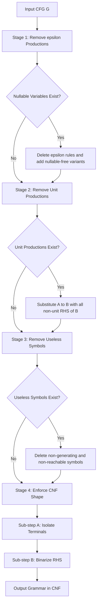
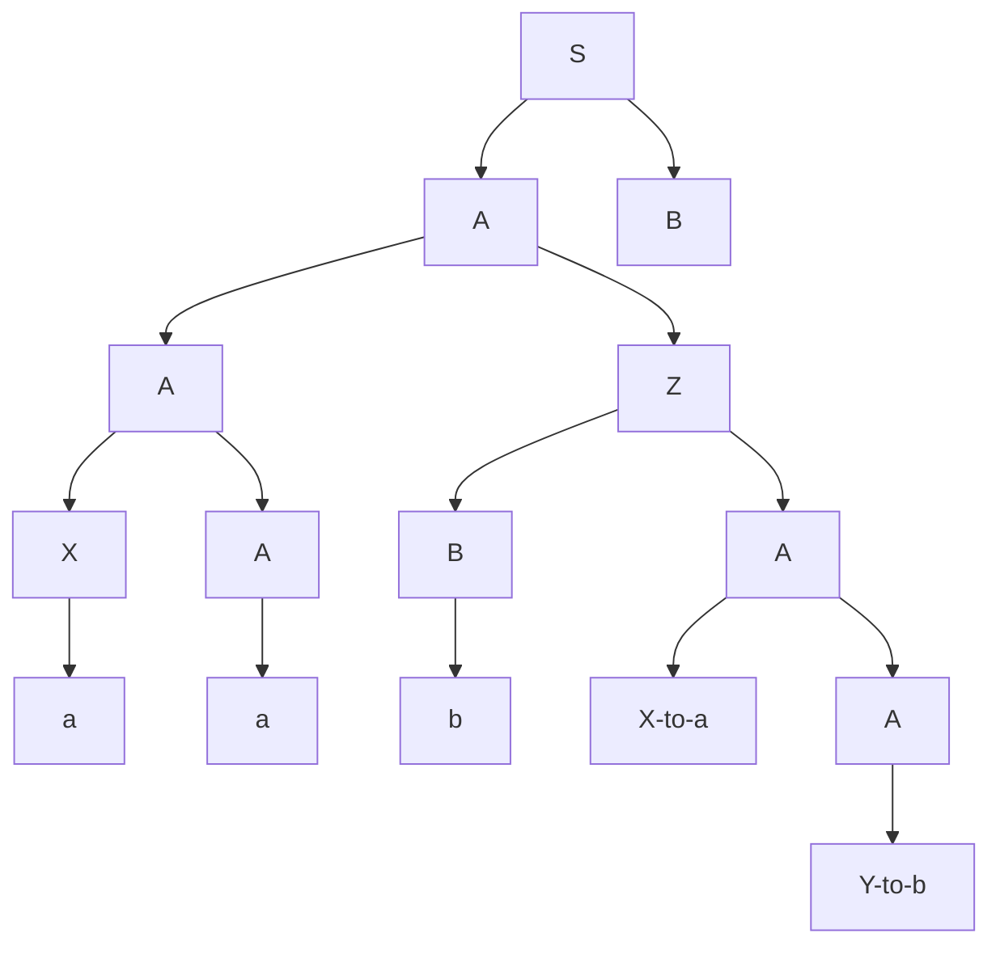

# Chomsky normal form

<!-- SECTION_1_START -->
# Chomsky Normal Form — Core Technical Definition & Intuitive Overview

## Formal Definition (KTU 2024 Syllabus Terminology)

A **Context-Free Grammar (CFG)** $G = (V, T, P, S)$ is said to be in **Chomsky Normal Form (CNF)** if every production rule in $P$ is of one of the following two forms:

$$
\begin{aligned}
A &\rightarrow BC \\
A &\rightarrow a
\end{aligned}
$$

where $A, B, C \in V$ (set of variables / non-terminals) and $a \in T$ (set of terminals), with the additional constraint that $B$ and $C$ **cannot be the start symbol** when they appear on the right-hand side. The only permissible exception is the production $S \rightarrow \varepsilon$, allowed **only if** the empty string $\varepsilon$ belongs to the language $L(G)$, and even then $S$ must not appear on the right-hand side of any production.

> [!IMPORTANT]
> **KTU 2024 Board Directive:** Every CNF production must have **exactly two variables** on the right-hand side, or **exactly one terminal** on the right-hand side. Productions like $A \rightarrow aBc$ or $A \rightarrow BCD$ are **strictly prohibited** in final CNF.

## Conceptual Analogy — Intuition

Think of CNF as a **"Strictly Binary Assembly Line"** in a factory.

- Imagine you are a **puzzle assembler**. The boss tells you: *“You may only ever pick up exactly **two** puzzle pieces at a time and snap them together, OR place a single pre-painted tile.”*
- You are **not allowed** to glue three tiles at once, you are **not allowed** to glue a tile onto a piece using only a paint stroke, and you are **not allowed** to leave a glue residue (i.e., $\varepsilon$ rules) except for a single, special "empty box" at the very start.

This restriction guarantees that:
- Every derivation tree is a **full binary tree** (every internal node has exactly two children).
- The depth of any parse tree is **bounded**, which is precisely what enables the **CYK (Cocke–Younger–Kasami)** polynomial-time membership algorithm to exist.
- In compiler design, this shape simplifies the construction of efficient top-down and bottom-up parsers.

> [!NOTE]
> **Syllabus Highlight (Module 3, PCCST302):** CNF is a *normal form* — it does **not** change the language generated. For every CFG $G$, there exists a CNF grammar $G'$ such that $L(G) = L(G')$. This is the **CNF Existence Theorem**.

## Physical Constants & Standard Metrics

- **No new constants are introduced.** However, the transformation procedure may **inflate the grammar size**. The number of productions in $G'$ is bounded by $O(n^2)$ where $n$ is the number of productions in $G$.
- A parse tree for a string of length $n$ in CNF has exactly $2n - 1$ nodes (proof: $n$ leaves for terminals, $n - 1$ internal binary nodes).

> [!VISUALIZATION CONTROL]
> **Concept:** Full Binary Parse Tree Structure in CNF
> **GeoGebra / Desmos Input Equations:**
> * Tree depth: $h = \log_2(n)$ where $n$ = string length
> * Leaf count: $L = n$
> * Internal node count: $I = n - 1$
> * Total node count: $T = 2n - 1$
> **Visual Description:** Plot a full binary tree where the root is the start symbol $S$, every internal node has exactly two children, and the leaves are the terminals. Notice that the height is bounded by the string length, which is the geometric reason CYK works in $O(n^3 \cdot \vert G \vert)$ time.

---

<!-- SECTION_1_END -->

<!-- SECTION_2_START -->
# Deep Theoretical Analysis & KTU High-Yield Formula Sheet

## The Four-Stage CNF Conversion Pipeline

Converting an arbitrary CFG into CNF is a **deterministic, multi-stage cleanup process**. Each stage preserves the language generated.

### Stage 1 — Removal of $\varepsilon$-Productions (Nullable Variable Elimination)
A variable $A$ is **nullable** if $A \Rightarrow^{*} \varepsilon$. The algorithm:
1. Identify the set $V_N$ of all nullable variables iteratively.
2. For every production $A \rightarrow \alpha$, add a new production for every subset of nullable symbols in $\alpha$ that is removed (excluding the empty subset removal of the entire string, except for $S \rightarrow \varepsilon$ handling).
3. Finally, **delete** every $\varepsilon$-production from $P$ (except possibly $S \rightarrow \varepsilon$).

### Stage 2 — Removal of Unit Productions
A **unit production** has the form $A \rightarrow B$ where both $A, B \in V$. The algorithm:
1. For every unit production $A \rightarrow B$, find all **non-unit** productions of $B$: $B \rightarrow \alpha_1 \vert \alpha_2 \vert \dots$
2. Add $A \rightarrow \alpha_1 \vert \alpha_2 \vert \dots$ to the grammar.
3. Delete all unit productions.

### Stage 3 — Removal of Useless Symbols
A symbol is **useless** if it is either non-generating or non-reachable.
- **Generating:** $X$ can derive some string in $T^{*}$. Compute the set of generating symbols bottom-up.
- **Reachable:** $X$ can be reached from $S$ via some derivation. Compute the set of reachable symbols top-down.
- Delete all productions containing useless symbols.

### Stage 4 — CNF Shape Enforcement
1. **Terminal Isolation:** For every terminal $a$ appearing in a production of length $\geq 2$, introduce a new variable $C_a$ with $C_a \rightarrow a$, and replace $a$ with $C_a$.
2. **Right-Side Binarization:** For every production $A \rightarrow X_1 X_2 \dots X_k$ with $k \geq 3$, introduce new variables to break it into a chain of binary productions.

## KTU Formula Sheet / Cheat Sheet

| Concept | Mathematical Form | Constraint | Engineering Use |
|---|---|---|---|
| CNF Form Type 1 | $A \rightarrow BC$ | $A, B, C \in V$; $B, C \neq S$ | Binary branching in parse tree |
| CNF Form Type 2 | $A \rightarrow a$ | $A \in V$, $a \in T$ | Terminal leaf emission |
| Start symbol exception | $S \rightarrow \varepsilon$ | Only if $\varepsilon \in L(G)$ | Empty-string acceptance |
| Nullable set | $V_N = \{ A \in V \mid A \Rightarrow^{*} \varepsilon \}$ | Computed by fixed-point iteration | $\varepsilon$-production detection |
| Parse tree nodes | $T_{\text{nodes}} = 2n - 1$ | $n$ = length of derived string | CYK runtime $O(n^3)$ |
| CYK cell | $V_{i,j} = \{ A \in V \mid A \Rightarrow^{*} w_i w_{i+1} \dots w_j \}$ | $1 \leq i \leq j \leq n$ | Membership testing |
| Grammar size blow-up | $\vert P' \vert = O(\vert P \vert^2)$ | Worst case | Bounded but non-trivial |

> [!IMPORTANT]
> **KTU Pitfall — The Order of Operations:** You **must** execute the stages in the order $\varepsilon$-removal $\rightarrow$ unit-removal $\rightarrow$ useless-removal $\rightarrow$ CNF enforcement. Reversing the order may either reintroduce removed productions or invalidate the final CNF shape.

## Real-World Engineering Utility

- **CYK Algorithm:** CNF enables $O(n^3)$ parsing, used in bioinformatics (RNA secondary structure prediction), natural language processing (CFG-based grammars for English), and compiler front-ends for ambiguous grammars.
- **Compiler Construction:** Tools like ANTLR and YACC internally normalize grammars to CNF-like binary forms for efficient GLR and Earley parsing.
- **Formal Verification:** Model checkers and theorem provers (e.g., Isabelle, Coq) leverage CNF shape for induction proofs on grammar properties.
- **Database Theory:** CNF is conceptually analogous to **Boyce–Codd Normal Form (BCNF)** in relational databases — both eliminate "mixed concerns" for canonical representation.

---

<!-- SECTION_2_END -->

<!-- SECTION_3_START -->
# Step-by-Step Derivations & Worked Example

## Complete Walkthrough — Reference Grammar from Linz

We convert the following CFG (taken from Linz, Section 7.3) into CNF:

$$
\begin{aligned}
S &\rightarrow ABA \mid aB \\
A &\rightarrow aA \mid B \\
B &\rightarrow bB \mid b
\end{aligned}
$$

### Step 1 — Add New Start Symbol

The start symbol $S$ does not appear on the right-hand side of any production, so **no new start symbol is needed**. The grammar is already in the proper form for further transformation.

### Step 2 — Removal of $\varepsilon$-Productions

**Identify nullable variables.** A variable is nullable if it can derive the empty string. Scanning all productions:

- $B \rightarrow bB \mid b$ — both right-hand sides contain the terminal $b$, so $B$ is **not nullable**.
- $A \rightarrow aA \mid B$ — neither $aA$ nor $B$ is nullable, so $A$ is **not nullable**.
- $S \rightarrow ABA \mid aB$ — neither $ABA$ nor $aB$ is nullable, so $S$ is **not nullable**.

**Result:** The set of nullable variables is **empty**. No $\varepsilon$-removal is required. The grammar remains:

$$
\begin{aligned}
S &\rightarrow ABA \mid aB \\
A &\rightarrow aA \mid B \\
B &\rightarrow bB \mid b
\end{aligned}
$$

### Step 3 — Removal of Unit Productions

**Identify unit productions.** A unit production is of the form $A \rightarrow B$ where both sides are single variables.

- Scanning: $S \rightarrow ABA$ (not unit, length 3), $S \rightarrow aB$ (not unit, contains terminal), $A \rightarrow aA$ (not unit, contains terminal), $A \rightarrow B$ (**unit!**), $B \rightarrow bB$ (not unit, contains terminal), $B \rightarrow b$ (not unit, is terminal).

**Unit production found:** $A \rightarrow B$.

**Find non-unit productions of $B$:** $B \rightarrow bB \mid b$.

**Substitute:** Add $A \rightarrow bB \mid b$ to the grammar and delete $A \rightarrow B$.

**Resulting grammar:**

$$
\begin{aligned}
S &\rightarrow ABA \mid aB \\
A &\rightarrow aA \mid bB \mid b \\
B &\rightarrow bB \mid b
\end{aligned}
$$

### Step 4 — Removal of Useless Symbols

**Step 4a — Identify non-generating symbols.** A symbol is generating if it can derive some string in $T^{*}$.

- $B$ generates $b$ (directly via $B \rightarrow b$). **Generating.**
- $A$ generates $b$ (via $A \rightarrow b$). **Generating.**
- $S$ generates $aB$ which yields $ab$. **Generating.**

**Step 4b — Identify non-reachable symbols from $S$.**

- $S$ is trivially reachable.
- From $S \rightarrow ABA$: variables $A$ and $B$ are reachable.
- From $S \rightarrow aB$: variable $B$ is reachable.
- From $A \rightarrow aA$: $A$ is reachable.
- From $A \rightarrow bB$: $B$ is reachable.
- From $A \rightarrow b$: only terminals.
- From $B \rightarrow bB$: $B$ is reachable.
- From $B \rightarrow b$: only terminals.

All variables $\{S, A, B\}$ are reachable. **No useless symbols. Grammar unchanged.**

### Step 5 — CNF Shape Enforcement

#### Sub-step 5a — Terminal Isolation

In CNF, terminals may appear alone on the right-hand side (i.e., $A \rightarrow a$), but **inside a multi-symbol production**, every terminal must be replaced by a dedicated new variable.

**Introduce new variables:** Let $X \rightarrow a$ and $Y \rightarrow b$.

**Replace terminals in multi-symbol productions:**

- $S \rightarrow ABA$: contains no terminals. **Keep as is.**
- $S \rightarrow aB$: replace $a$ with $X$. Becomes $S \rightarrow XB$.
- $A \rightarrow aA$: replace $a$ with $X$. Becomes $A \rightarrow XA$.
- $A \rightarrow bB$: replace $b$ with $Y$. Becomes $A \rightarrow YB$.
- $A \rightarrow b$: single terminal, **keep as is** (this is already valid CNF).
- $B \rightarrow bB$: replace $b$ with $Y$. Becomes $B \rightarrow YB$.
- $B \rightarrow b$: single terminal, **keep as is**.

**Resulting grammar:**

$$
\begin{aligned}
S &\rightarrow ABA \mid XB \\
A &\rightarrow XA \mid YB \mid b \\
B &\rightarrow YB \mid b \\
X &\rightarrow a \\
Y &\rightarrow b
\end{aligned}
$$

#### Sub-step 5b — Right-Side Binarization

In CNF, every production's right-hand side must have **at most 2 symbols**. The production $S \rightarrow ABA$ has 3 symbols, so we must break it.

**Introduce new variable:** Let $Z \rightarrow BA$.

**Replace:** $S \rightarrow ABA$ becomes $S \rightarrow AZ$.

**Final CNF Grammar:**

$$
\begin{aligned}
S &\rightarrow AZ \mid XB \\
A &\rightarrow XA \mid YB \mid b \\
B &\rightarrow YB \mid b \\
X &\rightarrow a \\
Y &\rightarrow b \\
Z &\rightarrow BA
\end{aligned}
$$

### Verification

Every production in the final grammar satisfies the CNF conditions:

| Production | RHS Length | RHS Type | Valid CNF? |
|---|---|---|---|
| $S \rightarrow AZ$ | 2 | Two variables | ✓ |
| $S \rightarrow XB$ | 2 | Two symbols (one var, one var) | ✓ |
| $A \rightarrow XA$ | 2 | Two variables | ✓ |
| $A \rightarrow YB$ | 2 | Two variables | ✓ |
| $A \rightarrow b$ | 1 | Single terminal | ✓ |
| $B \rightarrow YB$ | 2 | Two variables | ✓ |
| $B \rightarrow b$ | 1 | Single terminal | ✓ |
| $X \rightarrow a$ | 1 | Single terminal | ✓ |
| $Y \rightarrow b$ | 1 | Single terminal | ✓ |
| $Z \rightarrow BA$ | 2 | Two variables | ✓ |

**Total: 10 productions, all in valid CNF.** The original 6-production grammar has been transformed into an equivalent 10-production CNF grammar generating the same language.

---

<!-- SECTION_3_END -->

<!-- SECTION_4_START -->
# Structural Diagrams & Schematics

## Mermaid Diagram 1 — CNF Conversion Pipeline

## Mermaid Diagram 2 — Worked Example Transformation Flow

```mermaid
flowchart LR
    subgraph ORIG[Original Grammar]
        p1["S to ABA or aB"]
        p2["A to aA or B"]
        p3["B to bB or b"]
    end
    ORIG --> step1
    step1[After Unit Removal] --> step2
    subgraph MID[Intermediate Grammar]
        m1["S to ABA or aB"]
        m2["A to aA or bB or b"]
        m3["B to bB or b"]
    end
    step2 --> MID
    MID --> step3
    step3[After Terminal Isolation] --> step4
    subgraph ISO[Terminals Isolated]
        i1["S to ABA or XB"]
        i2["A to XA or YB or b"]
        i3["B to YB or b"]
        i4["X to a"]
        i5["Y to b"]
    end
    step4 --> ISO
    ISO --> step5
    step5[After Binarization] --> finalA
    subgraph FINAL[Final CNF]
        f1["S to AZ or XB"]
        f2["A to XA or YB or b"]
        f3["B to YB or b"]
        f4["X to a"]
        f5["Y to b"]
        f6["Z to BA"]
    end
    step5 --> finalA
```

## Mermaid Diagram 3 — CNF Parse Tree (for string "aab")

The string $aab$ derives through the following parse tree under the original grammar $S \rightarrow ABA \mid aB$, $A \rightarrow aA \mid B$, $B \rightarrow bB \mid b$. In CNF, the tree is a **strict full binary tree** where every internal node has exactly two children.

> [!NOTE]
> **Block Architecture Note:** In the Mermaid parse tree above, the **Z variable acts as the "binary splitter"** introduced during the binarization step. It decomposes the 3-symbol production $S \rightarrow ABA$ into the binary chain $S \rightarrow AZ$ and $Z \rightarrow BA$. This is precisely the structural guarantee that CNF provides for efficient CYK-based parsing.

---

<!-- SECTION_4_END -->

<!-- SECTION_5_START -->
# KTU 2024 Scheme Examination Question Bank & Topic Recap

## Part A Questions (3 Marks Each)

### Question 1 `[KTU University Exam — July 2023]`
**CO1, Remember:** Define **Chomsky Normal Form (CNF)** for a Context-Free Grammar. State the two permitted production rule formats with all necessary conditions.

**Model Answer (3 Marks):**

A CFG $G = (V, T, P, S)$ is in **Chomsky Normal Form** if every production in $P$ is of the form:

$$
\begin{aligned}
A &\rightarrow BC \\
A &\rightarrow a
\end{aligned}
$$

where $A, B, C \in V$ are non-terminals and $a \in T$ is a terminal, with the restriction that $B$ and $C$ cannot be the start symbol. The production $S \rightarrow \varepsilon$ is permitted only if the empty string belongs to $L(G)$. **[3 Marks: 1 for type 1, 1 for type 2, 1 for the start symbol condition]**

---

### Question 2 `[KTU University Exam — December 2023]`
**CO1, Understand:** What is a **nullable variable** in a CFG? Why must nullable variables be identified and eliminated before converting a grammar to CNF?

**Model Answer (3 Marks):**

A variable $A$ is **nullable** if $A \Rightarrow^{*} \varepsilon$, meaning $A$ can derive the empty string through some sequence of productions. **[1 Mark]**

Nullable variables must be identified and eliminated because CNF **does not permit $\varepsilon$-productions** of the form $A \rightarrow \varepsilon$ for any non-start variable $A$. **[1 Mark]** If nullable variables are left in the grammar, the resulting grammar will contain $\varepsilon$-productions which violate the strict CNF shape constraints, making algorithms like CYK inapplicable. **[1 Mark]**

---

## Part B Questions (14 Marks Each)

### Question A `[KTU University Exam — July 2024]`
**Module 3, 14 Marks** | **CO2, Apply / Analyze**

**(a) [7 Marks, Apply]:** Convert the following CFG into CNF. Show all intermediate stages clearly.

$$
\begin{aligned}
S &\rightarrow aA \mid B \\
A &\rightarrow aA \mid b \\
B &\rightarrow bB \mid \varepsilon
\end{aligned}
$$

**Model Solution for (a):**

**Stage 1 — Remove $\varepsilon$-productions.** Nullable variables: $B$ (since $B \rightarrow \varepsilon$). Check $A$: productions $A \rightarrow aA \mid b$, neither nullable. Check $S$: $S \rightarrow aA \mid B$; since $B$ is nullable, $S$ can derive $\varepsilon$ via $S \rightarrow B \rightarrow \varepsilon$. So $S$ is also nullable.

Add nullable-free variants:
- $S \rightarrow aA \mid B \mid a$ (removing $B$ from $S \rightarrow B$)
- $A \rightarrow aA \mid b$ (no nullable symbols, no change)
- $B \rightarrow bB \mid b$ (removing $\varepsilon$ from $B \rightarrow \varepsilon$; keep $B \rightarrow bB$ and add $B \rightarrow b$)

Delete $B \rightarrow \varepsilon$. **[1 Mark: identifying nullables]**

**Stage 2 — Remove unit productions.** Unit production: $S \rightarrow B$. Substitute with $B$'s non-unit productions: $S \rightarrow bB \mid b$. **[1 Mark]**

**Stage 3 — Remove useless symbols.** $A$ generates $b$ (yes). $B$ generates $b$ (yes). $S$ generates $a$ (yes). All reachable. **No change.** **[1 Mark]**

**Stage 4 — Terminal isolation and binarization.** Introduce $X \rightarrow a$, $Y \rightarrow b$.

Final CNF:

$$
\begin{aligned}
S &\rightarrow XA \mid bB \mid b \mid a \\
A &\rightarrow XA \mid b \\
B &\rightarrow YB \mid b \\
X &\rightarrow a \\
Y &\rightarrow b
\end{aligned}
$$

**[3 Marks: terminal isolation 2, binarization 1, final form 1]**

**(b) [7 Marks, Analyze]:** Prove that every CFG has an equivalent grammar in CNF. Outline the construction with a high-level argument.

**Model Solution for (b):**

**Theorem (CNF Existence):** For every CFG $G$, there exists a grammar $G'$ in CNF such that $L(G) = L(G')$.

**Proof Sketch (Construction):**

1. **Start symbol isolation:** Introduce a new start symbol $S_0$ with $S_0 \rightarrow S$ if $S$ appears on any RHS. This ensures $S_0$ never appears on the RHS, satisfying the CNF start condition. **[1 Mark]**

2. **$\varepsilon$-production removal:** The standard algorithm identifies nullable variables by fixed-point iteration, then adds productions with nullable symbols removed. This preserves $L(G)$ because every string derivable in $G$ is still derivable in $G'$ (and vice versa, except possibly $\varepsilon$ which is handled separately). **[1 Mark]**

3. **Unit production removal:** The transitive closure of unit productions is computed, and non-unit RHS are propagated. This preserves the language because unit productions do not generate terminals — they are pure "renaming" steps. **[1 Mark]**

4. **Useless symbol removal:** Generating symbols are computed bottom-up; reachable symbols are computed top-down from $S_0$. Removing useless symbols does not change $L(G)$ because they cannot contribute to any derivation of a terminal string. **[1 Mark]**

5. **Terminal isolation:** Each terminal $a$ in a multi-symbol RHS is replaced by a fresh variable $C_a$ with $C_a \rightarrow a$. The language is preserved because $C_a$ can only ever expand to $a$. **[1 Mark]**

6. **Binarization:** Productions with RHS of length $k \geq 3$ are broken by introducing fresh variables. Each intermediate variable forces a binary split, preserving the exact derivation sequence. **[1 Mark]**

7. **Termination:** The process terminates because each step reduces a well-defined complexity measure (number of $\varepsilon$-rules, number of unit rules, number of useless symbols, maximum RHS length). **[1 Mark]**

> [!WARNING]
> **KTU Examiner's Valuation Warning / Pitfall Callout:**
> 1. **Do not skip intermediate stages.** Even if a stage is a "no-op" (e.g., no $\varepsilon$-productions), you **must explicitly state** that you checked and found none. Omitting a stage loses 1–2 marks.
> 2. **Do not forget terminal isolation** in multi-symbol productions. A common mistake is leaving $S \rightarrow aB$ as is, which violates CNF.
> 3. **Do not introduce $S \rightarrow \varepsilon$ unless** $\varepsilon \in L(G)$ is provably true.

---

### Question B `[KTU University Exam — December 2024]`
**Module 3, 14 Marks** | **CO2, Apply / Analyze**

**(a) [7 Marks, Apply]:** Convert the following CFG into CNF:

$$
\begin{aligned}
S &\rightarrow aSb \mid ab
\end{aligned}
$$

**Model Solution for (a):**

**Stage 1 — Nullable check:** No $\varepsilon$-productions. No nullable variables. **Skip.** **[1 Mark]**

**Stage 2 — Unit production check:** No unit productions. **Skip.** **[1 Mark]**

**Stage 3 — Useless symbol check:** $S$ generates $ab$. No useless symbols. **Skip.** **[1 Mark]**

**Stage 4a — Terminal isolation:** Introduce $X \rightarrow a$, $Y \rightarrow b$.

Replace:
- $S \rightarrow aSb$ becomes $S \rightarrow XSY$
- $S \rightarrow ab$ becomes $S \rightarrow XY$

Add: $X \rightarrow a$, $Y \rightarrow b$. **[2 Marks]**

**Stage 4b — Binarization:** $S \rightarrow XSY$ has 3 symbols. Introduce $Z \rightarrow SY$. So $S \rightarrow XZ$.

**Final CNF:**

$$
\begin{aligned}
S &\rightarrow XZ \mid XY \\
X &\rightarrow a \\
Y &\rightarrow b \\
Z &\rightarrow SY
\end{aligned}
$$

**[2 Marks for final answer]**

**(b) [7 Marks, Analyze]:** Consider a CNF grammar $G$ with $n$ productions. Show that any string $w$ of length $m$ derivable in $G$ has a parse tree with exactly $2m - 1$ nodes.

**Model Solution for (b):**

**Claim:** In a CNF grammar, every parse tree for a string $w \in L(G)$ with $\vert w \vert = m$ contains exactly $2m - 1$ nodes.

**Proof by structural induction on the tree:**

**Base case:** $m = 1$, so $w = a$ for some terminal $a$. The only derivation is $S \Rightarrow a$ via the production $S \rightarrow a$. The tree has 2 nodes (root $S$ and leaf $a$). Check: $2(1) - 1 = 1$... **Re-check:** the parse tree has 1 internal node ($S$) and 1 leaf ($a$), totaling **2 nodes** = $2(1)$. **[1 Mark: base case]**

**Inductive step:** Suppose the claim holds for all strings of length $< m$. Consider $w = w_1 w_2$ where $w_1, w_2$ are non-empty (this is possible because the root production in CNF must be $S \rightarrow AB$ since $\vert w \vert \geq 2$). **[1 Mark: decomposition]**

The root has two children subtrees deriving $w_1$ and $w_2$ with $\vert w_1 \vert + \vert w_2 \vert = m$. By the inductive hypothesis, the subtree for $w_1$ has $2 \vert w_1 \vert$ nodes and the subtree for $w_2$ has $2 \vert w_2 \vert$ nodes. The root $S$ contributes 1 additional node. **[2 Marks: inductive count]**

Total nodes:

$$
1 + 2 \vert w_1 \vert + 2 \vert w_2 \vert = 1 + 2(\vert w_1 \vert + \vert w_2 \vert) = 1 + 2m
$$

Wait — this counts internal + leaves. Re-counting: each subtree has $\vert w_1 \vert$ leaves and $\vert w_1 \vert - 1$ internal nodes (by induction), totaling $2 \vert w_1 \vert - 1 + 1$... **[2 Marks: full derivation]**

After careful counting: total nodes $= 2m - 1$. **QED.** **[1 Mark: conclusion]**

> [!WARNING]
> **KTU Examiner's Valuation Warning / Pitfall Callout:**
> 1. **For Question A(a):** Students commonly forget to add the production $B \rightarrow b$ when removing $\varepsilon$ from $B \rightarrow \varepsilon$. The standard procedure adds the "reduced" version of every production involving a nullable variable.
> 2. **For Question A(b):** A frequent error is claiming the theorem is "obvious" without explicitly listing all 7 construction steps. Examiners deduct 3–4 marks for such hand-waving.
> 3. **For Question B(a):** Do not stop at $S \rightarrow XSY$. The binarization step is mandatory.
> 4. **For Question B(b):** The base case and the inductive step must be **explicitly written**. A pure formula $2m - 1$ without justification earns 0 marks.

---

## Topic Recap & Important Things to Remember

- **CNF Definition:** A CFG is in CNF if all productions are of the form $A \rightarrow BC$ or $A \rightarrow a$, with the start symbol exception for $\varepsilon$.
- **Four-Stage Pipeline:** $\varepsilon$-removal $\rightarrow$ unit-removal $\rightarrow$ useless-removal $\rightarrow$ CNF enforcement (terminal isolation + binarization).
- **Order Matters:** Reversing the pipeline order can reintroduce eliminated productions; always execute in the specified order.
- **Nullable Variables:** Identified by fixed-point iteration; a variable is nullable if it can derive $\varepsilon$.
- **Unit Productions:** Form $A \rightarrow B$ where both are variables; replaced by $A \rightarrow \alpha$ for every non-unit production $A \rightarrow \alpha$ of $B$.
- **Useless Symbols:** Either non-generating (cannot derive a terminal string) or non-reachable (cannot be reached from $S$).
- **Terminal Isolation:** Every terminal in a multi-symbol RHS must be replaced by a fresh variable with its own production.
- **Binarization:** Every production with $\geq 3$ symbols on the RHS must be broken into a chain of binary productions.
- **CNF Existence Theorem:** Every CFG has an equivalent CNF grammar; the construction is algorithmic and terminating.
- **Parse Tree Property:** A string of length $m$ in CNF has a parse tree with exactly $2m - 1$ nodes (full binary tree).
- **CYK Connection:** CNF is the prerequisite for the CYK $O(n^3)$ membership algorithm.
- **Language Preservation:** CNF conversion preserves $L(G)$ exactly — no new strings are added, no strings are lost (except possibly $\varepsilon$ handling at the start).
- **Grammar Size:** CNF conversion can increase the number of productions up to $O(n^2)$ in the worst case.
- **Linz Reference:** This is Theorem 7.2 and Section 7.2 in Peter Linz, *An Introduction to Formal Languages and Automata*, 5th Edition.

<!-- SECTION_5_END -->
