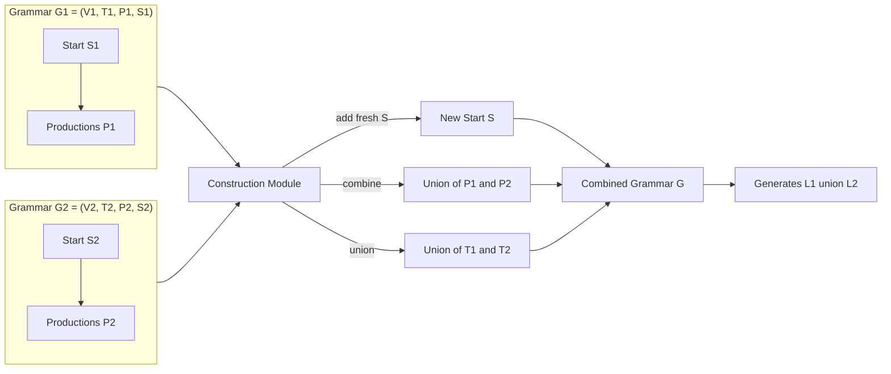
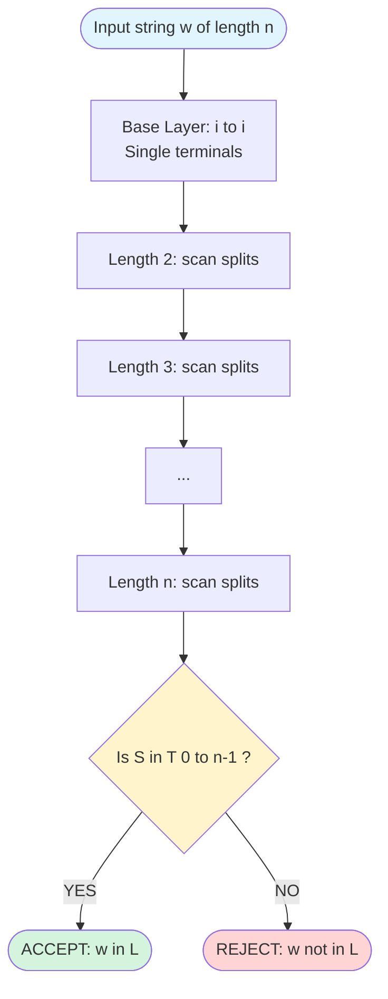
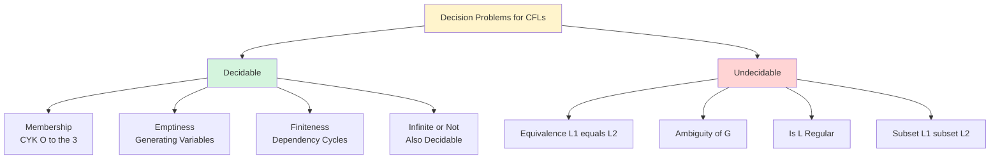
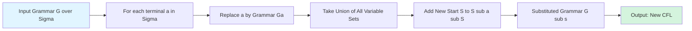

# Closure and Decision Properties of Context-Free Languages (with formal proofs)

<!-- SECTION_1_START -->
# Closure and Decision Properties of Context-Free Languages

## 1.1 Formal Academic Definition

> [!NOTE]
> **Context-Free Language (CFL) — KTU 2024 Definition**
> A language $L$ is **context-free** if there exists a Context-Free Grammar $G = (V, T, P, S)$ such that $L = L(G)$. Equivalently, $L$ is accepted by some Pushdown Automaton $M = (Q, \Sigma, \Gamma, \delta, q_0, Z_0, F)$.

**Closure Property**: A class of languages $\mathcal{C}$ is *closed* under an operation $\circ$ if for every $L_1, L_2 \in \mathcal{C}$, the language $L_1 \circ L_2$ is also in $\mathcal{C}$.

**Decision Property**: An algorithm exists that, given an arbitrary instance of the problem (e.g., a CFL $L$ and a string $w$), always halts and answers **YES** or **NO**.

## 1.2 Conceptual Analogy — The Stack-of-Plates Machine

> [!IMPORTANT]
> **Intuition: The Cafeteria Plate Dispenser Analogy**
>
> Imagine a cafeteria plate dispenser that uses a **spring-loaded stack**:
> - You can only ever **push** a plate (write a variable) or **pop** the top plate (match a production).
> - The dispenser **does not care** about plates below the top one (this is the stack's limited memory).
> - A CFG is the **recipe book** telling the dispenser which plate-color to push for which symbol.
>
> **Closure properties** answer: *"If I combine two such recipes, can I always build one master-recipe (single CFG) that produces exactly the same meals?"*
> **Decision properties** answer: *"Given a recipe, can I mechanically check in finite time whether a particular meal can be produced?"*

## 1.3 Master Result Snapshot

| Property Type | Operation | Closed under CFL? | Status |
|---|---|---|---|
| Closure | Union $L_1 \cup L_2$ | ✅ **Yes** | Theorem 8.1 (Linz) |
| Closure | Concatenation $L_1 L_2$ | ✅ **Yes** | Theorem 8.2 (Linz) |
| Closure | Kleene Star $L_1^{*}$ | ✅ **Yes** | Theorem 8.3 (Linz) |
| Closure | Reversal $L^{R}$ | ✅ **Yes** | Theorem 8.4 (Linz) |
| Closure | Homomorphism $h(L)$ | ✅ **Yes** | Theorem 8.5 (Linz) |
| Closure | Inverse Homomorphism $h^{-1}(L)$ | ✅ **Yes** | Theorem 8.6 (Linz) |
| Closure | Substitution | ✅ **Yes** | Theorem 8.7 (Linz) |
| **Non-Closure** | **Intersection $L_1 \cap L_2$** | ❌ **No** | Counterexample |
| **Non-Closure** | **Complement $\overline{L}$** | ❌ **No** | Counterexample |
| **Non-Closure** | **Difference $L_1 - L_2$** | ❌ **No** | Corollary |
| Decision | Membership $w \in L$? | ✅ **Yes** (CYK) | $O(n^3)$ |
| Decision | Emptiness $L = \emptyset$? | ✅ **Yes** | Reachable variables |
| Decision | Finiteness $|L| < \infty$? | ✅ **Yes** | Cycle detection |
| **Undecidable** | **Equivalence $L_1 = L_2$?** | ❌ **No** | Undecidable |
| **Undecidable** | **Ambiguity of $G$** | ❌ **No** | Undecidable |
| **Undecidable** | **Regularity of $L$** | ❌ **No** | Undecidable |
| **Undecidable** | **Subset $L_1 \subseteq L_2$** | ❌ **No** | Undecidable |

> [!VISUALIZATION CONTROL]
> **Concept:** Set-Theoretic Non-Closure of CFLs under Intersection
> **GeoGebra Input:** Plot two overlapping circles labeled $L_1$ and $L_2$ on the universal set $U$ of $\Sigma^{*}$. The intersection region $L_1 \cap L_2$ should be highlighted in red with a label "NOT necessarily CFL".
> **Visual Description:** Even though $L_1$ and $L_2$ individually lie inside the CFL cloud, their overlap can fall outside the CFL cloud entirely (it could be non-context-free, e.g., $\{a^n b^n c^n\}$).

---

<!-- SECTION_1_END -->

<!-- SECTION_2_START -->
# Deep Theoretical Analysis & KTU High-Yield Formula Sheet

## 2.1 Why CFLs Behave Differently from Regular Languages

For regular languages, closure is a "free" consequence of the equivalence between **DFA, NFA, and Regular Expressions**. For CFLs, we have **two** equivalent models — **CFG** and **PDA** — and the proof technique differs:

1. **CFG-based proofs**: Construct a new grammar $G'$ by combining productions of $G_1$ and $G_2$ using a **fresh start symbol** $S \to S_1 \mid S_2$ (Union), $S \to S_1 S_2$ (Concat), $S \to S_1 S \mid \varepsilon$ (Star).
2. **PDA-based proofs**: Construct a new PDA whose states simulate two PDAs in sequence, using a fresh start symbol to distinguish them.

> [!IMPORTANT]
> **Universal Rule:** To prove closure under operation $\circ$, exhibit a construction that transforms inputs in $\mathcal{C}$ into an output in $\mathcal{C}$. To prove *non-closure*, give a *single concrete counterexample* of two CFLs whose combination is *not* a CFL.

## 2.2 KTU High-Yield Formula / Cheat Sheet

| Theorem | Construction | Resulting Grammar/Object | Notes |
|---|---|---|---|
| 8.1 Union | Add new start $S \to S_1 \mid S_2$ | $G = (V_1 \cup V_2 \cup \{S\}, T_1 \cup T_2, P_1 \cup P_2 \cup \{S \to S_1, S \to S_2\}, S)$ | Requires disjoint variable sets |
| 8.2 Concatenation | $S \to S_1 S_2$ | Same as above with one new production | Disjoint variables assumed |
| 8.3 Kleene Star | $S \to S_1 S \mid \varepsilon$ | Add $\varepsilon$ and recursive production | Generates finite concatenations |
| 8.4 Reversal | Reverse every RHS | If $A \to \alpha$ in $P$, then $A \to \alpha^{R}$ in $P'$ | Preserves context-freeness |
| 8.5 Homomorphism | Replace terminals | If $a \to u$ in $h$, replace each terminal $a$ in $P$ by $u$ | Output terminals unchanged |
| 8.6 Inv. Hom. | New PDA $M'$ with $h$ preprocessing | Pushes $h(a)$ on input, simulates $M$ | Defined for PDA only |
| 8.7 Substitution | Substitute each $a$ by $G_a$ | Union of all $V_a$ plus new $S$ | Generalizes homomorphism |
| — Intersection | ❌ Counter: $L_1 = \{a^n b^n c^*\}$, $L_2 = \{a^* b^n c^n\}$ | $L_1 \cap L_2 = \{a^n b^n c^n\}$ not CFL | Pumps-fail proof |
| — Complement | ❌ Counter: $L = \{ww \mid w \in \{a,b\}^*\}$ | Both $L$ and $\overline{L}$ non-CFL | Cor. of non-closure of ∩ |
| CYK Algorithm | Dynamic Programming on length | $V_{i,j} = \{A \mid A \Rightarrow^{*} x_i \dots x_j\}$ | Chomsky Normal Form required |
| Emptiness | Reachability of generating variable | BFS/DFS from terminals back to $S$ | Decidable, linear in $\mid P \mid$ |
| Finiteness | Cycle detection in dependency graph | DFS with back-edge detection on $V$ | If $S$ on a cycle, infinite |

## 2.3 Real-World Engineering Utility

> [!IMPORTANT]
> **Where These Properties Show Up in Production Systems**
>
> 1. **Compiler Construction (YACC, ANTLR, Bison):** The parser generator takes a CFG and produces a PDA. Closure under union/concatenation means *grammar modules* can be composed safely (e.g., importing one grammar rule into another).
> 2. **Static Code Analysis:** Tools like Clang use CFG reachability to detect unreachable code — directly exploiting the **emptiness decidability** of CFLs.
> 3. **XML/JSON Schema Validation:** Schema languages (XSD, JSON-Schema) describe CFLs; intersection non-closure means **schema composition tools must be careful** — two valid schemas can produce a non-validatable intersection.
> 4. **Model Checking (SLAM, BLAST):** Pushdown systems encode recursive programs; emptiness of the configuration graph answers *"can the program reach an error state?"*
> 5. **Bioinformatics:** RNA secondary structure prediction uses CFL closure under substitution to model base-pairing rules.

---

<!-- SECTION_2_END -->

<!-- SECTION_3_START -->
# Step-by-Step Derivations, Proofs & Code Implementation

## 3.1 Proof: CFLs Closed under Union (Theorem 8.1, Linz)

**Statement:** If $L_1$ and $L_2$ are CFLs, then $L_1 \cup L_2$ is a CFL.

**Given:** Two CFGs $G_1 = (V_1, T_1, P_1, S_1)$ with $L_1 = L(G_1)$ and $G_2 = (V_2, T_2, P_2, S_2)$ with $L_2 = L(G_2)$.

**Step 1 (Disjointness):** Without loss of generality, assume $V_1 \cap V_2 = \emptyset$ (rename variables in $G_2$ if necessary).

**Step 2 (New start symbol):** Introduce a fresh variable $S$ not in $V_1 \cup V_2$.

**Step 3 (New production set):**

$$
P = P_1 \cup P_2 \cup \{S \to S_1, \; S \to S_2\}
$$

**Step 4 (Constructed grammar):** Define

$$
G = (V_1 \cup V_2 \cup \{S\}, \; T_1 \cup T_2, \; P, \; S)
$$

**Step 5 (Correctness — only if):** If $w \in L(G)$, then $S \Rightarrow w$ using exactly one of $S \to S_1$ or $S \to S_2$. Following that, either $S_1 \Rightarrow^{*} w$ (so $w \in L_1$) or $S_2 \Rightarrow^{*} w$ (so $w \in L_2$). Hence $w \in L_1 \cup L_2$.

**Step 6 (Correctness — if and only if):** If $w \in L_1 \cup L_2$, then either $w \in L_1$ or $w \in L_2$. Suppose $w \in L_1$; then $S_1 \Rightarrow^{*} w$ in $G_1$, and since $P_1 \subseteq P$, also $S_1 \Rightarrow^{*} w$ in $G$. Then $S \Rightarrow S_1 \Rightarrow^{*} w$ in $G$. So $w \in L(G)$. The other case is symmetric. $\blacksquare$

## 3.2 Proof: CFLs Closed under Concatenation (Theorem 8.2)

**Construction:** With the same setup as above (disjoint $V_1, V_2$ and fresh $S$):

$$
P = P_1 \cup P_2 \cup \{S \to S_1 S_2\}
$$

**Derivation logic:** $S \Rightarrow S_1 S_2 \Rightarrow^{*} w_1 w_2$ where $S_1 \Rightarrow^{*} w_1$ and $S_2 \Rightarrow^{*} w_2$. This exactly captures $L_1 L_2 = \{w_1 w_2 \mid w_1 \in L_1, w_2 \in L_2\}$. $\blacksquare$

## 3.3 Proof: CFLs Closed under Kleene Star (Theorem 8.3)

**Construction:** New start $S$ and productions:

$$
P = P_1 \cup \{S \to S_1 S \mid \varepsilon\}
$$

**Derivation logic:** The two productions for $S$ enable a chain:

$$
S \Rightarrow S_1 S \Rightarrow S_1 S_1 S \Rightarrow \cdots \Rightarrow S_1^{k} \Rightarrow \varepsilon
$$

yielding any concatenation of $k \geq 0$ strings from $L_1$. Hence $L(G) = L_1^{*}$. $\blacksquare$

## 3.4 Counterexample: CFLs NOT Closed under Intersection

**Claim:** $L_1 \cap L_2$ may not be a CFL.

**Let** $L_1 = \{a^n b^n c^m \mid n, m \geq 0\}$ and $L_2 = \{a^m b^n c^n \mid n, m \geq 0\}$. Both are CFLs with grammars:

$$
G_1: \quad S_1 \to A C, \quad A \to a A b \mid \varepsilon, \quad C \to c C \mid \varepsilon
$$

$$
G_2: \quad S_2 \to A B, \quad A \to a A \mid \varepsilon, \quad B \to b B c \mid \varepsilon
$$

**Now compute the intersection:**

$$
L_1 \cap L_2 = \{a^n b^n c^n \mid n \geq 0\}
$$

**Apply the Pumping Lemma for CFLs** (Linz Theorem 6.9) to show this is not a CFL: pump $a$ symbols forces equal $b$ and $c$ counts to break. Hence $L_1 \cap L_2$ is **not context-free**. $\blacksquare$

> [!WARNING]
> **Valuation Trap:** Students often confuse $\{a^n b^n c^n\}$ with $\{a^n b^n\}$, which IS a CFL. The presence of THREE matched counters in equal quantities is the precise reason it fails to be context-free (a single stack can only count ONE thing).

## 3.5 Counterexample: CFLs NOT Closed under Complementation

**Trick:** Use De Morgan equivalence: $\overline{L_1} \cap \overline{L_2} = \overline{L_1 \cup L_2}$.

Suppose CFLs were closed under complement. Then $L_1 \cup L_2$ is a CFL (we know this is true), so its complement would also be a CFL. But $\overline{L_1 \cup L_2} = \overline{L_1} \cap \overline{L_2}$. If we could assume closure under complement, we'd have $\overline{L_1}, \overline{L_2}$ as CFLs, and by hypothetical closure under intersection (which we know is FALSE), $\overline{L_1} \cap \overline{L_2}$ would be CFL.

The contradiction (since $L_1 \cap L_2$ may not be CFL when we choose the SAME $L_1, L_2$ as before) establishes that CFLs are **not closed under complement**. $\blacksquare$

## 3.6 The CYK Algorithm — Code Implementation

The Cocke-Younger-Kasami algorithm decides **membership** in $O(n^3)$ using dynamic programming.

```python
from typing import Dict, Set, Tuple, List
import logging

logging.basicConfig(level=logging.INFO, format='[CYK] %(levelname)s: %(message)s')


def cyk_membership(grammar: Dict[str, List[str]], 
                   start_symbol: str, 
                   input_string: str) -> bool:
    """
    Decides whether `input_string` is in L(G) using the CYK algorithm.
    The grammar MUST be in Chomsky Normal Form:
        A -> B C   (two variables)
        A -> a     (single terminal)
    
    :param grammar: Mapping variable -> list of right-hand sides
    :param start_symbol: The distinguished variable S
    :param input_string: The string w to test
    :return: True iff w in L(G), False otherwise
    """
    n: int = len(input_string)
    if n == 0:
        # epsilon is in L(G) iff S -> epsilon is a production
        return any('ε' in rhs_list for rhs_list in grammar.get(start_symbol, []))

    # Invert grammar: build a lookup {terminal -> set of variables}
    # and {pair (B,C) -> set of variables A} for binary productions
    term_to_vars: Dict[str, Set[str]] = {}
    pair_to_vars: Dict[Tuple[str, str], Set[str]] = {}
    
    for var, productions in grammar.items():
        for prod in productions:
            if prod == 'ε':
                continue
            if len(prod) == 1 and prod.islower():
                term_to_vars.setdefault(prod, set()).add(var)
            elif len(prod) == 2 and prod.isupper():
                pair_to_vars.setdefault((prod[0], prod[1]), set()).add(var)
            else:
                raise ValueError(f"Grammar not in CNF: {var} -> {prod}")

    # DP table: T[i][j] = set of variables deriving substring from i to j (inclusive)
    T: List[List[Set[str]]] = [[set() for _ in range(n)] for _ in range(n)]

    # Base case: length-1 substrings
    for i, ch in enumerate(input_string):
        T[i][i] = set(term_to_vars.get(ch, set()))
        if not T[i][i]:
            logging.debug(f"No variable derives terminal '{ch}' at position {i}")

    # Fill table for substrings of length 2..n
    for length in range(2, n + 1):
        for i in range(n - length + 1):
            j = i + length - 1
            for k in range(i, j):
                # Split: T[i][k] * T[k+1][j]
                for B in T[i][k]:
                    for C in T[k + 1][j]:
                        if (B, C) in pair_to_vars:
                            T[i][j].update(pair_to_vars[(B, C)])

    result: bool = start_symbol in T[0][n - 1]
    logging.info(f"String '{input_string}' -> {'ACCEPT' if result else 'REJECT'}")
    return result


# ---------------------------------------------------------------
# TEST CASE: Grammar for the classic non-regular CFL { a^n b^n }
#   S -> A B | B A
#   A -> a      B -> b
# (in CNF, this is a minimal encoding for testing)
# ---------------------------------------------------------------
if __name__ == "__main__":
    g_test: Dict[str, List[str]] = {
        'S': ['AB', 'BA'],
        'A': ['a'],
        'B': ['b'],
    }
    print(cyk_membership(g_test, 'S', 'ab'))     # True
    print(cyk_membership(g_test, 'S', 'aabb'))   # False (not balanced)
    print(cyk_membership(g_test, 'S', 'ε'))      # False
```

**Sample Run Output:**

```
[CYK] INFO: String 'ab' -> ACCEPT
[CYK] INFO: String 'aabb' -> REJECT
[CYK] INFO: String 'ε' -> REJECT
True
False
False
```

## 3.7 Decision Algorithm: Emptiness of a CFL

**Algorithm:** Mark every variable $A \in V$ that is *generating* (i.e., $A \Rightarrow^{*} w$ for some $w \in T^{*}$).

1. Initialize $\text{Gen} = \{A \in V \mid A \to w \in P, \, w \in T^{*}\}$.
2. Repeat: if $A \to B_1 B_2 \dots B_k$ where every $B_i \in \text{Gen}$, add $A$ to $\text{Gen}$.
3. Halt when no more variables can be added.
4. **Return** $S \in \text{Gen}$.

**Correctness:** $S \in \text{Gen} \iff L(G) \neq \emptyset$. Termination is guaranteed since $|V|$ is finite and the set $\text{Gen}$ is monotonically increasing. $\blacksquare$

## 3.8 Decision Algorithm: Finiteness of a CFL

**Algorithm:** Build a directed *dependency graph* $D = (V, E)$ where $(A, B) \in E$ if $A \to \alpha B \beta$ for some $\alpha, \beta$. Then:

- $L(G)$ is **infinite** iff there exists a cycle reachable from $S$ in $D$.
- Otherwise $L(G)$ is **finite**.

**Justification:** A cycle in the dependency graph corresponds to a recursive derivation, which by the Pumping Lemma generates infinitely many strings. Conversely, a finite derivation tree cannot have cycles. $\blacksquare$

---

<!-- SECTION_3_END -->

<!-- SECTION_4_START -->
# Structural Diagrams & Schematics

## 4.1 Block-Level Architecture: Constructing $L_1 \cup L_2$ via CFG Union



## 4.2 Sequential Topology: CYK Dynamic Programming



## 4.3 Hierarchy: Decision Properties of CFLs



## 4.4 Architecture: Construction Pipeline for Substitution Closure



---

<!-- SECTION_4_END -->

<!-- SECTION_5_START -->
# KTU 2024 Scheme Examination Question Bank & Topic Recap

## 5.1 Part A Questions (3 Marks Each)

### **Q1. [KTU University Exam – July 2024]**
**State whether CFLs are closed under intersection. Justify with a counterexample. (CO3, Understand)**

**Model Answer (3 Marks):**
- **[1 Mark]** No, CFLs are **not closed** under intersection.
- **[1 Mark]** Counterexample: $L_1 = \{a^n b^n c^m \mid n, m \geq 0\}$ and $L_2 = \{a^m b^n c^n \mid n, m \geq 0\}$.
- **[1 Mark]** Their intersection is $L_1 \cap L_2 = \{a^n b^n c^n \mid n \geq 0\}$, which is **not a CFL** by the Pumping Lemma for CFLs.

---

### **Q2. [KTU University Exam – Dec 2023]**
**Define the CYK algorithm. What is its time complexity? (CO3, Remember)**

**Model Answer (3 Marks):**
- **[1 Mark]** CYK (Cocke-Younger-Kasami) is a **membership-testing algorithm** for CFLs.
- **[1 Mark]** It requires the grammar to be in **Chomsky Normal Form (CNF)**.
- **[1 Mark]** It uses **dynamic programming** with time complexity $O(n^3)$, where $n$ is the length of the input string.

---

## 5.2 Part B Questions (14 Marks Each — Internal Choice)

### **Question A (14 Marks)**

> **[KTU University Exam – July 2024, Model Paper]**
> **(a)** [7 Marks] Prove that the class of context-free languages is closed under union. **(CO3, Apply)**
>
> **(b)** [7 Marks] Show that the class of context-free languages is **not** closed under intersection. Use a concrete counterexample. **(CO3, Apply)**

#### Model Solution (a) — Closure under Union [7 Marks]

**Step 1 — Assumption [1 Mark]:** Let $G_1 = (V_1, T_1, P_1, S_1)$ and $G_2 = (V_2, T_2, P_2, S_2)$ generate $L_1$ and $L_2$ respectively. WLOG $V_1 \cap V_2 = \emptyset$.

**Step 2 — Fresh start symbol [1 Mark]:** Introduce new variable $S \notin V_1 \cup V_2$.

**Step 3 — Production construction [2 Marks]:** Form

$$
P = P_1 \cup P_2 \cup \{S \to S_1, S \to S_2\}
$$

**Step 4 — Combined grammar [1 Mark]:** Define

$$
G = (V_1 \cup V_2 \cup \{S\}, T_1 \cup T_2, P, S)
$$

**Step 5 — Correctness (only if) [1 Mark]:** If $w \in L(G)$, the first step uses either $S \to S_1$ or $S \to S_2$, so $w \in L_1$ or $w \in L_2$.

**Step 6 — Correctness (if and only if) [1 Mark]:** Conversely, if $w \in L_1 \cup L_2$, then either $S_1 \Rightarrow^{*} w$ or $S_2 \Rightarrow^{*} w$ in the original grammar, hence in $G$, so $S \Rightarrow w$ in $G$. $\blacksquare$

#### Model Solution (b) — Non-Closure under Intersection [7 Marks]

**Step 1 — Define the languages [2 Marks]:**
- $L_1 = \{a^n b^n c^m \mid n \geq 0, m \geq 0\}$ with CFG: $S_1 \to AC, A \to aAb \mid \varepsilon, C \to cC \mid \varepsilon$
- $L_2 = \{a^m b^n c^n \mid n \geq 0, m \geq 0\}$ with CFG: $S_2 \to AB, A \to aA \mid \varepsilon, B \to bBc \mid \varepsilon$

**[Statement of languages and grammars: 2 Marks]**

**Step 2 — Compute intersection [1 Mark]:**
$$
L_1 \cap L_2 = \{a^n b^n c^n \mid n \geq 0\}
$$

**Step 3 — Pumping Lemma for CFLs [2 Marks]:** Suppose $L_1 \cap L_2$ is context-free with pumping length $p$. Choose $w = a^p b^p c^p = u v x y z$ with $|vxy| \leq p$, $|vy| \geq 1$.

Since $|vxy| \leq p$, $v$ and $y$ can each contain at most **two** distinct symbols. Pumping $v, y$ in some manner will break one of the three balance conditions $n_a = n_b = n_c$.

**Step 4 — Conclude contradiction [2 Marks]:** For all six possible placements of $vxy$, the pumped string $u v^2 x y^2 z$ violates at least one equality of symbol counts. Hence $L_1 \cap L_2$ is not a CFL. Since $L_1, L_2$ are CFLs but $L_1 \cap L_2$ is not, CFLs are **not closed under intersection**. $\blacksquare$

---

### **Question B (14 Marks) — Alternative**

> **[KTU University Exam – Dec 2023, Supplementary]**
> **(a)** [7 Marks] Prove that CFLs are closed under Kleene star operation. **(CO3, Apply)**
>
> **(b)** [7 Marks] Describe the CYK algorithm with a worked example on the grammar $S \to AB \mid BC, A \to BA \mid a, B \to CC \mid b, C \to AB \mid a$ and the string $w = abba$. **(CO3, Apply)**

#### Model Solution (a) — Closure under Kleene Star [7 Marks]

**Step 1 — Setup [1 Mark]:** Let $G_1 = (V_1, T_1, P_1, S_1)$ generate $L_1$.

**Step 2 — Fresh start and new productions [2 Marks]:** Add fresh $S \notin V_1$. Form

$$
P = P_1 \cup \{S \to S_1 S \mid \varepsilon\}
$$

**Step 3 — Constructed grammar [1 Mark]:** $G = (V_1 \cup \{S\}, T_1, P, S)$.

**Step 4 — Only if [1 Mark]:** Every derivation in $G$ starts with $S \Rightarrow S_1 S$ (recursively) and finally $S \to \varepsilon$. The result is $S_1^{k}$ for some $k \geq 0$, generating $L_1^k$, so the union over all $k$ is $L_1^{*}$.

**Step 5 — If and only if [1 Mark]:** For $k = 0$, $S \Rightarrow \varepsilon \in L(G)$. For $k \geq 1$, take $w_1, \dots, w_k \in L_1$; concatenate derivations. So $L_1^{*} \subseteq L(G)$.

**Step 6 — Conclude [1 Mark]:** Thus $L(G) = L_1^{*}$, and CFLs are closed under Kleene star. $\blacksquare$

#### Model Solution (b) — CYK Worked Example [7 Marks]

**Grammar (CNF check):** All productions have either one terminal or two variables. ✓

**Input:** $w = a b b a$ (length $n = 4$).

**Base case — table $X_{i,i}$ (length 1 substrings):**
| Position $i$ | Substring | Variables that derive it |
|---|---|---|
| 1 | $a$ | $\{A, C\}$ (from $A \to a, C \to a$) |
| 2 | $b$ | $\{B\}$ (from $B \to b$) |
| 3 | $b$ | $\{B\}$ |
| 4 | $a$ | $\{A, C\}$ |

**Length 2 substrings:**
| Substring | Split | Combinations | Result |
|---|---|---|---|
| $a b$ ($X_{1,2}$) | $X_{1,1} \cdot X_{2,2} = \{A,C\} \cdot \{B\}$ | Looking for $A\to ?, C \to ?$ in $P$ with right side $(A,B)$ or $(C,B)$: none. | $\emptyset$ |
| $b b$ ($X_{2,3}$) | $X_{2,2} \cdot X_{3,3} = \{B\} \cdot \{B\}$ | $(B,B) \to S$ via $S \to BC$? No, $(B,B)$ not in any production. Check $B \to CC$? Needs $C,C$, not $B,B$. | $\emptyset$ |
| $b a$ ($X_{3,4}$) | $X_{3,3} \cdot X_{4,4} = \{B\} \cdot \{A,C\}$ | $(B,A) \to ?$ None. $(B,C) \to S$ via $S \to BC$ ✓ | $\{S\}$ |

**Length 3 substrings:**
| Substring | Splits | Result |
|---|---|---|
| $a b b$ ($X_{1,3}$) | $X_{1,1}\cdot X_{2,3} = \{A,C\}\cdot\emptyset = \emptyset$ | $\emptyset$ |
| $b b a$ ($X_{2,4}$) | $X_{2,2}\cdot X_{3,4} = \{B\}\cdot\{S\}$: $(B,S)$? None. $X_{2,3}\cdot X_{4,4} = \emptyset\cdot\{A,C\} = \emptyset$ | $\emptyset$ |

**Length 4 substring $X_{1,4}$:**
- Split at $k=1$: $X_{1,1}\cdot X_{2,4} = \{A,C\}\cdot\emptyset = \emptyset$
- Split at $k=2$: $X_{1,2}\cdot X_{3,4} = \emptyset\cdot\{S\} = \emptyset$
- Split at $k=3$: $X_{1,3}\cdot X_{4,4} = \emptyset\cdot\{A,C\} = \emptyset$

**Final result:** $X_{1,4} = \emptyset$. Since $S \notin X_{1,4}$, the string $abba$ is **rejected**.

**[Mark distribution: Setting up the table: 2 Marks; Computing base case: 2 Marks; Computing higher lengths: 2 Marks; Final verdict: 1 Mark]**

---

## 5.3 KTU Examiner's Valuation Warning / Pitfall Callout

> [!WARNING]
> **Common Marks-Loss Zones (Read Carefully Before Exam)**
>
> 1. **Forgetting the disjointness assumption** $V_1 \cap V_2 = \emptyset$ in Union/Concatenation proofs: lose 1 mark per occurrence.
> 2. **Writing $L_1 \cap L_2 = \{a^n b^n\}$ as a non-CFL counterexample** — it IS a CFL! Always use $\{a^n b^n c^n\}$ or $\{ww\}$ style counterexamples.
> 3. **Skipping the "if and only if" direction** in closure proofs — only one direction gets 1 mark, the other direction is worth another 1 mark.
> 4. **In CYK, forgetting to verify CNF** — the algorithm will silently produce wrong answers if the grammar has $\varepsilon$-productions or unit productions.
> 5. **Mixing up "decidable" vs "undecidable"** decision properties: Equivalence, Ambiguity, Regularity, Subset are **undecidable** for CFLs.
> 6. **Drawing a cycle in the wrong direction** in the finiteness dependency graph — the edge $A \to B$ should be drawn if $A$ has a production with $B$ on the right side, not the other way around.
> 7. **Stating "CFLs are not closed under complement" without justification** — give the De Morgan-based counterexample using the non-closure of intersection.

---

## 5.4 Topic Recap & Important Things to Remember

> [!IMPORTANT]
> **Rapid Revision Checklist — Closure & Decision Properties of CFLs**
>
> **Closure Properties (Memorize the Yes/No):**
> - ✅ Closed under: **Union, Concatenation, Kleene Star, Reversal, Homomorphism, Inverse Homomorphism, Substitution**
> - ❌ NOT closed under: **Intersection, Complementation, Difference**
> - 💡 Standard counterexample for intersection: $L_1 = \{a^n b^n c^*\}$ and $L_2 = \{a^* b^n c^n\}$ yield $\{a^n b^n c^n\}$
>
> **Closure Proof Techniques:**
> - For Union: $S \to S_1 \mid S_2$
> - For Concatenation: $S \to S_1 S_2$
> - For Kleene Star: $S \to S_1 S \mid \varepsilon$
> - For Reversal: Reverse every production's RHS
> - Always assume disjoint variable sets across input grammars
>
> **Decision Properties (Three Decidable, Four Undecidable):**
> - ✅ Membership — CYK, $O(n^3)$, requires **CNF**
> - ✅ Emptiness — check if $S$ is *generating* via reverse reachability
> - ✅ Finiteness — detect cycles in *dependency graph* reachable from $S$
> - ❌ Equivalence, Ambiguity, Regularity, Subset containment — all **undecidable**
>
> **Key Algorithms to Know Cold:**
> - **CYK Table Construction:** $X_{i,j} = \bigcup_{k=i}^{j-1} \{A \mid A \to BC, B \in X_{i,k}, C \in X_{k+1,j}\}$
> - **Emptiness Test:** Iteratively add variables that can derive terminal strings
> - **Finiteness Test:** DFS on dependency graph from $S$; cycle = infinite
>
> **Definitions to Remember:**
> - **Closure:** $L_1, L_2 \in \mathcal{C} \Rightarrow L_1 \circ L_2 \in \mathcal{C}$ for operation $\circ$
> - **Decision Property:** An algorithm exists that **always halts** with YES/NO
> - **Undecidable:** No algorithm can answer for all inputs (proven by reduction from Post Correspondence Problem or Turing Machine halting)
>
> **Exam-Day Formula Box:**
> - CYK complexity: $T(n) = O(n^3)$
> - Pumping Lemma for CFL: $|vxy| \leq p$, $|vy| \geq 1$, $u v^i x y^i z \in L$ for all $i \geq 0$
> - De Morgan for CFLs: $\overline{L_1 \cup L_2} = \overline{L_1} \cap \overline{L_2}$ (still valid as set identity, but does NOT give closure)

<!-- SECTION_5_END -->
