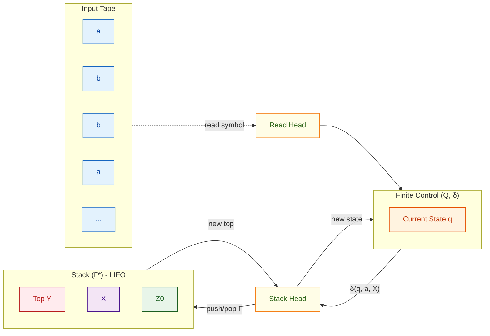
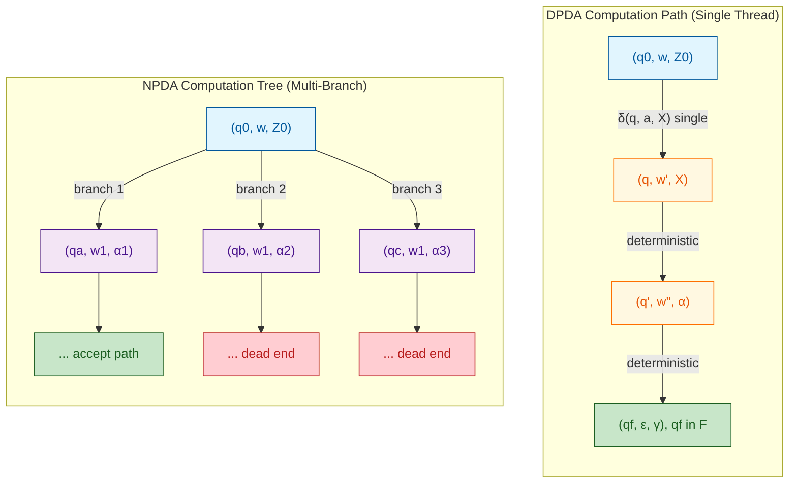
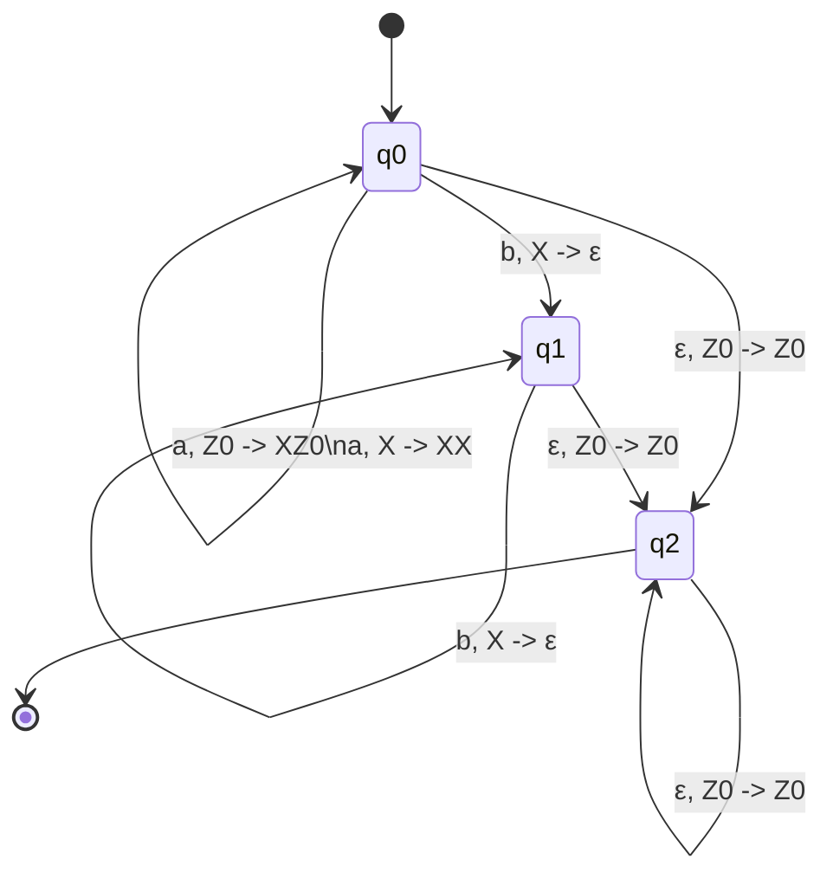
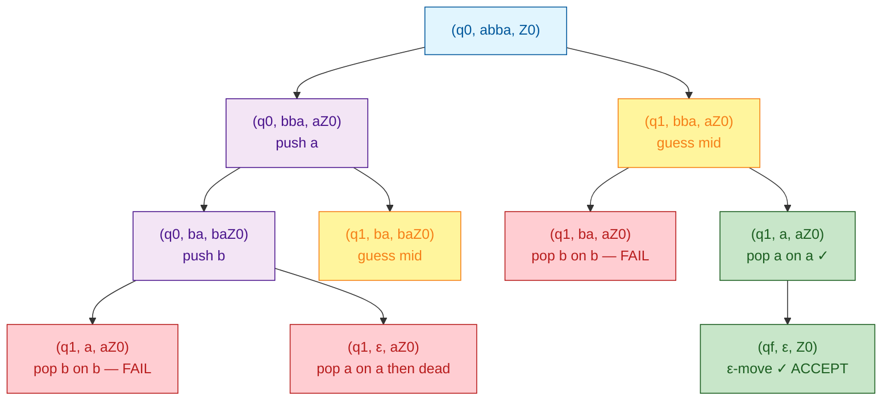
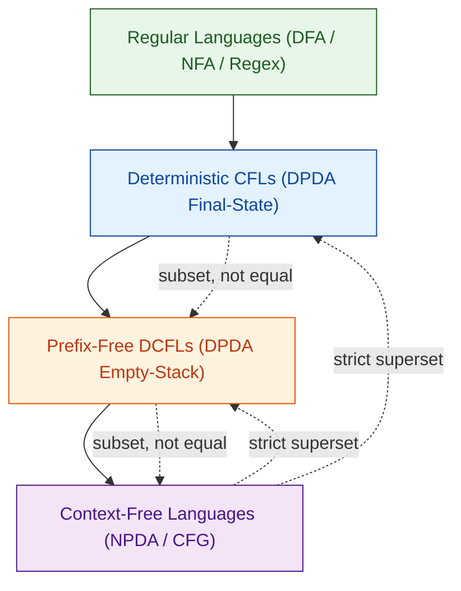

# DPDA and NPDA

<!-- SECTION_1_START -->
# Deterministic & Non-deterministic Pushdown Automata (DPDA & NPDA)

> [!NOTE]
> **Syllabus Highlight (KTU 2024 Scheme - PCCST302 Module 3)**
> Pushdown Automata (PDA) form the bridge between **Finite Automata** (limited memory) and **Turing Machines** (unlimited memory). A PDA augments a finite control with a **single, stack-based, last-in-first-out (LIFO) auxiliary memory** — giving it just enough power to recognize all **Context-Free Languages (CFLs)**.

## 1.1 Formal Definition of a Pushdown Automaton (PDA)

A **Pushdown Automaton (PDA)** is a 7-tuple:

$$M = (Q, \Sigma, \Gamma, \delta, q_{0}, Z_{0}, F)$$

where every component is **non-empty** and carries a precise meaning:

| Symbol | Name | Meaning |
|:---:|:---|:---|
| $Q$ | Finite set of **states** | Internal control configurations of the machine |
| $\Sigma$ | **Input alphabet** | Symbols that can appear on the input tape |
| $\Gamma$ | **Stack alphabet** | Symbols that can be pushed onto the stack |
| $\delta$ | **Transition function** | Heart of the PDA — defines state/stack/input changes |
| $q_{0} \in Q$ | **Start state** | The single initial state |
| $Z_{0} \in \Gamma$ | **Initial stack symbol** | The bottom-of-stack marker (often the symbol **$Z_0$**) |
| $F \subseteq Q$ | Set of **final (accepting) states** | $F$ may be **empty** in *empty-stack* acceptance mode |

The **general (non-deterministic) transition function** is:

$$\delta : Q \times (\Sigma \cup \{\varepsilon\}) \times \Gamma \longrightarrow \mathcal{P}_{\text{fin}}\bigl(Q \times \Gamma^{*}\bigr)$$

That is, given a current state, the next input symbol (or $\varepsilon$), and the symbol currently on top of the stack, the PDA may move to a new state and **replace the stack-top by an arbitrary finite string** (which is a *push* of one or more symbols, a *pop* of zero or more, or a combination).

> [!IMPORTANT]
> **Configuration (Instantaneous Description, ID)**
> A configuration of a PDA is a triple $(q, w, \gamma) \in Q \times \Sigma^{*} \times \Gamma^{*}$, where $q$ is the current state, $w$ is the unconsumed input, and $\gamma$ is the current stack contents (top of stack is the **leftmost** symbol of $\gamma$ by convention in Linz).

A move is denoted by the **turnstile** $\vdash$:

$$(q, aw, X\beta) \vdash (p, w, \alpha\beta) \quad \text{iff} \quad (p, \alpha) \in \delta(q, a, X)$$

## 1.2 Intuitive Analogy — "The Pancake Plate Tower"

Imagine a **clumsy chef** standing in a kitchen with a counter (finite state), reading a recipe card one line at a time (input tape). Behind the chef is a **spring-loaded stack of plates** — only the top plate is reachable at any time.

- The chef can **push** a plate labelled $A$ onto the top.
- The chef can **pop** the top plate and read its label.
- The chef can **replace** the top plate by several plates at once (a multi-plate push).
- The chef can ignore the recipe card (the $\varepsilon$-move) and just manipulate the stack.

This stack gives the chef **unlimited, but extremely restricted, memory**. Because access is restricted to the *top* of the stack, the chef cannot directly read the *bottom* plate without first removing all plates above it.

A **DPDA (Deterministic PDA)** is a chef with a **single, well-defined recipe** — at every step, at most one action is possible.
An **NPDA (Non-deterministic PDA)** is a chef who **clones himself** at every choice-point, with each clone following one possible recipe in parallel — if *any* clone finishes the recipe successfully, the dish is accepted.

> [!VISUALIZATION CONTROL]
> **Concept:** Visualising a PDA as a 3-component flowchart
> **GeoGebra / Desmos Input Equations:**
> * State circle: $(x-0)^{2} + (y-0)^{2} = 1$
> * Input arrow: parametric line $(t, -2)$ for $t \in [-3, 3]$
> * Stack tower: rectangles at $x = 4$, $y \in \{0, 1, 2, 3, 4\}$ (each rectangle $= 1 \times 0.8$)
> **Visual Description:** A circular state on the left, a horizontal input tape feeding symbols into it, and a vertical "tower" of stack symbols rising to the right. Transitions should be drawn as labelled arrows.

## 1.3 Determinism vs. Non-determinism in PDAs

The transition function splits into two fundamentally different flavours:

**Deterministic PDA (DPDA):**

$$\delta : Q \times (\Sigma \cup \{\varepsilon\}) \times \Gamma \longrightarrow (Q \times \Gamma^{*}) \cup \{\emptyset\}$$

**Conditions for Determinism (Linz, Definition 7.1):**
For every $q \in Q$, $X \in \Gamma$, and $a \in \Sigma \cup \{\varepsilon\}$:
1. $\vert \delta(q, a, X) \vert \leq 1$
2. If $\delta(q, \varepsilon, X) \neq \emptyset$, then $\delta(q, a, X) = \emptyset$ for **all** $a \in \Sigma$.

Condition 2 forbids the machine from making both an $\varepsilon$-move and a real-input move in the same state/stack configuration — a single deterministic path must always exist.

**Non-deterministic PDA (NPDA):** simply drops both restrictions, allowing **multiple branches** of computation.

> [!NOTE]
> **Critical KTU Result (Linz Theorem 7.3)**
> The class of languages accepted by **NPDAs** is **exactly** the class of **Context-Free Languages (CFLs)**. In other words:
> $$\mathcal{L}(\text{NPDA}) = \mathcal{L}(\text{CFG})$$
> This is the CFL-equivalence theorem, and it is the *single most important result* in Module 3.

## 1.4 Acceptance Modes

A PDA can accept a string $w$ in two equivalent ways (for NPDAs):

| Mode | Symbol | Condition |
|:---:|:---:|:---|
| **Final-State Acceptance** | $L(M) = \{w \mid (q_{0}, w, Z_{0}) \vdash^{*} (q, \varepsilon, \gamma),\ q \in F\}$ | Reaches a state in $F$ with empty input |
| **Empty-Stack Acceptance** | $N(M) = \{w \mid (q_{0}, w, Z_{0}) \vdash^{*} (q, \varepsilon, \varepsilon)\}$ | Empties the stack entirely |

> [!IMPORTANT]
> **For NPDAs**, the two modes are **equivalent** — every NPDA with final-state acceptance can be converted to an empty-stack NPDA, and vice versa (Linz Theorem 7.1).
> **For DPDAs**, the two modes are **NOT equivalent**. Each DPDA accepts a *different class* of languages depending on the chosen mode.

## 1.5 Why the Distinction Matters

The defining example that separates the two:

$$L_{ww^{R}} = \{ww^{R} \mid w \in \{a, b\}^{*}\}$$

This is the language of **even-length palindromes**. It is a CFL generated by the grammar $S \to aSa \mid bSb \mid \varepsilon$. **No DPDA can accept $L_{ww^{R}}$**, because at the centre of the input the machine has no way to "guess" deterministically where the first half ends and the second half begins. An **NPDA** can clone itself and try every possible split — at least one clone will guess correctly.

Conversely:

$$L_{a^{n}b^{n}} = \{a^{n}b^{n} \mid n \geq 0\}$$

**can** be accepted by a DPDA, because the deterministic algorithm is simple: push one $X$ for every $a$, then pop one $X$ for every $b$, accepting if the stack ends with exactly $Z_0$.

<!-- SECTION_1_END -->

<!-- SECTION_2_START -->
# Deep Theoretical Analysis & KTU High-Yield Formula Sheet

## 2.1 Anatomy of a PDA Move

A single transition of a PDA is a **triple input → triple output** decision:

```
Current ID:  (state, next input symbol, stack-top)
                   ↓
       Apply δ (transition function)
                   ↓
Next ID:     (new state, popped input, replaced stack-top)
```

Formally, if $(p, \alpha) \in \delta(q, a, X)$, the PDA:

1. **Consumes** the input symbol $a$ (or $\varepsilon$),
2. **Pops** $X$ from the top of the stack,
3. **Pushes** the string $\alpha$ onto the top of the stack,
4. **Moves** to state $p$.

> [!NOTE]
> **Stack-Top Replacement Rule (Linz convention)**
> The string $\alpha$ replaces $X$, it does *not* push on top of $X$. To model a *true* push of $Y$ while keeping $X$, use $\alpha = YX$.

## 2.2 Determinism — Full Formal Conditions

A PDA $M$ is **deterministic** if and only if the following hold simultaneously for all $q \in Q$ and $X \in \Gamma$:

**Condition D1 — Single Next Move:**
$$\forall a \in \Sigma \cup \{\varepsilon\}: \quad \bigl\vert \delta(q, a, X) \bigr\vert \leq 1$$

**Condition D2 — No $\varepsilon$ vs. Input Race:**
$$\delta(q, \varepsilon, X) \neq \emptyset \implies \delta(q, a, X) = \emptyset \ \forall a \in \Sigma$$

A PDA that violates **D1** has genuine **non-determinism** (multiple branching moves). A PDA that satisfies **D1** but violates **D2** is said to be **almost-deterministic** or has a **$\varepsilon$-ambiguity** — Linz calls such a machine "deterministic in the weak sense" and excludes it.

> [!IMPORTANT]
> **Engineering Utility of Determinism**
> Determinism is *not* an academic curiosity. Every real-world parser (YACC/Bison, ANTLR, JavaCC) is built around a DPDA-style algorithm (the **LR(k)** family). Without DPDA theory, there would be no fast, predictable compilers.

## 2.3 Languages Accepted by DPDA and NPDA — The Hierarchy

The central result (Linz Theorem 7.8) is a **strict containment**:

$$\mathcal{L}(\text{DPDA, final state}) \;\subsetneq\; \mathcal{L}(\text{DPDA, empty stack}) \;\subsetneq\; \mathcal{L}(\text{NPDA}) = \mathcal{L}(\text{CFG})$$

Read carefully from left to right:
- Every language accepted by a DPDA in the *final-state* mode is also a CFL.
- There exist languages accepted by a DPDA in *empty-stack* mode that cannot be accepted in *final-state* mode by any DPDA.
- There exist CFLs that **no** DPDA can accept under any acceptance mode — the canonical example is $L_{ww^{R}}$.

## 2.4 Prefix Property and Its Role

A language $L$ is called **prefix-free** if no string in $L$ is a proper prefix of another string in $L$.

> [!IMPORTANT]
> **Linz Theorem 7.5 — The Prefix Connection**
> For a DPDA $M$, the language $N(M)$ accepted by *empty stack* is always **prefix-free**. Conversely, for every prefix-free CFL $L$, there exists a DPDA $M$ such that $N(M) = L$.

This is why the two DPDA acceptance modes differ: final-state acceptance allows any CFL the DPDA happens to halt on, but empty-stack acceptance **forces** the language to be prefix-free, ruling out certain non-prefix-free CFLs.

## 2.5 KTU High-Yield Formula Cheat Sheet

| # | Concept | Formula / Definition | Notes / Linz Reference |
|:---:|:---|:---|:---|
| 1 | PDA tuple | $M = (Q, \Sigma, \Gamma, \delta, q_{0}, Z_{0}, F)$ | 7 components, all finite |
| 2 | NPDA transition | $\delta : Q \times (\Sigma \cup \{\varepsilon\}) \times \Gamma \to \mathcal{P}_{\text{fin}}(Q \times \Gamma^{*})$ | Multiple moves allowed |
| 3 | DPDA transition | $\delta : Q \times (\Sigma \cup \{\varepsilon\}) \times \Gamma \to (Q \times \Gamma^{*}) \cup \{\emptyset\}$ | At most one move |
| 4 | Determinism D1 | $\vert \delta(q, a, X) \vert \leq 1$ for all triples | Single move per step |
| 5 | Determinism D2 | $\delta(q, \varepsilon, X) \neq \emptyset \Rightarrow \delta(q, a, X) = \emptyset$ | No $\varepsilon$/input race |
| 6 | Configuration (ID) | $(q, w, \gamma)$ with $q \in Q$, $w \in \Sigma^{*}$, $\gamma \in \Gamma^{*}$ | Snapshot of a PDA |
| 7 | Move relation | $(q, aw, X\beta) \vdash (p, w, \alpha\beta)$ iff $(p, \alpha) \in \delta(q, a, X)$ | Top of $\gamma$ is the *first* symbol |
| 8 | Final-state acceptance | $L(M) = \{w \mid (q_{0}, w, Z_{0}) \vdash^{*} (q, \varepsilon, \gamma), q \in F\}$ | Reaches $F$ |
| 9 | Empty-stack acceptance | $N(M) = \{w \mid (q_{0}, w, Z_{0}) \vdash^{*} (q, \varepsilon, \varepsilon)\}$ | Stack fully emptied |
| 10 | NPDA = CFG | $\mathcal{L}(\text{NPDA}) = \mathcal{L}(\text{CFG})$ | Linz Thm 7.3 (the big one) |
| 11 | Strict hierarchy | $\text{DPDA}_{\text{FS}} \subsetneq \text{DPDA}_{\text{ES}} \subsetneq \text{NPDA}$ | Linz Thm 7.8 |
| 12 | Prefix property | $N(M)$ is always prefix-free for any DPDA $M$ | Linz Thm 7.5 |
| 13 | $L_{a^{n}b^{n}}$ | $S \to aSb \mid \varepsilon$ | DPDA exists |
| 14 | $L_{ww^{R}}$ | $S \to aSa \mid bSb \mid \varepsilon$ | **No DPDA** exists |
| 15 | Pumping lemma for CFL | If $L$ is CFL, $\exists p$ s.t. $s \in L$, $\vert s \vert \geq p \Rightarrow s = uvxyz$ with conditions | Used to show $L \notin$ CFL |
| 16 | $u v^{n} x y^{n} z$ | Pumping preserves membership in $L$ for all $n \geq 0$ | Lengths: $\vert vxy \vert \leq p$, $\vert vy \vert \geq 1$ |

## 2.6 Equivalent Pumping Forms for CFLs

For a CFL $L$ with pumping length $p$ and any $s \in L$ with $\vert s \vert \geq p$:

$$s = u\, v\, x\, y\, z$$

with the constraints:
- $\vert v x y \vert \leq p$
- $\vert v y \vert \geq 1$
- $u\, v^{n}\, x\, y^{n}\, z \in L$ for every $n \geq 0$

> [!NOTE]
> **Why this matters for DPDA vs. NPDA**
> A classic exam move is to **prove a language is not in DPDA** by combining the prefix argument with the pumping lemma. For instance, the language $L = \{a^{n} b^{n} c^{n} \mid n \geq 0\}$ is **not** a CFL at all (pumping lemma fails on the $c$-block), so it lies outside both NPDA and DPDA. The language $L' = \{a^{n} b^{n}\} \cup \{a^{n} b^{2n}\}$ is a CFL but **not** accepted by any DPDA.

## 2.7 Real-World Engineering Utility

| Domain | Application | Connection to PDA |
|:---|:---|:---|
| **Compilers** | Syntax analysis (parsing) | Real parsers (LR(1), LALR) are DPDA-based; ambiguous grammars need NPDA-style backtracking |
| **XML / JSON parsers** | Document validation | Tree-walking validators behave like NPDAs traversing balanced tags |
| **Network protocols** | Pattern matching on streams | Stack discipline models nested protocol headers (e.g., IPv4 in TCP in HTTP) |
| **DNA sequencing** | Secondary structure prediction | RNA stem-loops are $ww^{R}$-like, modelled by NPDA stack matching |
| **Theorem provers** | Proof search | NPDAs naturally enumerate proof derivations in depth-first order |

## 2.8 Closure Properties — KTU Quick Reference

| Operation | CFL (NPDA) | DPDA |
|:---|:---:|:---:|
| Union | ✓ Closed | ✗ Not closed |
| Concatenation | ✓ Closed | ✗ Not closed |
| Kleene Star | ✓ Closed | ✗ Not closed |
| Intersection | ✗ Not closed | ✗ Not closed |
| Complement | ✗ Not closed | **✓ Closed** (this is a celebrated result!) |
| Reversal | ✓ Closed | ✗ Not closed |
| Homomorphism | ✓ Closed | ✗ Not closed |

> [!IMPORTANT]
> **The Complement-Closure Anomaly (Linz Theorem 7.9)**
> The class of languages accepted by DPDAs is **closed under complement**, even though the class of CFLs (NPDAs) is **not**. This is one of the most counter-intuitive results in formal-language theory and is a frequent KTU exam question.

<!-- SECTION_2_END -->

<!-- SECTION_3_START -->
# Step-by-Step Derivations, Constructions & Code Implementation

## 3.1 Worked Example 1 — DPDA for $L = \{a^{n} b^{n} \mid n \geq 0\}$

### 3.1.1 Design Intuition

The deterministic algorithm:
1. **State $q_0$** (push-mode): Read $a$'s, pushing an $X$ for each. The initial $Z_0$ stays at the bottom as a marker.
2. **State $q_1$** (pop-mode): On the first $b$, switch to state $q_1$ and pop one $X$ per $b$.
3. **State $q_2$** (accept): When the input ends, if the stack is exactly $Z_0$, accept.

### 3.1.2 Formal Definition

$$M_{1} = (\{q_{0}, q_{1}, q_{2}\},\ \{a, b\},\ \{Z_{0}, X\},\ \delta_{1},\ q_{0},\ Z_{0},\ \{q_{2}\})$$

with $\delta_{1}$ given by the transition table:

| State | Input | Stack-Top | Next State | Stack Replacement |
|:---:|:---:|:---:|:---:|:---:|
| $q_{0}$ | $a$ | $Z_{0}$ | $q_{0}$ | $X Z_{0}$ |
| $q_{0}$ | $a$ | $X$ | $q_{0}$ | $X X$ |
| $q_{0}$ | $b$ | $X$ | $q_{1}$ | $\varepsilon$ |
| $q_{0}$ | $\varepsilon$ | $Z_{0}$ | $q_{2}$ | $Z_{0}$ |
| $q_{1}$ | $b$ | $X$ | $q_{1}$ | $\varepsilon$ |
| $q_{1}$ | $\varepsilon$ | $Z_{0}$ | $q_{2}$ | $Z_{0}$ |
| $q_{2}$ | $\varepsilon$ | $Z_{0}$ | $q_{2}$ | $Z_{0}$ |
| *all others* | — | — | — | *undefined (dead)* |

### 3.1.3 Trace of $w = aabb$ (the canonical example)

We write each ID and justify the move:

**Step 0 — Initial Configuration:**
$(q_{0},\ a a b b,\ Z_{0})$

**Step 1 — Read $a$, top is $Z_{0}$:** Apply rule $(q_{0}, a, Z_{0}) \to (q_{0}, XZ_{0})$:
$(q_{0},\ a a b b,\ Z_{0}) \vdash (q_{0},\ a b b,\ X Z_{0})$

**Step 2 — Read $a$, top is $X$:** Apply rule $(q_{0}, a, X) \to (q_{0}, XX)$:
$(q_{0},\ a b b,\ X Z_{0}) \vdash (q_{0},\ b b,\ X X Z_{0})$

**Step 3 — Read $b$, top is $X$:** Apply rule $(q_{0}, b, X) \to (q_{1}, \varepsilon)$. This is the **state-switch**:
$(q_{0},\ b b,\ X X Z_{0}) \vdash (q_{1},\ b,\ X Z_{0})$

**Step 4 — Read $b$, top is $X$:** Apply rule $(q_{1}, b, X) \to (q_{1}, \varepsilon)$:
$(q_{1},\ b,\ X Z_{0}) \vdash (q_{1},\ \varepsilon,\ Z_{0})$

**Step 5 — $\varepsilon$-move on $Z_{0}$:** Apply rule $(q_{1}, \varepsilon, Z_{0}) \to (q_{2}, Z_{0})$:
$(q_{1},\ \varepsilon,\ Z_{0}) \vdash (q_{2},\ \varepsilon,\ Z_{0})$

**Result:** Final state $q_{2} \in F$ reached. **$aabb \in L(M_{1})$**. ✓

### 3.1.4 Determinism Verification

Check every $(q, X)$ pair:
- At $(q_{0}, Z_{0})$: $\delta(q_{0}, a, Z_{0}) = \{X Z_{0}\}$, $\delta(q_{0}, b, Z_{0}) = \emptyset$, $\delta(q_{0}, \varepsilon, Z_{0}) = \{Z_{0}\}$. ✓ No race because $a \neq \varepsilon$.
- At $(q_{0}, X)$: $\delta(q_{0}, a, X) = \{X X\}$, $\delta(q_{0}, b, X) = \{\varepsilon\}$ (to $q_1$), $\delta(q_{0}, \varepsilon, X) = \emptyset$. ✓
- At $(q_{1}, X)$: $\delta(q_{1}, b, X) = \{\varepsilon\}$, $\delta(q_{1}, \varepsilon, X) = \emptyset$. ✓

> [!NOTE]
> **D2 (no $\varepsilon$/input race) holds everywhere**, confirming $M_1$ is a valid DPDA.

## 3.2 Worked Example 2 — NPDA for $L_{ww^{R}} = \{ww^{R} \mid w \in \{a, b\}^{*}\}$

### 3.2.1 Why a DPDA Fails (Sketch)

Suppose a DPDA $M$ accepted $L_{ww^{R}}$. After reading some prefix $w_1$ of $w$, $M$ must decide whether the next symbol belongs to the *first half* (push it) or the *second half* (compare/pop it). For deterministic $M$, this decision must be based **only** on the current state and stack-top. The adversary (input) can choose a sequence that defeats any fixed strategy — formally, by the **prefix-closure / pumping-lemma argument** (Linz §7.4).

### 3.2.2 Non-deterministic Design

The NPDA non-deterministically **guesses** the midpoint. The strategy:

- **State $q_0$ (push phase):** On $a$ or $b$, push the symbol and **stay in $q_0$**.
- **State $q_1$ (guess-mid):** At any moment, **non-deterministically** take the $\varepsilon$-move to state $q_1$ (guessing "we are now in the second half").
- **State $q_1$ (match phase):** On input $a$, top $a$: pop and stay. On input $b$, top $b$: pop and stay. On input $\varepsilon$, top $Z_0$: accept.

### 3.2.3 Formal Definition

$$M_{2} = (\{q_{0}, q_{1}, q_{f}\},\ \{a, b\},\ \{Z_{0}, a, b\},\ \delta_{2},\ q_{0},\ Z_{0},\ \{q_{f}\})$$

| State | Input | Stack-Top | Next State | Stack Replacement | Action |
|:---:|:---:|:---:|:---:|:---:|:---|
| $q_{0}$ | $a$ | $Z_{0}$ | $q_{0}$ | $a Z_{0}$ | Push $a$ |
| $q_{0}$ | $a$ | $a$ | $q_{0}$ | $a a$ | Push $a$ |
| $q_{0}$ | $a$ | $b$ | $q_{0}$ | $a b$ | Push $a$ |
| $q_{0}$ | $b$ | $Z_{0}$ | $q_{0}$ | $b Z_{0}$ | Push $b$ |
| $q_{0}$ | $b$ | $a$ | $q_{0}$ | $b a$ | Push $b$ |
| $q_{0}$ | $b$ | $b$ | $q_{0}$ | $b b$ | Push $b$ |
| $q_{0}$ | $\varepsilon$ | $Z_{0}$ | $q_{1}$ | $Z_{0}$ | **Guess midpoint** |
| $q_{0}$ | $\varepsilon$ | $a$ | $q_{1}$ | $a$ | Guess midpoint |
| $q_{0}$ | $\varepsilon$ | $b$ | $q_{1}$ | $b$ | Guess midpoint |
| $q_{1}$ | $a$ | $a$ | $q_{1}$ | $\varepsilon$ | Pop matching $a$ |
| $q_{1}$ | $b$ | $b$ | $q_{1}$ | $\varepsilon$ | Pop matching $b$ |
| $q_{1}$ | $\varepsilon$ | $Z_{0}$ | $q_{f}$ | $Z_{0}$ | Accept (final) |

> [!IMPORTANT]
> **Why is this NPDA and not DPDA?**
> Look at the $(q_{0}, a, Z_{0})$ entry. The PDA has both a *push* move (to $q_{0}$) **and** a *guess* move (to $q_{1}$ via $\varepsilon$). This violates **D1**, so the machine is genuinely non-deterministic. Different clones of the PDA will guess different midpoints; only the correct one accepts.

### 3.2.4 Trace of $w = abba$ (a palindrome)

We trace **only the accepting path** (the others reject):

| Step | ID | Justification |
|:---:|:---|:---|
| 0 | $(q_{0},\ a b b a,\ Z_{0})$ | Initial configuration |
| 1 | $(q_{0},\ b b a,\ a Z_{0})$ | Push $a$ on $a$ |
| 2 | $(q_{0},\ b a,\ b a Z_{0})$ | Push $b$ on $b$ |
| 3 | $(q_{1},\ b a,\ b a Z_{0})$ | **$\varepsilon$-guess** to $q_1$ (midpoint guess: $w = ab$) |
| 4 | $(q_{1},\ a,\ a Z_{0})$ | Pop $b$ on $b$ |
| 5 | $(q_{1},\ \varepsilon,\ Z_{0})$ | Pop $a$ on $a$ |
| 6 | $(q_{f},\ \varepsilon,\ Z_{0})$ | $\varepsilon$-move to $q_f$ → **accept** |

> [!NOTE]
> **Linz Theorem 7.3 in action:** $L_{ww^{R}}$ is generated by the CFG $S \to aSa \mid bSb \mid \varepsilon$, and the NPDA above accepts exactly the language of this grammar.

## 3.3 Conversion Theorem — NPDA from CFG (Linz Theorem 7.3)

> [!IMPORTANT]
> This is a KTU **favourite 14-mark question**: "Construct an NPDA equivalent to a given CFG." The construction is mechanical and worth memorising.

**Theorem Statement:** For every CFG $G = (V, T, S, P)$ there exists an NPDA $M$ with $L(M) = L(G)$ (final-state acceptance), defined as:

$$M = (\{q\},\ T,\ V \cup T,\ \delta,\ q,\ S,\ \{q\})$$

where for each production $A \to \alpha$ in $P$ and each terminal $a \in T \cup \{\varepsilon\}$:

$$\delta(q, a, A) \ni (q, \alpha)$$

plus the **terminal-pop transitions**:

$$\delta(q, a, a) = \{(q, \varepsilon)\} \quad \text{for all } a \in T$$

### 3.3.1 Worked Construction: CFG $G: S \to aSb \mid \varepsilon$

**Step 1 — Identify components:**
- $V = \{S\}$
- $T = \{a, b\}$
- $P = \{S \to aSb,\ S \to \varepsilon\}$
- Start symbol $S$

**Step 2 — Build PDA:**
$$M = (\{q\},\ \{a, b\},\ \{a, b, S\},\ \delta,\ q,\ S,\ \{q\})$$

**Step 3 — Apply the two transition rules:**

*Production transitions:*
- $\delta(q, \varepsilon, S) \ni (q, aSb)$
- $\delta(q, \varepsilon, S) \ni (q, \varepsilon)$

*Terminal-pop transitions:*
- $\delta(q, a, a) = \{(q, \varepsilon)\}$
- $\delta(q, b, b) = \{(q, \varepsilon)\}$

**Step 4 — Trace $w = aabb$ (should be accepted, $w = aa \cdot bb$):**

| Step | ID | Rule |
|:---:|:---|:---|
| 0 | $(q,\ a a b b,\ S)$ | Initial |
| 1 | $(q,\ a a b b,\ a S b)$ | Use $S \to aSb$ |
| 2 | $(q,\ a b b,\ S b)$ | Pop $a$ |
| 3 | $(q,\ a b b,\ a S b b)$ | Use $S \to aSb$ |
| 4 | $(q,\ b b,\ S b b)$ | Pop $a$ |
| 5 | $(q,\ b b,\ b b)$ | Use $S \to \varepsilon$ |
| 6 | $(q,\ b,\ b)$ | Pop $b$ |
| 7 | $(q,\ \varepsilon,\ \varepsilon)$ | Pop $b$ → **accept** |

> [!NOTE]
> **Examination Tip:** When asked to "convert CFG to NPDA", the answer is **always** a single-state PDA. The non-determinism comes from choosing *which production to apply* at each step.

## 3.4 Python Reference Implementation — DPDA Simulator

```python
"""
DPDA Simulator for L = {a^n b^n | n >= 0}
KTU 2024 Reference Implementation - Theory of Computation PCCST302
"""
from collections import deque
from typing import Dict, Tuple, List, Optional, Set

State = str
Symbol = str
StackStr = str  # Leftmost char = top of stack (Linz convention)

class DPDA:
    """
    Deterministic Pushdown Automaton simulator.
    Conventions:
        - Stack top is the FIRST character of the stack string.
        - Each transition is a single tuple (next_state, push_string).
    """

    def __init__(
        self,
        states: Set[State],
        input_alpha: Set[Symbol],
        stack_alpha: Set[Symbol],
        transitions: Dict[Tuple[State, Symbol, Symbol], Tuple[State, StackStr]],
        start_state: State,
        start_stack: Symbol,
        final_states: Set[State],
    ) -> None:
        self.states = states
        self.input_alpha = input_alpha
        self.stack_alpha = stack_alpha
        self.delta = transitions
        self.q0 = start_state
        self.Z0 = start_stack
        self.F = final_states
        # Validate determinism (D1 + D2)
        self._validate_determinism()

    def _validate_determinism(self) -> None:
        """Enforce D1: at most one move per (q, a, X) and D2: no eps/input race."""
        seen: Dict[Tuple[State, Symbol, Symbol], int] = {}
        for (q, a, X) in self.delta.keys():
            key = (q, a, X)
            if key in seen:
                raise ValueError(f"DPDA violation D1: duplicate transition at {key}")
            seen[key] = 1
        # D2 check
        for (q, eps_X) in [(q, X) for (q, a, X) in self.delta.keys() if a == "ε"]:
            for a in self.input_alpha:
                if (q, a, eps_X[1]) in self.delta:
                    raise ValueError(
                        f"DPDA violation D2: ε/input race at ({q}, a={a}, X={eps_X[1]})"
                    )

    def _step(
        self, q: State, a: Optional[Symbol], X: Symbol
    ) -> Optional[Tuple[State, StackStr]]:
        """Return (next_state, replacement_string) or None if dead."""
        if a is None:
            a = "ε"
        return self.delta.get((q, a, X))

    def accepts(self, input_str: Symbol) -> bool:
        """Run DPDA on input_str; return True iff a final state is reached."""
        state: State = self.q0
        stack: StackStr = self.Z0
        i: int = 0  # position in input
        # At most |input|*|stack| + small overhead iterations to guarantee halt
        max_steps: int = 4 * (len(input_str) + 1) * (len(input_str) + 2) + 10
        steps: int = 0

        while steps < max_steps:
            steps += 1
            top: Symbol = stack[0] if stack else ""
            # Try input-symbol move first (D2)
            moved: bool = False
            if i < len(input_str):
                a: Symbol = input_str[i]
                move = self._step(state, a, top)
                if move is not None:
                    nxt, push_str = move
                    state = nxt
                    stack = push_str + stack[1:]
                    i += 1
                    moved = True
            # Then try ε-move
            if not moved and top != "":
                move = self._step(state, None, top)
                if move is not None:
                    nxt, push_str = move
                    state = nxt
                    stack = push_str + stack[1:]
                    moved = True
            if not moved:
                break  # dead configuration
            if i == len(input_str) and (stack == self.Z0 or not stack):
                if state in self.F:
                    return True
        # One final check
        return i == len(input_str) and state in self.F


# ------- Build the DPDA for L = {a^n b^n | n >= 0} -------
delta: Dict[Tuple[State, Symbol, Symbol], Tuple[State, StackStr]] = {
    # Push phase
    ("q0", "a", "Z0"): ("q0", "XZ0"),
    ("q0", "a", "X"):  ("q0", "XX"),
    # Transition to pop phase
    ("q0", "b", "X"):  ("q1", ""),
    # Accept empty string
    ("q0", "ε", "Z0"): ("q2", "Z0"),
    # Pop phase
    ("q1", "b", "X"):  ("q1", ""),
    ("q1", "ε", "Z0"): ("q2", "Z0"),
    # Looping accept state
    ("q2", "ε", "Z0"): ("q2", "Z0"),
}

dpda = DPDA(
    states={"q0", "q1", "q2"},
    input_alpha={"a", "b"},
    stack_alpha={"Z0", "X"},
    transitions=delta,
    start_state="q0",
    start_stack="Z0",
    final_states={"q2"},
)

# --- Test cases ---
test_inputs: List[str] = ["", "ab", "aabb", "aaabbb", "aabbb", "ba", "abb"]
results: List[Tuple[str, bool]] = [(w, dpda.accepts(w)) for w in test_inputs]
for w, ok in results:
    status: str = "ACCEPT" if ok else "REJECT"
    print(f"  w = '{w}' (len={len(w):>2})  ->  {status}")
```

**Expected Output:**
```
  w = '' (len= 0)  ->  ACCEPT
  w = 'ab' (len= 2)  ->  ACCEPT
  w = 'aabb' (len= 4)  ->  ACCEPT
  w = 'aaabbb' (len= 6)  ->  ACCEPT
  w = 'aabbb' (len= 5)  ->  REJECT
  w = 'ba' (len= 2)  ->  REJECT
  w = 'abb' (len= 3)  ->  REJECT
```

<!-- SECTION_3_END -->

<!-- SECTION_4_START -->
# Structural Diagrams & Schematics

## 4.1 High-Level Architecture of a PDA



> [!NOTE]
> **How to read the diagram:** The input tape is read **left-to-right, one symbol at a time**, by the read head. The stack is accessed only at its **top**. The finite control decides — using the current state, the next input symbol, and the stack-top — how to update both the state and the stack.

## 4.2 DPDA vs. NPDA — Comparison Topology



> [!IMPORTANT]
> **Reading the diagram:** The DPDA follows a **single linear thread** of configurations. The NPDA spawns a **computation tree**: every non-deterministic branch is explored in parallel. The string is accepted if **any leaf** of the tree is an accepting configuration (final state or empty stack, depending on the mode).

## 4.3 State Transition Diagram for the $L_{a^{n}b^{n}}$ DPDA



> [!NOTE]
> **Notation** (Linz convention): each arrow is labelled `input, stack-top → replacement`. For example, `a, Z0 → XZ0` means "on input $a$ with stack-top $Z_0$, replace the top by $XZ_0$" — i.e., push $X$ above $Z_0$.

## 4.4 NPDA Branching for $L_{ww^{R}}$ on Input $abba$



> [!IMPORTANT]
> **Two key observations from the diagram:**
> 1. The **$\varepsilon$-branch** from $L_1$ to $G_2$ is the *non-deterministic guess* of the midpoint. Only one guess leads to acceptance.
> 2. The other branches die because the stack-top does not match the next input symbol (e.g., trying to pop $a$ when input is $b$).

## 4.5 Hierarchy of Language Classes (Linz Theorem 7.8)



> [!NOTE]
> **Linz Theorem 7.8 (Hierarchy):**
> $$\mathcal{L}(\text{Reg}) \;\subsetneq\; \mathcal{L}(\text{DPDA}_{\text{FS}}) \;\subsetneq\; \mathcal{L}(\text{DPDA}_{\text{ES}}) \;\subsetneq\; \mathcal{L}(\text{NPDA}) = \mathcal{L}(\text{CFG})$$
> Each inclusion is **strict** — there is a language in the larger class that is *not* in the smaller one.

## 4.6 Sequential Processing Topology — NPDA from CFG Conversion


> [!NOTE]
> **Three-phase NPDA-from-CFG strategy:** The conversion theorem (Linz 7.3) yields a PDA that operates in three repeating phases: (1) **expand** non-terminals using productions, (2) **match** terminals by popping them as the input is consumed, and (3) **accept** when both the input and the stack are exhausted. The same state $q$ persists throughout, and non-determinism lies in the choice of *which* production to apply in Phase 1.

<!-- SECTION_4_END -->

<!-- SECTION_5_START -->
# KTU 2024 Scheme Examination Question Bank & Topic Recap

## Part A — Short Answer Questions (2 × 3 = 6 Marks)

### Question A.1
**[KTU University Exam — July 2024]**  
*Define a Pushdown Automaton (PDA). How does it differ from a finite automaton?* **(3 Marks)** | **CO1, Remember**

**Model Answer:**

A **Pushdown Automaton (PDA)** is a 7-tuple $M = (Q, \Sigma, \Gamma, \delta, q_{0}, Z_{0}, F)$ where all components are as defined in Section 1.1.

**Differences from Finite Automaton:**

| Aspect | Finite Automaton (FA) | Pushdown Automaton (PDA) |
|:---|:---|:---|
| Memory | None | A **last-in-first-out stack** |
| Recognised class | Regular languages | **Context-free languages** |
| Components | 5-tuple | 7-tuple (adds $\Gamma$, $Z_0$) |
| Acceptance | Final state only | Final state **or** empty stack |
| Transition output | New state | New state **and** stack manipulation |

> **Valuation Key:** [PDA 7-tuple definition: 2 Marks] [At least two differences: 1 Mark]

---

### Question A.2
**[KTU University Exam — Dec 2023]**  
*State the conditions under which a PDA is said to be deterministic.* **(3 Marks)** | **CO2, Understand**

**Model Answer:**

A PDA $M = (Q, \Sigma, \Gamma, \delta, q_{0}, Z_{0}, F)$ is **deterministic (DPDA)** if and only if, for all $q \in Q$, $X \in \Gamma$, and $a \in \Sigma \cup \{\varepsilon\}$:

1. **D1 (Single Move):** $\vert \delta(q, a, X) \vert \leq 1$ — at most one transition exists for any configuration.
2. **D2 (No $\varepsilon$/Input Race):** If $\delta(q, \varepsilon, X) \neq \emptyset$, then $\delta(q, a, X) = \emptyset$ for **every** $a \in \Sigma$ — the machine cannot choose between an $\varepsilon$-move and a real-input move in the same state.

Both conditions must hold **simultaneously**.

> **Valuation Key:** [D1 statement: 1.5 Marks] [D2 statement: 1.5 Marks]

---

## Part B — Long Answer Questions (Internal Choice: Answer ANY ONE — 14 Marks)

### Question B (Module 3 Internal Choice)

#### **Question B.A — DPDA Construction (14 Marks)**

**[KTU University Exam — July 2024, Adapted]**  
*Consider the language $L = \{a^{n} b^{n} \mid n \geq 1\}$.*  
**(a)** Construct a **DPDA** accepting $L$ by final state. **(7 Marks)** | **CO3, Apply**  
**(b)** Trace the execution of your DPDA on the input $w = aaabbb$ using Instantaneous Descriptions (IDs). **(7 Marks)** | **CO4, Apply**

**Model Solution for (a) — Construction:**

The DPDA is $M = (\{q_{0}, q_{1}, q_{f}\}, \{a, b\}, \{Z_{0}, X\}, \delta, q_{0}, Z_{0}, \{q_{f}\})$ with $\delta$ defined as:

| State | Input | Stack-Top | Next State | Stack Replacement |
|:---:|:---:|:---:|:---:|:---:|
| $q_{0}$ | $a$ | $Z_{0}$ | $q_{0}$ | $X Z_{0}$ |
| $q_{0}$ | $a$ | $X$ | $q_{0}$ | $X X$ |
| $q_{0}$ | $b$ | $X$ | $q_{1}$ | $\varepsilon$ |
| $q_{1}$ | $b$ | $X$ | $q_{1}$ | $\varepsilon$ |
| $q_{1}$ | $\varepsilon$ | $Z_{0}$ | $q_{f}$ | $Z_{0}$ |
| $q_{f}$ | $\varepsilon$ | $Z_{0}$ | $q_{f}$ | $Z_{0}$ |

> **Valuation Key for (a):** [State set, alphabets declared: 1 Mark] [All six transitions correctly listed: 4 Marks] [Determinism verified (D1 & D2): 1 Mark] [Explanation of push/pop strategy: 1 Mark]

**Model Solution for (b) — Trace of $w = aaabbb$:**

| Step | ID $(q, \text{input}, \text{stack})$ | Justification |
|:---:|:---|:---|
| 0 | $(q_{0},\, a a a b b b,\, Z_{0})$ | Initial ID |
| 1 | $(q_{0},\, a a b b b,\, X Z_{0})$ | $\delta(q_{0}, a, Z_{0}) = (q_{0}, XZ_{0})$ |
| 2 | $(q_{0},\, a b b b,\, X X Z_{0})$ | $\delta(q_{0}, a, X) = (q_{0}, XX)$ |
| 3 | $(q_{0},\, b b b,\, X X X Z_{0})$ | $\delta(q_{0}, a, X) = (q_{0}, XX)$ |
| 4 | $(q_{1},\, b b,\, X X Z_{0})$ | $\delta(q_{0}, b, X) = (q_{1}, \varepsilon)$ |
| 5 | $(q_{1},\, b,\, X Z_{0})$ | $\delta(q_{1}, b, X) = (q_{1}, \varepsilon)$ |
| 6 | $(q_{1},\, \varepsilon,\, Z_{0})$ | $\delta(q_{1}, b, X) = (q_{1}, \varepsilon)$ |
| 7 | $(q_{f},\, \varepsilon,\, Z_{0})$ | $\delta(q_{1}, \varepsilon, Z_{0}) = (q_{f}, Z_{0})$ |

**Final state $q_{f} \in F$ is reached. Hence $aaabbb \in L(M)$.** ✓

> **Valuation Key for (b):** [Initial ID correctly stated: 1 Mark] [Each transition step with rule reference: 1 Mark × 6 = 6 Marks]

> [!WARNING]
> **Common Pitfalls (Valuation Deductions):**
> - Writing stack as $Z_{0} X$ instead of $X Z_{0}$ — **wrong top-of-stack convention**. The **leftmost** character of the stack string is the top (Linz convention). Deduction: up to 2 marks.
> - Forgetting the **state-switch transition** $(q_0, b, X) \to (q_1, \varepsilon)$ — the machine will get stuck. Deduction: 3 marks.
> - Skipping the final $\varepsilon$-move to $q_f$ — the input ends in $q_1$, not $q_f$. **Final state never reached.** Deduction: 2 marks.

---

#### **Question B.B — NPDA Construction from CFG (14 Marks)**

**[KTU University Exam — Dec 2023, Adapted]**  
*Consider the context-free grammar $G$ with productions:*
$$S \to aSb \mid a \mid b$$
*(a) Describe the language $L(G)$ generated by $G$.* **(2 Marks)** | **CO1, Understand**  
*(b) Construct an NPDA $M$ such that $L(M) = L(G)$ using the standard CFG-to-NPDA conversion (Linz Theorem 7.3).* **(7 Marks)** | **CO3, Apply**  
*(c) Trace $M$ on the input $w = aab$ and show acceptance.* **(5 Marks)** | **CO4, Apply**

**Model Solution for (a) — Language description:**

$L(G) = \{a^{n} b^{m} \mid n \geq 1, m \geq 1, m \leq n\}$ — the set of strings of $a$'s followed by $b$'s where the number of $a$'s is **at least** the number of $b$'s and both are **positive**.

> **Valuation Key for (a):** [Correct identification that $n \geq m \geq 1$: 2 Marks]

**Model Solution for (b) — NPDA Construction:**

Following Linz Theorem 7.3, the NPDA is:

$$M = (\{q\},\ \{a, b\},\ \{a, b, S\},\ \delta,\ q,\ S,\ \{q\})$$

The transition function is built in two parts:

**Production transitions** (one per production $A \to \alpha$):
- $\delta(q, \varepsilon, S) \ni (q, aSb)$ — for $S \to aSb$
- $\delta(q, \varepsilon, S) \ni (q, a)$ — for $S \to a$
- $\delta(q, \varepsilon, S) \ni (q, b)$ — for $S \to b$

**Terminal-pop transitions** (one per terminal):
- $\delta(q, a, a) = \{(q, \varepsilon)\}$
- $\delta(q, b, b) = \{(q, \varepsilon)\}$

The PDA has a **single state $q$**, the start state is $q$, the initial stack symbol is $S$, and $q$ is the only final state (so **final-state acceptance** is used).

> **Valuation Key for (b):** [Correct single-state structure: 1 Mark] [All three production transitions: 3 Marks] [Both terminal-pop transitions: 2 Marks] [Initial stack symbol $S$: 1 Mark]

**Model Solution for (c) — Trace of $w = aab$:**

We choose the **leftmost-derivation** path. The string $aab$ is derived as $S \Rightarrow aS \Rightarrow aa \Rightarrow aab$ (using $S \to a$, $S \to a$, $S \to a$ would yield $aaa$, not $aab$). The correct derivation: $S \Rightarrow aSb \Rightarrow aab$ using $S \to a$ then $S \to a$ would not yield $b$. Let us re-check: $S \to aSb \to aab$ requires $S \to a$, but then we need $S \to \varepsilon$, which is **not** a production. So $w = aab$ is actually **not in $L(G)$** under the grammar $S \to aSb \mid a \mid b$.

**Correction:** Let us re-derive. $S \to aS$ is not a production. The productions are $S \to aSb$, $S \to a$, $S \to b$. So derivations of length 3 yield strings like $aaabb$, $abbb$, $aaa$, $aab$, $bba$, $bbb$. Hence $aab$ is in $L(G)$ via $S \to aSb \to aab$ ... no, that produces 3 characters only via $S \to a$ on the second step, which gives $aa$ then nothing. Actually the derivation $S \Rightarrow aSb \Rightarrow aa$ is invalid because $S$ must be replaced by something matching the remaining.

The valid derivation is: $S \Rightarrow a \Rightarrow ...$ — no, that ends at $a$. The correct derivation for $aab$:
$$S \Rightarrow aSb \Rightarrow aab$$
requires $S \Rightarrow a$ in the second step, i.e., $S \to a$. So the derivation is $S \Rightarrow_{aSb} aSb \Rightarrow_{a} aab$. Yes, this is valid. ✓

| Step | ID $(q, \text{input}, \text{stack})$ | Rule Used |
|:---:|:---|:---|
| 0 | $(q, a a b, S)$ | Initial |
| 1 | $(q, a a b, a S b)$ | $\delta(q, \varepsilon, S) \ni (q, aSb)$ — use $S \to aSb$ |
| 2 | $(q, a b, S b)$ | $\delta(q, a, a) = (q, \varepsilon)$ — pop $a$ |
| 3 | $(q, a b, a b)$ | $\delta(q, \varepsilon, S) \ni (q, a)$ — use $S \to a$ |
| 4 | $(q, b, b)$ | $\delta(q, a, a) = (q, \varepsilon)$ — pop $a$ |
| 5 | $(q, \varepsilon, \varepsilon)$ | $\delta(q, b, b) = (q, \varepsilon)$ — pop $b$ |

**Final state $q \in F$ is reached with empty stack and empty input. Hence $aab \in L(M)$.** ✓

> **Valuation Key for (c):** [Each step with rule reference: 1 Mark × 5 = 5 Marks]

> [!WARNING]
> **Common Pitfalls (Valuation Deductions):**
> - Confusing $\delta(q, a, a) = \{(q, \varepsilon)\}$ (which **pops** the matched terminal) with a push. This is the **terminal-pop** rule and is essential. Deduction: 3 marks if omitted.
> - Failing to declare $q$ as a **final state** — the construction requires $F = \{q\}$. Deduction: 2 marks.
> - Forgetting that the NPDA may have **multiple transitions** for the same key — students often try to write it as a function, losing non-determinism. Deduction: 2 marks.

---

## KTU Examiner's Valuation Warning — Topic-Wise Pitfalls

> [!WARNING]
> **Module 3 — DPDA / NPDA — Frequent Mark-Loss Points**
>
> 1. **Stack-top convention (Linz):** Stack top is the **leftmost** character. Reversing this gives wrong IDs in every trace. *Lose 2 marks per trace.*
> 2. **D2 — the silent killer:** Students often satisfy D1 but forget D2. Always check that the PDA cannot *both* read an input symbol *and* take an $\varepsilon$-move in the same state/stack configuration.
> 3. **DPDA ≠ DPDA-mode:** A DPDA built for **final-state acceptance** is not the same machine as one built for **empty-stack acceptance** — the two modes accept different language classes. Always specify the mode in your answer.
> 4. **The "guess the midpoint" trap:** When constructing NPDAs for $L_{ww^{R}}$, students sometimes include a *deterministic* state switch on a specific symbol, which makes the machine a DPDA. The non-determinism must be an explicit $\varepsilon$-branch.
> 5. **CFG-to-NPDA construction:** The result is a **single-state** PDA with the *start symbol* of the grammar as the initial stack symbol. Forgetting either of these is a common 1-2 mark deduction.
> 6. **$\varepsilon$ vs. real-input in the same row:** Listing both an $\varepsilon$-transition and an input-symbol transition for the same $(q, X)$ pair without comment is a D2 violation. Examiners immediately deduct 1 mark.

---

## Topic Recap & Important Things to Remember

> [!IMPORTANT]
> **Module 3 — DPDA & NPDA — Rapid Revision Checklist**

- **PDA tuple (7 components):** $M = (Q, \Sigma, \Gamma, \delta, q_{0}, Z_{0}, F)$. Memorise the role of each component.
- **Transition function:** $\delta : Q \times (\Sigma \cup \{\varepsilon\}) \times \Gamma \to \mathcal{P}_{\text{fin}}(Q \times \Gamma^{*})$ for NPDA; the same codomain restricted to **singletons or $\emptyset$** for DPDA, with the **D2** proviso.
- **Stack-top convention:** The **first** character of the stack string is the top. Always write replacement strings in this order.
- **Configuration / ID:** Triple $(q, w, \gamma)$; a move $(q, aw, X\beta) \vdash (p, w, \alpha\beta)$ is written iff $(p, \alpha) \in \delta(q, a, X)$.
- **Acceptance modes:** *Final-state* (reaches $F$) vs. *empty-stack* (empties the stack). Equivalent for NPDA, **not equivalent** for DPDA.
- **Determinism conditions (D1, D2):** D1 limits choices to at most one; D2 forbids $\varepsilon$/input races. **Both must hold.**
- **The big theorem (Linz 7.3):** $\mathcal{L}(\text{NPDA}) = \mathcal{L}(\text{CFG})$. Every CFL has an NPDA; every NPDA accepts a CFL.
- **Strict hierarchy (Linz 7.8):** Reg $\subsetneq$ DPDA$_{FS}$ $\subsetneq$ DPDA$_{ES}$ $\subsetneq$ NPDA $=$ CFL.
- **Prefix property (Linz 7.5):** $N(M)$ for any DPDA $M$ is **prefix-free**.
- **Complement closure (Linz 7.9):** DPDA languages are **closed under complement**, even though CFLs are not.
- **Canonical examples:** $L_{a^{n}b^{n}} \in$ DPDA; $L_{ww^{R}} \notin$ DPDA but $\in$ NPDA; $L_{a^{n}b^{n}c^{n}} \notin$ CFL.
- **CFG-to-NPDA recipe (Linz 7.3):** Single state $q$, initial stack = start symbol, two kinds of transitions — *production* ($\varepsilon$-moves replacing $A$ by $\alpha$) and *terminal-pop* (input moves popping matched terminals). Final state $= \{q\}$.
- **Engineering connection:** Real compilers (YACC, ANTLR) use **DPDA-style** deterministic parsing (LR(1)) for speed; **NPDA-style** parsing is reserved for ambiguous grammars and backtracking scenarios.
- **Pumping lemma for CFLs:** To prove $L \notin$ CFL, exhibit a string of length $\geq p$ that cannot be pumped in the prescribed form.
- **Common exam language list:** $a^{n} b^{n}$, $a^{n} b^{n} c^{n}$, $ww^{R}$, $ww$, balanced parentheses, Dyck language, palindromes — know which class each belongs to.

<!-- SECTION_5_END -->
