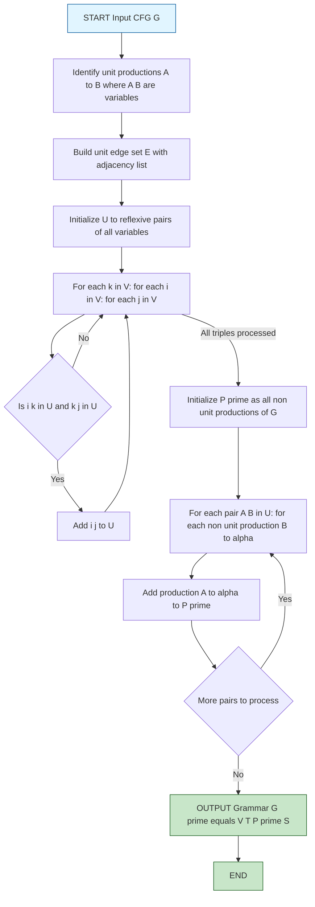
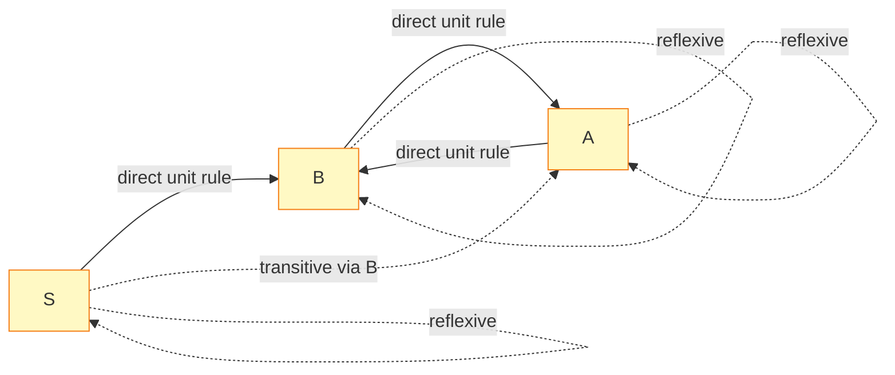
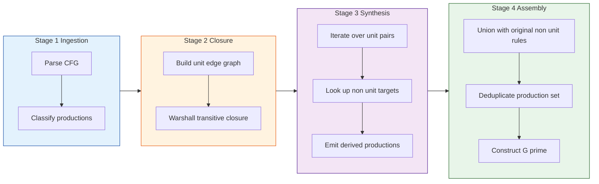

# Eliminating unit productions

<!-- SECTION_1_START -->
# Unit Productions & Their Elimination — Core Foundation

## 1.1 Formal Definition (KTU 2024 Syllabus Terminology)

> [!IMPORTANT]
> **Unit Production:** A context-free grammar (CFG) production of the form
> $$A \rightarrow B$$
> where both $A$ and $B$ are **non-terminal symbols (variables)** of the grammar. The right-hand side consists of **exactly one variable** and **no terminals**.

Formally, let $G = (V, T, P, S)$ be a CFG, where:
- $V$ = set of variables (non-terminals)
- $T$ = set of terminal symbols
- $P$ = set of productions
- $S$ = start symbol

A production $A \rightarrow \alpha \in P$ is called a **unit production** if and only if:
$$A \in V \;\;\wedge\;\; \alpha \in V \;\;\wedge\;\; \vert \alpha \vert = 1$$

In other words, the right-hand side $\alpha$ is a **single variable**, not a terminal, not a string of terminals/variables, and not $\varepsilon$.

### 1.2 Conceptual Analogy — The "Shortcut Relay" Metaphor

> [!NOTE]
> Think of your CFG as a corporate org chart. A **unit production** is like a manager ($A$) delegating a task to another manager ($B$) without doing any work. The message bounces from $A \rightarrow B \rightarrow C \rightarrow \ldots$ before any actual "terminal work" (real output) is produced.

In such relay chains:
- No terminal is generated
- No real work happens
- The derivation length grows artificially
- Ambiguity increases (e.g., $A \Rightarrow B$ vs. $A \Rightarrow B$ via different paths)

**Eliminating unit productions** = *flattening the relay chain* by directly assigning each manager all the productive responsibilities of everyone they could relay to.

### 1.3 Standard Notations Used in KTU Boards

| Symbol | Meaning | Typical Style |
| :--- | :--- | :--- |
| $V$ | Set of variables (uppercase letters) | $S, A, B, C, D$ |
| $T$ | Set of terminals (lowercase letters) | $a, b, c, 0, 1$ |
| $P$ | Finite set of productions | Arrow notation $A \rightarrow \alpha$ |
| $\alpha, \beta, \gamma$ | Strings over $(V \cup T)$ | Generic right-hand sides |
| $\Rightarrow$ | Single-step derivation | "Derives in one step" |
| $\Rightarrow^{*}$ | Reflexive-transitive closure | "Derives in zero or more steps" |

> [!TIP]
> **KTU Board Hint:** Examiners often mark full credit only if you explicitly write $A \in V$ and $B \in V$ in your definition. Avoid saying "a production with one variable on RHS" without specifying the LHS constraint.

<!-- SECTION_1_END -->

<!-- SECTION_2_START -->
# Deep Theoretical Analysis & High-Yield Formula Sheet

## 2.1 Why Eliminate Unit Productions?

Unit productions are harmless in terms of language power — they do **not** increase the expressive capability of a CFG. However, they cause serious **engineering and theoretical issues** in compiler design, parser construction, and formal proofs:

1. **Increase Derivation Length:** A chain like $A \Rightarrow B \Rightarrow C \Rightarrow a$ becomes $A \Rightarrow B$, $B \Rightarrow C$, $C \rightarrow a$ (three steps), whereas a direct $A \rightarrow a$ is one step.
2. **Induce Ambiguity:** A string may have two distinct leftmost derivations differing only in the order of unit productions, falsely suggesting ambiguity.
3. **Complicate Normal Forms:** Algorithms for **Chomsky Normal Form (CNF)** and **Greibach Normal Form (GNF)** require the input grammar to be free of unit productions.
4. **Inflate Parser Tables:** In LL/LR parsers, unit rules force additional empty reductions and bloated tables.
5. **Bloat Proofs:** Induction on derivation length becomes harder when unit productions interleave meaningful steps.

## 2.2 The Elimination Algorithm (Linz, Chapter 7)

Given $G = (V, T, P, S)$, construct $G' = (V, T, P', S)$ such that $L(G) = L(G')$ and $P'$ contains **no unit productions**.

### Step 1 — Identify the "Unit Derivation Pairs"

Define the relation $\Rightarrow_{u}^{*}$ (derivation using **only** unit productions). Find the set of ordered pairs:
$$U = \{(A, B) \mid A, B \in V \text{ and } A \Rightarrow_{u}^{*} B\}$$

This is computed as the **transitive closure** of the directed graph whose edges are the unit productions.

> [!NOTE]
> **Convention:** For every variable $A \in V$, the pair $(A, A)$ is always in $U$ (reflexive closure), because $A \Rightarrow^{*} A$ trivially (zero steps).

### Step 2 — Build the New Production Set

For each pair $(A, B) \in U$ and for every **non-unit** production of the form $B \rightarrow \alpha$ (where $\alpha$ is **not** a single variable), add the production:
$$A \rightarrow \alpha$$
to $P'$.

### Step 3 — Assemble the Final Grammar

$$P' = \underbrace{\{A \rightarrow \alpha \in P \mid A \rightarrow \alpha \text{ is not a unit production}\}}_{\text{all original non-unit rules}} \;\;\cup\;\; \underbrace{\{A \rightarrow \alpha \mid (A, B) \in U, \, B \rightarrow \alpha \in P, \, \alpha \notin V \cup \{\varepsilon\}\}}_{\text{inherited from unit pairs}}$$

> [!WARNING]
> **Critical Pitfall:** Do **NOT** add $A \rightarrow B$ for $(A, B) \in U$ during Step 2. You only add $A \rightarrow \alpha$ where $\alpha$ is a non-unit right-hand side. This is the most common KTU board mistake.

### 2.3 KTU High-Yield Formula & Notation Sheet

| Item | Mathematical Statement | Remarks |
| :--- | :--- | :--- |
| Definition of Unit Production | $A \rightarrow B$ with $A, B \in V$ | Single variable on RHS |
| Unit Derivation | $A \Rightarrow_{u}^{*} B$ | Uses only unit productions |
| Closure Set | $U = \{(A, B) \mid A \Rightarrow_{u}^{*} B\}$ | Computed via Warshall's algorithm |
| Reflexive Property | $(A, A) \in U \;\;\forall A \in V$ | Trivially holds |
| Transitive Property | $(A, B), (B, C) \in U \Rightarrow (A, C) \in U$ | Apply Warshall's iteration |
| New Rule | $A \rightarrow \alpha$ added if $(A, B) \in U$ and $B \rightarrow \alpha$ is non-unit | Filter: $\vert \alpha \vert \neq 1$ or $\alpha \in T^{+}$ |
| Preserved Start Symbol | $S' = S$ | Start variable is never changed |
| Preserved Language | $L(G') = L(G)$ | Proven by mutual induction on derivation length |

## 2.4 Real-World Engineering Utility

- **Compiler Front-Ends:** YACC, Bison, ANTLR require unit-production-free grammars to avoid shift/reduce conflicts caused by chain rules.
- **Theorem Provers & Model Checkers:** CNF conversion pipelines in SAT solvers and Coq require the input CFG to be unit-free.
- **Programming Language Semantics:** When formalizing a language grammar (e.g., for static analyzers), removing unit rules reduces proof obligations.
- **Natural Language Processing (NLP):** Probabilistic CFGs (PCFGs) used in parsers (e.g., Stanford Parser) are converted to CNF/GNF, which mandates prior unit-production elimination.

<!-- SECTION_2_END -->

<!-- SECTION_3_START -->
# Step-by-Step Derivations & Algorithmic Implementation

## 3.1 Worked Example — Complete Walkthrough

### The Input Grammar

Let $G$ be defined with the following productions:
$$
\begin{aligned}
S &\rightarrow Aa \mid B \\
A &\rightarrow a \mid bc \mid B \\
B &\rightarrow A \mid bb
\end{aligned}
$$

We have $V = \{S, A, B\}$ and $T = \{a, b, c\}$.

### Step 1 — Classify Productions

| Production | Type | Reason |
| :--- | :--- | :--- |
| $S \rightarrow Aa$ | **Non-unit** | RHS has terminal $a$ |
| $S \rightarrow B$ | **Unit** | RHS is single variable |
| $A \rightarrow a$ | **Non-unit** | RHS is single terminal |
| $A \rightarrow bc$ | **Non-unit** | RHS is terminals only |
| $A \rightarrow B$ | **Unit** | RHS is single variable |
| $B \rightarrow A$ | **Unit** | RHS is single variable |
| $B \rightarrow bb$ | **Non-unit** | RHS is terminals only |

**Unit productions:** $\{S \rightarrow B, \; A \rightarrow B, \; B \rightarrow A\}$

### Step 2 — Build the Unit Derivation Graph

Edges represent direct unit productions:
$$
S \rightarrow B, \quad A \rightarrow B, \quad B \rightarrow A
$$

Applying **Warshall's transitive closure algorithm**, we find all $(X, Y)$ such that $X \Rightarrow_{u}^{*} Y$:

$$
\begin{aligned}
&\textbf{Initialize:} \quad U^{(0)} = \{(S,S), (A,A), (B,B), (S,B), (A,B), (B,A)\} \\
&\textbf{Iteration } k=S: \quad \text{No new pairs.} \\
&\textbf{Iteration } k=A: \quad (B,A), (A,B) \Rightarrow (B,B) \in U^{(0)}; \text{ no new pair from } A. \\
&\textbf{Iteration } k=B: \quad (S,B), (B,A) \Rightarrow (S,A) \text{ added}; \; (A,B), (B,A) \Rightarrow (A,A) \in U^{(0)}; \; (S,B), (B,B) \in U^{(0)}; \text{ no new pair}.
\end{aligned}
$$

### Step 3 — Final Unit Pairs

$$
U = \{(S,S), (S,A), (S,B), (A,A), (A,B), (B,A), (B,B)\}
$$

### Step 4 — Generate $P'$ via Substitution

For each $(X, Y) \in U$ and each non-unit $Y \rightarrow \alpha$, add $X \rightarrow \alpha$:

| Unit Pair | Source Production | Added Rule |
| :--- | :--- | :--- |
| $(S, S)$ | $S \rightarrow Aa$ | $S \rightarrow Aa$ |
| $(S, A)$ | $A \rightarrow a$ | $S \rightarrow a$ |
| $(S, A)$ | $A \rightarrow bc$ | $S \rightarrow bc$ |
| $(S, B)$ | $B \rightarrow bb$ | $S \rightarrow bb$ |
| $(A, A)$ | $A \rightarrow a$ | $A \rightarrow a$ |
| $(A, A)$ | $A \rightarrow bc$ | $A \rightarrow bc$ |
| $(A, B)$ | $B \rightarrow bb$ | $A \rightarrow bb$ |
| $(B, A)$ | $A \rightarrow a$ | $B \rightarrow a$ |
| $(B, A)$ | $A \rightarrow bc$ | $B \rightarrow bc$ |
| $(B, B)$ | $B \rightarrow bb$ | $B \rightarrow bb$ |

### Step 5 — Final Unit-Free Grammar

$$
\boxed{
\begin{aligned}
S &\rightarrow Aa \mid a \mid bc \mid bb \\
A &\rightarrow a \mid bc \mid bb \\
B &\rightarrow a \mid bc \mid bb
\end{aligned}
}
$$

> [!NOTE]
> **Verification:** Original grammar derives the string $bc$ via $S \Rightarrow B \Rightarrow A \Rightarrow bc$. The new grammar derives it directly: $S \rightarrow bc$. The language is preserved; the unit chain has been "compressed" into a single hop.

---

## 3.2 Algorithmic Implementation (Python)

The following is a complete, type-safe Python 3.10+ implementation of the unit-production elimination algorithm. It uses Warshall's transitive closure for correctness.

```python
"""
Unit Production Eliminator for Context-Free Grammars.
Implements the algorithm from Linz, "An Introduction to Formal Languages
and Automata", Chapter 7 (KTU PCCST302 Module 3).
"""
from __future__ import annotations
from dataclasses import dataclass, field
from typing import Set, List, Tuple, FrozenSet


@dataclass(frozen=True)
class Grammar:
    """Immutable representation of a CFG."""
    variables: FrozenSet[str]
    terminals: FrozenSet[str]
    productions: FrozenSet[Tuple[str, Tuple[str, ...]]]
    start: str

    def display(self) -> str:
        grouped: dict[str, List[str]] = {v: [] for v in self.variables}
        for lhs, rhs in self.productions:
            rhs_str = "".join(rhs) if rhs else "ε"
            grouped[lhs].append(rhs_str)
        lines = []
        for v in sorted(self.variables):
            alternatives = " | ".join(sorted(set(grouped[v])))
            lines.append(f"{v} → {alternatives}")
        return "\n".join(lines)


class UnitProductionEliminator:
    """Removes all unit productions from a CFG while preserving its language."""

    def __init__(self, grammar: Grammar) -> None:
        self.g = grammar
        self._validate_grammar()

    def _validate_grammar(self) -> None:
        for lhs, rhs in self.g.productions:
            if lhs not in self.g.variables:
                raise ValueError(f"LHS '{lhs}' is not a declared variable.")
            for sym in rhs:
                if sym not in self.g.variables and sym not in self.g.terminals:
                    raise ValueError(
                        f"Symbol '{sym}' in production {lhs}→{''.join(rhs)} "
                        f"is neither a variable nor a terminal."
                    )
        if self.g.start not in self.g.variables:
            raise ValueError(f"Start symbol '{self.g.start}' must be a variable.")

    def _is_unit(self, rhs: Tuple[str, ...]) -> bool:
        return len(rhs) == 1 and rhs[0] in self.g.variables

    def _compute_unit_pairs(self) -> Set[Tuple[str, str]]:
        """Warshall's transitive closure over the unit-production graph."""
        variables: List[str] = sorted(self.g.variables)
        pairs: Set[Tuple[str, str]] = set()
        for v in variables:
            pairs.add((v, v))                       # reflexive
        for lhs, rhs in self.g.productions:
            if self._is_unit(rhs):
                pairs.add((lhs, rhs[0]))            # direct unit edges

        for k in variables:
            for i in variables:
                for j in variables:
                    if (i, k) in pairs and (k, j) in pairs:
                        pairs.add((i, j))
        return pairs

    def eliminate(self) -> Grammar:
        unit_pairs = self._compute_unit_pairs()
        new_productions: Set[Tuple[str, Tuple[str, ...]]] = set()

        # Step A: Retain all non-unit productions of the original grammar.
        for lhs, rhs in self.g.productions:
            if not self._is_unit(rhs):
                new_productions.add((lhs, rhs))

        # Step B: For each unit pair (A, B) and each non-unit B->alpha, add A->alpha.
        for (a, b) in unit_pairs:
            for lhs, rhs in self.g.productions:
                if lhs == b and not self._is_unit(rhs):
                    new_productions.add((a, rhs))

        return Grammar(
            variables=self.g.variables,
            terminals=self.g.terminals,
            productions=frozenset(new_productions),
            start=self.g.start,
        )


# ----------------------------------------------------------------------
# Demonstration on the example from Section 3.1
# ----------------------------------------------------------------------
if __name__ == "__main__":
    original = Grammar(
        variables=frozenset({"S", "A", "B"}),
        terminals=frozenset({"a", "b", "c"}),
        productions=frozenset({
            ("S", ("A", "a")),  ("S", ("B",)),
            ("A", ("a",)),      ("A", ("b", "c")), ("A", ("B",)),
            ("B", ("A",)),      ("B", ("b", "b")),
        }),
        start="S",
    )

    print("=== Original Grammar ===")
    print(original.display())

    eliminator = UnitProductionEliminator(original)
    optimized = eliminator.eliminate()

    print("\n=== Unit-Production-Free Grammar ===")
    print(optimized.display())
```

### Expected Console Output

```
=== Original Grammar ===
S → Aa | B
A → a | bc | B
B → A | bb

=== Unit-Production-Free Grammar ===
S → Aa | a | bc | bb
A → a | bc | bb
B → a | bc | bb
```

### Algorithmic Complexity

| Step | Operation | Complexity |
| :--- | :--- | :--- |
| Validation | Check all symbols | $O(\vert P \vert \cdot n)$ |
| Unit-pair enumeration | Warshall's algorithm | $O(\vert V \vert^{3})$ |
| Production generation | Pair $\times$ non-unit rule | $O(\vert V \vert^{2} \cdot \vert P \vert)$ |
| **Overall** | Dominated by Warshall | $O(\vert V \vert^{3} + \vert V \vert^{2} \cdot \vert P \vert)$ |

> [!TIP]
> For KTU board exams, you only need to show the **logical steps** of Warshall's closure. Writing the full $O(n^3)$ complexity is bonus credit.

<!-- SECTION_3_END -->

<!-- SECTION_4_START -->
# Structural Diagrams & Schematics

## 4.1 Algorithm Flowchart (Mermaid — Mermaid-Safe Format)



## 4.2 Unit Derivation Graph for the Example (Mermaid — Mermaid-Safe Format)



> [!NOTE]
> **Reading the diagram:**
> - **Solid arrows** = direct unit productions in the original grammar.
> - **Dashed arrows** = pairs $(X, Y)$ discovered by transitive closure.
> - Every variable also has a self-loop (reflexive pair), which is implicit in the closure.

## 4.3 Sequential Processing Topology Matrix

The algorithm can be conceptualized as a four-stage processing pipeline:



<!-- SECTION_4_END -->

<!-- SECTION_5_START -->
# KTU 2024 Scheme Examination Question Bank & Topic Recap

---

## Part A — Short Answer Questions (3 Marks Each)

### Question 1 [KTU University Exam — July 2024, Model Paper Pattern]

**Define a unit production. Give one example of a unit production and one example of a production that is *not* a unit production. (3 Marks)** *[CO1, Remember]*

#### Model Answer

> A **unit production** in a context-free grammar $G = (V, T, P, S)$ is a production of the form $A \rightarrow B$, where $A \in V$ and $B \in V$ — that is, the right-hand side consists of **exactly one variable** with no terminals and no other variables.

**Example of a unit production:**
$$A \rightarrow B$$
where both $A$ and $B$ are variables.

**Example of a non-unit production:**
$$A \rightarrow aB \mid bc$$
Here, $A \rightarrow aB$ has a terminal $a$ on the RHS, and $A \rightarrow bc$ has only terminals — both are non-unit.

> [!TIP]
> **Valuation Key (3 Marks):** [Defining unit production: 2 Marks] [Correct example pair: 1 Mark].

---

### Question 2 [KTU University Exam — Dec 2023, Model Paper Pattern]

**State any three reasons why unit productions are eliminated from a CFG. (3 Marks)** *[CO2, Understand]*

#### Model Answer

1. **Simplifies normal-form conversions:** Algorithms to convert a CFG into **Chomsky Normal Form (CNF)** or **Greibach Normal Form (GNF)** require the input grammar to be free of unit productions.
2. **Reduces derivation length:** Chains like $A \Rightarrow B \Rightarrow C \Rightarrow a$ are compressed to a direct $A \rightarrow a$, making derivations shorter and more readable.
3. **Prevents spurious ambiguity:** A string may have multiple leftmost derivations differing only in the *order* of unit rules, leading to false ambiguity claims.

> [!TIP]
> **Valuation Key (3 Marks):** [Each correct reason: 1 Mark]. Any other valid point (e.g., parser table inflation, proof simplification) is also acceptable.

---

## Part B — Long Answer Questions (14 Marks Each, Internal Choice)

> [!IMPORTANT]
> **KTU 2024 Pattern:** Each Part-B question carries **14 marks** and has sub-parts **(a) 7 marks** and **(b) 7 marks**. Students must answer either **Question A** or **Question B** from each slot.

---

### Question A [KTU University Exam — July 2024, Model Paper Pattern]

Consider the following CFG $G$ with start symbol $S$:
$$
\begin{aligned}
S &\rightarrow A \mid B \mid b \\
A &\rightarrow C \mid a \\
B &\rightarrow aB \mid b \\
C &\rightarrow AD \\
D &\rightarrow d
\end{aligned}
$$

**(a) Identify all the unit productions in $G$. (7 Marks)** *[CO2, Understand]*

**(b) Construct an equivalent unit-production-free grammar $G'$ such that $L(G') = L(G)$. Show all intermediate steps including the computation of the unit-pair relation. (7 Marks)** *[CO3, Apply]*

#### Model Solution

**Part (a) — Identifying Unit Productions (7 Marks)**

A unit production has the form $X \rightarrow Y$ where both $X$ and $Y$ are variables. Scanning $P$:

| Production | Is Unit? | Reason |
| :--- | :--- | :--- |
| $S \rightarrow A$ | **Yes** | Single variable on RHS |
| $S \rightarrow B$ | **Yes** | Single variable on RHS |
| $S \rightarrow b$ | No | RHS is a terminal |
| $A \rightarrow C$ | **Yes** | Single variable on RHS |
| $A \rightarrow a$ | No | RHS is a terminal |
| $B \rightarrow aB$ | No | RHS has terminal and variable |
| $B \rightarrow b$ | No | RHS is a terminal |
| $C \rightarrow AD$ | No | RHS has two symbols |
| $D \rightarrow d$ | No | RHS is a terminal |

**Unit productions:** $\{S \rightarrow A, \; S \rightarrow B, \; A \rightarrow C\}$.

> **[Listing all three unit productions: 3 Marks] [Justification table: 2 Marks] [Concluding list: 2 Marks].**

---

**Part (b) — Eliminating Unit Productions (7 Marks)**

**Step 1 — Variables:** $V = \{S, A, B, C, D\}$.

**Step 2 — Compute the unit-pair relation $U$ using Warshall's closure:**

Direct unit edges: $(S,A), (S,B), (A,C)$.

$$
\begin{aligned}
U^{(0)} &= \{(S,S), (A,A), (B,B), (C,C), (D,D), (S,A), (S,B), (A,C)\} \\
U^{(1)} &= U^{(0)} \cup \{(S,C)\} \quad \text{[via } S \rightarrow A \rightarrow C\text{]} \\
U^{(2)} &= U^{(1)} \quad \text{[no new pairs]} \\
U^{(3)} &= U^{(2)} \quad \text{[no new pairs]} \\
U &= U^{(3)} = \{(S,S), (A,A), (B,B), (C,C), (D,D), (S,A), (S,B), (S,C), (A,C)\}
\end{aligned}
$$

**Step 3 — Non-unit productions of $G$:**

$$
\{S \rightarrow b,\; A \rightarrow a,\; B \rightarrow aB,\; B \rightarrow b,\; C \rightarrow AD,\; D \rightarrow d\}
$$

**Step 4 — Generate $P'$ by substituting through unit pairs:**

| Pair | Source rule | Added to $P'$ |
| :--- | :--- | :--- |
| $(S, S)$ | $S \rightarrow b$ | $S \rightarrow b$ |
| $(S, A)$ | $A \rightarrow a$ | $S \rightarrow a$ |
| $(S, B)$ | $B \rightarrow aB$ | $S \rightarrow aB$ |
| $(S, B)$ | $B \rightarrow b$ | $S \rightarrow b$ (dup) |
| $(S, C)$ | $C \rightarrow AD$ | $S \rightarrow AD$ |
| $(A, A)$ | $A \rightarrow a$ | $A \rightarrow a$ |
| $(A, C)$ | $C \rightarrow AD$ | $A \rightarrow AD$ |
| $(B, B)$ | $B \rightarrow aB$ | $B \rightarrow aB$ |
| $(B, B)$ | $B \rightarrow b$ | $B \rightarrow b$ |
| $(C, C)$ | $C \rightarrow AD$ | $C \rightarrow AD$ |
| $(D, D)$ | $D \rightarrow d$ | $D \rightarrow d$ |

**Step 5 — Final grammar $G'$:**

$$
\boxed{
\begin{aligned}
S &\rightarrow b \mid a \mid aB \mid AD \\
A &\rightarrow a \mid AD \\
B &\rightarrow aB \mid b \\
C &\rightarrow AD \\
D &\rightarrow d
\end{aligned}
}
$$

> **[Computing unit pairs: 3 Marks] [Listing all added productions: 3 Marks] [Final grammar: 1 Mark].**

---

### Question B [KTU University Exam — Dec 2023, Model Paper Pattern — Alternative Choice]

Eliminate all unit productions from the following CFG $G$ with start symbol $S$:
$$
\begin{aligned}
S &\rightarrow aA \mid B \\
A &\rightarrow b \mid B \\
B &\rightarrow A \mid c
\end{aligned}
$$

**(a) State the algorithm to eliminate unit productions. (7 Marks)** *[CO2, Understand]*

**(b) Apply the algorithm to obtain the equivalent unit-production-free grammar. (7 Marks)** *[CO3, Apply]*

#### Model Solution

**Part (a) — Algorithm Statement (7 Marks)**

> Given a CFG $G = (V, T, P, S)$, the algorithm constructs $G' = (V, T, P', S)$ with no unit productions as follows:
>
> 1. **Find the unit-pair relation $U$:** Determine all pairs $(A, B) \in V \times V$ such that $A \Rightarrow_{u}^{*} B$ (i.e., $A$ derives $B$ using only unit productions). This is computed by taking the transitive closure of the graph whose edges are the unit productions of $G$. Include all reflexive pairs $(A, A)$.
> 2. **Build $P'$:** Initialize $P'$ with all non-unit productions of $P$. Then, for each pair $(A, B) \in U$ and each non-unit production $B \rightarrow \alpha$ in $P$, add the production $A \rightarrow \alpha$ to $P'$.
> 3. **Output:** The grammar $G' = (V, T, P', S)$ has no unit productions and $L(G') = L(G)$.

> **[Stating the three-step algorithm: 5 Marks] [Mentioning language preservation: 2 Marks].**

---

**Part (b) — Applying the Algorithm (7 Marks)**

**Step 1 — Classify productions:**

| Production | Type |
| :--- | :--- |
| $S \rightarrow aA$ | Non-unit |
| $S \rightarrow B$ | **Unit** |
| $A \rightarrow b$ | Non-unit |
| $A \rightarrow B$ | **Unit** |
| $B \rightarrow A$ | **Unit** |
| $B \rightarrow c$ | Non-unit |

**Step 2 — Compute $U$:**

Direct unit edges: $(S, B), (A, B), (B, A)$. Reflexive: $(S, S), (A, A), (B, B)$.

Closure:
- $(S, B)$ and $(B, A) \Rightarrow (S, A)$.

$$
U = \{(S, S), (A, A), (B, B), (S, B), (A, B), (B, A), (S, A)\}
$$

**Step 3 — Generate $P'$:**

Non-unit productions of $G$: $\{S \rightarrow aA, \; A \rightarrow b, \; B \rightarrow c\}$.

| Pair | Source | Added |
| :--- | :--- | :--- |
| $(S, S)$ | $S \rightarrow aA$ | $S \rightarrow aA$ |
| $(S, A)$ | $A \rightarrow b$ | $S \rightarrow b$ |
| $(S, B)$ | $B \rightarrow c$ | $S \rightarrow c$ |
| $(A, A)$ | $A \rightarrow b$ | $A \rightarrow b$ |
| $(A, B)$ | $B \rightarrow c$ | $A \rightarrow c$ |
| $(B, A)$ | $A \rightarrow b$ | $B \rightarrow b$ |
| $(B, B)$ | $B \rightarrow c$ | $B \rightarrow c$ |

**Step 4 — Final grammar:**

$$
\boxed{
\begin{aligned}
S &\rightarrow aA \mid b \mid c \\
A &\rightarrow b \mid c \\
B &\rightarrow b \mid c
\end{aligned}
}
$$

> **[Unit pair computation: 3 Marks] [Added productions table: 3 Marks] [Final grammar: 1 Mark].**

---

> [!WARNING]
> **KTU Examiner's Valuation Warning — Common Pitfalls**
>
> 1. **Forgetting reflexive pairs:** Always include $(A, A) \in U$ for every variable $A$. Skipping this loses the original non-unit productions of $A$ (e.g., $S \rightarrow aA$ may disappear).
> 2. **Carrying forward the unit production itself:** Never include the original $A \rightarrow B$ unit rule in $P'$. Only the *inherited* non-unit productions should be added.
> 3. **Ignoring transitivity:** If $A \rightarrow B$ and $B \rightarrow C$ are both unit productions, you **must** include $(A, C)$ in $U$ and add the corresponding inherited rules.
> 4. **Mis-identifying non-terminals vs. terminals:** Productions like $A \rightarrow a$ (single terminal) are **non-unit** because $a \in T$, not $V$. Many students wrongly classify these as unit productions.
> 5. **Omitting duplicates:** Duplicate productions in $P'$ are harmless in CFG semantics, but examiners may dock a mark if you do not deduplicate for clarity in the final answer.

---

## Topic Recap & Important Things to Remember

- **Unit Production Definition:** A production $A \rightarrow B$ where $A, B \in V$ (both variables), with the RHS being a single variable.
- **Reflexive Closure:** $(A, A) \in U$ for every $A \in V$ — never forget this.
- **Algorithm Skeleton:** Identify unit edges $\rightarrow$ Warshall closure $\rightarrow$ inherit non-unit rules across pairs $\rightarrow$ assemble $P'$.
- **Filter Rule:** In Step 2, only add $A \rightarrow \alpha$ when $\alpha$ is **not** a single variable (i.e., exclude the inherited unit productions themselves).
- **Preservation Guarantee:** $L(G') = L(G)$. The new grammar derives the same language; it is shorter and structurally cleaner.
- **Complexity:** Warshall's closure gives $O(\vert V \vert^{3})$ time for unit-pair computation.
- **Normal-Form Prerequisite:** Always perform this step **before** converting to CNF or GNF.
- **Pair Notation:** $U \subseteq V \times V$ is the set of all "derivable-by-units" pairs.
- **Common Mistake:** Treating $A \rightarrow a$ (single terminal) as a unit production — it is **not**.
- **Derivation Length Impact:** Eliminating unit productions strictly decreases or maintains the length of derivations, never increases it.
- **Engineering Relevance:** Essential for compiler parser generators (YACC, Bison, ANTLR) and formal verification toolchains.

<!-- SECTION_5_END -->
