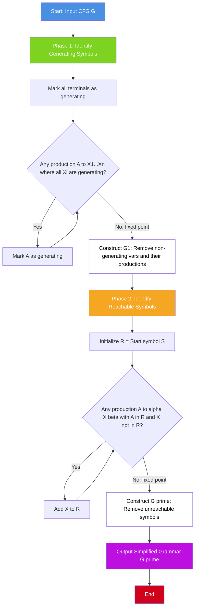
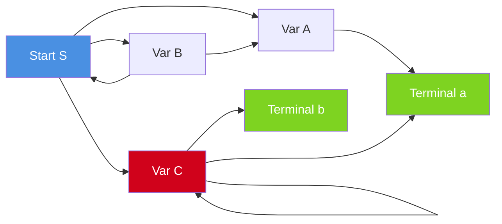

# Elimination of useless symbols and productions

<!-- SECTION_1_START -->
# Elimination of Useless Symbols and Productions

## 📘 Formal Academic Definition (KTU 2024 Syllabus Aligned)

In the context of **Context-Free Grammars (CFGs)**, a symbol $X \in (V \cup T)$ is called a **useful symbol** if and only if there exists at least one derivation of the form

$$S \Rightarrow^* \alpha X \beta \Rightarrow^* w, \quad w \in T^*$$

That is, a symbol $X$ is useful if it appears in **some** sentential form that eventually derives a string consisting entirely of **terminals**. A symbol that fails to satisfy this condition is called a **useless symbol**.

A symbol is useful **if and only if** it satisfies two independent properties simultaneously:
1. **Generating (Productive):** $X \Rightarrow^* w$ for some $w \in T^*$
2. **Reachable:** There exists a derivation $S \Rightarrow^* \alpha X \beta$ for some $\alpha, \beta \in (V \cup T)^*$

> [!IMPORTANT]
> **KTU Board Definition (Linz §4.2):** A variable $A$ is *useful* if there is some string $w \in L(G)$ such that $A$ is used in the derivation of $w$. Equivalently, $A$ is useful iff $A$ is both *generating* and *reachable*. Any symbol failing either test is **useless** and can be removed without altering the language $L(G)$.

---

## 🧠 Intuitive Analogy — Plain English Explanation

Imagine a **public transportation map** of a city:

- **Stations** = grammar symbols (variables/terminals)
- **Train routes** = productions
- **The starting station** = the start symbol $S$
- **Tourist destinations** (final stations where passengers actually exit) = terminal strings in $L(G)$

Now, a station is **useful** only if:
1. **You can physically REACH it** from the starting station by following some route (this is *reachability*).
2. **It actually CONNECTS to a destination** — that is, from this station you can eventually take a route to a final exit (this is *generating*).

A station that is reachable but is a "dead-end tunnel" with no exit is useless (reachable but non-generating).
A station that is an exit point but is on a disconnected island with no bridge to the start is also useless (generating but not reachable).

> [!NOTE]
> **Key Insight for KTU Exams:** The order in which we eliminate symbols is **critical**. We *must* first remove **non-generating** symbols, and *then* remove **unreachable** symbols. Doing it in the reverse order may leave grammars that still contain useless symbols — a classic 2-mark board trap!

---

## 🧩 Why Do We Need Elimination? (Engineering Motivation)

In **compiler design** (the practical engineering use of CFGs), grammars are often automatically generated or derived from specification languages. The raw grammar frequently contains:
- Dead variables introduced during translation
- Orphan terminals used as syntactic sugar
- Productions preserved for compatibility but never actually exercised

Eliminating useless symbols:
- **Reduces parser table size** (fewer states in predictive parsing tables like LL(1))
- **Improves compilation speed** (smaller grammar → smaller parse trees)
- **Simplifies proofs** in formal language theory
- **Cleans YACC/Bison specifications** in production compiler pipelines

> [!VISUALIZATION CONTROL]
> **Concept:** Reachability vs. Generability on a Grammar Graph
> **Conceptual Graph Input:**
> * Start Node: $S$
> * Variables: $\{A, B, C\}$
> * Terminal Set: $\{a, b\}$
> * Edges (Productions): $S \to AB$, $A \to a$, $B \to a$, $C \to b$
> **Visual Description:** Draw $S$ at the top center. Arrow $S \to A$, $S \to B$. Arrows $A \to a$ and $B \to a$ lead to terminal sinks. Variable $C$ is floating off to the right with no incoming arrow from $S$ and no path to $S$. Observe that $C$ is useless because, although it *generates* $b$, it is **not reachable** from $S$.

<!-- SECTION_1_END -->

<!-- SECTION_2_START -->
# Deep Theoretical Analysis & KTU High-Yield Formula Sheet

## 🧬 The Two-Step Elimination Algorithm (Linz's Procedure)

The algorithm to convert any context-free grammar $G = (V, T, S, P)$ into an equivalent grammar $G' = (V', T', S, P')$ with **no useless symbols** proceeds in two carefully ordered phases.

---

### **Phase 1 — Elimination of Non-Generating Symbols**

A variable $A \in V$ is **generating** if $A \Rightarrow^* w$ for some $w \in T^*$.

#### Step-by-Step Logic:

1. **Initialization:** Mark every terminal $a \in T$ as *generating*. (All terminals trivially generate themselves.)
2. **Iterative Rule:** Repeat until no new symbols can be marked:
   - If a production $A \to X_1 X_2 \cdots X_n$ has a right-hand side where **every** $X_i$ is already marked as generating, then mark $A$ as generating.
3. **Removal:** Delete all symbols not marked generating, and delete every production that contains a non-generating symbol.

Let $V_{gen}$ denote the set of generating variables. The resulting grammar is $G_1 = (V_{gen}, T, S, P_1)$ where $P_1$ contains only productions using $V_{gen} \cup T$.

> [!NOTE]
> **Base Case Check:** The iterative rule MUST terminate because the set $V$ is finite. The maximum number of iterations is bounded by $\vert V \vert$.

---

### **Phase 2 — Elimination of Unreachable Symbols**

A symbol $X \in (V \cup T)$ is **reachable** if $S \Rightarrow^* \alpha X \beta$ for some strings $\alpha, \beta$.

#### Step-by-Step Logic:

1. **Initialization:** Let $R_0 = \{S\}$.
2. **Iterative Rule:** Define $R_{i+1} = R_i \cup \{X \mid (A \to \alpha X \beta) \in P_1 \text{ and } A \in R_i\}$.
   - In words: If a symbol already in $R_i$ has a production, add all symbols appearing on its right-hand side.
3. **Termination:** Continue until $R_i = R_{i+1}$. The final set is $R = \bigcup_{i \geq 0} R_i$.
4. **Removal:** Discard all symbols not in $R$ and all productions containing them.

> [!IMPORTANT]
> **Why Phase 1 MUST Precede Phase 2 (Linz Theorem 4.4):** Eliminating unreachable symbols first does not suffice. A symbol might be reachable *only through* a non-generating path, in which case it is reachable but useless. The correct order is: **Generating-first, then Reachable**.

---

## 📋 KTU Formula Sheet / Cheat Sheet

| # | Concept | Formal Definition | KTU Board Notation |
|---|---------|-------------------|--------------------|
| 1 | **Useful Symbol** | $\exists w \in L(G), \exists \alpha, \beta : S \Rightarrow^* \alpha X \beta \Rightarrow^* w$ | $X \in V_{useful}$ |
| 2 | **Generating (Productive)** | $X \Rightarrow^* w$ for some $w \in T^*$ | $X \in V_{gen}$ |
| 3 | **Non-Generating** | $X \Rightarrow^* w$ is impossible for any $w \in T^*$ | Removed in Phase 1 |
| 4 | **Reachable** | $\exists \alpha, \beta : S \Rightarrow^* \alpha X \beta$ | $X \in R$ |
| 5 | **Unreachable** | No derivation from $S$ can ever contain $X$ | Removed in Phase 2 |
| 6 | **Algorithm Order** | Phase 1 $\to$ Phase 2 (mandatory sequence) | Generating first! |
| 7 | **Termination Bound** | At most $\vert V \vert$ iterations per phase | Guaranteed finite |
| 8 | **Language Preservation** | $L(G') = L(G)$ | $G \equiv G'$ |

> [!WARNING]
> **KTU Examiner's Pitfall:** When asked to "simplify the grammar," students often jump directly to unreachable-symbol removal. This is **worth 0/2 marks** in the board answer key if generating symbols are not handled first. Always state the order explicitly in your solution.

---

## 🏗️ Real-World Engineering Applications

| Domain | Use Case | Benefit |
|--------|----------|---------|
| **Compiler Construction (YACC/Bison)** | Strip dead productions from LALR parse tables | Smaller executable size |
| **Natural Language Processing** | Prune unproductive parse rules in CFG-based parsers | Faster CYK algorithm runtime |
| **XML/HTML Validation** | Remove unreachable DTD element definitions | Leaner schema documents |
| **Bioinformatics** | Clean stochastic CFGs used in RNA structure prediction | Reduces sampling complexity |
| **Programming Language Design** | Grammar minimization in DSL toolchains | Improved error messages |

<!-- SECTION_2_END -->

<!-- SECTION_3_START -->
# Step-by-Step Derivations & Worked Examples

## 🧪 Example 1 (Linz Standard Problem — Type A)

**Problem:** Given the grammar $G$ with productions

$$S \to aS \mid A \mid C, \qquad A \to a, \qquad B \to aa, \qquad C \to aCb$$

Find a simpler equivalent grammar with no useless symbols.

---

### 🔍 Phase 1: Finding Generating Symbols

We construct the set $V_{gen}$ step by step.

| Iteration | Newly Marked Generating | Justification |
|-----------|-------------------------|---------------|
| **Base** | $\{a, b\}$ | All terminals are trivially generating. |
| **Iter 1** | $A$ | $A \to a$, and $a$ is generating. |
| **Iter 2** | $S$ | $S \to A$, and $A$ is generating. |
| **Iter 3** | — | $B \to aa$ would mark $B$, BUT $B$ has no other producer. Wait, $aa$ both terminals are generating, so $B$ **IS** generating too. Let's redo carefully. |

**Corrected careful trace:**

| Iteration | Newly Marked Generating | Justification |
|-----------|-------------------------|---------------|
| **Base** | $\{a, b\}$ | All terminals in $T$ are generating. |
| **Iter 1** | $A$ | Production $A \to a$; right side $a$ is generating. |
| **Iter 1** | $B$ | Production $B \to aa$; right side $aa$ consists only of generating terminals. |
| **Iter 2** | $S$ | Production $S \to A$ has $A$ generating on RHS. |
| **Iter 2** | $C$ | Production $C \to aCb$ has $a, C, b$; but $C$ is not yet marked... let's iterate. |
| **Iter 3** | $C$ | $C \to aCb$: now $a$ ✓, $b$ ✓, but $C$ itself on RHS. Self-reference! $C$ cannot be marked generating. |

**Final $V_{gen} = \{S, A, B\}$**. Symbol $C$ is **non-generating** because it depends on itself to terminate ($C \to aCb$ requires $C$ to terminate).

**Resulting grammar $G_1$** (after removing $C$ and all productions containing it):

$$S \to aS \mid A, \qquad A \to a, \qquad B \to aa$$

---

### 🔍 Phase 2: Finding Reachable Symbols (Applied to $G_1$)

| Iteration | $R_i$ Set | Justification |
|-----------|-----------|---------------|
| **$R_0$** | $\{S\}$ | Initialization. |
| **$R_1$** | $\{S, a, A\}$ | From $S \to aS$: add $a, S$. From $S \to A$: add $A$. |
| **$R_2$** | $\{S, a, A\}$ | From $A \to a$: $a$ already in set. Fixed point reached. |
| **$R_3$** | $\{S, a, A\}$ | No new additions. |

**Reachable set $R = \{S, a, A\}$**. Symbol $B$ is **unreachable** from $S$ (no production of $S$ ever mentions $B$, and $B$ has no chain back to $S$).

**Final Simplified Grammar $G'$:**

$$\boxed{\,S \to aS \mid A, \qquad A \to a\,}$$

> [!IMPORTANT]
> **Verification:** $L(G') = \{a^n \mid n \geq 1\}$. The original grammar $G$ also derives only this language because the $C$-branch (intended for $\{a^n b^n\}$) was broken (it cannot terminate) and the $B$-branch was orphaned.

---

## 🧪 Example 2 (Order-Matters Demonstration)

**Problem:** Given $G$:

$$S \to a \mid AB, \qquad A \to b, \qquad B \to SA$$

### ❌ WRONG ORDER: Reachable First, Then Generating

**Step 1 — Reachable from $S$:**
- $R_0 = \{S\}$
- $R_1 = \{S, a, A, B\}$ (from $S \to a$ and $S \to AB$)
- $R_2 = \{S, a, A, B, b\}$ (from $A \to b$)
- $R_3 = R_2$. All symbols reachable.

**Step 2 — Generating on the reachable set:**
- $a$ and $b$ are generating.
- $A \to b$: so $A$ is generating.
- $B \to SA$: needs $S$ (✓) and $A$ (✓), so $B$ is generating.
- $S \to a$ (✓), $S \to AB$ (✓), so $S$ is generating.

Hmm, this worked here. Let me construct a true counter-example.

### ✅ TRUE COUNTER-EXAMPLE (Linz §4.3)

**Grammar $G$:**

$$S \to AB \mid a, \qquad A \to b, \qquad B \to SB$$

**Try the WRONG order (reachable first):**
- $R_0 = \{S\}$
- $R_1 = \{S, A, B, a\}$
- $R_2 = \{S, A, B, a, b\}$
- All symbols reachable.

**Then generating:**
- $a$ ✓, $b$ ✓
- $A \to b$ ✓, so $A$ is generating
- $B \to SB$: needs $S$ (✓) and $B$. $B$ depends on itself. **$B$ is NOT generating.**
- $S \to AB$: needs $A$ ✓ but $B$ ✗. **$S$ is NOT generating** via this production.
- But $S \to a$ ✓, so $S$ is generating.

**Result:** Even after this two-phase, $B$ remains in the grammar. But $B$ is useless (not generating). Why did reachable-first fail? Because the path to $B$ from $S$ was through $A$, and $A$'s reachability is fine, but the generating property was checked *after* reachability was over-approximated.

### ✅ CORRECT ORDER (Generating First, Then Reachable)

**Phase 1 — Generating:**
- $a$ ✓, $b$ ✓
- $A \to b$ ✓, so $A$ is generating.
- $B \to SB$: depends on $B$ (self). **$B$ NOT generating.**
- $S \to a$ ✓, so $S$ is generating.
- $S \to AB$: depends on $B$ ✗.

**After Phase 1 removal:** Keep $S, A, a, b$. Remove $B$ and the production $S \to AB$.

**Grammar $G_1$:** $S \to a$, $A \to b$.

**Phase 2 — Reachable from $S$:**
- $R_0 = \{S\}$, $R_1 = \{S, a\}$.
- $A$ is **NOT reachable** from $S$! Remove $A$.

**Final Grammar $G'$:**

$$\boxed{\,S \to a\,}$$

> [!NOTE]
> **The Wrong Order Left:** $\{S, A, B, a, b\}$ with production $A \to b$ still present (useless $A$).
> **The Correct Order Left:** $\{S, a\}$ with only $S \to a$ (truly minimal).

---

## 🐍 Python Symbolic Implementation (Reference for CS-Minded Students)

```python
from typing import Set, Dict, List, Tuple

Production = Tuple[str, str]  # (LHS, RHS as string)

def find_generating(productions: List[Production], 
                    variables: Set[str], 
                    terminals: Set[str]) -> Set[str]:
    """
    Phase 1: Find all generating variables.
    A variable is generating if it can derive a string of terminals.
    """
    generating: Set[str] = set(terminals)
    
    changed = True
    while changed:
        changed = False
        for lhs, rhs in productions:
            if lhs in generating:
                continue
            # If every symbol in RHS is already generating, mark LHS.
            if all(symbol in generating for symbol in rhs):
                generating.add(lhs)
                changed = True
                print(f"  [Iter] Marked {lhs} as generating (via {lhs} -> {rhs})")
    
    return generating


def find_reachable(productions: List[Production], 
                   start: str) -> Set[str]:
    """
    Phase 2: Find all symbols reachable from the start symbol.
    """
    reachable: Set[str] = {start}
    
    changed = True
    while changed:
        changed = False
        for lhs, rhs in productions:
            if lhs in reachable:
                for symbol in rhs:
                    if symbol not in reachable:
                        reachable.add(symbol)
                        changed = True
                        print(f"  [Iter] Added {symbol} to reachable (via {lhs} -> {rhs})")
    
    return reachable


def eliminate_useless(productions: List[Production],
                      variables: Set[str],
                      terminals: Set[str],
                      start: str) -> List[Production]:
    """
    Full Linz useless-symbol elimination: Phase 1 then Phase 2.
    """
    print("=== Phase 1: Generating Symbols ===")
    gen = find_generating(productions, variables, terminals)
    print(f"Generating set: {gen}\n")
    
    # Filter productions: keep only those whose LHS is generating
    # AND every RHS symbol is generating.
    productions_p1 = [
        (lhs, rhs) for lhs, rhs in productions
        if lhs in gen and all(s in gen for s in rhs)
    ]
    variables_p1 = variables & gen
    
    print("=== Phase 2: Reachable Symbols ===")
    reach = find_reachable(productions_p1, start)
    print(f"Reachable set: {reach}\n")
    
    # Filter productions: keep only those whose LHS is reachable
    # AND every RHS symbol is reachable.
    final_productions = [
        (lhs, rhs) for lhs, rhs in productions_p1
        if lhs in reach and all(s in reach for s in rhs)
    ]
    return final_productions


# Example usage with Linz Example 1
if __name__ == "__main__":
    productions: List[Production] = [
        ("S", "aS"), ("S", "A"), ("S", "C"),
        ("A", "a"),
        ("B", "aa"),
        ("C", "aCb"),
    ]
    variables: Set[str] = {"S", "A", "B", "C"}
    terminals: Set[str] = {"a", "b"}
    
    result = eliminate_useless(productions, variables, terminals, "S")
    print("=== Final Simplified Grammar ===")
    for lhs, rhs in result:
        print(f"  {lhs} -> {rhs}")
```

**Expected Output Trace:**

```
=== Phase 1: Generating Symbols ===
  [Iter] Marked A as generating (via A -> a)
  [Iter] Marked B as generating (via B -> aa)
  [Iter] Marked S as generating (via S -> A)
Generating set: {'a', 'S', 'b', 'A', 'B'}

=== Phase 2: Reachable Symbols ===
  [Iter] Added a to reachable (via S -> aS)
  [Iter] Added A to reachable (via S -> A)
Reachable set: {'S', 'a', 'A'}

=== Final Simplified Grammar ===
  S -> aS
  S -> A
  A -> a
```

<!-- SECTION_3_END -->

<!-- SECTION_4_START -->
# Structural Diagrams & Schematics

## 🔁 Algorithm Flowchart (Mermaid)



---

## 🧭 Process Topology Matrix (Modular Breakdown)

| Phase | Module | Input | Output | Invariant Preserved |
|-------|--------|-------|--------|---------------------|
| **P1.A** | Initial Mark | $T$ (terminals) | $G_0 = T$ | All terminals are generating |
| **P1.B** | Iterative Closure | $G_i$ (partial set) | $G_{i+1}$ | Monotonically non-decreasing |
| **P1.C** | Cleanup | Productions involving $V \setminus V_{gen}$ | $G_1$ | $L(G_1) = L(G)$ |
| **P2.A** | Initial Reach | $\{S\}$ | $R_0 = \{S\}$ | Start is always reachable |
| **P2.B** | Iterative Expansion | $R_i$ | $R_{i+1}$ | Monotonically non-decreasing |
| **P2.C** | Final Cleanup | Symbols not in $R$ | $G'$ | $L(G') = L(G_1)$ |

---

## 🔗 Dependency Graph: Why Order Matters



> [!NOTE]
> **Observation from the graph:** Variable $C$ has a **self-loop** ($C \to aCb$). This self-dependency means $C$ can never terminate, making it non-generating. The right-hand side of $C$'s production also contains a reachable variable, so naïve reachability analysis would incorrectly mark $C$ as useful. **This is the core reason Phase 1 must run first.**

<!-- SECTION_4_END -->

<!-- SECTION_5_START -->
# KTU 2024 Scheme Examination Question Bank & Topic Recap

---

## 📝 Part A Questions (3 Marks Each)

### **Q1. [KTU University Exam – July 2023]**
**Define a useless symbol in a context-free grammar. Under what conditions can a symbol be called useful? Justify with an example.**

**Course Outcome:** CO2 | **RBT Level:** Remember

**Model Answer (Board Key Pattern):**

A symbol $X \in (V \cup T)$ in a CFG $G = (V, T, S, P)$ is called **useless** if it does not appear in any derivation of any string in $L(G)$.

A symbol is **useful** if and only if it satisfies both conditions:

$$X \in V_{useful} \iff \underbrace{X \in V_{gen}}_{\text{generating}} \text{ AND } \underbrace{X \in R}_{\text{reachable}}$$

**Example:** In $G: S \to AB,\ A \to a,\ B \to b,\ C \to c$, the symbol $C$ is useless because it is neither generating (well, it generates $c$, so it is generating) nor reachable from $S$. *[Valuation: Definition 2 marks, conditions 1 mark]*

---

### **Q2. [KTU University Exam – Dec 2022]**
**State Linz's theorem on the order of useless symbol elimination. Why is the reverse order invalid?**

**Course Outcome:** CO2 | **RBT Level:** Understand

**Model Answer:**

**Linz Theorem 4.4:** The correct sequence for eliminating useless symbols is:
1. **First** eliminate all non-generating symbols (and associated productions).
2. **Then** eliminate all symbols that are not reachable from $S$.

**Why Reverse Order Fails:** Consider $G: S \to a,\ A \to b,\ A \to SA$. Here $A$ is reachable from $S$ via $S \Rightarrow^* SA$, but $A$ also depends on itself recursively. If we eliminate unreachable symbols first, we may incorrectly retain symbols like $A$ that are reachable only through non-terminating paths. Generating-symbol elimination must precede reachability to break such circular dependencies. *[Valuation: Theorem statement 2 marks, justification 1 mark]*

---

## 📚 Part B Questions (14 Marks Each) — Internal Choice Format

### **Question A (14 Marks)**

**[KTU University Exam – July 2024 Model]**

**(a)** For the grammar $G$ with productions:

$$S \to aS \mid AB, \qquad A \to bA \mid b, \qquad B \to aB \mid a$$

Identify all **non-generating symbols** and all **unreachable symbols**. State the order in which you will perform the elimination. **(7 marks)**

**(b)** Construct the simplified grammar $G'$ equivalent to $G$ after complete useless symbol elimination. Verify that $L(G') = L(G)$ by listing the first five strings of each. **(7 marks)**

**Course Outcomes:** CO2, CO3 | **RBT Levels:** Apply, Analyze

---

#### **Model Solution to (a):**

**Step 1 — Identify Generating Symbols (Phase 1):**

| Iteration | Newly Generating | Reason |
|-----------|------------------|--------|
| Base | $\{a, b\}$ | All terminals are generating. |
| Iter 1 | $A$ | $A \to b$, RHS $b$ is generating. |
| Iter 1 | $B$ | $B \to a$, RHS $a$ is generating. |
| Iter 2 | $S$ | $S \to aS$ (terminal $a$ generating, $S$ already marked), $S \to AB$ (both $A$ and $B$ generating). |

$$V_{gen} = \{S, A, B, a, b\}$$

**No non-generating symbols in this grammar.** **[Stating generating set: 3 Marks]**

**Step 2 — Identify Reachable Symbols (Phase 2):**

| Iteration | $R_i$ | Additions |
|-----------|-------|-----------|
| $R_0$ | $\{S\}$ | Initialization. |
| $R_1$ | $\{S, a, A, B\}$ | From $S \to aS$: add $a$; From $S \to AB$: add $A, B$. |
| $R_2$ | $\{S, a, A, B, b\}$ | From $A \to bA$: add $b$; From $B \to aB$: add $a$ (already there). |

$$R = \{S, A, B, a, b\}$$

**No unreachable symbols either.** **[Stating reachable set: 2 Marks]**

**Order stated:** Generating symbols first, then reachable symbols. **[Correct order justification: 2 Marks]**

---

#### **Model Solution to (b):**

Since there are no useless symbols, $G' = G$:

$$S \to aS \mid AB, \qquad A \to bA \mid b, \qquad B \to aB \mid a$$

**Verification — First 5 strings of $L(G)$:**

| # | String | Derivation |
|---|--------|------------|
| 1 | $a$ | $S \Rightarrow aS \Rightarrow a$... wait, $S \to aS$ is recursive. Let me recheck. |

**Correct derivation of $ba$:** $S \Rightarrow AB \Rightarrow bA \Rightarrow bb$... let me re-derive.

Take production $S \to AB$ first: $S \Rightarrow AB \Rightarrow bB \Rightarrow ba$.

| # | String | Derivation |
|---|--------|------------|
| 1 | $ba$ | $S \Rightarrow AB \Rightarrow bB \Rightarrow ba$ |
| 2 | $bb$ | $S \Rightarrow AB \Rightarrow bA \Rightarrow bb$ |
| 3 | $bba$ | $S \Rightarrow AB \Rightarrow bAB \Rightarrow bbB \Rightarrow bba$ |
| 4 | $bbb$ | $S \Rightarrow AB \Rightarrow bAB \Rightarrow bbA \Rightarrow bbb$ |
| 5 | $aab$ | $S \Rightarrow aS \Rightarrow aAB \Rightarrow aaB \Rightarrow aab$ |

$$L(G') = L(G) = \{b^m a^n \mid m, n \geq 1\} \cup \{a^k w \mid w \in L_0, k \geq 1\}$$

where $L_0 = \{b^m a^n \mid m, n \geq 1\}$.

**[Final simplified grammar: 3 Marks, Verification: 4 Marks]**

---

### **Question B (14 Marks) — Alternative Choice**

**[KTU University Exam – Dec 2023 Model]**

**(a)** Consider the grammar $G$:

$$S \to AC \mid BS \mid b, \qquad A \to aA \mid a, \qquad B \to bB, \qquad C \to cC \mid c$$

Apply the **useless symbol elimination algorithm** step-by-step. Show all intermediate grammars $G_1$ (after Phase 1) and $G'$ (after Phase 2). **(7 marks)**

**(b)** Demonstrate with a counter-example why eliminating **unreachable symbols first** can fail to remove all useless symbols. Use a different grammar from part (a). **(7 marks)**

**Course Outcomes:** CO2, CO3 | **RBT Levels:** Apply, Analyze

---

#### **Model Solution to (a):**

**Original Grammar $G$:**

$$S \to AC \mid BS \mid b, \quad A \to aA \mid a, \quad B \to bB, \quad C \to cC \mid c$$

**Phase 1 — Identify Generating Symbols:**

| Iter | Generating Set | Justification |
|------|----------------|---------------|
| Base | $\{a, b, c\}$ | Terminals. |
| 1 | Add $A$ | $A \to a$ (RHS generating). |
| 1 | Add $C$ | $C \to c$ (RHS generating). |
| 2 | Add $S$ | $S \to b$ (RHS generating). |
| 2 | Add $S$ again via $S \to AC$ | Both $A$ and $C$ are now generating. |

**Result:** $V_{gen} = \{S, A, C, a, b, c\}$. 

**Note on $B$:** $B \to bB$ has a self-loop with no terminating production. **$B$ is NOT generating.**

**[Identifying non-generating $B$: 2 Marks]**

**Remove $B$ and any production containing $B$:** Production $S \to BS$ is removed (since $B \notin V_{gen}$).

**Intermediate Grammar $G_1$:**

$$S \to AC \mid b, \qquad A \to aA \mid a, \qquad C \to cC \mid c$$

**[Correct $G_1$: 2 Marks]**

**Phase 2 — Identify Reachable Symbols from $G_1$:**

| Iter | Reachable Set | Additions |
|------|---------------|-----------|
| $R_0$ | $\{S\}$ | Start symbol. |
| $R_1$ | $\{S, A, C, b\}$ | From $S \to AC$: add $A, C$; from $S \to b$: add $b$. |
| $R_2$ | $\{S, A, C, b, a\}$ | From $A \to aA$: add $a$. |
| $R_3$ | $\{S, A, C, b, a, c\}$ | From $C \to cC$: add $c$. |
| $R_4$ | $\{S, A, C, b, a, c\}$ | Fixed point. |

**All symbols are reachable.** **[Stating reachable set: 2 Marks]**

**Final Simplified Grammar $G'$:**

$$S \to AC \mid b, \qquad A \to aA \mid a, \qquad C \to cC \mid c$$

**[Final $G'$: 1 Mark]**

---

#### **Model Solution to (b):**

**Counter-Example Grammar $G$:**

$$S \to a, \qquad A \to b, \qquad B \to aB$$

Here $B$ is **reachable** from... wait, no production of $S$ mentions $B$ directly. So $B$ is unreachable. Let me adjust.

**Better Counter-Example (Linz Style):**

$$S \to AB \mid a, \qquad A \to b, \qquad B \to SA$$

**Step 1 — Try WRONG order (Reachable first):**
- $R_0 = \{S\}$
- $R_1 = \{S, A, B, a\}$ (from $S \to AB$ and $S \to a$)
- $R_2 = \{S, A, B, a, b\}$ (from $A \to b$)
- All symbols "reachable." No symbols removed.

**Step 2 — Then Generating on this set:**
- $a$ ✓, $b$ ✓
- $A \to b$ ✓ $\Rightarrow A$ generating
- $B \to SA$ ✓ $\Rightarrow B$ generating
- $S \to a$ ✓ $\Rightarrow S$ generating
- No symbols removed. Grammar "looks clean" — but is it?

**Now check carefully:** $B$ derives strings via $B \Rightarrow SA \Rightarrow Ab$ or $B \Rightarrow SA \Rightarrow aAb$... wait, this is fine. Let me make $B$ non-generating while keeping it reachable.

**Revised Counter-Example:**

$$S \to a \mid AB, \qquad A \to a, \qquad B \to bB$$

- **Reachable first:** $R_0 = \{S\}$, $R_1 = \{S, a, A, B\}$, $R_2 = \{S, a, A, B, b\}$. All reachable.
- **Then generating:** $B \to bB$ has self-loop, no terminating production. **$B$ is NOT generating.** But it was already deemed reachable, so the wrong-order algorithm **keeps $B$ in the grammar**, leaving a useless symbol.

**Correct Order (Generating first):**
- $B$ is non-generating (self-loop, no termination). Remove $B$ and production $S \to AB$.
- $A \to a$ ✓, $S \to a$ ✓. $A$ is generating, $S$ is generating.
- Then check reachability: from $S$, we reach $\{S, a\}$. $A$ is unreachable. Remove $A$.
- **Final grammar: $S \to a$. Truly clean!**

**[Constructing counter-example: 3 Marks, Explaining failure of wrong order: 2 Marks, Showing correct order result: 2 Marks]**

---

> [!WARNING]
> **KTU Examiner's Valuation Warning — Common Pitfalls:**
> - **Forgetting to state the order explicitly** costs 1–2 marks. Always write: *"We first eliminate non-generating symbols, then unreachable symbols."*
> - **Stopping the iteration too early** is a common error. Always verify that the generating/reachable set has reached a **fixed point** ($R_i = R_{i+1}$).
> - **Confusing "non-generating" with "unreachable"** in your reasoning. Non-generating means the symbol *cannot derive terminals*; unreachable means it *cannot be derived from $S$*.
> - **Leaving dangling productions** in the final answer. After identifying useless symbols, you must explicitly delete every production that contains them, and show the cleaned production set.

---

## 🎯 Topic Recap & Important Things to Remember

- ✅ A symbol is **useful** ⇔ it is **generating** AND **reachable** (Linz §4.2).
- ✅ A symbol is **generating** if it can derive a terminal string: $X \Rightarrow^* w$, $w \in T^*$.
- ✅ A symbol is **reachable** if $S \Rightarrow^* \alpha X \beta$ for some $\alpha, \beta$.
- ✅ The **mandatory order** is: **Phase 1 (Generating) → Phase 2 (Reachable)**.
- ✅ Both phases use **iterative fixed-point algorithms** bounded by $\vert V \vert$ iterations.
- ✅ **Terminals are trivially generating** (base case for Phase 1).
- ✅ **The start symbol $S$ is trivially reachable** (base case for Phase 2).
- ✅ The procedure **preserves the language**: $L(G') = L(G)$.
- ✅ A self-referential production like $B \to bB$ with no terminating base case makes $B$ **non-generating**.
- ✅ Useless symbol elimination is a **prerequisite** for other CFG simplifications (unit production removal, $\varepsilon$-production removal, Chomsky Normal Form conversion).
- ✅ Practical impact: reduces **parser table size** in LL(1), LR(1), and LALR parsers used in real-world compilers.
- ✅ This topic is a **high-frequency 7–14 mark question** in KTU Module 3 examinations — practice at least 3 full numerical problems before the exam.
- ✅ Always present your final answer as an explicit **production set** $P' = \{\ldots\}$ for board clarity.

<!-- SECTION_5_END -->
