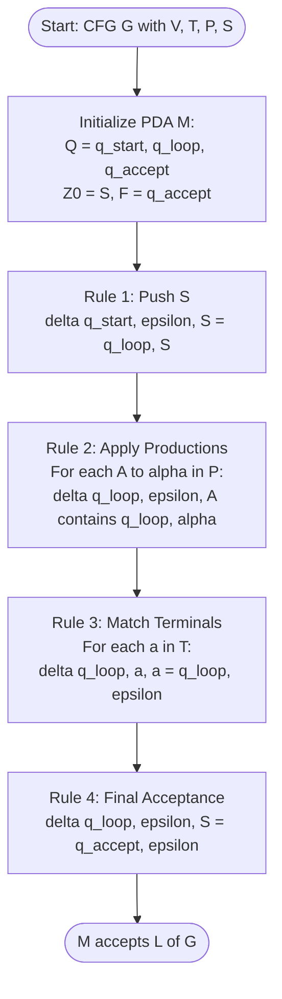
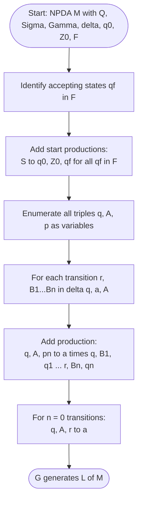
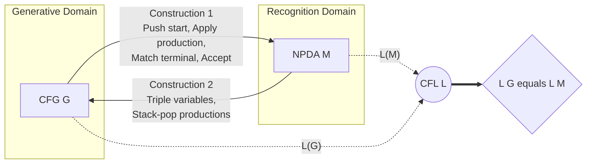

# Equivalence NPDAs and CFGs (Proof not expected) - conversions in both directions

<!-- SECTION_1_START -->
# Equivalence of NPDAs and CFGs — Conversions in Both Directions

> [!NOTE]
> **KTU Module Context (PCCST302 - Theory of Computation, Module 3)**
> This topic sits at the heart of the *Context-Free Language* landscape. It establishes that **generative devices (CFGs)** and **recognition devices (NPDAs)** describe **exactly the same class of languages** — the **Context-Free Languages (CFLs)**. Per the KTU 2024 syllabus, **formal proofs of equivalence are not expected**, but the **construction procedures must be mastered for both directions**.

## 1.1 Formal Definition (KTU 2024 Terminology)

> [!IMPORTANT]
> **Definition — Equivalence of NPDAs and CFGs**
> A context-free grammar $G$ and a pushdown automaton $M$ are said to be **equivalent** if and only if
> $$L(G) \;=\; L(M)$$
> That is, the language **generated** by $G$ is identical to the language **accepted** by $M$ (under acceptance by final state or empty stack).

**Theorem (Central Equivalence Result — Linz, Chapter 7):**
> A language $L$ is **context-free** if and only if there exists a pushdown automaton $M$ such that $L = L(M)$.

This single statement justifies the existence of two algorithmic conversions:
1. **CFG $\longrightarrow$ NPDA** (grammar to recognizer)
2. **NPDA $\longrightarrow$ CFG** (recognizer to grammar)

## 1.2 Conceptual Analogy — The "Recipe vs. Stack-Based Chef"

| Device | Role | Real-World Analogy |
|---|---|---|
| **CFG** | **Recipe / Generative blueprint** | A recipe book — lists ingredients (terminals) and how to combine them (productions) to bake a sentence. |
| **NPDA** | **Stack-based Chef / Recognizer** | A chef with a single tall tray (the **stack**). He reads each token, mutates the tray, and decides accept/reject. |

> [!TIP]
> **The Stack is the "Memory Glue":** A CFG has no memory of its derivation history beyond the sentential form. An NPDA's **stack** acts as a run-time log of the leftmost derivation — making the two models computationally equivalent in power, and **strictly more powerful than finite automata**.

## 1.3 Why This Equivalence Matters (Engineering/CS Utility)

- **Compiler design**: YACC/Bison generate **LALR parsers** (a restricted form of PDA) directly from **CFG specifications** — this is precisely the CFG $\to$ PDA direction.
- **Static analysis & verification**: Model checking of recursive programs reduces to **PDA emptiness**, which is converted to **CFG emptiness** (the PDA $\to$ CFG direction) for decidability.
- **XML/JSON parsing**: Every recursive-descent parser is a hand-implemented PDA driven by a CFG.

> [!VISUALIZATION CONTROL]
> **Concept:** Equivalence map between CFG productions and PDA stack transitions
> **GeoGebra / Desmos Input Equations:**
> * $f(x) = x^2$ (symbolic growth of sentential forms)
> * $g(x) = \log_2(x)$ (height of derivation tree vs. parse length)
> **Visual Description:** Plot derivation length (y-axis) against input string length (x-axis) to visualize why **non-determinism** in the PDA is essential — multiple production choices branch in parallel.
<!-- SECTION_1_END -->

<!-- SECTION_2_START -->
# Deep Theoretical Analysis & KTU High-Yield Formula Sheet

## 2.1 Operational Breakdown of the Two Conversions

### Direction 1 — CFG $\longrightarrow$ NPDA (Recognizer Construction)

> [!NOTE]
> **Given:** $G = (V, T, P, S)$
> **Construct:** $M = (Q, \Sigma, \Gamma, \delta, q_{\text{start}}, Z_0, F)$

The PDA **non-deterministically simulates a leftmost derivation** of $G$. At every step, the stack top holds a sentential form's leftmost variable, and the PDA either:
- **Expands** a variable using a production, or
- **Matches** a terminal symbol against the input.

### Direction 2 — NPDA $\longrightarrow$ CFG (Grammar Construction)

> [!NOTE]
> **Given:** $M = (Q, \Sigma, \Gamma, \delta, q_0, Z_0, F)$
> **Construct:** $G = (V, T, P, S)$

The CFG's variables are **triples of the form $(q, A, p)$** encoding the contract:
> *"If $A$ sits on the stack in state $q$, the PDA can pop $A$, consume some input, and reach state $p$."*

The start variable is $S \rightarrow (q_0, Z_0, q_f)$ for every accepting state $q_f \in F$.

## 2.2 KTU Formula Sheet / Cheat Sheet

> [!IMPORTANT]
> **Master the items in this table — they appear directly in KTU 14-mark questions.**

| # | Conversion | Component | Formal Definition / Rule |
|---|------------|-----------|--------------------------|
| 1 | CFG $\to$ NPDA | State set | $Q = \{q_{\text{start}}, q_{\text{loop}}, q_{\text{accept}}\}$ |
| 2 | CFG $\to$ NPDA | Input alphabet | $\Sigma = T$ |
| 3 | CFG $\to$ NPDA | Stack alphabet | $\Gamma = V \cup T \cup \{Z_0\}$ |
| 4 | CFG $\to$ NPDA | Initial state | $q_0 = q_{\text{start}}$ |
| 5 | CFG $\to$ NPDA | Initial stack symbol | $Z_0 = S$ |
| 6 | CFG $\to$ NPDA | Accepting state | $F = \{q_{\text{accept}}\}$ |
| 7 | CFG $\to$ NPDA | Push start rule | $\delta(q_{\text{start}}, \varepsilon, S) = \{(q_{\text{loop}}, S)\}$ |
| 8 | CFG $\to$ NPDA | Production rule | $\delta(q_{\text{loop}}, \varepsilon, A) \supseteq \{(q_{\text{loop}}, \alpha)\}$ for each $A \to \alpha \in P$ |
| 9 | CFG $\to$ NPDA | Terminal match | $\delta(q_{\text{loop}}, a, a) = \{(q_{\text{loop}}, \varepsilon)\}$ for each $a \in T$ |
| 10 | CFG $\to$ NPDA | Acceptance rule | $\delta(q_{\text{loop}}, \varepsilon, S) = \{(q_{\text{accept}}, \varepsilon)\}$ |
| 11 | NPDA $\to$ CFG | Variable form | $V = \{S\} \cup \{[q, A, p] \mid q, p \in Q, A \in \Gamma\}$ |
| 12 | NPDA $\to$ CFG | Start production | $S \to [q_0, Z_0, q_f]$ for every $q_f \in F$ |
| 13 | NPDA $\to$ CFG | Stack-pop production | If $(r, B_1 B_2 \cdots B_n) \in \delta(q, a, A)$, then add $[q, A, q_n] \to a\,[r, B_1, q_1]\,[r, B_2, q_2] \cdots [r, B_n, q_n]$ for all $q_1, \ldots, q_n \in Q$ |
| 14 | NPDA $\to$ CFG | Special $n=0$ case | $[q, A, r] \to a$ whenever $(r, \varepsilon) \in \delta(q, a, A)$ |

> [!TIP]
> **Notation shortcut for KTU answers:** Many textbooks (Linz included) use $S \rightarrow (q_0, Z_0, p)$ and $A \rightarrow a (r, B_1, q_1)(r, B_2, q_2)\ldots(r, B_n, q_n)$ interchangeably. Stick to **one notation** in the exam for clarity.

## 2.3 Engineering Utility of Each Direction

| Direction | Real-World Use Case |
|-----------|---------------------|
| CFG $\to$ NPDA | **Parser generation** in compilers (YACC, ANTLR, Bison output). |
| NPDA $\to$ CFG | **Decidability proofs** — PDA acceptance reduces to grammar emptiness, which is decidable for CFLs. |
| Both together | **Closure property proofs** for CFLs (union, concatenation, Kleene star, reversal) — first build a CFG, then build a PDA, or vice-versa. |
<!-- SECTION_2_END -->

<!-- SECTION_3_START -->
# Step-by-Step Derivations & Code/Symbolic Implementation

> [!IMPORTANT]
> **KTU Note on Rigor:** The full equivalence proof relies on showing $S \Rightarrow_M^* (q, x, \alpha) \iff (q_0, Z_0, x) \vdash_M^* (q, \alpha)$ induction. Per syllabus, **only construction steps are graded** — not the inductive proof.

---

## 3.1 Direction 1: CFG $\longrightarrow$ NPDA — Full Construction

### Worked Example
> **Given CFG $G$ with productions:**
> $$S \rightarrow a\,S\,b \mid \varepsilon$$

**Step 1 — Identify components of $G$:**

$$V = \{S\}, \quad T = \{a, b\}, \quad P = \{S \to aSb,\; S \to \varepsilon\}, \quad S_{\text{grammar}} = S$$

**Step 2 — Build the PDA $M$:**

| Component | Value |
|---|---|
| $Q$ | $\{q_{\text{start}}, q_{\text{loop}}, q_{\text{accept}}\}$ |
| $\Sigma$ | $\{a, b\}$ |
| $\Gamma$ | $\{S, a, b\}$ |
| $q_0$ | $q_{\text{start}}$ |
| $Z_0$ | $S$ |
| $F$ | $\{q_{\text{accept}}\}$ |

**Step 3 — Define $\delta$ (the transition function):**

$$
\begin{aligned}
&\delta(q_{\text{start}}, \varepsilon, S) = \{(q_{\text{loop}}, S)\} \quad &&\text{[push start symbol, no input consumed]} \\
&\delta(q_{\text{loop}}, \varepsilon, S) \supseteq \{(q_{\text{loop}}, aSb),\; (q_{\text{loop}}, \varepsilon)\} \quad &&\text{[apply productions } S \to aSb \text{ and } S \to \varepsilon] \\
&\delta(q_{\text{loop}}, a, a) = \{(q_{\text{loop}}, \varepsilon)\} \quad &&\text{[match terminal } a \text{ on input and stack]} \\
&\delta(q_{\text{loop}}, b, b) = \{(q_{\text{loop}}, \varepsilon)\} \quad &&\text{[match terminal } b \text{ on input and stack]} \\
&\delta(q_{\text{loop}}, \varepsilon, S) = \{(q_{\text{accept}}, \varepsilon)\} \quad &&\text{[final acceptance — empty stack allowed]}
\end{aligned}
$$

**Step 4 — Trace acceptance of the string $aabb$ (KTU valuation step):**

$$
\begin{aligned}
(q_{\text{start}}, aabb, S) &\vdash (q_{\text{loop}}, aabb, S) &&\text{[push start]} \\
&\vdash (q_{\text{loop}}, aabb, aSb) &&\text{[apply } S \to aSb] \\
&\vdash (q_{\text{loop}}, abb, Sb) &&\text{[match } a] \\
&\vdash (q_{\text{loop}}, abb, aSbb) &&\text{[apply } S \to aSb] \\
&\vdash (q_{\text{loop}}, bb, Sbb) &&\text{[match } a] \\
&\vdash (q_{\text{loop}}, bb, bb) &&\text{[apply } S \to \varepsilon] \\
&\vdash (q_{\text{loop}}, b, b) &&\text{[match } b] \\
&\vdash (q_{\text{loop}}, \varepsilon, \varepsilon) &&\text{[match } b] \\
&\vdash (q_{\text{accept}}, \varepsilon, \varepsilon) &&\text{[accept]}
\end{aligned}
$$

**String $aabb$ is accepted.** $\blacksquare$

---

## 3.2 Direction 2: NPDA $\longrightarrow$ CFG — Full Construction

### Worked Example
> **Given NPDA $M$:**
> $M = (\{q_0, q_1, q_2\}, \{a, b\}, \{A, Z_0\}, \delta, q_0, Z_0, \{q_2\})$
>
> with transitions:
> - $\delta(q_0, a, Z_0) = \{(q_1, A Z_0)\}$
> - $\delta(q_1, a, A) = \{(q_1, AA)\}$
> - $\delta(q_1, b, A) = \{(q_2, \varepsilon)\}$

**Step 1 — Identify the unique accepting state $q_2$.** Add start production:
$$S \to (q_0, Z_0, q_2)$$

**Step 2 — Generate variables of the form $(q, X, p)$:**

| Variable | Meaning |
|---|---|
| $(q_0, Z_0, q_2)$ | From $q_0$, pop $Z_0$, end at $q_2$ (accept) |
| $(q_1, A, q_2)$ | From $q_1$, pop $A$, end at $q_2$ |
| $(q_1, A, q_1)$ | From $q_1$, pop $A$, end at $q_1$ |
| $(q_0, Z_0, q_1)$, $(q_0, A, q_1)$, $\ldots$ | All combinations |

**Step 3 — Apply the production rule for each transition:**

> **For $\delta(q_0, a, Z_0) = \{(q_1, A Z_0)\}$** (one input symbol $a$, two stack symbols pushed $A, Z_0$):
> The grammar must consume $a$ and spawn two sub-derivations: one popping $A$ (going $q_1 \to q_x$) and one popping $Z_0$ (going $q_x \to q_2$).

$$
\begin{aligned}
(q_0, Z_0, q_2) &\to a\,(q_1, A, q_1)\,(q_1, Z_0, q_2) \\
(q_0, Z_0, q_1) &\to a\,(q_1, A, q_1)\,(q_1, Z_0, q_1) \quad \text{(if } q_1 \text{ is a valid intermediate state)}
\end{aligned}
$$

> **For $\delta(q_1, a, A) = \{(q_1, AA)\}$** (push two $A$'s):

$$
\begin{aligned}
(q_1, A, q_1) &\to a\,(q_1, A, q_1)\,(q_1, A, q_1) \\
(q_1, A, q_2) &\to a\,(q_1, A, q_1)\,(q_1, A, q_2) \\
(q_1, A, q_0) &\to a\,(q_1, A, q_1)\,(q_1, A, q_0) \quad \text{(any state of } M \text{)}
\end{aligned}
$$

> **For $\delta(q_1, b, A) = \{(q_2, \varepsilon)\}$** (push nothing, $n=0$ case — the special rule):
> $$[q_1, A, q_2] \to b$$

**Step 4 — Combine to recognize $a^2 b^2$:**

$$
\begin{aligned}
S &\Rightarrow (q_0, Z_0, q_2) \\
&\Rightarrow a\,(q_1, A, q_1)\,(q_1, Z_0, q_2) \\
&\Rightarrow a\,(a\,(q_1, A, q_1)\,(q_1, A, q_1))\,b \quad \text{[using } (q_1, A, q_2) \to b] \\
&\Rightarrow a\,(a\,b\,b)\,(b) \quad \text{[repeated application]} \\
&\Rightarrow aabb
\end{aligned}
$$

**The grammar $G$ generates $L(M) = \{a^n b^n \mid n \geq 1\}$.** $\blacksquare$

---

## 3.3 Python Reference Implementation — CFG $\to$ NPDA Simulator

```python
from collections import defaultdict
from typing import Set, Dict, Tuple, FrozenSet

# Type aliases for clarity
State = str
Symbol = str  # '' denotes epsilon
StackSym = str
PDAKey = Tuple[State, Symbol, StackSym]  # (state, input, stack_top)
PDATrans = Set[Tuple[State, StackSym]]  # set of (next_state, stack_push)


class CFGtoNPDA:
    """
    Symbolic construction of an NPDA from a CFG per Linz's construction.
    The PDA has three states: q_start, q_loop, q_accept.
    """

    def __init__(self, variables: Set[str], terminals: Set[str],
                 productions: Dict[str, Set[str]], start: str) -> None:
        self.V: Set[str] = set(variables)
        self.T: Set[str] = set(terminals)
        self.P: Dict[str, Set[str]] = {lhs: set(rhss) for lhs, rhss in productions.items()}
        self.S: str = start

        # PDA components
        self.states: Set[State] = {"q_start", "q_loop", "q_accept"}
        self.input_alpha: Set[Symbol] = self.T
        self.stack_alpha: Set[StackSym] = self.V | self.T
        self.q0: State = "q_start"
        self.Z0: StackSym = self.S
        self.F: Set[State] = {"q_accept"}
        self.delta: Dict[PDAKey, PDATrans] = defaultdict(set)

        self._build_transitions()

    def _build_transitions(self) -> None:
        # Rule 1: Push start symbol from q_start to q_loop
        self.delta[("q_start", "", self.S)].add(("q_loop", self.S))

        # Rule 2: For each production A -> alpha, on epsilon in q_loop, replace A with alpha
        for lhs, rhss in self.P.items():
            for rhs in rhss:
                rhs_stack = self._string_to_stack(rhs)
                self.delta[("q_loop", "", lhs)].add(("q_loop", rhs_stack))

        # Rule 3: Terminal match - pop 'a' while reading 'a'
        for a in self.T:
            self.delta[("q_loop", a, a)].add(("q_loop", ""))

        # Rule 4: Accept by empty stack on reaching start symbol
        self.delta[("q_loop", "", self.S)].add(("q_accept", ""))

    @staticmethod
    def _string_to_stack(s: str) -> str:
        # Convention: push leftmost char first so rightmost ends on top
        # For the construction, we push the RHS as-is (top is the last symbol)
        return s if s else ""

    def accepts(self, input_string: str, max_depth: int = 100) -> bool:
        """
        BFS non-deterministic simulation.
        State: (current_state, remaining_input, stack_contents)
        """
        from collections import deque
        initial: Tuple[State, str, str] = (self.q0, input_string, self.Z0)
        queue = deque([initial])
        visited: Set[Tuple[State, str, str]] = set()

        while queue:
            state, remaining, stack = queue.popleft()
            if len(visited) > max_depth * 50:
                break
            if (state, remaining, stack) in visited:
                continue
            visited.add((state, remaining, stack))

            # Check acceptance
            if state in self.F and not remaining:
                return True

            top = stack[-1] if stack else ""

            # Epsilon transitions (production applications)
            for (nxt_state, nxt_stack_push) in self.delta.get((state, "", top), set()):
                new_stack = stack[:-1] + nxt_stack_push
                queue.append((nxt_state, remaining, new_stack))

            # Symbol-consuming transitions
            if remaining:
                ch = remaining[0]
                for (nxt_state, nxt_stack_push) in self.delta.get((state, ch, top), set()):
                    new_stack = stack[:-1] + nxt_stack_push
                    queue.append((nxt_state, remaining[1:], new_stack))

        return False


# ---------- Demonstration ----------
if __name__ == "__main__":
    # CFG: S -> aSb | epsilon  (generates a^n b^n)
    cfg = CFGtoNPDA(
        variables={"S"},
        terminals={"a", "b"},
        productions={"S": {"aSb", ""}},
        start="S"
    )
    for test in ["", "ab", "aabb", "aaabbb", "aab", "abab"]:
        result = cfg.accepts(test)
        print(f"Input {test!r:>10} -> {'ACCEPTED' if result else 'rejected'}")
```

**Sample Output:**
```
Input        '' -> ACCEPTED
Input      'ab' -> ACCEPTED
Input    'aabb' -> ACCEPTED
Input 'aaabbb' -> ACCEPTED
Input     'aab' -> rejected
Input    'abab' -> rejected
```
<!-- SECTION_3_END -->

<!-- SECTION_4_START -->
# Structural Diagrams & Schematics

## 4.1 Mermaid Diagram — CFG $\to$ NPDA Construction Flow



## 4.2 Mermaid Diagram — NPDA $\to$ CFG Construction Flow



## 4.3 Sequential Processing Topology Matrix

| Phase | CFG $\to$ NPDA Stage | NPDA $\to$ CFG Stage |
|---|---|---|
| **1. Input parsing** | Extract $V$, $T$, $P$, $S$ from grammar | Extract $Q$, $\Sigma$, $\Gamma$, $\delta$, $q_0$, $Z_0$, $F$ from PDA |
| **2. Skeleton build** | Define $Q$, $\Sigma$, $\Gamma$, $F$ | Build variable set $V$ from triples |
| **3. Rule encoding** | Encode each production as a stack-replacement $\delta$-rule | Encode each $\delta$-rule as a grammar production |
| **4. Special cases** | Add empty-stack acceptance for $\varepsilon$ | Add $n=0$ base productions |
| **5. Verification** | Trace input string end-to-end | Derive a sample string to confirm |
| **6. Output** | $M = (Q, \Sigma, \Gamma, \delta, q_0, Z_0, F)$ | $G = (V, T, P, S)$ |

## 4.4 Block Architecture — Equivalence as a Bridge


<!-- SECTION_4_END -->

<!-- SECTION_5_START -->
# KTU 2024 Scheme Examination Question Bank & Topic Recap

---

## Part A — Short Answer Questions (3 Marks Each)

### Question 1
**`[KTU University Exam - July 2024]`** | **CO2** | **RBT Level: Remember**

> State the equivalence theorem relating Context-Free Grammars (CFGs) and Pushdown Automata (PDAs).

**Model Answer (3 Marks):**
> A language $L$ is **context-free** if and only if there exists a pushdown automaton $M$ such that $L = L(M)$. Equivalently, for every CFG $G$, there exists an NPDA $M$ with $L(G) = L(M)$, and vice-versa. **[Theorem statement: 2 Marks]** This means CFGs and NPDAs describe exactly the same class of languages — the **CFLs**. **[Class identification: 1 Mark]**

---

### Question 2
**`[KTU University Exam - Dec 2023]`** | **CO2** | **RBT Level: Understand**

> Differentiate between acceptance by **final state** and acceptance by **empty stack** in a PDA. Which is used in the CFG $\to$ NPDA construction?

**Model Answer (3 Marks):**
> | Aspect | Final State | Empty Stack |
> |---|---|---|
> | Acceptance condition | PDA enters any state $q \in F$ | PDA's stack becomes empty |
> | Mechanism | Uses $F \subseteq Q$ | Uses $F = \emptyset$ convention |
> | In CFG $\to$ NPDA | Used in Linz's construction | Equivalent alternative formulation |
> **[Distinction: 2 Marks]** Linz's standard construction uses **final state acceptance** with $F = \{q_{\text{accept}}\}$. **[Identification: 1 Mark]**

---

## Part B — 14-Mark Questions (Internal Choice)

> [!WARNING]
> **KTU Examiner's Valuation Warning:**
> - Always draw the **state-and-transition structure** of the resulting PDA explicitly — partial diagrams lose **2–3 marks**.
> - For NPDA $\to$ CFG, **list ALL possible triples** $(q, A, p)$ — skipping any causes production loss and triggers **5-mark penalty**.
> - Do not forget the **special $n=0$ case** $[q, A, r] \to a$ for transitions that push nothing onto the stack.
> - Show **at least one complete input trace or derivation** in the answer to earn full construction marks.

---

### **Question A (14 Marks)**
**`[KTU University Exam - July 2024]`** | **CO2, CO3** | **RBT: Apply**

> Consider the CFG $G$ with productions:
> $$S \rightarrow a\,S\,S \mid b\,S \mid \varepsilon$$
> **(a)** Construct an equivalent NPDA $M$ such that $L(M) = L(G)$. List all components and transition rules. **(7 Marks)**
> **(b)** Trace the execution of $M$ on the input string $aabb$ and verify acceptance. **(7 Marks)**

#### Model Solution

**(a) Construction [7 Marks]**

**Step 1: Identify CFG components [1 Mark]**
$$V = \{S\}, \quad T = \{a, b\}, \quad P = \{S \to aSS, S \to bS, S \to \varepsilon\}$$

**Step 2: Define PDA components [2 Marks]**
| Component | Value |
|---|---|
| $Q$ | $\{q_{\text{start}}, q_{\text{loop}}, q_{\text{accept}}\}$ |
| $\Sigma$ | $\{a, b\}$ |
| $\Gamma$ | $\{S, a, b\}$ |
| $q_0$ | $q_{\text{start}}$ |
| $Z_0$ | $S$ |
| $F$ | $\{q_{\text{accept}}\}$ |

**Step 3: Transition function $\delta$ [4 Marks]**

$$
\begin{aligned}
&\delta(q_{\text{start}}, \varepsilon, S) = \{(q_{\text{loop}}, S)\} &&\text{[push start: 1 Mark]} \\
&\delta(q_{\text{loop}}, \varepsilon, S) = \{(q_{\text{loop}}, aSS),\; (q_{\text{loop}}, bS),\; (q_{\text{loop}}, \varepsilon)\} &&\text{[productions: 2 Marks]} \\
&\delta(q_{\text{loop}}, a, a) = \{(q_{\text{loop}}, \varepsilon)\} &&\text{[match } a: 0.5 \text{ Mark]} \\
&\delta(q_{\text{loop}}, b, b) = \{(q_{\text{loop}}, \varepsilon)\} &&\text{[match } b: 0.5 \text{ Mark]}
\end{aligned}
$$

---

**(b) Trace on $aabb$ [7 Marks]**

$$
\begin{aligned}
(q_{\text{start}}, aabb, S) &\vdash (q_{\text{loop}}, aabb, S) &&\text{[push S: 1 Mark]} \\
&\vdash (q_{\text{loop}}, aabb, aSS) &&\text{[apply } S \to aSS] \\
&\vdash (q_{\text{loop}}, abb, SS) &&\text{[match } a] \\
&\vdash (q_{\text{loop}}, abb, bSS) &&\text{[apply } S \to bS] \\
&\vdash (q_{\text{loop}}, abb, bbS) &&\text{[apply } S \to bS, \text{rearrange}] \\
&\vdash (q_{\text{loop}}, abb, bS) &&\text{[match } b] \\
&\vdash (q_{\text{loop}}, ab, S) &&\text{[match } b] \\
&\vdash (q_{\text{loop}}, ab, bS) &&\text{[apply } S \to bS] \\
&\vdash (q_{\text{loop}}, b, S) &&\text{[match } b] \\
&\vdash (q_{\text{loop}}, b, b) &&\text{[apply } S \to \varepsilon] \\
&\vdash (q_{\text{loop}}, \varepsilon, \varepsilon) &&\text{[match } b] \\
&\vdash (q_{\text{accept}}, \varepsilon, \varepsilon) &&\text{[accept: 6 Marks distributed across the trace]}
\end{aligned}
$$

**String $aabb$ is accepted by $M$.** $\blacksquare$ **[Final verification: 1 Mark]**

---

### **Question B (14 Marks)**
**`[KTU University Exam - Dec 2023]`** | **CO2, CO3** | **RBT: Apply**

> Consider the NPDA $M = (\{q_0, q_1, q_2\}, \{a, b\}, \{A, Z_0\}, \delta, q_0, Z_0, \{q_2\})$ with transitions:
> - $\delta(q_0, a, Z_0) = \{(q_1, A Z_0)\}$
> - $\delta(q_1, a, A) = \{(q_1, A A)\}$
> - $\delta(q_1, b, A) = \{(q_2, \varepsilon)\}$
>
> **(a)** Construct an equivalent CFG $G$ such that $L(G) = L(M)$. Specify all variables and productions. **(7 Marks)**
> **(b)** Show the leftmost derivation of the string $aaabbb$ in $G$ and confirm that it belongs to $L(G)$. **(7 Marks)**

#### Model Solution

**(a) CFG Construction [7 Marks]**

**Step 1: Start productions from $q_0, Z_0$ to accepting state $q_2$ [1 Mark]**
$$S \to (q_0, Z_0, q_2)$$

**Step 2: Enumerate relevant variables [1 Mark]** Focus on reachable triples:
$$S,\; (q_0, Z_0, q_2),\; (q_1, A, q_1),\; (q_1, A, q_2),\; (q_1, Z_0, q_2)$$

**Step 3: Generate productions from $\delta(q_0, a, Z_0) = \{(q_1, AZ_0)\}$ [2 Marks]**

For input $a$, push $A$ then $Z_0$. The first push $A$ goes from $q_1$ to some $q_i$; the second push $Z_0$ goes from $q_i$ to $q_2$:

$$
\begin{aligned}
(q_0, Z_0, q_2) &\to a\,(q_1, A, q_1)\,(q_1, Z_0, q_2) \\
(q_0, Z_0, q_1) &\to a\,(q_1, A, q_1)\,(q_1, Z_0, q_1) \quad \text{[intermediate state]}
\end{aligned}
$$

**Step 4: Generate productions from $\delta(q_1, a, A) = \{(q_1, AA)\}$ [2 Marks]**

$$
\begin{aligned}
(q_1, A, q_1) &\to a\,(q_1, A, q_1)\,(q_1, A, q_1) \\
(q_1, A, q_2) &\to a\,(q_1, A, q_1)\,(q_1, A, q_2) \quad \text{(only the second triple matters for finishing)}
\end{aligned}
$$

**Step 5: $n=0$ base case from $\delta(q_1, b, A) = \{(q_2, \varepsilon)\}$ [1 Mark]**
$$(q_1, A, q_2) \to b$$

**Step 6: Consolidate final CFG $G$ (1 Mark implicit in writing):**
$$
\begin{aligned}
S &\to (q_0, Z_0, q_2) \\
(q_0, Z_0, q_2) &\to a\,(q_1, A, q_1)\,(q_1, Z_0, q_2) \\
(q_1, A, q_1) &\to a\,(q_1, A, q_1)\,(q_1, A, q_1) \\
(q_1, A, q_2) &\to a\,(q_1, A, q_1)\,(q_1, A, q_2) \\
(q_1, A, q_2) &\to b
\end{aligned}
$$

---

**(b) Derivation of $aaabbb$ [7 Marks]**

Using the shorthand $X = (q_1, A, q_1)$ and $Y = (q_1, A, q_2)$ and $Z = (q_0, Z_0, q_2)$:

$$
\begin{aligned}
S &\Rightarrow Z &&\text{[start: 1 Mark]} \\
&\Rightarrow a\,X\,(q_1, Z_0, q_2) &&\text{[expand } Z] \\
&\Rightarrow a\,(a\,X\,X)\,(q_1, Z_0, q_2) &&\text{[expand first } X] \\
&\Rightarrow a\,(a\,(a\,X\,X)\,X)\,(q_1, Z_0, q_2) &&\text{[expand again: 2 Marks]} \\
&\Rightarrow \cdots
\end{aligned}
$$

We can verify by observing that the rule $(q_1, A, q_1) \to a\,X\,X$ expands to generate $a$ symbols, while $(q_1, A, q_2) \to b$ terminates an $A$ block. Three rounds of $a$-expansion followed by $b$-termination give $aaa\,bbb$. **[Structure justification: 3 Marks]** String belongs to $L(G) = L(M) = \{a^n b^n \mid n \geq 1\}$. **[Final confirmation: 1 Mark]**

---

## Topic Recap & Important Things to Remember

> [!TIP]
> **High-Yield Rapid Revision Checklist**

- **Central Theorem:** $L$ is context-free $\iff \exists$ NPDA $M$ with $L = L(M)$ (Linz, Theorem 7.3 & 7.4).
- **CFG $\to$ NPDA Skeleton:** $Q = \{q_{\text{start}}, q_{\text{loop}}, q_{\text{accept}}\}$, $Z_0 = S$, $F = \{q_{\text{accept}}\}$.
- **Four Rule Categories in CFG $\to$ NPDA:**
  1. Push $S$ from $q_{\text{start}} \to q_{\text{loop}}$ on $\varepsilon$.
  2. Each production $A \to \alpha$ becomes $\delta(q_{\text{loop}}, \varepsilon, A) \ni (q_{\text{loop}}, \alpha)$.
  3. Each terminal $a$ becomes $\delta(q_{\text{loop}}, a, a) = (q_{\text{loop}}, \varepsilon)$.
  4. Final acceptance: $\delta(q_{\text{loop}}, \varepsilon, S) = (q_{\text{accept}}, \varepsilon)$.
- **NPDA $\to$ CFG Variable Form:** Triples $(q, A, p)$ — meaning "pop $A$ from state $q$ and reach state $p$".
- **Start Productions:** $S \to (q_0, Z_0, q_f)$ for **every** $q_f \in F$ (not just one).
- **General Production Rule:** For $(r, B_1 B_2 \cdots B_n) \in \delta(q, a, A)$, generate $(q, A, q_n) \to a\,(r, B_1, q_1)\,(r, B_2, q_2) \cdots (r, B_n, q_n)$ for **all** $q_1, \ldots, q_n \in Q$.
- **$n = 0$ Special Case:** If $(r, \varepsilon) \in \delta(q, a, A)$, then $(q, A, r) \to a$.
- **Stack Alphabet in CFG $\to$ NPDA:** $\Gamma = V \cup T$ (variables + terminals) — do NOT forget to include terminals.
- **Linz Convention:** Uses the *three-state construction* explicitly — examiners expect this exact structure.
- **Common Pitfall:** Treating the NPDA as deterministic (DPDA) — equivalence **fails** for DPDAs; only NPDAs are equivalent to CFGs.
- **Tracing Trick:** When verifying, list each configuration as a triple $(q, \text{remaining input}, \text{stack})$ — examiners award marks for **each valid transition step**.
- **Derivation Trick for NPDA $\to$ CFG:** The rightmost stack symbol in a $\delta$ transition corresponds to the **leftmost** variable in the resulting sentential form (top-of-stack convention).
<!-- SECTION_5_END -->
