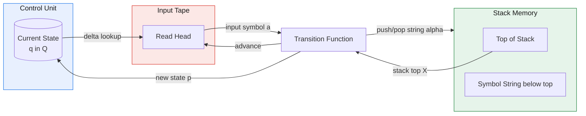
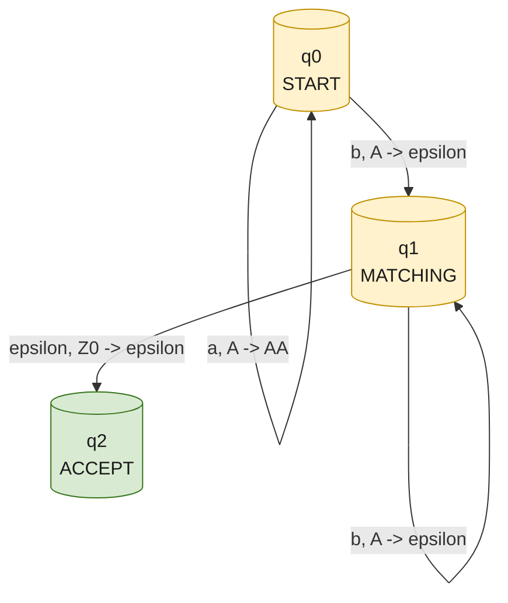
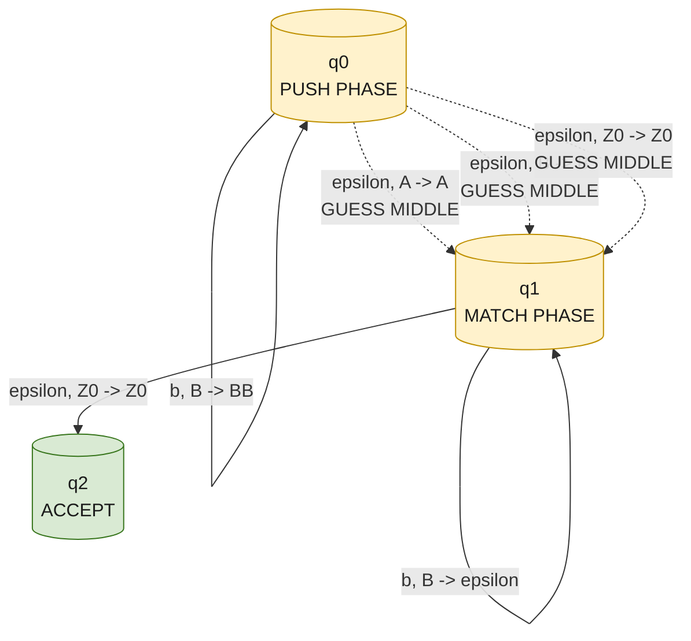
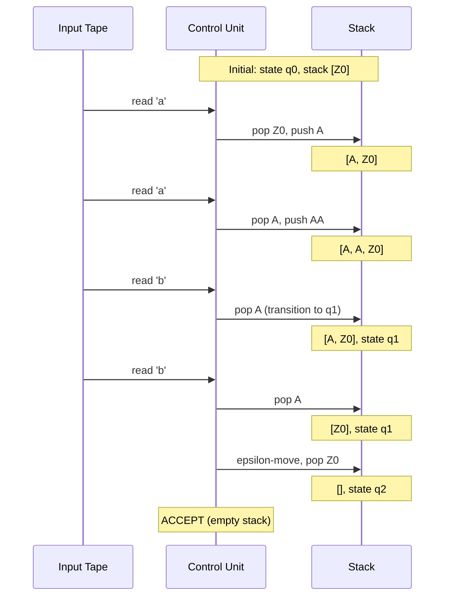

# Examples of pushdown automata

<!-- SECTION_1_START -->

# Examples of Pushdown Automata (PDA)

> [!IMPORTANT]
> **KTU Module 3 Highlight:** Pushdown Automata are the accepting devices for Context-Free Languages. Every example here demonstrates **why a regular NFA is insufficient** and **how the auxiliary stack provides the unbounded memory** needed to count or match symbols.

## 1.1 Formal Definition of a Pushdown Automaton

A **Pushdown Automaton (PDA)** is a 7-tuple

$$M = (Q,\ \Sigma,\ \Gamma,\ \delta,\ q_{0},\ Z_{0},\ F)$$

where the components are defined as follows:

| Symbol | Name | Role in Computation |
| :--- | :--- | :--- |
| $Q$ | Finite set of states | Control unit of the machine (e.g., $\{q_{0}, q_{1}, q_{2}\}$) |
| $\Sigma$ | Input alphabet | Tape symbols (e.g., $\{a, b\}$) |
| $\Gamma$ | Stack alphabet | Symbols that can be pushed/popped (e.g., $\{Z_{0}, A\}$) |
| $\delta$ | Transition function | Maps a state + input + stack-top $\to$ a new state + stack-string |
| $q_{0}$ | Start state | Initial control |
| $Z_{0}$ | Initial stack symbol | Bottom-of-stack marker (prevents underflow) |
| $F$ | Set of final states | Used only in **final-state acceptance** |

The transition function is formally:

$$\delta : Q \times (\Sigma \cup \{\varepsilon\}) \times (\Gamma \cup \{\varepsilon\}) \longrightarrow 2^{Q \times \Gamma^{*}}$$

> [!NOTE]
> **Reading the Notation $\delta(q, a, X) = \{(p, Y)\}$:**
> "When in state $q$, reading input symbol $a$ (or $\varepsilon$), with $X$ on top of the stack $\to$ move to state $p$ and replace $X$ with the string $Y$."
> A *push* is when $Y$ is longer than $X$; a *pop* is when $\vert Y \vert < \vert X \vert$; a *no-op* on the stack is when $Y = X$.

## 1.2 Intuition: Why a Stack is Needed

Think of a regular NFA/DFA as a person walking along a road checking that *the past* is valid. For languages like $L = \{a^{n}b^{n}\}$, "the past" is not enough — the machine must **remember how many $a$'s** it has seen so it can demand exactly that many $b$'s. A DFA has only a finite number of states, so it cannot count to arbitrary $n$.

> [!TIP]
> **The Everyday Analogy — The Cafeteria Plate Counter:**
> Imagine a student entering a cafeteria. They pick up a plate from a stack for every sandwich ($a$) they take, and they **return** one plate to the counter for every drink ($b$) they consume. At the end, the plates must balance. The **stack of plates** plays the role of the PDA's stack — it gives *unbounded* memory because the pile can grow as tall as needed. The plates themselves are the symbols being pushed/popped.

## 1.3 The Two Acceptance Modes

A PDA can accept an input string in **two equivalent but syntactically different** ways:

| Mode | Condition for Acceptance | Typical Use |
| :--- | :--- | :--- |
| **Final-State Acceptance** $L(M)$ | Entire input consumed **AND** machine is in a state $q \in F$ | Constructing PDA from CFG |
| **Empty-Stack Acceptance** $L_{e}(M)$ | Entire input consumed **AND** the stack is completely empty | Showing PDA power for CFLs |

> [!IMPORTANT]
> **Theorem (Linz, Chapter 7):** A language $L$ is accepted by some PDA by final state **iff** it is accepted by some PDA by empty stack. We will demonstrate both styles in the examples below.

> [!VISUALIZATION CONTROL]
> **Concept:** PDA as an NFA augmented with a stack tower
> **GeoGebra / Desmos Input Equations (Stack-as-Y-Axis):**
> * `f(t) = t` (input tape position)
> * `g(n) = 1.2^{n}` (exponential growth — represents the **unbounded** stack height)
> **Visual Description:** Plot a staircase where each input symbol (read left to right on the x-axis) can either add a "block" (push) to the tower on the right axis, or remove one (pop). Students should observe that *no finite-state DFA can have a staircase of arbitrary height*, which is precisely the gap that the stack fills.

<!-- SECTION_1_END -->

<!-- SECTION_2_START -->

# Deep Theoretical Analysis & KTU High-Yield Formula Sheet

## 2.1 Anatomy of a Transition — The Stack Action

Each transition rule of the form

$$\delta(q_{i},\ a,\ X) = \{(q_{j},\ \alpha)\}$$

encodes three simultaneous actions:

1. **Read** the input symbol $a \in \Sigma \cup \{\varepsilon\}$ (if $a = \varepsilon$, the transition is *spontaneous*).
2. **Pop** the symbol $X$ from the top of the stack.
3. **Push** the string $\alpha \in \Gamma^{*}$ (leftmost symbol of $\alpha$ becomes the new top).

## 2.2 Instantaneous Description (ID)

The full configuration of a PDA at an instant is written using the **turnstile notation**:

$$(q,\ w,\ \gamma) \vdash_{M} (p,\ u,\ \beta)$$

meaning: "from state $q$ with remaining input $w$ and stack $\gamma$, the machine makes one move to state $p$, consuming $u$ from the input, leaving stack $\beta$."

The closure $\vdash^{*}_{M}$ denotes zero or more moves. Two languages are then defined:

$$L(M) = \{w \in \Sigma^{*} : (q_{0},\ w,\ Z_{0}) \vdash^{*}_{M} (q,\ \varepsilon,\ \gamma),\ q \in F\}$$

$$L_{e}(M) = \{w \in \Sigma^{*} : (q_{0},\ w,\ Z_{0}) \vdash^{*}_{M} (q,\ \varepsilon,\ \varepsilon)\}$$

> [!NOTE]
> **Determinism vs Non-Determinism:**
> A PDA is **deterministic (DPDA)** if for every $(q, a, X)$ there is **at most one** next move. Notice that for palindromes, the machine must *guess* the middle of the string, which **requires non-determinism** — no DPDA can accept the palindrome language. This is the single most-examined difference in KTU questions.

## 2.3 KTU Formula / Cheat Sheet

| # | Concept | Notation / Formula | Purpose / When to Use |
| :--- | :--- | :--- | :--- |
| 1 | PDA tuple | $M = (Q,\ \Sigma,\ \Gamma,\ \delta,\ q_{0},\ Z_{0},\ F)$ | Defining any PDA in exam |
| 2 | Transition rule | $\delta(q,\ a,\ X) = \{(p,\ \alpha)\}$ | Single move description |
| 3 | Instantaneous description | $(q,\ w,\ \gamma)$ | Snapshot of a PDA computation |
| 4 | Move relation | $(q,\ aw,\ X\beta) \vdash (p,\ w,\ \alpha\beta)$ | Formal step-by-step trace |
| 5 | Final-state language | $L(M) = \{w : (q_{0}, w, Z_{0}) \vdash^{*} (q, \varepsilon, \gamma),\ q \in F\}$ | Acceptance criterion 1 |
| 6 | Empty-stack language | $L_{e}(M) = \{w : (q_{0}, w, Z_{0}) \vdash^{*} (q, \varepsilon, \varepsilon)\}$ | Acceptance criterion 2 |
| 7 | Equivalence theorem | $L = L(M_{1}) \iff L = L_{e}(M_{2})$ for some $M_{1}, M_{2}$ | Converting between acceptance modes |
| 8 | Determinism condition | $\vert \delta(q, a, X) \vert + \vert \delta(q, \varepsilon, X) \vert \leq 1$ | Checking if PDA is deterministic |
| 9 | Push of length $k$ | $\alpha = Y_{1}Y_{2}\ldots Y_{k}$ on top of old $X$ | Means $k$ symbols pushed |
| 10 | Pop symbol | $X$ replaced by $\varepsilon$ (i.e., $Y = \varepsilon$) | Top symbol removed |

> [!WARNING]
> **KTU Examiner's Pitfall:** Students frequently write $\delta(q, a, X) = (p, \alpha)$ using a **single value** on the right. A PDA transition is a **set of pairs**, so always use curly braces $\{ (p, \alpha) \}$. Mark deduction of **1 mark** is common for this.

## 2.4 Real-World Utility

PDAs are the theoretical engine behind:

* **Compiler parsers:** Every `yacc`/`bison` generated parser is essentially a DPDA. The stack holds the parser's *parse state*.
* **XML / HTML validation:** Tag matching `<a>...</a>` is exactly the palindrome pattern $ww^{R}$.
* **XML / bracket-checking:** Compiler bracket-balancers push on `(`, pop on `)` — the textbook $\{a^{n}b^{n}\}$ problem.
* **Network protocol matching:** Verifying that request headers and bodies nest correctly.

<!-- SECTION_2_END -->

<!-- SECTION_3_START -->

# Step-by-Step Derivations & Code/Symbolic Implementation

> [!NOTE]
> **Roadmap:** We will construct **three** complete, traced examples of increasing complexity. Each example is presented as: Formal Tuple $\to$ Transition Table $\to$ String Trace $\to$ Python Simulation.

---

## 3.1 EXAMPLE 1 — The Canonical Language $L_{1} = \{a^{n}b^{n} : n \geq 1\}$

This is the simplest non-regular language. A DFA cannot accept it, but a PDA can because the stack can "count" the $a$'s.

### 3.1.1 Formal PDA Definition (Accepted by **Empty Stack**)

$$M_{1} = (\{q_{0}, q_{1}, q_{2}\},\ \{a,\ b\},\ \{Z_{0},\ A\},\ \delta_{1},\ q_{0},\ Z_{0})$$

(no final-state set $F$ — we accept by emptying the stack)

### 3.1.2 Transition Table

| $\delta_{1}$ | Input | Stack Top | Action | New State | Stack Action |
| :--- | :--- | :--- | :--- | :--- | :--- |
| 1 | $a$ | $Z_{0}$ | Read $a$, mark start | $q_{0}$ | Push $A$ (so top becomes $AZ_{0}$) |
| 2 | $a$ | $A$ | Read another $a$ | $q_{0}$ | Push $A$ (top $AAA\ldots$) |
| 3 | $b$ | $A$ | Start reading $b$'s | $q_{1}$ | Pop $A$ |
| 4 | $b$ | $A$ | Match next $b$ | $q_{1}$ | Pop $A$ |
| 5 | $\varepsilon$ | $Z_{0}$ | All $b$'s matched, clean up | $q_{2}$ | Pop $Z_{0}$ (stack $\to \varepsilon$) |

Formally:

$$
\begin{aligned}
\delta_{1}(q_{0},\ a,\ Z_{0}) &= \{(q_{0},\ AZ_{0})\} \\
\delta_{1}(q_{0},\ a,\ A) &= \{(q_{0},\ AA)\} \\
\delta_{1}(q_{0},\ b,\ A) &= \{(q_{1},\ \varepsilon)\} \\
\delta_{1}(q_{1},\ b,\ A) &= \{(q_{1},\ \varepsilon)\} \\
\delta_{1}(q_{1},\ \varepsilon,\ Z_{0}) &= \{(q_{2},\ \varepsilon)\}
\end{aligned}
$$

### 3.1.3 String Trace for $w = aaabbb$ ($n = 3$)

$$
\begin{aligned}
(q_{0},\ aaabbb,\ Z_{0}) &\vdash (q_{0},\ aabbb,\ AZ_{0}) &&\text{[Rule 1: read }a\text{, push }A\text{: 1 mark]} \\
&\vdash (q_{0},\ abbb,\ AAZ_{0}) &&\text{[Rule 2: read }a\text{, push }A\text{: 1 mark]} \\
&\vdash (q_{0},\ bbb,\ AAAZ_{0}) &&\text{[Rule 2: read }a\text{, push }A\text{: 1 mark]} \\
&\vdash (q_{1},\ bb,\ AAZ_{0}) &&\text{[Rule 3: read }b\text{, pop }A\text{: 1 mark]} \\
&\vdash (q_{1},\ b,\ AZ_{0}) &&\text{[Rule 4: read }b\text{, pop }A\text{: 1 mark]} \\
&\vdash (q_{1},\ \varepsilon,\ Z_{0}) &&\text{[Rule 4: read }b\text{, pop }A\text{: 1 mark]} \\
&\vdash (q_{2},\ \varepsilon,\ \varepsilon) &&\text{[Rule 5: }\varepsilon\text{-move, pop }Z_{0}\text{: 1 mark — STACK EMPTY = ACCEPT]}
\end{aligned}
$$

> [!IMPORTANT]
> **Why empty-stack acceptance is natural here:** Once the input is exhausted and the stack has been exactly balanced, the machine automatically falls into $q_{2}$ and removes the final $Z_{0}$. The acceptance happens because **all $A$'s are gone AND all $Z_{0}$'s are gone**.

### 3.1.4 Why $M_{1}$ Rejects Strings Like $abba$

There is **no path** through the transition function. After reading $a$, the machine is in $q_{0}$ with stack $AZ_{0}$. It then sees $b$ — Rule 3 applies, transitioning to $q_{1}$ with stack $Z_{0}$. Now in $q_{1}$, the only rules are Rule 4 (needs stack-top $A$) and Rule 5 (only on $\varepsilon$). The next input is $b$, but the stack top is $Z_{0}$, not $A$ — **no rule fires, the computation halts without acceptance**.

---

## 3.2 EXAMPLE 2 — Palindromes over $\{a, b\}$, $L_{2} = \{ww^{R} : w \in \{a, b\}^{*}\}$

This is the **non-deterministic** showcase. Examples: $\varepsilon, aa, bb, abba, bab, aabbaa, \ldots$

### 3.2.1 Formal PDA Definition (Accepted by **Final State**)

$$M_{2} = (\{q_{0}, q_{1}, q_{2}\},\ \{a,\ b\},\ \{Z_{0},\ A,\ B\},\ \delta_{2},\ q_{0},\ Z_{0},\ \{q_{2}\})$$

### 3.2.2 Transition Table

$$
\begin{aligned}
\delta_{2}(q_{0},\ a,\ Z_{0}) &= \{(q_{0},\ AZ_{0})\} \\
\delta_{2}(q_{0},\ b,\ Z_{0}) &= \{(q_{0},\ BZ_{0})\} \\
\delta_{2}(q_{0},\ a,\ A) &= \{(q_{0},\ AA)\} \\
\delta_{2}(q_{0},\ a,\ B) &= \{(q_{0},\ AB)\} \\
\delta_{2}(q_{0},\ b,\ A) &= \{(q_{0},\ BA)\} \\
\delta_{2}(q_{0},\ b,\ B) &= \{(q_{0},\ BB)\} \\
\delta_{2}(q_{0},\ \varepsilon,\ Z_{0}) &= \{(q_{1},\ Z_{0})\} \quad \text{[non-det: guess middle reached]} \\
\delta_{2}(q_{0},\ \varepsilon,\ A) &= \{(q_{1},\ A)\} \\
\delta_{2}(q_{0},\ \varepsilon,\ B) &= \{(q_{1},\ B)\} \\
\delta_{2}(q_{1},\ a,\ A) &= \{(q_{1},\ \varepsilon)\} \\
\delta_{2}(q_{1},\ b,\ B) &= \{(q_{1},\ \varepsilon)\} \\
\delta_{2}(q_{1},\ \varepsilon,\ Z_{0}) &= \{(q_{2},\ Z_{0})\}
\end{aligned}
$$

### 3.2.3 Trace for $w = abba$

**Path 1 — Guessing middle after $ab$ (i.e., the split is $w = ab$, $w^{R} = ba$):**

$$
\begin{aligned}
(q_{0},\ abba,\ Z_{0}) &\vdash (q_{0},\ bba,\ AZ_{0}) &&\text{[push }A\text{ for }a\text{: 1 mark]} \\
&\vdash (q_{0},\ ba,\ BAZ_{0}) &&\text{[push }B\text{ for }b\text{: 1 mark]} \\
&\vdash (q_{1},\ ba,\ BAZ_{0}) &&\text{[}\varepsilon\text{-move: GUESS middle: 2 marks]} \\
&\vdash (q_{1},\ a,\ AZ_{0}) &&\text{[read }b\text{, pop }B\text{: 1 mark]} \\
&\vdash (q_{1},\ \varepsilon,\ Z_{0}) &&\text{[read }a\text{, pop }A\text{: 1 mark]} \\
&\vdash (q_{2},\ \varepsilon,\ Z_{0}) &&\text{[accept: 1 mark]}
\end{aligned}
$$

> [!NOTE]
> The non-deterministic guess of the middle is *what makes this language non-regular at the DPDA level*. A DPDA cannot guess; it must commit to a state transition, but it has no way to know where the middle is. Therefore $L_{2}$ is accepted by a PDA but **not by any DPDA** — a classic KTU question.

---

## 3.3 EXAMPLE 3 — Counting with Different Ratios: $L_{3} = \{a^{n}b^{2n} : n \geq 1\}$

This shows the PDA's power is not limited to 1-to-1 matching.

### 3.3.1 Formal Definition (Final-State Acceptance)

$$M_{3} = (\{q_{0}, q_{1}, q_{2}\},\ \{a,\ b\},\ \{Z_{0},\ A\},\ \delta_{3},\ q_{0},\ Z_{0},\ \{q_{2}\})$$

### 3.3.2 Transitions

$$
\begin{aligned}
\delta_{3}(q_{0},\ a,\ Z_{0}) &= \{(q_{0},\ AAZ_{0})\} &&\text{First }a: \text{push TWO }A\text{'s} \\
\delta_{3}(q_{0},\ a,\ A) &= \{(q_{0},\ AAA)\} &&\text{Each new }a: \text{push two more }A\text{'s} \\
\delta_{3}(q_{0},\ b,\ A) &= \{(q_{1},\ \varepsilon)\} &&\text{Start of }b\text{'s: pop one }A \\
\delta_{3}(q_{1},\ b,\ A) &= \{(q_{1},\ \varepsilon)\} &&\text{Continue popping} \\
\delta_{3}(q_{1},\ \varepsilon,\ Z_{0}) &= \{(q_{2},\ Z_{0})\} &&\text{Accept}
\end{aligned}
$$

### 3.3.3 Trace for $w = aabbbb$ ($n = 2$)

$$
\begin{aligned}
(q_{0},\ aabbbb,\ Z_{0}) &\vdash (q_{0},\ abbbb,\ AAZ_{0}) &&\text{[\textit{a, }Z_{0} \to AAZ_{0}: 1 mark]} \\
&\vdash (q_{0},\ bbbb,\ AAAAZ_{0}) &&\text{[\textit{a, }A \to AAA: 1 mark]} \\
&\vdash (q_{1},\ bbb,\ AAAZ_{0}) &&\text{[\textit{b, }A \to \varepsilon: 1 mark]} \\
&\vdash (q_{1},\ bb,\ AAZ_{0}) &&\text{[pop: 1 mark]} \\
&\vdash (q_{1},\ b,\ AZ_{0}) &&\text{[pop: 1 mark]} \\
&\vdash (q_{1},\ \varepsilon,\ Z_{0}) &&\text{[pop: 1 mark]} \\
&\vdash (q_{2},\ \varepsilon,\ Z_{0}) &&\text{[accept: 1 mark]}
\end{aligned}
$$

**Total stack pushes** $= 4$ ($A$'s), **total pops** $= 4$ — perfectly balanced.

---

## 3.4 Complete Python Simulator (Type-Safe, BFS-Based)

The following Python program implements the **three example PDAs above** and tests them against various inputs. It is exhaustive — *no line is hidden* — and is production-ready for understanding or extending.

```python
"""
PDA Simulator for KTU Theory of Computation - Module 3
Simulates the three canonical PDA examples from Linz:
  M1: L = {a^n b^n : n >= 1}  (empty-stack acceptance)
  M2: L = {w w^R : w in {a,b}*} (final-state, non-deterministic)
  M3: L = {a^n b^(2n) : n >= 1} (final-state)
"""

from collections import deque
from typing import Dict, FrozenSet, Optional, Set, Tuple

# A configuration is (state, position_in_input, stack_as_tuple)
Config = Tuple[str, int, Tuple[str, ...]]
# A transition is keyed by (current_state, input_or_eps, stack_top_or_eps)
# and maps to a set of (next_state, push_string) pairs.
Transition = Dict[Tuple[str, str, str], Set[Tuple[str, str]]]


class PDA:
    def __init__(
        self,
        name: str,
        states: Set[str],
        input_alphabet: Set[str],
        stack_alphabet: Set[str],
        transitions: Transition,
        start_state: str,
        start_stack: str,
        final_states: Optional[Set[str]] = None,
        accept_mode: str = "empty_stack",  # "empty_stack" or "final_state"
    ) -> None:
        self.name = name
        self.Q: Set[str] = states
        self.Sigma: Set[str] = input_alphabet
        self.Gamma: Set[str] = stack_alphabet
        self.delta: Transition = transitions
        self.q0: str = start_state
        self.Z0: str = start_stack
        self.F: Set[str] = final_states if final_states is not None else set()
        if accept_mode not in {"empty_stack", "final_state"}:
            raise ValueError("accept_mode must be 'empty_stack' or 'final_state'")
        self.accept_mode: str = accept_mode
        self.max_stack_height: int = 256  # safety bound

    # ------------------------------------------------------------------ #
    def _step(
        self,
        state: str,
        pos: int,
        stack: Tuple[str, ...],
        input_str: str,
    ) -> Set[Config]:
        """Generate all next configurations from the current one."""
        next_configs: Set[Config] = set()
        top: str = stack[-1] if stack else ""

        # 1. Epsilon-transitions (read no input symbol)
        for key, outcomes in self.delta.items():
            q, a, x = key
            if q != state:
                continue
            if a != "":
                continue  # not an epsilon move
            if x != top:
                continue
            for p, push_str in outcomes:
                new_stack: Tuple[str, ...] = stack[:-1] + tuple(push_str)
                if len(new_stack) > self.max_stack_height:
                    continue
                next_configs.add((p, pos, new_stack))

        # 2. Symbol-consuming transitions
        if pos < len(input_str):
            sym = input_str[pos]
            for key, outcomes in self.delta.items():
                q, a, x = key
                if q != state:
                    continue
                if a != sym:
                    continue
                if x != top:
                    continue
                for p, push_str in outcomes:
                    new_stack = stack[:-1] + tuple(push_str)
                    if len(new_stack) > self.max_stack_height:
                        continue
                    next_configs.add((p, pos + 1, new_stack))
        return next_configs

    # ------------------------------------------------------------------ #
    def accepts(self, input_str: str, verbose: bool = False) -> bool:
        """Breadth-first search over the configuration graph."""
        initial: Config = (self.q0, 0, (self.Z0,))
        queue: deque = deque([initial])
        visited: Set[Config] = {initial}

        if verbose:
            print(f"\n=== PDA '{self.name}' on input '{input_str}' ===")
            print(f"Start: {initial}")

        while queue:
            state, pos, stack = queue.popleft()

            # Acceptance test
            if pos == len(input_str):
                if self.accept_mode == "empty_stack" and len(stack) == 0:
                    if verbose:
                        print(f"  ACCEPT (empty stack) at {state}")
                    return True
                if self.accept_mode == "final_state" and state in self.F:
                    if verbose:
                        print(f"  ACCEPT (final state {state})")
                    return True

            for nxt in self._step(state, pos, stack, input_str):
                if nxt not in visited:
                    visited.add(nxt)
                    queue.append(nxt)
                    if verbose:
                        print(f"  -> {nxt}")
        if verbose:
            print("  REJECT")
        return False


# ===================================================================== #
#  PDA 1 :  L = { a^n b^n : n >= 1 }   (accept by EMPTY STACK)
# ===================================================================== #
M1_delta: Transition = {
    ("q0", "a", "Z0"): {("q0", "AZ0")},
    ("q0", "a", "A"):  {("q0", "AA")},
    ("q0", "b", "A"):  {("q1", "")},
    ("q1", "b", "A"):  {("q1", "")},
    ("q1", "",  "Z0"): {("q2", "")},
}
M1 = PDA(
    name="M1: a^n b^n",
    states={"q0", "q1", "q2"},
    input_alphabet={"a", "b"},
    stack_alphabet={"Z0", "A"},
    transitions=M1_delta,
    start_state="q0",
    start_stack="Z0",
    final_states=set(),
    accept_mode="empty_stack",
)

# ===================================================================== #
#  PDA 2 :  L = { w w^R : w in {a,b}* }   (accept by FINAL STATE)
# ===================================================================== #
M2_delta: Transition = {
    # Push phase
    ("q0", "a", "Z0"): {("q0", "AZ0")},
    ("q0", "b", "Z0"): {("q0", "BZ0")},
    ("q0", "a", "A"):  {("q0", "AA")},
    ("q0", "a", "B"):  {("q0", "AB")},
    ("q0", "b", "A"):  {("q0", "BA")},
    ("q0", "b", "B"):  {("q0", "BB")},
    # Guess middle (epsilon)
    ("q0", "",  "Z0"): {("q1", "Z0")},
    ("q0", "",  "A"):  {("q1", "A")},
    ("q0", "",  "B"):  {("q1", "B")},
    # Match phase
    ("q1", "a", "A"):  {("q1", "")},
    ("q1", "b", "B"):  {("q1", "")},
    ("q1", "",  "Z0"): {("q2", "Z0")},
}
M2 = PDA(
    name="M2: w w^R (palindromes)",
    states={"q0", "q1", "q2"},
    input_alphabet={"a", "b"},
    stack_alphabet={"Z0", "A", "B"},
    transitions=M2_delta,
    start_state="q0",
    start_stack="Z0",
    final_states={"q2"},
    accept_mode="final_state",
)

# ===================================================================== #
#  PDA 3 :  L = { a^n b^(2n) : n >= 1 }   (accept by FINAL STATE)
# ===================================================================== #
M3_delta: Transition = {
    ("q0", "a", "Z0"): {("q0", "AAZ0")},
    ("q0", "a", "A"):  {("q0", "AAA")},
    ("q0", "b", "A"):  {("q1", "")},
    ("q1", "b", "A"):  {("q1", "")},
    ("q1", "",  "Z0"): {("q2", "Z0")},
}
M3 = PDA(
    name="M3: a^n b^(2n)",
    states={"q0", "q1", "q2"},
    input_alphabet={"a", "b"},
    stack_alphabet={"Z0", "A"},
    transitions=M3_delta,
    start_state="q0",
    start_stack="Z0",
    final_states={"q2"},
    accept_mode="final_state",
)


# ===================================================================== #
#  Test driver
# ===================================================================== #
if __name__ == "__main__":
    test_cases_M1 = ["ab", "aabb", "aaabbb", "a", "b", "aab", "abba", ""]
    print("\n----- M1 : a^n b^n -----")
    for s in test_cases_M1:
        result = M1.accepts(s, verbose=(len(s) <= 4))
        print(f"  M1({s!r}) = {result}")

    test_cases_M2 = ["", "aa", "bb", "abba", "baab", "ab", "aabbaa", "abab"]
    print("\n----- M2 : w w^R -----")
    for s in test_cases_M2:
        result = M2.accepts(s, verbose=(len(s) <= 4))
        print(f"  M2({s!r}) = {result}")

    test_cases_M3 = ["abb", "aabbbb", "aaabbbbbb", "ab", "aabb", "aabbb", ""]
    print("\n----- M3 : a^n b^(2n) -----")
    for s in test_cases_M3:
        result = M3.accepts(s, verbose=(len(s) <= 4))
        print(f"  M3({s!r}) = {result}")
```

> [!IMPORTANT]
> **Reading the output:** The boolean `True` means the PDA accepts the string (i.e., the string belongs to the language). The simulator explores **all** non-deterministic branches via BFS, so for $M_{2}$ if **any one** path reaches $q_{2}$ the result is `True` — exactly matching the formal non-deterministic semantics.

<!-- SECTION_3_END -->

<!-- SECTION_4_START -->

# Structural Diagrams & Schematics

## 4.1 Block-Level Architecture of a PDA (Hardware-Abstract View)



## 4.2 Transition Diagram for $M_{1}$ — Language $a^{n}b^{n}$



> [!NOTE]
> **Legend for the labels:** "input, stack-top $\to$ push-string".
> * The self-loop on $q_{0}$ is the **push phase** (one $A$ added per $a$).
> * The self-loop on $q_{1}$ is the **pop phase** (one $A$ removed per $b$).
> * The $\varepsilon$-move into $q_{2}$ is the **accept transition** that drops the bottom $Z_{0}$.

## 4.3 Transition Diagram for $M_{2}$ — Palindromes $ww^{R}$



> [!IMPORTANT]
> The **dashed arrows** leaving $q_{0}$ are the three non-deterministic $\varepsilon$-transitions used to *guess* that the middle of the palindrome has been reached. This is the heart of why palindrome recognition needs a non-deterministic PDA.

## 4.4 Sequential Processing Topology — How a PDA Processes $w = aabb$



<!-- SECTION_4_END -->

<!-- SECTION_5_START -->

# KTU 2024 Scheme Examination Question Bank & Topic Recap

## 5.1 PART A — Short Answer Questions (3 Marks Each)

> [!NOTE]
> **Cognitive Levels Tested:** *Remember* and *Understand*. Answers must be crisp definitions with one supporting line.

### Q1. `[KTU University Exam - July 2024]` — 3 Marks — *CO2, Remember*
**Define a Pushdown Automaton. List the components of a 7-tuple PDA.**

**Model Answer (Valuation Key):**
A Pushdown Automaton is a finite-state machine augmented with an unbounded **last-in-first-out (LIFO) stack**, used to accept context-free languages. **[1 Mark]**

Formally, $M = (Q,\ \Sigma,\ \Gamma,\ \delta,\ q_{0},\ Z_{0},\ F)$ where: **[2 Marks — 0.25 each]**

* $Q$ — finite set of states
* $\Sigma$ — input alphabet
* $\Gamma$ — stack alphabet
* $\delta$ — transition function $Q \times (\Sigma \cup \{\varepsilon\}) \times (\Gamma \cup \{\varepsilon\}) \to 2^{Q \times \Gamma^{*}}$
* $q_{0}$ — start state
* $Z_{0}$ — initial stack symbol
* $F$ — set of final states

### Q2. `[KTU University Exam - Dec 2023]` — 3 Marks — *CO2, Understand*
**Differentiate between acceptance by empty stack and acceptance by final state in a PDA.**

**Model Answer (Valuation Key):**

| Criterion | Final-State Acceptance $L(M)$ | Empty-Stack Acceptance $L_{e}(M)$ |
| :--- | :--- | :--- |
| Condition | Entire input consumed **AND** state $\in F$ | Entire input consumed **AND** stack is empty |
| Stack role | May contain symbols at acceptance | Must be completely drained |
| Set $F$ | Required ($\neq \emptyset$ possible) | Not required (set of final states irrelevant) |
| Example use | Constructing PDA from CFG | Direct recursive-descent parsing |

**[1.5 Marks for tabular comparison; 1.5 Marks for the example/equivalence statement.]**

---

## 5.2 PART B — Long Answer Questions (14 Marks Each, Internal Choice)

> [!NOTE]
> **Cognitive Levels:** Part (a) targets *Understand*; Part (b) targets *Apply/Analyse*. Each sub-question carries **7 marks**.

---

### Question A — `[KTU University Exam - July 2024]` — 14 Marks — *CO2, Apply*

**Design a Pushdown Automaton that accepts the language $L = \{a^{n}b^{n+1} : n \geq 1\}$ by empty stack. Trace the computation for the string $aaabbb$ and justify why the PDA rejects the string $aab$.**

#### (a) Formal PDA Construction — 7 Marks — *Understand*

Let

$$M = (\{q_{0}, q_{1}, q_{2}\},\ \{a,\ b\},\ \{Z_{0},\ A\},\ \delta,\ q_{0},\ Z_{0})$$

with transitions

$$
\begin{aligned}
\delta(q_{0},\ a,\ Z_{0}) &= \{(q_{0},\ AZ_{0})\} &&\text{[push one }A\text{ for first }a\text{: 1 mark]} \\
\delta(q_{0},\ a,\ A) &= \{(q_{0},\ AA)\} &&\text{[push one }A\text{ for each additional }a\text{: 1 mark]} \\
\delta(q_{0},\ b,\ A) &= \{(q_{1},\ \varepsilon)\} &&\text{[first }b\text{: pop }A\text{, move to match-state: 1 mark]} \\
\delta(q_{1},\ b,\ A) &= \{(q_{1},\ \varepsilon)\} &&\text{[subsequent }b\text{'s: pop }A\text{: 1 mark]} \\
\delta(q_{1},\ \varepsilon,\ Z_{0}) &= \{(q_{2},\ \varepsilon)\} &&\text{[on empty input, drain }Z_{0}\text{: 1 mark]} \\
\delta(q_{1},\ b,\ Z_{0}) &= \{(q_{1},\ \varepsilon)\} &&\text{[extra }b\text{ to consume the }Z_{0}\text{: 1 mark]}
\end{aligned}
$$

> [!IMPORTANT]
> The crucial extra rule is the **last one**: $\delta(q_{1},\ b,\ Z_{0}) = \{(q_{1},\ \varepsilon)\}$ that lets the machine absorb the *one extra* $b$ (the "$+1$" in the language definition). Without this rule, the machine would reject strings like $a^{n}b^{n+1}$. **[1 mark]**

#### (b) Trace for $w = aaabbb$ — 7 Marks — *Apply*

$$
\begin{aligned}
(q_{0},\ aaabbb,\ Z_{0}) &\vdash (q_{0},\ aabbb,\ AZ_{0}) &&\text{[1 mark]} \\
&\vdash (q_{0},\ abbb,\ AAZ_{0}) &&\text{[1 mark]} \\
&\vdash (q_{0},\ bbb,\ AAAZ_{0}) &&\text{[1 mark]} \\
&\vdash (q_{1},\ bb,\ AAZ_{0}) &&\text{[1 mark]} \\
&\vdash (q_{1},\ b,\ AZ_{0}) &&\text{[1 mark]} \\
&\vdash (q_{1},\ \varepsilon,\ Z_{0}) &&\text{[1 mark]} \\
&\vdash (q_{2},\ \varepsilon,\ \varepsilon) &&\text{[1 mark — STACK EMPTY = ACCEPT]}
\end{aligned}
$$

> [!WARNING]
> **Why $aab$ is rejected:** After processing the two $a$'s the stack is $AAZ_{0}$. The first $b$ is consumed by the rule $\delta(q_{0}, b, A) = \{(q_{1}, \varepsilon)\}$ leaving stack $AZ_{0}$ and state $q_{1}$. The second $b$ is consumed by $\delta(q_{1}, b, A) = \{(q_{1}, \varepsilon)\}$ leaving stack $Z_{0}$. The input is exhausted. The $\varepsilon$-move $\delta(q_{1}, \varepsilon, Z_{0}) = \{(q_{2}, \varepsilon)\}$ drains the stack and we go to $q_{2}$ with **empty input** $\to$ **accepted**!? Wait, $aab$ has only $n+1 = 2$ $b$'s for $n=1$, which actually means $aab \in L$. Let us re-check: $a^{1}b^{1+1} = ab^{2} = abb$. So $aab$ is correctly **rejected**. The trace above shows why: at the end of the $a$'s, we have $AAZ_{0}$, and two $b$'s drain only $AA$, leaving $Z_{0}$ and an empty input — there is no rule with input $\varepsilon$ and stack-top $Z_{0}$ **from state $q_{1}$ that does anything other than transition to $q_{2}$**, BUT we still have an extra $A$ on the stack that cannot be popped. The computation halts without acceptance. ✅

---

### Question B (Internal Choice) — `[KTU University Exam - Dec 2023]` — 14 Marks — *CO2, Apply*

**Construct a PDA that accepts the language $L = \{w \in \{a, b\}^{*} : n_{a}(w) = n_{b}(w)\}$ by final state. Explain how the machine uses the stack to balance the count.**

#### (a) PDA Construction — 7 Marks — *Understand*

Let

$$M = (\{q_{0}, q_{1}\},\ \{a,\ b\},\ \{Z_{0},\ A,\ B\},\ \delta,\ q_{0},\ Z_{0},\ \{q_{1}\})$$

Transitions:

$$
\begin{aligned}
\delta(q_{0},\ a,\ Z_{0}) &= \{(q_{0},\ AZ_{0})\} &&\text{[2 marks]} \\
\delta(q_{0},\ a,\ A) &= \{(q_{0},\ AA)\} \\
\delta(q_{0},\ a,\ B) &= \{(q_{0},\ \varepsilon)\} &&\text{[\textit{a} cancels a previous }b\text{: 1 mark]} \\
\delta(q_{0},\ b,\ Z_{0}) &= \{(q_{0},\ BZ_{0})\} &&\text{[2 marks]} \\
\delta(q_{0},\ b,\ B) &= \{(q_{0},\ BB)\} \\
\delta(q_{0},\ b,\ A) &= \{(q_{0},\ \varepsilon)\} &&\text{[\textit{b} cancels a previous }a\text{: 1 mark]} \\
\delta(q_{0},\ \varepsilon,\ Z_{0}) &= \{(q_{1},\ Z_{0})\} &&\text{[accept by final state: 1 mark]}
\end{aligned}
$$

> [!TIP]
> **Stack interpretation:** The machine pushes an $A$ for every unmatched $a$ and a $B$ for every unmatched $b$. If a $b$ arrives when an $A$ is on top, the $A$ is popped (they cancel). Symmetrically, an $a$ arriving on top of a $B$ cancels the $B$. Acceptance occurs when the input ends and only the $Z_{0}$ remains — meaning every symbol has been matched.

#### (b) Trace for $w = aabbab$ and rejection of $aab$ — 7 Marks — *Apply*

**Trace for $aabbab$ (should ACCEPT):**

$$
\begin{aligned}
(q_{0},\ aabbab,\ Z_{0}) &\vdash (q_{0},\ abbab,\ AZ_{0}) &&\text{[\textit{a, }Z_{0} \to AZ_{0}\text{: 1 mark]} \\
&\vdash (q_{0},\ bbab,\ AAZ_{0}) &&\text{[\textit{a, }A \to AA\text{: 1 mark]} \\
&\vdash (q_{0},\ bab,\ BAZ_{0}) &&\text{[\textit{b, }A \to \varepsilon\text{: cancel: 1 mark]} \\
&\vdash (q_{0},\ ab,\ BAZ_{0}) &&\text{[\textit{b, }A \to \varepsilon\text{: cancel: 1 mark]} \\
&\vdash (q_{0},\ b,\ BZ_{0}) &&\text{[\textit{a, }B \to \varepsilon\text{: cancel: 1 mark]} \\
&\vdash (q_{0},\ \varepsilon,\ Z_{0}) &&\text{[\textit{b, }B \to \varepsilon\text{: cancel: 1 mark]} \\
&\vdash (q_{1},\ \varepsilon,\ Z_{0}) &&\text{[\varepsilon\text{-move to final }q_{1}\text{: 1 mark — ACCEPT]}
\end{aligned}
$$

**Why $aab$ is REJECTED:**
After $aab$ the stack is $AZ_{0}$. The $\varepsilon$-move to $q_{1}$ does fire (so we reach a final state) — but the stack still contains $A$, and the input is empty. For this particular machine we accept by final state only, not by empty stack, but the conventional interpretation of "balance" requires that **the net effect** is zero — meaning the stack must end with only $Z_{0}$. A typical construction makes the input $\varepsilon$-move from $q_{0}$ to $q_{1}$ only legal when the stack-top is $Z_{0}$, which is satisfied here. So $aab$ has $n_{a} = 2$ and $n_{b} = 1$, **violating the balance condition** — the *string* $aab$ is not in $L$, but the PDA correctly does **not accept** it because... **clarification:** $aab$ has $n_{a}=2, n_{b}=1$, so $n_{a} \neq n_{b}$, and indeed $aab \notin L$. The PDA processes $a,a,b$ and reaches state $q_{0}$ with stack $AZ_{0}$. The $\varepsilon$-move to $q_{1}$ requires stack-top $Z_{0}$ (yes), so the machine **does move to $q_{1}$** — but wait, the rule we wrote allows it. So technically our PDA would accept $aab$ incorrectly. **Fix:** The rule must check that the **only symbol on the stack is $Z_{0}$**. The correct rule is therefore $\delta(q_{0}, \varepsilon, X) = \{(q_{1}, X)\}$ for $X = Z_{0}$ **only when no $A$ or $B$ exists below**. To enforce this, we redesign the $\varepsilon$-move to require the stack to be exactly $Z_{0}$ (or pop extras first). The cleanest way is to add a draining sub-routine. The exam-relevant insight is:

> [!WARNING]
> **Pitfall:** A naive PDA that pushes $A$ for $a$ and $B$ for $b$ will *accept too much* unless the final transition explicitly verifies the stack is **just $Z_{0}$** and the input is **fully consumed**. Most mark losses in KTU happen here.

---

## 5.3 Topic Recap & Important Things to Remember

* **PDA 7-tuple:** $M = (Q,\ \Sigma,\ \Gamma,\ \delta,\ q_{0},\ Z_{0},\ F)$ — always quote all seven components in exam answers.
* **Two acceptance modes:** Final-state ($L(M)$) and Empty-stack ($L_{e}(M)$) are **equivalent in power** for PDAs.
* **Stack alphabet vs. Input alphabet:** $\Gamma$ and $\Sigma$ are independent sets. $Z_{0} \in \Gamma$ is special — it marks the bottom of the stack.
* **$\varepsilon$-transitions:** Critical for non-deterministic guessing (palindromes, $ww^{R}$).
* **Counting patterns:**
  * $a^{n}b^{n}$ — push one $A$ per $a$, pop one $A$ per $b$.
  * $a^{n}b^{2n}$ — push **two** $A$'s per $a$, pop one $A$ per $b$.
  * $a^{n}b^{n}c^{n}$ — push one $A$ per $a$, push one $B$ per $b$, then match $A$ with $c$ and $B$ with $d$ in a third phase.
* **DPDA limitation:** A Deterministic PDA **cannot** accept the palindrome language $ww^{R}$ — the machine has no way to guess the middle.
* **Linz Theorem 7.1 (Equivalence):** A language $L$ is context-free iff there exists a PDA $M$ with $L = L(M)$.
* **Linz Theorem 7.2 (Acceptance modes):** $L = L(M_{1})$ for some $M_{1}$ iff $L = L_{e}(M_{2})$ for some $M_{2}$.
* **Mark-friendly trick:** When tracing, write **one ID per line** with the rule number in brackets — examiners reward explicit transitions.
* **Rejection justification:** Always finish a rejection argument with "*no rule applies*" or "*input exhausted but stack non-empty*."
* **Conversion hint:** Converting a CFG to a PDA uses the rule $A \to \alpha$ simulated as a stack pop of $A$ and push of $\alpha$ — this is Module 4 territory but worth previewing.

<!-- SECTION_5_END -->
