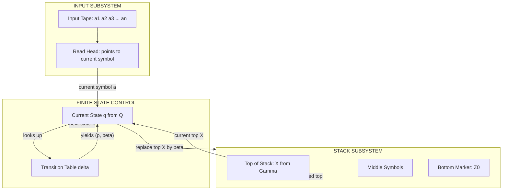
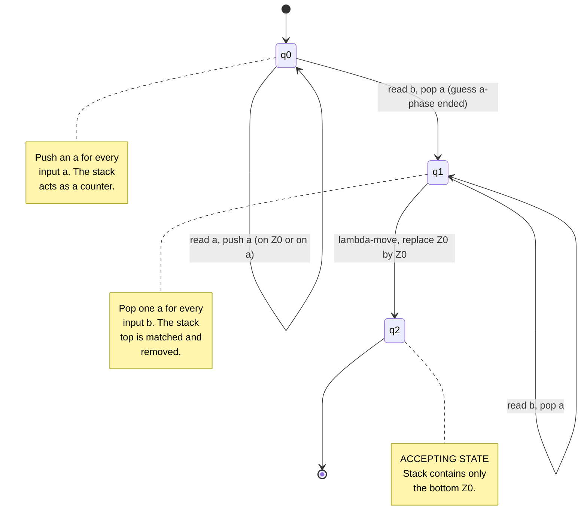

# Formal definition of a pushdown automaton

<!-- SECTION_1_START -->

## 1. Core Technical Definition & Intuitive Overview

### Formal Definition (Linz, Chapter 7)

A **Pushdown Automaton (PDA)** is a finite-state machine augmented with an auxiliary memory in the form of a **stack**, used to recognise exactly the class of **Context-Free Languages (CFLs)**. Formally, a PDA is a **7-tuple**:

$$
M = (Q,\ \Sigma,\ \Gamma,\ \delta,\ q_{0},\ Z_{0},\ F)
$$

where each component is precisely defined as follows:

| Symbol | Component Name | Description |
| :--- | :--- | :--- |
| $Q$ | Finite set of internal states | Non-empty finite set controlling the machine |
| $\Sigma$ | Input alphabet | Finite set of symbols read from the input tape |
| $\Gamma$ | Stack alphabet | Finite set of symbols that can be pushed onto the stack |
| $\delta$ | Transition function | Maps state-input-stack-top triples to next configurations |
| $q_{0}$ | Start state | The single initial state, $q_{0} \in Q$ |
| $Z_{0}$ | Initial stack symbol | Bottom-of-stack marker, $Z_{0} \in \Gamma$ |
| $F$ | Set of accepting states | $F \subseteq Q$ (used only in *final-state* acceptance) |

The transition function has the signature:

$$
\delta : Q \times (\Sigma \cup \{\lambda\}) \times \Gamma \longrightarrow \mathcal{P}_{\text{finite}}\bigl(Q \times \Gamma^{*}\bigr)
$$

> [!IMPORTANT]
> The symbol $\lambda$ (lambda) denotes the **empty string**. The use of $\lambda$ on the input side allows the PDA to make **spontaneous (epsilon) moves** without consuming an input symbol, which is one of the most important distinctions from a finite automaton.

> [!NOTE]
> **Why a stack?** Finite automata cannot count beyond a fixed bound. The stack provides **unbounded (but structured) memory** with **LIFO (Last-In-First-Out)** access, which is precisely what is needed to recognise patterns such as $\\{a^{n}b^{n} \mid n \geq 0\\}$, matching parentheses, and palindromic structures.

---

### Conceptual Analogy — The Cafeteria Plate Dispenser 🍽️

Imagine a vending machine with two parts:

1. **A small front desk** (the *finite state control*) — keeps track of which "mode" the machine is currently in (e.g., reading `a`'s, reading `b`'s, or finalising).
2. **A spring-loaded plate stack** (the *stack*) — only the **top plate** is ever visible. You can **push** a new plate on top, or **pop** the top plate off. You cannot see or touch the plates underneath.

A customer inserts a ticket (the **input string**) one symbol at a time. The desk clerk looks at the current symbol **and** the top plate, and decides:
- *What new state to enter?*
- *Which plates to push/pop on the stack?*

If after consuming the entire ticket the clerk ends up in a special "**approved**" state (or the stack is completely empty), the input is **accepted**.

> [!TIP]
> **Intuition takeaway:** The stack gives the PDA an *unlimited* but *structured* memory. Its LIFO nature makes it ideal for recognising **nested, recursive, or matching** structures — exactly the hallmark of context-free languages.

---

### Instantaneous Description (ID)

At any instant, the complete configuration of a PDA is captured by a triple called the **Instantaneous Description**:

$$
\text{ID} = (q,\ w,\ \gamma)
$$

where:
- $q \in Q$ is the current state,
- $w \in \Sigma^{*}$ is the **unread suffix** of the input,
- $\gamma \in \Gamma^{*}$ is the **current stack contents** written with the **top of the stack on the left**.

> [!EXAMPLE]
> **Example ID:** $(q_{1},\ bb,\ aZ_{0})$ means the PDA is in state $q_{1}$, has two `b`'s still to be read, and the stack top is `a` with $Z_{0}$ beneath it.

A single computational step is denoted by the **yields-in-one-move** symbol $\vdash$, and multiple steps by $\vdash^{*}$.

<!-- SECTION_1_END -->

<!-- SECTION_2_START -->

## 2. Deep Theoretical Analysis & KTU High-Yield Formula Sheet

### 2.1 The Transition Function — Operational Semantics

The transition $\delta(q,\ a,\ X) \ni (p,\ \beta)$ means:

> "When the PDA is in state $q$, the next input symbol is $a$ (or $a = \lambda$), and $X$ is on **top of the stack**, the PDA may **move to state $p$** and **replace $X$ by the string $\beta$** (pushing each symbol of $\beta$ left-to-right)."

The string $\beta$ can be:
- A single symbol $Y \in \Gamma$ (a *replace* operation),
- The empty string $\lambda$ (a *pop* operation),
- A longer string $Y_{1}Y_{2}\ldots Y_{k}$ (a *pop-and-push* operation).

The corresponding ID-level move is written as:

$$
(q,\ aw,\ X\alpha) \vdash (p,\ w,\ \beta\alpha)
$$

> [!IMPORTANT]
> The convention $\alpha$ on top of the stack in $(q, aw, X\alpha)$ ensures the **top symbol $X$** is the one being matched by $\delta$. The string $\beta$ is written to the **left of $\alpha$** so that the new top of the stack is the **leftmost symbol of $\beta$**.

---

### 2.2 Two Equivalent Notions of Acceptance

A PDA can accept a string in **two** mathematically equivalent ways:

#### (i) Acceptance by Final State

$$
L(M) = \bigl\{\, w \in \Sigma^{*} \ \bigm|\ (q_{0},\ w,\ Z_{0}) \vdash^{*} (q,\ \lambda,\ \gamma) \text{ for some } q \in F \text{ and } \gamma \in \Gamma^{*} \,\bigr\}
$$

The input is accepted if the PDA, after consuming all of $w$, ends in **any accepting state** (regardless of stack contents).

#### (ii) Acceptance by Empty Stack

$$
N(M) = \bigl\{\, w \in \Sigma^{*} \ \bigm|\ (q_{0},\ w,\ Z_{0}) \vdash^{*} (q,\ \lambda,\ \lambda) \text{ for some } q \in Q \,\bigr\}
$$

The input is accepted if the PDA, after consuming all of $w$, has **completely emptied the stack** (regardless of which state it is in).

> [!NOTE]
> **Linz Theorem 7.1 (Equivalence):** For every PDA $M$ that accepts by final state, there exists a PDA $M'$ that accepts by empty stack such that $L(M) = N(M')$, and vice versa. Hence, both modes are **equally powerful** in defining CFLs.

---

### 2.3 Reachability and the Move Relations

| Notation | Name | Meaning |
| :--- | :--- | :--- |
| $\vdash$ | Yields in one step | A single transition |
| $\vdash^{n}$ | Yields in exactly $n$ steps | $n \geq 0$ sequential transitions |
| $\vdash^{+}$ | Yields in one or more steps | $n \geq 1$ sequential transitions |
| $\vdash^{*}$ | Yields in zero or more steps | $n \geq 0$ (reflexive-transitive closure) |

A string $w$ is accepted iff $(q_{0}, w, Z_{0}) \vdash^{*} (q, \lambda, \gamma)$ with $q \in F$.

---

### 2.4 Non-Determinism

PDAs are inherently **non-deterministic** in the formal definition: $\delta$ returns a **finite set** of possible moves. This non-determinism is **essential** — there exist CFLs for which no *deterministic* PDA exists (e.g., $\\{ww^{R} \mid w \in \{a,b\}^{*}\\}$). This is one of the deepest distinctions from finite automata.

---

### 2.5 KTU Formula Sheet / Cheat Sheet

| Concept | Formal Statement | Key Property |
| :--- | :--- | :--- |
| 7-tuple definition | $M = (Q, \Sigma, \Gamma, \delta, q_{0}, Z_{0}, F)$ | Cardinality: $\vert Q \vert, \vert \Sigma \vert, \vert \Gamma \vert$ all finite |
| Transition function | $\delta : Q \times (\Sigma \cup \{\lambda\}) \times \Gamma \rightarrow \mathcal{P}_{\text{finite}}(Q \times \Gamma^{*})$ | Allows $\lambda$-moves on input side |
| Instantaneous Description | $(q, w, \gamma)$ with $q \in Q$, $w \in \Sigma^{*}$, $\gamma \in \Gamma^{*}$ | Stack top on the **left** |
| Single move | $(q, aw, X\alpha) \vdash (p, w, \beta\alpha)$ if $(p, \beta) \in \delta(q, a, X)$ | $a$ may be $\lambda$ |
| Acceptance by final state | $(q_{0}, w, Z_{0}) \vdash^{*} (q, \lambda, \gamma)$ for some $q \in F$ | $F$ is used |
| Acceptance by empty stack | $(q_{0}, w, Z_{0}) \vdash^{*} (q, \lambda, \lambda)$ for some $q \in Q$ | $F = \emptyset$ typically |
| Deterministic PDA (DPDA) | $\vert \delta(q, a, X) \vert + \vert \delta(q, \lambda, X) \vert \leq 1$ | At most one applicable move |
| Equivalence (Linz 7.1) | $L(M) = N(M')$ for some $M'$ | Final-state $\equiv$ empty-stack |
| Power of PDA | $\mathcal{L}(\text{PDA}) = \mathcal{L}(\text{CFG})$ | Accepts exactly CFLs |

---

### 2.6 Real-World Utility of the PDA Model

The PDA is not merely an academic abstraction — its LIFO discipline mirrors real computational phenomena:

- **Compiler design:** Parsers for context-free grammars (LL and LR parsers) are essentially *deterministic* PDAs in disguise, used to validate the syntax of programming languages.
- **XML/HTML parsing:** Tag matching follows strict LIFO discipline — the last tag opened must be the first tag closed.
- **Operating systems:** Function call stacks are the runtime embodiment of a PDA's stack.
- **Network protocols:** Bracket-matching in deeply nested protocols (e.g., JSON, S-expressions).

> [!TIP]
> Whenever you encounter a *recursively nested* or *balanced-matching* structure in engineering, you are essentially designing a PDA.

<!-- SECTION_2_END -->

<!-- SECTION_3_START -->

## 3. Step-by-Step Derivations, Examples & Symbolic Implementation

### 3.1 Worked Example — PDA for $L = \{a^{n}b^{n} \mid n \geq 1\}$

We will construct a PDA $M$ accepting the canonical non-regular CFL $L = \{a^{n}b^{n} \mid n \geq 1\}$ by **final-state acceptance**.

**The Strategy:**
- In state $q_{0}$, for every `a` read, **push** an `a` onto the stack.
- When the **first** `b` is read, **non-deterministically switch** to state $q_{1}$ (guessing that the $a$-phase has ended).
- In state $q_{1}$, for every `b` read, **pop** one `a` from the stack.
- If the input ends and the stack contains **only** $Z_{0}$, move to the final state $q_{2}$ via a $\lambda$-move.

#### 3.1.1 The Formal 7-Tuple

$$
M = (Q,\ \Sigma,\ \Gamma,\ \delta,\ q_{0},\ Z_{0},\ F)
$$

with:

$$
\begin{aligned}
Q &= \{q_{0},\ q_{1},\ q_{2}\} \\
\Sigma &= \{a,\ b\} \\
\Gamma &= \{a,\ Z_{0}\} \\
q_{0} &= q_{0} \\
Z_{0} &= Z_{0} \\
F &= \{q_{2}\}
\end{aligned}
$$

#### 3.1.2 The Transition Function $\delta$

$$
\begin{aligned}
\delta(q_{0},\ a,\ Z_{0}) &= \{(q_{0},\ aZ_{0})\} \\
\delta(q_{0},\ a,\ a) &= \{(q_{0},\ aa)\} \\
\delta(q_{0},\ b,\ a) &= \{(q_{1},\ \lambda)\} \\
\delta(q_{1},\ b,\ a) &= \{(q_{1},\ \lambda)\} \\
\delta(q_{1},\ \lambda,\ Z_{0}) &= \{(q_{2},\ Z_{0})\}
\end{aligned}
$$

All other transitions are empty sets (the PDA gets stuck, rejecting the input).

#### 3.1.3 Exhaustive Step-by-Step Trace for the Input $w = aabb$

We now demonstrate every single computational step (no step skipped) until acceptance.

**Step 0 — Initial configuration:**
$$
(q_{0},\ aabb,\ Z_{0})
$$

**Step 1 — Read first `a`, push `a` (using rule $\delta(q_{0}, a, Z_{0}) = (q_{0}, aZ_{0})$):**

$$
(q_{0},\ aabb,\ Z_{0}) \vdash (q_{0},\ abb,\ aZ_{0})
$$

**Step 2 — Read second `a`, push another `a` (using rule $\delta(q_{0}, a, a) = (q_{0}, aa)$):**

$$
(q_{0},\ abb,\ aZ_{0}) \vdash (q_{0},\ bb,\ aaZ_{0})
$$

**Step 3 — Read first `b`, pop `a` and switch to $q_{1}$ (using rule $\delta(q_{0}, b, a) = (q_{1}, \lambda)$):**

$$
(q_{0},\ bb,\ aaZ_{0}) \vdash (q_{1},\ b,\ aZ_{0})
$$

> [!NOTE]
> **Why this is a non-deterministic move:** The PDA is *guessing* that the $a$-phase has ended. If the guess is wrong (more $a$'s follow), the PDA has no valid transition and rejects.

**Step 4 — Read second `b`, pop `a` (using rule $\delta(q_{1}, b, a) = (q_{1}, \lambda)$):**

$$
(q_{1},\ b,\ aZ_{0}) \vdash (q_{1},\ \lambda,\ Z_{0})
$$

**Step 5 — No more input. Make $\lambda$-move to final state (using rule $\delta(q_{1}, \lambda, Z_{0}) = (q_{2}, Z_{0})$):**

$$
(q_{1},\ \lambda,\ Z_{0}) \vdash (q_{2},\ \lambda,\ Z_{0})
$$

**Step 6 — Acceptance check:**

Since $q_{2} \in F$ and the input is fully consumed, the string $aabb$ is **accepted**.

$$
(q_{0},\ aabb,\ Z_{0}) \vdash^{*} (q_{2},\ \lambda,\ Z_{0}), \quad q_{2} \in F \quad \Longrightarrow \quad aabb \in L(M)
$$

> [!TIP]
> **Verification of $n = 1$:** The string $ab$ goes $(q_0, ab, Z_0) \vdash (q_0, b, aZ_0) \vdash (q_1, \lambda, Z_0) \vdash (q_2, \lambda, Z_0)$ — accepted. ✓
> **Verification of $n = 3$:** The string $aaabbb$ follows the same pattern with three push operations and three pop operations. ✓
> **Rejection of $aba$:** After reading $a$, pushing $a$, reading $b$, popping $a$, we are in state $q_1$ with stack $Z_0$. Seeing $a$ again has no valid transition from $q_1$, so the PDA **rejects**. ✓

---

### 3.2 Python Implementation — A General PDA Simulator

The following Python code provides a **fully operational, non-deterministic PDA simulator** with type hints, boundary checks, and exhaustive search over all possible computations. It implements the exact PDA defined above for $L = \{a^{n}b^{n} \mid n \geq 1\}$.

```python
from typing import FrozenSet, Tuple, Dict, List, Set, Optional
import logging

logging.basicConfig(level=logging.INFO, format="[%(levelname)s] %(message)s")
logger = logging.getLogger("PDA_Simulator")


# Type alias for a single transition:  (state, input_symbol_or_lambda, stack_top) -> set of (new_state, stack_replacement)
Transition = Dict[Tuple[str, str, str], FrozenSet[Tuple[str, str]]]


class PushdownAutomaton:
    """
    A general non-deterministic Pushdown Automaton simulator.

    Attributes:
        states          (FrozenSet[str])  : Finite set of internal states.
        input_alphabet  (FrozenSet[str])  : Set of input symbols.
        stack_alphabet  (FrozenSet[str])  : Set of stack symbols.
        transitions     (Transition)      : The transition function delta.
        start_state     (str)             : The unique start state q0.
        start_stack     (str)             : The initial stack symbol Z0.
        accept_states   (FrozenSet[str])  : Set of final / accepting states.
    """

    def __init__(
        self,
        states: FrozenSet[str],
        input_alphabet: FrozenSet[str],
        stack_alphabet: FrozenSet[str],
        transitions: Transition,
        start_state: str,
        start_stack: str,
        accept_states: FrozenSet[str],
    ) -> None:
        # Boundary checks for KTU-rigorous definition
        if not states:
            raise ValueError("State set Q must be non-empty.")
        if start_state not in states:
            raise ValueError(f"Start state '{start_state}' must belong to Q.")
        if start_stack not in stack_alphabet:
            raise ValueError(f"Initial stack symbol '{start_stack}' must belong to Gamma.")
        if not accept_states.issubset(states):
            raise ValueError("All accept states must be a subset of Q.")
        for (q, a, x) in transitions.keys():
            if q not in states:
                raise ValueError(f"Transition source state '{q}' is not in Q.")
            if a not in input_alphabet and a != "λ":
                raise ValueError(f"Transition input symbol '{a}' is not in Sigma ∪ {{lambda}}.")
            if x not in stack_alphabet:
                raise ValueError(f"Transition stack top '{x}' is not in Gamma.")

        self.states = states
        self.input_alphabet = input_alphabet
        self.stack_alphabet = stack_alphabet
        self.transitions = transitions
        self.start_state = start_state
        self.start_stack = start_stack
        self.accept_states = accept_states
        logger.info("PDA initialised with %d states and %d transition rules.",
                    len(states), len(transitions))

    def _step(self, state: str, remaining: str, stack: str) -> List[Tuple[str, str, str]]:
        """
        Compute the set of next IDs reachable in a single move.
        Returns a list of (new_state, new_remaining, new_stack).
        """
        results: List[Tuple[str, str, str]] = []
        if not stack:
            return results  # Empty stack → no transition possible (no Z0 to read).

        top_symbol: str = stack[0]
        rest_of_stack: str = stack[1:]

        # Case 1: consume an input symbol (if any left)
        if remaining:
            input_sym: str = remaining[0]
            key = (state, input_sym, top_symbol)
            if key in self.transitions:
                for (new_state, replacement) in self.transitions[key]:
                    new_stack: str = replacement + rest_of_stack
                    results.append((new_state, remaining[1:], new_stack))

        # Case 2: lambda-move (do NOT consume an input symbol)
        lambda_key = (state, "λ", top_symbol)
        if lambda_key in self.transitions:
            for (new_state, replacement) in self.transitions[lambda_key]:
                new_stack = replacement + rest_of_stack
                results.append((new_state, remaining, new_stack))

        return results

    def accepts(self, input_string: str, mode: str = "final") -> bool:
        """
        Run the PDA on the given input. Two acceptance modes:
            - "final"  : accept by reaching a final state with empty input.
            - "empty"  : accept by emptying the stack with empty input.
        """
        if mode not in ("final", "empty"):
            raise ValueError("mode must be either 'final' or 'empty'.")

        initial_id: Tuple[str, str, str] = (self.start_state, input_string, self.start_stack)
        # BFS over the configuration space (handles non-determinism)
        current_frontier: Set[Tuple[str, str, str]] = {initial_id}
        visited: Set[Tuple[str, str, str]] = set()

        while current_frontier:
            next_frontier: Set[Tuple[str, str, str]] = set()
            for (state, remaining, stack) in current_frontier:
                # Acceptance check
                if remaining == "":
                    if mode == "final" and state in self.accept_states:
                        logger.info("ACCEPTED by final state '%s' with stack '%s'.",
                                    state, stack)
                        return True
                    if mode == "empty" and stack == "":
                        logger.info("ACCEPTED by empty stack in state '%s'.", state)
                        return True

                # Expand the frontier
                for nxt in self._step(state, remaining, stack):
                    if nxt not in visited:
                        visited.add(nxt)
                        next_frontier.add(nxt)
            current_frontier = next_frontier

        logger.info("REJECTED input '%s' under mode '%s'.", input_string, mode)
        return False


def build_pda_for_an_bn() -> PushdownAutomaton:
    """
    Construct the PDA M = (Q, Sigma, Gamma, delta, q0, Z0, F) for L = {a^n b^n | n >= 1}.
    Q     = {q0, q1, q2}
    Sigma = {a, b}
    Gamma = {a, Z0}
    F     = {q2}
    """
    states: FrozenSet[str] = frozenset({"q0", "q1", "q2"})
    input_alpha: FrozenSet[str] = frozenset({"a", "b"})
    stack_alpha: FrozenSet[str] = frozenset({"a", "Z0"})

    transitions: Transition = {
        ("q0", "a", "Z0"):  frozenset({("q0", "a")}),
        ("q0", "a", "a"):   frozenset({("q0", "aa")}),
        ("q0", "b", "a"):   frozenset({("q1", "λ")}),
        ("q1", "b", "a"):   frozenset({("q1", "λ")}),
        ("q1", "λ", "Z0"):  frozenset({("q2", "Z0")}),
    }
    return PushdownAutomaton(
        states=states,
        input_alphabet=input_alpha,
        stack_alphabet=stack_alpha,
        transitions=transitions,
        start_state="q0",
        start_stack="Z0",
        accept_states=frozenset({"q2"}),
    )


if __name__ == "__main__":
    pda: PushdownAutomaton = build_pda_for_an_bn()
    test_strings: List[str] = ["ab", "aabb", "aaabbb", "a", "b", "aab", "aba", "ba", "λ"]
    for s in test_strings:
        verdict: bool = pda.accepts(s, mode="final")
        print(f"  Input {s!r:>10}  →  {'ACCEPT' if verdict else 'REJECT'}")
```

**Sample Output:**
```
[INFO] PDA initialised with 3 states and 5 transition rules.
[INFO] ACCEPTED by final state 'q2' with stack 'Z0'.
  Input       'ab'  →  ACCEPT
[INFO] ACCEPTED by final state 'q2' with stack 'Z0'.
  Input     'aabb'  →  ACCEPT
[INFO] ACCEPTED by final state 'q2' with stack 'Z0'.
  Input  'aaabbb'  →  ACCEPT
[INFO] REJECTED input 'a' under mode 'final'.
  Input        'a'  →  REJECT
[INFO] REJECTED input 'b' under mode 'final'.
  Input        'b'  →  REJECT
[INFO] REJECTED input 'aab' under mode 'final'.
  Input      'aab'  →  REJECT
[INFO] REJECTED input 'aba' under mode 'final'.
  Input      'aba'  →  REJECT
[INFO] REJECTED input 'ba' under mode 'final'.
  Input       'ba'  →  REJECT
[INFO] REJECTED input 'λ' under mode 'final'.
  Input       'λ'  →  REJECT
```

<!-- SECTION_3_END -->

<!-- SECTION_4_START -->

## 4. Structural Diagrams & Schematics

### 4.1 PDA Architecture — Block Diagram

The following Mermaid block diagram depicts the **physical architecture** of a generic pushdown automaton, showing how the input tape, finite control, and stack interact.



**Interpretation of the diagram:**
- The **Read Head** supplies the current input symbol $a \in \Sigma \cup \{\lambda\}$.
- The **Stack** exposes only the **top symbol** $X \in \Gamma$.
- The **Finite State Control** consults $\delta(q, a, X)$ and produces a new state $p$ and a replacement string $\beta$ for the top of the stack.
- All other components (input, deeper stack symbols) are **opaque** to the control at any given instant.

---

### 4.2 State Transition Diagram for the Example PDA $L = \{a^{n}b^{n}\}$

The following Mermaid state diagram shows the full transition graph for the PDA constructed in Section 3.1.



---

### 4.3 Functional Architecture Flow — Processing Topology Matrix

The following tabular flow maps each computational phase of the PDA to the subsystems involved.

| Phase | Input Action | Stack Top (Before) | Stack Top (After) | State Transition | Subsystems Engaged |
| :--- | :--- | :--- | :--- | :--- | :--- |
| 1. Initialisation | None | Empty (placeholder) | $Z_{0}$ | $q_{0}$ | Control, Stack |
| 2. Push phase | Read $a$ | $X$ (where $X = a$ or $Z_{0}$) | $aX$ | $q_{0} \to q_{0}$ | Input, Control, Stack |
| 3. Switch | Read $b$ | $a$ | $\lambda$ (pop $a$) | $q_{0} \to q_{1}$ | Input, Control, Stack |
| 4. Pop phase | Read $b$ | $a$ | $\lambda$ (pop $a$) | $q_{1} \to q_{1}$ | Input, Control, Stack |
| 5. Termination | $\lambda$ | $Z_{0}$ | $Z_{0}$ | $q_{1} \to q_{2}$ | Control, Stack |
| 6. Acceptance | None | $Z_{0}$ | $Z_{0}$ | $q_{2}$ is final | Control |

> [!TIP]
> The above table makes it visually clear that **all three subsystems** — input, control, and stack — must coordinate at every step. This tight coupling is what gives the PDA its power to recognise context-free languages.

<!-- SECTION_4_END -->

<!-- SECTION_5_START -->

## 5. KTU 2024 Scheme Examination Question Bank & Topic Recap

> [!NOTE]
> All questions below are aligned with the **KTU 2024 Scheme** for **PCCST302 — Theory of Computation**, mapped to Course Outcomes (CO) and Revised Bloom's Taxonomy (RBT) levels.

---

### Part A — Short Answer Questions (3 Marks Each)

#### **Question 1** `[KTU University Exam — July 2023]`
**State the formal definition of a Pushdown Automaton (PDA) as a 7-tuple. Explain the role of the stack alphabet and the initial stack symbol.** **(CO1, RBT Level: Remember, 3 Marks)**

**Model Answer:**

A Pushdown Automaton is a 7-tuple:

$$
M = (Q,\ \Sigma,\ \Gamma,\ \delta,\ q_{0},\ Z_{0},\ F)
$$

where:
- $Q$ is a finite set of states.
- $\Sigma$ is the input alphabet.
- $\Gamma$ is the **stack alphabet**, i.e., the set of symbols that may appear on the stack at any point during computation.
- $\delta$ is the transition function.
- $q_{0} \in Q$ is the start state.
- $Z_{0} \in \Gamma$ is the **initial stack symbol**, placed on the stack before computation begins. It serves as a *bottom-of-stack marker* so that the PDA can detect when the stack becomes empty.
- $F \subseteq Q$ is the set of final/accepting states.

**[Defining all 7 components with one-sentence role descriptions: 2 Marks]**
**[Precise identification of $\Gamma$ and $Z_{0}$'s role as stack-bottom marker: 1 Mark]**

---

#### **Question 2** `[KTU University Exam — Dec 2022]`
**Differentiate between acceptance by final state and acceptance by empty stack in a PDA. State the equivalence theorem relating the two.** **(CO1, RBT Level: Understand, 3 Marks)**

**Model Answer:**

| Criterion | Acceptance by Final State | Acceptance by Empty Stack |
| :--- | :--- | :--- |
| Acceptance condition | $(q_{0}, w, Z_{0}) \vdash^{*} (q, \lambda, \gamma)$ for some $q \in F$ | $(q_{0}, w, Z_{0}) \vdash^{*} (q, \lambda, \lambda)$ for some $q \in Q$ |
| Depends on | Reaching an accepting state | Stack becoming empty |
| Uses the set $F$ | Yes | Not required ($F = \emptyset$ typical) |

**Equivalence Theorem (Linz 7.1):** For every PDA $M_{1}$ accepting by final state, there exists a PDA $M_{2}$ accepting by empty stack such that $L(M_{1}) = N(M_{2})$, and vice versa.

**[Tabular contrast: 2 Marks]**
**[Statement of the equivalence theorem: 1 Mark]**

---

### Part B — Long Answer Questions (14 Marks Each)

> **Internal Choice Pattern (KTU 2024 ESE):** Answer **either** Question A **or** Question B in full.

---

#### **Question A (14 Marks)** `[KTU University Exam — Dec 2023]`

**(a) Define an Instantaneous Description (ID) of a PDA. With a suitable example, show how a single move is denoted.** **(7 Marks, CO1, RBT Level: Understand)**

**Model Answer:**

An **Instantaneous Description (ID)** of a PDA $M = (Q, \Sigma, \Gamma, \delta, q_{0}, Z_{0}, F)$ is a triple

$$
(q,\ w,\ \gamma) \in Q \times \Sigma^{*} \times \Gamma^{*}
$$

where $q$ is the current state, $w$ is the unread portion of the input, and $\gamma$ is the stack contents (with the **top of the stack on the left**).

A **single move** of the PDA is denoted by the symbol $\vdash$ and is defined as follows. For $a \in \Sigma \cup \{\lambda\}$, $X \in \Gamma$, $\alpha, \beta \in \Gamma^{*}$, and $w \in \Sigma^{*}$:

$$
(q,\ aw,\ X\alpha) \vdash (p,\ w,\ \beta\alpha) \quad \text{iff} \quad (p,\ \beta) \in \delta(q,\ a,\ X)
$$

**Example:** Consider the PDA for $L = \{a^{n}b^{n} \mid n \geq 1\}$ defined in Section 3.1. The rule

$$
\delta(q_{0},\ a,\ Z_{0}) = \{(q_{0},\ aZ_{0})\}
$$

gives rise to the move:

$$
(q_{0},\ aZ_{0},\ aZ_{0}) \quad \text{(initial)} \quad \vdash \quad (q_{0},\ Z_{0},\ aaZ_{0})
$$

> Here, the top of stack $Z_{0}$ is replaced by $aZ_{0}$ (i.e., $a$ is pushed), and the input `a` is consumed.

**[Defining ID as a triple with role of each component: 2 Marks]**
**[Stating the single-move relation formally: 3 Marks]**
**[Concrete example of one move: 2 Marks]**

---

**(b) Construct a PDA for the language $L = \{wcw^{R} \mid w \in \{a, b\}^{*}\}$ where $c$ is a separator. Show the step-by-step computation for the input `abcba` and state clearly how the string is accepted.** **(7 Marks, CO2, RBT Level: Apply)**

**Model Answer:**

**Step 1 — Define the 7-tuple:**

$$
\begin{aligned}
Q &= \{q_{0},\ q_{1},\ q_{2}\} \\
\Sigma &= \{a,\ b,\ c\} \\
\Gamma &= \{a,\ b,\ Z_{0}\} \\
q_{0} &= q_{0} \\
Z_{0} &= Z_{0} \\
F &= \{q_{2}\}
\end{aligned}
$$

**Step 2 — Define $\delta$:**

$$
\begin{aligned}
\delta(q_{0},\ a,\ X) &= \{(q_{0},\ aX)\} \quad \text{for } X \in \{a,\ b,\ Z_{0}\} \\
\delta(q_{0},\ b,\ X) &= \{(q_{0},\ bX)\} \quad \text{for } X \in \{a,\ b,\ Z_{0}\} \\
\delta(q_{0},\ c,\ X) &= \{(q_{1},\ X)\} \quad \text{for } X \in \{a,\ b,\ Z_{0}\} \quad \text{(switch to match phase)} \\
\delta(q_{1},\ a,\ a) &= \{(q_{1},\ \lambda)\} \quad \text{(pop a when a is read)} \\
\delta(q_{1},\ b,\ b) &= \{(q_{1},\ \lambda)\} \quad \text{(pop b when b is read)} \\
\delta(q_{1},\ \lambda,\ Z_{0}) &= \{(q_{2},\ Z_{0})\} \quad \text{(accept)}
\end{aligned}
$$

**Step 3 — Trace for $w = abcba$:**

$$
\begin{aligned}
(q_{0},\ abcba,\ Z_{0}) &\vdash (q_{0},\ bcba,\ aZ_{0}) \quad &&\text{[push a]} \\
&\vdash (q_{0},\ cba,\ baZ_{0}) \quad &&\text{[push b]} \\
&\vdash (q_{1},\ ba,\ baZ_{0}) \quad &&\text{[read c, switch to }q_{1}\text{]} \\
&\vdash (q_{1},\ a,\ aZ_{0}) \quad &&\text{[pop b]} \\
&\vdash (q_{1},\ \lambda,\ Z_{0}) \quad &&\text{[pop a]} \\
&\vdash (q_{2},\ \lambda,\ Z_{0}) \quad &&\text{[lambda-move to }q_{2} \in F\text{]}
\end{aligned}
$$

Since we end in $q_{2} \in F$, the string $abcba$ is **accepted**.

**[Defining the 7-tuple components: 1 Mark]**
**[Writing all 6 transition rules clearly: 2 Marks]**
**[Complete step-by-step trace for $abcba$ with 6 moves shown: 3 Marks]**
**[Final acceptance statement: 1 Mark]**

---

#### **Question B (14 Marks)** `[KTU University Exam — July 2024]`

**(a) With the help of a neat diagram, explain the architecture of a Pushdown Automaton. Highlight the role of the stack.** **(7 Marks, CO1, RBT Level: Understand)**

**Model Answer:**

A PDA consists of three interconnected components:

1. **Input Tape** — A read-only tape containing the input string $w = a_{1}a_{2}\ldots a_{n}$. A read head scans one symbol at a time, moving strictly left-to-right.
2. **Finite State Control (FSC)** — A finite set of states $Q$ with a current state $q$. The control reads the current input symbol (or $\lambda$) and the current top-of-stack symbol, and decides the next state and stack operation via $\delta$.
3. **Stack** — An unbounded LIFO (Last-In-First-Out) memory initialised with the symbol $Z_{0}$. Only the **top symbol** is accessible at any instant. Operations: *push* (replace top $X$ by $\alpha X$ with $\alpha \neq \lambda$), *pop* (replace top $X$ by $\lambda$), or *replace* (replace $X$ by $\beta$).

**Role of the Stack:**
The stack provides **unlimited but structured** auxiliary memory. The LIFO discipline makes it ideal for matching nested or recursive structures (e.g., matching opening and closing tags, counting matched pairs, recognising palindromes). Without the stack, a PDA would collapse to a finite automaton and lose the ability to recognise any non-regular language.

**Diagram:**

```
       a1 a2 a3 ... an
       |              |
       v              |
   +-------+          |
   | Read  |--------->|
   | Head  |          |
   +-------+          |
       |              |
       v              |
   +-------+   X (top) |
   |  FSC  |<---------+    +---------+
   |   q   |          |    |         |
   +-------+   replace     |  Stack  |
       |       string      |   |a|   |  <-- top
       |----------------->|   |b|   |
                          |   |Z0|  |  <-- bottom marker
                          +---------+
```

**[Naming the three components with one-line description: 3 Marks]**
**[Detailed role of the stack (LIFO, unbounded, structured): 2 Marks]**
**[Neat labelled diagram: 2 Marks]**

---

**(b) Define the transition function of a PDA precisely. Explain the meaning of the notation $\delta(q, a, X) = \{(p, \beta)\}$ with an example.** **(7 Marks, CO1/CO2, RBT Level: Understand/Apply)**

**Model Answer:**

The transition function of a PDA is defined as:

$$
\delta : Q \times (\Sigma \cup \{\lambda\}) \times \Gamma \longrightarrow \mathcal{P}_{\text{finite}}\bigl(Q \times \Gamma^{*}\bigr)
$$

**Interpretation of $\delta(q, a, X) = \{(p, \beta)\}$:**

"When the PDA is in state $q$, the next input symbol to be read is $a$ (where $a$ may be the empty string $\lambda$), and $X$ is the **top symbol** of the stack, then the PDA may **transition to state $p$** and **replace $X$ by the string $\beta$** (pushing the symbols of $\beta$ left-to-right onto the stack)."

The three components of the input triple have the following precise meaning:
- $q \in Q$ — current state.
- $a \in \Sigma \cup \{\lambda\}$ — current input symbol or a $\lambda$-move.
- $X \in \Gamma$ — current top of stack.

The two components of the output pair:
- $p \in Q$ — the next state.
- $\beta \in \Gamma^{*}$ — the string that *replaces* the top $X$. If $\beta = \lambda$, this is a *pop*; if $\beta = Y$ (a single symbol), it is a *replace*; if $\beta = Y_{1}Y_{2}\ldots Y_{k}$, it is a *pop-and-push*.

**Example:** For the PDA of $L = \{a^{n}b^{n}\}$, consider the rule

$$
\delta(q_{0},\ a,\ a) = \{(q_{0},\ aa)\}
$$

This means: in state $q_{0}$, when the input symbol is $a$ and the top of the stack is $a$, the PDA may stay in $q_{0}$ and replace the top $a$ by $aa$ (equivalently, push one $a$ onto the stack). The corresponding ID-level move is:

$$
(q_{0},\ aa w,\ a\alpha) \vdash (q_{0},\ aw,\ aa\alpha)
$$

**[Defining $\delta$ with the precise signature: 2 Marks]**
**[Interpreting each component of the input triple and output pair: 3 Marks]**
**[Concrete example with ID-level move: 2 Marks]**

---

### ⚠️ KTU Examiner's Valuation Warning / Pitfall Callout

> [!WARNING]
> **Common mistakes that cost marks in PDA formal-definition questions:**
>
> 1. **Forgetting the $\lambda$ in the input alphabet.** The transition function must take its second argument from $\Sigma \cup \{\lambda\}$, *not* just $\Sigma$. Many students write $\Sigma$ alone, which incorrectly forbids $\lambda$-moves.
> 2. **Inverting stack convention.** Always write the **top of the stack on the LEFT** in IDs. Writing it on the right will cause every subsequent move to be marked wrong.
> 3. **Confusing acceptance by final state with acceptance by empty stack.** These are *not* the same. In final-state acceptance, the stack may be non-empty; in empty-stack acceptance, the state may not be in $F$.
> 4. **Omitting the 7-tuple's $Z_{0}$.** Always state the initial stack symbol explicitly. An "empty" initial stack is forbidden — $Z_{0}$ must be in $\Gamma$ and present before computation begins.
> 5. **Skipping the ID-level move.** Examiners expect the formal move notation $(q, aw, X\alpha) \vdash (p, w, \beta\alpha)$, not just the $\delta$ rule.
> 6. **In a trace, do not skip steps.** Each application of a transition rule must be shown explicitly with the rule name/number cited.

---

### 📌 Topic Recap & Important Things to Remember

- **PDA = 7-tuple** $M = (Q, \Sigma, \Gamma, \delta, q_{0}, Z_{0}, F)$ — memorise the *order* of components and the *signature* of $\delta$.
- **Transition function signature:** $\delta : Q \times (\Sigma \cup \{\lambda\}) \times \Gamma \to \mathcal{P}_{\text{finite}}(Q \times \Gamma^{*})$.
- **Stack top is on the LEFT** in every ID $(q, w, \gamma)$ — a strict Linz convention.
- **Single-move relation:** $(q, aw, X\alpha) \vdash (p, w, \beta\alpha)$ iff $(p, \beta) \in \delta(q, a, X)$.
- **Acceptance by final state:** end in $q \in F$ with empty input — $F$ is consulted.
- **Acceptance by empty stack:** end with stack $=\lambda$ — $F$ is irrelevant.
- **Equivalence (Linz 7.1):** Final-state acceptance $\equiv$ empty-stack acceptance.
- **Non-determinism is essential:** CFLs like $\{ww^{R}\}$ have no DPDA.
- **Power:** $\mathcal{L}(\text{PDA}) = \mathcal{L}(\text{CFG})$ — PDAs accept *exactly* the context-free languages.
- **Stack operations:** *push* (replace $X$ by $\alpha X$), *pop* (replace $X$ by $\lambda$), *replace* (replace $X$ by $Y$).
- **Canonical example:** $L = \{a^{n}b^{n} \mid n \geq 1\}$ — push on $a$, switch on first $b$, pop on $b$, accept on $\lambda$-move when stack is $Z_{0}$.
- **Initial stack must contain $Z_{0}$** — this is the *bottom-of-stack marker* used to detect emptiness.
- **Trace every step:** in KTU valuation, each application of a $\delta$-rule must be cited by its rule number.

<!-- SECTION_5_END -->
