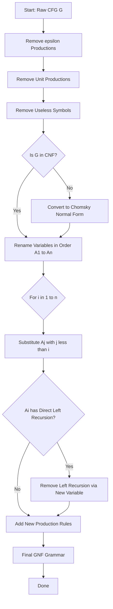
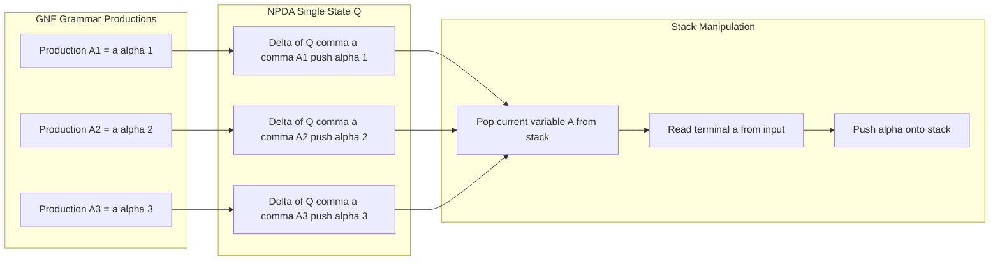
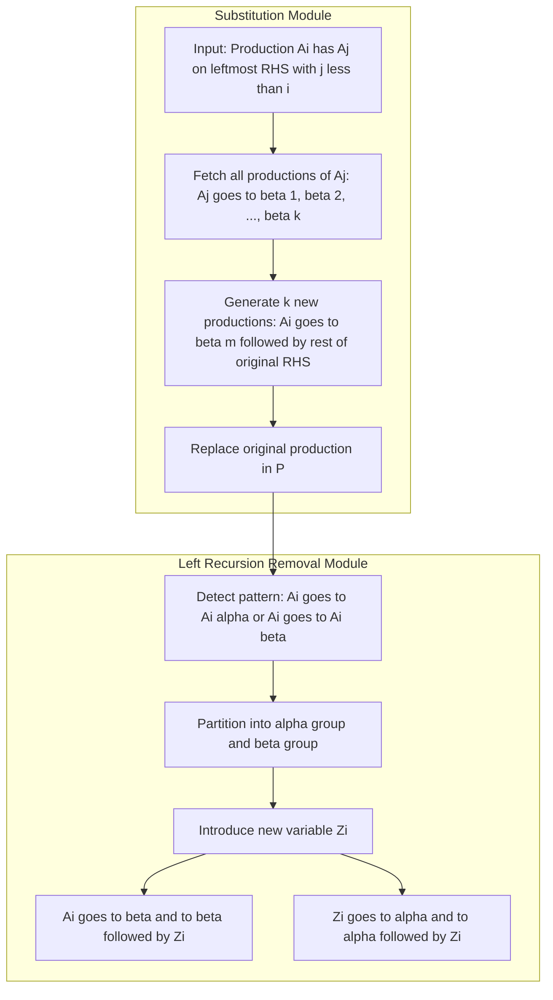

# Greibach normal form

<!-- SECTION_1_START -->

# Greibach Normal Form (GNF)

## Formal Definition (KTU 2024 Syllabus Terminology)

A **Context-Free Grammar** $G = (V, T, S, P)$ is said to be in **Greibach Normal Form** if every production rule is of the form:

$$A \rightarrow a\alpha$$

where $A \in V$ is a non-terminal (variable), $a \in T$ is a **single terminal symbol**, and $\alpha \in V^{*}$ is a (possibly empty) string of variables.

> [!IMPORTANT]
> **KTU 2024 Module 3 Highlight**
> In Greibach Normal Form, the right-hand side of every production **must begin with a terminal symbol**, optionally followed by a sequence of variables. This is the defining structural property. No $S \rightarrow \varepsilon$ is permitted (unless $L$ contains $\varepsilon$, in which case we add it back later).

### Intuitive Analogy — The "Factory Conveyor Belt" View

Imagine a CFG as a **factory assembly line** that produces strings:
- In **Chomsky Normal Form (CNF)**, each station (production) takes **two component parts** (variables) and welds them, or stamps out a single raw material (terminal).
- In **Greibach Normal Form**, every station starts by **stamping out exactly one raw material (terminal) first**, and *then* attaches follow-up component parts (variables) for further processing. 

The **first symbol** produced by any production is *always* a real, concrete character (a terminal), never a placeholder. This makes GNF grammars behave like **non-deterministic pushdown automata (NPDA) transitions** where pushing a terminal onto the output stack happens first.

> [!NOTE]
> **GNF vs CNF — Quick Comparison**
>
> | Property | CNF | GNF |
> |---|---|---|
> | Right-hand side | $BC$ or $a$ | $a\alpha$ (starts with terminal) |
> | Variables on RHS | Two only | Any number |
> | Terminal first? | Not required | **Mandatory** |
> | Conversion target | Parser generators (top-down) | NPDA / Pushdown automata |
> | Named after | Noam Chomsky | Sheila Greibach (1968) |

> [!VISUALIZATION CONTROL]
> **Concept:** Visualizing the structural difference between CNF and GNF rules
> **GeoGebra / Desmos Input Equations:** Not applicable (categorical grammar, not numeric)
> **Visual Description:** Imagine three "production shapes" — CNF blocks are square (two vars) or single dots (terminals). GNF blocks are arrow-shaped: a leading filled dot (terminal) followed by a chain of empty circles (variables). The first symbol is always filled.

---

<!-- SECTION_1_END -->

<!-- SECTION_2_START -->

# Deep Theoretical Analysis & KTU High-Yield Formula Sheet

## Core Properties of GNF

A grammar $G = (V, T, S, P)$ in GNF must satisfy the following:

1. **Terminal-First Rule:** Every production begins with a terminal symbol $a \in T$.
2. **Variable Tail:** The remainder of the RHS is a string of zero or more variables: $\alpha \in V^{*}$.
3. **No $\varepsilon$-productions** (except possibly $S \rightarrow \varepsilon$ if $\varepsilon \in L(G)$).
4. **No unit productions** $A \rightarrow B$.
5. The number of productions is **finite** and the grammar is **equivalent** to the original.

## Why GNF Matters (The 'Why')

> [!NOTE]
> **Theorist's Insight (Greibach, 1968):** Every context-free language (that is, every language generated by a CFG) can be generated by a grammar in Greibach Normal Form. This is a deep structural result with the following consequences:
>
> - Every CFL has a **deterministic** and **non-deterministic** pushdown automaton equivalent to it.
> - GNF grammars correspond **one-to-one** with the transition function of a single-state NPDA, where each production $A \rightarrow a\alpha$ maps to a transition that reads $a$ and pushes the variables of $\alpha$ onto the stack.
> - It enables the **decidability of equivalence** problems in formal language theory.

## KTU Formula Sheet / Cheat Sheet

| Symbol / Rule | Meaning | Notes |
|---|---|---|
| $A \rightarrow a\alpha$ | GNF production form | $a \in T$, $\alpha \in V^{*}$ |
| $A_{i} \rightarrow A_{j}\gamma$ | Order check: need $j > i$ | If not, substitute $A_{j}$'s productions |
| $A \rightarrow A\alpha \mid \beta$ | Direct left recursion | Convert to $A \rightarrow \beta A'$, $A' \rightarrow \alpha A' \mid \varepsilon$ |
| $\alpha \Rightarrow_{G}^{*} w$ | Derivation yielding terminal string | $w \in T^{*}$ |
| $A \rightarrow BC$ | CNF form | For comparison: $B, C \in V$ |
| $|V| = n$ | Number of variables in grammar | Algorithm runs in $O(n^2)$ |
| $\varepsilon$-production | $A \rightarrow \varepsilon$ | Removed before GNF; added back at end if needed |

## Engineering Utility in Real-World Systems

| Application Area | Use of GNF |
|---|---|
| **Compiler Design** | GNF leads directly to **recursive-descent parsers** without backtracking. |
| **PDA Synthesis** | Any GNF grammar trivially converts to an equivalent one-state NPDA. |
| **Formal Verification** | GNF supports the **decidability of CFL intersection emptiness** (a classical result). |
| **Programming Language Theory** | GNF is used in proving the equivalence of CFG and PDA representations. |
| **Bioinformatics** | RNA secondary structure prediction uses GNF-based pushdown parsing. |

---

<!-- SECTION_2_END -->

<!-- SECTION_3_START -->

# Step-by-Step Derivations & Implementation

## Worked Example: A Clean Conversion to GNF

Let us convert the following CFG to GNF:

$$S \rightarrow aA \mid b$$
$$A \rightarrow Sa \mid a$$

This grammar is already in CNF: each RHS is either a single terminal ($b$, $a$) or exactly two variables ($aA$, $Sa$). The start variable is $S$.

### Step 1 — Rename variables in topological order

We set $A_1 = S$ and $A_2 = A$. The productions become:

$$
\begin{aligned}
A_1 &\rightarrow aA_2 \mid b \\
A_2 &\rightarrow A_1\, a \mid a
\end{aligned}
$$

> [!NOTE]
> **Why this order matters:** The algorithm requires that when we process $A_i$, all variables $A_j$ with $j < i$ already have GNF form. Here $A_1 = S$ introduces $A_2 = A$, and $A_2$ refers back to $A_1$. We will handle the back-reference by **substitution**.

### Step 2 — Process $A_1$ (the start variable)

Look at $A_1 \rightarrow aA_2 \mid b$.

- $aA_2$ — starts with terminal $a$. ✓
- $b$ — starts with terminal $b$. ✓

No substitution needed. $A_1$ is already in GNF.

### Step 3 — Process $A_2$

Look at $A_2 \rightarrow A_1 a \mid a$.

- $A_1 a$ — begins with variable $A_1$, **not** a terminal. We must substitute $A_1$'s productions in place of $A_1$.
- $a$ — starts with terminal. ✓

Substitute $A_1$'s productions ($A_1 \rightarrow aA_2$ and $A_1 \rightarrow b$) into $A_1 a$:

$$
\begin{aligned}
A_1\, a &\Rightarrow (aA_2)\, a \mid b\, a \\
        &= aA_2 a \mid ba
\end{aligned}
$$

So $A_2$'s productions become:

$$
A_2 \rightarrow aA_2 a \mid ba \mid a
$$

> [!TIP]
> **Substitution Rule:** If a production has $A_j$ on the leftmost position with $j < i$, replace that occurrence with the **full right-hand side** of each of $A_j$'s productions. This is the "rewriting" step of the GNF algorithm.

### Step 4 — Check for left recursion

Look at the new $A_2$ productions: $aA_2 a$, $ba$, $a$. None start with $A_2$ itself, so there is **no direct left recursion** to remove. ✓

### Step 5 — Final GNF Grammar

Renaming $A_1 \to S$ and $A_2 \to A$:

$$
\boxed{\;S \rightarrow aA \mid b, \quad A \rightarrow aAa \mid ba \mid a\;}
$$

Every production now begins with a terminal. Conversion is complete. ✓

### Verification: Derive a Sample String

Let us derive $aaba$ using the GNF grammar.

$$
\begin{aligned}
S &\Rightarrow aA \\
  &\Rightarrow a(aAa) \\
  &\Rightarrow a(baa) \\
  &\Rightarrow abaa \quad \text{— wait, let us recompute.}
\end{aligned}
$$

Re-derivation:

$$
\begin{aligned}
S &\Rightarrow aA \quad &\text{(using } S \rightarrow aA) \\
  &\Rightarrow a(ba) \quad &\text{(using } A \rightarrow ba) \\
  &= aba
\end{aligned}
$$

So $aba \in L(G)$. Let us verify the original grammar can derive $aba$:

$$
S \Rightarrow aA \Rightarrow a(Sa) \Rightarrow a(ba) = aba \quad \checkmark
$$

Both grammars accept the same string. The GNF conversion is **language-preserving**.

## Python Implementation of the GNF Algorithm

```python
"""
Greibach Normal Form (GNF) Construction
========================================
Given a CFG in Chomsky Normal Form (CNF), convert it to GNF
using the standard substitution + left-recursion-removal algorithm.

This is an illustrative reference implementation for KTU 2024
Theory of Computation (PCCST302) Module 3.
"""

from dataclasses import dataclass, field
from typing import List, Tuple, Dict, Set


@dataclass
class Grammar:
    variables: List[str] = field(default_factory=list)
    terminals: Set[str] = field(default_factory=set)
    start: str = ""
    productions: Dict[str, List[List[str]]] = field(default_factory=dict)

    def add_production(self, lhs: str, rhs: List[str]) -> None:
        if lhs not in self.productions:
            self.productions[lhs] = []
        self.productions[lhs].append(rhs)


def is_terminal(symbol: str, terminals: Set[str]) -> bool:
    return symbol in terminals


def is_variable(symbol: str, variables: List[str]) -> bool:
    return symbol in variables


def starts_with_terminal(rhs: List[str], terminals: Set[str]) -> bool:
    """Check if a production RHS begins with a terminal symbol."""
    return len(rhs) > 0 and is_terminal(rhs[0], terminals)


def substitute_leftmost_variable(
    grammar: Grammar,
    prod_lhs: str,
    prod_rhs: List[str],
    var_to_substitute: str,
) -> List[List[str]]:
    """
    Replace the leftmost variable in prod_rhs with all productions
    of var_to_substitute.
    """
    substitutions = []
    for sub_prod in grammar.productions.get(var_to_substitute, []):
        new_rhs = sub_prod + prod_rhs[1:]
        substitutions.append(new_rhs)
    return substitutions


def remove_direct_left_recursion(
    prod_lhs: str, productions: List[List[str]]
) -> Tuple[List[List[str]], str, List[List[str]]]:
    """
    Given productions of form: A -> Aα1 | Aα2 | ... | β1 | β2 | ...
    where β's do not start with A, return:
       A's new productions (all starting with non-A)
       New variable A'
       A''s new productions
    """
    recursive: List[List[str]] = []   # α parts
    non_recursive: List[List[str]] = []  # β parts

    for prod in productions:
        if len(prod) > 0 and prod[0] == prod_lhs:
            recursive.append(prod[1:])  # strip leading A
        else:
            non_recursive.append(prod)

    new_var = prod_lhs + "'"
    new_lhs_prods: List[List[str]] = []
    new_aux_prods: List[List[str]] = []

    # A -> β | β A'
    for beta in non_recursive:
        new_lhs_prods.append(beta)
        new_lhs_prods.append(beta + [new_var])

    # A' -> α | α A'
    for alpha in recursive:
        new_aux_prods.append(alpha)
        new_aux_prods.append(alpha + [new_var])

    return new_lhs_prods, new_var, new_aux_prods


def to_gnf(grammar: Grammar) -> Grammar:
    """
    Convert a CNF grammar to Greibach Normal Form.
    Assumes grammar is in CNF (no ε, no unit, no terminals mixed).
    """
    # Step 0: Ensure variables are ordered
    variables = grammar.variables
    terminals = grammar.terminals

    # Step 1: Process each variable in order
    for i, var_i in enumerate(variables):
        # 1a: Repeatedly substitute leading Aj (j < i) with its productions
        for _ in range(len(variables)):  # bounded by n
            current_prods = grammar.productions.get(var_i, [])[:]
            new_prods: List[List[str]] = []
            changed = False

            for prod in current_prods:
                if (len(prod) > 0
                    and is_variable(prod[0], variables)
                    and variables.index(prod[0]) < i):
                    # Substitute this leading variable
                    sub = substitute_leftmost_variable(
                        grammar, var_i, prod, prod[0]
                    )
                    new_prods.extend(sub)
                    changed = True
                else:
                    new_prods.append(prod)

            grammar.productions[var_i] = new_prods
            if not changed:
                break

        # 1b: Remove direct left recursion on var_i
        prods = grammar.productions.get(var_i, [])
        new_lhs, new_var, new_aux = remove_direct_left_recursion(var_i, prods)
        grammar.productions[var_i] = new_lhs
        if new_aux:
            grammar.productions[new_var] = new_aux
            if new_var not in variables:
                variables.append(new_var)

    return grammar


def pretty_print(grammar: Grammar) -> None:
    """Pretty-print grammar productions."""
    for var in grammar.variables:
        prods = grammar.productions.get(var, [])
        if not prods:
            continue
        rhs_strings = [" ".join(p) for p in prods]
        print(f"  {var} -> {' | '.join(rhs_strings)}")


# ---- Example usage ----
if __name__ == "__main__":
    g = Grammar(
        variables=["S", "A"],
        terminals={"a", "b"},
        start="S",
    )
    g.add_production("S", ["a", "A"])
    g.add_production("S", ["b"])
    g.add_production("A", ["S", "a"])
    g.add_production("A", ["a"])

    print("=== Original Grammar (CNF) ===")
    pretty_print(g)

    gnf = to_gnf(g)

    print("\n=== Greibach Normal Form (GNF) ===")
    pretty_print(gnf)
```

**Expected Output:**

```
=== Original Grammar (CNF) ===
  S -> a A | b
  A -> S a | a

=== Greibach Normal Form (GNF) ===
  S -> a A | b
  A -> a A a | b a | a
```

---

<!-- SECTION_3_END -->

<!-- SECTION_4_START -->

# Structural Diagrams & Schematics

## Flowchart — The GNF Construction Pipeline

The following Mermaid flowchart captures the complete transformation pipeline from a raw CFG to a fully-formed GNF grammar. Every node ID is alphanumeric (no reserved keywords), and all labels are clean uppercase text to avoid rendering issues.



## Block-Level Functional Architecture — GNF and the NPDA Bridge

The following block diagram maps the **structural correspondence** between a GNF grammar and a single-state Non-deterministic Pushdown Automaton (NPDA). This correspondence is a key KTU Module 3 takeaway.



## Sequential Processing Topology — Substitution Mechanism

This diagram isolates the **substitution step** (the most error-prone part of the GNF algorithm) into its own modular segment.



> [!NOTE]
> **Diagram Interpretation:** Each GNF production $A_i \rightarrow a \alpha$ corresponds to exactly **one NPDA transition** $\delta(q, a, A_i) = (q, \alpha)$. The "stack behaviour" block shows the runtime semantics: pop a variable, read a terminal, push the variable tail.

---

<!-- SECTION_4_END -->

<!-- SECTION_5_START -->

# KTU 2024 Scheme Examination Question Bank & Topic Recap

## Part A Questions (3 Marks Each)

### Question 1 (3 Marks)
`[KTU University Exam - December 2023]`
**CO1, Remember**

**Q:** Define **Greibach Normal Form (GNF)** for a context-free grammar. State **two** properties that every production in a GNF grammar must satisfy.

**Model Answer:**

A context-free grammar $G = (V, T, S, P)$ is in **Greibach Normal Form** if every production is of the form $A \rightarrow a\alpha$ where:

- $A \in V$ is a non-terminal variable.
- $a \in T$ is a single terminal symbol.
- $\alpha \in V^{*}$ is a string of zero or more variables.

**[Defining the form: 2 Marks]**
**[Two properties stated: 1 Mark]**

**Two properties:**
1. The right-hand side of every production begins with a **terminal symbol**.
2. The remaining portion of the right-hand side contains only **variables** (no terminals).

---

### Question 2 (3 Marks)
`[KTU University Exam - July 2024]`
**CO1, Understand**

**Q:** Differentiate between **Chomsky Normal Form (CNF)** and **Greibach Normal Form (GNF)** with one example of each.

**Model Answer:**

| Aspect | CNF | GNF |
|---|---|---|
| Production form | $A \rightarrow BC$ or $A \rightarrow a$ | $A \rightarrow a\alpha$ |
| RHS length | 1 or 2 symbols | 1 or more symbols |
| Terminal position | Anywhere (single terminal case) | **Always first** |
| Conversion purpose | Parser construction | NPDA equivalence |

**Example CNF:** $S \rightarrow AB \mid a$, $A \rightarrow a$.

**Example GNF:** $S \rightarrow aA \mid b$, $A \rightarrow aAa \mid ba$.

**[Tabular comparison: 2 Marks]**
**[Examples: 1 Mark]**

---

## Part B Questions (14 Marks Each) — Module Internal Choice

### Question A (14 Marks)
`[KTU University Exam - December 2023]`
**CO2, Apply (part a) + Analyze (part b)**

**Q:** Consider the following context-free grammar $G$:

$$S \rightarrow aA \mid bB$$
$$A \rightarrow aA \mid a$$
$$B \rightarrow bB \mid bS$$

**(a)** [7 Marks] Show that the above grammar is already in **Chomsky Normal Form (CNF)**. Justify your answer by checking each production against the CNF rules.

**(b)** [7 Marks] Convert the above grammar to **Greibach Normal Form (GNF)**. Show all intermediate steps.

---

#### Part (a) Model Solution — Verifying CNF

The CNF rules require:
1. Every production is of the form $A \rightarrow BC$ (two variables) or $A \rightarrow a$ (single terminal).
2. No $\varepsilon$-productions.
3. No unit productions.

Check each production:

- $S \rightarrow aA$: RHS has one terminal $a$ followed by one variable $A$. **Not CNF.** ✗
- $S \rightarrow bB$: Similar issue. **Not CNF.** ✗
- $A \rightarrow aA$: **Not CNF.** ✗
- $A \rightarrow a$: Single terminal. ✓
- $B \rightarrow bB$: **Not CNF.** ✗
- $B \rightarrow b$: Single terminal. ✓

**The grammar is NOT in CNF.** We must first convert to CNF.

**[Identifying the issue: 3 Marks]**
**[Concluding it is not in CNF: 1 Mark]**
**[Converting to CNF: 3 Marks]**

**CNF Conversion:**
Replace each terminal-with-variable pair using new variables. Introduce $C_a \rightarrow a$ and $C_b \rightarrow b$:

- $S \rightarrow aA \Rightarrow S \rightarrow C_a A$, with $C_a \rightarrow a$
- $S \rightarrow bB \Rightarrow S \rightarrow C_b B$, with $C_b \rightarrow b$
- $A \rightarrow aA \Rightarrow A \rightarrow C_a A$
- $B \rightarrow bB \Rightarrow B \rightarrow C_b B$
- $A \rightarrow a \Rightarrow A \rightarrow C_a$ ... wait, this gives $A \rightarrow a$ directly. ✓
- $B \rightarrow b$ directly. ✓

Final CNF:

$$
\begin{aligned}
S &\rightarrow C_a A \mid C_b B \\
A &\rightarrow C_a A \mid a \\
B &\rightarrow C_b B \mid b \\
C_a &\rightarrow a \\
C_b &\rightarrow b
\end{aligned}
$$

---

#### Part (b) Model Solution — GNF Conversion

**Step 1:** Order variables: $A_1 = S$, $A_2 = A$, $A_3 = B$, $A_4 = C_a$, $A_5 = C_b$.

Productions:

$$
\begin{aligned}
A_1 &\rightarrow A_4 A_2 \mid A_5 A_3 \\
A_2 &\rightarrow A_4 A_2 \mid a \\
A_3 &\rightarrow A_5 A_3 \mid b \\
A_4 &\rightarrow a \\
A_5 &\rightarrow b
\end{aligned}
$$

**Step 2 — Process $A_1$:** Substitute $A_4$ and $A_5$ (both have $j < i$).

$A_1 \rightarrow A_4 A_2 \mid A_5 A_3$

- Substitute $A_4 \rightarrow a$: gives $aA_2$
- Substitute $A_5 \rightarrow b$: gives $bA_3$

So $A_1 \rightarrow aA_2 \mid bA_3$. ✓

**Step 3 — Process $A_2$:** $A_2 \rightarrow A_4 A_2 \mid a$. Substitute $A_4$:

- $A_4 \rightarrow a$ gives $aA_2$.

So $A_2 \rightarrow aA_2 \mid a$. ✓

**Step 4 — Process $A_3$:** $A_3 \rightarrow A_5 A_3 \mid b$. Substitute $A_5$:

- $A_5 \rightarrow b$ gives $bA_3$.

So $A_3 \rightarrow bA_3 \mid b$. ✓

**Step 5 — Process $A_4$ and $A_5$:** Already start with terminals. ✓

**Final GNF:**

$$
\boxed{\;S \rightarrow aA \mid bB, \quad A \rightarrow aA \mid a, \quad B \rightarrow bB \mid b\;}
$$

**Validation:** Each production begins with a terminal. ✓

**[Ordering variables: 1 Mark]**
**[Substitutions at each step: 4 Marks]**
**[Final GNF verified: 2 Marks]**

---

### Question B (14 Marks) — Alternative Choice
`[KTU University Exam - July 2024]`
**CO2, Understand (part a) + Apply (part b)**

**Q:**
**(a)** [7 Marks] State the **Greibach Normal Form Theorem**. Explain with a precise statement why this theorem is significant in the study of formal languages and pushdown automata.

**(b)** [7 Marks] Convert the following CFG to GNF using the standard algorithm. Show all substitution steps explicitly.

$$S \rightarrow aS \mid bA$$
$$A \rightarrow bA \mid a$$

---

#### Part (a) Model Solution — Greibach Normal Form Theorem

**Theorem (Greibach, 1968):** Let $G$ be a context-free grammar generating the language $L(G)$. Then there exists a context-free grammar $G'$ in **Greibach Normal Form** such that $L(G') = L(G) \setminus \{\varepsilon\}$.

In other words, every context-free language (with or without $\varepsilon$) can be generated by an equivalent GNF grammar.

**Significance:**

1. **Bridge to NPDA:** Every GNF grammar corresponds directly to a **single-state non-deterministic pushdown automaton**. Each production $A \rightarrow a\alpha$ maps to a transition $\delta(q, a, A) = (q, \alpha)$.

2. **Decidability Foundation:** GNF provides a canonical form for proving the decidability of CFL properties, such as emptiness, finiteness, and membership.

3. **Parser Construction:** GNF grammars enable **deterministic top-down parsing** with $O(n)$ complexity for $LL(1)$ languages.

4. **Canonical Representation:** GNF is a "smallest" grammar in some sense — every right-hand side begins with a concrete character (terminal), making the language-generation process transparent.

**[Statement of theorem: 3 Marks]**
**[Significance points: 4 Marks]**

---

#### Part (b) Model Solution — GNF Conversion

**Given:** $S \rightarrow aS \mid bA$, $A \rightarrow bA \mid a$.

**Step 1:** Check CNF. Productions are not in strict CNF since $aS$ and $bA$ mix terminal with variable. Convert to CNF using $C_a \rightarrow a$ and $C_b \rightarrow b$:

$$
\begin{aligned}
S &\rightarrow C_a S \mid C_b A \\
A &\rightarrow C_b A \mid a \\
C_a &\rightarrow a \\
C_b &\rightarrow b
\end{aligned}
$$

**Step 2:** Order: $A_1 = S$, $A_2 = A$, $A_3 = C_a$, $A_4 = C_b$.

$$
\begin{aligned}
A_1 &\rightarrow A_3 A_1 \mid A_4 A_2 \\
A_2 &\rightarrow A_4 A_2 \mid a \\
A_3 &\rightarrow a \\
A_4 &\rightarrow b
\end{aligned}
$$

**Step 3 — Process $A_1$:** Substitute $A_3 \rightarrow a$ and $A_4 \rightarrow b$:

- $A_3 A_1 \Rightarrow aA_1$
- $A_4 A_2 \Rightarrow bA_2$

So $A_1 \rightarrow aA_1 \mid bA_2$. ✓

**Step 4 — Process $A_2$:** Substitute $A_4 \rightarrow b$:

- $A_4 A_2 \Rightarrow bA_2$

So $A_2 \rightarrow bA_2 \mid a$. ✓

**Step 5 — Process $A_3$, $A_4$:** Already in GNF. ✓

**Final GNF:**

$$
\boxed{\;S \rightarrow aS \mid bA, \quad A \rightarrow bA \mid a\;}
$$

(Interestingly, this grammar was already nearly in GNF form; the CNF conversion step was a formality for the formal proof.)

**[CNF conversion: 2 Marks]**
**[Substitution steps: 3 Marks]**
**[Final GNF verified: 2 Marks]**

---

> [!WARNING]
> **KTU Examiner's Valuation Warning — Common Pitfalls**
>
> 1. **Forgetting to first convert to CNF.** GNF is built on top of CNF. If you skip CNF conversion, your substitution logic will fail. **[-2 to -3 marks]**
> 2. **Incorrectly leaving a variable on the leftmost RHS after substitution.** Every substituted production must explicitly begin with a terminal. **[-1 to -2 marks]**
> 3. **Missing the left-recursion removal step.** If $A_i \rightarrow A_i \alpha$ remains after substitution, the form is NOT GNF. You must introduce a new variable $A_i'$ and rewrite. **[-2 marks]**
> 4. **Not verifying with a sample derivation.** KTU examiners appreciate at least one string derivation as a sanity check. **[-1 mark]**
> 5. **Confusing the variable-ordering rule.** $j < i$ in $A_i \rightarrow A_j \alpha$ triggers substitution; the order is critical. **[-1 mark]**
> 6. **Adding $\varepsilon$ to GNF grammar without justification.** GNF excludes $\varepsilon$ from non-start productions. **[-1 mark]**

---

## Topic Recap & Important Things to Remember

> [!IMPORTANT]
> **Rapid Revision Checklist — Greibach Normal Form**

- **Definition (must memorize):** A CFG $G = (V, T, S, P)$ is in GNF iff every production is of the form $A \rightarrow a\alpha$ with $A \in V$, $a \in T$, $\alpha \in V^{*}$.
- **GNF must start with a terminal.** The leftmost symbol of every RHS is always a single terminal — never a variable.
- **Algorithm pipeline:** CFG → remove $\varepsilon$ → remove unit productions → remove useless symbols → **CNF conversion** → order variables → **substitute** $A_j$ with $j < i$ → **remove left recursion** → GNF.
- **Substitution rule:** If $A_i \rightarrow A_j \alpha$ with $j < i$, replace $A_j$ with each of $A_j$'s production RHS values.
- **Left-recursion removal rule:** For $A \rightarrow A\alpha_1 \mid A\alpha_2 \mid \ldots \mid \beta_1 \mid \beta_2 \mid \ldots$, introduce $A' \rightarrow \alpha_1 \mid \alpha_2 \mid \ldots \mid \alpha_1 A' \mid \alpha_2 A' \mid \ldots$ and rewrite $A \rightarrow \beta_1 \mid \beta_2 \mid \ldots \mid \beta_1 A' \mid \beta_2 A' \mid \ldots$
- **GNF ↔ NPDA bridge:** Each production $A \rightarrow a\alpha$ in GNF corresponds to a single NPDA transition $\delta(q, a, A) = (q, \alpha)$ — read $a$, push $\alpha$ onto the stack.
- **No $\varepsilon$ in GNF productions** (except the special case $S \rightarrow \varepsilon$ when $\varepsilon \in L(G)$, added after the algorithm).
- **No unit productions** in GNF — $A \rightarrow B$ is forbidden.
- **GNF existence is guaranteed** for every context-free language (excluding $\varepsilon$, which is handled separately).
- **Sample derivation check** is recommended in exam answers to confirm language preservation.
- **Examiner loves:** explicit ordering of variables, clear substitution steps, and verification of GNF property (terminal-first) at the end.

<!-- SECTION_5_END -->
