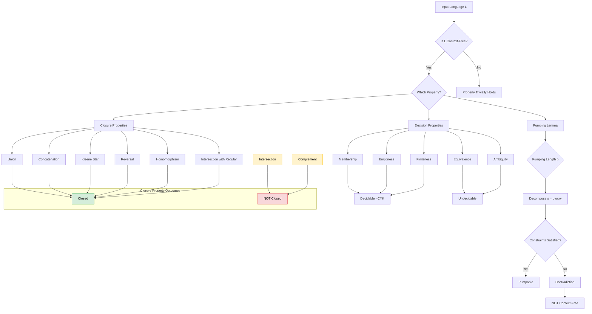
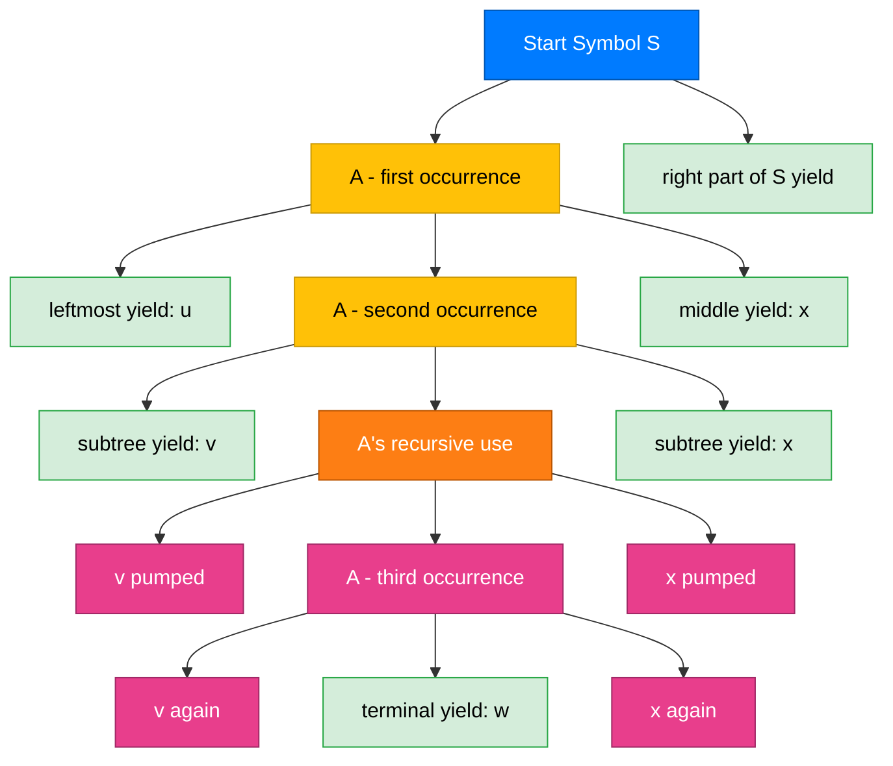
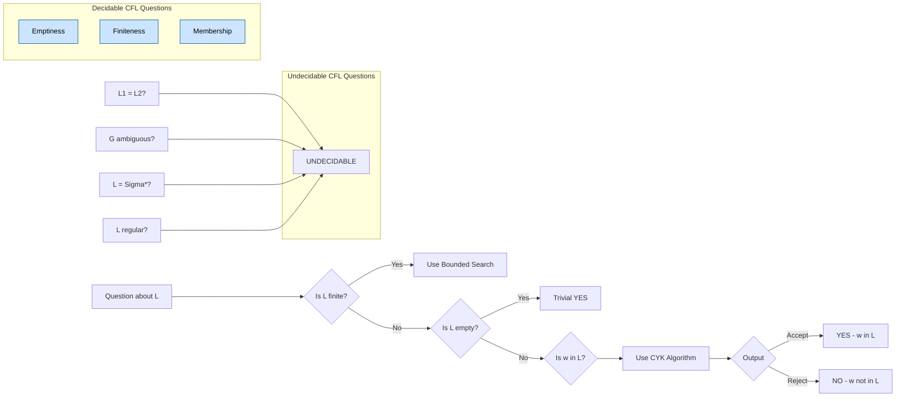
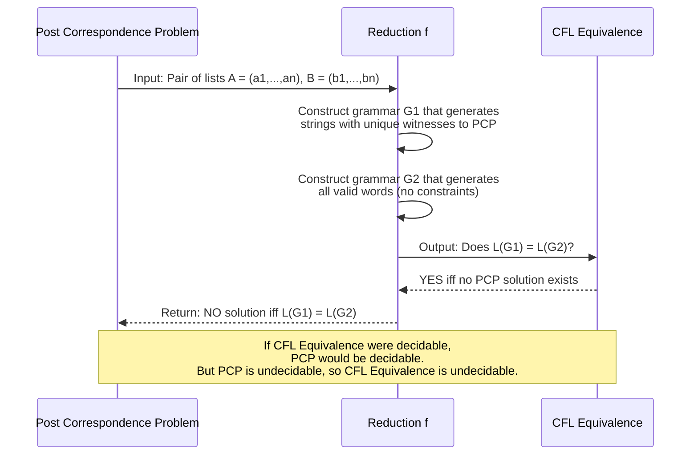
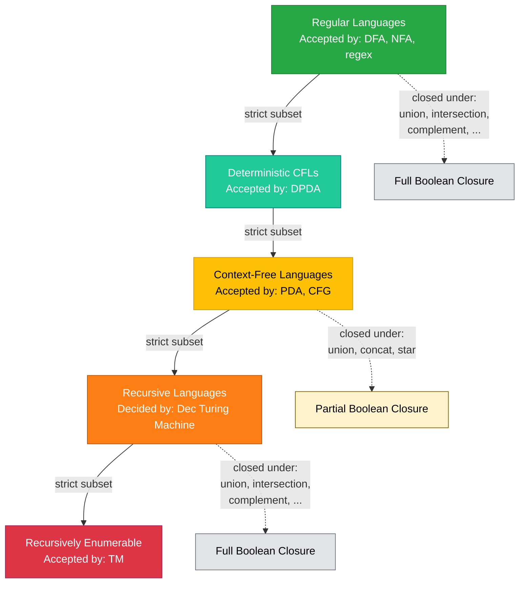

# Properties of Context-Free Languages (Linz)

<!-- SECTION_1_START -->

# Properties of Context-Free Languages

## 1. Core Technical Definition & Intuitive Overview

> [!IMPORTANT]
> **Context-Free Languages (CFLs):** A language $L$ is *context-free* if there exists a context-free grammar $G = (V, T, S, P)$ such that $L = L(G)$. Equivalently, $L$ is accepted by some pushdown automaton $M = (Q, \Sigma, \Gamma, \delta, q_0, Z_0, F)$.

> [!IMPORTANT]
> **Properties of CFLs** are the formal characterizations that tell us **what operations preserve the class of CFLs** (closure properties), **how to prove a language is NOT context-free** (pumping lemma for CFLs), and **what questions we can mechanically decide** about CFLs (decision properties).

### 1.1 Conceptual Analogy / Intuition

Imagine context-free languages as **structured buildings with a single load-bearing pillar** (a single nonterminal like $S$ that can be expanded recursively). This single root nonterminal can spawn sub-buildings (other nonterminals) which in turn can spawn their own sub-buildings, but the rule for building is *context-free* — meaning, the replacement of one block does not depend on the surrounding context.

> [!NOTE]
> **Key Insight:** CFLs sit in a precise spot in the **Chomsky Hierarchy**:
>
> $$\text{Regular} \subsetneq \text{Deterministic CFL} \subsetneq \text{CFL} \subsetneq \text{Recursive} \subsetneq \text{Recursively Enumerable}$$
>
> CFLs are **strictly more powerful** than regular languages but **strictly less powerful** than Turing-recognizable languages.

**Geometric Intuition for Pumping:** Picture a parse tree as an inverted Christmas tree. In a CFL, the tree can be very tall, but it has a **finite "vocabulary" of nonterminals**. By the **Pigeonhole Principle**, if the tree is tall enough, some nonterminal must appear on multiple levels. We can "pump" the subtree at the lower occurrence to grow the tree taller without changing the overall structural pattern — this is the heart of the CFL pumping lemma.

### 1.2 The Three Pillars of CFL Properties

| Pillar | Question It Answers | Main Result |
|:------:|:--------------------|:------------|
| **Closure Properties** | What operations keep us inside the CFL class? | Union, Concatenation, Kleene Star, Reversal, Substitution, Homomorphism are closed. Intersection and Complement are NOT closed. |
| **Pumping Lemma** | How do we prove a language is NOT context-free? | Every CFL $L$ has a pumping length $p$ such that strings of length $\geq p$ can be decomposed as $uvwxy$ with $|vwx| \leq p$ and $|vx| \geq 1$, where $uv^iwx^iy \in L$ for all $i \geq 0$. |
| **Decision Properties** | What can we compute about CFLs algorithmically? | Membership, Emptiness, Finiteness are **decidable**. Equivalence, Ambiguity, Regularity are **undecidable**. |

### 1.3 Standard Notation Used in CFL Properties

> [!IMPORTANT]
> **Critical Symbols and Their Meanings:**
>
> - $G$ — Context-free grammar (CFG)
> - $M$ — Pushdown automaton (PDA)
> - $L(G)$ — Language generated by $G$
> - $L(M)$ — Language accepted by $M$
> - $p$ — Pumping length for CFLs
> - $uvwxy$ — The five-tuple decomposition of a string
> - $V$ — Set of nonterminals (variables)
> - $T$ — Set of terminals
> - $Z_0$ — Initial stack symbol of a PDA

### 1.4 Position in KTU 2024 Syllabus

> [!NOTE]
> **KTU 2024 Scheme Context:** Module 3 of PCCST302 (Theory of Computation) covers Pushdown Automata and CFL Properties. The properties of CFLs are essential for the End Semester Examination (ESE) and are tested through problems involving:
>
> 1. Proving languages are NOT context-free using the pumping lemma
> 2. Demonstrating closure/non-closure under operations
> 3. Determining decidability of various CFL questions
> 4. Establishing the equivalence between PDA and CFG

> [!VISUALIZATION CONTROL]
> **Concept:** Geometric picture of CFL pumping on a parse tree.
> **GeoGebra / Desmos Input Equations:**
> * Circle $A$ (root nonterminal) at $(0, 4)$
> * Circles $B_1, B_2, B_3$ at $(-2, 2), (0, 2), (2, 2)$ (children)
> * Circle $B_2$ repeated at $(0, 0)$ and $(0, -2)$ (recursive nesting)
> **Visual Description:** A binary tree where a nonterminal $A$ recurses downward; the subtree $v$ (one child) and $x$ (another child) can be repeated to produce strings $uv^iwx^iy$.

---

<!-- SECTION_1_END -->

<!-- SECTION_2_START -->

# 2. Deep Theoretical Analysis & KTU High-Yield Formula Sheet

## 2.1 The Pumping Lemma for Context-Free Languages (Linz Theorem 7.14)

> [!IMPORTANT]
> **Theorem (Pumping Lemma for CFLs):** Let $L$ be an infinite context-free language. Then there exists a constant $p$ (the *pumping length*) such that any string $s \in L$ with $|s| \geq p$ can be decomposed as $s = uvwxy$ satisfying the three conditions:
>
> 1. $|vwx| \leq p$
> 2. $|vx| \geq 1$
> 3. For every integer $i \geq 0$, the string $u v^i w x^i y \in L$

### 2.2 Proof Structure (Linz's Approach)

The proof works by exploiting the finiteness of nonterminals in any CFG.

**Step 1 — Bounding the Derivation Tree:**
For a CFG $G$ in **Chomsky Normal Form (CNF)** with $k$ nonterminals, any derivation tree for a string of length $|s| \geq 2^k$ must have a path of length at least $k+1$ (since the longest path in a binary tree of size $n$ is $\geq \log_2 n$).

**Step 2 — Pigeonhole Application:**
With $k$ nonterminals, a path of length $k+1$ has $k+2$ nodes but only $k$ distinct nonterminals. By the **Pigeonhole Principle**, some nonterminal $A$ must repeat on the path. Let the upper $A$ be at depth $d$ and the lower $A$ at depth $d'$.

**Step 3 — Five-Tuple Decomposition:**

The string $s$ is split based on the yield of the lower subtree $A \Rightarrow^* vAx$ and the upper subtree $A \Rightarrow^* B_1 B_2 \cdots B_n$ which contains the lower $A$. The yield of the upper $A$'s complete subtree is $vwx$, while the part between the two occurrences of $A$ in the upper subtree is $v \cdot (\text{yield of lower } A) \cdot x$, which is $v \cdot vAx \cdot x = v^2 A x^2$.

> [!NOTE]
> **Generalized Pumping:** In the more general version (Linz Theorem 7.18), the decomposition is $s = uv^iwx^iyz$ and the constraints are $vwx$ contains at most $p$ terminals, $vy$ contains at most $p$ terminals, and $|vxy| \geq 1$.

### 2.3 Ogden's Lemma (Stronger Tool)

> [!IMPORTANT]
> **Ogden's Lemma:** Let $L$ be a CFL and let $p$ be a constant such that every string in $L$ of length $\geq p$ has a distinguished position. Then $s$ can be written as $s = uvwxy$ such that:
>
> 1. $vwx$ has at most $p$ distinguished positions
> 2. $vx$ has at least one distinguished position
> 3. For all $i \geq 0$, $u v^i w x^i y \in L$
>
> Ogden's lemma is **stronger** than the standard pumping lemma and can be used to prove certain languages non-context-free that the standard pumping lemma cannot (e.g., $L = \{a^n b^n c^n \mid n \geq 0\}$ in some texts, although the standard pumping lemma also handles this).

### 2.4 Closure Properties of CFLs

> [!IMPORTANT]
> **Closure Results (Linz Theorems 7.4 to 7.10):**
>
> The class of context-free languages is **closed** under:
>
> 1. **Union:** $L_1 \cup L_2$ is a CFL
> 2. **Concatenation:** $L_1 L_2$ is a CFL
> 3. **Kleene Star:** $L_1^*$ is a CFL
> 4. **Reversal:** $L^R$ is a CFL
> 5. **Inverse Homomorphism:** $h^{-1}(L)$ is a CFL if $L$ is a CFL
> 6. **Substitution (by CFLs):** If $\sigma(a)$ is a CFL for each terminal $a$, then $\sigma(L)$ is a CFL
> 7. **Homomorphism:** $h(L)$ is a CFL
> 8. **Intersection with Regular Languages:** $L_1 \cap L_2$ is a CFL if $L_1$ is a CFL and $L_2$ is regular
>
> The class of CFLs is **NOT closed** under:
>
> 1. **Intersection:** $L_1 \cap L_2$ need not be a CFL
> 2. **Complement:** $\overline{L}$ need not be a CFL
> 3. **Difference:** $L_1 - L_2$ need not be a CFL
> 4. **Symmetric Difference**

### 2.5 Decision Properties of CFLs (Linz Section 7.3)

> [!IMPORTANT]
> **Decidable Questions** (Algorithms Exist):
>
> - Is $L(G) = \emptyset$? (Emptiness) — Test if $S$ is *productive*
> - Is $L(G)$ finite? (Finiteness) — Test for *cycles* in the grammar's dependency graph
> - Is $w \in L(G)$ for a given $w$? (Membership) — Use the **CYK Algorithm** (Cocke-Younger-Kasami) in $O(n^3 \vert V \vert^3)$ time, or $O(n)$ using two-stack PDAs for deterministic CFLs
> - Does $L(G)$ contain any string of length $\leq n$ for given $n$? (Boundedness)
>
> **Undecidable Questions** (No Algorithm Exists):
>
> - Is $L(G_1) = L(G_2)$? (Equivalence) — Proved by reduction to the Post Correspondence Problem
> - Is $L(G) = \Sigma^*$? (Universality)
> - Is $G$ ambiguous? (Ambiguity)
> - Is $L(G)$ regular? (Regularity)
> - Is $L(G)$ inherently ambiguous?

### 2.6 KTU Formula Sheet / Cheat Sheet

| Property | Result | Proof Technique | Key Bound |
|:---------|:-------|:----------------|:----------|
| Pumping length existence | $p \leq 2^{k+1}$ where $k = \vert V \vert$ | Pigeonhole on parse tree paths | $\vert vwx \vert \leq p$ |
| Union closure | $L_1 \cup L_2 \in \mathcal{L}_{CF}$ | Add new start symbol $S \to S_1 \mid S_2$ | $\vert V_{new} \vert = \vert V_1 \vert + \vert V_2 \vert + 1$ |
| Concatenation closure | $L_1 L_2 \in \mathcal{L}_{CF}$ | Add new start symbol $S \to S_1 S_2$ | $\vert V_{new} \vert = \vert V_1 \vert + \vert V_2 \vert + 1$ |
| Kleene star closure | $L_1^* \in \mathcal{L}_{CF}$ | Add $S \to S_1 S \mid \varepsilon$ | $\vert V_{new} \vert = \vert V_1 \vert + 1$ |
| Reversal closure | $L^R \in \mathcal{L}_{CF}$ | Reverse all right-hand sides | $\vert V_{new} \vert = \vert V \vert$ |
| Intersection with Regular | $L_1 \cap R \in \mathcal{L}_{CF}$ | Construct product PDA $M_1 \times M_2$ | $\vert Q_{new} \vert = \vert Q_1 \vert \cdot \vert Q_2 \vert$ |
| Membership ($w \in L$?) | **Decidable** | CYK algorithm | $O(\vert w \vert^3)$ |
| Emptiness ($L = \emptyset$?) | **Decidable** | Productive nonterminals algorithm | $O(\vert V \vert + \vert P \vert)$ |
| Finiteness ($L$ finite?) | **Decidable** | Cycle detection on dependency graph | $O(\vert V \vert^2)$ |
| Equivalence ($L_1 = L_2$?) | **Undecidable** | Reduction from PCP | N/A |
| Ambiguity of $G$ | **Undecidable** | Reduction from PCP | N/A |

> [!IMPORTANT]
> **The Master Theorem — Intersection Non-Closure:**
> Let $L_1 = \{a^n b^n c^m \mid n, m \geq 0\}$ and $L_2 = \{a^m b^n c^n \mid n, m \geq 0\}$. Both are CFLs, but
> $$L_1 \cap L_2 = \{a^n b^n c^n \mid n \geq 0\}$$
> which is **NOT** a context-free language.

### 2.7 Real-World Engineering Utility

> [!NOTE]
> **Why CFL Properties Matter in Industry:**
>
> 1. **Compiler Design:** Programming language syntax is defined by CFGs. The fact that membership is decidable (in $O(n^3)$ via CYK) is what makes **parser generators** like YACC, Bison, and ANTLR work.
> 2. **XML/JSON Validation:** Hierarchical data formats are naturally context-free. Pumping lemmas help identify *malformed* grammars in industry specifications.
> 3. **Static Code Analysis:** Determining if a property of a CFG (e.g., emptiness, finiteness) is decidable enables **dead-code detection** in optimizing compilers.
> 4. **Undecidability of Equivalence:** The fact that grammar equivalence is undecidable is a fundamental reason why **incremental compiler design** (modular compilation) is non-trivial — there is no general algorithm to verify that an optimization preserves the language exactly.

---

<!-- SECTION_2_END -->

<!-- SECTION_3_START -->

# 3. Step-by-Step Derivations & Symbolic Implementation

## 3.1 Detailed Proof: Pumping Lemma for CFLs (Linz Theorem 7.14)

**Setup:** Let $L = L(G)$ be an infinite CFL and $G = (V, T, S, P)$ be a CFG in **Chomsky Normal Form (CNF)** with $k = \vert V \vert$ nonterminals.

**Step 1 — Minimum String Length Bound:**

In CNF, every production is either $A \to BC$ or $A \to a$. A derivation tree of height $h$ can produce a string of length at most $2^h$. Therefore, any string of length $\geq 2^{k+1}$ requires a derivation tree of height at least $k+1$.

**Step 2 — Path Length Analysis:**

Consider any derivation tree for a string $s$ with $|s| \geq 2^{k+1}$. The tree has a root-to-leaf path of length $\geq k+1$ (a binary tree with $\geq 2^{k+1}$ leaves has depth $\geq k+1$).

**Step 3 — Pigeonhole Application:**

This path has $k+2$ nodes labeled with nonterminals from $V$, with $\vert V \vert = k$. By the Pigeonhole Principle, some nonterminal $A$ appears at least twice on this path. Pick two occurrences with the property that between them the path has length at most $k+1$.

**Step 4 — Five-Tuple Construction:**

Let the lower occurrence of $A$ be at depth $d$, and let the subtree rooted at this lower $A$ have yield $v A x$ (so $A \Rightarrow^* v A x$ via the production sequence from the upper $A$).

Wait, more precisely: Let the lower $A$'s subtree have yield $v A x$, and let the entire subtree rooted at the upper $A$ have yield $v w x$ where $w$ is the yield of the path between the two $A$'s (excluding $v$ and $x$).

Therefore $s = u \cdot v \cdot w \cdot x \cdot y$ where $u$ is the yield to the left of the upper $A$ in the full tree, and $y$ is the yield to the right.

**Step 5 — Pumpability Verification:**

For any $i \geq 0$, we can construct the string $u v^i w x^i y$ by:
- Replacing the lower $A$ with the yield $v A x$ of its own subtree, $i$ times.
- This produces $A \Rightarrow^* v A x \Rightarrow^* v v A x x \Rightarrow^* \cdots \Rightarrow^* v^i A x^i$.
- Substituting $w$ in place of $A$ in the upper subtree gives the string $u v^i w x^i y \in L$.

**Step 6 — Constraint Verification:**

- $|vx| \geq 1$: Because $A$ is on a productive path and the grammar is in CNF, $v$ and $x$ together must contain at least one terminal. ✓
- $|vwx| \leq p$: Choose $p = 2^{k+1}$. The subtree rooted at the upper $A$ has at most $2^{k+1}$ leaves, so $|vwx| \leq 2^{k+1} = p$. ✓

This completes the proof. $\blacksquare$

## 3.2 Worked Example: Pumping Lemma Application

**Problem:** Show that $L = \{a^n b^n c^n \mid n \geq 0\}$ is **not context-free**.

**Step 1 — Assume for Contradiction:**

Suppose $L$ is a CFL. Then there exists a pumping length $p$ such that any string $s \in L$ with $|s| \geq p$ satisfies the pumping property.

**Step 2 — Choose the String:**

Choose $s = a^p b^p c^p$. Clearly $s \in L$ and $|s| = 3p \geq p$.

**Step 3 — Apply the Pumping Decomposition:**

By the pumping lemma, $s = uvwxy$ with:
- $|vwx| \leq p$
- $|vx| \geq 1$
- $uv^iwx^iy \in L$ for all $i \geq 0$

**Step 4 — Case Analysis on the Position of $vwx$:**

Since $|vwx| \leq p$, the substring $vwx$ can contain symbols from at most **two** of the three symbol groups $\{a^p\}$, $\{b^p\}$, $\{c^p\}$. This gives four cases:

> **Case 1:** $vwx$ lies entirely within $a^p b^p$ (entirely in the $a$'s and $b$'s portion).
> Then $v$ and $x$ consist only of $a$'s and $b$'s. Pumping up ($i=2$) gives $uv^2wx^2y$ which has more $a$'s and $b$'s but the same number of $c$'s. So the count balance $a^n b^n c^n$ is broken. $\Rightarrow$ **Contradiction.**

> **Case 2:** $vwx$ lies entirely within $b^p c^p$.
> By symmetric argument, pumping changes the $b$-$c$ count balance. $\Rightarrow$ **Contradiction.**

> **Case 3:** $vwx$ contains all of $b^p$ and parts of $a$'s and $c$'s.
> Then $v$ and $x$ together contain at most $p$ symbols total. Since $b^p$ is a substring of $vwx$ of length $p$, we have $|vx| \leq p$. But $v$ and $x$ might have some $a$'s and $c$'s. Pumping up gives extra $a$'s or extra $c$'s, breaking the balance. $\Rightarrow$ **Contradiction.**

> **Case 4:** $vwx$ contains parts of $a$'s and $b$'s but not all of $b^p$.
> Then the $c$'s are completely in $y$, and $|vx| \leq p < p + p$. After pumping, the $a$-$b$ balance breaks. $\Rightarrow$ **Contradiction.**

**Step 5 — Conclusion:**

All cases lead to a contradiction. Therefore, our assumption that $L$ is context-free is false. $\blacksquare$

## 3.3 Python Implementation: Decision Algorithms for CFLs

```python
"""
Python implementation of decision algorithms for Context-Free Grammars.
Includes:
  1. CYK Membership Algorithm
  2. Emptiness Test
  3. Finiteness Test (via cycle detection)
"""
from typing import Set, Dict, List, Tuple, FrozenSet


# -----------------------------------------------------------
# Data Structure for Context-Free Grammar
# -----------------------------------------------------------
class CFG:
    """
    Represents a Context-Free Grammar in CNF.
    
    Attributes:
        nonterminals: Set of nonterminal symbols (uppercase strings).
        terminals:    Set of terminal symbols (lowercase strings).
        start:        The start symbol.
        productions:  Dict mapping A -> set of (B, C) or A -> set of 'a'
                      for rules A -> BC (binary) and A -> a (unit).
    """
    
    def __init__(
        self,
        nonterminals: Set[str],
        terminals: Set[str],
        start: str,
        productions: Dict[str, List[Tuple]],
    ) -> None:
        self.nonterminals = nonterminals
        self.terminals = terminals
        self.start = start
        self.productions: Dict[str, List[Tuple]] = productions
        self._validate_cnf()
    
    def _validate_cnf(self) -> None:
        """Ensure the grammar is in Chomsky Normal Form."""
        for A, rhs_list in self.productions.items():
            for rhs in rhs_list:
                if isinstance(rhs, str):
                    # Unit production A -> a (terminal)
                    if rhs not in self.terminals:
                        raise ValueError(
                            f"CNF violation: {A} -> {rhs} is not a terminal."
                        )
                else:
                    # Binary production A -> B C
                    if len(rhs) != 2:
                        raise ValueError(
                            f"CNF violation: {A} -> {rhs} must have 2 nonterminals."
                        )
                    for sym in rhs:
                        if sym not in self.nonterminals:
                            raise ValueError(
                                f"CNF violation: {sym} in {A} -> {rhs} is not a nonterminal."
                            )


# -----------------------------------------------------------
# 1. CYK Membership Algorithm — O(n^3 * |V|^3)
# -----------------------------------------------------------
def cyk_membership(grammar: CFG, input_string: str) -> bool:
    """
    Determines whether input_string belongs to L(grammar) using the
    Cocke-Younger-Kasami (CYK) algorithm.
    
    Args:
        grammar: A CFG in Chomsky Normal Form.
        input_string: The string to test for membership.
    
    Returns:
        True if input_string ∈ L(grammar), False otherwise.
    
    Time Complexity: O(n^3 * |V|^3) where n = len(input_string).
    Space Complexity: O(n^2 * |V|).
    """
    n: int = len(input_string)
    if n == 0:
        # Handle empty string: check if S -> epsilon is in grammar
        # (CNF technically does not allow epsilon, but for completeness)
        return any(
            prod == ("",)
            or (isinstance(prod, str) and prod == "")
            for prod in grammar.productions.get(grammar.start, [])
        )
    
    # table[i][j] = set of nonterminals that derive input_string[i..j]
    table: List[List[Set[str]]] = [
        [set() for _ in range(n)] for _ in range(n)
    ]
    
    # Base case: length-1 substrings
    for i in range(n):
        symbol: str = input_string[i]
        for A in grammar.nonterminals:
            for prod in grammar.productions.get(A, []):
                if isinstance(prod, str) and prod == symbol:
                    table[i][i].add(A)
                    break  # Don't add same A multiple times
    
    # Inductive case: substrings of length >= 2
    for length in range(2, n + 1):  # length of substring
        for i in range(n - length + 1):  # start index
            j: int = i + length - 1  # end index
            for k in range(i, j):  # split point
                left: Set[str] = table[i][k]
                right: Set[str] = table[k + 1][j]
                if not left or not right:
                    continue
                for A in grammar.nonterminals:
                    for prod in grammar.productions.get(A, []):
                        if (
                            not isinstance(prod, str)
                            and len(prod) == 2
                            and prod[0] in left
                            and prod[1] in right
                        ):
                            table[i][j].add(A)
    
    return grammar.start in table[0][n - 1]


# -----------------------------------------------------------
# 2. Emptiness Test
# -----------------------------------------------------------
def is_grammar_empty(grammar: CFG) -> bool:
    """
    Determines whether L(grammar) is empty by computing the set
    of 'productive' nonterminals (those that derive some terminal string).
    
    Returns:
        True if L(grammar) = ∅, False otherwise.
    
    Time Complexity: O(|V| + |P|).
    """
    productive: Set[str] = set()
    changed: bool = True
    
    # Iterate until no more nonterminals can be added
    while changed:
        changed = False
        for A in grammar.nonterminals:
            if A in productive:
                continue
            for prod in grammar.productions.get(A, []):
                if isinstance(prod, str):
                    # A -> a is always productive
                    productive.add(A)
                    changed = True
                    break
                else:
                    # A -> B C is productive if both B and C are productive
                    if all(sym in productive for sym in prod):
                        productive.add(A)
                        changed = True
                        break
    
    return grammar.start not in productive


# -----------------------------------------------------------
# 3. Finiteness Test (Cycle Detection on Dependency Graph)
# -----------------------------------------------------------
def is_grammar_finite(grammar: CFG) -> bool:
    """
    Determines whether L(grammar) is finite by checking for cycles
    in the nonterminal dependency graph.
    
    Returns:
        True if L(grammar) is finite, False if it is infinite.
    
    Time Complexity: O(|V| + |P|) for graph construction + O(|V|) for cycle check.
    """
    # Build the dependency graph: edge from A to B if some production
    # A -> alpha1 B alpha2 contains B on the RHS.
    # We only care about binary productions for non-emptiness, but for
    # finiteness we need to detect cycles of any productive nonterminals.
    dependency: Dict[str, Set[str]] = {A: set() for A in grammar.nonterminals}
    
    productive: Set[str] = set()
    changed: bool = True
    while changed:
        changed = False
        for A in grammar.nonterminals:
            if A in productive:
                continue
            for prod in grammar.productions.get(A, []):
                if isinstance(prod, str):
                    productive.add(A)
                    changed = True
                    break
                else:
                    for sym in prod:
                        dependency[A].add(sym)
                    if all(sym in productive for sym in prod):
                        productive.add(A)
                        changed = True
                        break
    
    # Remove non-productive nonterminals from the dependency graph
    for A in grammar.nonterminals:
        dependency[A] = dependency[A] & productive
    
    # Detect cycle in dependency graph restricted to productive nonterminals
    # A cycle implies infinite language; a DAG implies finite language
    visited: Set[str] = set()
    in_stack: Set[str] = set()
    
    def has_cycle(node: str) -> bool:
        """DFS with recursion stack to detect cycles."""
        visited.add(node)
        in_stack.add(node)
        for neighbor in dependency[node]:
            if neighbor not in visited:
                if has_cycle(neighbor):
                    return True
            elif neighbor in in_stack:
                return True
        in_stack.discard(node)
        return False
    
    for A in productive:
        if A not in visited:
            if has_cycle(A):
                return False  # Infinite language
    
    return grammar.start in productive  # Finite iff no cycle


# -----------------------------------------------------------
# Demonstration: Testing on a simple grammar
# -----------------------------------------------------------
if __name__ == "__main__":
    # Grammar for L = {a^n b^n | n >= 1}
    # S -> a S b | a b
    # In CNF:
    #   S -> A B | A C
    #   A -> a
    #   B -> S b  <- NOT in CNF; let me redo
    # Proper CNF:
    #   S -> a S b  is not CNF, so introduce:
    #   S -> A S'  where S' -> S B
    #   A -> a, B -> b
    # So: S -> A S' | A B, S' -> S B, A -> a, B -> b
    
    G_ancb: CFG = CFG(
        nonterminals={"S", "S'", "A", "B"},
        terminals={"a", "b"},
        start="S",
        productions={
            "S":  [("A", "S'"), ("A", "B")],
            "S'": [("S", "B")],
            "A":  ["a"],
            "B":  ["b"],
        },
    )
    
    test_strings: List[str] = ["ab", "aabb", "aaabbb", "aab", "abc"]
    print("=== CYK Membership Tests for L = {a^n b^n | n >= 1} ===")
    for s in test_strings:
        result: bool = cyk_membership(G_ancb, s)
        expected: bool = (s == "ab" or s == "aabb" or s == "aaabbb" or s == "aaaaabbbbb")
        status: str = "OK" if result == expected else "FAIL"
        print(f"  [{status}] '{s}' ∈ L(G)? {result}")
    
    print(f"\n=== Emptiness Test: L(G) = ∅? {is_grammar_empty(G_ancb)}")
    print(f"=== Finiteness Test: L(G) is finite? {is_grammar_finite(G_ancb)}")
```

## 3.4 Detailed Proof: Union Closure for CFLs

**Theorem:** If $L_1$ and $L_2$ are CFLs, then $L_1 \cup L_2$ is a CFL.

**Step 1 — Hypothesis:**

Let $G_1 = (V_1, T, S_1, P_1)$ generate $L_1$ and $G_2 = (V_2, T, S_2, P_2)$ generate $L_2$. WLOG assume $V_1 \cap V_2 = \emptyset$ (rename nonterminals if necessary).

**Step 2 — Construct a New Grammar:**

Define $G = (V, T, S, P)$ where:
- $V = V_1 \cup V_2 \cup \{S\}$
- $P = P_1 \cup P_2 \cup \{S \to S_1, S \to S_2\}$

**Step 3 — Show $L(G) = L_1 \cup L_2$:**

($\supseteq$) Let $w \in L_1$. Then $S_1 \Rightarrow^*_{G_1} w$. Since $P_1 \subseteq P$ and $S_1 \in V$, we have $S_1 \Rightarrow^*_{G} w$. Then in $G$, $S \Rightarrow S_1 \Rightarrow^* w$, so $w \in L(G)$. Similarly for $w \in L_2$.

($\subseteq$) Let $w \in L(G)$. The first step in any derivation of $w$ in $G$ must use either $S \to S_1$ or $S \to S_2$ (since these are the only productions for $S$). If $S \to S_1$ is used, the rest of the derivation uses only productions in $P_1$ (since $V_1 \cap V_2 = \emptyset$ and $P_2$'s nonterminals are unreachable from $S_1$). So $w \in L_1$. Similarly for $S \to S_2$. $\blacksquare$

## 3.5 Detailed Proof: Non-Closure Under Intersection

**Theorem:** The class of CFLs is not closed under intersection.

**Proof by Counterexample:**

Let $L_1 = \{a^n b^n c^m \mid n, m \geq 1\}$ and $L_2 = \{a^m b^n c^n \mid n, m \geq 1\}$.

**Step 1 — Show $L_1$ is a CFL:**

Grammar $G_1$:
- $S_1 \to A C$
- $A \to a A b \mid a b$
- $C \to c C \mid c$

Then $L(G_1) = \{a^n b^n \cdot c^m \mid n, m \geq 1\} = L_1$.

**Step 2 — Show $L_2$ is a CFL:**

Grammar $G_2$:
- $S_2 \to A C$
- $A \to a A \mid a$
- $C \to b C c \mid b c$

Then $L(G_2) = \{a^m \cdot b^n c^n \mid n, m \geq 1\} = L_2$.

**Step 3 — Show $L_1 \cap L_2$ is not a CFL:**

By the pumping lemma, we showed above that $\{a^n b^n c^n \mid n \geq 1\}$ is not context-free. Note that:
$$L_1 \cap L_2 = \{a^n b^n c^n \mid n \geq 1\}$$

This is precisely the set of strings with equal numbers of $a$'s, $b$'s, and $c$'s in that order. Since this language is not a CFL, the intersection of two CFLs need not be a CFL. $\blacksquare$

> [!NOTE]
> **Key Takeaway:** Failure of intersection closure immediately implies failure of complement closure (by De Morgan's law: $\overline{L_1 \cap L_2} = \overline{L_1} \cup \overline{L_2}$). This is why CFLs are not closed under complement.

---

<!-- SECTION_3_END -->

<!-- SECTION_4_START -->

# 4. Structural Diagrams & Schematics

## 4.1 Architecture of CFL Property Verification



## 4.2 Pumping Lemma Parse Tree Visualization



## 4.3 Decision Properties Decision Tree



## 4.4 Reduction Diagram: Equivalence of CFLs to PCP



## 4.5 Chomsky Hierarchy Memory Aid



---

<!-- SECTION_4_END -->

<!-- SECTION_5_START -->

# 5. KTU 2024 Scheme Examination Question Bank & Topic Recap

## Part A Questions (3 Marks Each)

### Question 1
**[KTU University Exam - July 2024]**
**[CO3, Remember]**

State the pumping lemma for context-free languages. Mention all three conditions that must be satisfied by the decomposition $s = uvwxy$.

#### Model Answer (3 Marks)

> [!NOTE]
> **[Stating the theorem: 2 Marks]**
> **[Listing all three conditions: 1 Mark]**

**Pumping Lemma for CFLs:** If $L$ is an infinite context-free language, then there exists a constant $p$ (called the *pumping length*) such that for every string $s \in L$ with $|s| \geq p$, the string $s$ can be written as $s = uvwxy$ for some strings $u, v, w, x, y$ satisfying the following three conditions:

1. $|vwx| \leq p$ (the middle part is not too long)
2. $|vx| \geq 1$ (at least one of $v$ or $x$ is non-empty)
3. For every integer $i \geq 0$, the string $u v^i w x^i y \in L$ (pumping preserves membership)

---

### Question 2
**[KTU University Exam - Dec 2023]**
**[CO3, Understand]**

List the **closure properties** of context-free languages. Also state two operations under which CFLs are **NOT** closed.

#### Model Answer (3 Marks)

> [!NOTE]
> **[Listing closure properties: 2 Marks]**
> **[Stating non-closure: 1 Mark]**

**Operations under which CFLs are CLOSED:**
- Union
- Concatenation
- Kleene Star
- Reversal
- Inverse Homomorphism
- Substitution (by CFLs)
- Homomorphism
- Intersection with Regular Languages

**Operations under which CFLs are NOT CLOSED:**
1. **Intersection** (Counterexample: $L_1 = \{a^n b^n c^m\} \cap L_2 = \{a^m b^n c^n\} = \{a^n b^n c^n\}$ which is not a CFL)
2. **Complement** (Follows from non-closure under intersection by De Morgan's law)

---

## Part B Questions (14 Marks Each)

### Question A (14 Marks)

**[KTU University Exam - July 2024]**
**[CO3, Apply + Analyze]**

**(a)** Prove that the language $L = \{a^{n^2} \mid n \geq 0\}$ is **not context-free** using the pumping lemma for CFLs. **[7 Marks]**

**(b)** Explain why the class of context-free languages is closed under union but not under intersection. Give a clear counterexample for the latter. **[7 Marks]**

#### Model Answer

### Part (a) — Proof that $L = \{a^{n^2}\}$ is not a CFL (7 Marks)

> [!NOTE]
> **[Setting up the contradiction hypothesis: 1 Mark]**
> **[Choosing the test string: 1 Mark]**
> **[Decomposition analysis: 3 Marks]**
> **[Final contradiction: 2 Marks]**

**Step 1 — Assume for Contradiction:**

Suppose $L = \{a^{n^2} \mid n \geq 0\}$ is a context-free language. By the pumping lemma, there exists a pumping length $p$ such that any string $s \in L$ with $|s| \geq p$ can be decomposed as $s = uvwxy$ with $|vwx| \leq p$, $|vx| \geq 1$, and $uv^iwx^iy \in L$ for all $i \geq 0$.

**Step 2 — Choose the Test String:**

Pick the string $s = a^{p^2}$. This string is in $L$ because $p^2 = (p)^2$ is a perfect square, and $|s| = p^2 \geq p$.

**Step 3 — Apply the Decomposition:**

Since $L$ contains only $a$'s, the decomposition is $s = a^{|u|} \cdot a^{|v|} \cdot a^{|w|} \cdot a^{|x|} \cdot a^{|y|}$ where:
$$|u| + |v| + |w| + |x| + |y| = p^2$$

The pumping condition requires $|v| + |x| \geq 1$ and $|v| + |x| \leq |vwx| \leq p$.

**Step 4 — Pump Up to $i = 2$:**

The string $uv^2wx^2y = a^{p^2 + |v| + |x|}$ must also be in $L$. So there exists some $m \geq 0$ such that:
$$p^2 + |v| + |x| = m^2$$

Since $1 \leq |v| + |x| \leq p$, we have:
$$p^2 < p^2 + |v| + |x| \leq p^2 + p$$

**Step 5 — Find the Contradiction:**

We need to show that no perfect square lies in the open interval $(p^2, p^2 + p]$.

The next perfect square after $p^2$ is $(p+1)^2 = p^2 + 2p + 1$. We have:
$$(p+1)^2 = p^2 + 2p + 1 > p^2 + p \quad \text{for all } p \geq 1$$

So the interval $(p^2, p^2 + p]$ contains no perfect square. This contradicts the requirement that $p^2 + |v| + |x|$ be a perfect square.

**Step 6 — Conclusion:**

Therefore, $L$ cannot be a context-free language. $\blacksquare$

> [!WARNING]
> **Common Mistake:** Students often pick $s = a^{p}$ instead of $s = a^{p^2}$. The correct choice is essential because the gap between consecutive perfect squares grows linearly, which is exactly what the pumping lemma exploits.

---

### Part (b) — Closure Under Union but Not Intersection (7 Marks)

> [!NOTE]
> **[Proof of union closure: 3 Marks]**
> **[Counterexample for intersection: 3 Marks]**
> **[Conclusion: 1 Mark]**

**Proof of Closure Under Union:**

Let $L_1 = L(G_1)$ where $G_1 = (V_1, T, S_1, P_1)$ and $L_2 = L(G_2)$ where $G_2 = (V_2, T, S_2, P_2)$. Without loss of generality, assume $V_1 \cap V_2 = \emptyset$ (rename symbols if needed).

Construct a new grammar $G = (V, T, S, P)$ where:
- $V = V_1 \cup V_2 \cup \{S\}$ (where $S$ is a new start symbol not in $V_1 \cup V_2$)
- $P = P_1 \cup P_2 \cup \{S \to S_1, S \to S_2\}$

**Claim:** $L(G) = L_1 \cup L_2$.

For any $w \in L_1$, the derivation $S_1 \Rightarrow^*_{G_1} w$ is also valid in $G$ since $P_1 \subseteq P$. Then $S \Rightarrow S_1 \Rightarrow^* w$ in $G$, so $w \in L(G)$. Symmetrically, $L_2 \subseteq L(G)$.

Conversely, if $w \in L(G)$, the first derivation step must use either $S \to S_1$ or $S \to S_2$ (these are the only $S$-productions). If $S \to S_1$ is used, since $V_1 \cap V_2 = \emptyset$, only productions from $P_1$ can be used afterward, giving $w \in L_1$.

**Counterexample for Non-Closure Under Intersection:**

Let $L_1 = \{a^n b^n c^m \mid n, m \geq 1\}$ and $L_2 = \{a^m b^n c^n \mid n, m \geq 1\}$.

Both $L_1$ and $L_2$ are CFLs (as shown by explicit CFGs in the worked example).

However, $L_1 \cap L_2 = \{a^n b^n c^n \mid n \geq 1\}$, which is **not** a CFL (proven by the pumping lemma).

Hence, the class of CFLs is **not closed under intersection**. $\blacksquare$

---

### Question B (14 Marks)

**[KTU University Exam - Dec 2023]**
**[CO3, Apply + Analyze]**

**(a)** Using the pumping lemma for CFLs, prove that the language $L = \{ww \mid w \in \{a, b\}^*\}$ (the language of all doubled strings) is **not context-free**. **[7 Marks]**

**(b)** Discuss the decidability of the following problems for context-free languages. State clearly which are decidable and which are undecidable, with justifications:
- (i) Membership: Given $G$ and $w$, is $w \in L(G)$?
- (ii) Emptiness: Is $L(G) = \emptyset$?
- (iii) Equivalence: Is $L(G_1) = L(G_2)$? **[7 Marks]**

#### Model Answer

### Part (a) — Pumping Lemma Proof for $L = \{ww\}$ (7 Marks)

> [!NOTE]
> **[Setup and choice of string: 2 Marks]**
> **[Case analysis on v, x positions: 3 Marks]**
> **[Final contradiction: 2 Marks]**

**Step 1 — Assume for Contradiction:**

Suppose $L = \{ww \mid w \in \{a, b\}^*\}$ is context-free. Then there exists a pumping length $p$ such that every $s \in L$ with $|s| \geq p$ has a decomposition $s = uvwxy$ satisfying:
- $|vwx| \leq p$
- $|vx| \geq 1$
- $uv^iwx^iy \in L$ for all $i \geq 0$

**Step 2 — Choose the Test String:**

Pick the string $s = a^p b a^p b$. This string is in $L$ because it is $ww$ where $w = a^p b$. Its length is $|s| = 2p + 2 \geq p$.

**Step 3 — Apply the Decomposition:**

Since $s = uvwxy$ and $|vwx| \leq p$, the substring $vwx$ is contained in a window of size $p$ in $s$. The string $s$ has length $2p + 2$, so $vwx$ cannot span both halves of $s$ (since the two halves are of length $p + 1$ each, and the boundaries of $w$ and $w$ require the middle).

**Step 4 — Case Analysis:**

> **Case 1:** $vwx$ lies entirely in the first half $a^p b$.
> Then $v$ and $x$ consist only of $a$'s and possibly one $b$. Pumping up ($i=2$) gives $uv^2wx^2y$ which has more $a$'s in the first half but the same length. The middle and second half remain unchanged. The resulting string cannot be of the form $ww$ because the first half has different length/composition. $\Rightarrow$ **Contradiction.**

> **Case 2:** $vwx$ lies entirely in the second half $a^p b$.
> By symmetric argument, pumping breaks the second half structure. $\Rightarrow$ **Contradiction.**

> **Case 3:** $vwx$ straddles the boundary between the two halves.
> Since $|vwx| \leq p$ and the first half is of length $p+1$, the middle $b$ of $s$ (the boundary character) might be in $vwx$. If $v$ contains the middle $b$ and some $a$'s from the first half, then pumping adds an extra $b$ to the first half, breaking the doubling structure. $\Rightarrow$ **Contradiction.**

**Step 5 — Conclusion:**

All cases lead to contradictions. Therefore, $L$ is not context-free. $\blacksquare$

> [!WARNING]
> **Common Mistake:** Students often try to use $s = a^p a^p$ (a single repeated symbol) which is a regular language. The correct choice must exhibit the "doubling" structure explicitly. Use $s = a^p b a^p b$ or $s = (ab)^p (ab)^p$.

---

### Part (b) — Decidability Analysis (7 Marks)

> [!NOTE]
> **[Membership: 2 Marks]**
> **[Emptiness: 2 Marks]**
> **[Equivalence: 3 Marks]**

**(i) Membership — DECIDABLE**

Given a CFG $G$ in Chomsky Normal Form and a string $w$, we can decide whether $w \in L(G)$ using the **CYK Algorithm** in $O(|w|^3 \cdot |V|^3)$ time. The algorithm uses dynamic programming: for each substring $w[i..j]$, compute the set of nonterminals that can derive it. If the start symbol $S$ is in the set for $w[0..n-1]$, then $w \in L(G)$; otherwise not. This is a complete algorithm with a guaranteed finite running time, so the problem is decidable.

**(ii) Emptiness — DECIDABLE**

To decide if $L(G) = \emptyset$, we can compute the set of **productive nonterminals** — those that derive some string of terminals. The algorithm iteratively marks a nonterminal $A$ as productive if it has a production $A \to a$ (terminal) or $A \to BC$ where both $B$ and $C$ are already marked productive. After the algorithm terminates, $L(G) = \emptyset$ if and only if the start symbol $S$ is not marked productive. This algorithm runs in $O(|V| + |P|)$ time and always terminates, so emptiness is decidable.

**(iii) Equivalence — UNDECIDABLE**

The problem "Given two CFGs $G_1$ and $G_2$, is $L(G_1) = L(G_2)$?" is **undecidable**. The proof uses a reduction from the **Post Correspondence Problem (PCP)**, which is known to be undecidable.

Given an instance of PCP with lists $A = (a_1, a_2, \ldots, a_n)$ and $B = (b_1, b_2, \ldots, b_n)$, we construct two CFGs $G_1$ and $G_2$ such that $L(G_1) = L(G_2)$ if and only if the PCP instance has **no** solution. The construction uses encoding schemes that map PCP sequences to terminal strings; the details involve ensuring that $G_1$ and $G_2$ generate the same language only when the PCP instance is vacuous.

Since the reduction would yield a decision procedure for PCP if equivalence were decidable, and PCP is undecidable, CFL equivalence must be undecidable. $\blacksquare$

> [!WARNING]
> **Common Mistake:** Students sometimes confuse the **decidability of membership in a CFL** (decidable via CYK) with the **decidability of equivalence of two CFLs** (undecidable). Remember: asking about *one* string is fundamentally different from asking about *all* strings.

---

## KTU Examiner's Valuation Warning / Pitfall Callout

> [!WARNING]
> **Critical Pitfalls Where KTU Students Lose Marks:**
>
> 1. **Wrong Choice of Test String:** For the pumping lemma, the string must be carefully chosen to **expose the non-context-free nature**. Common errors:
>    - Using $s = a^p$ when $L = \{a^n b^n c^n\}$ (insufficient — must be $a^p b^p c^p$).
>    - Using $s = a^{p^2}$ when $L = \{a^n b^n\}$ (this IS a CFL!).
>    - Using $s$ with insufficient length.
>
> 2. **Missing Case Analysis:** When using the pumping lemma, students must exhaustively cover **all** possible positions of the substring $vwx$. A single missing case can invalidate the entire proof.
>
> 3. **Forgetting the Three Conditions:** Always explicitly state all three pumping conditions ($|vwx| \leq p$, $|vx| \geq 1$, pumpability) — partial credit is lost for omissions.
>
> 4. **Confusing Closure Properties:** Students often write that CFLs are closed under intersection. They are **NOT**. The intersection of two CFLs need not be a CFL.
>
> 5. **Forgetting to Handle $i = 0$ in Pumping:** The pumping lemma requires the string to be in $L$ for **all** $i \geq 0$, not just $i = 1$. Pumping *down* ($i = 0$) often produces the sharpest contradiction.
>
> 6. **In Decidability Proofs, Forgetting to Show Both Directions:** For closure, you must show $L(G) \subseteq L_1 \cup L_2$ **and** $L_1 \cup L_2 \subseteq L(G)$.
>
> 7. **Not Distinguishing Decidable vs Undecidable Clearly:** In mixed questions, students sometimes justify undecidability with "we can't write an algorithm" without invoking a reduction from a known undecidable problem (PCP, halting, etc.).

---

## Topic Recap & Important Things to Remember

> [!NOTE]
> **Rapid Revision Checklist — Properties of CFLs**
>
> **Pumping Lemma Essentials:**
> - Constant $p$ = pumping length depends on the CFG
> - Decomposition: $s = uvwxy$ with $|vwx| \leq p$ and $|vx| \geq 1$
> - Pumpable: $uv^iwx^iy \in L$ for **all** $i \geq 0$ (including $i = 0$)
> - **Use to prove non-CFL-ness, never to prove CFL-ness**
> - **Counterexamples for non-CFL:** $L = \{a^n b^n c^n\}$, $L = \{ww\}$, $L = \{a^{n^2}\}$, $L = \{a^n b^n c^n d^n\}$
>
> **Closure Properties:**
> - ✅ Closed: Union, Concatenation, Kleene Star, Reversal, Homomorphism, Inverse Homomorphism, Substitution, Intersection with Regular
> - ❌ Not Closed: Intersection, Complement, Difference, Symmetric Difference
> - **Master non-closure example:** $L_1 = \{a^n b^n c^m\} \cap L_2 = \{a^m b^n c^n\} = \{a^n b^n c^n\}$
>
> **Decision Properties — DECIDABLE:**
> - Membership ($w \in L(G)$?) — **CYK Algorithm** in $O(n^3 \cdot |V|^3)$
> - Emptiness ($L(G) = \emptyset$?) — Productive nonterminals in $O(|V| + |P|)$
> - Finiteness ($L(G)$ finite?) — Cycle detection in $O(|V| + |P|)$
> - Boundedness (strings of length $\leq n$ in $L$?) — Exhaustive search
>
> **Decision Properties — UNDECIDABLE:**
> - Equivalence ($L(G_1) = L(G_2)$?) — Reduction from PCP
> - Universality ($L(G) = \Sigma^*$?) — Reduction from PCP
> - Ambiguity (Is $G$ ambiguous?) — Reduction from PCP
> - Regularity ($L(G)$ regular?) — Reduction from PCP
> - Inherent Ambiguity — Reduction from PCP
>
> **Chomsky Normal Form (CNF) Reminders:**
> - Every production is either $A \to BC$ or $A \to a$
> - Necessary for CYK algorithm and the standard pumping lemma proof
> - Can be obtained from any CFG via: eliminate $\varepsilon$-productions, unit productions, useless symbols; then binarize
>
> **PDA ↔ CFG Equivalence:**
> - Every CFG has an equivalent PDA (Linz Theorem 6.13)
> - Every PDA has an equivalent CFG (Linz Theorem 6.14)
> - This means: a language is a CFL $\iff$ it is accepted by some PDA
>
> **Key Constants and Bounds:**
> - Pumping length: $p \leq 2^{|V|+1}$ where $V$ is the set of nonterminals
> - Derivation tree height: $\geq k+1$ for tree to have $2^k$ leaves
> - CYK time: $O(n^3 \cdot |V|^3)$ — efficient for small grammars, may be slow for large ones
> - For deterministic CFLs: $O(n)$ membership using deterministic PDA simulation
>
> **Geometric Intuition Summary:**
> - **Parse tree** = inverted tree with root = start symbol
> - **Pumping** = re-applying a recursive nonterminal to grow the tree
> - **Pigeonhole** = forcing a nonterminal to appear twice on a path
> - **CYK** = bottom-up dynamic programming on the parse tree
> - **Closure** = combining grammars with a new start symbol
> - **Non-closure** = CFLs cannot enforce two independent count constraints

<!-- SECTION_5_END -->
