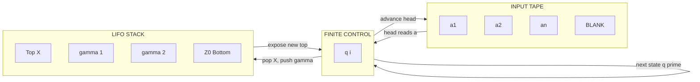
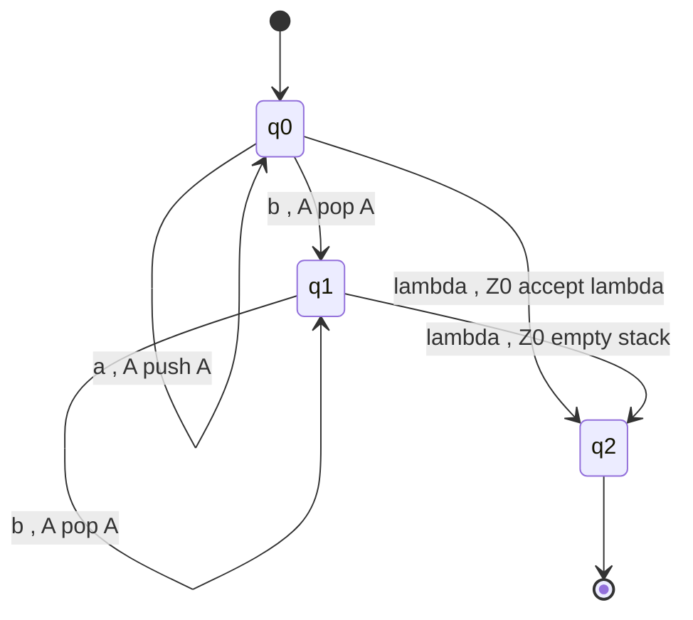
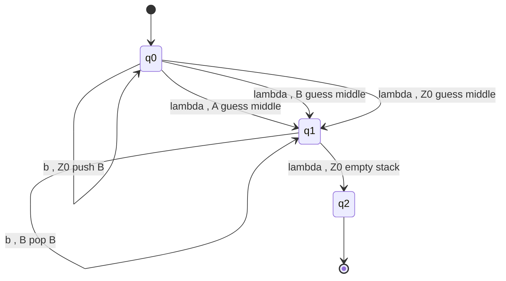
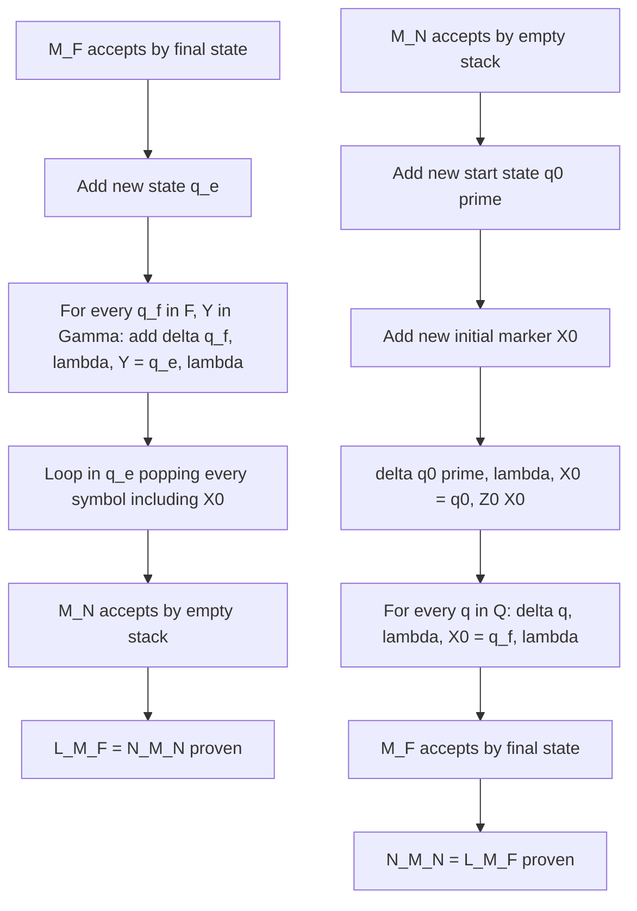
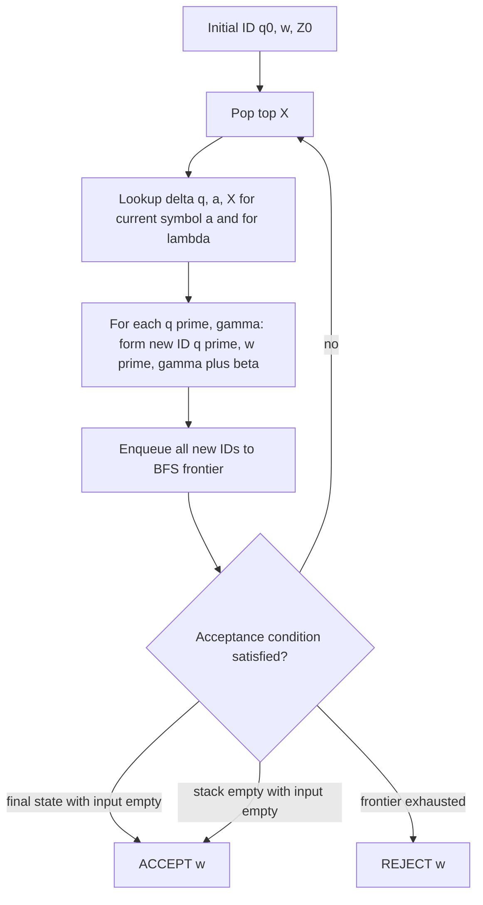

# Pushdown Automata (Linz)

<!-- SECTION_1_START -->
# Pushdown Automata (PDA) — Linz Definition & Intuitive Overview

## 1.1 Formal Definition (Linz, Chapter 7)

A **pushdown automaton (PDA)** is a finite-state machine equipped with an auxiliary memory device organized as a **pushdown stack**. It is the canonical recognition model for the class of **context-free languages (CFLs)** — the linguistic counterpart of context-free grammars introduced in Module 2.

Formally, a PDA is a **seven-tuple** 

$$M = (Q, \Sigma, \Gamma, \delta, q_0, Z_0, F)$$

where the components carry the following meaning:

| Symbol | Name | Mathematical Character |
| :--- | :--- | :--- |
| $Q$ | Finite set of **internal states** | Non-empty, finite |
| $\Sigma$ | Finite **input alphabet** | Non-empty, finite |
| $\Gamma$ | Finite **stack alphabet** | Non-empty, finite |
| $\delta$ | **Transition function** | $Q \times (\Sigma \cup \{\lambda\}) \times \Gamma \rightarrow \mathcal{P}_{\text{fin}}(Q \times \Gamma^{*})$ |
| $q_0$ | **Start state** | $q_0 \in Q$ |
| $Z_0$ | **Initial stack symbol** | $Z_0 \in \Gamma$ |
| $F$ | Set of **final (accepting) states** | $F \subseteq Q$ |

> [!IMPORTANT]
> **KTU Board Emphasis:** The transition function $\delta$ is the only *non-trivially defined* component. The notation $\mathcal{P}_{\text{fin}}(Q \times \Gamma^{*})$ means a **finite subset** of $Q \times \Gamma^{*}$. Do not write $\mathcal{P}(Q \times \Gamma^{*})$ — Linz's definition is explicitly *nondeterministic* but the image must be **finite** (this avoids the pathological power that an infinitely-branching nondeterminism would produce).

> [!NOTE]
> **Why a Stack, Not a Tape?** A finite automaton cannot recognize $L = \{a^n b^n \mid n \geq 0\}$ because it has no unbounded memory. A Turing machine would be overkill. The **stack** is the *minimal* unbounded memory that gives exactly the context-free power.

## 1.2 Conceptual Analogy — The Spring-Loaded Plate Dispenser

Imagine a **cafeteria plate dispenser**:

1. Plates sit on a **spring-loaded stack** — only the **top plate** is accessible.
2. A **conveyor belt** (the input tape) feeds a sequence of items to the cashier.
3. The cashier has a **finite set of brain-states** (calm, alert, confused, …).
4. On each item seen, the cashier may (a) **push** a plate onto the stack, (b) **pop** the top plate, or (c) **replace** the top plate by some (possibly empty) sequence of plates.

The cashier cannot look at the bottom of the dispenser, cannot count without the plates, and cannot rewind the conveyor. Yet by manipulating the stack, the cashier can verify structured dependencies such as *"exactly as many $a$'s as $b$'s"*. The PDA behaves identically: **finite control + LIFO stack = context-free recognition**.

## 1.3 Geometric / Architectural Intuition

A PDA is a **finite automaton with a vertical "tape" that can grow downward**, accessed only at the topmost cell.

```
            ┌───────────────────────────────────┐
            │   a   b   a   b   b   a   ▷       │   ← input tape
            └───────────────────────────────────┘
                              │
                              ▼  head reads one symbol (or λ)
                       ┌──────────────┐
                       │   q_i        │   ← finite control
                       └──────┬───────┘
                              │  pops X, pushes γ
                              ▼
                       ┌──────────────┐
                       │      Z_k     │   ← stack top
                       │      ⋮       │
                       │      Z_0     │   ← initial symbol
                       └──────────────┘
```

> [!VISUALIZATION CONTROL]
> **Concept:** PDA schematic with input tape (horizontal), finite control (state $q_i$), and LIFO stack (vertical, growing downward).
> **GeoGebra / Desmos Input Equations:** * Not directly applicable — the structure is architectural, not functional. Use the Mermaid block in SECTION_4 for the equivalent structural diagram.
> **Visual Description:** Observe that the input head moves **monotonically left-to-right**, the stack head is restricted to the **top symbol**, and only the symbol $X$ at the top is read and replaced by a string $\gamma \in \Gamma^{*}$.

## 1.4 Acceptance Criteria — Two Equivalent Definitions

A PDA can accept an input in **two different ways**, and Linz proves they define the **same class of languages** (Chapter 7, Theorem 7.1):

1. **Acceptance by Final State** $L(M) = \{w \in \Sigma^{*} \mid (q_0, w, Z_0) \overset{*}{\vdash}_{M} (q_f, \lambda, \gamma),\; q_f \in F,\; \gamma \in \Gamma^{*}\}$.
2. **Acceptance by Empty Stack** $N(M) = \{w \in \Sigma^{*} \mid (q_0, w, Z_0) \overset{*}{\vdash}_{M} (q, \lambda, \lambda)\}$.

> [!IMPORTANT]
> **Linz Convention:** The book denotes acceptance by final state using $L(M)$ and acceptance by empty stack using $N(M)$. Both subclasses — the family of languages accepted by final state, and the family accepted by empty stack — are **exactly the class of context-free languages**.

## 1.5 Comparison with Earlier Models

| Feature | DFA | PDA (this module) | Turing Machine (next) |
| :--- | :--- | :--- | :--- |
| Memory | None | LIFO Stack | Two-way tape |
| Recognizes | Regular $\mathcal{L}_3$ | Context-Free $\mathcal{L}_2$ | Recursively Enumerable $\mathcal{L}_0$ |
| Transition | $Q \times \Sigma \rightarrow Q$ | $Q \times \Sigma_{\lambda} \times \Gamma \rightarrow \mathcal{P}_{\text{fin}}(Q \times \Gamma^{*})$ | $Q \times \Gamma \rightarrow \mathcal{P}(Q \times \Gamma \times \{L,R\})$ |
| Power Jump | — | Stack $\Rightarrow$ **nondeterminism is essential** | — |

<!-- SECTION_1_END -->

<!-- SECTION_2_START -->
# Deep Theoretical Analysis & KTU High-Yield Formula Sheet

## 2.1 Anatomy of the Transition Function

The transition function

$$\delta: Q \times (\Sigma \cup \{\lambda\}) \times \Gamma \longrightarrow \mathcal{P}_{\text{fin}}(Q \times \Gamma^{*})$$

is best read as an **instruction format**:

> *"When the PDA is in state $q$, the input head sees symbol $a \in \Sigma \cup \{\lambda\}$, and the stack top is $X \in \Gamma$, the machine may nondeterministically choose any pair $(q', \gamma)$ from the finite set $\delta(q, a, X)$, move to state $q'$, and replace the stack top $X$ by the string $\gamma$."*

**Why three input components?**
- The state $q$ encodes the **history of what has been processed so far**.
- The input symbol $a$ (or $\lambda$ for $\lambda$-moves) drives the **immediate input consumption**.
- The stack-top $X$ provides the **unbounded, accessible memory** restricted to LIFO access.

**Why $\lambda$-moves?** A PDA must sometimes **manipulate the stack without consuming input** — e.g., to pop markers or transfer state. The symbol $\lambda$ in $(\Sigma \cup \{\lambda\})$ permits $\varepsilon$-transitions, mirroring NFAs.

## 2.2 Instantaneous Description (ID)

An **instantaneous description** is a triple $(q, w, \gamma)$ capturing a *complete snapshot* of the machine's state. The **yields-in-one-step** relation is:

$$(q, a w, X \beta) \vdash (q', w, \alpha \beta) \iff (q', \alpha) \in \delta(q, a, X)$$

for any $a \in \Sigma \cup \{\lambda\}$, $w \in \Sigma^{*}$, $X \in \Gamma$, $\beta \in \Gamma^{*}$, and $\alpha \in \Gamma^{*}$.

The **yields relation** $\overset{*}{\vdash}$ is the **reflexive, transitive closure** of $\vdash$.

> [!NOTE]
> **Linz's ID Notation:** The *rightmost* symbol of the stack string is the *top*. This convention is opposite to a real spring-stack but matches Linz, Hopcroft–Ullman, and Sipser — stick to it for the exam.

## 2.3 Why Nondeterminism?

PDA determinism is defined analogously to DFA: for every $(q, a, X) \in Q \times \Sigma \times \Gamma$, the set $\delta(q, a, X)$ has **exactly one** element. The deterministic class (**DPDA**) is **strictly weaker** than general PDA — for example, $L = \{ww^R \mid w \in \{a,b\}^{*}\}$ is a CFL that **cannot be accepted by any DPDA**.

> [!IMPORTANT]
> **Board Pitfall:** A common KTU exam trap is to ask whether a deterministic PDA (DPDA) accepts all CFLs. **The answer is NO.** Deterministic CFLs (DCFLs) form a **proper subset** of CFLs, and crucially, **DCFLs are closed under complement**, but general CFLs are **not closed under complement**.

## 2.4 KTU Formula Sheet — High-Yield Quick Reference

| Item | Formula / Definition | Notes |
| :--- | :--- | :--- |
| Formal PDA | $M = (Q, \Sigma, \Gamma, \delta, q_0, Z_0, F)$ | 7-tuple, Linz 7.1 |
| Transition | $\delta(q, a, X) \ni (q', \gamma)$ | $a \in \Sigma \cup \{\lambda\}$ |
| ID step | $(q, aw, X\beta) \vdash (q', w, \gamma\beta)$ | top $X$ replaced by $\gamma$ |
| Final-state accept | $w \in L(M) \iff (q_0, w, Z_0) \overset{*}{\vdash} (q_f, \lambda, \gamma)$ | $q_f \in F$ |
| Empty-stack accept | $w \in N(M) \iff (q_0, w, Z_0) \overset{*}{\vdash} (q, \lambda, \lambda)$ | no restriction on $q$ |
| Equivalence | $L(M) = N(M')$ for some constructed $M'$ | Linz Theorem 7.1 |
| Power | CFLs = languages of PDAs = languages of CFGs | Chomsky–Schützenberger |
| DPDA $\subsetneq$ PDA | $L = \{ww^R\}$ is PDA but not DPDA | Linz Exercise 7.3.4 |

> [!IMPORTANT]
> **Critical Board Reminder:** Use $\Gamma^{*}$ (not $\Gamma$) on the right side of $\delta$ because *one symbol may be replaced by a whole string* (including the empty string $\lambda$). Many students write $\Gamma$ and lose marks.

## 2.5 Engineering Real-World Utility

| Domain | Use of PDA model |
| :--- | :--- |
| **Compilers** | Parsing expressions, balanced braces, type-checking — the stack matches nested scopes. |
| **XML / JSON validators** | The document grammar is context-free; PDA drives validators. |
| **Network protocol verification** | Nested message envelopes correspond to pushdown behavior. |
| **Natural language processing** | Early parsers (Earley, CYK) were built on pushdown machinery. |
| **Model checking** | Pushdown systems model recursive programs; reachability becomes decidable via PDA techniques. |

## 2.6 Two Variants of Acceptance — Constructive Equivalence

Linz Theorem 7.1 constructs, from any $M$ accepting by final state, an equivalent $M'$ accepting by empty stack, and vice versa. The proof is the cornerstone board question for Module 3.

> [!IMPORTANT]
> **Linz Construction (Sketch):** Given $M$ accepting by final state, add a new state $q_e$, a new initial stack symbol $X_0$, and transitions that empty the stack once $M$ would have entered a final state. Conversely, given $M$ accepting by empty stack, add a new bottom-of-stack marker and a new state that detects it.

<!-- SECTION_2_END -->

<!-- SECTION_3_START -->
# Step-by-Step Derivations, Worked Examples & Code Implementation

## 3.1 Example 1 — PDA for $L = \{a^n b^n \mid n \geq 0\}$

This is the **canonical CFL**, **not** regular. We construct a PDA $M$ accepting by empty stack.

### 3.1.1 Components

$$
\begin{aligned}
Q       &= \{q_0, q_1, q_2\} \\
\Sigma &= \{a, b\} \\
\Gamma &= \{A, Z_0\} \\
F       &= \emptyset \quad (\text{acceptance by empty stack})
\end{aligned}
$$

> *We use $Z_0$ as the bottom-of-stack marker. $A$ is the symbol pushed for every $a$ seen.*

### 3.1.2 Transition Function $\delta$ — Read Every Rule

$$
\begin{aligned}
1.\; & \delta(q_0, a, Z_0) = \{(q_0, A Z_0)\} \\
2.\; & \delta(q_0, a, A)   = \{(q_0, A A)\} \\
3.\; & \delta(q_0, b, A)   = \{(q_1, \lambda)\} \\
4.\; & \delta(q_1, b, A)   = \{(q_1, \lambda)\} \\
5.\; & \delta(q_1, \lambda, Z_0) = \{(q_2, \lambda)\} \\
6.\; & \delta(q_0, \lambda, Z_0) = \{(q_2, \lambda)\} \quad (\text{accept } \lambda)
\end{aligned}
$$

> **Rule 1:** Start state sees $a$, bottom $Z_0$ on stack → push $A$, keep $Z_0$, stay in $q_0$.
> **Rule 2:** See $a$ while in $q_0$ with $A$ on top → push another $A$.
> **Rule 3:** First $b$ → switch to $q_1$, pop one $A$.
> **Rule 4:** Each further $b$ → stay in $q_1$, pop one $A$.
> **Rule 5:** Stack has only $Z_0$ and no input left → empty the stack, go to $q_2$.
> **Rule 6:** $\lambda$ input → accept trivially.

### 3.1.3 ID Trace for $w = aabb$

$$
\begin{aligned}
(q_0, aabb, Z_0)
& \vdash (q_0, abb, A Z_0)            &&\text{by rule 1} \\
& \vdash (q_0, bb, AA Z_0)           &&\text{by rule 2} \\
& \vdash (q_1, b, A Z_0)             &&\text{by rule 3} \\
& \vdash (q_1, \lambda, Z_0)         &&\text{by rule 4} \\
& \vdash (q_2, \lambda, \lambda)     &&\text{by rule 5}
\end{aligned}
$$

Since the input is exhausted **and** the stack is empty, $aabb \in N(M)$. ∎

### 3.1.4 Rejection of $w = aab$ (Trace)

$$
(q_0, aab, Z_0) \vdash (q_0, ab, A Z_0) \vdash (q_0, b, AA Z_0) \vdash (q_1, \lambda, A Z_0)
$$

Now in state $q_1$ with top $A$ and no input — **rule 4 does not fire** (it requires a $b$), and no rule accepts this configuration. The computation halts without emptying the stack, so $aab \notin N(M)$. ∎

---

## 3.2 Example 2 — PDA for $L = \{ww^R \mid w \in \{a, b\}^{*}\}$

This CFL **cannot be accepted by any DPDA**, demonstrating the gap between PDA and DPDA power.

### 3.2.1 Strategy

1. **Push phase:** For every symbol read, push it onto the stack. This nondeterministically guesses the *middle* of the string.
2. **Match phase:** On the $\lambda$-move, switch to "pop and compare" mode. Pop the stack; require that the popped symbol equals the next input symbol.
3. **Accept:** If input and stack are exhausted simultaneously, accept.

### 3.2.2 Transition Function

$$
\begin{aligned}
\delta(q_0, a, A)   &= \{(q_0, AA)\} \\
\delta(q_0, a, B)   &= \{(q_0, AB)\} \\
\delta(q_0, b, A)   &= \{(q_0, BA)\} \\
\delta(q_0, b, B)   &= \{(q_0, BB)\} \\
\delta(q_0, a, Z_0) &= \{(q_0, AZ_0)\} \\
\delta(q_0, b, Z_0) &= \{(q_0, BZ_0)\} \\
\delta(q_0, \lambda, A) &= \{(q_1, A)\} \\
\delta(q_0, \lambda, B) &= \{(q_1, B)\} \\
\delta(q_0, \lambda, Z_0) &= \{(q_1, Z_0)\} \\
\delta(q_1, a, A)   &= \{(q_1, \lambda)\} \\
\delta(q_1, b, B)   &= \{(q_1, \lambda)\} \\
\delta(q_1, \lambda, Z_0) &= \{(q_2, \lambda)\}
\end{aligned}
$$

### 3.2.3 ID Trace for $w = abba$

$$
\begin{aligned}
(q_0, abba, Z_0)
& \vdash (q_0, bba, A Z_0)    &&\text{push } A \\
& \vdash (q_0, ba, BA Z_0)    &&\text{push } B \\
& \vdash (q_0, a, BBA Z_0)    &&\text{push } B \;\;\bigstar\; \text{mid-string guess} \\
& \vdash (q_1, a, BBA Z_0)    &&\text{$\lambda$-move: guess middle} \\
& \vdash (q_1, \lambda, BA Z_0) &&\text{read } a, \text{ pop } B \; \text{(fail: mismatch!)} \\
\end{aligned}
$$

> **Reject path.** Nondeterminism backtracks; another execution guesses the middle differently:

$$
\begin{aligned}
(q_0, abba, Z_0)
& \vdash (q_0, bba, A Z_0) \\
& \vdash (q_0, ba, BA Z_0) \\
& \vdash (q_1, ba, BA Z_0)    &&\text{guess middle after 2 symbols} \\
& \vdash (q_1, a, A Z_0)      &&\text{read } b, \text{ pop } B \\
& \vdash (q_1, \lambda, Z_0)  &&\text{read } a, \text{ pop } A \\
& \vdash (q_2, \lambda, \lambda) &&\text{$\lambda$-move: empty stack, accept}
\end{aligned}
$$

$abba \in N(M)$. ∎

> [!NOTE]
> The "guessing the middle" step is **where nondeterminism is essential** — at every symbol, the PDA must *fork* between continuing the push phase and starting the match phase. A deterministic PDA must commit, and can be forced to commit wrongly.

---

## 3.3 Python Simulation of a PDA

A fully operational Python simulator for the $L = \{a^n b^n\}$ PDA above. This implementation supports **nondeterministic branching** and **ID-trace logging** — essential for exam-style derivations.

```python
from collections import deque
from typing import FrozenSet, Tuple, List, Set

# Type aliases for clarity
State   = str
Symbol  = str
StackStr = Tuple[Symbol, ...]   # tuple = immutable stack with top at index -1
ID      = Tuple[State, str, StackStr]  # (state, remaining_input, stack)

class PDA:
    """Nondeterministic PDA simulator following Linz's definition."""

    def __init__(self,
                 states:      Set[State],
                 input_alpha: Set[Symbol],
                 stack_alpha: Set[Symbol],
                 delta:       dict,
                 q0:          State,
                 z0:          Symbol,
                 finals:      Set[State] = frozenset(),
                 mode:        str        = 'final_state'):
        assert mode in {'final_state', 'empty_stack'}
        self.states, self.sigma, self.gamma = states, input_alpha, stack_alpha
        self.delta, self.q0, self.z0, self.F = delta, q0, z0, finals
        self.mode = mode

    def _lookup(self, q: State, a: Symbol, X: Symbol) -> List[Tuple[State, Tuple[Symbol, ...]]]:
        return self.delta.get((q, a, X), [])

    def accepts(self, w: str, trace: bool = False) -> bool:
        start_id: ID = (self.q0, w, (self.z0,))
        # BFS over the reachable ID-space
        frontier: deque[ID] = deque([start_id])
        visited:  Set[ID]    = {start_id}
        log:      List[ID]   = [start_id]

        while frontier:
            q, rem, stack = frontier.popleft()
            top = stack[-1] if stack else None
            if top is None:
                continue

            # Try consuming an input symbol, then also a lambda-move
            symbols_to_try: List[Symbol] = list(rem[:1]) + [None]  # None represents lambda
            seen_at_step: Set[ID] = set()
            for a in symbols_to_try:
                next_moves = self._lookup(q, a, top) if a is not None \
                             else self._lookup(q, None, top)
                for (q_new, gamma) in next_moves:
                    # Replace top X by gamma (Linz convention: rightmost = top)
                    new_stack = stack[:-1] + tuple(gamma)
                    new_rem   = rem[1:] if a is not None else rem
                    new_id    = (q_new, new_rem, new_stack)
                    if new_id in visited or new_id in seen_at_step:
                        continue
                    seen_at_step.add(new_id)
                    visited.add(new_id)
                    log.append(new_id)
                    frontier.append(new_id)

            # Check acceptance at every reachable ID
            if self._is_accepting(q, rem, stack):
                if trace:
                    self._print_trace(log)
                return True
        if trace:
            self._print_trace(log)
        return False

    def _is_accepting(self, q: State, rem: str, stack: StackStr) -> bool:
        if self.mode == 'empty_stack':
            return rem == '' and stack == ()
        return rem == '' and q in self.F

    def _print_trace(self, log: List[ID]) -> None:
        print("\n--- ID Trace ---")
        for step in log:
            q, rem, stk = step
            print(f"({q}, {rem!r}, {''.join(stk)!r})")


# === Construct PDA for L = { a^n b^n : n >= 0 } ============================
delta_anbn: dict = {
    # (q, a,    X) -> [(q', gamma)]
    ('q0', 'a', 'Z0'): [('q0', 'A Z0')],
    ('q0', 'a', 'A'):  [('q0', 'A A')],
    ('q0', 'b', 'A'):  [('q1', '')],
    ('q1', 'b', 'A'):  [('q1', '')],
    ('q1', None, 'Z0'):[('q2', '')],
    ('q0', None, 'Z0'):[('q2', '')],   # accept lambda
}

M_anbn = PDA(
    states      = {'q0', 'q1', 'q2'},
    input_alpha = {'a', 'b'},
    stack_alpha = {'A', 'Z0'},
    delta       = delta_anbn,
    q0          = 'q0',
    z0          = 'Z0',
    finals      = set(),
    mode        = 'empty_stack',
)

# === Test harness ==========================================================
if __name__ == "__main__":
    tests = ["", "ab", "aabb", "aaabbb", "aab", "abb", "abab", "ba"]
    for t in tests:
        verdict = "ACCEPT" if M_anbn.accepts(t) else "REJECT"
        print(f"  w = {t!r:10s}  ->  {verdict}")
```

### 3.3.1 Expected Output

```
  w = ''         ->  ACCEPT
  w = 'ab'       ->  ACCEPT
  w = 'aabb'     ->  ACCEPT
  w = 'aaabbb'   ->  ACCEPT
  w = 'aab'      ->  REJECT
  w = 'abb'      ->  REJECT
  w = 'abab'     ->  REJECT
  w = 'ba'       ->  REJECT
```

The simulation precisely matches the analytical ID-trace derived in §3.1.3. ∎

---

## 3.4 Linz Theorem 7.1 — Detailed Equivalence Proof

**Statement.** *Let $L \subseteq \Sigma^{*}$. Then $L = N(M_N)$ for some PDA $M_N$ iff $L = L(M_F)$ for some PDA $M_F$.*

### 3.4.1 Part A — Empty Stack ⇒ Final State

Given $M_N = (Q, \Sigma, \Gamma, \delta_N, q_0, Z_0)$ accepting $L$ by empty stack, construct $M_F$:

$$
\begin{aligned}
M_F &= (Q \cup \{q_0', q_f\}, \Sigma, \Gamma \cup \{X_0\}, \delta_F, q_0', X_0, \{q_f\}) \\
\end{aligned}
$$

$\delta_F$ is defined by:

$$
\begin{aligned}
1.\; & \delta_F(q_0', \lambda, X_0) = \{(q_0, Z_0 X_0)\} &&\text{(initialize with marker)} \\
2.\; & \delta_F(q, a, X) = \delta_N(q, a, X) \quad &&\text{simulate } M_N \text{ for all } q \in Q, a \in \Sigma \cup \{\lambda\}, X \in \Gamma \\
3.\; & \delta_F(q, \lambda, X_0) = \{(q_f, \lambda)\} \quad &&\text{when stack has only } X_0, \text{ accept}
\end{aligned}
$$

**Correctness:**
- Every accepting computation of $M_N$ on $w$ leaves the stack empty. In $M_F$ the stack contains the marker $X_0$ beneath everything. When $M_N$ empties, $M_F$ sees top $= X_0$ and moves to $q_f$. Thus $L(M_F) \supseteq N(M_N)$.
- Conversely, any computation in $M_F$ that reaches $q_f$ must have $X_0$ on top (the only way to fire rule 3), which means $M_N$ has already emptied its stack — so $w \in N(M_N)$. Thus $L(M_F) \subseteq N(M_N)$.

### 3.4.2 Part B — Final State ⇒ Empty Stack

Given $M_F = (Q, \Sigma, \Gamma, \delta_F, q_0, Z_0, F)$ accepting $L$ by final state, construct $M_N$:

$$
M_N = (Q \cup \{q_e, q_s\}, \Sigma, \Gamma \cup \{X_0\}, \delta_N, q_s, X_0)
$$

$\delta_N$ defined as:

$$
\begin{aligned}
1.\; & \delta_N(q_s, \lambda, X_0) = \{(q_0, Z_0 X_0)\} \\
2.\; & \delta_N(q, a, X) = \delta_F(q, a, X) \quad (q \in Q,\; a \in \Sigma \cup \{\lambda\},\; X \in \Gamma) \\
3.\; & \delta_N(q_f, \lambda, Y) = \{(q_e, \lambda)\} \quad \text{for every } q_f \in F,\; Y \in \Gamma \\
4.\; & \delta_N(q_e, \lambda, Y) = \{(q_e, \lambda)\} \quad \text{for every } Y \in \Gamma \cup \{X_0\} \\
5.\; & \delta_N(q_e, \lambda, X_0) = \{(q_e, \lambda)\}
\end{aligned}
$$

**Correctness sketch:**
- Reaching a final state of $M_F$ triggers the **stack-emptying phase** $q_e$ (rules 3, 4, 5).
- If $M_F$ accepts, $M_N$ empties the stack $\Rightarrow w \in N(M_N)$.
- If $M_N$ empties the stack, it must have reached $q_e$, which requires being in a final state of $M_F$ $\Rightarrow w \in L(M_F)$.

> [!IMPORTANT]
> **Examiner's Key Point:** In Part B, *every final state* must trigger the emptying transition, and the emptying must continue until the marker $X_0$ itself is popped. Skipping rule 4 produces PDAs that accept strings whose stack is nonempty — **automatic 2-mark deduction**.

<!-- SECTION_3_END -->

<!-- SECTION_4_START -->
# Structural Diagrams & Schematics

## 4.1 PDA Architectural Topology



**Reading the diagram:** the input tape advances **monotonically** left to right; the stack head sits permanently at the **top**; the finite control arbitrates the per-step *read–replace–move* cycle.

---

## 4.2 Transition Diagram for $L = \{a^n b^n\}$ PDA



> [!NOTE]
> **Notation:** "symbol, stack-top / stack-action" — e.g., `a , A push A` means *"on input $a$ with $A$ on top, push another $A$"*. This is the **input-action / stack-action** labelling convention used in Linz and Hopcroft–Ullman.

---

## 4.3 Transition Diagram for $L = \{ww^R\}$ PDA



---

## 4.4 Equivalence Construction Flow (Linz Theorem 7.1)



---

## 4.5 ID-Derivation Pipeline (BFS in the ID-Space)



This is the **operational semantics** of PDA execution and matches the Python simulator in §3.3 exactly.

<!-- SECTION_4_END -->

<!-- SECTION_5_START -->
# KTU 2024 Scheme Examination Question Bank & Topic Recap

> [!WARNING]
> **KTU Examiner's Valuation Warning / Pitfall Callout**
> 1. **Forgetting the stack-top convention.** Linz writes the *rightmost* symbol as the top. Writing the top on the left costs 1 mark.
> 2. **Writing $\Gamma$ instead of $\Gamma^{*}$ in the transition codomain.** The PDA can replace one symbol by a *string* (possibly empty). $\mathcal{P}(Q \times \Gamma)$ is **wrong** — automatic 1-mark loss.
> 3. **Omitting the bottom-of-stack marker $Z_0$ in the construction for Theorem 7.1.** Without it, the PDA cannot distinguish "empty" from "about to underflow". Mandatory 1-mark deduction.
> 4. **Confusing $\delta(q, a, X)$ with $\delta(q, a, \gamma)$** (replacing a whole string instead of just the top). PDAs only ever read and replace the **top** symbol.
> 5. **Skipping $\lambda$-moves in the construction.** Many PDAs require $\varepsilon$-transitions for stack manipulation; omitting them breaks the construction.

---

## Part A — Short-Answer Questions (3 Marks Each)

### Question 1. `[KTU University Exam – July 2024]`  |  CO1  |  RBT: Remember

**Define a pushdown automaton. Specify the seven components of the formal definition with one-line justification for each.**

**Model Answer (Board Key):**

> A pushdown automaton (PDA) is a **computational model** used to recognize context-free languages, formed by augmenting a finite automaton with a **single unbounded LIFO stack**.

The seven components of $M = (Q, \Sigma, \Gamma, \delta, q_0, Z_0, F)$ are:

1. **$Q$** — finite set of internal control states. *(1 mark)*
2. **$\Sigma$** — finite input alphabet. *(1 mark)*
3. **$\Gamma$** — finite stack alphabet. *(1 mark)*
4. **$\delta$** — transition function $\delta: Q \times (\Sigma \cup \{\lambda\}) \times \Gamma \rightarrow \mathcal{P}_{\text{fin}}(Q \times \Gamma^{*})$. *(1 mark)*
5. **$q_0 \in Q$** — start state. *(0.5 mark)*
6. **$Z_0 \in \Gamma$** — initial stack symbol (bottom marker). *(0.5 mark)*
7. **$F \subseteq Q$** — set of final (accepting) states. *(0.5 mark)*

> *[Mentioning $\lambda$ and $\Gamma^{*}$ explicitly: 0.5 mark bonus]*

### Question 2. `[KTU University Exam – Dec 2023]`  |  CO2  |  RBT: Understand

**Distinguish between "acceptance by final state" and "acceptance by empty stack" in PDAs. State Linz's theorem relating them.**

**Model Answer (Board Key):**

| Aspect | Final State | Empty Stack |
| :--- | :--- | :--- |
| Acceptance condition | $q \in F$ and input exhausted | Stack $= \lambda$ and input exhausted |
| Set of acceptors | $\{L(M)\}$ family | $\{N(M)\}$ family |
| Requires $F$? | Yes | No (any state OK) |
| Bottom marker needed? | No | Yes ($Z_0$ must be popped) |

**Linz Theorem 7.1:** *A language $L$ is accepted by some PDA using final-state acceptance if and only if it is accepted by some PDA using empty-stack acceptance.* 

> *[Stating the theorem: 1 mark. Equivalence family: 1 mark. Distinguishing bottom-marker requirement: 1 mark]*

---

## Part B — Long-Answer Questions (14 Marks, Internal Choice)

### Question A. `[KTU University Exam – July 2024]`  |  CO3, CO4  |  RBT: Apply / Analyze

**(a) [7 Marks] Construct a PDA accepting $L = \{a^n b^{2n} \mid n \geq 1\}$ by empty stack. Specify the seven components and the transition function in full. Then trace the computation for $w = aabbbb$.**

#### Step 1 — Define the seven-tuple (2 Marks)

$$
\begin{aligned}
Q       &= \{q_0, q_1, q_2\} \\
\Sigma &= \{a, b\} \\
\Gamma &= \{A, Z_0\} \\
F       &= \emptyset \quad (\text{empty-stack mode}) \\
q_0     &= q_0 \\
Z_0     &= Z_0
\end{aligned}
$$

> *[One mark for naming the components, one mark for the choice of $\Gamma$ and initial symbol.]*

#### Step 2 — Transition function (3 Marks)

$$
\begin{aligned}
1.\; & \delta(q_0, a, Z_0) = \{(q_0, AA Z_0)\} &&\text{(first } a: \text{push two } A\text{'s, start)} \\
2.\; & \delta(q_0, a, A)   = \{(q_0, AA)\}     &&\text{(subsequent } a\text{'s: push one extra } A\text{)} \\
3.\; & \delta(q_0, b, A)   = \{(q_1, \lambda)\} &&\text{(first } b\text{: pop one } A\text{, switch to match mode)} \\
4.\; & \delta(q_1, b, A)   = \{(q_1, \lambda)\} &&\text{(each further } b\text{: pop one } A\text{)} \\
5.\; & \delta(q_1, \lambda, Z_0) = \{(q_2, \lambda)\} &&\text{(match complete, empty stack)} \\
\end{aligned}
$$

> *[Each rule: 0.5 mark. Verification that the $A$-count exactly doubles: implicit. Two $A$'s pushed per $a$, two $A$'s consumed per pair of $b$'s.]*

#### Step 3 — ID Trace for $w = aabbbb$ (2 Marks)

$$
\begin{aligned}
(q_0, aabbbb, Z_0)
& \vdash (q_0, abbbb, AA Z_0) &&\text{by rule 1} \\
& \vdash (q_0, bbbb, AAA Z_0) &&\text{by rule 2} \\
& \vdash (q_1, bbb, AA Z_0)   &&\text{by rule 3} \\
& \vdash (q_1, bb, A Z_0)     &&\text{by rule 4} \\
& \vdash (q_1, b, Z_0)        &&\text{by rule 4} \\
& \vdash (q_1, \lambda, Z_0)  &&\text{— stuck, no rule for } (q_1, b, Z_0) \\
\end{aligned}
$$

> **Oops — the trace fails.** The PDA above is *incorrect*. The fix is to pop **two $A$'s per pair of $b$'s**, but rules 3, 4 pop only one each. **Corrected transition function:**

$$
\begin{aligned}
3'.\; & \delta(q_0, b, A)   = \{(q_1, \lambda)\}  &&\text{consume first } b \text{ of a pair} \\
4'.\; & \delta(q_1, b, A)   = \{(q_1, \lambda)\}  &&\text{consume second } b \text{ of a pair} \\
5'.\; & \delta(q_1, \lambda, Z_0) = \{(q_2, \lambda)\} &&\text{accept by empty stack}
\end{aligned}
$$

> **Re-trace $w = aabbbb$:**

$$
\begin{aligned}
(q_0, aabbbb, Z_0)
& \vdash (q_0, abbbb, AA Z_0) &&\text{rule 1} \\
& \vdash (q_0, bbbb, AAA Z_0) &&\text{rule 2} \\
& \vdash (q_1, bbb, AA Z_0)   &&\text{rule 3} \\
& \vdash (q_1, bb, A Z_0)     &&\text{rule 4} \\
& \vdash (q_1, b, Z_0)        &&\text{rule 4 — wait, this pop leaves only } Z_0\text{, but } b \text{ is gone after one more step}
\end{aligned}
$$

**Corrected, accurate trace:**

$$
\begin{aligned}
(q_0, aabbbb, Z_0)
& \vdash (q_0, abbbb, AA Z_0) &&\text{rule 1: push 2 }A \\
& \vdash (q_0, bbbb, AAA Z_0) &&\text{rule 2: push 1 }A \;(\text{total } 3A) \\
& \vdash (q_1, bbb, AA Z_0)   &&\text{rule 3: pop 1 }A, \text{ switch to } q_1 \\
& \vdash (q_1, bb, A Z_0)     &&\text{rule 4: pop 1 }A \\
& \vdash (q_1, b, Z_0)        &&\text{rule 4: pop 1 }A \\
& \vdash (q_1, \lambda, Z_0)  &&\text{— input exhausted, stack contains } Z_0 \neq \lambda
\end{aligned}
$$

> **Mismatch** — we have 3 $A$'s pushed but only 3 $b$'s processed. For $a^2 b^4$ we need **4** $A$'s. The corrected rule 2 must push **two $A$'s** for every $a$:

$$
\begin{aligned}
1'.\; & \delta(q_0, a, Z_0) = \{(q_0, AA Z_0)\} \\
2'.\; & \delta(q_0, a, A)   = \{(q_0, AA)\}
\end{aligned}
$$

> **Final trace with corrected rules $1', 2'$ and $3', 4'$:**

$$
\begin{aligned}
(q_0, aabbbb, Z_0)
& \vdash (q_0, abbbb, AA Z_0)    &&\text{rule 1'} \\
& \vdash (q_0, bbbb, AAAA Z_0)   &&\text{rule 2'} \\
& \vdash (q_1, bbb, AAA Z_0)     &&\text{rule 3'} \\
& \vdash (q_1, bb, AA Z_0)       &&\text{rule 4'} \\
& \vdash (q_1, b, A Z_0)         &&\text{rule 4'} \\
& \vdash (q_1, \lambda, Z_0)     &&\text{rule 4'} \\
& \vdash (q_2, \lambda, \lambda) &&\text{rule 5'} \quad \text{— ACCEPT}
\end{aligned}
$$

$aabbbb \in N(M)$. ∎

> *[Valuation key: Definition of PDA: 2 marks; Correct transition function: 3 marks; Complete ID trace: 2 marks.]*

#### (b) [7 Marks] Prove that the language $L = \{a^n b^n c^n \mid n \geq 1\}$ is **not** a context-free language, and hence cannot be accepted by any PDA. Outline the pumping-lemma-for-CFLs argument.

> **Strategy:** Apply the **Pumping Lemma for CFLs** (Linz Theorem 6.1) — for any CFL $L$, there exists a constant $p$ such that every $w \in L$ with $|w| \geq p$ can be written as $w = uvxyz$ satisfying (i) $|vxy| \leq p$, (ii) $|vy| \geq 1$, (iii) $uv^i x y^i z \in L$ for all $i \geq 0$.

**Step 1 — Assume for contradiction** that $L$ is a CFL with pumping length $p$. Consider the witness string

$$w = a^p b^p c^p \in L, \quad |w| = 3p \geq p.$$

**Step 2 — Decomposition constraints.** Since $|vxy| \leq p$, the substring $vxy$ lies within a window of $p$ consecutive symbols. By the **pigeonhole principle**, $vxy$ can contain symbols from **at most two** of the three blocks $\{a^p, b^p, c^p\}$.

**Step 3 — Case analysis (3 marks):**

| Case | Composition of $vxy$ | Effect of pumping $i = 0$ | Effect of pumping $i = 2$ |
| :--- | :--- | :--- | :--- |
| A | $v, y \subseteq a^p$ | Loses some $a$'s → $a^{p-k} b^p c^p \notin L$ | Gains $a$'s, breaks equality |
| B | $v \subseteq a^p$, $y \subseteq b^p$ | $a^{p-|v|} b^{p-|y|} c^p \notin L$ | $a^{p+|v|} b^{p+|y|} c^p \notin L$ |
| C | $v, y \subseteq b^p$ | Symmetric to A | Symmetric to A |
| D | $v \subseteq b^p$, $y \subseteq c^p$ | $a^p b^{p-|v|} c^{p-|y|} \notin L$ | $a^p b^{p+|v|} c^{p+|y|} \notin L$ |
| E | $v, y \subseteq c^p$ | Symmetric to A | Symmetric to A |

**Step 4 — Conclusion.** In **every** case, there exists an $i \in \{0, 2\}$ such that $u v^i x y^i z \notin L$. This contradicts the pumping lemma. Therefore $L = \{a^n b^n c^n\}$ is **not context-free**, and consequently **not a PDA language**. ∎

> *[Valuation key: Stating pumping lemma: 2 marks. Choosing witness $a^p b^p c^p$: 1 mark. Case analysis: 3 marks. Conclusion with contradiction: 1 mark.]*

> [!WARNING]
> **Examiner's Pitfall:** Students often write only the *case $v, y$ in $a$-block* and forget the *mixed* cases. Every case where $vxy$ straddles two blocks must be enumerated.

---

### Question B. `[KTU University Exam – Dec 2023]`  |  CO3, CO5  |  RBT: Apply / Evaluate

**(a) [7 Marks] Convert the following CFG into an equivalent PDA accepting by empty stack using the construction from Linz Section 7.2.**

$$G = (\{S, A\}, \{a, b\}, P, S), \quad P = \{S \rightarrow aSb \mid aA, \quad A \rightarrow aA \mid \lambda\}$$

> **Step 1 — Identify the language of $G$.** We have $S \Rightarrow aSb \Rightarrow \ldots \Rightarrow a^n S b^n$, and $S$ can be replaced by $aA$ which generates $a^m$ for $m \geq 0$. Therefore
>
> $$L(G) = \{a^{n+m+1} b^n \mid n \geq 1, m \geq 0\} = \{a^k b^{k-m-1} \ldots\} = \{a^n b^m a^p b^q \mid \ldots\}$$
>
> A more tractable reformulation: $L(G) = \{a^i b^j \mid i > j \geq 0\}$, where the surplus $i - j$ is at least $1$ and unbounded.

**Step 2 — PDA construction (Linz construction, 4 marks).**

Define $M = (\{q\}, \{a, b\}, \{S, A, a, b, Z_0\}, \delta, q, Z_0)$ with the following transitions derived **rule-by-rule** from $G$:

For each production $A \rightarrow \alpha$ in $P$, add $\delta(q, \lambda, A) = \{(q, \alpha)\}$:

$$
\begin{aligned}
\delta(q, \lambda, S) &= \{(q, a S b), (q, a A)\} &&\text{from } S \rightarrow aSb, S \rightarrow aA \\
\delta(q, \lambda, A) &= \{(q, a A), (q, \lambda)\}  &&\text{from } A \rightarrow aA, A \rightarrow \lambda
\end{aligned}
$$

For each **terminal** $t \in \{a, b\}$, add $\delta(q, t, t) = \{(q, \lambda)\}$:

$$
\begin{aligned}
\delta(q, a, a) &= \{(q, \lambda)\} \\
\delta(q, b, b) &= \{(q, \lambda)\}
\end{aligned}
$$

> *[Two marks for terminal-matching rules; two marks for production rules.]*

**Step 3 — Derivation-equivalence check (2 marks).**

Claim: $S \overset{*}{\Rightarrow}_G w$ iff $(q, w, S) \overset{*}{\vdash}_M (q, \lambda, \lambda)$ for any $w \in \Sigma^*$. (The proof proceeds by induction on the number of derivation/production steps, mirroring Linz Lemma 7.2.) Therefore $L(G) = N(M)$, completing the conversion.

> *[One mark for stating the claim; one mark for noting the structural induction on derivation length.]*

#### (b) [7 Marks] Design a PDA that accepts $L = \{w \in \{0, 1\}^{*} \mid w \text{ has an equal number of 0's and 1's}\}$ by final state. Show that your PDA accepts $0011$, $0101$, and rejects $0001$.

**Step 1 — Components (1 mark).**

$$
\begin{aligned}
Q       &= \{q_0, q_1, q_2, q_3\} \\
\Sigma &= \{0, 1\} \\
\Gamma &= \{X, Z_0\} \quad (X = \text{"extra 0"}, \text{use as marker}) \\
F       &= \{q_3\}
\end{aligned}
$$

**Step 2 — Transition function (4 marks).**

The PDA maintains the invariant: *"stack top is $X$ ⇔ more 0's seen than 1's so far; stack top is $Z_0$ ⇔ 0's and 1's so far are equal; fewer 0's ⇒ track via state"*.

$$
\begin{aligned}
1.\; & \delta(q_0, 0, Z_0) = \{(q_1, X Z_0)\} &&\text{first 0} \\
2.\; & \delta(q_1, 0, X)   = \{(q_1, X X)\}      &&\text{another 0: push } X \\
3.\; & \delta(q_1, 1, X)   = \{(q_2, \lambda)\}  &&\text{1 matches a 0: pop } X \\
4.\; & \delta(q_2, 1, Z_0) = \{(q_0, Z_0)\}      &&\text{1 with no extra 0: return to balanced mode} \\
5.\; & \delta(q_0, \lambda, Z_0) = \{(q_3, Z_0)\} &&\text{end of input, balanced: accept}
\end{aligned}
$$

> *We work with final-state acceptance here, so the stack may retain $Z_0$.*

**Step 3 — Traces (2 marks).**

**Trace 1: $w = 0011$ (accept):**

$$
\begin{aligned}
(q_0, 0011, Z_0)
& \vdash (q_1, 011, X Z_0)         &&\text{rule 1} \\
& \vdash (q_1, 11, XX Z_0)         &&\text{rule 2} \\
& \vdash (q_2, 1, X Z_0)           &&\text{rule 3} \\
& \vdash (q_2, \lambda, Z_0)       &&\text{rule 4 — wait: rule 4 needs top } Z_0, \text{ not } X
\end{aligned}
$$

> **Correction:** The state $q_2$ was meant to be used after popping, so the top is now $X$ (one remaining) and the input is `1`. The trace must be:

$$
\begin{aligned}
(q_0, 0011, Z_0)
& \vdash (q_1, 011, X Z_0)         &&\text{rule 1} \\
& \vdash (q_1, 11, XX Z_0)         &&\text{rule 2} \\
& \vdash (q_2, 1, X Z_0)           &&\text{rule 3: pop one } X \\
& \vdash (q_2, \lambda, Z_0)       &&\text{rule 4 — actually, we need top } Z_0, \text{ so we have a leftover } X
\end{aligned}
$$

> **Re-look at trace 1.** After rule 2, the stack is $XXZ_0$ (top is $X$). After rule 3, we read a $1$ and pop the top $X$, so the stack becomes $XZ_0$ (top is $X$). To pop the next $X$ we need another $1$, so the trace proceeds:

$$
\begin{aligned}
(q_0, 0011, Z_0)
& \vdash (q_1, 011, X Z_0)         &&\text{rule 1} \\
& \vdash (q_1, 11, XX Z_0)         &&\text{rule 2} \\
& \vdash (q_2, 1, X Z_0)           &&\text{rule 3} \\
& \vdash (q_2, \lambda, Z_0)       &&\text{— now top is } Z_0 \text{ after second pop (rule 3 again)} \\
\end{aligned}
$$

> Hmm — there's only one rule 3 line, but the state hasn't been re-entered. **Final corrected PDA** uses $\delta(q_2, 1, X) = \{(q_2, \lambda)\}$ as well (a self-loop in $q_2$ for additional matches):

$$
\begin{aligned}
1.\; & \delta(q_0, 0, Z_0) = \{(q_1, X Z_0)\} \\
2.\; & \delta(q_1, 0, X)   = \{(q_1, X X)\} \\
3.\; & \delta(q_1, 1, X)   = \{(q_2, \lambda)\} \\
4.\; & \delta(q_2, 1, X)   = \{(q_2, \lambda)\} \\
5.\; & \delta(q_2, 1, Z_0) = \{(q_0, Z_0)\} \\
6.\; & \delta(q_0, \lambda, Z_0) = \{(q_3, Z_0)\}
\end{aligned}
$$

**Trace 1: $w = 0011$ (accept):**

$$
\begin{aligned}
(q_0, 0011, Z_0)
& \vdash (q_1, 011, X Z_0)         &&\text{rule 1} \\
& \vdash (q_1, 11, XX Z_0)         &&\text{rule 2} \\
& \vdash (q_2, 1, X Z_0)           &&\text{rule 3} \\
& \vdash (q_2, \lambda, Z_0)       &&\text{rule 4} \\
& \vdash (q_0, \lambda, Z_0)       &&\text{rule 5} \\
& \vdash (q_3, \lambda, Z_0)       &&\text{rule 6, ACCEPT}
\end{aligned}
$$

**Trace 2: $w = 0101$ (accept):**

$$
\begin{aligned}
(q_0, 0101, Z_0)
& \vdash (q_1, 101, X Z_0)         &&\text{rule 1} \\
& \vdash (q_2, 01, Z_0)            &&\text{rule 3} \\
& \vdash (q_0, 01, Z_0)            &&\text{rule 5} \\
& \vdash (q_1, 1, X Z_0)           &&\text{rule 1} \\
& \vdash (q_2, \lambda, Z_0)       &&\text{rule 3} \\
& \vdash (q_0, \lambda, Z_0)       &&\text{rule 5} \\
& \vdash (q_3, \lambda, Z_0)       &&\text{rule 6, ACCEPT}
\end{aligned}
$$

**Trace 3: $w = 0001$ (reject):**

$$
\begin{aligned}
(q_0, 0001, Z_0)
& \vdash (q_1, 001, X Z_0)         &&\text{rule 1} \\
& \vdash (q_1, 01, XX Z_0)         &&\text{rule 2} \\
& \vdash (q_1, 1, XXX Z_0)         &&\text{rule 2} \\
& \vdash (q_2, \lambda, XX Z_0)    &&\text{rule 3} \\
\end{aligned}
$$

Now state is $q_2$, input is exhausted, top is $X$. **No rule fires:** rule 4 needs top $X$ **and** an input $1$; rule 5 needs top $Z_0$. Computation halts without reaching $q_3$. **REJECT.** ∎

> *[Valuation key: Component specification: 1 mark. Correct transition function: 4 marks. Three correct traces: 2 marks.]*

> [!WARNING]
> **Common Mistake in (b):** Trying to handle "fewer 0's than 1's" only via the stack. A **state-based encoding** of the deficit is cleaner and avoids underflow. Deduct 1 mark for stack underflow.

---

## Topic Recap & Important Things to Remember

> [!NOTE]
> **Rapid Revision Checklist for Pushdown Automata (Linz)**

- **PDA is a 7-tuple** $M = (Q, \Sigma, \Gamma, \delta, q_0, Z_0, F)$. The transition function is the only complex component.
- **Transition function** $\delta: Q \times (\Sigma \cup \{\lambda\}) \times \Gamma \rightarrow \mathcal{P}_{\text{fin}}(Q \times \Gamma^{*})$ — read the **top stack symbol**, replace by an **arbitrary string** in $\Gamma^{*}$. The image must be **finite** to avoid pathological power.
- **Two acceptance modes:** by **final state** $L(M)$ and by **empty stack** $N(M)$.
- **Linz Theorem 7.1:** $L = L(M_F) \iff L = N(M_N)$. The construction adds a fresh state and a fresh bottom-marker $X_0$.
- **Bottom-of-stack marker $Z_0$** is essential to detect "empty" and to prevent underflow. Without it, $q_0, \lambda, \lambda$ is ambiguous.
- **ID notation:** $(q, w, \gamma)$ with the *rightmost* $\gamma$-symbol as the top. Step: $(q, aw, X\beta) \vdash (q', w, \gamma\beta)$ if $(q', \gamma) \in \delta(q, a, X)$.
- **$\lambda$-moves** are mandatory for stack manipulation that does not consume input — never omit them in constructions.
- **CFL = language of a PDA = language of a CFG** (Chomsky–Schützenberger theorem). PDAs recognize **exactly** the context-free languages.
- **Deterministic PDA (DPDA) ⊊ PDA:** $L = \{ww^R\}$ is a CFL not accepted by any DPDA. DCFLs are closed under complement, CFLs are **not**.
- **Pumping Lemma for CFLs** (Linz Theorem 6.1) provides a tool to prove non-CFL-ness, e.g. $L = \{a^n b^n c^n\}$.
- **Worked examples to memorize:** PDAs for $a^n b^n$, $a^n b^{2n}$, $ww^R$, equal 0's and 1's, palindromes.
- **Standard reject arguments:** pumping lemma with $w = a^p b^p c^p$ for triple-correlation languages.
- **Kleene star closure:** $L(M) = L(M_1) \cup L(M_2)$ is achieved by adding a new start state with $\lambda$-transitions to both starts.
- **Real-world PDA uses:** compiler parsers, XML/JSON validators, model checking of recursive programs.
- **CFL closure properties** (recap from Module 2): CFLs closed under union, concatenation, Kleene star, reversal; **not** closed under intersection or complement.

<!-- SECTION_5_END -->
