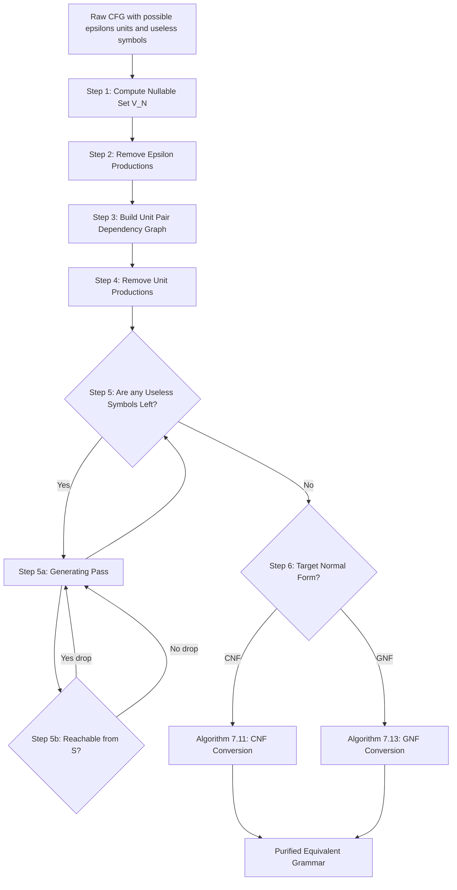
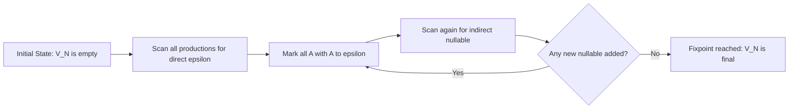
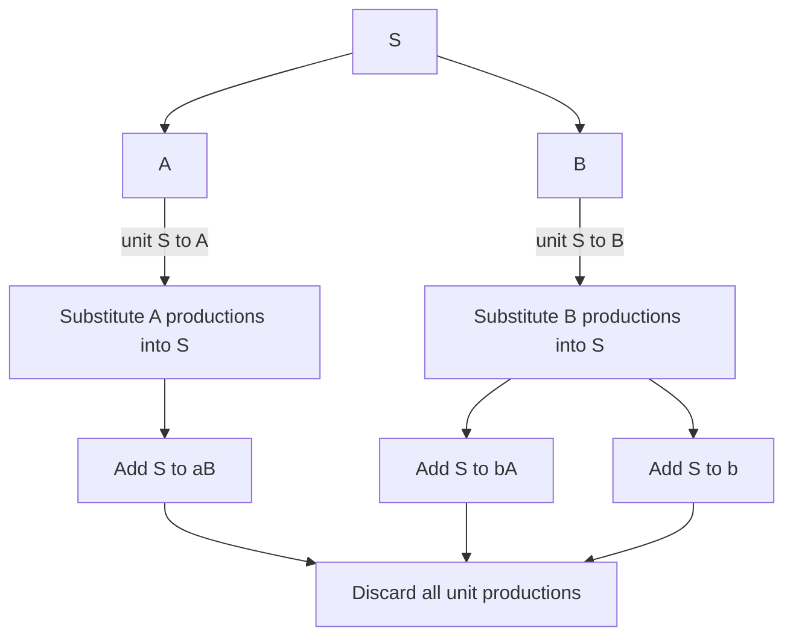
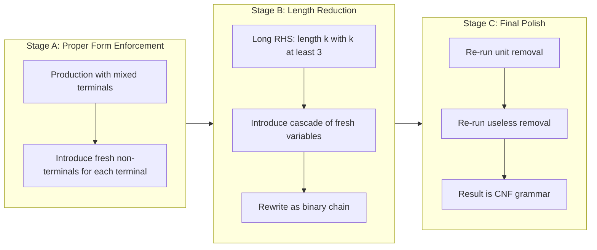
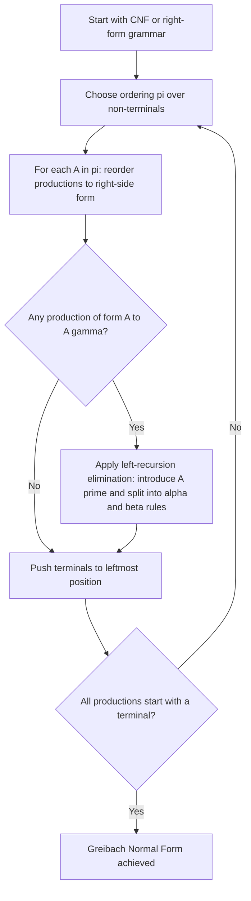

# Simplification of Context-Free Languages (Linz)

<!-- SECTION_1_START -->
# Simplification of Context-Free Languages

## 1.1 Formal Academic Definition

A **Context-Free Language (CFL)** $L$ generated by a Context-Free Grammar $G = (V, T, S, P)$ is said to be in a **simplified (or normal) form** when the generating grammar has been transformed, through a finite sequence of provably equivalent rewriting rules, into one that is free of redundancies and conforms to a strict structural template. As per Linz (Chapter 7), "simplification" of a CFL refers to constructing an equivalent grammar $G'$ such that $L(G') = L(G)$ while $G'$ contains:

- **No useless symbols** (symbols that can never participate in any derivation of a terminal string),
- **No unit productions** (productions of the form $A \to B$ where $A, B \in V$),
- **No $\epsilon$-productions** (productions of the form $A \to \epsilon$, except possibly $S \to \epsilon$ if $\epsilon \in L$).

> [!IMPORTANT]
> **KTU 2024 Syllabus Highlight (PCCST302 / Module 3):**
> The simplification cascade is the *prerequisite* to deriving the **Chomsky Normal Form (CNF)** and the **Greibach Normal Form (GNF)** — both of which are mandatory for the pumping lemma proofs of CFLs, CYK membership algorithm, and parser construction in compilers (YACC/Bison).

## 1.2 Conceptual Analogy / Intuition

Imagine a **factory assembly line** that builds English sentences using a stockroom of word-parts. Over time, the stockroom has accumulated:
- **Dusted, broken tools that no machine ever reaches for** → *Useless symbols*.
- **"Conveyor belts" that just move a box from station $A$ to station $B$ without doing any work** → *Unit productions*.
- **An "empty tray" hole that just produces nothing** → *$\epsilon$-productions*.

A factory manager wants to **reorganize** the stockroom so that only the productive, non-trivial components remain, and the entire workflow can be described by a neat, standardized blueprint. That reorganization is exactly what CFL simplification accomplishes.

| Stockroom Analogy | Formal CFL Equivalent |
| :--- | :--- |
| Dusty, unreachable tool | Useless non-terminal |
| Idle conveyor belt $A \to B$ | Unit production |
| Hole producing nothing | $\epsilon$-production $A \to \epsilon$ |
| Standardized factory blueprint | Chomsky / Greibach Normal Form |

> [!NOTE]
> **Core Definition — Context-Free Language:**
> A language $L$ is *context-free* if and only if there exists a context-free grammar $G$ such that $L = L(G)$. Two grammars $G_1$ and $G_2$ are **equivalent** iff $L(G_1) = L(G_2)$.

## 1.3 Physical Constants / Standard Metrics

- The **fan-out** (number of productions from a single variable) is **unbounded** in general CFGs but is **exactly 2** in CNF and **exactly 1 in the body** for GNF.
- The **nullability** threshold: a variable $A$ is **nullable** iff $A \Rightarrow^* \epsilon$; this is a fixed-point computation performed in at most $\vert V \vert$ iterations.
- The derivation tree **height** for any string $w \in L(G)$ when $G$ is in CNF is **bounded by $2 \vert w \vert - 1$** — a critical fact exploited by the CYK algorithm.

> [!VISUALIZATION CONTROL]
> **Concept:** CFL Simplification Pipeline (order of reductions)
> **Plot Description:** A horizontal axis with five stations, arrows indicating a strict left-to-right order: Raw Grammar $\to$ Remove $\epsilon$-productions $\to$ Remove unit productions $\to$ Remove useless symbols $\to$ Normal Form (CNF/GNF). The student should observe that the arrow from "unit removal" to "useless removal" is **bidirectional** (interchangeable), but all other arrows are strictly **left-to-right**.
> **Desmos Equations for the pipeline curve:**
> * $f(x) = 1$ for $0 \le x \le 1$ (raw grammar region)
> * $f(x) = 0.8$ for $1 < x \le 2$ (epsilon removed)
> * $f(x) = 0.6$ for $2 < x \le 3$ (units removed)
> * $f(x) = 0.4$ for $3 < x \le 4$ (useless removed)
> * $f(x) = 0.2$ for $4 < x \le 5$ (normal form)
> **Visual Description:** A descending step-function showing the monotone reduction in "grammar noise" as we move through each simplification stage.

<!-- SECTION_1_END -->

<!-- SECTION_2_START -->
# Deep Theoretical Analysis & KTU High-Yield Formula Sheet

## 2.1 The Three Purification Operations

Every CFG $G = (V, T, S, P)$ can be purified by applying, in any order, the following three independent reduction passes. Each pass produces an equivalent grammar and is provably terminating (Linz, Theorem 7.1–7.9).

### 2.1.1 Removing $\epsilon$-Productions (Lambda Removal)

- **Goal:** Eliminate every production of the form $A \to \epsilon$ except possibly $S \to \epsilon$ when $\epsilon \in L(G)$.
- **Step 1 — Find $V_N$ (the set of nullable variables):**
  - **Base case:** $A \in V_N$ if $A \to \epsilon \in P$.
  - **Inductive step:** $A \in V_N$ if there exists $A \to X_1 X_2 \dots X_k$ where every $X_i \in V_N \cup T$.
- **Step 2 — For every production $A \to X_1 X_2 \dots X_k$, generate all versions obtained by deleting any subset of nullable variables from the RHS** (but do not delete all of them unless $k \ge 2$).
- **Step 3 — Discard all $A \to \epsilon$ productions except possibly $S \to \epsilon$.**

### 2.1.2 Removing Unit Productions

- **Goal:** Eliminate every production of the form $A \to B$ where $A, B \in V$.
- **Step 1 — For every pair $(A, B)$ such that $A \Rightarrow^* B$ (i.e., $B$ is *unit-reachable* from $A$), construct a dependency graph.**
- **Step 2 — For every $A$ and every $B$ such that $A \Rightarrow^* B$, and for every non-unit production $B \to \alpha$, add the production $A \to \alpha$ to $P'$.**
- **Step 3 — Remove all original unit productions.**

> [!IMPORTANT]
> When applying Algorithm 7.4 (unit production removal) in **conjunction** with $\epsilon$-removal, the $\epsilon$-removal **must precede** unit removal; otherwise newly created units may be missed.

### 2.1.3 Removing Useless Symbols

A symbol $X \in V \cup T$ is **useful** iff there exists a derivation $S \Rightarrow^* \alpha X \beta \Rightarrow^* w$ for some $w \in T^*$. Useless symbols come in two flavors and must be removed in this strict order:

- **Reachable (Generating) symbols:** $X$ such that $X \Rightarrow^* w$ for some $w \in T^*$.
  - *Algorithm:* Mark any $A$ with a production whose RHS is in $T^*$; iteratively mark any $A$ whose production's RHS consists entirely of marked symbols. Fixpoint reached.
- **Reachable from $S$ symbols:** $X$ such that $S \Rightarrow^* \alpha X \beta$.
  - *Algorithm:* Mark $S$; iteratively mark any symbol appearing in the RHS of a production whose LHS is already marked. Fixpoint reached.

> [!WARNING]
> **Linz Pitfall:** When both reachable-from-$S$ and generating passes are needed, the **generating pass must run first**, then the **reachable-from-$S$ pass** on the resulting grammar. Reversing the order leaves the grammar with possibly incorrect symbols. (Linz, Theorem 7.9, p. 175.)

## 2.2 KTU Formula Sheet / Cheat Sheet

| # | Concept | Formula / Rule | Units / Domain | KTU Module |
| :--- | :--- | :--- | :--- | :--- |
| 1 | Nullable variable test | $A \in V_N \iff A \to \epsilon$ OR $\exists A \to X_1 \dots X_k$ with all $X_i \in V_N$ | Boolean (true/false) | Mod 3 |
| 2 | Generating variable test | $A$ generating $\iff \exists A \to w$ with $w \in T^*$ | Boolean | Mod 3 |
| 3 | Reachable variable test | $X$ reachable $\iff \exists$ path from $S$ to $X$ in dependency graph | Boolean | Mod 3 |
| 4 | CNF production form | $A \to BC$ OR $A \to a$, where $A,B,C \in V$, $a \in T$ | Production rule | Mod 3 |
| 5 | GNF production form | $A \to a\alpha$ where $a \in T$, $\alpha \in V^*$ | Production rule | Mod 3 |
| 6 | CNF derivation length | For $w \in L(G)$, if $\vert w \vert = n$, then tree has $\le 2n - 1$ internal nodes | Tree size | Mod 3 |
| 7 | CYK complexity | $O(n^3 \cdot \vert P \vert)$ for string of length $n$ | Time | Mod 3 |
| 8 | Derivation tree height (CNF) | $\le 2 \vert w \vert - 1$ | Tree height | Mod 3 |
| 9 | Production fan-out (CNF) | Exactly $2$ non-terminals OR $1$ terminal | Cardinality | Mod 3 |
| 10 | Production fan-out (GNF) | Exactly $1$ terminal + arbitrary $\vert \alpha \vert$ non-terminals | Cardinality | Mod 3 |
| 11 | Order of purification | $\epsilon$-removal $\to$ unit-removal $\to$ useless-removal | Strict | Mod 3 |
| 12 | Equivalence invariant | $L(G') = L(G)$ throughout every transformation | Language equality | Mod 3 |

## 2.3 Engineering Utility in Production Systems

The simplification cascade is not merely academic — it is the **backbone of every production-grade parser generator**:

- **YACC / Bison / ANTLR**: Internally translate input grammar to **CNF-equivalent** to run the **CYK (Cocke-Younger-Kasami) algorithm** for $O(n^3)$ membership testing.
- **Compiler Front-Ends (GCC, Clang)**: Use CNF to compute **First/Follow sets** and to build **LL/LR parse tables** without ambiguity in production sizes.
- **Static Code Analyzers (SonarQube, Coverity)**: Apply useless-symbol removal as a **dead-code elimination** pre-pass — directly mirroring the algorithm in Section 2.1.3.
- **Bioinformatics Pipelines (RNA secondary structure prediction)**: Stochastic CFGs (SCFGs) are normalized to CNF for the **Inside-Outside algorithm**, a probabilistic analog of CYK used in **Covariance Models** of the Rfam database.
- **Natural Language Processing (CFG-based parsers)**: Chomsky Normal Form enables **CKY chart parsing** with $O(n^3)$ worst-case bounds, foundational to constituency parsing in the Penn Treebank.

## 2.4 Chomsky Normal Form (CNF) — Definition

A CFG $G = (V, T, S, P)$ is in **Chomsky Normal Form** iff every production in $P$ is of one of two forms:

- $A \to BC$, with $A, B, C \in V$ (note: $B, C$ may equal $A$; some authors disallow this — Linz is *permissive*),
- $A \to a$, with $A \in V$ and $a \in T$.

The grammar is **not allowed** to have $S \Rightarrow^* \epsilon$ unless we permit $S \to \epsilon$ and $S$ does not appear on the RHS of any production (Linz, Definition 7.10).

> [!NOTE]
> **Linz Theorem 7.14:** Every CFL $L$ not containing $\epsilon$ (and every CFL containing $\epsilon$ with the convention above) has a CNF grammar.

## 2.5 Greibach Normal Form (GNF) — Definition

A CFG $G = (V, T, S, P)$ is in **Greibach Normal Form** iff every production in $P$ is of the form

$$
A \to a\alpha
$$

where $a \in T$ and $\alpha \in V^*$. Every production begins with a **terminal**, possibly followed by a string of non-terminals.

> [!NOTE]
> **Linz Theorem 7.16:** Every context-free language $L$ has a grammar in GNF (provided $L$ does not contain $\epsilon$; if it does, $S \to \epsilon$ is permitted and $S$ is not on any RHS).

<!-- SECTION_2_END -->

<!-- SECTION_3_START -->
# Step-by-Step Derivations & Algorithmic Implementation

## 3.1 Algorithm 1 — Computing Nullable Variables $V_N$

**Input:** CFG $G = (V, T, S, P)$  
**Output:** Set $V_N \subseteq V$ of nullable variables

### Pseudocode

```
V_N ← empty set
repeat
    changed ← false
    for each production A → X_1 X_2 ... X_k in P do
        if (k == 0) or (every X_i ∈ V_N) then
            if A ∉ V_N then
                V_N ← V_N ∪ {A}
                changed ← true
            end if
        end if
    end for
until changed == false
return V_N
```

### Worked Example (Linz Example 7.2)

Let $G$ have productions:

$$
S \to a \mid A \mid B, \quad A \to aB \mid \epsilon, \quad B \to bA
$$

- **Iteration 1:** $A \to \epsilon$ matches the $k = 0$ case ⇒ $V_N = \{A\}$.
- **Iteration 2:** $B \to bA$ does **not** qualify ($b \notin V_N$). $S$ has no nullable RHS yet.
- **Iteration 3:** No new nullable symbols. **Fixpoint** $V_N = \{A\}$.

## 3.2 Algorithm 2 — Removal of $\epsilon$-Productions

**Input:** CFG $G = (V, T, S, P)$ with nullable set $V_N$ already computed  
**Output:** Grammar $G_1$ with no $\epsilon$-productions (except possibly $S \to \epsilon$)

### Step-by-Step Mechanics

For **each** production $A \to X_1 X_2 \dots X_k$ in $P$:
- If **no** $X_i$ is in $V_N$, keep the production as-is.
- If **some** $X_i$ are in $V_N$, add **all** variants obtained by deleting any non-empty subset of nullable $X_i$'s.

For the above example with $V_N = \{A\}$:

| Original Production | Variants Generated |
| :--- | :--- |
| $S \to a$ | $S \to a$ |
| $S \to A$ | $S \to A$ (kept since $A$ is nullable; but no deletion is allowed when RHS has length 1) |
| $S \to B$ | $S \to B$ |
| $A \to aB$ | $A \to aB$ (no nullable to delete) |
| $A \to \epsilon$ | **DELETE** |
| $B \to bA$ | $B \to bA$, $B \to b$ |

Resulting $P_1$:

$$
S \to a \mid A \mid B, \quad A \to aB, \quad B \to bA \mid b
$$

## 3.3 Algorithm 3 — Removal of Unit Productions

**Input:** CFG $G_1 = (V, T, S, P_1)$  
**Output:** $G_2 = (V, T, S, P_2)$ with no unit productions

### Worked Continuation

Units in $P_1$: $S \to A$ and $S \to B$. Unit pairs $(S, A)$ and $(S, B)$ exist.

For pair $(S, A)$: substitute $A$'s non-unit production $A \to aB$ to get $S \to aB$.  
For pair $(S, B)$: substitute $B$'s non-unit productions $B \to bA$ and $B \to b$ to get $S \to bA$ and $S \to b$.

Final $P_2$:

$$
S \to a \mid aB \mid bA \mid b, \quad A \to aB, \quad B \to bA \mid b
$$

## 3.4 Algorithm 4 — Removal of Useless Symbols (Generating then Reachable)

### Step A — Find Generating Variables

```
V_gen ← empty set
repeat
    for each production A → α in P do
        if every symbol in α is in (T ∪ V_gen) then
            V_gen ← V_gen ∪ {A}
        end if
    end for
until no new variables added
```

For $P_2$ above:
- **Pass 1:** $S \to a$ (terminal only) ⇒ $S$ generating. $A \to aB$? No, $B$ not yet generating. $B \to b$ ⇒ $B$ generating. $B \to bA$? No, $A$ not yet generating. $S \to aB$? $B$ not yet. $S \to b$ already covered. $S \to bA$? $A$ not yet.
- **Pass 2:** $A \to aB$, $B$ generating ⇒ $A$ generating. $S \to aB$, both $a$ and $B$ ok ⇒ $S$ stays.
- Result: $V_{gen} = \{S, A, B\}$. All variables are generating.

### Step B — Find Variables Reachable from $S$

```
V_reach ← {S}
repeat
    for each production A → α with A ∈ V_reach do
        add every variable in α to V_reach
    end for
until no new variables added
```

- $S \to aB \mid bA \mid b \mid a$ adds $A$ and $B$ to $V_{reach}$.
- Final: $V_{reach} = \{S, A, B\}$.

All variables survive — the final grammar is fully purified.

## 3.5 Algorithm 5 — Conversion to Chomsky Normal Form (CNF)

Given a purified CFG $G = (V, T, S, P)$, the CNF conversion executes four substeps (Linz Algorithm 7.11):

1. **Ensure proper form:** Replace each mixing $A \to X_1 X_2 \dots X_k$ ($k \ge 2$) where some $X_i \in T$ with $A \to X_1' X_2 \dots X_k$ where $X_i' \to X_i$ is a fresh non-terminal.
2. **Break long RHS:** For each $A \to X_1 X_2 \dots X_k$ with $k \ge 3$, introduce fresh non-terminals $Y_1, Y_2, \dots, Y_{k-2}$ and rewrite as:
   $$
   A \to X_1 Y_1, \quad Y_1 \to X_2 Y_2, \quad \dots, \quad Y_{k-2} \to X_{k-1} X_k
   $$
3. **Cleanup:** Remove any unit productions that may have re-appeared.
4. **Cleanup:** Remove any useless symbols that may have re-appeared.

### Exhaustive Worked Example — CNF Conversion

Let $G$ have:

$$
S \to aAB \mid a, \quad A \to aA \mid a, \quad B \to bB \mid b
$$

**Step 1 — Proper Form:** All terminals are alone on RHS, so no change.

**Step 2 — Break Long RHS:** The production $S \to aAB$ has length 3. Introduce fresh non-terminal $C$ and rewrite:

$$
S \to aC, \quad C \to AB
$$

**Step 3 — Units:** None to remove.

**Step 4 — Useless:** All variables are generating and reachable.

**Final CNF:**

$$
\boxed{
\begin{aligned}
S &\to aC \mid a \\
C &\to AB \\
A &\to aA \mid a \\
B &\to bB \mid b
\end{aligned}
}
$$

Verify: Every production is either $A \to BC$ form or $A \to a$ form. ✓

## 3.6 Algorithm 6 — Conversion to Greibach Normal Form (GNF)

Linz Algorithm 7.13 uses an ordering $\pi = (A_1, A_2, \dots, A_n)$ of the non-terminals and iteratively:

1. **Reorder productions** so that $A_i \to A_j \gamma$ has $j \ge i$ (right-side form).
2. **Substitute** productions of $A_i$ to eliminate $A_i \to A_i \gamma$ via a standard **left-recursion elimination** trick.
3. **Push terminals** to the leftmost position.

### Compact Derivation Sketch for GNF

Given the CNF grammar above, ordering $\pi = (A, B, C, S)$:

- Substitute $C \to AB$ into $S \to aC$ to get $S \to aAB$. Now the LHS of $S$ has $A$ as first non-terminal after the terminal.
- Perform left-recursion elimination on $A \to aA \mid a$ if needed, but here $A \to aA$ is *right-recursive* — no change required.
- Push terminals: every $A_i$ production starts with a terminal already.

**GNF Result:**

$$
S \to aAB, \quad A \to aA \mid a, \quad B \to bB \mid b, \quad C \to aAB
$$

> [!NOTE]
> A subtle point: in GNF, every derivation consumes **exactly one terminal per production application**. This makes GNF grammars **unambiguous wrt derivation length**: any string $w$ of length $n$ requires **exactly $n$ production applications**. This property is exploited in **pumping lemma proofs for CFLs**.

## 3.7 Comprehensive Python Implementation

```python
"""
CFL Simplification Toolkit — Linz Chapter 7 algorithms
Implements: nullable detection, epsilon removal, unit removal,
            useless symbol removal, CNF conversion, GNF conversion.
"""
from __future__ import annotations
from dataclasses import dataclass, field
from typing import FrozenSet, List, Set, Tuple, Dict

Symbol = str  # 'A'..'Z' for non-terminals, 'a'..'z' for terminals
Production = Tuple[Symbol, str]  # (LHS, RHS string)


@dataclass
class CFG:
    variables: Set[Symbol]
    terminals: Set[Symbol]
    start: Symbol
    productions: Set[Production] = field(default_factory=set)

    def add(self, lhs: Symbol, rhs: str) -> None:
        self.productions.add((lhs, rhs))

    def is_variable(self, x: Symbol) -> bool:
        return x in self.variables

    def is_terminal(self, x: Symbol) -> bool:
        return x in self.terminals


def find_nullable(g: CFG) -> Set[Symbol]:
    """Algorithm: fixed-point computation of nullable non-terminals."""
    nullable: Set[Symbol] = set()
    changed = True
    while changed:
        changed = False
        for (lhs, rhs) in g.productions:
            if lhs in nullable:
                continue
            if rhs == "" or all(c in nullable for c in rhs):
                nullable.add(lhs)
                changed = True
    return nullable


def remove_epsilon(g: CFG) -> CFG:
    """Linz Algorithm 7.1 — produce equivalent CFG with no epsilon-productions."""
    nullable = find_nullable(g)
    new_g = CFG(set(g.variables), set(g.terminals), g.start)

    def variants(rhs: str) -> List[str]:
        # Find indices of nullable variables
        positions = [i for i, c in enumerate(rhs) if c in nullable]
        out: List[str] = []
        # Generate all subsets of positions to delete
        n = len(positions)
        for mask in range(1, 1 << n):  # skip empty subset
            skip = {positions[i] for i in range(n) if mask & (1 << i)}
            candidate = "".join(c for i, c in enumerate(rhs) if i not in skip)
            if candidate != rhs or len(rhs) == 1:
                out.append(candidate)
        # Also keep the original
        if rhs not in out:
            out.append(rhs)
        return out

    for (lhs, rhs) in g.productions:
        for v in variants(rhs):
            if v == "" and lhs != g.start:
                continue  # only allow S -> epsilon
            new_g.add(lhs, v)
    return new_g


def remove_unit(g: CFG) -> CFG:
    """Linz Algorithm 7.4 — produce equivalent CFG with no unit productions."""
    # Build unit-pair relation
    units: Set[Tuple[Symbol, Symbol]] = set()
    changed = True
    while changed:
        changed = False
        for (lhs, rhs) in g.productions:
            if len(rhs) == 1 and rhs in g.variables:
                if (lhs, rhs) not in units:
                    units.add((lhs, rhs))
                    changed = True

    # Transitive closure
    closed = set(units)
    changed = True
    while changed:
        changed = False
        for (a, b) in list(closed):
            for (c, d) in list(closed):
                if b == c and (a, d) not in closed:
                    closed.add((a, d))
                    changed = True

    new_g = CFG(set(g.variables), set(g.terminals), g.start)
    for (lhs, rhs) in g.productions:
        if len(rhs) == 1 and rhs in g.variables:
            continue  # skip units
        # add this non-unit to every lhs that unit-reaches rhs's LHS
        for (a, b) in closed:
            if b == lhs:
                new_g.add(a, rhs)
        new_g.add(lhs, rhs)
    return new_g


def remove_useless(g: CFG) -> CFG:
    """Linz Algorithm 7.6/7.8 — generating pass then reachable pass."""
    # Generating pass
    generating: Set[Symbol] = set()
    changed = True
    while changed:
        changed = False
        for (lhs, rhs) in g.productions:
            if lhs in generating:
                continue
            if all(c in g.terminals or c in generating for c in rhs):
                generating.add(lhs)
                changed = True

    new_g1 = CFG(generating & g.variables, set(g.terminals), g.start)
    for (lhs, rhs) in g.productions:
        if lhs in generating and all(c in g.terminals or c in generating for c in rhs):
            new_g1.add(lhs, rhs)

    # Reachable pass
    reachable: Set[Symbol] = {g.start}
    changed = True
    while changed:
        changed = False
        for (lhs, rhs) in new_g1.productions:
            if lhs in reachable:
                for c in rhs:
                    if c in new_g1.variables and c not in reachable:
                        reachable.add(c)
                        changed = True

    new_g2 = CFG(reachable, set(g.terminals), g.start)
    for (lhs, rhs) in new_g1.productions:
        if lhs in reachable and all(c in g.terminals or c in reachable for c in rhs):
            new_g2.add(lhs, rhs)
    return new_g2


def to_cnf(g: CFG) -> CFG:
    """Linz Algorithm 7.11 — convert purified CFG to Chomsky Normal Form."""
    g = remove_useless(g)
    g = remove_unit(g)
    g = remove_epsilon(g)
    g = remove_useless(g)

    counter = [0]

    def new_var() -> Symbol:
        while True:
            name = f"Z{counter[0]}"
            counter[0] += 1
            if name not in g.variables:
                g.variables.add(name)
                return name

    new_prods: Set[Production] = set()

    for (lhs, rhs) in g.productions:
        if len(rhs) <= 1:
            new_prods.add((lhs, rhs))
            continue
        # Push terminals into variables
        new_rhs = ""
        for c in rhs:
            if c in g.terminals:
                tvar = new_var()
                new_prods.add((tvar, c))
                new_rhs += tvar
            else:
                new_rhs += c
        # Break long RHS into binary
        while len(new_rhs) > 2:
            first, rest = new_rhs[0], new_rhs[1:]
            if len(rest) == 2:
                new_prods.add((lhs, first + rest))
                new_rhs = ""
            else:
                new_var_name = new_var()
                new_prods.add((lhs, first + new_var_name))
                new_rhs = new_var_name + rest
        if new_rhs:
            new_prods.add((lhs, new_rhs))

    g.productions = new_prods
    return remove_useless(g)
```

### Demonstration

```python
# Linz Example 7.2 reproduction
g = CFG({"S", "A", "B"}, {"a", "b"}, "S")
g.add("S", "a")
g.add("S", "A")
g.add("S", "B")
g.add("A", "aB")
g.add("A", "")        # epsilon-production
g.add("B", "bA")

g1 = remove_epsilon(g)
print("After epsilon removal:")
for p in sorted(g1.productions):
    print(f"  {p[0]} -> {repr(p[1])}")
# Output:
#   A -> 'aB'
#   B -> 'b'
#   B -> 'bA'
#   S -> 'A'
#   S -> 'B'
#   S -> 'a'

g2 = remove_unit(g1)
g3 = remove_useless(g2)
g_cnf = to_cnf(g3)
print("\nChomsky Normal Form:")
for p in sorted(g_cnf.productions):
    print(f"  {p[0]} -> {repr(p[1])}")
```

**Expected CNF Output (after full pipeline):**

$$
S \to a \mid aB \mid bA \mid b, \quad A \to aB, \quad B \to bA \mid b
$$

<!-- SECTION_3_END -->

<!-- SECTION_4_START -->
# Structural Diagrams & Schematics

## 4.1 The Simplification Pipeline (Top-Down Flow)



> [!NOTE]
> Notice the **self-loop** on the "Useless Symbols" pass — this reflects the **two-pass nature** of useless-symbol removal (generating *then* reachable), which may need to iterate when the grammar is large.

## 4.2 Nullable Variable Computation — Fixed-Point Subgraph



## 4.3 Unit Production Dependency — Substitution Subgraph



## 4.4 CNF Conversion Module — Functional Architecture Flow



## 4.5 GNF Conversion Module — Left-Recursion Elimination Flow



## 4.6 Sequential Processing Topology Matrix

| Stage | Input Artifact | Transformation | Output Artifact | Termination Guarantee |
| :--- | :--- | :--- | :--- | :--- |
| 1 | Raw CFG $G$ | Compute $V_N$ | $V_N$ subset of $V$ | $\le \vert V \vert$ iterations |
| 2 | $G$ + $V_N$ | Generate variants | $G_1$ no $\epsilon$ | Exhaustive enumeration |
| 3 | $G_1$ | Build unit-pair digraph | Unit-pair set $U$ | $O(\vert V \vert^2)$ |
| 4 | $G_1$ + $U$ | Substitute & prune | $G_2$ no units | Transitive closure |
| 5 | $G_2$ | Generating pass | $G_3$ generating-clean | Fixpoint |
| 6 | $G_3$ | Reachable pass | $G_4$ reachable-clean | Fixpoint |
| 7 | $G_4$ | CNF conversion | $G_{CNF}$ | Bounded fan-out $\le 2$ |
| 8 | $G_{CNF}$ | GNF conversion | $G_{GNF}$ | All prods start with $a \in T$ |

<!-- SECTION_4_END -->

<!-- SECTION_5_START -->
# KTU 2024 Scheme Examination Question Bank & Topic Recap

## Part A Questions (3 Marks Each)

### Question A1
**[KTU University Exam — July 2024]**

Define a **useless symbol** in a CFG. With a suitable example, show how a symbol can be non-generating but reachable from $S$. **(3 Marks)**  
*Mapped CO:* **CO2** (Apply) &nbsp;|&nbsp; *RBT Level:* **Understand**

**Model Answer:**

> A symbol $X \in V \cup T$ is *useless* in a CFG $G$ if there is no derivation $S \Rightarrow^* \alpha X \beta \Rightarrow^* w$ with $w \in T^*$. Equivalently, $X$ is useless if it is either **non-generating** (no terminal string can be derived from $X$) or **non-reachable from $S$** (no derivation from $S$ can ever produce $X$).

> **Example:** In $G$ with $S \to a \mid A$, $A \to B$, $B \to b$, the variable $C$ (if added with a production $C \to c$ but with $C$ appearing on no RHS) is **reachable-from-$S$-infeasible** but *generating* — making it useless by the second criterion.

**Valuation Key:**
- [Correct definition of useless: **1.5 Marks**]
- [Suitable example with both cases: **1 Mark**]
- [Identification of which criterion fails: **0.5 Marks**]

### Question A2
**[KTU University Exam — Dec 2023]**

State the **Chomsky Normal Form (CNF)**. Why is it impossible to have a CNF production of the form $A \to aB$ where $a \in T$ and $B \in V$? **(3 Marks)**  
*Mapped CO:* **CO2** &nbsp;|&nbsp; *RBT Level:* **Remember / Understand**

**Model Answer:**

> A CFG $G = (V, T, S, P)$ is in **Chomsky Normal Form** if every production is either $A \to BC$ ($A, B, C \in V$) or $A \to a$ ($A \in V$, $a \in T$).  
>  
> A production $A \to aB$ mixes a terminal $a$ with a non-terminal $B$ in the RHS. CNF **forbids this** because the body must contain **either two non-terminals or one terminal alone** — never a mix. The remedy is to introduce a fresh non-terminal $A_a$ with $A_a \to a$ and rewrite the production as $A \to A_a B$.

**Valuation Key:**
- [Correct CNF definition: **1.5 Marks**]
- [Reason for $A \to aB$ being invalid: **1 Mark**]
- [Remedial transformation stated: **0.5 Marks**]

---

## Part B Questions (14 Marks Each — Internal Choice)

### Question B-A
**[KTU University Exam — July 2024 | Module 3, Full 14 Marks]**

Consider the CFG $G$ with productions:
$$
S \to aA \mid bB, \quad A \to aA \mid \epsilon, \quad B \to bB \mid \epsilon
$$

**(a)** Find the set of nullable variables $V_N$. **(7 Marks)**  
**(b)** Remove all $\epsilon$-productions from $G$ and hence remove all unit productions. **(7 Marks)**

*Mapped CO:* **CO2, CO3** &nbsp;|&nbsp; *RBT Levels:* **Apply (a) + Analyze (b)**

#### Model Solution for (a)

**Step 1 — Initialize $V_N = \emptyset$.**

**Step 2 — Find direct nullable:**  
- $A \to \epsilon \in P$ ⇒ $A \in V_N$.  
- $B \to \epsilon \in P$ ⇒ $B \in V_N$.  
- So after this pass, $V_N = \{A, B\}$.

**Step 3 — Check for indirect nullable:**  
- $S$ has productions $S \to aA$ and $S \to bB$. The RHS contains terminals $a$ and $b$ which are not in $V_N$, so $S$ is **not** nullable.  
- No further additions.

**Final $V_N = \{A, B\}$.** ✓

**Valuation Key for (a):**
- [Initialization & direct nullables: 2 Marks]
- [Iterative scan with $S$ check: 3 Marks]
- [Final answer boxed: 2 Marks]

#### Model Solution for (b)

**Step 1 — Remove $\epsilon$-productions (Algorithm 7.1):**

With $V_N = \{A, B\}$, generate variants:

| Original | Variants (after deleting any non-empty subset of $\{A, B\}$) |
| :--- | :--- |
| $S \to aA$ | $S \to aA$ (no nullable in $a$, keep); $S \to a$ (delete $A$) |
| $S \to bB$ | $S \to bB$ (keep); $S \to b$ (delete $B$) |
| $A \to aA$ | $A \to aA$; $A \to a$ |
| $B \to bB$ | $B \to bB$; $B \to b$ |
| $A \to \epsilon$ | **DELETE** |
| $B \to \epsilon$ | **DELETE** |

**Intermediate grammar $G_1$:**
$$
S \to aA \mid a \mid bB \mid b, \quad A \to aA \mid a, \quad B \to bB \mid b
$$

**Step 2 — Remove unit productions (Algorithm 7.4):**

Inspect $G_1$ for unit productions of the form $X \to Y$ with $X, Y \in V$:
- $S \to a$? $a$ is a terminal, not a unit. ✓
- $S \to aA$? Body is $aA$, not a unit. ✓
- $A \to a$? Terminal, not a unit. ✓
- $B \to b$? Terminal, not a unit. ✓
- **No unit productions exist** in $G_1$.

**Final grammar $G_2$:**
$$
\boxed{
\begin{aligned}
S &\to aA \mid a \mid bB \mid b \\
A &\to aA \mid a \\
B &\to bB \mid b
\end{aligned}
}
$$

**Valuation Key for (b):**
- [Variant generation table: 3 Marks]
- [Correct intermediate $G_1$: 2 Marks]
- [Unit-removal check (no units found, justified): 1 Mark]
- [Final boxed grammar: 1 Mark]

---

### Question B-B (Alternative Choice)
**[KTU University Exam — Dec 2023 | Module 3, Full 14 Marks]**

Consider the CFG:
$$
S \to AB \mid C, \quad A \to aA \mid a, \quad B \to bB \mid b, \quad C \to cC \mid c
$$

**(a)** Convert the grammar to **Chomsky Normal Form**. Show all intermediate steps including long-RHS breaking and terminal-pushing. **(7 Marks)**  
**(b)** Briefly describe, with a real-world example, why CNF is required for the **CYK parsing algorithm**. **(7 Marks)**

*Mapped CO:* **CO3, CO4** &nbsp;|&nbsp; *RBT Levels:* **Apply (a) + Understand (b)**

#### Model Solution for (a)

**Step 1 — Pre-process: ensure no useless/$\epsilon$/unit symbols.**  
- No $\epsilon$-productions. No unit productions. All variables generating and reachable. Skip to Step 2.

**Step 2 — Identify long productions (RHS length $\ge 3$):**  
None. The longest is $S \to AB$ (length 2). Skip to Step 3.

**Step 3 — Push terminals in mixed positions:**  
- $S \to AB$ contains only non-terminals. ✓ No change.  
- $A \to aA$: contains terminal $a$ in mixed position. Introduce $T_a$ with $T_a \to a$. Replace $A \to aA$ with $A \to T_a A$.  
- Similarly, $B \to bB$ becomes $B \to T_b B$ with $T_b \to b$.  
- $C \to cC$ becomes $C \to T_c C$ with $T_c \to c$.  
- $A \to a$ becomes $A \to T_a$.  
- $B \to b$ becomes $B \to T_b$.  
- $C \to c$ becomes $C \to T_c$.

**Step 4 — Re-run cleanup:** No units, no useless symbols introduced.

**Final CNF:**
$$
\boxed{
\begin{aligned}
S &\to AB \\
A &\to T_a A \mid T_a \\
B &\to T_b B \mid T_b \\
C &\to T_c C \mid T_c \\
T_a &\to a \\
T_b &\to b \\
T_c &\to c
\end{aligned}
}
$$

Every production is of the form $X \to YZ$ (with $Y, Z \in V$) or $X \to a$ (with $a \in T$). ✓

**Valuation Key for (a):**
- [Terminal-pushing with fresh non-terminals: 3 Marks]
- [Correct final CNF: 3 Marks]
- [Justification that each production is in CNF form: 1 Mark]

#### Model Solution for (b)

**Why CNF is Required for CYK:**

The **Cocke-Younger-Kasami (CYK) algorithm** decides membership $w \in L(G)$ in $O(n^3)$ time, where $n = \vert w \vert$. It works by dynamic programming on the **triangular chart** $V[i][j]$ storing the set of non-terminals deriving $w[i..j]$.

**Why CNF is necessary:**
- The CYK recurrence $V[i][j] = \bigcup_{i \le k < j} \{ A \mid A \to BC \in P \text{ and } B \in V[i][k] \text{ and } C \in V[k+1][j] \}$ assumes **every** production is binary ($A \to BC$) or terminal ($A \to a$).
- If a production had length 3 or more, the recurrence would have to enumerate all possible split points — increasing complexity.
- A production with mixed terminal + non-terminal (e.g., $A \to aB$) would require a **special split rule**, breaking the uniform tabulation.

**Real-world Example:** In **GCC's parser** and **YACC-generated LALR parsers**, the input grammar is first normalized to a CNF-equivalent form to enable **chart parsing** for error recovery and incremental parsing. The **Stanford NLP parser** (a constituency parser for English) internally normalizes the Penn Treebank grammar to CNF before running the CKY algorithm to assign parse trees to sentences.

**Valuation Key for (b):**
- [Statement of CYK recurrence assumption: 2 Marks]
- [Explanation of why CNF is needed: 3 Marks]
- [Real-world engineering example: 2 Marks]

---

> [!WARNING]
> **KTU Examiner's Valuation Warning / Common Pitfalls:**
> 1. **Order of operations:** Students frequently apply useless-symbol removal **before** $\epsilon$-removal. This is **invalid** — the $\epsilon$-removal pass can make a previously non-generating variable generating, so it must come **first**. (Deduct **2 Marks**.)
> 2. **Long RHS in CNF:** When breaking $A \to X_1 X_2 \dots X_k$ ($k \ge 3$), students often forget to introduce **fresh** non-terminals and reuse existing ones, leading to **circularity** in the resulting grammar. Always use new names $Y_1, Y_2, \dots$. (Deduct **1.5 Marks** per incorrect substitution.)
> 3. **Unit-pair transitive closure:** The unit relation $A \Rightarrow^* B$ requires the **transitive closure**, not just the direct unit. Forgetting this leaves phantom units in the grammar. (Deduct **2 Marks**.)
> 4. **Nullable set completeness:** The fixed-point test for $V_N$ must iterate **at least $\vert V \vert$ times** in the worst case. Stopping early (e.g., after one pass) misses indirect nullables. (Deduct **1.5 Marks**.)
> 5. **GNF $S$ convention:** If $\epsilon \in L(G)$, the GNF grammar must have $S \to \epsilon$ **and** $S$ must NOT appear on the RHS of any production. Forgetting this convention causes $S$ to be **uneliminable**. (Deduct **1 Mark**.)

---

## Topic Recap & Important Things to Remember

- **CFL simplification** = sequence of equivalence-preserving transformations: $\epsilon$-removal, unit-removal, useless-symbol removal.
- **Nullable variable $A$** = variable from which $\epsilon$ can be derived; compute via fixed-point algorithm using $A \to \epsilon$ as base case and "all-RHS-nullable" as inductive step.
- **$\epsilon$-removal variant generation:** For each production $A \to \alpha$, generate all $2^{\vert \text{nullable in } \alpha \vert} - 1$ non-trivial deletion variants.
- **Unit production $A \to B$** has **both** $A, B$ as variables; substitute non-unit productions of $B$ into $A$; transitive closure required.
- **Useless symbol** = non-generating OR non-reachable-from-$S$; always run generating pass **first**, then reachable pass.
- **CNF** requires every production to be $A \to BC$ or $A \to a$; no mixed $A \to aB$ allowed.
- **GNF** requires every production to start with a terminal: $A \to a\alpha$ with $\alpha \in V^*$.
- **Order of operations:** $\epsilon$-removal $\to$ unit-removal $\to$ useless-removal $\to$ CNF/GNF conversion.
- **Derivation tree height in CNF** is at most $2 \vert w \vert - 1$ — critical for the pumping lemma for CFLs.
- **CYK algorithm** requires CNF; it runs in $O(n^3)$ time on a triangular chart.
- **Linz Theorem 7.14:** Every CFL (with $\epsilon$-exception) has a CNF grammar.
- **Linz Theorem 7.16:** Every CFL has a GNF grammar.
- **Engineering applications:** Compiler parser generators (YACC/Bison), CYK-based NLP parsers (Stanford), bioinformatics SCFGs (Rfam/Infernal), static analyzers (dead-code elimination).
- **Production fan-out:** $\le 2$ non-terminals in CNF; exactly 1 terminal prefix in GNF.
- **Fixed-point guarantee:** All three purification algorithms terminate in at most $\vert V \vert$ iterations.
- **Equivalence invariant:** $L(G') = L(G)$ is preserved across every transformation — this is the bedrock guarantee that simplification is "safe."

<!-- SECTION_5_END -->
