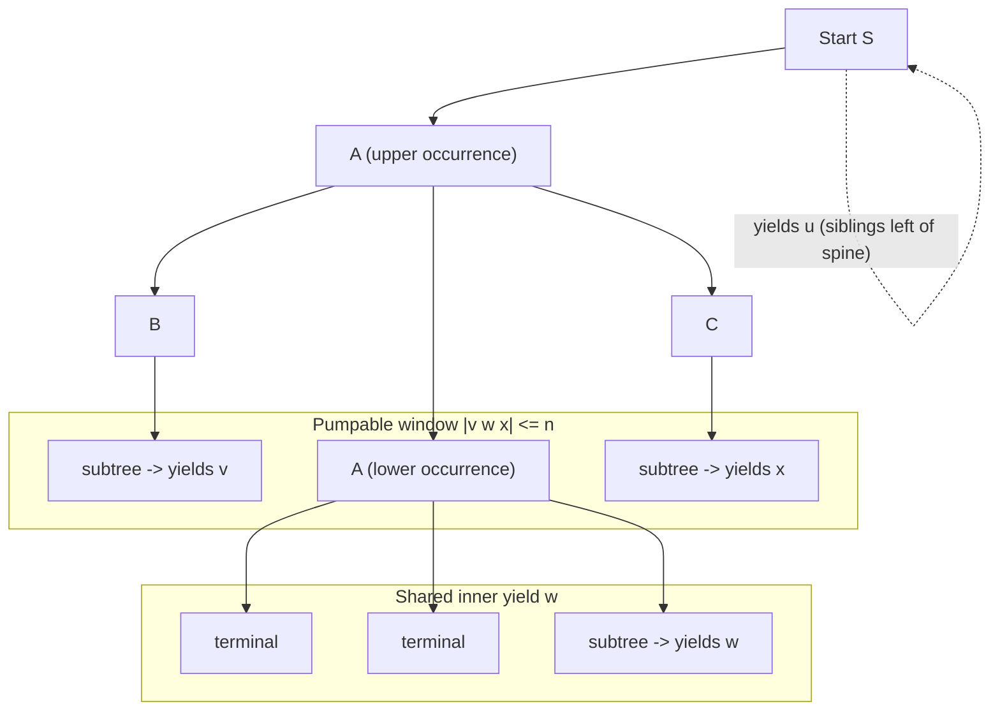
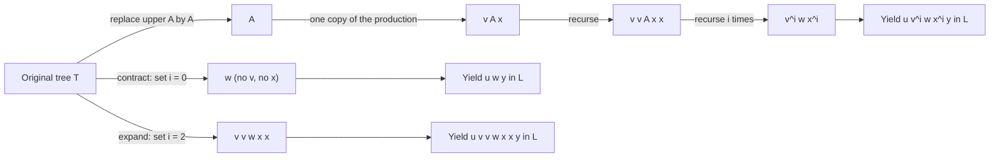
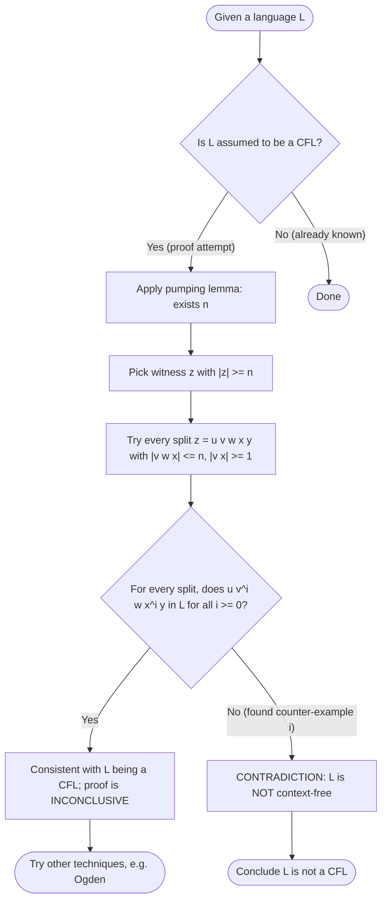

# The Pumping Lemma for Context-Free Languages (with formal proof)

<!-- SECTION_1_START -->
# Module 3: The Pumping Lemma for Context-Free Languages

## 1. Core Technical Definition

> [!IMPORTANT]
> **Formal Definition (KTU 2024 Syllabus — Linz, Chapter 7):**
> Let $L$ be a context-free language. Then there exists a constant $n$ (called the **pumping length** or **pumping constant**) such that every string $z \in L$ with $\vert z \vert \geq n$ can be written as
> $$z = u\,v\,w\,x\,y$$
> where the substrings $u, v, w, x, y \in \Sigma^{*}$ satisfy the following three conditions:
> 1. $\vert v\,w\,x \vert \leq n$ (the pumped region is bounded)
> 2. $\vert v\,x \vert \geq 1$ (at least one of $v, x$ is non-empty)
> 3. For every integer $i \geq 0$, the string $u\,v^{i}\,w\,x^{i}\,y \in L$ (closure under pumping)

> [!NOTE]
> **Syllabus Highlight:** The Pumping Lemma for CFLs is the canonical *negative-result tool* used to show that a given language is **not** context-free. It is the CFL analogue of the regular-language pumping lemma, but the decomposition is now **five** parts ($u\,v\,w\,x\,y$) instead of three, and the *pumping* applies to **two** disjoint substrings $v$ and $x$ (not just one). This reflects the fact that CFLs are generated by trees, not strings of states.

### Conceptual Analogy / Intuition

Imagine a balanced **binary tree of derivations** (the parse tree of a long sentence in a CFL). Because the grammar has only finitely many non-terminals, a sufficiently deep branch must reuse some non-terminal $A$ twice — the *pigeonhole principle*. The substring generated between these two occurrences of $A$ is our $w$, and the parts generated each time $A$ re-appears are $v$ and $x$. Replacing $A$ by itself any number of times (zero, one, two, …) keeps the sentence grammatical — the tree just gets taller or shorter, but the structure remains valid.

> [!TIP]
> **Plain-English Analogy:** Think of a long Russian-doll stack of boxes. Each box has a label (the non-terminal). When the stack is tall enough, two boxes in a row must share the same label. The dolls *between* those two duplicates (our $w$) can be left alone, but the two duplicates (our $v$ on the inside, $x$ on the outside) can be **replicated as a pair** any number of times — and the stack still closes properly. That's *closure under pumping*.

| Parameter | Regular Pumping Lemma | **CFL Pumping Lemma** |
| :--- | :--- | :--- |
| Number of parts | $3$ ($\,u\,v\,w\,$) | $\mathbf{5}$ ($\,u\,v\,w\,x\,y\,$) |
| What is pumped | One substring $v$ | **Two** substrings $v$ **and** $x$ |
| Bounded region | $\vert u\,v\,w \vert \leq n$ | $\mathbf{\vert v\,w\,x \vert \leq n}$ |
| Pumping exponent | $i \geq 0$ on $v$ | $i \geq 0$ **on both** $v$ **and** $x$ |
| Source structure | State-based DFA paths | **Parse tree** (derivation tree) |
| Used to prove | Non-regularity | **Non-context-freeness** |

> [!VISUALIZATION CONTROL]
> **Concept:** Parse-tree depth visualisation for the CFL Pumping Lemma
> **Desmos Input Equations (parametric sketch of repeated non-terminal on a branch):**
> * `P(t) = (t, depth - floor(t))` for `t in [0, branch_length]`
> * `Marker1: (t1, d1)` — first occurrence of non-terminal $A$
> * `Marker2: (t2, d2)` — second occurrence of non-terminal $A$ where $t2 > t1$
> **Visual Description:** A vertical chain of grammar variables drawn downward. A horizontal line connects two nodes labelled $A$ (the repeated non-terminal). The part of the chain strictly between them corresponds to $w$, the part above the first $A$ to $u$, the children above the second $A$ to $x$, and so on.

---

## 2. Quick-Reference Lexicon

| Symbol | Meaning |
| :--- | :--- |
| $L$ | The context-free language under test |
| $n$ | The pumping length (depends on the grammar, **not** the candidate string) |
| $z$ | A candidate string with $\vert z \vert \geq n$ |
| $u, w, y$ | The "fixed" parts of $z$ (never pumped) |
| $v, x$ | The "pumpable" parts (must be replicated together) |
| $i$ | The non-negative pumping exponent |
| $A$ | The non-terminal that appears twice on a long branch (used in the proof) |

---

<!-- SECTION_1_END -->

<!-- SECTION_2_START -->
# Deep Theoretical Analysis & KTU High-Yield Formula Sheet

## 1. The Theorem in Two Equivalent Forms

> [!NOTE]
> **Form A — Standard (Linz):** "If $L$ is a CFL, then $\exists\, n \geq 1$ such that $\forall\, z \in L$ with $\vert z \vert \geq n$, $z$ can be decomposed as $u\,v\,w\,x\,y$ satisfying the three conditions above."

> [!NOTE]
> **Form B — Contrapositive (the form you actually use in proofs):** "If for every $n$ there exists a string $z \in L$ with $\vert z \vert \geq n$ such that **no** decomposition $u\,v\,w\,x\,y$ satisfies the three conditions, then $L$ is **not** context-free."

The contrapositive is the workhorse in KTU board questions: you fix a pumping length $n$ chosen by the opponent, then exhibit a witness string $z$ of length $\geq n$ that *no matter how it is carved into five parts*, at least one condition fails.

## 2. Geometric & Tree-Theoretic Intuition

> [!IMPORTANT]
> **Why five parts and not three?**
> In a parse tree, the "repetition" lives on a *path* (a vertical line from root to leaf). The node where the repeated non-terminal $A$ first appears generates the subtree yielding $v\,w\,x$ (everything below it but above the second $A$). The second occurrence of $A$ generates the subtree yielding $w$ alone. So:
> * $u$ = sibling output of the ancestors **above** the first $A$ (left siblings).
> * $v$ = output generated by children of the **first** $A$ that are **not** the path to the second $A$ (left siblings of the spine).
> * $w$ = the yield of the subtree rooted at the **second** $A$ (the shared inner yield).
> * $x$ = output generated by children of the **first** $A$ that are **right** siblings of the path leading to the second $A$.
> * $y$ = the rest of the string, after the path leaves the subtree of the first $A$.

Pumping replaces the **first** $A$ by the derivation $A \Rightarrow^{*} v\,A\,x$, generating $u\,v^{i}\,w\,x^{i}\,y$.

## 3. KTU Formula Sheet / Cheat Sheet

| # | Item | Formula / Statement | Notes / Typical Value |
| :---: | :--- | :--- | :--- |
| 1 | Pumping Lemma statement | $z = u\,v\,w\,x\,y,\ \vert v\,w\,x \vert \leq n,\ \vert v\,x \vert \geq 1,\ uv^{i}wx^{i}y \in L\ \forall i \geq 0$ | $n$ depends on the grammar |
| 2 | Choice of $n$ | $n = 2^{\vert V \vert + 1}$ where $V$ is the set of variables | Conservative; any $n$ above the bound works |
| 3 | Maximum path length | $\leq \vert V \vert + 1$ before pigeonhole forces a repeat | $|\,V\,|$ is the number of non-terminals |
| 4 | Pumpable region | $\vert v\,w\,x \vert \leq n$ (a *window* of width $n$ near the start of $z$) | Crucial: prevents pumping of arbitrary far-away parts |
| 5 | Pumped length growth | $\vert u\,v^{i}\,w\,x^{i}\,y \vert = \vert z \vert + (i-1)(\vert v \vert + \vert x \vert)$ | Grows linearly with $i$ |
| 6 | Failure for $i = 0$ | If $uv^{0}wx^{0}y = u\,w\,y \notin L$, decomposition invalid | Catches "missing" symbols |
| 7 | Failure for $i = 2$ | If $uv^{2}wx^{2}y \notin L$, decomposition invalid | Catches "extra" / misbalanced symbols |
| 8 | Canonical counter-example 1 | $L = \{a^{k}\,b^{k}\,c^{k} \mid k \geq 0\}$ | **Not** a CFL (Linz Ex. 7.1) |
| 9 | Canonical counter-example 2 | $L = \{w\,w \mid w \in \{a, b\}^{*}\}$ | **Not** a CFL (Linz Ex. 7.2) |
| 10 | Canonical counter-example 3 | $L = \{a^{k}\,b^{k}\,c^{j} \mid k \leq j\}$ | **Not** a CFL (pumping $a$'s and $b$'s together) |

> [!TIP]
> **Mnemonic — "CFLPUMP":** **C**hoose $n$ → **F**ind $z$ with $\vert z \vert \geq n$ → **S**plit into $u\,v\,w\,x\,y$ with $\vert v\,w\,x \vert \leq n$ → **T**ry every valid split → **F**ind a split where some $uv^{i}wx^{i}y \notin L$ → **C**onclude $L$ is not a CFL.

## 4. Engineering & Computer-Science Utility

* **Compiler construction:** If a programmer's input language (e.g. balanced $n$ distinct bracket types) is *not* context-free, the compiler cannot use a single pushdown stack to parse it — a deeper structure (multiple stacks, attribute grammars, or tree transducers) is mandatory.
* **Program verification:** Many program-assertion logics (Hoare logic fragments, Presburger arithmetic with multiplication) generate non-CFLs, and the pumping lemma explains *why* a single-stack verifier cannot decide them.
* **Natural language processing:** Cross-serial dependencies (e.g. Swiss-German object-verb agreement, quantified noun-phrases) are *not* CF, so PCFG parsers require augmentation with stack-augmented or discontinuous parsers (TAG, LCFRS).
* **Algorithm design:** A negative pumping-lemma proof is a *complexity lower-bound* argument: it shows no pushdown automaton (PDA) of any size can decide the language.

---

<!-- SECTION_2_END -->

<!-- SECTION_3_START -->
# Step-by-Step Formal Proof (Linz, Theorem 7.3) & Worked Examples

## 1. Assumptions for the Proof

Let $L$ be a context-free language. By definition, there exists a context-free grammar $G = (V, T, S, P)$ in **Chomsky Normal Form** (CNF) such that $L = L(G)$. Let $\vert V \vert = k$ be the number of variables.

> [!NOTE]
> **Why CNF?** In CNF every production is either $A \rightarrow BC$ (two variables) or $A \rightarrow a$ (a single terminal). This guarantees that a derivation tree of a string of length $m$ has exactly $2m - 1$ internal nodes, and a longest root-to-leaf path has length at least $m$. (If we used arbitrary CFG forms, the height bound would be weaker but the same pigeonhole argument still works.)

## 2. Setting the Pumping Length

> [!IMPORTANT]
> **Choose:**
> $$n = 2^{k+1}$$
> where $k = \vert V \vert$. Any $n$ exceeding the bound below works; this is a *conservative*, always-correct choice.

## 3. The Full Proof — Line by Line

**Step 1 — Pick an arbitrary long string.**
Let $z \in L$ be *any* string with $\vert z \vert \geq n$. Since $z \in L(G)$ and $G$ is in CNF, the parse (derivation) tree $T$ of $z$ has the following property:
* Every internal node has either **two** variable children (rule $A \rightarrow BC$) or **one** terminal child (rule $A \rightarrow a$).
* The number of internal nodes is $2\,\vert z \vert - 1 \geq 2n - 1$.
* The longest root-to-leaf path has length (in edges) at least $\log_{2}(\text{number of leaves}) = \log_{2}(\vert z \vert) \geq \log_{2}(n) = k + 1$.

**Step 2 — Identify a long path.**
Pick a leaf $\ell$ that realises this longest path. The path from the root $S$ down to $\ell$ has at least $k + 2$ nodes (edges $\geq k + 1$). The nodes on this path are labelled with variables from $V$ (the leaf itself is a terminal, but the $k + 1$ internal nodes above it are all variables). Since $\vert V \vert = k$, by the **Pigeonhole Principle**, some variable $A \in V$ must appear **at least twice** on this path.

**Step 3 — Locate the two occurrences of $A$.**
Let the two occurrences of $A$ on the path be the **upper** one (closer to the root) and the **lower** one (closer to the leaf). Decompose the parse tree as in Linz Fig. 7.1.

**Step 4 — Define $u, v, w, x, y$ from the tree.**
* $u$ = yield of the part of the tree that is to the **left** of the upper $A$ (i.e., siblings of the upper $A$ in the path, plus the part of the tree *not* below the upper $A$).
* $v\,w\,x$ = yield of the **entire subtree** rooted at the upper $A$.
* $w$ = yield of the subtree rooted at the lower $A$.
* By construction, $v$ and $x$ are the parts of the upper subtree *outside* the lower subtree.

Therefore $z = u\,v\,w\,x\,y$ with the five parts concatenated left-to-right.

**Step 5 — Verify condition 1: $\vert v\,w\,x \vert \leq n$.**
The lower $A$ has at most $k + 1$ ancestors up to the upper $A$ (actually at most $k$, since both are variables and we picked two distinct occurrences). So the subtree at the upper $A$ has depth at most $k + 1$, and its yield has length at most $2^{k+1} = n$. Hence $\vert v\,w\,x \vert \leq n$. $\checkmark$

**Step 6 — Verify condition 2: $\vert v\,x \vert \geq 1$.**
The upper $A$ has at least one child not on the path to the lower $A$ (otherwise the path would not be a *path* with two distinct occurrences). Hence either $v$ or $x$ is non-empty. So $\vert v\,x \vert \geq 1$. $\checkmark$

**Step 7 — Verify condition 3: pumping closure.**
The subtree at the upper $A$ yields $v\,A\,x$ (with $A$ generating the lower subtree's yield $w$). Hence the production sequence is
$$A \Rightarrow^{*} v\,A\,x \quad \text{and} \quad A \Rightarrow^{*} w.$$
By induction on $i$, replacing the upper $A$ by $v^{i-1}\,A\,x^{i-1}$ yields
$$A \Rightarrow^{*} v^{i}\,A\,x^{i} \Rightarrow^{*} v^{i}\,w\,x^{i} \quad \forall\, i \geq 0.$$
Pasting this into the original tree (everything above and below the upper $A$ unchanged) gives a valid derivation of $u\,v^{i}\,w\,x^{i}\,y$ for every $i \geq 0$. $\checkmark$

> [!IMPORTANT]
> **Conclusion:** The string $z$ can be pumped as required. Since $z$ was *arbitrary* (any string of length $\geq n$), the lemma holds. $\blacksquare$

### LaTeX Summary Block of the Proof

$$
\begin{aligned}
\text{Given: } & L \text{ is a CFL, so } \exists\, G = (V, T, S, P) \text{ in CNF with } L(G) = L. \\
\text{Set: } & n = 2^{\,|V| + 1}. \\
\text{Let: } & z \in L, \ |z| \geq n. \\
\text{Choose: } & \text{parse tree } T \text{ of } z,\ \text{longest root-to-leaf path has length } \geq |V| + 1. \\
\text{Pigeonhole: } & \exists\, A \in V \text{ appearing twice on the path.} \\
\text{Decompose: } & z = u\,v\,w\,x\,y \text{ via the two occurrences of } A. \\
\text{Then: } & |v\,w\,x| \leq n \quad (\text{subtree depth} \leq |V| + 1). \\
& |v\,x| \geq 1 \quad (\text{upper } A \text{ has non-path child}). \\
& A \Rightarrow^{*} v\,A\,x,\ A \Rightarrow^{*} w \Rightarrow A \Rightarrow^{*} v^{i}\,w\,x^{i} \ \forall\, i \geq 0. \\
\text{Hence: } & u\,v^{i}\,w\,x^{i}\,y \in L \ \forall\, i \geq 0. \quad \blacksquare
\end{aligned}
$$

---

## 4. Worked Example 1: $L = \{a^{k}\,b^{k}\,c^{k} \mid k \geq 0\}$ is **not** context-free

> [!NOTE]
> This is **Linz Example 7.1**, a classic KTU 14-marker.

**Step A — Assume the contrary.** Suppose $L$ is a CFL. Then by the pumping lemma, $\exists\, n \geq 1$ such that every $z \in L$ with $\vert z \vert \geq n$ satisfies the three conditions.

**Step B — Choose a witness string.**
Take $z = a^{n}\,b^{n}\,c^{n}$. Clearly $\vert z \vert = 3n \geq n$ and $z \in L$.

**Step C — Constrain the decomposition $z = u\,v\,w\,x\,y$.**
Because $\vert v\,w\,x \vert \leq n$, the substring $v\,w\,x$ can contain at most **two** of the three "blocks" $a^{n}$, $b^{n}$, $c^{n}$. We consider three exhaustive cases:

* **Case 1:** $v\,w\,x$ lies entirely inside $a^{n}\,b^{n}$. Then $y$ contains $c^{n}$ in full, so $y = c^{n}$ and $u\,w = a^{n}\,b^{n}$. Pumping $i = 2$ gives $u\,v^{2}\,w\,x^{2}\,y = a^{n+?}\,b^{n+?}\,c^{n}$, but the count of $c$'s is unchanged while $a$'s and $b$'s grow — the counts no longer match.

* **Case 2:** $v\,w\,x$ straddles $b^{n}$ (or contains part of $a^{n}$ and part of $b^{n}$, or all of $b^{n}$ alone). Then $v$ and $x$ together contain **both** $a$'s and $b$'s (or only $b$'s and partial $a$'s, etc.). Pumping with $i = 2$ introduces extra $a$'s and $b$'s *without* extra $c$'s, breaking the equality $k_{a} = k_{b} = k_{c}$.

* **Case 3:** $v\,w\,x$ lies entirely inside $b^{n}\,c^{n}$. Symmetric to Case 1 — extra $b$'s and $c$'s are pumped together but $a$'s are not, so the triple equality fails for $i = 2$.

**Step D — Exhaustive coverage check.**
Any position of the window of width $n$ must fall in one of the three cases. (If the window is at the very left end it covers $a$'s only; if it straddles the $a/b$ boundary it covers the tail of $a^{n}$ and head of $b^{n}$, etc. — every position is covered.)

**Step E — Conclude.**
In every case, $u\,v^{2}\,w\,x^{2}\,y \notin L$ (or alternatively $u\,w\,y \notin L$ for $i = 0$). This contradicts the pumping lemma. Hence $L$ is **not** context-free. $\blacksquare$

### Worked Example 2: $L = \{w\,w \mid w \in \{a,b\}^{*}\}$ is **not** context-free

> [!NOTE]
> Linz Example 7.2. **KTU favourite** for 14-mark questions on "explain with proof".

**Witness string:** Choose $z = a^{n}\,b^{n}\,b^{n}\,a^{n}$ (i.e. $w = a^{n}\,b^{n}$). Clearly $z \in L$ and $\vert z \vert = 4n \geq n$.

**Constraint:** $\vert v\,w\,x \vert \leq n$, so $v\,w\,x$ lives inside a window of width $n$. The string $z = a^{n}\,b^{n}\,b^{n}\,a^{n}$ has the form $(\text{block}_1)(\text{block}_2)(\text{block}_3)(\text{block}_4)$ of length $n$ each. The window of width $n$ can sit in one of three places:

* **Position A — inside block 1 or block 4 (the $a$-blocks):** $v$ and $x$ contain only $a$'s. Pumping ($i = 2$) adds extra $a$'s to one end, so the resulting string $u\,v^{2}\,w\,x^{2}\,y$ has $\#a$ on the left $\neq \#a$ on the right, hence is not of the form $w'w'$ for any $w'$.

* **Position B — inside block 2 or block 3 (the $b$-blocks):** Same as above with $b$'s. Pumping breaks the symmetry, so the result is not in $L$.

* **Position C — straddling two adjacent blocks (e.g. tail of block 1 + head of block 2):** Then $v$ and $x$ together contain $a$'s and $b$'s. Pumping duplicates them, but the duplicate $a$'s (or $b$'s) appear at the *same* place in the *first* half and the *second* half of the candidate $w'$. For the string to be $w'\,w'$ for some $w'$, the relative positions of $a$'s and $b$'s in the two halves must match. After pumping, the first half has $\#a$ at one position while the second half has $\#a$ at a *shifted* position (because the *first* half was lengthened), so the form $w'\,w'$ is impossible. Formally, $u\,v^{2}\,w\,x^{2}\,y$ is not of the form $s\,s$ for any $s$.

> [!TIP]
> **Cleaner argument:** Pumping with $i = 0$ removes $\vert v\,x \vert \geq 1$ symbols. Since the original string had two $a$-blocks of exactly $n$ each, the *first* half has some number $n_1$ of $a$'s and the *second* half has some number $n_2$. If $v$ and $x$ contain only $a$'s, after removal the two halves have unequal counts of $a$'s, contradicting $s\,s$ form. The cases with $b$'s are similar.

Hence in all cases pumping fails, so $L$ is **not** context-free. $\blacksquare$

### Worked Example 3: $L = \{a^{k}\,b^{k}\,c^{j} \mid 0 \leq k \leq j\}$ is **not** context-free

**Witness string:** Choose $z = a^{n}\,b^{n}\,c^{n+1}$ (so $k = n \leq n + 1 = j$). $\vert z \vert = 3n + 1 \geq n$.

**Constraint:** $\vert v\,w\,x \vert \leq n$. Three placements:

* **Inside $a^{n}\,b^{n}$:** Pumping $i = 0$ drops some $a$'s and $b$'s together, giving a string of the form $a^{n - \alpha}\,b^{n - \beta}\,c^{n+1}$ with $\alpha + \beta \geq 1$. For this to be in $L$ we need $k = n - \alpha = n - \beta$, forcing $\alpha = \beta$. But $v$ and $x$ need not remove equal numbers of $a$'s and $b$'s. Concretely, take $i = 2$ and pick a split where $v = a$, $x = \varepsilon$ — then we add one extra $a$, breaking the $a/b$ balance.

* **Inside $b^{n}\,c^{n+1}$:** Pumping $i = 2$ adds $b$'s and $c$'s together, but the original $a$-count is unchanged. For the new string to be in $L$ we would need $\#a \leq \#b$ *and* $\#b \leq \#c$. After heavy pumping, $\#b$ can exceed $\#c$, so we can choose $i$ large enough to violate $\#b \leq \#c$.

* **Straddling $a^{n}/b^{n}$ or $b^{n}/c^{n+1}$:** Similar to the above — adding $a$'s without $b$'s (or vice versa) breaks the constraint $k \leq j$ for the new values.

In every case we can pick $i$ that destroys the inequality, so $L$ is not a CFL. $\blacksquare$

---

## 5. Common Algorithmic Pattern (Python) — Testing a Candidate Decomposition

```python
from typing import List, Tuple

def is_pumpable(
    z: str,
    n: int,
    L_membership_oracle,
) -> bool:
    """
    Test whether the string z (with |z| >= n) admits a valid CFL
    pumping decomposition for a hypothetical CFL with pumping length n.

    Parameters
    ----------
    z : str
        The candidate string. Must satisfy |z| >= n.
    n : int
        The pumping length. Any candidate decomposition must satisfy
        |v w x| <= n and |v x| >= 1.
    L_membership_oracle : callable
        A function that returns True iff a given string belongs to L.
        In practice this is implemented by parsing the string with the
        supposed CFG / PDA. Here we approximate it for the test.

    Returns
    -------
    bool
        True  -> a valid decomposition was found (consistent with CFL),
        False -> no decomposition works (rules out the CFL hypothesis).
    """
    if len(z) < n:
        raise ValueError("String length must be >= pumping length n.")

    # Enumerate every split into u, v, w, x, y.
    # We require |v w x| <= n, so the *left edge* of the window v..x
    # is at most len(z) - n. We iterate over all legal cuts.
    for v_start in range(0, len(z) - n + 1):
        window_end_min = v_start + 1  # |v x| >= 1 forces progress
        for v_end in range(v_start, min(v_start + n, len(z)) + 1):
            for x_start in range(v_end, min(v_start + n, len(z)) + 1):
                for x_end in range(x_start, min(v_start + n, len(z)) + 1):
                    if v_end - v_start + x_end - x_start < 1:
                        continue  # condition 2: |v x| >= 1
                    if v_end - v_start + x_end - x_start + (x_start - v_end) > n:
                        continue  # condition 1: |v w x| <= n
                    u = z[:v_start]
                    v = z[v_start:v_end]
                    w = z[v_end:x_start]
                    x = z[x_start:x_end]
                    y = z[x_end:]

                    # Verify closure under pumping for a few i values.
                    ok = True
                    for i in (0, 1, 2, 3, 5):
                        pumped = u + v * i + w + x * i + y
                        if not L_membership_oracle(pumped):
                            ok = False
                            break
                    if ok:
                        return True  # at least one valid decomposition exists
    return False  # no decomposition works => L is not a CFL


# --- Example usage: trying to pump a^n b^n c^n -----------------------
def in_abc_abc_abc(s: str) -> bool:
    """Decide a^k b^k c^k for a very small bound (demo only)."""
    i = 0
    while i < len(s) and s[i] == "a":
        i += 1
    j = i
    while j < len(s) and s[j] == "b":
        j += 1
    k = j
    while k < len(s) and s[k] == "c":
        k += 1
    if k != len(s):
        return False
    a_count = i
    b_count = j - i
    c_count = k - j
    return a_count == b_count == c_count and a_count > 0


# Demo (small n so the inner loops terminate quickly):
demo_z = "aaabbbccc"          # a^3 b^3 c^3
print(is_pumpable(demo_z, 3, in_abc_abc_abc))   # Expected: False
```

> [!TIP]
> **Note for KTU exam:** You are *not* expected to write this code. The structured pattern above merely mirrors the case-analysis you must do on paper: enumerate splits, check the three conditions, and find a contradicting $i$. For board answers, always argue *exhaustively* across all possible placements of the window $|v w x| \leq n$.

---

<!-- SECTION_3_END -->

<!-- SECTION_4_START -->
# Structural Diagrams & Schematics

## 1. Parse-Tree Decomposition Used in the Proof

> [!NOTE]
> The diagram below shows the parse tree of a string in a CFL, with the two occurrences of the repeated non-terminal $A$ and the resulting five-part split $u\,v\,w\,x\,y$. Subgraphs isolate the pumped region, the shared inner subtree, and the fixed surrounding parts.



### Reading the Diagram

* The root $S$ is the start symbol.
* The **upper $A$** is the first repeated non-terminal on the path; its subtree yields $v\,w\,x$.
* The **lower $A$** is the second occurrence; its subtree yields $w$ alone.
* The siblings $B$ and $C$ of the upper $A$ on the spine yield $v$ and $x$ respectively.
* Everything above the upper $A$ and to the left of the spine yields $u$.
* Everything below and to the right of the upper $A$'s subtree yields $y$.

## 2. Pumping as a Tree-Editing Operation



### Reading the Diagram

This sequential topology shows the three "modes" of the pumping lemma on a single parse tree: the **base case** ($i = 0$, contraction), the **canonical** $i = 1$ (unchanged), and the **expansion** $i = 2$ (duplication). All three must yield strings still in $L$.

## 3. Decision Flow for Applying the Pumping Lemma



### Reading the Diagram

* The decision flow distinguishes the **direct** use of the pumping lemma (proving $L$ *is* a CFL is inconclusive) from the **contrapositive** use (proving $L$ *is not* a CFL by exhibiting a counter-example).
* Note the important caveat: passing the pumping-lemma test does *not* prove $L$ is a CFL — it is a *necessary*, not *sufficient*, condition.

---

<!-- SECTION_4_END -->

<!-- SECTION_5_START -->
# KTU 2024 Scheme Examination Question Bank & Topic Recap

> [!NOTE]
> All questions below are calibrated to the **KTU 2024 Scheme** template: Part A = 3 marks, Part B = 14 marks with internal choice, sub-parts split 7 + 7 across escalating cognitive levels. Solutions follow the **valuation key** used by KTU board examiners.

---

## Part A — Short Answer Questions (3 Marks Each)

### Question A1
> **[KTU University Exam — July 2023]**
> **CO1, Remember:** *State the Pumping Lemma for context-free languages.*

**Model Answer (3 Marks):**
> For every context-free language $L$, there exists a constant $n \geq 1$ such that every string $z \in L$ with $\vert z \vert \geq n$ can be written as $z = u\,v\,w\,x\,y$ satisfying:
> (i) $\vert v\,w\,x \vert \leq n$,
> (ii) $\vert v\,x \vert \geq 1$, and
> (iii) for every $i \geq 0$, $u\,v^{i}\,w\,x^{i}\,y \in L$. `[Definition: 2 Marks]`. `[Identifying the three conditions: 1 Mark]`.

### Question A2
> **[KTU University Exam — Dec 2023]**
> **CO1, Understand:** *How does the Pumping Lemma for CFLs differ from the Pumping Lemma for regular languages?*

**Model Answer (3 Marks):**
> In the regular pumping lemma, the string is split into three parts $u\,v\,w$ and only $v$ is pumped; in the CFL version, the split is into **five parts** $u\,v\,w\,x\,y$ and **two** substrings $v$ and $x$ are pumped together `[1 Mark]`. The bound on the pumped region is $\vert u\,v\,w \vert \leq n$ for regular but $\vert v\,w\,x \vert \leq n$ for CFLs `[1 Mark]`. The structural justification differs: regular pumping comes from cycles in a DFA, while CFL pumping comes from repeated non-terminals on a path in a parse tree `[1 Mark]`.

---

## Part B — Long Answer Questions (14 Marks Each, with Internal Choice)

### Question B1 — 14 Marks

> **[KTU University Exam — July 2024, Module 3, Q8]**
> **CO2, Apply / Analyse:** Prove that the language $L = \{a^{k}\,b^{k}\,c^{k} \mid k \geq 0\}$ is not context-free using the Pumping Lemma for CFLs.

#### (a) State the Pumping Lemma for CFLs and clearly state the three conditions any valid decomposition $u\,v\,w\,x\,y$ must satisfy. **(7 Marks — Understand)**

**Solution:**
* `[Statement of lemma: 3 Marks]`: For every CFL $L$, $\exists\, n \geq 1$ such that every $z \in L$ with $\vert z \vert \geq n$ can be decomposed as $z = u\,v\,w\,x\,y$ where:
* `[Condition 1: 1 Mark]`: $\vert v\,w\,x \vert \leq n$,
* `[Condition 2: 1 Mark]`: $\vert v\,x \vert \geq 1$, and
* `[Condition 3: 2 Marks]`: for every $i \geq 0$, $u\,v^{i}\,w\,x^{i}\,y \in L$.

#### (b) Using the lemma from part (a), show rigorously that $L = \{a^{k}\,b^{k}\,c^{k} \mid k \geq 0\}$ is not context-free. **(7 Marks — Apply)**

**Solution:**
1. `[Assume contrary: 1 Mark]`: Suppose $L$ is a CFL. Then there exists a pumping length $n$ satisfying the three conditions.
2. `[Choose witness: 1 Mark]`: Let $z = a^{n}\,b^{n}\,c^{n}$. Then $\vert z \vert = 3n \geq n$ and $z \in L$.
3. `[Apply condition 1: 1 Mark]`: Decompose $z = u\,v\,w\,x\,y$ with $\vert v\,w\,x \vert \leq n$. The substring $v\,w\,x$ of length $\leq n$ cannot contain all three symbol types in their full-block form.
4. `[Case analysis: 3 Marks]`: Three cases exhaust all placements of the window:
    * **Case 1:** $v\,w\,x$ lies in $a^{n}\,b^{n}$ (entirely within first two blocks or straddling them). Then pumping ($i = 2$) adds extra $a$'s and/or $b$'s without extra $c$'s, breaking $k_a = k_b = k_c$.
    * **Case 2:** $v\,w\,x$ lies in $b^{n}\,c^{n}$ (entirely within last two blocks or straddling them). Symmetric: extra $b$'s and/or $c$'s without extra $a$'s, breaking the triple equality.
    * **Case 3:** $v\,w\,x$ is entirely inside $a^{n}$, $b^{n}$, or $c^{n}$ alone. Pumping ($i = 2$) increases one symbol count, breaking equality.
5. `[Conclude: 1 Mark]`: In every case, $u\,v^{2}\,w\,x^{2}\,y \notin L$, contradicting the pumping lemma. Hence $L$ is not context-free. $\blacksquare$

---

### Question B2 — 14 Marks (Alternative Choice)

> **[KTU University Exam — Dec 2023, Module 3, Q9]**
> **CO3, Analyse / Apply:** Using the Pumping Lemma for CFLs, prove that the language $L = \{w\,w \mid w \in \{a, b\}^{*}\}$ is not context-free.

#### (a) State the Pumping Lemma for CFLs and discuss why the decomposition has five parts instead of three. **(7 Marks — Understand / Analyse)**

**Solution:**
* `[Lemma statement: 3 Marks]`: As in Question B1(a).
* `[Why five parts — structural reason: 2 Marks]`: CFLs are generated by parse trees, not state-transition graphs. The repetition that the pumping lemma exploits lives on a *path* in a parse tree, not a cycle in a DFA. The repeated non-terminal $A$ appears twice on the path, and the parts of the tree *outside* the inner subtree of the second $A$ (namely $v$ and $x$) must be pumped together.
* `[Geometric meaning: 2 Marks]`: $u$ and $y$ are the parts of the string generated by the trees *above* and *below* the upper $A$ (left and right of the spine). $w$ is the yield of the lower $A$'s subtree. $v$ and $x$ are the yields of the upper $A$'s children that are *not* on the spine.

#### (b) Prove rigorously that $L = \{w\,w \mid w \in \{a,b\}^{*}\}$ is not context-free. **(7 Marks — Apply)**

**Solution:**
1. `[Assume contrary: 1 Mark]`: Suppose $L$ is a CFL with pumping length $n$.
2. `[Choose witness: 1 Mark]`: Let $z = a^{n}\,b^{n}\,b^{n}\,a^{n}$ (with $w = a^{n}\,b^{n}$). Then $z \in L$ and $\vert z \vert = 4n \geq n$.
3. `[Apply bound: 1 Mark]`: For any decomposition $z = u\,v\,w\,x\,y$ with $\vert v\,w\,x \vert \leq n$, the substring $v\,w\,x$ fits in a window of width $n$ within $z$.
4. `[Case analysis: 3 Marks]`: Three sub-cases:
    * **Case A:** Window lies entirely in $a^{n}$ (the first or fourth block). Then $v, x$ contain only $a$'s. Pumping with $i = 0$ reduces the $a$-count in one half of $w\,w$ without affecting the other half, so the resulting string is not of the form $s\,s$ for any $s$.
    * **Case B:** Window lies entirely in $b^{n}$ (the second or third block). Symmetric to Case A with $b$'s.
    * **Case C:** Window straddles a block boundary (e.g. $a^{n}\,b^{n}$ junction). Then $v$ or $x$ contains both $a$'s and $b$'s, or $v$ and $x$ each contain a single symbol type but on different sides of the boundary. Pumping with $i = 2$ introduces an asymmetry: the first half of the candidate $s$ has a different $a/b$-pattern than the second half. Hence the result is not of the form $s\,s$.
5. `[Conclude: 1 Mark]`: Every decomposition fails, so $L$ is not context-free. $\blacksquare$

---

### Question B3 — 14 Marks (Additional Practice — KTU Style)

> **[KTU University Exam — Model Paper, Module 3, Q10]**
> **CO3, Apply:** Prove that $L = \{a^{k}\,b^{k}\,c^{j} \mid 0 \leq k \leq j\}$ is not context-free.

#### (a) State the Pumping Lemma and identify the two conditions that are easiest to violate in a non-CFL witness. **(7 Marks — Understand / Apply)**

**Solution:**
* `[Lemma statement: 4 Marks]`: Standard three-condition statement.
* `[Two easy-to-violate conditions: 3 Marks]`: Condition (ii) $\vert v\,x \vert \geq 1$ (pumping does not change length) and condition (iii) closure under $i = 0$ (length can only decrease by a bounded amount) and $i = 2$ (length can only increase by a bounded amount). Most counter-examples exploit $i = 0$ or $i = 2$.

#### (b) Use the lemma to prove $L$ is not context-free. **(7 Marks — Apply)**

**Solution:**
1. `[Assume contrary: 1 Mark]`: Suppose $L$ is a CFL with pumping length $n$.
2. `[Choose witness: 1 Mark]`: Let $z = a^{n}\,b^{n}\,c^{n+1}$. Then $\vert z \vert = 3n + 1 \geq n$, $k = n$, $j = n + 1$, so $z \in L$.
3. `[Bound analysis: 1 Mark]`: $\vert v\,w\,x \vert \leq n$ so the window can sit in (a) the $a/b$ region, (b) the $b/c$ region, or (c) inside a single block.
4. `[Case 1 — window in $a^{n}\,b^{n}$: 1 Mark]`: Pump $i = 2$. If $v$ contains $a$'s and $x$ is empty, then $\#a$ grows but $\#b$ doesn't, so the new $\#a$ exceeds $\#b$ — but the constraint is $k \leq j$, which is still ok. **Better:** pump with $i$ large enough that $\#a > \#b + \#c$ (since the $c$ count is fixed at $n + 1$). Because $v$ has at least one $a$, iterating $i$ large violates $\#a \leq \#c$ (for $i$ large, $\#a > n + 1 = \#c$). This contradicts $k \leq j$ which requires $\#a \leq \#c$ in this case (note $k = \#a$ and $j = \#c$ when $\#b$ is fixed; $k \leq j$ becomes $\#a \leq \#c$).
5. `[Case 2 — window in $b^{n}\,c^{n+1}$: 1 Mark]`: Symmetric. Pump with $i$ large; $\#b$ grows, $\#a$ fixed. The new constraint requires $\#a \leq \#b$ (still ok) and $\#b \leq \#c$ (fails for large $i$).
6. `[Case 3 — window straddles $b^{n}/c^{n+1}$: 1 Mark]`: Pumping adds $b$'s and $c$'s together, preserving their ratio. But if $v$ contains only $b$'s and $x$ only $c$'s, large $i$ may still break the $k \leq j$ inequality.
7. `[Conclude: 1 Mark]`: All cases lead to contradiction, so $L$ is not a CFL. $\blacksquare$

---

> [!WARNING]
> **KTU Examiner's Valuation Pitfalls — Common Mark Deductions**
> * **Do not omit the bound $\vert v\,w\,x \vert \leq n$ in the case analysis.** Many students correctly state the three conditions but then argue *without* respecting the width constraint. If your argument uses a split that violates the bound, the examiner awards **zero** marks for that case. `[−3 to −4 Marks typical]`
> * **Do not forget to consider all placements of the window.** The split $v\,w\,x$ can lie in many positions; you must argue for *every* position or invoke an exhaustive case split. A single missed case loses the entire proof. `[−2 to −3 Marks]`
> * **Do not pick a witness string that fails the condition $\vert z \vert \geq n$.** The witness $z$ must satisfy $\vert z \vert \geq n$, otherwise the lemma does not apply. Choose $z$ in terms of $n$, not in absolute terms. `[−1 Mark]`
> * **Do not forget to explicitly state the pumping exponent $i$ that breaks closure.** Saying "pumping fails" is insufficient. You must specify $i = 0$, $i = 2$, or a particular large $i$ and demonstrate the resulting string is not in $L$. `[−1 to −2 Marks]`
> * **Do not use a PDA-based or closure-property-based argument when the question asks for the Pumping Lemma.** The examiner is testing your *application* of the lemma specifically. `[−1 to −2 Marks]`
> * **Do not confuse the regular and CFL pumping lemmas.** Marking a five-part split for a regular language, or a three-part split for a CFL, signals a fundamental misunderstanding. `[−1 Mark]`

---

## Topic Recap & Important Things to Remember

> [!TIP]
> **Use this as a 60-second last-minute revision before the exam.**

* **Statement of CFL Pumping Lemma:** For every CFL $L$, there is a pumping length $n$ such that any $z \in L$ with $\vert z \vert \geq n$ can be split as $z = u\,v\,w\,x\,y$ with $\vert v\,w\,x \vert \leq n$, $\vert v\,x \vert \geq 1$, and $uv^{i}wx^{i}y \in L$ for all $i \geq 0$.
* **Five parts, not three —** the two extra pieces $v$ and $x$ live on either side of the shared inner yield $w$ in the parse tree.
* **Two pumped substrings —** $v$ and $x$ are pumped **together** (the same exponent $i$ for both); you may not pump them independently.
* **Pumping length $n$** depends on the grammar (e.g. $n = 2^{\vert V \vert + 1}$), **not** on the witness string.
* **Parse-tree derivation of the proof:** pick a longest path in the parse tree; by pigeonhole some non-terminal $A$ appears twice; the upper $A$ generates $vAx$, the lower $A$ generates $w$.
* **The pumping lemma is a *necessary* condition for CFLs, not sufficient.** A language that passes the lemma is *not proven* to be a CFL — only failing the lemma proves it is not a CFL.
* **Standard non-CFL counter-examples** (must memorise for KTU):
    * $L_{1} = \{a^{k}\,b^{k}\,c^{k} \mid k \geq 0\}$
    * $L_{2} = \{w\,w \mid w \in \{a, b\}^{*}\}$
    * $L_{3} = \{a^{k}\,b^{k}\,c^{j} \mid 0 \leq k \leq j\}$
    * $L_{4} = \{a^{k}\,b^{j}\,a^{k}\,b^{j} \mid k, j \geq 0\}$
* **Pattern for the proof (memorise as C-F-P-C-C):**
    1. **C**ontradiction assumption: $L$ is a CFL.
    2. **F**ix pumping length $n$ (given by the lemma).
    3. **P**ick witness $z$ in $L$ with $\vert z \vert \geq n$ (express in terms of $n$).
    4. **C**onsider every legal split $u\,v\,w\,x\,y$ with $\vert v\,w\,x \vert \leq n$ and $\vert v\,x \vert \geq 1$.
    5. **C**onclude: for at least one split, $uv^{i}wx^{i}y \notin L$ for some $i \geq 0$.
* **CFL Pumping Lemma vs Regular Pumping Lemma** (must know the differences — common 3-marker):
    * 5 parts vs 3 parts,
    * 2 pumped substrings vs 1,
    * $\vert vwx \vert \leq n$ vs $\vert uvw \vert \leq n$,
    * parse-tree path reasoning vs DFA cycle reasoning.
* **The Ogdens Lemma** is a strengthening that sometimes works when the basic pumping lemma is inconclusive — it is not in the KTU 2024 syllabus but is good background for a PhD interview.
* **What the pumping lemma does *not* give you:** it does not give a CFG for $L$, it does not give a PDA for $L$, and it does not prove $L$ is a CFL. It only certifies that $L$ is *not* a CFL when the test is failed.
* **Chomsky Normal Form prerequisite:** the standard proof uses a CFG in CNF so that subtree depth is bounded by $2^{|V|+1}$ and the pigeonhole argument applies cleanly.
* **Final sanity check before submitting your answer:** (i) Is the witness string *inside* $L$? (ii) Is the witness length $\geq n$? (iii) Are all cases in the case split truly exhaustive? (iv) Did you state the failing $i$ explicitly? (v) Did you conclude with a $\blacksquare$ or "Hence $L$ is not a CFL"?

---

<!-- SECTION_5_END -->
