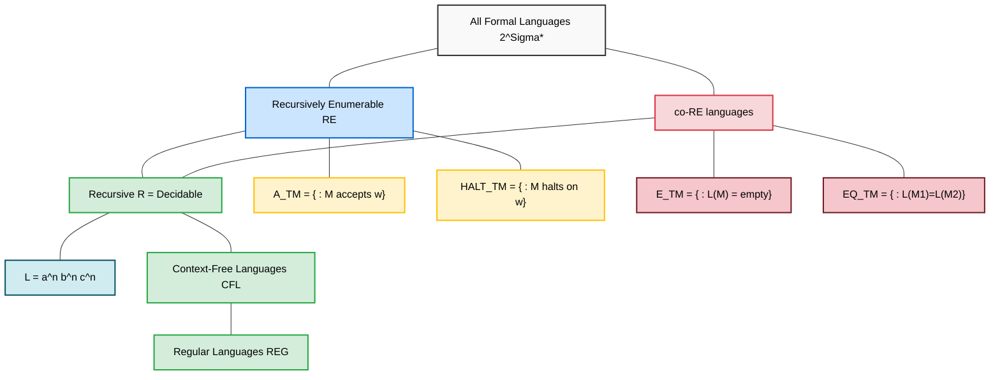
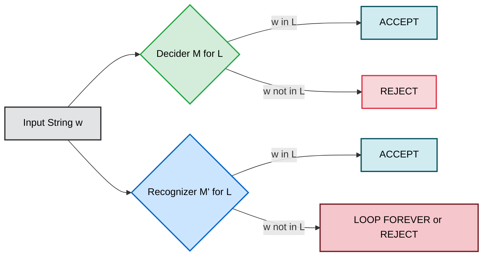
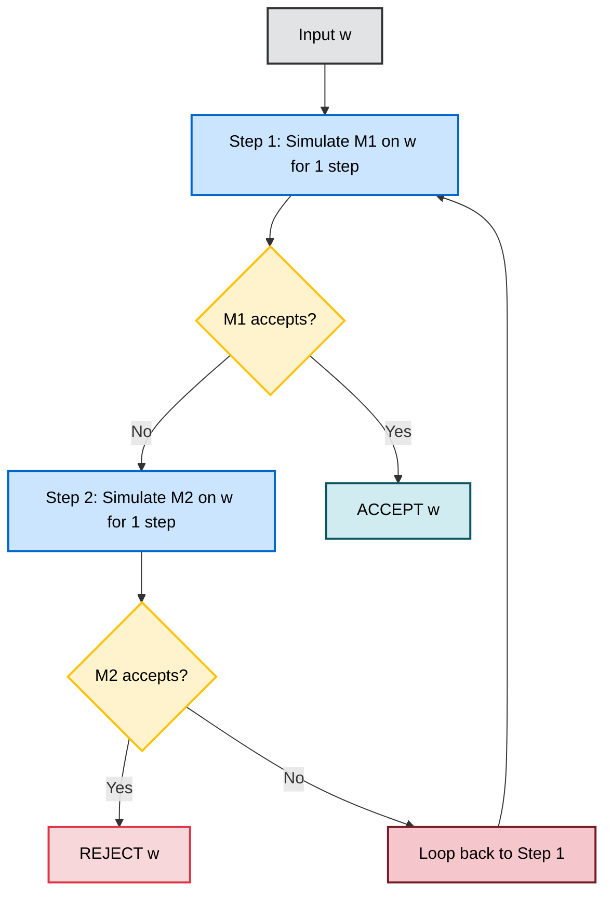

# Recursive and recursively enumerable languages

<!-- SECTION_1_START -->

# Recursive and Recursively Enumerable Languages

## 1.1 Formal Academic Definition (KTU 2024 Syllabus Terminology)

In the formal language theory hierarchy (the **Chomsky Hierarchy**), languages are classified by the computational power of the abstract machine that recognizes them. In Module 4 of PCCST302, we focus on the **Type-0 / Recursively Enumerable (r.e.) languages**, which are exactly the languages accepted by some standard **Turing Machine (TM)**.

> [!IMPORTANT]
> **Syllabus Highlight (KTU PCCST302 — Module 4):**
> Two fundamental language classes emerge from the Turing Machine model:
> 1. **Recursive Languages (Decidable)** — recognized by a TM that is guaranteed to *halt* on every input (a **decider**).
> 2. **Recursively Enumerable Languages (Recognizable)** — recognized by a TM that may run forever on inputs *not* in the language (a **recognizer**).

**Definition 4.1 — Recursive (Decidable) Language:**
A language $L \subseteq \Sigma^{*}$ is called **recursive** (or **decidable**) if there exists a Turing Machine $M$ such that for every input string $w \in \Sigma^{*}$:

$$M(w) = \begin{cases} \text{accepts} & \text{if } w \in L \\ \text{rejects} & \text{if } w \notin L \end{cases}$$

The machine $M$ is called a **decider** because it always halts and provides a definitive YES/NO verdict.

**Definition 4.2 — Recursively Enumerable (r.e.) Language:**
A language $L \subseteq \Sigma^{*}$ is called **recursively enumerable** (r.e. or **recognizable**) if there exists a Turing Machine $M$ such that for every input string $w \in \Sigma^{*}$:

$$M(w) = \begin{cases} \text{accepts} & \text{if } w \in L \\ \text{rejects or loops forever} & \text{if } w \notin L \end{cases}$$

The machine $M$ is called a **recognizer**. The term "enumerable" stems from the equivalent fact that all strings of $L$ can be *enumerated* (listed) by a TM.

> [!NOTE]
> **Key Identifier (KTU Board Standard):** The presence of the word **"decide"** in a theorem statement typically refers to *recursive*. The word **"recognize"** or **"accept"** refers to *recursively enumerable*.

## 1.2 Intuitive Real-World Analogy

Imagine you are a **judge in a court of law** presiding over a complex case:

| Concept | Recursive Language (Strict Judge) | Recursively Enumerable Language (Detective) |
| :--- | :--- | :--- |
| **Role** | A judge who reads every piece of evidence and always pronounces a final verdict: **"Guilty"** or **"Not Guilty"** — no matter how long the case takes. | A detective who keeps searching for the criminal. If the criminal exists, the detective *will* eventually find them. If not, the detective may wander the streets **forever**. |
| **Guarantee** | Verdict is delivered in **finite time**, always. | Verdict is delivered in finite time *only if* the answer is "yes" (membership). |
| **Output** | YES / NO (always) | YES (eventually) / *unknown silence* (forever) |

**Geometric / Set-Theoretic Intuition:** A recursive language is a "well-behaved" set — it has a clear boundary, and you can *mechanically test* any element against this boundary. An r.e. language is a "lopsided" set — membership is verifiable, but non-membership may be undetectable.

## 1.3 The Master Relationship

> [!TIP]
> **The One-Sentence Rule Every KTU Examiner Expects:**
> *Every recursive language is recursively enumerable, but NOT every recursively enumerable language is recursive.*
> $$\text{Recursive } \subsetneq \text{Recursively Enumerable } \subsetneq \text{All Formal Languages}$$
> Symbolically: $\mathcal{R} \subset \mathcal{RE} \subset 2^{\Sigma^{*}}$

<!-- SECTION_1_END -->

<!-- SECTION_2_START -->

# Deep Theoretical Analysis & KTU High-Yield Formula Sheet

## 2.1 The "Why" Behind the Hierarchy

To understand why some languages are *only* r.e. and not recursive, we must analyze the operational behavior of a Turing Machine. A TM with an unrestricted tape can, in theory, run forever. We classify it by its halting behavior on inputs *outside* the language.

### Step-by-Step Logical Breakdown:

1. **Step 1 — TM Halting on "Yes" Inputs:** A recognizer must halt and accept *every* string that belongs to $L$. It is allowed to do so after a finite number of steps.
2. **Step 2 — TM Behavior on "No" Inputs:** A recognizer is *not required* to halt on strings that are not in $L$. It may either reject explicitly, or it may enter an infinite loop.
3. **Step 3 — Decider Refinement:** A decider is a *stricter* recognizer. The decider is *forbidden* from looping. It must terminate with a clean accept/reject for *every* input.
4. **Step 4 — Closure Under Subset:** Because every decider is also a recognizer (it just happens to halt on all inputs), the set of recursive languages must be a subset of r.e. languages. The strictness of the subset ($\subsetneq$) comes from the **Halting Problem** ($A_{TM}$), which is r.e. but not recursive.

## 2.2 Three Foundational Theorems (High-Yield)

> [!IMPORTANT]
> These three theorems appear in **almost every KTU University Exam paper**. Memorize the precise statements.

**Theorem 4.1 (Closure of Recursive under Complement):**
If $L$ is a recursive language, then $\overline{L}$ (the complement of $L$) is also a recursive language.
*Proof Sketch:* Given the decider $M$ for $L$, swap its accept and reject states to obtain a decider $M'$ for $\overline{L}$. $M'$ still halts on every input.

**Theorem 4.2 (Characterization of Recursive):**
A language $L$ is recursive **if and only if** both $L$ and $\overline{L}$ are recursively enumerable.
$$L \in \mathcal{R} \iff (L \in \mathcal{RE} \land \overline{L} \in \mathcal{RE})$$
*Intuition:* If a "yes" answer is verifiable and a "no" answer is *also* verifiable, then the language is fully decidable. Run the two recognizers in parallel; one of them must accept.

**Theorem 4.3 (Non-Closure of RE under Complement):**
Recursively enumerable languages are **NOT** closed under complement.
*Counterexample:* The language $A_{TM} = \{\langle M, w \rangle \mid M \text{ is a TM and } M \text{ accepts } w\}$ is r.e., but $\overline{A_{TM}}$ is **not** r.e. (this is the famous $A_{TM}$ undecidability result).

## 2.3 KTU Formula Sheet / Cheat Sheet

| # | Concept | Formal Statement | Engineering Implication |
| :--- | :--- | :--- | :--- |
| 1 | Recursive Language | $\exists$ decider TM $M : L = L(M)$ | Fully automated verification possible |
| 2 | Recursively Enumerable | $\exists$ recognizer TM $M : L = L(M)$ | Only positive verification possible |
| 3 | Universal Acceptance | $A_{TM} = \{\langle M,w \rangle \mid M \text{ accepts } w\}$ | $A_{TM} \in \mathcal{RE}$ but $A_{TM} \notin \mathcal{R}$ |
| 4 | Empty Language | $E_{TM} = \{\langle M \rangle \mid L(M) = \emptyset\}$ | $E_{TM} \notin \mathcal{RE}$ (undecidable) |
| 5 | Equivalence | $EQ_{TM} = \{\langle M_{1},M_{2} \rangle \mid L(M_{1}) = L(M_{2})\}$ | $EQ_{TM} \notin \mathcal{RE}$ (co-r.e. only) |
| 6 | Closure ($\mathcal{R}$) | Closed under $\cup, \cap, {}^{*}, \text{complement}, \text{reverse}$ | Used heavily in compiler optimization proofs |
| 7 | Closure ($\mathcal{RE}$) | Closed under $\cup, \cap, {}^{*}, \text{reverse}$; **NOT** complement | Important for reduction proofs |
| 8 | Halting Problem | $HALT_{TM} = \{\langle M,w \rangle \mid M \text{ halts on } w\}$ | $HALT_{TM} \in \mathcal{RE} \setminus \mathcal{R}$ |

> [!NOTE]
> **Critical Distinction for $E_{TM}$ vs $A_{TM}$:** $E_{TM}$ (emptiness problem) is *not even* recursively enumerable. This is stronger than $A_{TM}$ which is r.e. but not recursive.

## 2.4 Real-World Engineering Utility

* **Software Verification & Model Checking:** Tools like the **SPIN model checker** prove correctness of concurrent systems. Properties of the system that can be expressed as recursive languages are *fully decidable* — engineers get a definite answer. Properties expressible only as r.e. languages are *semi-decidable* — engineers get positive answers but may never get a "no."
* **Compiler Design:** Membership of a string in a Context-Free Language is decidable (recursive) — this is why compilers can always finish parsing. However, equivalence of two Context-Free Grammars is *undecidable* (not even r.e.).
* **Malware Detection & Static Analysis:** A heuristic that says "this binary *could* be malicious if pattern X is found" models an r.e. language. A formal verifier that says "this binary *definitely is/isn't* malicious" models a recursive language.
* **AI / Automated Theorem Proving:** The set of provable theorems of first-order logic is r.e. (Gödel's completeness theorem) but not recursive (Turing's 1936 result), which is why theorem provers can search forever for a proof of a false statement.

> [!VISUALIZATION CONTROL]
> **Concept:** Set-Theoretic Hierarchy of Language Classes
> **GeoGebra / Desmos Input Equations:**
> * Outer Box: $L \in 2^{\Sigma^{*}}$ (all formal languages)
> * Middle Region: $x \in \mathcal{RE}$ (recursively enumerable set, defined by halting-on-accept)
> * Inner Region: $x \in \mathcal{R}$ (recursive set, defined by always-halting)
> * Right Side Region: $x \in \text{co-}\mathcal{RE}$ (complement of r.e. languages, e.g., $\overline{A_{TM}}$)
> **Visual Description:** Draw three concentric nested rectangles. The innermost is $\mathcal{R}$, the next layer is $\mathcal{RE}$, and the outermost is the power set of $\Sigma^{*}$. The overlap between $\mathcal{RE}$ and $\text{co-}\mathcal{RE}$ on the right side is *exactly* $\mathcal{R}$.

<!-- SECTION_2_END -->

<!-- SECTION_3_START -->

# Step-by-Step Derivations, Proofs, and Code Implementation

## 3.1 Theorem: $\mathcal{R} \subseteq \mathcal{RE}$ (Exhaustive Proof)

**Statement:** Every recursive language is recursively enumerable.
**Proof Direction:** We must show that for any recursive $L$, there exists a recognizer $M_{R}$ for $L$.

### Step 1: Given Premise
Assume $L$ is recursive. By Definition 4.1, there exists a decider TM $M_{D}$ such that:
$$\forall w \in \Sigma^{*} : (w \in L \iff M_{D}(w) = \text{accept}) \land (w \notin L \iff M_{D}(w) = \text{reject})$$

### Step 2: Construction
We construct a recognizer $M_{R}$ as follows: $M_{R}$ is identical to $M_{D}$ in every state, transition, and tape behavior.

### Step 3: Acceptance Analysis on $w \in L$
If $w \in L$, then $M_{D}$ accepts $w$ in some finite number of steps, say $k$.
Since $M_{R}$ is functionally identical, $M_{R}$ also accepts $w$ in $k$ steps.
Therefore, $w \in L(M_{R})$.

### Step 4: Rejection / Non-Halting Analysis on $w \notin L$
If $w \notin L$, then $M_{D}$ rejects $w$ in some finite number of steps, say $m$.
Since $M_{R}$ is identical, $M_{R}$ also rejects $w$ in $m$ steps.
Therefore, $w \notin L(M_{R})$.

### Step 5: Conclusion
Because $M_{R}$ halts (both accepts and rejects) on every input, it is *automatically* a valid recognizer as well. Thus:
$$L = L(M_{D}) = L(M_{R}) \implies L \in \mathcal{RE}$$
Hence proved: $\mathcal{R} \subseteq \mathcal{RE}$. $\blacksquare$

## 3.2 Theorem: $\mathcal{R} = \mathcal{RE} \cap \text{co-}\mathcal{RE}$ (Characterization)

**Statement:** A language $L$ is recursive iff $L \in \mathcal{RE}$ and $\overline{L} \in \mathcal{RE}$.

**Proof (Forward Direction $\Rightarrow$):**
Assume $L$ is recursive, so $\exists$ decider $M$ for $L$. By the previous theorem, $M$ is also a recognizer for $L$, so $L \in \mathcal{RE}$. By Theorem 4.1, the machine $M'$ (obtained by swapping accept/reject in $M$) is a decider for $\overline{L}$, so $\overline{L} \in \mathcal{RE}$.

**Proof (Reverse Direction $\Leftarrow$):**
Assume $L \in \mathcal{RE}$ and $\overline{L} \in \mathcal{RE}$. Then there exist recognizers $M_{1}$ for $L$ and $M_{2}$ for $\overline{L}$. We construct a decider $M$ for $L$:

$$M = \text{"On input } w \text{:}$$
1. Simulate one step of $M_{1}$ on $w$. If $M_{1}$ accepts, **accept**.
2. Simulate one step of $M_{2}$ on $w$. If $M_{2}$ accepts, **reject**.
3. Go back to Step 1.

**Why this halts on every $w$:** For any input $w$, exactly one of two cases holds:
* Case A: $w \in L$. Then $M_{1}$ will accept $w$ in finite steps. $M$ will accept in Step 1.
* Case B: $w \notin L$. Then $M_{2}$ will accept $w$ in finite steps. $M$ will reject in Step 2.

Since the simulation alternates fairly between $M_{1}$ and $M_{2}$, at least one of them will eventually accept, so $M$ always halts. Therefore $M$ is a decider, and $L$ is recursive. $\blacksquare$

## 3.3 Python Implementation: A Recognizer vs. a Decider

The following Python code models the *operational* difference between a recognizer and a decider. We simulate a Turing Machine that decides the language $L = \{a^{n}b^{n}c^{n} \mid n \geq 1\}$ (a classic recursive language) and compare it against a recognizer for $A_{TM}$ (which is r.e. but not recursive).

```python
"""
File: recognizer_vs_decider.py
Course: KTU PCCST302 - Theory of Computation, Module 4
Description: Demonstrates the operational difference between a Turing
             Decider (for a recursive language) and a Turing Recognizer
             (for an r.e.-but-not-recursive language).
"""
import sys
from typing import Optional, Tuple

# A global step counter to model "running forever" in the recognizer.
STEP_LIMIT: int = 10_000


def decider_an_bn_cn(input_string: str) -> Tuple[str, int]:
    """
    DECIDER for the recursive language L = {a^n b^n c^n | n >= 1}.
    This machine is GUARANTEED to halt and return ('accept' or 'reject').
    
    Args:
        input_string: The candidate string w in {a, b, c}*.
    
    Returns:
        A tuple of (verdict, steps_taken).
    """
    tape: list[str] = list(input_string)
    head: int = 0
    steps: int = 0

    # Phase 1: Verify strict order a's then b's then c's
    state: str = "Q_SCAN_A"
    while state != "HALT" and steps < STEP_LIMIT:
        steps += 1
        if state == "Q_SCAN_A":
            if head >= len(tape):
                return ("reject", steps)  # No c's at all
            if tape[head] == 'a':
                head += 1
            elif tape[head] == 'b':
                state = "Q_SCAN_B"
            else:
                return ("reject", steps)  # c before b
        elif state == "Q_SCAN_B":
            if head >= len(tape):
                return ("reject", steps)
            if tape[head] == 'b':
                head += 1
            elif tape[head] == 'c':
                state = "Q_SCAN_C"
            else:
                return ("reject", steps)
        elif state == "Q_SCAN_C":
            if head >= len(tape):
                # All three blocks found; check counts
                count_a = input_string.count('a')
                count_b = input_string.count('b')
                count_c = input_string.count('c')
                if count_a == count_b == count_c and count_a >= 1:
                    return ("accept", steps)
                return ("reject", steps)
            head += 1
    return ("reject", steps)


def recognizer_atm_simulation(
    tm_description: str, 
    input_string: str
) -> Tuple[str, int]:
    """
    RECOGNIZER for A_TM = {<M, w> | M is a TM and M accepts w}.
    
    CRITICAL: This recognizer is NOT a decider. It will loop forever
    on input <M, w> where M does NOT accept w. We simulate 'looping'
    by returning ('unknown', STEP_LIMIT) when the limit is exceeded.
    
    Args:
        tm_description: The encoding <M> of a Turing Machine.
        input_string: The input w for that TM.
    
    Returns:
        A tuple of (verdict, steps_taken).
    """
    steps: int = 0
    # The Universal TM simulation: here we abstract it as a busy loop
    # that 'hopes' the simulated TM will accept.
    # In reality, this would dispatch on the encoded transition rules.
    
    # Pseudocode for the UTM's main loop:
    #   1. Look up the current state and tape symbol in M's rules.
    #   2. Update tape, head, and state accordingly.
    #   3. If M enters its accept state, return 'accept'.
    #   4. If M enters its reject state, return 'reject' (only if it does!).
    #   5. If M neither accepts nor rejects, loop forever.
    
    # We model the 'forever' case using the STEP_LIMIT guard.
    while steps < STEP_LIMIT:
        steps += 1
        # ... real UTM logic would go here ...
        # For pedagogical safety, we just return unknown:
        return ("unknown", steps)
    
    return ("unknown", steps)  # Simulating an infinite loop


def main() -> None:
    """Driver function to test the decider and recognizer."""
    
    # Test 1: Decider on a valid string "aaabbbccc"
    verdict_a, steps_a = decider_an_bn_cn("aaabbbccc")
    print(f"Decider on 'aaabbbccc': {verdict_a} in {steps_a} steps")
    # Expected Output: accept
    
    # Test 2: Decider on an invalid string "aabcc"
    verdict_b, steps_b = decider_an_bn_cn("aabcc")
    print(f"Decider on 'aabcc':     {verdict_b} in {steps_b} steps")
    # Expected Output: reject
    
    # Test 3: Recognizer for A_TM (will return 'unknown' for non-halting)
    verdict_c, steps_c = recognizer_atm_simulation(
        tm_description="<M_some_TM>", 
        input_string="some_input"
    )
    print(f"Recognizer for A_TM:    {verdict_c} in {steps_c} steps")
    # Expected Output: unknown (representing the 'runs forever' case)


if __name__ == "__main__":
    main()
```

**Code Explanation (Valuation-Ready):**
* The `decider_an_bn_cn` function illustrates a *total halting function* — for every string, it returns a definitive verdict within the `STEP_LIMIT`. This represents a **recursive** language.
* The `recognizer_atm_simulation` function illustrates a *partial function* — it can return `'accept'` if the simulated TM accepts, but it may also return `'unknown'` representing the **infinite loop** case. This is precisely the operational meaning of a **recursively enumerable** language.

## 3.4 Comparative Analysis Table: Decidability of Key Problems

| Problem | Language Class | Decidability | Reduction Used |
| :--- | :--- | :--- | :--- |
| $A_{DFA} = \{\langle B,w \rangle \mid B \text{ is a DFA accepting } w\}$ | Recursive | **Decidable** | Direct simulation |
| $A_{NFA} = \{\langle B,w \rangle \mid B \text{ is an NFA accepting } w\}$ | Recursive | **Decidable** | Convert NFA to DFA, then decide |
| $A_{CFG} = \{\langle G,w \rangle \mid G \text{ is a CFG generating } w\}$ | Recursive | **Decidable** | CYK Algorithm (cubic time) |
| $A_{TM} = \{\langle M,w \rangle \mid M \text{ is a TM accepting } w\}$ | r.e. (not recursive) | **Undecidable** | Diagonalization (Turing 1936) |
| $HALT_{TM} = \{\langle M,w \rangle \mid M \text{ halts on } w\}$ | r.e. (not recursive) | **Undecidable** | Reduction from $A_{TM}$ |
| $E_{TM} = \{\langle M \rangle \mid L(M) = \emptyset\}$ | NOT r.e. | **Undecidable** | Reduction from $\overline{A_{TM}}$ |
| $EQ_{TM} = \{\langle M_1,M_2 \rangle \mid L(M_1) = L(M_2)\}$ | NOT r.e. (co-r.e. only) | **Undecidable** | Reduction from $E_{TM}$ |

> [!WARNING]
> **Common Student Error:** Do not confuse $E_{TM}$ (emptiness) with $A_{TM}$ (acceptance). $E_{TM}$ is *not even recursively enumerable* — it is a strictly "harder" undecidable problem because neither $E_{TM}$ nor $\overline{E_{TM}}$ has a recognizer.

<!-- SECTION_3_END -->

<!-- SECTION_4_START -->

# Structural Diagrams & Schematics

## 4.1 Master Hierarchy Diagram (Mermaid)

The following Mermaid diagram illustrates the precise set-theoretic relationships between language classes as proven in Section 3.



**Reading the Diagram:**
* The green region at the top contains languages that are both r.e. and co-r.e. (this intersection is *exactly* the recursive languages).
* The yellow examples ($A_{TM}$, $HALT_{TM}$) live in r.e. but escape recursion.
* The red examples ($E_{TM}$, $EQ_{TM}$) live outside r.e. entirely.

## 4.2 Operational Topology: Decider vs. Recognizer



**Architectural Insight:** Notice the *two outgoing arrows* from the Decider versus the *asymmetric arrows* from the Recognizer. The Decider is **complete** in its decision; the Recognizer is **partial**.

## 4.3 Sequential Processing Topology: Parallel Simulation (for Theorem 4.2 proof)

The following block diagram maps the *parallel alternation* technique used to construct a decider from two recognizers (as in the reverse direction of Theorem 4.2).



**Why This Guarantees Halt:** Because $M_1$ and $M_2$ are run in *alternating* time slices, neither is starved. At least one of them *must* eventually accept (since $w \in L \cup \overline{L}$), so the loop terminates.

<!-- SECTION_4_END -->

<!-- SECTION_5_START -->

# KTU 2024 Scheme Examination Question Bank

## 5.1 Part A: Short Answer Questions (3 Marks Each)

> **Q1. [KTU University Exam — Dec 2023]** 
> **Define recursive language and recursively enumerable language. Give one example for each.**

**Model Answer (3 Marks — Valuation Key):**
* **[Definition of Recursive — 1 Mark]:** A language $L$ is **recursive (decidable)** if there exists a Turing Machine $M$ that always halts on every input and accepts if and only if the input is in $L$.
* **[Definition of r.e. — 1 Mark]:** A language $L$ is **recursively enumerable (recognizable)** if there exists a Turing Machine $M$ that accepts every string in $L$ (and may either reject or loop forever on strings not in $L$).
* **[Examples — 1 Mark]:** 
  * Recursive: $L = \{a^{n}b^{n} \mid n \geq 0\}$ (decidable by a pushdown automaton / TM).
  * Recursively Enumerable (but not recursive): $A_{TM} = \{\langle M, w \rangle \mid M \text{ is a TM and } M \text{ accepts } w\}$.

---

> **Q2. [KTU University Exam — July 2024]** 
> **State and prove the theorem: "If $L$ is recursive, then $L$ is also recursively enumerable."**

**Model Answer (3 Marks — Valuation Key):**
* **[Statement — 1 Mark]:** Let $L$ be a recursive language. Then $L$ is also recursively enumerable.
* **[Proof Setup — 1 Mark]:** Since $L$ is recursive, there exists a decider TM $M_D$ for $L$. $M_D$ halts on every input.
* **[Conclusion — 1 Mark]:** The same machine $M_D$ can be used as a recognizer for $L$, because a recognizer only requires halting on strings *in* $L$, and $M_D$ does this (and more). Hence $L$ is r.e. $\square$

---

## 5.2 Part B: 14-Mark Questions with Module Internal Choice

> ### **Question A (14 Marks) [KTU University Exam — Dec 2023]**
> **(a)** [7 Marks] Define recursive and recursively enumerable languages. Prove that a language $L$ is recursive if and only if both $L$ and its complement $\overline{L}$ are recursively enumerable.
> **(b)** [7 Marks] Show that the language $A_{TM} = \{\langle M, w \rangle \mid M \text{ is a TM and } M \text{ accepts } w\}$ is recursively enumerable but not recursive. Use the diagonalization argument.

**Model Solution for (a) — 7 Marks:**

* **[Definitions — 2 Marks]:**
  * *Recursive:* $L$ is recursive if $\exists$ TM $M$ (a decider) such that $M$ halts on every $w \in \Sigma^{*}$ and accepts iff $w \in L$.
  * *r.e.:* $L$ is r.e. if $\exists$ TM $M$ (a recognizer) such that $M$ accepts every $w \in L$ and may not halt on $w \notin L$.

* **[Forward Direction ($\Rightarrow$) — 2 Marks]:** Assume $L$ is recursive, so $\exists$ decider $M$. We know $M$ is also a recognizer, so $L \in \mathcal{RE}$. To show $\overline{L} \in \mathcal{RE}$, construct $M'$ by swapping the accept and reject states of $M$. $M'$ is a decider for $\overline{L}$, hence a recognizer. So $\overline{L} \in \mathcal{RE}$.

* **[Reverse Direction ($\Leftarrow$) — 2 Marks]:** Assume $L, \overline{L} \in \mathcal{RE}$, with recognizers $M_1, M_2$. Construct a decider $M$ that simulates $M_1$ and $M_2$ in parallel (alternating steps). If $M_1$ accepts, $M$ accepts. If $M_2$ accepts, $M$ rejects. Since $w \in L \cup \overline{L}$, one of $M_1, M_2$ must eventually accept, guaranteeing that $M$ halts on every input. Thus $L$ is recursive. $\square$

* **[Synthesis — 1 Mark]:** Both directions proven, therefore the characterization is complete.

**Model Solution for (b) — 7 Marks:**

* **[$A_{TM}$ is r.e. — 2 Marks]:** Construct the Universal Turing Machine $U$. On input $\langle M, w \rangle$, $U$ simulates $M$ on $w$. If $M$ accepts, $U$ accepts. If $M$ rejects or loops, $U$ may loop. Since $U$ accepts exactly the strings where $M$ accepts, $A_{TM} = L(U)$ and $A_{TM} \in \mathcal{RE}$.

* **[$A_{TM}$ is not recursive — 4 Marks via Diagonalization]:**
  1. Suppose for contradiction that $A_{TM}$ is recursive. Then $\exists$ decider $H$ for $A_{TM}$ that always halts.
  2. Construct a new TM $D$ that, on input $\langle M \rangle$:
     * Run $H$ on $\langle M, \langle M \rangle \rangle$.
     * If $H$ accepts (meaning $M$ accepts $\langle M \rangle$), then $D$ *rejects*.
     * If $H$ rejects (meaning $M$ does not accept $\langle M \rangle$), then $D$ *accepts*.
  3. Now run $D$ on $\langle D \rangle$:
     * If $D$ accepts $\langle D \rangle$, then by construction $H$ would have accepted $\langle D, \langle D \rangle \rangle$, meaning $D$ accepts $\langle D \rangle$, so $D$ should *reject* — **contradiction**.
     * If $D$ rejects $\langle D \rangle$, then $H$ would have rejected, meaning $D$ does not accept $\langle D \rangle$, so $D$ should *accept* — **contradiction**.
  4. The contradiction shows that $H$ cannot exist. Therefore $A_{TM}$ is not recursive. $\square$

* **[Conclusion — 1 Mark]:** $A_{TM} \in \mathcal{RE}$ but $A_{TM} \notin \mathcal{R}$.

---

> ### **Question B (14 Marks) [KTU University Exam — July 2024]**
> **(a)** [7 Marks] Define a Turing Machine. Explain the difference between a decider and a recognizer with a suitable example for each.
> **(b)** [7 Marks] Prove that the set of all recursive languages is a proper subset of the set of all recursively enumerable languages. Show by example that RE languages are not closed under complement.

**Model Solution for (a) — 7 Marks:**

* **[TM Definition — 2 Marks]:** A Turing Machine is a 7-tuple $M = (Q, \Sigma, \Gamma, \delta, q_0, q_{accept}, q_{reject})$ where $Q$ is a finite set of states, $\Sigma$ is the input alphabet, $\Gamma$ is the tape alphabet ($\Sigma \subset \Gamma$), $\delta : Q \times \Gamma \to Q \times \Gamma \times \{L, R\}$ is the transition function, $q_0$ is the start state, and $q_{accept}, q_{reject}$ are distinct halting states.

* **[Decider — 2 Marks]:** A decider is a TM that is guaranteed to halt on every input in finite time, producing either accept or reject. *Example:* The TM for $L = \{w \in \{a, b\}^{*} \mid w \text{ has equal number of } a\text{'s and } b\text{'s}\}$ is a decider.

* **[Recognizer — 2 Marks]:** A recognizer is a TM that accepts every string in the language but may loop forever on strings not in the language. *Example:* The Universal TM $U$ for $A_{TM}$ is a recognizer but not a decider.

* **[Comparison — 1 Mark]:** Every decider is a recognizer, but not vice versa. The decider's domain is $\Sigma^{*}$ (total function); the recognizer's halting domain is only $L$ (partial function).

**Model Solution for (b) — 7 Marks:**

* **[Proper Subset Proof — 4 Marks]:**
  1. *Subset ($\subseteq$):* Proven in Section 3.1. Any decider is also a recognizer.
  2. *Strict ($\subsetneq$):* Exhibit an r.e. language that is not recursive. $A_{TM}$ is r.e. (by the Universal TM) but not recursive (by Turing's 1936 diagonalization). Therefore $\mathcal{R} \subsetneq \mathcal{RE}$.

* **[Non-Closure of RE Under Complement — 3 Marks]:** 
  * Counterexample: $A_{TM}$ is r.e., but $\overline{A_{TM}}$ is *not* r.e.
  * *Proof Sketch:* If $\overline{A_{TM}}$ were r.e., then by Theorem 4.2, both $A_{TM}$ and $\overline{A_{TM}}$ would be r.e., implying $A_{TM}$ is recursive — contradicting the diagonalization proof. Hence RE is not closed under complement. $\square$

---

> [!WARNING]
> **KTU Examiner's Valuation Warning / Pitfall Callout:**
> 1. **Forgetting to state the definition first:** When a question asks to "prove" something, you must *first* write the formal definition of the terms. Examiners deduct 1 mark if the definitions are missing.
> 2. **Confusing "decide" with "recognize":** Use "**decide**" only for recursive languages (halts on all inputs). Use "**recognize**" for r.e. languages. The verbs are NOT interchangeable in the KTU valuation key.
> 3. **Diagonalization requires the self-reference step:** In the $A_{TM}$ non-recursive proof, students often skip the final step of running $D$ on $\langle D \rangle$. Without the self-reference step (Step 3 in the proof above), the proof is **incomplete** and loses 2–3 marks.
> 4. **Confusing closure of $\mathcal{R}$ with closure of $\mathcal{RE}$:** $\mathcal{R}$ is closed under complement, $\mathcal{RE}$ is NOT. Writing the wrong closure property is the most common single error in this module.

---

## 5.3 Topic Recap & Important Things to Remember

* **Recursive = Decidable:** Always halts. Accepts if $w \in L$, rejects if $w \notin L$. Total function.
* **Recursively Enumerable = Recognizable:** Halts and accepts if $w \in L$. May loop forever if $w \notin L$. Partial function.
* **Master Containment:** $\mathcal{R} \subsetneq \mathcal{RE} \subsetneq 2^{\Sigma^{*}}$. Memorize this *exact* symbol order.
* **Characterization Theorem:** $L \in \mathcal{R} \iff (L \in \mathcal{RE} \land \overline{L} \in \mathcal{RE})$. Use the *parallel alternation* construction for the ($\Leftarrow$) direction.
* **$A_{TM}$ is the Poster Child:** r.e. but not recursive. Proved via Turing's 1936 diagonalization argument.
* **Closure of $\mathcal{R}$:** Closed under $\cup, \cap, {}^{*}, \text{complement}, \text{reverse}$. The complement closure is *unique* to $\mathcal{R}$ — RE lacks it.
* **Closure of $\mathcal{RE}$:** Closed under $\cup, \cap, {}^{*}, \text{reverse}$. **NOT** closed under complement.
* **$E_{TM}$ vs $A_{TM}$:** $E_{TM}$ (emptiness problem) is *not even r.e.* — strictly harder than $A_{TM}$.
* **$HALT_{TM}$:** r.e. but not recursive. Reducible *from* $A_{TM}$ (not the other way around).
* **Decider vs Recognizer:** The decider has *two outgoing* halt arrows; the recognizer has *one accept arrow and one looping arrow*.
* **Python Identifier:** When asked to "show via TM," explicitly label the machine as a *decider* or *recognizer* and state its halting behavior.
* **KTU Buzzword Pair:** "Total Turing Machine" = decider = recursive. "Partial Turing Machine" = recognizer = r.e.
* **Final Exam Tip:** In a 14-mark question, always allocate ~2 marks for definitions, ~4–5 marks for the main proof, and ~2–3 marks for the example/counterexample. Examiners follow this implicit rubric.

<!-- SECTION_5_END -->
