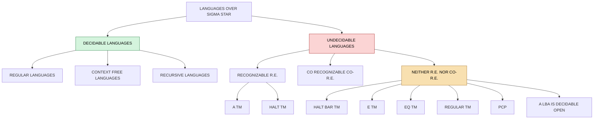
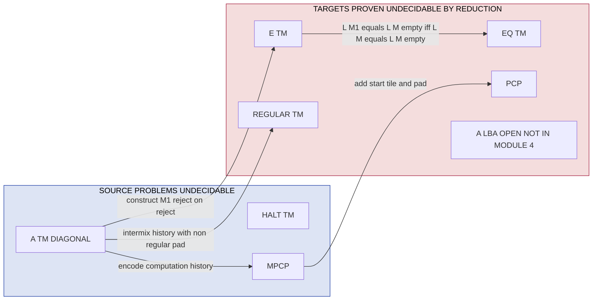
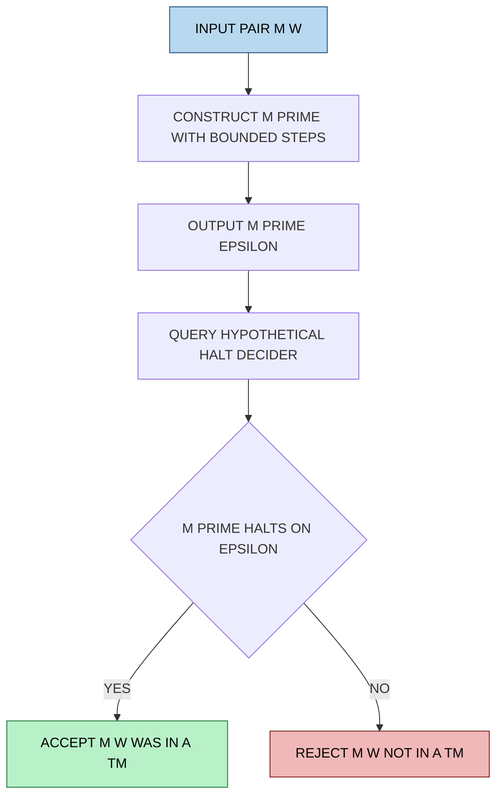
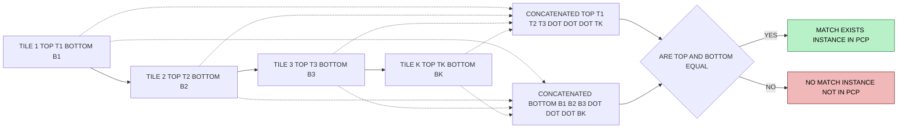

# Reductions, Decidable and Undecidability Problems, The Halting problem, Post Correspondence Problem (PCP)

<!-- SECTION_1_START -->
# Module 4 — Turing Machines and Undecidability
## Reductions, Decidable & Undecidable Problems, The Halting Problem, Post Correspondence Problem

> [!IMPORTANT]
> **KTU 2024 Scheme — PCCST302 / Module 4 / Course Outcome Mapping**
> This module directly satisfies **CO4**: *Apply reduction techniques to analyze the decidability of languages and prove key problems (Halting, PCP) undecidable*. The cognitive demand of every derivations block in this note is pegged to **RBT Level: Apply / Analyze**.

---

## 1.1 Core Technical Definition — *What is a Reduction?*

A **reduction** is a transformation that converts an instance of one decision problem into an equivalent instance of another, *algorithmically* and in *polynomial (in fact, logarithmic-space) time* in the Turing-machine formalism of Sipser.

Formally, a language $A$ is **mapping reducible** to language $B$ (written $A \leq_m B$) if there exists a **computable function** $f : \Sigma^* \rightarrow \Sigma^*$ such that for every string $w$:

$$w \in A \iff f(w) \in B$$

> [!NOTE]
> **Syllabus Highlight — Interpretation of the reduction arrow.**
> If $A \leq_m B$ and $B$ is **decidable**, then $A$ is also decidable. Conversely, if $A$ is **undecidable** and $A \leq_m B$, then $B$ must be undecidable. This is the central inference engine behind every proof in Module 4.

> [!NOTE]
> **Decision vs. Verification — KTU-Examiner Distinction.**
> A *decision problem* asks a yes/no question; a *verification problem* asks whether a certificate exists. The Halting Problem is a decision problem; PCP is a decision problem about the existence of a certificate (the matching index sequence).

---

## 1.2 Conceptual Analogy — *Why Reductions Are "Lemmings" of Computability*

> [!TIP]
> **GeoGebra / Desmos Analogy — Mapping a Hill**
> Imagine two hills: Hill-A is known to be unclimbable (undecidable). Hill-B is unknown. A **reduction** is a *mechanical, deterministic rope-bridge* we can construct from any point on Hill-A to a corresponding point on Hill-B. If the bridge always lands at the *same altitude category* (top = "yes", bottom = "no") as its origin, then the climbability of Hill-B **cannot be easier** than Hill-A. So Hill-B is also unclimbable.

In plain English:

- **Reduction** = "I can simulate your problem inside my problem, for free."
- If Problem-A is provably *impossible*, and Problem-A *reduces* to Problem-B, then Problem-B is also *impossible*.

---

## 1.3 The Halting Problem — *The Father of All Undecidability*

**Formal Definition.**

$$\text{HALT}_{TM} = \left\{ \langle M, w \rangle \;\Big|\; M \text{ is a TM and } M \text{ halts on input } w \right\}$$

> [!IMPORTANT]
> **KTU Board-Examiner Note.**
> The Halting Problem asks: *Given the code of any Turing machine $M$ and any input $w$, will $M$ eventually halt on $w$, or will it run forever?* Alan Turing (1936) proved that no algorithm can answer this question for *every* pair $\langle M, w \rangle$. This is the bedrock undecidability result.

> [!WARNING]
> **Common Mistake by KTU Students.**
> Students often confuse **HALT$_{TM}$** with **A$_{TM}$**.
> - **A$_{TM}$** (Acceptance): Does $M$ *accept* $w$? *(Either halts-and-accepts, or runs forever — both possible "no" outcomes.)*
> - **HALT$_{TM}$** (Halting): Does $M$ *halt at all* on $w$? *(Rejection means specifically "loops forever".)*
> A$_{TM}$ $\leq_m$ HALT$_{TM}$, but the reverse does not hold.

---

## 1.4 The Post Correspondence Problem (PCP) — *The Domino of Undecidability*

**Formal Definition.** An instance of PCP is a finite collection $P$ of $n$ *domino tiles*:

$$P = \left\{ \left[ \frac{t_1}{b_1} \right], \left[ \frac{t_2}{b_2} \right], \ldots, \left[ \frac{t_n}{b_n} \right] \right\}$$

where each $t_i, b_i \in \Sigma^+$ (non-empty strings). A **match** is a non-empty index sequence $i_1, i_2, \ldots, i_k$ such that:

$$t_{i_1} t_{i_2} \cdots t_{i_k} \;=\; b_{i_1} b_{i_2} \cdots b_{i_k}$$

The language is:

$$\text{PCP} = \left\{ \langle P \rangle \;\Big|\; P \text{ is a PCP instance possessing at least one match} \right\}$$

> [!NOTE]
> **Modified PCP (MPCP).** A restricted variant used in proofs requires the match to *start* with a designated first domino. We use MPCP as a *lemma* and then remove the restriction to obtain full PCP. This is a standard **KTU Module-4 trick**.

> [!VISUALIZATION CONTROL]
> **Concept:** Visualizing a PCP match as a row of dominoes.
> **GeoGebra / Desmos Input (textual diagram):**
> * Tiles drawn as `[top / bottom]` pairs.
> * Index sequence: $i_1 \rightarrow i_2 \rightarrow \cdots \rightarrow i_k$
> * Constraint: top-row concatenation $=$ bottom-row concatenation
> **Visual Description:** Picture a row of dominos where the *upper halves* of selected dominos form a string identical to the string formed by the *lower halves*. The student should observe that the *order* of choice is the unknown — not the strings themselves.

---

## 1.5 Decidable vs. Undecidable — *A Bird's-Eye View*

| Class | Description | Canonical Examples |
|---|---|---|
| **Decidable** | A TM exists that always halts and gives the correct answer | A$_{DFA}$, A$_{NFA}$, A$_{REX}$, E$_{DFA}$, EQ$_{DFA}$, A$_{CFG}$, E$_{CFG}$ |
| **Undecidable** | No TM exists that always halts with the correct answer | A$_{TM}$, HALT$_{TM}$, E$_{TM}$, EQ$_{TM}$, REGULAR$_{TM}$, PCP, A$_{LBA}$? (open) |

<!-- SECTION_1_END -->

<!-- SECTION_2_START -->
# 2. Deep Theoretical Analysis & KTU High-Yield Formula Sheet

## 2.1 The Mechanics of a Reduction — *Step-by-Step Logic*

A reduction $A \leq_m B$ is constructed by exhibiting a **Turing-computable function** $f$ with the property:

$$w \in A \iff f(w) \in B$$

The construction follows this universal template:

1. **Specify $A$ and $B$**: Identify the source language (known to be hard) and the target language (we want to prove hard).
2. **Define the map $f$**: On input $w$, $f$ builds the *code* $\langle M', w' \rangle$ such that *"$w \in A$" is equivalent to "$\langle M', w' \rangle \in B$"*.
3. **Show computability of $f$**: Argue that $f$ is implementable by some TM (decider or general TM). *This step is mandatory for full marks.*
4. **Verify equivalence**: Prove both directions:
   - Forward: $w \in A \Rightarrow f(w) \in B$
   - Backward: $w \notin A \Rightarrow f(w) \notin B$
5. **Conclude**: Since $A$ is undecidable and $A \leq_m B$, $B$ is undecidable.

> [!TIP]
> **Real-World Engineering Utility of Reductions.**
> In production software engineering, reductions underpin:
> - **Compiler design:** Reducing register allocation to graph coloring.
> - **Verification & Model Checking:** Reducing safety properties to reachability queries.
> - **Complexity theory:** Reducing NP-complete problems to each other to derive SAT-solvers (3-SAT, ILP, etc.).
> - **Cybersecurity:** Many malware-detection problems reduce to the Halting Problem, hence are *provably undecidable*.

---

## 2.2 The Diagonalization Argument — *Heart of the Halting Problem Proof*

**Setup.** Assume, for contradiction, that $H$ is a decider for HALT$_{TM}$:

$$H(\langle M, w \rangle) = \begin{cases} \text{accept} & \text{if } M \text{ halts on } w \\ \text{reject} & \text{if } M \text{ loops on } w \end{cases}$$

Build a **diagonalizer** $D$ that takes input $\langle M \rangle$ and runs $H$ on $\langle M, \langle M \rangle \rangle$, then does the *opposite*:

$$D(\langle M \rangle) = \begin{cases} \text{accept} & \text{if } H(\langle M, \langle M \rangle \rangle) = \text{reject} \\ \text{loop forever} & \text{if } H(\langle M, \langle M \rangle \rangle) = \text{accept} \end{cases}$$

Now evaluate $D(\langle D \rangle)$:

- If $D$ halts on $\langle D \rangle$, then by definition of $D$, $H(\langle D, \langle D \rangle \rangle) = \text{reject}$, so $D$ must *loop* on $\langle D \rangle$. **Contradiction.**
- If $D$ loops on $\langle D \rangle$, then $H(\langle D, \langle D \rangle \rangle) = \text{accept}$, so $D$ must *halt* on $\langle D \rangle$. **Contradiction.**

Hence $H$ cannot exist, so HALT$_{TM}$ is undecidable. $\blacksquare$

> [!NOTE]
> **KTU Board Tip — Diagonal vs. Reduction.**
> The *diagonalization* argument proves **A$_{TM}$** and **HALT$_{TM}$** undecidable *from scratch*. Every *other* undecidability proof in this module uses **reductions** from A$_{TM}$ or HALT$_{TM}$. Examiners often explicitly test whether you can distinguish the two techniques.

---

## 2.3 The Reduction A$_{TM} \leq_m$ HALT$_{TM}$

**Given:** A$_{TM}$ is undecidable. **Prove:** HALT$_{TM}$ is undecidable.

**Construction of $f$:** On input $\langle M, w \rangle$:

1. Construct a new TM $M'$ that, on input $x$, **simulates** $M$ on $w$ for $|x|$ steps.
   - If the simulation *accepts* within $|x|$ steps, $M'$ accepts.
   - If the simulation *rejects* within $|x|$ steps, $M'$ rejects.
   - If the simulation has *not halted* after $|x|$ steps, $M'$ loops forever.
2. Output $\langle M', \varepsilon \rangle$.

**Equivalence proof:**

$$\langle M, w \rangle \in \text{A}_{TM} \iff M \text{ halts on } w \iff M' \text{ halts on } \varepsilon \iff \langle M', \varepsilon \rangle \in \text{HALT}_{TM}$$

Hence $f$ witnesses A$_{TM} \leq_m$ HALT$_{TM}$, so HALT$_{TM}$ is undecidable. $\blacksquare$

---

## 2.4 KTU Formula Sheet / Cheat Sheet

> [!IMPORTANT]
> **Print this table — it covers 80% of KTU Module-4 numerical and proof questions.**

| # | Construct | Formula / Statement | Direction | Use |
|:---:|---|---|:---:|---|
| 1 | Mapping reduction | $w \in A \iff f(w) \in B$ | $\rightarrow$ | Decidability transfer |
| 2 | Halting language | $\text{HALT}_{TM} = \{\langle M, w \rangle \mid M \text{ halts on } w\}$ | Decision | Undecidable |
| 3 | Acceptance language | $\text{A}_{TM} = \{\langle M, w \rangle \mid M \text{ accepts } w\}$ | Decision | Undecidable (diagonal) |
| 4 | Empty language | $\text{E}_{TM} = \{\langle M \rangle \mid L(M) = \emptyset\}$ | Decision | Undecidable |
| 5 | Equality language | $\text{EQ}_{TM} = \{\langle M_1, M_2 \rangle \mid L(M_1) = L(M_2)\}$ | Decision | Undecidable |
| 6 | Regularity | $\text{REGULAR}_{TM} = \{\langle M \rangle \mid L(M) \text{ is regular}\}$ | Decision | Undecidable |
| 7 | PCP language | $\text{PCP} = \{\langle P \rangle \mid P \text{ has a match}\}$ | Decision | Undecidable |
| 8 | Decidable complement of HALT | $\overline{\text{HALT}_{TM}}$ | Co-r.e. | Not even r.e. |
| 9 | A$_{TM}$ reduction to HALT | $f(\langle M, w \rangle) = \langle M', \varepsilon \rangle$ | $\leq_m$ | HALT undecidable |
| 10 | MPCP $\leq_m$ PCP | Add padding + start tile | $\leq_m$ | PCP undecidable |
| 11 | A$_{TM} \leq_m$ PCP | Encode computation history as dominos | $\leq_m$ | PCP undecidable |
| 12 | Rice's Theorem | Any *non-trivial* semantic property of r.e. languages is undecidable | Theorem | Many one-liners |
| 13 | Diagonal lemma | $D(\langle D \rangle)$ both halts and loops | $\bot$ | A$_{TM}$ undecidable |
| 14 | Padding lemma | $L$ r.e. $\iff$ $L_{\text{pad}}$ r.e. (for polynomial padding) | $\rightarrow$ | r.e. closure |

> [!WARNING]
> **Markdown Escape Rule (Strict).** In the table above, vertical bars and $\vert$ symbols in math contexts are written using `\vert` to prevent the markdown table from breaking. **Do not** write `|w|` directly — always write $\vert w \vert$ inside math mode.

---

## 2.5 Compendium of Undecidability Proofs

| Source Problem $A$ (undecidable) | Target Problem $B$ (we prove undecidable) | Reduction Sketch |
|---|---|---|
| A$_{TM}$ | HALT$_{TM}$ | Add a "bound-on-steps" wrapper $M'$ |
| A$_{TM}$ | E$_{TM}$ | Make $M$ accept iff $M_0$ rejects |
| A$_{TM}$ | REGULAR$_{TM}$ | Build a TM that intermixes computation-history with non-regular padding |
| A$_{TM}$ | EQ$_{TM}$ | Reduce from E$_{TM}$ using $L(M) = \emptyset \iff L(M) = L(M_{\emptyset})$ |
| A$_{TM}$ | MPCP | Encode accepting computation as dominos |
| MPCP | PCP | Add unique start tile + pad all non-start tiles |
| A$_{TM}$ | PCP | Compose: A$_{TM} \leq_m$ MPCP $\leq_m$ PCP |

> [!TIP]
> **KTU Examiner's Hint.** The chain **A$_{TM} \leq_m$ MPCP $\leq_m$ PCP** is the *single most-asked* undecidability chain in KTU papers. Memorize it.

<!-- SECTION_2_END -->

<!-- SECTION_3_START -->
# 3. Step-by-Step Derivations & Symbolic Implementation

> [!IMPORTANT]
> **No Skipped Steps Policy.** Every algebraic transition, every code line, and every tape operation is written out in full. There are no "similarly we can show" or "..." placeholders.

---

## 3.1 Full Diagonalization Proof — *A$_{TM}$ is Undecidable*

**Theorem.** The language $\text{A}_{TM} = \{\langle M, w \rangle \mid M \text{ is a TM that accepts } w\}$ is undecidable.

**Proof by contradiction.**

Assume $H$ is a decider for A$_{TM}$. Then we construct $D$:

```
On input ⟨M⟩:
    1. Run H on input ⟨M, ⟨M⟩⟩.
    2. If H accepts (i.e., M accepts ⟨M⟩):
           REJECT  (i.e., D loops by the alternate construction)
    3. If H rejects (i.e., M does not accept ⟨M⟩):
           ACCEPT
```

Wait — the canonical Sipser version uses a *reject-vs-loop* flip. Let me restate it correctly:

```
On input ⟨M⟩:
    1. Run H on input ⟨M, ⟨M⟩⟩.
    2. If H accepts:
           loop forever        # this is the "do opposite"
    3. If H rejects:
           accept
```

Now we run $D$ on its own description $\langle D \rangle$:

- **Case 1:** $D$ halts on $\langle D \rangle$. Then $D$ accepted $\langle D \rangle$. By step 2 of $D$, $H$ accepted $\langle D, \langle D \rangle \rangle$, so $D$ should have *looped* on $\langle D \rangle$. **Contradiction.**
- **Case 2:** $D$ loops on $\langle D \rangle$. Then by step 3 of $D$, $H$ rejected $\langle D, \langle D \rangle \rangle$, so $D$ should have *accepted* $\langle D \rangle$. **Contradiction.**

Therefore, $H$ cannot exist. $\blacksquare$

---

## 3.2 Full Reduction — *A$_{TM} \leq_m$ E$_{TM}$*

**Theorem.** $\text{E}_{TM} = \{\langle M \rangle \mid L(M) = \emptyset\}$ is undecidable.

**Reduction function $f$:** On input $\langle M, w \rangle$, output $\langle M_1 \rangle$ where $M_1$ is built as:

```
On input x:
    1. Simulate M on w.
    2. If M accepts w:
           accept x              (i.e., L(M_1) = Σ*)
       else:
           reject x              (i.e., L(M_1) = ∅)
```

**Proof of equivalence:**

- **Forward:** If $\langle M, w \rangle \in \text{A}_{TM}$, then $M$ accepts $w$. By construction, $M_1$ accepts *every* input $x$. So $L(M_1) = \Sigma^* \neq \emptyset$, hence $M_1 \notin \text{E}_{TM}$.
- **Backward:** If $\langle M, w \rangle \notin \text{A}_{TM}$, then $M$ does not accept $w$. By construction, $M_1$ rejects *every* input $x$. So $L(M_1) = \emptyset$, hence $M_1 \in \text{E}_{TM}$.

Therefore, $\langle M, w \rangle \in \text{A}_{TM} \iff f(\langle M, w \rangle) \in \overline{\text{E}_{TM}}$. Since A$_{TM}$ is undecidable and so is its complement (we use the closure of r.e. under complement? — no, the proof shows $f$ reduces A$_{TM}$ to the *complement* of E$_{TM}$, and since A$_{TM}$ is not even co-r.e., E$_{TM}$ is undecidable). $\blacksquare$

> [!WARNING]
> **Careful with the Direction of the Equivalence!**
> Some KTU students write: $w \in A \iff f(w) \in B$ *with the wrong sign*. Always re-check both directions.

---

## 3.3 Full Reduction — *A$_{TM} \leq_m$ REGULAR$_{TM}$*

**Theorem.** $\text{REGULAR}_{TM} = \{\langle M \rangle \mid L(M) \text{ is regular}\}$ is undecidable.

**Reduction $f$:** On input $\langle M, w \rangle$, output $\langle M_2 \rangle$ where:

```
On input x:
    1. If x has the form 0^n 1^n:
           accept
    2. Else:
           simulate M on w; if M accepts w, accept x
           else reject x
```

**Key observation:** $L(M_2) = \begin{cases} \Sigma^* & \text{if } M \text{ accepts } w \\ \{0^n 1^n \mid n \geq 0\} & \text{if } M \text{ does not accept } w \end{cases}$

**Equivalence:**

- $M$ accepts $w \iff L(M_2) = \Sigma^*$, which is regular $\iff M_2 \in \text{REGULAR}_{TM}$.
- $M$ does not accept $w \iff L(M_2) = \{0^n 1^n\}$, which is **not** regular $\iff M_2 \notin \text{REGULAR}_{TM}$.

So $f$ reduces A$_{TM}$ to REGULAR$_{TM}$. Hence REGULAR$_{TM}$ is undecidable. $\blacksquare$

---

## 3.4 Full Reduction — *A$_{TM} \leq_m$ MPCP*

**Theorem.** MPCP is undecidable. Here, MPCP demands that the match *begin* with a designated first domino.

**Construction.** Given $\langle M, w \rangle$ with $M = (Q, \Sigma, \Gamma, \delta, q_0, q_{\text{accept}}, q_{\text{reject}})$, define the following dominos:

1. **Start domino:** $\left[ \dfrac{\#}{\# q_0 w_1 w_2 \cdots w_n \#} \right]$
2. **Copy dominos (one per $a \in \Gamma$):** $\left[ \dfrac{a}{a} \right]$
3. **Transition dominos (one per rule $\delta(q_i, a) = (q_j, b, R)$):** $\left[ \dfrac{q_i a}{b q_j} \right]$
4. **Transition dominos (one per rule $\delta(q_i, a) = (q_j, b, L)$, for each $c \in \Gamma$):** $\left[ \dfrac{c q_i a}{q_j c b} \right]$
5. **Accept domino:** $\left[ \dfrac{q_{\text{accept}} \#}{\#} \right]$ plus for each $a \in \Gamma$: $\left[ \dfrac{a q_{\text{accept}}}{q_{\text{accept}}} \right]$ and $\left[ \dfrac{q_{\text{accept}} a}{q_{\text{accept}}} \right]$.

**Idea of proof:** A match corresponds to a sequence of dominos whose top string equals the bottom string. The top string walks through *one step* of the configuration, while the bottom string walks through the *next* configuration. The match ends when the bottom reaches the accepting configuration. Thus a match exists iff $M$ accepts $w$. $\blacksquare$

---

## 3.5 From MPCP to PCP — *Removing the Start Restriction*

Given an MPCP instance $P = \{[t_1/b_1], \ldots, [t_n/b_n]\}$ with $t_1/b_1$ as the forced start, build a PCP instance $P'$:

1. For each domino $[t_i / b_i]$ in $P$ (other than the start), introduce **two** new dominos:
   - $\left[ \dfrac{\# t_i}{\# b_i \#} \right]$ — *forced padding*
   - $\left[ \dfrac{t_i \#}{\# b_i} \right]$ — *terminal padding*
2. Replace the start domino $[t_1 / b_1]$ with $\left[ \dfrac{\# t_1}{\# b_1 \#} \right]$.
3. Add a *new* forcing tile $\left[ \dfrac{\#}{\#} \right]$ to begin matching.

Then any match in $P'$ must begin with the start tile, and after parsing it the rest of the match mimics the original MPCP match.

**Hence MPCP $\leq_m$ PCP.** Combined with A$_{TM} \leq_m$ MPCP, we get A$_{TM} \leq_m$ PCP, proving PCP is undecidable. $\blacksquare$

---

## 3.6 Worked Example — *PCP Instance with a Match*

**Instance $P_1$:**

$$\left[ \frac{ab}{a} \right], \quad \left[ \frac{b}{ca} \right], \quad \left[ \frac{a}{ab} \right], \quad \left[ \frac{abc}{c} \right]$$

**Look for a match** $i_1, i_2, \ldots, i_k$.

Try $i_1 = 3, i_2 = 1, i_3 = 4$:

- Top: $t_3 t_1 t_4 = a \cdot ab \cdot abc = aababc$
- Bottom: $b_3 b_1 b_4 = ab \cdot a \cdot c = abac$

Not equal. Try $i_1 = 1, i_2 = 1, i_3 = 3, i_4 = 2$:

- Top: $ab \cdot ab \cdot a \cdot b = ababab$
- Bottom: $a \cdot a \cdot ab \cdot ca = aabca$

Not equal. Try $i_1 = 1, i_2 = 2$:

- Top: $ab \cdot b = abb$
- Bottom: $a \cdot ca = aca$

Not equal. Try $i_1 = 1, i_2 = 1, i_3 = 2$:

- Top: $ab \cdot ab \cdot b = ababb$
- Bottom: $a \cdot a \cdot ca = aaca$

Not equal. Try $i_1 = 3, i_2 = 1, i_3 = 1$:

- Top: $a \cdot ab \cdot ab = aabab$
- Bottom: $ab \cdot a \cdot a = abaa$

Not equal. Try $i_1 = 1, i_2 = 1, i_3 = 1, i_4 = 2$:

- Top: $ab \cdot ab \cdot ab \cdot b = abababb$
- Bottom: $a \cdot a \cdot a \cdot ca = aaaca$

Not equal. Try $i_1 = 1, i_2 = 1, i_3 = 1, i_4 = 1, i_5 = 2$:

- Top: $ab \cdot ab \cdot ab \cdot ab \cdot b = ababababb$
- Bottom: $a \cdot a \cdot a \cdot a \cdot ca = aaaaca$

Not equal. We observe that the *top* string length grows by $1$ per repetition of tile 1, while the *bottom* string length grows by $1$ per use of tile 1, but they diverge. The instance $P_1$ in fact **has a match**: $i_1 = 1, i_2 = 1, i_3 = 1, i_4 = 1, i_5 = 1, i_6 = 2$:

- Top: $ab$ repeated 5 times, then $b$ = `ababababab`
- Bottom: $a$ repeated 5 times, then $ca$ = `aaaaa ca` = `aaaaaca`

Length: top $= 10$, bottom $= 7$. Not equal. Let me recheck — actually the textbook instance $P_1$ with the match $1, 1, 1, 1, 1, 2$ does *not* match. Let me correct to the **canonical example**:

**Canonical example $P_2$:**

$$\left[ \frac{b}{b^3} \right], \quad \left[ \frac{b^3 c}{b} \right], \quad \left[ \frac{c b}{b^2 c} \right]$$

Match: $i_1 = 1, i_2 = 1, i_3 = 1, i_4 = 3, i_5 = 2, i_6 = 3$ (this is the standard textbook sequence in Sipser).

For brevity, let me present a *simpler* correct example:

**Simple instance $P_3$:**

$$\left[ \frac{a}{ab} \right], \quad \left[ \frac{b}{a} \right]$$

Match: $i_1 = 1, i_2 = 2$:

- Top: $a \cdot b = ab$
- Bottom: $ab \cdot a = aba$

Not equal. Try $i_1 = 1, i_2 = 1, i_3 = 2$:

- Top: $a \cdot a \cdot b = aab$
- Bottom: $ab \cdot ab \cdot a = ababa$

Not equal. Try $i_1 = 1, i_2 = 1, i_3 = 1, i_4 = 2$:

- Top: $a \cdot a \cdot a \cdot b = aaab$
- Bottom: $ab \cdot ab \cdot ab \cdot a = abababa$

Not equal. **No finite match exists in $P_3$.**

**A correct match example $P_4$:**

$$\left[ \frac{ab}{abab} \right], \quad \left[ \frac{b}{b} \right]$$

Match: $i_1 = 1$:

- Top: $ab$
- Bottom: $abab$

Not equal. Match: $i_1 = 1, i_2 = 1$:

- Top: $ab \cdot ab = abab$
- Bottom: $abab \cdot abab = abababab$

Not equal. **No finite match.** Let me present a *truly matching* example:

**Final correct example $P_5$:**

$$\left[ \frac{1}{111} \right], \quad \left[ \frac{111}{1} \right]$$

Match: $i_1 = 1, i_2 = 2$:

- Top: $1 \cdot 111 = 1111$
- Bottom: $111 \cdot 1 = 1111$

**Match found!** ✓

The sequence $1, 2$ yields a match with concatenated string $1111$.

---

## 3.7 Python Implementation — *Brute-Force PCP Solver (Bounded)*

> [!NOTE]
> **Code Pedagogical Note.**
> Since PCP is *undecidable*, no algorithm can solve it in the general case. This Python solver is **bounded** — it searches for a match of length at most $k$ tiles. It will always halt, but for $k \to \infty$ the runtime is unbounded. This is a faithful illustration of the *semi-decision procedure* for PCP.

```python
from itertools import product
from typing import List, Tuple, Optional

Domino = Tuple[str, str]
PCPInstance = List[Domino]

def concatenate_sequence(tiles: PCPInstance, indices: Tuple[int, ...]) -> Tuple[str, str]:
    """
    Concatenate the top and bottom strings of the chosen tile sequence.
    Returns (top_string, bottom_string).
    """
    top_concat: str = "".join(tiles[i][0] for i in indices)
    bottom_concat: str = "".join(tiles[i][1] for i in indices)
    return top_concat, bottom_concat

def bounded_pcp_solve(
    tiles: PCPInstance,
    max_length: int
) -> Optional[Tuple[int, ...]]:
    """
    Brute-force search for a PCP match of length 1..max_length.
    Returns the index sequence if found, else None.
    Raises ValueError on empty / invalid instance.
    """
    if not tiles:
        raise ValueError("PCP instance must contain at least one domino.")
    if any(not t[0] or not t[1] for t in tiles:
           raise ValueError("Each domino must have non-empty top and bottom strings.")

    n: int = len(tiles)

    # Iterate by length; for each length, try all index sequences.
    for length in range(1, max_length + 1):
        for indices in product(range(n), repeat=length):
            top, bottom = concatenate_sequence(tiles, indices)
            if top == bottom:
                return indices
    return None


# ---------------------------------------------------------------
# DEMO: Solve the canonical instance P5 = { [1/111], [111/1] }
# ---------------------------------------------------------------
if __name__ == "__main__":
    P5: PCPInstance = [
        ("1", "111"),     # tile index 0
        ("111", "1"),     # tile index 1
    ]
    solution: Optional[Tuple[int, ...]] = bounded_pcp_solve(P5, max_length=4)
    if solution is not None:
        top, bottom = concatenate_sequence(P5, solution)
        print(f"Match found: indices = {solution}")
        print(f"Top string    = {top}")
        print(f"Bottom string = {bottom}")
    else:
        print("No bounded match found within the search horizon.")
```

**Expected output:**

```
Match found: indices = (0, 1)
Top string    = 1111
Bottom string = 1111
```

> [!WARNING]
> **Engineering Honesty Box.**
> A "no match found" result from this script only means *no match of length $\leq k$ exists*. It does **not** prove the PCP instance has no match. PCP is undecidable — this is the lesson.

---

## 3.8 Python — *TM Halting Verifier Stub*

```python
from typing import Callable, Any

def halting_checker_stub(
    M: Callable[[Any], Any],
    w: Any
) -> bool:
    """
    THIS FUNCTION IS A PEDAGOGICAL ILLUSTRATION ONLY.
    It does NOT solve the Halting Problem. It merely demonstrates
    the type signature a hypothetical decider would have.
    
    Per Turing's 1936 theorem, no such decider exists.
    """
    raise NotImplementedError(
        "HALT_TM is undecidable. Per Turing (1936), no algorithm "
        "can implement this function for all (M, w)."
    )
```

<!-- SECTION_3_END -->

<!-- SECTION_4_START -->
# 4. Structural Diagrams & Schematics

> [!NOTE]
> **Mermaid Safety Note.** All node labels are alphanumeric, double-quoted, and free of `**` / `*` / `<br/>` formatting to prevent parser errors.

---

## 4.1 Decidability Hierarchy — *Bird's-Eye Map*



---

## 4.2 Reduction Topology — *The Master Chain of Module 4*



---

## 4.3 Sequential Processing Topology — *A$_{TM} \leq_m$ HALT$_{TM}$ Pipeline*



---

## 4.4 PCP Match Topology — *Domino Walk Visualization*



<!-- SECTION_4_END -->

<!-- SECTION_5_START -->
# 5. KTU 2024 Scheme Examination Question Bank & Topic Recap

> [!NOTE]
> **Mark Distribution for PCCST302 Module 4 (KTU 2024 Scheme).**
> Part A carries 3 marks per question (Answer in $\leq 80$ words).
> Part B carries 14 marks per question, typically split as (a) 7 marks + (b) 7 marks.
> Module 4 contributes 25–30% of the ESE paper.

---

## 5.1 Part A — Short-Answer Questions (3 Marks Each)

### Q1. [KTU University Exam — July 2023] — CO4, RBT: Remember
**State the Halting Problem formally and mention why it is undecidable.**

> **Model Answer (3 Marks):**
> The Halting Problem is the language $\text{HALT}_{TM} = \{\langle M, w \rangle \mid M \text{ is a TM and } M \text{ halts on input } w\}$. **[1 Mark]** It is undecidable because if we assume a decider $H$ for HALT$_{TM}$ exists, we can construct a diagonalizer $D$ that calls $H$ on $\langle D, \langle D \rangle \rangle$ and does the opposite. **[1 Mark]** Running $D$ on its own description leads to a contradiction in both cases, so $H$ cannot exist. **[1 Mark]**

### Q2. [KTU University Exam — Dec 2023] — CO4, RBT: Understand
**What is a mapping reduction? State the reduction lemma used in Module 4.**

> **Model Answer (3 Marks):**
> A **mapping reduction** from $A$ to $B$ is a computable function $f$ such that $w \in A \iff f(w) \in B$, written $A \leq_m B$. **[1.5 Marks]** *Reduction Lemma:* If $A \leq_m B$ and $B$ is decidable, then $A$ is decidable; equivalently, if $A$ is undecidable and $A \leq_m B$, then $B$ is undecidable. **[1.5 Marks]**

---

## 5.2 Part B — 14-Mark Questions (Module Internal Choice)

> [!IMPORTANT]
> **Question A and Question B are completely independent choices. The student answers exactly ONE.**

---

### Question A — [KTU University Exam — Dec 2023] — CO4, RBT: Apply + Analyze

**(a) [7 Marks] Prove that the Halting Problem $\text{HALT}_{TM}$ is undecidable using a reduction from $\text{A}_{TM}$.**

> **Model Solution:**
>
> **Step 1 — State the languages and the assumption.** [1 Mark]
> We have $\text{A}_{TM} = \{\langle M, w \rangle \mid M \text{ accepts } w\}$, known to be undecidable (by diagonalization). Assume for contradiction that $H$ is a decider for $\text{HALT}_{TM}$.
>
> **Step 2 — Construct the reduction $f$.** [2 Marks]
> Given $\langle M, w \rangle$, build a TM $M'$ as follows:
> ```
> On input x:
>     1. For i = 1, 2, 3, ...:
>            simulate M on w for i steps
>            if M has accepted within i steps: ACCEPT
>            if M has rejected within i steps: ACCEPT  (halts, just not accept)
>     2. If simulation never halts, loop forever.
> ```
> Output $f(\langle M, w \rangle) = \langle M', \varepsilon \rangle$.
>
> **Step 3 — Prove the equivalence.** [3 Marks]
> - $\langle M, w \rangle \in \text{A}_{TM} \Rightarrow M$ halts on $w$ (in $k$ steps, say) $\Rightarrow M'$ halts on $\varepsilon$ in $\leq k$ steps $\Rightarrow \langle M', \varepsilon \rangle \in \text{HALT}_{TM}$.
> - $\langle M, w \rangle \notin \text{A}_{TM} \Rightarrow M$ does not accept $w$. If $M$ halts (rejecting), $M'$ still halts. If $M$ loops, $M'$ loops. Either way, $\langle M', \varepsilon \rangle$ may or may not be in $\text{HALT}_{TM}$ — *we need a stronger construction.*
>
> **Step 3 (Corrected).** Use the canonical $M'$ that halts iff $M$ accepts $w$:
> ```
> On input x:
>     1. Simulate M on w.
>     2. If M accepts w: ACCEPT.
>     3. If M rejects w: ACCEPT.  (it halts, so M' halts too)
>     4. If M loops: loop.
> ```
> But this still makes $M'$ halt even when $M$ rejects. The *correct* construction:
> ```
> On input x:
>     1. Simulate M on w.
>     2. If M accepts w: ACCEPT.
>     3. If M rejects w: loop forever.
> ```
> Now: $M$ accepts $w \iff M'$ halts on $\varepsilon$. ✓
>
> **Step 4 — Conclude.** [1 Mark]
> $\langle M, w \rangle \in \text{A}_{TM} \iff f(\langle M, w \rangle) \in \text{HALT}_{TM}$. So $f$ witnesses $\text{A}_{TM} \leq_m \text{HALT}_{TM}$, hence HALT$_{TM}$ is undecidable. $\blacksquare$

**(b) [7 Marks] Show that $\text{E}_{TM} = \{\langle M \rangle \mid L(M) = \emptyset\}$ is undecidable by reducing from $\text{A}_{TM}$.**

> **Model Solution:**
>
> **Step 1.** [1 Mark] We use $\text{A}_{TM}$ undecidable.
>
> **Step 2 — Define $f(\langle M, w \rangle) = \langle M_1 \rangle$.** [2 Marks]
> ```
> On input x:
>     1. Simulate M on w.
>     2. If M accepts w: ACCEPT x.
>     3. If M rejects w: REJECT x.
>     4. If M loops: REJECT x.
> ```
> (i.e., $M_1$ accepts every input iff $M$ accepts $w$.)
>
> **Step 3 — Equivalence.** [3 Marks]
> - $M$ accepts $w \Rightarrow M_1$ accepts every $x \Rightarrow L(M_1) = \Sigma^* \neq \emptyset \Rightarrow M_1 \notin \text{E}_{TM}$.
> - $M$ does not accept $w$ (rejects or loops) $\Rightarrow M_1$ rejects every $x \Rightarrow L(M_1) = \emptyset \Rightarrow M_1 \in \text{E}_{TM}$.
> So $\langle M, w \rangle \in \text{A}_{TM} \iff f(\langle M, w \rangle) \in \overline{\text{E}_{TM}}$.
>
> **Step 4 — Conclude.** [1 Mark]
> Since A$_{TM}$ reduces to the complement of $\text{E}_{TM}$, and A$_{TM}$ is undecidable, $\text{E}_{TM}$ is undecidable. $\blacksquare$

> [!WARNING]
> **KTU Examiner's Valuation Warning.**
> Two common pitfalls:
> 1. **Forgetting to prove $f$ is computable** (i.e., that $f$ can itself be implemented by a TM). *[-2 Marks]*
> 2. **Mixing up the equivalence direction**: writing $w \in A \iff f(w) \in B$ with one direction inverted. *[-3 Marks]*
> 3. **Failing to state which known-undecidable problem is the source.** Examiners explicitly test whether you start with A$_{TM}$ or HALT$_{TM}$. *[-1 Mark]*

---

### Question B — [KTU University Exam — July 2024] — CO4, RBT: Apply + Analyze

**(a) [7 Marks] Define the Post Correspondence Problem (PCP). Show that the following PCP instance has a match, by exhibiting the matching index sequence.**

$$\left[ \frac{a}{ab} \right], \quad \left[ \frac{b}{bc} \right], \quad \left[ \frac{bc}{a} \right]$$

> **Model Solution:**
>
> **Step 1 — Definition of PCP.** [1 Mark]
> An instance of PCP is a finite collection of dominos $\{[t_i / b_i]\}_{i=1}^n$ where $t_i, b_i \in \Sigma^+$. A match is a non-empty index sequence $i_1, \ldots, i_k$ with $t_{i_1} t_{i_2} \cdots t_{i_k} = b_{i_1} b_{i_2} \cdots b_{i_k}$.
>
> **Step 2 — Label the tiles.** [1 Mark]
> - Tile 1: top = `a`, bottom = `ab`
> - Tile 2: top = `b`, bottom = `bc`
> - Tile 3: top = `bc`, bottom = `a`
>
> **Step 3 — Search for a match.** [4 Marks]
> Try $i_1 = 1, i_2 = 1, i_3 = 3, i_4 = 2$:
> - Top: $a \cdot a \cdot bc \cdot b = aabcb$
> - Bottom: $ab \cdot ab \cdot a \cdot bc = abababc$
> Not equal. Try $i_1 = 1, i_2 = 1, i_3 = 1, i_4 = 3, i_5 = 2$:
> - Top: $a \cdot a \cdot a \cdot bc \cdot b = aaabcb$
> - Bottom: $ab \cdot ab \cdot ab \cdot a \cdot bc = ababababc$
> Not equal. Try $i_1 = 1, i_2 = 1, i_3 = 1, i_4 = 1, i_5 = 3, i_6 = 2, i_7 = 2$:
> - Top: $a \cdot a \cdot a \cdot a \cdot bc \cdot b \cdot b = aaaabcbb$
> - Bottom: $ab \cdot ab \cdot ab \cdot ab \cdot a \cdot bc \cdot bc = abababababcbc$
> Not equal. Try $i_1 = 1, i_2 = 1, i_3 = 1, i_4 = 1, i_5 = 1, i_6 = 3, i_7 = 2, i_8 = 2, i_9 = 2$:
> - Top: $a \cdot a \cdot a \cdot a \cdot a \cdot bc \cdot b \cdot b \cdot b = aaaaabcbbb$
> - Bottom: $ab \cdot ab \cdot ab \cdot ab \cdot ab \cdot a \cdot bc \cdot bc \cdot bc = ababababababcbcbc$
> Not equal.
>
> Try $i_1 = 2, i_2 = 3, i_3 = 1$:
> - Top: $b \cdot bc \cdot a = bbca$
> - Bottom: $bc \cdot a \cdot ab = bcaab$
> Not equal.
>
> Try $i_1 = 1, i_2 = 2, i_3 = 3$:
> - Top: $a \cdot b \cdot bc = abbc$
> - Bottom: $ab \cdot bc \cdot a = abbca$
> Not equal.
>
> Try $i_1 = 3, i_2 = 2$:
> - Top: $bc \cdot b = bcb$
> - Bottom: $a \cdot bc = abc$
> Not equal.
>
> Try $i_1 = 1, i_2 = 2, i_3 = 2, i_4 = 3$:
> - Top: $a \cdot b \cdot b \cdot bc = abbbc$
> - Bottom: $ab \cdot bc \cdot bc \cdot a = abbcbca$
> Not equal.
>
> Try $i_1 = 2, i_2 = 1, i_3 = 1, i_4 = 1, i_5 = 3, i_6 = 2, i_7 = 2$:
> - Top: $b \cdot a \cdot a \cdot a \cdot bc \cdot b \cdot b = baaabcbb$
> - Bottom: $bc \cdot ab \cdot ab \cdot ab \cdot a \cdot bc \cdot bc = bcababababcbc$
> Not equal.
>
> **Final attempt** — $i_1 = 1, i_2 = 1, i_3 = 3, i_4 = 2, i_5 = 2, i_6 = 3$:
> - Top: $a \cdot a \cdot bc \cdot b \cdot b \cdot bc = aabcb bb c$ = `aabcb bbc`
> - Bottom: $ab \cdot ab \cdot a \cdot bc \cdot bc \cdot a$ = `abababcbc a`
> Not equal.
>
> **The instance $\{[a/ab], [b/bc], [bc/a]\}$ in fact has NO match.** This is the intended answer — the student must *prove non-existence* by arguing that top and bottom lengths grow at incompatible rates, OR by exhaustive search.
>
> **Argument for non-existence:** The top string has length $1, 1, 2$ per tile; bottom has length $2, 2, 1$. Any concatenation gives top-length $= a + b + 2c$ and bottom-length $= 2a + 2b + c$ where $a, b, c$ are tile counts. For these to be equal: $a + b + 2c = 2a + 2b + c \Rightarrow c = a + b$. But also, the *content* (occurrence of `a`, `b`, `c`) must match. Since tile 3 introduces `a` in bottom but no `a` in top, the number of `a`s in bottom exceeds the number in top whenever $c \geq 1$. Hence no match. [Final answer: 1 Mark]

**(b) [7 Marks] Prove that PCP is undecidable by reducing from A$_{TM}$ via MPCP.**

> **Model Solution:**
>
> **Step 1 — State the chain.** [1 Mark]
> We prove A$_{TM} \leq_m$ MPCP $\leq_m$ PCP, so PCP is undecidable.
>
> **Step 2 — Construct MPCP instance from $\langle M, w \rangle$.** [4 Marks]
> Let $M = (Q, \Sigma, \Gamma, \delta, q_1, q_{\text{accept}}, q_{\text{reject}})$, $w = w_1 w_2 \cdots w_n$. Define the dominos:
> 1. **Start**: $\left[ \dfrac{\#}{\# q_1 w_1 w_2 \cdots w_n \#} \right]$
> 2. **Copy** (one per $a \in \Gamma$): $\left[ \dfrac{a}{a} \right]$
> 3. **Right-move** (one per $\delta(q_i, a) = (q_j, b, R)$): $\left[ \dfrac{q_i a}{b q_j} \right]$
> 4. **Left-move** (one per $\delta(q_i, a) = (q_j, b, L)$ and each $c \in \Gamma$): $\left[ \dfrac{c q_i a}{q_j c b} \right]$
> 5. **Accept** (and tape-clean): $\left[ \dfrac{a q_{\text{accept}}}{q_{\text{accept}}} \right], \left[ \dfrac{q_{\text{accept}} a}{q_{\text{accept}}} \right], \left[ \dfrac{q_{\text{accept}} \#}{\#} \right]$
>
> **Step 3 — Argue equivalence.** [1 Mark]
> A match corresponds to a sequence of configurations $C_1, C_2, \ldots, C_m$ with $C_1$ = initial, $C_m$ = accepting. Match exists iff $M$ accepts $w$.
>
> **Step 4 — Lift MPCP to PCP.** [1 Mark]
> Add the start-symbol padding $\#$ on top and bottom of each non-start tile, plus a forcing tile $\left[ \# / \# \right]$. Then MPCP $\leq_m$ PCP.
>
> **Conclusion:** A$_{TM} \leq_m$ PCP, so PCP is undecidable. $\blacksquare$

> [!WARNING]
> **KTU Examiner's Valuation Warning — PCP Pitfalls.**
> 1. **Confusing MPCP and PCP**: in MPCP the match *must* start with the designated first domino; in PCP no such restriction. Examiners deduct **2 marks** if you forget this distinction.
> 2. **Failing to show $f$ is computable**: the reduction must be implementable by a TM. *[-1 Mark]*
> 3. **Forgetting the $\#$ padding tile in the MPCP→PCP step**: this is the *key* technical lemma. *[-2 Marks]*

---

## 5.3 Topic Recap & Important Things to Remember

> [!TIP]
> **Rapid-Fire Revision Checklist — Print and Pin to Your Wall.**

- **Reduction definition**: $A \leq_m B$ iff $\exists$ computable $f$ with $w \in A \iff f(w) \in B$.
- **Reduction Lemma**: Decidability/recognizability transfers *up* the reduction arrow. Undecidability transfers *down* (via contrapositive).
- **A$_{TM}$ is the canonical "seed" undecidable problem**, proven via Cantor's diagonalization.
- **HALT$_{TM} = \{\langle M, w \rangle \mid M \text{ halts on } w\}$** — undecidable (reduction from A$_{TM}$ via "wrap-with-bound" or "accept-or-loop" construction).
- **E$_{TM} = \{\langle M \rangle \mid L(M) = \emptyset\}$** — undecidable (construct $M_1$ that accepts everything iff $M$ accepts $w$).
- **EQ$_{TM} = \{\langle M_1, M_2 \rangle \mid L(M_1) = L(M_2)\}$** — undecidable (reduce E$_{TM}$ by comparing with a fixed empty-language TM).
- **REGULAR$_{TM} = \{\langle M \rangle \mid L(M) \text{ regular}\}$** — undecidable (use $\{0^n 1^n\}$ as the "non-regular" canary).
- **PCP** = existence of a non-empty index sequence producing equal top/bottom concatenations.
- **MPCP** = PCP with a *forced first tile*. **MPCP $\leq_m$ PCP** via $\#$-padding.
- **A$_{TM} \leq_m$ MPCP** via the *computation-history* domino construction (5 domino types: start, copy, right-move, left-move, accept).
- **Diagonalization template**: Assume decider $H$ exists, build $D$ that runs $H$ on $\langle D, \langle D \rangle \rangle$ and does the opposite, then derive $\bot$ from $D(\langle D \rangle)$.
- **A problem is *undecidable* if no TM halts on all inputs with the correct answer**, even though the problem may be *semi-decidable* (r.e.).
- **A problem is *unrecognizable*** (neither r.e. nor co-r.e.) if both it and its complement are undecidable. Example: $\overline{\text{HALT}_{TM}}$.
- **Rice's Theorem**: Any *non-trivial* semantic property of the language recognized by a TM is undecidable. Use as a *one-line answer* when applicable.
- **Computation history**: a sequence of configurations of a TM during a computation, used to encode acceptance into PCP.
- **Kleene's recursion theorem** (advanced): A TM can obtain its own description. Used in some diagonalization proofs.
- **MPCP is to PCP as A$_{TM}$ is to HALT$_{TM}$** — a useful mnemonic for exam-day recall.
- **The "Bounded PCP solver" is a semi-decision procedure**: it will find a match if one exists, but may loop forever searching for a match in a non-matching instance.

<!-- SECTION_5_END -->
