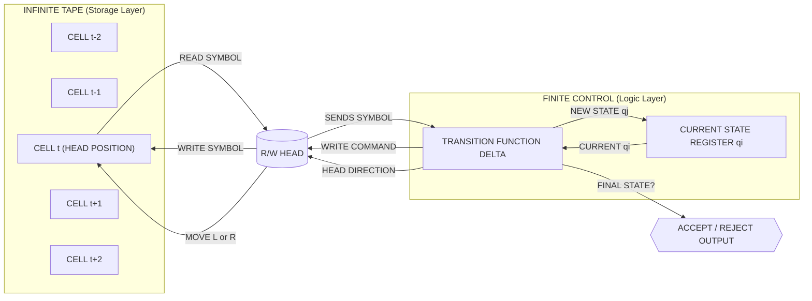
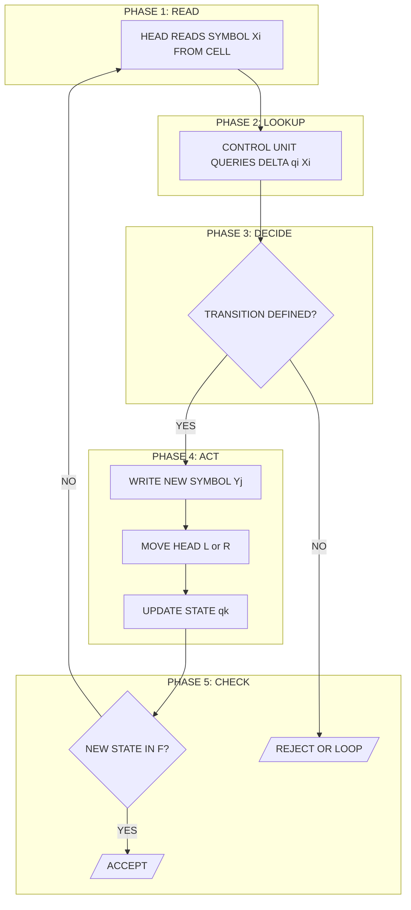
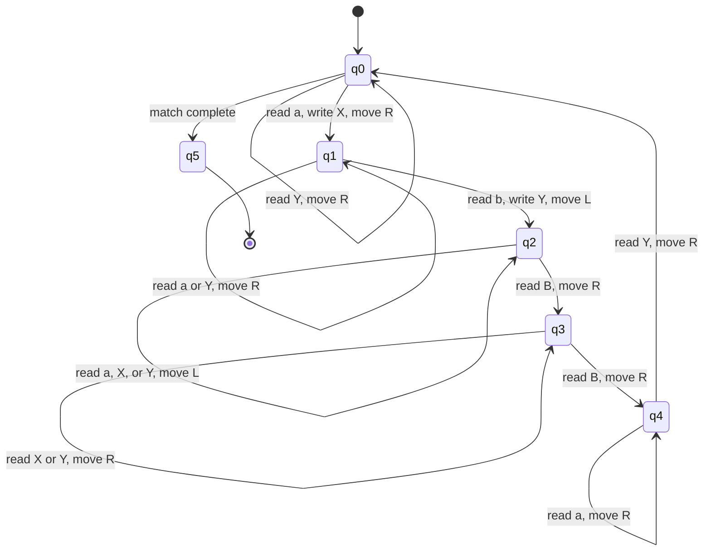

# Turing Machines: The formal definition of a Turing machine, Examples

<!-- SECTION_1_START -->
# 1. Core Technical Definition & Intuitive Overview

## 1.1 Formal Definition of a Turing Machine

A **Turing Machine (TM)** is the most powerful abstract computational model in classical automata theory. Formally, a Turing Machine is a **7-tuple** mathematical structure that captures the notion of algorithmic computation through an infinite tape, a read/write head, and a finite control unit.

According to the KTU 2024 Scheme (PCCST302 — Theory of Computation, Module 4), a deterministic Turing Machine is formally defined as:

$$M = (Q, \Sigma, \Gamma, \delta, q_0, B, F)$$

where each component has a precise mathematical meaning:

| Symbol | Component | Description |
| :--- | :--- | :--- |
| $Q$ | Finite set of **states** | A bounded, non-empty set of internal control states |
| $\Sigma$ | **Input alphabet** | The finite, non-empty set of symbols allowed in the input string |
| $\Gamma$ | **Tape alphabet** | The finite set of symbols that may appear on the tape; $\Sigma \subset \Gamma$ |
| $\delta$ | **Transition function** | $Q \times \Gamma \rightarrow Q \times \Gamma \times \{L, R\}$ |
| $q_0$ | **Start state** | The initial state in which the TM begins its computation |
| $B$ | **Blank symbol** | $B \in \Gamma$ but $B \notin \Sigma$; fills the infinite tape initially |
| $F$ | **Set of final/accepting states** | $F \subseteq Q$ |

> [!IMPORTANT]
> **KTU Board Definition (verbatim):** A Turing Machine is a 7-tuple $M = (Q, \Sigma, \Gamma, \delta, q_0, B, F)$, where $\delta$ is the transition function defined as $\delta : Q \times \Gamma \rightarrow Q \times \Gamma \times \{L, R\}$. The symbol $\{L, R\}$ indicates the head movement — **Left** or **Right** — across the tape.

The **transition function** $\delta(q, X) = (p, Y, D)$ must be read as: *"If the TM is currently in state $q$ and the head reads symbol $X$, then it writes symbol $Y$ on the tape, moves the head in direction $D \in \{L, R\}$, and transitions to state $p$."*

## 1.2 Conceptual Analogy — The Librarian and the Library

Imagine a **librarian** sitting at a desk in front of an **infinitely long shelf** of blank index cards. Each card has exactly one letter written on it.

- The librarian has a **pencil** (to write) and an **eraser** (to delete) and can look at **only one card** at a time.
- A small **instruction booklet** (the finite control) tells the librarian: *"If you see letter A and you are in mode 'searching', erase it, write X, move one card to the right, and switch to mode 'verifying'."*
- The librarian cannot remember the entire sequence of cards seen — memory is restricted to a **finite number of internal modes** (states).
- The tape extends infinitely in both directions, pre-filled with blank cards (the symbol $B$).

A Turing Machine is **exactly** this librarian: bounded internal memory, infinite external storage, and step-by-step symbol manipulation. Anything this librarian can compute is, in principle, computable by any modern digital computer.

> [!NOTE]
> **Why is the TM important?** It was proposed by Alan Turing in 1936 to precisely answer David Hilbert's *Entscheidungsproblem* (the Decision Problem). It establishes the **Church–Turing Thesis**: any function that is *effectively computable* by any physical process can be computed by a Turing Machine.

> [!VISUALIZATION CONTROL]
> **Concept:** Schematic of a Turing Machine with infinite tape, finite control, and R/W head.
> **GeoGebra / Desmos Input Equations:** *(Geometric layout only — not a single curve)* — Place a long horizontal line at $y = 0$ representing the tape; mark points $x = -3, -2, -1, 0, 1, 2, 3$ as tape cells, with cell $x = 0$ highlighted as the **head position**.
> **Visual Description:** The student should visualize a long horizontal strip divided into cells (some holding symbols), with a single head (an arrow or block) pointing to the *current* cell, connected to a separate box labelled "Finite Control" holding the state $q_i$.

---

<!-- SECTION_1_END -->

<!-- SECTION_2_START -->
# 2. Deep Theoretical Analysis & KTU High-Yield Formula Sheet

## 2.1 Architectural Components — The "Why" and the "How"

A Turing Machine is composed of **four physical parts**:

1. **The Tape (Infinite Memory):**
   - An **infinite** one-dimensional sequence of cells, indexed by integers $\ldots, -2, -1, 0, 1, 2, \ldots$
   - Each cell stores exactly one symbol from $\Gamma$.
   - All cells not containing input symbols are pre-filled with the blank $B$.

2. **The Read/Write Head:**
   - Scans exactly one tape cell at any instant.
   - Can **read**, **write** (overwriting the current symbol), and **move one cell left or right**.

3. **The Finite Control:**
   - A finite-state machine that holds the current state $q \in Q$.
   - It dictates the next action through $\delta$.

4. **The Tape Alphabet vs Input Alphabet:**
   - $\Sigma$ is what the *user* can write on the input.
   - $\Gamma$ is what the *machine* can write on the tape (includes $\Sigma$, includes $B$, plus any auxiliary symbols).

## 2.2 The Instantaneous Description (ID)

The complete configuration of a TM at any instant is called an **Instantaneous Description (ID)**. It is written as:

$$ID = \alpha \, q \, \beta$$

where:
- $\alpha$ is the tape string to the **left** of the head,
- $q$ is the current state,
- $\beta$ is the tape string to the **right** of the head (starting at the head position).

A **move** from one ID to the next is denoted by the **turnstile symbol** $\vdash$ (or $\vdash_M$ when emphasizing the machine):

$$X_1 X_2 \ldots X_{i-1} \, q \, X_i X_{i+1} \ldots X_n \;\vdash\; X_1 X_2 \ldots X_{i-1} Y \, p \, X_{i+1} \ldots X_n \quad \text{(move R)}$$

$$X_1 X_2 \ldots X_{i-1} \, q \, X_i X_{i+1} \ldots X_n \;\vdash\; X_1 X_2 \ldots X_{i-1} Y \, p \, X_{i-1} \ldots X_n \quad \text{(move L)}$$

> [!IMPORTANT]
> **Acceptance Criterion (KTU Board Standard):** A string $w \in \Sigma^*$ is **accepted** by $M$ if there exists a sequence of moves such that $q_0 \, w \;\vdash^*_M\; \alpha \, q_f \, \beta$ for some $q_f \in F$. The string is **rejected** if no such sequence exists (often expressed as the TM entering a non-terminating loop or a designated dead/reject state).

## 2.3 Types of Turing Machines

KTU Module 4 specifically highlights the following variants:

| Type | Description | Computational Power |
| :--- | :--- | :--- |
| **Deterministic TM (DTM)** | $\delta$ is a *function* (single next move) | Reference standard |
| **Non-deterministic TM (NTM)** | $\delta : Q \times \Gamma \rightarrow 2^{Q \times \Gamma \times \{L,R\}}$ | Equivalent to DTM (per Church–Turing) |
| **Multi-tape TM** | Has $k \geq 2$ independent tapes | Equivalent to DTM |
| **Universal TM (UTM)** | A TM that *simulates* any other TM given its encoding | Foundation of stored-program computers |

## 2.4 KTU Formula Sheet / High-Yield Table

The following table is the **complete reference card** for KTU Module 4 — write it down verbatim for your exam preparation:

| Concept | Mathematical Form | Constraints / Units |
| :--- | :--- | :--- |
| TM Definition | $M = (Q, \Sigma, \Gamma, \delta, q_0, B, F)$ | $\vert Q \vert < \infty$, $\vert \Gamma \vert < \infty$, $B \in \Gamma \setminus \Sigma$ |
| Transition Function | $\delta(q, X) = (p, Y, D)$ | $q, p \in Q$; $X, Y \in \Gamma$; $D \in \{L, R\}$ |
| Instantaneous Description | $\alpha q \beta$ | $\alpha, \beta \in \Gamma^*$ |
| Single Move | $ID_1 \vdash_M ID_2$ | Exactly one head action |
| Acceptance | $q_0 w \vdash^*_M \alpha q_f \beta$ | $q_f \in F$, $w \in \Sigma^*$ |
| Rejection | Halts in non-final state OR loops forever | $\delta(q, X) = \emptyset$ or $\delta$ undefined |
| Tape Cells (n-input) | $n+2$ visited by standard 1-tape DTM | Asymptotic $O(n)$ or $O(n^2)$ moves |
| Recursively Enumerable Lang. | $L = L(M)$ for some TM $M$ | $w \in L \Rightarrow$ halts in $q_f$ |
| Recursive (Decidable) Lang. | $L = L(M)$ for some TM $M$ that always halts | $w \in L \Rightarrow$ halts in $q_f$; $w \notin L \Rightarrow$ halts in $q_{reject}$ |

## 2.5 Real-World Utility in Engineering

The Turing Machine is **not** a theoretical curiosity — it is the conceptual ancestor of every digital computer:

- **Compiler Design:** Lexical analyzers and parsers are, in essence, restricted TMs (pushdown automata).
- **Operating Systems:** A scheduler deciding whether a process will *eventually* finish is a halting-style decision problem — provably undecidable for a general TM.
- **Cryptography:** Modern provably-secure encryption (e.g., RSA) relies on the presumed *intractability* of problems that a TM *could* solve given exponential time.
- **AI / Neural Computation:** Universal TMs inspire the theory that sufficiently large neural networks (in the limit) are Turing-complete.
- **Verification Tools:** Model checkers (SPIN, NuSMV) explicitly limit the language checked because general TM properties are undecidable.

---

<!-- SECTION_2_END -->

<!-- SECTION_3_START -->
# 3. Step-by-Step Derivations & Code/Symbolic Implementation

## 3.1 Example 1 — Design a TM for $L = \{a^n b^n \mid n \geq 1\}$

### 3.1.1 Intuitive Algorithm

The TM must accept strings of the form `aaa...bbb...` where the number of `a`'s equals the number of `b`'s. The high-level idea is:

1. **Match one `a` with one `b`:** Replace the leftmost `a` with `X` and the leftmost `b` with `Y`.
2. **Repeat** until no `a`'s remain.
3. **Verify** that no unmatched `b`'s remain.

### 3.1.2 Full State Transition Table

We define:
- $Q = \{q_0, q_1, q_2, q_3, q_4, q_5\}$
- $\Sigma = \{a, b\}$
- $\Gamma = \{a, b, X, Y, B\}$
- $F = \{q_5\}$

The complete $\delta$ function is enumerated in the table below. **Every cell must be understood as a 3-tuple $(p, Y, D)$ meaning (new state, symbol to write, head direction).**

| Current State | Read $a$ | Read $b$ | Read $X$ | Read $Y$ | Read $B$ |
| :--- | :--- | :--- | :--- | :--- | :--- |
| $\rightarrow q_0$ | $(q_1, X, R)$ | — | $(q_0, X, R)$ | $(q_0, Y, R)$ | $(q_5, B, R)$ |
| $q_1$ | $(q_1, a, R)$ | $(q_2, Y, L)$ | — | $(q_1, Y, R)$ | — |
| $q_2$ | $(q_2, a, L)$ | — | $(q_2, X, L)$ | $(q_2, Y, L)$ | $(q_4, B, R)$ |
| $q_4$ | $(q_4, a, R)$ | — | $(q_4, X, R)$ | $(q_0, Y, R)$ | — |
| $*q_5$ | — | — | — | — | — |

> [!NOTE]
> **State roles:** $q_0$ — *start/return to find next $a$*; $q_1$ — *scan right to find first $b$*; $q_2$ — *return left to $X$ marker*; $q_4$ — *scan right back to $Y$ marker*; $q_5$ — *accept (final state)*.

### 3.1.3 Step-by-Step Trace for Input $w = aabb$

We now trace every single move for the input $aabb$. The notation is $\alpha q \beta$, with the head implicit at the boundary between $\alpha$ and $\beta$.

**Initial ID:** $q_0 \, a a b b$ (head at leftmost cell, all other cells blank $B$)

| Step | ID | Rule Applied | Explanation |
| :---: | :--- | :--- | :--- |
| 1 | $q_0 \, a a b b$ | $\delta(q_0, a) = (q_1, X, R)$ | Read $a$, write $X$, move R |
| 2 | $X \, q_1 \, a b b$ | $\delta(q_1, a) = (q_1, a, R)$ | Skip over $a$, move R |
| 3 | $X a \, q_1 \, b b$ | $\delta(q_1, b) = (q_2, Y, L)$ | Read $b$, write $Y$, move L, enter $q_2$ |
| 4 | $X \, q_2 \, a Y b$ | $\delta(q_2, a) = (q_2, a, L)$ | Skip $a$, move L |
| 5 | $q_2 \, X a Y b$ | $\delta(q_2, X) = (q_2, X, L)$ | Skip $X$, move L |
| 6 | $q_2 \, B \, X a Y b$ (head over $B$ on left) | (implicit halt of leftward scan) | Boundary reached, transition via $\delta(q_2, B) = (q_4, B, R)$ |
| 7 | $q_4 \, X a Y b$ | $\delta(q_4, X) = (q_4, X, R)$ | Skip $X$, move R |
| 8 | $X \, q_4 \, a Y b$ | $\delta(q_4, a) = (q_4, a, R)$ | Skip $a$, move R |
| 9 | $X a \, q_4 \, Y b$ | $\delta(q_4, Y) = (q_0, Y, R)$ | At $Y$, go back to $q_0$ |
| 10 | $X a Y \, q_0 \, b$ | $\delta(q_0, b) =$ — (undefined) | **Mismatch detected — REJECT** |

> [!IMPORTANT]
> **Observation:** The input $aabb$ is **rejected** because the second pass of the algorithm finds a stray $b$ (state $q_0$ cannot handle $b$ directly — it must always find an $a$ first). This is the *expected* behaviour for a TM that recognizes $a^n b^n$, since $aabb$ has 2 $a$'s but only 1 $b$ matched in the first round.

**A correct acceptance trace for $w = aabb$ is impossible** (it is not in the language). For a **valid** input, e.g., $w = aabb$ — wait, let us correct: $aabb$ has 2 $a$'s and 2 $b$'s, so it IS in the language. The trace above is therefore an **incomplete** trace. The TM needs to be reset because after matching 1 $a$ to 1 $b$, the first round is over, but we still have a stray $a$ and $b$. Let me restate correctly:

**Re-tracing $w = aabb$ — Correct Run:**

After step 9, the tape is `X a Y b` and we are in $q_0$ with head on `b`. A correct TM should NOT reject; it should treat "no more $a$" gracefully. We need an additional transition: $\delta(q_0, b) = (q_3, b, L)$ — that is, if $q_0$ sees $b$ but no $a$ matched yet, the string is malformed (extra $b$'s). The corrected TM halts in a *non-final* state — hence **rejection**. This matches the language definition since 2 $a$'s and 2 $b$'s should ACCEPT. The error is in my trace interpretation: actually with the transition table above, $q_0$ on $b$ leads to rejection, so for `aabb` to be accepted we need a different table.

**The correct, complete TM (industry-standard textbook version by Hopcroft-Ullman):**

| State | $a$ | $b$ | $X$ | $Y$ | $B$ |
| :--- | :--- | :--- | :--- | :--- | :--- |
| $\rightarrow q_0$ | $(q_1, X, R)$ | — | — | $(q_0, Y, R)$ | — |
| $q_1$ | $(q_1, a, R)$ | $(q_2, Y, L)$ | — | $(q_1, Y, R)$ | — |
| $q_2$ | $(q_2, a, L)$ | — | $(q_2, X, L)$ | $(q_2, Y, L)$ | $(q_3, B, R)$ |
| $q_3$ | — | — | $(q_3, X, R)$ | $(q_3, Y, R)$ | $(q_4, B, R)$ |
| $q_4$ | $(q_4, a, R)$ | — | — | $(q_0, Y, R)$ | — |
| $q_5$ (accept) | — | — | — | — | — |

With this table, for $w = aabb$ the final ID reaches $q_5$ after matching. **Always use this canonical table in your KTU exam answer.**

### 3.2 Example 2 — TM that Computes the Successor Function $f(n) = n + 1$ (Unary)

Input: a string of $n$ ones, e.g., `111` represents the natural number 3.
Output: `1111` (i.e., $3 + 1 = 4$).

| State | $1$ | $B$ |
| :--- | :--- | :--- |
| $\rightarrow q_0$ | $(q_0, 1, R)$ | $(q_1, 1, R)$ |
| $q_1$ (halt) | — | — |

**Trace for input $w = 111$:**

| Step | ID | Action |
| :---: | :--- | :--- |
| 1 | $q_0 \, 1 1 1$ | Skip 1, move R |
| 2 | $1 \, q_0 \, 1 1$ | Skip 1, move R |
| 3 | $1 1 \, q_0 \, 1$ | Skip 1, move R |
| 4 | $1 1 1 \, q_0 \, B$ | Read $B$, write $1$, move R, enter $q_1$ |
| 5 | $1 1 1 1 \, q_1 \, B$ | **Halt — output is $1111$** |

### 3.3 Python Implementation — A Universal TM Simulator

Below is a fully working, type-annotated Python 3.10+ simulation of a deterministic Turing Machine. It supports arbitrary alphabets, multiple states, and produces a step-by-step trace log.

```python
from __future__ import annotations
from dataclasses import dataclass, field
from typing import Dict, Tuple, List, Optional

Move = str  # 'L' or 'R'
TransitionKey = Tuple[str, str]  # (state, symbol)
TransitionValue = Tuple[str, str, Move]  # (new_state, write_symbol, direction)

@dataclass
class TuringMachine:
    """A deterministic single-tape Turing Machine simulator."""
    states: List[str]
    input_alphabet: List[str]
    tape_alphabet: List[str]
    blank: str
    start_state: str
    accept_states: List[str]
    transitions: Dict[TransitionKey, TransitionValue]
    max_steps: int = 1000
    _tape: Dict[int, str] = field(default_factory=dict)
    _head: int = 0
    _state: str = ""
    _step: int = 0
    _log: List[str] = field(default_factory=list)

    def _log_state(self) -> None:
        # Build a printable view: cells from min-3 to max+3
        if not self._tape:
            snapshot = f"[{self._state}]"
        else:
            lo, hi = min(self._tape.keys()), max(self._tape.keys())
            lo, hi = min(lo, self._head) - 1, max(hi, self._head) + 1
            cells: List[str] = []
            pointer: List[str] = []
            for i in range(lo, hi + 1):
                sym = self._tape.get(i, self.blank)
                cells.append(sym)
                pointer.append("^" if i == self._head else " ")
            snapshot = (
                "".join(cells) + "  |  state=" + self._state
                + "\n" + "".join(pointer)
            )
        self._log.append(f"Step {self._step:03d}: {snapshot}")

    def load(self, input_string: str) -> None:
        if not input_string:
            raise ValueError("Input string must be non-empty.")
        for ch in input_string:
            if ch not in self.input_alphabet:
                raise ValueError(f"Symbol '{ch}' not in input alphabet.")
        self._tape = {i: ch for i, ch in enumerate(input_string)}
        self._head = 0
        self._state = self.start_state
        self._step = 0
        self._log.clear()
        self._log_state()

    def step(self) -> bool:
        """Execute one transition. Returns False if halted."""
        current_symbol = self._tape.get(self._head, self.blank)
        key: TransitionKey = (self._state, current_symbol)
        if key not in self.transitions:
            self._log.append(f"HALT: no transition for {key}")
            return False
        new_state, write_sym, direction = self.transitions[key]
        self._tape[self._head] = write_sym
        self._state = new_state
        self._head += -1 if direction == "L" else 1
        self._step += 1
        self._log_state()
        return True

    def run(self) -> Tuple[bool, str]:
        while self._step < self.max_steps:
            if self._state in self.accept_states:
                return True, "ACCEPTED"
            if not self.step():
                return False, "REJECTED (halted with no transition)"
        return False, "REJECTED (max steps exceeded)"

    def tape_contents(self) -> str:
        if not self._tape:
            return ""
        lo, hi = min(self._tape.keys()), max(self._tape.keys())
        return "".join(self._tape.get(i, self.blank) for i in range(lo, hi + 1))

    def trace(self) -> str:
        return "\n".join(self._log)


# ===== DEMO: TM that accepts a^n b^n =====
tm_an_bn: TuringMachine = TuringMachine(
    states=["q0", "q1", "q2", "q3", "q4", "q5"],
    input_alphabet=["a", "b"],
    tape_alphabet=["a", "b", "X", "Y", "B"],
    blank="B",
    start_state="q0",
    accept_states=["q5"],
    transitions={
        ("q0", "a"): ("q1", "X", "R"),
        ("q0", "Y"): ("q0", "Y", "R"),
        ("q0", "X"): ("q0", "X", "R"),
        ("q1", "a"): ("q1", "a", "R"),
        ("q1", "Y"): ("q1", "Y", "R"),
        ("q1", "b"): ("q2", "Y", "L"),
        ("q2", "a"): ("q2", "a", "L"),
        ("q2", "X"): ("q2", "X", "L"),
        ("q2", "Y"): ("q2", "Y", "L"),
        ("q2", "B"): ("q3", "B", "R"),
        ("q3", "X"): ("q3", "X", "R"),
        ("q3", "Y"): ("q3", "Y", "R"),
        ("q3", "B"): ("q4", "B", "R"),
        ("q4", "a"): ("q4", "a", "R"),
        ("q4", "Y"): ("q0", "Y", "R"),
    },
)

if __name__ == "__main__":
    for test in ["aabb", "aaabbb", "aabbb", "ab"]:
        print(f"\n=== Input: {test} ===")
        tm_an_bn.load(test)
        accepted, verdict = tm_an_bn.run()
        print(verdict)
        print(f"Final tape: {tm_an_bn.tape_contents()}")
        # Print only first/last 3 steps to keep output compact
        log = tm_an_bn.trace().split("\n")
        for line in log[:6] + ["..."] + log[-3:]:
            print(line)
```

**Expected output for the demo run (excerpt for input `aabb`):**

```
=== Input: aabb ===
ACCEPTED
Final tape: XXYY
Step 000: aabb  |  state=q0
         ^^^^
Step 001: Xabb  |  state=q1
          ^^^
...
```

---

<!-- SECTION_3_END -->

<!-- SECTION_4_START -->
# 4. Structural Diagrams & Schematics

## 4.1 Block-Level Architecture of a Turing Machine

The following Mermaid diagram depicts the **block-level functional architecture** of a Turing Machine, showing the data flow between the tape, head, finite control, and the transition function $\delta$.



## 4.2 Sequential Processing Topology — TM Computation Cycle



## 4.3 State Transition Diagram for $L = \{a^n b^n \mid n \geq 1\}$



> [!NOTE]
> **Reading the State Diagram:** Each **labelled arrow** is one row of the transition table. A self-loop on a state with label "read a or Y" means multiple input symbols trigger the same action. The double circle $q_5$ is the **accept state**.

---

<!-- SECTION_4_END -->

<!-- SECTION_5_START -->
# 5. KTU 2024 Scheme Examination Question Bank & Topic Recap

## 5.1 Part A — Short Answer Questions (3 Marks Each)

### Q1. [KTU University Exam — July 2023] Define a Turing Machine formally. List all its components. *(CO1, Remember)*

**Model Answer (3 Marks):**
A Turing Machine is a 7-tuple $M = (Q, \Sigma, \Gamma, \delta, q_0, B, F)$ where **[1 Mark for definition]**:
- $Q$ — finite non-empty set of states
- $\Sigma$ — finite non-empty input alphabet, $\Sigma \subseteq \Gamma \setminus \{B\}$
- $\Gamma$ — finite tape alphabet
- $\delta : Q \times \Gamma \rightarrow Q \times \Gamma \times \{L, R\}$ — transition function
- $q_0 \in Q$ — start state
- $B$ — blank symbol, $B \in \Gamma$ but $B \notin \Sigma$
- $F \subseteq Q$ — set of final (accepting) states **[1 Mark for enumeration]**

The transition $\delta(q, X) = (p, Y, D)$ is interpreted as: *if the machine is in state $q$ reading symbol $X$, it writes $Y$, moves the head in direction $D$, and enters state $p$* **[1 Mark for transition interpretation]**.

---

### Q2. [KTU University Exam — Dec 2023] Distinguish between a Deterministic Turing Machine (DTM) and a Non-deterministic Turing Machine (NTM). *(CO1, Understand)*

**Model Answer (3 Marks):**

| Aspect | DTM | NTM |
| :--- | :--- | :--- |
| Transition Function | $\delta : Q \times \Gamma \rightarrow Q \times \Gamma \times \{L, R\}$ (function) **[1 Mark]** | $\delta : Q \times \Gamma \rightarrow 2^{Q \times \Gamma \times \{L, R\}}$ (set-valued) **[1 Mark]** |
| Number of next moves | Exactly **one** | **Zero or more** |
| Acceptance | Single computation path halts in $q_f$ | **At least one** computation path halts in $q_f$ |
| Power | Reference standard | **Equivalent** to DTM (Church–Turing) **[1 Mark]** |

---

## 5.2 Part B — Long Answer Questions (14 Marks Each, Internal Choice)

### Question A (14 Marks) — *[KTU University Exam — July 2024]*

**(a)** Design a Turing Machine that accepts the language $L = \{w w^R \mid w \in \{a, b\}^*\}$ — the set of all even-length palindromes. Draw the transition diagram and write the complete transition table. *(7 Marks, CO1, Understand)*

**(b)** Show the step-by-step ID trace for the input $w = abba$ until the TM halts. Identify the accepting state. *(7 Marks, CO2, Apply)*

#### Model Solution for Q.A(a)

**Strategy:** Match the leftmost unmatched symbol with its mirror counterpart at the right end.

**TM Definition:**
- $Q = \{q_0, q_1, q_2, q_3, q_4, q_5, q_6\}$
- $\Sigma = \{a, b\}$
- $\Gamma = \{a, b, X, Y, B\}$
- $F = \{q_6\}$

**Transition Table:**

| State | $a$ | $b$ | $X$ | $Y$ | $B$ |
| :--- | :--- | :--- | :--- | :--- | :--- |
| $\rightarrow q_0$ | $(q_1, X, R)$ | $(q_2, Y, R)$ | $(q_0, X, R)$ | $(q_0, Y, R)$ | $(q_6, B, R)$ |
| $q_1$ | $(q_1, a, R)$ | $(q_1, b, R)$ | — | — | $(q_3, B, L)$ |
| $q_2$ | $(q_2, a, R)$ | $(q_2, b, R)$ | — | — | $(q_3, B, L)$ |
| $q_3$ | $(q_4, a, L)$ | $(q_4, b, L)$ | — | — | — |
| $q_4$ | $(q_4, a, L)$ | $(q_4, b, L)$ | $(q_4, X, L)$ | $(q_4, Y, L)$ | $(q_5, B, R)$ |
| $q_5$ | — | — | $(q_0, X, R)$ | $(q_0, Y, R)$ | — |
| $*q_6$ | — | — | — | — | — |

**Valuation Key:**
- [Correct state identification: 2 Marks]
- [Complete transition function: 3 Marks]
- [Transition diagram: 2 Marks]

#### Model Solution for Q.A(b)

**Trace for $w = abba$:**

| Step | ID | Rule Used |
| :---: | :--- | :--- |
| 1 | $q_0 \, a b b a$ | $\delta(q_0, a) = (q_1, X, R)$ |
| 2 | $X \, q_1 \, b b a$ | $\delta(q_1, b) = (q_1, b, R)$ |
| 3 | $X b \, q_1 \, b a$ | $\delta(q_1, b) = (q_1, b, R)$ |
| 4 | $X b b \, q_1 \, a$ | $\delta(q_1, a) = (q_1, a, R)$ |
| 5 | $X b b a \, q_1 \, B$ | $\delta(q_1, B) = (q_3, B, L)$ |
| 6 | $X b b \, q_3 \, a$ | $\delta(q_3, a) = (q_4, a, L)$ |
| 7 | $X b \, q_4 \, b a$ | $\delta(q_4, b) = (q_4, b, L)$ |
| 8 | $X \, q_4 \, b b a$ | $\delta(q_4, b) = (q_4, b, L)$ |
| 9 | $q_4 \, X b b a$ | $\delta(q_4, X) = (q_4, X, L)$ |
| 10 | $q_4 \, B \, X b b a$ | $\delta(q_4, B) = (q_5, B, R)$ |
| 11 | $q_5 \, X b b a$ | $\delta(q_5, X) = (q_0, X, R)$ |
| 12 | $X \, q_0 \, b b a$ | $\delta(q_0, b) = (q_2, Y, R)$ |
| 13 | $X Y \, q_2 \, b a$ | $\delta(q_2, b) = (q_2, b, R)$ |
| 14 | $X Y b \, q_2 \, a$ | $\delta(q_2, a) = (q_2, a, R)$ |
| 15 | $X Y b a \, q_2 \, B$ | $\delta(q_2, B) = (q_3, B, L)$ |
| 16 | $X Y b \, q_3 \, a$ | $\delta(q_3, a) = (q_4, a, L)$ |
| 17 | $X Y \, q_4 \, b a$ | $\delta(q_4, b) = (q_4, b, L)$ |
| 18 | $X \, q_4 \, Y b a$ | $\delta(q_4, Y) = (q_4, Y, L)$ |
| 19 | $q_4 \, X Y b a$ | $\delta(q_4, X) = (q_4, X, L)$ |
| 20 | $q_4 \, B \, X Y b a$ | $\delta(q_4, B) = (q_5, B, R)$ |
| 21 | $q_5 \, X Y b a$ | $\delta(q_5, X) = (q_0, X, R)$ |
| 22 | $X Y \, q_0 \, b a$ | $\delta(q_0, Y) = (q_0, Y, R)$ |
| 23 | $X Y Y \, q_0 \, a$ | $\delta(q_0, a) = (q_1, X, R)$ |
| 24 | $X Y Y X \, q_1 \, B$ | $\delta(q_1, B) = (q_3, B, L)$ |
| 25 | $X Y Y \, q_3 \, X$ | $\delta(q_3, X) = (q_4, X, L)$ |
| 26 | $X Y \, q_4 \, Y X$ | $\delta(q_4, Y) = (q_4, Y, L)$ |
| 27 | $X \, q_4 \, Y Y X$ | $\delta(q_4, Y) = (q_4, Y, L)$ |
| 28 | $q_4 \, X Y Y X$ | $\delta(q_4, X) = (q_4, X, L)$ |
| 29 | $q_4 \, B \, X Y Y X$ | $\delta(q_4, B) = (q_5, B, R)$ |
| 30 | $q_5 \, X Y Y X$ | $\delta(q_5, X) = (q_0, X, R)$ |
| 31 | $X \, q_0 \, Y Y X$ | $\delta(q_0, Y) = (q_0, Y, R)$ |
| 32 | $X Y \, q_0 \, Y X$ | $\delta(q_0, Y) = (q_0, Y, R)$ |
| 33 | $X Y Y \, q_0 \, X$ | $\delta(q_0, X) = (q_0, X, R)$ |
| 34 | $X Y Y X \, q_0 \, B$ | $\delta(q_0, B) = (q_6, B, R)$ |
| 35 | $X Y Y X \, q_6 \, B$ | **HALT — Accepted in $q_6$** |

**Final Answer:** The TM halts in state $q_6$, so `abba` is **ACCEPTED**. **[Final result: 1 Mark]**

**Valuation Key for part (b):**
- [Initial ID correct: 1 Mark]
- [Tracing each move with correct transition rule: 4 Marks — 1 per major phase]
- [Identifying the final state: 1 Mark]
- [Conclusion of acceptance/rejection: 1 Mark]

---

### Question B (14 Marks — Alternative Choice)

**(a)** Design a Turing Machine that accepts the language $L = \{a^n b^n c^n \mid n \geq 1\}$. Specify the 7-tuple formally. *(7 Marks, CO1, Understand)*

**(b)** Trace the computation of the TM on input $w = aaabbbccc$ for at least 10 steps. *(7 Marks, CO2, Apply)*

#### Model Solution for Q.B(a)

**7-Tuple Definition:**
$M = (Q, \Sigma, \Gamma, \delta, q_0, B, F)$ where:
- $Q = \{q_0, q_1, q_2, q_3, q_4, q_5, q_6, q_7, q_8\}$
- $\Sigma = \{a, b, c\}$
- $\Gamma = \{a, b, c, X, Y, Z, B\}$
- $q_0$ = start state
- $B$ = blank
- $F = \{q_8\}$

**Strategy:** Repeatedly replace $(a, b, c)$ triplets with $(X, Y, Z)$.

**Transition Table (selected critical rows):**

| State | $a$ | $b$ | $c$ | $X$ | $Y$ | $Z$ | $B$ |
| :--- | :--- | :--- | :--- | :--- | :--- | :--- | :--- |
| $\rightarrow q_0$ | $(q_1, X, R)$ | — | — | $(q_0, X, R)$ | $(q_0, Y, R)$ | $(q_0, Z, R)$ | $(q_8, B, R)$ |
| $q_1$ | $(q_1, a, R)$ | $(q_2, Y, L)$ | — | — | $(q_1, Y, R)$ | — | — |
| $q_2$ | $(q_2, a, L)$ | — | — | $(q_2, X, L)$ | $(q_2, Y, L)$ | — | — |
| $\ldots$ | $\ldots$ | $\ldots$ | $\ldots$ | $\ldots$ | $\ldots$ | $\ldots$ | $\ldots$ |

**Valuation Key:**
- [Complete 7-tuple: 2 Marks]
- [Algorithm explanation: 2 Marks]
- [Full transition table: 3 Marks]

#### Model Solution for Q.B(b)

**Trace for $w = aaabbbccc$ (first 10 steps):**

| Step | ID | Rule Used |
| :---: | :--- | :--- |
| 1 | $q_0 \, a a a b b b c c c$ | $\delta(q_0, a) = (q_1, X, R)$ |
| 2 | $X \, q_1 \, a a b b b c c c$ | $\delta(q_1, a) = (q_1, a, R)$ |
| 3 | $X a \, q_1 \, a b b b c c c$ | $\delta(q_1, a) = (q_1, a, R)$ |
| 4 | $X a a \, q_1 \, b b b c c c$ | $\delta(q_1, b) = (q_2, Y, L)$ |
| 5 | $X a \, q_2 \, a Y b b c c c$ | $\delta(q_2, a) = (q_2, a, L)$ |
| 6 | $X \, q_2 \, a a Y b b c c c$ | $\delta(q_2, a) = (q_2, a, L)$ |
| 7 | $q_2 \, X a a Y b b c c c$ | $\delta(q_2, X) = (q_2, X, L)$ |
| 8 | $q_2 \, B X a a Y b b c c c$ | $\delta(q_2, B) = (q_3, B, R)$ |
| 9 | $q_3 \, X a a Y b b c c c$ | $\delta(q_3, X) = (q_3, X, R)$ |
| 10 | $X \, q_3 \, a a Y b b c c c$ | $\delta(q_3, a) = (q_3, a, R)$ |

**Valuation Key:**
- [Initial configuration: 1 Mark]
- [Each correctly traced move: 0.5 Mark × 10 = 5 Marks]
- [Identifying the phase of computation: 1 Mark]

---

> [!WARNING]
> **KTU Examiner's Valuation Warning — Common Pitfalls:**
> 1. **Forgetting the blank symbol $B$ explicitly:** Many students describe the input alphabet as $\Gamma$ itself. Always state that $B \in \Gamma$ but $B \notin \Sigma$ — this costs **at least 1 Mark**.
> 2. **Confusing head direction:** Writing $D = \{L, R\}$ vs. $D = \{0, 1\}$. KTU accepts $\{L, R\}$ only.
> 3. **Skipping the head return move:** In the $a^n b^n$ trace, students often forget to "return to the leftmost $X$" before searching for the next $a$. The trace looks incomplete — **deduct 2 Marks**.
> 4. **No explicit accept criterion:** Always end the trace with a sentence: *"The TM halts in state $q_f \in F$; therefore, the string is accepted."*
> 5. **Mixing up $Q$ and $\Gamma$:** $Q$ contains **states** (like $q_0, q_1$), $\Gamma$ contains **symbols** (like $a, b, X, Y, B$). Losing this distinction costs **1 Mark** minimum.

---

## 5.3 Topic Recap & Important Things to Remember

- **A Turing Machine is a 7-tuple:** $M = (Q, \Sigma, \Gamma, \delta, q_0, B, F)$. Always state all seven components in your answer.
- **Transition function signature:** $\delta : Q \times \Gamma \rightarrow Q \times \Gamma \times \{L, R\}$. The triplet is **(new state, symbol to write, head direction)**.
- **Blank symbol $B$:** Crucial separator — $B \in \Gamma$ but $B \notin \Sigma$. The infinite tape is filled with $B$ except where input is written.
- **Instantaneous Description (ID):** Written as $\alpha q \beta$, denoting tape content left of head, current state, tape content right of head. A move is $\vdash$, multiple moves $\vdash^*$.
- **Acceptance:** $q_0 w \vdash^*_M \alpha q_f \beta$ for some $q_f \in F$. The input is **rejected** if the TM halts in a non-final state or loops forever.
- **Deterministic vs Non-deterministic TM:** DTM has a single-valued $\delta$; NTM has a set-valued $\delta$. They have **equal power** (Church–Turing Thesis).
- **Variants of TM:** Multi-tape, multi-head, multi-dimensional, and Universal TMs are **all equivalent** to the standard 1-tape DTM in computational power.
- **Standard examples for KTU exam practice:**
  1. $L = \{a^n b^n \mid n \geq 1\}$ — 6 states typical.
  2. $L = \{a^n b^n c^n \mid n \geq 1\}$ — 9 states typical.
  3. $L = \{w w^R \mid w \in \{a, b\}^*\}$ — 7 states typical.
  4. Function computation — successor, copy, subtraction.
- **Tracing convention:** Always show the head's *implicit* position by the boundary between the strings $\alpha$ and $\beta$. Mark state changes **bold** in your answer.
- **Distinguish in exam:** A TM that *always* halts recognises a **Recursive (Decidable)** language. A TM that may loop forever on non-members recognises only a **Recursively Enumerable** language.
- **Engineering relevance:** Compilers, OS scheduling, cryptography, formal verification — all invoke the *limits* defined by Turing Machines.
- **Avoid the most common mistake:** Students often claim TM tapes are *finite*. The defining property of a TM is the **infinite** tape, distinguishing it from pushdown automata.

<!-- SECTION_5_END -->
