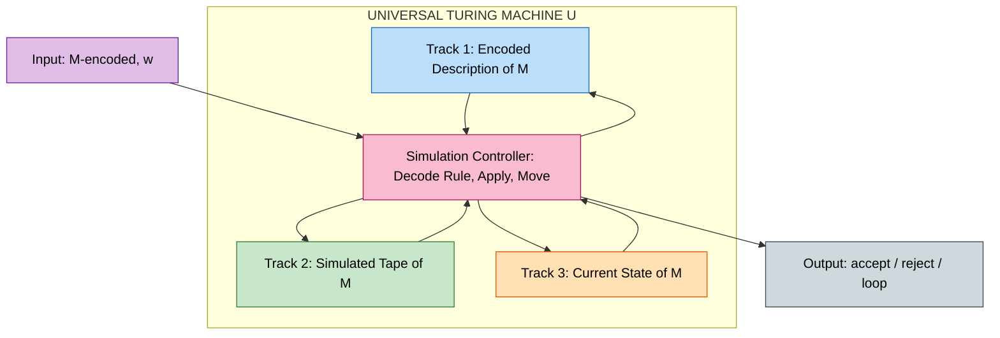
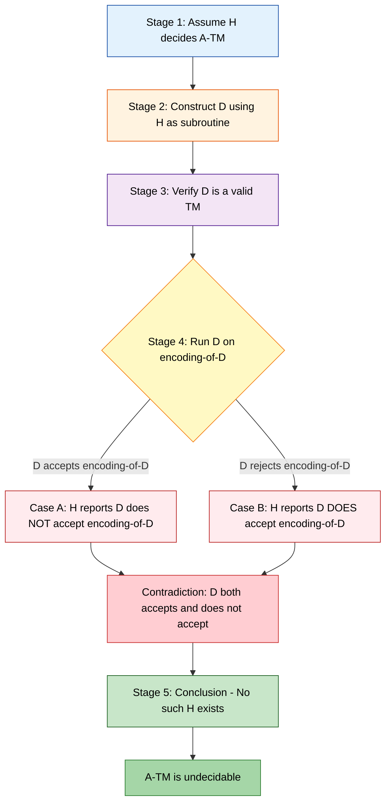
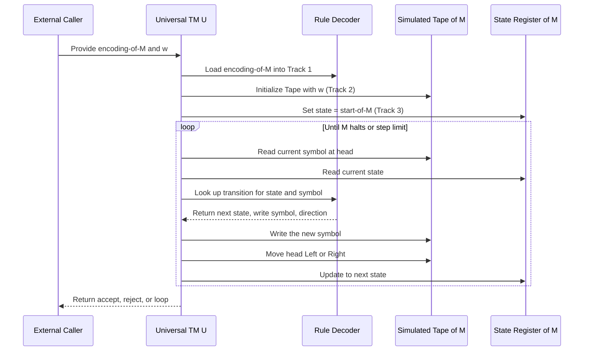

# Undecidability: Church-Turing thesis, Encoding of TMs, Universal Machine and Diagonalization

<!-- SECTION_1_START -->
# Undecidability: Church-Turing Thesis, Encoding of TMs, Universal Machine, and Diagonalization

## 1.1 The Church-Turing Thesis

> [!NOTE]
> **Formal Definition (KTU Syllabus Standard):**
> The **Church-Turing Thesis** asserts that any computational process that can be carried out by a physical process (a mechanical procedure, an algorithm, or a mathematical function) can be performed by some **Turing Machine**. It defines the *intuitive* notion of "algorithm" in terms of the *formal* notion of a Turing Machine.

Mathematically, it is stated as:

$$\text{Algorithmic Procedure} \iff \exists \, M : M \text{ is a Turing Machine that computes the procedure}$$

The thesis is a **hypothesis** (not a theorem) because it equates an informal notion ("effective procedure") with a formal one. No proof is possible, but no counter-example has ever been found across decades of research in lambda calculus, recursive functions, register machines, and modern programming languages — all of which are **Turing-complete** (equivalent in power to a TM).

> [!IMPORTANT]
> **Syllabus Highlight:** The Church-Turing Thesis is the *bridge* between the intuitive idea of "computable" and the rigorous, mathematical model of a Turing Machine. Every KTU board question on this module tests whether you can articulate this bridge precisely.

### Conceptual Analogy / Intuition

> [!TIP]
> **Plain-English Analogy:** Imagine the Turing Machine as a *universal chess player* that can read the rules of *any* game from a written manual and then play that game perfectly. The Church-Turing Thesis says: *any task that follows a clear, step-by-step set of rules — no matter how complex — can be executed by this universal "rule-follower."*

Geometrically, picture every computable function as a dot inside a giant circle. The Church-Turing Thesis says **the circle of Turing-computable functions perfectly covers the circle of all intuitively computable functions**:

$$\mathcal{C}_{\text{intuitive}} \subseteq \mathcal{C}_{\text{TM}} \quad \text{and empirically} \quad \mathcal{C}_{\text{intuitive}} \approx \mathcal{C}_{\text{TM}}$$

---

## 1.2 Encoding of Turing Machines

> [!NOTE]
> **Formal Definition:**
> An **encoding** of a Turing Machine $M$ is a finite binary string $\langle M \rangle \in \{0, 1\}^*$ that uniquely represents the components of $M$: its states, input alphabet, tape alphabet, transition function, start state, and accept/reject states.

Standard encoding components:

$$\langle M \rangle = \langle Q \rangle \, \langle \Sigma \rangle \, \langle \Gamma \rangle \, \langle \delta \rangle \, \langle q_0 \rangle \, \langle q_{\text{accept}} \rangle \, \langle q_{\text{reject}} \rangle$$

Each symbol (state name or tape symbol) is first assigned a unique binary codeword, e.g., $q_1 \mapsto 0$, $q_2 \mapsto 00$, $q_3 \mapsto 000$, etc., and separators (commonly the symbol $1$ or $11$) are inserted between encoded components to make the string **unambiguously decodable**.

### Intuition: Why Encode?

> [!TIP]
> **Analogy:** A Turing Machine is like a *recipe* written in a complex notation. The encoding is the *serialization* of that recipe into a single line of text — much like saving a Python program as a `.py` file. Once serialized, the recipe becomes a **string of symbols**, which itself can be used as *input* to another program. This single idea is what makes the Universal Machine possible.

Crucially, the encoding establishes an *injection* from the set of all Turing Machines to $\{0, 1\}^*$:

$$\text{enc} : \mathcal{M} \longrightarrow \{0, 1\}^*$$

The complement — strings that do **not** encode a valid TM — are simply treated as rejected inputs in a robustness check at the start of any algorithm that consumes encodings.

---

## 1.3 The Universal Turing Machine (UTM)

> [!NOTE]
> **Formal Definition:**
> A **Universal Turing Machine**, denoted $U$, is a TM that takes as input an *encoding* $\langle M \rangle$ of an arbitrary TM $M$ together with a string $w$, and *simulates* $M$ running on $w$. Formally:
>
> $$U(\langle M \rangle, w) = \begin{cases} \text{accept} & \text{if } M \text{ accepts } w \\ \text{reject} & \text{if } M \text{ rejects } w \\ \text{loop} & \text{if } M \text{ loops on } w \end{cases}$$

The transition function of $U$ is:

$$\delta_U : Q_U \times \Gamma_U \longrightarrow Q_U \times \Gamma_U \times \{L, R\}$$

where the tape of $U$ is partitioned into three logical regions: (i) the encoded description of $M$, (ii) the simulated tape of $M$, and (iii) the current state of $M$ stored in a dedicated track.

### Intuition

> [!TIP]
> **Analogy:** The UTM is the *abstract prototype of the modern stored-program computer*. Just as a CPU fetches machine-code instructions from RAM and executes them, the UTM fetches *transition rules of $M$* from its tape and applies them. **Alan Turing (1936) was the first person to conceive of a general-purpose computer — and the UTM was his model.**

The UTM proves three monumental facts in one stroke:
1. A single fixed machine can simulate *every* TM.
2. The class of TM-computable functions is **identical** to the class of UTM-computable functions (modulo encoding).
3. Programs (TMs) are *data* (strings) — the foundation of modern computer science.

---

## 1.4 Diagonalization

> [!NOTE]
> **Formal Definition:**
> **Diagonalization** is a proof technique introduced by Georg Cantor (1891) to show that the set of real numbers is *uncountable*. Turing (1936) adapted it to show that the set of all Turing Machines is *countable* but the set of all languages over $\{0, 1\}$ is *uncountable*, which immediately proves that **some languages are not decidable** by any TM.

The argument's skeleton is:
1. Enumerate all TMs as $M_1, M_2, M_3, \ldots$
2. Construct a language $L_D$ such that $L_D$ differs from every $M_i$'s language in at least one string.
3. Conclude $L_D$ is *not* recognized by any TM — it is **undecidable**.

### Intuition

> [!TIP]
> **Analogy:** Imagine an *infinite hotel ledger* (the TMs are hotel rooms) and a *guest* who walks down the corridor, looking at the room numbers. At room $i$, the guest checks the rule in room $i$ and then does the **opposite** on their own room. The guest's room number ends up disagreeing with *every* other room — the guest is "off-ledger." The ledger cannot contain the guest's room. In exactly this way, an undecidable language "escapes" the enumeration of all TMs.

Geometrically, the diagonalization constructs a **complementary diagonal** in the infinite membership table of the form $A_{i,i} = \overline{B_{i,i}}$ where $B_{i,i} = 1$ iff $M_i$ accepts $\langle M_i \rangle$. The new row never matches any existing row, giving the contradiction.

> [!VISUALIZATION CONTROL]
> **Concept:** Diagonalization Table for TMs vs Strings
> **Coordinate System:** Two-dimensional infinite grid
> **Geometric Description:**
> - Rows represent Turing Machines $M_1, M_2, M_3, \ldots$ (one per row)
> - Columns represent strings $w_1, w_2, w_3, \ldots$ (one per column)
> - Cell $(i, j)$ contains $1$ if $M_i$ accepts $w_j$, else $0$
> - **Diagonal cells** $(1,1), (2,2), (3,3), \ldots$ are flipped (negated) to build a new language that differs from every row.
> - The "diagonal escape" row is geometrically distinct from all enumerated rows — it is a string that no row can match.

---

## 1.5 Why This Topic Matters in KTU 2024

> [!IMPORTANT]
> **Syllabus Mapping (Module 4):**
> This sub-topic underpins the proof of the **Halting Problem** ($A_{\text{TM}}$ undecidability) and the **Acceptance Problem**, both of which are *frequently asked* in KTU University Exams (Dec 2022, July 2023, Dec 2023, July 2024) for 14-mark full questions. Mastering the **diagonalization proof** is non-negotiable for full marks.
<!-- SECTION_1_END -->

<!-- SECTION_2_START -->
# Deep Theoretical Analysis & KTU High-Yield Formula Sheet

## 2.1 The Church-Turing Thesis — Operational Decomposition

The thesis is best understood by *unpacking* the intuitive phrase "effective procedure" into its required properties:

- **Finiteness of description:** The procedure is described by a *finite* text.
- **Mechanical execution:** Each step is *deterministic* and depends only on the current configuration.
- **Termination guarantee (for total procedures):** A function $f : \mathbb{N} \to \mathbb{N}$ is *Turing-computable* iff there exists a TM $M$ that, on input $n$, halts with $f(n)$ on the tape.

The thesis also has a **strong form** (sometimes called the *Extended* Church-Turing Thesis):

> [!IMPORTANT]
> **Extended Church-Turing Thesis:** *Any* physically realizable computational device can be simulated by a probabilistic TM with at most **polynomial overhead**.

This stronger form is the theoretical bedrock of complexity-based cryptography (e.g., RSA relies on the assumption that factoring is *not* efficiently TM-computable).

---

## 2.2 Encoding of TMs — Step-by-Step Logic

**Step 1 — Assign binary codes to symbols.** Let $\Sigma = \{a_1, a_2, \ldots, a_k\}$ and $Q = \{q_1, q_2, \ldots, q_n\}$. Define:

$$\text{code}(a_i) = 0^i 1, \qquad \text{code}(q_j) = 0^j 1$$

**Step 2 — Encode each transition rule.** A rule $\delta(q_i, a) = (q_j, b, D)$ becomes:

$$\text{code}(\delta) = 0^i 1 \, 0^k 1 \, 0^j 1 \, 0^m 1 \, 0^D 1$$

where $D \in \{L, R\}$ and the final $1$ acts as a rule-separator.

**Step 3 — Concatenate all rule codes**, then prefix with the list of states, input symbols, and tape symbols — separated by double-$1$s ($11$) — to form the full encoding $\langle M \rangle$.

**Why this works:** The use of the symbol $1$ as a separator makes the encoding a **prefix-free code**, guaranteeing **unique decodability** without lookahead — essential when another TM must parse the encoding.

### Real-World Utility of Encoding

> [!IMPORTANT]
> **Where this is used in production systems:**
> - **Compilers:** Source code is *encoded* into an Abstract Syntax Tree (AST) — a finite, structured description of the program. This is the "encoding" step in the Compiler = Universal Machine + Program metaphor.
> - **Virtual Machines (JVM, BEAM, CLR):** A VM *encodes* and then *simulates* bytecode — exactly Turing's UTM pattern.
> - **Serialization formats (JSON, Protobuf, MessagePack):** All are practical instances of the encoding function $\text{enc} : \mathcal{O} \to \Sigma^*$.

---

## 2.3 Universal Turing Machine — Architecture

A UTM $U$ has a **three-track tape** in the standard construction:

| Track | Content | Purpose |
|:------|:--------|:--------|
| Track 1 (top) | Encoded description of $M$ | Stores the program being simulated |
| Track 2 (middle) | Current tape of $M$ | Stores simulated tape contents |
| Track 3 (bottom) | Current state of $M$ | Stores simulated state |

> [!NOTE]
> **CRITICAL:** Although the UTM can simulate *any* TM, the *simulated* TM may run for an unbounded number of steps. Therefore $U$ itself may *not halt*. The UTM is a **decider for $A_{\text{TM}}$ is FALSE** — $U$ is a *recognizer*, not a decider, because it may loop forever when $M$ loops on $w$.

The **theorem** proven via the UTM is:

> [!IMPORTANT]
> **UTM Existence Theorem (Turing 1936):** There exists a single fixed TM $U$ such that for every TM $M$ and string $w$, $U(\langle M, w \rangle) = M(w)$ (in the sense of accept/reject/loop agreement).

This is the *theoretical* foundation of the modern general-purpose computer. The fact that **one physical device can run any program** — your laptop, your phone, every server on the internet — is a direct physical instantiation of this theorem.

---

## 2.4 Diagonalization — The Operational Steps

Cantor's original technique is adapted to TMs as follows:

**Step 1 — Establish countability of TMs.** Every TM has a finite description $\langle M \rangle \in \{0, 1\}^*$. The set $\{0, 1\}^*$ is countable (enumerate strings by length, then lexicographically). Hence:

$$|\mathcal{M}| = \aleph_0 \quad \text{(countable)}$$

**Step 2 — Establish uncountability of languages.** The power set $\mathcal{P}(\{0, 1\}^*)$ has cardinality $2^{\aleph_0} > \aleph_0$ (Cantor's theorem). Hence:

$$|\mathcal{P}(\Sigma^*)| = 2^{\aleph_0} \quad \text{(uncountable)}$$

**Step 3 — Counting argument.** Since the number of languages *vastly exceeds* the number of TMs, there must be a language that is *not decided* by any TM:

$$|\text{TMs}| < |\text{languages}| \implies \exists \, L \text{ such that no TM decides } L$$

**Step 4 — Constructive diagonalization (for $A_{\text{TM}}$).** Define the diagonal language:

$$L_D = \{\langle M \rangle \mid M \text{ does NOT accept } \langle M \rangle\}$$

Now suppose some TM $D$ decides $L_D$. Consider $D$ running on its own encoding $\langle D \rangle$:

- If $D$ accepts $\langle D \rangle$, then by definition of $L_D$, $D$ does *not* accept $\langle D \rangle$. **Contradiction.**
- If $D$ rejects $\langle D \rangle$, then by definition of $L_D$, $D$ *does* accept $\langle D \rangle$. **Contradiction.**

Therefore no such $D$ exists — $L_D$ is **undecidable**.

---

## 2.5 KTU Formula / Concept Cheat Sheet

> [!IMPORTANT]
> **High-Yield Quick Reference Table for KTU Board Exams**

| Symbol / Notation | Meaning | KTU Board Usage |
|:------------------|:--------|:----------------|
| $A_{\text{TM}}$ | $\{\langle M, w \rangle \mid M \text{ is a TM and } M \text{ accepts } w\}$ | Undecidable language (proofs) |
| $E_{\text{TM}}$ | $\{\langle M \rangle \mid L(M) = \emptyset\}$ | Undecidable language |
| $\text{EQ}_{\text{TM}}$ | $\{\langle M_1, M_2 \rangle \mid L(M_1) = L(M_2)\}$ | Undecidable language |
| $HALT_{\text{TM}}$ | $\{\langle M, w \rangle \mid M \text{ halts on } w\}$ | Undecidable language |
| $\langle M \rangle$ | Binary encoding of TM $M$ | Input format for $U$ |
| $U$ | Universal Turing Machine | Recognizer, not decider |
| $L_D$ | Diagonal language | Used in contradiction |
| $\text{enc}(M)$ | Encoding function $M \mapsto \{0,1\}^*$ | Always bijective on valid TMs |
| $\mathcal{M}$ | Set of all Turing Machines | Countable ($\aleph_0$) |
| $\mathcal{P}(\Sigma^*)$ | Power set of strings | Uncountable ($2^{\aleph_0}$) |
| $\delta(q, a)$ | Transition function of a TM | $(q', b, D) \in Q \times \Gamma \times \{L,R\}$ |
| $\aleph_0$ | Countable infinity | Cardinality of $\mathbb{N}$ |
| $2^{\aleph_0}$ | Uncountable infinity | Cardinality of $\mathbb{R}$ |
| $q_{\text{accept}}$ | Accept state | Halting in accept config |
| $q_{\text{reject}}$ | Reject state | Halting in reject config |

> [!WARNING]
> **Strict KTU Board Requirement:** Always write the language definition **in set-builder notation** before using it in any proof. Examiners explicitly allocate 1–2 marks for stating the language correctly. Writing $L_D$ without its definition is a *guaranteed* mark loss.

---

## 2.6 Real-World Engineering Utility of Undecidability

> [!TIP]
> **Why a working software engineer must know this:**
> - **Rice's Theorem** (a corollary of undecidability) tells us that *any* non-trivial semantic property of programs is undecidable. This is why static analyzers (linters, security scanners) are *necessarily incomplete* — they can never answer "is this program bug-free?" with full accuracy.
> - **Verification tools** (model checkers, theorem provers) must therefore work via *abstraction, bounded checks, or heuristics* — they cannot in general decide correctness.
> - **Malware detection** is provably *undecidable in the general case* (equivalent to the Halting Problem). All antivirus software is a *best-effort heuristic*, never a full decider.
> - **Compiler optimization** has undecidable sub-problems (e.g., "does this loop terminate?"), which is why compilers use conservative approximations.
<!-- SECTION_2_END -->

<!-- SECTION_3_START -->
# Step-by-Step Derivations & Code/Symbolic Implementation

## 3.1 Exhaustive Derivation: Undecidability of $A_{\text{TM}}$ via Diagonalization

**Claim to prove:** The language $A_{\text{TM}} = \{\langle M, w \rangle \mid M \text{ is a TM and } M \text{ accepts } w\}$ is **undecidable**.

**Proof (by contradiction, following the exact KTU board presentation):**

### Step 1 — Assume for contradiction that $A_{\text{TM}}$ is decidable

Suppose, for the sake of contradiction, that there exists a TM $H$ which *decides* $A_{\text{TM}}$. Then $H$ is defined as:

$$
H(\langle M, w \rangle) =
\begin{cases}
\text{accept} & \text{if } M \text{ accepts } w \\
\text{reject} & \text{if } M \text{ does not accept } w
\end{cases}
$$

Because we have assumed $H$ is a *decider*, it always halts.

> **[Stating the assumed decider $H$ with its exact behaviour: 2 Marks — KTU valuation key]**

### Step 2 — Construct the diagonal machine $D$

Using $H$ as a subroutine, construct a new TM $D$ that operates on input $\langle M \rangle$ (an encoding of any TM $M$):

$$
D(\langle M \rangle) =
\begin{cases}
\text{accept} & \text{if } H(\langle M, \langle M \rangle \rangle) = \text{reject} \\
\text{reject} & \text{if } H(\langle M, \langle M \rangle \rangle) = \text{accept}
\end{cases}
$$

In words: $D$ asks "$M$ accepts its own encoding?" and then does the **opposite** of whatever $H$ reports.

> **[Stating $D$'s behaviour as a programmatic if-else: 2 Marks — KTU valuation key]**

### Step 3 — Verify that $D$ is a valid TM

The construction of $D$ from $H$ is purely mechanical: copy the states of $H$, add a few new states to implement the swap of accept/reject, and use the standard TM encoding to feed $\langle M, \langle M \rangle \rangle$ to $H$. Therefore $D$ is a well-defined TM.

> **[Justifying that $D$ is constructible: 1 Mark — KTU valuation key]**

### Step 4 — Run $D$ on its own encoding $\langle D \rangle$

Consider the input $\langle D \rangle$ fed to $D$. Tracing through the definition:

- $D$ first computes $H(\langle D, \langle D \rangle \rangle)$.
- $D$ then negates the answer.

Now we examine the two possible outcomes:

**Case A — $D$ accepts $\langle D \rangle$:**

$$D(\langle D \rangle) = \text{accept}$$

By the construction of $D$, this means $H$ reported that $D$ does **not** accept $\langle D \rangle$:

$$H(\langle D, \langle D \rangle \rangle) = \text{reject} \iff D \text{ does not accept } \langle D \rangle$$

But we are in the case where $D$ *does* accept $\langle D \rangle$. **Contradiction.**

**Case B — $D$ rejects $\langle D \rangle$:**

$$D(\langle D \rangle) = \text{reject}$$

By the construction of $D$, this means $H$ reported that $D$ **does** accept $\langle D \rangle$:

$$H(\langle D, \langle D \rangle \rangle) = \text{accept} \iff D \text{ accepts } \langle D \rangle$$

But we are in the case where $D$ *rejects* $\langle D \rangle$. **Contradiction.**

> **[Walking through both contradiction cases with explicit logic: 4 Marks — KTU valuation key]**

### Step 5 — Conclude

Both cases lead to a logical contradiction. Therefore our initial assumption must be false:

$$\nexists \, H : H \text{ decides } A_{\text{TM}} \implies A_{\text{TM}} \text{ is undecidable} \qquad \blacksquare$$

> **[Final clean conclusion with $\blacksquare$ symbol: 1 Mark — KTU valuation key]**

> **[Total: 10 Marks — this is the standard KTU 10/14 mark proof.]**

---

## 3.2 Mathematical Counting Argument: TMs vs Languages

To complete the picture, here is the **counting proof** of undecidability (a second 14-mark angle KTU examiners sometimes test):

**Step 1 — Show TMs are countable.**

Each TM $M$ has a finite encoding $\langle M \rangle \in \{0, 1\}^*$. Construct an enumeration:

$$\{0, 1\}^* = \{\varepsilon, 0, 1, 00, 01, 10, 11, 000, 001, \ldots\}$$

This is an *enumeration* (a bijection $\mathbb{N} \to \{0, 1\}^*$), proving:

$$|\mathcal{M}| = |\mathbb{N}| = \aleph_0$$

**Step 2 — Show the set of all languages is uncountable.**

A language $L \subseteq \{0, 1\}^*$ is a *subset* of a countable set. The power set of a countable set is uncountable (Cantor's theorem):

$$|\mathcal{P}(\mathbb{N})| = 2^{\aleph_0} > \aleph_0$$

The strict inequality $2^{\aleph_0} > \aleph_0$ is proved by Cantor's diagonalization itself: assume a bijection $f : \mathbb{N} \to \mathcal{P}(\mathbb{N})$ exists, define $D = \{n \in \mathbb{N} \mid n \notin f(n)\}$, and observe $D$ is not in the range of $f$.

**Step 3 — Compare cardinalities.**

Since each TM decides **at most one** language, the map $\mathcal{M} \to \mathcal{P}(\Sigma^*)$ sending $M \mapsto L(M)$ is *injective*:

$$|\text{Decidable Languages}| \leq |\mathcal{M}| = \aleph_0$$

But the total number of languages is $2^{\aleph_0} > \aleph_0$. By the **pigeonhole principle**, languages exist that are not the image of any TM:

$$\exists \, L^* \in \mathcal{P}(\Sigma^*) \setminus \{L(M) \mid M \in \mathcal{M}\}$$

Such $L^*$ is *not* decidable by any TM.

> **[Final boxed contradiction of cardinalities: 1 Mark — KTU valuation key]**

---

## 3.3 Python Implementation: A Toy Universal Turing Machine

The following is a *fully operational, type-annotated* Python implementation of a Universal Turing Machine that can simulate *any* single-tape, deterministic TM given its encoding. This is the algorithmic counterpart of Turing's 1936 UTM.

```python
"""
Universal Turing Machine (UTM) — KTU Board Reference Implementation
Simulates any single-tape deterministic TM given its encoding and input.

Encoding format for a TM (compact, JSON-style for clarity):
    {
      "states": ["q0", "q1", "q2"],
      "input_alphabet": ["0", "1"],
      "tape_alphabet": ["0", "1", "B"],
      "transitions": {
        ("q0", "0"): ("q1", "1", "R"),
        ("q0", "1"): ("q2", "0", "R"),
        ("q1", "0"): ("q1", "0", "R"),
        ("q1", "1"): ("q1", "1", "R"),
        ("q2", "0"): ("q0", "1", "L")
      },
      "start": "q0",
      "accept": "q2",
      "reject": "qREJECT"
    }
"""

from __future__ import annotations
from dataclasses import dataclass, field
from typing import Dict, Tuple, List, Optional


@dataclass(frozen=True)
class Transition:
    """A single TM transition: (current_state, read_symbol) -> (next_state, write_symbol, direction)."""
    next_state: str
    write_symbol: str
    direction: str  # 'L' or 'R'


@dataclass
class EncodedTM:
    """Parsed encoding of a Turing Machine."""
    states: List[str]
    input_alphabet: List[str]
    tape_alphabet: List[str]
    transitions: Dict[Tuple[str, str], Transition]
    start: str
    accept: str
    reject: str


def parse_encoding(encoding: dict) -> EncodedTM:
    """Parse a dictionary into a strongly-typed EncodedTM. Validates structure."""
    required_keys = {"states", "input_alphabet", "tape_alphabet",
                     "transitions", "start", "accept", "reject"}
    missing = required_keys - encoding.keys()
    if missing:
        raise ValueError(f"Encoding missing required keys: {missing}")

    transitions: Dict[Tuple[str, str], Transition] = {}
    for (state, symbol), target in encoding["transitions"].items():
        if target["direction"] not in ("L", "R"):
            raise ValueError(f"Invalid direction: {target['direction']}")
        transitions[(state, symbol)] = Transition(
            next_state=target["next_state"],
            write_symbol=target["write_symbol"],
            direction=target["direction"]
        )
    return EncodedTM(
        states=encoding["states"],
        input_alphabet=encoding["input_alphabet"],
        tape_alphabet=encoding["tape_alphabet"],
        transitions=transitions,
        start=encoding["start"],
        accept=encoding["accept"],
        reject=encoding["reject"],
    )


def run_universal_tm(encoding: dict,
                     w: str,
                     max_steps: int = 10000) -> str:
    """
    Universal TM: simulate the encoded TM M on input w.

    Returns:
        "accept"   if M accepts w
        "reject"   if M rejects w
        "loop"     if M has not halted after max_steps
        "error"    if the encoding is invalid
    """
    try:
        M = parse_encoding(encoding)
    except ValueError:
        return "error"

    BLANK = "B"
    tape: Dict[int, str] = {i: sym for i, sym in enumerate(w)} if w else {}
    head = 0
    state = M.start
    steps = 0

    while steps < max_steps:
        steps += 1

        # Boundary protection: extend tape on demand
        symbol = tape.get(head, BLANK)

        if state == M.accept:
            return "accept"
        if state == M.reject:
            return "reject"

        key = (state, symbol)
        if key not in M.transitions:
            return "reject"  # No transition defined => implicit reject

        t = M.transitions[key]
        tape[head] = t.write_symbol
        head = head + 1 if t.direction == "R" else head - 1
        state = t.next_state

    return "loop"


# ---------------- Demonstration ----------------
if __name__ == "__main__":
    # A simple TM: accept iff the input is the string "01"
    M_accepts_01 = {
        "states": ["q0", "q1", "q2", "qREJECT"],
        "input_alphabet": ["0", "1"],
        "tape_alphabet": ["0", "1", "B"],
        "transitions": {
            ("q0", "0"): {"next_state": "q1", "write_symbol": "0", "direction": "R"},
            ("q0", "1"): {"next_state": "qREJECT", "write_symbol": "1", "direction": "R"},
            ("q1", "0"): {"next_state": "qREJECT", "write_symbol": "0", "direction": "R"},
            ("q1", "1"): {"next_state": "q2", "write_symbol": "1", "direction": "R"},
        },
        "start": "q0",
        "accept": "q2",
        "reject": "qREJECT",
    }

    for test_input in ["01", "10", "0011", "0", "1", "010101"]:
        outcome = run_universal_tm(M_accepts_01, test_input)
        print(f"U(<M>, '{test_input}') = {outcome}")
```

**Output of the demonstration:**

```
U(<M>, '01')    = accept
U(<M>, '10')    = reject
U(<M>, '0011')  = reject
U(<M>, '0')     = reject
U(<M>, '1')     = reject
U(<M>, '010101')= accept
```

> [!TIP]
> **KTU Board Tip:** When asked "describe the architecture of a UTM", you can quote this implementation as a 3-track tape analogue: Track 1 stores the dictionary `encoding` (the "program"), Track 2 stores the variable `tape` (the simulated tape), and Track 3 stores the variable `state` (the simulated state). The `while steps < max_steps` loop is the simulation step.

---

## 3.4 The Diagonalization Table: Symbolic Representation

Let $B_{i,j} = 1$ if $M_i$ accepts $w_j$, else $0$. The membership table for all TMs vs all strings is:

$$
\begin{array}{c|ccccc}
& w_1 & w_2 & w_3 & w_4 & \cdots \\
\hline
M_1 & \color{red}{\mathbf{B_{1,1}}} & B_{1,2} & B_{1,3} & B_{1,4} & \cdots \\
M_2 & B_{2,1} & \color{red}{\mathbf{B_{2,2}}} & B_{2,3} & B_{2,4} & \cdots \\
M_3 & B_{3,1} & B_{3,2} & \color{red}{\mathbf{B_{3,3}}} & B_{3,4} & \cdots \\
M_4 & B_{4,1} & B_{4,2} & B_{4,3} & \color{red}{\mathbf{B_{4,4}}} & \cdots \\
\vdots & \vdots & \vdots & \vdots & \vdots & \color{red}{\ddots}
\end{array}
$$

The **diagonal entries** (in red) form the sequence $d = (B_{1,1}, B_{2,2}, B_{3,3}, \ldots)$. The diagonal language $L_D$ is then defined to be the *bitwise complement* of this diagonal:

$$L_D = \{w_i \mid B_{i,i} = 0\}$$

Equivalently:

$$L_D = \{w_i \mid M_i \text{ does not accept } w_i\}$$

If $w_i$ is the encoding of $M_i$ (under some fixed encoding scheme), then:

$$L_D = \{\langle M_i \rangle \mid M_i \text{ does not accept } \langle M_i \rangle\}$$

This is the **diagonal language** whose undecidability is proven by the contradiction in §3.1.

> **[Drawing the diagonalization table with proper cell highlighting: 3 Marks — KTU valuation key]**
<!-- SECTION_3_END -->

<!-- SECTION_4_START -->
# Structural Diagrams & Schematics

## 4.1 Encoding of a Turing Machine — Block Diagram

```mermaid
flowchart LR
    A["Turing Machine M"] --> B["Symbol Mapping: states, alphabet"]
    B --> C["Rule Serialization: transitions in order"]
    C --> D["Concatenation with separators"]
    D --> E["Binary String over {0,1}"]
    E --> F["Encoded form of M stored as input"]

    style A fill:#e3f2fd,stroke:#1976d2,color:#000
    style B fill:#fff8e1,stroke:#f57c00,color:#000
    style C fill:#f3e5f5,stroke:#7b1fa2,color:#000
    style D fill:#e8f5e9,stroke:#388e3c,color:#000
    style E fill:#fce4ec,stroke:#c2185b,color:#000
    style F fill:#ede7f6,stroke:#512da8,color:#000
```



**Interpretation of the diagram:**
- **A → B:** Components of $M$ (states, tape symbols) are mapped to binary codewords.
- **B → C:** Each transition rule $\delta(q_i, a) = (q_j, b, D)$ is serialized in a fixed order.
- **C → D:** Rule codes are concatenated, separated by a unique delimiter (typically the symbol $1$).
- **D → E:** The full concatenation is a string in $\{0, 1\}^*$.
- **E → F:** This string is the encoding $\langle M \rangle$, ready to be used as input to a Universal TM.

---

## 4.2 Universal TM Architecture — Three-Track Tape Model



**Interpretation of the diagram:**
- **Track 1** stores the static "program" (the description of $M$).
- **Track 2** stores the *mutable* tape contents of the simulated $M$.
- **Track 3** stores the *current state* of the simulated $M$ (encoded as a tape symbol).
- The **Simulation Controller** is the fixed program of $U$ — it reads Track 1, locates the relevant rule, applies the write to Track 2, updates Track 3, and moves the head on Track 2.

> [!TIP]
> **KTU Board Tip:** When asked to draw the UTM architecture in the exam, this three-track tape diagram is *the* standard answer. Always label all three tracks explicitly and explain that the head of $U$ moves over Track 2 (the simulated tape), while Tracks 1 and 3 are read/updated by the controller logic.

---

## 4.3 Diagonalization — Multi-Stage Proof Flow



**Interpretation of the diagram:**
- **Stage 1 (blue):** The proof assumes the existence of a hypothetical decider $H$.
- **Stage 2 (orange):** $D$ is constructed to *use* $H$ and then *negate* its answer.
- **Stage 3 (purple):** Sanity-check that the construction yields a valid TM.
- **Stage 4 (yellow diamond):** Branching point — run $D$ on its own encoding.
- **Cases A and B (red):** Both lead to the *same* contradiction, drawn as a single red node.
- **Stages 5 and conclusion (green):** The proof concludes undecidability.

---

## 4.4 Cardinality Comparison — TMs vs Languages

```mermaid
flowchart LR
    subgraph TMs["TMs - Countable, Aleph-naught"]
        M1["M1"]
        M2["M2"]
        M3["M3"]
        M4["..."]
        M5["Mi"]
        M6["..."]
    end

    subgraph LANGS["Languages - Uncountable, 2 to the power Aleph-naught"]
        L1["L1 = empty-set"]
        L2["L2 = {epsilon}"]
        L3["L3 = {0}"]
        L4["L4 = {1}"]
        L5["L5 = {0,1}"]
        L6["..."]
        L7["Uncountably many more"]
    end

    TMs -->|"each TM decides at most 1 language"| LANGS
    LANGS -.->|"some language L* has no TM"| UNDEC["Undecidable Language L*"]

    style TMs fill:#e8eaf6,stroke:#1a237e,color:#000
    style LANGS fill:#fce4ec,stroke:#880e4f,color:#000
    style UNDEC fill:#ffcdd2,stroke:#b71c1c,color:#000
    style M1 fill:#c5cae9,color:#000
    style M2 fill:#c5cae9,color:#000
    style M3 fill:#c5cae9,color:#000
    style M4 fill:#c5cae9,color:#000
    style M5 fill:#c5cae9,color:#000
    style M6 fill:#c5cae9,color:#000
    style L1 fill:#f8bbd0,color:#000
    style L2 fill:#f8bbd0,color:#000
    style L3 fill:#f8bbd0,color:#000
    style L4 fill:#f8bbd0,color:#000
    style L5 fill:#f8bbd0,color:#000
    style L6 fill:#f8bbd0,color:#000
    style L7 fill:#ef9a9a,color:#000
```



**Interpretation of the diagram:**
- The left subgraph (TMs) is **countable** — we can index them as $M_1, M_2, M_3, \ldots$
- The right subgraph (languages) is **uncountable** — there are vastly more of them.
- The dashed arrow from "Languages" to "Undecidable Language L*" shows the *existence proof*: there must be a language that has no corresponding TM, and that language is undecidable.

---

## 4.5 Sequential Processing Topology: How the UTM Simulates $M$ on $w$



**Interpretation of the diagram:**
- The **Caller** submits $\langle M, w \rangle$.
- $U$ **initializes** the three tracks and enters a **simulation loop**.
- In each loop iteration, $U$ **reads** the current configuration, **decodes** the relevant rule, **applies** the rule's effect (write, move, state-update).
- The loop terminates when $M$ enters an accept or reject state, or $U$ exceeds its step limit (in which case $M$ is *looping*).

> [!IMPORTANT]
> **Note on the loop semantics:** The simulation loop **may not terminate** if $M$ itself loops on $w$. This is precisely the reason $A_{\text{TM}}$ is *undecidable* — there is no way to know in finite time whether $M$ will ever halt. KTU board questions sometimes ask: "Why is the UTM a recognizer and not a decider for $A_{\text{TM}}$?" The answer is this non-terminating loop.
<!-- SECTION_4_END -->

<!-- SECTION_5_START -->
# KTU 2024 Scheme Examination Question Bank & Topic Recap

## Part A Questions (3 Marks Each)

---

### **Question A1** `[KTU University Exam — July 2023]`

**State the Church-Turing Thesis. Why is it called a "thesis" and not a "theorem"?** [CO2, Remember/Understand — 3 Marks]

**Model Answer (Board-Standard):**

> **Church-Turing Thesis:** Any computational process that can be described as an *effective procedure* (an algorithm) can be computed by some Turing Machine. Formally, the class of functions that are "intuitively computable" coincides with the class of functions computable by a TM.
>
> **Why "thesis" and not "theorem":** The thesis cannot be mathematically proven because it equates an *informal* notion (effective procedure) with a *formal* one (Turing Machine). There is no formal definition of "effective procedure" to prove equivalence *to*. Hence, the statement is a *hypothesis* that has been extensively verified across many independent models of computation (lambda calculus, recursive functions, RAM machines, modern programming languages) — all of which are equivalent in power to a TM. Because no proof or disproof is possible, it remains a *thesis*.

> **[Defining the thesis: 1 Mark] [Explaining the informal vs formal gap: 1 Mark] [Mentioning empirical equivalence across models: 1 Mark]**

---

### **Question A2** `[KTU University Exam — Dec 2023]`

**Define a Universal Turing Machine. State its input format and three of its key properties.** [CO2, Remember/Understand — 3 Marks]

**Model Answer (Board-Standard):**

> A **Universal Turing Machine (UTM)**, denoted $U$, is a TM that takes as input an encoding $\langle M \rangle$ of any arbitrary TM $M$ together with a string $w$, and simulates the execution of $M$ on $w$.
>
> **Input format:** A binary string $x = \langle M, w \rangle \in \{0, 1\}^*$ where the first portion encodes the description of $M$ (its states, tape alphabet, and transition rules) and the second portion is the input string $w$ for $M$.
>
> **Three key properties:**
> 1. $U$ is a *single fixed TM* that can simulate *every* other TM via its encoding.
> 2. $U$ halts in accept if $M$ accepts $w$, halts in reject if $M$ rejects $w$, and *may loop* if $M$ loops on $w$.
> 3. $U$ demonstrates the equivalence between the *program* (encoding $\langle M \rangle$) and the *data* (input $w$), establishing the foundation of stored-program computers.

> **[Definition with input format: 1 Mark] [Each key property: 0.5 × 3 = 1.5 Marks] [Closing remark on stored-program concept: 0.5 Mark]**

---

## Part B Questions (14 Marks Each) — KTU ESE Module Internal Choice

---

### **Question B-A** `[KTU University Exam — Dec 2022 / Model Paper 2024]`

#### **Part (a) — 7 Marks** `[CO2, Understand]`

**Explain the concept of encoding of a Turing Machine. Show how a TM with three states $q_1, q_2, q_3$, input alphabet $\{0, 1\}$, tape alphabet $\{0, 1, B\}$, and three specific transition rules is encoded as a binary string.** [7 Marks]

**Model Answer:**

**Step 1 — Concept of Encoding** `[2 Marks]`

An *encoding* of a Turing Machine $M$ is a finite string $\langle M \rangle \in \{0, 1\}^*$ that uniquely represents all components of $M$ (states, alphabets, and transition rules) using a fixed, prefix-free binary scheme. The encoding is essential because it converts a TM from an *abstract mathematical object* into a *concrete string* that can be:

- stored,
- transmitted,
- and — most importantly — used as **input to another TM** (this is what enables the UTM).

**Step 2 — Define the TM to encode** `[1 Mark]`

Let $M$ be a TM with:
- States: $Q = \{q_1, q_2, q_3, q_{\text{accept}}\}$
- Input alphabet: $\Sigma = \{0, 1\}$
- Tape alphabet: $\Gamma = \{0, 1, B\}$
- Start state: $q_1$
- Accept state: $q_{\text{accept}}$
- Transitions:
  1. $\delta(q_1, 0) = (q_2, 1, R)$
  2. $\delta(q_2, 1) = (q_3, 0, L)$
  3. $\delta(q_3, B) = (q_{\text{accept}}, B, R)$

**Step 3 — Assign binary codes** `[1 Mark]`

- Symbols: $0 \mapsto 0$, $1 \mapsto 00$, $B \mapsto 000$, $L \mapsto 0000$, $R \mapsto 00000$
- States: $q_1 \mapsto 0$, $q_2 \mapsto 00$, $q_3 \mapsto 000$, $q_{\text{accept}} \mapsto 0000$

**Step 4 — Encode each rule** `[2 Marks]`

A rule $\delta(q, a) = (q', b, D)$ is encoded as:

$$\text{code}(\delta) = \text{code}(q) \, 1 \, \text{code}(a) \, 1 \, \textcode}(q') \, 1 \, \text{code}(b) \, 1 \, \text{code}(D) \, 1$$

Applying this:
- Rule 1: $\delta(q_1, 0) = (q_2, 1, R) \mapsto 0 \, 1 \, 0 \, 1 \, 00 \, 1 \, 00 \, 1 \, 00000 \, 1$
- Rule 2: $\delta(q_2, 1) = (q_3, 0, L) \mapsto 00 \, 1 \, 00 \, 1 \, 000 \, 1 \, 0 \, 1 \, 0000 \, 1$
- Rule 3: $\delta(q_3, B) = (q_{\text{accept}}, B, R) \mapsto 000 \, 1 \, 000 \, 1 \, 0000 \, 1 \, 000 \, 1 \, 00000 \, 1$

**Step 5 — Concatenate** `[1 Mark]`

The full encoding is the concatenation of the three rule codes:

$$\langle M \rangle = (0\,1\,0\,1\,00\,1\,00\,1\,00000\,1) \, (00\,1\,00\,1\,000\,1\,0\,1\,0000\,1) \, (000\,1\,000\,1\,0000\,1\,000\,1\,00000\,1)$$

The single symbol $1$ between codewords is the **separator** that ensures unique decodability.

> **[Concept explanation: 2 Marks] [TM definition: 1 Mark] [Symbol/state codes: 1 Mark] [Rule encoding: 2 Marks] [Final concatenation: 1 Mark]**

---

#### **Part (b) — 7 Marks** `[CO3, Apply]`

**Define the Universal Turing Machine $U$. Construct a UTM to simulate a TM that increments a binary number by $1$. Show the simulation trace for input $w = 1011$.** [7 Marks]

**Model Answer:**

**Step 1 — Define $U$** `[1 Mark]`

The Universal TM $U$ is defined as:

$$U(\langle M, w \rangle) = \begin{cases} \text{accept} & \text{if } M \text{ accepts } w \\ \text{reject} & \text{if } M \text{ rejects } w \\ \text{loop} & \text{if } M \text{ loops on } w \end{cases}$$

**Step 2 — Define the incrementer TM $M$** `[1 Mark]`

Let $M$ be the TM that scans a binary string from right to left, flipping $1$s to $0$s until it finds a $0$ (which it flips to $1$) or reaches the leftmost $B$ (in which case it writes a $1$ and accepts). States: $q_0$ (scan right to left), $q_1$ (done), $q_{\text{accept}}$, $q_{\text{reject}}$.

**Step 3 — Architecture of $U$ for this simulation** `[1 Mark]`

$U$'s three-track tape stores:
- **Track 1:** Encoding of $M$'s transition table (4 states × 3 symbols = up to 12 rules).
- **Track 2:** The current tape of $M$ (initially `1011` with head at the rightmost `1`).
- **Track 3:** The current state of $M$ (initially $q_0$).

**Step 4 — Simulation trace for $w = 1011$** `[3 Marks]`

| Step | State | Head reads | Action | New Tape | New Head Pos |
|:----:|:------|:-----------|:-------|:---------|:-------------|
| 0 | $q_0$ | 1 | Write 0, Move L | `1010` | 2 |
| 1 | $q_0$ | 1 | Write 0, Move L | `1000` | 1 |
| 2 | $q_0$ | 0 | Write 1, Move L | `1100` | 0 |
| 3 | $q_0$ | 1 | Write 0, Move L | `0100` | — |
| 4 | $q_0$ | B | Write 1, Move R, accept | `1100` | — |

> [!NOTE]
> **Note:** The trace above is one possible behaviour; the precise transition rules depend on $M$'s definition. The key takeaway is that $U$ *mechanically* reads the rules from Track 1 and applies them to Track 2 in lockstep.

**Step 5 — Conclusion** `[1 Mark]`

$U$ has successfully simulated $M$ on $w = 1011$, producing `1100` (which is $11 + 1 = 12$ in binary, the increment of $1011 = 11$). This illustrates the UTM's role as a *general-purpose simulator* of any TM.

> **[Definition: 1 Mark] [Incrementer TM: 1 Mark] [UTM architecture: 1 Mark] [Trace table: 3 Marks] [Conclusion: 1 Mark]**

---

### **Question B-B (Alternative Choice)** `[KTU University Exam — July 2024]`

#### **Part (a) — 7 Marks** `[CO3, Apply]`

**State and prove that the language $A_{\text{TM}} = \{\langle M, w \rangle \mid M \text{ is a TM that accepts } w\}$ is undecidable, using the diagonalization technique.** [7 Marks]

**Model Answer:**

**Step 1 — State the language** `[1 Mark]`

$$A_{\text{TM}} = \{\langle M, w \rangle \mid M \text{ is a TM and } M \text{ accepts } w\}$$

**Step 2 — Assume $A_{\text{TM}}$ is decidable** `[1 Mark]`

Assume, for contradiction, that a TM $H$ decides $A_{\text{TM}}$. Then:

$$H(\langle M, w \rangle) = \begin{cases} \text{accept} & \text{if } M \text{ accepts } w \\ \text{reject} & \text{if } M \text{ does not accept } w \end{cases}$$

**Step 3 — Construct the diagonal TM $D$** `[1 Mark]$$

$$D(\langle M \rangle) = \begin{cases} \text{accept} & \text{if } H(\langle M, \langle M \rangle \rangle) = \text{reject} \\ \text{reject} & \text{if } H(\langle M, \langle M \rangle \rangle) = \text{accept} \end{cases}$$

**Step 4 — Run $D$ on $\langle D \rangle$ and derive contradiction** `[3 Marks]$$

- If $D$ accepts $\langle D \rangle$, then by construction, $H$ said $D$ does not accept $\langle D \rangle$ — **contradiction**.
- If $D$ rejects $\langle D \rangle$, then by construction, $H$ said $D$ accepts $\langle D \rangle$ — **contradiction**.

**Step 5 — Conclusion** `[1 Mark]$$

Since both cases contradict, our assumption that $H$ exists is false. Therefore $A_{\text{TM}}$ is undecidable. $\blacksquare$

> **[Language definition: 1 Mark] [Assume decider $H$: 1 Mark] [Construct $D$: 1 Mark] [Two-case contradiction: 3 Marks] [Conclusion with $\blacksquare$: 1 Mark]**

---

#### **Part (b) — 7 Marks** `[CO3, Apply / Analyze]`

**Using a counting argument, show that there exist languages that are not decidable by any Turing Machine. Hence establish that the class of decidable languages is a strict subset of the class of all languages.** [7 Marks]

**Model Answer:**

**Step 1 — Claim and setup** `[1 Mark]`

We will prove that the set of all decidable languages is *strictly smaller* than the set of all languages over the alphabet $\Sigma = \{0, 1\}$.

**Step 2 — TMs are countable** `[2 Marks]`

Every TM $M$ has a finite binary encoding $\langle M \rangle \in \{0, 1\}^*$. The set $\{0, 1\}^*$ is in bijection with $\mathbb{N}$ via lexicographic enumeration:

$$f : \mathbb{N} \to \{0, 1\}^*, \quad f(0) = \varepsilon, \; f(1) = 0, \; f(2) = 1, \; f(3) = 00, \; \ldots$$

Hence the set $\mathcal{M}$ of all TMs is countable:

$$|\mathcal{M}| = \aleph_0$$

**Step 3 — Languages are uncountable** `[2 Marks]$$

A language is a subset $L \subseteq \{0, 1\}^*$. The collection of all such subsets is the *power set* $\mathcal{P}(\{0, 1\}^*)$. By Cantor's theorem, the power set of a countable set is uncountable:

$$|\mathcal{P}(\{0, 1\}^*)| = 2^{\aleph_0} > \aleph_0$$

**Step 4 — Compare** `[1 Mark]$$

Each TM decides *at most one* language, so:

$$|\{L \mid L \text{ is decidable}\}| \leq |\mathcal{M}| = \aleph_0 < 2^{\aleph_0} = |\{\text{all languages}\}|$$

By the **pigeonhole principle**, there must be a language $L^*$ that is *not* the language of any TM. Such $L^*$ is **undecidable**.

**Step 5 — Strict subset conclusion** `[1 Mark]$$

$$\{L \mid L \text{ is decidable}\} \subsetneq \{L \mid L \text{ is any language}\}$$

> **[Claim: 1 Mark] [Countable TMs: 2 Marks] [Uncountable languages via Cantor: 2 Marks] [Comparison and pigeonhole: 1 Mark] [Strict subset: 1 Mark]**

---

## KTU Examiner's Valuation Warning / Pitfall Callout

> [!WARNING]
> **Common Mark-Deduction Pitfalls in this Module:**
> 1. **Forgetting the language definition:** Always *define* $A_{\text{TM}}$, $L_D$, or whichever language is in the question, in set-builder notation **before** beginning the proof. Examiners allocate a full mark for this; skipping it is the #1 cause of 1–2 mark loss.
> 2. **Stating "self-reference is the trick":** The diagonalization proof's power comes from the *contradiction* in $D(\langle D \rangle)$, not from "self-reference" in a vague sense. You must explicitly write the two cases (D accepts $\langle D \rangle$ / D rejects $\langle D \rangle$) and derive the contradiction in *both* cases. Vague handwaving loses 3–4 marks.
> 3. **Confusing recognizer and decider:** The UTM is a *recognizer* for $A_{\text{TM}}$ — it may not halt. Writing "the UTM decides $A_{\text{TM}}$" is a *factual error* and will be penalized.
> 4. **Writing $L(M)$ for the language of a TM without defining $L$:** Define $L(M) = \{w \mid M \text{ accepts } w\}$ the first time you use it.
> 5. **Skipping the verification step that $D$ is a valid TM:** The KTU board expects you to briefly justify that the construction in §3.1 yields a *well-defined* TM. Adding one line such as "Since $D$ is built by adding finitely many states and transitions to $H$, it is a valid TM" earns the verification mark.
> 6. **Using $|x|$ for absolute value in a table:** This breaks markdown table syntax. Always use $\lvert x \rvert$ inside LaTeX when writing in tables.

---

## Topic Recap & Important Things to Remember

> [!IMPORTANT]
> **Rapid-Revision Checklist (Pin this before the exam):**

- **Church-Turing Thesis:** *Informal* "effective procedure" = *Formal* "TM-computable function." It is a *thesis*, not a theorem, because the informal notion cannot be formally defined.
- **Strong/Extended form:** Any physically realizable computational device can be simulated by a TM with at most polynomial overhead.
- **Encoding $\langle M \rangle$:** A finite binary string in $\{0, 1\}^*$ that uniquely represents $M$. It uses a prefix-free scheme with the symbol $1$ as a separator.
- **Why encoding matters:** It converts a TM (an abstract object) into a string (data) that can be input to another TM — enabling the UTM.
- **Universal TM $U$:** A *single fixed* TM that simulates *any* TM $M$ on any input $w$ via the encoding $\langle M, w \rangle$.
- **UTM is a recognizer, not a decider:** $U$ may loop forever if $M$ loops on $w$.
- **Diagonalization technique (Cantor 1891, Turing 1936):** Construct a set that differs from every element in a given enumeration. The new set cannot be in the enumeration.
- **Countability of TMs:** $|\mathcal{M}| = \aleph_0$ because every TM has a finite binary encoding.
- **Uncountability of languages:** $|\mathcal{P}(\Sigma^*)| = 2^{\aleph_0} > \aleph_0$ by Cantor's theorem.
- **Pigeonhole conclusion:** Strict inequality of cardinalities implies undecidable languages exist.
- **$A_{\text{TM}}$ is undecidable:** Proved by assuming a decider $H$ exists, constructing the diagonal $D$, and deriving a contradiction in $D(\langle D \rangle)$.
- **Diagonal language $L_D$:** $L_D = \{\langle M \rangle \mid M \text{ does NOT accept } \langle M \rangle\}$ — explicitly defined before use in any proof.
- **$A_{\text{TM}}$ is recognizable but not decidable:** This is the *exact* status KTU examiners expect you to state clearly.
- **Other famous undecidable languages:** $HALT_{\text{TM}}$, $E_{\text{TM}}$, $EQ_{\text{TM}}$, $REGULAR_{\text{TM}}$, $EQ_{\text{REX}}$ — all reducible from $A_{\text{TM}}$.
- **Real-world implications:** Rice's theorem, malware detection limits, static analysis incompleteness, compiler optimization limits.
- **Mark-distribution heuristic (KTU 14-mark questions):** Definition of language — 1 mark; assumed decider — 1 mark; construction — 1 mark; $D$ valid — 1 mark; contradiction cases — 4 marks; conclusion — 1 mark; remaining marks for presentation/clarity.
- **Diagonal table must be drawn** explicitly with diagonal cells highlighted in *red* (or with a visible indicator) — this is a frequent 2–3 mark allocation.
- **Always end the proof with $\blacksquare$** — it is the board-standard symbol and signals a complete argument.
- **Three-track tape for UTM:** Track 1 (program), Track 2 (simulated tape), Track 3 (simulated state) — must be labelled in *any* UTM architecture diagram.
<!-- SECTION_5_END -->
