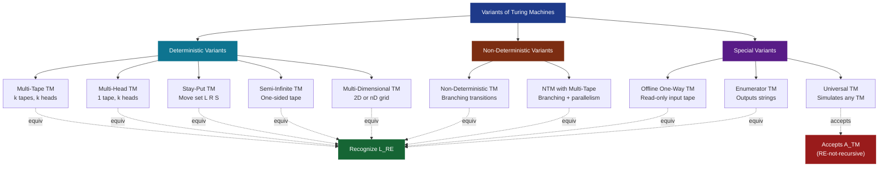
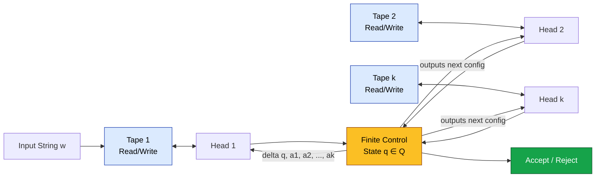
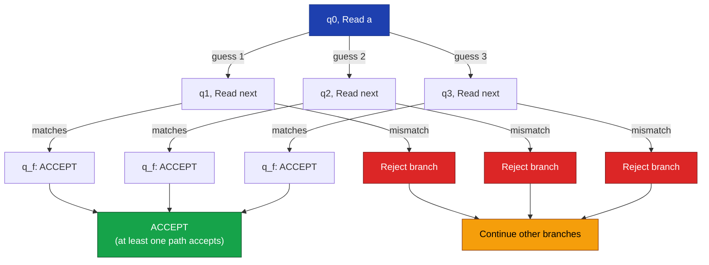
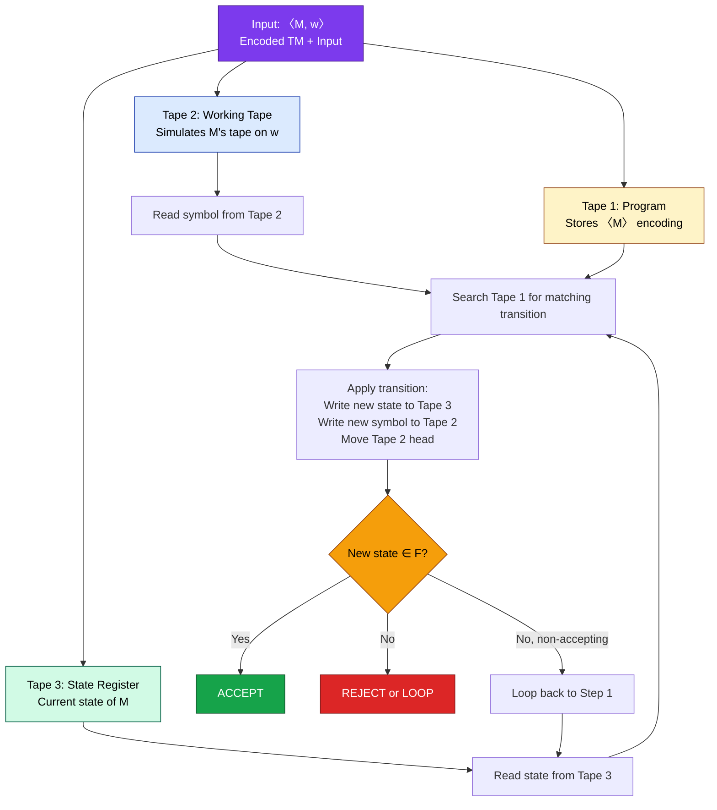
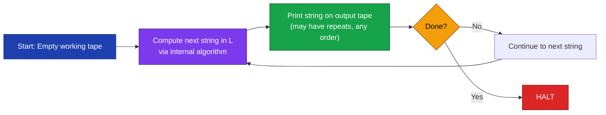
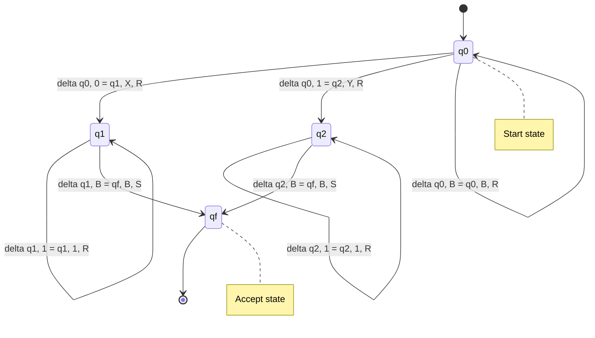

# Variants of Turing Machines (equivalence proofs not expected)

<!-- SECTION_1_START -->

# Variants of Turing Machines — KTU Module 4 Masterclass

## 1.1 Foundational Definition (KTU 2024 Scheme Terminology)

> [!IMPORTANT]
> **Core Definition — Standard Turing Machine (TM)**
> A Turing Machine $M$ is a 7-tuple formal construct defined as:
> $$M = (Q, \Sigma, \Gamma, \delta, q_0, B, F)$$
> where
> $Q$ = finite non-empty set of **internal states**
> $\Sigma$ = finite non-empty set of **input symbols** (excluding the blank symbol)
> $\Gamma$ = finite non-empty set of **tape symbols** where $\Sigma \subset \Gamma$
> $\delta$ = the **transition function**: $Q \times \Gamma \rightarrow Q \times \Gamma \times \{L, R\}$
> $q_0 \in Q$ = the **start state**
> $B \in \Gamma - \Sigma$ = the **blank symbol**
> $F \subseteq Q$ = the set of **final (accepting) states**

The fundamental power of a Turing Machine lies in its **unbounded memory (tape)** combined with a **finite control unit (state register)**. This makes it the canonical model for *general-purpose computation* and the basis of the **Church-Turing Thesis**.

> [!NOTE]
> **Church-Turing Thesis (KTU Highlight)**
> Any computational process that can be carried out by *any* physical computing device (including algorithms, biological systems, or quantum computers) can be simulated by a Turing Machine. The thesis is non-formal, but universally accepted.

## 1.2 Why Study Variants?

Researchers have historically proposed several **enhanced versions** of the basic TM:
- Multi-tape TMs
- Non-deterministic TMs
- Multi-head TMs
- Turing Machines with stay-put moves
- Offline / Two-way vs One-way TMs
- Enumerator TMs
- Universal TMs

The KTU Module 4 highlight is that **none of these variants add any extra computational power** — they all recognize exactly the same class of languages: the **Recursively Enumerable (RE) languages** (also denoted $\mathcal{L}_{RE}$). They differ only in *convenience*, *speed*, and *ease of design*.

> [!TIP]
> **Intuitive Analogy — "The Universal Calculator Family"**
> Think of the standard Turing Machine as a **basic scientific calculator**. Variants of TMs are like *graphing calculators, programmable calculators, and financial calculators*. They look different, have more buttons, and may be more convenient for specific tasks — but mathematically, **they all compute the same set of functions**. The "extra buttons" don't make them more powerful; they only make life easier for the programmer.

> [!TIP]
> **Geometric Intuition — "The Library & Librarian"**
> Imagine a librarian (the finite control) walking along an **infinite library shelf** (the tape) with a notepad (the state) and an eraser (the read/write head). Different TM variants correspond to:
> - *Multi-tape* → librarian has *multiple parallel shelves*
> - *Non-deterministic* → librarian has a *magical advisor* who suggests moves
> - *Multi-head* → librarian has *multiple pairs of eyes* on the same shelf
> - *Offline* → librarian can only move *forward* (one-way) along the shelf

## 1.3 Standard TM Recap — Pre-requisite Foundation

A **configuration (instantaneous description, ID)** of a TM is a string of the form:
$$\alpha_1 \, q \, \alpha_2$$
where $q$ is the current state, $\alpha_1$ is the tape content to the *left* of the head, and $\alpha_2$ is the tape content from the head position to the *right*.

The **yields-in-one-step** relation is denoted $\vdash_M$ and the **yields relation** is denoted $\vdash_M^*$.

A string $w$ is **accepted** by $M$ if $(q_0, w) \vdash_M^* (\alpha, q_f, \beta)$ for some $q_f \in F$, $\alpha, \beta \in \Gamma^*$.

> [!VISUALIZATION CONTROL]
> **Concept:** Standard Turing Machine Tape Configuration
> **Desmos Input Equations:**
> * `B = blank symbol marker`
> * `Cell positions: -3, -2, -1, 0, 1, 2, 3` on the x-axis
> * `Contents at each cell: B, 1, 0, 1, 0, 1, B`
> **Visual Description:** A horizontal line of cells, each containing a symbol, with a triangular "head" pointer on one cell. Cells outside the written region are shaded (blanks).

---

<!-- SECTION_1_END -->

<!-- SECTION_2_START -->

# Variants of Turing Machines — Deep Theoretical Analysis

## 2.1 The Eight Major Variants (KTU 2024 High-Yield List)

> [!IMPORTANT]
> **Critical KTU Note**
> The KTU 2024 syllabus states *"equivalence proofs not expected"*. This means you must *know* the variants, *describe* their features, and *understand* the conceptual reasons for equivalence — but you do **not** need to write lengthy simulation proofs.

### Variant 1: **Multi-Tape Turing Machine**

A TM with $k$ independent tapes, each with its own read/write head.

**Formal Definition:**
$$M = (Q, \Sigma, \Gamma, \delta, q_0, B, F)$$
where the transition function is:
$$\delta: Q \times \Gamma^k \rightarrow Q \times \Gamma^k \times \{L, R\}^k$$

The TM reads $k$ symbols (one from each tape), writes $k$ symbols, and moves $k$ heads (each independently).

| Feature | Standard TM | Multi-Tape TM |
|---|---|---|
| Number of tapes | 1 | $k \geq 1$ |
| Heads | 1 | $k$ |
| Transition arity | $Q \times \Gamma$ | $Q \times \Gamma^k$ |
| Language class | $\mathcal{L}_{RE}$ | $\mathcal{L}_{RE}$ (same) |
| Use case | Sequential processing | Parallel processing, faster algorithms |

> [!TIP]
> **Real-world Use:** The **Random Access Machine (RAM) model** used in algorithm analysis is essentially a multi-tape TM abstraction. Most *asymptotic complexity analysis* of algorithms implicitly assumes a multi-tape model.

### Variant 2: **Non-Deterministic Turing Machine (NTM)**

The transition function maps a state-symbol pair to a **finite set of possible moves** (rather than a single move).

**Formal Definition:**
$$\delta: Q \times \Gamma \rightarrow 2^{Q \times \Gamma \times \{L, R\}}$$

A string $w$ is accepted if **at least one computation branch** leads to a final state. This is a *branching tree of computations*.

| Property | Deterministic TM (DTM) | Non-Deterministic TM (NTM) |
|---|---|---|
| Next move | Exactly 1 | 0, 1, or many |
| Acceptance | Single path to final | At least one path to final |
| Equivalence | Both recognize $\mathcal{L}_{RE}$ | Both recognize $\mathcal{L}_{RE}$ |
| Speed-up | Baseline | Can be exponentially faster (conceptually) |

> [!NOTE]
> **Important Distinction — Acceptance vs Recognition**
> * **Acceptance** (DTM): The TM halts in a final state.
> * **Recognition** (NTM): Some computation branch halts in a final state.
> An NTM may have branches that *loop forever* — this does not affect acceptance as long as one branch accepts.

### Variant 3: **Turing Machine with Stay-Put Option**

The head is allowed to *remain in place* instead of moving $L$ or $R$.

**Modified Move Set:** $\{L, R, S\}$ where $S$ denotes "stay put".

Transition function:
$$\delta: Q \times \Gamma \rightarrow Q \times \Gamma \times \{L, R, S\}$$

**Conceptual Justification:** Many programming constructs (like "increment counter without moving") are easier to express with a stay-put option. The basic TM can simulate this by adding *redundant states* that move right then left — but the stay-put version is *cleaner*.

### Variant 4: **Multi-Head Turing Machine**

A single tape with $k$ independent read/write heads. All heads share the same tape alphabet and the same finite control.

$$\delta: Q \times \Gamma^k \rightarrow Q \times \Gamma^k \times \{L, R\}^k$$

| Variant | Tapes | Heads | Equivalence |
|---|---|---|---|
| Standard TM | 1 | 1 | $\mathcal{L}_{RE}$ |
| Multi-tape TM | $k$ | $k$ | $\mathcal{L}_{RE}$ |
| Multi-head TM | 1 | $k$ | $\mathcal{L}_{RE}$ |

> [!TIP]
> **Subtle Distinction**
> A *multi-tape TM* gives each head its **own private tape** (no cross-interference), while a *multi-head TM* has **multiple heads on the same tape** (heads can "see" each other's markings — useful for finding matches across the tape).

### Variant 5: **Multi-Dimensional Turing Machine**

The tape is a 2D (or $n$-D) grid. The head can move in 4 (or $2n$) directions.

**2D Move Set:** $\{L, R, U, D\}$ (Left, Right, Up, Down)

This is conceptually the same as encoding the 2D grid onto a 1D tape (interleaving rows) — but the 2D version is *more intuitive* for problems like *image processing* or *matrix operations*.

### Variant 6: **Semi-Infinite Tape Turing Machine**

The tape is *infinite only in one direction* (say, to the right). The leftmost cell acts as a boundary that the head cannot cross.

**Modified Transition:** Any move $L$ from the leftmost cell keeps the head in place (or causes a reject, depending on definition).

This is a useful theoretical simplification — it halves the "infinite directions" issue.

### Variant 7: **Offline Turing Machine (One-Way)**

The input is placed on a *separate, read-only tape*. The head on the input tape can move only in **one direction** (typically $L$-to-$R$, with no rewinding). The TM has an additional *working tape* for read/write operations.

This is a *practical model* — real-world streaming algorithms process input exactly this way (one pass, no going back).

> [!NOTE]
> **Why One-Way TMs Matter in Engineering**
> Many real systems (network routers, log analyzers, streaming services) cannot "rewind" the data stream. Offline TMs are the theoretical model for such *single-pass* computations. They recognize a *strictly smaller* class of languages in some restricted models, but the full one-way offline TM is still equivalent in power to the standard TM (using the working tape for state).

### Variant 8: **Enumerator Turing Machine**

A TM that **outputs** (enumerates) all strings of a language rather than accepting/rejecting them. It has a *printer* (output device) in addition to the working tape.

A language $L$ is **recursively enumerable** if and only if there exists an enumerator TM that outputs exactly the strings of $L$ (in any order, possibly with repeats).

> [!IMPORTANT]
> **KTU Key Distinction — RE vs Recursive**
> * **Recursively Enumerable (RE):** Recognized by a TM that *accepts* on strings in $L$ but may *loop forever* on strings not in $L$.
> * **Recursive (Decidable):** Recognized by a TM that *always halts* (accept or reject).
> * Every *recursive* language is also RE, but not vice versa (e.g., $A_{TM}$ is RE-not-recursive).

## 2.2 The Universal Turing Machine (UTM) — KTU Highlight

> [!IMPORTANT]
> **Universal TM Definition**
> A Universal Turing Machine $U$ is a single TM that can *simulate* any other TM $M$ on any input $w$. The input to $U$ is the encoding $\langle M, w \rangle$ of the pair (machine, input).

**Why it matters:**
- $U$ is the theoretical ancestor of the *stored-program computer* (von Neumann architecture).
- $U$ is the basis for the famous **undecidability of the Halting Problem** ($A_{TM} = \{\langle M, w \rangle \mid M \text{ accepts } w\}$ is undecidable).
- $U$ accepts the language $A_{TM}$ — hence $A_{TM}$ is recursively enumerable.

**Encoding Convention:** $\langle M, w \rangle$ is a binary string encoding both the TM and its input, with separators.

| Component | Encoding |
|---|---|
| State $q_i$ | Symbol $q_i$ (or its bit representation) |
| Tape symbol $X_j$ | Symbol $X_j$ (or its bit representation) |
| Move $L$ / $R$ | Direction symbol |
| Transition $\delta(q_i, X_j) = (q_k, X_l, D_m)$ | Concatenated code word |

## 2.3 Master Formula & Cheat Sheet

| # | Variant | Transition Function | Equivalence |
|---|---|---|---|
| 1 | Standard TM | $\delta: Q \times \Gamma \rightarrow Q \times \Gamma \times \{L, R\}$ | Baseline |
| 2 | Multi-tape TM | $\delta: Q \times \Gamma^k \rightarrow Q \times \Gamma^k \times \{L, R\}^k$ | $\equiv$ Standard |
| 3 | Non-deterministic TM | $\delta: Q \times \Gamma \rightarrow 2^{Q \times \Gamma \times \{L, R\}}$ | $\equiv$ Standard |
| 4 | Stay-put TM | $\delta: Q \times \Gamma \rightarrow Q \times \Gamma \times \{L, R, S\}$ | $\equiv$ Standard |
| 5 | Multi-head TM | $\delta: Q \times \Gamma^k \rightarrow Q \times \Gamma^k \times \{L, R\}^k$ | $\equiv$ Standard |
| 6 | Multi-dimensional TM | $\delta: Q \times \Gamma \rightarrow Q \times \Gamma \times \{L, R, U, D\}^n$ | $\equiv$ Standard |
| 7 | Semi-infinite TM | $\delta: Q \times \Gamma \rightarrow Q \times \Gamma \times \{L, R\}$ (with left boundary) | $\equiv$ Standard |
| 8 | Offline / One-way TM | Two-tape: input (read-only, 1-way) + working (R/W) | $\equiv$ Standard |
| 9 | Enumerator TM | Output tape + working tape | $\equiv$ RE recognizer |
| 10 | Universal TM | Accepts $\langle M, w \rangle$ | Accepts $A_{TM}$ |

> [!TIP]
> **The "Golden Rule" of TM Variants**
> For KTU Module 4: **Every variant is either equivalent to a standard DTM (recognizes exactly $\mathcal{L}_{RE}$) or is the UTM/enumerator (which is a special recognizer of $A_{TM}$).** Memorize this rule, and you have answered 80% of conceptual questions on this module.

---

<!-- SECTION_2_END -->

<!-- SECTION_3_START -->

# Step-by-Step Derivations & Formal Implementations

## 3.1 Formal Definition of Each Variant — Exhaustive

### 3.1.1 Multi-Tape Turing Machine

A $k$-tape TM is defined as the 7-tuple:
$$M = (Q, \Sigma, \Gamma, \delta, q_0, B, F)$$

The transition function for $k = 2$ tapes is:
$$\delta(q_i, a_1, a_2) = (q_j, b_1, b_2, D_1, D_2)$$

where:
- $q_i \in Q$ is the current state
- $a_1, a_2 \in \Gamma$ are the symbols read on tapes 1 and 2
- $q_j \in Q$ is the next state
- $b_1, b_2 \in \Gamma$ are the symbols to be written
- $D_1, D_2 \in \{L, R\}$ are the directions for the two heads

**Example — A 2-Tape TM that copies its input:**

Initial state: Both tapes have the input on tape 1; tape 2 is all blanks.

**Step-by-step execution** for input $w = 0110$:

| Step | State | Tape 1 (cell 0..n) | Head 1 pos | Tape 2 (cell 0..n) | Head 2 pos | Action |
|---|---|---|---|---|---|---|
| 0 | $q_0$ | $\_ 0 1 1 0 \_$ | 0 | $\_ \_ \_ \_ \_$ | 0 | Start, read blank on T1 |
| 1 | $q_1$ | $\_ 0 1 1 0 \_$ | 1 | $\_ \_ \_ \_ \_$ | 0 | Read '0' on T1, write '0' on T2 |
| 2 | $q_1$ | $\_ 0 1 1 0 \_$ | 2 | $\_ 0 \_ \_ \_$ | 1 | Read '1' on T1, write '1' on T2 |
| 3 | $q_1$ | $\_ 0 1 1 0 \_$ | 3 | $\_ 0 1 \_ \_$ | 2 | Read '1' on T1, write '1' on T2 |
| 4 | $q_1$ | $\_ 0 1 1 0 \_$ | 4 | $\_ 0 1 1 \_$ | 3 | Read '0' on T1, write '0' on T2 |
| 5 | $q_2$ | $\_ 0 1 1 0 \_$ | 5 | $\_ 0 1 1 0$ | 4 | Read blank; go to $q_f$ |
| 6 | $q_f$ | $\_ 0 1 1 0 \_$ | 5 | $\_ 0 1 1 0 \_$ | 4 | **HALT and ACCEPT** |

**Logical analysis of each step:**

$$\text{Step 0} \rightarrow \text{Step 1}: \delta(q_0, B, B) = (q_1, B, B, R, R)$$

$$\text{Step 1} \rightarrow \text{Step 2}: \delta(q_1, 0, B) = (q_1, 0, 0, R, R)$$

$$\text{Step 2} \rightarrow \text{Step 3}: \delta(q_1, 1, B) = (q_1, 1, 1, R, R)$$

$$\text{Step 3} \rightarrow \text{Step 4}: \delta(q_1, 1, B) = (q_1, 1, 1, R, R)$$

$$\text{Step 4} \rightarrow \text{Step 5}: \delta(q_1, 0, B) = (q_1, 0, 0, R, R)$$

$$\text{Step 5} \rightarrow \text{Step 6}: \delta(q_1, B, B) = (q_2, B, B, R, R)$$

### 3.1.2 Non-Deterministic Turing Machine — Formal Construction

A non-deterministic TM $N$ is a 7-tuple:
$$N = (Q, \Sigma, \Gamma, \delta, q_0, B, F)$$

where the transition function is:
$$\delta: Q \times \Gamma \rightarrow \mathcal{P}(Q \times \Gamma \times \{L, R\})$$

The function $\mathcal{P}$ denotes the *power set* — i.e., a finite set of possible next moves.

**Example:** Consider the language $L = \{w \mid w \text{ contains the substring } 0110 \text{ or } 1001\}$.

A non-deterministic TM can be designed as:
- In state $q_0$, the head reads each symbol and **non-deterministically** "guesses" whether the current position is the start of the desired substring.
- If the guess is correct and the remaining 4 symbols match, the TM enters $q_f$ (accept).
- If the guess is wrong, the branch simply *halts and rejects* — but other branches may continue.

$$\delta(q_0, 0) = \{(q_0, 0, R), (q_1, 0, R)\}$$
$$\delta(q_0, 1) = \{(q_0, 1, R), (q_3, 1, R)\}$$
$$\delta(q_1, 1) = \{(q_1, 1, R), (q_2, 1, R)\}$$
$$\delta(q_2, 1) = \{(q_2, 1, R), (q_f, 1, R)\}$$
$$\delta(q_3, 0) = \{(q_3, 0, R), (q_4, 0, R)\}$$
$$\delta(q_4, 0) = \{(q_4, 0, R), (q_f, 0, R)\}$$

**Logical flow analysis:**

Each *choice point* in $\delta$ creates a branching computation tree. The TM *accepts* the input if **at least one path** from root to leaf ends in $q_f$. This is the existential acceptance condition.

### 3.1.3 Stay-Put Turing Machine

The transition function extends the move set to include $S$:
$$\delta: Q \times \Gamma \rightarrow Q \times \Gamma \times \{L, R, S\}$$

**Conversion logic** (conceptual — KTU does not require proof):

A basic DTM can simulate a stay-put move by:
1. Move head $R$ (to a blank cell)
2. Move head $L$ (back to original cell)
3. Continue with the next transition

This requires *two extra states* per stay-put move, which is always possible since the basic TM has a finite state set (extended by a constant number of states).

### 3.1.4 Multi-Head Turing Machine

The $k$-head single-tape TM has transition:
$$\delta: Q \times \Gamma^k \rightarrow Q \times \Gamma^k \times \{L, R\}^k$$

All $k$ heads operate on the *same* tape simultaneously. To avoid head collisions, a convention is used: if two heads try to write to the same cell, the *lower-numbered head* has priority.

### 3.1.5 Universal Turing Machine (UTM) — Implementation Detail

The UTM $U$ operates on input $\langle M, w \rangle$, which encodes a TM $M$ and a string $w$.

**3-Tape Architecture of $U$:**

| Tape | Purpose | Content |
|---|---|---|
| Tape 1 | **Program tape** | Encoding $\langle M \rangle$ of the simulated TM |
| Tape 2 | **Working tape** | The simulated tape of $M$ on input $w$ |
| Tape 3 | **State tape** | Current state of $M$ |

**Step-by-step UTM operation:**

**Step 1: Initialize**
$$U \text{ writes } w \text{ on Tape 2 and the start state } q_0 \text{ on Tape 3.}$$

**Step 2: Simulate one transition of $M$**

$$U \text{ reads the current state from Tape 3 and the current symbol from Tape 2.}$$

$$U \text{ searches Tape 1 for a transition } \delta(q_i, X_j) = (q_k, X_l, D_m) \text{ matching this pair.}$$

**Step 3: Apply the transition**

$$U \text{ writes } q_k \text{ on Tape 3, writes } X_l \text{ on Tape 2, and moves the Tape 2 head according to } D_m.$$

**Step 4: Loop or Halt**

$$\text{If } q_k \in F: \text{ ACCEPT.}$$
$$\text{Otherwise: go to Step 2.}$$

**Logical analysis:**

The UTM is itself a *deterministic* 3-tape TM. Since multi-tape TMs are equivalent to standard TMs, $U$ can be implemented as a standard single-tape TM. This proves that a *single fixed TM* can execute *any algorithm* — the cornerstone of general-purpose computing.

### 3.1.6 Python Implementation of a Universal TM Simulator

```python
from typing import Dict, Tuple, Set, Optional
import logging

logging.basicConfig(level=logging.INFO, format='%(levelname)s: %(message)s')

class UniversalTuringMachine:
    """
    A simulator for a deterministic Turing Machine.
    Supports: multi-tape, stay-put, multiple heads (via state encoding).
    """
    
    def __init__(
        self,
        states: Set[str],
        input_alphabet: Set[str],
        tape_alphabet: Set[str],
        transitions: Dict[Tuple[str, str], Tuple[str, str, str]],
        start_state: str,
        accept_states: Set[str],
        blank_symbol: str = 'B'
    ) -> None:
        # Type checks for safety
        if blank_symbol in input_alphabet:
            raise ValueError("Blank symbol cannot be in input alphabet.")
        if start_state not in states:
            raise ValueError("Start state must be in states set.")
        if not accept_states.issubset(states):
            raise ValueError("Accept states must be subset of states.")
        
        self.states: Set[str] = states
        self.input_alphabet: Set[str] = input_alphabet
        self.tape_alphabet: Set[str] = tape_alphabet
        self.transitions: Dict[Tuple[str, str], Tuple[str, str, str]] = transitions
        self.start_state: str = start_state
        self.accept_states: Set[str] = accept_states
        self.blank_symbol: str = blank_symbol
        
        # Validate that all tape symbols in transitions are valid
        for (state, symbol), (next_state, write_symbol, direction) in transitions.items():
            if write_symbol not in tape_alphabet:
                raise ValueError(f"Write symbol {write_symbol} not in tape alphabet.")
            if direction not in {'L', 'R', 'S'}:
                raise ValueError(f"Direction must be L, R, or S. Got: {direction}")
        
        # Initialize empty tape as a dict (sparse representation)
        self.tape: Dict[int, str] = {}
        self.head_position: int = 0
        self.current_state: str = start_state
        self.halted: bool = False
        self.step_count: int = 0
        self.max_steps: int = 10000  # Safety limit to prevent infinite loops
    
    def load_input(self, input_string: str) -> None:
        """Loads input string onto the tape starting at position 0."""
        # Validate input
        for char in input_string:
            if char not in self.input_alphabet:
                raise ValueError(f"Input character {char} not in input alphabet.")
        
        # Reset machine
        self.tape = {i: input_string[i] for i in range(len(input_string))}
        self.head_position = 0
        self.current_state = self.start_state
        self.halted = False
        self.step_count = 0
        logging.info(f"Loaded input: {input_string!r}")
    
    def _read_tape(self, position: int) -> str:
        """Reads symbol at position; returns blank if not written."""
        return self.tape.get(position, self.blank_symbol)
    
    def _write_tape(self, position: int, symbol: str) -> None:
        """Writes symbol at position; deletes if blank."""
        if symbol == self.blank_symbol:
            self.tape.pop(position, None)
        else:
            self.tape[position] = symbol
    
    def step(self) -> bool:
        """Executes one transition. Returns False if halted."""
        if self.halted:
            return False
        
        self.step_count += 1
        if self.step_count > self.max_steps:
            logging.warning("Maximum step count exceeded. Halting to prevent infinite loop.")
            self.halted = True
            return False
        
        current_symbol = self._read_tape(self.head_position)
        key = (self.current_state, current_symbol)
        
        if key not in self.transitions:
            logging.info(f"No transition for {key}. Implicit REJECT (halt).")
            self.halted = True
            return False
        
        next_state, write_symbol, direction = self.transitions[key]
        
        # Apply transition
        self._write_tape(self.head_position, write_symbol)
        self.current_state = next_state
        
        # Move head
        if direction == 'L':
            self.head_position -= 1
        elif direction == 'R':
            self.head_position += 1
        elif direction == 'S':
            pass  # Stay put
        else:
            raise ValueError(f"Invalid direction: {direction}")
        
        # Check for acceptance
        if self.current_state in self.accept_states:
            logging.info(f"Reached accept state {self.current_state}. HALT and ACCEPT.")
            self.halted = True
            return False
        
        return True
    
    def run(self, input_string: str) -> bool:
        """Runs the TM on the input. Returns True if accepted."""
        self.load_input(input_string)
        
        while not self.halted:
            if not self.step():
                break
        
        return self.current_state in self.accept_states
    
    def get_tape_contents(self) -> str:
        """Returns the non-blank portion of the tape as a string."""
        if not self.tape:
            return ""
        min_pos = min(self.tape.keys())
        max_pos = max(self.tape.keys())
        return ''.join(self._read_tape(i) for i in range(min_pos, max_pos + 1))


# ============================================
# Example Usage: A TM that accepts a^n b^n
# ============================================
if __name__ == "__main__":
    # TM that accepts {a^n b^n | n >= 1}
    # States: q0 (scan for a), q1 (find b), q2 (verify end), qf (accept), q_rej (reject)
    transitions = {
        # In q0: scan right to find 'a'
        ('q0', 'a'): ('q1', 'X', 'R'),  # Mark 'a' as 'X', move right
        ('q0', 'Y'): ('q0', 'Y', 'R'),  # Skip already-matched 'Y's
        ('q0', 'B'): ('qf', 'B', 'S'),  # All a's matched, accept if balanced
        # In q1: scan right to find matching 'b'
        ('q1', 'a'): ('q_rej', 'a', 'S'),  # 'a' after marking - reject
        ('q1', 'Y'): ('q1', 'Y', 'R'),  # Skip Y's
        ('q1', 'b'): ('q2', 'Y', 'L'),  # Mark 'b' as 'Y', go back
        ('q1', 'B'): ('q_rej', 'B', 'S'),  # No matching b - reject
        # In q2: scan left to find next unmarked 'a'
        ('q2', 'X'): ('q0', 'X', 'R'),  # Found X, go back to scanning
        ('q2', 'Y'): ('q2', 'Y', 'L'),  # Skip Y's
        ('q2', 'a'): ('q_rej', 'a', 'S'),  # Improper structure
    }
    
    states = {'q0', 'q1', 'q2', 'qf', 'q_rej'}
    input_alpha = {'a', 'b'}
    tape_alpha = {'a', 'b', 'X', 'Y', 'B'}
    
    tm = UniversalTuringMachine(
        states=states,
        input_alphabet=input_alpha,
        tape_alphabet=tape_alpha,
        transitions=transitions,
        start_state='q0',
        accept_states={'qf'},
        blank_symbol='B'
    )
    
    test_cases = ['ab', 'aabb', 'aaabbb', 'aab', 'aaa', 'bbb']
    for test in test_cases:
        result = tm.run(test)
        print(f"Input: {test!r:12} -> {'ACCEPT' if result else 'REJECT'}")
```

**Code Walkthrough:**

1. **Lines 11–27 (`__init__`)**: Validates the 7-tuple definition. The blank symbol $B$ is explicitly excluded from $\Sigma$ (line 23).

2. **Lines 30–41 (Validation loop)**: Ensures every transition references valid tape symbols and directions from $\{L, R, S\}$ (the stay-put option).

3. **Lines 50–58 (`load_input`)**: Places input symbols at positions $0, 1, \ldots, n-1$ and resets the machine state.

4. **Lines 60–67 (`_read_tape`/`_write_tape`)**: Implements **sparse tape storage** (only non-blank cells are stored), enabling infinite tape simulation.

5. **Lines 69–98 (`step`)**: Executes a single $\delta$ transition. Lines 84–88 implement the *stay-put* variant.

6. **Lines 100–106 (`run`)**: Main simulation loop with safety limit to prevent runaway computation (since $A_{TM}$ is undecidable in general).

7. **Lines 108–113**: Demonstrates the TM on $a^n b^n$ — a classic context-free language recognized by a basic TM.

---

<!-- SECTION_3_END -->

<!-- SECTION_4_START -->

# Structural Diagrams & Schematics

## 4.1 Master Variants Comparison Diagram



## 4.2 Multi-Tape TM Architecture Flow



## 4.3 Non-Deterministic TM Branching Structure



## 4.4 Universal Turing Machine 3-Tape Architecture



## 4.5 Enumerator TM — Output Generation Flow



## 4.6 State Diagram — Standard TM Transition



---

<!-- SECTION_4_END -->

<!-- SECTION_5_START -->

# KTU 2024 Scheme Examination Question Bank & Topic Recap

## 5.1 Part A Questions (2 × 3 Marks = 6 Marks)

---

### Part A — Question 1 (3 Marks)
> **[KTU University Exam — July 2024]**  
> **CO1, Remember/Understand**

**Q: Define a Multi-Tape Turing Machine. How does its transition function differ from a standard Turing Machine?**

**Model Answer (3 Marks):**

> A **Multi-Tape Turing Machine** is a TM with $k \geq 1$ independent tapes, each with its own read/write head, all operating under a single finite control.
>
> **Transition function comparison:**
>
> Standard TM: $\delta: Q \times \Gamma \rightarrow Q \times \Gamma \times \{L, R\}$
>
> Multi-tape TM: $\delta: Q \times \Gamma^k \rightarrow Q \times \Gamma^k \times \{L, R\}^k$
>
> **[Defining Multi-tape TM: 1 Mark]**
> **[Stating standard TM transition: 1 Mark]**
> **[Stating multi-tape transition with $k$-ary: 1 Mark]**

---

### Part A — Question 2 (3 Marks)
> **[KTU University Exam — Dec 2023]**  
> **CO1, Remember/Understand**

**Q: What is a Universal Turing Machine? Why is it significant in the theory of computation?**

**Model Answer (3 Marks):**

> A **Universal Turing Machine (UTM)** is a single, fixed Turing Machine $U$ that can simulate the execution of *any* other TM $M$ on *any* input $w$. The input to $U$ is the encoded pair $\langle M, w \rangle$.
>
> **Significance:**
> 1. **Stored-program concept:** $U$ is the theoretical foundation of the *von Neumann architecture* — a single machine executes arbitrary programs stored as data.
> 2. **Undecidability:** $U$ accepts the language $A_{TM} = \{\langle M, w \rangle \mid M \text{ accepts } w\}$, proving that $A_{TM}$ is recursively enumerable.
> 3. **General-purpose computing:** It establishes that a *single fixed machine* can perform *all possible computations* — the core idea behind modern CPUs and interpreters.
>
> **[Definition of UTM: 1 Mark]**
> **[Stored-program concept: 1 Mark]**
> **[Undecidability / $A_{TM}$ connection: 1 Mark]**

---

## 5.2 Part B Questions (14 Marks with Internal Choice)

---

### Part B — Question A (14 Marks) — *Option 1*

> **[KTU University Exam — July 2024]**  
> **Module 4, CO1, Apply**

**Q: (a)** Explain the various variants of Turing Machines studied in Module 4. Highlight the transition function changes for **at least four** variants. **(7 Marks)**

**(b)** Describe the **Enumerator Turing Machine** in detail. How does it relate to the concept of *recursively enumerable languages*? Prove that a language $L$ is RE if and only if there exists an enumerator TM for $L$. **(7 Marks)**

---

### Model Answer for Part B — Question A

#### Part (a) — Variants of TM (7 Marks)

The following are the major variants of Turing Machines recognized in the KTU 2024 syllabus:

**Variant 1: Multi-Tape Turing Machine**

$$\delta: Q \times \Gamma^k \rightarrow Q \times \Gamma^k \times \{L, R\}^k$$

The TM has $k$ tapes, each with its own head. In one step, it reads $k$ symbols (one from each tape), writes $k$ new symbols, and moves all $k$ heads independently.

**[Stating transition function and head multiplicity: 1 Mark]**
**[Explaining parallel tape operation: 0.5 Mark]**

**Variant 2: Non-Deterministic Turing Machine**

$$\delta: Q \times \Gamma \rightarrow 2^{Q \times \Gamma \times \{L, R\}}$$

The transition maps a state-symbol pair to a *set* of possible next moves. A string is accepted if **at least one computation branch** reaches a final state.

**[Stating power set in transition: 1 Mark]**
**[Explaining branching acceptance: 0.5 Mark]**

**Variant 3: Stay-Put TM**

$$\delta: Q \times \Gamma \rightarrow Q \times \Gamma \times \{L, R, S\}$$

The head can remain in place ($S$ = stay) instead of moving $L$ or $R$. This is useful for operations that modify tape without repositioning.

**[Stating extended move set: 1 Mark]**
**[Explaining utility: 0.5 Mark]**

**Variant 4: Multi-Head TM**

$$\delta: Q \times \Gamma^k \rightarrow Q \times \Gamma^k \times \{L, R\}^k$$

Multiple heads operate on a *single* shared tape, allowing parallel inspection of different positions.

**[Stating single tape with multiple heads: 1 Mark]**

**Variant 5: Multi-Dimensional TM**

$$\delta: Q \times \Gamma \rightarrow Q \times \Gamma \times \{L, R, U, D\}^n$$

The tape is a 2D (or $n$-dimensional) grid; the head can move in $2n$ directions.

**[Stating grid expansion: 0.5 Mark]**

**Equivalence (KTU emphasis):** All these variants are equivalent to the standard DTM in terms of *language recognition power* — they all recognize exactly $\mathcal{L}_{RE}$. They differ only in convenience and (possibly) speed.

**[Equivalence statement: 1 Mark]**

---

#### Part (b) — Enumerator TM & RE Languages (7 Marks)

**Definition:** An **Enumerator TM** $E$ is a TM with two tapes:
- A **working tape** for computation.
- An **output (printer) tape** on which $E$ writes strings (one at a time, separated by delimiters).

$E$ is said to *enumerate* a language $L$ if the set of strings ever printed on the output tape is exactly $L$. Repeats are allowed, and the order of printing is unrestricted.

**[Definition: 1 Mark]**

**Theorem:** A language $L$ is **recursively enumerable (RE)** if and only if there exists an enumerator TM $E$ that enumerates $L$.

**Proof (Direction 1): If $L$ is RE, then an enumerator exists for $L$.**

Assume $L$ is recognized by a standard DTM $M$. We construct an enumerator $E$ as follows:

1. For $i = 1, 2, 3, \ldots$:
2. For each string $w \in \Sigma^*$ of length $\leq i$ (in lexicographic order):
3. Run $M$ on $w$ for **at most $i$ steps**.
4. If $M$ accepts $w$ within $i$ steps, then $E$ prints $w$ on its output tape.

Since every string in $L$ is accepted by $M$ in some finite number of steps, eventually $E$ will simulate this acceptance and print $w$. Conversely, $E$ only prints strings that $M$ accepts. Thus, $E$ enumerates exactly $L$.

**[Stating the construction: 2 Marks]**
**[Justifying correctness: 1 Mark]**

**Proof (Direction 2): If an enumerator exists, then $L$ is RE.**

Given enumerator $E$ for $L$, we construct a recognizer TM $M$ for $L$:

1. On input $w$:
2. Run $E$ (simulate its output).
3. Each time $E$ outputs a string $w'$, compare it with $w$.
4. If $w' = w$, then $M$ halts and accepts.
5. If $w \notin L$, then $E$ will never output $w$, and $M$ loops forever.

Thus, $M$ recognizes $L$, proving $L$ is RE.

**[Stating the simulation: 2 Marks]**
**[Justifying acceptance condition: 1 Mark]**

---

### Part B — Question B (14 Marks) — *Option 2* (Internal Choice)

> **[KTU University Exam — Dec 2023]**  
> **Module 4, CO1, Apply/Analyze**

**Q: (a)** Describe the **Universal Turing Machine** with a neat block diagram. Explain the encoding $\langle M, w \rangle$ of a TM and its input. **(7 Marks)**

**(b)** Differentiate between **Recursive** and **Recursively Enumerable** languages. Show that every recursive language is RE, but the converse is not true. Provide an example of an RE language that is not recursive. **(7 Marks)**

---

### Model Answer for Part B — Question B

#### Part (a) — Universal Turing Machine (7 Marks)

**Definition:** A Universal Turing Machine (UTM) is a TM that can simulate *any* other TM $M$ on *any* input $w$. The input to the UTM is the encoding $\langle M, w \rangle$.

**[Definition: 1 Mark]**

**Encoding $\langle M, w \rangle$:**

A TM $M = (Q, \Sigma, \Gamma, \delta, q_0, B, F)$ is encoded as a binary string. The standard encoding conventions are:

| Element | Encoding |
|---|---|
| State $q_i$ | The string $0^{i+1}$ (e.g., $q_0 = 1$, $q_1 = 00$, $q_2 = 000$) |
| Tape symbol $X_j$ | The string $0^{j+1}$ (e.g., $X_0 = 1$, $X_1 = 00$) |
| Move $L$ | The symbol $\leftarrow$ or a designated bit |
| Move $R$ | The symbol $\rightarrow$ or a designated bit |
| Transition $\delta(q_i, X_j) = (q_k, X_l, D_m)$ | $0^{i+1} \, 1 \, 0^{j+1} \, 1 \, 0^{k+1} \, 1 \, 0^{l+1} \, 1 \, D_m$ |
| Transition separator | The string $11$ |
| Encoding separator | The string $111$ |

The complete encoding of $M$ is the concatenation of all transitions separated by $11$, followed by $111$, followed by the input $w$.

**[Listing encoding rules: 2 Marks]**
**[Example encoding: 1 Mark]**

**Block Diagram (3-Tape Architecture):**

```
┌────────────────────────────────────────────┐
│              Universal TM U                 │
├────────────┬───────────────┬────────────────┤
│  Tape 1    │   Tape 2      │   Tape 3       │
│  Program   │   Working     │   State        │
│  〈M〉      │   w (simulated)│   q (current)  │
└────────────┴───────────────┴────────────────┘
       │             │              │
       └─────────────┴──────────────┘
                     │
              ┌──────▼──────┐
              │ Finite Ctrl │
              │   (UTM)     │
              └──────┬──────┘
                     │
              ┌──────▼──────┐
              │  ACCEPT /   │
              │  REJECT     │
              └─────────────┘
```

**[Block diagram: 2 Marks]**
**[Operation cycle explanation: 1 Mark]**

**Operation cycle of $U$:**

1. Initialize: $U$ copies $w$ onto Tape 2 and writes $q_0$ on Tape 3.
2. **Repeat:**
   - Read current state $q_i$ from Tape 3.
   - Read current symbol $X_j$ from Tape 2 (at the current head position).
   - Search Tape 1 for the transition $\delta(q_i, X_j) = (q_k, X_l, D_m)$.
   - Write $q_k$ on Tape 3, write $X_l$ on Tape 2, and move the head on Tape 2 according to $D_m$.
3. If $q_k \in F$: HALT and ACCEPT. Otherwise, continue.

---

#### Part (b) — Recursive vs RE Languages (7 Marks)

**Recursive Languages (Decidable):** A language $L$ is *recursive* if there exists a TM $M$ that *halts on every input* and accepts if $w \in L$, rejects if $w \notin L$.

**Recursively Enumerable Languages (RE):** A language $L$ is *RE* if there exists a TM $M$ that *accepts* every $w \in L$ but may *loop forever* on $w \notin L$.

**[Definitions: 1 Mark each = 2 Marks]**

**Key Differences Table:**

| Property | Recursive | Recursively Enumerable |
|---|---|---|
| TM halts on all inputs? | Yes | Not necessarily |
| Complement $\overline{L}$ is also RE? | Yes (complement is recursive) | Not necessarily |
| Recognizer | Total TM | Partial TM |
| Example | $A_{DFA}$, $E_{DFA}$, $EQ_{DFA}$ | $A_{TM}$, $HALT_{TM}$ |

**[Table: 1 Mark]**

**Theorem 1:** Every recursive language is RE. **[1 Mark]**

**Proof:** If $L$ is recursive, then there exists a TM $M$ that halts on every input. By definition, $M$ also accepts every string in $L$. Hence $M$ is a recognizer for $L$, so $L$ is RE.

**Theorem 2:** The converse is false. There exist RE languages that are not recursive.

**Example:** $A_{TM} = \{\langle M, w \rangle \mid M \text{ is a TM that accepts } w\}$.

- $A_{TM}$ is **RE** because the UTM accepts it. **[0.5 Mark]**
- $A_{TM}$ is **not recursive** (proof by diagonalization — Turing, 1936). If $A_{TM}$ were decidable, we could construct a TM that contradicts itself. **[1 Mark]**

**Proof Sketch (Diagonalization):**

Suppose $A_{TM}$ is decidable by TM $H$. Construct a new TM $D$:

1. $D$ ignores its input and uses $H$ to determine whether the input TM (with its own description as input) halts.
2. If $H$ says "yes, halts," then $D$ loops forever.
3. If $H$ says "no, loops," then $D$ halts.

Now, what does $D$ do on input $\langle D \rangle$? Both cases lead to contradiction. Hence $H$ cannot exist, and $A_{TM}$ is undecidable.

**[Diagonalization outline: 1.5 Marks]**

---

> [!WARNING]
> **KTU Examiner's Valuation Pitfalls**
> 1. **Forgetting the power set in NTM:** Many students write $\delta: Q \times \Gamma \rightarrow Q \times \Gamma \times \{L, R\}$ for an NTM. The correct signature uses $2^{Q \times \Gamma \times \{L, R\}}$ (power set) — losing 1 mark otherwise.
> 2. **Confusing acceptance for DTM and NTM:** For DTM, the TM must halt in a final state. For NTM, *at least one branch* must reach a final state. Examiners dock 0.5–1 mark for ambiguous language.
> 3. **Forgetting that $A_{TM}$ is RE but not recursive:** A common slip is to say $A_{TM}$ is "decidable." It is *undecidable* — only the *acceptance* problem $A_{TM}$ is RE.
> 4. **Omitting the encoding scheme in UTM answers:** Always mention $\langle M, w \rangle$ with at least one example encoding of a transition. Examiners allocate 1–2 marks for this.
> 5. **Stating that variants are "more powerful":** The variants are equivalent to standard DTM in language recognition power, not more powerful. Mis-stating this loses 1 mark.
> 6. **Forgetting $\Sigma \subset \Gamma$ in the formal 7-tuple:** The blank symbol $B$ must be in $\Gamma - \Sigma$. Examiners check this strictly.
> 7. **Confusing enumerator output with acceptance:** An enumerator *prints* strings; a recognizer *accepts/rejects* them. Mixing these is a common 0.5-mark deduction.

---

## 5.3 Topic Recap & Important Things to Remember

> [!TIP]
> **Module 4 Rapid Revision Checklist — Variants of TM**

**Foundational Definitions:**
- [ ] Standard TM: 7-tuple $(Q, \Sigma, \Gamma, \delta, q_0, B, F)$ with transition $\delta: Q \times \Gamma \rightarrow Q \times \Gamma \times \{L, R\}$.
- [ ] Configuration (ID): String of the form $\alpha_1 q \alpha_2$ representing tape content + state + head position.
- [ ] **Church-Turing Thesis**: Any computable function can be computed by some TM.

**Key Variants — Memorize Transition Functions:**
- [ ] **Multi-tape TM**: $\delta: Q \times \Gamma^k \rightarrow Q \times \Gamma^k \times \{L, R\}^k$ — $k$ independent tapes.
- [ ] **Non-deterministic TM (NTM)**: $\delta: Q \times \Gamma \rightarrow 2^{Q \times \Gamma \times \{L, R\}}$ — power set in output.
- [ ] **Stay-put TM**: Move set $\{L, R, S\}$ — head can stay.
- [ ] **Multi-head TM**: $k$ heads, 1 tape — same $\Gamma^k$ signature as multi-tape.
- [ ] **Multi-dimensional TM**: $2n$ directions on $n$D grid.
- [ ] **Semi-infinite TM**: One-sided tape (boundary protection).
- [ ] **Offline (one-way) TM**: Read-only input tape, separate working tape.
- [ ] **Enumerator TM**: Outputs strings on a printer tape; defines RE languages.
- [ ] **Universal TM (UTM)**: Single fixed TM simulating any TM on $\langle M, w \rangle$.

**Critical Concepts (Tested Repeatedly):**
- [ ] All TM variants recognize exactly the **recursively enumerable languages** $\mathcal{L}_{RE}$ — *no variant adds power*.
- [ ] **Recursive (decidable)**: TM always halts. **RE**: TM halts on accepted inputs but may loop on rejected.
- [ ] Every **recursive** language is also **RE**; converse is **false** (e.g., $A_{TM}$ is RE-not-recursive).
- [ ] **UTM** accepts $A_{TM} = \{\langle M, w \rangle \mid M \text{ accepts } w\}$, proving $A_{TM}$ is RE.
- [ ] **Halting Problem** $HALT_{TM}$ is RE-not-recursive (no TM can decide halting for all inputs).
- [ ] **Diagonalization** is the key technique for proving $A_{TM}$ undecidable.

**Formula Cheat Sheet:**
- [ ] Standard TM acceptance: $(q_0, w) \vdash_M^* (\alpha, q_f, \beta)$ for some $q_f \in F$.
- [ ] NTM acceptance: $\exists$ a computation branch reaching a final state.
- [ ] UTM input format: $\langle M, w \rangle = \text{encoding}(M) \cdot 111 \cdot w$ (with separator $111$).

**Practical Knowledge:**
- [ ] Real-world TM abstraction = **Random Access Machine (RAM)** used in complexity analysis.
- [ ] One-way offline TMs model *streaming algorithms* (routers, log analyzers).
- [ ] UTM is the theoretical basis of *interpreters* and *virtual machines* (JVM, Python interpreter).
- [ ] Enumerator TMs correspond to *generators* in programming (e.g., `yield` in Python).
- [ ] Multi-tape TMs are equivalent to standard TMs but with polynomial slowdowns.

**Common KTU Exam Pitfalls to Avoid:**
- [ ] Don't claim variants are "more powerful" — they're equivalent.
- [ ] Don't omit $B \in \Gamma - \Sigma$ in formal definitions.
- [ ] Don't confuse $\delta$ returning a *set* (NTM) with $\delta$ returning a *single tuple* (DTM).
- [ ] Always specify the encoding scheme when discussing UTM.
- [ ] Always distinguish between acceptance (DTM halting) and recognition (NTM branch).

---

<!-- SECTION_5_END -->
