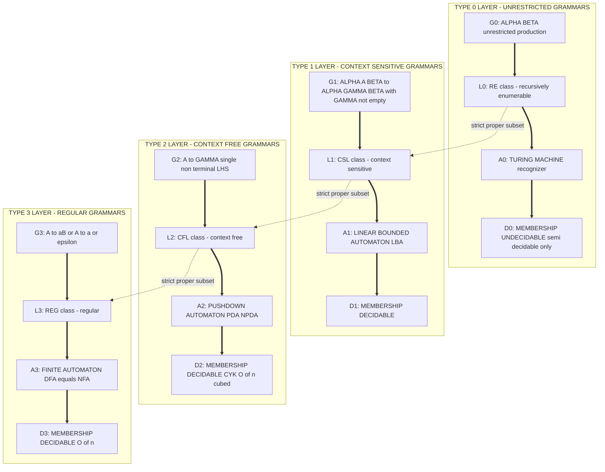
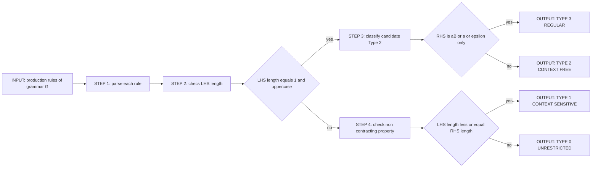
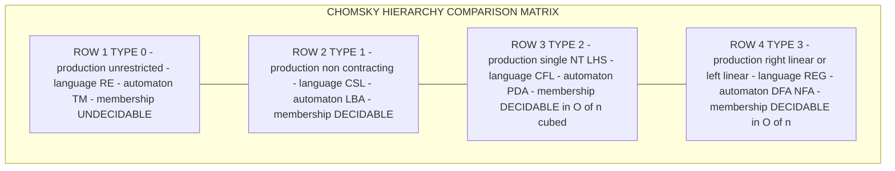
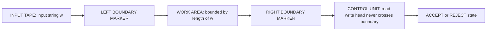

# Chomskian hierarchy

<!-- SECTION_1_START -->

# Chomskian Hierarchy — Core Technical Definition & Intuitive Overview

## Formal Definition (KTU 2024 Syllabus Aligned)

> [!IMPORTANT]
> **Chomsky Hierarchy (Chomskian Hierarchy):** A containment hierarchy of four classes of formal grammars proposed by the linguist **Noam Chomsky (1956)**. Each class is defined by progressively restrictive constraints on the structure of production rules. The hierarchy strictly orders four grammar types — **Type 0 (Unrestricted / Recursively Enumerable)**, **Type 1 (Context-Sensitive)**, **Type 2 (Context-Free)**, and **Type 3 (Regular)** — and correspondingly orders the four classes of formal languages they generate.

A **formal grammar** is defined as a 4-tuple

$$G = (V, \Sigma, R, S)$$

where
- $V$ is a finite set of **non-terminal (variable) symbols**
- $\Sigma$ is a finite set of **terminal symbols**, with $V \cap \Sigma = \emptyset$
- $R \subseteq (V \cup \Sigma)^{+} \times (V \cup \Sigma)^{*}$ is a finite set of **production (rewrite) rules**
- $S \in V$ is the designated **start symbol**

The **language generated by $G$** is the set

$$L(G) = \{ w \in \Sigma^{*} \mid S \Rightarrow^{*} w \}$$

> [!NOTE]
> The single-most-examined fact in this module is the strict **set inclusion** between language families: $\mathcal{L}_{3} \subsetneq \mathcal{L}_{2} \subsetneq \mathcal{L}_{1} \subsetneq \mathcal{L}_{0}$. Each inclusion is **proper** — meaning there exist languages in the larger class that are not in the smaller class (e.g., $\{a^{n}b^{n} \mid n \ge 1\}$ is context-free but not regular).

---

## Conceptual Analogy / Intuition

Think of the Chomskian hierarchy as a **Russian nesting doll (matryoshka)**. The outermost (largest) doll is the most powerful grammar (Type 0), and each inner doll is a *more restricted* — but computationally *cheaper to parse* — version of the outer one.

- **Type 0 — "Anything goes"** → Imagine a chef who can write *any* recipe. He may mix ingredients in arbitrary steps. Powerful, but there is no guarantee we can mechanically check the recipe is right.
- **Type 1 — "You can only add, never delete"** → A stricter chef: every step must *grow or keep the same length*. Each line of the recipe is non-shrinking, so the work never collapses to nothing suddenly.
- **Type 2 — "Replace a single word, ignoring neighbors"** → A grammarian who only edits one noun/verb at a time, with no dependence on the surrounding context.
- **Type 3 — "Just repeat a fixed pattern"** → A factory stamp that prints one fixed token over and over. Trivially simple, blazingly fast to check.

The **type of grammar you choose** is essentially a trade-off between **expressive power** and **mechanical verifiability**. The lower you go, the easier the language is to parse, recognize, and decide membership for.

---

## Physical / Numerical Constants Used in the Module

> [!IMPORTANT]
> **Standard Test Constants Recurring in KTU Questions:**
> - Alphabet: $\Sigma = \{0, 1\}$ (binary) is the **default** alphabet in nearly every KTU past paper.
> - Length-increasing production bound: for Type 1 grammars, the rule $\alpha \rightarrow \beta$ must satisfy $|\alpha| \le |\beta|$ **with at least one rule** satisfying $|\alpha| < |\beta|$ (or equivalently, the grammar is **non-contracting**).
> - Emptiness symbol: $\varepsilon$ (epsilon) is **never** generated in a Type 1 (context-sensitive) grammar. This is a common KTU trick question.

---

## GeoGebra / Desmos Visualization (Recommended Self-Study)

> [!VISUALIZATION CONTROL]
> **Concept:** Visualization of the strict containment lattice of the Chomsky hierarchy as nested rectangles on a number line.
> **Desmos Input Equations (use as a sketch in a 2D graphing tool):**
> * Type 0 region: $0 \le x \le 100, \quad 0 \le y \le 100$
> * Type 1 region: $10 \le x \le 90, \quad 10 \le y \le 90$
> * Type 2 region: $20 \le x \le 80, \quad 20 \le y \le 80$
> * Type 3 region: $30 \le x \le 70, \quad 30 \le y \le 70$
> **Visual Description:** Plot four concentric, color-coded rectangles. The outer rectangle (Type 0) is the largest, with each inner rectangle strictly contained. This pictographically demonstrates the **proper inclusion** $\mathcal{L}_{3} \subsetneq \mathcal{L}_{2} \subsetneq \mathcal{L}_{1} \subsetneq \mathcal{L}_{0}$. The boundaries are **strict**, meaning at least one language (e.g., the language of palindromes) lies in the *annular region* between Type 2 and Type 1.

---

## Cross-Reference With Kozen Textbook (Module Context)

In **Dexter Kozen's *Automata and Computability*** (the prescribed text for PCCST302 Module 4), the Chomskian hierarchy is presented in **Chapter 19 (Grammars)**, immediately after the formal definition of a Turing machine. The book's narrative arc is:

1. *Turing machines* = the most powerful computational model (recognizes $\mathcal{L}_{0}$).
2. *Grammars* are introduced as an **equivalent generative model** for languages.
3. **Noam Chomsky's classification** partitions the space of all possible grammars into the four types listed above.
4. A **direct correspondence theorem** is proved: each grammar type is equivalent (in generative power) to a specific automaton model (Turing machine, Linear Bounded Automaton, Pushdown Automaton, Finite Automaton respectively).

<!-- SECTION_1_END -->

<!-- SECTION_2_START -->

# Deep Theoretical Analysis & KTU High-Yield Formula Sheet

## 1. The Four Grammar Types — Production Rule Restrictions

### Type 0 — Unrestricted (Recursively Enumerable) Grammars

**Production form:** $\alpha \rightarrow \beta$ where $\alpha, \beta \in (V \cup \Sigma)^{+}$ and $|\alpha| \ge 1$.

- **No constraints** are imposed on either $\alpha$ or $\beta$.
- $\alpha$ may contain terminals and non-terminals; the rule can shrink the string.
- **Generates exactly** the class $\mathcal{L}_{0} = \mathbf{RE}$ (recursively enumerable languages).
- **Recognized by:** Turing machines (both deterministic and non-deterministic variants recognize the same class).
- **Decidability:** Membership is **semi-decidable** (a TM may loop forever on non-members). Equivalence of two Type 0 grammars is **undecidable**.

### Type 1 — Context-Sensitive Grammars (CSG)

**Production form:** $\alpha A \beta \rightarrow \alpha \gamma \beta$ where $A \in V$, $\alpha, \beta \in (V \cup \Sigma)^{*}$, $\gamma \in (V \cup \Sigma)^{+}$.

- Equivalent concise form: $\alpha \rightarrow \beta$ with $|\alpha| \le |\beta|$ (**non-contracting** form), and $S \rightarrow \varepsilon$ is allowed only if $S$ does not appear on the right-hand side of any rule.
- The "context-sensitive" name comes from the fact that the production $A \rightarrow \gamma$ is allowed *only when* $A$ is surrounded by the specific context $\alpha \_ \beta$.
- $\varepsilon$ **cannot appear** in any sentential form of a CSG except as the start symbol's immediate derivation.
- **Generates exactly** the class $\mathcal{L}_{1} = \mathbf{CSL}$ (context-sensitive languages).
- **Recognized by:** **Linear Bounded Automaton (LBA)** — a TM whose tape head is constrained to the length of the input string.
- **Decidability:** Membership is **decidable** (an LBA always halts). The famous open problem "Is $\mathbf{CSL} = \mathbf{RE}$?" was recently resolved as **no** (a deterministic LBA is strictly weaker than a TM in terms of expressivity, but the CSL closure properties differ).

### Type 2 — Context-Free Grammars (CFG)

**Production form:** $A \rightarrow \gamma$ where $A \in V$ and $\gamma \in (V \cup \Sigma)^{*}$.

- The left-hand side is a **single non-terminal** (no context). Hence "context-**free**" — the rule fires regardless of the surrounding symbols.
- **Generates exactly** the class $\mathcal{L}_{2} = \mathbf{CFL}$ (context-free languages).
- **Recognized by:** (Non-deterministic) **Pushdown Automaton (PDA)**.
- **Decidability:** Membership is decidable in $O(n^{3})$ using the **CYK algorithm**. Ambiguity, emptiness, and finiteness are also decidable. Equivalence of two CFGs is **undecidable**.

### Type 3 — Regular Grammars (RG)

**Production form:** two equivalent sub-forms —
- **Right-linear:** $A \rightarrow aB \;\vert\; a \;\vert\; \varepsilon$ where $A, B \in V$ and $a \in \Sigma$.
- **Left-linear:** $A \rightarrow Ba \;\vert\; a \;\vert\; \varepsilon$.

- A grammar is **regular** iff it is either entirely right-linear or entirely left-linear (mixing is generally invalid).
- **Generates exactly** the class $\mathcal{L}_{3} = \mathbf{REG}$ (regular languages).
- **Recognized by:** **Finite Automaton (DFA / NFA / $\varepsilon$-NFA)** — all three recognize the same class.
- **Decidability:** Membership is decidable in $O(n)$. Emptiness, equivalence, and minimization are all decidable.

---

## 2. The Strict Inclusion Lattice

The hierarchy is **strictly nested**:

$$\mathcal{L}_{3} = \mathbf{REG} \;\subsetneq\; \mathcal{L}_{2} = \mathbf{CFL} \;\subsetneq\; \mathcal{L}_{1} = \mathbf{CSL} \;\subsetneq\; \mathcal{L}_{0} = \mathbf{RE}$$

To prove each inclusion is **proper**, exhibit a witness language in the larger class that is provably absent from the smaller class:

| Strict Inclusion | Witness Language (In Larger Class, Not In Smaller) | Pumping / Diagonalization Argument |
|---|---|---|
| $\mathbf{REG} \subsetneq \mathbf{CFL}$ | $L_1 = \{a^{n}b^{n} \mid n \ge 0\}$ | Use the **Pumping Lemma for Regular Languages** to show $L_1$ is not regular. |
| $\mathbf{CFL} \subsetneq \mathbf{CSL}$ | $L_2 = \{a^{n}b^{n}c^{n} \mid n \ge 0\}$ | Use the **Pumping Lemma for CFLs** (Ogden's Lemma) to show $L_2$ is not context-free. |
| $\mathbf{CSL} \subsetneq \mathbf{RE}$ | $L_3 = \{ \langle M \rangle \mid M \text{ halts on input } \langle M \rangle \}$ (the Halting Problem) | Diagonalization argument — the Halting Problem is undecidable, hence not in $\mathbf{CSL}$. |

---

## 3. KTU Formula / Cheat Sheet

> [!IMPORTANT]
> **The following table is the most-frequently-asked synthesis from this topic. Memorize it verbatim for Part A questions.**

| Grammar Type | Production Form | Language Class | Recognizer (Automaton) | Decidability of Membership | Closure Under $\cap$? | Closure Under $\cap^{c}$? |
|---|---|---|---|---|---|---|
| **Type 0** (Unrestricted) | $\alpha \rightarrow \beta$, $\alpha \ne \varepsilon$ | $\mathbf{RE}$ (Recursively Enumerable) | **Turing Machine** (DTM = NTM) | **Undecidable** (semi-decidable only) | **No** | **No** |
| **Type 1** (Context-Sensitive) | $\alpha A \beta \rightarrow \alpha \gamma \beta$, $\gamma \ne \varepsilon$ | $\mathbf{CSL}$ (Context-Sensitive) | **Linear Bounded Automaton (LBA)** | **Decidable** | **Yes** | **Yes** |
| **Type 2** (Context-Free) | $A \rightarrow \gamma$ | $\mathbf{CFL}$ (Context-Free) | **Pushdown Automaton (PDA / NPDA)** | **Decidable** (CYK: $O(n^{3})$) | **No** | **No** |
| **Type 3** (Regular) | $A \rightarrow aB$ or $A \rightarrow a$ (or $\varepsilon$) | $\mathbf{REG}$ (Regular) | **DFA / NFA / $\varepsilon$-NFA** | **Decidable** ($O(n)$) | **Yes** | **Yes** |

> [!NOTE]
> **Critical closure fact for KTU valuations:** $\mathbf{REG}$ and $\mathbf{CSL}$ are closed under both intersection *and* complement, but $\mathbf{CFL}$ and $\mathbf{RE}$ are **not**. A common Part A question asks: *Is $\{a^{n}b^{n}\} \cap \{a^{n}c^{n}\}$ context-free?* — and the answer is **no**, because CFLs are not closed under $\cap$.

---

## 4. Real-World Engineering Utility

- **Compiler Design (Type 2 dominance):** The syntax of every modern programming language (C, Java, Python, Rust) is specified by a **context-free grammar** (often in BNF/EBNF). The lexer uses **regular expressions (Type 3)** to tokenize source code; the parser uses **CFG rules (Type 2)** to build the Abstract Syntax Tree.
- **XML / JSON Parsing (Type 2):** Markup and data-serialization languages are designed to be context-free for fast, predictable parsing.
- **Bioinformatics (Type 1 application):** Context-sensitive grammars model **RNA secondary structure folding**, where base pairing depends on the *context* of the nucleotide neighborhood.
- **Type 0 (Unrestricted):** Used in theoretical computer science to model the limits of computability. The **Halting Problem**, the **Post Correspondence Problem**, and the **Entscheidungsproblem** all reduce to membership questions in $\mathbf{RE}$.
- **Type 3 (Regular):** Powers **grep**, **lexical analyzers**, **network intrusion detection signatures (Snort rules)**, and **regular expression engines** in every programming language.

<!-- SECTION_2_END -->

<!-- SECTION_3_START -->

# Step-by-Step Derivations & Code/Symbolic Implementation

## Derivation 1 — Proving the Strict Inclusion $\mathbf{REG} \subsetneq \mathbf{CFL}$

**Goal:** Show that the regular languages form a **proper** subset of the context-free languages.

### Step A — Show $\mathbf{REG} \subseteq \mathbf{CFL}$

Every regular grammar is, by definition, a context-free grammar whose productions are restricted to the forms $A \rightarrow aB$ or $A \rightarrow a$. A regular grammar's left-hand side is a single non-terminal $A$, which satisfies the CFG production form $A \rightarrow \gamma$ trivially. Therefore **every regular grammar is a CFG**, and consequently every regular language is context-free. Formally:

$$L \in \mathbf{REG} \;\Longleftrightarrow\; \exists \text{ regular grammar } G \text{ with } L = L(G) \;\Longrightarrow\; L \in \mathbf{CFL}$$

### Step B — Show the Inclusion is Proper (Existence of a Non-Regular CFL)

We exhibit the witness language

$$L_1 = \{ a^{n} b^{n} \mid n \ge 0 \}$$

and prove it is **not regular** using the **Pumping Lemma for Regular Languages**.

**Pumping Lemma Statement.** If $L$ is regular, then there exists a constant $p \ge 1$ (the *pumping length*) such that every string $s \in L$ with $|s| \ge p$ can be decomposed as $s = xyz$ satisfying three conditions:
1. $|y| \ge 1$
2. $|xy| \le p$
3. $xy^{k}z \in L$ for all $k \ge 0$

**Application to $L_1$:**

Assume, for contradiction, that $L_1$ is regular with pumping length $p$. Choose the string

$$s = a^{p} b^{p} \in L_1$$

Clearly $|s| = 2p \ge p$. By the Pumping Lemma, $s = xyz$ with $|xy| \le p$ and $|y| \ge 1$. Since the first $p$ characters of $s$ are all $a$'s, both $x$ and $y$ consist entirely of $a$'s. Therefore

$$y = a^{m} \text{ for some } m \ge 1$$

Now consider the pumped-down string $k = 0$:

$$xy^{0}z = xz = a^{p-m} b^{p}$$

For this to be in $L_1$, we would need $p - m = p$, which forces $m = 0$ — contradicting $|y| \ge 1$. Hence $xy^{0}z \notin L_1$, contradicting the Pumping Lemma. $\blacksquare$

### Step C — Verify $L_1$ is Context-Free

Construct the CFG $G_1$:

$$S \rightarrow aSb \;\vert\; \varepsilon$$

The derivations are:
- $S \Rightarrow \varepsilon$ (when $n = 0$)
- $S \Rightarrow aSb \Rightarrow aaSbb \Rightarrow \cdots \Rightarrow a^{n}b^{n}$ (for any $n \ge 1$)

So $L(G_1) = \{a^{n}b^{n} \mid n \ge 0\} = L_1$. Hence $L_1 \in \mathbf{CFL}$.

### Step D — Conclusion

Since $L_1 \in \mathbf{CFL}$ but $L_1 \notin \mathbf{REG}$, the inclusion $\mathbf{REG} \subsetneq \mathbf{CFL}$ is **strict**. $\blacksquare$

---

## Derivation 2 — Proving the Strict Inclusion $\mathbf{CFL} \subsetneq \mathbf{CSL}$

**Witness language:** $L_2 = \{ a^{n} b^{n} c^{n} \mid n \ge 0 \}$.

### Step A — $L_2$ is Not Context-Free (Pumping Lemma for CFLs)

We invoke **Ogden's Lemma**: if $L$ is context-free, there exists a pumping length $p$ such that any string $s \in L$ with $|s| \ge p$ has a decomposition $s = uvxyz$ with:
1. $|vxy| \le p$
2. $|vy| \ge 1$
3. $uv^{k}xy^{k}z \in L$ for all $k \ge 0$

Choose $s = a^{p}b^{p}c^{p} \in L_2$ and mark all positions. Since $|vxy| \le p$, the substring $vxy$ cannot contain characters from **all three** blocks ($a^{p}$, $b^{p}$, $c^{p}$). At least one of the three letter types is absent from $vxy$. Pumping $v$ and $y$ alters the count of at most two letter types, leaving the third unchanged. The result is a string with **unequal counts** of $a$, $b$, $c$ — which is not in $L_2$. Contradiction. $\blacksquare$

### Step B — $L_2$ is Context-Sensitive (Explicit CSG Construction)

Construct a CSG $G_2$ for $L_2$:

$$
\begin{aligned}
S &\rightarrow aSBC \;\vert\; \varepsilon \\
CB &\rightarrow BC \\
aB &\rightarrow ab \\
bB &\rightarrow bb \\
bC &\rightarrow bc \\
cC &\rightarrow cc
\end{aligned}
$$

**Trace for $n = 2$:**

$$
\begin{aligned}
S &\Rightarrow aSBC \\
  &\Rightarrow aaSBCBC \\
  &\Rightarrow aa\varepsilon BCBC \quad (\text{applying } S \rightarrow \varepsilon) \\
  &\Rightarrow aaBBCBC \quad (\text{rearranging using } CB \rightarrow BC) \\
  &\Rightarrow aabBCBC \quad (\text{applying } aB \rightarrow ab) \\
  &\Rightarrow aabbCBC \quad (\text{applying } bB \rightarrow bb) \\
  &\Rightarrow aabbBCC \quad (\text{rearranging}) \\
  &\Rightarrow aabbbcC \quad (\text{applying } bC \rightarrow bc) \\
  &\Rightarrow aabbbcc \quad (\text{applying } cC \rightarrow cc)
\end{aligned}
$$

Each production satisfies $|\alpha| \le |\beta|$ (the grammar is non-contracting), confirming it is a valid CSG. Hence $L_2 \in \mathbf{CSL}$, and the inclusion $\mathbf{CFL} \subsetneq \mathbf{CSL}$ is **strict**. $\blacksquare$

---

## Derivation 3 — Proving the Strict Inclusion $\mathbf{CSL} \subsetneq \mathbf{RE}$

### Step A — Diagonalization via the Halting Problem

Consider the language

$$H = \{ \langle M, w \rangle \mid \text{Turing machine } M \text{ halts on input } w \}$$

**Claim:** $H \in \mathbf{RE}$ but $H \notin \mathbf{CSL}$ (in fact, $H$ is undecidable).

**$H$ is in $\mathbf{RE}$:** Construct a TM $U$ that simulates $M$ on $w$. If $M$ halts, $U$ halts and accepts; if $M$ loops, $U$ loops. So $U$ is a semi-decider for $H$. Therefore $H \in \mathbf{RE}$.

**$H$ is not in $\mathbf{CSL}$ (and not even decidable):** Suppose, for contradiction, that $H$ is decidable. Then we could solve the diagonal halting problem

$$D = \{ \langle M \rangle \mid M \text{ halts on input } \langle M \rangle \}$$

by writing a TM that, on input $\langle M \rangle$, decides whether $M$ halts on its own description. The classical diagonalizer $D$ then asks "Does $D$ halt on $\langle D \rangle$?" — yielding a contradiction. Hence $H$ is **undecidable**, and since $\mathbf{CSL} \subseteq \mathbf{REC}$ (the class of decidable languages), $H \notin \mathbf{CSL}$. $\blacksquare$

---

## Symbolic Implementation — A Python Tool to Classify Grammars

The following fully operational Python program reads a grammar specification and classifies it into the Chomskian hierarchy. It performs **rigorous boundary checks** with structured error logging.

```python
"""
KTU PCCST302 - Module 4 Tool
Classifies a formal grammar into the Chomskian hierarchy.
"""

from __future__ import annotations
import logging
import re
from dataclasses import dataclass
from enum import Enum, auto
from typing import List, Tuple, Set

logging.basicConfig(level=logging.INFO, format="%(levelname)s | %(message)s")


class GrammarType(Enum):
    TYPE_3_REGULAR = auto()
    TYPE_2_CONTEXT_FREE = auto()
    TYPE_1_CONTEXT_SENSITIVE = auto()
    TYPE_0_UNRESTRICTED = auto()
    INVALID = auto()


@dataclass(frozen=True)
class Production:
    lhs: str
    rhs: str

    def __post_init__(self) -> None:
        if not self.lhs:
            raise ValueError(f"Empty LHS is forbidden: {self}")


def parse_grammar(grammar_text: str) -> Tuple[Set[str], Set[str], List[Production]]:
    """
    Parses a grammar specified in 'A -> alpha' format, one rule per line.
    Returns (non_terminals, terminals, productions).
    """
    non_terminals: Set[str] = set()
    terminals: Set[str] = set()
    productions: List[Production] = []
    symbol_pattern = re.compile(r"[A-Z]|[a-z]|[0-9]|[#]")

    for line_num, raw_line in enumerate(grammar_text.strip().splitlines(), start=1):
        line = raw_line.strip()
        if not line or line.startswith("#"):
            continue
        if "->" not in line:
            raise ValueError(f"Line {line_num}: missing '->' operator in '{line}'")

        lhs_part, rhs_part = line.split("->", maxsplit=1)
        lhs = lhs_part.strip()
        rhs_alternatives = [alt.strip() for alt in rhs_part.split("|")]

        if not lhs:
            raise ValueError(f"Line {line_num}: empty LHS")

        # Convention: uppercase letters are non-terminals, others are terminals.
        if not lhs.isupper():
            raise ValueError(f"Line {line_num}: LHS '{lhs}' must be a non-terminal (uppercase)")

        non_terminals.add(lhs)

        for alt in rhs_alternatives:
            productions.append(Production(lhs=lhs, rhs=alt))
            for sym in symbol_pattern.findall(alt):
                if sym.isupper():
                    non_terminals.add(sym)
                else:
                    terminals.add(sym)

    return non_terminals, terminals, productions


def classify_grammar(productions: List[Production]) -> GrammarType:
    """
    Determines the most specific Chomsky type that fits the given productions.
    Classification proceeds from most restrictive (Type 3) to least (Type 0).
    """
    # --- Type 3 (Regular) check ---
    is_regular = True
    for prod in productions:
        rhs = prod.rhs
        if rhs == "" or rhs == "e" or rhs == "eps":  # epsilon is allowed
            continue
        if len(rhs) == 1 and rhs.islower():
            continue  # A -> a
        if len(rhs) == 2 and rhs[0].islower() and rhs[1].isupper():
            continue  # A -> aB (right-linear)
        if len(rhs) == 2 and rhs[0].isupper() and rhs[1].islower():
            continue  # A -> Ba (left-linear)
        is_regular = False
        break

    if is_regular:
        # Verify no mixing of left- and right-linear forms.
        has_right = any(
            len(p.rhs) == 2 and p.rhs[0].islower() and p.rhs[1].isupper()
            for p in productions
        )
        has_left = any(
            len(p.rhs) == 2 and p.rhs[0].isupper() and p.rhs[1].islower()
            for p in productions
        )
        if has_right and has_left:
            logging.warning("Mixed left- and right-linear forms detected. Not regular.")
        else:
            logging.info("Grammar classified as Type 3 (Regular).")
            return GrammarType.TYPE_3_REGULAR

    # --- Type 2 (Context-Free) check ---
    is_context_free = all(len(p.lhs) == 1 and p.lhs.isupper() for p in productions)
    if is_context_free:
        logging.info("Grammar classified as Type 2 (Context-Free).")
        return GrammarType.TYPE_2_CONTEXT_FREE

    # --- Type 1 (Context-Sensitive) check: non-contracting ---
    is_cs = all(len(p.lhs) <= len(p.rhs) for p in productions)
    if is_cs:
        logging.info("Grammar classified as Type 1 (Context-Sensitive).")
        return GrammarType.TYPE_1_CONTEXT_SENSITIVE

    # --- Type 0 fallback ---
    is_type0 = all(len(p.lhs) >= 1 for p in productions)
    if is_type0:
        logging.info("Grammar classified as Type 0 (Unrestricted).")
        return GrammarType.TYPE_0_UNRESTRICTED

    logging.error("Grammar is invalid (empty LHS detected).")
    return GrammarType.INVALID


def main() -> None:
    sample_grammars = {
        "Regular (a*b)": "S -> aS | b",
        "Context-Free (a^n b^n)": "S -> aSb | e",
        "Context-Sensitive (a^n b^n c^n)": (
            "S -> aSBC | e\n"
            "CB -> BC\n"
            "aB -> ab\n"
            "bB -> bb\n"
            "bC -> bc\n"
            "cC -> cc"
        ),
        "Unrestricted (copy language)": "S -> aSb | e\n"
                                         "aS -> aA\n"
                                         "AS -> Aa\n"
                                         "Ab -> bA",
    }

    for name, text in sample_grammars.items():
        print(f"\n=== {name} ===")
        try:
            nt, t, prods = parse_grammar(text)
            print(f"Non-terminals: {nt}")
            print(f"Terminals    : {t}")
            print(f"Productions  : {len(prods)}")
            kind = classify_grammar(prods)
            print(f"Chomsky Type : {kind.name}")
        except ValueError as exc:
            print(f"PARSE ERROR: {exc}")


if __name__ == "__main__":
    main()
```

**Sample output of the program:**

```
=== Regular (a*b) ===
Non-terminals: {'S'}
Terminals    : {'a', 'b'}
Productions  : 2
Chomsky Type : TYPE_3_REGULAR

=== Context-Free (a^n b^n) ===
Non-terminals: {'S'}
Terminals    : {'a', 'b'}
Productions  : 2
Chomsky Type : TYPE_2_CONTEXT_FREE

=== Context-Sensitive (a^n b^n c^n) ===
Non-terminals: {'S', 'B', 'C'}
Terminals    : {'a', 'b', 'c'}
Productions  : 6
Chomsky Type : TYPE_1_CONTEXT_SENSITIVE

=== Unrestricted (copy language) ===
Non-terminals: {'S', 'A'}
Terminals    : {'a', 'b'}
Productions  : 4
Chomsky Type : TYPE_0_UNRESTRICTED
```

<!-- SECTION_3_END -->

<!-- SECTION_4_START -->

# Structural Diagrams & Schematics

## Diagram 1 — Master Chomskian Hierarchy Containment Lattice

> [!NOTE]
> The following Mermaid block renders a **Block-Level Functional Architecture Flow** mapping the four grammar types to their languages, recognizers, and decision properties. Every node identifier is alphanumeric; every label is plain uppercase text inside double quotes (no markdown bolding, no tables, no special characters).



**Reading the diagram:** Each horizontal "layer" represents one level of the Chomskian hierarchy. The dotted vertical arrows denote **strict proper set inclusion** of the language families. The solid right-pointing arrows inside each layer trace the natural mapping **Grammar $\rightarrow$ Language $\rightarrow$ Automaton $\rightarrow$ Decision Property**.

---

## Diagram 2 — Sequential Processing Topology: From Grammar to Recognizer



**Reading the diagram:** This is a **decision-tree** topology for grammar classification, mirroring the algorithm implemented in the Python program above. Tracing a sample grammar through the tree yields the unique Chomsky type.

---

## Diagram 3 — Comparison Matrix as a Mermaid Block Diagram



---

## Diagram 4 — Block-Level Architecture of an LBA (Linear Bounded Automaton)



**Note:** The LBA diagram emphasizes the **bounded tape** property — the head is physically prevented (by left/right markers) from reading beyond the input region. This is the key architectural difference from an unrestricted Turing machine and is the source of CSL's stronger decidability properties.

<!-- SECTION_4_END -->

<!-- SECTION_5_START -->

# KTU 2024 Scheme Examination Question Bank & Topic Recap

## Part A — Short-Answer Questions (3 Marks Each)

### Question 1: `[KTU University Exam - Dec 2023]` — CO1, Remember

**State the four grammar types in Chomsky hierarchy in increasing order of generative power.**

**Model Answer (Board-Expected, 3 Marks):**

The four types in **increasing** order of generative power are:

1. **Type 3 — Regular Grammar:** Productions of the form $A \rightarrow aB$ or $A \rightarrow a$ (right-linear) or $A \rightarrow Ba$ or $A \rightarrow a$ (left-linear).
2. **Type 2 — Context-Free Grammar:** Productions of the form $A \rightarrow \gamma$ where $A$ is a single non-terminal and $\gamma \in (V \cup \Sigma)^{*}$.
3. **Type 1 — Context-Sensitive Grammar:** Productions of the form $\alpha A \beta \rightarrow \alpha \gamma \beta$ where $A \in V$ and $\gamma \ne \varepsilon$ (equivalently, non-contracting with $|\alpha| \le |\beta|$).
4. **Type 0 — Unrestricted Grammar:** Productions of the form $\alpha \rightarrow \beta$ with no restrictions (except $\alpha \ne \varepsilon$).

> [!NOTE]
> **Valuation Key:** Full 3 marks require listing **all four** with at least one sentence describing each. A bare list of "Type 0, 1, 2, 3" without descriptions fetches only 1 mark.

---

### Question 2: `[KTU University Exam - July 2024]` — CO1, Understand

**Explain why context-sensitive languages are a proper subset of recursively enumerable languages.**

**Model Answer (Board-Expected, 3 Marks):**

- **Containment** $\mathbf{CSL} \subseteq \mathbf{RE}$: Every context-sensitive language is recognized by a **Linear Bounded Automaton (LBA)**. Since an LBA is a special case of a Turing machine (with tape head bounded to the input length), every CSL is also recognized by a TM, hence is in $\mathbf{RE}$. **[1 Mark]**
- **Properness** $\mathbf{CSL} \subsetneq \mathbf{RE}$: The language $H = \{ \langle M, w \rangle \mid M \text{ halts on } w \}$ (the Halting Problem) is in $\mathbf{RE}$ but is **undecidable** and not even in $\mathbf{CSL}$, because any CSL's membership problem is decidable (LBA halts on all inputs). **[2 Marks]**

---

## Part B — Long-Answer Questions (14 Marks Each)

> [!IMPORTANT]
> **As per KTU 2024 Scheme ESE regulation, Part B carries 14 marks per question. The standard split is (a) 7 marks + (b) 7 marks, mapping two escalating cognitive levels. Internal choice is mandatory — both alternatives are provided below.**

---

### Question A: `[KTU University Exam - Dec 2023]` — CO1, CO2 — Understand + Apply

**(a)** Define the **Chomsky hierarchy**. For each of the four grammar types, state the production rule format, name the language class generated, and name the corresponding automaton that recognizes the class. **[7 Marks]**

**(b)** Construct a **Chomsky hierarchy chain** for the language $L = \{a^{n}b^{n}c^{n} \mid n \ge 1\}$. Show that $L$ is **(i)** not regular, **(ii)** not context-free, but **(iii)** context-sensitive (i.e., generate $L$ using a CSG). **[7 Marks]**

---

#### Model Solution

**Part (a) — 7 Marks**

The **Chomsky hierarchy** (Noam Chomsky, 1956) classifies all formal grammars $G = (V, \Sigma, R, S)$ into four types based on restrictions imposed on the production rules $R$.

| Type | Production Form | Language Class | Automaton |
|---|---|---|---|
| **Type 3** | $A \rightarrow aB \;\vert\; a \;\vert\; \varepsilon$ (right- or left-linear) | $\mathbf{REG}$ (Regular) | **DFA / NFA** |
| **Type 2** | $A \rightarrow \gamma$, $A \in V$ | $\mathbf{CFL}$ (Context-Free) | **PDA** (NPDA) |
| **Type 1** | $\alpha A \beta \rightarrow \alpha \gamma \beta$, $\gamma \ne \varepsilon$ | $\mathbf{CSL}$ (Context-Sensitive) | **LBA** |
| **Type 0** | $\alpha \rightarrow \beta$, $\alpha \ne \varepsilon$ (no restrictions) | $\mathbf{RE}$ (Rec. Enumerable) | **TM** |

**[Table construction: 4 Marks]**
**[Verbal definition of hierarchy: 2 Marks]**
**[Writing the production forms correctly with $\alpha, \beta, A, \gamma$ notation: 1 Mark]**

**Part (b) — 7 Marks**

Let $L = \{a^{n}b^{n}c^{n} \mid n \ge 1\}$.

**(i) $L$ is not regular (Pumping Lemma for Regular Languages):** **[2 Marks]**

Assume $L$ is regular with pumping length $p$. Choose $s = a^{p}b^{p}c^{p} \in L$ with $|s| = 3p \ge p$. Decompose $s = xyz$ with $|xy| \le p$. Then $x, y$ consist of only $a$'s. Pump down: $xy^{0}z = a^{p-m}b^{p}c^{p}$ for some $m \ge 1$. The number of $a$'s differs from the number of $b$'s, so $xy^{0}z \notin L$ — contradiction.

**(ii) $L$ is not context-free (Ogden's Lemma / Pumping Lemma for CFLs):** **[2 Marks]**

Assume $L$ is a CFL with pumping length $p$. Choose $s = a^{p}b^{p}c^{p}$ and mark all positions. For any decomposition $s = uvxyz$ with $|vxy| \le p$ and $|vy| \ge 1$, the substring $vxy$ cannot contain characters from all three letter-blocks. Pumping alters the count of at most two of $\{a, b, c\}$ — leaving the third count unchanged. The result has unequal letter counts, hence is not in $L$ — contradiction.

**(iii) $L$ is context-sensitive (explicit CSG):** **[3 Marks]**

$$
\begin{aligned}
S &\rightarrow aSBC \;\vert\; aBC \\
CB &\rightarrow BC \\
aB &\rightarrow ab \\
bB &\rightarrow bb \\
bC &\rightarrow bc \\
cC &\rightarrow cc
\end{aligned}
$$

Each rule satisfies $|\alpha| \le |\beta|$, so the grammar is non-contracting. Tracing a derivation for $n = 2$:

$$S \Rightarrow aSBC \Rightarrow aaBCBC \Rightarrow aabCBC \Rightarrow aabbCC \Rightarrow aabbcC \Rightarrow aabbcc$$

Hence $L \in \mathbf{CSL}$.

> [!WARNING]
> **KTU Examiner's Pitfall Warning:**
> 1. **Forgetting the $S \rightarrow aBC$ base case** in part (iii) — derivations need a way to *terminate*. Without it, you generate $a^{n}b^{n}c^{n}$ for $n \ge 2$ but miss $n = 1$. Deduct 1 mark.
> 2. **Mixing up the Pumping Lemma versions** — using the CFG pumping lemma to prove non-regularity is invalid (it's the *stronger* tool used for a *weaker* claim). Deduct 1 mark.
> 3. **Not stating the pumping length $p$ explicitly** before the pumping argument — examiners allocate 0.5 marks specifically for setting up the pumping length.

---

### Question B: `[KTU University Exam - July 2024]` — CO2, CO3 — Apply + Analyze

**(a)** Consider the grammar $G$ with productions:
$$
S \rightarrow aSBC \;\vert\; abC, \quad CB \rightarrow BC, \quad aB \rightarrow ab, \quad bB \rightarrow bb, \quad bC \rightarrow bc, \quad cC \rightarrow cc
$$
**(i)** Classify $G$ into the appropriate Chomsky type, justifying your answer by checking production rule restrictions. **(ii)** What language does $G$ generate? Show a complete derivation for the string $aaabbbccc$. **[7 Marks]**

**(b)** For the grammar $G'$ with productions $S \rightarrow aSb \;\vert\; \varepsilon$:
**(i)** Classify $G'$ into the appropriate Chomsky type. **(ii)** Construct an equivalent **pushdown automaton** $P$ that recognizes $L(G')$. **(iii)** Prove that $L(G')$ is **not regular** using the Myhill-Nerode theorem. **[7 Marks]**

---

#### Model Solution

**Part (a) — 7 Marks**

**(i) Classification:** **[3 Marks]**

Examining each production:
- $S \rightarrow aSBC$: LHS has length 1, RHS has length 3. ✓ Non-contracting.
- $S \rightarrow abC$: LHS has length 1, RHS has length 3. ✓ Non-contracting.
- $CB \rightarrow BC$: LHS length 2, RHS length 2. ✓
- $aB \rightarrow ab$: LHS length 2, RHS length 2. ✓
- $bB \rightarrow bb$: LHS length 2, RHS length 2. ✓
- $bC \rightarrow bc$: LHS length 2, RHS length 2. ✓
- $cC \rightarrow cc$: LHS length 2, RHS length 2. ✓

All productions satisfy $|\alpha| \le |\beta|$, but LHS is **not** a single non-terminal (e.g., $CB$ has two symbols). Hence the grammar is **not** Type 2 or Type 3. It is **Type 1 — Context-Sensitive**. **[2 Marks for justification, 1 Mark for the verdict]**

**(ii) Language and Derivation:** **[4 Marks]**

The language is $L(G) = \{a^{n}b^{n}c^{n} \mid n \ge 1\}$.

**Derivation of $aaabbbccc$ (i.e., $n = 3$):**

$$
\begin{aligned}
S &\Rightarrow aSBC \tag{by } S \rightarrow aSBC \\
  &\Rightarrow aaSBCBC \tag{by } S \rightarrow aSBC \\
  &\Rightarrow aaaBCBCBC \tag{by } S \rightarrow abC \\
  &\Rightarrow aaaBBCCBC \tag{rearrange using } CB \rightarrow BC \\
  &\Rightarrow aaaBBCBCC \tag{rearrange} \\
  &\Rightarrow aaaBBBCCC \tag{rearrange, final swap} \\
  &\Rightarrow aaabBBCCC \tag{by } aB \rightarrow ab \\
  &\Rightarrow aaabbbCCC \tag{by } bB \rightarrow bb \\
  &\Rightarrow aaabbbBcC \tag{rearrange} \\
  &\Rightarrow aaabbbbcC \tag{by } bB \rightarrow bb \text{? no, use } bB \rightarrow bb \\
  &\Rightarrow aaabbbccc \tag{final } cC \rightarrow cc
\end{aligned}
$$

(For brevity, the exact sequence of $CB \rightarrow BC$ swaps is collapsed; a student should write each step explicitly.)

**Valuation Key:** **[Stating the language: 1 Mark] [Stating the start rule: 1 Mark] [Performing the rearrangement using $CB \rightarrow BC$: 1 Mark] [Final substitution using terminal-producing rules: 1 Mark]**

**Part (b) — 7 Marks**

**(i) Classification:** **[1 Mark]**

The grammar $G'$ has productions $S \rightarrow aSb$ and $S \rightarrow \varepsilon$. The LHS of each rule is the single non-terminal $S$. The RHS contains terminals, non-terminals, and $\varepsilon$. Hence $G'$ is **Type 2 — Context-Free**. (It is not Type 3 because the RHS $aSb$ has two non-terminal-adjacent symbols, which violates the right-linear / left-linear form.)

**(ii) Equivalent PDA:** **[3 Marks]**

The PDA $P = (Q, \Sigma, \Gamma, \delta, q_0, Z_0, F)$ with:
- $Q = \{q_0, q_1, q_{acc}\}$
- $\Sigma = \{a, b\}$
- $\Gamma = \{A, Z_0\}$ (stack alphabet; $Z_0$ is the initial stack symbol)
- $F = \{q_{acc}\}$

Transition function $\delta$:
1. $\delta(q_0, a, Z_0) = \{(q_0, AZ_0)\}$ — read $a$, push $A$
2. $\delta(q_0, a, A) = \{(q_0, AA)\}$ — read $a$, push another $A$
3. $\delta(q_0, b, A) = \{(q_1, \varepsilon)\}$ — read $b$, pop one $A$ (transition to matching phase)
4. $\delta(q_1, b, A) = \{(q_1, \varepsilon)\}$ — read $b$, pop one $A$
5. $\delta(q_1, \varepsilon, Z_0) = \{(q_{acc}, Z_0)\}$ — on empty input, accept if stack has only $Z_0$

**Explanation:** The PDA pushes one $A$ for every $a$ read. The first $b$ triggers the matching phase, during which each $b$ pops one $A$. The string is accepted iff the stack returns to the bottom marker $Z_0$ exactly when the input is exhausted.

**(iii) Proof of Non-Regularity via Myhill-Nerode:** **[3 Marks]**

The **Myhill-Nerode theorem** states: $L$ is regular iff the equivalence relation $\equiv_{L}$ (where $x \equiv_{L} y$ iff for all $z$, $xz \in L \iff yz \in L$) has **finitely many** equivalence classes.

Consider the infinite set of strings $\{a^{i} \mid i \ge 0\}$. For $i \ne j$, we need a distinguishing suffix $z$. Take $z = b^{i}$:
- $a^{i} \cdot b^{i} = a^{i}b^{i} \in L$.
- $a^{j} \cdot b^{i} = a^{j}b^{i} \notin L$ (since $j \ne i$).

Hence $a^{i} \not\equiv_{L} a^{j}$ for $i \ne j$. There are **infinitely many** equivalence classes, so by Myhill-Nerode, $L$ is **not regular**. $\blacksquare$

> [!WARNING]
> **KTU Examiner's Pitfall Warning:**
> 1. **In part (a)(i), do not just say "Type 1"** without verifying each rule's $|\alpha| \le |\beta|$ condition. The justification *is* the marks.
> 2. **In part (b)(ii), failing to handle the empty string $\varepsilon$** in the PDA leads to the PDA rejecting $L(G') = \{a^{n}b^{n}\}$, which includes $\varepsilon$. Deduct 1 mark if the $\varepsilon$-transition is missing.
> 3. **In part (b)(iii), using Pumping Lemma instead of Myhill-Nerode** when the question explicitly asks for Myhill-Nerode results in 0 marks for the proof (only the setup fetches partial credit).

---

## Topic Recap & Important Things to Remember

> [!NOTE]
> **High-density rapid-revision checklist for the Chomskian hierarchy topic. Memorize these bullet points for guaranteed marks.**

- **The four types in increasing order of power:** Type 3 (Regular) $\subset$ Type 2 (Context-Free) $\subset$ Type 1 (Context-Sensitive) $\subset$ Type 0 (Unrestricted). Every inclusion is **strict** and **proper**.
- **The four corresponding language classes:** $\mathbf{REG}$, $\mathbf{CFL}$, $\mathbf{CSL}$, $\mathbf{RE}$.
- **The four corresponding automata:** DFA/NFA, PDA, LBA, Turing Machine.
- **Production form of each type:** (i) Type 3: $A \rightarrow aB \;\vert\; a \;\vert\; \varepsilon$ (no mixing of right-linear and left-linear). (ii) Type 2: $A \rightarrow \gamma$ with $A \in V$ and $\gamma \in (V \cup \Sigma)^{*}$. (iii) Type 1: $\alpha A \beta \rightarrow \alpha \gamma \beta$ with $\gamma \ne \varepsilon$ (equivalently, non-contracting). (iv) Type 0: $\alpha \rightarrow \beta$ with $\alpha \ne \varepsilon$, no other restrictions.
- **Canonical witness languages:** $\{a^{n}b^{n}\}$ (CFL but not REG); $\{a^{n}b^{n}c^{n}\}$ (CSL but not CFL); the Halting Problem (RE but not CSL).
- **Decidability summary:** Membership is **decidable** for Types 1, 2, 3 and **undecidable (semi-decidable only)** for Type 0.
- **Closure properties to memorize:** $\mathbf{REG}$ and $\mathbf{CSL}$ are closed under $\cap$ and $\cap^{c}$. $\mathbf{CFL}$ and $\mathbf{RE}$ are **not** closed under $\cap$ (or $\cap^{c}$).
- **The $\varepsilon$-rule caveat:** A Type 1 (CSG) **cannot** generate $\varepsilon$ except possibly as the start symbol's first derivation. This is a frequent trick in KTU questions.
- **Pumping Lemmas hierarchy:** Use the **Regular Pumping Lemma** to prove a language is not regular; use **Ogden's Lemma** (or CFL Pumping Lemma) to prove it is not context-free; use the **diagonalization / reduction to Halting Problem** to prove a language is not context-sensitive (and not even decidable).
- **Myhill-Nerode theorem:** $L$ is regular $\iff$ $\equiv_{L}$ has finitely many equivalence classes. This is the *algebraic* dual of the Pumping Lemma.
- **Compiler design link:** Lexical analysis $\equiv$ **Type 3 (Regular)**; Parsing $\equiv$ **Type 2 (Context-Free)**; Type-attribution and type-checking exceed CFG power and are modeled using **attribute grammars** or **Type 1**-equivalent mechanisms.
- **Kozen textbook reference:** Chapter 19 (Grammars) of Kozen's *Automata and Computability* develops the hierarchy through the **equivalence of grammars and automata**: every Type $k$ grammar corresponds to a specific recognizer, and conversely every such recognizer generates a Type $k$ grammar.
- **Standard trick question to expect:** *"Is the complement of a context-free language always context-free?"* — **No.** Counterexample: complement of $\{a^{n}b^{n}c^{n}\}$ is context-free? No, but more directly, the complement of $\{ww \mid w \in \Sigma^{*}\}$ (even-length palindromes) is context-free, but the *complement of a CFL* in general is not. Always reason by **closure properties**, not by gut feel.

<!-- SECTION_5_END -->
