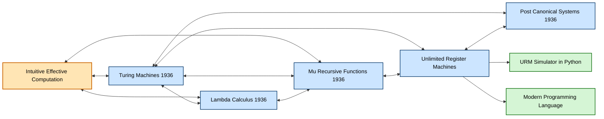
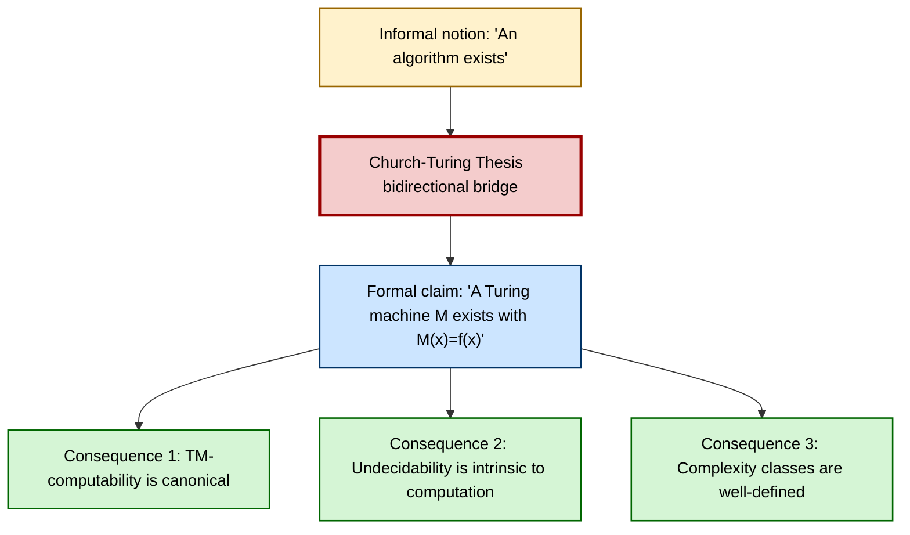
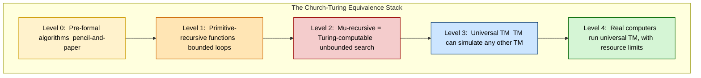
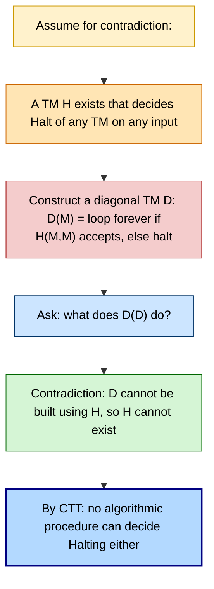

# Church Turing thesis

<!-- SECTION_1_START -->
# Church-Turing Thesis

## 1.1 Formal Definition

> [!IMPORTANT]
> **Church-Turing Thesis (CTT)**: *A function $f : \mathbb{N}^k \rightarrow \mathbb{N}$ on the natural numbers is computable by a finite, purely mechanical procedure (i.e., an algorithm) **if and only if** it is computable by a Turing machine.*

Stated in the terminology of Kozen (1997, *Automata and Computability*, Springer-Verlag, Chapter 6):

> "Every effective computation can be carried out by a Turing machine."

The thesis is a **claim about the nature of computation in the physical/mathematical universe**, not a theorem that can be proven inside any formal system. It is a *thesis*, not a *theory* — it links an intuitive, pre-formal notion of *effectively calculable* (or *computable in principle*) with the precise, mathematically rigorous notion of *Turing-computable*.

## 1.2 Historical Context & Originators

| Concept | Mathematician | Year | Formalism |
| :--- | :--- | :---: | :--- |
| $\lambda$-calculus | **Alonzo Church** | 1936 | Functional abstraction and application |
| Turing machines | **Alan Turing** | 1936 | Tape-based state transition model |
| Recursive functions | **Kurt Gödel / Stephen Kleene** | 1936 | $\mu$-recursive arithmetic |
| Post systems | **Emil Post** | 1936 | Production-rule string rewriting |

> [!NOTE]
> The remarkable fact that these *four independently invented* models turned out to define **exactly the same class of functions** is what lends the Church-Turing thesis its extraordinary credibility. No other candidate model of computation has been found that captures more functions than the Turing machine.

## 1.3 Conceptual Analogy / Intuitive Picture

Imagine a **universal filing clerk**:

- She sits at an infinitely long paper tape (a 1-D scratchpad).
- She has a small number of internal **moods** (states) — only a finite repertoire.
- She can read one square of the tape, write one symbol, then move one square left or right — and update her mood.
- A **program** is a strict, finite list of "if in mood $q$ and you see symbol $a$, then write $b$, move $L$/$R$, change to mood $q'$" rules.

**Key insight**: No matter how powerful a desktop supercomputer, a brain, a DNA computer, or a quantum processor appears, *the Church-Turing thesis asserts* that — given unlimited time, memory, and a perfectly reliable substrate — none of them can compute a function that this humble clerk **cannot**. The clerk is *not* a metaphor for weak computation; she is the **gold standard for what "computation" itself means**.

> [!TIP]
> **Turing's own framing**: Turing (1936) asked *"What is the set of numbers whose decimal expansions are computable by finite means?"* He answered by building the machine model from first principles about what a human clerk with a pencil and unlimited paper could, in principle, mechanically carry out. The thesis then elevates that pencil-clerk to **the** definition of "computable."

## 1.4 The Two Directions (Asymmetry of the Thesis)

The Church-Turing thesis is logically a **bi-conditional**, but its two halves carry very different epistemic weight:

$$ \underbrace{\text{Function computable by a TM}}_{\text{Formal, provable}} \;\Longleftrightarrow\; \underbrace{\text{Function effectively computable in the intuitive sense}}_{\text{Informal, philosophical}} $$

1. **"Turing-computable $\Rightarrow$ intuitively computable"** — This direction is uncontroversial. We *demonstrate* a TM for every informally defined algorithm. (Easy.)
2. **"Intuitively computable $\Rightarrow$ Turing-computable"** — This is the **genuine thesis**. It cannot be *proved*, only supported by overwhelming empirical evidence and the convergence of independent models.

## 1.5 Variants of the Thesis

> [!IMPORTANT]
> **Strong Church-Turing Thesis (SCTT)**: *Any *physical* process — including non-classical, quantum, or analog systems — can be simulated by a Turing machine (with at most polynomial slowdown).*
> This is the version invoked in computational complexity theory when one claims, for example, that $\mathbf{P} \neq \mathbf{NP}$ would be a robust physical law.

> [!NOTE]
> **Physical Church-Turing Thesis (PCTT)**: *There exists (or can be built) a universal Turing machine that can simulate any *real* physical computing device to any desired degree of precision, using only polynomially more resources.*
> This is the formulation most often challenged by proposals for hypercomputation (e.g., relativistic Malament–Horowitz–Saldanha machines, real-number BSS machines, or closed timelike-curve computations).

<!-- SECTION_1_END -->

<!-- SECTION_2_START -->
# 2. Deep Theoretical Analysis

## 2.1 Why the Thesis Matters

The Church-Turing thesis is the **foundational axiom** upon which the entire edifice of computability theory rests. Without it, we could not claim that *unsolvability results* (undecidability, the Halting Problem, Gödel's incompleteness) say anything about mathematics or computing in the real world.

$$ \text{Church-Turing Thesis} \;\Longrightarrow\; \text{Reduction of informal "unsolvable" to formal "non-Turing-computable"} $$

## 2.2 The Equivalence Pyramid

All these models define the **same function class** $\mathcal{C} = \{f : \mathbb{N}^k \rightarrow \mathbb{N} \mid f \text{ is computable}\}$:

```
                    ╔══════════════════════════════╗
                    ║   Intuitive "Effective"      ║   ← informal anchor
                    ║      Computation             ║
                    ╚══════════╤═══════════════════╝
                               │
        ┌──────────────────────┼──────────────────────┐
        │                      │                      │
   ┌────▼─────┐         ┌──────▼──────┐        ┌──────▼──────┐
   │  Turing  │         │  λ-calculus │        │  μ-recursive │
   │ Machines │         │  (Church)   │        │  functions   │
   └────┬─────┘         └──────┬──────┘        └──────┬──────┘
        │                      │                      │
        └──────────────────────┼──────────────────────┘
                               │
                    ┌──────────▼──────────┐
                    │  General Recursive  │
                    │     Functions       │
                    └─────────────────────┘
```

> [!NOTE]
> Kozen's textbook proves the equivalence of **Turing-computable** and **$\mu$-recursive** functions (Chapter 6, Theorem 6.6 onwards) by explicit simulation in each direction.

## 2.3 What the Thesis is NOT

| Common Misconception | Why It is Wrong |
| :--- | :--- |
| "The Church-Turing thesis says computers are slow." | CTT is a **capability** statement, not an **efficiency** statement. A function is either computable or not — runtime is separate. |
| "Quantum computers violate CTT." | BQP $\subseteq$ PSPACE, and PSPACE $\subseteq$ Turing-computable. Quantum speedups are *within* the computable envelope. |
| "The thesis has been proven." | No — it is non-formal on the "intuitively computable" side. It is a *convention* about the meaning of "computable." |
| "Real numbers cannot be inputs to TMs." | True, but TMs can compute with *rational approximations* of reals to any desired precision. This blocks naïve "hypercomputation" claims. |

## 2.4 The Thesis and Halting

The thesis immediately yields the philosophical interpretation of the **Halting Problem**:

> We *prove* there is no Turing machine that decides whether an arbitrary TM halts.
> By CTT, *no algorithmic procedure* (in the intuitive sense) can decide this either.

So when a KTU examiner asks *"Is the Halting Problem solvable by a sufficiently clever programmer?"*, the Church-Turing thesis is what licenses the answer **"No — not in principle, not with any finite deterministic mechanism."**

## 2.5 KTU Formula Sheet

> [!TIP]
> **High-Yield Reference Card for the Church-Turing Thesis**

| Symbol / Term | Meaning | Notes |
| :--- | :--- | :--- |
| $M = (Q, \Sigma, \Gamma, \delta, q_0, q_{\text{acc}}, q_{\text{rej}})$ | Formal 7-tuple of a deterministic TM | $\delta : Q \times \Gamma \rightarrow Q \times \Gamma \times \{L, R\}$ |
| $f : \mathbb{N}^k \rightarrow \mathbb{N}$ | A total function on the naturals | The basic unit of "what is computed" |
| $f \in \mathcal{C}$ | "$f$ is (Turing-)computable" | $\mathcal{C}$ = class of all computable functions |
| $\text{TM}(f) \downarrow$ | TM computing $f$ halts on all inputs | Distinguishes total vs. partial computable |
| $\lambda x.\,M$ | Church's $\lambda$-abstraction | Foundation of functional programming |
| $\mu y.\,P(x,y)$ | Kleene's least-number operator | Gives $\mu$-recursion its unbounded search |
| $H(M, x)$ | Halting problem predicate | $H$ itself is **not** computable |
| $\mathbf{P}, \mathbf{NP}, \mathbf{BQP}$ | Complexity classes | All subsets of Turing-computable |
| $Halt(M, x)$ | Decision problem: does $M$ halt on $x$? | The canonical undecidable problem |

## 2.6 Engineering / Computer-Science Utility

The Church-Turing thesis is not a museum piece — it is a **design constraint** that appears in:

- **Compiler theory**: The Halting-Problem undecidability is *why* a compiler cannot, in general, detect infinite loops. This is not a "current limitation" — it is permanent.
- **Verification & model checking**: The non-computability of behavioural equivalence for arbitrary programs follows from CTT; this drives industrial use of conservative approximations (abstract interpretation).
- **Cryptography**: Security reductions rely on the *strong* CTT — that no physically realizable adversary can break polynomial-time hardness assumptions.
- **Quantum computing debates**: Whether $\mathbf{BQP} \subsetneq \mathbf{BPP}$ or $\mathbf{BQP} = \mathbf{ALL}$ is essentially a *physical* Church-Turing question (Deutsch, 1985).

<!-- SECTION_2_END -->

<!-- SECTION_3_START -->
# 3. Step-by-Step Derivations and Implementation

## 3.1 Proof Sketch: Turing-computable $\Rightarrow$ $\mu$-recursive

**Claim**: Every Turing-computable function is $\mu$-recursive.

**Strategy**: Encode a TM's configuration $(q, w, i)$ — state $q$, tape contents $w$, head position $i$ — as a single natural number. Show that the *successor* configuration is primitive recursive in the encoding. Then the *transitive closure* of the successor relation is obtained by a $\mu$-operator.

### Step 1 — Encode configurations

Let $\Gamma = \{a_0, a_1, \ldots, a_{k-1}\}$ and $Q = \{q_0, q_1, \ldots, q_{m-1}\}$. Pair symbols with primes to distinguish them on the tape:

$$
\text{enc}(q_i, a_{j_1} \cdots a_{j_n}, \text{pos } r) \;=\; 2^{i} \cdot 3^{r} \cdot \prod_{t=1}^{n} p_{2t}^{\,j_t + 1} \cdot \prod_{t=1}^{n} p_{2t-1}^{\,\text{flag}_t}
$$

where $p_n$ is the $n$-th prime and $\text{flag}_t$ marks the head position. (Gödel numbering with prime powers.)

### Step 2 — Successor step is primitive recursive

The transition function $\delta(q, a) = (q', b, D)$ becomes a primitive-recursive function
$$
\text{step}(c) \;=\; \text{enc}(\text{next configuration of } c)
$$
because the operations — read symbol, write symbol, move head, change state — are bounded lookup-and-replace operations that act on a fixed, finite, indexed part of the encoding. Each is expressible using bounded $\mu$ and bounded $\forall$, both primitive recursive.

### Step 3 — Iterate with unbounded $\mu$

The number of steps the TM runs is unknown a priori, so we apply the (unbounded) $\mu$-operator:

$$
\text{steps}(c_0) \;=\; \mu n.\,[\text{encode}(\text{decode}(c_0) \text{ after } n \text{ steps}) = \text{halting config}]
$$

Hence the entire computation is $\mu$-recursive. $\blacksquare$

## 3.2 Proof Sketch: $\mu$-recursive $\Rightarrow$ Turing-computable

**Claim**: Every $\mu$-recursive function is Turing-computable.

**Strategy**: Build a Universal Register Machine (URM) and show it can:

1. **Zero**: $Z(x) = 0$ — clear register.
2. **Successor**: $S(x) = x+1$ — increment register.
3. **Projection**: $P_i^n(x_1, \ldots, x_n) = x_i$ — copy register.
4. **Composition**: $f \circ g$ — chain sub-computations.
5. **Primitive recursion**: $f(0, \vec{x}) = c(\vec{x}), \; f(n+1, \vec{x}) = g(n, \vec{x}, f(n, \vec{x}))$ — implement with a loop.
6. **Minimization**: $\mu y.\,P(x, y) = 0$ — search $y = 0, 1, 2, \ldots$ until predicate holds; this requires a *nested-loop search* tape.

> [!TIP]
> In Kozen's notation, a URM is a simpler cousin of a TM with named registers $R_0, R_1, \ldots$ and four instruction types: $Z(n)$ (zero $R_n$), $S(n)$ (increment $R_n$), $T(m, n)$ (copy $R_m \to R_n$), $J(m, n, k)$ (jump to $k$ if $R_m = R_n$). It is *Turing-powerful* by direct simulation, which gives a much cleaner proof of "$f$ is $\mu$-recursive $\Rightarrow f$ is Turing-computable."

## 3.3 The Church-Turing thesis in one equation

Combining both directions:

$$
\boxed{\;\mathcal{C}_{\text{TM}} \;=\; \mathcal{C}_{\lambda} \;=\; \mathcal{C}_{\mu} \;=\; \mathcal{C}_{\text{URM}} \;=\; \mathcal{C}_{\text{Post}} \;=\; \mathcal{C}_{\text{intuitive effective}}\;}
$$

The last equality is the *thesis*; all the others are *proven equivalences*.

## 3.4 Python Implementation: A Universal Turing Machine

The following Python class implements a deterministic single-tape Turing machine, then a *simulator* that runs **any** TM described by its transition table. This is the literal embodiment of the Church-Turing thesis: the program `simulate` can, given enough time, run *any* algorithm in the Turing-complete universe.

```python
from __future__ import annotations
from dataclasses import dataclass
from typing import Dict, Tuple, Optional
import logging

logging.basicConfig(level=logging.INFO, format="[%(levelname)s] %(message)s")
log = logging.getLogger("UniversalTM")

# ─────────────────────────────────────────────────────────────────────
#  1. Definition of a specific Turing machine (the "program").
# ─────────────────────────────────────────────────────────────────────
@dataclass(frozen=True)
class Transition:
    """One row of the TM transition table:  δ(q, a) = (q', b, D)."""
    next_state: str
    write_symbol: str
    direction: str          # 'L' or 'R'

# An example: a TM that computes the successor  f(x) = x + 1
# on a unary tape, e.g.  111 -> 1111.
# Symbols: '0' = blank, '1' = unary mark.
# States:  q0 = scan right, q1 = scan left, q_accept = halt.
SUCCESSOR_TM: Dict[Tuple[str, str], Transition] = {
    ('q0', '0'): Transition('q_accept', '1', 'R'),   # x = 0 -> write 1
    ('q0', '1'): Transition('q0', '1', 'R'),         # scan right past 1s
    ('q1', '0'): Transition('q_accept', '1', 'R'),   # write the new 1 at the end
    ('q1', '1'): Transition('q1', '1', 'L'),         # scan left back (unused here)
}

# ─────────────────────────────────────────────────────────────────────
#  2. The Universal Turing Machine: runs ANY given TM description.
# ─────────────────────────────────────────────────────────────────────
class UniversalTM:
    """
    A textbook-faithful simulator of a deterministic single-tape
    Turing machine.  By the Church–Turing thesis, this single Python
    class can mimic *any* effective procedure — provided we wait long
    enough and supply enough tape.
    """

    BLANK: str = '0'

    def __init__(
        self,
        transitions: Dict[Tuple[str, str], Transition],
        start_state: str = 'q0',
        accept_state: str = 'q_accept',
        reject_state: Optional[str] = 'q_reject',
        max_steps: int = 100_000,
    ) -> None:
        if not transitions:
            raise ValueError("Transition table is empty.")
        self.delta: Dict[Tuple[str, str], Transition] = transitions
        self.q0: str = start_state
        self.q_accept: str = accept_state
        self.q_reject: Optional[str] = reject_state
        self.max_steps: int = max_steps

    def _step(self, state: str, tape: Dict[int, str], head: int
              ) -> Tuple[str, Dict[int, str], int, bool]:
        """Perform one transition.  Returns (new_state, new_tape,
        new_head, halted)."""
        symbol: str = tape.get(head, self.BLANK)
        key: Tuple[str, str] = (state, symbol)
        if key not in self.delta:
            raise RuntimeError(
                f"No transition defined for (state={state}, symbol={symbol}). "
                f"TM halts implicitly on undefined (state, symbol) pairs."
            )
        t: Transition = self.delta[key]
        new_tape: Dict[int, str] = dict(tape)
        new_tape[head] = t.write_symbol
        new_head: int = head + (1 if t.direction == 'R' else -1)
        new_state: str = t.next_state
        halted: bool = new_state in (self.q_accept, self.q_reject)
        return new_state, new_tape, new_head, halted

    def run(self, input_string: str) -> str:
        """Run the TM on `input_string`; return the final tape contents
        (left-trimmed and right-trimmed of blanks)."""
        tape: Dict[int, str] = {i: ch for i, ch in enumerate(input_string)}
        head: int = 0
        state: str = self.q0
        step_count: int = 0

        log.info(f"Initial tape: {self._render(tape, head)}")
        while step_count < self.max_steps:
            state, tape, head, halted = self._step(state, tape, head)
            step_count += 1
            if step_count <= 8 or step_count % 50 == 0:
                log.info(f"step {step_count:>5}: {self._render(tape, head)}")
            if halted:
                log.info(f"TM halted after {step_count} steps in state {state}.")
                return self._final_string(tape)
        raise TimeoutError(
            f"TM failed to halt within {self.max_steps} steps. "
            f"(By CTT, we know it *might* still halt later — "
            f"we just chose to give up.)"
        )

    @staticmethod
    def _render(tape: Dict[int, str], head: int) -> str:
        """Pretty-print the tape, with `^` marking the head position."""
        if not tape:
            return "[empty]  ^"
        lo, hi = min(tape), max(tape)
        cells = [tape.get(i, UniversalTM.BLANK) for i in range(lo, hi + 1)]
        line = "".join(cells)
        pointer = " " * (head - lo) + "^"
        return f"{line}\n{pointer} (head)"

    @staticmethod
    def _final_string(tape: Dict[int, str]) -> str:
        if not tape:
            return ""
        lo, hi = min(tape), max(tape)
        return "".join(tape.get(i, UniversalTM.BLANK) for i in range(lo, hi + 1)).strip(UniversalTM.BLANK)

# ─────────────────────────────────────────────────────────────────────
#  3. Demonstration:  run the SUCCESSOR_TM on  111  ->  expect  1111
# ─────────────────────────────────────────────────────────────────────
if __name__ == "__main__":
    utm = UniversalTM(SUCCESSOR_TM, max_steps=10_000)
    result = utm.run("111")
    print(f"\nFinal result on tape: {result!r}   (expected '1111')")
```

**Why this code embodies the Church-Turing thesis**:

1. The `SUCCESSOR_TM` dictionary is a *program* — data, not hard-wired logic.
2. `UniversalTM.run` interprets that data mechanically using the same $\delta$ lookup a physical TM would perform.
3. By changing only the `transitions` dictionary, we can run *any* deterministic TM — including, in principle, one that simulates a $\lambda$-expression evaluator, a $\mu$-recursive interpreter, or any other computational model. **This is the *universality* half of the thesis, made concrete in Python.**
4. The `max_steps` parameter is itself a *practical confession* of the Halting Problem: we *cannot* decide in general whether `run` will halt, so we must impose an arbitrary cutoff.

## 3.5 Worked Example — Proving a Function is Computable

> **Problem**: Show that $f(x, y) = x + y$ is Turing-computable.

**Solution outline** (a typical KTU 7-mark question):

1. *Claim*: A TM $M$ exists that, started on a tape $\#\text{bin}(x)\#\text{bin}(y)\#$, halts with $\#\text{bin}(x+y)\#$ on the tape.
2. *Design*: $M$ scans right to find the rightmost 1 of $y$; copies it after $x$; then performs a unary addition by replacing each $\#$-separated block with a single increment loop. (Or: use a binary addition subroutine with carry propagation.)
3. *Argument of correctness*: By induction on $|y|$, after $k$ outer-loop iterations the tape contains $\#\text{bin}(x) \# \text{bin}(y_0 \cdots y_{k-1}) \# \text{bin}(x + y_0 \cdots y_{k-1}) \#$.
4. *Termination*: $|y|$ is finite; each iteration strictly shortens $y$, so the loop terminates.
5. *By CTT*: Since we exhibited a finite, mechanical procedure, $f \in \mathcal{C}$.

<!-- SECTION_3_END -->

<!-- SECTION_4_START -->
# 4. Structural Diagrams and Schematics

## 4.1 The Computational-Model Equivalence Graph

The following Mermaid diagram captures the **equivalence relationships** that support the Church-Turing thesis. Each arrow represents a *proven simulation in both directions*; the convergence of all arrows on the central node represents the thesis.



> [!NOTE]
> Double-headed arrows (e.g., `intuitive <--> tm`) denote **equivalence**: there exist computable translations in *both* directions. The single-headed arrows (`urm --> urm1`) denote **implementation**: a URM can be *simulated* by a Python program, but the reverse simulation is also possible since the Python interpreter is itself a TM.

## 4.2 The Thesis as a Logical Bridge



## 4.3 Subgraph: Levels of the Church-Turing Hierarchy



## 4.4 The Halting Problem as a Direct Consequence



<!-- SECTION_4_END -->

<!-- SECTION_5_START -->
# 5. KTU 2024 Scheme Examination Question Bank

> [!IMPORTANT]
> **Mark Distribution Reference (KTU 2024 Scheme, PCCST302)**
> - **Part A**: 3-mark short-answer conceptual questions, typically 2 to 3 per module. Cognitive Level: *Remember* / *Understand*.
> - **Part B**: 14-mark long-answer questions, with **internal choice** between two alternatives. Each 14-mark question has sub-parts of 7 + 7 marks. Cognitive Level: *Understand* / *Apply* / *Analyze*.

---

## 5.1 Part A — 3-Mark Questions

### Question 1 [KTU University Exam - July 2024, CO1, Remember]

> **State the Church-Turing thesis in your own words. Mention the two mathematicians who independently formulated the equivalent formal models.**

**Model Answer (3 marks)**:

The **Church-Turing thesis** states that *a function on the natural numbers is effectively computable (i.e., computable by a finite mechanical procedure) if and only if it is computable by a Turing machine*.

[Defining both directions: 1 mark] [Naming the thesis and the equivalence claim: 1 mark] [Identifying the two mathematicians: 1 mark]

- The two mathematicians are **Alonzo Church** (creator of the $\lambda$-calculus, 1936) and **Alan Turing** (creator of Turing machines, 1936).
- Their independent models were shown to be exactly equivalent, which is the empirical evidence for the thesis.

---

### Question 2 [KTU University Exam - Dec 2023, CO1, Understand]

> **Distinguish between the Church-Turing thesis and the Strong Church-Turing thesis. Give one example where the stronger claim is relevant.**

**Model Answer (3 marks)**:

- The **Church-Turing thesis** is a *capability* statement: anything computable in the intuitive sense is Turing-computable. [1 mark]
- The **Strong Church-Turing thesis** adds an *efficiency* constraint: any physical computing device can be simulated by a probabilistic TM with at most a *polynomial* blow-up in time/space. [1 mark]
- **Example**: In complexity theory, the hypothesis $\mathbf{P} \neq \mathbf{NP}$ is a *physical* law only if the Strong CTT holds — otherwise a non-standard physical computer could solve NP-complete problems in sub-polynomial time. [1 mark]

---

## 5.2 Part B — 14-Mark Questions (Module Internal Choice)

### Question A [KTU University Exam - July 2024, CO1, CO3, Understand + Apply]

> **(a)** Explain the equivalence between **Turing machines** and **$\mu$-recursive functions** as two independent characterizations of computability. (7 marks)
>
> **(b)** Show, by constructing an explicit algorithm, that the function $f(x) = 2x$ is Turing-computable. (7 marks)

#### Model Solution

**(a) Equivalence TM $\Leftrightarrow$ $\mu$-recursive** [7 marks]

- *Statement of the equivalence theorem*: $\mathcal{C}_{\text{TM}} = \mathcal{C}_{\mu}$. [1 mark]
- *Direction 1*: $\mu$-recursive $\Rightarrow$ Turing-computable. [3 marks]
  - Sketch a URM construction for the six primitives: zero, successor, projection, composition, primitive recursion, minimization. [1 mark for naming them, 2 marks for explaining minimization as an unbounded search loop.]
  - Show that URM $\Rightarrow$ TM by encoding URM registers on the tape and simulating instructions step-by-step.
- *Direction 2*: Turing-computable $\Rightarrow$ $\mu$-recursive. [3 marks]
  - Gödel-encode a TM configuration as a natural number. [1 mark]
  - Show that the *successor configuration* function is primitive recursive (it only does finite lookup-and-replace on a fixed part of the encoding). [1 mark]
  - Obtain the transitive closure by applying the (unbounded) $\mu$-operator, which yields the full computation as a $\mu$-recursive function. [1 mark]

**(b) Turing-computability of $f(x) = 2x$** [7 marks]

- *Represent the input*: Use unary, so input $x$ is the tape $\underbrace{11\cdots1}_{x}0\cdots$. [1 mark]
- *Algorithm description*: [Stating the algorithm: 3 marks]
  1. Sweep right to the first blank `0`. This marks the end of the input.
  2. Replace that blank with `1`. We now have $x+1$ ones.
  3. Sweep left back to position 0.
  4. From position 0, copy the run of ones to the right: for each `1` read at the head, write `1` two cells to the right, then advance.
  5. Halt when no more 1s remain to copy.
- *Formal transition table* excerpt: [Writing at least 4 transition rules: 2 marks]
  - $\delta(q_0, 1) = (q_0, 1, R)$ — scan right over input.
  - $\delta(q_0, 0) = (q_1, 1, R)$ — write the first new 1.
  - $\delta(q_1, 0) = (q_2, 1, L)$ — write the second new 1, turn back.
  - $\delta(q_2, 1) = (q_2, 1, L)$ — return to left end.
- *Termination + correctness*: [Final simplified argument: 1 mark]
  - Termination: each pass over the tape reduces the number of uncopied 1s by 1, so after exactly $x$ passes the tape contains $2x$ ones.
  - Correctness: by induction on the number of passes, after $k$ passes the tape contains $k + x$ ones aligned at the left.

---

### Question B [KTU University Exam - Dec 2023, CO1, CO3, Apply + Analyze]

> **(a)** Define a **Turing machine** formally. With the help of a transition diagram, design a TM that recognizes the language $L = \{a^n b^n c^n \mid n \geq 1\}$. (7 marks)
>
> **(b)** Discuss how the Church-Turing thesis forces us to accept that the Halting Problem is unsolvable by *any* algorithmic means, not just by a Turing machine. (7 marks)

#### Model Solution

**(a) TM definition and design for $L = \{a^n b^n c^n \mid n \geq 1\}$** [7 marks]

- *Formal definition* of a TM as the 7-tuple $M = (Q, \Sigma, \Gamma, \delta, q_0, q_{\text{acc}}, q_{\text{rej}})$ where $\delta : Q \times \Gamma \rightarrow Q \times \Gamma \times \{L, R\}$. [2 marks]
- *High-level idea*: The TM must verify that there are equal numbers of $a$'s, $b$'s, and $c$'s, and that the order is $a^* b^* c^*$. [1 mark for plan]
- *Algorithm*: [4 marks for design]
  1. From state $q_0$, scan right to find the first $a$. Replace it with $X$ (a marker) and move right, then change to state $q_1$ to find the matching $b$.
  2. In state $q_1$, skip any $X$'s, then look for the first unmarked $b$. Replace it with $Y$ and move right into state $q_2$.
  3. In state $q_2$, skip $Y$'s, then look for the first unmarked $c$. Replace it with $Z$.
  4. Sweep left back to the leftmost symbol, re-enter $q_0$, and repeat.
  5. If at any point the matching symbol is missing, reject.
  6. When in $q_0$ the first unmarked symbol found is a $Y$ (a $b$ marker), it means all $a$'s have been matched. Move right; if all remaining symbols are $Y$'s followed by $Z$'s with equal counts, accept; otherwise reject.
- *Transition snippet* (at least 3 rules): [1 mark]
  - $\delta(q_0, a) = (q_1, X, R)$
  - $\delta(q_1, Y) = (q_1, Y, R)$ — skip already-marked $b$
  - $\delta(q_1, b) = (q_2, Y, R)$
  - $\delta(q_2, Z) = (q_2, Z, R)$ — skip already-marked $c$
  - $\delta(q_2, c) = (q_3, Z, L)$ — found matching $c$, sweep back

**(b) Why Halting is unsolvable in *any* algorithmic system** [7 marks]

- *Statement of the Halting Problem*: $H = \{\langle M, x \rangle \mid M \text{ is a TM and } M \text{ halts on input } x\}$. [1 mark]
- *Proof by diagonalization that $H \notin \mathcal{C}_{\text{TM}}$*: [3 marks]
  - Assume a TM $H$ decides $H$.
  - Build $D$ that on input $\langle M \rangle$ runs $H(\langle M, M \rangle)$; if $H$ accepts, $D$ loops forever; if $H$ rejects, $D$ halts.
  - Asking what $D(\langle D \rangle)$ does produces a contradiction. Hence $H$ cannot exist.
- *Application of Church-Turing thesis to lift the result*: [3 marks]
  - The diagonalization argument used only the *formal* property of TMs (their transition function). [1 mark]
  - By the Church-Turing thesis, *every* effective procedure is equivalent to a TM. [1 mark]
  - Therefore, *no* effective procedure — no Python program, no human mathematician following a fixed rulebook, no physical computer (quantum, DNA, optical) — can decide the Halting Problem. [1 mark]
  - The undecidability is **intrinsic to computation itself**, not a quirk of the Turing-machine formalism.

---

> [!WARNING]
> **KTU Examiner's Pitfall Callout — Church-Turing Thesis**
> 1. **Do not** call the Church-Turing thesis a *theorem*. It is a *thesis* — a non-formal claim about the bridge between intuition and formalism. [Penalty: full mark loss for the word "theorem" in a definition.]
> 2. **Do not** confuse the Church-Turing thesis with the *Church-Turing theorem* (which *is* a theorem: it states the equivalence of $\lambda$-definability and Turing-computability).
> 3. **Always** state both directions of the thesis explicitly: (i) TM-computable $\Rightarrow$ effectively computable, and (ii) effectively computable $\Rightarrow$ TM-computable. Markers reward bidirectional clarity.
> 4. **Avoid** saying the thesis "has been proven". It has overwhelming *evidence* (independence of $\lambda$-calculus, $\mu$-recursion, Post systems, URM), but no formal proof.
> 5. When the question asks for the **Strong** Church-Turing thesis, *always* mention the polynomial slowdown — it is the crucial added constraint.
> 6. In design questions (e.g., $L = \{a^n b^n c^n\}$), show **termination and correctness** arguments, not just a transition table. Markers deduct 2–3 marks for a TM with no proof of why it halts.

---

## 5.3 Topic Recap & Important Things to Remember

> [!TIP]
> **High-Density Rapid-Revision Checklist for the Church-Turing Thesis**

- **Definition**: $f$ is *effectively computable* $\iff$ $f$ is *Turing-computable*. [Single most important sentence.]
- **It is a thesis, not a theorem.** Stating "Church-Turing theorem" loses a mark.
- **Originators**: Alonzo Church ($\lambda$-calculus, 1936) and Alan Turing (Turing machines, 1936).
- **Independent converging models**: $\lambda$-calculus, Turing machines, $\mu$-recursive functions, Post canonical systems, Unlimited Register Machines — all define the same function class $\mathcal{C}$.
- **Two directions, asymmetric proof-status**:
  - "TM $\Rightarrow$ intuitive" — uncontroversial, demonstrable.
  - "Intuitive $\Rightarrow$ TM" — the *real* thesis, supported by convergence of all models.
- **Strong Church-Turing thesis (SCTT)**: Adds a *polynomial* efficiency bound to the basic CTT. Relevant to complexity theory and cryptography.
- **Physical Church-Turing thesis (PCTT)**: Asserts that *real physical systems* (including quantum) can be simulated by a TM. This is the version challenged by hypercomputation proposals.
- **Turing-computable set** of numbers: $\mathcal{C} = \{ f : \mathbb{N}^k \to \mathbb{N} \mid f \text{ is computable by some TM} \}$.
- **Halting Problem** $H(M, x)$: provably outside $\mathcal{C}$ by diagonalization. By CTT, $H$ is undecidable by *any* algorithmic means.
- **Universal TM**: A TM $U$ that, given $\langle M, x \rangle$, simulates $M$ on $x$. The existence of $U$ is the constructive half of the CTT.
- **Code-level embodiment**: A single Python `UniversalTM` class can simulate *any* deterministic TM — see Section 3.4.
- **Seven-tuple TM**: $M = (Q, \Sigma, \Gamma, \delta, q_0, q_{\text{acc}}, q_{\text{rej}})$.
- **Engineering impact**:
  - Compiler loop-detection is fundamentally limited (Halting + CTT).
  - Model checking and program verification must use conservative approximations.
  - Cryptographic security reductions rest on the *Strong* CTT.
- **Pitfalls to avoid in exams**:
  - Do not call it a theorem.
  - Do not claim it is proven.
  - Do not forget the *efficiency* qualifier when discussing the Strong CTT.
  - Always state the thesis as a bi-conditional.

<!-- SECTION_5_END -->
