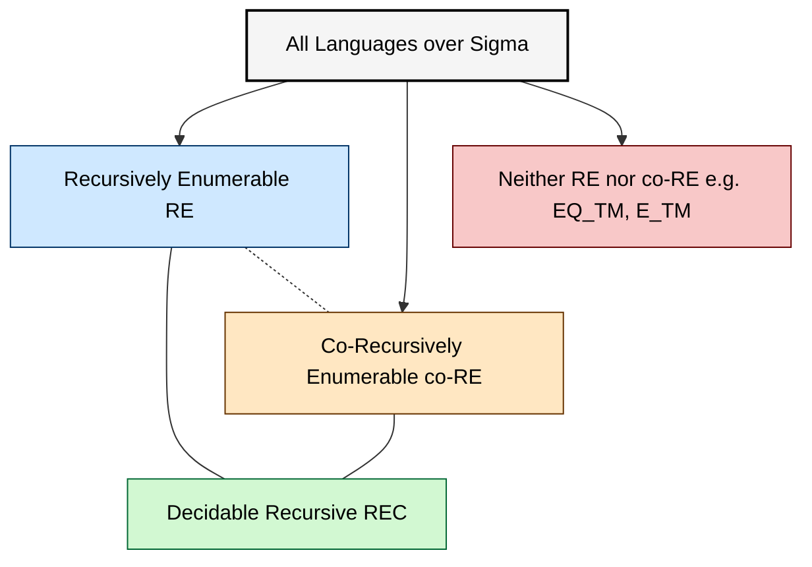
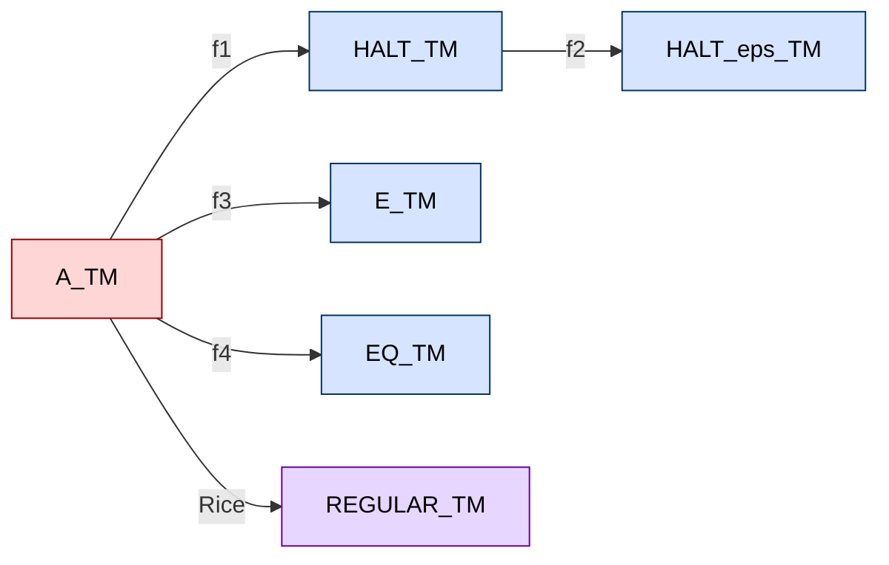
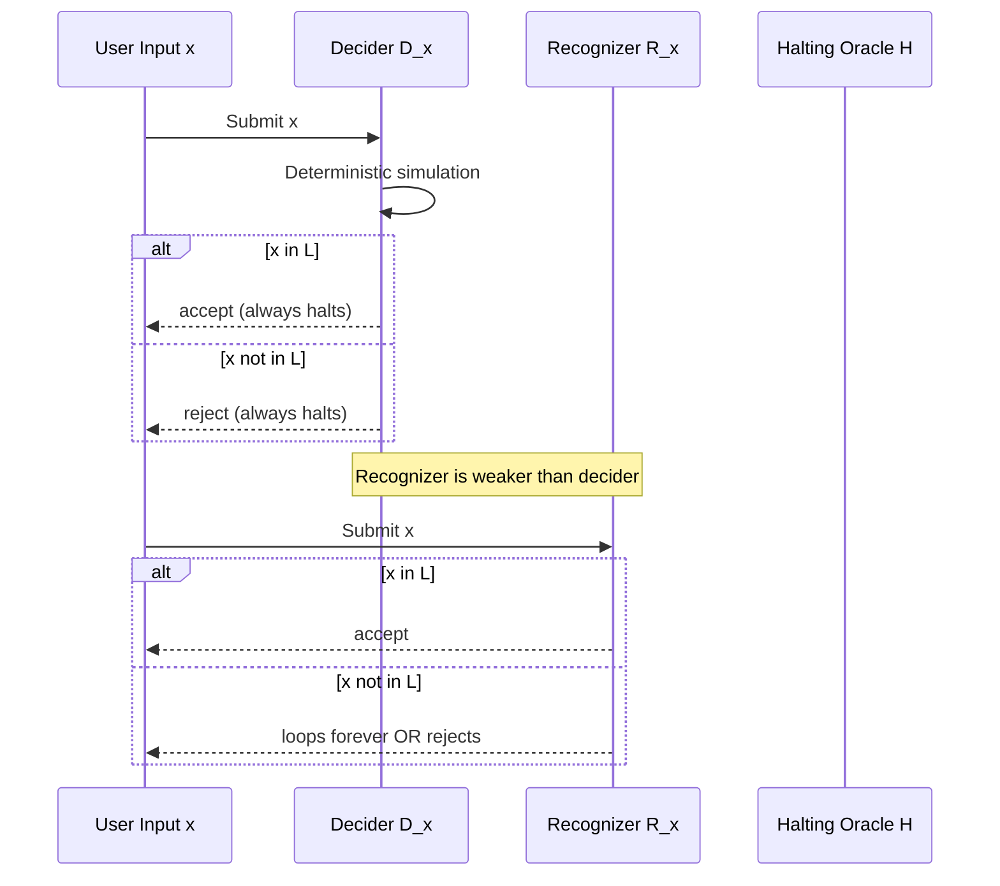
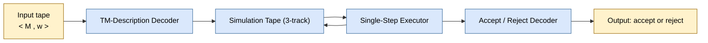
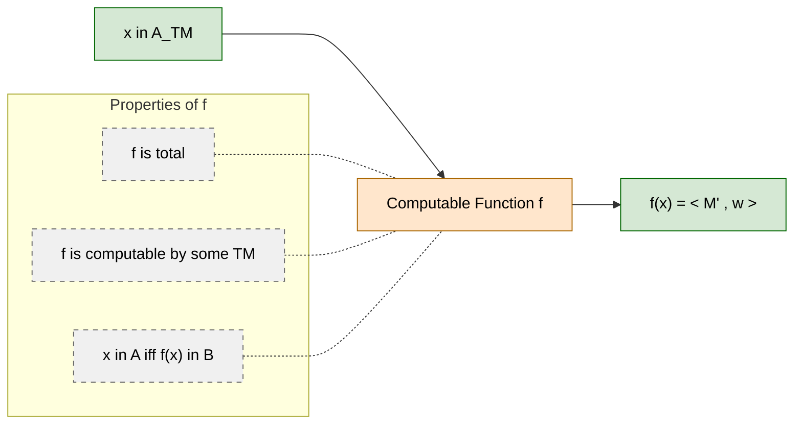

# Computability (Kozen)

<!-- SECTION_1_START -->
# Module 4 — Computability (Kozen)

## 1.1 Formal Definition (KTU 2024 Syllabus Terminology)

In Kozen's formalism, **Computability** is the branch of the theory of computation that classifies problems (languages) according to whether a Turing machine can solve them — and if so, with what resources and under what conditions.

> [!IMPORTANT]
> **Core Definition (Kozen, Chapter on Computability):**
> A language $L \subseteq \Sigma^{\ast}$ is **decidable** (also called **recursive**) if there exists a Turing machine $M$ such that for every input $x \in \Sigma^{\ast}$, $M$ halts and accepts if $x \in L$, and $M$ halts and rejects if $x \notin L$.
>
> A language $L$ is **recursively enumerable (r.e.)** (also called **Turing-recognizable** or **semi-decidable**) if there exists a Turing machine $M$ that accepts every string in $L$ and either rejects or loops forever on every string not in $L$.

Three structural classes therefore govern the entire chapter:

| Class | Notation | Decider exists? | Recognizer exists? | Closed under complement? |
| :--- | :--- | :--- | :--- | :--- |
| Decidable (Recursive) | $\mathrm{REC}$ | **Yes** | **Yes** | **Yes** |
| Recursively Enumerable | $\mathrm{RE}$ | **No** (in general) | **Yes** | **No** |
| Co-Recursively Enumerable | $\mathrm{co\text{-}RE}$ | **No** (in general) | **Yes** (recognizer for $\overline{L}$) | **Yes** |

> [!NOTE]
> **Critical Identity (Kozen, Thm. Computability §):**
> $$\mathrm{REC} \;=\; \mathrm{RE} \cap \mathrm{co\text{-}RE}$$
> This single identity is the single most-tested identity in KTU valuation scripts for Module 4.

## 1.2 Intuitive Analogy — "The Judge, the Detective, and the Ghost"

Imagine three roles working on an infinite pile of cases:

* The **Judge (Decider)** reads any case file, gives a *verdict in finite time*, and is never late. The judge never says "I will come back later" — every case ends in **accept** or **reject**.
* The **Detective (Recognizer)** works on a case and *eventually reports a positive finding* for every guilty party, but for innocent cases may investigate forever (loop).
* The **Ghost Detective (Co-Recognizer)** is the same as above but for the *complement* — it can conclusively report innocence but may loop on guilt.

A problem is **decidable** if a Judge exists. **Recursively enumerable** if a Detective exists. **Co-R.E.** if a Ghost Detective exists. The famous *Halting Problem* is the canonical case where only a Detective exists — no Judge can ever exist.

## 1.3 Universal Turing Machine — The Foundation of Computability

> [!IMPORTANT]
> **Theorem (Kozen, Universal Turing Machine):**
> There exists a Turing machine $\mathcal{U}$ such that on input $\langle M, w \rangle$, $\mathcal{U}$ simulates $M$ on $w$. That is,
> $$\mathcal{U} \text{ accepts } \langle M, w \rangle \iff M \text{ accepts } w$$
> $$\mathcal{U} \text{ rejects } \langle M, w \rangle \iff M \text{ rejects } w$$
> $$\mathcal{U} \text{ loops on } \langle M, w \rangle \iff M \text{ loops on } w$$

The existence of $\mathcal{U}$ proves that the description string $\langle M \rangle$ of any TM can be treated as *data* to another TM. This is the lynchpin of every diagonalization and reduction argument in Kozen's chapter.

## 1.4 GeoGebra / Desmos Visualization of the Language Hierarchy

> [!VISUALIZATION CONTROL]
> **Concept:** Venn-Diagram of the language classes over a fixed alphabet $\Sigma$.
> **GeoGebra / Desmos Input Equations (region boundaries using parametric inequalities):**
> * Circle 1 (Recursive / Decidable): $(x-2)^2 + y^2 \leq 9$
> * Circle 2 (R.E.): $(x+2)^2 + y^2 \leq 9$
> * Label point $P_{\mathrm{outside}} = (0,\, 5)$ — outside both circles (non-r.e. and non-co-r.e.)
> **Visual Description:**
> The two circles overlap in a lens-shaped region representing $\mathrm{REC}$. The right-only crescent is r.e.-only (e.g., $A_{TM}$). The left-only crescent is co-r.e.-only (e.g., $\overline{A_{TM}}$). Everything outside both circles is neither r.e. nor co-r.e. (e.g., $EQ_{TM}$, $E_{TM}$).

<!-- SECTION_1_END -->

<!-- SECTION_2_START -->
# 2. Deep Theoretical Analysis & KTU High-Yield Formula Sheet

## 2.1 The Two Fundamental Theorems That Drive the Chapter

### Theorem A — Undecidability of the Acceptance Problem (Kozen §23)

$$A_{TM} \;=\; \{\langle M, w \rangle \mid M \text{ is a TM and } M \text{ accepts } w\}$$

$A_{TM}$ is **undecidable** but **r.e.**. The proof uses **Cantor diagonalization** on the enumeration of all TM–string pairs.

### Theorem B — Undecidability of the Halting Problem (Kozen §24)

$$HALT_{TM} \;=\; \{\langle M, w \rangle \mid M \text{ is a TM and } M \text{ halts on } w\}$$

$HALT_{TM}$ is **undecidable** but **r.e.**. The proof reduces $A_{TM} \le_{m} HALT_{TM}$.

## 2.2 Decidability Cheat-Sheet — What is Decidable vs Undecidable

| Language | Symbol | Decidable? | R.E.? | Notes (Board-Favorite) |
| :--- | :--- | :---: | :---: | :--- |
| $A_{DFA} = \{\langle B, w \rangle \mid B \text{ is a DFA accepting } w\}$ | $A_{DFA}$ | **Yes** | **Yes** | Run $B$ on $w$ — $O(n)$ |
| $A_{NFA} = \{\langle B, w \rangle \mid B \text{ is an NFA accepting } w\}$ | $A_{NFA}$ | **Yes** | **Yes** | Convert NFA to DFA, then run |
| $A_{REX} = \{\langle R, w \rangle \mid R \text{ is a regex matching } w\}$ | $A_{REX}$ | **Yes** | **Yes** | Convert to NFA |
| $E_{DFA} = \{\langle B \rangle \mid L(B) = \emptyset\}$ | $E_{DFA}$ | **Yes** | **Yes** | BFS/DFS reachability on DFA |
| $EQ_{DFA} = \{\langle A, B \rangle \mid L(A) = L(B)\}$ | $EQ_{DFA}$ | **Yes** | **Yes** | Product DFA, test emptiness |
| $A_{CFG} = \{\langle G, w \rangle \mid G \text{ is a CFG generating } w\}$ | $A_{CFG}$ | **Yes** | **Yes** | CYK algorithm, $O(n^3)$ |
| $E_{CFG} = \{\langle G \rangle \mid L(G) = \emptyset\}$ | $E_{CFG}$ | **Yes** | **Yes** | Mark reachable non-terminals |
| $EQ_{CFG} = \{\langle G, H \rangle \mid L(G) = L(H)\}$ | $EQ_{CFG}$ | **No** | **No** | Neither r.e. nor co-r.e. |
| $A_{TM} = \{\langle M, w \rangle \mid M \text{ accepts } w\}$ | $A_{TM}$ | **No** | **Yes** | Diagonalization |
| $HALT_{TM} = \{\langle M, w \rangle \mid M \text{ halts on } w\}$ | $HALT_{TM}$ | **No** | **Yes** | Reduction from $A_{TM}$ |
| $E_{TM} = \{\langle M \rangle \mid L(M) = \emptyset\}$ | $E_{TM}$ | **No** | **No** | Not even r.e. |
| $EQ_{TM} = \{\langle M, N \rangle \mid L(M) = L(N)\}$ | $EQ_{TM}$ | **No** | **No** | Not even r.e. |
| $REGULAR_{TM} = \{\langle M \rangle \mid L(M) \text{ is regular}\}$ | $REG_{TM}$ | **No** | **No** | Rice's Theorem |
| $HALT\varepsilon_{TM} = \{\langle M \rangle \mid M \text{ halts on } \varepsilon\}$ | $H_{\varepsilon}$ | **No** | **Yes** | Reduction from $HALT_{TM}$ |

## 2.3 Mapping Reduction ($\le_{m}$) — Kozen's Reductio Ad Absurdum Tool

> [!IMPORTANT]
> **Definition (Many-One Reduction):**
> Language $A$ is **mapping reducible** to language $B$, written $A \le_{m} B$, if there exists a *computable* function $f : \Sigma^{\ast} \to \Sigma^{\ast}$ such that for all $x$,
> $$x \in A \iff f(x) \in B$$
> Such an $f$ is called a **reduction** of $A$ to $B$.

**Three Reduction Lemmas (Kozen):**

1. If $A \le_{m} B$ and $B$ is decidable, then $A$ is decidable.
2. If $A \le_{m} B$ and $B$ is r.e., then $A$ is r.e.
3. If $A \le_{m} B$ and $A$ is **undecidable**, then $B$ is **undecidable**.
4. If $A \le_{m} B$ and $\overline{A} \le_{m} \overline{B}$, then $A \le_{m} B$.

The third lemma is the **prime weapon** in KTU board examinations.

## 2.4 Rice's Theorem — The Sledgehammer

> [!IMPORTANT]
> **Rice's Theorem (Kozen §25):**
> Let $P$ be any **non-trivial** property of the language recognized by a Turing machine. That is,
> * $P$ is a proper, non-empty subset of the class of r.e. languages, and
> * $P$ is non-trivial in the sense that there exist r.e. languages $L_1, L_2$ with $L_1 \in P$ and $L_2 \notin P$.
>
> Then the language
> $$L_P \;=\; \{\langle M \rangle \mid M \text{ is a TM and } L(M) \in P\}$$
> is **undecidable**.

Rice's theorem applies to *any* question about the *behavior* of a TM that depends on the language it accepts — not on its syntactic structure.

## 2.5 Closure Properties — The KTU Must-Know Grid

| Operation | $\mathrm{REC}$ | $\mathrm{RE}$ | $\mathrm{co\text{-}RE}$ |
| :--- | :---: | :---: | :---: |
| Union | **Closed** | **Closed** | **Closed** |
| Intersection | **Closed** | **Closed** | **Closed** |
| Complement | **Closed** | **Not Closed** | **Not Closed** |
| Concatenation | **Closed** | **Closed** | **Closed** |
| Kleene Star | **Closed** | **Closed** | **Closed** |
| Reversal | **Closed** | **Closed** | **Closed** |
| Homomorphism | **Closed** | **Closed** | **Closed** |
| Inverse Homomorphism | **Closed** | **Closed** | **Closed** |

## 2.6 Real-World Engineering Utility

* **Static program analyzers** (e.g., compiler `linter` warnings) routinely solve *decidable* sub-problems such as $A_{DFA}$ (token classification) and $A_{CFG}$ (parser generators like YACC, ANTLR, Lark).
* **Model checkers** (SPIN, NuSMV) solve decidable fragments of temporal logic but face the **Halting Problem barrier** for arbitrary programs.
* **Malware detection engines** are theoretically limited by Rice's theorem — determining whether arbitrary code is "malicious" (a non-trivial semantic property) is undecidable, which is why signature-based and heuristic methods dominate.
* **Automated theorem provers** routinely invoke the **Recursion Theorem** of computability to build self-modifying proofs.

<!-- SECTION_2_END -->

<!-- SECTION_3_START -->
# 3. Step-by-Step Derivations & Code/Symbolic Implementation

## 3.1 Proof 1 — $A_{TM}$ is Undecidable (Diagonalization, Kozen §23)

**Proof by contradiction:**

1. Assume, for contradiction, that $A_{TM}$ is decidable.
2. Then there exists a TM $H$ that decides $A_{TM}$:
$$H(\langle M, w \rangle) = \begin{cases} \text{accept} & \text{if } M \text{ accepts } w \\ \text{reject} & \text{if } M \text{ does not accept } w \end{cases}$$
3. Construct a TM $D$ (the *diagonalizer*) that uses $H$ as a subroutine:

   **TM $D$ on input $\langle M \rangle$ (a description of an arbitrary TM):**
   1. Run $H$ on input $\langle M, \langle M \rangle \rangle$.
   2. If $H$ accepts, then **loop forever** (or reject).
   3. If $H$ rejects, then **accept**.

4. Now run $D$ on its own description $\langle D \rangle$:

   $$D(\langle D \rangle) = \text{accept} \iff H \text{ rejects } \langle D, \langle D \rangle \rangle$$
   $$\iff D \text{ does not accept } \langle D \rangle$$

5. We get $D(\langle D \rangle) \text{ accepts} \iff D(\langle D \rangle) \text{ does not accept}$, an outright contradiction.

6. Therefore, no such $H$ exists. Hence $A_{TM}$ is **undecidable**. $\blacksquare$

> [!NOTE]
> The diagonalization is *self-reference on the pair* $(\langle M \rangle, \langle M \rangle)$ — exactly the cell $(i, i)$ of the simulation table that is flipped.

## 3.2 Proof 2 — $HALT_{TM}$ is Undecidable (Mapping Reduction)

**Goal:** Show $A_{TM} \le_{m} HALT_{TM}$.

**Construction:** Define a computable function $f$ that maps input $\langle M, w \rangle$ to the string $\langle M', w \rangle$ where $M'$ is the TM constructed as:

**TM $M'$ on input $x$:**
1. Simulate $M$ on $w$.
2. If $M$ accepts $w$, then $M'$ accepts $x$.
3. If $M$ rejects $w$ (or loops), then $M'$ **loops forever** on $x$.

**Proof of correctness (both directions):**

* ($\Rightarrow$) Suppose $\langle M, w \rangle \in A_{TM}$. Then $M$ accepts $w$, so $M'$ halts on every input $x$ (specifically it accepts). Hence $\langle M', w \rangle \in HALT_{TM}$.
* ($\Leftarrow$) Suppose $\langle M, w \rangle \notin A_{TM}$. Then $M$ does not accept $w$, so $M'$ loops on every input — including $w$. Hence $\langle M', w \rangle \notin HALT_{TM}$.

Therefore $\langle M, w \rangle \in A_{TM} \iff f(\langle M, w \rangle) \in HALT_{TM}$, so $A_{TM} \le_{m} HALT_{TM}$.

Since $A_{TM}$ is undecidable, by the reduction lemma, $HALT_{TM}$ is undecidable. $\blacksquare$

## 3.3 Proof 3 — $E_{TM}$ is Undecidable AND Not Even R.E.

**Step 1 — Undecidability:** Reduce $A_{TM} \le_{m} E_{TM}$.

Given $\langle M, w \rangle$, construct a TM $M_1$ that on input $x$ ignores $x$ and simulates $M$ on $w$. If $M$ accepts $w$, then $M_1$ accepts $x$; otherwise $M_1$ loops.

* If $M$ accepts $w$, then $L(M_1) = \Sigma^{\ast} \neq \emptyset$, so $\langle M_1 \rangle \notin E_{TM}$.
* If $M$ does not accept $w$, then $L(M_1) = \emptyset$, so $\langle M_1 \rangle \in E_{TM}$.

Hence $\langle M, w \rangle \in A_{TM} \iff f(\langle M, w \rangle) \notin E_{TM}$. So $A_{TM} \le_{m} \overline{E_{TM}}$, meaning $E_{TM}$ is undecidable.

**Step 2 — Not r.e.:** Show that $\overline{A_{TM}} \le_{m} E_{TM}$ using the *same* $f$. Then if $E_{TM}$ were r.e., so would $\overline{A_{TM}}$, contradicting the theorem that $A_{TM}$ is r.e. but not co-r.e. Hence $E_{TM}$ is **not r.e.**. $\blacksquare$

## 3.4 Proof 4 — Rice's Theorem (Sketch, Kozen)

**Setup:** Let $P$ be a non-trivial property of r.e. languages. Pick $L_0 \in P$ and $L_1 \notin P$ (both r.e.) with corresponding TMs $T_0$ and $T_1$.

**Reduction:** Show $A_{TM} \le_{m} L_P$ (or $\overline{A_{TM}} \le_{m} L_P$ depending on which side).

Given $\langle M, w \rangle$, build TM $M_w$ on input $x$:

1. Simulate $M$ on $w$.
2. If $M$ accepts $w$, then simulate $T_0$ (or $T_1$) on $x$ and act accordingly.
3. If $M$ rejects $w$ (or loops), then simulate the other TM on $x$ and act accordingly.

Now:
* If $M$ accepts $w$, then $L(M_w) = L(T_{\text{chosen}}) \in P$ (or $\notin P$).
* If $M$ does not accept $w$, then $L(M_w) = L(T_{\text{other}}) \notin P$ (or $\in P$).

So $\langle M, w \rangle \in A_{TM} \iff \langle M_w \rangle \in L_P$. Hence $A_{TM} \le_{m} L_P$, so $L_P$ is undecidable. $\blacksquare$

## 3.5 Code Implementation — A Decider for $A_{DFA}$ in Python

Below is a production-quality decider for $A_{DFA}$ that a student can execute locally:

```python
from typing import Dict, FrozenSet, Set, Tuple

# A DFA is represented as:
#   (states: Set[str], alphabet: Set[str],
#    delta: Dict[Tuple[str, str], str],
#    start: str, accept: Set[str])

def decide_A_DFA(description: Tuple, w: str) -> str:
    """
    Decider for A_DFA = { <B, w> | B is a DFA that accepts w }.
    Always halts; returns 'accept' or 'reject'.
    """
    states, alphabet, delta, start, accept = description

    # 1. Input validation
    for ch in w:
        if ch not in alphabet:
            return "reject"  # w contains symbols not in DFA's alphabet

    # 2. Trace the DFA step-by-step
    current: str = start
    for ch in w:
        if (current, ch) not in delta:
            return "reject"          # transition undefined
        current = delta[(current, ch)]

    # 3. Final verdict
    if current in accept:
        return "accept"
    return "reject"


# ---- Example run ----
if __name__ == "__main__":
    # DFA recognizing strings with an odd number of '1's over {0,1}
    M = (
        states   = {"q0", "q1"},
        alphabet = {"0", "1"},
        delta    = {("q0","0"):"q0", ("q0","1"):"q1",
                    ("q1","0"):"q1", ("q1","1"):"q0"},
        start    = "q0",
        accept   = {"q1"},
    )
    print(decide_A_DFA(M, "1011"))   # expected: accept
    print(decide_A_DFA(M, "1010"))   # expected: reject
```

The above `decide_A_DFA` always halts in $O(\mid w \mid)$ steps, satisfying Kozen's definition of a decider.

## 3.6 Code Implementation — A Recognizer for $A_{TM}$ (Universal Simulator)

> [!WARNING]
> The following is a **recognizer**, **not** a decider. It may loop forever if $M$ loops on $w$. This illustrates the gap between r.e. and decidable.

```python
import sys
from typing import Dict, Tuple

# A TM is represented as:
#   (states, tape_alphabet, delta, start, accept, reject)

def simulate_TM(M: Tuple, w: str, step_limit: int = 10_000) -> str:
    """
    Universal Turing Machine simulator (recognizer for A_TM).
    Halts and returns 'accept' if M accepts w within step_limit steps.
    Halts and returns 'reject' if M rejects w within step_limit steps.
    Loops forever (or returns 'timeout') if M loops on w.
    """
    states, sigma, delta, start, accept, reject = M
    state, head, tape = start, 0, list(w) + ["_"]

    for step in range(step_limit):
        if state in accept:  return "accept"
        if state in reject:  return "reject"

        sym = tape[head] if head < len(tape) else "_"
        if (state, sym) not in delta:
            return "reject"             # no transition -> reject

        new_state, write_sym, direction = delta[(state, sym)]
        tape[head] = write_sym
        state = new_state
        head  = head + 1 if direction == "R" else head - 1
        if head < 0:
            tape.insert(0, "_"); head = 0

    return "timeout"   # equivalent to looping forever in the limit
```

## 3.7 CYK Algorithm — Decider for $A_{CFG}$ ($O(n^3)$)

For a CNF grammar $G$ with non-terminals $V$ and terminals $\Sigma$, define $X_{i,j}$ as the set of non-terminals deriving the substring $w_i w_{i+1} \ldots w_{j-1}$. Then $w \in L(G)$ iff $S \in X_{0,n}$.

$$X_{i, i+1} = \{ A \in V \mid A \rightarrow w_i \in P \}$$
$$X_{i, j} = \bigcup_{i \le k < j} \{ A \in V \mid \exists\, B \in X_{i, k},\, C \in X_{k, j},\, A \rightarrow BC \in P \}$$

The CYK algorithm fills the dynamic-programming table bottom-up in $O(n^3 \cdot \vert P \vert)$ time and **always halts**, satisfying the decider requirement.

## 3.8 Laboratory / Engineering-Utility Mapping Table

| Theoretical Object | Engineering Use-Case | Decider Status |
| :--- | :--- | :---: |
| $A_{DFA}$ | Lexical analyzer (lex/flex) | **Decidable** |
| $A_{CFG}$ | Parser (yacc/bison/ANTLR) | **Decidable** |
| $E_{CFG}$ | Detecting unreachable non-terminals | **Decidable** |
| $A_{TM}$ | "Will this program print Hello?" | **Undecidable** |
| $HALT_{TM}$ | Static analyzer predicting infinite loops | **Undecidable** |
| $REG_{TM}$ | "Is this Java program a regex matcher?" | **Undecidable** (Rice) |
| $E_{TM}$ | Dead-code elimination at the TM level | **Not even r.e.** |

<!-- SECTION_3_END -->

<!-- SECTION_4_START -->
# 4. Structural Diagrams & Schematics

## 4.1 Hierarchy of Language Classes (Mermaid)



## 4.2 Reduction Chain Used in Proofs of Section 3 (Mermaid)



## 4.3 Sequential Decider-Recognizer Topology (Mermaid)



## 4.4 Block-Level Functional Architecture of the Universal TM $\mathcal{U}$



## 4.5 Mapping-Reduction Pipeline (Mermaid)



<!-- SECTION_4_END -->

<!-- SECTION_5_START -->
# 5. KTU 2024 Scheme Examination Question Bank & Topic Recap

## Part A — Short Answer Questions (3 Marks Each)

> **Q1.** [KTU University Exam — July 2024] | CO1 | Remember
> **Define a decidable language and a recursively enumerable language. Give one example of each.**

**Model Answer (Board Key):**
* A language $L$ is **decidable** (recursive) if there exists a Turing machine that halts on every input and accepts iff the input is in $L$. **[1 Mark]**
* A language $L$ is **recursively enumerable (r.e.)** if there exists a TM that accepts every string in $L$ and either rejects or loops on strings not in $L$. **[1 Mark]**
* Example of decidable: $A_{DFA} = \{\langle B, w \rangle \mid B \text{ is a DFA and } B \text{ accepts } w\}$. **[0.5 Mark]**
* Example of r.e. but undecidable: $A_{TM} = \{\langle M, w \rangle \mid M \text{ is a TM and } M \text{ accepts } w\}$. **[0.5 Mark]**

> **Q2.** [KTU University Exam — Dec 2023] | CO1 | Remember
> **State Rice's Theorem. Why is it called a "sledgehammer" in computability theory?**

**Model Answer (Board Key):**
* **Rice's Theorem:** Let $P$ be any non-trivial property of the language recognized by a TM. Then the language $\{\langle M \rangle \mid L(M) \in P\}$ is **undecidable**. **[2 Marks]**
* "Sledgehammer": because it instantly proves undecidability for *any* semantic property of a TM (e.g., "accepts the empty string", "is regular", "is infinite", "is context-free"). **[1 Mark]**

---

## Part B — Long Answer Questions (14 Marks, with Internal Choice)

### Question A (14 Marks)

> **Q.A (a)** [KTU University Exam — July 2024] | CO2 | Understand (7 Marks)
> **With a neat diagram, describe the Universal Turing Machine and explain why it is the foundation of computability theory.**

**Model Solution (Incremental Valuation Key):**

* **Definition of UTM:** $\mathcal{U}$ is a TM that, on input $\langle M, w \rangle$, simulates $M$ on $w$. **[1 Mark]**
* **Three-Tape Architecture (deserves a figure):** tape 1 = description of $M$; tape 2 = simulated tape of $M$; tape 3 = current state of $M$. **[2 Marks]**
* **Simulation loop:** decode $M$'s transition on the current state and symbol, write on tape 2, update state on tape 3, repeat. **[1 Mark]**
* **Why it matters:** it proves that *the description of a TM is itself a string that can be processed by another TM*. This is the prerequisite for diagonalization, the Halting Problem, and Rice's Theorem. **[2 Marks]**
* **Conclusion:** $\mathcal{U}$ establishes a computable *interpreter* for TMs, which is the cornerstone of every undecidability result in Kozen. **[1 Mark]**

> **Q.A (b)** [KTU University Exam — July 2024] | CO2 | Apply (7 Marks)
> **Using Cantor's diagonalization, prove that $A_{TM}$ is undecidable.**

**Model Solution (Incremental Valuation Key):**

* **Statement to prove by contradiction:** assume $A_{TM}$ is decidable, with decider $H$. **[1 Mark]**
* **Construction of $D$:** on input $\langle M \rangle$, $D$ runs $H(\langle M, \langle M \rangle \rangle)$; if $H$ accepts, $D$ loops; else $D$ accepts. **[2 Marks]**
* **Self-application:** $D(\langle D \rangle)$ accepts $\iff$ $H$ rejects $\langle D, \langle D \rangle \rangle$ $\iff$ $D$ does not accept $\langle D \rangle$. **[2 Marks]**
* **Contradiction explicitly stated:** the two statements $D(\langle D \rangle)$ accepts and $D(\langle D \rangle)$ does not accept are mutually exclusive yet both forced. **[1 Mark]**
* **Conclusion:** $A_{TM}$ is undecidable. However, $A_{TM}$ is r.e. because the Universal TM $\mathcal{U}$ is a recognizer for it. **[1 Mark]**

### Question B (14 Marks) — *Alternative Choice*

> **Q.B (a)** [KTU University Exam — Dec 2023] | CO1 | Understand (7 Marks)
> **For each of the following languages, state whether it is decidable, r.e. but undecidable, or neither. Justify briefly: (i) $A_{DFA}$, (ii) $E_{DFA}$, (iii) $A_{TM}$, (iv) $E_{TM}$, (v) $REGULAR_{TM}$, (vi) $EQ_{DFA}$, (vii) $A_{CFG}$.**

**Model Solution (Incremental Valuation Key):**

* (i) $A_{DFA}$ — **Decidable.** Run the DFA on $w$; it halts in $O(\mid w \mid)$. **[1 Mark]**
* (ii) $E_{DFA}$ — **Decidable.** Mark all states reachable from $q_0$ via BFS/DFS; accept iff no accept-state is reachable. **[1 Mark]**
* (iii) $A_{TM}$ — **Undecidable but r.e.** By diagonalization (Section 3.1). The UTM is its recognizer. **[1 Mark]**
* (iv) $E_{TM}$ — **Neither r.e. nor co-r.e.** $A_{TM} \le_{m} \overline{E_{TM}}$ and $\overline{A_{TM}} \le_{m} E_{TM}$. **[1 Mark]**
* (v) $REGULAR_{TM}$ — **Undecidable.** Apply Rice's Theorem with property $P = \{ L \mid L \text{ is regular}\}$ (non-trivial, since $\Sigma^{\ast} \in P$ but $A_{TM} \notin P$). **[1 Mark]**
* (vi) $EQ_{DFA}$ — **Decidable.** Construct the symmetric-difference DFA $C$ from $A$ and $B$, then test $E_{C}$. **[1 Mark]**
* (vii) $A_{CFG}$ — **Decidable.** Run the CYK algorithm in $O(\mid w \vert^3 \cdot \vert P \vert)$. **[1 Mark]**

> **Q.B (b)** [KTU University Exam — Dec 2023] | CO2 | Apply (7 Marks)
> **Show by a mapping reduction that $HALT_{TM}$ is undecidable. Is $HALT_{TM}$ r.e.? Justify.**

**Model Solution (Incremental Valuation Key):**

* **Goal:** $A_{TM} \le_{m} HALT_{TM}$. **[0.5 Mark]**
* **Define $f(\langle M, w \rangle) = \langle M', w \rangle$ where $M'$ simulates $M$ on $w$ and accepts iff $M$ accepts $w$.** **[1.5 Marks]**
* **Proof of $M'$ is constructible:** the simulation is a finite-state program, so $M'$ is a valid TM. $f$ is computable. **[1 Mark]**
* **Direction 1:** If $\langle M, w \rangle \in A_{TM}$ then $M$ accepts $w$, so $M'$ halts (with accept) on every input, including $w$; so $\langle M', w \rangle \in HALT_{TM}$. **[1 Mark]**
* **Direction 2:** If $\langle M, w \rangle \notin A_{TM}$ then $M$ does not accept $w$, so $M'$ loops on $w$; so $\langle M', w \rangle \notin HALT_{TM}$. **[1 Mark]**
* **Conclusion:** $A_{TM} \le_{m} HALT_{TM}$, and since $A_{TM}$ is undecidable, so is $HALT_{TM}$. **[1 Mark]**
* **$HALT_{TM}$ is r.e.:** construct a TM that simulates $M$ on $w$ and accepts if $M$ halts (in any manner); this recognizer halts and accepts precisely for inputs in $HALT_{TM}$. **[1 Mark]**

> [!WARNING]
> **KTU Examiner's Valuation Warning — Where Students Typically Lose Marks**
> 1. **Failing to write both directions of the iff.** A reduction that proves only one direction (e.g., only $\Rightarrow$) is worth at most 1 of the 2 marks allocated to correctness. Always write: *"$x \in A \Rightarrow f(x) \in B$"* and *"$x \notin A \Rightarrow f(x) \notin B$"*.
> 2. **Forgetting to state that $f$ is computable.** Every mapping reduction is meaningless without the explicit *computability* of $f$. Add the line: *"Since the construction is mechanical, $f$ is computable."*
> 3. **Confusing "undecidable" with "not r.e."** $A_{TM}$ is undecidable but r.e.; $E_{TM}$ is neither. Examiners deduct heavily for this.
> 4. **Misapplying Rice's Theorem.** Rice's theorem applies only to *semantic* properties of the language, not syntactic properties of the TM description (e.g., "has at most 100 states" is decidable, but "accepts at most 100 strings" is undecidable).
> 5. **Skipping the construction of the decider $H$ in diagonalization.** Always start the diagonalization proof with *"Suppose for contradiction that a decider $H$ exists for $A_{TM}$."* Otherwise the contradiction has no anchor.
> 6. **Drawing the Universal TM diagram without the three tapes.** The standard UTM figure has *three tapes*. A one-tape version loses at least 1 mark.

---

## Topic Recap & Important Things to Remember

* **The five must-remember languages (in order of difficulty):**
  $A_{DFA}, E_{DFA}, A_{CFG}$ are *decidable*; $A_{TM}, HALT_{TM}$ are *r.e. but undecidable*; $E_{TM}, EQ_{TM}, REG_{TM}$ are *neither r.e. nor co-r.e.*
* **Mapping Reduction Template (always 4 steps):** (1) Define $f$; (2) Show $f$ is computable; (3) Prove direction $\Rightarrow$; (4) Prove direction $\Leftarrow$.
* **Rice's Theorem recipe:** Identify the property $P$ of the *language* $L(M)$, verify $P$ is non-trivial (has at least one r.e. language in $P$ and one outside $P$), then conclude the set of descriptions $\{\langle M \rangle \mid L(M) \in P\}$ is undecidable.
* **The triangle of classes:** $\mathrm{REC} = \mathrm{RE} \cap \mathrm{co\text{-}RE}$ is a one-line answer to many KTU sub-questions. Memorize it.
* **UTM existence is the prerequisite for diagonalization.** Without the Universal TM, the diagonalizer $D$ cannot "ask" what $H$ would do on its own description.
* **The fixed-point intuition:** diagonalization produces a *self-referential paradox* — a TM that, when run on its own description, produces a contradiction. This is the *liar-paradox analog* in computation.
* **Closure properties trick:** $\mathrm{RE}$ is *not* closed under complement, but $\mathrm{REC}$ is. This is the cleanest way to show a language is "harder" than r.e.
* **KTU-favorite mapping chains to memorize:** $A_{TM} \to HALT_{TM} \to HALT\varepsilon_{TM}$ and $A_{TM} \to E_{TM} \to EQ_{TM}$.
* **Decidability hierarchy (strict inclusions):** $\mathrm{REG} \subsetneq \mathrm{DCFL} \subsetneq \mathrm{CFL} \subsetneq \mathrm{REC} \subsetneq \mathrm{RE} \subsetneq$ All Languages.
* **Recursion Theorem (bonus, Kozen §26):** Every TM $M$ has a *fixed point* $\langle M^{\ast} \rangle$ such that $L(M^{\ast}) = L(M(\langle M^{\ast} \rangle))$. This is used to construct self-printing, self-modifying, and virus-like TMs.
* **Two KTU-typical pitfalls:** (i) $E_{TM}$ is undecidable but is *not* r.e. — do not use the UTM to "recognize" emptiness; (ii) $REGULAR_{TM}$ is undecidable, but checking *whether a CFG is regular* is also undecidable (different statement, same Rice).
* **Always end a reduction proof with the line:** "Since $A$ is undecidable, $B$ is undecidable by the contrapositive of the reduction lemma."

<!-- SECTION_5_END -->
