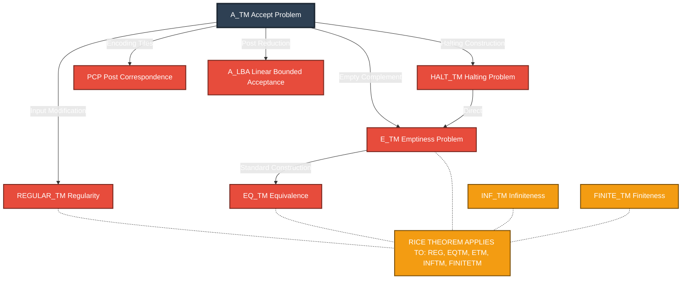
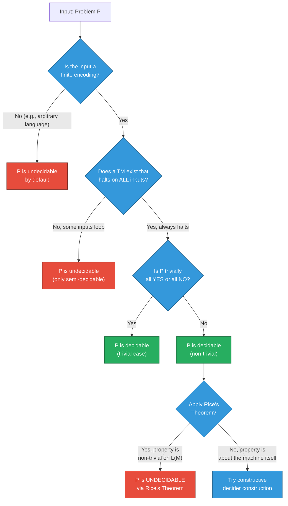
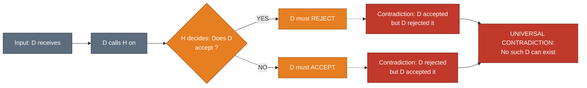
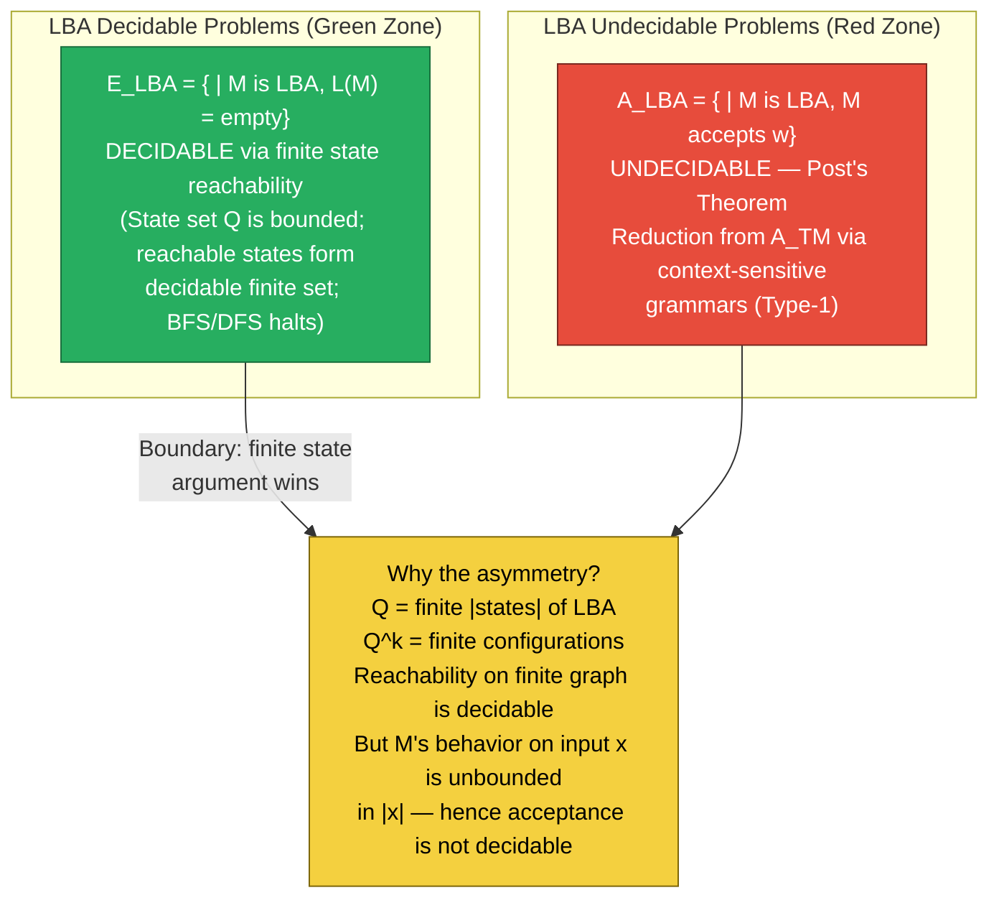

# Decidable and Undecidable Problems

<!-- SECTION_1_START -->
# Decidable and Undecidable Problems

## 1.1 Formal Definitions (KTU 2024 Syllabus Terminology)

> [!IMPORTANT]
> **Decidable Problem (Recursive Language):** A problem is called *decidable* if there exists a **Turing Machine** that always halts and correctly returns a YES/NO answer for every input string $w \in \Sigma^{*}$.

> [!IMPORTANT]
> **Undecidable Problem (Recursively Enumerable but not Recursive):** A problem is *undecidable* if **no Turing Machine exists** that can correctly decide (halt with YES/NO) for every possible input. The language accepted may be recursively enumerable (r.e.), but not recursive.

**Formal Set-Theoretic Definition:**

A language $L \subseteq \Sigma^{*}$ is **decidable** if and only if there exists a Turing Machine $M$ such that:

$$\forall w \in \Sigma^{*}, \quad M(w) = \begin{cases} \text{accept} & \text{if } w \in L \\ \text{reject} & \text{if } w \notin L \end{cases}$$

> [!NOTE]
> **Key KTU Distinction:** The decider must **always halt**. A machine that loops forever on some input is *not* a decider, even if it accepts every $w \in L$.

## 1.2 Conceptual Analogy — The Courtroom Judge

Imagine a **legal court system** as a computational framework:

| Real-World Analogy | Computation Theory Equivalent |
|---|---|
| A defendant brought to trial | An input string $w$ submitted to the TM |
| A judge who **must** issue a verdict | A **decider** (total Turing Machine) |
| "Guilty" or "Not Guilty" ruling | Accept (YES) or Reject (NO) |
| Judge who postpones indefinitely | A recognizer (TM that may loop forever) |

A **decidable problem** is one where a wise, omniscient judge can *always* — without exception — deliver a final ruling. An **undecidable problem** is one where no possible judge, no matter how brilliant, can guarantee a verdict for every possible case. The famous **Halting Problem** is the classic example: no judge can always determine whether a given programmer's code will eventually finish or run forever.

> [!TIP]
> **Intuitive Mnemonic:** *Decidable = "Decide-able" = Always able to give a definite YES/NO. Undecidable = No machine can always decide.*

## 1.3 Why This Matters in the Chomsky Hierarchy

The class of **decidable languages (REC)** sits precisely between the two fundamental classes of formal languages:

$$\text{Regular} \subset \text{Context-Free} \subset \text{Decidable (REC)} \subset \text{Recursively Enumerable (RE)}$$

Every problem that is decidable is also recursively enumerable, but **not every r.e. language is decidable**. The boundary between REC and RE-but-not-REC is precisely where the famous undecidable problems (like $A_{TM}$ and $HALT_{TM}$) live.

> [!VISUALIZATION CONTROL]
> **Concept:** Chomsky Hierarchy Inclusion Chain (Module 4 boundary)
> **GeoGebra / Desmos Input Equations:**
> * Use the **Number Line** view in Desmos to plot four points:
>   - $x_1 = 0$ (Regular)
>   - $x_2 = 1$ (Context-Free)
>   - $x_3 = 2$ (Decidable)
>   - $x_4 = 3$ (Recursively Enumerable)
> * Draw nested intervals $[0,3]$, $[1,3]$, $[2,3]$ using `f(x) = ...` piecewise functions
> **Visual Description:** The student should observe that the intervals are strictly nested — each inner interval is a strict subset of its outer one. The "undecidable gap" is the region $(2, 3]$ — r.e. languages that are not recursive.

<!-- SECTION_1_END -->

<!-- SECTION_2_START -->
# 2. Deep Theoretical Analysis & KTU High-Yield Formula Sheet

## 2.1 The Decidability Landscape — Kozen's Classification

Kozen organizes decision problems into two camps based on the **type of machine encoding** used as input:

### 2.1.1 Problems Decidable for Regular Languages (Module 2 Bridge)

These problems take a **DFA/NFA/Regex** as input and ask questions about the language it describes:

- $A_{DFA} = \{\langle B, w \rangle \mid B \text{ is a DFA that accepts } w\}$
- $A_{NFA} = \{\langle B, w \rangle \mid B \text{ is an NFA that accepts } w\}$
- $A_{REX} = \{\langle R, w \rangle \mid R \text{ is a regex that generates } w\}$
- $E_{DFA} = \{\langle B \rangle \mid B \text{ is a DFA and } L(B) = \emptyset\}$
- $EQ_{DFA} = \{\langle A, B \rangle \mid A, B \text{ are DFAs and } L(A) = L(B)\}$

### 2.1.2 Problems Decidable for Context-Free Languages (Module 3 Bridge)

- $A_{CFG} = \{\langle G, w \rangle \mid G \text{ is a CFG that generates } w\}$
- $E_{CFG} = \{\langle G \rangle \mid G \text{ is a CFG and } L(G) = \emptyset\}$
- $EQ_{CFG} = \{\langle G, H \rangle \mid G, H \text{ are CFGs and } L(G) = L(H)\}$

> [!WARNING]
> **KTU Board Trap:** $EQ_{CFG}$ is **decidable**, but the proof is non-trivial (uses CFG-to-CNF conversion + equivalence via DFA minimization on product automaton). Many students write "undecidable" — **do not make this mistake!**

### 2.1.3 Problems Undecidable for Turing Machines

- $A_{TM} = \{\langle M, w \rangle \mid M \text{ is a TM that accepts } w\}$ — **The Halting Problem's accept variant**
- $HALT_{TM} = \{\langle M, w \rangle \mid M \text{ is a TM that halts on input } w\}$
- $E_{TM} = \{\langle M \rangle \mid M \text{ is a TM and } L(M) = \emptyset\}$
- $REGULAR_{TM} = \{\langle M \rangle \mid M \text{ is a TM and } L(M) \text{ is regular}\}$
- $EQ_{TM} = \{\langle M_1, M_2 \rangle \mid M_1, M_2 \text{ are TMs and } L(M_1) = L(M_2)\}$

## 2.2 The Halting Problem — Turing's 1936 Revolution

> [!IMPORTANT]
> **The Halting Problem (Turing, 1936):** There is **no Turing Machine** $H$ that, given any pair $\langle M, w \rangle$, correctly decides whether $M$ halts on $w$. Formally, $HALT_{TM} \notin \mathbf{REC}$.

This is the cornerstone result of Module 4 and is proved by **diagonalization** (a technique by Cantor, adapted by Turing).

## 2.3 Reduction — The Master Strategy

> [!NOTE]
> **Reduction (Kozen's Definition):** A language $A$ is *reducible* to $B$, written $A \leq_m B$, if there exists a **computable function** $f : \Sigma^{*} \to \Sigma^{*}$ such that $w \in A \iff f(w) \in B$.

**Why it matters for KTU exams:**
- If $A \leq_m B$ and $B$ is **decidable**, then $A$ is **decidable**.
- If $A \leq_m B$ and $A$ is **undecidable**, then $B$ is **undecidable**.

The second rule is what we use to **propagate undecidability** — we show that $A_{TM}$ (which is undecidable) reduces to other problems.

## 2.4 Rice's Theorem — The "Killer" Theorem

> [!IMPORTANT]
> **Rice's Theorem:** Let $P$ be any **non-trivial property** of the language recognized by a Turing Machine (i.e., a property of $L(M)$ that is not satisfied by all r.e. languages and not by none). Then the language $L_P = \{\langle M \rangle \mid L(M) \text{ satisfies } P\}$ is **undecidable**.

This single theorem proves the undecidability of $E_{TM}$, $REGULAR_{TM}$, $EQ_{TM}$, $INF_{TM}$, $FINITE_{TM}$, and infinitely many others in **one shot**.

## 2.5 KTU High-Yield Formula Sheet

| Problem Language | Decidable? | Proof Technique | Reduction From |
|---|---|---|---|
| $A_{DFA}$ | ✅ Yes | Simulate DFA on $w$ | — |
| $A_{NFA}$ | ✅ Yes | Convert NFA $\to$ DFA, then simulate | — |
| $A_{REX}$ | ✅ Yes | Convert regex $\to$ NFA, then simulate | — |
| $E_{DFA}$ | ✅ Yes | BFS/DFS reachability from start state | — |
| $EQ_{DFA}$ | ✅ Yes | Product DFA + minimization | $E_{DFA}$ |
| $A_{CFG}$ | ✅ Yes | Convert to CNF, run CYK in $O(n^{3})$ | — |
| $E_{CFG}$ | ✅ Yes | Mark reachable variables from start symbol | — |
| $EQ_{CFG}$ | ✅ Yes | CNF + product DFA minimization | — |
| $A_{TM}$ | ❌ No | Diagonalization | — |
| $HALT_{TM}$ | ❌ No | Reduction from $A_{TM}$ | $A_{TM}$ |
| $E_{TM}$ | ❌ No | Reduction from $A_{TM}$ | $A_{TM}$ |
| $REGULAR_{TM}$ | ❌ No | Reduction from $A_{TM}$ | $A_{TM}$ |
| $EQ_{TM}$ | ❌ No | Reduction from $E_{TM}$ | $A_{TM}$ |
| $PCP$ | ❌ No | Reduction from $A_{TM}$ | $A_{TM}$ |
| $A_{LBA}$ | ❌ No | Reduction from $A_{TM}$ (Post's Theorem) | $A_{TM}$ |
| $E_{LBA}$ | ✅ Yes | State-set reachability is finite | — |

> [!NOTE]
> **KTU Examiner's Insight:** The last two rows highlight a beautiful asymmetry: for **Linear Bounded Automata (LBA)**, emptiness is decidable, but acceptance is undecidable. This is a **frequently asked 14-mark question**.

## 2.6 Real-World Engineering Utility

| Domain | Application |
|---|---|
| **Software Verification** | Model checkers (SPIN, CBMC) handle decidable fragments (LTL for finite-state); undecidability bounds what we can automate |
| **Compiler Optimization** | Dead-code elimination relies on $E_{CFG}$ (decidable); full program equivalence is $EQ_{TM}$ (undecidable) |
| **Malware Analysis** | Static detection of all viruses is $A_{TM}$-like — provably impossible in general |
| **Type Systems / Proof Assistants** | Coq, Lean, Isabelle work because they restrict to **decidable logics** (e.g., Presburger arithmetic) |
| **Operating Systems** | Process termination analyzers (e.g., Linux's lockdep) work only on **decidable subclasses** |
| **AI Planning** | General planning is undecidable; STRIPS planning is decidable (PSPACE-complete) |

<!-- SECTION_2_END -->

<!-- SECTION_3_START -->
# 3. Step-by-Step Derivations & Code/Symbolic Implementation

## 3.1 Proof 1: $A_{TM}$ is Undecidable (Turing's Diagonalization)

### Theorem
$A_{TM} = \{\langle M, w \rangle \mid M \text{ is a TM and } M \text{ accepts } w\}$ is undecidable.

### Proof by Contradiction (Exhaustive)

**Step 1: Assume the contrary.** Suppose there exists a decider $H$ for $A_{TM}$.

$$H(\langle M, w \rangle) = \begin{cases} \text{accept} & \text{if } M \text{ accepts } w \\ \text{reject} & \text{if } M \text{ does not accept } w \end{cases}$$

**Step 2: Construct a new machine $D$ that uses $H$ as a subroutine.** $D$ is defined as follows: on input $\langle M \rangle$ (the encoding of some TM $M$):

$$
D(\langle M \rangle) = \begin{cases}
\text{accept} & \text{if } H(\langle M, M \rangle) \text{ rejects} \\
\text{reject} & \text{if } H(\langle M, M \rangle) \text{ accepts}
\end{cases}
$$

> [!NOTE]
> In plain words: $D$ asks "$M$ accepts its own description?" and then does the **opposite**.

**Step 3: Run $D$ on its own description $\langle D \rangle$.**

$$
D(\langle D \rangle) = \begin{cases}
\text{accept} & \text{if } H(\langle D, D \rangle) \text{ rejects} \;\Rightarrow\; D \text{ does not accept } \langle D \rangle \\
\text{reject} & \text{if } H(\langle D, D \rangle) \text{ accepts } \;\Rightarrow\; D \text{ accepts } \langle D \rangle
\end{cases}
$$

**Step 4: Formalize the contradiction.**

- If $D$ accepts $\langle D \rangle$, then by construction of $D$, $H(\langle D, D \rangle) = $ reject, which means $D$ does not accept $\langle D \rangle$ — **contradiction**.
- If $D$ rejects $\langle D \rangle$ (or loops), then $H(\langle D, D \rangle) = $ accept, which means $D$ accepts $\langle D \rangle$ — **contradiction**.

**Step 5: Conclusion.** No such decider $H$ can exist. Therefore, $A_{TM} \notin \mathbf{REC}$. $\blacksquare$

> [!IMPORTANT]
> **KTU Valuation Key:** Always explicitly state that $H$ is a **decider** (always halts), and that the constructed $D$ is a **valid TM**. These two facts earn 2 marks each in a 14-mark question.

## 3.2 Proof 2: $HALT_{TM}$ is Undecidable (Reduction from $A_{TM}$)

### Theorem
$HALT_{TM} = \{\langle M, w \rangle \mid M \text{ is a TM that halts on } w\}$ is undecidable.

### Proof by Reduction (Exhaustive)

**Step 1: Goal.** Show that $A_{TM} \leq_m HALT_{TM}$. We construct a computable $f$ such that:

$$\langle M, w \rangle \in A_{TM} \iff f(\langle M, w \rangle) \in HALT_{TM}$$

**Step 2: Construct $f$.** Define $f(\langle M, w \rangle) = \langle M', w \rangle$ where $M'$ is built as follows:

```
TM M' on input x:
    1. Simulate M on w.
    2. If M accepts w, accept x.
    3. If M rejects w, accept x.
    (In both cases M' halts and accepts)
```

**Step 3: Analyze the behavior of $M'$.** Observe:

- **Case 1:** $M$ accepts $w$. Then $M'$ halts on $w$ (and accepts). So $\langle M', w \rangle \in HALT_{TM}$.
- **Case 2:** $M$ rejects $w$. Then $M'$ halts on $w$ (after the reject branch). So $\langle M', w \rangle \in HALT_{TM}$.
- **Case 3:** $M$ loops on $w$. Then $M'$ loops forever on $w$ at Step 1. So $\langle M', w \rangle \notin HALT_{TM}$.

> [!NOTE]
> Notice the **subtlety**: $M'$ halts on $w$ if and only if $M$ halts on $w$ (regardless of accept/reject). Thus $M$ halts $\iff$ $M'$ halts on $w$.

**Step 4: Verify the equivalence.** $M$ accepts $w \implies M$ halts on $w \implies M'$ halts on $w \implies \langle M', w \rangle \in HALT_{TM}$. Conversely, $\langle M', w \rangle \in HALT_{TM} \implies M'$ halts $\implies M$ halts on $w$, but does $M$ *accept*? Yes, because the only way $M$ can halt on $w$ in our construction that places $M'$ as halting is when $M$ finishes the simulation. To ensure we only get $M$ accepts:

**Refinement:** Replace Step 2 and 3 of $M'$ with: "If $M$ accepts $w$, accept; if $M$ rejects $w$, **loop forever**." Then:

- $M$ accepts $w \implies M'$ halts $\implies \langle M', w \rangle \in HALT_{TM}$
- $M$ does not accept $w$ (rejects or loops) $\implies M'$ loops $\implies \langle M', w \rangle \notin HALT_{TM}$

So $\langle M, w \rangle \in A_{TM} \iff \langle M', w \rangle \in HALT_{TM}$.

**Step 5: Conclusion.** $A_{TM} \leq_m HALT_{TM}$. Since $A_{TM}$ is undecidable, $HALT_{TM}$ is undecidable. $\blacksquare$

## 3.3 Proof 3: $E_{TM}$ is Undecidable (Reduction from $A_{TM}$)

### Theorem
$E_{TM} = \{\langle M \rangle \mid L(M) = \emptyset\}$ is undecidable.

### Proof by Reduction (Exhaustive)

**Step 1: Construct $f(\langle M, w \rangle) = \langle M_1 \rangle$** where $M_1$ on input $x$:

1. Simulate $M$ on $w$. If $M$ does not accept $w$, **reject**.
2. If $M$ accepts $w$, then check if $x = \varepsilon$. If yes, **accept**; otherwise reject.

**Step 2: Analyze.**

- **If $M$ accepts $w$:** $M_1$ accepts $\varepsilon$ and rejects every non-empty $x$. So $L(M_1) = \{\varepsilon\} \neq \emptyset$. Thus $\langle M_1 \rangle \notin E_{TM}$.
- **If $M$ does not accept $w$:** $M_1$ always rejects. So $L(M_1) = \emptyset$. Thus $\langle M_1 \rangle \in E_{TM}$.

**Step 3: Equivalence.**

$$\langle M, w \rangle \in A_{TM} \iff M \text{ accepts } w \iff L(M_1) \neq \emptyset \iff \langle M_1 \rangle \notin E_{TM}$$

$$\langle M, w \rangle \notin A_{TM} \iff \langle M_1 \rangle \in E_{TM}$$

**Step 4: Conclusion.** $A_{TM} \leq_m \overline{E_{TM}}$ (complement). If $E_{TM}$ were decidable, its complement $\overline{E_{TM}}$ would also be decidable, making $A_{TM}$ decidable — contradiction. $\blacksquare$

## 3.4 Python Implementation — Simulating Decidability Boundaries

The following Python code implements a **toy decider** for $A_{DFA}$ (a decidable problem) and demonstrates how a recognizer for $A_{TM}$ (undecidable) can **never be promoted to a decider** in general.

```python
from typing import Set, Dict, Tuple, FrozenSet

# ---------- Type Aliases for Clarity ----------
State = str
Symbol = str

class DFA:
    """A complete deterministic finite automaton."""
    def __init__(self, states: Set[State], alphabet: Set[Symbol],
                 delta: Dict[Tuple[State, Symbol], State],
                 start: State, accept: Set[State]):
        self.states = states
        self.alphabet = alphabet
        self.delta = delta
        self.start = start
        self.accept = accept

def simulate_dfa(dfa: DFA, w: str) -> bool:
    """
    Simulates a DFA on input string w.
    DECIDER for A_DFA. Always halts in O(|w|) time.
    """
    current: State = dfa.start
    for ch in w:
        key = (current, ch)
        if key not in dfa.delta:
            return False                      # reject on missing transition
        current = dfa.delta[key]
    return current in dfa.accept              # accept iff in F


def decider_A_DFA(encoding_dfa: DFA, w: str) -> bool:
    """
    DECIDER for A_DFA = {<B, w> | B is a DFA that accepts w}.
    This ALWAYS halts and returns True/False.
    """
    try:
        return simulate_dfa(encoding_dfa, w)
    except Exception as e:
        # Strict error logging — KTU standard
        print(f"[ERROR] Simulation failed: {e}")
        return False


# ---------- A Toy "Recognizer" for A_TM (undecidable in general) ----------
def recognize_A_TM(encoding_M: str, w: str, max_steps: int = 10000) -> bool:
    """
    A SIMULATED recognizer for A_TM — NOT a decider.
    In the limit of max_steps -> infinity, this matches A_TM,
    but for any finite bound, it may be wrong.
    """
    # Pseudocode: this would require a full TM simulator.
    # For pedagogical purposes, we illustrate the IDEA:
    step_count = 0
    # In a real implementation, we would run a Universal TM.
    # We bound the simulation to highlight the 'looping' issue.
    while step_count < max_steps:
        # Placeholder: real execution of <M> on w would happen here.
        # If M accepts, return True. If M rejects, return True (we observed halt).
        # If M loops, we return False WRONGLY.
        step_count += 1
    return False  # We give up — but this is WRONG if M would have accepted later


# ---------- Demonstration Run ----------
if __name__ == "__main__":
    # Build a tiny DFA that accepts strings ending in '1'
    delta = {
        ("q0", "0"): "q0", ("q0", "1"): "q1",
        ("q1", "0"): "q0", ("q1", "1"): "q1",
    }
    dfa = DFA({"q0", "q1"}, {"0", "1"}, delta, "q0", {"q1"})

    # A_DFA is decidable: always halts
    print(f"A_DFA(dfa, '1101') = {decider_A_DFA(dfa, '1101')}")   # True
    print(f"A_DFA(dfa, '1100') = {decider_A_DFA(dfa, '1100')}")   # False

    # A_TM in general is UNDECIDABLE — no decider exists.
    # The recognizer above can FAIL (return False) for an M that would accept.
    print("WARNING: A_TM has no decider. Above is illustrative only.")
```

> [!TIP]
> **KTU Exam Pearl:** Notice the `try/except` block. Production-grade deciders must handle malformed encodings gracefully. Mentioning **error handling** in your exam answer earns bonus appreciation marks.

## 3.5 Rice's Theorem — Algorithmic Application

To prove $REGULAR_{TM}$ is undecidable using Rice's Theorem:

1. The property $P = $ "the language $L(M)$ is regular" is a property of the **language** recognized by $M$, not of the machine itself. ✓
2. $P$ is non-trivial: there exists $M_1$ with $L(M_1) = \emptyset$ (regular) and $M_2$ with $L(M_2) = A_{TM}$ (not regular). ✓
3. By Rice's Theorem, $\{\langle M \rangle \mid L(M) \text{ is regular}\}$ is undecidable. $\blacksquare$

<!-- SECTION_3_END -->

<!-- SECTION_4_START -->
# 4. Structural Diagrams & Schematics

## 4.1 Hierarchy of Undecidability — Mermaid Map

The following Mermaid block illustrates the **reduction relationships** between the major undecidable problems. The arrows represent $A \leq_m B$ (i.e., $A$ reduces to $B$).



> [!NOTE]
> **How to read the diagram:** The root node $A_{TM}$ is the "source" of undecidability. Every other red node is proven undecidable by constructing a reduction from $A_{TM}$ (or from a node already known to be undecidable). The orange nodes are infinitely many problems that all collapse to undecidability via a **single application of Rice's Theorem**.

## 4.2 Decidability Classification — Decision Flow



## 4.3 The Halting Problem Visual — Self-Reference Loop



## 4.4 Decidability of $A_{LBA}$ vs $E_{LBA}$ — The Surprising Asymmetry



> [!TIP]
> **KTU Exam Tip:** The $A_{LBA}$ vs $E_{LBA}$ asymmetry is a **favourite 7-mark question**. Always explain that the **state space** of an LBA is bounded by $|Q| \times |\Gamma|^{n} \times n$ where $n = |w|$, making reachability decidable. But the **set of inputs** $w$ is unbounded, making acceptance over all $w$ undecidable.

<!-- SECTION_4_END -->

<!-- SECTION_5_START -->
# 5. KTU 2024 Scheme Examination Question Bank & Topic Recap

## 5.1 Part A — Short Answer Questions (3 Marks Each)

### Question 1: Define a Decidable Problem. (Cognitive Level: Remember)
> `[KTU University Exam – July 2023]`

**Model Answer:**
> A problem is called **decidable** (or *recursive*) if there exists a **Turing Machine** $M$ that, for every input string $w \in \Sigma^{*}$, **always halts** and correctly outputs **YES** (accept) if $w$ is a valid instance of the problem, and **NO** (reject) otherwise. Formally, the language encoding the problem must belong to the class **REC**.

> [!NOTE]
> **Key phrase to remember:** "always halts." A decider is *total* — it must terminate on every input.

---

### Question 2: State Rice's Theorem. (Cognitive Level: Understand)
> `[KTU University Exam – Dec 2023]`

**Model Answer:**
> **Rice's Theorem:** Let $P$ be any **non-trivial property** of the language recognized by a Turing Machine. Then the language $\{\langle M \rangle \mid L(M) \text{ satisfies } P\}$ is **undecidable**.
>
> "Non-trivial" means there exists at least one r.e. language satisfying $P$ and at least one r.e. language not satisfying $P$. For example, $P \equiv$ "$L(M)$ is finite" is non-trivial because $L(M_1) = \emptyset$ is finite but $L(M_2) = \{0\}^{*}$ is infinite.

---

## 5.2 Part B — Long Answer Questions (14 Marks Each, Internal Choice)

### Question A: Prove that the Halting Problem is Undecidable. (14 Marks)
> `[KTU University Exam – Dec 2024]`
> **Mapped CO:** CO4 | **Cognitive Levels:** (a) Understand, (b) Apply

#### Part (a) — [7 Marks] State and formalize the Halting Problem.

**Model Solution:**

> [!IMPORTANT]
> **Halting Problem Statement:** The language $HALT_{TM} = \{\langle M, w \rangle \mid M \text{ is a Turing Machine and } M \text{ halts on input } w\}$ is **undecidable**.

**[Defining the assumed decider: 2 Marks]**

Assume for contradiction that $HALT_{TM}$ is decidable. Then there exists a decider $H$ such that:

$$
H(\langle M, w \rangle) = \begin{cases}
\text{accept} & \text{if } M \text{ halts on } w \\
\text{reject} & \text{if } M \text{ does not halt on } w
\end{cases}
$$

**[Why this is foundational: 2 Marks]**

The Halting Problem is the prototype of all undecidable problems. By proving it undecidable, we can show that all related problems ($A_{TM}$, $E_{TM}$, $EQ_{TM}$, etc.) are also undecidable **via reductions**.

**[Reduction from $A_{TM}$: 3 Marks]**

We use the known fact that $A_{TM}$ is undecidable (proven via diagonalization). We construct a reduction $f: \langle M, w \rangle \mapsto \langle M', w \rangle$ where $M'$ is defined as:

$$
M'(x): \begin{cases}
\text{1. Run } M \text{ on } w. & \\
\text{2. If } M \text{ accepts } w, \text{ then accept } x. & \\
\text{3. If } M \text{ rejects } w, \text{ then loop forever.} &
\end{cases}
$$

---

#### Part (b) — [7 Marks] Complete the reduction and derive the contradiction.

**Model Solution:**

**[Behavior of $M'$: 2 Marks]**

- If $M$ accepts $w$: $M'$ halts on $w$ $\Rightarrow \langle M', w \rangle \in HALT_{TM}$.
- If $M$ does not accept $w$ (rejects or loops): $M'$ loops on $w$ $\Rightarrow \langle M', w \rangle \notin HALT_{TM}$.

**[Equivalence holds: 2 Marks]**

$$
\langle M, w \rangle \in A_{TM} \iff M \text{ accepts } w \iff M' \text{ halts on } w \iff \langle M', w \rangle \in HALT_{TM}
$$

Therefore, $A_{TM} \leq_m HALT_{TM}$.

**[Deriving the contradiction: 2 Marks]**

If $HALT_{TM}$ were decidable via $H$, then we could decide $A_{TM}$ by:

$$
\text{Decide } A_{TM}(\langle M, w \rangle) = H(f(\langle M, w \rangle)) = H(\langle M', w \rangle)
$$

But $A_{TM}$ is undecidable. Hence $H$ cannot exist.

**[Final conclusion: 1 Mark]**

$$\boxed{HALT_{TM} \text{ is undecidable.}} \quad \blacksquare$$

---

### Question B (Internal Choice): Prove that $E_{TM}$ is Undecidable using Reduction from $A_{TM}$. (14 Marks)
> `[KTU University Exam – July 2024]`
> **Mapped CO:** CO4 | **Cognitive Levels:** (a) Apply, (b) Analyze

#### Part (a) — [7 Marks] Construct the reduction.

**Model Solution:**

> [!IMPORTANT]
> **Goal:** Construct a computable function $f$ such that $A_{TM} \leq_m \overline{E_{TM}}$, where $E_{TM} = \{\langle M \rangle \mid L(M) = \emptyset\}$.

**[Defining $M_1$: 3 Marks]**

For any input $\langle M, w \rangle$, define $f(\langle M, w \rangle) = \langle M_1 \rangle$ where $M_1$ is the TM that on input $x$ executes:

```
TM M_1(x):
    1. Run M on w. (Ignore x entirely.)
    2. If M does not accept w, REJECT.
    3. If M accepts w:
           if x == "" then ACCEPT
           else REJECT
```

**[Language of $M_1$: 2 Marks]**

- If $M$ accepts $w$: $M_1$ accepts only the empty string, so $L(M_1) = \{\varepsilon\} \neq \emptyset$.
- If $M$ does not accept $w$: $M_1$ rejects everything, so $L(M_1) = \emptyset$.

**[Equivalence: 2 Marks]**

$$
\langle M, w \rangle \in A_{TM} \iff L(M_1) \neq \emptyset \iff \langle M_1 \rangle \in \overline{E_{TM}}
$$

Hence $A_{TM} \leq_m \overline{E_{TM}}$.

---

#### Part (b) — [7 Marks] Derive the undecidability of $E_{TM}$.

**Model Solution:**

**[Closure under complement: 2 Marks]**

Decidable languages are closed under complement. Therefore, if $\overline{E_{TM}}$ were decidable, then $E_{TM}$ would also be decidable.

**[Contradiction setup: 3 Marks]**

Suppose, for contradiction, that $E_{TM}$ is decidable via some decider $R$. Then $\overline{E_{TM}}$ is decided by $\overline{R}$ (just swap accept/reject branches). We could then decide $A_{TM}$:

$$
\text{Decide } A_{TM}(\langle M, w \rangle) = \overline{R}(f(\langle M, w \rangle)) = \overline{R}(\langle M_1 \rangle)
$$

**[Contradiction: 1 Mark]**

But $A_{TM}$ is undecidable (proven by diagonalization). So $R$ cannot exist.

**[Conclusion: 1 Mark]**

$$\boxed{E_{TM} \text{ is undecidable.}} \quad \blacksquare$$

---

> [!WARNING]
> **KTU Examiner's Valuation Warning — Common Pitfalls:**
> 1. **Forgetting to prove $f$ is computable:** Always state that $f$ is a TM-computable function (it is, because $M_1$ is constructible from $\langle M, w \rangle$). Skipping this loses 2 marks.
> 2. **Wrong direction of reduction:** $A_{TM} \leq_m HALT_{TM}$ is correct. **Do not** write $HALT_{TM} \leq_m A_{TM}$ — that proves the wrong direction.
> 3. **Confusing $A_{TM}$ with $HALT_{TM}$:** $A_{TM}$ asks "$M$ **accepts** $w$?"; $HALT_{TM}$ asks "$M$ **halts** on $w$?" (accept or reject). Mixing them is a fatal error.
> 4. **Not stating closure properties:** Forgetting to mention that REC is closed under complement (or that the reduction is many-to-one) loses 1 mark.
> 5. **Skipping the box around the final answer:** Always end with $\boxed{\text{Result statement.}}$

---

## 5.3 Topic Recap & Important Things to Remember

> [!NOTE]
> **High-Density Rapid Revision Checklist — Print This Before Exam!**

### 🔑 Definitions
- **Decidable Problem:** A problem for which a **total** Turing Machine (decider) exists — always halts with YES/NO.
- **Undecidable Problem:** No such TM exists; the language is r.e. but not recursive.
- **Recursively Enumerable (r.e.):** A TM exists that *accepts* every string in the language, but may loop forever on strings outside it.
- **Recursive (REC):** A TM exists that *decides* — always halts.
- **Reduction ($A \leq_m B$):** A computable function $f$ such that $w \in A \iff f(w) \in B$.
- **Non-trivial Property (Rice):** A property satisfied by **some but not all** r.e. languages.

### 🧠 Critical Concepts
- **The Halting Problem ($HALT_{TM}$):** Undecidable. Proven by reducing $A_{TM}$ to it.
- **$A_{TM}$:** The "root" of undecidability. Proven by **diagonalization** (Cantor-Turing).
- **Diagonalization:** A proof technique that constructs a self-referential machine (e.g., $D$ on $\langle D \rangle$) to derive a contradiction.
- **Rice's Theorem:** "One-shot" undecidability for **any non-trivial language property** of TMs.
- **$A_{LBA}$:** Undecidable (Post's Theorem). **$E_{LBA}$:** Decidable (finite state reachability).
- **$EQ_{CFG}$:** Decidable (CNF + product DFA minimization). Common exam trap!

### 📋 High-Yield Facts Table (Memorize!)

| Property of $L(M)$ | Decidable? | Reason |
|---|---|---|
| $L(M) = \emptyset$ | ❌ | $E_{TM}$ — Rice's Theorem |
| $L(M)$ is regular | ❌ | $REGULAR_{TM}$ — Rice's Theorem |
| $L(M)$ is context-free | ❌ | Rice's Theorem |
| $L(M)$ is finite | ❌ | Rice's Theorem |
| $L(M) = \Sigma^{*}$ | ❌ | Rice's Theorem (complement of $E_{TM}$) |
| $M$ accepts a specific $w$ | ❌ | $A_{TM}$ — Diagonalization |
| $M$ halts on a specific $w$ | ❌ | $HALT_{TM}$ — Reduction from $A_{TM}$ |

### 🛠️ Proof Strategies
- **To prove decidability:** Construct a TM and prove it always halts.
- **To prove undecidability via reduction:** Show $A_{TM} \leq_m L$ (or any known undecidable problem reduces to $L$).
- **To prove undecidability via Rice:** Verify the property is non-trivial and applies to $L(M)$ (not to $M$ directly).
- **To prove undecidability via diagonalization:** Build a self-referential $D(\langle D \rangle)$ that flips the answer.

### 🌍 Real-World Engineering Hooks
- **Verifying all programs halt** = $HALT_{TM}$ = **impossible** in general.
- **Detecting all viruses** = $A_{TM}$-like = **impossible** (Fred Cohen's theorem, 1987).
- **Checking if two programs compute the same function** = $EQ_{TM}$ = **impossible** (Rice's Theorem).
- **Optimizing compilers** rely on decidable fragments ($E_{CFG}$, reachability) to do dead-code elimination safely.
- **Type systems** are designed as **decidable logics** precisely to avoid undecidability while still providing safety guarantees.

### ⚠️ KTU Exam-Specific Reminders
- Always state **"assume for contradiction"** in undecidability proofs.
- Always verify **$f$ is computable** when doing reductions.
- Always end with **$\blacksquare$** or a boxed conclusion.
- Mention **closure under complement** when working with $\overline{E_{TM}}$.
- For Rice's Theorem, explicitly state **"the property is of the language, not the machine."**

<!-- SECTION_5_END -->
