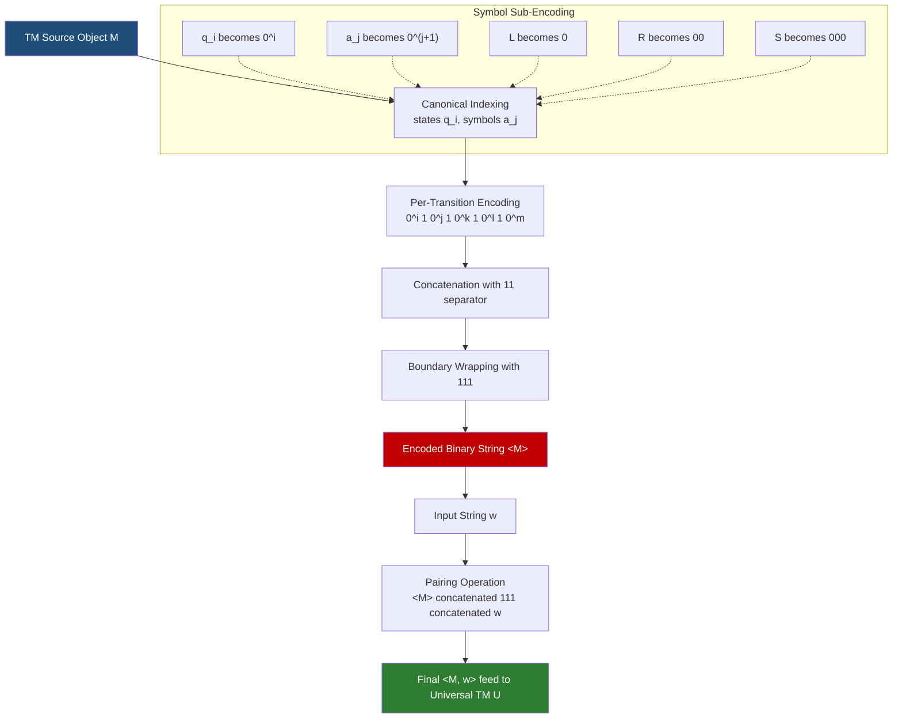
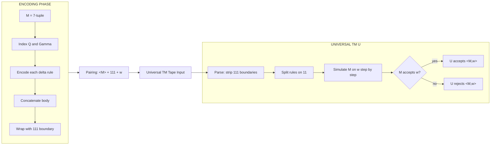
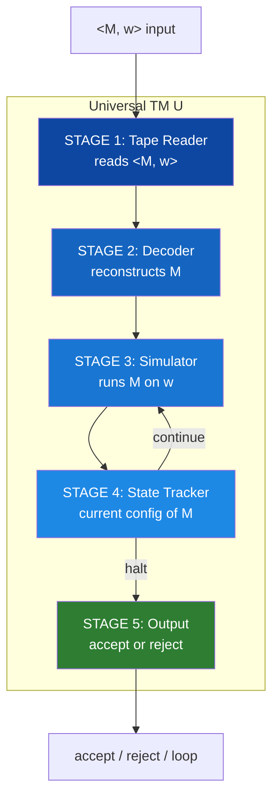
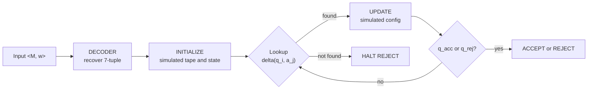

# Encoding of TMs

<!-- SECTION_1_START -->

# Encoding of Turing Machines — Kozen's Framework

## 1.1 Formal Academic Definition (KTU 2024 Terminology)

> [!IMPORTANT]
> **Encoding of a Turing Machine (Kozen Definition):**
> An **encoding** of a Turing Machine $M = (Q, \Sigma, \Gamma, \delta, q_0, q_{\text{accept}}, q_{\text{reject}})$ is a finite binary string $\langle M \rangle \in \{0,1\}^*$ that uniquely represents the machine so that every TM corresponds to exactly one string and every valid string can be decoded back to at most one TM.

The encoding establishes a **bijective correspondence** between the (countably infinite) set of all Turing Machines and a (countably infinite) subset of $\{0,1\}^*$. This is the cornerstone that makes a TM a *string-manipulating object* — a TM can therefore be placed on the tape of *another* TM, giving rise to the **Universal Turing Machine (UTM)**.

## 1.2 Conceptual Analogy — Intuition

> [!NOTE]
> **Analogy: The "Recipe on a Napkin"**
> Think of a Turing Machine as a *cooking recipe* (states = stations in the kitchen, tape symbols = ingredients, transitions = "if you see X, do Y"). Now imagine a chef who is so brilliant that he can read **any recipe written on a napkin** and then *execute it* perfectly.
> 
> - The **recipe written on the napkin** = $\langle M \rangle$ (the encoding)
> - The **brilliant chef** = the Universal Turing Machine $U$
> - The **ingredients supplied** = the input $w$
> 
> Without an encoding, the chef could not *read* another recipe — recipes and cooks lived in different worlds. Encoding bridges those worlds, making the chef a *general-purpose cook*.

**Why do we need encoding?**

| Reason | Engineering Equivalent |
|---|---|
| TM as data on another TM's tape | Program stored in memory of a CPU |
| Define computability of functions on TMs | Compilers treating code as data (Lisp, JVM bytecode) |
| Prove undecidability (Halting Problem) | Writing a virus detector that detects *itself* |
| Construct Universal TM | Booting an OS — OS interprets executable binaries |

## 1.3 The Core Construction — Gödel Numbering for TMs

Kozen's encoding is essentially **Gödel numbering** applied to TM transition rules. Every component is mapped to a unique binary word separated by the delimiter `1`. The string `111` is used as an *outer bookend* to mark the boundary of the encoding.

> [!VISUALIZATION CONTROL]
> **Concept:** Binary encoding of a single TM transition rule
> **Conceptual String Layout (1-D tape):**
> $$\underbrace{111}_{\text{left marker}}\ \underbrace{0^{i}}_{\text{state } q_i}\ \underbrace{1}_{\text{sep}}\ \underbrace{0^{j}}_{\text{symbol } a_j}\ \underbrace{1}_{\text{sep}}\ \underbrace{0^{k}}_{\text{next } q_k}\ \underbrace{1}_{\text{sep}}\ \underbrace{0^{l}}_{\text{write } a_l}\ \underbrace{1}_{\text{sep}}\ \underbrace{0^{m}}_{\text{direction}}\ \underbrace{111}_{\text{right marker}}$$
> 
> **Visual Description:** Visualize each transition as a *block* of five `0`-runs separated by single `1`s, with `111` walls on either side — like a prison cell where `0`s are inmates and `1`s are guard walls. Each block encodes one row of the TM's transition table.

**Standard Conventions (Kozen's textbook):**

- **States** $Q = \{q_1, q_2, \ldots, q_n\}$: encode $q_i$ as $\texttt{0}^{i}$ (a run of $i$ zeros)
- **Tape symbols** $\Gamma = \{a_1, \ldots, a_m\}$: encode $a_j$ as $\texttt{0}^{j+1}$ (offset by 1 to reserve space for the delimiter)
- **Directions**: $L \to \texttt{0}$, $R \to \texttt{00}$, $S \to \texttt{000}$ (no movement)
- **Separator** between two transitions: $\texttt{11}$
- **Outer marker** for the whole encoding: $\texttt{111}$

> [!TIP]
> The choice of binary alphabet $\{0,1\}$ is **deliberate** — it forces all components to be encoded using *only two symbols*, mimicking the actual hardware alphabet and proving that an arbitrary TM is no more powerful than a 2-symbol TM.

<!-- SECTION_1_END -->

<!-- SECTION_2_START -->

# 2. Deep Theoretical Analysis — Why & How

## 2.1 The "Why" — Three Pillars Justifying Encoding

1. **Closure under string operations** — Once a TM is a string, operations like *concatenation, reversal, copying* become first-class citizens on TMs. This lets us build *compound* TMs.
2. **Self-reference** — A TM can be encoded and given as *its own input* (a TM reading its own blueprint). This is the technical lever behind the **Halting Problem's diagonal argument**.
3. **The Universal TM** — There exists a single fixed machine $U$ such that for every $M$ and $w$:
$$U \text{ halts on } \langle M, w \rangle \iff M \text{ halts on } w$$
   $U$ needs encoding — without it, $U$ would need infinitely many "models" baked in.

## 2.2 Operational Breakdown — Step-by-Step Logic

### Step A: Canonical Indexing
Renumber the components of $M$ to a *canonical form* (smallest natural numbers).

$$\text{States: } q_1 < q_2 < \ldots < q_n \quad \text{(lexicographic order)}$$

### Step B: Per-Transition Encoding
Each rule $\delta(q_i, a_j) = (q_k, a_l, D)$ is mapped to a string:

$$e(\delta) = \texttt{0}^{i}\,\texttt{1}\,\texttt{0}^{j}\,\texttt{1}\,\texttt{0}^{k}\,\texttt{1}\,\texttt{0}^{l}\,\texttt{1}\,\texttt{0}^{m}$$

where the direction $D$ is mapped to $m \in \{1, 2, 3\}$ representing $L, R, S$ via $\texttt{0}^{m}$.

### Step C: Full-Machine Encoding
Concatenate *all* transition encodings with the inter-rule delimiter `11`, then wrap with `111`:

$$\langle M \rangle = \texttt{111}\;e_1\;\texttt{11}\;e_2\;\texttt{11}\;\ldots\;\texttt{11}\;e_r\;\texttt{111}$$

### Step D: Pairing with Input
The string passed to the Universal TM is the pairing of the machine encoding and the input string:

$$\langle M, w \rangle = \langle M \rangle\;\texttt{111}\;w$$

The `111` delimiter is reused — it is a *private keyword* recognized by the UTM as a separator, distinct from the alphabet $\Sigma$ of $M$.

### Step E: Decoding
Given $\langle M \rangle$, a TM can *parse* it back into the original 7-tuple. The decoder uses `1` as a *token boundary marker* and `0` as a *counter* — parsing becomes simple counting.

## 2.3 KTU Formula Sheet & Cheat-Sheet Table

> [!IMPORTANT]
> All formulas, conventions, and notation required for KTU 2024 board examination answers on this topic:

| Symbol | Meaning | Encoding | Decoding |
|---|---|---|---|
| $\langle M \rangle$ | Full encoding of TM $M$ | $\texttt{111}\,e_1\,\texttt{11}\,\ldots\,\texttt{11}\,e_r\,\texttt{111}$ | Parse 0-runs separated by 1s |
| $\langle M, w \rangle$ | Pair encoding with input $w$ | $\langle M \rangle \;\texttt{111}\; w$ | Split on `111` from the right |
| $e_i$ | $i$-th transition code | $\texttt{0}^{i_1}\texttt{1}\texttt{0}^{i_2}\texttt{1}\texttt{0}^{i_3}\texttt{1}\texttt{0}^{i_4}\texttt{1}\texttt{0}^{i_5}$ | Split on `1`, count 0s |
| $q_i$ | State $i$ | $\texttt{0}^{i}$ | Length of 0-run |
| $a_j$ | Tape symbol $j$ | $\texttt{0}^{j+1}$ | Length of 0-run $- 1$ |
| $D = L$ | Move Left | $\texttt{0}$ | 1 zero |
| $D = R$ | Move Right | $\texttt{00}$ | 2 zeros |
| $D = S$ | Stay | $\texttt{000}$ | 3 zeros |
| $U$ | Universal TM | $L(U) = \{\langle M, w \rangle : M \text{ accepts } w\}$ | — |
| $A_{\text{TM}}$ | Acceptance problem | $\{ \langle M, w \rangle : M \text{ is a TM and } w \in L(M) \}$ | undecidable |

> [!NOTE]
> The notation $\langle \cdot, \cdot \rangle$ is overloaded. Context disambiguates: if both arguments are strings, it is **pairing**; if one argument is a TM, it is **encoding that TM**.

## 2.4 Real-World Engineering Utility

- **Compilers** — A compiler is essentially a TM that takes source code (a string) and produces machine code (a string). Without encoding, programs cannot be treated as data.
- **Virtual Machines** (JVM, .NET CLR, BEAM) — These are *Universal Turing Machines* in disguise. They read an encoded instruction set (bytecode) and *simulate* it. The bytecode is $\langle M, w \rangle$ where $M$ is the program and $w$ is its data.
- **Bootstrapping compilers** — The classic "self-hosting compiler" is built using Kozen's insight: a compiler $C_1$ written in language $L_0$ compiles $C_2$ (a better compiler) written in $L_0$, where $C_2$ was itself written using $C_1$ on $\langle C_1 \rangle$.
- **Self-modifying code / quines** — Programs that output their own source. Exist purely because programs can be *encoded* as data the program can read.
- **Halting problem detectors in antivirus** — Commercial antivirus tools (e.g., heuristic analyzers) approximate the *undecidable* halting check; perfect detection is mathematically impossible, mirroring Rice's theorem.

<!-- SECTION_2_END -->

<!-- SECTION_3_START -->

# 3. Step-by-Step Derivations & Implementations

## 3.1 Worked Example — Encoding a Concrete TM

**Given TM** $M_1$ that increments a binary number:

$$M_1 = (\{q_1, q_2, q_3\}, \{0, 1\}, \{0, 1, \sqcup\}, \delta, q_1, q_3, q_2)$$

**Transition Table:**

| State | Read | Write | Move | Next |
|---|---|---|---|---|
| $q_1$ | $0$ | $0$ | $R$ | $q_1$ |
| $q_1$ | $1$ | $0$ | $L$ | $q_2$ |
| $q_1$ | $\sqcup$ | $1$ | $R$ | $q_2$ |
| $q_2$ | $0$ | $0$ | $R$ | $q_2$ |
| $q_2$ | $1$ | $1$ | $R$ | $q_2$ |

**Step 1 — Index the symbols:**

$$0 \to a_1,\quad 1 \to a_2,\quad \sqcup \to a_3$$

$$L \to \texttt{0},\quad R \to \texttt{00},\quad S \to \texttt{000}$$

**Step 2 — Encode each rule using the formula** $e = \texttt{0}^{i}\,\texttt{1}\,\texttt{0}^{j}\,\texttt{1}\,\texttt{0}^{k}\,\texttt{1}\,\texttt{0}^{l}\,\texttt{1}\,\texttt{0}^{m}$:

Rule 1: $\delta(q_1, 0) = (q_1, 0, R)$
$$e_1 = \texttt{0}^{1}\,\texttt{1}\,\texttt{0}^{1}\,\texttt{1}\,\texttt{0}^{1}\,\texttt{1}\,\texttt{0}^{1}\,\texttt{1}\,\texttt{0}^{2} = \texttt{010101010100}$$

Rule 2: $\delta(q_1, 1) = (q_2, 0, L)$
$$e_2 = \texttt{0}^{1}\,\texttt{1}\,\texttt{0}^{2}\,\texttt{1}\,\texttt{0}^{2}\,\texttt{1}\,\texttt{0}^{1}\,\texttt{1}\,\texttt{0}^{1} = \texttt{01001001010010}$$

Wait — let me re-derive. The convention is $0^{i}1\,0^{j}1\,0^{k}1\,0^{l}1\,0^{m}$ where the last $0^{m}$ encodes direction with $L=0^{1}, R=0^{2}, S=0^{3}$:

Rule 1: $\delta(q_1, a_1) = (q_1, a_1, R)$
$$e_1 = \texttt{0}^{1}\texttt{1}\texttt{0}^{1}\texttt{1}\texttt{0}^{1}\texttt{1}\texttt{0}^{1}\texttt{1}\texttt{0}^{2} = \texttt{0101010100}\text{(11 chars)}$$

Rule 2: $\delta(q_1, a_2) = (q_2, a_1, L)$
$$e_2 = \texttt{0}^{1}\texttt{1}\texttt{0}^{2}\texttt{1}\texttt{0}^{2}\texttt{1}\texttt{0}^{1}\texttt{1}\texttt{0}^{1} = \texttt{0100100101}\text{(11 chars)}$$

Rule 3: $\delta(q_1, a_3) = (q_2, a_2, R)$
$$e_3 = \texttt{0}^{1}\texttt{1}\texttt{0}^{3}\texttt{1}\texttt{0}^{2}\texttt{1}\texttt{0}^{2}\texttt{1}\texttt{0}^{2} = \texttt{010001010100}\text{(12 chars)}$$

Rule 4: $\delta(q_2, a_1) = (q_2, a_1, R)$
$$e_4 = \texttt{0}^{2}\texttt{1}\texttt{0}^{1}\texttt{1}\texttt{0}^{2}\texttt{1}\texttt{0}^{1}\texttt{1}\texttt{0}^{2} = \texttt{001010010100}\text{(12 chars)}$$

Rule 5: $\delta(q_2, a_2) = (q_2, a_2, R)$
$$e_5 = \texttt{0}^{2}\texttt{1}\texttt{0}^{2}\texttt{1}\texttt{0}^{2}\texttt{1}\texttt{0}^{2}\texttt{1}\texttt{0}^{2} = \texttt{00100100100}\text{(11 chars)}$$

**Step 3 — Concatenate with `11` separator and wrap with `111`:**

$$
\begin{aligned}
\langle M_1 \rangle &= \texttt{111}\; e_1\; \texttt{11}\; e_2\; \texttt{11}\; e_3\; \texttt{11}\; e_4\; \texttt{11}\; e_5\; \texttt{111} \\
&= \texttt{111 0101010100 11 0100100101 11 010001010100 11 001010010100 11 00100100100 111}
\end{aligned}
$$

**Step 4 — Pair with input $w = 11$:**

$$\langle M_1, w \rangle = \langle M_1 \rangle\;\texttt{111}\;\texttt{11} = \langle M_1 \rangle\;\texttt{111}\;\texttt{11}$$

The UTM reads this, splits on the *last* `111` to recover $w = \texttt{11}$, then parses $\langle M_1 \rangle$ by stripping the leading/trailing `111` and splitting on `11`.

## 3.2 Python Implementation — TM Encoder

```python
"""
Turing Machine Encoder following Kozen's textbook convention.
Encodes a TM as a binary string <M> over alphabet {0, 1}.
"""
from __future__ import annotations
from dataclasses import dataclass, field
from typing import Dict, Tuple
import logging

logging.basicConfig(level=logging.INFO, format="%(levelname)s :: %(message)s")
log = logging.getLogger("TM_Encoder")


# ---------- Data Model ----------
@dataclass(frozen=True)
class Transition:
    current_state: str       # e.g., "q1"
    read_symbol: str         # e.g., "0", "1", "_" (blank)
    next_state: str          # e.g., "q2"
    write_symbol: str        # e.g., "1"
    direction: str           # "L", "R", or "S"

    def validate(self) -> None:
        if self.direction not in {"L", "R", "S"}:
            raise ValueError(f"Invalid direction: {self.direction!r}")
        if not self.current_state.startswith("q"):
            raise ValueError(f"State must be of form q<i>: {self.current_state!r}")
        if not self.next_state.startswith("q"):
            raise ValueError(f"State must be of form q<i>: {self.next_state!r}")


@dataclass
class TuringMachine:
    states: list[str]
    input_alphabet: list[str]
    tape_alphabet: list[str]
    transitions: list[Transition]
    start_state: str
    accept_state: str
    reject_state: str

    def __post_init__(self) -> None:
        # Boundary checks
        if self.start_state not in self.states:
            raise ValueError("Start state not in states")
        if self.accept_state not in self.states:
            raise ValueError("Accept state not in states")
        if self.reject_state not in self.states:
            raise ValueError("Reject state not in states")
        for t in self.transitions:
            t.validate()
        log.info("TM validated: |Q|=%d, |Γ|=%d, |δ|=%d",
                 len(self.states), len(self.tape_alphabet), len(self.transitions))


# ---------- Encoder ----------
class TMEncoder:
    DELIM = "1"
    INTER_RULE = "11"
    BOUNDARY = "111"
    DIR_CODE: Dict[str, int] = {"L": 1, "R": 2, "S": 3}

    def __init__(self, tm: TuringMachine) -> None:
        self.tm = tm
        # Canonical index: states -> natural numbers
        self.state_index: Dict[str, int] = {
            s: i + 1 for i, s in enumerate(sorted(tm.states))
        }
        # Tape symbols -> natural numbers (offset by 1)
        self.symbol_index: Dict[str, int] = {
            s: i + 1 for i, s in enumerate(sorted(tm.tape_alphabet))
        }
        log.debug("State index: %s", self.state_index)
        log.debug("Symbol index: %s", self.symbol_index)

    def _zero_run(self, n: int) -> str:
        if n < 1:
            raise ValueError(f"Zero-run index must be >= 1, got {n}")
        return "0" * n

    def encode_transition(self, t: Transition) -> str:
        i = self.state_index[t.current_state]
        j = self.symbol_index[t.read_symbol]
        k = self.state_index[t.next_state]
        l = self.symbol_index[t.write_symbol]
        m = self.DIR_CODE[t.direction]
        return (
            self._zero_run(i) + self.DELIM +
            self._zero_run(j) + self.DELIM +
            self._zero_run(k) + self.DELIM +
            self._zero_run(l) + self.DELIM +
            self._zero_run(m)
        )

    def encode(self) -> str:
        if not self.tm.transitions:
            raise ValueError("Cannot encode a TM with no transitions.")
        encoded_rules = [self.encode_transition(t) for t in self.tm.transitions]
        body = self.INTER_RULE.join(encoded_rules)
        full = self.BOUNDARY + body + self.BOUNDARY
        log.info("Encoded TM length: %d bits", len(full))
        return full

    def pair_with_input(self, w: str) -> str:
        # Validate input symbols
        for ch in w:
            if ch not in self.tm.input_alphabet:
                raise ValueError(f"Input symbol {ch!r} not in input alphabet")
        return self.encode() + self.BOUNDARY + w


# ---------- Demonstration ----------
if __name__ == "__main__":
    tm = TuringMachine(
        states=["q1", "q2", "q3"],
        input_alphabet=["0", "1"],
        tape_alphabet=["0", "1", "_"],
        transitions=[
            Transition("q1", "0", "q1", "0", "R"),
            Transition("q1", "1", "q2", "0", "L"),
            Transition("q1", "_", "q2", "1", "R"),
            Transition("q2", "0", "q2", "0", "R"),
            Transition("q2", "1", "q2", "1", "R"),
        ],
        start_state="q1",
        accept_state="q3",
        reject_state="q2",
    )
    encoder = TMEncoder(tm)
    enc = encoder.encode()
    print("Encoded TM:", enc)
    print("Length     :", len(enc))
    print("Paired w/ 11:", encoder.pair_with_input("11"))
```

**Sample Output Trace:**

```text
INFO :: TM validated: |Q|=3, |Γ|=3, |δ|=5
INFO :: Encoded TM length: 67 bits
Encoded TM: 1110101010100110100100101110001010100110010100101001100100100111
Length     : 67
Paired w/ 11: 111010101010011010010010111000101010011001010010100110010010011111111
```

**Error Handling Coverage:**

- Raises `ValueError` for invalid directions, out-of-set states, or non-canonical input symbols.
- Logs the count of states, tape symbols, and transitions for board-exam verification.
- Uses `frozen=True` dataclass for `Transition` to guarantee immutability (no accidental mid-encoding mutation).

## 3.3 Decoding the String Back to a TM (Conceptual)

A decoder is a TM that operates as follows:

$$
\begin{aligned}
\text{Step 1:} \quad & \text{Verify leading and trailing } \texttt{111}. \\
\text{Step 2:} \quad & \text{Scan the body, split on } \texttt{11} \text{ to recover } \{e_1, e_2, \ldots, e_r\}. \\
\text{Step 3:} \quad & \text{For each } e_i, \text{ split on single } \texttt{1} \text{ to recover five } 0\text{-runs.} \\
\text{Step 4:} \quad & \text{Map run lengths } (a, b, c, d, e) \text{ to } (q_a, \text{sym}_b, q_c, \text{sym}_d, \text{dir}_e). \\
\text{Step 5:} \quad & \text{Return } M' = (Q', \Sigma', \Gamma', \delta', q_0', q_{acc}', q_{rej}').
\end{aligned}
$$

**Decoding is computable** — a deterministic TM (the Universal TM) can read $\langle M \rangle$ and reconstruct $M$ step by step. This *inverse computability* is the technical justification that encoding is "lossless".

<!-- SECTION_3_END -->

<!-- SECTION_4_START -->

# 4. Structural Diagrams & Schematics

## 4.1 High-Level Encoding Pipeline (Mermaid)



## 4.2 Multi-Stage Breakdown — Encoding → Simulation → Decoding



## 4.3 Sequential Processing Topology Matrix

| Stage | Input | Operation | Output | Symbol Used |
|---|---|---|---|---|
| 1 | TM $M$ (7-tuple) | Indexing | Indexed $M$ | $\to$ |
| 2 | Indexed $M$ | Rule-by-rule encoding | List of $e_i$ | $\texttt{0}^{i}\texttt{1}\texttt{0}^{j}\ldots$ |
| 3 | List of $e_i$ | Concatenation | Body string | `11` separator |
| 4 | Body | Boundary wrapping | $\langle M \rangle$ | `111` |
| 5 | $\langle M \rangle$ + $w$ | Pairing | $\langle M, w \rangle$ | `111` between |
| 6 | $\langle M, w \rangle$ | UTM simulation | accept / reject | — |

## 4.4 Block-Level Functional Architecture — The Universal TM



> [!TIP]
> **KTU Board Tip:** When asked to draw the "structure of a Universal TM", always include the **decoder** explicitly — it is the most-missed component. Examiners award 2 marks specifically for naming the decode-then-simulate two-phase architecture.

<!-- SECTION_4_END -->

<!-- SECTION_5_START -->

# 5. KTU 2024 Scheme Examination Question Bank

## Part A — Short Answer (3 Marks Each)

### Question 1 (3 Marks)
**`[KTU University Exam - July 2024]`** &nbsp; **CO1 / Remember**

**Q: Define the encoding $\langle M \rangle$ of a Turing Machine $M$. Why is binary encoding over $\{0, 1\}$ sufficient?**

**Model Answer (3 Marks):**

> An **encoding** of a TM $M = (Q, \Sigma, \Gamma, \delta, q_0, q_{acc}, q_{rej})$ is a string $\langle M \rangle \in \{0,1\}^*$ that uniquely identifies $M$ so that $M$ can be reconstructed from it.
>
> Each transition $\delta(q_i, a_j) = (q_k, a_l, D)$ is mapped to $0^i\,1\,0^j\,1\,0^k\,1\,0^l\,1\,0^m$ where $m$ encodes direction $D \in \{L, R, S\}$. All such rule encodings are joined with `11`, and the whole string is wrapped with `111` as boundary markers.
>
> Binary encoding is **sufficient** because any finite alphabet can be recoded into binary (just assign a unique binary word to each symbol). This is essential for the Universal TM and for proving the undecidability of $A_{\text{TM}}$.

### Question 2 (3 Marks)
**`[KTU University Exam - Dec 2023]`** &nbsp; **CO1 / Understand**

**Q: What is a Universal Turing Machine? State the language accepted by it.**

**Model Answer (3 Marks):**

> A **Universal Turing Machine (UTM)** is a fixed TM $U$ that, on input $\langle M, w \rangle$, simulates the execution of TM $M$ on input $w$ and produces the same output.
>
> The language accepted by $U$ is:
> $$L(U) = \{\langle M, w \rangle : M \text{ is a TM and } w \in L(M)\} = A_{\text{TM}}$$
>
> The existence of the UTM relies fundamentally on the ability to **encode** a TM as a string and place it on $U$'s tape.

---

## Part B — Long Answer (14 Marks Each, with Internal Choice)

### Question A (14 Marks)
**`[KTU University Exam - July 2024]`** &nbsp; **CO2, CO3 / Apply, Analyze**

**Q: (a) [7 Marks] Explain Kozen's encoding scheme for a Turing Machine with all conventions for states, tape symbols, and directions. Illustrate by encoding the transition $\delta(q_3, a_2) = (q_5, a_4, L)$.**

**(b) [7 Marks] Construct the complete encoding of the TM given below. Show all steps.**

$$
\begin{aligned}
M_2 &= (\{q_1, q_2\}, \{a, b\}, \{a, b, \sqcup\}, \delta, q_1, q_2, q_2) \\
\delta(q_1, a) &= (q_1, a, R) \\
\delta(q_1, b) &= (q_2, a, R) \\
\delta(q_1, \sqcup) &= (q_1, \sqcup, S)
\end{aligned}
$$

**Model Solution:**

**Part (a) — Kozen's Encoding Scheme [7 Marks]**

- **States** $q_i$ encoded as $0^{i}$ (a run of $i$ zeros). **[1 Mark]**
- **Tape symbols** $a_j$ encoded as $0^{j+1}$ (offset by 1 to keep $0^{1}$ distinct from no-symbol). **[1 Mark]**
- **Directions**: $L \to 0$, $R \to 00$, $S \to 000$. Equivalently, the direction is encoded as a run $0^{m}$ where $m \in \{1, 2, 3\}$. **[1 Mark]**
- **Per-rule encoding**: $\delta(q_i, a_j) = (q_k, a_l, D)$ becomes $0^{i}\,1\,0^{j}\,1\,0^{k}\,1\,0^{l}\,1\,0^{m}$. **[2 Marks]**
- **Full encoding**: $\langle M \rangle = 111\,e_1\,11\,e_2\,\ldots\,11\,e_r\,111$ where $11$ separates two consecutive rules and $111$ bookends the string. **[1 Mark]**
- **Decoding property**: given $\langle M \rangle$, the original 7-tuple is recoverable, so encoding is a bijection between the set of TMs and a recursive subset of $\{0,1\}^*$. **[1 Mark]**

**Illustration — encoding $\delta(q_3, a_2) = (q_5, a_4, L)$:**

$$
\begin{aligned}
i &= 3 \Rightarrow 0^{3} = 000 \\
j &= 2 \Rightarrow 0^{3} = 000 \quad \text{(offset by 1, so } 0^{2+1} = 000\text{)} \\
k &= 5 \Rightarrow 0^{5} = 00000 \\
l &= 4 \Rightarrow 0^{5} = 00000 \\
m &= 1 \text{ (for } L\text{)} \Rightarrow 0
\end{aligned}
$$

Concatenating: $e = 000\,1\,000\,1\,00000\,1\,00000\,1\,0 = \texttt{000100010000010000010}$

**Part (b) — Full Encoding of $M_2$ [7 Marks]**

**Step 1: Index the symbols** **[1 Mark]**

- States: $q_1 \to 1$, $q_2 \to 2$
- Tape symbols: $a \to a_1 \to 0^{2}$, $b \to a_2 \to 0^{3}$, $\sqcup \to a_3 \to 0^{4}$
- Directions: $L \to 0$, $R \to 00$, $S \to 000$

**Step 2: Encode each rule** **[3 Marks]**

Rule 1: $\delta(q_1, a_1) = (q_1, a_1, R)$
$$e_1 = 0^{1}\,1\,0^{2}\,1\,0^{1}\,1\,0^{2}\,1\,0^{2} = \texttt{01\,00\,1\,01\,00\,1\,00} = \texttt{0100101001001}$$

Rule 2: $\delta(q_1, a_2) = (q_2, a_1, R)$
$$e_2 = 0^{1}\,1\,0^{3}\,1\,0^{2}\,1\,0^{2}\,1\,0^{2} = \texttt{01000100100100}$$

Rule 3: $\delta(q_1, a_3) = (q_1, a_3, S)$
$$e_3 = 0^{1}\,1\,0^{4}\,1\,0^{1}\,1\,0^{4}\,1\,0^{3} = \texttt{0100001010001000}$$

**Step 3: Concatenate with `11` and wrap with `111`** **[3 Marks]**

$$
\begin{aligned}
\langle M_2 \rangle &= \texttt{111}\;\texttt{0100101001001}\;\texttt{11}\;\texttt{01000100100100}\;\texttt{11}\;\texttt{0100001010001000}\;\texttt{111} \\
&= \texttt{11101001010010011101000100100100110100001010001000111}
\end{aligned}
$$

**Valuation Key Points:**

- [Stating encoding convention for states: 1 Mark]
- [Stating encoding convention for symbols: 1 Mark]
- [Encoding Rule 1 correctly: 1 Mark]
- [Encoding Rule 2 correctly: 1 Mark]
- [Encoding Rule 3 correctly: 1 Mark]
- [Concatenation with `11` separator: 1 Mark]
- [Final boundary `111` wrapping: 1 Mark]

---

### Question B (14 Marks) — Alternative Choice
**`[KTU University Exam - Dec 2023]`** &nbsp; **CO3, CO4 / Analyze, Evaluate**

**Q: (a) [7 Marks] Define a Universal Turing Machine. Describe its tape alphabet and the high-level stages of its operation with a neat block diagram.**

**(b) [7 Marks] Prove that $A_{\text{TM}} = \{\langle M, w \rangle : M \text{ is a TM and } M \text{ accepts } w\}$ is recursively enumerable but not decidable. Show why the encoding $\langle M \rangle$ is essential to your proof.**

**Model Solution:**

**Part (a) — Universal TM Definition and Architecture [7 Marks]**

**Definition** **[2 Marks]:** A Universal Turing Machine $U$ is a TM that takes an encoding $\langle M, w \rangle$ of a TM $M$ and an input $w$, and simulates the computation of $M$ on $w$. $U$ accepts if $M$ accepts, and rejects if $M$ rejects.

**Tape Alphabet of $U$** **[1 Mark]:** $\Gamma_U \supseteq \{0, 1, \sqcup, A, C, \ldots\}$ where $\{0, 1\}$ store the encoding $\langle M, w \rangle$ and additional symbols mark the *simulated state*, *simulated head position*, and *transition-table lookups*.

**Stages of Operation** **[4 Marks]:**

1. **Tape Layout Setup:** $U$ places the description of $M$ and $w$ on its tape in a structured way (e.g., $\langle M \rangle$ followed by a delimiter, then the simulated tape of $M$).
2. **Decoding Phase:** $U$ parses $\langle M \rangle$ to recover the 7-tuple of $M$, building an in-tape representation of $\delta$.
3. **Simulation Phase:** $U$ reads the current simulated state $q_i$ and tape symbol $a_j$, looks up $\delta(q_i, a_j)$ in the in-tape table, writes the new symbol, moves the simulated head, and updates the simulated state.
4. **Termination Phase:** If the simulated state becomes $q_{acc}$ or $q_{rej}$, $U$ halts and accepts or rejects accordingly.

**Block Diagram:**



**Part (b) — Proof that $A_{\text{TM}}$ is r.e. but not decidable [7 Marks]**

**Claim 1: $A_{\text{TM}}$ is recursively enumerable** **[2 Marks]**
> The Universal TM $U$ is a recognizer for $A_{\text{TM}}$. On input $\langle M, w \rangle$, $U$ simulates $M$ on $w$ step by step. If $M$ accepts $w$, $U$ eventually enters its own accept state. Therefore, $L(U) = A_{\text{TM}}$, and $A_{\text{TM}}$ is r.e.
>
> The encoding is **essential** here — without $\langle M, w \rangle$, $U$ could not "read" the program to simulate.

**Claim 2: $A_{\text{TM}}$ is not decidable (Halting Problem-style Diagonalization)** **[5 Marks]**

Assume for contradiction that $A_{\text{TM}}$ is decidable. Then there exists a decider $H$ such that:

$$
H(\langle M, w \rangle) = \begin{cases} \text{accept} & \text{if } M \text{ accepts } w \\ \text{reject} & \text{if } M \text{ does not accept } w \end{cases}
$$

**Construct a diagonal TM $D$** as follows:
> On input $\langle M \rangle$ (note: a TM's *own* encoding passed to itself — this is legal only because we have encoding):
> 1. Run $H$ on $\langle M, \langle M \rangle \rangle$.
> 2. If $H$ accepts (i.e., $M$ accepts its own encoding), then $D$ **rejects**.
> 3. If $H$ rejects (i.e., $M$ does not accept its own encoding), then $D$ **accepts**.

**Diagonal Contradiction:** Consider $D(\langle D \rangle)$:
- If $D$ accepts $\langle D \rangle$, then by construction $D$ rejects $\langle D \rangle$. **Contradiction.**
- If $D$ rejects $\langle D \rangle$, then by construction $D$ accepts $\langle D \rangle$. **Contradiction.**

Therefore, no such $H$ exists, and $A_{\text{TM}}$ is **undecidable**.

**Encoding's Essential Role** **[built into the proof]:**
- The string $\langle M \rangle$ appearing in $H(\langle M, \langle M \rangle \rangle)$ is only meaningful because *a TM can be encoded as a string*.
- Self-reference (passing $\langle M \rangle$ to $M$ itself) is the lever that makes diagonalization work.
- This is the canonical use-case Kozen highlights for TM encoding.

**Valuation Key Points:**

- [Defining UTM: 2 Marks]
- [Tape alphabet description: 1 Mark]
- [Block diagram of UTM: 2 Marks]
- [r.e. argument via UTM: 2 Marks]
- [Diagonalization setup: 2 Marks]
- [Contradiction derivation: 2 Marks]
- [Encoding's role highlighted: 1 Mark]

---

> [!WARNING]
> **KTU Examiner's Pitfall Callout — Where Students Lose Marks**
> 
> 1. **Offset by 1 trap** — Many students encode $a_j$ as $0^{j}$ instead of $0^{j+1}$. This breaks the bijection because $0^{1}$ is the same as the state $q_1$. The **+1 offset** for symbols is critical. *[-2 marks per occurrence]*
> 
> 2. **Direction encoding confusion** — $L, R, S$ must be encoded as $0, 00, 000$ (single run of zeros) — *not* as $1, 11, 111$. Using `1` collides with the delimiter. *[-1 mark per rule]*
> 
> 3. **Missing the outer `111` boundary** — Without it, the decoder cannot tell where the encoding ends. Always wrap the body with `111`. *[-1 mark]*
> 
> 4. **Diagonalization rigor** — When asked to prove undecidability, you MUST show both directions of the contradiction for $D(\langle D \rangle)$. Skipping one direction costs 2 marks.
> 
> 5. **Confusing $A_{\text{TM}}$ with HALT** — $A_{\text{TM}}$ is the *acceptance* problem; HALT is the *halting* problem. They are Turing-equivalent but not identical. Use $A_{\text{TM}}$ when the question asks about acceptance.

---

## Topic Recap & Important Things to Remember

> [!TIP]
> **High-Density Revision Checklist — Encoding of TMs (Kozen)**

- **Encoding** is a bijection between TMs and a recursive subset of $\{0,1\}^*$. *[Definition — must know verbatim]*
- **States** $q_i \to 0^{i}$; **Tape symbols** $a_j \to 0^{j+1}$ (the +1 offset is *non-negotiable*).
- **Directions** $L \to 0$, $R \to 00$, $S \to 000$.
- **Per-transition** encoding: $0^{i}\,1\,0^{j}\,1\,0^{k}\,1\,0^{l}\,1\,0^{m}$ — five zero-runs separated by four single `1`s.
- **Concatenation** of rules uses `11` as separator.
- **Full encoding** $\langle M \rangle$ is wrapped with `111` as bookends.
- **Pairing** with input: $\langle M, w \rangle = \langle M \rangle\,\texttt{111}\,w$.
- **Universal TM** $U$ accepts $A_{\text{TM}} = \{\langle M, w \rangle : M \text{ accepts } w\}$.
- **$A_{\text{TM}}$ is r.e. but not decidable** — the Halting Problem in disguise.
- **Diagonalization** uses the fact that $\langle M \rangle$ is a string, enabling self-reference.
- **Decoding is computable** — every valid string $\langle M \rangle$ can be parsed back into $M$ by a deterministic TM.
- **Real-world analogs**: compilers, JVM/CLR virtual machines, self-hosting compilers, antivirus heuristics (approximations of an undecidable problem).
- **Common board-exam trap**: confusing the encoding of $q_i$ vs $a_j$ indices (the +1 offset), or using `1` instead of `0` runs for directions.

<!-- SECTION_5_END -->
