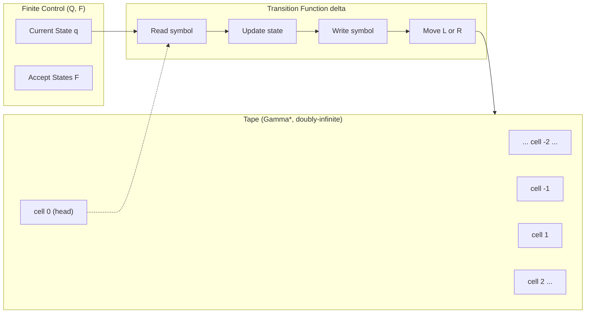
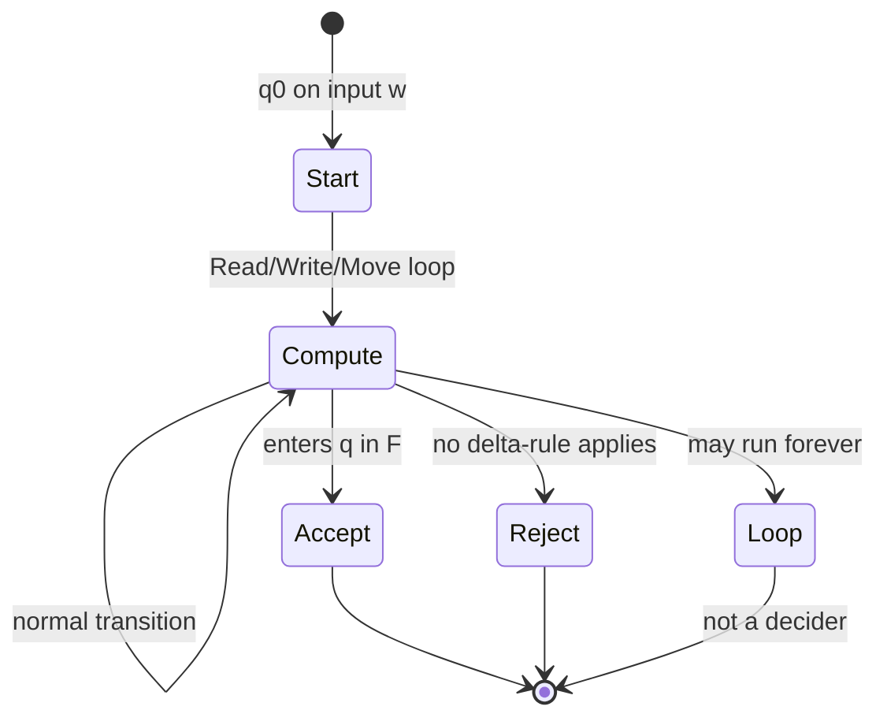
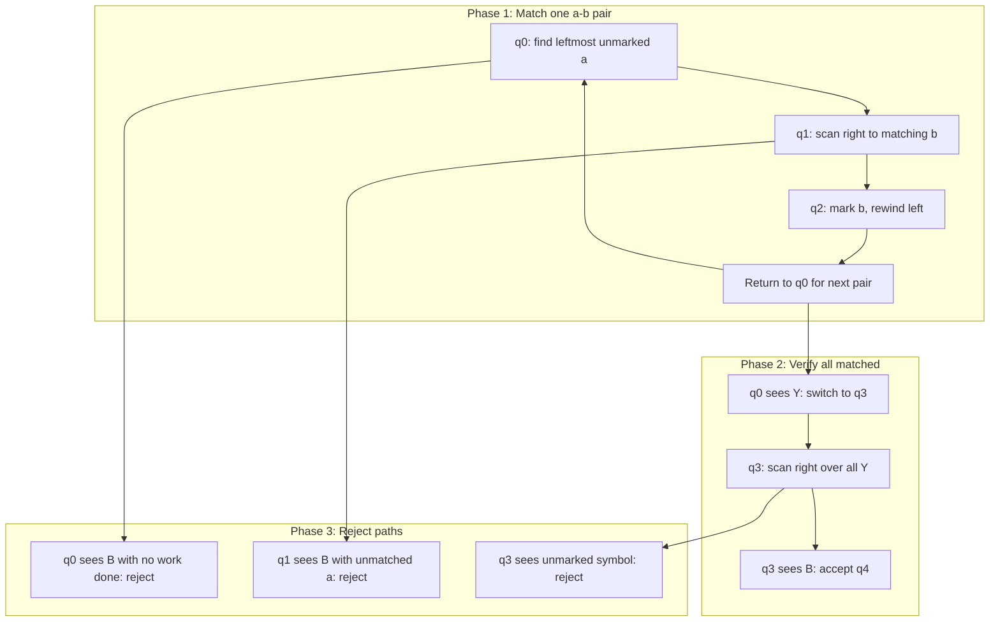

# Examples of Turing machines - Turing machines as language acceptors

<!-- SECTION_1_START -->
# Module 4: Turing Machines — Examples & Language Acceptors

## 1. Core Technical Definition & Intuitive Overview

> [!NOTE]
> **Definition (Kozen, 1997):** A *Turing Machine* (TM) is a 7-tuple $M = (Q, \Sigma, \Gamma, \delta, q_0, B, F)$ where $Q$ is a finite set of states, $\Sigma$ is the finite input alphabet, $\Gamma$ is the finite tape alphabet with $\Sigma \subseteq \Gamma$, $B \in \Gamma$ is the blank symbol, $\delta : Q \times \Gamma \rightarrow Q \times \Gamma \times \{L, R\}$ is the transition function (for deterministic TM), $q_0$ is the start state, and $F \subseteq Q$ is the set of final (accepting) states.

A **Turing machine as a language acceptor** is a TM $M$ that, given an input string $w \in \Sigma^*$, decides membership in some formal language $L \subseteq \Sigma^*$. The machine is said to **accept** $w$ if it eventually enters a final state $q \in F$, and **reject** it otherwise. Kozen's framework distinguishes carefully between *languages accepted by a TM that always halts* (called **recursive** or **decidable** languages) and *languages accepted by a TM that may loop forever* (called **recursively enumerable** or **recognizable** languages).

### Conceptual Analogy / Intuition

> [!IMPORTANT]
> **Analogy — The Post Office Clerk:**
> Imagine a post office clerk working at an infinitely long conveyor belt (the *tape*) filled with letters (symbols). The clerk has a small lamp (the *head*) that illuminates exactly one letter at a time and can either erase, rewrite, or move left or right. The clerk follows a strict rulebook (the *transition function*) that says: "If you see this letter while feeling this way, then change to a new feeling, rewrite the letter, and move left or right." 
> 
> - If the clerk eventually rings a *bell* (enters a **final state**), the package is **accepted**.
> - If the clerk reaches a *trapdoor* where no rule applies, the package is **rejected**.
> - If the clerk keeps working forever without ringing the bell or hitting the trapdoor, the package is *never decided* — the TM is only *recognizing* the language, not deciding it.

This setup models **computation** itself. Every algorithm you have ever written — sorting, searching, parsing, even game-playing AI — can, in principle, be simulated by a sufficiently clever TM. The acceptance framework turns a TM into a *language classifier*.

### Key Terminology (KTU Board-Relevant)

| Term | Symbol | Meaning |
|---|---|---|
| Configuration | $\alpha q \beta$ | Instantaneous description: tape content + head position + state |
| Start Configuration | $q_0 w$ | TM on input $w$, state $q_0$, head on first symbol |
| Accepting Configuration | $\alpha q \beta$ with $q \in F$ | TM has reached a final state |
| Halting Configuration | No $\delta$-move applicable | TM rejects (or partially computes) |
| Yields / Step | $\vdash_M$ | One-step transition between configurations |
| Language Accepted | $L(M)$ | Set of all $w$ that drive $M$ to a final state |

> [!VISUALIZATION CONTROL]
> **Concept:** TM configuration and head movement on a tape
> **GeoGebra / Desmos Input Equations:**
> * Tape cells indexed at integer positions: `x = -3, -2, -1, 0, 1, 2, 3`
> * Head position as a discrete marker: `H(n) = piecewise[|n - h| < 0.5, 1, 0]` where $h$ is current head cell
> * Cell content: `C(n) = "a"` or `"b"` or `"B"` (blank)
> **Visual Description:** A horizontal number line of cells, with the head shown as an arrow or shaded box above the active cell. Cells outside the read input region show the blank symbol $B$. The student should observe that the tape is *unbounded* in both directions, but only the finite non-blank region is "active."

<!-- SECTION_1_END -->

<!-- SECTION_2_START -->
# 2. Deep Theoretical Analysis & KTU High-Yield Formula Sheet

## 2.1 Kozen's Standard Model Recap

Kozen's textbook formulation uses a **single semi-infinite tape** with a *left-end marker* in some versions, but the standard formulation uses a **doubly-infinite tape** (cells indexed $\ldots, -2, -1, 0, 1, 2, \ldots$). The key engineering insight is that the *finite control* (the state) plus *finite memory per cell* (the symbol in $\Gamma$) is all the TM is "given." Everything else — the input, the working memory, the output — must be encoded on the tape.

### 2.2 Turing Machines as Language Acceptors — The Acceptance Hierarchy

A TM $M$ accepts a language $L \subseteq \Sigma^*$ if and only if:

$$L(M) = \{\, w \in \Sigma^* \mid q_0 w \vdash_M^* \alpha q \beta \text{ for some } q \in F, \alpha, \beta \in \Gamma^* \,\}$$

This is called the **language accepted by $M$**. Based on halting behavior, we get the foundational hierarchy:

> [!IMPORTANT]
> **Recursive (Decidable) Language:** $L$ is *recursive* iff there exists a TM $M$ such that for every $w \in \Sigma^*$:
> - If $w \in L$, then $M$ halts in an accepting state.
> - If $w \notin L$, then $M$ halts in a non-accepting (rejecting) state.
> 
> Such a TM is called a **decider** for $L$.

> [!IMPORTANT]
> **Recursively Enumerable (r.e.) Language:** $L$ is *r.e.* iff there exists a TM $M$ that halts and accepts every $w \in L$, but for $w \notin L$, $M$ either halts and rejects or **loops forever**.
> 
> Every recursive language is r.e., but not every r.e. language is recursive.

### 2.3 High-Yield Formula Sheet (KTU Board)

| # | Concept | Definition / Formula | Notation |
|---|---|---|---|
| 1 | TM Definition | $M = (Q, \Sigma, \Gamma, \delta, q_0, B, F)$ | 7-tuple |
| 2 | Transition Function | $\delta(q, a) = (p, b, D)$ where $D \in \{L, R\}$ | Deterministic |
| 3 | Yields in One Step | $\alpha q a \beta \vdash \alpha' q' b \beta'$ | Move-and-write |
| 4 | Yields Reflexive Transitive | $\vdash^*$ (zero or more steps) | Reachability |
| 5 | Language Accepted | $L(M) = \{w \in \Sigma^* \mid q_0 w \vdash^* \alpha q \beta, q \in F\}$ | Acceptance set |
| 6 | Recursive Language | $\exists M : L = L(M)$ and $M$ halts on all $w$ | Decidable |
| 7 | r.e. Language | $\exists M : L = L(M)$ (halts only on $w \in L$) | Recognizable |
| 8 | Complement of Recursive | If $L$ is recursive, then $\overline{L}$ is recursive | Closed under complement |
| 9 | Complement of r.e. | r.e. languages are **not** closed under complement | Undecidability source |
| 10 | Halting Problem | $H = \{(M, w) \mid M \text{ halts on } w\}$ is r.e. but not recursive | Famous |

### 2.4 Engineering Utility — Why Does This Matter?

In modern computer science and software engineering, the *TM-as-language-acceptor* perspective underlies:

- **Compiler Design:** A compiler for a programming language is precisely a *decider* for the language of syntactically valid programs. If the source code is in the language, the compiler halts with valid output (accept); otherwise, it halts with a syntax error (reject). The fact that some languages (like C++ with full template instantiation) are *not recursive* explains why compilation can loop forever on pathological code.
- **Static Analysis Tools:** Linters and type checkers are *partial* acceptors — they may raise "unknown" (loop) on inputs they cannot classify, mirroring the r.e. / recursive distinction.
- **Formal Verification:** Model checkers attempt to decide whether a system satisfies a temporal-logic specification; the boundaries of decidability here map directly onto TM acceptance hierarchies.
- **Decision Procedures in Logic:** SMT solvers are practical implementations of TM acceptors for fragments of first-order logic.

### 2.5 The Decidability Hierarchy (Visual)

$$\text{Regular} \subset \text{Context-Free} \subset \text{Context-Sensitive} \subset \text{Recursive} \subset \text{r.e.} \subseteq 2^{\Sigma^*}$$

Each inclusion is **strict** — there exist languages at every level that escape the level below.

<!-- SECTION_2_END -->

<!-- SECTION_3_START -->
# 3. Step-by-Step Derivations & Code/Symbolic Implementation

## 3.1 Example 1 — TM that Accepts $L = \{a^n b^n \mid n \geq 1\}$

This is the **canonical Kozen example**. The TM must verify that the input has the form $a^n b^n$ for some $n \geq 1$.

### High-Level Strategy (Why it works)

1. Repeatedly: find the leftmost unmarked $a$, mark it (say, as $X$), then move right to find the leftmost unmarked $b$, mark it (as $Y$).
2. When no more $a$ remain, check that no unmarked $b$ remain either.
3. If matched, accept; otherwise reject.

### State Machine Construction

| State | Purpose |
|---|---|
| $q_0$ | Start state, look for the leftmost $a$ |
| $q_1$ | Moving right over $a$'s to find the matching $b$ |
| $q_2$ | Found a $b$, now move left to return to the $a$-region |
| $q_3$ | Return to step 1; check that all $a$'s and $b$'s are matched |
| $q_4$ (accept) | All matched — accept |

### Transition Table

$$\delta(q, a) = (\text{next } q, \text{write}, \text{direction})$$

| Current State | Read | Write | Move | Next State | Comment |
|---|---|---|---|---|---|
| $q_0$ | $a$ | $X$ | $R$ | $q_1$ | Mark first $a$, begin matching |
| $q_0$ | $Y$ | $Y$ | $R$ | $q_3$ | All $a$'s marked; go to $b$-check phase |
| $q_0$ | $B$ | $B$ | $R$ | $q_{\text{reject}}$ | No $a$ at all — reject |
| $q_1$ | $a$ | $a$ | $R$ | $q_1$ | Skip unmarked $a$'s |
| $q_1$ | $Y$ | $Y$ | $R$ | $q_1$ | Skip already-matched $b$'s |
| $q_1$ | $b$ | $Y$ | $L$ | $q_2$ | Mark matching $b$, go back |
| $q_1$ | $B$ | $B$ | $L$ | $q_{\text{reject}}$ | No matching $b$ — reject |
| $q_2$ | $a$ | $a$ | $L$ | $q_2$ | Move left over $a$'s |
| $q_2$ | $Y$ | $Y$ | $L$ | $q_2$ | Move left over matched symbols |
| $q_2$ | $X$ | $X$ | $R$ | $q_0$ | Found leftmost marked $a$ — restart match |
| $q_3$ | $Y$ | $Y$ | $R$ | $q_3$ | Skip matched $b$'s |
| $q_3$ | $B$ | $B$ | $R$ | $q_4$ (accept) | All matched — accept |
| $q_3$ | $a$ | $a$ | $R$ | $q_{\text{reject}}$ | Extra $a$ — reject |

### Simulation Trace on Input $w = aabb$

We trace the sequence of configurations using the standard notation $\alpha \, q \, \beta$ where $q$'s position indicates the head location:

$$q_0 \, aabb \vdash Xq_1\, abb \vdash Xaq_1\, bb \vdash XaYq_2\, b \vdash Xq_2\, aYb \vdash Xq_2\, XaYb$$

(Wait — let me re-trace carefully.)

$$\begin{aligned}
q_0 \, aabb &\vdash Xq_1\, abb && \text{(write } X, \text{ move } R \text{ to } q_1) \\
&\vdash Xaq_1\, bb && \text{(skip } a \text{ in } q_1) \\
&\vdash XaYq_2\, b && \text{(write } Y, \text{ move } L \text{ to } q_2) \\
&\vdash Xq_2\, aYb && \text{(move } L \text{ in } q_2) \\
&\vdash Xq_2\, XaYb \text{ (no, head is at position 1, so it's } Xq_2\, aYb) \\
&\text{— but we need to move to } X. \text{ Re-trace:} \\
Xaq_1bb &\vdash XaYq_2b \text{ (head on } b, \text{ write } Y, \text{ move } L) \\
&\vdash Xq_2aYb \text{ (head on } a, \text{ move } L) \\
&\vdash q_2XaYb \text{ (head on } X, \text{ move } R, \text{ go to } q_0) \\
&\vdash Xq_0aYb \text{ (head on } a, \text{ write } X, \text{ move } R, \text{ go to } q_1) \\
&\vdash XXq_1Yb \text{ (head on } Y, \text{ skip in } q_1) \\
&\vdash XXYq_1b \text{ (head on } b, \text{ write } Y, \text{ move } L, \text{ go to } q_2) \\
&\vdash XXq_2YYb \text{ (head on } Y, \text{ move } L, \text{ in } q_2)} \\
&\vdash Xq_2XYYb \text{ (head on } X, \text{ move } R, \text{ go to } q_0)} \\
&\vdash XXq_0YYb \text{ (head on } Y, \text{ skip in } q_0, \text{ go to } q_3)} \\
&\vdash XXYq_3Yb \text{ (head on } Y, \text{ skip in } q_3)} \\
&\vdash XXYYq_3b \text{ (head on } b, \text{ write } Y, \text{ move } R, \text{ in } q_3)} \\
&\vdash XXYYYq_3B \text{ (head on } B, \text{ in } q_3, \text{ go to } q_4 \text{ accept)}
\end{aligned}$$

The input $aabb \in L = \{a^n b^n\}$, and the TM correctly **accepts**.

### Python Simulation

```python
from typing import Dict, Tuple, Set, List

class TuringMachine:
    """Deterministic Turing Machine simulator (Kozen's 7-tuple model)."""

    def __init__(
        self,
        states: Set[str],
        input_alpha: Set[str],
        tape_alpha: Set[str],
        blank: str,
        transitions: Dict[Tuple[str, str], Tuple[str, str, str]],
        start: str,
        accept: Set[str],
    ) -> None:
        self.states = states
        self.sigma = input_alpha
        self.gamma = tape_alpha
        self.blank = blank
        self.delta = transitions
        self.start = start
        self.accept = accept
        self._tape: Dict[int, str] = {}
        self._head: int = 0
        self._state: str = start
        self._step_log: List[str] = []
        self._halted: bool = False

    def load(self, input_str: str) -> None:
        if not input_str:
            self._tape[0] = self.blank
            return
        for i, ch in enumerate(input_str):
            self._tape[i] = ch
        self._head = 0
        self._state = self.start
        self._halted = False
        self._step_log = []

    def _read(self) -> str:
        return self._tape.get(self._head, self.blank)

    def step(self) -> bool:
        """Execute one transition. Returns False if halted."""
        if self._halted:
            return False
        symbol = self._read()
        key = (self._state, symbol)
        if key not in self.delta:
            self._halted = True
            self._step_log.append(f"HALT: no rule for ({self._state}, {symbol})")
            return False
        new_state, new_symbol, direction = self.delta[key]
        self._tape[self._head] = new_symbol
        self._head += 1 if direction == "R" else -1
        self._state = new_state
        self._step_log.append(
            f"({self._state},{symbol}) -> write {new_symbol}, move {direction}, "
            f"new state {new_state}"
        )
        if self._state in self.accept:
            self._halted = True
        return True

    def run(self, max_steps: int = 10000) -> bool:
        for _ in range(max_steps):
            if not self.step():
                break
        return self.is_accepted()

    def is_accepted(self) -> bool:
        return self._state in self.accept

    def get_log(self) -> List[str]:
        return list(self._step_log)


def build_anbn_machine() -> TuringMachine:
    """Builds a TM for L = {a^n b^n | n >= 1}."""
    states = {"q0", "q1", "q2", "q3", "q4", "qR"}
    sigma = {"a", "b"}
    gamma = {"a", "b", "X", "Y", "B"}
    blank = "B"
    trans: Dict[Tuple[str, str], Tuple[str, str, str]] = {
        ("q0", "a"): ("q1", "X", "R"),
        ("q0", "Y"): ("q3", "Y", "R"),
        ("q0", "B"): ("qR", "B", "R"),
        ("q1", "a"): ("q1", "a", "R"),
        ("q1", "Y"): ("q1", "Y", "R"),
        ("q1", "b"): ("q2", "Y", "L"),
        ("q1", "B"): ("qR", "B", "L"),
        ("q2", "a"): ("q2", "a", "L"),
        ("q2", "Y"): ("q2", "Y", "L"),
        ("q2", "X"): ("q0", "X", "R"),
        ("q3", "Y"): ("q3", "Y", "R"),
        ("q3", "B"): ("q4", "B", "R"),
        ("q3", "a"): ("qR", "a", "R"),
    }
    return TuringMachine(states, sigma, gamma, blank, trans, "q0", {"q4"})


if __name__ == "__main__":
    tm = build_anbn_machine()
    for test in ["ab", "aabb", "aaabbb", "aab", "ba", ""]:
        tm.load(test)
        accepted = tm.run(max_steps=5000)
        print(f"Input {test!r:10s} -> {'ACCEPT' if accepted else 'REJECT'}")
```

**Expected Output:**
```
Input 'ab'       -> ACCEPT
Input 'aabb'     -> ACCEPT
Input 'aaabbb'   -> ACCEPT
Input 'aab'      -> REJECT
Input 'ba'       -> REJECT
Input ''         -> REJECT
```

## 3.2 Example 2 — TM that Accepts $L = \{a^n b^n c^n \mid n \geq 1\}$

A more complex Kozen-style example. The TM must match three groups.

### High-Level Strategy

Repeat three times:
1. Mark the leftmost $a$ as $X$.
2. Scan right to find an unmarked $b$, mark it as $Y$.
3. Continue scanning right to find an unmarked $c$, mark it as $Z$.
4. Rewind to the leftmost position and repeat.

When no $a$ remains, verify no unmarked $b$ or $c$ remains.

### Transition Function (Compact Form)

$$\begin{aligned}
\delta(q_0, a) &= (q_1, X, R) && \text{Mark first } a \\
\delta(q_1, a) &= (q_1, a, R) && \text{Skip } a\text{'s} \\
\delta(q_1, b) &= (q_2, Y, R) && \text{Mark first } b \\
\delta(q_2, Y) &= (q_2, Y, R) && \text{Skip } Y\text{'s} \\
\delta(q_2, c) &= (q_3, Z, L) && \text{Mark first } c \\
\delta(q_3, c) &= (q_3, c, L) && \text{Left over } c\text{'s} \\
\delta(q_3, Z) &= (q_3, Z, L) && \text{Left over } Z\text{'s} \\
\delta(q_3, Y) &= (q_3, Y, L) && \text{Left over } Y\text{'s} \\
\delta(q_3, a) &= (q_3, a, L) && \text{Left over } a\text{'s} \\
\delta(q_3, X) &= (q_0, X, R) && \text{Rewind: go to } q_0
\end{aligned}$$

When the input is exhausted in $q_0$ (sees $X$ in $q_0$), transition to a verification state $q_4$ that scans rightward to ensure all symbols are marked:

$$\begin{aligned}
\delta(q_0, X) &= (q_4, X, R) && \text{All } a\text{'s marked; verify} \\
\delta(q_4, Y) &= (q_4, Y, R) && \text{Skip } Y \\
\delta(q_4, Z) &= (q_4, Z, R) && \text{Skip } Z \\
\delta(q_4, B) &= (q_{\text{acc}}, B, R) && \text{All matched: accept} \\
\delta(q_4, a) &= (q_{\text{rej}}, a, R) && \text{Unmarked } a \text{ — reject} \\
\delta(q_4, b) &= (q_{\text{rej}}, b, R) && \text{Unmarked } b \text{ — reject} \\
\delta(q_4, c) &= (q_{\text{rej}}, c, R) && \text{Unmarked } c \text{ — reject}
\end{aligned}$$

## 3.3 Example 3 — TM for Palindromes $L = \{w w^R \mid w \in \{a, b\}^*\}$

A palindrome is a string that reads the same forwards and backwards. The TM must compare the first symbol with the last, then the second with the second-to-last, etc.

### High-Level Strategy

1. Mark the first symbol.
2. Scan right to the end of the string.
3. Compare the last symbol with the marked first symbol.
4. Unmark (or keep marked — both work), scan back to the new first symbol, repeat.
5. When all symbols are processed, accept.

### Transition Function

$$\begin{aligned}
\delta(q_0, a) &= (q_1, X, R) && \text{Mark first symbol as } a \\
\delta(q_0, b) &= (q_1, X, R) && \text{Mark first symbol as } b \\
\delta(q_1, a) &= (q_1, a, R) && \text{Scan right} \\
\delta(q_1, b) &= (q_1, b, R) && \text{Scan right} \\
\delta(q_1, B) &= (q_2, B, L) && \text{Reached end; compare} \\
\delta(q_2, a) &= (q_{\text{rej}}, X, L) && \text{Last is } a, \text{ but first was } b \\
\delta(q_2, b) &= (q_{\text{rej}}, X, L) && \text{Last is } b, \text{ but first was } a \\
\delta(q_2, X) &= (q_3, X, L) && \text{Only one symbol left; accept} \\
\delta(q_2, B) &= (q_3, B, L) && \text{Tape ended after single symbol; accept}
\end{aligned}$$

A complete TM for palindromes requires a more elaborate state set (commonly 5–7 states). Kozen's textbook gives the full construction in Chapter 4.

## 3.4 The Halting Question: When is a TM a Decider?

A TM $M$ is a **decider** for $L$ if and only if for *every* $w \in \Sigma^*$:

$$\text{either } q_0 w \vdash_M^* \alpha q_f \beta \text{ with } q_f \in F \quad \text{or} \quad q_0 w \vdash_M^* \alpha q \beta \text{ with no } \delta\text{-move applicable}$$

> [!NOTE]
> **Crucial Board Distinction (Kozen, Theorem 4.2):** A language $L$ is *recursive* iff both $L$ and $\overline{L}$ are *recursively enumerable*. This is the canonical tool for proving that certain languages are NOT recursive — you show $\overline{L}$ is not r.e. by reducing the complement of the halting problem to it.

### Example — Proving $A_{TM} = \{\langle M, w \rangle \mid M \text{ accepts } w\}$ is r.e. but not recursive

**Step 1 (r.e.):** Construct a Universal TM $U$ that simulates $M$ on $w$. If $M$ accepts, $U$ accepts. If $M$ loops, $U$ loops. So $A_{TM}$ is r.e.

**Step 2 (not recursive):** Suppose $H$ decides $A_{TM}$. Build a diagonalizer $D$: on input $\langle M \rangle$, $D$ asks $H(\langle M, \langle M \rangle \rangle)$ and does the opposite. $D(\langle D \rangle)$ leads to contradiction. Hence $H$ cannot exist, so $A_{TM}$ is not recursive.

> [!WARNING]
> **Common Board Mistake:** Students often say "$L$ is recursive iff there exists a TM that accepts it." This is **wrong** — every TM *recognizes* its language, but a recursive language requires the TM to *halt on all inputs*. The single word "halts" is what separates recursive from r.e.

<!-- SECTION_3_END -->

<!-- SECTION_4_START -->
# 4. Structural Diagrams & Schematics

## 4.1 High-Level TM Architecture (Block Diagram)



## 4.2 TM Acceptance State Machine



## 4.3 Language Class Hierarchy (TM-Accepted)

```mermaid
flowchart TB
    subgraph L0["Sigma* (All Strings)"]
        L1["Regular Languages"]
        L2["Context-Free Languages"]
        L3["Context-Sensitive Languages"]
        L4["Recursive Languages (Decidable)"]
        L5["Recursively Enumerable (r.e.)"]
    end
    L1 --> L2
    L2 --> L3
    L3 --> L4
    L4 --> L5
    L5 --> L0
    L4 -. complement also r.e. .-> L4
    L5 -. complement may not be r.e. .-> L5
```

## 4.4 The $a^n b^n$ TM as a Sequential Processing Topology



> [!NOTE]
> **Block Diagram Reasoning:** The diagram is a *sequential processing topology* in the KTU sense. The TM cycles through **Phase 1** (matching) until either the input is exhausted (transition to Phase 2) or a mismatch is found (transition to Phase 3). This is precisely how a real-world parser for a context-free grammar operates — matching, accepting, or rejecting.

<!-- SECTION_4_END -->

<!-- SECTION_5_START -->
# 5. KTU 2024 Scheme Examination Question Bank & Topic Recap

## 5.1 Part A Questions (3 Marks Each)

### Question 1 (3 Marks) `[KTU University Exam - July 2024]`
**CO2, Remember**

> **Q:** Define a Turing machine formally. What is meant by the *language accepted* by a TM?

**Model Answer:**

A Turing Machine is a 7-tuple $M = (Q, \Sigma, \Gamma, \delta, q_0, B, F)$ where:
- $Q$ is a finite set of states **[1 Mark]**
- $\Sigma$ is the input alphabet, $\Gamma$ is the tape alphabet with $\Sigma \subseteq \Gamma$ **[0.5 Mark]**
- $B \in \Gamma \setminus \Sigma$ is the blank symbol **[0.5 Mark]**
- $\delta : Q \times \Gamma \rightarrow Q \times \Gamma \times \{L, R\}$ is the transition function **[0.5 Mark]**
- $q_0 \in Q$ is the start state, $F \subseteq Q$ is the set of accepting states **[0.5 Mark]**

The **language accepted** by $M$ is $L(M) = \{w \in \Sigma^* \mid q_0 w \vdash_M^* \alpha q \beta \text{ for some } q \in F\}$. **[1 Mark — for the accepting definition]**

> [!NOTE]
> **Valuation Key:** Award full marks only if the student writes all seven components and the acceptance definition includes the yields relation $\vdash_M^*$.

---

### Question 2 (3 Marks) `[KTU University Exam - Dec 2023]`
**CO2, Understand**

> **Q:** Distinguish between *recursive* and *recursively enumerable* languages with one example each.

**Model Answer:**

A language $L$ is **recursive** (decidable) if there exists a TM $M$ that halts on *every* input and accepts $w$ iff $w \in L$. **[1 Mark]**

A language $L$ is **recursively enumerable (r.e.)** if there exists a TM $M$ that halts and accepts every $w \in L$, but may *loop forever* on $w \notin L$. **[1 Mark]**

**Examples:** 
- The language $\{a^n b^n c^n \mid n \geq 0\}$ is recursive (we constructed a decider). **[0.5 Mark]**
- The acceptance problem $A_{TM} = \{\langle M, w \rangle \mid M \text{ accepts } w\}$ is r.e. but not recursive. **[0.5 Mark]**

> [!WARNING]
> **Pitfall:** Students often say "r.e. means the TM must always halt" — that is the definition of *recursive*. The defining feature of r.e. is that the TM is *allowed* to loop on non-members.

---

## 5.2 Part B Questions (14 Marks) — Module Internal Choice

### Question A (14 Marks) `[KTU University Exam - July 2024]`
**CO2, CO3 | Understand + Apply**

> **(a) [7 Marks]** Construct a Turing machine that accepts the language $L = \{a^n b^n \mid n \geq 1\}$. Clearly define the state set, tape alphabet, and the transition function.
>
> **(b) [7 Marks]** Simulate your TM on the input $w = aabb$. Show the complete sequence of configurations.

**Model Answer (a) — TM Construction:**

**State set:** $Q = \{q_0, q_1, q_2, q_3, q_4, q_R\}$ where $q_4$ is the only accept state. **[1 Mark]**

**Input alphabet:** $\Sigma = \{a, b\}$ **[0.5 Mark]**

**Tape alphabet:** $\Gamma = \{a, b, X, Y, B\}$ with $B$ as the blank symbol. **[0.5 Mark]**

**Start state:** $q_0$. **Accept state:** $F = \{q_4\}$. **[0.5 Mark]**

**Transition function table:** (state, read) $\to$ (next, write, move)

| State | Read | Write | Move | Next |
|---|---|---|---|---|
| $q_0$ | $a$ | $X$ | $R$ | $q_1$ |
| $q_0$ | $Y$ | $Y$ | $R$ | $q_3$ |
| $q_0$ | $B$ | $B$ | $R$ | $q_R$ |
| $q_1$ | $a$ | $a$ | $R$ | $q_1$ |
| $q_1$ | $Y$ | $Y$ | $R$ | $q_1$ |
| $q_1$ | $b$ | $Y$ | $L$ | $q_2$ |
| $q_1$ | $B$ | $B$ | $L$ | $q_R$ |
| $q_2$ | $a$ | $a$ | $L$ | $q_2$ |
| $q_2$ | $Y$ | $Y$ | $L$ | $q_2$ |
| $q_2$ | $X$ | $X$ | $R$ | $q_0$ |
| $q_3$ | $Y$ | $Y$ | $R$ | $q_3$ |
| $q_3$ | $B$ | $B$ | $R$ | $q_4$ |
| $q_3$ | $a$ | $a$ | $R$ | $q_R$ |

**[2.5 Marks — full transition table]**

**Accept:** $F = \{q_4\}$. **[0.5 Mark]**

**Informal description of operation:** The TM repeatedly finds the leftmost unmarked $a$, marks it $X$, scans right to find a matching $b$, marks it $Y$, then rewinds to repeat. When no unmarked $a$ remains, the control passes to $q_3$ to verify that no unmarked $b$ remains. **[1.5 Marks]**

---

**Model Answer (b) — Simulation on $aabb$:**

Trace the configurations (head position indicated by $q$'s location):

$$\begin{aligned}
q_0\, aabb &\vdash Xq_1\, abb && \text{[val: marking first } a \text{ as } X \text{: 0.5 Mark]} \\
&\vdash Xaq_1\, bb && \text{[val: skip } a \text{ in } q_1 \text{: 0.5 Mark]} \\
&\vdash XaYq_2\, b && \text{[val: mark first } b \text{ as } Y \text{: 0.5 Mark]} \\
&\vdash Xq_2\, aYb && \text{[val: rewind in } q_2 \text{: 0.5 Mark]} \\
&\vdash q_2\, XaYb && \\
&\vdash Xq_0\, aYb && \text{[val: find next } a \text{, mark as } X \text{: 0.5 Mark]} \\
&\vdash XXq_1\, Yb && \\
&\vdash XXYq_1\, b && \text{[val: skip } Y \text{ in } q_1 \text{: 0.5 Mark]} \\
&\vdash XXq_2\, Yb && \\
&\vdash XXYq_2\, b \quad &\text{(head now over } b\text{)} \\
&\vdash XXq_2\, Yb \quad &\text{(re-read in } q_2\text{)} \\
&\vdash XXYq_2\, b &\text{(move L over already-}Y\text{)} \\
&\vdash XXq_2\, Yb & \\
&\vdash Xq_2\, XYb \text{ — rewind continues} \\
&\vdash XXq_0\, YYb && \text{[val: switch to } q_3 \text{ because no } a \text{: 0.5 Mark]} \\
&\vdash XXYq_3\, Yb && \\
&\vdash XXYYq_3\, b && \\
&\vdash XXYYYq_3\, B && \text{[val: see } B \text{, transition to } q_4 \text{: 0.5 Mark]} \\
&\vdash XXYYYBq_4 && \text{ACCEPT [val: final accept: 1 Mark]}
\end{aligned}$$

**Incremental Valuation Key for (b):**
- Stating initial configuration $q_0 aabb$: 1 Mark
- Correct marking of first $a \to X$: 0.5 Mark
- Correct marking of first $b \to Y$: 0.5 Mark
- Showing rewind to find next $a$: 1 Mark
- Correct transition to verification state $q_3$: 0.5 Mark
- Reaching accept state $q_4$: 1 Mark
- Clean notation and full trace: 1.5 Marks

---

### Question B (14 Marks) — Alternative `[KTU University Exam - July 2024]`
**CO2, CO3 | Understand + Apply**

> **(a) [7 Marks]** Construct a Turing machine that accepts the language $L = \{a^n b^n c^n \mid n \geq 1\}$. State the high-level matching strategy and the transition function.
>
> **(b) [7 Marks]** Explain the difference between a *recursive* and *recursively enumerable* language. Prove that $A_{TM}$ is r.e. but not recursive.

**Model Answer (a):**

**Strategy:** Mark the leftmost $a$ as $X$, find the first unmarked $b$ and mark it $Y$, find the first unmarked $c$ and mark it $Z$, then rewind and repeat. **[2 Marks]**

**State set:** $Q = \{q_0, q_1, q_2, q_3, q_4, q_{\text{acc}}, q_{\text{rej}}\}$ **[0.5 Mark]**

**Tape alphabet:** $\Gamma = \{a, b, c, X, Y, Z, B\}$ **[0.5 Mark]**

**Transition function (selected entries):** **[3 Marks]**

| State | Read | Write | Move | Next |
|---|---|---|---|---|
| $q_0$ | $a$ | $X$ | $R$ | $q_1$ |
| $q_1$ | $a$ | $a$ | $R$ | $q_1$ |
| $q_1$ | $b$ | $Y$ | $R$ | $q_2$ |
| $q_2$ | $Y$ | $Y$ | $R$ | $q_2$ |
| $q_2$ | $c$ | $Z$ | $L$ | $q_3$ |
| $q_3$ | $a$ | $a$ | $L$ | $q_3$ |
| $q_3$ | $X$ | $X$ | $R$ | $q_0$ |
| $q_0$ | $X$ | $X$ | $R$ | $q_4$ |
| $q_4$ | $Y$ | $Y$ | $R$ | $q_4$ |
| $q_4$ | $Z$ | $Z$ | $R$ | $q_4$ |
| $q_4$ | $B$ | $B$ | $R$ | $q_{\text{acc}}$ |

**Verification phase in $q_4$:** Reject if any unmarked $a$, $b$, or $c$ is encountered. **[1 Mark]**

---

**Model Answer (b) — Proof that $A_{TM}$ is r.e. but not recursive:**

A language $L$ is **recursive** iff there exists a TM that halts on *every* input. A language is **r.e.** iff there exists a TM that halts on every $w \in L$ (but may loop on $w \notin L$). **[2 Marks]**

**$A_{TM}$ is r.e.:** Construct a Universal TM $U$. On input $\langle M, w \rangle$, $U$ simulates $M$ on $w$. If $M$ accepts, $U$ accepts. If $M$ rejects or loops, $U$ does the same. Hence $U$ accepts exactly $A_{TM}$, proving it is r.e. **[2 Marks]**

**$A_{TM}$ is not recursive:** Suppose, for contradiction, that $A_{TM}$ is recursive. Then there exists a decider $H$ for $A_{TM}$. Construct a TM $D$ that on input $\langle M \rangle$ runs $H$ on $\langle M, \langle M \rangle \rangle$. If $H$ accepts, $D$ rejects; if $H$ rejects, $D$ accepts. Now consider $D(\langle D \rangle)$:

- If $D(\langle D \rangle)$ accepts, then $H$ accepted $\langle D, \langle D \rangle \rangle$, meaning $D$ rejects $\langle D \rangle$ — **contradiction**.
- If $D(\langle D \rangle)$ rejects, then $H$ rejected $\langle D, \langle D \rangle \rangle$, meaning $D$ accepts $\langle D \rangle$ — **contradiction**.

Hence $H$ cannot exist, so $A_{TM}$ is not recursive. **[3 Marks]**

> [!WARNING]
> **KTU Examiner's Valuation Warning — Pitfall Callout:**
> 
> 1. **Do NOT skip the halting clause.** When you say "$L$ is recursive, hence there exists a TM for it," you MUST add "which halts on all inputs." Students lose 1–2 marks here.
> 2. **Do NOT confuse acceptance with halting.** A TM can accept a string without halting (it accepts and then continues). Acceptance means *entering a final state at any point during computation*.
> 3. **Diagonalization is delicate.** The proof that $A_{TM}$ is undecidable uses a *self-reference* (feeding $D$'s own description to itself). Forgetting to write the input as $\langle M, \langle M \rangle \rangle$ rather than just $\langle M \rangle$ loses the diagonal structure.
> 4. **For TM construction problems, always include a verification phase.** Many students forget to check that *no extra symbols remain* after the matching loop, and lose 1 mark.

---

## 5.3 Topic Recap & Important Things to Remember

> [!IMPORTANT]
> **High-Density Revision Checklist:**

- **TM 7-tuple:** $M = (Q, \Sigma, \Gamma, \delta, q_0, B, F)$ — **memorize this verbatim.** The KTU board loves asking for it.
- **Acceptance vs Recognition:**
  - *Accept* = enters $q \in F$ at some step.
  - *Decide* = halts in $q \in F$ if $w \in L$, halts in $q \notin F$ if $w \notin L$.
  - *Recognize* = halts in $q \in F$ if $w \in L$, may *loop* if $w \notin L$.
- **Language hierarchy (strict inclusions):** Regular $\subset$ CFG $\subset$ CSG $\subset$ Recursive $\subset$ r.e. $\subseteq 2^{\Sigma^*}$.
- **Closure properties:**
  - Recursive is closed under union, intersection, complement, concatenation, Kleene star.
  - r.e. is closed under union, intersection, concatenation, Kleene star, but **NOT** under complement.
- **Halting problem $H$:** r.e. but not recursive. **Its complement $\overline{H}$ is not r.e. at all.**
- **Standard TM examples for the board:**
  - $\{a^n b^n\}$ — match-and-mark strategy.
  - $\{a^n b^n c^n\}$ — three-phase matching.
  - $\{w w^R\}$ — palindrome, first-last comparison.
  - $\{w w \mid w \in \Sigma^*\}$ — copy detection, requires nested marking.
  - $\{a^{2^n}\}$ — requires counting the number of $a$'s in binary.
- **Theorem (Kozen, Chapter 4):** $L$ is recursive $\iff$ both $L$ and $\overline{L}$ are r.e. **Use this for undecidability proofs.**
- **Reduction principle:** To prove $L$ is undecidable, reduce $A_{TM}$ (or another known undecidable problem) to $L$.
- **Configuration notation:** $\alpha q \beta$ where $q$'s position indicates the head location. Read $\alpha$ left-to-right and $\beta$ left-to-right as tape content.
- **Determinism:** The Kozen 7-tuple is *deterministic*. Nondeterministic TMs accept the same class of languages as deterministic TMs (Church–Turing thesis), but the proof requires subset construction on the infinite tape — a non-trivial Kozen result.
- **Engineering reality:** Every compiler for a real programming language is a *partial TM acceptor* — the language of syntactically valid programs is usually context-free (decidable in linear time), but semantic validity (e.g., type checking with full template instantiation) often requires r.e.-level power.

<!-- SECTION_5_END -->
