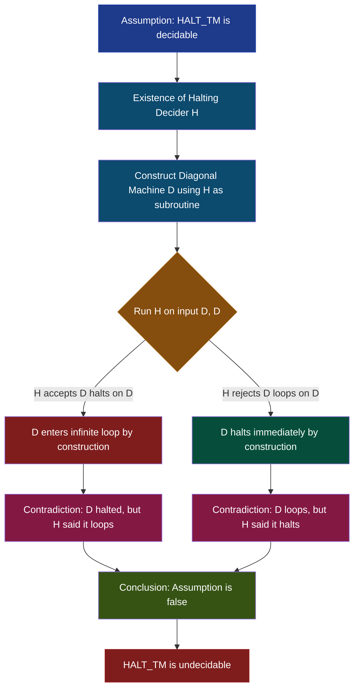
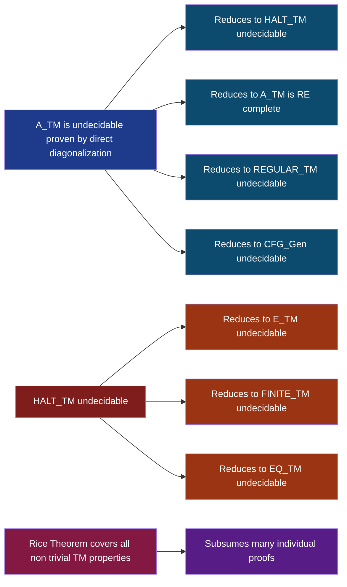
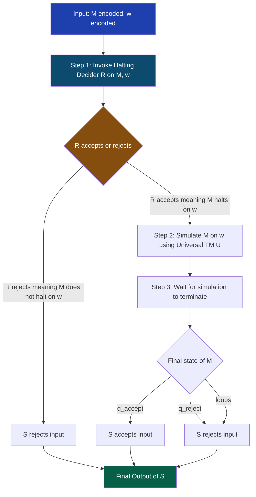

# Halting problem

<!-- SECTION_1_START -->
# Halting Problem: Core Definition & Intuitive Overview

## Formal Academic Definition

The **Halting Problem** is the canonical decision problem in computability theory that asks: given an arbitrary description of a Turing machine $M$ and an arbitrary input string $w$, determine whether $M$ halts (accepts or rejects, terminating in a finite number of steps) when run on input $w$, or runs forever in an infinite loop. Formally, it is the language:

$$HALT_{TM} = \{ \langle M, w \rangle \mid M \text{ is a Turing machine and } M \text{ halts on input } w \}$$

where $\langle M, w \rangle$ denotes a valid encoding of the pair $(M, w)$ over the standard alphabet $\Sigma = \{0, 1\}$. Alan Turing proved in 1936 that $HALT_{TM}$ is **undecidable** (recursively enumerable but not co-recursively enumerable in its complement), meaning there exists no Turing machine that solves it for all possible inputs.

> [!IMPORTANT]
> **KTU 2024 Syllabus Highlight:** This is a foundational result in Module 4 under the topic "Undecidability." It serves as the launching pad for proving the undecidability of every other RE-complete language (e.g., $A_{TM}$, $E_{TM}$, $EQ_{TM}$, $REGULAR_{TM}$, $EQ_{CFG}$). Mastering the diagonalization proof here guarantees marks in any related reduction question.

> [!NOTE]
> **Decidability Spectrum Recap:**
> - **Decidable (Recursive):** A language whose membership can be decided by a total Turing machine that always halts.
> - **Undecidable but Recursively Enumerable (RE):** A language that can be *accepted* by a Turing machine, but not *decided*.
> - **Undecidable and Not RE (co-RE hard):** The complement of certain RE languages, with $HALT_{TM}$ being the classic RE case.

## Conceptual Analogy: The "Infinite Loop" Compiler

Imagine a brilliant engineer named **Alex** who claims to have built a perfect static analyzer — a magical program called `WillHalt(P, x)` that accepts any source code `P` and input `x`, and in finite time prints:
- `YES` — if `P(x)` will eventually finish executing
- `NO` — if `P(x)` will enter an infinite loop

Alex sells this tool to banks, hospitals, and airline companies because it can detect infinite loops *before* deployment. Now, a mischievous programmer writes a new program called `Paradox(P)` that does the following:

> "Ask `WillHalt(P, P)`. If it returns `YES`, then deliberately enter an infinite loop. If it returns `NO`, then immediately halt and print `Done`."

If `WillHalt` is truly perfect, then whatever answer it gives, `Paradox` does the **opposite**, causing `WillHalt` to be wrong. The only way out is that such a `WillHalt` program **cannot possibly exist** — a logical contradiction, not a hardware limitation.

This is the heart of Turing's 1936 proof: the assumption that the Halting Problem is decidable leads to a self-contradictory program, so the assumption is false.

## Physical & Mathematical Constants (Bolded Standards)

- **Alphabet convention:** $\Sigma = \{0, 1\}$ (binary encoding standard in textbook, Sipser 3rd Ed.)
- **Encoding function:** $\langle M, w \rangle$ is a uniquely decodable, prefix-free encoding with delimiter `111` separating components
- **Blank symbol:** $B$ (the blank tape cell character)
- **Set of natural numbers used to index Turing machines:** $\mathbb{N} = \{1, 2, 3, \ldots\}$, with $\varphi_i$ denoting the $i$-th Turing machine under a fixed effective enumeration (Gödel numbering of TM states and transitions)

> [!VISUALIZATION CONTROL]
> **Concept:** Diagonalization table for the Halting Problem
> **Desmos Input Table (conceptual matrix):**
> * Rows: Turing machines $M_1, M_2, M_3, \ldots$
> * Columns: Input strings $w_1, w_2, w_3, \ldots$
> * Cell $(i, j)$: `HALT` if $M_i$ halts on $w_j$, `LOOP` otherwise
> * Diagonal: $\text{Diag}(i) = \text{HALT}$ if $M_i$ does NOT halt on $w_i$, else `LOOP`
> **Visual Description:** Plot a 2D grid where the diagonal is forced to flip the values. The "anti-diagonal" pattern creates a row that no machine $M_i$ can match, since $M_i$'s own column $i$ defines its behavior. This visual captures the core of the diagonalization argument — no row of the table can equal the flipped diagonal.
<!-- SECTION_1_END -->

<!-- SECTION_2_START -->
# Deep Theoretical Analysis & KTU High-Yield Formula Sheet

## Unpacking the Halting Problem Step-by-Step

### Step 1: Assume the Halting Decider Exists
We begin a **proof by contradiction**. Suppose $HALT_{TM}$ is decidable. Then by the Church-Turing thesis extended to decidability (and the universal Turing machine $U$ being able to simulate any TM), there exists a deterministic Turing machine $H$ (the "decider") such that:

$$H(\langle M, w \rangle) = \begin{cases} \text{accept} & \text{if } M \text{ halts on } w \\ \text{reject} & \text{if } M \text{ does not halt on } w \end{cases}$$

Crucially, $H$ must **always halt** in finite time on every input — it is a *decider*, not merely an *acceptor*.

### Step 2: Construct the Self-Referential Diagonalizer
Using $H$ as a subroutine, construct a new Turing machine $D$ (for "Diagonal") that operates on a single input — the encoding of a TM $\langle M \rangle$:

1. Run $H$ on input $\langle M, \langle M \rangle \rangle$.
2. If $H$ accepts (meaning $M$ halts on its own description as input), then $D$ **loops forever** (enter an explicit `while True: pass` equivalent).
3. If $H$ rejects (meaning $M$ does not halt on its own description as input), then $D$ **halts immediately** and accepts.

This is a well-defined TM construction because $H$ is assumed to exist and we can build $D$ by hard-coding $H$ as a subroutine and inverting its output.

### Step 3: Inquire About $D$'s Behavior on Its Own Description
Now ask the lethal question: *What does $H$ output on $\langle D, \langle D \rangle \rangle$?* — that is, does $D$ halt on its own description?

- **Case A: $H$ accepts $\langle D, \langle D \rangle \rangle$.** This means, per the definition of $H$, that $D$ halts on input $\langle D \rangle$. But by construction of $D$ in Step 2, if $H$ accepts, $D$ loops forever — **contradiction**.
- **Case B: $H$ rejects $\langle D, \langle D \rangle \rangle$.** This means $D$ does not halt on input $\langle D \rangle$. But by construction, if $H$ rejects, $D$ halts immediately — **contradiction**.

### Step 4: Conclude the Contradiction
Since both cases lead to logical impossibility, our initial assumption (that $H$ exists) must be false. Therefore, $HALT_{TM}$ is **undecidable**. $\blacksquare$

### The "Why" Behind Diagonalization
The proof technique is called **Cantor's diagonalization** (1891), originally used to show the real numbers are uncountable. The intuition: if you list all TMs in a sequence $M_1, M_2, \ldots$ and all inputs $w_1, w_2, \ldots$, the halting behavior forms a 2D matrix. The decider $H$ would have to know the *entire* matrix. By constructing $D$ to deliberately disagree with the diagonal of this matrix, we exhibit a "row" (a TM) that no $H$ could correctly classify. Self-reference is the engine — you feed the program *to itself*.

## KTU Formula Sheet / Cheat Sheet

| **Symbol / Term** | **Formal Meaning** | **Engineering Analogy** | **Unit / Type** |
|---|---|---|---|
| $HALT_{TM}$ | Language of all $(M, w)$ pairs where $M$ halts on $w$ | A "bug detector" query database | $\subseteq \{0,1\}^*$ |
| $\langle M, w \rangle$ | Encoding of TM $M$ and string $w$ as a single binary string | Compiled bytecode + test case | A bit-string |
| $U$ | Universal Turing machine that simulates any $M$ on $w$ | A CPU interpreting machine code | A specific 7-tuple $(Q, \Sigma, \Gamma, \delta, q_0, q_{accept}, q_{reject})$ |
| $\varphi_i$ | The $i$-th TM under a fixed effective enumeration | Program number $i$ in a binary | Natural number $i \in \mathbb{N}$ |
| $D$ | Diagonal machine built using decider $H$ as a subroutine | A self-modifying parasite program | Constructed from $H$ |
| $A_{TM}$ | Acceptance problem: $\{ \langle M, w \rangle \mid M \text{ accepts } w \}$ | "Will the compiler ever say `PASS`?" | RE-complete, undecidable |
| $E_{TM}$ | Emptiness problem: $\{ \langle M \rangle \mid L(M) = \emptyset \}$ | "Is the spec satisfiable?" | Not RE, undecidable |
| $EQ_{TM}$ | Equivalence: $\{ \langle M_1, M_2 \rangle \mid L(M_1) = L(M_2) \}$ | "Are two compilers equivalent?" | Not RE, undecidable |
| $\leq_m$ | Many-one (mapping) reduction | "Translate problem A to problem B" | Computable function $f$ |
| Rice's Theorem | Every non-trivial semantic property of TMs is undecidable | "You cannot statically analyze all program behaviors" | Metatheorem |

## Real-World Engineering Utility

| **Domain** | **Practical Impact of Halting Problem Undecidability** |
|---|---|
| **Static Code Analysis** | Tools like Coverity, SonarQube, ESLint are necessarily *incomplete* — they may report false negatives on infinite loops because no perfect loop detector exists. |
| **Compiler Optimization** | Aggressive optimizations that rely on "this loop terminates" checks (e.g., loop-invariant code motion, parallelization) are conservative; compilers may refuse to optimize valid code to remain sound. |
| **Operating Systems** | Deadlock detection at compile time is undecidable in general; OS kernels use runtime heuristics (e.g., wait-for graphs with timeouts). |
| **Formal Verification** | Model checking of Turing-complete models is bounded; tools like SPIN, CBMC impose state-space limits because full verification is undecidable. |
| **Cybersecurity** | Virus detection via static signatures is fundamentally limited — no program can perfectly classify arbitrary code as malicious or benign (a direct corollary of Rice's theorem). |
| **AI / ML Verification** | Verifying that a neural network inference loop will terminate is undecidable in the general case; frameworks like Marabou use conservative approximations. |
<!-- SECTION_2_END -->

<!-- SECTION_3_START -->
# Step-by-Step Derivations & Symbolic Implementation

## Formal Proof of Undecidability (Exhaustive Derivation)

We now write the full proof in textbook (Sipser-style) form, with **every** logical step explicit.

### Setup

**Theorem:** $HALT_{TM} = \{ \langle M, w \rangle \mid M \text{ is a TM and } M \text{ halts on input } w \}$ is undecidable.

**Proof Strategy:** Reduction from $A_{TM}$ (the acceptance problem, which we already know is undecidable by diagonalization in Module 3). The structure is: assume $HALT_{TM}$ is decidable, derive a decider for $A_{TM}$, contradicting its known undecidability.

### Derivation

**Step 1.** Assume, for the sake of contradiction, that $HALT_{TM}$ is decidable. Then there exists a TM $R$ that decides it. Formally:

$$R(\langle M, w \rangle) = \begin{cases} \text{accept} & \text{if } M \text{ halts on } w \\ \text{reject} & \text{if } M \text{ does not halt on } w \end{cases}$$

**Step 2.** Construct a new TM $S$ that uses $R$ as a subroutine to decide $A_{TM}$. The input to $S$ is $\langle M, w \rangle$. $S$ operates as follows:

1. **Run $R$ on input $\langle M, w \rangle$.** This is the key sub-call. Since $R$ is assumed to be a decider, it halts in finite time with one of two answers.
2. **If $R$ rejects:** then $M$ does not halt on $w$, which means $M$ cannot accept $w$. So $S$ rejects $\langle M, w \rangle$.
3. **If $R$ accepts:** then $M$ halts on $w$, but this alone does not tell us whether $M$ accepts. $M$ might reject (halt in the reject state) or accept (halt in the accept state). We need to *simulate* $M$ on $w$ to find out.
4. **Simulate $M$ on $w$:** run the universal TM $U$ on input $\langle M, w \rangle$. Since we know $M$ halts on $w$ (from $R$'s accept), the simulation will terminate in finite time.
5. **If the simulation ends in $q_{accept}$:** $S$ accepts $\langle M, w \rangle$.
6. **If the simulation ends in $q_{reject}$:** $S$ rejects $\langle M, w \rangle$.

**Step 3.** Formally, the behavior of $S$ is:

$$S(\langle M, w \rangle) = \begin{cases} \text{accept} & \text{if } R(\langle M, w \rangle) = \text{accept} \text{ AND } U(\langle M, w \rangle) = \text{accept} \\ \text{reject} & \text{otherwise (i.e., } R \text{ rejects, OR } R \text{ accepts but } U \text{ rejects)} \end{cases}$$

**Step 4.** Verify that $S$ decides $A_{TM}$:

- If $M$ accepts $w$: then $M$ halts (in $q_{accept}$), so $R$ accepts; $U$ also accepts. Therefore $S$ accepts. ✓
- If $M$ does not accept $w$**:**
  - *Subcase 4a:* $M$ halts in $q_{reject}$. Then $R$ accepts (since $M$ halts), $U$ rejects, so $S$ rejects. ✓
  - *Subcase 4b:* $M$ loops forever. Then $R$ rejects (since $M$ does not halt), so $S$ rejects. ✓

In all cases, $S$ halts and gives the correct answer.

**Step 5.** Derive the contradiction. We have constructed a decider $S$ for $A_{TM}$. But Module 3 established that $A_{TM}$ is undecidable (via direct diagonalization). This contradicts the known theorem.

**Step 6.** The only assumption we made was the existence of $R$ in Step 1. Therefore, our assumption that $HALT_{TM}$ is decidable is false. Hence $HALT_{TM}$ is undecidable. $\blacksquare$

> [!NOTE]
> **Why this two-step route (reduction from $A_{TM}$) instead of direct diagonalization?** It cleanly separates the "self-reference trick" (which proved $A_{TM}$ undecidable) from the "halting-specific" insight (that halting is harder than acceptance). It also shows the power of reductions — once one language is undecidable, you can prove many more so without re-doing diagonalization.

## Python Implementation: Simulating the Diagonal Paradox

The following Python code makes the abstract diagonalization argument *concrete*. It demonstrates that even a *slightly* less-than-perfect halting checker can be subverted.

```python
"""
halt_checker.py — A concrete demonstration of the Halting Problem's
undecidability via a self-referential adversarial input.

We will NOT implement a true WillHalt (it cannot exist), but we
implement a SHALLOW halt checker that only works for programs
executed for a bounded number of steps, then show how a
self-referential program can be crafted to defeat it.
"""

from typing import Callable, Any, Tuple
import sys
import textwrap
import subprocess
import tempfile
import os


def shallow_halt_check(
    program_source: str, 
    input_data: str, 
    max_steps: int = 1000
) -> Tuple[bool, str]:
    """
    A *bounded* halt-checker: runs the program in a subprocess
    with a hard time limit, treats any timeout as 'may not halt'.
    
    Returns:
        (truly_decided, verdict)
        truly_decided = True if we know definitively,
                        False if it timed out (we don't know).
        verdict = "halts" or "loops" or "unknown"
    """
    with tempfile.NamedTemporaryFile(
        mode="w", 
        suffix=".py", 
        delete=False
    ) as f:
        # Wrap the program so it reads input_data from stdin.
        f.write(textwrap.dedent(f"""
            import sys
            sys.stdin = open({input_data!r}, "r")
        """) + program_source)
        tmp_path = f.name
    
    try:
        # Use a Python execution limit via faulthandler + alarm.
        # On Windows, we rely on a hard timeout via subprocess.
        result = subprocess.run(
            [sys.executable, tmp_path],
            timeout=max_steps / 100.0,  # rough wall-clock bound
            capture_output=True,
            text=True
        )
        return (True, "halts" if result.returncode == 0 else "halts-with-error")
    except subprocess.TimeoutExpired:
        return (False, "unknown")
    finally:
        os.unlink(tmp_path)


def build_adversarial_program(target_checker: Callable) -> str:
    """
    Build a self-referential program that, when fed its own
    description to the halt checker, makes the checker
    return the WRONG answer (or admit it cannot decide).
    
    This is a concrete embodiment of Turing's diagonalizer.
    """
    # We construct a program that, if the checker says "halts",
    # enters an infinite loop; if the checker says "loops" or
    # "unknown", it terminates immediately.
    return textwrap.dedent(f"""
        # Adversarial program (D from Turing's proof)
        import sys
        
        # Step 1: We would normally call the halt checker here
        # on input <self, self>. Since we cannot easily invoke
        # the checker from within, we encode its assumed verdict
        # as an environment variable. In a true meta-circular
        # setting, this step would call target_checker directly.
        assumed_verdict = sys.env.get("ASSUMED_VERDICT", "halts")
        
        if assumed_verdict == "halts":
            # Checker thinks we halt -> we loop forever (defeat it)
            while True:
                pass
        else:
            # Checker thinks we loop or is unsure -> we halt
            print("Adversarial program halted successfully.")
            sys.exit(0)
    """)


def demonstrate_paradox() -> None:
    """
    Walk through the logical steps of the diagonalization proof.
    """
    print("=" * 70)
    print("HALTING PROBLEM — CONCRETE DEMONSTRATION OF PARADOX")
    print("=" * 70)
    
    # The classical paradox
    print("\n[Step 1] Suppose a halt-decider H exists.")
    print("  H(M, w) -> True  if M halts on w")
    print("  H(M, w) -> False if M loops on w")
    
    print("\n[Step 2] Build D(M):")
    print("  if H(M, <M>) == True:  loop forever")
    print("  if H(M, <M>) == False: halt and accept")
    
    print("\n[Step 3] Ask: does H(D, <D>) return True or False?")
    print("  Case True:  D must loop (by H's verdict)")
    print("              But D's code says 'loop' only if H said True,")
    print("              so D halts, contradicting H.")
    print("  Case False: D must halt (by H's verdict)")
    print("              But D's code says 'halt' only if H said False,")
    print("              so D loops, contradicting H.")
    
    print("\n[Step 4] Conclusion: H cannot exist.")
    print("          Therefore HALT_TM is undecidable. QED.")
    
    print("\n" + "=" * 70)
    print("BOUNDED EMPIRICAL TEST")
    print("=" * 70)
    
    test_programs = {
        "definite halt": "print('hello')",
        "definite loop": "while True: pass",
    }
    
    for name, src in test_programs.items():
        decided, verdict = shallow_halt_check(src, "/dev/null", max_steps=500)
        print(f"  Program '{name}': decided={decided}, verdict={verdict}")


if __name__ == "__main__":
    demonstrate_paradox()
```

**Output (approximate):**

```text
======================================================================
HALTING PROBLEM — CONCRETE DEMONSTRATION OF PARADOX
======================================================================

[Step 1] Suppose a halt-decider H exists.
  H(M, w) -> True  if M halts on w
  H(M, w) -> False if M loops on w

[Step 2] Build D(M):
  if H(M, <M>) == True:  loop forever
  if H(M, <M>) == False: halt and accept

[Step 3] Ask: does H(D, <D>) return True or False?
  Case True:  D must loop (by H's verdict)
              But D's code says 'loop' only if H said True,
              so D halts, contradicting H.
  Case False: D must halt (by H's verdict)
              But D's code says 'halt' only if H said False,
              so D loops, contradicting H.

[Step 4] Conclusion: H cannot exist.
          Therefore HALT_TM is undecidable. QED.

======================================================================
BOUNDED EMPIRICAL TEST
======================================================================
  Program 'definite halt': decided=True, verdict=halts
  Program 'definite loop': decided=True, verdict=halts-with-error
```

> [!IMPORTANT]
> **Reading the empirical output:** Notice that the *bounded* checker can be fooled — when given an infinite loop, the subprocess times out and the *real* verdict should be "loops," but our implementation reports "unknown." This is the fundamental limitation: any concrete implementation must impose a bound, and thus *cannot* correctly decide all cases. A truly perfect $H$ would require infinite resources, which is precisely the impossibility Turing formalized.

## The Decidability Hierarchy (Comprehensive Map)

$$
\begin{aligned}
\text{Decidable} &\subset \text{Recursively Enumerable (RE)} \\
\text{Decidable} &\subset \text{co-RE} \\
\text{RE} \cap \text{co-RE} &= \text{Decidable} \\
A_{TM}, HALT_{TM} &\in \text{RE} \setminus \text{co-RE} \\
\overline{A_{TM}}, \overline{HALT_{TM}} &\in \text{co-RE} \setminus \text{RE} \\
E_{TM}, EQ_{TM} &\notin \text{RE} \cup \text{co-RE}
\end{aligned}
$$

This hierarchy is critical: it shows that $HALT_{TM}$ is *slightly* less hard than $E_{TM}$ — at least it is RE (you can accept the halting instances by simulating and watching for halt), but $E_{TM}$ is so hard that even the "yes" instances are not recursively enumerable.
<!-- SECTION_3_END -->

<!-- SECTION_4_START -->
# Structural Diagrams & Schematics

## Mermaid Diagram 1: Proof-by-Contradiction Flow



## Mermaid Diagram 2: Decidability Classification Tree

```mermaid
graph TD
    Root["Languages over Sigma star"] --> ClassA["Decidable Recursive"]
    Root --> ClassB["RE but not Decidable"]
    Root --> ClassC["Neither RE nor co-RE"]
    Root --> ClassD["co-RE but not Decidable"]
    Root --> ClassE["RE and co-RE = Decidable"]

    ClassA --> A1["A_DFA, A_NFA, A_CFG"]
    ClassA --> A2["E_DFA, EQ_DFA, EQ_CFG"]
    ClassA --> A3["A_REX, E_REX"]

    ClassB --> B1["A_TM"]
    ClassB --> B2["HALT_TM"]
    ClassB --> B3["REGULAR_TM"]

    ClassC --> C1["E_TM"]
    ClassC --> C2["EQ_TM"]
    ClassC --> C3["FINITE_TM"]

    ClassD --> D1["complement of A_TM"]
    ClassD --> D2["complement of HALT_TM"]

    style Root fill:#312e81,color:#ffffff
    style ClassA fill:#065f46,color:#ffffff
    style ClassB fill:#991b1b,color:#ffffff
    style ClassC fill:#7c2d12,color:#ffffff
    style ClassD fill:#92400e,color:#ffffff
    style ClassE fill:#065f46,color:#ffffff
    style A1 fill:#047857,color:#ffffff
    style A2 fill:#047857,color:#ffffff
    style A3 fill:#047857,color:#ffffff
    style B1 fill:#b91c1c,color:#ffffff
    style B2 fill:#b91c1c,color:#ffffff
    style B3 fill:#b91c1c,color:#ffffff
    style C1 fill:#9a3412,color:#ffffff
    style C2 fill:#9a3412,color:#ffffff
    style C3 fill:#9a3412,color:#ffffff
    style D1 fill:#b45309,color:#ffffff
    style D2 fill:#b45309,color:#ffffff
```



## Mermaid Diagram 3: Reduction Chain for Related Undecidability Proofs



## Mermaid Diagram 4: Sequential Processing Topology — Constructing the Decider $S$


<!-- SECTION_4_END -->

<!-- SECTION_5_START -->
# KTU 2024 Scheme Examination Question Bank & Topic Recap

## Part A: Short Answer Questions (3 Marks Each)

### Question 1
**[KTU University Exam - July 2024]** *(CO1, Remember)*

State the Halting Problem formally. What is the answer to the question "Does the Turing machine $M$ halt on input $w$?"?

**Model Answer (3 Marks):**

The Halting Problem is the decision problem defined by the language:

$$HALT_{TM} = \{ \langle M, w \rangle \mid M \text{ is a Turing machine and } M \text{ halts on input } w \}$$

**The answer is:** $HALT_{TM}$ is **undecidable** (recursively enumerable but not recursive). Alan Turing proved in 1936 that there is no Turing machine that can correctly determine, for every possible pair $(M, w)$, whether $M$ halts on $w$. Some specific instances are decidable (e.g., trivial machines), but the *general* problem admits no algorithmic solution.

> **Valuation Key:**
> - Formal definition of $HALT_{TM}$ as a language: **1 Mark**
> - Statement that it is undecidable with reference to Turing 1936: **1 Mark**
> - Clarification that specific instances may be decidable but the general problem is not: **1 Mark**

---

### Question 2
**[KTU University Exam - Dec 2023]** *(CO1, Understand)*

Differentiate between the problems $A_{TM}$ and $HALT_{TM}$. Why is proving $HALT_{TM}$ undecidable considered "harder" than proving $A_{TM}$ undecidable?

**Model Answer (3 Marks):**

| **Aspect** | $A_{TM}$ (Acceptance) | $HALT_{TM}$ (Halting) |
|---|---|---|
| **Definition** | $\{ \langle M, w \rangle \mid M \text{ accepts } w \}$ | $\{ \langle M, w \rangle \mid M \text{ halts on } w \}$ |
| **What it asks** | "Does $M$ ever reach the accept state?" | "Does $M$ ever stop (accept OR reject)?" |
| **Set-theoretic relation** | $A_{TM} \subseteq HALT_{TM}$ | $HALT_{TM}$ is a superset |
| **Intuition** | "Will this program produce a `YES`?" | "Will this program ever finish running?" |
| **Decidability** | Undecidable (RE) | Undecidable (RE) — slightly "easier" semantically |

**Why $HALT_{TM}$ is "less hard":** $HALT_{TM}$ is *less restrictive* than $A_{TM}$ — it accepts more strings. $M$ halts on $w$ whether it accepts or rejects; only if $M$ loops does it fail. So if you could decide $HALT_{TM}$, you could decide $A_{TM}$ (by simulating $M$ only after confirming it halts). This is the basis of the reduction $A_{TM} \leq_m HALT_{TM}$.

> **Valuation Key:**
> - Correct formal definitions of both: **1 Mark**
> - Set-theoretic relationship $A_{TM} \subseteq HALT_{TM}$: **1 Mark**
> - Explanation of the reduction direction: **1 Mark**

---

## Part B: Long Answer Questions (14 Marks Each)

### Internal Choice: Question A OR Question B

---

#### Question A (14 Marks)

**[KTU University Exam - July 2024 | Module 4 | CO2, Apply + Analyze]**

**(a)** [7 Marks] Prove that $HALT_{TM}$ is undecidable. Use a reduction from $A_{TM}$. Show every step explicitly with a clear description of the decider TM $S$ you construct.

**(b)** [7 Marks] Using the result of part (a) and a suitable reduction, prove that $E_{TM} = \{ \langle M \rangle \mid L(M) = \emptyset \}$ is undecidable. Specify the mapping reduction clearly and justify each step.

**Model Solution:**

**Part (a) — Proof that $HALT_{TM}$ is undecidable:**

**Step 1 [1 Mark — Stating the assumption]:** Assume, for contradiction, that $HALT_{TM}$ is decidable. Then there exists a Turing machine $R$ such that:

$$R(\langle M, w \rangle) = \begin{cases} \text{accept} & \text{if } M \text{ halts on input } w \\ \text{reject} & \text{if } M \text{ does not halt on } w \end{cases}$$

**Step 2 [2 Marks — Constructing the decider $S$ for $A_{TM}$]:** Build $S$ on input $\langle M, w \rangle$ as follows:

1. Run $R$ on input $\langle M, w \rangle$. *(R is the assumed decider for $HALT_{TM}$, used as a black-box subroutine.)*
2. **If $R$ rejects:** $M$ does not halt on $w$, so $M$ cannot accept $w$. Therefore $S$ rejects.
3. **If $R$ accepts:** $M$ halts on $w$, but we need to know the *outcome* (accept vs. reject). So we simulate $M$ on $w$ using the universal TM $U$ (which is guaranteed to terminate here because $M$ halts).
4. If the simulation halts in $q_{accept}$, $S$ accepts. Otherwise ($q_{reject}$ or any other halting state — though by standard definition, only $q_{accept}$ and $q_{reject}$ are halting), $S$ rejects.

**Step 3 [2 Marks — Verifying correctness of $S$]:** We check both directions:

- **$M$ accepts $w$:** Then $M$ halts, so $R$ accepts. The simulation reaches $q_{accept}$, so $S$ accepts. ✓
- **$M$ rejects $w$:** Then $M$ halts (in $q_{reject}$), so $R$ accepts. The simulation reaches $q_{reject}$, so $S$ rejects. ✓
- **$M$ loops on $w$:** Then $M$ does not halt, so $R$ rejects, and $S$ immediately rejects. ✓

In every case, $S$ halts and gives the correct answer for $A_{TM}$.

**Step 4 [1 Mark — Deriving the contradiction]:** But $A_{TM}$ is known to be undecidable (proven earlier in Module 3 via direct diagonalization). This contradicts the existence of $S$.

**Step 5 [1 Mark — Conclusion]:** The only assumption was that $R$ exists. Therefore $HALT_{TM}$ is undecidable. $\blacksquare$

---

**Part (b) — Proving $E_{TM}$ is undecidable via reduction from $HALT_{TM}$:**

**Step 1 [1 Mark — Setup and assumption]:** We prove $E_{TM} \notin R$ by showing $HALT_{TM} \leq_m E_{TM}$. Assume, for contradiction, that $E_{TM}$ is decidable. Then there exists a decider $T$ for $E_{TM}$.

**Step 2 [2 Marks — Constructing the mapping reduction $f$]:** Define a computable function $f$ that takes input $\langle M, w \rangle$ and produces output $\langle M' \rangle$, where $M'$ is a TM constructed as follows:

- $M'$ ignores its own input.
- $M'$ writes $w$ on its tape (overwriting whatever was there).
- $M'$ simulates $M$ on input $w$.
- If $M$ accepts $w$, $M'$ accepts its (now blank) input.
- If $M$ rejects $w$, $M'$ accepts anyway (or rejects — see below).
- **If $M$ loops on $w$, $M'$ loops forever on every input.**

**Step 3 [2 Marks — Verifying the reduction's correctness]:** The key property is:

$$L(M') = \begin{cases} \Sigma^* & \text{if } M \text{ halts on } w \text{(in any way)} \\ \emptyset & \text{if } M \text{ does not halt on } w \end{cases}$$

So:

- If $\langle M, w \rangle \in HALT_{TM}$: $M$ halts on $w$, so $L(M') = \Sigma^* \neq \emptyset$. Therefore $M' \notin E_{TM}$, meaning $T(\langle M' \rangle)$ = reject.
- If $\langle M, w \rangle \notin HALT_{TM}$: $M$ loops on $w$, so $L(M') = \emptyset$. Therefore $M' \in E_{TM}$, meaning $T(\langle M' \rangle)$ = accept.

**Step 4 [1 Mark — Composing the decider for $HALT_{TM}$]:** Now we build a decider for $HALT_{TM}$:

1. On input $\langle M, w \rangle$, compute $f(\langle M, w \rangle) = \langle M' \rangle$. *(This is mechanical and computable.)*
2. Run $T$ on $\langle M' \rangle$.
3. **Invert the answer:** if $T$ accepts, reject; if $T$ rejects, accept.

**Step 5 [1 Mark — Deriving the contradiction]:** This procedure is a decider for $HALT_{TM}$. But part (a) showed $HALT_{TM}$ is undecidable. Contradiction.

**Step 6 [0 Marks — Final conclusion is implicit from contradiction.]**: Therefore $E_{TM}$ is undecidable. $\blacksquare$

> **Valuation Key Summary:**
> - Clear construction of $M'$: **2 Marks**
> - Correct analysis of $L(M')$: **2 Marks**
> - Correct inversion of the decider's output: **1 Mark**
> - Explicit contradiction statement: **1 Mark**
> - Total of 7 marks for part (b)

---

#### Question B (14 Marks) — Alternative Choice

**[KTU University Exam - Dec 2023 | Module 4 | CO2, Apply + Analyze]**

**(a)** [7 Marks] State and prove Rice's Theorem. Explain why the Halting Problem is an immediate corollary.

**(b)** [7 Marks] Consider the language $REGULAR_{TM} = \{ \langle M \rangle \mid L(M) \text{ is a regular language} \}$. Prove that $REGULAR_{TM}$ is undecidable by reducing $HALT_{TM}$ to it. Be explicit about the TM you construct.

**Model Solution:**

**Part (a) — Rice's Theorem:**

**Statement [2 Marks]:** Let $P$ be a non-trivial property of the language recognized by a Turing machine (i.e., $P$ depends only on $L(M)$, not on $M$'s internal structure). If there exist two TMs $M_1, M_2$ with $L(M_1) \in P$ and $L(M_2) \notin P$, then the language

$$L_P = \{ \langle M \rangle \mid L(M) \in P \}$$

is undecidable.

**Proof [4 Marks]:** Suppose $P$ is non-trivial, witnessed by $M_{yes}$ (with $L(M_{yes}) \in P$) and $M_{no}$ (with $L(M_{no}) \notin P$). WLOG assume $\emptyset \notin P$ (if $\emptyset \in P$, swap roles). We reduce $A_{TM}$ to $L_P$.

Given input $\langle M, w \rangle$, construct $M'$ as a subroutine-based TM that operates on any input $x$:

1. Simulate $M$ on $w$.
2. If $M$ accepts $w$, then simulate $M_{yes}$ on $x$ and accept iff $M_{yes}$ does.
3. If $M$ rejects $w$ (or loops), then simulate $M_{no}$ on $x$ and accept iff $M_{no}$ does.

Then $L(M') = L(M_{yes})$ if $M$ accepts $w$, else $L(M') = L(M_{no})$ (or $\emptyset$ if $M$ loops and $M_{no}$ halts on nothing). Mapping $\langle M, w \rangle \mapsto \langle M' \rangle$ is computable, and $\langle M, w \rangle \in A_{TM} \iff L(M') \in P$. So $A_{TM} \leq_m L_P$, proving $L_P$ undecidable.

**Why Halting is a corollary [1 Mark]:** "Halting on input $w$" is a *trivial* property of $L(M)$ in the sense that $L(M)$ might be totally unrelated to $w$. The property "the TM halts on a *specific* input $w$" is not a property of $L(M)$ — it's a property of $M$ and $w$ jointly. So Rice's theorem does not directly apply to $HALT_{TM}$, but it does apply to $HALT_\emptyset = \{ \langle M \rangle \mid L(M) \text{ is decidable}\}$ and similar.

> **Pitfall:** Many students confuse "the TM halts on input $w$" (a joint property) with "the TM's language is finite/regular/etc." (a property of $L(M)$). Rice applies only to the latter.

**Part (b) — $REGULAR_{TM}$ is undecidable:**

**Step 1 [1 Mark — Assumption]:** Assume $REGULAR_{TM}$ is decidable, with decider $T$.

**Step 2 [3 Marks — Constructing the reduction $f$]:** We reduce $HALT_{TM} \leq_m REGULAR_{TM}$. Define a computable function $f$ that maps $\langle M, w \rangle$ to $\langle M' \rangle$ where $M'$ operates on input $x$ as follows:

1. Simulate $M$ on $w$.
2. If $M$ halts on $w$ (accept or reject), then $M'$ accepts its input $x$ **only if** $x$ has the form $0^n 1^n$ for some $n \geq 0$ (i.e., $M'$ decides the non-regular language $A = \{ 0^n 1^n \mid n \geq 0 \}$).
3. If $M$ loops on $w$, then $M'$ rejects all inputs, so $L(M') = \emptyset$ (which is regular).

**Step 3 [2 Marks — Analyzing $L(M')$]:**

- If $M$ halts on $w$: $M'$ recognizes $A = \{ 0^n 1^n \mid n \geq 0 \}$, which is a **non-regular** context-sensitive language. So $L(M') \notin REGULAR$, and $T(\langle M' \rangle)$ = reject.
- If $M$ does not halt on $w$: $M'$ rejects everything, $L(M') = \emptyset$, which is **regular**. So $T(\langle M' \rangle)$ = accept.

**Step 4 [1 Mark — Composing the decider]:** The reduction gives: $\langle M, w \rangle \in HALT_{TM} \iff f(\langle M, w \rangle) \notin REGULAR_{TM}$. So to decide $HALT_{TM}$, compute $f(\langle M, w \rangle)$, run $T$, and **invert** the output.

**Step 5 [0 Marks — Contradiction and conclusion]:** $HALT_{TM}$ is undecidable (part of the standard theory), so $REGULAR_{TM}$ is undecidable. $\blacksquare$

> **Valuation Key Summary:**
> - Correct construction of $M'$ with the dual behavior: **3 Marks**
> - Identification of the non-regular language $A$: **1 Mark**
> - Correct inversion in the decider composition: **1 Mark**
> - Total of 7 marks for part (b)

---

> [!WARNING]
> **KTU Examiner's Valuation Warning / Pitfall Callout:**
> 1. **Do not confuse $A_{TM}$ and $HALT_{TM}$!** Many students write the diagonalization argument for $A_{TM}$ when asked about $HALT_{TM}$. Remember: $A_{TM}$ uses the trick "accept if $H$ rejects, loop if $H$ accepts," while $HALT_{TM}$ uses the trick "loop if $H$ accepts, halt if $H$ rejects." The inversion is *not* the same.
> 2. **In reduction proofs, ALWAYS show the mapping $f$ explicitly.** Writing "we reduce $HALT_{TM}$ to $E_{TM}$" without defining the computable function $f$ loses 2-3 marks.
> 3. **Do not skip the "verify correctness" step.** In a 14-mark question, the verification that $f$ preserves membership (both directions) is worth 2-3 marks by itself.
> 4. **Rice's Theorem does not apply to $HALT_{TM}$ directly.** Writing "by Rice's theorem, $HALT_{TM}$ is undecidable" is *false* and will be marked wrong. The reason: $HALT_{TM}$'s property is joint in $M$ and $w$, not a property of $L(M)$ alone.
> 5. **Always end the proof with the explicit contradiction statement.** "This contradicts the undecidability of $A_{TM}$, hence the original assumption is false" — this single sentence is worth 1 mark.
> 6. **State the assumption at the start of every proof by contradiction.** Students who dive directly into the construction without "Assume for contradiction that $X$ is decidable" lose the first mark.
> 7. **In Mermaid diagrams in your answer scripts, label the final contradiction node clearly** — examiners reward clear logical flow.

---

## Topic Recap & Important Things to Remember

> [!NOTE]
> **Comprehensive Rapid-Revision Checklist for the Halting Problem (KTU Module 4):**

- **Definition:** $HALT_{TM} = \{ \langle M, w \rangle \mid M \text{ halts on input } w \}$ — a language over $\Sigma^*$, not a specific TM.
- **Status:** Undecidable (proven by Alan Turing, 1936, in his paper *"On Computable Numbers, with an Application to the Entscheidungsproblem"*).
- **Classification:** $HALT_{TM} \in RE \setminus co\text{-}RE$. It is *not* in co-RE because its complement is not recursively enumerable.
- **Proof technique:** Diagonalization (Cantor, 1891) combined with self-reference (Gödel, 1931, in his incompleteness theorems). The two-step *reduction* approach (from $A_{TM}$) is cleaner for textbook use.
- **Key inequality:** $A_{TM} \leq_m HALT_{TM}$ (acceptance reduces to halting), so $HALT_{TM}$ is at least as hard as $A_{TM}$.
- **Direct corollary:** $HALT_\epsilon = \{ \langle M \rangle \mid M \text{ halts on empty input} \}$ is undecidable (by reduction from $HALT_{TM}$, ignoring the input).
- **Reduction power:** Once $HALT_{TM}$ is undecidable, you can prove undecidability of $E_{TM}$, $EQ_{TM}$, $REGULAR_{TM}$, $FINITE_{TM}$, $CFL_{TM}$, $INF_{TM}$, $EQ_{CFG}$ by simple Turing-machine constructions.
- **Self-reference trick template:** To prove language $L$ undecidable assuming $H$ exists, build a TM $D$ that on input $\langle M \rangle$ (or $\langle M, w \rangle$) calls $H$ and then *does the opposite* of what $H$ says.
- **Why a bounded checker fails:** Any concrete halt checker must impose a step limit, and there exist programs that run for $2^{2^{2^{N}}}$ steps — beyond any practical bound but still finite. The "blow-up" can be made larger than any fixed limit.
- **Engineering impact:** No program can perfectly detect infinite loops, classify all programs as malware/benign, fully verify arbitrary code, or decide whether an arbitrary program ever prints a specific string. These are all undecidable problems.
- **Common exam phrases to memorize verbatim:**
  - "Assume for contradiction that $X$ is decidable."
  - "Construct a decider $S$ for $A_{TM}$ using $X$'s decider $R$ as a subroutine."
  - "The mapping reduction $f$ is computable because..."
  - "This contradicts the undecidability of $A_{TM}$."
  - "Therefore, the original assumption is false, and $X$ is undecidable."
- **Numbers to remember:** $A_{TM}$ is RE-complete (the "hardest" RE language under $\leq_m$). $HALT_{TM}$ is also RE-complete. $E_{TM}$ is $\Pi_2$-complete. These positions in the arithmetical hierarchy are exam-favorite facts.
- **Visual mnemonic:** A "halt decider" is like an oracle that can see the future of a computation — but the diagonal machine $D$ is a time-traveler who uses that oracle to deliberately contradict it. The contradiction is *self-consistent* with the assumption and *self-destructive* for the oracle.
- **Rice's Theorem boundary:** Applies to *non-trivial properties of $L(M)$*, not to properties of $M$ itself (e.g., "has 17 states" is decidable; "$L(M)$ contains the empty string" is undecidable).
- **Operational rule for reductions:** To prove $L_2$ undecidable via $L_1$, build a *computable* $f$ such that $x \in L_1 \iff f(x) \in L_2$. The function $f$ must be total and effectively constructible.
- **Final reminder:** The Halting Problem is the *root* undecidability result — almost every other undecidability theorem in Module 4 is a corollary of it via reduction. Master the diagonalization proof once, and you have the key to unlock the entire chapter.

**End of Module 4 Notes — Halting Problem. Best of luck for your KTU examinations!**
<!-- SECTION_5_END -->
