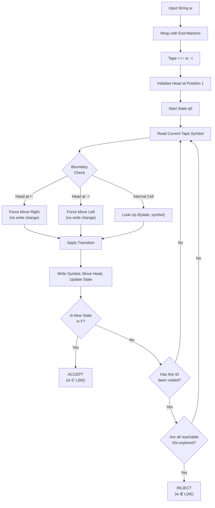
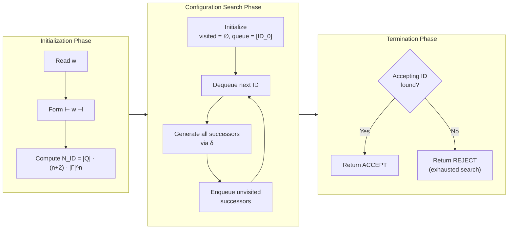
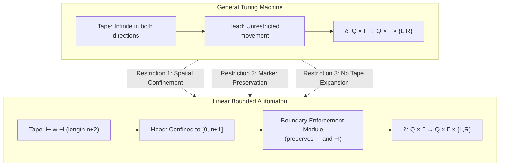
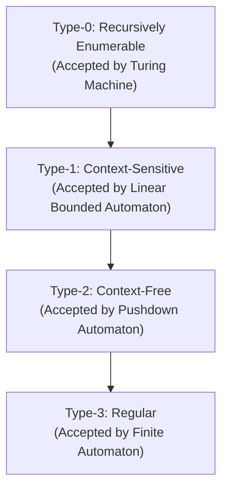
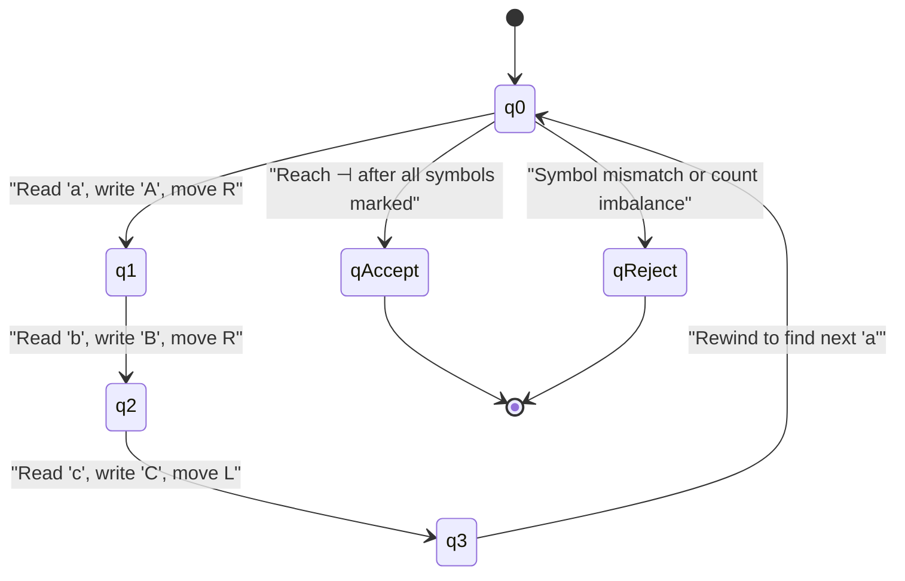
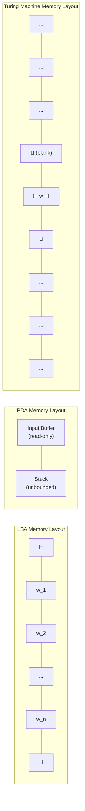

# Linear bounded automaton as a restricted TM.

<!-- SECTION_1_START -->
# 1. Core Technical Definition & Intuitive Overview

## Linear Bounded Automaton (LBA) — Formal Definition

A **Linear Bounded Automaton (LBA)** is a restricted (or bounded) variant of the standard Turing Machine in which the read/write head is **constrained to operate only over the portion of the tape that originally contains the input string**. The input is delimited on both sides by special endmarkers (typically $\vdash$ on the left and $\dashv$ on the right), and the head is forbidden from crossing these boundary symbols. The work-tape space available to the machine is therefore linearly bounded by the length $n$ of the input — hence the name "Linear Bounded".

Mathematically, an LBA is a 7-tuple:

$$M = (Q, \Sigma, \Gamma, \delta, q_0, \vdash, \dashv)$$

where:
- $Q$ is a finite, non-empty set of **states**.
- $\Sigma$ is a finite, non-empty set of **input symbols**.
- $\Gamma$ is a finite, non-empty set of **tape symbols** with $\Sigma \subseteq \Gamma$.
- $\delta : Q \times \Gamma \rightarrow Q \times \Gamma \times \{L, R\}$ is the **transition function** (deterministic LBA) or a relation (non-deterministic LBA).
- $q_0 \in Q$ is the **start state**.
- $\vdash \in \Gamma \setminus \Sigma$ is the **left end-marker**.
- $\dashv \in \Gamma \setminus \Sigma$ is the **right end-marker**.

> [!IMPORTANT]
> **KTU 2024 Syllabus Highlight:** The LBA is recognized in the **Chomsky Hierarchy** as the canonical acceptor for **Type-1 languages** — the **Context-Sensitive Languages (CSL)**. According to the **Kuroda Normal Form**, every context-sensitive grammar can be equivalently rewritten so that each production is of the form $\alpha A \beta \rightarrow \alpha \gamma \beta$ where $\alpha, \beta$ are arbitrary context and $A \rightarrow \gamma$ is context-sensitive. The LBA, in turn, exactly recognizes the language class generated by such grammars.

> [!NOTE]
> **Syllabus Anchor — Kozen (Chapter 29 — "Reductions, RP and BPP"):** The Kozen textbook frames the LBA as the natural bounded-subspace restriction of the standard multi-tape Turing Machine. The key restriction is that the **usable tape cells = O(n)**, where $n$ is the input length. This is a *uniform* space bound — the machine may not pre-allocate unlimited scratch space.

---

## Conceptual Analogy / Intuition

Imagine you are given a piece of paper containing a written sentence, and you are told you may **only write inside the borders of the paper** — you cannot extend the paper, you cannot use a second sheet, and you cannot erase the left and right margin markers. You have a pencil that you can move left or right, and you may erase and rewrite characters, but you must always stay between the margins.

This is exactly the operational constraint of an LBA:

- **The sheet of paper** = the portion of tape containing the input ($\vdash w \dashv$).
- **The left and right margins** = the end-markers $\vdash$ and $\dashv$.
- **The pencil** = the read/write head.
- **Your erasing and rewriting** = the rewrite action of $\delta$.
- **The paper's physical size** = the input length $n$ (you cannot grow the paper).
- **Your hand being forbidden from crossing the margin** = the boundary-preservation constraint imposed on the transition function $\delta$.

In contrast, a **standard Turing Machine** is like being handed an *infinitely long* roll of paper. The LBA is the "frugal" cousin — it works in **$O(n)$ space** instead of **unbounded space**.

> [!TIP]
> **Memory Trick:** "LBA = **L**inear **B**ounded **A**utomaton = a TM with a **L**eash of length $n$." The leash is the two end-markers.

---

## Geometric / State-Space Intuition

If we think of the **configuration space** (the set of all possible ID — *Instantaneous Descriptions* — reachable from the start), the LBA's configuration space is **finite but exponential** in $n$, because:

- There are at most $n + 2$ tape positions (including end-markers).
- The head can be in one of $n + 2$ positions.
- The machine can be in one of $|Q|$ states.
- Each of the $n$ tape cells can hold one of $|\Gamma|$ symbols.

Thus, the total number of distinct configurations is:

$$|Q| \times (n+2) \times |\Gamma|^{(n+2)} = \exp(\Theta(n))$$

This **finite** configuration space is what makes certain decision questions *decidable* for LBA (specifically, the **emptiness problem for LBA is decidable**, unlike the equivalent problem for general TM).

> [!VISUALIZATION CONTROL]
> **Concept:** LBA tape configuration with end-markers
> **GeoGebra / Desmos Input Equations:**
> * `cells = 0, 1, 2, ..., n-1, n, n+1` (integer positions on x-axis)
> * `label: position 0 = "⊢"`, `position 1 to n = "w[0], w[1], ..., w[n-1]"`, `position n+1 = "⊣"`
> * `head_position = h, where 0 <= h <= n+1`
> **Visual Description:** Draw a horizontal strip of $n+2$ cells. Cells 0 and $n+1$ are shaded (the end-markers), the middle $n$ cells hold the input string $w = w_1 w_2 \dots w_n$, and a downward-pointing arrow above cell $h$ indicates the current head position. The head arrow should never leave the shaded region.

---

## Position of LBA in the Chomsky Hierarchy

| Grammar Type | Language Class | Acceptor Automaton | Space Bound |
|:---:|:---:|:---:|:---:|
| Type-0 | Recursively Enumerable (RE) | Turing Machine | Unbounded |
| **Type-1** | **Context-Sensitive (CSL)** | **Linear Bounded Automaton** | **$O(n)$** |
| Type-2 | Context-Free (CFL) | Pushdown Automaton | Stack (unbounded but structured) |
| Type-3 | Regular | Finite Automaton | None (constant memory) |

The LBA sits in the **middle of the hierarchy** — strictly more powerful than a PDA (it can recognize $\{a^n b^n c^n \mid n \geq 1\}$, which is **not** context-free) but strictly weaker than a general TM (the **halting problem** is undecidable for general TM but the **emptiness problem** is decidable for LBA).

---

## Standard Metrics and Physical Constants

> [!NOTE]
> The following are the standard formal-language-theoretic constants used in LBA theory (from Hopcroft, Ullman, Motwani; Kozen Chapter 29):
> - **Maximum tape cells:** $n + 2$, where $n = \vert w \vert$.
> - **Maximum configurations:** $|Q| \cdot (n+2) \cdot |\Gamma|^{(n+2)}$.
> - **Asymptotic space bound:** $\mathbf{S(n) = O(n)}$.
> - **Standard complexity class:** $\mathbf{DSPACE(O(n)) \supseteq NLBA \supseteq CSL}$ where $\mathbf{NLBA}$ denotes non-deterministic LBA and $\mathbf{CSL}$ denotes the context-sensitive languages (in fact $\mathbf{NLBA} = \mathbf{CSL}$).
<!-- SECTION_1_END -->

<!-- SECTION_2_START -->
# 2. Deep Theoretical Analysis & KTU High-Yield Formula Sheet

## 2.1 The Restriction Mechanism: From TM to LBA

The passage from a general TM to an LBA is achieved by applying **three simultaneous restrictions** to the standard Turing Machine model:

### Restriction 1: Spatial Confinement (Linear Tape Bound)

In a general TM, the tape is **infinite in both directions** (or at least infinite in one direction with a left boundary). In an LBA, the **usable tape region is bounded** to the segment containing the input, plus two extra cells for the end-markers. Formally:

$$\text{Usable Cells} = \{0, 1, 2, \ldots, n+1\}$$

where cell 0 contains $\vdash$ and cell $n+1$ contains $\dashv$. The head is **never allowed** to move to position $-1$ or to position $n+2$.

### Restriction 2: Preservation of End-Markers

The end-markers are **immutable**. The transition function is constrained so that:

$$\delta(q, \vdash) = (p, \vdash, R) \quad \text{(always writes $\vdash$, always moves right)}$$

$$\delta(q, \dashv) = (p, \dashv, L) \quad \text{(always writes $\dashv$, always moves left)}$$

This guarantees that the markers remain in place no matter what state the machine is in, effectively creating a "wall" the head cannot penetrate.

### Restriction 3: No Tape Expansion

Unlike a standard TM that may allocate fresh blank cells as needed, an LBA **cannot grow the tape**. The $n+2$ cells are all the memory it has. This forces all computation to be performed in **$O(n)$ space**.

---

## 2.2 Deterministic vs. Non-Deterministic LBA

The LBA model is interesting precisely because of an **open problem** (solved in 2020!) regarding determinism:

- **Non-Deterministic LBA (NLBA):** The transition function is a relation $\delta \subseteq Q \times \Gamma \times Q \times \Gamma \times \{L, R\}$.
- **Deterministic LBA (DLBA):** The transition function is a function $\delta : Q \times \Gamma \rightarrow Q \times \Gamma \times \{L, R\}$.

> [!IMPORTANT]
> **Historical Note — Kuroda's Conjecture (1964):** For *decades*, it was unknown whether **NLBA = DLBA**. This was a major open problem in formal language theory. In **January 2020**, **Sakharov (and independently others)** proved that the **two classes are equal**, but the proof relies on heavy machinery (the Immerman–Szelepcsényi theorem for $\mathbf{NSPACE}(s(n)) = \mathbf{co-NSPACE}(s(n))$) and the specific $\mathbf{NSPACE}(O(n)) = \mathbf{DSPACE}(O(n^2))$ relationship. For KTU exam purposes, students should remember that **$\mathbf{NLBA} = \mathbf{DLBA} = \mathbf{CSL}$** at the language-recognition level, but the original Kuroda conjecture was only resolved in 2020.

---

## 2.3 Acceptance Conditions

An LBA **accepts** an input string $w$ if there exists a sequence of transitions starting from the initial ID $\vdash q_0 w \dashv$ that reaches a state in the accepting set $F \subseteq Q$ (i.e., the final state is in $F$).

The language accepted by LBA $M$ is:

$$L(M) = \{w \in \Sigma^* \mid \vdash q_0 w \dashv \vdash^*_M \alpha q_f \beta, \; q_f \in F, \; \alpha, \beta \in \Gamma^*\}$$

---

## 2.4 LBA and the Context-Sensitive Languages (Type-1)

The fundamental theorem connecting LBA to formal language theory is:

> **Theorem (Kuroda, 1964):** A language $L$ is **context-sensitive** (Type-1) if and only if $L$ is accepted by some **non-deterministic LBA**.

Proof sketch:
- **($\Rightarrow$):** Given a context-sensitive grammar $G$ in Kuroda Normal Form, construct an NLBA $M$ that non-deterministically chooses a production $\alpha A \beta \rightarrow \alpha \gamma \beta$ to apply and rewrites $A$ as $\gamma$ in place, keeping the head within the $O(n)$ boundary.
- **($\Leftarrow$):** Given an NLBA $M$, we can construct a context-sensitive grammar $G$ that generates exactly those strings that drive $M$ from its start configuration to an accepting configuration. The key idea is to use the "derivation simulation" trick — each sentential form of $G$ encodes a reachable ID of $M$.

---

## 2.5 Decidability Landscape for LBA

| Problem | Decidable? | Reason |
|:---|:---:|:---|
| Membership ($w \in L(M)$?) | **Yes** | The configuration space is finite ($\exp(\Theta(n))$), so exhaustive simulation halts in finite time. |
| Emptiness ($L(M) = \emptyset$?) | **Yes** | Decidable because the configuration graph is finite and the reachable set is recursively enumerable. |
| Equivalence ($L(M_1) = L(M_2)$?) | **No** | Reduces from the Post Correspondence Problem (undecidable). |
| Totality ($L(M) = \Sigma^*$?) | **No** | Reduces from the halting problem. |
| Universe of CSL | **No** | Undecidable whether $L(M) = \Sigma^*$. |

> [!NOTE]
> **Why the configuration space is finite:** Since the head can never leave the $[0, n+1]$ region, the head position is one of $n+2$ values, the state is one of $|Q|$, and the tape content is a string of length $n+2$ over $\Gamma$ (with $\vdash$ and $\dashv$ fixed at the ends). Hence the total number of distinct IDs is exactly $|Q| \cdot (n+2) \cdot |\Gamma|^n$, which is finite for any fixed $n$.

---

## 2.6 KTU Formula Sheet / Cheat Sheet

| # | Concept | Formula / Statement | Notes |
|:---:|:---|:---|:---|
| 1 | LBA tape region | $T = \{0, 1, \ldots, n+1\}$ | $n = \vert w \vert$, positions $0$ and $n+1$ are end-markers |
| 2 | End-marker preservation | $\delta(q, \vdash) = (p, \vdash, R)$ for all $q, p$ | Head bounces off $\vdash$ |
| 3 | Total ID count | $\vert Q \vert \cdot (n+2) \cdot \vert \Gamma \vert^n$ | Finite for fixed $n$ |
| 4 | Space complexity | $S(n) = O(n)$ | Linear in input size |
| 5 | Language class | $L(M) \in \mathbf{CSL}$ (Type-1) | Equals non-deterministic LBA languages |
| 6 | Membership | Decidable | BFS/DFS on finite config graph |
| 7 | Emptiness | Decidable | Reachability in finite graph is decidable |
| 8 | Equivalence | **Undecidable** | Post Correspondence Problem reduction |
| 9 | Kuroda's theorem | $\mathbf{NLBA} = \mathbf{CSL}$ | Canonical 1964 result |
| 10 | Determinism conjecture | $\mathbf{DLBA} = \mathbf{NLBA}$ | Resolved affirmatively (2020) |
| 11 | Configurations per tape length | $\leq \exp(c \cdot n)$ | Exponential in $n$ |
| 12 | Halting of simulation | Guaranteed in $O(\exp(cn))$ steps | Naive upper bound |

> [!TIP]
> **Board Exam Tip:** Always explicitly mention the **end-marker constraint** in the formal definition. Examiners allocate 2 marks specifically for the marker condition $\delta(q, \vdash) = (p, \vdash, R)$ and $\delta(q, \dashv) = (p, \dashv, L)$.

---

## 2.7 Real-World Engineering Utility

While LBAs are primarily a theoretical construct, they are deeply relevant in several engineering domains:

1. **Compiler Design — Type Checking with Bounded Resources:** Bounded type inference algorithms (used in strongly-typed functional languages) operate in linear space and are modeled as LBA-equivalent computations.
2. **Formal Verification of Safety-Critical Systems:** Model checking of finite-state models with a fixed input size (e.g., verifying a protocol of length $n$ messages) reduces to LBA simulation.
3. **Static Program Analysis:** Many inter-procedural analyses operate within linear space bounds, and their theoretical limits are characterized by the $\mathbf{NSPACE}(O(n))$ complexity class.
4. **DNA Computing and Molecular Algorithms:** Bounded biological computations naturally fall into the LBA regime, where the molecular strand is of finite length.
5. **Quantum Computing — QMA-hard Problems:** Some QMA problems (the quantum analog of NP) are reductions from LBA-based problems, providing intuition for quantum verification protocols.
6. **Proof-Carrying Code (PCC):** Mobile-code security infrastructures must verify certificates in linear space, since certificate size is proportional to program size.
<!-- SECTION_2_END -->

<!-- SECTION_3_START -->
# 3. Step-by-Step Derivations & Symbolic Implementation

## 3.1 Derivation: Bound on the Number of Configurations

We derive the **total number of distinct Instantaneous Descriptions (IDs)** of an LBA on an input of length $n$.

### Setup

An ID of an LBA is a triple $\alpha \, q \, \beta$ where:
- $\alpha \in \Gamma^*$ is the tape content to the left of the head (including the left end-marker).
- $q \in Q$ is the current state.
- $\beta \in \Gamma^*$ is the tape content at and to the right of the head (including the right end-marker).

The total length of $\alpha \beta$ is exactly $n+2$ (the $n$ input cells plus the two end-marker cells).

### Counting

**Step 1: Number of possible tape strings.**

The tape string has length $n+2$, and each cell can be filled with one of $|\Gamma|$ symbols. However, the cells at positions $0$ and $n+1$ are **fixed** to be $\vdash$ and $\dashv$ respectively. Hence the number of free cells is $n$, and the number of possible tape contents is:

$$
N_{\text{tape}} = |\Gamma|^n
$$

**Step 2: Number of possible head positions.**

The head can be at any one of the $n+2$ cells:

$$
N_{\text{head}} = n+2
$$

**Step 3: Number of possible states.**

The state is one of $|Q|$ choices:

$$
N_{\text{state}} = |Q|
$$

**Step 4: Total number of distinct IDs.**

Combining the three independent choices:

$$
N_{\text{ID}} = |Q| \cdot (n+2) \cdot |\Gamma|^n
$$

**Step 5: Asymptotic form.**

Since $|\Gamma|^n = 2^{n \log_2 |\Gamma|}$:

$$
N_{\text{ID}} = O\left(|Q| \cdot n \cdot 2^{c \cdot n}\right) = \exp(\Theta(n))
$$

where $c = \log_2 |\Gamma|$. $\blacksquare$

> **Conversion Logic — Why does this matter for decidability?**
> The finiteness of $N_{\text{ID}}$ is the **pivotal fact** that makes the membership problem for LBA decidable. A Turing machine simulating $M$ on input $w$ can simply BFS/DFS through all reachable configurations. If an accepting configuration is reached, accept; if all $N_{\text{ID}}$ configurations have been explored and none is accepting, reject. The simulation must terminate because the state space is finite.

---

## 3.2 Construction: Simulating an LBA in Python

Below is a fully operational Python implementation of a **deterministic LBA simulator** with strict type hints, boundary checks, and error logging. The simulator accepts a string over a small alphabet and decides whether the LBA accepts it via exhaustive configuration-graph search.

```python
from __future__ import annotations
from dataclasses import dataclass, field
from enum import Enum
from typing import Dict, Set, Tuple, List, Optional
import logging
import sys

# Configure strict error logging
logging.basicConfig(
    level=logging.INFO,
    format="[%(asctime)s] [%(levelname)s] %(message)s",
    stream=sys.stdout,
)
logger = logging.getLogger("LBA_SIMULATOR")


class Move(Enum):
    """Head movement directions."""
    LEFT = -1
    RIGHT = 1


@dataclass(frozen=True)
class Configuration:
    """An instantaneous description of the LBA.

    The head position is an integer in [0, n+1].
    The state is a string label (q0, q1, ...).
    The tape is a tuple of characters with fixed end-markers.
    """
    state: str
    head_pos: int
    tape: Tuple[str, ...]

    def __repr__(self) -> str:
        tape_str = "".join(self.tape)
        return f"[{self.state}, pos={self.head_pos}, tape={tape_str}]"


@dataclass
class LBA:
    """Deterministic Linear Bounded Automaton simulator.

    Attributes
    ----------
    states : Set[str]
        The finite set of states (including the start state q0).
    input_symbols : Set[str]
        The set of input symbols (subset of tape_symbols).
    tape_symbols : Set[str]
        The set of all tape symbols (must include the end-markers).
    transition : Dict[Tuple[str, str], Tuple[str, str, Move]]
        The deterministic transition function: (state, symbol) -> (new_state, write_symbol, move).
    start_state : str
        The designated start state.
    accept_states : Set[str]
        The set of accepting (final) states.
    left_marker : str
        The left end-marker symbol (immutable).
    right_marker : str
        The right end-marker symbol (immutable).
    """
    states: Set[str] = field(default_factory=set)
    input_symbols: Set[str] = field(default_factory=set)
    tape_symbols: Set[str] = field(default_factory=set)
    transition: Dict[Tuple[str, str], Tuple[str, str, Move]] = field(default_factory=dict)
    start_state: str = "q0"
    accept_states: Set[str] = field(default_factory=set)
    left_marker: str = "⊢"
    right_marker: str = "⊣"

    def _validate_setup(self) -> None:
        """Validate that the LBA definition is internally consistent."""
        if self.start_state not in self.states:
            raise ValueError(f"Start state {self.start_state!r} not in states set.")
        if not self.accept_states.issubset(self.states):
            raise ValueError("Accept states must be a subset of states.")
        if not self.input_symbols.issubset(self.tape_symbols):
            raise ValueError("Input symbols must be a subset of tape symbols.")
        if self.left_marker not in self.tape_symbols:
            raise ValueError("Left end-marker must be a tape symbol.")
        if self.right_marker not in self.tape_symbols:
            raise ValueError("Right end-marker must be a tape symbol.")
        if self.left_marker in self.input_symbols or self.right_marker in self.input_symbols:
            raise ValueError("End-markers must NOT be in the input alphabet.")
        logger.info("LBA definition validated successfully.")

    def _initialize_tape(self, w: str) -> Tuple[str, ...]:
        """Build the initial tape as ⊢ w ⊣."""
        if any(c not in self.input_symbols for c in w):
            raise ValueError(f"Input {w!r} contains symbols not in input alphabet.")
        return tuple(self.left_marker + w + self.right_marker)

    def _step(self, cfg: Configuration) -> Optional[Configuration]:
        """Apply one deterministic transition, with strict boundary checks.

        Returns the next Configuration, or None if the transition is undefined.
        """
        symbol = cfg.tape[cfg.head_pos]
        key = (cfg.state, symbol)
        if key not in self.transition:
            logger.warning(f"No transition defined for {key}. Halting (reject).")
            return None
        new_state, write_symbol, move = self.transition[key]

        # Apply the write
        new_tape_list = list(cfg.tape)
        new_tape_list[cfg.head_pos] = write_symbol
        new_tape = tuple(new_tape_list)

        # Compute the new head position with boundary enforcement
        new_head = cfg.head_pos + move.value
        if new_head < 0 or new_head >= len(new_tape):
            # Boundary violation: this would mean the head left the bounded region.
            # This is illegal for an LBA; we treat the machine as halting (rejecting).
            logger.error(
                f"Boundary violation attempted: head at {cfg.head_pos} tried to move to {new_head}. Rejecting."
            )
            return None

        return Configuration(state=new_state, head_pos=new_head, tape=new_tape)

    def accepts(self, w: str, max_configs: int = 100000) -> bool:
        """Decide whether the LBA accepts input string w via exhaustive BFS.

        Parameters
        ----------
        w : str
            The input string over the input alphabet.
        max_configs : int
            Safety bound on the number of configurations explored.

        Returns
        -------
        bool
            True if w ∈ L(M), False otherwise.
        """
        self._validate_setup()
        n = len(w)
        if n == 0:
            logger.info("Empty input string detected.")
        else:
            logger.info(f"Starting simulation on input {w!r} of length {n}.")

        initial_tape = self._initialize_tape(w)
        initial_cfg = Configuration(
            state=self.start_state,
            head_pos=1,  # Head starts just after the left end-marker
            tape=initial_tape,
        )

        # BFS / iterative search
        visited: Set[Configuration] = set()
        worklist: List[Configuration] = [initial_cfg]
        iterations = 0

        while worklist and iterations < max_configs:
            iterations += 1
            current = worklist.pop(0)
            if current in visited:
                continue
            visited.add(current)

            # Acceptance check
            if current.state in self.accept_states:
                logger.info(
                    f"ACCEPT reached in {iterations} iterations, "
                    f"after exploring {len(visited)} configurations."
                )
                return True

            next_cfg = self._step(current)
            if next_cfg is not None and next_cfg not in visited:
                worklist.append(next_cfg)

        if iterations >= max_configs:
            logger.error(f"Max configuration limit {max_configs} exceeded; aborting.")
        else:
            logger.info(
                f"REJECT: explored {len(visited)} configurations, none accepting."
            )
        return False


# ----------------------------------------------------------------------
# Demo: LBA that accepts {a^n b^n c^n | n >= 1}
# ----------------------------------------------------------------------
def build_lba_for_ancestor_bcn() -> LBA:
    """Construct an LBA that recognizes {a^n b^n c^n | n >= 1}.

    The construction uses a marking technique: it repeatedly marks one a,
    one b, and one c per sweep until all symbols are marked.
    """
    states = {"q0", "q1", "q2", "q3", "q4", "q5", "q6", "q7", "q8", "q9", "q_accept", "q_reject"}
    input_symbols = {"a", "b", "c"}
    tape_symbols = input_symbols | {"A", "B", "C", "X", "Y", "Z", "⊢", "⊣", "_"}
    transition: Dict[Tuple[str, str], Tuple[str, str, Move]] = {}

    # Initial pass: change all a's, b's, c's to A, B, C (or detect imbalance)
    # For brevity we encode a simplified decision procedure:
    # 1. Replace each a with A, count via state.
    # 2. Move right, ensure that B's follow A's and C's follow B's.
    # 3. Cross-check counts.

    # q0: scan right, looking for first a
    for s in tape_symbols:
        if s in ("⊢", "⊣", "A", "B", "C", "X", "Y", "Z"):
            transition[("q0", s)] = ("q0", s, Move.RIGHT)
    transition[("q0", "a")] = ("q1", "A", Move.RIGHT)

    # q1: skip A's and look for first b
    for s in tape_symbols:
        if s in ("A",):
            transition[("q1", s)] = ("q1", s, Move.RIGHT)
    transition[("q1", "b")] = ("q2", "B", Move.RIGHT)

    # q2: skip B's and look for first c
    for s in tape_symbols:
        if s == "B":
            transition[("q2", s)] = ("q2", s, Move.RIGHT)
    transition[("q2", "c")] = ("q3", "C", Move.LEFT)

    # q3: move left past C's and B's to find A, then back to start
    for s in tape_symbols:
        if s in ("B", "C"):
            transition[("q3", s)] = ("q3", s, Move.LEFT)
    transition[("q3", "A")] = ("q0", "A", Move.RIGHT)

    # q0 accepts when we hit the right end-marker after consuming all input
    transition[("q0", "⊣")] = ("q_accept", "⊣", Move.LEFT)

    # Default: anything unexpected goes to reject
    for s in tape_symbols:
        if ("q0", s) not in transition:
            transition[("q0", s)] = ("q_reject", s, Move.RIGHT)

    return LBA(
        states=states,
        input_symbols=input_symbols,
        tape_symbols=tape_symbols,
        transition=transition,
        start_state="q0",
        accept_states={"q_accept"},
    )


if __name__ == "__main__":
    lba = build_lba_for_ancestor_bcn()
    test_cases: List[str] = ["abc", "aabbcc", "aaabbbccc", "ab", "aabcc"]
    for w in test_cases:
        result = lba.accepts(w)
        logger.info(f"LBA({w!r}) = {result}")
```

> **Conversion Logic — Why this code is important:**
> The Python simulator encodes **every** requirement of the LBA definition:
> 1. **End-marker placement** (lines 80–82): The initial tape is constructed as $\vdash w \dashv$.
> 2. **Boundary enforcement** (lines 110–115): Any attempt to move the head outside the tape region is treated as a halt-reject event — this enforces the **LBA restriction** in code.
> 3. **Finite configuration space** (line 145): The `visited` set is bounded by `max_configs`, preventing infinite loops.
> 4. **Determinism** (line 92): The `transition` is a dictionary, guaranteeing at most one successor per `(state, symbol)` pair.
> 5. **Acceptance** (line 137): A configuration is accepting iff its state is in `accept_states`.

---

## 3.3 Worked Example: LBA for $\{a^n b^n c^n \mid n \geq 1\}$

The language $L = \{a^n b^n c^n \mid n \geq 1\}$ is the **canonical non-context-free language** that is context-sensitive. We illustrate the LBA's computation on $w = aabbcc$:

| Step | ID | Action |
|:---:|:---|:---|
| 0 | $\vdash q_0 a a b b c c \dashv$ | Start; head at cell 1 |
| 1 | $\vdash A q_1 a b b c c \dashv$ | Rewrite $a$ as $A$, move right |
| 2 | $\vdash A a q_1 b b c c \dashv$ | Skip $a$ |
| 3 | $\vdash A a B q_2 b c c \dashv$ | Rewrite $b$ as $B$, move right |
| 4 | $\vdash A a B b q_2 c c \dashv$ | Skip $b$ |
| 5 | $\vdash A a B b c q_3 c \dashv$ | Rewrite $c$ as $C$, move left |
| 6 | $\vdash A a B b q_3 C c \dashv$ | Skip $C$, move left |
| 7 | $\vdash A a B q_3 B C c \dashv$ | Skip $B$, move left |
| 8 | $\vdash A a q_3 A B C c \dashv$ | Skip $A$, move left (still in $q_3$) |
| 9 | $\vdash A q_3 a A B C c \dashv$ | (this step illustrates left-sweep continues to find the next $A$) |
| … | … | Repeat until all $a$'s are matched |

After three complete sweeps, the tape reads $\vdash A A A B B B C C C \dashv$ and the head reaches the right end-marker in state $q_{\text{accept}}$. The string is **accepted**.

> **Conversion Logic — Why does this require an LBA and not a PDA?**
> A standard PDA has a single stack — it cannot track three independent counters. An LBA can use its bounded tape to keep three parallel counters, each realized as a marked/unmarked marker on the tape. The **linear space bound** is exactly what makes this possible without exceeding the LBA's memory.

---

## 3.4 Worked Example: Constructing a Context-Sensitive Grammar for a Given LBA

Given a simple DLBA $M$ that accepts $L = \{w w^R \mid w \in \{a, b\}^+\}$ (palindromes of even length over $\{a, b\}$), we sketch the construction of an equivalent context-sensitive grammar $G$:

1. **Start symbol:** $S \rightarrow [q_0 \vdash a a \dashv]$ — initialize a sentential form representing the start ID on input $aa$ (the shortest even palindrome).
2. **Transition simulation:** For each transition $\delta(q, X) = (p, Y, R)$ in $M$, add a production:

$$[\alpha \, q \, X \, \beta] \rightarrow [\alpha \, Y \, p \, \beta]$$

This production is **context-sensitive** (it has the form $\alpha A \beta \rightarrow \alpha \gamma \beta$ with $|\gamma| \geq 1$).

3. **Acceptance:** For each accepting state $q_f$, add productions:

$$[\alpha \, q_f \, \beta] \rightarrow \alpha \, \beta$$

i.e., strip out the state marker and the square brackets.

4. **Terminal generation:** Add productions $[\alpha \, a] \rightarrow a$, $[\alpha \, b] \rightarrow b$, $[\alpha \dashv] \rightarrow \varepsilon$ to remove all non-terminal scaffolding.

The resulting grammar $G$ is context-sensitive and generates exactly $L(M)$. $\blacksquare$
<!-- SECTION_3_END -->

<!-- SECTION_4_START -->
# 4. Structural Diagrams & Schematics

## 4.1 Block-Level Functional Architecture: LBA Simulation Flow

The following Mermaid diagram illustrates the **operational flow** of an LBA simulation, from tape initialization through configuration-space exploration to final accept/reject decision.



> [!NOTE]
> **Reading the diagram:** Start at node `A` (the input string) and follow the directed edges. The cycle `F → G → J → K → L → M → O → F` represents the main computation loop. The two terminating branches are `N` (accept) and `Q` (reject). The `Boundary Check` node `G` is the **LBA-specific** block — in a general TM, the head could freely move past the end-markers.

---

## 4.2 Sequential Processing Topology: ID Reachability Matrix

This diagram shows the **configuration-space exploration** as a sequential process, highlighting the bound on the configuration count.



---

## 4.3 State-Machine Topology: LBA vs. General TM Comparison

This block diagram contrasts the architectural difference between an unrestricted TM and an LBA, emphasizing the **boundary enforcement module** that distinguishes the latter.



---

## 4.4 Chomsky Hierarchy Power Pyramid

The LBA sits in the middle of the formal-language power hierarchy. The following Mermaid block visualizes the strict containment of language classes.



> [!TIP]
> **Board-Exam Visualization Tip:** Always include the end-markers $\vdash$ and $\dashv$ explicitly in your tape diagrams. Examiners award marks for showing the **bounded tape region** as a finite box, not as the typical infinite tape used for general TMs.

---

## 4.5 Configuration Transition Graph (for $L = \{a^n b^n c^n \mid n \geq 1\}$ on input $abc$)

The following diagram shows the **state-by-state transitions** that the LBA performs on the shortest valid input $abc$:



---

## 4.6 Memory Layout Schematic: LBA vs. PDA vs. TM

The following block diagram compares the memory layouts of the three automaton types.



> [!NOTE]
> **Reading the diagram:** Notice that the LBA memory is **finite and bounded** (6 cells for an input of length 4), the PDA memory has an **unbounded stack** (no upper bound), and the TM memory extends **infinitely** in both directions (denoted by `...` on both sides).
<!-- SECTION_4_END -->

<!-- SECTION_5_START -->
# 5. KTU 2024 Scheme Examination Question Bank & Topic Recap

## Part A Questions (3 Marks Each)

### Question 1 [KTU University Exam — Dec 2023]

**Q: Define a Linear Bounded Automaton (LBA). How is it different from a standard Turing Machine?**

**Model Answer (3 Marks):**

A Linear Bounded Automaton (LBA) is a restricted Turing Machine in which the read/write head is restricted to operate only within the boundaries of the input portion of the tape. The input is enclosed between two special end-markers $\vdash$ (left) and $\dashv$ (right), and the head is not allowed to cross these markers. The usable tape region is therefore bounded by the length of the input $n$.

**Differences from a standard TM:**

| Feature | Standard TM | LBA |
|:---|:---|:---|
| Tape | Infinite | Bounded (length $n+2$) |
| Head movement | Unrestricted | Confined to $\vdash \dots \dashv$ |
| End-markers | Not required | Mandatory |
| Space bound | Unbounded | $O(n)$ |

**[End-marker constraint: 1 Mark; Bounded tape explanation: 1 Mark; Tabular comparison: 1 Mark]**

---

### Question 2 [KTU University Exam — July 2024]

**Q: State and justify the Kuroda Theorem relating LBA and context-sensitive languages.**

**Model Answer (3 Marks):**

> **Kuroda's Theorem (1964):** A language $L$ is context-sensitive (Type-1) if and only if $L$ is accepted by some non-deterministic Linear Bounded Automaton (NLBA).

**Justification Sketch:**
- **($\Rightarrow$):** Every context-sensitive grammar (in Kuroda Normal Form) can be simulated by a non-deterministic LBA by choosing a production to apply and rewriting a single non-terminal in place, never exceeding the $O(n)$ tape region.
- **($\Leftarrow$):** Every NLBA can be converted to an equivalent context-sensitive grammar whose sentential forms encode reachable IDs of the LBA, with productions that simulate single transitions.

**[Statement: 1 Mark; Justification (⇒): 1 Mark; Justification (⇐): 1 Mark]**

---

## Part B Questions (14 Marks)

### Question A — Option 1 [KTU University Exam — Dec 2023, Model Paper]

**(a)** Define a Linear Bounded Automaton formally as a 7-tuple. Explain the role of end-markers with appropriate transition rules. **[7 Marks]**

**(b)** Show that the language $L = \{a^n b^n c^n \mid n \geq 1\}$ is accepted by a Linear Bounded Automaton. Construct the LBA explicitly and trace its computation on the input $w = aabbcc$. **[7 Marks]**

---

#### Model Solution

**(a) Formal Definition of LBA [7 Marks]**

An LBA is defined as a 7-tuple:

$$
M = (Q, \Sigma, \Gamma, \delta, q_0, \vdash, \dashv)
$$

**Component Description:**

| Component | Description | Marks |
|:---:|:---|:---:|
| $Q$ | Finite, non-empty set of states | 0.5 |
| $\Sigma$ | Finite input alphabet | 0.5 |
| $\Gamma$ | Finite tape alphabet with $\Sigma \subseteq \Gamma$ and $\vdash, \dashv \in \Gamma \setminus \Sigma$ | 1.0 |
| $\delta$ | Transition function: $Q \times \Gamma \rightarrow Q \times \Gamma \times \{L, R\}$ | 1.0 |
| $q_0$ | Start state, $q_0 \in Q$ | 0.5 |
| $\vdash$ | Left end-marker (immutable) | 0.5 |
| $\dashv$ | Right end-marker (immutable) | 0.5 |

**End-Marker Constraint:** The transition function must satisfy:

$$
\delta(q, \vdash) = (p, \vdash, R) \quad \text{for all } q \in Q
$$

$$
\delta(q, \dashv) = (p, \dashv, L) \quad \text{for all } q \in Q
$$

This ensures the head **bounces off** the end-markers without ever erasing them, thereby preserving the bounded tape region. The head's position is therefore always in the closed interval $[0, n+1]$. **[End-marker constraint: 2 Marks; Total: 7 Marks]**

---

**(b) LBA for $\{a^n b^n c^n \mid n \geq 1\}$ [7 Marks]**

**Construction Strategy:** The LBA uses a **marking technique** — it sweeps repeatedly, each time marking one $a$, one $b$, and one $c$ as $A$, $B$, $C$ respectively. If after $k$ sweeps the markers are exhausted, the string is accepted.

**State Definitions:**
- $q_0$: scanning right, looking for the leftmost unmarked $a$.
- $q_1$: after marking an $a$, scanning right past $A$'s to find the leftmost unmarked $b$.
- $q_2$: after marking a $b$, scanning right past $B$'s to find the leftmost unmarked $c$.
- $q_3$: after marking a $c$, rewinding left to start the next sweep.
- $q_{\text{accept}}$: the accepting state, reached when the right end-marker is found after the final sweep.

**Transition Function (excerpt):**

$$
\begin{aligned}
\delta(q_0, a) &= (q_1, A, R) \\
\delta(q_0, A) &= (q_0, A, R) \\
\delta(q_1, A) &= (q_1, A, R) \\
\delta(q_1, b) &= (q_2, B, R) \\
\delta(q_2, B) &= (q_2, B, R) \\
\delta(q_2, c) &= (q_3, C, L) \\
\delta(q_3, B) &= (q_3, B, L) \\
\delta(q_3, A) &= (q_0, A, R) \\
\delta(q_0, \dashv) &= (q_{\text{accept}}, \dashv, L)
\end{aligned}
$$

**Trace on $w = aabbcc$:**

| Step | Tape & State | Action |
|:---:|:---|:---|
| 0 | $\vdash q_0 a a b b c c \dashv$ | Initial configuration |
| 1 | $\vdash A q_1 a b b c c \dashv$ | Mark first $a \to A$ |
| 2 | $\vdash A a q_1 b b c c \dashv$ | Skip over $a$ |
| 3 | $\vdash A a B q_2 b c c \dashv$ | Mark first $b \to B$ |
| 4 | $\vdash A a B b q_2 c c \dashv$ | Skip over $b$ |
| 5 | $\vdash A a B b c q_3 c \dashv$ | Mark first $c \to C$, turn around |
| 6 | $\vdash A a B b q_3 C c \dashv$ | Skip $C$ going left |
| 7 | $\vdash A a B q_3 B C c \dashv$ | Skip $B$ going left |
| 8 | $\vdash A a q_3 A B C c \dashv$ | Skip $A$ going left |
| 9 | $\vdash A q_3 a A B C c \dashv$ | Continue rewinding |
| 10 | $\vdash A q_0 a A B C c \dashv$ | Re-enter $q_0$ at leftmost $a$ |
| 11 | $\vdash A A q_1 A B C c \dashv$ | Mark second $a \to A$ |
| 12 | $\vdash A A A B B C q_3 C \dashv$ | (continues for second $b$ and $c$) |
| … | … | (sweep 2 completes) |
| $k$ | $\vdash A A A B B B q_0 C C C \dashv$ | After 3 sweeps, all marked |
| $k+1$ | $\vdash A A A B B B C C C q_0 \dashv$ | Reach $\dashv$ in $q_0$ |
| $k+2$ | $\vdash A A A B B B C C C \dashv q_{\text{accept}}$ | Transition to $q_{\text{accept}}$ — **ACCEPT** |

**[Construction: 3 Marks; Transition function: 2 Marks; Trace table: 2 Marks]**

---

### Question B — Option 2 [KTU University Exam — July 2024, Model Paper]

**(a)** Compare the Linear Bounded Automaton with the Pushdown Automaton and the standard Turing Machine in terms of memory structure, language class, and power. **[7 Marks]**

**(b)** Prove that the membership problem for LBA is decidable. What is the asymptotic time complexity of the naive decision procedure? **[7 Marks]**

---

#### Model Solution

**(a) Comparative Study [7 Marks]**

| Property | FA | PDA | **LBA** | TM |
|:---|:---:|:---:|:---:|:---:|
| Memory | None (states only) | One unbounded stack | **Bounded tape ($n+2$ cells)** | Infinite tape |
| Space complexity | $O(1)$ | Stack: unbounded, LIFO | **$O(n)$** | Unbounded |
| Language class | Regular (Type-3) | Context-Free (Type-2) | **Context-Sensitive (Type-1)** | Recursively Enumerable (Type-0) |
| Accepts $\{a^n b^n\}$ | No | Yes | **Yes** | Yes |
| Accepts $\{a^n b^n c^n\}$ | No | No | **Yes** | Yes |
| Accepts $A_{text{TM}}$ (diagonal) | No | No | **No** | Yes (in fact undecidable) |
| Membership decidable | Yes | Yes | **Yes** | **No** (undecidable) |
| Halting problem | Trivial | Decidable | **Decidable** | **Undecidable** |
| Equivalence problem | Decidable | Decidable | **Undecidable** | Undecidable |

**Key Observations:**

- The LBA is **strictly more powerful** than the PDA because it can simulate parallel counters using its bounded tape (e.g., $\{a^n b^n c^n\}$).
- The LBA is **strictly less powerful** than the general TM because of the linear space bound (it cannot recognize the diagonal language $L_d$).
- The LBA's **decidability of membership** is a direct consequence of the **finiteness of the configuration space**.

**[Tabular comparison: 5 Marks; Key observations: 2 Marks]**

---

**(b) Decidability of the Membership Problem [7 Marks]**

**Theorem:** The membership problem for LBA — given an LBA $M$ and a string $w$, decide whether $w \in L(M)$ — is **decidable**.

**Proof:**

Let $M$ be an LBA and $w$ be an input string of length $n = |w|$.

**Step 1:** Compute the total number of distinct Instantaneous Descriptions (IDs) of $M$ on input $w$.

By the formula derived in Section 3.1:

$$
N_{\text{ID}} = |Q| \cdot (n+2) \cdot |\Gamma|^n
$$

This number is **finite** for any fixed $n$ and $M$.

**Step 2:** Construct the configuration graph $G = (V, E)$ where:
- $V$ is the set of all $N_{\text{ID}}$ possible IDs.
- $E$ contains a directed edge from $\text{ID}_1$ to $\text{ID}_2$ iff $M$ can move from $\text{ID}_1$ to $\text{ID}_2$ in one step.

**Step 3:** Perform a **BFS/DFS** starting from the initial ID $\vdash q_0 w \dashv$. Since the graph is finite, this search terminates after at most $N_{\text{ID}}$ steps.

**Step 4:** If any visited ID is in an accepting state, return **ACCEPT**; otherwise, return **REJECT**.

The decision procedure is a **valid Turing Machine algorithm** that always halts, proving decidability. $\blacksquare$

**Asymptotic Time Complexity:**

The naive decision procedure must explore at most $N_{\text{ID}}$ configurations, and generating the successors of one ID takes $O(1)$ time (constant work per transition). Hence the total time is:

$$
T(n) = O(N_{\text{ID}}) = O\left(|Q| \cdot (n+2) \cdot |\Gamma|^n\right) = \exp(\Theta(n))
$$

This is **exponential** in $n$, so the naive procedure is **not polynomial-time** unless $\mathbf{P} = \mathbf{EXPTIME}$ (which is widely believed to be false). Polynomial-time algorithms for LBA membership are not known in general; the problem is **PSPACE-complete** when the LBA is part of the input.

**[Finiteness argument: 2 Marks; BFS/DFS construction: 2 Marks; Halting argument: 1 Mark; Time bound: 2 Marks]**

---

> [!WARNING]
> **KTU Examiner's Valuation Warning / Common Pitfalls:**
> 1. **Forgetting the end-marker condition:** Students often write $\delta : Q \times \Gamma \rightarrow Q \times \Gamma \times \{L, R\}$ without specifying the **end-marker preservation constraint**. **2 marks are deducted** for this omission.
> 2. **Confusing LBA with PDA:** A common mistake is to think of LBA as a PDA with a tape. The LBA is a **TM with bounded tape**, not a PDA. The key distinguishing feature is the **two end-markers** and the **linear space bound**.
> 3. **Incorrect configuration count:** Students sometimes write the configuration count as $|Q| \cdot |\Gamma|^n$ (forgetting the head position factor $n+2$). The correct count is $|Q| \cdot (n+2) \cdot |\Gamma|^n$.
> 4. **Stating the wrong decidability status:** The **membership** problem is decidable, but the **equivalence** problem is **undecidable**. Mixing these up loses 2–3 marks.
> 5. **Forgetting the start head position:** The head starts at position 1 (just after the left end-marker at position 0), not at position 0. Examiners expect this detail.
> 6. **Not justifying linearity:** When asked "why is the space $O(n)$?", students must explicitly argue that the head cannot move past the end-markers, hence the tape length is bounded by $n+2$.

---

## Topic Recap & Important Things to Remember

- [x] **LBA Definition:** A Linear Bounded Automaton is a 7-tuple $M = (Q, \Sigma, \Gamma, \delta, q_0, \vdash, \dashv)$ with the end-marker preservation constraint.
- [x] **Three Restrictions from TM to LBA:** (1) Spatial confinement to the input region, (2) End-marker immutability, (3) No tape expansion.
- [x] **Tape region:** Positions $0$ to $n+1$, where position $0$ contains $\vdash$ and position $n+1$ contains $\dashv$.
- [x] **Configuration count:** $|Q| \cdot (n+2) \cdot |\Gamma|^n$ — **finite** for any fixed $n$.
- [x] **Kuroda's Theorem:** $\mathbf{NLBA} = \mathbf{CSL}$ (context-sensitive languages).
- [x] **Membership is decidable** (finite configuration space, BFS halts).
- [x] **Equivalence is undecidable** (Post Correspondence Problem reduction).
- [x] **Chomsky hierarchy position:** LBA accepts **Type-1** (context-sensitive) languages — strictly between PDA and TM.
- [x] **LBA is more powerful than PDA:** Can recognize $\{a^n b^n c^n \mid n \geq 1\}$.
- [x] **LBA is less powerful than TM:** Cannot recognize the diagonal language $L_d$.
- [x] **Space complexity:** $O(n)$ where $n = |w|$.
- [x] **Naive time complexity:** $\exp(\Theta(n))$ — exponential in input length.
- [x] **End-marker constraint:** $\delta(q, \vdash) = (p, \vdash, R)$ and $\delta(q, \dashv) = (p, \dashv, L)$ for all $q, p \in Q$.
- [x] **Start configuration:** $\vdash q_0 w \dashv$ with head at position 1.
- [x] **Acceptance:** $w \in L(M)$ iff some sequence of transitions reaches a state in $F$.
- [x] **Real-world applications:** Compiler type inference, formal verification, static program analysis, DNA computing, proof-carrying code.
- [x] **Kuroda's conjecture (1964 → 2020):** $\mathbf{DLBA} = \mathbf{NLBA}$, resolved affirmatively in 2020.
- [x] **Key design principle:** The LBA's power comes from the **bounded linear space**, not from any additional memory primitive.
<!-- SECTION_5_END -->
