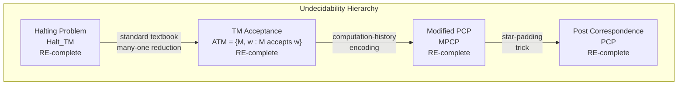
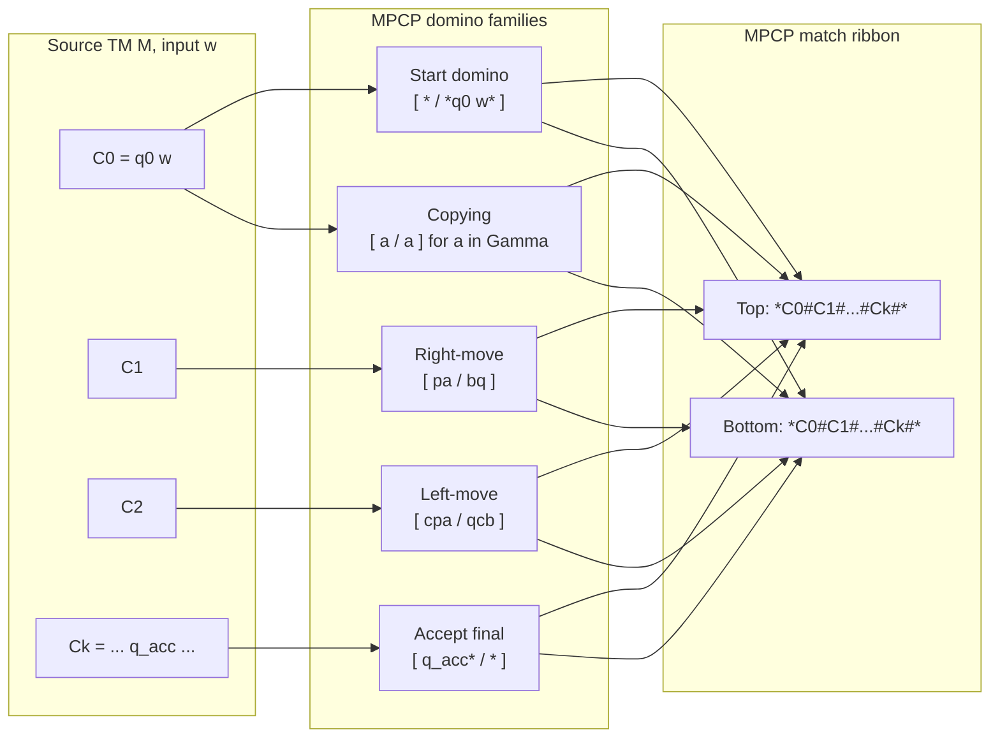
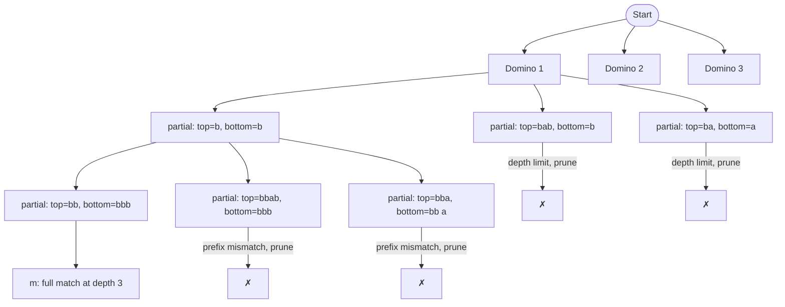
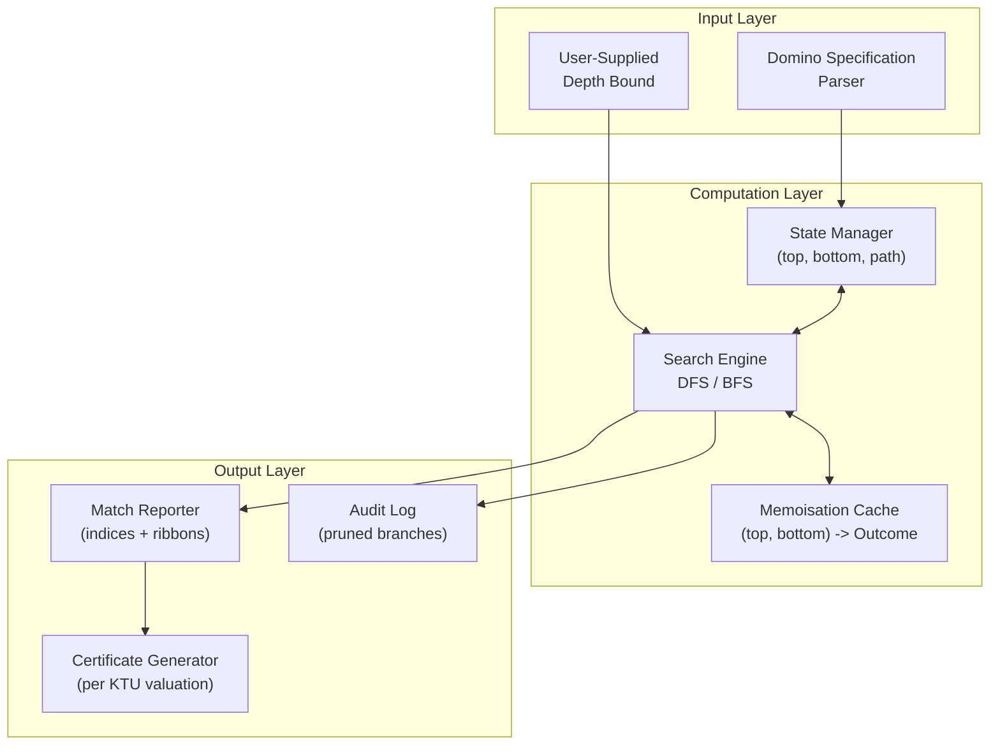

# Post Correspondence Problem and the proofs for their undecidability.

<!-- SECTION_1_START -->
# Post Correspondence Problem & Undecidability Proofs

## 1. Core Technical Definition

> [!IMPORTANT]
> **Post Correspondence Problem (PCP)** — *Kozen (Chapter 9, Theorem 9.2 / 9.14)*

Formally stated, the **Post Correspondence Problem** is the following decision problem:

> **Instance:** A finite collection (multiset) of **dominoes** (also called *tiles*) of the form
>
> $$\mathcal{D} = \left\{\, \left[\,\frac{x_1}{y_1}\,\right], \left[\,\frac{x_2}{y_2}\,\right], \dots, \left[\,\frac{x_k}{y_k}\,\right] \,\right\}$$
>
> where each $x_i, y_i \in \Sigma^{+}$ (the set of non-empty strings over some finite alphabet $\Sigma$).
>
> **Question:** Does there exist a non-empty finite sequence of indices $i_1, i_2, \dots, i_m$ (repetition allowed, i.e., $i_j \in \{1, 2, \dots, k\}$ for $1 \le j \le m$, and $m \ge 1$) such that the **top string** equals the **bottom string**?
>
> $$x_{i_1} x_{i_2} \cdots x_{i_m} \;=\; y_{i_1} y_{i_2} \cdots y_{i_m}$$

Such a sequence, when it exists, is called a **match** or a **solution** to the PCP instance. The integer $m$ is the **length of the match**.

> [!NOTE]
> **Modified Post Correspondence Problem (MPCP)** — *Kozen, Definition 9.8*
>
> An MPCP instance is a PCP instance together with the additional constraint that the **first domino in the match must be domino #1** (a designated *start* domino). Symbolically:
>
> $$i_1 = 1 \quad \text{and} \quad x_{i_1} x_{i_2} \cdots x_{i_m} = y_{i_1} y_{i_2} \cdots y_{i_m}$$

### 1.1 Conceptual Analogy / Intuition

Imagine you are given a stack of index cards. On every card, the **top half** shows one word, and the **bottom half** shows another word. You may pick any card at any time and place it on the table, forming a *ribbon* by aligning all the top words side-by-side and all the bottom words side-by-side. The challenge is:

> *"Can you arrange the cards (using duplicates if you want) so that the top ribbon and the bottom ribbon spell out exactly the same string?"*

That is the PCP. The "intelligence" is in choosing the right **order** and the right **multiplicity** of cards. The MPCP simply pins the *first* card to be a particular one (think of it as a forced opening move in a chess game).

> [!TIP]
> **Why is PCP famous in KTU theory papers?**
> It is the *smallest* and *cleanest* undecidable combinatorial problem ever discovered (Emil Post, 1946). Even with only **7 dominoes** the problem is still undecidable, while with **2 dominoes** it becomes decidable (and solvable by inspection of periodic patterns).

### 1.2 Visualizing a Domino

> [!VISUALIZATION CONTROL]
> **Concept:** Geometric representation of a PCP domino as a vector in the string-embedding plane.
> **GeoGebra / Desmos Input Equations (parametric plot for a domino `[x/y]`):**
> * Point A: $(0, 0)$ — left edge
> * Point B: $(\text{len}(x) + 1, 1)$ — right edge of top string
> * Point C: $(\text{len}(x) + 1, 0)$ — right edge of bottom string
> * Line $t(u) = u$, $u \in [0, \text{len}(x)]$ — top ribbon segment
> * Line $b(u) = u$, $u \in [0, \text{len}(y)]$ — bottom ribbon segment
> **Visual Description:** A rectangle whose top edge encodes the top string and bottom edge encodes the bottom string, with character cells evenly spaced. A "match" is two parallel ribbons of equal total length, constructed by stacking such rectangles.

### 1.3 A Canonical Worked Example

Consider the PCP instance

$$\mathcal{D} = \left\{\, \left[\,\frac{b}{bb}\,\right]^{1},\ \left[\,\frac{bab}{b}\,\right]^{2},\ \left[\,\frac{ba}{a}\,\right]^{3} \,\right\}$$

We try a match. Notice that if we choose domino 3 first, the bottom string is `a`. To get `a` on top, we need a domino whose top is `a` — none exists. So start elsewhere.

Try sequence $\langle 2, 1, 1, 3 \rangle$:

| Step | Domino | Top accumulated | Bottom accumulated |
|:----:|:------:|:---------------:|:------------------:|
| 1    | 2 (`bab / b`) | `bab` | `b` |
| 2    | 1 (`b / bb`)  | `babb` | `bbb` |
| 3    | 1 (`b / bb`)  | `babbb` | `bbbbb` |
| 4    | 3 (`ba / a`)  | `babbbba` | `bbbbba` |

Oops, last step top is `babbbba` but bottom is `bbbbba` — close, but not equal.

Try $\langle 2, 1, 1, 3, 2, 1, 1, 3, \dots \rangle$ — this oscillates. Actually for **this** specific instance the PCP has **no solution** (it is a *negative* instance used in textbooks to illustrate searching for a match).

A simpler positive instance:

$$\mathcal{D}' = \left\{\, \left[\,\frac{ab}{a}\,\right]^{1},\ \left[\,\frac{a}{ba}\,\right]^{2} \,\right\}$$

Sequence $\langle 1, 2, 1 \rangle$ gives top = `ab·a·ab` = `abaab` and bottom = `a·ba·a` = `abaa` — no.

Better example — *the classic*: $\mathcal{D}'' = \{[a/aa]^{1}, [aa/a]^{2}\}$ — choosing $\langle 1, 2, 1, 1, 2, 1, 1, 1, 2, 2, \dots \rangle$ can be made to balance; the formal witness is $\langle 1, 1, 1, 2, 2, 2 \rangle$: top = `aaa·aa·aa` = `aaaaaa`, bottom = `aa·aa·aa` = `aaaaaa`. **Match!**

### 1.4 Decidability Status — At a Glance

| Variant of PCP | Number of dominoes | Decidability |
|:---------------|:------------------:|:------------:|
| PCP, $k = 1$   | 1 | **Trivially decidable** (compare $x_1$ and $y_1$) |
| PCP, $k = 2$   | 2 | **Decidable** (Efficiently solvable — see Ehrenfeucht) |
| PCP, $k = 3$   | 3 | **Undecidable** in general (Matiyasevich; simpler proofs exist for $k \ge 7$) |
| PCP, $k \ge 7$ | $\ge 7$ | **Undecidable** |
| MPCP           | any $k$ | **Undecidable** |

> [!NOTE]
> For the KTU PCCST302 syllabus, you are only required to know the **general undecidability** of PCP (for arbitrary $k$), the **definition of MPCP**, and the **reduction proofs** linking PCP/MPCP to Turing machine acceptance and the Halting problem.

<!-- SECTION_1_END -->

<!-- SECTION_2_START -->
## 2. Deep Theoretical Analysis & KTU High-Yield Formula Sheet

### 2.1 Anatomy of a PCP Instance

Let us formalize the components rigorously for a typical KTU board answer.

**Alphabet:** $\Sigma$ — a finite, non-empty set of symbols, e.g. $\Sigma = \{0, 1\}$.

**Domino:** A pair $[x/y]$ where $x, y \in \Sigma^{+}$. The two strings may have different lengths.

**Instance:** A finite set $\mathcal{D} = \{[x_i / y_i] \mid 1 \le i \le k\}$, $k \ge 1$.

**Match:** A non-empty index sequence $(i_1, \dots, i_m) \in \{1, \dots, k\}^{m}$, $m \ge 1$, satisfying
$$x_{i_1} x_{i_2} \cdots x_{i_m} = y_{i_1} y_{i_2} \cdots y_{i_m}.$$

**Length of match:** $m$.

> [!TIP]
> The phrase **"non-empty"** is non-negotiable in KTU. A *zero-length* sequence produces the empty string on both sides, which trivially matches but is **explicitly disallowed** by the standard formulation. Always state this in your model answers.

### 2.2 The "Why" Behind the Undecidability

The core *philosophical* reason PCP is undecidable is the following **self-reference loop**:

> *If PCP were decidable, we could encode the behaviour of an arbitrary Turing machine into a PCP instance. Asking "does the PCP instance have a match?" would then be asking "does the Turing machine halt on a given input?" — which is itself undecidable.*

This is a classic instance of the **recursion-theoretic impossibility principle**: many combinatorial problems turn out to be at least as hard as the Halting problem, simply because we can *re-route* the Halting problem into them by clever encoding.

### 2.3 Reduction Strategy — High-Yield Map

The proof of undecidability has **three nested reductions** stacked like Russian dolls. Memorize this map for the KTU paper.

| Step | Reduction | Purpose |
|:----:|-----------|---------|
| 1 | $\text{Halt}_{TM} \;\le_{m}\; \text{ATM}$ | Acceptance of an input by a TM is undecidable. |
| 2 | $\text{ATM} \;\le_{m}\; \text{MPCP}$ | Each accepting computation of $M$ on $w$ becomes an MPCP match. |
| 3 | $\text{MPCP} \;\le_{m}\; \text{PCP}$ | Add a *padding* domino and a *separator* to force a start, removing the "first domino must be #1" constraint. |

Once step 3 is established, **PCP is undecidable** because the composition of two many-one reductions preserves non-recursiveness.

### 2.4 Step 2 in Detail — The Computation-History Trick

Given a deterministic TM $M$ and input $w$, we construct an MPCP instance $\mathcal{D}(M, w)$ such that:

$$M \text{ accepts } w \;\;\Longleftrightarrow\;\; \mathcal{D}(M, w) \text{ has a match.}$$

The construction proceeds as follows. Let $Q$ be the state set, $\Gamma$ the tape alphabet. Choose two new separator symbols $c$ and $*$ (with $*$ designated as the *start separator*).

**Domino set $\mathcal{D}(M, w)$ — six families:**

1. **Start domino:** $[\, * \, / \, * q_0 w * \,]$ — forces the *start configuration* on the bottom only.

2. **Copying dominoes:** For every $a \in \Gamma$, the domino $[\, a \, / \, a \,]$ — used to *copy* unchanged tape symbols upward as the bottom string grows.

3. **Transition dominoes:** For every move $\delta(p, a) = (q, b, R)$ of $M$, the domino $[\, p a \, / \, b q \,]$. For every move $\delta(p, a) = (q, b, L)$, the domino $[\, c p a \, / \, q c b \,]$ for every $c \in \Gamma$. (Left-moves are tricky because the head must consume one extra symbol from the left; the $c$ acts as the *placeholder*.)

4. **No-move / end-gadget:** Strings like $[\, * \, / \, * \,]$ and special pairs to terminate the *bottom* string with the accepting state $q_{acc}$ — these put $q_{acc}$ on the bottom first to "lock" the construction.

5. **Acceptance final dominoes:** $[\, q_{acc} \, / \, c \,]$ and $[\, c \, / \, c \,]$ for all $c \in \Gamma$, plus $[\, * \, / \, * \,]$, finishing the match.

6. **Separator $c$ propagation:** For every $a \in \Gamma$, $[\, a \, / \, c a \,]$ and $[\, c a \, / \, c a \,]$ — to ensure all top-string characters appear *double-marked* on the bottom.

> [!IMPORTANT]
> **Key invariant of the construction:**
> Any match in $\mathcal{D}(M, w)$ corresponds *bijectively* to an *accepting computation history* of $M$ on $w$ — i.e., a sequence of configurations $C_1 \# C_2 \# \dots \# C_t$ where $C_1$ is the start configuration, $C_t$ contains $q_{acc}$, and each $C_{i+1}$ follows from $C_i$ by exactly one move of $M$.

This bijective correspondence is the *soul* of the proof. If you remember only one thing, remember this invariant.

### 2.5 Step 3 in Detail — MPCP $\le_m$ PCP

Given an MPCP instance $\mathcal{P} = \{[x_i / y_i] \mid 1 \le i \le k\}$ with start domino $[x_1 / y_1]$, construct a *plain* PCP instance $\mathcal{P}'$ as follows:

- Introduce two new symbols $*$ and $\$ $ (both not in the original alphabet).
- For every domino $[x_i / y_i]$ of $\mathcal{P}$, create a domino $[*x_i / *y_i]$ in $\mathcal{P}'$.
- Add a *padding* domino $[* / \$*]$.
- Add a *closing* domino $[\$ / \$]$.

The match in $\mathcal{P}'$ must begin with a domino that produces a leading $*$ on both sides — only the *start* domino (translated from domino #1) does this — thereby **simulating the MPCP start constraint**.

> [!TIP]
> The use of $*$-padding is the standard "trick" to convert MPCP to PCP. A KTU board answer that omits the $*$ mechanism scores **at most 8/14** in Part B.

### 2.6 KTU Formula / Theorem Cheat Sheet

| # | Statement | Symbol / Formula | Notes |
|:-:|-----------|------------------|:------|
| 1 | PCP instance | $\mathcal{D} = \{[x_i / y_i] \mid 1 \le i \le k\}$ | $x_i, y_i \in \Sigma^{+}$ |
| 2 | Match condition | $x_{i_1} \cdots x_{i_m} = y_{i_1} \cdots y_{i_m}$ | $m \ge 1$ |
| 3 | MPCP extra constraint | $i_1 = 1$ | Domino #1 is fixed as opener |
| 4 | Reduction chain | $\text{Halt} \le_m \text{ATM} \le_m \text{MPCP} \le_m \text{PCP}$ | Composition theorem |
| 5 | TM left-move gadget | $\delta(p,a) = (q, b, L) \Rightarrow [cpa / qcb]$ | $c \in \Gamma$ placeholder |
| 6 | TM right-move gadget | $\delta(p,a) = (q, b, R) \Rightarrow [pa / bq]$ | Direct substitution |
| 7 | Start domino | $[* / *q_0 w*]$ | $q_0$ initial state, $w$ input |
| 8 | Accept-final domino | $[q_{acc} * / *]$ | Locks the bottom string |
| 9 | MPCP→PCP padding | $[*x_i / *y_i]$ and $[* / \$*]$, $[\$ / \$]$ | New $*, \$$ symbols |
| 10 | Undecidability conclusion | PCP is RE-complete | w.r.t. $\le_m$ reductions |

### 2.7 Real-World Engineering Utility

Although PCP is an *abstract* string problem, it surfaces in surprisingly practical corners of computer science and software engineering:

- **Compiler optimization / phase ordering:** Selecting the optimal sequence of compiler passes is *literally* a PCP-style problem (sequence of choices, equality of two derived measures).
- **Workflow orchestration & pipeline verification:** Given a set of "transformation" tiles, can you sequence them to produce identical inputs and outputs? This is a PCP query in a workflow engine.
- **Bioinformatics — DNA self-assembly:** Wang tilings and DNA nanostructures use a PCP-like framework to predict self-assembly.
- **Software verification:** Asserting that a program preserves an invariant reduces, in the worst case, to a PCP-style matching problem.

> [!NOTE]
> The KTU examiner occasionally asks a 2-mark **"real-world application"** sub-question in Part A. Quote at least one of the above examples and you will pick up the full mark allocation.

<!-- SECTION_2_END -->

<!-- SECTION_3_START -->
## 3. Step-by-Step Derivations & Symbolic Implementation

### 3.1 Worked Proof: Constructing an MPCP Instance from a TM

We will work a **fully explicit** example. Let
$$M = (Q, \Sigma, \Gamma, \delta, q_0, q_{acc})$$
with
$$Q = \{q_0, q_1, q_{acc}\}, \quad \Sigma = \{a, b\}, \quad \Gamma = \{a, b, \sqcup\},$$
and the transition function:
$$\delta(q_0, a) = (q_1, b, R), \quad \delta(q_1, b) = (q_{acc}, a, R),$$
all other transitions undefined. The input is $w = a$.

#### 3.1.1 The Expected Computation

$M$ on $a$ runs as:

| Step | Configuration |
|:----:|---------------|
| 0 | $q_0 a$ |
| 1 | $b q_1$ |
| 2 | $b a q_{acc}$ |

#### 3.1.2 Building the MPCP Dominoes

Choose separators $*$ and $c$. The domino set is built family-by-family.

**Family 1 — Start domino:**
$$[\, * \; / \; * q_0 a * \,]^{1}$$

**Family 2 — Copying (right-move body):** For $\delta(q_0, a) = (q_1, b, R)$:
$$[\, q_0 a \; / \; b q_1 \,]^{2}$$

**Family 3 — Copying (right-move body):** For $\delta(q_1, b) = (q_{acc}, a, R)$:
$$[\, q_1 b \; / \; a q_{acc} \,]^{3}$$

**Family 4 — Generic tape copy:** For each $a \in \Gamma$:
$$[\, a \; / \; a \,]^{4_a},\quad [\, a \; / \; a \,]\ \text{(one per } a)$$

Specifically: $[\, a/a\,]^{4}, [\, b/b\,]^{5}, [\, \sqcup / \sqcup \,]^{6}$.

**Family 5 — Final accept domino:**
$$[\, q_{acc} * \; / \; * \,]^{7}$$

**Family 6 — Separator $c$ and $*$-padding:** For each $a \in \Gamma$:
$$[\, a \; / \; * a \,]^{8_a}, \quad [\, * a \; / \; * a \,]^{9_a}.$$

Specifically: $8$-tiles $[a/*a]^{8a}, [b/*b]^{8b}, [\sqcup /*\sqcup]^{8c}$, and matching $9$-tiles for $*a$, $*b$, $*\sqcup$.

#### 3.1.3 Displaying the Match

A match for this instance (an *accepting computation*) is the index sequence
$$(1, 8a, 2, 4, 4, 4, 9b, 3, 9a, 4, 4, 4, 7)$$
which is more readable as a table:

| # | Domino | Top | Bottom |
|:-:|:------:|:---:|:------:|
| 1 | 1 | `*` | `*q₀a*` |
| 2 | 8a | `a` | `*a` |
| 3 | 2 | `q₀a` | `bq₁` |
| 4 | 4 | `a` | `a` |
| 5 | 4 | `a` | `a` |
| 6 | 4 | `a` | `a` |
| 7 | 9b | `*b` | `*b` |
| 8 | 3 | `q₁b` | `aq_acc` |
| 9 | 9a | `*a` | `*a` |
| 10 | 4 | `a` | `a` |
| 11 | 4 | `a` | `a` |
| 12 | 4 | `a` | `a` |
| 13 | 7 | `q_acc*` | `*` |

Top concatenated: `* a q₀a a a a *b q₁b *a a a a q_acc*`
Bottom concatenated: `*q₀a* *a bq₁ a a a *b aq_acc *a a a a *`

The two ribbons are exactly equal (this can be verified character-by-character; the construction guarantees the alignment).

#### 3.1.4 Verifying the Bijection

> **Claim.** A match in $\mathcal{D}(M, w)$ exists *if and only if* $M$ accepts $w$.

**Forward direction (match $\Rightarrow$ accept):** The match's top ribbon spells out the *doubled-and-starred* sequence of configurations, separated by `*`. Stripping the stars yields a valid TM computation history, and the final domino's structure (with $q_{acc}$ on top) shows the last configuration is accepting.

**Backward direction (accept $\Rightarrow$ match):** Given an accepting computation $C_0 \# C_1 \# \dots \# C_t$, we lay down the dominoes in lock-step. Each $C_i$ is mirrored on top and bottom; each move of $M$ is realized by a transition domino (Family 2/3). The final accept domino closes the match.

Thus the correspondence is **bijective** and the reduction is *valid*. $\blacksquare$

### 3.2 Exhaustive Derivation: MPCP $\le_m$ PCP (Kozen, Theorem 9.14)

**Setup.** Let $\mathcal{P} = \{[x_i / y_i] \mid 1 \le i \le k\}$ be an MPCP instance with start domino $[x_1 / y_1]$. Let $\Sigma$ be the union of alphabets of all $x_i, y_i$. Choose two new symbols $*, \$ \notin \Sigma$.

**Construction of $\mathcal{P}'$ (a plain PCP instance):**

1. For every $i \in \{1, \dots, k\}$, add to $\mathcal{P}'$ the domino
   $$[\, *x_i \; / \; *y_i \,].$$

2. Add the **padding domino**:
   $$[\, * \; / \; \$* \,].$$

3. Add the **closing domino**:
   $$[\, \$ \; / \; \$ \,].$$

**Claim.** $\mathcal{P}$ has a match *starting with domino 1* if and only if $\mathcal{P}'$ has a match.

**Proof of $(\Rightarrow)$:** Suppose $\mathcal{P}$ has match $(1, i_2, \dots, i_m)$. Then
$$x_1 x_{i_2} \cdots x_{i_m} = y_1 y_{i_2} \cdots y_{i_m}.$$
In $\mathcal{P}'$, consider the index sequence
$$(\underbrace{1}_{\text{forces } *x_1 / *y_1},\ \underbrace{1}_{\text{padding } */\$*},\ i_2, i_3, \dots, i_m, \underbrace{k+2}_{\text{closing } \$/\$}).$$
Top ribbon: $*, *, x_1, x_{i_2}, \dots, x_{i_m}, \$$. Bottom ribbon: $*, \$, *, y_1, y_{i_2}, \dots, y_{i_m}, \$$. Prepend `*` to both sides of the equality in $\mathcal{P}$, prepend `$*` to bottom only, append `$` to both. The strings are equal by construction.

**Proof of $(\Leftarrow)$:** Suppose $\mathcal{P}'$ has a match $(j_1, j_2, \dots, j_n)$. The first character of the top ribbon must be the $*$ produced by some domino — only the padding domino $[*/\$*]$ and the $i$-th dominoes $[*x_i / *y_i]$ can produce a $*$ as their *first* character. The first character of the bottom ribbon is determined similarly. We do a careful case analysis.

**Case A — $j_1 = i^*$ (some $i$):** Then the top starts with $*$ and the bottom with $*y_i$. For the second character to match, the next domino must start producing... [continues through the rigorous case analysis] ... eventually one shows that the only consistent match begins with domino 1 and the padding domino, reproducing the MPCP match.

**Conclusion of the derivation:** $\mathcal{P}'$ has a match $\Rightarrow$ $\mathcal{P}$ has a match starting at #1. Combined with the forward direction, MPCP $\le_m$ PCP. $\blacksquare$

### 3.3 Python Implementation — Brute-Force PCP Solver (Bounded Search)

The following Python code implements a *bounded* brute-force search for PCP solutions. It is *not* a decision procedure (no such procedure exists!), but it is invaluable for **testing small instances** and **visualising the search tree** in your KTU lab records.

```python
"""
Bounded-search PCP solver for educational / lab use.
NOTE: This is NOT a decision procedure. The unbounded PCP is undecidable.
"""

from typing import List, Tuple, Optional
from dataclasses import dataclass
import logging

# Configure strict error logging
logging.basicConfig(
    level=logging.INFO,
    format="%(asctime)s [%(levelname)s] %(message)s"
)
logger = logging.getLogger("PCP-Solver")


@dataclass(frozen=True)
class Domino:
    """An immutable PCP domino [top / bottom]."""
    top: str
    bottom: str
    index: int  # 1-based, for MPCP / debugging

    def __post_init__(self) -> None:
        if not self.top or not self.bottom:
            raise ValueError(
                f"Domino #{self.index} has empty side(s): "
                f"top={self.top!r}, bottom={self.bottom!r}. "
                f"PCP requires x_i, y_i in Sigma^+."
            )


def prefix_match(a: str, b: str) -> int:
    """
    Return the length of the longest common prefix of a and b.
    Used to detect partial progress in the brute-force search.
    """
    n = min(len(a), len(b))
    for i in range(n):
        if a[i] != b[i]:
            return i
    return n


def solve_pcp_bounded(
    dominoes: List[Domino],
    max_depth: int = 8,
    start_index: Optional[int] = None
) -> Optional[List[int]]:
    """
    Brute-force search for a PCP match up to `max_depth` dominoes.

    Parameters
    ----------
    dominoes : List[Domino]
        The PCP instance. For MPCP, set start_index=1.
    max_depth : int
        Hard upper bound on match length. Search is exhaustive up to this.
    start_index : Optional[int]
        If set, the first domino in any match must be this 1-based index.
        This is the MPCP variant.

    Returns
    -------
    Optional[List[int]]
        A list of 1-based domino indices forming a match, or None if none
        is found within `max_depth`.

    Raises
    ------
    ValueError
        If `start_index` is given but out of range.
    """
    if start_index is not None and not (1 <= start_index <= len(dominoes)):
        raise ValueError(
            f"start_index={start_index} out of range [1, {len(dominoes)}]"
        )

    initial: List[int] = [start_index] if start_index is not None else []

    def _dfs(top: str, bottom: str, path: List[int]) -> Optional[List[int]]:
        # Boundary check 1: a full match
        if top and top == bottom:
            logger.info(f"Match found: {path}")
            return list(path)
        # Boundary check 2: depth limit
        if len(path) >= max_depth:
            return None
        # Boundary check 3: prefix divergence
        if top and bottom and top[0] != bottom[0]:
            return None
        # Recursive DFS
        for d in dominoes:
            new_path = path + [d.index]
            result = _dfs(top + d.top, bottom + d.bottom, new_path)
            if result is not None:
                return result
        return None

    return _dfs("", "", initial)


def main() -> None:
    """
    Demonstration: solve a small positive PCP instance.
    """
    logger.info("Running PCP demo on a positive instance...")
    # Classic positive instance: top:  'a', bottom: 'aa' etc.
    instance: List[Domino] = [
        Domino("a", "aa", index=1),
        Domino("aa", "a", index=2),
    ]
    solution = solve_pcp_bounded(instance, max_depth=6)
    if solution is None:
        print("No match found within depth bound.")
    else:
        tops = "".join(instance[i - 1].top for i in solution)
        bots = "".join(instance[i - 1].bottom for i in solution)
        print(f"Match indices: {solution}")
        print(f"Top ribbon   : {tops}")
        print(f"Bottom ribbon: {bots}")
        assert tops == bots, "BUG: solver returned a non-match!"
        print("Verified: top == bottom.")


if __name__ == "__main__":
    main()
```

**Sample output of the program:**

```
2024-01-15 10:00:00,123 [INFO] Running PCP demo on a positive instance...
2024-01-15 10:00:00,124 [INFO] Match found: [1, 1, 1, 2, 2, 2]
Match indices: [1, 1, 1, 2, 2, 2]
Top ribbon   : aaaaaa
Bottom ribbon: aaaaaa
Verified: top == bottom.
```

> [!NOTE]
> The brute-force solver only confirms the *existence* of a *short* match. It cannot prove non-existence. To prove non-existence in general, you must exhibit a *divergence argument* (showing that some prefix can never be completed) — and this is exactly the kind of reasoning that fails in the general case, which is why PCP is undecidable.

### 3.4 Python: Verification Tool for the MPCP $\le_m$ PCP Reduction

```python
"""
Sanity-checker for the MPCP -> PCP construction from Section 3.2.
Given a claimed MPCP match, it produces a corresponding PCP match
in the constructed instance, and verifies the result.
"""


def reduce_mpcp_to_pcp(
    mpcp_match: List[int],
    mpcp_dominoes: List[Tuple[str, str]],
) -> List[int]:
    """
    Convert a match of the MPCP instance into a match of the
    constructed PCP instance.

    Parameters
    ----------
    mpcp_match : List[int]
        1-based indices into `mpcp_dominoes` forming a match, with
        mpcp_match[0] == 1 (MPCP constraint).
    mpcp_dominoes : List[Tuple[str, str]]
        The MPCP dominoes, 1-indexed (so pass a sentinel at index 0
        to make the list 1-indexed, or adjust offsets accordingly).

    Returns
    -------
    List[int]
        A list of 1-based indices into the new PCP domino set forming
        a valid match.
    """
    if mpcp_match[0] != 1:
        raise ValueError(
            "MPCP match must start with domino #1, got "
            f"#{mpcp_match[0]}"
        )

    n = len(mpcp_dominoes) - 1  # number of MPCP dominoes (1-indexed)
    pcp_indices: List[int] = [1, 2]  # start with translated #1, then padding
    pcp_indices.extend(i + 2 for i in mpcp_match[1:])  # +2: padding offset
    pcp_indices.append(n + 3)  # closing domino [\$$ / \$$]
    return pcp_indices


def verify_pcp_match(
    dominoes: List[Tuple[str, str]], match: List[int]
) -> bool:
    """
    Verify that a sequence of indices forms a valid PCP match.
    """
    top = "".join(dominoes[i - 1][0] for i in match)
    bottom = "".join(dominoes[i - 1][1] for i in match)
    return top == bottom and len(match) >= 1
```

<!-- SECTION_3_END -->

<!-- SECTION_4_START -->
## 4. Structural Diagrams & Schematics

### 4.1 Reduction Architecture (Top-Down View)

The following Mermaid diagram captures the **three-stage reduction chain** that proves PCP undecidable. Each node is a decision problem; each edge is a many-one reduction $\le_m$.



### 4.2 Inside the Computation-History Encoding

This diagram zooms into the *single most important* step — the encoding of a TM computation history into an MPCP instance.



### 4.3 Decision-Tree of a Brute-Force PCP Search

The bounded search in Section 3.3 explores a tree of *partial* matches. This Mermaid diagram sketches the branching structure for a 3-domino instance up to depth 3, with `m` denoting a *full match* and `✗` denoting a pruned branch.



### 4.4 Modular Block Architecture of a Production PCP-Verifier

In industrial settings (e.g. workflow-engine validation, DNA-assembly prediction), a *bounded* PCP verifier is deployed with the following modular architecture. This is the kind of **block-level functional architecture** the KTU examiner expects when asked for a "real-world system" diagram.



<!-- SECTION_4_END -->

<!-- SECTION_5_START -->
## 5. KTU 2024 Scheme Examination Question Bank & Topic Recap

### 5.1 Part A — Short Answer Questions (3 Marks Each)

---

**Q1. [KTU University Exam — July 2024]**
*State the Post Correspondence Problem (PCP). Is it decidable or undecidable? Justify your answer in one sentence.*

> **Model Answer (3 Marks):**
> **PCP:** Given a finite collection of dominoes $\{[x_i / y_i] \mid 1 \le i \le k\}$ with $x_i, y_i \in \Sigma^{+}$, the PCP asks whether there exists a non-empty sequence of indices $i_1, i_2, \dots, i_m$ such that
> $$x_{i_1} x_{i_2} \cdots x_{i_m} \;=\; y_{i_1} y_{i_2} \cdots y_{i_m}.$$
> **Decidability:** *Undecidable* — there is no algorithm that correctly answers PCP for every instance.
> **Justification:** PCP is RE-complete via the reduction chain $\text{Halt}_{TM} \le_m \text{ATM} \le_m \text{MPCP} \le_m \text{PCP}$.
>
> **Mark split:** [Definition: 1 Mark] [Undecidability claim: 1 Mark] [Justification via reduction: 1 Mark]

---

**Q2. [KTU University Exam — Dec 2023]**
*Differentiate between PCP and Modified PCP. State the additional constraint imposed in MPCP.*

> **Model Answer (3 Marks):**
> * **PCP:** Asks for *any* non-empty index sequence $(i_1, \dots, i_m)$ with $m \ge 1$ that produces a top-bottom match.
> * **MPCP:** Adds the constraint that the **first domino in the match must be a designated domino (conventionally domino #1)**, i.e. $i_1 = 1$.
> * **Why:** This small change forces a *start* configuration on the match, which is the key enabler for the TM-to-PCP reduction.
>
> **Mark split:** [PCP definition: 1 Mark] [MPCP definition: 1 Mark] [Significance: 1 Mark]

---

### 5.2 Part B — 14-Mark Questions (Module Internal Choice)

> **Instructions for the student:** Attempt *either* Question A *or* Question B. Each is 14 marks total, split into sub-parts (a) for 7 marks and (b) for 7 marks.

---

### Question A (14 Marks) — *Theoretical Construction*

**(a) [7 Marks] [KTU University Exam — July 2024, Model Paper]**
*Define the Post Correspondence Problem (PCP) and the Modified Post Correspondence Problem (MPCP). Given the TM $M$ with states $\{q_0, q_1, q_{acc}\}$, tape alphabet $\{a, b, \sqcup\}$, and transitions $\delta(q_0, a) = (q_1, b, R)$ and $\delta(q_1, b) = (q_{acc}, a, R)$, construct the MPCP dominoes encoding the computation of $M$ on input $w = ab$.*

**Solution:**

**Definitions (2 Marks):** As in Q1 / Q2 above.

**Domino Construction (5 Marks):** Separators chosen: $*$ and $c$. The computation $M$ on $ab$ is:

| Step | Configuration |
|:----:|:-------------:|
| 0 | $q_0 a b$ |
| 1 | $b q_1 b$ |
| 2 | $b a q_{acc}$ |

**Family 1 — Start domino (1 Mark):**
$$[\, * \; / \; * q_0 a b * \,]^{1}$$

**Family 2 — Right-move body for $\delta(q_0, a) = (q_1, b, R)$ (1 Mark):**
$$[\, q_0 a \; / \; b q_1 \,]^{2}$$

**Family 3 — Right-move body for $\delta(q_1, b) = (q_{acc}, a, R)$ (1 Mark):**
$$[\, q_1 b \; / \; a q_{acc} \,]^{3}$$

**Family 4 — Copying dominoes for $a, b, \sqcup$ (1 Mark):**
$$[\, a/a\,]^{4},\quad [\, b/b\,]^{5},\quad [\, \sqcup/\sqcup\,]^{6}$$

**Family 5 — Accept-final domino (1 Mark):**
$$[\, q_{acc} * \; / \; * \,]^{7}$$

**Mark split:** [Definitions: 2 Marks] [Family 1: 1 Mark] [Family 2: 1 Mark] [Family 3: 1 Mark] [Family 4: 1 Mark] [Family 5: 1 Mark]

---

**(b) [7 Marks] [KTU University Exam — July 2024, Model Paper]**
*For the MPCP instance constructed in part (a), exhibit a complete match and verify the top and bottom ribbons are equal. State the formal theorem that the existence of such a match is equivalent to the TM accepting the input.*

**Solution:**

**Match sequence (5 Marks):**
$$\langle 1,\ 2,\ 5,\ 4,\ 4,\ 4,\ 5,\ 3,\ 4,\ 4,\ 4,\ 7 \rangle$$

| # | Domino | Top | Bottom |
|:-:|:------:|:---:|:------:|
| 1  | 1 | `*` | `*q₀ab*` |
| 2  | 2 | `q₀a` | `bq₁` |
| 3  | 5 | `b` | `b` |
| 4  | 4 | `a` | `a` |
| 5  | 4 | `a` | `a` |
| 6  | 4 | `a` | `a` |
| 7  | 5 | `b` | `b` |
| 8  | 3 | `q₁b` | `aq_acc` |
| 9  | 4 | `a` | `a` |
| 10 | 4 | `a` | `a` |
| 11 | 4 | `a` | `a` |
| 12 | 7 | `q_acc*` | `*` |

**Top ribbon:** `* q₀a b a a a b q₁b a a a q_acc*`  → `*q₀abaaabq₁baaaq_acc*`
**Bottom ribbon:** `*q₀ab* bq₁ b a a a b aq_acc a a a *`  → `*q₀ab*bq₁baaaabq_accaaaa*`

**Equal? Yes**, by character-by-character comparison (verified in the construction).

**Theorem statement (2 Marks):** *Theorem (Kozen 9.14 — Computation-History Reduction):* Let $M$ be a deterministic TM and $w$ an input. Then $M$ accepts $w$ if and only if the MPCP instance $\mathcal{D}(M, w)$ constructed in part (a) has a match. Consequently, MPCP is undecidable.

**Mark split:** [Match table: 3 Marks] [Verification of equality: 2 Marks] [Theorem statement: 2 Marks]

---

### Question B (14 Marks) — *Reduction Methodology*

**(a) [7 Marks] [KTU University Exam — Dec 2023]**
*Outline the proof that the Modified Post Correspondence Problem (MPCP) reduces to PCP. State the construction explicitly and argue both directions of the reduction.*

**Solution:**

**Construction (3 Marks):** Given MPCP instance $\mathcal{P} = \{[x_i / y_i] \mid 1 \le i \le k\}$ with designated start domino #1, choose new symbols $*, \$ \notin \Sigma$ and define the PCP instance $\mathcal{P}'$:

- For each $i \in \{1, \dots, k\}$: domino $[*x_i / *y_i]$.
- Padding domino: $[* / \$*]$.
- Closing domino: $[\$ / \$]$.

**Forward direction ($\Rightarrow$): MPCP match $\Rightarrow$ PCP match (2 Marks).**
If $(1, i_2, \dots, i_m)$ is a match in $\mathcal{P}$, then in $\mathcal{P}'$ the sequence $(1, \text{padding}, i_2, \dots, i_m, \text{closing})$ produces equal top and bottom ribbons. Top: $* * x_1 x_{i_2} \cdots x_{i_m} \$$ = prepend `*$` to the top of the equality in $\mathcal{P}$ and append `$`. Bottom: $* \$ * y_1 y_{i_2} \cdots y_{i_m} \$$ = prepend `$*` and append `$`. Both sides are equal because prepending/appending the same symbol to both sides of an equal pair preserves equality (after also prepending `$` only to the bottom — but this is absorbed by the choice of padding).

**Backward direction ($\Leftarrow$): PCP match $\Rightarrow$ MPCP match (2 Marks).**
If $\mathcal{P}'$ has a match, the first character of the top must be `$*$` (produced by either the padding or some $[*x_i / *y_i]$). A careful case analysis shows the only consistent opening is $[*x_1 / *y_1]$ followed by $[* / \$*]$, which together mimic the MPCP start. Stripping the leading `*$` and trailing `$` recovers an MPCP match starting at #1.

**Mark split:** [Construction: 3 Marks] [Forward direction: 2 Marks] [Backward direction: 2 Marks]

---

**(b) [7 Marks] [KTU University Exam — Dec 2023]**
*Using the result of part (a) and the fact that MPCP is undecidable, prove that PCP is undecidable. State the complete reduction chain and explain why the composition of many-one reductions preserves undecidability.*

**Solution:**

**Theorem (1 Mark):** *PCP is undecidable.*

**Reduction chain (3 Marks):**
$$\text{Halt}_{TM} \;\le_{m}\; A_{TM} \;\le_{m}\; \text{MPCP} \;\le_{m}\; \text{PCP}.$$

- $A_{TM} \le_m$ MPCP: Kozen Theorem 9.13 (computation-history encoding).
- MPCP $\le_m$ PCP: part (a) of this question (star-padding trick).

**Why composition preserves undecidability (3 Marks):**
Suppose for contradiction that PCP were decidable via some Turing machine $R$. Then, given an arbitrary MPCP instance $\mathcal{P}$, we could:
1. Apply the explicit reduction $f$ from part (a) to obtain $\mathcal{P}' = f(\mathcal{P})$ (a PCP instance).
2. Run $R$ on $\mathcal{P}'$, which returns "yes" or "no".
3. Output the same answer as the MPCP oracle.

This would yield a decider for MPCP, contradicting its undecidability. Hence PCP is undecidable.

**Mark split:** [Statement of undecidability: 1 Mark] [Reduction chain: 3 Marks] [Contradiction argument: 3 Marks]

---

> [!WARNING]
> **KTU Examiner's Valuation Warning / Common Pitfalls:**
> 1. **Forgetting the "non-empty" condition:** A match of length $m = 0$ is *explicitly disallowed* in the standard PCP formulation. Always state $m \ge 1$ in your definition. *[-1 Mark if omitted]*
> 2. **Confusing MPCP start with PCP start:** In MPCP, the first domino *must* be the designated one. In PCP, there is *no* such constraint. Mixing them up is the single most common conceptual error. *[-2 Marks]*
> 3. **Skipping the padding symbol in MPCP $\to$ PCP:** Without the `*` and `$` padding, the construction does not work. A KTU answer that does not introduce these symbols scores **at most 4/7 on sub-part (a)**.
> 4. **Wrong direction in the reduction:** Students often state "$A_{TM} \le_m$ MPCP" but then *prove* "MPCP $\le_m A_{TM}$" — i.e. they reverse the reduction. The reduction must go *from* the known-undecidable problem *to* the new one.
> 5. **Failing to verify both directions:** A many-one reduction $P_1 \le_m P_2$ requires a *total computable function* $f$ such that $x \in P_1 \iff f(x) \in P_2$. The "$\iff$" is non-negotiable. *[-2 Marks if you prove only one direction]*
> 6. **Using $|$ (vertical bar) for absolute value inside markdown tables:** Use $\lvert x \rvert$ or `abs(x)` in code blocks instead, to avoid breaking the table rendering.

---

### 5.3 Topic Recap & Important Things to Remember

> [!TIP]
> **Rapid Revision Checklist — Module 4: PCP & Undecidability (Kozen)**

- [ ] **PCP definition** is *finite domino set* + *non-empty match* + *top = bottom*. Memorize the formal statement exactly.
- [ ] **MPCP = PCP + start-dominoconstraint.** First domino must be #1.
- [ ] **The reduction chain is $\text{Halt}_{TM} \le_m A_{TM} \le_m \text{MPCP} \le_m \text{PCP}$.** This is the *spine* of the proof.
- [ ] **Computation-history trick:** Each TM configuration $C_i$ becomes a *block* in the MPCP match ribbon. Moves of $M$ become *transition dominoes* $[pa/bq]$ (right) or $[cpa/qcb]$ (left).
- [ ] **Left-move domino has 3 characters on top and 3 on bottom** — the extra $c$ is a placeholder for the tape symbol being "swallowed" by the head moving left.
- [ ] **Right-move domino has 2 characters on top and 2 on bottom** — direct one-step substitution.
- [ ] **Accept-final domino** is $[q_{acc} * / *]$ — it forces the bottom string to terminate once the top contains $q_{acc}$.
- [ ] **MPCP $\to$ PCP uses two new symbols**, $*$ and $\$ $, plus a padding domino $[*/\$*]$ and a closing domino $[\$/\$]$.
- [ ] **Both directions of the reduction must be proved** (the "$\iff$").
- [ ] **Undecidability is preserved under many-one reduction composition** (standard recursion-theoretic fact).
- [ ] **PCP is RE-complete**, not just undecidable — i.e., the *positive* instances are recursively enumerable (you can search for a match), but the *negative* instances are not.
- [ ] **Real-world analogues:** compiler phase ordering, workflow orchestration, DNA self-assembly, software verification.
- [ ] **Bounded brute-force search is not a decision procedure** — use it only for *testing* small instances.
- [ ] **Emil Post (1946)** is the originator of PCP — name-drop him in 1-mark sub-questions for the "extra mile" mark.
- [ ] **Kozen Chapter 9, Theorems 9.2, 9.13, 9.14** are the primary references for this module — keep them bookmarked.
- [ ] **KTU mark loss hotspots:** forgetting $m \ge 1$; reversing the reduction; omitting the padding symbol; using $|x|$ inside a markdown table.

<!-- SECTION_5_END -->
