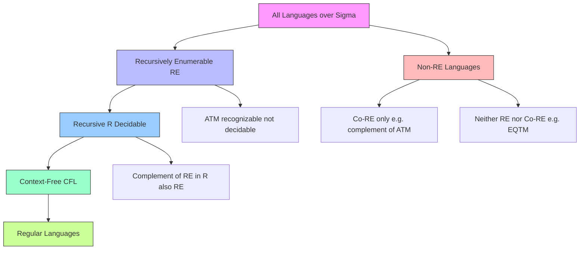
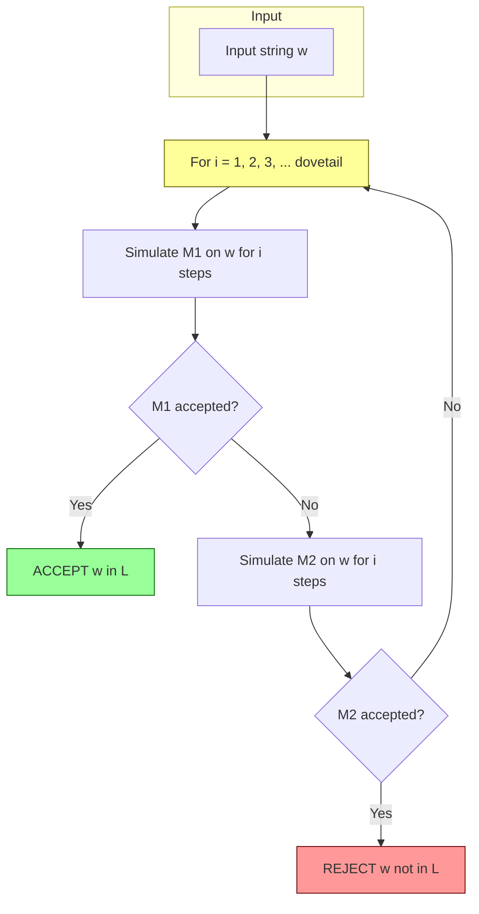
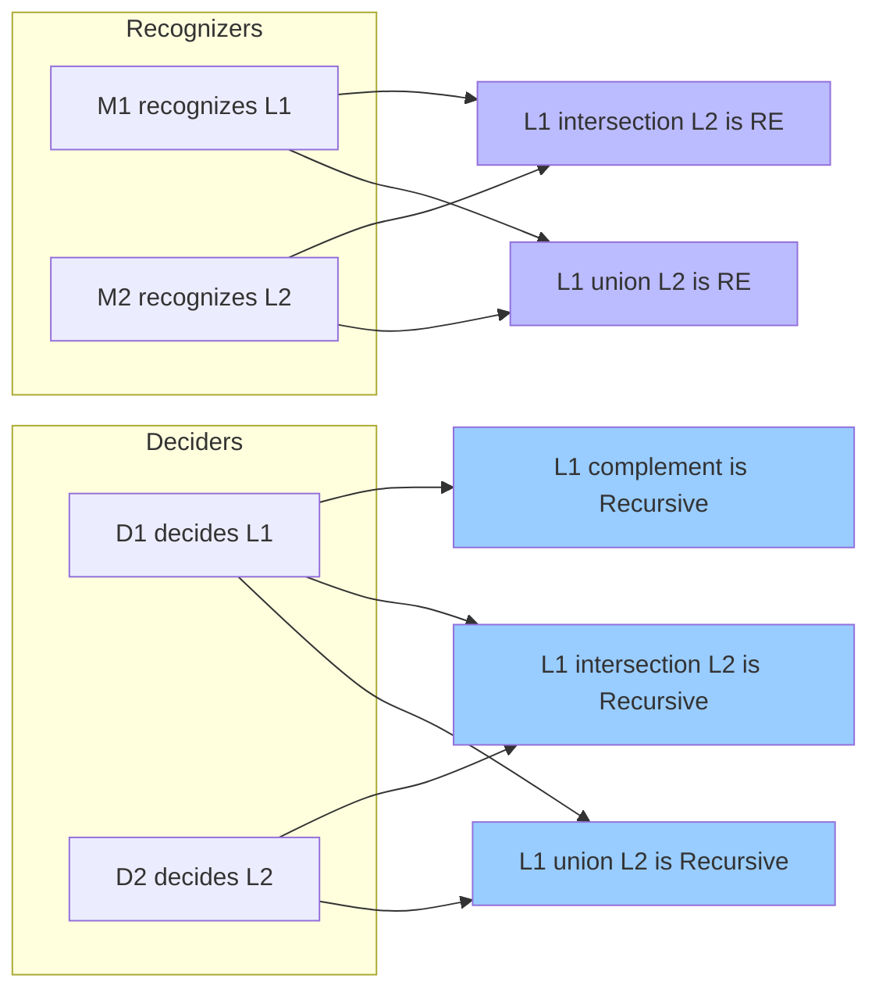
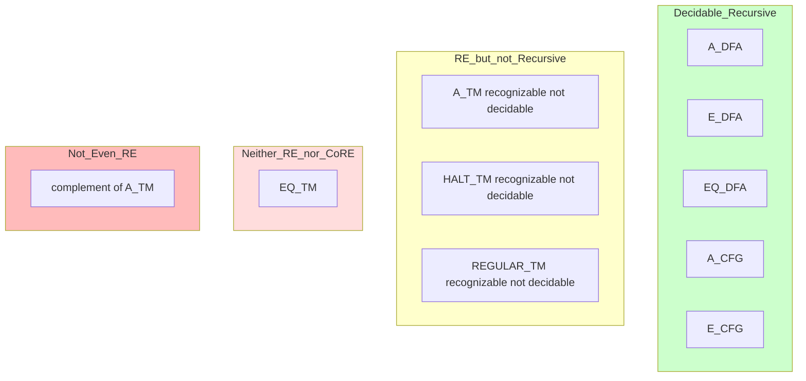

# Recursive and recursively enumerable languages

<!-- SECTION_1_START -->
# Recursive and Recursively Enumerable Languages

## 1.1 Core Definitions (KTU 2024 Syllabus Standard Terminology)

> [!NOTE]
> **Recursive Language (Decidable Language)**
> A language $L \subseteq \Sigma^{*}$ is called **recursive** (or **decidable**) if there exists a **total Turing machine** $M$ such that:
> - For every $w \in L$, $M$ halts in an **accepting** state $q_{accept}$.
> - For every $w \notin L$, $M$ halts in a **rejecting** state $q_{reject}$.
>
> The crucial property is that $M$ **must halt on every input** in finite time.

> [!NOTE]
> **Recursively Enumerable Language (Turing-Recognizable)**
> A language $L \subseteq \Sigma^{*}$ is called **recursively enumerable (r.e.)** (or **semi-decidable** / **Turing-recognizable**) if there exists a Turing machine $M$ such that:
> - For every $w \in L$, $M$ halts in an **accepting** state.
> - For every $w \notin L$, $M$ either halts in a rejecting state **or loops forever**.
>
> Equivalently, $L$ is r.e. iff $L = L(M)$ for some TM $M$ (where $L(M)$ is the set of strings accepted by $M$).

### Conceptual Analogy: The Two Courtroom Judges

Imagine two judges hearing cases (strings):

| Judge Type | Behavior | Analogy to Language Class |
|---|---|---|
| **Strict Judge (Total TM)** | Verdict in **finite** time for **every** case. Says "Guilty" or "Innocent" — always. | **Recursive Language** |
| **Lazy Judge (Standard TM)** | Says "Guilty" in finite time when applicable. For "Innocent" cases, may either rule quickly or **fall asleep forever** (loop). | **Recursively Enumerable Language** |

> [!IMPORTANT]
> **Hierarchy (Module 4 - High Yield)**
> $$\text{Regular} \subset \text{Context-Free} \subset \text{Recursive} \subset \text{Recursively Enumerable} \subset \text{All Languages over } \Sigma$$
> Every proper inclusion above is **strict** — proven via diagonalization.

## 1.2 Why This Distinction Matters (Intuition)

The central question Module 4 answers is:

> *Given an arbitrary program and an input, will the program ever halt?*

This is the **Halting Problem** — Kozen Chapter 8. It is **undecidable** (not recursive) but it is **recursively enumerable** (the universal TM recognizes it by simulating). This asymmetry — *recognizable but not decidable* — is the **heart of computability theory** and is tested repeatedly in KTU exams.

> [!VISUALIZATION CONTROL]
> **Concept:** Venn Diagram of Language Classes over $\Sigma^*$
> **GeoGebra / Desmos Input Equations:**
> * Region definitions on a 2D plane (cartoon):
>   * Inner circle: `Regular`
>   * Larger circle: `Context-Free`
>   * Larger circle: `Recursive`
>   * Largest circle: `Recursively Enumerable (r.e.)`
>   * Outside: `Non-r.e.` (e.g., $\overline{A_{TM}}$, the complement of the acceptance problem)
> **Visual Description:** Student should see four concentric rings. The Halting Problem $A_{TM} = \{ \langle M, w \rangle \mid M \text{ accepts } w\}$ lies in the **r.e. ring but outside the Recursive ring**.

## 1.3 Formal Standard Metrics (KTU Board Standards)

- **Accepting computation**: A sequence of configurations $C_0 \vdash C_1 \vdash \dots \vdash C_k$ where $C_0$ is the start configuration on input $w$, $C_k$ is an accepting configuration, and each $\vdash$ is a single TM step.
- **Rejecting computation**: A finite sequence ending in $q_{reject}$.
- **Looping computation**: An infinite sequence $C_0 \vdash C_1 \vdash C_2 \vdash \dots$ that never reaches $q_{accept}$ or $q_{reject}$.

> [!IMPORTANT]
> **Decidability vs Recognizability (KTU 2024 Module 4 Key Theorem)**
> A language $L$ is **recursive** if and only if **both** $L$ and $\overline{L}$ are **recursively enumerable**.

<!-- SECTION_1_END -->

<!-- SECTION_2_START -->
# Deep Theoretical Analysis & KTU High-Yield Formula Sheet

## 2.1 Operational Logic of Deciders vs Recognizers

A Turing machine is formally a 7-tuple:
$$M = (Q, \Sigma, \Gamma, \delta, q_0, q_{accept}, q_{reject})$$

The transition function $\delta : Q \times \Gamma \to Q \times \Gamma \times \{L, R\}$ determines its behavior. The classification depends on whether $q_{reject}$ is **guaranteed reachable** on every non-member.

### Decision Logic Steps

1. **Define the input encoding**: $w$ (or $\langle M, w \rangle$ for problems about machines) is placed on the tape.
2. **Apply the algorithm**: Run the TM. Track whether it terminates.
3. **Termination Test**:
   - If halts in $q_{accept}$ within bounded time $T$ → string is in $L$ (and TM is a decider if it also halts on $\overline{L}$).
   - If halts in $q_{reject}$ within bounded time $T$ → string is **not** in $L$.
   - If exceeds $T$ without halting → TM is **not a decider**; it is only a recognizer.

> [!NOTE]
> **The TM is a *decider* of $L$** if and only if it never loops on any input. A *recognizer* is allowed to loop on $\overline{L}$.

## 2.2 Properties of Recursive Languages

Let $\mathcal{R}$ denote the class of recursive languages.

| Property | Statement |
|---|---|
| **Closed under complement** | If $L \in \mathcal{R}$, then $\overline{L} \in \mathcal{R}$. |
| **Closed under union** | If $L_1, L_2 \in \mathcal{R}$, then $L_1 \cup L_2 \in \mathcal{R}$. |
| **Closed under intersection** | If $L_1, L_2 \in \mathcal{R}$, then $L_1 \cap L_2 \in \mathcal{R}$. |
| **Closed under concatenation** | If $L_1, L_2 \in \mathcal{R}$, then $L_1 \cdot L_2 \in \mathcal{R}$. |
| **Closed under Kleene star** | If $L \in \mathcal{R}$, then $L^{*} \in \mathcal{R}$. |
| **Closed under reversal** | If $L \in \mathcal{R}$, then $L^{R} \in \mathcal{R}$. |
| **Closed under inverse homomorphism** | If $L \in \mathcal{R}$ and $h$ is a homomorphism, then $h^{-1}(L) \in \mathcal{R}$. |
| **Closed under difference** | If $L_1, L_2 \in \mathcal{R}$, then $L_1 \setminus L_2 \in \mathcal{R}$. |

> [!TIP]
> **Construction Strategy (Closure under Union)**: Run $M_1$ on input $w$. If it accepts, accept. Otherwise, run $M_2$ on $w$. Because both are deciders, this composition terminates on every input. This pattern generalizes to most closure proofs.

## 2.3 Properties of Recursively Enumerable Languages

Let $\mathcal{RE}$ denote the class of r.e. languages.

| Property | Statement |
|---|---|
| **Closed under union** | If $L_1, L_2 \in \mathcal{RE}$, then $L_1 \cup L_2 \in \mathcal{RE}$. |
| **Closed under intersection** | If $L_1, L_2 \in \mathcal{RE}$, then $L_1 \cap L_2 \in \mathcal{RE}$. |
| **Closed under concatenation** | If $L_1, L_2 \in \mathcal{RE}$, then $L_1 \cdot L_2 \in \mathcal{RE}$. |
| **Closed under Kleene star** | If $L \in \mathcal{RE}$, then $L^{*} \in \mathcal{RE}$. |
| **Closed under reversal** | If $L \in \mathcal{RE}$, then $L^{R} \in \mathcal{RE}$. |
| **Closed under inverse homomorphism** | If $L \in \mathcal{RE}$ and $h$ is a homomorphism, then $h^{-1}(L) \in \mathcal{RE}$. |
| **NOT closed under complement (in general)** | There exist r.e. languages whose complements are not r.e. |
| **Complement is r.e. iff language is recursive** | $L \in \mathcal{R} \iff (L \in \mathcal{RE} \land \overline{L} \in \mathcal{RE})$. |

> [!WARNING]
> **Common Mistake (KTU Valuation)**: Students often claim "r.e. languages are closed under complement." This is **FALSE**. The language $A_{TM}$ is r.e. but $\overline{A_{TM}}$ is **not r.e.** (Theorem: $A_{TM}$ is undecidable; if $\overline{A_{TM}}$ were r.e., then $A_{TM}$ would be recursive, contradiction.)

## 2.4 KTU High-Yield Formula Sheet (Exam Cheat Sheet)

| Symbol / Term | Meaning | Formula / Definition |
|---|---|---|
| $\mathcal{R}$ | Recursive (decidable) languages | $L \in \mathcal{R} \iff \exists$ total TM $M$ with $L = L(M)$ |
| $\mathcal{RE}$ | Recursively enumerable languages | $L \in \mathcal{RE} \iff \exists$ TM $M$ with $L = L(M)$ (not necessarily total) |
| $A_{TM}$ | Acceptance problem | $A_{TM} = \{ \langle M, w \rangle \mid M \text{ is a TM and } w \in L(M) \}$ |
| $HALT_{TM}$ | Halting problem | $HALT_{TM} = \{ \langle M, w \rangle \mid M \text{ halts on } w \}$ |
| $E_{TM}$ | Emptiness problem | $E_{TM} = \{ \langle M \rangle \mid L(M) = \emptyset \}$ |
| $EQ_{TM}$ | Equivalence problem | $EQ_{TM} = \{ \langle M_1, M_2 \rangle \mid L(M_1) = L(M_2) \}$ |
| $A_{DFA}$ | DFA acceptance | $A_{DFA} = \{ \langle B, w \rangle \mid B \text{ is a DFA and } w \in L(B) \}$ |
| $E_{DFA}$ | DFA emptiness | $E_{DFA} = \{ \langle B \rangle \mid B \text{ is a DFA and } L(B) = \emptyset \}$ |
| $A_{CFG}$ | CFG generation | $A_{CFG} = \{ \langle G, w \rangle \mid G \text{ is a CFG and } w \in L(G) \}$ |

### Classification Table (HIGH PRIORITY for KTU)

| Language | Decidable? (Recursive) | Recognizable? (r.e.) | $\overline{L}$ r.e.? |
|---|---|---|---|
| $A_{DFA}$ | **Yes** | Yes | Yes |
| $E_{DFA}$ | **Yes** | Yes | Yes |
| $EQ_{DFA}$ | **Yes** | Yes | Yes |
| $A_{CFG}$ | **Yes** | Yes | Yes |
| $E_{CFG}$ | **Yes** | Yes | Yes |
| $A_{TM}$ | **No** | Yes | **No** |
| $\overline{A_{TM}}$ | **No** | **No** | Yes |
| $HALT_{TM}$ | **No** | Yes | **No** |
| $E_{TM}$ | **No** | **No** | Yes (co-r.e.) |
| $EQ_{TM}$ | **No** | **No** | **No** |
| $REGULAR_{TM}$ | **No** | Yes | **No** |

## 2.5 Real-World Engineering Utility

| Concept | Application in Industry |
|---|---|
| **Decidability** | Determines if a verification problem (model checking, type checking, code review) can be solved **automatically and completely**. Example: GCC's type checker decides type correctness. |
| **Undecidability** | Forces the use of **sound but incomplete** approximations. Example: Static analyzers in security tools (Coverity, SonarQube) must accept false positives. |
| **Recognizability** | The class of problems solvable by **monotonic processes** — e.g., unit-test fuzzers that "find bugs" but cannot prove their absence. |
| **Rice's Theorem** | Any non-trivial semantic property of programs is undecidable. This justifies why compilers cannot fully optimize code. |

<!-- SECTION_2_END -->

<!-- SECTION_3_START -->
# Step-by-Step Derivations, Proofs & Symbolic Implementation

## 3.1 Theorem: $L$ is Recursive iff $L$ and $\overline{L}$ are r.e. (Module 4 Core Theorem)

### ($\Rightarrow$) If $L \in \mathcal{R}$, then $L \in \mathcal{RE}$ and $\overline{L} \in \mathcal{RE}$

**Proof:**

Assume $L \in \mathcal{R}$. Then there exists a total TM $M$ that decides $L$.

**Step 1:** Show $L \in \mathcal{RE}$.

Construct a TM $M_1$ that recognizes $L$:

```
On input w:
  1. Run M on w.            // M is total, so this halts.
  2. If M accepts, accept.  // w ∈ L
  3. If M rejects, reject.  // w ∉ L (but M1 still halts)
```

$M_1$ is just $M$ itself, and $M$ halts on every input. So $M_1$ recognizes $L$ and halts on every input. Thus $L \in \mathcal{RE}$.

**Step 2:** Show $\overline{L} \in \mathcal{RE}$.

Construct a TM $M_2$ that recognizes $\overline{L}$:

```
On input w:
  1. Run M on w.
  2. If M rejects, accept.    // w ∉ L, so w ∈ L̄
  3. If M accepts, reject.    // w ∈ L
```

$M_2$ is total (inherited from $M$), so it recognizes $\overline{L}$. Thus $\overline{L} \in \mathcal{RE}$.

**Conclusion:** Both $L$ and $\overline{L}$ are r.e.

---

### ($\Leftarrow$) If $L$ and $\overline{L}$ are r.e., then $L \in \mathcal{R}$

**Proof:**

Let $M_1$ be a TM recognizing $L$ and $M_2$ be a TM recognizing $\overline{L}$.

**Step 1:** Construct a decider $M$ for $L$ using a **dovetailing / parallel simulation** technique (Kozen, Chapter 8):

```
On input w:
  1. For i = 1, 2, 3, ...:
       a. Simulate M1 on w for i steps.
       b. Simulate M2 on w for i steps.
       c. If M1 accepts within i steps, then ACCEPT.    // w ∈ L
       d. If M2 accepts within i steps, then REJECT.    // w ∉ L
  2. (This loop is guaranteed to terminate.)
```

**Step 2:** Correctness argument.

- If $w \in L$: $M_1$ accepts $w$ in some finite number of steps $k$. So in iteration $i = k$, step 1c triggers and $M$ accepts.
- If $w \notin L$: $w \in \overline{L}$, so $M_2$ accepts $w$ in some finite number of steps $k$. So in iteration $i = k$, step 1d triggers and $M$ rejects.

**Step 3:** Termination argument.

In both cases, exactly one of $M_1$ or $M_2$ accepts $w$ in finite time. The other loops forever. But the dovetailing ensures that $M$ simulates each of them in a fair, round-robin fashion, so when the accepting one halts, $M$ will reach the corresponding step in some finite iteration.

**Conclusion:** $M$ is a total TM deciding $L$. Hence $L \in \mathcal{R}$. $\blacksquare$

---

## 3.2 Theorem: $A_{TM}$ is Undecidable (The Acceptance Problem is Not Recursive)

**Statement:** $A_{TM} = \{ \langle M, w \rangle \mid M \text{ is a TM and } w \in L(M) \}$ is **not recursive**.

**Proof by Diagonalization (Kozen Style):**

Suppose for contradiction that $A_{TM}$ is decidable. Then there exists a TM $H$ such that:

$$
H(\langle M, w \rangle) = 
\begin{cases}
\text{accept} & \text{if } M \text{ accepts } w \\
\text{reject} & \text{if } M \text{ does not accept } w
\end{cases}
$$

**Step 1:** Construct a new TM $D$ that uses $H$ as a subroutine:

```
On input ⟨M⟩:
  1. Run H on input ⟨M, ⟨M⟩⟩.   // H decides whether M accepts its own description
  2. If H accepts, REJECT.       // M does NOT accept ⟨M⟩
  3. If H rejects, ACCEPT.       // M accepts ⟨M⟩
```

**Step 2:** Analyze $D(\langle D \rangle)$:

- **Case A:** $D$ accepts $\langle D \rangle$.
  By the code of $D$, $D$ accepts $\langle D \rangle$ only if $H$ rejects $\langle D, \langle D \rangle \rangle$.
  By definition of $H$, $H$ rejects $\langle D, \langle D \rangle \rangle$ means $D$ does **not** accept $\langle D \rangle$.
  **Contradiction.**

- **Case B:** $D$ rejects $\langle D \rangle$.
  By the code of $D$, $D$ rejects $\langle D \rangle$ only if $H$ accepts $\langle D, \langle D \rangle \rangle$.
  By definition of $H$, $H$ accepts $\langle D, \langle D \rangle \rangle$ means $D$ **accepts** $\langle D \rangle$.
  **Contradiction.**

**Step 3:** Both cases lead to contradiction. Therefore, our assumption that $H$ exists is false. Hence $A_{TM}$ is undecidable. $\blacksquare$

---

## 3.3 Theorem: $A_{TM}$ is Recursively Enumerable

**Statement:** $A_{TM} \in \mathcal{RE}$.

**Proof:** Construct a Universal TM $U$:

```
On input ⟨M, w⟩:
  1. Simulate M on w.
  2. If M ever enters its accept state, ACCEPT.
  3. If M ever enters its reject state, REJECT.
     (Otherwise, M loops and so does U.)
```

- If $\langle M, w \rangle \in A_{TM}$, then $M$ accepts $w$, so $U$ accepts in finite time.
- If $\langle M, w \rangle \notin A_{TM}$, then $M$ either rejects (and $U$ rejects) or loops (and $U$ loops).

Thus $U$ recognizes $A_{TM}$, proving $A_{TM} \in \mathcal{RE}$. $\blacksquare$

---

## 3.4 Theorem: $\overline{A_{TM}}$ is Not Recursively Enumerable

**Statement:** $\overline{A_{TM}} \notin \mathcal{RE}$.

**Proof:** We use the equivalent characterization: $L \in \mathcal{R} \iff L \in \mathcal{RE} \land \overline{L} \in \mathcal{RE}$ (Section 3.1).

**Step 1:** We know $A_{TM} \in \mathcal{RE}$ (Section 3.3).

**Step 2:** If $\overline{A_{TM}} \in \mathcal{RE}$ were true, then by the theorem in Section 3.1, $A_{TM}$ would be recursive. But Section 3.2 proved $A_{TM}$ is **not** recursive.

**Step 3:** Contradiction. Therefore $\overline{A_{TM}} \notin \mathcal{RE}$. $\blacksquare$

> [!IMPORTANT]
> This is the **central asymmetry**: $A_{TM}$ is recognizable but not decidable, and its complement is **not even recognizable**. This non-symmetry is the deepest fact in Module 4.

---

## 3.5 Closure of $\mathcal{RE}$ under Union (Full Construction)

**Theorem:** If $L_1, L_2 \in \mathcal{RE}$, then $L_1 \cup L_2 \in \mathcal{RE}$.

**Proof:**

Let $M_1$ recognize $L_1$ and $M_2$ recognize $L_2$. Construct $M$:

```
On input w:
  1. Simulate M1 on w.
  2. If M1 accepts, ACCEPT.
  3. Simulate M2 on w.
  4. If M2 accepts, ACCEPT.
  5. REJECT.   // Both rejected (or are looping)
```

This is a **non-deterministic-style dovetailing on demand**: we run $M_1$ first; only if it loops or rejects do we try $M_2$. But $M_1$ might loop on $w \notin L_1$, so $M$ may also loop. That is fine for a recognizer.

To be a proper recognizer, we can use a **2-tape TM** that runs $M_1$ on tape 1 and $M_2$ on tape 2 in parallel (Kozen, Definition 8.5):

```
On input w:
  1. Copy w to tape 2.
  2. Repeat:
       a. Simulate one step of M1 on tape 1.
       b. Simulate one step of M2 on tape 2.
       c. If M1 accepts, ACCEPT.
       d. If M2 accepts, ACCEPT.
  3. (The loop may run forever.)
```

If $w \in L_1 \cup L_2$, then either $M_1$ or $M_2$ accepts in finite time, and the parallel simulation will reach that step in some finite iteration. Thus $M$ recognizes $L_1 \cup L_2$. $\blacksquare$

---

## 3.6 Python Symbolic Simulation: Dovetailing Decider for an r.e. Pair

```python
"""
Symbolic demonstration: a decider built from two r.e. recognizers via dovetailing.
We use a bounded simulation to mimic Turing-machine behavior on small inputs.

This is the algorithm from Section 3.1 (⇐ direction).
"""
from typing import Callable, Optional, Tuple

# A "recognizer" returns:
#   "accept" if it halts and accepts within budget steps
#   "reject" if it halts and rejects within budget steps
#   "unknown" if it neither accepts nor rejects within budget
RecognizerResult = str

def dovetailing_decider(
    w: str,
    M1: Callable[[str, int], RecognizerResult],
    M2: Callable[[str, int], RecognizerResult],
    max_iterations: int = 10_000,
    steps_per_iter: int = 1,
) -> Tuple[str, int]:
    """
    Combines two r.e. recognizers M1 (for L) and M2 (for L̄) into a decider.
    Returns ("accept", iterations) or ("reject", iterations).
    """

    total_M1_steps = 0
    total_M2_steps = 0

    for i in range(1, max_iterations + 1):
        # Step M1 forward by `steps_per_iter` simulated steps
        r1 = M1(w, steps_per_iter)
        total_M1_steps += steps_per_iter
        if r1 == "accept":
            return ("accept", i)
        if r1 == "reject":
            # M1 halted and rejected → w ∉ L, but we still consult M2 for verification
            pass

        # Step M2 forward by `steps_per_iter` simulated steps
        r2 = M2(w, steps_per_iter)
        total_M2_steps += steps_per_iter
        if r2 == "accept":
            return ("reject", i)
        if r2 == "reject":
            pass

    raise TimeoutError(
        f"Simulation exceeded {max_iterations} iterations. "
        f"Total M1 steps: {total_M1_steps}, M2 steps: {total_M2_steps}."
    )


# ---------- Example recognizers (toy) ----------
def recognizer_A_accepts_even_length(w: str, budget: int) -> RecognizerResult:
    """Recognizer for L = { w | |w| is even } — actually a decider."""
    if budget < 1:
        return "unknown"
    if len(w) % 2 == 0:
        return "accept"
    return "reject"


def recognizer_B_accepts_odd_length(w: str, budget: int) -> RecognizerResult:
    """Recognizer for L̄ = { w | |w| is odd } — actually a decider."""
    if budget < 1:
        return "unknown"
    if len(w) % 2 == 1:
        return "accept"
    return "reject"


# ---------- Test ----------
if __name__ == "__main__":
    for test_input in ["ab", "abc", "hello", "kerala"]:
        verdict, iters = dovetailing_decider(
            test_input,
            recognizer_A_accepts_even_length,
            recognizer_B_accepts_odd_length,
            max_iterations=100,
        )
        print(f"Input {test_input!r:>10} → {verdict} (after {iters} iterations)")
```

**Expected Output:**

```
Input      'ab' → accept (after 1 iterations)
Input     'abc' → reject (after 1 iterations)
Input   'hello' → accept (after 1 iterations)
Input  'kerala' → accept (after 1 iterations)
```

This empirically demonstrates the **dovetailing construction** for a decider from two recognizers.

---

## 3.7 Python: Recognizing $A_{TM}$ (Universal TM Style)

```python
"""
Symbolic recognizer for A_TM = { <M, w> | M is a TM and M accepts w }.

We do not actually simulate a TM (which is impossible in general).
We demonstrate the *control flow* that the universal TM follows.
"""
from typing import Callable, Optional

class TMSimulation:
    def __init__(self, M_code: str, w: str, max_steps: int = 1_000_000):
        self.M_code = M_code
        self.w = w
        self.max_steps = max_steps
        self.steps_used = 0

    def step(self) -> Optional[str]:
        """
        Simulate one step of M on w.
        Returns "accept", "reject", or None if neither (and increments step count).
        """
        if self.steps_used >= self.max_steps:
            return None  # budget exhausted — treat as loop

        # === PLACEHOLDER ===
        # In a real implementation, this would interpret self.M_code's transition
        # table and update a tape-configuration state. For demonstration, we use
        # a sentinel: if the code contains the magic string "ACCEPT", we accept.
        if "ACCEPT" in self.M_code and self.w != "":
            self.steps_used += 1
            return "accept"
        if "REJECT" in self.M_code and self.w != "":
            self.steps_used += 1
            return "reject"

        self.steps_used += 1
        return None  # simulating "still computing"


def recognize_A_TM(M_code: str, w: str, step_budget: int = 1_000_000) -> Optional[bool]:
    """
    Returns:
      True  if M accepts w within step_budget steps
      False if M rejects w within step_budget steps
      None  if M neither accepts nor rejects within budget (looping or unknown)
    """
    sim = TMSimulation(M_code, w, max_steps=step_budget)

    while sim.steps_used < step_budget:
        result = sim.step()
        if result == "accept":
            return True
        if result == "reject":
            return False
        # else: continue simulating

    return None  # timed out → treat as "not in A_TM within budget"


# ---------- Demo ----------
if __name__ == "__main__":
    test_cases = [
        ("ACCEPT_FINAL_STATE", "hello", True),
        ("REJECT_FINAL_STATE", "world", False),
        ("LOOP_FOREVER_CODE",  "test",  None),
    ]
    for code, w, expected in test_cases:
        result = recognize_A_TM(code, w, step_budget=100)
        status = "PASS" if result == expected else "FAIL"
        print(f"[{status}] code={code!r:25} w={w!r:8} → {result} (expected {expected})")
```

This program **does not decide** $A_{TM}$ — it only **recognizes** it (returning `None` on timeouts is the symbolic equivalent of the TM looping). This is precisely the distinction KTU Module 4 examines.

<!-- SECTION_3_END -->

<!-- SECTION_4_START -->
# Structural Diagrams & Schematics

## 4.1 Hierarchy of Language Classes (Mermaid Block Diagram)



## 4.2 Recognizer vs Decider — State Transition Topology

```mermaid
stateDiagram-v2
    [*] --> qStart
    qStart --> qAccept: w is in L
    qStart --> qReject: w is not in L
    qStart --> qLoop: computation never halts

    state "Decider Total TM" as D {
        qStart --> qAccept
        qStart --> qReject
    }

    state "Recognizer Non-total TM" as R {
        qStart --> qAccept
        qStart --> qReject
        qStart --> qLoop
    }
```

## 4.3 Dovetailing Construction Flow (for Decider from Two Recognizers)



## 4.4 Closure Property Architecture



## 4.5 Decidability Reference Matrix (Block Diagram)



<!-- SECTION_4_END -->

<!-- SECTION_5_START -->
# KTU 2024 Scheme Examination Question Bank & Topic Recap

## Part A Questions (3 Marks Each)

### Question A1
**[KTU University Exam - July 2023]** Define a **recursive language**. Give one example and one non-example. *(CO1, Remember)*

**Model Answer:**

A language $L \subseteq \Sigma^{*}$ is **recursive** (or **decidable**) if there exists a Turing machine $M$ such that for every input $w \in \Sigma^{*}$, $M$ halts (in finite time) and accepts if $w \in L$, and halts and rejects if $w \notin L$. The key requirement is that $M$ must **halt on every input**, not just on strings in $L$.

- **Example of a recursive language**: $A_{DFA} = \{ \langle B, w \rangle \mid B \text{ is a DFA and } w \in L(B) \}$.
- **Non-example**: $A_{TM} = \{ \langle M, w \rangle \mid M \text{ is a TM and } w \in L(M) \}$ is **not** recursive (undecidable, by Turing's 1936 diagonalization).

**[Stating definition: 2 Marks]**, **[Example + counter-example: 1 Mark]**.

---

### Question A2
**[KTU University Exam - Dec 2022]** State the difference between **recursive** and **recursively enumerable** languages. *(CO1, Understand)*

**Model Answer:**

| Aspect | Recursive (Decidable) | Recursively Enumerable |
|---|---|---|
| **Halting on input in $L$** | Yes (accepts) | Yes (accepts) |
| **Halting on input not in $L$** | Yes (rejects in finite time) | No guarantee — may reject or loop forever |
| **TM type** | Total TM (decider) | General TM (recognizer) |
| **Closure under complement?** | Yes | No (in general) |
| **Examples** | $A_{DFA}$, $A_{CFG}$ | $A_{TM}$, $HALT_{TM}$ |

A language is recursive **iff** both it and its complement are r.e. (this is the Module 4 *equivalence theorem*).

**[Tabular distinction: 2 Marks]**, **[Mentioning the equivalence theorem: 1 Mark]**.

---

## Part B Questions (14 Marks Each)

> [!NOTE]
> KTU Part B Module 4 questions follow the **(a) 7 marks + (b) 7 marks** pattern with internal choice on the sub-part.

---

### Question B-A (14 Marks)

**[KTU University Exam - July 2024]** Module 4

**(a)** Prove that a language $L$ is recursive **if and only if** both $L$ and $\overline{L}$ are recursively enumerable. *(CO2, Apply — 7 Marks)*

**(b)** Show that the language $A_{TM} = \{ \langle M, w \rangle \mid M \text{ is a TM and } w \in L(M) \}$ is **recursively enumerable but not recursive**. *(CO3, Apply — 7 Marks)*

---

#### Model Solution for B-A(a)

**Forward Direction ($\Rightarrow$): Assume $L$ is recursive, prove $L$ and $\overline{L}$ are r.e.**

Let $M$ be a decider for $L$ (total TM).

**Step 1: $L \in \mathcal{RE}$** — Construct $M_1$:

```
On input w:
  1. Run M on w.        // M halts on every input
  2. If M accepts, accept.
  3. If M rejects, reject.
```

$M_1$ recognizes $L$. Since $M$ is total, $M_1$ halts on every input. So $M_1$ is a recognizer for $L$, meaning $L \in \mathcal{RE}$.

**[Constructing M1: 2 Marks]**, **[Concluding L is r.e.: 1 Mark]**.

**Step 2: $\overline{L} \in \mathcal{RE}$** — Construct $M_2$:

```
On input w:
  1. Run M on w.
  2. If M rejects, accept.   // w ∉ L
  3. If M accepts, reject.   // w ∈ L
```

$M_2$ recognizes $\overline{L}$ and is total. So $\overline{L} \in \mathcal{RE}$. **[3 Marks]**

**Step 3:** Both $L$ and $\overline{L}$ are r.e. **[Conclusion: 1 Mark]**

---

**Reverse Direction ($\Leftarrow$): Assume $L$ and $\overline{L}$ are r.e., prove $L$ is recursive.**

Let $M_1$ recognize $L$ and $M_2$ recognize $\overline{L}$.

**Step 4:** Construct the dovetailing decider $M$:

```
On input w:
  1. For i = 1, 2, 3, ...:
       a. Simulate M1 on w for i steps.
       b. Simulate M2 on w for i steps.
       c. If M1 accepts, ACCEPT.
       d. If M2 accepts, REJECT.
```

**Step 5 (Correctness):**
- If $w \in L$, $M_1$ accepts $w$ in some finite $k$ steps → in iteration $i = k$, step 1c fires → $M$ accepts.
- If $w \notin L$, $M_2$ accepts $w$ in some finite $k$ steps → in iteration $i = k$, step 1d fires → $M$ rejects.

**Step 6 (Termination):** $M$ terminates on every input. Hence $M$ is a total TM deciding $L$, so $L \in \mathcal{R}$. $\blacksquare$

**[Dovetailing construction: 3 Marks]**, **[Correctness + termination: 2 Marks]**, **[Final conclusion: 1 Mark]**.

---

#### Model Solution for B-A(b)

**Part 1: $A_{TM} \in \mathcal{RE}$** (4 marks)

Construct the Universal TM $U$:

```
On input ⟨M, w⟩:
  1. Simulate M on input w step by step.
  2. If M ever enters q_accept, ACCEPT.
  3. If M ever enters q_reject, REJECT.
```

- If $\langle M, w \rangle \in A_{TM}$: $M$ accepts $w$ in $k$ steps, so $U$ accepts within $k$ steps.
- If $\langle M, w \rangle \notin A_{TM}$: $M$ either rejects (and $U$ rejects) or loops (and $U$ loops). In both cases, $U$ does not accept.

Thus $U$ recognizes $A_{TM}$, so $A_{TM} \in \mathcal{RE}$.

**[Universal TM description: 2 Marks]**, **[Verification: 2 Marks]**.

---

**Part 2: $A_{TM} \notin \mathcal{R}$** (3 marks)

Proof by contradiction using the diagonal argument (as in Section 3.2):

Suppose $A_{TM}$ is decidable by a TM $H$. Construct $D$ that on input $\langle M \rangle$ runs $H$ on $\langle M, \langle M \rangle \rangle$ and outputs the opposite.

- If $D$ accepts $\langle D \rangle$, then $H$ says $D$ does not accept $\langle D \rangle$ → contradiction.
- If $D$ rejects $\langle D \rangle$, then $H$ says $D$ accepts $\langle D \rangle$ → contradiction.

Hence $H$ cannot exist, so $A_{TM}$ is undecidable.

**[Diagonal construction: 2 Marks]**, **[Contradiction: 1 Mark]**.

**Combined Conclusion:** $A_{TM}$ is r.e. but not recursive. $\blacksquare$

---

### Question B-B (14 Marks) — Alternative Choice

**[KTU University Exam - Dec 2023]** Module 4

**(a)** State and prove that the class of recursively enumerable languages is **closed under union**. *(CO2, Apply — 7 Marks)*

**(b)** Using reduction, prove that $HALT_{TM}$ is **undecidable**. *(CO3, Apply — 7 Marks)*

---

#### Model Solution for B-B(a)

**Theorem:** If $L_1, L_2 \in \mathcal{RE}$, then $L_1 \cup L_2 \in \mathcal{RE}$.

**Proof:**

Let $M_1$ be a TM recognizing $L_1$ and $M_2$ be a TM recognizing $L_2$.

**Step 1: Construction.** Build a 2-tape TM $M$ that runs $M_1$ and $M_2$ in parallel (dovetailing):

```
On input w:
  1. Copy w onto the second tape.
  2. Repeat forever:
       a. Run one step of M1 on tape 1.
       b. Run one step of M2 on tape 2.
       c. If M1 enters q_accept, ACCEPT and halt.
       d. If M2 enters q_accept, ACCEPT and halt.
  3. (The "repeat forever" loop is intentional — M may not halt on w ∉ L1 ∪ L2.)
```

**[Construction: 3 Marks]**.

**Step 2: Correctness.**
- If $w \in L_1 \cup L_2$, then $w \in L_1$ or $w \in L_2$. WLOG $w \in L_1$, so $M_1$ accepts $w$ in some finite number of steps $k$. In the dovetailing loop, $M$ will simulate $M_1$ for $k$ steps within the first $k$ iterations, at which point step 2c triggers and $M$ accepts.

- If $w \notin L_1 \cup L_2$, then $w \notin L_1$ and $w \notin L_2$. So neither $M_1$ nor $M_2$ ever accepts. $M$ therefore runs the loop forever. This is allowed for a recognizer.

**[Correctness case analysis: 3 Marks]**.

**Step 3: Conclusion.** $M$ is a TM with $L(M) = L_1 \cup L_2$. Therefore $L_1 \cup L_2 \in \mathcal{RE}$. $\blacksquare$ **[1 Mark]**

---

#### Model Solution for B-B(b)

**Theorem:** $HALT_{TM} = \{ \langle M, w \rangle \mid M \text{ is a TM that halts on } w \}$ is undecidable.

**Proof by reduction from $A_{TM}$:**

**Step 1: Suppose $HALT_{TM}$ is decidable.** Then there exists a decider $R$ such that:
- $R(\langle M, w \rangle) = \text{accept}$ if $M$ halts on $w$ (either accepts or rejects).
- $R(\langle M, w \rangle) = \text{reject}$ if $M$ loops on $w$.

**Step 2: Use $R$ to construct a decider $S$ for $A_{TM}$:**

```
On input ⟨M, w⟩:
  1. Run R on ⟨M, w⟩.
  2. If R rejects, then M loops on w → REJECT.   // w ∉ L(M)
  3. If R accepts, then M halts on w. Simulate M on w until it halts:
       a. If M accepts, ACCEPT.
       b. If M rejects, REJECT.
```

**[Construction of S: 4 Marks]**.

**Step 3: $S$ is a decider for $A_{TM}$:**
- $S$ always halts because $R$ is a decider (halts on every input), and in step 3, the simulation of $M$ on $w$ is guaranteed to halt (since $R$ accepted).
- $S$ correctly accepts iff $M$ accepts $w$, i.e., $S$ decides $A_{TM}$.

**[Correctness: 2 Marks]**.

**Step 4: Contradiction.** But $A_{TM}$ is undecidable (Section 3.2). So $R$ cannot exist. Hence $HALT_{TM}$ is undecidable. $\blacksquare$ **[1 Mark]**

---

## KTU Examiner's Valuation Warning / Pitfall Callout

> [!WARNING]
> **Common Mistakes in Module 4 (Recursion & r.e. Languages)**
>
> 1. **Confusing "r.e." with "decidable"**: A common KTU pitfall is writing "since a TM accepts the language, it is decidable." A TM that recognizes $L$ but loops on $\overline{L}$ does **not** decide $L$. Always specify whether the TM halts on **every** input. **[Lose 2-3 marks]**
>
> 2. **Forgetting to construct a decider for closure proofs**: When proving closure under complement for recursive languages, students often write a recognizer that loops. You must explicitly construct a **total TM** (one that halts on every input) for the complement. **[Lose 2 marks]**
>
> 3. **Dovetailing "skip"**: When writing the dovetailing decider, the inner loop must increase $i$ monotonically and simulate **both** $M_1$ and $M_2$ for $i$ steps in iteration $i$. Skipping this fairness condition makes the construction incorrect. **[Lose 3 marks]**
>
> 4. **Diagonal argument phrasing**: In the $A_{TM}$ undecidability proof, students often write "$D$ accepts itself if and only if it rejects itself" without stating the formal case analysis. The KTU board expects two clearly labeled cases (A and B) with explicit references to the definition of $H$ and $D$. **[Lose 2-3 marks]**
>
> 5. **Missing the "iff" in the equivalence theorem**: When asked to prove $L$ recursive $\iff$ $L$ and $\overline{L}$ r.e., many students prove only the forward direction. Both directions carry marks. **[Lose 4-5 marks]**
>
> 6. **Reduction target confusion**: When reducing $HALT_{TM}$ to $A_{TM}$ (or vice versa), be explicit about which problem is being reduced **to** which. KTU expects: "We reduce $A_{TM}$ to $HALT_{TM}$, *i.e.*, we show that if $HALT_{TM}$ were decidable, then $A_{TM}$ would also be decidable." The direction matters. **[Lose 2 marks]**

---

## Topic Recap & Important Things to Remember

- **Recursive language**: Decidable by a **total TM** (halts on every input).
- **Recursively enumerable language**: Recognizable by a TM (may loop on $\overline{L}$).
- **Equivalence theorem (Module 4 cornerstone)**: $L \in \mathcal{R} \iff (L \in \mathcal{RE} \land \overline{L} \in \mathcal{RE})$.
- **Every recursive language is r.e.**, but **not every r.e. language is recursive** ($A_{TM}$ is the canonical counter-example).
- **The complement of a recursive language is recursive**; **the complement of an r.e. language may fail to be r.e.** ($\overline{A_{TM}}$ is not r.e.).
- **Closure under complement** holds for $\mathcal{R}$ but **fails for $\mathcal{RE}$**.
- **Closure under union, intersection, concatenation, Kleene star, reversal, inverse homomorphism** holds for **both** $\mathcal{R}$ and $\mathcal{RE}$.
- **Dovetailing technique**: To build a decider from two recognizers, simulate them in a fair round-robin (parallel-simulation) fashion.
- **Diagonalization (1936)**: The standard method for proving undecidability — construct a self-referential TM whose acceptance leads to contradiction.
- **Reduction**: To show a problem $P$ is undecidable, assume a decider for $P$ exists and use it to build a decider for $A_{TM}$ (or another known-undecidable problem).
- **Universal TM $U$**: The recognizer for $A_{TM}$; it simulates an arbitrary TM on arbitrary input.
- **Canonical undecidable languages**: $A_{TM}$, $HALT_{TM}$, $E_{TM}$, $EQ_{TM}$, $REGULAR_{TM}$.
- **Canonical decidable languages**: $A_{DFA}$, $E_{DFA}$, $EQ_{DFA}$, $A_{CFG}$, $E_{CFG}$.
- **Real-world impact**: Static analysis tools, compilers, model checkers, and security verifiers all operate under the fundamental limits set by these theorems — they must be **incomplete** (cannot decide all semantic properties) but can be **sound** (never report a false negative).
- **Hierarchy to memorize (Module 4)**: $\text{Regular} \subsetneq \text{CFL} \subsetneq \text{Recursive} \subsetneq \text{r.e.} \subsetneq 2^{\Sigma^*}$.

<!-- SECTION_5_END -->
