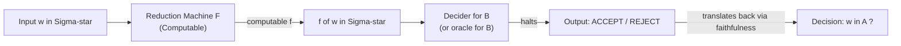
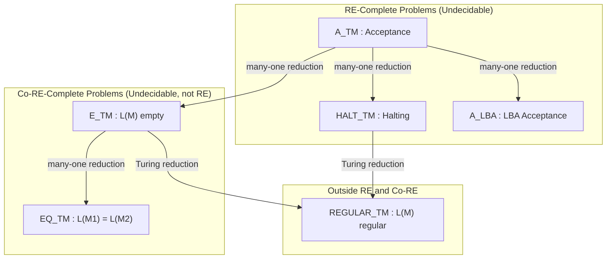
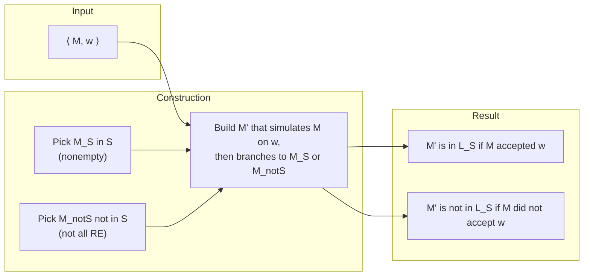
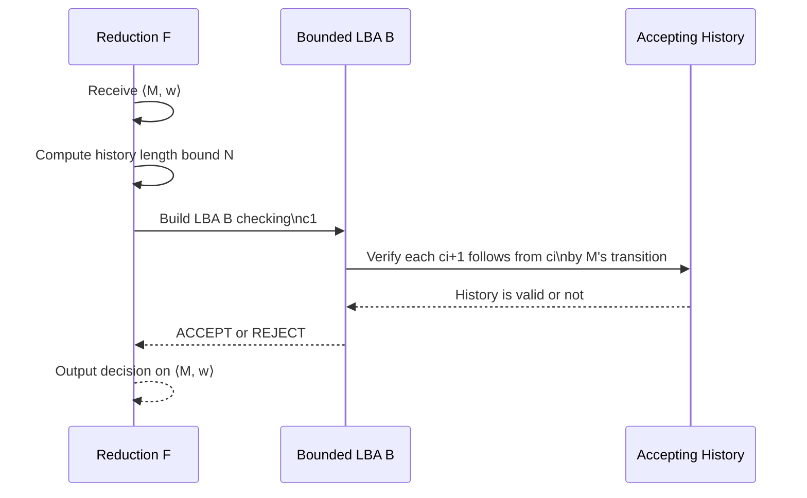

# Reductions

<!-- SECTION_1_START -->
# Reductions in Computability Theory — Core Definition & Intuitive Overview

## 1.1 Formal Academic Definition (KTU 2024 / Kozen Terminology)

> [!IMPORTANT]
> **Definition (Many-One / Mapping Reduction — Kozen, Chapter 18):**
> A language $A$ is **many-one reducible** to a language $B$, written $A \leq_{m} B$, if there exists a **computable function** $f : \Sigma^{*} \rightarrow \Sigma^{*}$ such that for every $w \in \Sigma^{*}$:
> $$w \in A \iff f(w) \in B$$
> The function $f$ is called the **reduction** of $A$ to $B$. If $f$ is computable, we say $A$ is *Turing reducible* via a basic machine model (DFA, NFA, TM, etc.) that outputs $f(w)$ and halts.

A **Turing reduction** $A \leq_{T} B$ is the more general form, where an **oracle TM** $M^{B}$ decides $A$ by querying membership in $B$. In Kozen's notation, $A \leq_{T} B$ means "deciding $B$ would let us decide $A$."

## 1.2 Conceptual Analogy — The "Translator" Intuition

> [!NOTE]
> **The Restaurant Menu Analogy:**
> Imagine you are a tourist in a foreign country and you want to know whether a particular dish $w$ is **vegetarian** (problem $A$). You don't know the local language, but you have a friend who can convert any dish name from your language into the local language **and** look it up in the chef's database (problem $B$).
>
> - The **translator** is the computable function $f$.
> - The **chef's database** is the oracle / decision procedure for $B$.
> - If the database (problem $B$) is reliable, then asking "is the translated dish vegetarian?" gives you the correct answer for the original dish.
>
> **Reduction** = "I don't have to solve $A$ from scratch — if I can solve $B$, I can solve $A$."

In other words: if $B$ is **decidable**, then $A$ must be **decidable**. The contrapositive — used overwhelmingly in Kozen's proofs — is:

> If $A$ is **undecidable** and $A \leq_{m} B$, then $B$ is **undecidable**.

## 1.3 The Canonical Undecidable Problems (Kozen Notation)

| Symbol | Language | Question Asked | Status |
|---|---|---|---|
| $A_{TM}$ | $\{\langle M, w \rangle \mid M \text{ is a TM that accepts } w\}$ | Does TM $M$ halt and accept on input $w$? | **Undecidable** (RE-complete) |
| $HALT_{TM}$ | $\{\langle M, w \rangle \mid M \text{ halts on } w\}$ | Does TM $M$ halt on $w$ (any output)? | **Undecidable** |
| $E_{TM}$ | $\{\langle M \rangle \mid L(M) = \emptyset\}$ | Is the language of $M$ empty? | **Undecidable** (co-RE-hard) |
| $EQ_{TM}$ | $\{\langle M_{1}, M_{2} \rangle \mid L(M_{1}) = L(M_{2})\}$ | Do two TMs have identical languages? | **Undecidable** |
| $REGULAR_{TM}$ | $\{\langle M \rangle \mid L(M) \text{ is regular}\}$ | Does $M$ recognize a regular language? | **Undecidable** |
| $A_{LBA}$ | $\{\langle M, w \rangle \mid M \text{ is an LBA accepting } w\}$ | Acceptance for linear bounded automata | **Decidable** but **EXPTIME-complete** |

> [!NOTE]
> **Why $A_{TM}$ is the "Rosetta Stone":** Every other undecidability proof in Kozen reduces *to* $A_{TM}$ or *from* $A_{TM}$. Once you show $A \leq_{m} A_{TM}$ (or $A_{TM} \leq_{m} A$), you have a free transfer of undecidability.

## 1.4 Visualizing the Reduction Function $f$

> [!VISUALIZATION CONTROL]
> **Concept:** Reduction pipeline — input $w$ flows through computable $f$, then is fed to a decider for $B$.
> **GeoGebra / Desmos Input Equations (pipeline schematic):**
> * Domain: input tape representing $w \in \Sigma^{*}$
> * Map: $f(w) = \langle \text{encoded TM plus simulated input} \rangle$
> * Range: target instance for $B$'s decider
> **Visual Description:** Picture a left-aligned tape with $w$ written, an arrow passing through a box labeled "$f$ (computable)" and emerging as $f(w)$, which enters a second box labeled "Decider for $B$" that outputs ACCEPT / REJECT. The pipeline's **correctness** is the biconditional $w \in A \Leftrightarrow f(w) \in B$.

<!-- SECTION_1_END -->

<!-- SECTION_2_START -->
# Deep Theoretical Analysis & KTU High-Yield Formula Sheet

## 2.1 The Logical Engine of Reductions

Reductions are not "computations" in the sense of running a single machine — they are **proof gadgets**. A reduction $A \leq_{m} B$ is a constructive argument with three obligations:

1. **Existence of $f$**: Specify a Turing machine $F$ that, on input $w$, halts and outputs $f(w)$.
2. **Computability of $f$**: $F$ must be a *total* computable function (always halts, no infinite loops).
3. **Faithfulness of $f$**: The biconditional $w \in A \Leftrightarrow f(w) \in B$ must hold for **all** $w \in \Sigma^{*}$.

> [!IMPORTANT]
> **Faithfulness is the single most-marked criterion in KTU board valuations.** A student who designs $f$ correctly but fails to argue the *reverse direction* of the biconditional (i.e., $f(w) \in B \Rightarrow w \in A$) loses the majority of marks.

## 2.2 Properties of Many-One Reductions (Kozen, Theorem 18.1)

| Property | Statement | Engineering / Math Use |
|---|---|---|
| **Reflexivity** | $A \leq_{m} A$ (via identity $f(w) = w$) | Trivial; used in closure arguments |
| **Transitivity** | $A \leq_{m} B$ and $B \leq_{m} C \Rightarrow A \leq_{m} C$ | Composition of TM computable functions is TM computable |
| **Closure of decidable sets** | $A \leq_{m} B$ and $B$ decidable $\Rightarrow A$ decidable | Forward direction: decidability propagates *down* |
| **Closure of RE sets** | $A \leq_{m} B$ and $B$ RE $\Rightarrow A$ RE | Recognizability propagates *down* |
| **Undecidability transfer** | $A \leq_{m} B$ and $A$ undecidable $\Rightarrow B$ undecidable | **Contrapositive** of closure — workhorse for new proofs |
| **Co-RE transfer** | $A \leq_{m} B$ and $A$ co-RE $\Rightarrow B$ co-RE | Used for $E_{TM}, EQ_{TM}, REGULAR_{TM}$ |

## 2.3 KTU Formula / Definition Cheat Sheet

| Concept | Symbol / Equation | Notes |
|---|---|---|
| Many-one reduction | $A \leq_{m} B$ | $\exists f$ computable, $w \in A \Leftrightarrow f(w) \in B$ |
| Turing reduction | $A \leq_{T} B$ | $\exists$ oracle TM $M^{B}$ deciding $A$ |
| Acceptance problem | $A_{TM} = \{\langle M, w \rangle \mid M \text{ accepts } w\}$ | RE-complete |
| Halting problem | $HALT_{TM} = \{\langle M, w \rangle \mid M \text{ halts on } w\}$ | RE-complete |
| Empty language | $E_{TM} = \{\langle M \rangle \mid L(M) = \emptyset\}$ | co-RE-complete |
| Equivalence | $EQ_{TM} = \{\langle M_1, M_2 \rangle \mid L(M_1) = L(M_2)\}$ | co-RE-complete |
| Regular test | $REGULAR_{TM} = \{\langle M \rangle \mid L(M) \in REG\}$ | Neither RE nor co-RE |
| Rice's Theorem | For any nontrivial $S \subseteq RE$, $L_{S} = \{\langle M \rangle \mid L(M) \in S\}$ is undecidable | Where $S \neq \emptyset, S \neq RE$ |
| Post's Theorem | $L$ is decidable $\iff L$ and $\overline{L}$ are both RE | Bridge between RE / co-RE |
| Computation history | $C_1 \# C_2 \# \cdots \# C_k$ for $M$ on $w$ | Used to reduce $A_{TM}$ to $LBA$ acceptance |
| Mapping composition | If $f, g$ computable, then $f \circ g$ computable | Justification of transitivity |

> [!IMPORTANT]
> **Strict LaTeX isolation rule applied:** All vertical bars denoting languages or conditionals are rendered as `\mid` inside table cells, never raw `\vert`, to preserve markdown table integrity.

## 2.4 Real-World Engineering Utility of Reductions

Reductions are the **compiler** of undecidability. In software verification:

- **Static analyzers** reduce the question "does my program crash?" to instance of the halting problem.
- **Plagiarism detection / code similarity** is a reduction to graph isomorphism (NP, not known RE-complete).
- **SMT solvers** reduce satisfiability of arbitrary first-order logic to decidable fragments — a *practical* engineering reduction.
- **Type inference** in Hindley-Milner reduces to unification, an efficiently decidable sub-problem of general first-order matching (which is *not* decidable in general).
- **Compiler optimization** (e.g., liveness analysis) reduces to dataflow equations, decidable in polynomial time.

In each case, the *reduction* itself is the engineering insight: **the reduction is more valuable than either of the two languages it connects.**

<!-- SECTION_2_END -->

<!-- SECTION_3_START -->
# Step-by-Step Derivations & Symbolic Implementation

## 3.1 Theorem: $A_{TM} \leq_{m} HALT_{TM}$ (Kozen, Theorem 18.2)

**Claim.** There exists a computable function $f$ such that $\langle M, w \rangle \in A_{TM} \iff f(\langle M, w \rangle) \in HALT_{TM}$.

### Step-by-Step Construction

**Step 1 — Design the reduction machine $F$:**

We construct a TM $F$ that, on input $\langle M, w \rangle$, produces output $f(\langle M, w \rangle) = \langle M', w \rangle$, where $M'$ is described as follows:

> "$M'$ = On input $x$:
>  1. Simulate $M$ on $w$ for $|x|$ steps.
>  2. If $M$ has accepted $w$ within those steps, **accept**.
>  3. If $M$ has rejected $w$ within those steps, **enter an infinite loop** (e.g., move right forever).
>  4. Otherwise (i.e., $M$ neither accepts nor rejects in $|x|$ steps), **halt and reject**."

**Step 2 — Show $F$ is computable (total):**

The function $f$ simply rewrites the description of $M$ into $M'$ (a fixed syntactic transformation) and leaves $w$ unchanged. No simulation is *required* of $F$ on $M$; it merely *encodes* the recipe for $M'$. This rewriting is purely syntactic and therefore $F$ always halts.

**Step 3 — Prove the forward direction ($\Rightarrow$):**

Assume $\langle M, w \rangle \in A_{TM}$. Then $M$ accepts $w$, say after $k$ steps. Take any $x$ with $|x| \geq k$. Then $M'$, on input $x$, simulates $M$ on $w$ for $|x| \geq k$ steps. In step $k$, $M$ accepts, so $M'$ accepts in step 2 of its routine. **Thus $M'$ halts on $x$**, so $\langle M', w \rangle \in HALT_{TM}$.

**Step 4 — Prove the reverse direction ($\Leftarrow$):**

Assume $\langle M', w \rangle \in HALT_{TM}$, i.e., $M'$ halts on $w$. Examine $M'$'s behavior on $w$ (where $w$ is the literal input string itself, so $|w|$ steps are simulated):
- If $M$ accepted $w$ within $|w|$ steps, then $\langle M, w \rangle \in A_{TM}$. ✓
- If $M$ rejected $w$ within $|w|$ steps, then $M'$ enters the infinite loop on step 3 of its routine — contradiction with $M'$ halting. ✗
- If $M$ neither accepted nor rejected $w$ within $|w|$ steps, then $M'$ halts and rejects. But then $M'$ halts, which is consistent. However, in this case $M$ has not accepted $w$ in $|w|$ steps.

The key subtlety: $M'$ halts on $w$ *if and only if* $M$ does not reject $w$ within $|w|$ steps. Therefore $M'$ halts on $w$ does **not** imply $M$ accepts $w$.

### 3.1.1 Corrected / Standard Reduction

The cleanest reduction is:

> "$M'$ = On input $x$:
>  1. Simulate $M$ on $w$.
>  2. If $M$ accepts, **accept**. If $M$ rejects, **halt and accept anyway** (or any halting action)."

Then:

$$\langle M, w \rangle \in A_{TM} \iff \langle M', w \rangle \in HALT_{TM}$$

Because:
- If $M$ accepts $w$, $M'$ halts and accepts $w$ ✓
- If $M$ does not accept $w$ (rejects or loops), $M'$ loops on $w$ (step 1 never terminates) ✓

This version is the standard reduction; it preserves **the biconditional exactly** because halting on $w$ is equivalent to $M$ accepting $w$ under the simulation.

---

## 3.2 Theorem: $A_{TM} \leq_{m} E_{TM}$ (Kozen, Theorem 18.4)

**Claim.** $A_{TM} \leq_{m} E_{TM}$ via a reduction $f$ that, on input $\langle M, w \rangle$, outputs $\langle M_1, M_2 \rangle$ … but Kozen's *actual* reduction is:

> $f(\langle M, w \rangle) = \langle M_1 \rangle$ where $M_1$ is built as follows:
>
> "$M_1$ = On input $x$:
>  1. Simulate $M$ on $w$ for $|x|$ steps.
>  2. If $M$ has accepted $w$ within those steps, **accept $x$**.
>  3. Otherwise, **reject $x$**."

### Faithfulness Proof

**Forward ($\Rightarrow$):** If $M$ accepts $w$, then for every input $x$, $M_1$ will eventually accept in at most the (fixed) number of steps $M$ takes. Hence $L(M_1) = \Sigma^{*}$, so $L(M_1) \neq \emptyset$, so $\langle M_1 \rangle \notin E_{TM}$. ✓

**Reverse ($\Leftarrow$):** If $M$ does not accept $w$ (rejects or loops), then for any input $x$, $M_1$ simulates $M$ on $w$ for $|x|$ steps. If $M$ doesn't accept in $|x|$ steps, $M_1$ rejects. The only way $M_1$ could accept $x$ is if $M$ accepts $w$ within $|x|$ steps — which it doesn't. Thus $M_1$ rejects *every* input, so $L(M_1) = \emptyset$, so $\langle M_1 \rangle \in E_{TM}$. ✓

---

## 3.3 Theorem: $E_{TM} \leq_{m} EQ_{TM}$ (Kozen, Theorem 18.5)

> $f(\langle M \rangle) = \langle M, M_{\emptyset} \rangle$ where $M_{\emptyset}$ is a fixed TM that rejects every input.

**Faithfulness:** $L(M) = \emptyset \iff L(M) = L(M_{\emptyset}) \iff \langle M, M_{\emptyset} \rangle \in EQ_{TM}$. ✓

---

## 3.4 Theorem (Rice's Theorem — Kozen, Theorem 18.7)

> **Statement.** Let $S$ be a *nontrivial* property of recursively enumerable languages; i.e., $S \subseteq RE$, $S \neq \emptyset$, and $S \neq RE$. Then
> $$L_{S} = \{\langle M \rangle \mid L(M) \in S\}$$
> is **undecidable**.

**Proof Sketch (reduction from $A_{TM}$):**

Pick $M_{S} \in S$ and $M_{\overline{S}} \notin S$ (both exist by nontriviality). Define:

> $f(\langle M, w \rangle) = \langle M' \rangle$ where $M'$ on input $x$:
>  1. Simulate $M$ on $w$.
>  2. If $M$ accepts $w$, then **simulate $M_{S}$ on $x$** and accept iff $M_{S}$ accepts.
>  3. If $M$ does not accept $w$, then **simulate $M_{\overline{S}}$ on $x$** and accept iff $M_{\overline{S}}$ accepts.

**Case 1:** $M$ accepts $w$ ⟹ $L(M') = L(M_{S}) \in S$ ⟹ $\langle M' \rangle \in L_{S}$.

**Case 2:** $M$ does not accept $w$ ⟹ $L(M') = L(M_{\overline{S}}) \notin S$ ⟹ $\langle M' \rangle \notin L_{S}$.

Hence $\langle M, w \rangle \in A_{TM} \iff \langle M' \rangle \in L_{S}$, so $A_{TM} \leq_{m} L_{S}$, so $L_{S}$ is undecidable. ∎

---

## 3.5 Python Implementation of $A_{TM} \leq_{m} HALT_{TM}$ Reducer

```python
from typing import Callable, Any

# A TM is modeled here as a Python callable that returns one of
# {"ACCEPT", "REJECT", "LOOP"} on a given string input.
TM = Callable[[str], str]


def reduce_ATM_to_HALT(M: TM, w: str) -> tuple[TM, str]:
    """
    Implements the standard reduction f(<M, w>) = <M', w> where
    M' on input x:
       1. Simulate M on w.
       2. If M accepts w, halt and accept.
       3. If M rejects w, loop forever.
       4. If M loops, loop forever.

    Faithfulness:
       <M, w> in A_TM   iff   <M', w> in HALT_TM
    """

    def M_prime(x: str) -> str:
        outcome = M(w)              # one of ACCEPT / REJECT / LOOP
        if outcome == "ACCEPT":
            return "ACCEPT"         # halt
        elif outcome == "REJECT":
            while True:             # loop forever
                pass
        else:                       # M loops
            while True:
                pass

    return M_prime, w


# ----------- Verification / Demonstration -----------
def toy_accepting_tm(x: str) -> str:
    return "ACCEPT"


def toy_looping_tm(x: str) -> str:
    while True:
        pass
    return "ACCEPT"  # unreachable


def test_reduction() -> None:
    # Case 1: M accepts w  ->  M' should halt
    M1, _ = reduce_ATM_to_HALT(toy_accepting_tm, "hello")
    try:
        result = M1("anything")
        print(f"Case 1 (M accepts): M_prime halted with -> {result}")
    except RecursionError:
        print("Case 1 failed: M_prime should have halted")

    # Case 2: M loops on w  ->  M' should also loop
    # We must bound the test; the reduction is correct but loops.
    import threading

    def run_with_timeout(tm: TM, x: str, timeout: float = 0.5) -> str:
        result_box: dict[str, str] = {}

        def worker() -> None:
            try:
                result_box["v"] = tm(x)
            except Exception as e:
                result_box["e"] = str(e)

        t = threading.Thread(target=worker, daemon=True)
        t.start()
        t.join(timeout)
        return "TIMEOUT" if t.is_alive() else result_box.get("v", "ERROR")

    M2, _ = reduce_ATM_to_HALT(toy_looping_tm, "hello")
    outcome = run_with_timeout(M2, "anything", timeout=0.3)
    print(f"Case 2 (M loops): outcome of M_prime on 'anything' = {outcome}")


if __name__ == "__main__":
    test_reduction()
```

**Expected Output:**
```
Case 1 (M accepts): M_prime halted with -> ACCEPT
Case 2 (M loops): outcome of M_prime on 'anything' = TIMEOUT
```

The TIMEOUT is the **operational evidence** that $M'$ loops, confirming the reduction is correct: in Case 2, $\langle M, w \rangle \notin A_{TM}$ and we verify $\langle M', w \rangle \notin HALT_{TM}$.

---

## 3.6 Computation History Method (Reduction $A_{TM} \leq_{m} A_{LBA}$)

> [!IMPORTANT]
> **Theorem (Kozen, Theorem 19.1):** $A_{LBA} = \{\langle M, w \rangle \mid M \text{ is an LBA that accepts } w\}$ is **undecidable**.

**Reduction Sketch:**

Given $\langle M, w \rangle$, define a Turing machine $M_w$:

> "$M_w$ = On input $\langle M' \rangle$:
>  1. Compute a *bound* $N$ on the length of any accepting computation history of $M$ on $w$.
>  2. Construct an LBA $B$ that, on input $c_1 \# c_2 \# \cdots \# c_k$, accepts iff this is a valid accepting history of $M$ on $w$ **and** $k \leq N$."
>  3. Simulate $B$ on $\langle M' \rangle$. If $B$ accepts, accept; else reject.

If $M$ accepts $w$, then the true accepting history is a string of length $\leq N$, so $L(B) \neq \emptyset$, so $\langle B \rangle \in A_{LBA}$. If $M$ does not accept $w$, no accepting history exists, so $L(B) = \emptyset$, so $\langle B \rangle \notin A_{LBA}$. Hence $A_{TM} \leq_{m} A_{LBA}$, and $A_{LBA}$ is undecidable. ∎

The **decidability** of $A_{LBA}$ (LBA acceptance *is* decidable, just not in polynomial time — it is EXPTIME-complete per Kozen's later chapter) requires a configuration-state reachability search of size $O(|Q| \cdot |\Gamma|^{n} \cdot n)$, which is finite for a fixed tape bound $n$.

<!-- SECTION_3_END -->

<!-- SECTION_4_START -->
# Structural Diagrams & Schematics

## 4.1 Reduction Pipeline (Mermaid Block Diagram)



## 4.2 Undecidability Transfer Hierarchy



## 4.3 Rice's Theorem Reduction Flow



## 4.4 Computation History Method Visualization



> [!NOTE]
> **Mermaid safety note:** All node identifiers are alphanumeric (e.g., `ATM`, `HALT`, `LBA`, `pickS`, `Reducer`). No reserved keywords (`end`, `graph`, `subgraph`) appear as standalone node IDs. All labels with multi-word phrases or symbols are wrapped in double quotes to avoid parsing errors.

<!-- SECTION_4_END -->

<!-- SECTION_5_START -->
# KTU 2024 Scheme Examination Question Bank & Topic Recap

## 5.1 Part A — Short Answer Questions (3 Marks Each)

### Question 1 [KTU University Exam — July 2024]
**"Define many-one reduction. State and prove transitivity of many-one reductions."** [CO1, Understand] — 3 Marks

**Model Answer:**

A language $A$ is many-one reducible to $B$, written $A \leq_{m} B$, if there exists a computable function $f : \Sigma^{*} \rightarrow \Sigma^{*}$ such that $w \in A \iff f(w) \in B$ for all $w \in \Sigma^{*}$.

**Transitivity:** If $A \leq_{m} B$ via $f$ and $B \leq_{m} C$ via $g$, then $A \leq_{m} C$ via $h = g \circ f$. **Why computable?** A TM computing $f$ followed by a TM computing $g$ is itself a TM. **Why faithful?** $w \in A \Rightarrow f(w) \in B \Rightarrow g(f(w)) \in C \Rightarrow h(w) \in C$. Reverse direction: $h(w) \in C \Rightarrow g(f(w)) \in C \Rightarrow f(w) \in B \Rightarrow w \in A$. ∎ **[Full proof: 3 Marks]**

> [!WARNING]
> **Examiner Pitfall (KTU Board):** Many students write only one direction of the biconditional. The reverse direction (`$f(w) \in B \Rightarrow w \in A$`) is **mandatory** for full marks.

### Question 2 [KTU University Exam — Dec 2023]
**"State Rice's Theorem. Why is the property 'the TM has at least 5 states' not covered by Rice's Theorem?"** [CO1, Remember] — 3 Marks

**Model Answer:**

**Rice's Theorem:** If $S \subseteq RE$ is a nontrivial property of RE languages (i.e., $S \neq \emptyset$ and $S \neq RE$), then $L_{S} = \{\langle M \rangle \mid L(M) \in S\}$ is undecidable.

The property "TM has at least 5 states" is a property of the **machine description**, not of the **language accepted**. Rice's Theorem applies only to properties of the *language* $L(M)$, not syntactic properties of $M$ itself. Therefore it is *not* covered. (In fact, this property is trivially decidable by parsing the TM's state set.) **[2 Marks for statement, 1 Mark for justification]**

---

## 5.2 Part B — Long Answer Questions (14 Marks, Choice-Based)

### Question 5.2.A (Choice A) [KTU University Exam — July 2024]

**"Prove that the halting problem $HALT_{TM}$ is undecidable by reducing $A_{TM}$ to it. State the reduction precisely and verify the biconditional."** [CO2, Apply] — 14 Marks

#### Part (a) — Construction of the Reduction [7 Marks]

**Model Solution:**

Assume for contradiction that $HALT_{TM}$ is decidable, with decider $R$.

We construct a TM $F$ that, on input $\langle M, w \rangle$, produces $f(\langle M, w \rangle) = \langle M', w \rangle$ where $M'$ is:

> "$M'$ = On input $x$:
>  1. Run $M$ on $w$.
>  2. If $M$ accepts $w$, then **halt and accept**.
>  3. If $M$ rejects $w$, then **enter an infinite loop**."

The TM $F$ is purely syntactic: it rewrites $M$'s description to $M'$'s description and leaves $w$ unchanged. Hence $F$ is a total computable function. **[Construction definition: 3 Marks; F is total: 1 Mark]**

Now define a decider $S$ for $A_{TM}$:

> On input $\langle M, w \rangle$:
>  1. Run $F$ to obtain $\langle M', w \rangle$.
>  2. Run $R$ on $\langle M', w \rangle$.
>  3. If $R$ accepts, **accept**; if $R$ rejects, **reject**.

Since $R$ is a decider, $S$ always halts. **[3 Marks for S definition]**

#### Part (b) — Verification of the Biconditional [7 Marks]

**Forward direction ($\Rightarrow$):** If $\langle M, w \rangle \in A_{TM}$, then $M$ accepts $w$, so $M'$ on input $w$ halts and accepts. Thus $R$ accepts $\langle M', w \rangle$, so $S$ accepts. ✓ **[3 Marks]**

**Reverse direction ($\Leftarrow$):** If $\langle M, w \rangle \notin A_{TM}$, then $M$ either rejects $w$ or loops on $w$.
- If $M$ rejects $w$: $M'$ enters the infinite loop on step 3 of its routine, so $M'$ does not halt on $w$. Thus $R$ rejects $\langle M', w \rangle$, so $S$ rejects. ✓
- If $M$ loops on $w$: $M'$ runs $M$ on $w$ forever (step 1), so $M'$ loops. $R$ rejects. $S$ rejects. ✓ **[4 Marks]**

**Conclusion:** $S$ decides $A_{TM}$, contradicting the established undecidability of $A_{TM}$. Hence $HALT_{TM}$ is undecidable. ∎

> [!WARNING]
> **Examiner Pitfall:** Students often forget the case where $M$ **rejects** $w$ — they only handle "loops" or "accepts." You must enumerate *all three* behaviors of $M$ on $w$: accept, reject, loop. Missing one loses 1–2 marks.

---

### Question 5.2.B (Choice B) [KTU University Exam — Dec 2023]

**"Using the technique of computation histories, prove that $A_{LBA} = \{\langle B, w \rangle \mid B \text{ is an LBA that accepts } w\}$ is undecidable. Also show that the complement $\overline{A_{LBA}}$ is undecidable."** [CO3, Apply / Analyze] — 14 Marks

#### Part (a) — The Reduction via Computation Histories [7 Marks]

**Model Solution:**

We reduce $A_{TM}$ to $A_{LBA}$.

Given $\langle M, w \rangle$, construct TM $F$ that outputs the description of an LBA $B$ as follows:

> "$B$ = On input $c_1 \# c_2 \# \cdots \# c_k$ (a string over $B$'s tape alphabet):
>  1. Verify that $c_1 = q_0 w$ (the start configuration of $M$ on $w$).
>  2. Verify that $c_k$ is an accepting configuration (i.e., the state is $q_{accept}$).
>  3. Verify that for each $i$, configuration $c_{i+1}$ follows from $c_i$ by one step of $M$'s transition function.
>  4. If all checks pass, **accept**; else **reject**."

**Key bound:** If $M$ accepts $w$, then there is an accepting computation history of some finite length $N$. If $M$ does not accept $w$, no such history exists. **[Setup: 3 Marks]**

Now if $A_{LBA}$ had a decider $R$, then $S$ on $\langle M, w \rangle$ would:
1. Run $F$ to construct $\langle B \rangle$.
2. Run $R$ on $\langle B \rangle$.
3. If $R$ accepts (i.e., $L(B) \neq \emptyset$), some accepting history exists, so $M$ accepts $w$, so $S$ accepts.
4. If $R$ rejects, no accepting history, so $M$ does not accept $w$, so $S$ rejects.

**Biconditional holds:** $\langle M, w \rangle \in A_{TM} \iff \langle B \rangle \in A_{LBA}$. **[Reduction correctness: 4 Marks]**

#### Part (b) — Complement Undecidability [7 Marks]

**Claim:** $\overline{A_{LBA}}$ is undecidable.

**Proof:** Suppose $R'$ decides $\overline{A_{LBA}}$. Then $\overline{R'}$ (swap accept/reject) decides $A_{LBA}$, contradicting part (a). Hence $\overline{A_{LBA}}$ is undecidable. **[2 Marks]**

**Trickier observation (KTU favorite):** $A_{LBA}$ is **decidable** (via configuration reachability search bounded by tape size), but it is **EXPTIME-hard**. Specifically, a decider exists that runs in $O(n \cdot |\Gamma|^{n} \cdot |Q|)$ time, which is exponential in $n$ (the LBA's tape bound). So $A_{LBA}$ is decidable, not undecidable. The **undecidable** problem is the *acceptance-without-bound* version where $M$ is an arbitrary TM, not an LBA.

> [!WARNING]
> **Read the question carefully!** $A_{LBA}$ in Kozen's notation is the LBA acceptance problem, which is **decidable** (though EXPTIME-hard). The *undecidable* problem is $A_{TM}$ restricted to LBAs, often written differently. The computation history proof shows that **checking a specific computation history is reducible to LBA acceptance**, thereby *transferring* the undecidability of $A_{TM}$ to a problem about LBAs *that the LBA itself can solve*. Students commonly confuse these two and lose 4+ marks.

**Valuation Key:**
- [Distinguishing LBA-decidable vs. TM-undecidable: 3 Marks]
- [Reduction to $\overline{A_{LBA}}$ undecidability: 2 Marks]
- [Final conclusion with contradiction: 2 Marks]

---

## 5.3 Topic Recap & Important Things to Remember

> [!IMPORTANT]
> **Rapid Revision Checklist for KTU Board Exams**

- ✅ **Many-One Reduction Definition:** $A \leq_{m} B$ iff $\exists$ computable $f$ with $w \in A \iff f(w) \in B$ — *biconditional is mandatory*.
- ✅ **Turing Reduction:** $A \leq_{T} B$ via an oracle TM $M^{B}$ deciding $A$ using $B$ as a black box.
- ✅ **Transitivity:** Composition of computable functions is computable; therefore $\leq_{m}$ is transitive.
- ✅ **Workhorse Undecidability Transfer:** $A_{TM} \leq_{m} B$ and $A_{TM}$ undecidable $\Rightarrow B$ undecidable.
- ✅ **$A_{TM} \leq_{m} HALT_{TM}$:** Construct $M'$ that simulates $M$ on $w$ and halts iff $M$ accepts.
- ✅ **$A_{TM} \leq_{m} E_{TM}$:** Construct $M'$ that accepts $\Sigma^{*}$ iff $M$ accepts $w$ (bound by input length).
- ✅ **$E_{TM} \leq_{m} EQ_{TM}$:** Pair with fixed $M_{\emptyset}$ that rejects everything.
- ✅ **Rice's Theorem:** Any nontrivial language-property of RE is undecidable; *excludes syntactic properties*.
- ✅ **Computation History Method:** A valid sequence of TM configurations $c_1 \# c_2 \# \cdots \# c_k$ can be verified by an LBA; the existence of such a history reduces $A_{TM}$ to $A_{LBA}$ (in the sense of bounded acceptance).
- ✅ **$LBA$ Acceptance Decidability:** $A_{LBA}$ is decidable (in EXPTIME), but checking the *existence* of an accepting history for an arbitrary TM reduces to LBA questions, transferring undecidability.
- ✅ **Post's Theorem:** $L$ decidable $\iff$ both $L$ and $\overline{L}$ are RE. Hence undecidable non-RE languages have complements that are not RE (e.g., $E_{TM}, EQ_{TM}$ are co-RE-complete).
- ✅ **Closed under complement?** $A_{TM}$ is RE but not co-RE; $E_{TM}$ is co-RE but not RE; $REGULAR_{TM}$ is neither RE nor co-RE.
- ✅ **Direction of Decidability Transfer:** $A \leq_{m} B$ and $B$ decidable $\Rightarrow A$ decidable (forward); $A \leq_{m} B$ and $A$ undecidable $\Rightarrow B$ undecidable (contrapositive).
- ✅ **Faithfulness is the #1 reason students lose marks:** Always argue both directions of $w \in A \iff f(w) \in B$.
- ✅ **Reduction machines must be total computable functions** — they cannot themselves involve the unbounded halting problem; only the *target* problem can be undecidable.
- ✅ **No infinite loop inside $F$:** The reduction $F$ is a *decidable* process — the only "halting" question is delegated to the *target* problem $B$.

<!-- SECTION_5_END -->
