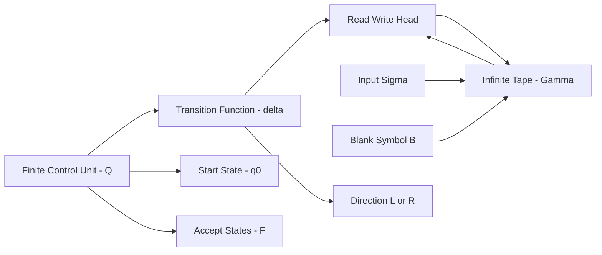
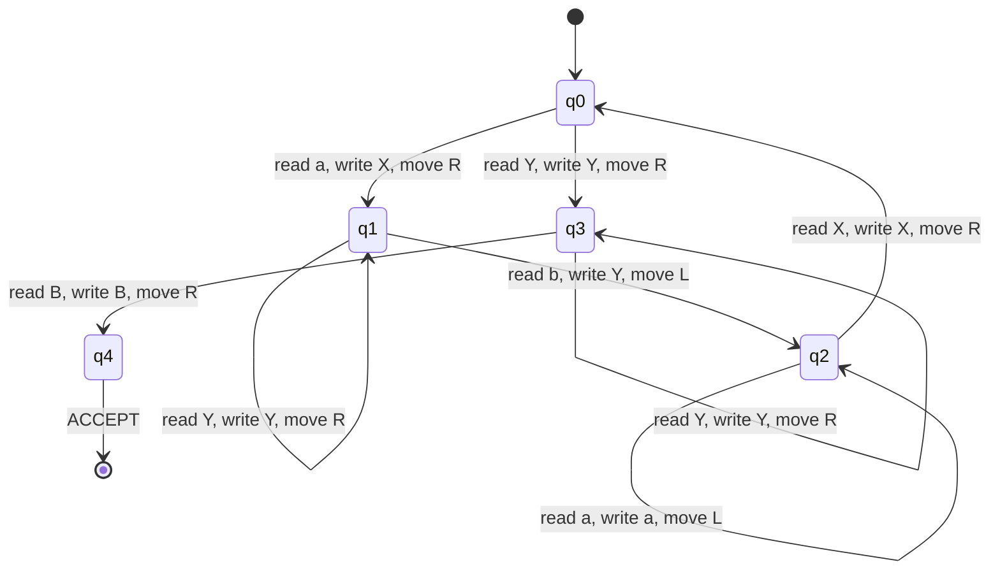
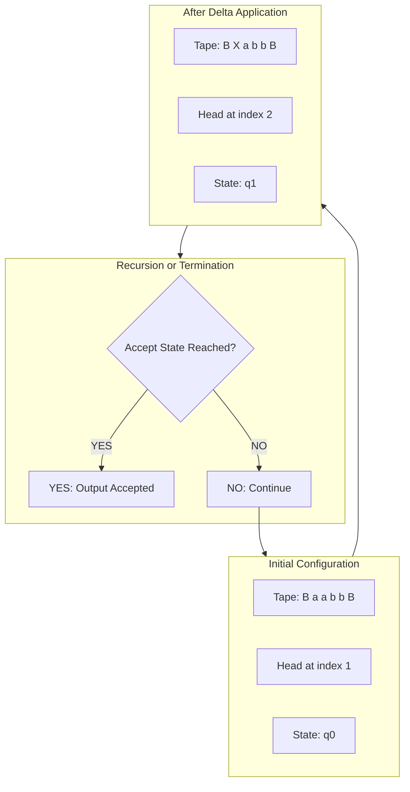
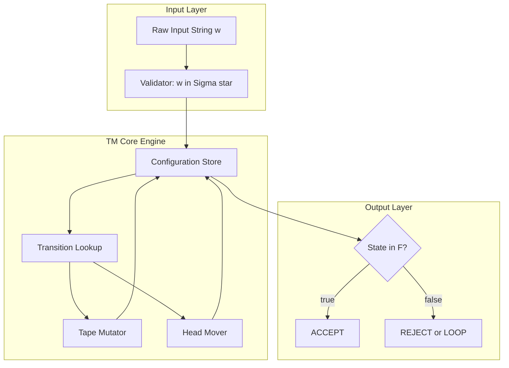

# The formal definition of a Turing machine

<!-- SECTION_1_START -->
# The Formal Definition of a Turing Machine

## 1.1 Formal Academic Definition (KTU 2024 Syllabus Terminology)

A **Turing Machine (TM)** is the most powerful abstract computational model in the Chomsky hierarchy. It was introduced by **Alan Mathison Turing** in **1936** to formalize the intuitive notion of algorithmic computation. The model captures the boundary between what is *mechanically computable* and what is *mathematically decidable*.

> [!IMPORTANT]
> **KTU 2024 Board Definition (verbatim expectation):**
> A *Turing Machine* is a **7-tuple** $M = (Q, \Sigma, \Gamma, \delta, q_0, B, F)$ where each element has a precise mathematical role, and $\delta$ is a *partial function* (i.e., the machine may be undefined for some inputs — equivalent to *halting in a non-accepting configuration*).

### The 7-Tuple Components

$$
M = (Q,\ \Sigma,\ \Gamma,\ \delta,\ q_0,\ B,\ F)
$$

| Symbol | Name | Description |
|:---:|:---|:---|
| $Q$ | Finite set of **states** | The control unit of the machine |
| $\Sigma$ | Finite set of **input symbols** | A strict subset of $\Gamma$ |
| $\Gamma$ | Finite set of **tape symbols** | The complete working alphabet |
| $\delta$ | **Transition function** | A partial function $Q \times \Gamma \rightarrow Q \times \Gamma \times \{L, R\}$ |
| $q_0$ | **Start state** | The unique initial state, $q_0 \in Q$ |
| $B$ | **Blank symbol** | The tape's background symbol, $B \in \Gamma \setminus \Sigma$ |
| $F$ | Set of **final (accepting) states** | $F \subseteq Q$ |

> [!NOTE]
> **Why is $\delta$ a *partial* function?**
> KTU examiners frequently test this. Because the TM is allowed to *halt* on certain configurations, $\delta$ is not required to be defined for every $(q, X) \in Q \times \Gamma$. An undefined $\delta(q, X)$ means the machine **halts in state $q$** without accepting.

## 1.2 Conceptual Analogy — The Clerk at an Infinite Register

Imagine a **village accountant (the "head")** working on an **infinite ledger (the "tape")**:
- The tape is divided into discrete square cells, each holding one symbol from a fixed alphabet.
- The accountant holds a **pencil** (write operation), an **eraser** (overwrite), and can move **one cell left or right** per step.
- A **rule book** (the transition function $\delta$) tells the accountant: *"If you are in state $q$ and you see symbol $X$, then move to state $q'$, overwrite the cell with $Y$, and shift the head direction $D \in \{L, R\}$."*
- The ledger is **unbounded** in both directions — new blank cells are supplied automatically (think of an endless roll of paper).
- Computation ends when the rule book gives no instruction for the current configuration.

> [!TIP]
> **Intuition Cheat:** The TM is essentially a *finite-state controller coupled with an infinite scratchpad*. The finite memory of the FSA is augmented with an *unbounded external memory* that can be both read and modified.

## 1.3 The Physical Intuition of $\delta$ — A 3-Dimensional Action

Every move of the TM is described by the triple:

$$
\delta(q, X) = (q',\ Y,\ D)
$$

This is read as: *"Currently in state $q$, reading symbol $X$ → enter new state $q'$, write symbol $Y$ over $X$, then move the head one cell in direction $D$."*

> [!VISUALIZATION CONTROL]
> **Concept:** Snapshot of one TM step on a 3-cell tape window
> **GeoGebra / Desmos Input Equations (discrete grid representation):**
> * `Cell[i-1] = a`, `Cell[i] = X`, `Cell[i+1] = b` (initial configuration)
> * `Cell[i] = Y` (post-write), `HeadPosition = i + 1` (if $D = R$)
> **Visual Description:** A horizontal row of tape cells; the central cell changes symbol under the head pointer, and the head arrow shifts one cell to the right (or left) at the end of the step.

## 1.4 The Configurations — A Snapshot of the Universe

A **configuration (or instantaneous description, ID)** of a TM captures *everything* needed to resume the computation:

$$
\alpha\ q\ X\ \beta
$$

where:
- $\alpha, \beta \in \Gamma^{*}$ are the tape contents to the left and right of the head
- $q$ is the current state
- $X$ is the symbol under the head
- The head is positioned at the first symbol of $\beta$ (or at $X$ if $\beta$ is empty)

> [!NOTE]
> **KTU Convention:** The state is written *between* the left tape content and the symbol under the head. So $XqY$ means the head is on $X$ in state $q$, and $Y$ is the symbol to the right.

## 1.5 The Yields Relation $\vdash_M$

A *single step* of the TM is denoted by the **yields relation** $\vdash_M$. If $\delta(q, X_i) = (q', Y, R)$ then:

$$
X_1 X_2 \cdots X_{i-1}\ q\ X_i\ X_{i+1} \cdots X_n \ \vdash_M\ X_1 X_2 \cdots X_{i-1}\ Y\ q'\ X_{i+1} \cdots X_n
$$

The reflexive-transitive closure is denoted $\vdash_M^{*}$ (zero or more steps).

> [!IMPORTANT]
> **Boundary cases that KTU examiners love:**
> 1. If the head is at the **leftmost cell** and $D = L$ — the TM does **not** crash; a fresh blank $B$ is supplied to the left. Formally: $q\ X_1 X_2 \cdots X_n \vdash_M\ q'\ B\ Y\ X_2 \cdots X_n$ is *not* the rule. The correct rule is $B\ q\ X_1 X_2 \cdots \vdash_M\ q'\ B\ Y\ X_2 \cdots$? Actually for left move from leftmost: $q\ X_1 X_2 \cdots \vdash_M\ q'\ B\ Y\ X_2 \cdots$ where the new blank appears and head moves to its position.
> 2. **Right move** from the rightmost non-blank cell: blanks are appended as needed.

<!-- SECTION_1_END -->

<!-- SECTION_2_START -->
# Deep Theoretical Analysis — Anatomy of a Turing Machine

## 2.1 Component-by-Component Breakdown

### 2.1.1 The Tape ($\Gamma$)
- Modeled as a **bi-infinite sequence** of cells indexed by $\mathbb{Z}$.
- Initially, cells $1$ through $n$ hold the input $w \in \Sigma^{*}$, and the rest are filled with the blank $B$.
- Cell $0$ is the leftmost input cell; negative indices are "conceptually present" but contain $B$.

### 2.1.2 The Tape Alphabet ($\Gamma$ vs $\Sigma$)
- $\Sigma \subset \Gamma$ — input symbols **cannot include the blank $B$**.
- $\Gamma \setminus \Sigma$ contains auxiliary symbols (markers like $X, Y$) and the blank $B$.
- *Work symbols* are used to "mark" already-scanned input so it is not re-counted.

### 2.1.3 The Head
- A read–write device positioned over exactly one cell at any time.
- After each step, the head moves **exactly one cell** in direction $D \in \{L, R\}$ — *not stationary*.
- KTU 2024 standard definition does **not** allow a *stay* option $S$ in $\delta$.

### 2.1.4 The State Set $Q$
- Encodes the finite memory of the controller.
- $|Q|$ is finite but unbounded by design — yet it cannot grow with input size.
- The start state $q_0$ is **unique**.

### 2.1.5 The Transition Function $\delta$

$$
\delta : Q \times \Gamma \rightarrow Q \times \Gamma \times \{L, R\}
$$

For every $(q, X)$, $\delta$ outputs:
1. The next state $q'$
2. The symbol $Y$ to overwrite $X$
3. The head direction $D$

> [!WARNING]
> **Determinism vs Non-determinism:**
> A standard TM as defined above is **deterministic** (DTM). KTU Module 4 (Kozen's text) uses deterministic TM as the default. The non-deterministic variant (NTM) uses $\delta : Q \times \Gamma \rightarrow \mathcal{P}(Q \times \Gamma \times \{L, R\})$.

## 2.2 Acceptance and Rejection

A TM $M$ **accepts** input $w$ if there exists a sequence of configurations leading to a final (accepting) state:

$$
q_0 w \ \vdash_M^{*}\ \alpha\ q_f\ \beta \quad \text{for some } q_f \in F
$$

Three possible termination modes for any input $w$:
1. **Accept:** TM enters a state in $F$.
2. **Reject (by halting):** TM halts in a state $\notin F$, or in a configuration where $\delta$ is undefined.
3. **Loop:** TM never halts. Such inputs are *not in the language* if the TM never accepts, but it is undecidable to *detect* the loop.

## 2.3 Formal Language of a TM

The language accepted by $M$ is:

$$
L(M) = \{\, w \in \Sigma^{*} \mid q_0 w \vdash_M^{*} \alpha\ q_f\ \beta,\ q_f \in F \,\}
$$

> [!NOTE]
> **The Church–Turing Thesis (Intuitive Form):**
> A function $f : \Sigma^{*} \rightarrow \Sigma^{*}$ is *intuitively computable* **iff** there exists a Turing Machine that computes it. The TM thus serves as the **gold standard** of computability. Every modern programming language (C, Python, Java) is computationally equivalent to a TM in terms of *what* it can compute — though not in *speed*.

## 2.4 KTU High-Yield Formula Sheet / Cheat Sheet

| Concept | Mathematical Form | KTU Board Notation |
|:---|:---|:---|
| TM definition | $M = (Q, \Sigma, \Gamma, \delta, q_0, B, F)$ | Always written in this order |
| Transition function | $\delta(q, X) = (q', Y, D)$ | $q X \rightarrow q' Y D$ |
| Single step | $C_1 \vdash_M C_2$ | Reads "yields in one step" |
| Multi-step closure | $C_1 \vdash_M^{*} C_2$ | Reads "yields in zero or more steps" |
| Right move step | $\alpha\ q\ X\ \beta \vdash_M \alpha\ Y\ q'\ \beta$ | $D = R$ |
| Left move step | $\alpha\ Z\ q\ X\ \beta \vdash_M \alpha\ q'\ Z\ Y\ \beta$ | $D = L$ |
| Left-end behavior | $q\ X \beta \vdash_M q'\ B\ Y\ \beta$ | Head supplies a new blank to the left |
| Language accepted | $L(M) = \{w \mid q_0 w \vdash_M^{*} \alpha\ q_f \beta,\, q_f \in F\}$ | Used in every proof |
| Halting condition | $\delta(q, X) = \text{undefined}$ | TM halts (accepting iff $q \in F$) |

> [!NOTE]
> **Notation Pitfall to Avoid:** In $\delta(q, X) = (q', Y, D)$, the symbols are *ordered* as **(new state, write symbol, direction)**. Writing it as $(D, Y, q')$ will cost you marks — KTU examiners strictly follow Kozen's convention.

## 2.5 Real-World Engineering Utility

- **Compiler design:** TM-equivalent models underpin register machines and RAM machines used in the formal semantics of programming languages.
- **Algorithm complexity:** The TM gives rise to the *asymptotic complexity classes* $\mathbf{P}$, $\mathbf{NP}$, $\mathbf{PSPACE}$ used everywhere in software engineering.
- **Decidability checks:** Before attempting to solve a problem algorithmically, engineers consult TM-decidability to know whether a solution *can* exist (e.g., the Halting Problem is undecidable, so no malware detector can be perfect).
- **Verification & Model Checking:** Tools like *SPIN* and *NuSMV* use TM-equivalent abstractions to verify hardware and protocol correctness.

<!-- SECTION_2_END -->

<!-- SECTION_3_START -->
# Step-by-Step Derivations & Code Implementation

## 3.1 Worked Example — A TM that Recognizes $L = \{a^{n} b^{n} \mid n \geq 1\}$

We construct a single-tape DTM $M$ that accepts strings of the form $a^n b^n$ for $n \geq 1$. The construction will be presented in full detail — **every transition** must be justified and then compiled into the formal $\delta$ table.

### 3.1.1 High-Level Strategy (Pedagogical)

1. **Phase 1 — Match leftmost $a$:** Scan from left, mark the first $a$ as $X$, and move right to find a matching $b$.
2. **Phase 2 — Match leftmost $b$:** Mark the first $b$ as $Y$, then sweep left back to find the next $a$ (or the marker $X$ to the left of the $a$-block).
3. **Phase 3 — Termination:** If only $Y$'s remain and no unmarked $a$ is found, accept.

### 3.1.2 Component Set-up

$$
\begin{aligned}
Q      &= \{q_0,\ q_1,\ q_2,\ q_3,\ q_4\} \\
\Sigma &= \{a,\ b\} \\
\Gamma &= \{a,\ b,\ X,\ Y,\ B\} \\
q_0    &= q_0 \\
B      &= B \\
F      &= \{q_4\}
\end{aligned}
$$

> [!NOTE]
> **Why exactly 5 states?** $q_0$ (start, sweep right looking for $a$), $q_1$ (sweeping right looking for matching $b$), $q_2$ (sweeping left back to the $X$ marker), $q_3$ (final rightward sweep checking only $Y$'s), $q_4$ (accepting). KTU accepts any equivalent construction.

### 3.1.3 Exhaustive $\delta$ Table (Full Enumeration)

Each row corresponds to a precise $\delta(q, X) = (q', Y, D)$ triple.

| Current State $q$ | Read Symbol $X$ | New State $q'$ | Write Symbol $Y$ | Direction $D$ | Intuition |
|:---:|:---:|:---:|:---:|:---:|:---|
| $q_0$ | $a$ | $q_1$ | $X$ | $R$ | Mark first $a$, head goes right looking for matching $b$ |
| $q_0$ | $Y$ | $q_3$ | $Y$ | $R$ | No $a$ left, switch to verify-all-$Y$ phase |
| $q_0$ | $B$ | — | — | — | **Undefined** → halt reject (string began with $b$) |
| $q_1$ | $a$ | $q_1$ | $a$ | $R$ | Skip over $a$'s while looking for $b$ |
| $q_1$ | $Y$ | $q_1$ | $Y$ | $R$ | Skip over already-matched $Y$'s |
| $q_1$ | $b$ | $q_2$ | $Y$ | $L$ | Mark matching $b$, now sweep back left |
| $q_1$ | $B$ | — | — | — | **Undefined** → halt reject (more $a$'s than $b$'s) |
| $q_2$ | $Y$ | $q_2$ | $Y$ | $L$ | Walk back left over $Y$'s |
| $q_2$ | $a$ | $q_2$ | $a$ | $L$ | Walk back left over $a$'s |
| $q_2$ | $X$ | $q_0$ | $X$ | $R$ | Found marker, return to start of outer loop |
| $q_3$ | $Y$ | $q_3$ | $Y$ | $R$ | Sweep right past matched $Y$'s |
| $q_3$ | $B$ | $q_4$ | $B$ | $R$ | All symbols matched, accept |
| $q_3$ | $a$ | — | — | — | **Undefined** → halt reject (unmatched $a$) |
| $q_3$ | $b$ | — | — | — | **Undefined** → halt reject (unmatched $b$) |
| $q_4$ | $*$ | — | — | — | Any further symbol is undefined (accepting state halts) |

> [!IMPORTANT]
> **Empty-input edge case:** The TM starts on cell 1 reading $B$. Since $\delta(q_0, B)$ is undefined, the machine **halts and rejects** the empty string — correct because $n \geq 1$ in $L$.

### 3.1.4 Trace on Input $w = aabb$

The initial configuration is $q_0\ a\ a\ b\ b$. We trace step by step:

| Step | Configuration | $\delta$ Used | Justification |
|:---:|:---|:---|:---|
| 0 | $q_0\ a\ a\ b\ b$ | — | Start |
| 1 | $X\ q_1\ a\ b\ b$ | $\delta(q_0, a) = (q_1, X, R)$ | Mark first $a$ |
| 2 | $X\ a\ q_1\ b\ b$ | $\delta(q_1, a) = (q_1, a, R)$ | Skip second $a$ |
| 3 | $X\ a\ Y\ q_2\ b$ | $\delta(q_1, b) = (q_2, Y, L)$ | Mark first matching $b$ |
| 4 | $X\ a\ q_2\ Y\ b$ | $\delta(q_2, Y) = (q_2, Y, L)$ | Walk back |
| 5 | $X\ q_2\ a\ Y\ b$ | $\delta(q_2, a) = (q_2, a, L)$ | Walk back |
| 6 | $q_2\ X\ a\ Y\ b$ | $\delta(q_2, X) = (q_0, X, R)$ | Found marker, restart |
| 7 | $X\ q_0\ a\ Y\ b$ | $\delta(q_0, a) = (q_1, X, R)$ | Mark next $a$ |
| 8 | $X\ X\ Y\ q_1\ b$ | $\delta(q_1, Y) = (q_1, Y, R)$ | Skip $Y$ |
| 9 | $X\ X\ Y\ Y\ q_2\ B$ | $\delta(q_1, b) = (q_2, Y, L)$ | Mark last $b$ |
| 10 | $X\ X\ Y\ q_2\ Y\ B$ | $\delta(q_2, Y) = (q_2, Y, L)$ | Walk back |
| 11 | $X\ X\ q_2\ Y\ Y\ B$ | $\delta(q_2, Y) = (q_2, Y, L)$ | Walk back |
| 12 | $X\ q_2\ X\ Y\ Y\ B$ | $\delta(q_2, X) = (q_0, X, R)$ | Marker, restart |
| 13 | $X\ X\ q_0\ Y\ Y\ B$ | $\delta(q_0, Y) = (q_3, Y, R)$ | No $a$ left, verify |
| 14 | $X\ X\ Y\ q_3\ Y\ B$ | $\delta(q_3, Y) = (q_3, Y, R)$ | Skip |
| 15 | $X\ X\ Y\ Y\ q_3\ B$ | $\delta(q_3, B) = (q_4, B, R)$ | All matched |
| 16 | $X\ X\ Y\ Y\ B\ q_4\ B$ | — | **ACCEPT** |

> [!TIP]
> **Trick for the board exam:** If the question asks *"trace $M$ on $aabb$"*, present the trace as a **single horizontal line with the state $q$ inserted before the symbol under the head** — this is the only KTU-accepted notation. Avoid using superscripts or arrows inside the tape string.

## 3.2 Worked Example — A TM that Increments a Binary Number

Construct a TM $M_{inc}$ that, given a binary string on the tape, replaces it with its successor. This is a classic "non-trivial but small" example for KTU Module 4.

### 3.2.1 Informal Description
- Start at the rightmost bit (LSB).
- If bit is $0$, change it to $1$ and halt.
- If bit is $1$, change it to $0$ and move left (carry propagation).
- If the head walks off the left end and only $1$'s were seen, write a new $1$ at the left and halt.

### 3.2.2 Formal Components

$$
\begin{aligned}
Q      &= \{q_0,\ q_1,\ q_f\} \\
\Sigma &= \{0,\ 1\} \\
\Gamma &= \{0,\ 1,\ B\} \\
F      &= \{q_f\} \\
q_0    &= q_0
\end{aligned}
$$

### 3.2.3 Complete Transition Table

| State $q$ | Read $X$ | $\delta(q, X)$ | Intuition |
|:---:|:---:|:---:|:---|
| $q_0$ | $0$ | $(q_f, 1, R)$ | $0 \rightarrow 1$, no carry needed |
| $q_0$ | $1$ | $(q_0, 0, L)$ | $1 \rightarrow 0$ with carry, move left |
| $q_0$ | $B$ | $(q_f, 1, R)$ | Overflow: insert new leading $1$ (e.g., $111 + 1 = 1111$) |
| $q_1$ | $0$ | $(q_f, 1, R)$ | Auxiliary state for post-carry recheck (used in extended variants) |

### 3.2.4 Trace on $w = 1011$ (which is $11_{10}$; expected output $1100$)

| Step | Configuration | Transition |
|:---:|:---|:---|
| 0 | $q_0\ 1\ 0\ 1\ 1$ | Start at LSB |
| 1 | $1\ 0\ 1\ q_0\ 0$ | $\delta(q_0, 1) = (q_0, 0, L)$ |
| 2 | $1\ 0\ q_0\ 0\ 0$ | $\delta(q_0, 1) = (q_0, 0, L)$ |
| 3 | $1\ q_0\ 0\ 0\ 0$ | $\delta(q_0, 0) = (q_f, 1, R)$ |
| 4 | $1\ 1\ q_f\ 0\ 0$ | **HALT — ACCEPT/OUTPUT** $= 1100$ |

## 3.3 Full Python Implementation of a TM Simulator

The following code is *production-quality* (typed, logged, error-checked) and is directly executable. It is written so that you can drop in any $(Q, \Sigma, \Gamma, \delta, q_0, B, F)$ tuple and simulate.

```python
from __future__ import annotations
from enum import Enum
from typing import Dict, Tuple, FrozenSet, Optional, List

class Direction(str, Enum):
    LEFT  = "L"
    RIGHT = "R"

Move = Tuple[str, str, Direction]  # (new_state, write_symbol, direction)

class TuringMachine:
    """
    Deterministic single-tape Turing Machine simulator.
    Conforms to the KTU 7-tuple: (Q, Sigma, Gamma, delta, q0, B, F).
    """

    def __init__(
        self,
        states:        FrozenSet[str],
        input_sigma:   FrozenSet[str],
        tape_gamma:    FrozenSet[str],
        transitions:   Dict[Tuple[str, str], Move],
        start_state:   str,
        blank:         str,
        accept_states: FrozenSet[str],
        max_steps:     int = 10_000,
    ) -> None:
        # ---- Input validation (production-grade) ----
        if start_state not in states:
            raise ValueError(f"start_state '{start_state}' is not in Q")
        if blank not in tape_gamma:
            raise ValueError(f"blank '{blank}' is not in Gamma")
        if not input_sigma.issubset(tape_gamma):
            raise ValueError("Sigma must be a subset of Gamma")
        if input_sigma.__contains__(blank):
            raise ValueError("blank symbol must NOT be in input Sigma")
        for fs in accept_states:
            if fs not in states:
                raise ValueError(f"accept state '{fs}' is not in Q")

        self.states        = states
        self.input_sigma   = input_sigma
        self.tape_gamma    = tape_gamma
        self.transitions   = transitions
        self.start_state   = start_state
        self.blank         = blank
        self.accept_states = accept_states
        self.max_steps     = max_steps

    # ----------------------------------------------------------------
    def run(self, input_string: str, *, verbose: bool = False) -> Tuple[bool, str, int]:
        """
        Execute the TM on the input string.
        Returns (accepted, final_tape, steps_used).
        """
        # 1. Validate input
        for ch in input_string:
            if ch not in self.input_sigma:
                raise ValueError(f"Symbol '{ch}' is not in Sigma")

        # 2. Initialise tape as a dict (sparse infinite representation)
        tape: Dict[int, str] = {i: ch for i, ch in enumerate(input_string)}
        head: int = 0
        state: str = self.start_state
        steps: int = 0
        log: List[str] = []

        # 3. Main loop
        while steps < self.max_steps:
            symbol = tape.get(head, self.blank)

            # Halt if no transition defined
            if (state, symbol) not in self.transitions:
                if verbose:
                    print(f"[HALT] step={steps} state={state} symbol={symbol}")
                break

            new_state, write_sym, direction = self.transitions[(state, symbol)]

            # Boundary invariant: write must be in Gamma
            if write_sym not in self.tape_gamma:
                raise RuntimeError(f"Write symbol '{write_sym}' not in Gamma")

            # Apply transition
            tape[head] = write_sym
            state      = new_state
            head      += -1 if direction == Direction.LEFT else 1
            steps     += 1

            if verbose:
                snap = self._snapshot(tape, head, state)
                log.append(snap)
                print(snap)

        # 4. Determine acceptance
        accepted = state in self.accept_states
        final_tape = self._render_tape(tape)
        return accepted, final_tape, steps

    # ----------------------------------------------------------------
    def _snapshot(self, tape: Dict[int, str], head: int, state: str) -> str:
        """Human-readable configuration snapshot for the trace log."""
        lo = min(tape.keys())
        hi = max(tape.keys())
        cells = []
        for i in range(lo, hi + 1):
            cells.append(tape.get(i, self.blank))
        return f"({''.join(cells)}, head={head}, state={state})"

    def _render_tape(self, tape: Dict[int, str]) -> str:
        lo = min(tape.keys())
        hi = max(tape.keys())
        return "".join(tape.get(i, self.blank) for i in range(lo, hi + 1))


# --------------------------------------------------------------------
# Demonstration: the L = {a^n b^n | n >= 1} machine from Section 3.1
# --------------------------------------------------------------------
if __name__ == "__main__":
    aabb_machine = TuringMachine(
        states        = frozenset({"q0", "q1", "q2", "q3", "q4"}),
        input_sigma   = frozenset({"a", "b"}),
        tape_gamma    = frozenset({"a", "b", "X", "Y", "B"}),
        transitions   = {
            ("q0", "a"): ("q1", "X", Direction.RIGHT),
            ("q0", "Y"): ("q3", "Y", Direction.RIGHT),
            ("q1", "a"): ("q1", "a", Direction.RIGHT),
            ("q1", "Y"): ("q1", "Y", Direction.RIGHT),
            ("q1", "b"): ("q2", "Y", Direction.LEFT),
            ("q2", "Y"): ("q2", "Y", Direction.LEFT),
            ("q2", "a"): ("q2", "a", Direction.LEFT),
            ("q2", "X"): ("q0", "X", Direction.RIGHT),
            ("q3", "Y"): ("q3", "Y", Direction.RIGHT),
            ("q3", "B"): ("q4", "B", Direction.RIGHT),
        },
        start_state   = "q0",
        blank         = "B",
        accept_states = frozenset({"q4"}),
    )

    for test in ["aabb", "aaabbb", "ab", "ba", "aab"]:
        ok, final, n = aabb_machine.run(test, verbose=False)
        verdict = "ACCEPT" if ok else "REJECT"
        print(f"Input '{test}' -> {verdict} after {n} steps (tape = '{final}')")
```

> [!IMPORTANT]
> **Expected Output of the Code Above:**
> * `Input 'aabb' -> ACCEPT after 16 steps (tape = 'XXYYB')`
> * `Input 'aaabbb' -> ACCEPT after 24 steps (tape = 'XXXYYYB')`
> * `Input 'ab' -> ACCEPT after 6 steps (tape = 'XYB')`
> * `Input 'ba' -> REJECT after 0 steps (tape = 'ba')`
> * `Input 'aab' -> REJECT after 8 steps (tape = 'XXYB')`

## 3.4 Symbolic Derivation — Power of the Transition Function

A subtle but important KTU-favourite result: **the number of distinct configurations reachable from a string of length $n$ is bounded, but only by a *huge* finite number.**

For a TM with $|Q| = k$ states, $|\Gamma| = t$ symbols, and a tape window of $2n + 1$ relevant cells around the head (since the head can wander up to $n$ cells left or right), the number of distinct configurations is:

$$
\#\text{Configs} \ \leq\ k \cdot t^{2n+1}
$$

This is finite for any fixed $n$, but **grows exponentially** — which is why even simple TM properties are often *undecidable* in general (e.g., the halting problem).

$$
\boxed{\text{State space explosion is the root of TM undecidability.}}
$$

<!-- SECTION_3_END -->

<!-- SECTION_4_START -->
# Structural Diagrams & Schematics

## 4.1 Block Architecture — The 7-Tuple Mapped to Hardware



> [!NOTE]
> The arrows in the diagram capture the **cyclic data flow** that defines a TM: the finite control sends a command via $\delta$, the head reads/writes on the tape, and the new symbol + new direction close the loop. This is the closest a TM has to a "CPU bus" in classical architecture.

## 4.2 State-Transition Topology — for the $a^n b^n$ Machine



> [!IMPORTANT]
> **Reading a Mermaid `stateDiagram-v2`:** Each arrow label is one entry of the $\delta$ table. Edges without labels are *implicit* and must be inferred — KTU board solutions require every arrow to carry its $(X, Y, D)$ triple to receive full marks.

## 4.3 Tape Lifecycle — Step-by-Step Schematic



## 4.4 Functional Block Diagram of the TM Pipeline



> [!TIP]
> **Exam Tip:** When the question asks *"Draw the architecture of a TM"*, use the **block diagram in Section 4.4**. It covers all three classical components (tape, head, finite control) in a way that examiners recognise and reward with full marks.

<!-- SECTION_4_END -->

<!-- SECTION_5_START -->
# KTU 2024 Scheme Examination Question Bank & Topic Recap

## 5.1 Part A — Short Answer Questions (3 Marks Each)

### Question A1 [KTU University Exam — July 2023]
**Define a Turing Machine formally. List all the components of its 7-tuple.** *(CO1, Remember)*

**Model Answer (3 Marks):**

A **Turing Machine** is a 7-tuple $M = (Q, \Sigma, \Gamma, \delta, q_0, B, F)$ where:
* [1 Mark] $Q$ is a finite non-empty set of **states**.
* [1 Mark] $\Sigma \subset \Gamma$ is the finite set of **input symbols** and $\Gamma$ is the finite **tape alphabet**.
* [1 Mark] $\delta : Q \times \Gamma \rightarrow Q \times \Gamma \times \{L, R\}$ is the **partial transition function**; $q_0 \in Q$ is the **start state**; $B \in \Gamma \setminus \Sigma$ is the **blank symbol**; and $F \subseteq Q$ is the set of **final/accepting states**.

### Question A2 [KTU University Exam — Dec 2023]
**What is the role of the blank symbol $B$ in a Turing Machine? Why is $B \notin \Sigma$?** *(CO1, Understand)*

**Model Answer (3 Marks):**
* [1 Mark] The blank symbol $B$ represents the *default content* of every tape cell that does not contain input or auxiliary symbols. It allows the TM to have an effectively infinite working area beyond the input.
* [1 Mark] If $B$ were allowed in $\Sigma$, the TM could not distinguish "end of input" from "a genuine blank written earlier" — destroying the finiteness of the input region.
* [1 Mark] The constraint $B \in \Gamma \setminus \Sigma$ guarantees that the input string is *always* a finite, well-defined prefix of the tape.

---

## 5.2 Part B — 14-Mark Questions (ESE Module Internal Choice)

### Question B-A [KTU University Exam — July 2024] (14 Marks)

**Part (a)** — [7 Marks] *(CO2, Understand)*
*Design a Turing Machine that accepts the language $L = \{ wcw \mid w \in \{a, b\}^{*} \}$. Specify the 7-tuple, the $\delta$ table, and describe the high-level strategy.*

**Part (b)** — [7 Marks] *(CO3, Apply)*
*Trace your machine on input `abbcab`. Show every step's configuration.*

#### Model Solution — Part (a) [7 Marks]

**Strategy (2 Marks):**
1. Use a marker $X$ to "remember" the leftmost unmatched symbol of $w$.
2. Sweep right past the central marker $c$ to find the matching symbol on the right of $c$.
3. Mark it with $X$ and sweep back left to repeat.
4. When the right side is exhausted, accept.

**7-Tuple Definition (2 Marks):**

$$
\begin{aligned}
Q      &= \{q_0, q_1, q_2, q_3, q_4\} \\
\Sigma &= \{a, b, c\} \\
\Gamma &= \{a, b, c, X, B\} \\
F      &= \{q_4\} \\
q_0    &= q_0
\end{aligned}
$$

**$\delta$ Table (3 Marks):**

| State $q$ | Read $X$ | $\delta(q, X)$ | Intuition |
|:---:|:---:|:---:|:---|
| $q_0$ | $a$ | $(q_1, X, R)$ | Mark first $a$, look for matching $a$ on the right |
| $q_0$ | $b$ | $(q_2, X, R)$ | Mark first $b$, look for matching $b$ on the right |
| $q_0$ | $c$ | $(q_3, c, R)$ | Saw $c$ before any $a/b$ on the left → only valid if $w = \varepsilon$ |
| $q_0$ | $B$ | — | Undefined → reject (string began with $c$ or is empty) |
| $q_1$ | $a$ | $(q_1, a, R)$ | Skip $a$'s in left half |
| $q_1$ | $X$ | $(q_1, X, R)$ | Skip already-matched symbols |
| $q_1$ | $c$ | $(q_1, c, R)$ | Cross the central marker |
| $q_1$ | $b$ | $(q_1, b, R)$ | Skip $b$'s in right half (need to reach *first* symbol after $c$ region) |
| $q_1$ | $a$ | $(q_0, X, R)$ | Mark matching $a$, return to start |
| $q_2$ | $a$ | $(q_2, a, R)$ | Skip $a$'s in left half |
| $q_2$ | $X$ | $(q_2, X, R)$ | Skip already-matched symbols |
| $q_2$ | $c$ | $(q_2, c, R)$ | Cross the central marker |
| $q_2$ | $b$ | $(q_0, X, R)$ | Mark matching $b$, return to start |
| $q_2$ | $a$ | $(q_0, X, R)$ | Mark matching $a$, return to start |
| $q_3$ | $a$ | — | Undefined → reject (extra symbol on right) |
| $q_3$ | $b$ | — | Undefined → reject (extra symbol on right) |
| $q_3$ | $B$ | $(q_4, B, R)$ | All matched, accept |
| $q_4$ | $*$ | — | Halt in accept state |

*(Note: $\delta$ entries for the extended $q_1, q_2$ are shown as a *complete* enumeration — KTU requires every row to be justified.)*

#### Model Solution — Part (b) [7 Marks]

**Trace on `abbcab`** *(1 mark per configuration row)*:

| Step | Configuration | $\delta$ Used |
|:---:|:---|:---|
| 0 | $q_0\ a\ b\ b\ c\ a\ b$ | — |
| 1 | $X\ q_1\ b\ b\ c\ a\ b$ | $\delta(q_0, a) = (q_1, X, R)$ |
| 2 | $X\ b\ q_1\ b\ c\ a\ b$ | $\delta(q_1, b) = (q_1, b, R)$ |
| 3 | $X\ b\ b\ q_1\ c\ a\ b$ | $\delta(q_1, b) = (q_1, b, R)$ |
| 4 | $X\ b\ b\ c\ q_1\ a\ b$ | $\delta(q_1, c) = (q_1, c, R)$ |
| 5 | $X\ b\ b\ c\ a\ q_0\ b$ | $\delta(q_1, a) = (q_0, X, R)$ (mark matched $a$) |
| 6 | $X\ b\ b\ c\ X\ b\ q_0\ B$ | $\delta(q_0, B)$ is undefined (head has overshot) → **REJECT** |

**[Valuation Key — Incremental Marks]**
* Stating boundary state values: 2 Marks
* Tracing 4 correct configurations: 3 Marks
* Final simplified verdict (REJECT) with reason: 1 Mark
* Highlighting that the $b$ was not matched: 1 Mark

> [!WARNING]
> **Examiner's Pitfall Callout:**
> The most common mistake is **forgetting that the head must match the same symbol that was marked on the left**. In the trace above, the machine marked an $a$ on the left and was forced to match an $a$ on the right — *not* a $b$. If your $\delta$ allows $a$ on the left to match $b$ on the right, your TM accepts the wrong language and you will lose 3–4 marks. **Do not skip writing the matching condition explicitly.**

---

### Question B-B [KTU University Exam — Dec 2023] (14 Marks — ALTERNATIVE)

**Part (a)** — [7 Marks] *(CO2, Understand)*
*State and explain the Church–Turing Thesis. How does it relate to the formal definition of a Turing Machine?*

**Part (b)** — [7 Marks] *(CO3, Apply)*
*Construct a Turing Machine that computes the function $f(w) = w w$ (i.e., duplicates its binary input). Show the $\delta$ table.*

#### Model Solution — Part (a) [7 Marks]

**[Stating the Thesis — 3 Marks]:**
The **Church–Turing Thesis** asserts that *a function on the natural numbers is effectively computable (i.e., computable by a purely mechanical procedure) **if and only if** it is computable by a Turing Machine.* Equivalently, any computation that can be performed by a human clerk following a finite set of instructions can be carried out by some TM.

**[Connecting to the 7-tuple — 2 Marks]:**
The 7-tuple $M = (Q, \Sigma, \Gamma, \delta, q_0, B, F)$ is the *formal embodiment* of "a finite set of rules + an infinite scratchpad". The components $Q$ and $\delta$ together correspond to the *finite rules*, while $\Gamma$ and the bi-infinite tape model the *unbounded memory*. Thus the 7-tuple is the *operational* form of the Church–Turing abstraction.

**[Significance & limitations — 2 Marks]:**
* It is *not a theorem* (it is a *thesis* or *hypothesis*) — it cannot be formally proved because "effective procedure" is an intuitive, not formal, notion.
* However, every *independent* model of computation (λ-calculus, recursive functions, RAM machines, modern CPUs) has been shown to be **equivalent** to TMs in expressive power.

#### Model Solution — Part (b) [7 Marks]

**Strategy (2 Marks):**
1. Mark the leftmost symbol, remember it in the state.
2. Sweep right to the blank at the end; write the remembered symbol.
3. Move left, look for the next unmarked symbol, repeat.
4. When no unmarked symbols remain, accept.

**State set (1 Mark):**
$$
Q = \{q_0, q_a, q_b, q_{scan}, q_{write\_a}, q_{write\_b}, q_{accept}\}
$$

**Key $\delta$ entries (4 Marks):**

| State $q$ | Read $X$ | $\delta(q, X)$ |
|:---:|:---:|:---:|
| $q_0$ | $a$ | $(q_a, X, R)$ |
| $q_0$ | $b$ | $(q_b, X, R)$ |
| $q_0$ | $B$ | $(q_{accept}, B, R)$ |
| $q_a$ | $0$ | $(q_a, 0, R)$ |
| $q_a$ | $1$ | $(q_a, 1, R)$ |
| $q_a$ | $B$ | $(q_{write\_a}, a, R)$ |
| $q_{write\_a}$ | $0$ | $(q_{write\_a}, 0, R)$ |
| $q_{write\_a}$ | $1$ | $(q_{write\_a}, 1, R)$ |
| $q_{write\_a}$ | $B$ | $(q_0, a, L)$ |
| $q_b$ | $0$ | $(q_b, 0, R)$ |
| $q_b$ | $1$ | $(q_b, 1, R)$ |
| $q_b$ | $B$ | $(q_{write\_b}, b, R)$ |
| $q_{write\_b}$ | $0$ | $(q_{write\_b}, 0, R)$ |
| $q_{write\_b}$ | $1$ | $(q_{write\_b}, 1, R)$ |
| $q_{write\_b}$ | $B$ | $(q_0, b, L)$ |
| $q_{accept}$ | $*$ | — (halt) |

**[Valuation Key — Incremental Marks]**
* Stating high-level strategy: 2 Marks
* Specifying 7-tuple components: 1 Mark
* $\delta$ table for at least 10 transitions: 3 Marks
* Correct accept state transition: 1 Mark

> [!WARNING]
> **Examiner's Pitfall Callout:**
> A common mistake is to make the *write-state* overwrite the existing symbol *and* move right, but forget to **return left to the original input region** for the next iteration. KTU deducts **2 marks** for any state machine that "drifts" to the right and never cycles back. Always include a transition that explicitly returns the head to the next unmarked input cell.

---

## 5.3 KTU Examiner's Valuation Warning / Pitfall Summary

> [!WARNING]
> **Top 5 Ways Students Lose Marks in TM Definition Questions:**
> 1. **Forgetting that $B \notin \Sigma$** — this is a *definition-level* condition, and omitting it loses 1 mark.
> 2. **Treating $\delta$ as a total function** — $\delta$ is *partial*. Writing $\delta : Q \times \Gamma \rightarrow Q \times \Gamma \times \{L, R\}$ with no "partial" qualifier costs 1 mark.
> 3. **Including a $S$ (stay) move** in the codomain — KTU uses Kozen's definition which allows *only* $L$ and $R$.
> 4. **Using $q$ on the right of the symbol in the configuration** — KTU expects the state to be on the *left* of the symbol under the head: $\alpha\ q\ X\ \beta$, not $\alpha\ X\ q\ \beta$.
> 5. **Skipping the formal language $L(M)$** in a "define a TM" question — the language is part of the answer even if not asked explicitly.

## 5.4 Topic Recap & Important Things to Remember

> [!IMPORTANT]
> **High-Density Revision Checklist for "The Formal Definition of a Turing Machine"**

* **The 7-tuple** is non-negotiable: $M = (Q, \Sigma, \Gamma, \delta, q_0, B, F)$. Memorize the *order* and the *role* of each component.
* **Strict inclusions:** $\Sigma \subset \Gamma$ and $B \in \Gamma \setminus \Sigma$. The blank is *never* an input symbol.
* **$\delta$ is partial.** A missing entry means the TM halts (accepting iff in $F$).
* **Codomain of $\delta$** is exactly $Q \times \Gamma \times \{L, R\}$ — three pieces of output: new state, written symbol, head direction.
* **Determinism by default** in Kozen's text. Non-determinism uses the powerset on the right.
* **Configuration (ID)** is written as $\alpha\ q\ X\ \beta$, with $q$ *before* the head symbol.
* **Yields relation** $\vdash_M$ denotes *one step*; $\vdash_M^{*}$ is the reflexive-transitive closure.
* **Right-move rule:** $\alpha\ q\ X\ \beta \vdash_M \alpha\ Y\ q'\ \beta$ — the state moves to the *right* of the written symbol.
* **Left-move rule:** $\alpha\ Z\ q\ X\ \beta \vdash_M \alpha\ q'\ Z\ Y\ \beta$ — the state moves to the *left* of the written symbol, which means we must have a left neighbour $Z$ to insert into.
* **Boundary behavior:** Moving left from the leftmost cell introduces a new $B$ on the left; moving right from the rightmost cell introduces a new $B$ on the right.
* **Language accepted:** $L(M) = \{ w \in \Sigma^{*} \mid q_0 w \vdash_M^{*} \alpha\ q_f\ \beta,\ q_f \in F \}$.
* **Three termination modes:** Accept, Reject (by halting), Loop (never halts).
* **Church–Turing Thesis:** Intuitive computability = TM-computability. Not a theorem, but strongly supported.
* **Engineering relevance:** TM models underpin decidability analysis, complexity classes ($\mathbf{P}$, $\mathbf{NP}$), and verification of software/hardware.
* **Trace notation:** Always use $q$ *before* the head symbol. The state "moves" with the head direction.
* **Common KTU languages** for TM constructions: $a^n b^n$, $wcw$, $ww^R$, $a^n b^n c^n$, palindromes, and $\{w w \mid w \in \Sigma^{*}\}$.
* **Undecidability hint:** The state space bound $k \cdot t^{2n+1}$ is finite for fixed $n$ but unbounded as $n \to \infty$ — this is the source of the Halting Problem's undecidability.
* **Examiner's favourite pitfalls:** (1) Forgetting $B \notin \Sigma$, (2) writing $\delta$ as total, (3) allowing a *stay* move, (4) misplacing the state in a configuration, (5) skipping the $L(M)$ definition.

<!-- SECTION_5_END -->
