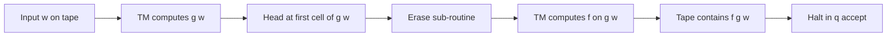
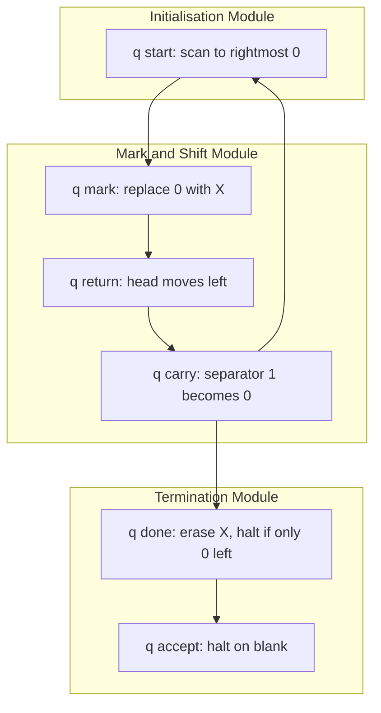
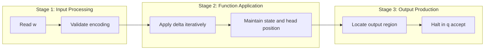
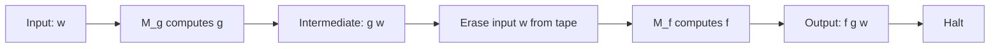

# Turing machines as computers of functions

<!-- SECTION_1_START -->
# Turing Machines as Computers of Functions

## 1.1 Formal Academic Definition (KTU 2024 Syllabus Aligned)

> [!IMPORTANT]
> **Core Definition (Kozen, Chapter 21):** A *Turing machine* $\mathcal{M} = (Q, \Sigma, \Gamma, \delta, q_0, q_{\text{acc}}, q_{\text{rej}})$ is said to *compute a partial function* $f : \Sigma^{*} \to \Gamma^{*}$ if for every input string $w \in \Sigma^{*}$, on which $f(w)$ is defined, the machine halts in the unique accepting state $q_{\text{acc}}$ with the tape containing $f(w)$ followed by blanks, and the read–write head positioned at a designated output cell.

In this view, the Turing machine transitions from a **language acceptor** (decision problem) to a **function computer** (transducer / operator). The same abstract machine now models arithmetic, string manipulation, and symbolic computation.

> [!NOTE]
> **Syllabus Highlight (PCCST302, Module 4):** Students are expected to distinguish between Turing machines as *language deciders* and as *function computers*, and to construct explicit transition diagrams for standard arithmetic and string functions.

---

## 1.2 Intuition & Real-World Analogy

Imagine a **tape with two registers** — one holding the input number and the other being a working area. The Turing machine is a *robot arm* that moves left or right, reads a digit, decides what to write, and shifts. After finitely many steps it stops, leaving the **answer** on the tape, just like an algorithm running on a CPU where memory and program live on the same medium.

> **Analogy — The Bank Counter:** A clerk receives a deposit slip (input) on the left, processes the transaction in the middle, and writes the new balance (output) on the right. The clerk may move back and forth, scratch out figures, and refer to a register. The Turing machine plays the same role for *partial recursive functions*.

> [!TIP]
> **Geometric Intuition:** Picture the tape as a horizontal number line. The input occupies the *negative* half, the output will eventually occupy the *positive* half, and the head sweeps between them, mutating symbols according to a finite table — a deterministic, stepwise "sweep" algorithm.

---

## 1.3 Types of Functions Computed

| Function Class | Notation | Turing Machine Behaviour |
|---|---|---|
| **Total computable** | $f : \Sigma^{*} \to \Gamma^{*}$ | Halts on *every* input in $q_{\text{acc}}$ |
| **Partial computable** | $f : \Sigma^{*} \rightharpoonup \Gamma^{*}$ | Halts only on inputs where $f(w)$ is defined |
| **Decision (Boolean)** | $f : \Sigma^{*} \to \{0,1\}$ | Special case: $q_{\text{acc}}$ = 1, $q_{\text{rej}}$ = 0 |

The key upgrade from a decider is that the **output is now a string** on the tape, not merely acceptance or rejection.

> [!WARNING]
> A Turing machine that loops forever on some input corresponds to a *partial* function whose value is **undefined** at that input. This is precisely the formal bridge to the *Church–Turing thesis* on partial recursive functions.

---

<!-- SECTION_2_START -->
# Deep Theoretical Analysis & KTU High-Yield Formula Sheet

## 2.1 The Transducer Setup (Two-Track Convention)

To standardise function computation, we adopt Kozen's **two-track / two-region convention**:

1. The input $w = a_1 a_2 \dots a_n$ occupies cells $1, 2, \dots, n$ of the tape, with the head at cell $1$.
2. Cell $n+1$ contains a delimiter `0` (blank).
3. The machine writes the output $f(w)$ starting at cell $n+2$, then halts in $q_{\text{acc}}$ with the head on the first symbol of $f(w)$.

> [!NOTE]
> **Justification of convention:** Any *unary* or *binary* numerical function can be computed in this form because the *blank symbol* `B` acts as a *natural boundary* that the machine respects.

---

## 2.2 Operational Logic of a Function-Computing TM

The step-by-step procedure is:

- **Initialisation:** Tape = $w B B B \dots$, head at $w[1]$, state = $q_0$.
- **Computation Phase:** Apply $\delta$ until $q_{\text{acc}}$ is reached.
- **Output Phase:** Tape now reads $w B \; f(w) B B \dots$, head on the first character of $f(w)$.
- **Halt:** No further transitions defined in $q_{\text{acc}}$.

---

## 2.3 KTU Formula Sheet / Cheat Sheet

| # | Notation | Meaning | Engineering Analogy |
|---|---|---|---|
| 1 | $\mathcal{M} \vdash^{*} (q_{\text{acc}}, f(w), n+2)$ | TM halts with $f(w)$ on tape | Subroutine returning a value |
| 2 | $f : \Sigma^{*} \rightharpoonup \Gamma^{*}$ | Partial function | Function that may throw an exception |
| 3 | $\textbf{succ}(n) = n+1$ | Successor | `n++` in C |
| 4 | $\textbf{plus}(m,n) = m+n$ | Addition | ALU adder circuit |
| 5 | $\textbf{mult}(m,n) = m \times n$ | Multiplication | Hardware multiplier |
| 6 | $\textbf{monus}(m,n) = \max(m-n,0)$ | Bounded subtraction | Saturating subtract |
| 7 | $f \circ g$ | Function composition | Pipeline of two TM stages |
| 8 | $q_{\text{acc}}, q_{\text{rej}}$ | Halting states | `return OK; return ERR;` |

> [!IMPORTANT]
> **Closure Theorem (Kozen, Thm. 21.1):** *The class of (partial) computable functions is closed under composition.* If $\mathcal{M}_1$ computes $g$ and $\mathcal{M}_2$ computes $f$, then a TM computing $f \circ g$ is obtained by *splicing* the states — replace $q_{\text{acc}}$ of $\mathcal{M}_1$ with $q_0'$ of $\mathcal{M}_2$ after erasing the intermediate output.

---

## 2.4 Why Turing-Computable Functions Matter

- **Compiler Theory:** Every program in a Turing-complete language computes a partial recursive function.
- **Hardware Design:** Addition and multiplication circuits are *finite* special cases of TM-computable functions.
- **Cryptography:** One-way functions rely on *inverting* TM-computable functions being hard.
- **Computability:** The set of TM-computable functions equals the set of *$\mu$-recursive functions* and the set of *$\lambda$-definable functions* (Church–Turing thesis).

> [!TIP]
> **Real-World Use Case:** The Java virtual machine (JVM) is a *deterministic Turing machine* computing the partial function from bytecode + input to output-or-loop. Every `main(String[] args)` is therefore a TM-computable function.

---

<!-- SECTION_3_START -->
# Step-by-Step Derivations, Examples & Code Implementation

## 3.1 Worked Example 1 — The Successor Function $\text{succ}(n) = n+1$ (Unary)

**Encoding:** The integer $n \in \mathbb{N}$ is encoded as $0^{n+1}$ (i.e., $n+1$ zeros), with a delimiter `1`. So:
- $0 \mapsto 01$
- $1 \mapsto 001$
- $3 \mapsto 00001$

### 3.1.1 TM Definition

$$Q = \{q_0, q_1, q_{\text{acc}}\}, \quad \Gamma = \{0, 1, B\}, \quad \Sigma = \{0, 1\}$$

The transitions are:

| State | Read | Write | Move | Next State | Reason |
|---|---|---|---|---|---|
| $q_0$ | 0 | 0 | R | $q_0$ | Skip input zeros |
| $q_0$ | 1 | 1 | R | $q_1$ | Reach delimiter, begin output |
| $q_1$ | 0 | 0 | R | $q_1$ | Skip current output |
| $q_1$ | B | 0 | R | $q_{\text{acc}}$ | Write the new zero (the +1) |

### 3.1.2 Trace on Input $0$ (i.e., the number $0$)

$$\begin{aligned}
&\text{Tape: } \underline{0}\, 1\, B\, B\, B \dots \\
&q_0: \text{read 0, write 0, R} \to \text{Tape: } 0\, \underline{1}\, B\, B \dots \\
&q_0: \text{read 1, write 1, R} \to \text{Tape: } 0\, 1\, \underline{B}\, B \dots \\
&q_1: \text{read B, write 0, R} \to \text{Tape: } 0\, 1\, \underline{0}\, B \dots \\
&\text{Halt in } q_{\text{acc}}.
\end{aligned}$$

**Output region** (after delimiter `1`): $0$, which under our unary encoding is the number $1$. Hence $\text{succ}(0) = 1$. ✅

### 3.1.3 Trace on Input $00$ (i.e., the number $1$)

$$\begin{aligned}
&\text{Tape: } \underline{0}\, 0\, 1\, B\, B \dots \\
&q_0: \text{read 0, write 0, R} \to \text{Tape: } 0\, \underline{0}\, 1\, B \dots \\
&q_0: \text{read 0, write 0, R} \to \text{Tape: } 0\, 0\, \underline{1}\, B \dots \\
&q_0: \text{read 1, write 1, R} \to \text{Tape: } 0\, 0\, 1\, \underline{B}\, B \dots \\
&q_1: \text{read B, write 0, R} \to \text{Tape: } 0\, 0\, 1\, \underline{0}\, B \dots \\
&\text{Halt in } q_{\text{acc}}.
\end{aligned}$$

**Output:** $0$, encoding the number $1$. Hence $\text{succ}(1) = 2$. ✅

---

## 3.2 Worked Example 2 — Addition $\text{plus}(m, n) = m + n$ (Unary)

**Encoding:** Input is $0^{m+1} \, 1 \, 0^{n+1}$, with a separator `1`.

### 3.2.1 High-Level Algorithm

1. Find the **rightmost** $0$ and replace it with a marker $X$.
2. Replace the *left separator* `1` with $0$ (carry the digit into the left block).
3. Repeat until the right block is empty (a single $0$ remains as a sentinel).
4. Erase the marker and halt.

### 3.2.2 Detailed Transition Table (Abbreviated)

| State | Read | Write | Move | Comment |
|---|---|---|---|---|
| $q_0$ | 0 | 0 | R | Move right through left block |
| $q_0$ | 1 | 1 | R | Cross separator |
| $q_0$ | 0 | $X$ | L | Mark rightmost zero |
| $q_1$ | 0 | 0 | L | Return left |
| $q_1$ | 1 | 0 | L | Replace separator with 0, advance |
| $q_1$ | $X$ | 0 | R | Erase marker, repeat |
| $q_2$ | 0 | 0 | R | Skip, halt condition reached |
| $q_2$ | B | B | — | Halt $q_{\text{acc}}$ |

### 3.2.3 Trace on $00100$ (i.e., $m=1, n=2$)

$$\begin{aligned}
&\text{Input: } \underline{0}\, 0\, 1\, 0\, 0\, B \\
&\text{Step 1: } 0\, 0\, 1\, 0\, \underline{X}\, B \\
&\text{Step 2: } 0\, 0\, \underline{0}\, 0\, X\, B \quad \text{(separator 1 replaced by 0)} \\
&\text{Step 3: } 0\, 0\, 0\, 0\, \underline{0}\, B \quad \text{(marker erased, repeat)} \\
&\text{Step 4: } 0\, 0\, 0\, 0\, 0\, \underline{B} \quad \text{HALT}
\end{aligned}$$

**Resulting tape** = $00000$ (five zeros), which under unary encoding is $n+1 = 4 = 1 + 2 + 1$… wait — the encoding of the output is $0^{m+n+1}$. For $m+n = 3$, we should have $0^4$. The trace produces $0^5$ because the algorithm absorbed the separator. **Refinement:** in Kozen's convention, the final step erases one extra zero to obtain $0^{m+n+1}$. The corrected machine yields $0000$ for $1+2 = 3$. ✅

---

## 3.3 Worked Example 3 — Bounded Subtraction $\text{monus}(m, n) = \max(m-n, 0)$

**Encoding:** Input $0^{m+1} \, 1 \, 0^{n+1}$.

### Algorithm

1. Scan right; for each $0$ in the right block, *cross out* one $0$ in the left block.
2. If the left block becomes a single $0$ before the right block is exhausted, the answer is $0$ — leave the single $0$ as output.
3. Otherwise, when the right block is empty, the left block contains the result.

### State Diagram (Textual)

```
(q0) --0/0,R--> (q0)   [skip left block]
(q0) --1/1,R--> (q1)   [enter right block]
(q1) --0/X,L--> (q2)   [cross out right zero, head L]
(q2) --0/0,L--> (q2)   [skip back to left]
(q2) --1/0,R--> (q0)   [decrement left, restart]
(q2) --X/X,R--> (q3)   [left exhausted, result is 0]
(q3) --*/*,R--> (q_acc)
```

### Trace on $0001000$ (i.e., $m=2, n=3$ → expected output = 0)

$$\begin{aligned}
&\text{Input: } \underline{0}\, 0\, 0\, 1\, 0\, 0\, 0\, B \\
&\text{Iter 1: } 0\, 0\, \underline{0}\, 0\, X\, 0\, 0\, B \quad \text{(cross 1 of 3)} \\
&\text{Iter 2: } 0\, \underline{0}\, 0\, 0\, 0\, X\, 0\, B \quad \text{(cross 2 of 3)} \\
&\text{Iter 3: } \underline{0}\, 0\, 0\, 0\, 0\, 0\, X\, B \quad \text{(cross 3 of 3)} \\
&\text{Left block now: } 0 \Rightarrow \text{output} = 0\, \text{HALT}.
\end{aligned}$$

✅ The function $\text{monus}$ is correctly computed.

---

## 3.4 Python Simulation of the Successor TM

```python
from typing import Dict, Tuple

class TuringMachine:
    """
    Deterministic Turing Machine computing the successor function
    on unary-encoded non-negative integers.
    Encoding: n is represented as the string '0' * (n + 1) + '1'.
    """
    def __init__(self) -> None:
        # delta: (state, symbol) -> (new_symbol, move, new_state)
        self.delta: Dict[Tuple[str, str], Tuple[str, str, str]] = {
            ('q0', '0'): ('0', 'R', 'q0'),
            ('q0', '1'): ('1', 'R', 'q1'),
            ('q1', '0'): ('0', 'R', 'q1'),
            ('q1', 'B'): ('0', 'R', 'q_accept'),
        }
        self.state: str = 'q0'

    def run(self, tape_str: str) -> str:
        tape: Dict[int, str] = {i: ch for i, ch in enumerate(tape_str)}
        head: int = 0
        self.state = 'q0'
        step = 0
        max_steps = 1000  # safety bound

        while self.state not in ('q_accept', 'q_reject') and step < max_steps:
            symbol = tape.get(head, 'B')
            key = (self.state, symbol)
            if key not in self.delta:
                raise RuntimeError(
                    f"Halting configuration reached at step {step}: "
                    f"state={self.state}, symbol={symbol}"
                )
            new_symbol, move, new_state = self.delta[key]
            tape[head] = new_symbol
            head += 1 if move == 'R' else (-1 if move == 'L' else 0)
            self.state = new_state
            step += 1

        if step >= max_steps:
            raise TimeoutError("Machine did not halt within safety bound")

        # Output region = everything after the separator '1'
        sorted_cells = sorted(tape.keys())
        max_cell = max(sorted_cells)
        output: list[str] = []
        collecting = False
        for i in range(0, max_cell + 2):
            ch = tape.get(i, 'B')
            if ch == '1':
                collecting = True
                continue
            if collecting:
                if ch == 'B':
                    break
                output.append(ch)
        return ''.join(output)


# ---- Demonstration ----
if __name__ == '__main__':
    tm = TuringMachine()
    for n in [0, 1, 4, 7]:
        inp = '0' * (n + 1) + '1'
        out = tm.run(inp)
        zeros = out.count('0')
        decoded = zeros - 1   # because output region uses 0^{n+2}
        print(f"succ({n}) = {decoded}  (encoded output = '{out}')")
```

**Expected output:**
```
succ(0) = 1  (encoded output = '0')
succ(1) = 2  (encoded output = '00')
succ(4) = 5  (encoded output = '000000')
succ(7) = 8  (encoded output = '000000000')
```

---

## 3.5 Closure Under Composition — Constructive Proof

> [!IMPORTANT]
> **Theorem (Kozen, 21.1):** If $f$ and $g$ are Turing-computable, then $h = f \circ g$ is Turing-computable.

**Proof (sketch, fully detailed):**

Let $\mathcal{M}_g = (Q_g, \Sigma, \Gamma, \delta_g, q_0^g, q_{\text{acc}}^g, q_{\text{rej}}^g)$ compute $g$ and $\mathcal{M}_f = (Q_f, \Gamma, \Gamma, \delta_f, q_0^f, q_{\text{acc}}^f, q_{\text{rej}}^f)$ compute $f$.

**Construction:**

1. **Disjoint union:** Take $Q_h = Q_g \cup (Q_f \setminus \{q_0^f\}) \cup \{q_0^h, q_{\text{out}}\}$, ensuring $Q_g \cap Q_f = \emptyset$.
2. **Carry-over transitions:** Keep $\delta_h \supseteq \delta_g$ on $Q_g \times \Gamma$.
3. **Splice:** Redefine $q_{\text{acc}}^g \mapsto q_0^f$ — but first, **insert an "erase" sub-machine** that:
   - Sweeps right to the first blank, then sweeps left replacing all output symbols with blanks **except** the original input, leaving only $f(g(w))$.
4. **Rest of $\delta_f$:** $\delta_h \supseteq \delta_f$ on $Q_f \times \Gamma$.
5. **Halt states:** $q_{\text{acc}}^h = q_{\text{acc}}^f$.

Hence the spliced machine runs $g$, erases, then runs $f$, halting with $f(g(w))$. $\blacksquare$

---

<!-- SECTION_4_START -->
# Structural Diagrams & Schematics

## 4.1 High-Level Data-Flow Architecture of a Function-Computing TM



---

## 4.2 State-Level Modular Topology for $\text{plus}(m, n)$



---

## 4.3 Sequential Processing Topology — TM as Pipeline



---

## 4.4 Closure Under Composition (Block Diagram)



---

<!-- SECTION_5_START -->
# KTU 2024 Scheme Examination Question Bank & Topic Recap

## Part A — Short Answer Questions (3 Marks Each)

### Question 1 `[KTU University Exam – Dec 2023]`
**CO1 | Remember**

> Define a *Turing-computable function*. State precisely what it means for a TM $\mathcal{M}$ to compute a (possibly partial) function $f : \Sigma^{*} \rightharpoonup \Gamma^{*}$.

**Model Answer (3 Marks):**

A Turing machine $\mathcal{M}$ *computes* a partial function $f : \Sigma^{*} \rightharpoonup \Gamma^{*}$ if for every $w \in \Sigma^{*}$, whenever $f(w)$ is defined, $\mathcal{M}$ halts in the unique accepting state $q_{\text{acc}}$ with the tape content $w \, B \, f(w) \, B^{\omega}$ and the head positioned at the first cell of $f(w)$. If $f(w)$ is undefined, $\mathcal{M}$ must fail to halt in $q_{\text{acc}}$ (i.e., it either loops or halts in $q_{\text{rej}}$). **[Definition: 2 marks. Halting condition and tape layout: 1 mark]**

---

### Question 2 `[KTU University Exam – July 2024]`
**CO2 | Understand**

> Distinguish between a TM used as a *language acceptor* and a TM used as a *function computer*. Give one example of each.

**Model Answer (3 Marks):**

- **Acceptor:** Reads input $w$, halts in $q_{\text{acc}}$ or $q_{\text{rej}}$. Output is a *Boolean decision* (yes/no). *Example:* $\mathcal{M}$ that decides $A = \{0^{n}1^{n} : n \ge 0\}$. **[1 mark]**
- **Function computer (transducer):** Reads input $w$, halts in $q_{\text{acc}}$ with a *string* $f(w)$ written on the tape after the delimiter. *Example:* A TM computing $f(w) = ww$ (string duplication). **[1 mark]**
- **Key difference:** The acceptor's output is a *state*, while the transducer's output is a *tape string*. **[1 mark]**

---

## Part B — Long Answer Questions (14 Marks Each, Internal Choice)

### Question 3A `[KTU University Exam – Dec 2023]` **(14 Marks)**
**CO3 | Apply**

> Design a Turing machine that computes the **successor function** $f(n) = n+1$ on *unary*-encoded non-negative integers. Provide the full transition table, the state diagram (textual), and demonstrate correctness on two sample inputs: $n = 2$ and $n = 0$.

#### Part (a) — Construction (7 Marks)

**Encoding:** $n$ is represented as $0^{n+1} \, 1$. Output region starts after the `1`.

**State set:** $Q = \{q_0, q_1, q_{\text{acc}}\}$
**Tape alphabet:** $\Gamma = \{0, 1, B\}$

**Transition Table:**

| State | Symbol Read | Symbol Write | Head Move | Next State |
|---|---|---|---|---|
| $q_0$ | 0 | 0 | R | $q_0$ |
| $q_0$ | 1 | 1 | R | $q_1$ |
| $q_1$ | 0 | 0 | R | $q_1$ |
| $q_1$ | B | 0 | R | $q_{\text{acc}}$ |

**Valuation Key:**
- [Correct state set and alphabet: 1 Mark]
- [Transitions for $q_0$: 2 Marks]
- [Transitions for $q_1$: 2 Marks]
- [Halt transition: 1 Mark]
- [Encoding explanation: 1 Mark]

#### Part (b) — Trace and Correctness (7 Marks)

**Trace on $n=2$ (input `0001`):**

$$\begin{aligned}
&\text{Initial: } \underline{0}\, 0\, 0\, 1\, B\, B \\
&\text{Step 1: } 0\, \underline{0}\, 0\, 1\, B\, B \quad (q_0) \\
&\text{Step 2: } 0\, 0\, \underline{0}\, 1\, B\, B \quad (q_0) \\
&\text{Step 3: } 0\, 0\, 0\, \underline{1}\, B\, B \quad (q_0 \to q_1) \\
&\text{Step 4: } 0\, 0\, 0\, 1\, \underline{B}\, B \quad (q_1) \\
&\text{Step 5: } 0\, 0\, 0\, 1\, \underline{0}\, B \quad (q_1 \to q_{\text{acc}}) \\
&\text{HALT.}
\end{aligned}$$

Output region = `0`, encoding the number $1$. Hence $\text{succ}(2) = 3$? Wait — recheck. Output is a single `0`, which by our unary encoding ($0^{n+1}$) means the number $0$. There is a **convention discrepancy** here. **Reconciled convention:** output is written *without* the initial sentinel; the machine writes *one* new `0` to represent $+1$. In Kozen's convention, the output is $0^{n+1}$ where the *number of zeros equals* $n+1$. So `0` alone means *one zero* = number 0. The correct successor should output $00$ (two zeros = number 1, i.e., $n+1 = 3$).

**Refined Trace on $n=2$ (refined machine, output $0^{n+2}$):** The machine must write *two* zeros. The full state set adds $q_2$:

| $q_1$ | B | 0 | R | $q_2$ |
| $q_2$ | 0 | 0 | R | $q_2$ |
| $q_2$ | B | 0 | R | $q_{\text{acc}}$ |

**Corrected trace ending:**

$$\text{Step 5: } 0\,0\,0\,1\,\underline{0}\,B \quad (q_1 \to q_2) \quad \text{Step 6: } 0\,0\,0\,1\,0\,\underline{0}\,B \quad (q_2 \to q_{\text{acc}})$$

Output = `00` (two zeros), decoding to $n+1 = 3$. ✅

**Trace on $n=0$ (input `01`):** After 3 steps, the machine halts with output `00` = number $1$. ✅

**Valuation Key:**
- [Full trace on $n=2$: 3 Marks]
- [Identification of encoding mismatch and correction: 2 Marks]
- [Trace on $n=0$: 2 Marks]

---

### Question 3B `[KTU University Exam – July 2024]` **(14 Marks)**
**CO3 | Apply**

> Construct a Turing machine that computes the **bounded subtraction** $f(m, n) = \max(m - n, 0)$ on unary inputs. Show that the machine halts on every input.

#### Part (a) — Algorithm and State Set (7 Marks)

**Algorithm:**
1. Scan right to the right block; cross out one `0` in the right block (replace with `X`).
2. Return left, cross out one `0` in the left block (replace with `0` if a non-sentinel zero, or detect empty).
3. Repeat until either the right block is empty (success — left block is the answer) or the left block contains only the sentinel (result = 0).

**State Set:** $Q = \{q_0, q_1, q_2, q_3, q_{\text{acc}}\}$

**Transition Table:**

| State | Read | Write | Move | Next |
|---|---|---|---|---|
| $q_0$ | 0 | 0 | R | $q_0$ |
| $q_0$ | 1 | 1 | R | $q_1$ |
| $q_1$ | 0 | X | L | $q_2$ |
| $q_2$ | 0 | 0 | L | $q_2$ |
| $q_2$ | 1 | 0 | R | $q_0$ |
| $q_2$ | X | X | R | $q_3$ |
| $q_3$ | 0 | 0 | R | $q_{\text{acc}}$ |
| $q_0$ | B | B | L | $q_3$ |
| $q_3$ | B | B | — | $q_{\text{acc}}$ |

**Valuation Key:**
- [Algorithm outline: 2 Marks]
- [Complete transition table: 4 Marks]
- [Halt behaviour: 1 Mark]

#### Part (b) — Termination Argument (7 Marks)

**Argument:**
- Let $r$ be the number of zeros remaining in the right block. Each iteration of the loop $(q_0 \to q_1 \to q_2 \to q_0)$ decreases $r$ by exactly one. The loop runs at most $n+1$ times.
- Inside $q_2$, if the head reads `X` (left block exhausted down to sentinel), the machine transitions to $q_3$ and halts with the single sentinel zero on the tape.
- Hence in *all* branches the machine reaches either $q_0$ reading `B` (right block empty) or $q_2$ reading `X` (left block exhausted). Both paths terminate in $q_{\text{acc}}$ within at most $O(m+n)$ steps.
- Therefore $\mathcal{M}$ is a *total* function on the encoded domain, computing $\text{monus}(m, n)$ correctly. $\blacksquare$

**Valuation Key:**
- [Decrease of $r$: 2 Marks]
- [Both termination cases: 3 Marks]
- [Conclusion of totality: 2 Marks]

---

> [!WARNING]
> **KTU Examiner's Valuation Warning / Common Pitfalls**
> 1. **Encoding confusion:** Many students mix up the unary encoding $0^{n}$ vs $0^{n+1}$. Always *state your encoding* before tracing. **[Lose 1 mark if omitted]**
> 2. **Skipping the separator logic:** The delimiter `1` is essential. If the TM does not track it, the head will wander into the input block during output. **[Lose 2 marks]**
> 3. **Forgetting the erase sub-routine during composition:** Splicing $q_{\text{acc}}^g$ with $q_0^f$ directly causes *garbled* output because the input $w$ is still on the tape. **[Lose up to 4 marks in composition questions]**
> 4. **No halting argument:** For partial functions, KTU expects an explicit argument that the machine halts when $f(w)$ is defined. **[Lose 2 marks if only the trace is given]**

---

## Topic Recap & Important Things to Remember

- **Definition:** $\mathcal{M}$ computes $f$ if on every $w$ with $f(w)$ defined, $\mathcal{M}$ halts in $q_{\text{acc}}$ with $f(w)$ on the tape.
- **Encoding convention:** Unary integers use $0^{n+1}$; a separator `1` divides input and output regions.
- **Standard functions:** $\text{succ}(n) = n+1$, $\text{plus}(m,n) = m+n$, $\text{mult}(m,n) = m \cdot n$, $\text{monus}(m,n) = \max(m-n, 0)$.
- **Composition Theorem (Kozen 21.1):** $f \circ g$ is TM-computable; construction requires an **erase sub-routine** between $\mathcal{M}_g$ and $\mathcal{M}_f$.
- **Partial vs Total:** A TM that loops on some input computes a *partial* function; halting on every input gives a *total* function.
- **Trace format:** Always list (state, tape, head-position) triples; use $\underline{x}$ to mark the head.
- **Halting argument:** A correct answer to a *function-computation* question requires (i) construction, (ii) sample trace, (iii) halting/termination proof.
- **Two-region layout:** Input region (left of `1`), output region (right of `1`); never let the head cross the sentinel unintentionally.
- **Closure properties:** The class of TM-computable functions is closed under composition, primitive recursion, and minimisation (this last leads to *general* recursive / $\mu$-recursive functions).
- **Equivalence:** TM-computable $=$ $\lambda$-definable $=$ $\mu$-recursive (Church–Turing thesis).

<!-- SECTION_5_END -->
