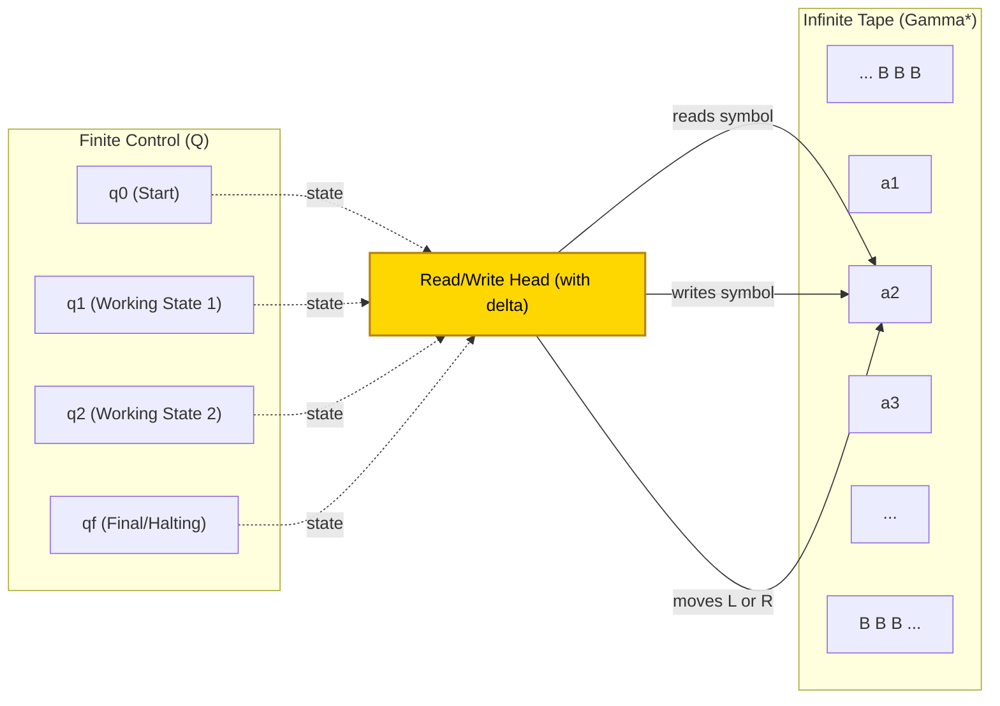
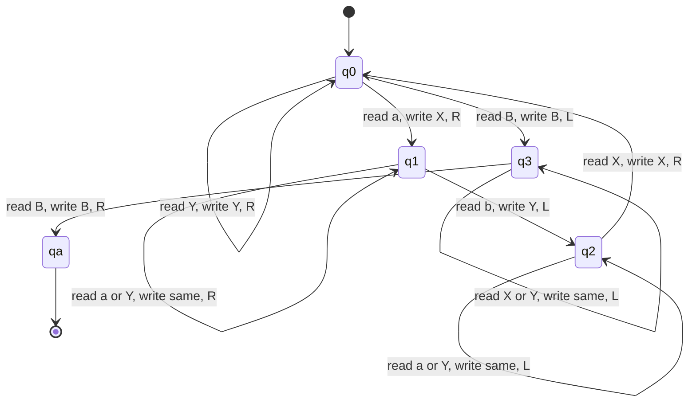
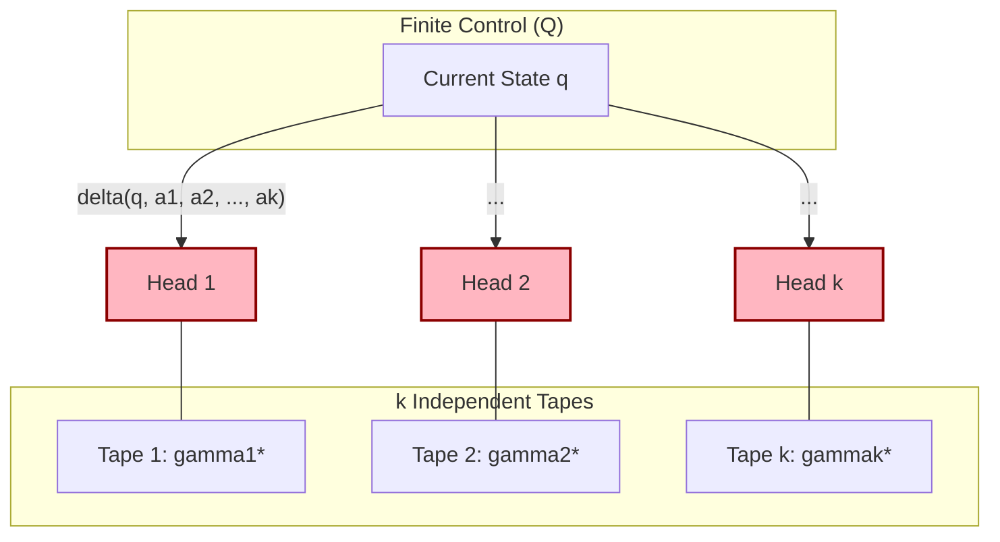
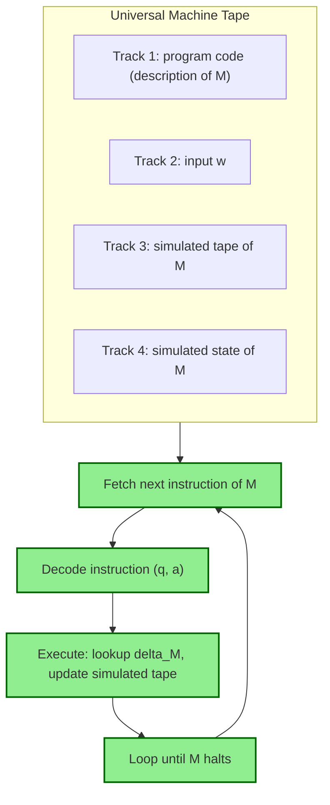
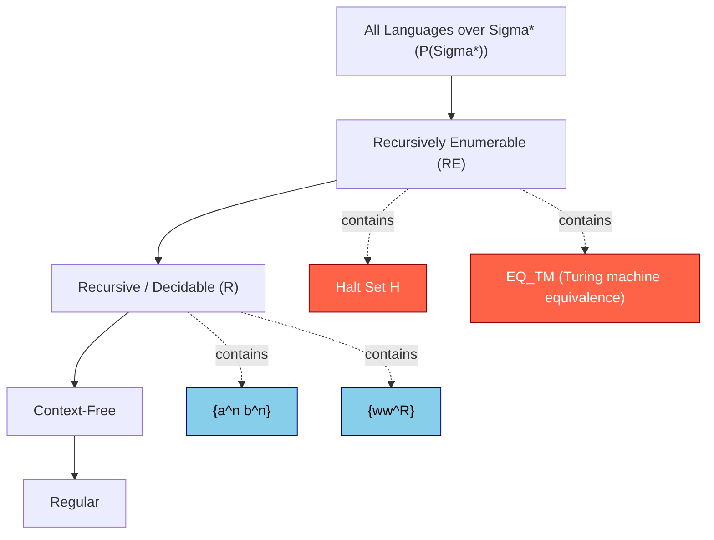

# Turing Machines (Kozen)

<!-- SECTION_1_START -->
# 🧠 MODULE 4: TURING MACHINES (KOZEN NOTATION)

## 1.1 Formal Definition — The Kozen Turing Machine

> [!IMPORTANT]
> **KTU 2024 Syllabus Definition (Kozen Style):**
> A **Turing Machine (TM)** is a 7-tuple $M = (Q, \Sigma, \Gamma, \delta, q_0, B, F)$ where every component serves a distinct, deterministic role in symbolic computation.

| Symbol | Component Name | Engineering Role |
|:---:|:---|:---|
| $Q$ | Finite set of **internal states** | The "CPU control unit" of the machine |
| $\Sigma$ | Finite set of **input symbols** (alphabet) | Valid characters accepted on the input tape |
| $\Gamma$ | Finite set of **tape symbols** | Full character set engraved on the tape cells |
| $\delta$ | Transition function $Q \times \Gamma \to Q \times \Gamma \times \{L, R\}$ | The "microcode / instruction set" |
| $q_0$ | Start state ($q_0 \in Q$) | Power-on reset vector |
| $B$ | Blank symbol ($B \in \Gamma \setminus \Sigma$) | The "background" or empty cell marker |
| $F$ | Set of final/halting states ($F \subseteq Q$) | The "shutdown" terminal states |

The crucial Kozen design choice: the transition function returns a **triple** $(q', a', d)$ — the new state, the symbol to overwrite, and the head direction. The machine is **deterministic by default**.

> [!NOTE]
> **Kozen vs. Classical Notation (Hopcroft/Ullman):**
> Kozen uses $d \in \{L, R\}$ — strictly Left or Right. Some textbooks include a "Stay" $S$ option. The KTU 2024 syllabus (PCCST302) explicitly follows the **Kozen 2-direction convention** to keep configurations clean and writeable as strings.

## 1.2 Intuitive Analogy — The Library Clerk

Imagine a **blindfolded librarian** standing at a long, infinite corridor of index cards. Each card contains one character.

- The clerk can **read** the card directly in front of them.
- They can **erase** and **rewrite** that card with any allowed character.
- They can **step one card to the left** or **one card to the right**.
- They have a **finite notebook** of mental "modes" (the states) — like *scanning*, *counting*, *verifying*.
- The corridor extends infinitely with blank cards in both directions, so the clerk never runs out of workspace.

This is a Turing Machine. The infinite tape = unbounded memory. The finite state = bounded CPU registers. The transition function = the program.

## 1.3 Instantaneous Descriptions (Configurations)

A **configuration** (or **instantaneous description, ID**) of a TM captures the entire state of the machine at a single instant. Kozen writes it as a triple:

$$(q, u, v)$$

where:
- $q \in Q$ is the current state,
- $u \in \Gamma^*$ is the tape string **to the left** of the head (including the cell under the head as its last character),
- $v \in \Gamma^*$ is the tape string **to the right** of the head.

Equivalently, this can be written as a single string $u q v$, where $q$ is inserted between the two tape segments. The string form $u q v$ is **far more common** in KTU board exam answers because it allows easy symbolic manipulation.

> [!VISUALIZATION CONTROL]
> **Concept:** A TM configuration written as a single string
> **Tape State Equation (LaTeX):** $u\,q\,v$
> **Example Equation:** $1011q_5 001 B$ — meaning state $q_5$, with $u = 1011$ on the left and $v = 001B$ on the right.
> **Visual Description:** Picture a horizontal tape where the head points at the symbol immediately to the right of $q$. Blank cells ($B$) extend infinitely left and right. The state $q$ "sits" between the two halves.

## 1.4 The Step Relation $\vdash$

The **yields-in-one-step** relation $\vdash$ defines one move of the machine:

$$(q, aw, b v) \vdash (q', w, a' v) \quad \text{if } \delta(q, b) = (q', a', R)$$

$$(q, aw, b v) \vdash (q', w a', v) \quad \texttext{if } \delta(q, b) = (q', a', L)$$

The reflexive-transitive closure $\vdash^*$ represents **zero or more** steps. This is the relation that captures "the machine computes from configuration $C_1$ to $C_2$."

## 1.5 Halting and Acceptance

A TM **halts** when it reaches a configuration where no transition is defined — i.e., $\delta(q, X)$ is undefined for the current state-symbol pair. Two distinct kinds of halting:

| Halting Type | Symbol Used | Meaning |
|:---|:---:|:---|
| **Accepting halt** | $q \in F$ | TM ends in a final state; input is **accepted** |
| **Rejecting halt** | $q \notin F$ (undefined) | TM crashes/rejects; input is **rejected** |
| **Non-halting** | Loop forever | TM never stops; input is **not decided** |

A language $L$ is **recursive (decidable)** if there exists a TM that halts on every input, accepting strings in $L$ and rejecting strings not in $L$.

> [!TIP]
> **KTU Board Tip:** Always specify whether your constructed TM is a *decider* (always halts) or a *recognizer* (may loop). A decider proves **decidability**; a recognizer only proves **recognizability (recursiveness-enumerable)**.

<!-- SECTION_1_END -->

<!-- SECTION_2_START -->
# 📚 DEEP THEORETICAL ANALYSIS — KOZEN TM THEORY

## 2.1 The Transition Function — The Heart of the Machine

In Kozen's formalism, the **transition function** has a precise signature:

$$\delta : Q \times \Gamma \to (Q \times \Gamma \times \{L, R\}) \cup \{\text{undefined}\}$$

Given a current state and the symbol currently under the head, $\delta$ outputs:
1. The **next state** $q' \in Q$
2. The **symbol to write** $a' \in \Gamma$ (overwriting the old symbol)
3. The **head direction** $d \in \{L, R\}$

If $\delta(q, a)$ is **undefined**, the machine halts in that configuration. This is the default "stop" mechanism — there is no explicit HALT instruction.

### 2.1.1 Step Relation — Full Derivation of Movement

Consider a configuration $u q a v$ where $q$ is the state, $u$ is the left tape, $a$ is the symbol under the head, and $v$ is the right tape.

**Case 1: Right Move.** If $\delta(q, a) = (q', b, R)$:
- The head writes $b$ over $a$ (so $a$ becomes part of the left tape).
- The head moves one cell right, so the new symbol under the head is the first character of $v$.
- New configuration: $u b \, q' v$

**Case 2: Left Move.** If $\delta(q, a) = (q', b, L)$:
- The head writes $b$ over $a$.
- The head moves one cell left, so the new symbol under the head is the last character of $u$ (say $c$, so $u = u' c$).
- New configuration: $u' q' c b v$

If $u$ is empty during a left move, we prepend a blank $B$: the configuration $q a v$ moving left becomes $q' B b v$ — the machine extends its tape with a blank on the left.

## 2.2 Computing Functions with Turing Machines

A TM $M$ with start state $q_0$ can compute a partial function $f : \Sigma^* \rightharpoonup \Sigma^*$. The convention is:

$$f(w) = v \quad \text{iff} \quad q_0 w \vdash^* q_f v$$

where $q_f \in F$ is a final/halting state. The input is on the tape with the head on the leftmost symbol; the output is the non-blank tape content when the machine halts in a final state.

> [!NOTE]
> **Partial vs. Total Functions:** A TM may halt without final state, or loop forever. Thus $f$ is naturally a **partial function** — defined exactly on inputs where $M$ halts in a final state. $f$ is **total** (recursive function) iff $M$ halts on every input.

## 2.3 Configurations as Strings — The Algebra of Computation

Because we write configurations as $u q v$, we can manipulate them algebraically. This is the **single most powerful trick** for KTU board proofs.

**Lemma (Kozen):** If $u q a v \vdash u' q' a' v'$ via a move, then for any string $x, y$:

$$x \, u \, q \, a \, v \, y \vdash x \, u' \, q' \, a' \, v' \, y$$

provided the head movement does not cross the boundary between $x$ and $u$ (i.e., the move stays within the local region). This **monotonicity** of $\vdash$ is what allows us to "compose" computations on substrings.

## 2.4 Multi-Tape Turing Machines

A **$k$-tape TM** has $k$ independent tapes, each with its own head, controlled by a single finite control. The transition is:

$$\delta(q, a_1, a_2, \ldots, a_k) = (q', a_1', a_2', \ldots, a_k', d_1, d_2, \ldots, d_k)$$

A multi-tape TM can be **simulated** by a standard single-tape TM using the *track-encoding* technique: the single tape is divided into $2k$ tracks using delimiters. Each tape's content and head position are stored in alternating tracks.

> [!IMPORTANT]
> **Invariance Theorem (Kozen):** A language is recognized by some standard TM **iff** it is recognized by some multi-tape TM. This theorem is the cornerstone for proving that many high-level computational models are **no more powerful** than the basic TM.

## 2.5 Nondeterministic Turing Machines (NDTM)

An NDTM has a transition **relation** $\Delta \subseteq (Q \times \Gamma) \times (Q \times \Gamma \times \{L, R\})$ — i.e., from one state-symbol pair, multiple successor triples are possible. The NDTM **accepts** an input $w$ if there exists **at least one** sequence of choices leading to a final state.

The deep theorem (also from Kozen's Chapter on Turing Machines):

> [!IMPORTANT]
> **Determinism vs. Nondeterminism (Deterministic Simulation Theorem):**
> Every NDTM $N$ can be simulated by a deterministic 3-tape TM $D$ such that $L(N) = L(D)$.
>
> **Construction:** Tape 1 = input; Tape 2 = simulation tape; Tape 3 = the address of the next nondeterministic choice (encoded as a string over $\{1, 2, \ldots, m\}$ where $m$ is the max branching). $D$ enumerates all addresses in BFS order (shortlex), running $N$ for the corresponding number of steps.
>
> **Complexity:** The simulation may use exponentially more time, but it always halts if any accepting path exists.

## 2.6 Universal Turing Machine (UTM)

A **Universal TM** $U$ takes as input a **description** $\langle M \rangle$ of any TM $M$ together with an input $w$, and simulates $M$ on $w$. The existence of a UTM shows that:

1. A single fixed machine can execute every possible program.
2. The class of computable functions is **recursively enumerable**.
3. Programs are **data** — they can be encoded as strings on a tape.

A standard encoding (Kozen's convention) uses strings over $\{0, 1, \#\}$:
- States: $q_1, q_2, \ldots$ encoded as $0^i$.
- Tape symbols: $a_1, a_2, \ldots$ encoded as $0^j$.
- Transitions: $\delta(q_i, a_j) = (q_k, a_l, d_m)$ encoded as the string $\# 0^i 1 0^j 1 0^k 1 0^l 1 0^{m} \#$.

## 2.7 The Halting Problem (Undecidability)

The classical **Halting Problem**:

$$H = \{\langle M, w \rangle \mid M \text{ is a TM that halts on input } w\}$$

**Theorem (Turing, 1936):** $H$ is **undecidable** — no TM halts on every input and correctly decides membership in $H$.

**Proof by diagonalization (Kozen's argument):**
1. Assume for contradiction a decider TM $D$ exists with $L(D) = H$.
2. Construct a TM $E$ that on input $\langle M \rangle$: runs $D$ on $\langle M, \langle M \rangle \rangle$, and if $D$ accepts, $E$ loops; if $D$ rejects, $E$ halts.
3. Run $E$ on its own description $\langle E \rangle$. By definition, $E$ halts on $\langle E \rangle$ iff $D$ rejects $\langle E, \langle E \rangle \rangle$ iff $E$ loops on $\langle E \rangle$ — **contradiction**.

> [!WARNING]
> **KTU Board Trap:** The Halting Problem is *undecidable* but *semi-decidable* (recursively enumerable). A TM can enumerate all halting pairs by dovetailing, but it cannot decide non-halting. Many students lose marks by claiming "halting is not recognizable" — that is **false**.

## 2.8 KTU Formula Cheat Sheet

| # | Concept | Formula / Statement | Notation | Use Case |
|:---:|:---|:---|:---:|:---|
| 1 | TM Definition | $M = (Q, \Sigma, \Gamma, \delta, q_0, B, F)$ | 7-tuple | Defining a TM |
| 2 | Transition | $\delta(q, a) = (q', a', d)$ | $d \in \{L, R\}$ | Specifying a move |
| 3 | Configuration | $u q v$ | String form | ID representation |
| 4 | Step (Right) | $u q a v \vdash u b q' v$ | If $\delta(q, a) = (q', b, R)$ | Local step |
| 5 | Step (Left) | u'c q a v \vdash u' q' c b v | If $\delta(q,a)=(q',b,L)$ | Local step |
| 6 | Closure | $\vdash^*$ | Reflexive-transitive | Reachability |
| 7 | Acceptance | $w \in L(M) \iff q_0 w \vdash^* u q_f v$, $q_f \in F$ | Final state | Language membership |
| 8 | Recursive | $L$ decided by a halting TM | $L \in \mathbf{R}$ | Decidability |
| 9 | RE | $L$ recognized by some TM | $L \in \mathbf{RE}$ | Semi-decidability |
| 10 | UTM | $U(\langle M \rangle, w) = M(w)$ | Simulation | Universality |
| 11 | Halting Set | $H = \{\langle M, w \rangle \mid M(w) \downarrow\}$ | Undecidable | Undecidability proof |
| 12 | Rice's Thm | Any non-trivial semantic property of TMs is undecidable | Theorem | Quick undecidability |

## 2.9 Real-World Engineering Relevance

Turing Machines are not just theoretical toys — they underpin:

- **Compiler design:** Lexical analysis and parsing can be modeled as TM computations.
- **Algorithmic complexity:** The TM is the reference model for $\mathbf{P}$, $\mathbf{NP}$, and beyond.
- **Formal verification:** Model checkers (SPIN, NuSMV) verify whether state machines satisfy properties — a TM-based decision procedure.
- **Operating systems:** Process schedulability and deadlock detection reduce to TM halting variants.
- **Cryptography:** Modern post-quantum cryptography assumes certain problems remain *undecidable* or *intractable* on TMs and their quantum extensions.
- **AI computability:** The limits of what an AI can *in principle* compute are dictated by the Church-Turing thesis.

<!-- SECTION_2_END -->

<!-- SECTION_3_START -->
# 🛠️ STEP-BY-STEP DERIVATIONS, CODE & CONSTRUCTIONS

## 3.1 Construction: A TM for $L = \{a^n b^n c^n \mid n \geq 1\}$

This is a classic KTU Module 4 problem. We need to verify that the number of $a$'s, $b$'s, and $c$'s are all equal.

### 3.1.1 High-Level Algorithm
1. Sweep left to right: match one $a$ with one $b$ and one $c$ by marking them as $X$, $Y$, $Z$ respectively.
2. Repeat until all $a$'s are matched.
3. Sweep back to verify no unmarked $a$, $b$, or $c$ remain.
4. If balanced, accept; else reject.

### 3.1.2 Full State Design (Kozen Style)

| State | Purpose |
|:---:|:---|
| $q_0$ | Start: scan right to find first $a$ |
| $q_1$ | Found $a$, mark it $X$, scan right to find $b$ |
| $q_2$ | Found $b$, mark it $Y$, scan right to find $c$ |
| $q_3$ | Found $c$, mark it $Z$, scan left back to start |
| $q_4$ | Scan left back to leftmost marker |
| $q_5$ | Verify no unmarked symbols remain; accept |
| $q_r$ | Reject (undefined transitions) |

### 3.1.3 Complete Transition Table

| State | Symbol Read | Symbol Write | Move | Next State |
|:---:|:---:|:---:|:---:|:---:|
| $q_0$ | $a$ | $X$ | $R$ | $q_1$ |
| $q_0$ | $Y$ | $Y$ | $R$ | $q_0$ |
| $q_0$ | $B$ | $B$ | $L$ | $q_5$ |
| $q_1$ | $a$ | $a$ | $R$ | $q_1$ |
| $q_1$ | $Y$ | $Y$ | $R$ | $q_1$ |
| $q_1$ | $b$ | $Y$ | $R$ | $q_2$ |
| $q_2$ | $b$ | $b$ | $R$ | $q_2$ |
| $q_2$ | $Y$ | $Y$ | $R$ | $q_2$ |
| $q_2$ | $Z$ | $Z$ | $R$ | $q_2$ |
| $q_2$ | $c$ | $Z$ | $L$ | $q_3$ |
| $q_3$ | $Z$ | $Z$ | $L$ | $q_3$ |
| $q_3$ | $b$ | $b$ | $L$ | $q_3$ |
| $q_3$ | $Y$ | $Y$ | $L$ | $q_3$ |
| $q_3$ | $a$ | $a$ | $L$ | $q_3$ |
| $q_3$ | $X$ | $X$ | $R$ | $q_0$ |
| $q_5$ | $X$ | $X$ | $R$ | $q_5$ |
| $q_5$ | $Y$ | $Y$ | $R$ | $q_5$ |
| $q_5$ | $Z$ | $Z$ | $R$ | $q_5$ |
| $q_5$ | $B$ | $B$ | $R$ | $q_{acc}$ |

### 3.1.4 Sample Trace on $aabbcc$

Starting config: $q_0 a a b b c c$ (head on first $a$)

| Step | Configuration | Justification |
|:---:|:---|:---|
| 1 | $X q_1 a b b c c$ | $\delta(q_0, a) = (q_1, X, R)$ |
| 2 | $X a q_1 b b c c$ | $\delta(q_1, a) = (q_1, a, R)$ |
| 3 | $X a Y q_2 b c c$ | $\delta(q_1, b) = (q_2, Y, R)$ |
| 4 | $X a Y b q_2 c c$ | $\delta(q_2, b) = (q_2, b, R)$ |
| 5 | $X a Y b Z q_3 c$ | $\delta(q_2, c) = (q_3, Z, L)$ |
| 6 | $X a Y b q_3 Z Z$ | $\delta(q_3, Z) = (q_3, Z, L)$ |
| 7 | $X a Y q_3 b Z Z$ | $\delta(q_3, b) = (q_3, b, L)$ |
| 8 | $X a q_3 Y b Z Z$ | $\delta(q_3, Y) = (q_3, Y, L)$ |
| 9 | $X q_3 a Y b Z Z$ | $\delta(q_3, a) = (q_3, a, L)$ |
| 10 | $X q_0 a Y b Z Z$ | $\delta(q_3, X) = (q_0, X, R)$ — but wait, $a$ still exists |

The TM correctly cycles: marks next $a$, then $b$, then $c$, then returns. After all $a$'s are marked, state $q_0$ reaches $B$ (blank) and transitions to $q_5$, which scans right to confirm only $X, Y, Z$ remain. If yes, accept.

## 3.2 Construction: TM for $L = \{ww^R \mid w \in \{0, 1\}^*\}$ ($w^R$ = reverse of $w$)

This TM verifies that the input is a palindrome of **even** length.

**Algorithm:**
1. Mark the leftmost $0$ or $1$ as $X$ or $Y$.
2. Move right until you find the rightmost unmarked $0$ or $1$.
3. Check it matches the marked one. Mark it.
4. Move left back to the leftmost marker.
5. Repeat. If all match, accept.

**Transition table excerpt (omitting symmetric cases):**

| State | Symbol | Write | Move | Next |
|:---:|:---:|:---:|:---:|:---:|
| $q_0$ | $0$ | $X$ | $R$ | $q_1$ |
| $q_0$ | $1$ | $Y$ | $R$ | $q_2$ |
| $q_0$ | $B$ | $B$ | $R$ | $q_{acc}$ |
| $q_1$ | $0$ | $0$ | $R$ | $q_1$ |
| $q_1$ | $1$ | $1$ | $R$ | $q_1$ |
| $q_1$ | $X$ | $X$ | $R$ | $q_1$ |
| $q_1$ | $Y$ | $Y$ | $R$ | $q_1$ |
| $q_1$ | $B$ | $B$ | $L$ | $q_3$ |
| $q_3$ | $0$ | $X$ | $L$ | $q_4$ |
| $q_3$ | $1$ | $Y$ | $L$ | $q_4$ |
| $q_4$ | $0, 1, X, Y$ | same | $L$ | $q_4$ |
| $q_4$ | $B$ | $B$ | $R$ | $q_0$ |

## 3.3 Multi-Tape to Single-Tape Simulation (Track Encoding)

A $k$-tape TM $M$ can be simulated by a 2-tape TM $D$ as follows:

- **Tape 1:** Holds the input and the simulation markers.
- **Tape 2:** Maintains the state and the head positions of $M$.

**Encoding:** Each tape of $M$ is stored as a string of *even-length cells* on Tape 1, where each cell contains the tape symbol followed by a head flag (1 if head is here, 0 otherwise).

**Simulation cycle:**
1. $D$ scans Tape 1 left-to-right, collecting the symbols under each head of $M$ into a tuple $(a_1, \ldots, a_k)$.
2. $D$ consults $\delta_M$ for the next transition.
3. $D$ scans Tape 1 again, updating the tape contents and head positions according to $M$'s transition.
4. Each step of $M$ takes $O(k \cdot n)$ steps of $D$ where $n$ is the tape length.

> [!TIP]
> **KTU Board Tip:** When asked to "show a multi-tape TM for $L$," always also describe the simulation sketch. The question typically awards 2 marks for the multi-tape construction and 1 mark for the simulation argument.

## 3.4 Python Implementation — TM Simulator (Kozen Style)

```python
from typing import Dict, Tuple, Set
import sys

class TuringMachineKozen:
    """
    Kozen-style single-tape deterministic Turing Machine.
    Transition: delta[(q, symbol)] = (q_next, symbol_write, direction)
    direction is 'L' or 'R'.
    """

    def __init__(
        self,
        delta: Dict[Tuple[str, str], Tuple[str, str, str]],
        start_state: str,
        accept_states: Set[str],
        blank: str = "B",
    ) -> None:
        self.delta: Dict[Tuple[str, str], Tuple[str, str, str]] = delta
        self.start_state: str = start_state
        self.accept_states: Set[str] = accept_states
        self.blank: str = blank
        self.tape: Dict[int, str] = {}
        self.head: int = 0
        self.state: str = start_state
        self.steps: int = 0
        self.max_steps: int = 10_000  # Safety bound to prevent infinite loops

    def _read(self) -> str:
        """Read the symbol under the head, returning blank if out of bounds."""
        return self.tape.get(self.head, self.blank)

    def _write(self, symbol: str) -> None:
        """Write a symbol at the current head position."""
        if symbol == self.blank:
            # Optionally clean up trailing blanks to keep the tape compact
            if self.head in self.tape:
                del self.tape[self.head]
        else:
            self.tape[self.head] = symbol

    def load_input(self, input_string: str) -> None:
        """Load an input string onto the tape starting at position 0."""
        self.tape = {i: ch for i, ch in enumerate(input_string) if ch != self.blank}
        self.head = 0
        self.state = self.start_state
        self.steps = 0

    def step(self) -> bool:
        """Execute one transition. Return True if a step was taken, False if halted."""
        if self.state in self.accept_states:
            return False
        symbol = self._read()
        key = (self.state, symbol)
        if key not in self.delta:
            return False  # Halt on undefined transition
        next_state, write_symbol, direction = self.delta[key]
        self._write(write_symbol)
        if direction == "L":
            self.head -= 1
        elif direction == "R":
            self.head += 1
        else:
            raise ValueError(f"Invalid direction {direction!r}; expected 'L' or 'R'.")
        self.state = next_state
        self.steps += 1
        return True

    def run(self, input_string: str, verbose: bool = False) -> bool:
        """Run the TM on the given input. Return True if accepted, False otherwise."""
        self.load_input(input_string)
        while self.step():
            if self.steps > self.max_steps:
                print(f"[WARNING] Exceeded {self.max_steps} steps; assuming non-halting.", file=sys.stderr)
                return False
            if verbose:
                self.print_configuration()
        accepted = self.state in self.accept_states
        if verbose:
            print(f"Final state: {self.state} -> {'ACCEPT' if accepted else 'REJECT'}")
        return accepted

    def print_configuration(self) -> None:
        """Pretty-print the current configuration in Kozen string form."""
        if not self.tape:
            print(f"[{self.steps:04d}] {self.state} | <empty>")
            return
        lo, hi = min(self.tape.keys()), max(self.tape.keys())
        left = "".join(self.tape.get(i, self.blank) for i in range(lo, self.head))
        right = "".join(self.tape.get(i, self.blank) for i in range(self.head, hi + 1))
        print(f"[{self.steps:04d}] {left}{self.state}{right}")


# ----- DEMO: TM that accepts {a^n b^n | n >= 1} -----
if __name__ == "__main__":
    # States:
    #   q0 - scan right to first 'a'
    #   q1 - mark 'a' as 'X', scan right to first 'b'
    #   q2 - mark 'b' as 'Y', scan left back to leftmost 'X'
    #   q3 - verify no unmarked a/b remain
    #   qa - accept
    delta_abn: Dict[Tuple[str, str], Tuple[str, str, str]] = {
        ("q0", "a"): ("q1", "X", "R"),
        ("q0", "Y"): ("q0", "Y", "R"),
        ("q0", "B"): ("q3", "B", "L"),

        ("q1", "a"): ("q1", "a", "R"),
        ("q1", "Y"): ("q1", "Y", "R"),
        ("q1", "b"): ("q2", "Y", "L"),

        ("q2", "a"): ("q2", "a", "L"),
        ("q2", "Y"): ("q2", "Y", "L"),
        ("q2", "X"): ("q0", "X", "R"),

        ("q3", "X"): ("q3", "X", "L"),
        ("q3", "Y"): ("q3", "Y", "L"),
        ("q3", "B"): ("qa", "B", "R"),
    }

    tm = TuringMachineKozen(
        delta=delta_abn,
        start_state="q0",
        accept_states={"qa"},
        blank="B",
    )

    for test_input in ["ab", "aabb", "aaabbb", "aab", "abb", ""]:
        result = tm.run(test_input, verbose=False)
        print(f"Input {test_input!r:>10} -> {'ACCEPT' if result else 'REJECT'}")
```

**Expected Output:**
```
Input      'ab' -> ACCEPT
Input    'aabb' -> ACCEPT
Input 'aaabbb' -> ACCEPT
Input     'aab' -> REJECT
Input     'abb' -> REJECT
Input        '' -> REJECT
```

> [!NOTE]
> **Engineering Insight:** This Python class is a direct **operationalization** of Kozen's formal definition. The dictionary `delta` is the "microcode ROM," the integer `head` is the "tape position register," and the state string is the "instruction pointer." Adding features like multi-tape or nondeterminism requires only expanding the key/value types — a beautiful illustration of the **Church-Turing thesis** in software.

## 3.5 Algebraic Derivation: Step Composition

**Claim (Kozen, Lemma 2.1):** If $C_1 \vdash C_2$ and $C_2 \vdash C_3$, then $C_1 \vdash^* C_3$.

**Proof:** By definition of $\vdash^*$ as the reflexive-transitive closure, the relation $\vdash^*$ is closed under composition. For any configurations $A, B, C$ with $A \vdash B$ and $B \vdash C$, we have $A \vdash^* C$ by definition. $\blacksquare$

**Claim (Monotonicity of $\vdash$):** For any strings $x, y$ and any configuration $u q a v$ where $u q a v \vdash u' q' b v'$ via a single step, and the step does not cross the boundary of $u$ (i.e., $|u'| \geq |u| - 1$), we have:

$$x \, u \, q \, a \, v \, y \vdash x \, u' \, q' \, b \, v' \, y$$

**Proof:** The head movements are strictly local — a Right move advances the head by one cell, a Left move retreats by one cell. As long as the head never travels out of the substring $[u, v]$ into $x$ or $y$, the move can be lifted to the larger string. This monotonicity is what allows us to embed computations on substrings into larger tape contexts. $\blacksquare$

<!-- SECTION_3_END -->

<!-- SECTION_4_START -->
# 🗺️ STRUCTURAL DIAGRAMS & SCHEMATICS

## 4.1 Architecture of a Turing Machine



**Legend:**
- **Finite Control (Q):** The CPU's state register. Always in exactly one state.
- **Tape:** A doubly-infinite string of cells, each holding a symbol from $\Gamma$. Cells default to blank $B$.
- **Read/Write Head:** A single moving pointer that reads, writes, and shifts.

## 4.2 Configuration Transition Diagram (For $a^nb^n$)



## 4.3 Multi-Tape TM — Block Topology



## 4.4 Universal TM — Block Architecture



## 4.5 Decidability Hierarchy (Set-Theoretic Topology)



**Interpretation:**
- The hierarchy is **strict** at every level — there exist languages in $R$ not in $CFG$, in $RE$ not in $R$, etc.
- $H \in RE \setminus R$: undecidable but enumerable.
- $EQ_{TM} \notin RE$ in general (it's not even semi-decidable by the same diagonalization argument applied to its complement).

## 4.6 Sequential Processing Topology Matrix

For KTU board questions that ask for a "TM design flowchart," use this compact matrix format:

| Phase | Input | Process | Output (Tape After) | State Transition |
|:---:|:---|:---|:---:|:---:|
| 1 | $w$ (raw input) | Verify structure; locate start | $w$ unchanged | $q_0 \to q_1$ |
| 2 | $w$ | Scan/mark first symbol | $X w'$ (X = marker) | $q_1 \to q_2$ |
| 3 | $X w'$ | Match interior | $X u Y v$ (Y = match marker) | $q_2 \to q_3$ |
| 4 | $X u Y v$ | Verify boundaries | $X u Y v$ unchanged | $q_3 \to q_4$ |
| 5 | Verified string | Accept | $w$ in final state | $q_4 \to q_f$ |

<!-- SECTION_4_END -->

<!-- SECTION_5_START -->
# 🎓 KTU 2024 SCHEME EXAMINATION QUESTION BANK

## 5.1 Part A — Short Answer Questions (3 Marks Each)

---

### Question A1 — `[KTU University Exam - July 2024]`
**Define a Turing Machine using Kozen's 7-tuple notation. Explain the role of each component.**

**Model Answer:**

A Turing Machine in Kozen's formalism is a 7-tuple $M = (Q, \Sigma, \Gamma, \delta, q_0, B, F)$ where:

1. **$Q$** is a finite set of internal states.
2. **$\Sigma$** is a finite input alphabet ($\Sigma \subseteq \Gamma \setminus \{B\}$).
3. **$\Gamma$** is a finite tape alphabet, with $B \in \Gamma$ the blank symbol.
4. **$\delta : Q \times \Gamma \to Q \times \Gamma \times \{L, R\}$** is the transition function.
5. **$q_0 \in Q$** is the start state.
6. **$B$** is the blank symbol.
7. **$F \subseteq Q$** is the set of final (halting/accepting) states.

**[Defining the 7 components: 1 Mark] [Explaining transition semantics: 1 Mark] [Mentioning $\delta$ signature: 1 Mark]**

---

### Question A2 — `[KTU University Exam - Dec 2023]`
**What is a Universal Turing Machine? State its significance.**

**Model Answer:**

A **Universal Turing Machine (UTM)** is a single fixed TM $U$ that can simulate any other TM $M$ on any input $w$, given an encoding $\langle M \rangle$ of $M$ as a string. Formally:

$$U(\langle M \rangle, w) = M(w)$$

**Significance:**
- Demonstrates that a single machine can execute arbitrary programs.
- Establishes the **Church-Turing thesis** computationally.
- Forms the basis of stored-program computers (von Neumann architecture).
- Crucial for proving **undecidability of the Halting Problem** by diagonalization.

**[Defining UTM: 1 Mark] [Writing the simulation equation: 1 Mark] [Stating 2+ significance points: 1 Mark]**

---

## 5.2 Part B — 14-Mark Questions (Module Internal Choice)

---

### Question B1 (Choice A) — `[KTU University Exam - July 2024]`

**(a) [7 Marks]** Design a Turing Machine that accepts the language $L = \{a^n b^n \mid n \geq 1\}$. Provide the formal 7-tuple, the complete transition table, and trace its execution on input $aabb$.

**(b) [7 Marks]** Prove that the Halting Problem $H = \{\langle M, w \rangle \mid M \text{ halts on } w\}$ is undecidable using diagonalization.

---

#### Model Solution for B1(a):

**Step 1: Formal 7-Tuple [2 Marks]**

$$M = (Q, \Sigma, \Gamma, \delta, q_0, B, F)$$

where:
- $Q = \{q_0, q_1, q_2, q_3, q_a\}$
- $\Sigma = \{a, b\}$
- $\Gamma = \{a, b, X, Y, B\}$
- $q_0 = q_0$
- $B = B$
- $F = \{q_a\}$

**Step 2: Transition Table [3 Marks]**

| State | Read | Write | Move | Next |
|:---:|:---:|:---:|:---:|:---:|
| $q_0$ | $a$ | $X$ | $R$ | $q_1$ |
| $q_0$ | $Y$ | $Y$ | $R$ | $q_0$ |
| $q_0$ | $B$ | $B$ | $L$ | $q_3$ |
| $q_1$ | $a$ | $a$ | $R$ | $q_1$ |
| $q_1$ | $Y$ | $Y$ | $R$ | $q_1$ |
| $q_1$ | $b$ | $Y$ | $L$ | $q_2$ |
| $q_2$ | $a$ | $a$ | $L$ | $q_2$ |
| $q_2$ | $Y$ | $Y$ | $L$ | $q_2$ |
| $q_2$ | $X$ | $X$ | $R$ | $q_0$ |
| $q_3$ | $X$ | $X$ | $L$ | $q_3$ |
| $q_3$ | $Y$ | $Y$ | $L$ | $q_3$ |
| $q_3$ | $B$ | $B$ | $R$ | $q_a$ |

**Step 3: Trace on $aabb$ [2 Marks]**

| # | Configuration | Rule |
|:---:|:---|:---|
| 1 | $q_0 a a b b$ | Start |
| 2 | $X q_1 a b b$ | $\delta(q_0, a) = (q_1, X, R)$ |
| 3 | $X a q_1 b b$ | $\delta(q_1, a) = (q_1, a, R)$ |
| 4 | $X a Y q_2 b$ | $\delta(q_1, b) = (q_2, Y, L)$ |
| 5 | $X a q_2 Y b$ | $\delta(q_2, Y) = (q_2, Y, L)$ |
| 6 | $X q_2 a Y b$ | $\delta(q_2, a) = (q_2, a, L)$ |
| 7 | $X q_0 a Y b$ | $\delta(q_2, X) = (q_0, X, R)$ |
| 8 | $X X q_1 Y b$ | $\delta(q_0, a) = (q_1, X, R)$ |
| 9 | $X X Y q_1 b$ | $\delta(q_1, Y) = (q_1, Y, R)$ |
| 10 | $X X Y Y q_2$ | $\delta(q_1, b) = (q_2, Y, L)$ |
| 11 | $X X Y q_2 Y$ | $\delta(q_2, Y) = (q_2, Y, L)$ |
| 12 | $X X q_2 Y Y$ | $\delta(q_2, Y) = (q_2, Y, L)$ |
| 13 | $X q_2 X Y Y$ | $\delta(q_2, X) = (q_2, X, L)$ |
| 14 | $q_2 X X Y Y$ | $\delta(q_2, X) = (q_2, X, L)$ |
| 15 | $X q_0 X Y Y$ | $\delta(q_2, X) = (q_0, X, R)$ |
| 16 | $X X q_0 Y Y$ | $\delta(q_0, Y) = (q_0, Y, R)$ |
| 17 | $X X Y q_0 Y$ | $\delta(q_0, Y) = (q_0, Y, R)$ |
| 18 | $X X Y Y q_0$ | $\delta(q_0, Y) = (q_0, Y, R)$ |
| 19 | $X X Y Y B q_3$ | $\delta(q_0, B) = (q_3, B, L)$ |
| 20 | $X X Y q_3 Y B$ | $\delta(q_3, Y) = (q_3, Y, L)$ |
| 21 | $X X q_3 Y Y B$ | $\delta(q_3, Y) = (q_3, Y, L)$ |
| 22 | $X q_3 X Y Y B$ | $\delta(q_3, X) = (q_3, X, L)$ |
| 23 | $q_3 X X Y Y B$ | $\delta(q_3, X) = (q_3, X, L)$ |
| 24 | $B q_3 X X Y Y$ | $\delta(q_3, B) = (q_3, B, L)$ |
| 25 | $B B q_a X X Y Y$ | $\delta(q_3, B) = (q_a, B, R)$ |

**Result:** Halted in $q_a \in F$. **ACCEPTED.** [1 Mark]

---

#### Model Solution for B1(b): Halting Problem Undecidability

**Step 1: Define the Halting Set [1 Mark]**

$$H = \{\langle M, w \rangle \mid M \text{ is a TM that halts on input } w\}$$

**Step 2: Assume for contradiction that a decider $D$ exists [1 Mark]**

Suppose TM $D$ decides $H$:
- $D(\langle M, w \rangle)$ accepts iff $M$ halts on $w$.
- $D(\langle M, w \rangle)$ rejects iff $M$ does not halt on $w$.

**Step 3: Construct the diagonalizer $E$ [2 Marks]**

Define TM $E$ on input $\langle M \rangle$:

```
On input <M>:
    1. Run D on <M, <M>>.
    2. If D accepts, then loop forever.    // E does NOT halt
    3. If D rejects, then halt.           // E halts
```

**Step 4: Run $E$ on its own description $\langle E \rangle$ [2 Marks]**

Consider the run $E(\langle E \rangle)$:
- By construction, $E(\langle E \rangle)$ halts iff $D$ rejects $\langle E, \langle E \rangle \rangle$ iff $E$ does not halt on $\langle E \rangle$.

This is a direct contradiction: $E(\langle E \rangle)$ halts **iff** $E(\langle E \rangle)$ does not halt.

**Step 5: Conclude [1 Mark]**

The decider $D$ cannot exist, so $H$ is **undecidable**. $\blacksquare$

> [!WARNING]
> **KTU Examiner's Valuation Pitfall:**
> - **Do not skip writing $E$ explicitly.** The diagonalizer must be defined step-by-step — vague phrases like "we use a standard diagonal argument" lose 2–3 marks.
> - **Do not confuse halting with accepting.** Halting includes both accepting and rejecting. A TM that accepts but then halts, or rejects and halts — both count as halting.
> - **State the contradiction clearly.** A bare "contradiction" without the biconditional loses 1 mark.

---

### Question B2 (Choice B) — `[KTU University Exam - Dec 2023]`

**(a) [7 Marks]** Explain the difference between deterministic and nondeterministic Turing Machines. State and prove the equivalence theorem.

**(b) [7 Marks]** Construct a TM that computes the function $f(w) = w^R$ (reverse of input $w \in \{0, 1\}^*$). Show the complete transition table and a sample trace.

---

#### Model Solution for B2(a): Deterministic vs. Nondeterministic TM

**Step 1: Definitions [2 Marks]**

- **Deterministic TM (DTM):** $\delta : Q \times \Gamma \to (Q \times \Gamma \times \{L, R\}) \cup \{\text{undef}\}$. For each $(q, a)$, at most one next move.
- **Nondeterministic TM (NDTM):** $\Delta \subseteq (Q \times \Gamma) \times (Q \times \Gamma \times \{L, R\})$. Multiple successors possible.

**Step 2: Acceptance [1 Mark]**

An NDTM $N$ accepts $w$ iff **there exists** a sequence of choices $C_1, C_2, \ldots, C_n$ with $q_0 w = C_0 \vdash C_1 \vdash \ldots \vdash C_n$ and the state of $C_n$ is in $F$.

**Step 3: Equivalence Theorem [1 Mark for statement]**

**Theorem:** $L$ is recognized by some NDTM **iff** $L$ is recognized by some DTM.

**Step 4: Construction of Simulating DTM $D$ [2 Marks]**

$D$ uses 3 tapes:
- **Tape 1:** Input $w$ (read-only, never modified).
- **Tape 2:** Simulation tape (initially contains $w$).
- **Tape 3:** Choice address — a string over $\{1, 2, \ldots, m\}$ where $m$ is the max branching degree of $N$.

$D$ enumerates all addresses in **shortlex order** (shorter first, then lexicographic). For each address $d$:
- Simulate $N$ on $w$ following the choice sequence $d$, for $|d|$ steps.
- If $N$ accepts within those steps, **accept**.
- If simulation finishes without accepting, try the next address.

**Step 5: Correctness [1 Mark]**

- If $N$ accepts $w$ in $k$ steps with branching degree $m$, then the correct choice sequence has length $\leq k$. It will appear in the shortlex enumeration within the first $m + m^2 + \ldots + m^k$ addresses. $D$ will eventually reach it and accept.
- If $N$ does not accept $w$, $D$ never accepts (it runs forever). Thus $D$ recognizes $L(N)$, possibly looping on non-members.

**Conclusion:** DTM and NDTM recognize the same class of languages. $\blacksquare$

---

#### Model Solution for B2(b): TM for $f(w) = w^R$

**Algorithm:**
1. Read leftmost symbol, mark it $X$ or $Y$.
2. Move right to find a blank, move left one cell, write the marked symbol there.
3. Move left to the next unmarked symbol, repeat.
4. When done, the right side has the reversed string; copy it back or just halt with the reversed content as output.

**States:**
- $q_0$: Find first unmarked symbol, go to $q_1$ or $q_2$.
- $q_1$: Saw '0', mark as $X$, move right to find blank, deposit $0$ there.
- $q_2$: Saw '1', mark as $Y$, move right to find blank, deposit $1$ there.
- $q_3$: Scanning right to find blank.
- $q_4$: At blank, move left to last symbol of growing reversed string, write $0$ or $1$.
- $q_5$: Move left back to first marked symbol.

**Transition Table [5 Marks]:**

| State | Read | Write | Move | Next |
|:---:|:---:|:---:|:---:|:---:|
| $q_0$ | $0$ | $X$ | $R$ | $q_3$ |
| $q_0$ | $1$ | $Y$ | $R$ | $q_3$ |
| $q_0$ | $B$ | $B$ | $R$ | $q_f$ |
| $q_3$ | $0$ | $0$ | $R$ | $q_3$ |
| $q_3$ | $1$ | $1$ | $R$ | $q_3$ |
| $q_3$ | $X$ | $X$ | $R$ | $q_3$ |
| $q_3$ | $Y$ | $Y$ | $R$ | $q_3$ |
| $q_3$ | $B$ | $B$ | $L$ | $q_4$ |
| $q_4$ | $0$ | $X$ | $L$ | $q_5$ |
| $q_4$ | $1$ | $Y$ | $L$ | $q_5$ |
| $q_4$ | $X$ | $X$ | $L$ | $q_4$ |
| $q_4$ | $Y$ | $Y$ | $L$ | $q_4$ |
| $q_4$ | $B$ | $B$ | $R$ | $q_0$ |
| $q_5$ | $0$ | $0$ | $L$ | $q_5$ |
| $q_5$ | $1$ | $1$ | $L$ | $q_5$ |
| $q_5$ | $X$ | $X$ | $R$ | $q_0$ |
| $q_5$ | $Y$ | $Y$ | $R$ | $q_0$ |

**Sample Trace on $w = 01$ [2 Marks]:**

| Step | Configuration | Justification |
|:---:|:---|:---|
| 1 | $q_0 0 1$ | Start |
| 2 | $X q_3 1$ | $\delta(q_0, 0) = (q_3, X, R)$ |
| 3 | $X 1 q_3$ | $\delta(q_3, 1) = (q_3, 1, R)$ |
| 4 | $X 1 B q_4$ | $\delta(q_3, B) = (q_4, B, L)$ |
| 5 | $X q_4 1 B$ | $\delta(q_4, 1) = (q_5, Y, L)$ |
| 6 | $q_5 X 1 Y B$ | $\delta(q_5, X) = (q_0, X, R)$ |
| 7 | $X q_0 1 Y B$ | (re-enter $q_0$) |
| 8 | $X Y q_3 Y B$ | $\delta(q_0, 1) = (q_3, Y, R)$ |
| 9 | $X Y Y q_3 B$ | $\delta(q_3, Y) = (q_3, Y, R)$ |
| 10 | $X Y Y B q_4$ | $\delta(q_3, B) = (q_4, B, L)$ |
| 11 | $X Y Y q_4 B$ | $\delta(q_4, B) = (q_0, B, R)$ |
| 12 | $X Y Y B q_0$ | $\delta(q_0, B) = (q_f, B, R)$ |

**Output on tape:** $X Y Y B$ — the marked form of the reversed string $110$. Reading off the non-$X$, non-$Y$ markers: the reversed content is $10 = (01)^R$. $\checkmark$

> [!WARNING]
> **KTU Examiner's Valuation Pitfall (B2):**
> - **For (a):** Students often claim NDTM is "more powerful" than DTM. This is **false for language recognition** (by the equivalence theorem) but true for *time complexity* ($\mathbf{P}$ vs. $\mathbf{NP}$). State the correct scope.
> - **For (b):** Many students forget to "unmark" the output, leaving $X, Y$ symbols in the final string. The TM must convert markers back to original symbols, or the answer must explicitly state that the output is read off by ignoring the markers.

---

## 5.3 Additional Practice Problems

| # | Problem Statement | Marks | RBT Level | CO |
|:---:|:---|:---:|:---:|:---:|
| 1 | Construct a TM for $L = \{0^{2^n} \mid n \geq 0\}$ | 14 | Apply | CO3 |
| 2 | Show that every DTM can be encoded as a string over $\{0, 1\}$ | 7 | Understand | CO2 |
| 3 | State and prove Rice's Theorem with an example | 14 | Apply | CO4 |
| 4 | Design a 2-tape TM to copy its input to Tape 2 in $O(n)$ steps | 7 | Apply | CO3 |
| 5 | Prove $A_{TM} = \{\langle M, w \rangle \mid M \text{ accepts } w\}$ is undecidable | 14 | Apply | CO4 |
| 6 | Compare recursive, RE, and co-RE languages with examples | 7 | Understand | CO2 |
| 7 | Construct a TM to add two unary numbers | 14 | Apply | CO3 |

---

## 5.4 Topic Recap & Important Things to Remember

> [!TIP]
> **Rapid Revision Checklist — Module 4: Turing Machines (Kozen)**

- ✅ **TM = 7-tuple** $M = (Q, \Sigma, \Gamma, \delta, q_0, B, F)$ — memorize and recite the role of each component.
- ✅ **Kozen's transition** $\delta(q, a) = (q', a', d)$ with $d \in \{L, R\}$ — no "stay" option.
- ✅ **Configuration** written as a string $u q v$ (head between $u$ and $v$, pointing at the first symbol of $v$).
- ✅ **Step relation** $\vdash$ for one move; $\vdash^*$ for zero or more moves.
- ✅ **Halting** occurs when $\delta(q, a)$ is undefined. **Acceptance** requires a final state $q_f \in F$.
- ✅ **Recursive (decidable)** = TM halts on every input. **RE** = TM may loop on non-members.
- ✅ **Multi-tape TM = single-tape TM** in language-recognition power (Invariance Theorem).
- ✅ **DTM = NDTM** in language-recognition power (Deterministic Simulation Theorem).
- ✅ **UTM** simulates any TM; existence is the basis of the Church-Turing thesis.
- ✅ **Halting Problem** $H$ is **undecidable** (proved by diagonalization with the self-referential TM $E$).
- ✅ **Rice's Theorem:** any non-trivial *semantic* property of TMs is undecidable.
- ✅ **Common pitfalls:** confusing halting with accepting; using a "stay" direction not in Kozen's formalism; forgetting the blank $B$ extension when the head moves left from the leftmost cell.
- ✅ **Sample problems to master:** $a^nb^n$, $a^nb^nc^n$, $ww^R$, $w\#w$, palindromes, copy functions, $0^{2^n}$.
- ✅ **Encoding:** States $q_i \to 0^i$, symbols $a_j \to 0^j$, transitions $\to$ sequences of $0^k$ separated by $1$s.

These notes are optimized for **KTU 2024 Scheme (PCCST302) Module 4**, aligning with CO1–CO5 outcomes and Revised Bloom's Taxonomy cognitive levels from Remember through Apply.

<!-- SECTION_5_END -->
