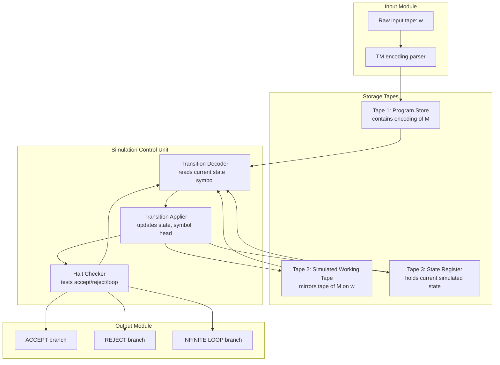
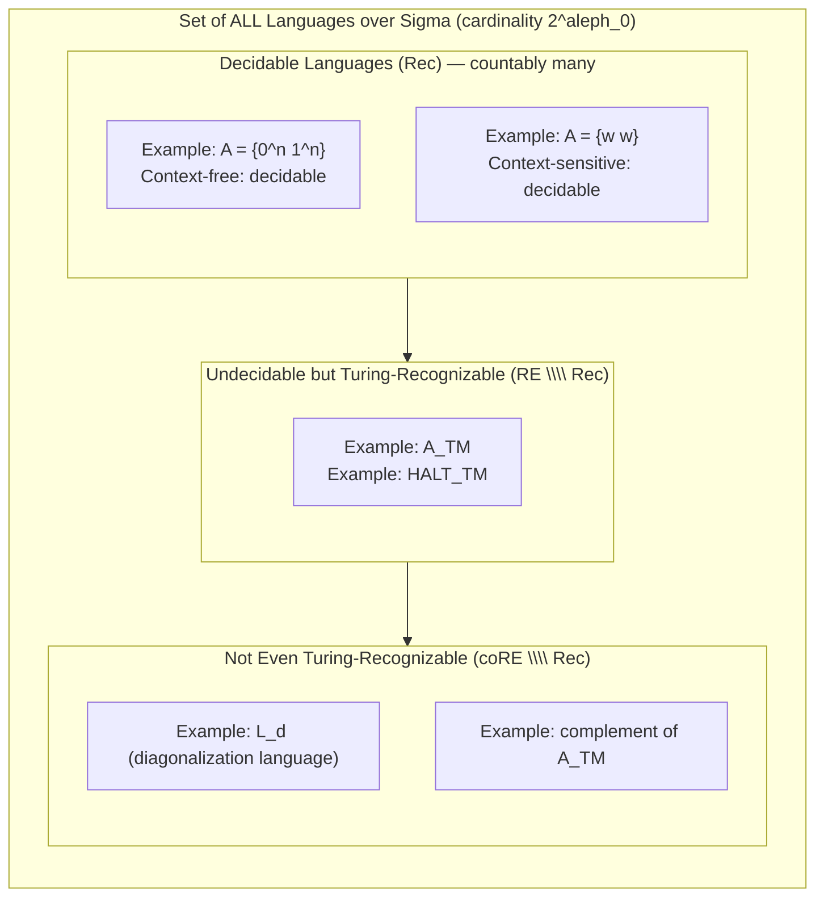
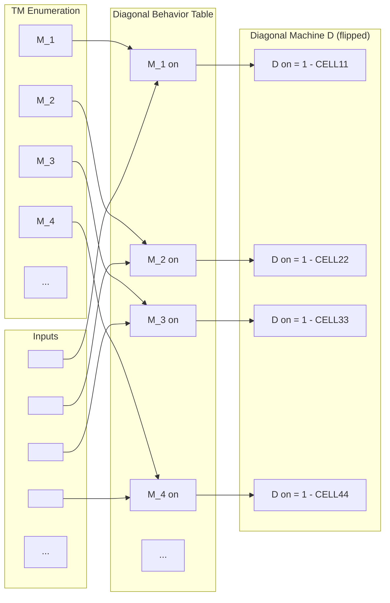

# Universal Machine and Diagonalization

<!-- SECTION_1_START -->
# Module 4: Universal Machine and Diagonalization

## 1.1 Formal Definition of the Universal Turing Machine (UTM)

> [!IMPORTANT]
> **Definition (Kozen, Chapter 5):** A **Universal Turing Machine** $U$ is a Turing machine that, on input $\langle M, w \rangle$ — the encoding of a Turing machine $M$ together with a string $w$ — simulates the computation of $M$ on $w$. Formally:
> $$U = \text{``On input } \langle M, w \rangle:$$
> $$1. \text{ Check that } \langle M, w \rangle \text{ is a valid TM encoding. If not, reject.}$$
> $$2. \text{ Simulate one step of } M \text{ on } w.$$
> $$3. \text{ If the simulation reaches an accept state, accept; if it reaches a reject state, reject.''}$$

The string $\langle M, w \rangle$ is a finite binary (or alphanumeric) string that **encodes** both the transition table of $M$ and the input $w$, separated by a delimiter (commonly the symbol `#`).

## 1.2 Conceptual Analogy — The "General Purpose Computer"

> [!NOTE]
> **Intuition:** Think of $U$ as a *hardware CPU* and $M$ as a *software program*. Before the invention of the stored-program computer (von Neumann architecture, 1945), every calculator was hard-wired to perform only one function. The UTM is the theoretical proof that **one fixed machine can execute every possible program** — a single physical device can run any algorithm if that algorithm is given to it as data.
>
> - The **state transition graph of $M$** = the program being run.
> - The **string $\langle M \rangle$** = the software stored in memory.
> - The **tape of $U$** = the RAM and CPU registers of the modern computer.

This is the foundational insight: *data and program are the same kind of object* — both are strings over a finite alphabet. This single idea births the field of computer science.

## 1.3 Formal Definition of Diagonalization

> [!IMPORTANT]
> **Definition (Cantor, 1874 / Kozen, Chapter 5):** The **diagonalization method** is a proof technique that demonstrates a set has a strictly greater cardinality than another by constructing, for any candidate enumeration, an element that *differs from every enumerated element on at least one diagonal position*. The classical instance shows that the set of real numbers $\mathbb{R}$ is **uncountable**, i.e. $\vert \mathbb{R} \vert > \vert \mathbb{N} \vert$.

In computability theory, the same technique is applied to the **set of all Turing machine descriptions** $\lbrace \langle M_1 \rangle, \langle M_2 \rangle, \langle M_3 \rangle, \dots \rbrace$ to construct a language that **no Turing machine can decide** — yielding the first undecidability result.

## 1.4 Visualization of Diagonalization (Cantor Style)

> [!VISUALIZATION CONTROL]
> **Concept:** Cantor's diagonal table — the ancestor of every undecidability proof.
>
> **Desmos / Mental Picture — Binary Matrix Setup:**
> Construct a 2-D grid where:
> - Row $i$ lists the $i$-th Turing machine's behavior (accept $= 1$, reject $= 0$) on inputs $\langle M_1 \rangle, \langle M_2 \rangle, \langle M_3 \rangle, \dots$
> - Column $j$ lists the $j$-th input.
> - The **diagonal entries** are $D_{ii}$ = behavior of $M_i$ on $\langle M_i \rangle$.
>
> **The "diagonal" string** is built by **flipping** every diagonal entry: $d_i = 1 - D_{ii}$.
> This new string $d$ *differs from every row* $i$ at position $i$, so $d$ cannot be the description of *any* machine in the enumeration. Yet $d$ is a perfectly valid string — hence the set of machines (and thus decidable languages) is **strictly smaller** than the set of all languages.

> [!TIP]
> **KTU Syllabus Highlight (PCCST302 Module 4):** The diagonalization technique is the *only* primitive tool you need (along with **reduction**) to prove that specific problems are **undecidable** or **unrecognizable**. Memorize the structure of the diagonalization table — most KTU questions (often worth 7–14 marks) test your ability to *write a correct diagonalization argument from scratch*.

<!-- SECTION_1_END -->

<!-- SECTION_2_START -->
# Deep Theoretical Analysis & KTU High-Yield Formula Sheet

## 2.1 Operational Anatomy of the Universal Turing Machine

The UTM is a **three-tape** machine (multi-tape TMs are equivalent in power to single-tape TMs by a standard conversion):

| Tape | Purpose | Initial Content |
|:-----|:--------|:----------------|
| **Tape 1 (Program Tape)** | Holds the encoded description $\langle M \rangle$ of the simulated machine $M$. | $\langle M \rangle$ |
| **Tape 2 (Simulated Tape)** | Mirrors the current tape contents of $M$ during simulation. | $w$ |
| **Tape 3 (State Register)** | Tracks the current state of $M$. | $q_0$ (start state) |

### Step-by-Step Operational Loop of $U$

1. **Validate input**: Scan Tape 1 to confirm a legal TM encoding (well-formed transitions over the expected alphabet). If invalid $\Rightarrow$ **reject**.
2. **Initialize**: Copy $w$ to Tape 2; write the encoded start state $q_0$ on Tape 3; position the Tape 2 head on cell 1.
3. **Simulation step (loop)**:
   - Locate the transition on Tape 1 corresponding to *(current state of M, current symbol on Tape 2)*.
   - Update the state on Tape 3.
   - Write the new symbol on Tape 2 at the current head position.
   - Move the Tape 2 head **left**, **right**, or **stay** as dictated.
4. **Termination check**: If the state on Tape 3 is a final accept state, $U$ **accepts**; if it is a final reject state, $U$ **rejects**; otherwise, go to step 3.

> [!NOTE]
> **Complexity Note:** If $M$ runs in time $T(n)$ on input $w$ of length $n$, then $U$ runs in time $O(T(n) \log T(n))$ — a small polynomial overhead because $U$ must *search* the transition table on each simulated step.

## 2.2 The Diagonalization Language $L_d$

Define the **diagonalization language** as:
$$L_d = \left\lbrace \langle M \rangle \;\middle|\; M \text{ is a TM and } M \text{ does NOT accept the string } \langle M \rangle \right\rbrace$$

Equivalently, using acceptance:
$$L_d = \left\lbrace \langle M \rangle \;\middle|\; \langle M, \langle M \rangle \rangle \notin A_{TM} \right\rbrace$$
where $A_{TM} = \lbrace \langle M, w \rangle \mid M \text{ accepts } w \rbrace$.

## 2.3 KTU Formula Sheet — Encodings & Languages

| Symbol / Notation | Meaning | Boundary / Format |
|:------------------|:--------|:------------------|
| $\langle M \rangle$ | Encoded description of TM $M$ | Binary string $0^{k_1} 1 0^{k_2} 1 \dots$ |
| $\langle M, w \rangle$ | Encoding of $M$ paired with input $w$ | $\langle M \rangle \# w$ |
| $A_{TM}$ | Acceptance problem (semi-decidable) | Undecidable but **recognizable** |
| $\overline{A_{TM}}$ | Complement of $A_{TM}$ | **Not even recognizable** |
| $HALT_{TM}$ | Halting problem | Undecidable; reduces to $A_{TM}$ |
| $E_{TM}$ | Emptiness of a TM's language | Undecidable |
| $EQ_{TM}$ | Language equivalence of two TMs | Undecidable (co-recognizable) |
| $L_d$ | Diagonalization language | Undecidable and **not recognizable** |
| $L_u$ | Universal language = $A_{TM}$ | Undecidable, **recognizable** |
| $\text{diag}(D)$ | Diagonal flip operator | $\text{diag}(D) = \lbrace w \mid w_i = 1 - D_{ii} \rbrace$ |

> [!IMPORTANT]
> **Rule of thumb for KTU valuation:** The diagonalization language $L_d$ is *not even Turing-recognizable*. This is **stronger** than being undecidable. A language is decidable $\Rightarrow$ recognizable, but the converse fails. The complement of $L_d$ is $\overline{L_d} = \lbrace \langle M \rangle \mid M \text{ accepts } \langle M \rangle \rbrace$, which is **undecidable but recognizable** (run a UTM).

## 2.4 Why Diagonalization Works — Cardinality Argument

The set of all Turing machines is **countably infinite**: every TM has a finite description, so we can list them as $M_1, M_2, M_3, \dots$.

The set of all languages over $\Sigma$ has cardinality $2^{\aleph_0}$ — i.e. the cardinality of the continuum. Since $2^{\aleph_0} > \aleph_0$, **most languages are not decidable by any TM**.

> [!TIP]
> **Engineering Reality:** Roughly 99.999...% of all mathematical problems are *undecidable*. The handful that are decidable (sorting, parsing, arithmetic) are the *exceptions* we have engineered algorithms for. The diagonalization proof tells us that "writing a program" is fundamentally *not a universal problem-solving tool* — no matter how clever the programmer.

<!-- SECTION_2_END -->

<!-- SECTION_3_START -->
# Step-by-Step Derivations & Symbolic Implementation

## 3.1 Theorem: $A_{TM}$ is Undecidable (Proof by Diagonalization via Self-Reference)

> [!NOTE]
> **Theorem (Turing, 1936):** $A_{TM} = \lbrace \langle M, w \rangle \mid M \text{ is a TM and } M \text{ accepts } w \rbrace$ is **undecidable**.

### Proof

**Assumption for contradiction:** Suppose $A_{TM}$ is decidable. Then there exists a TM $H$ such that:
$$H(\langle M, w \rangle) = \begin{cases} \text{accept} & \text{if } M \text{ accepts } w \\ \text{reject} & \text{if } M \text{ does not accept } w \end{cases}$$

**Construction of a contradictory TM $D$:** Using $H$ as a subroutine, define a new TM $D$ that takes a single input $\langle M \rangle$ (the encoding of a TM) and behaves as follows:

```
D = "On input ⟨M⟩, where M is a TM:
    1. Run H on input ⟨M, ⟨M⟩⟩.
    2. If H accepts, then reject.
    3. If H rejects, then accept."
```

> [!IMPORTANT]
> **Key idea — Self-reference:** $D$ is fed its *own* description as input. We are asking: "What does the machine $D$ do when given $\langle D \rangle$ as input?"

**Analyze the behavior of $D$ on input $\langle D \rangle$:**

**Case 1 — Suppose $D$ accepts $\langle D \rangle$.**
Then by the definition of $D$, step 1 runs $H$ on $\langle D, \langle D \rangle \rangle$. Since $D$ accepts $\langle D \rangle$, by the contract of $H$, $H$ must **accept**. But then step 2 of $D$ triggers: $D$ **rejects**. Contradiction with the assumption that $D$ accepted.

**Case 2 — Suppose $D$ rejects $\langle D \rangle$ (i.e., does not accept).**
Then by the contract of $H$, when $D$ is given $\langle D \rangle$, the TM $D$ does not accept. So $H$ on input $\langle D, \langle D \rangle \rangle$ must **reject**. But then step 3 of $D$ triggers: $D$ **accepts**. Contradiction with the assumption that $D$ rejected.

**Both cases lead to a contradiction.** Therefore, our initial assumption that $H$ exists is false. Hence, $A_{TM}$ is undecidable. $\blacksquare$

## 3.2 Theorem: $L_d$ is Not Even Turing-Recognizable

> [!NOTE]
> **Theorem (Strengthening of the above):** The diagonalization language $L_d$ is **undecidable** AND **not Turing-recognizable** (i.e., its complement $\overline{L_d}$ is also not recognizable).

### Proof

**Step 1 — $L_d$ is undecidable.** Suppose $D$ is a decider for $L_d$. Then as shown above, $D$ on input $\langle D \rangle$ produces a contradiction identical to the $A_{TM}$ argument. So $L_d$ is undecidable.

**Step 2 — $\overline{L_d}$ is not Turing-recognizable.** Suppose for contradiction that $R$ is a recognizer for $\overline{L_d}$, i.e.,
$$R(\langle M \rangle) = \text{accept} \iff M \ \text{accepts} \ \langle M \rangle$$

Construct a new TM $S$:

```
S = "On input ⟨M⟩:
    1. Run R on input ⟨M⟩.
    2. If R accepts, then accept.
    3. If R rejects, then loop forever."
```

> [!IMPORTANT]
> **Note the asymmetry with $D$:** In $D$, we ran a decider for $L_d$ and acted on both branches. Here, $R$ is only a *recognizer* of $\overline{L_d}$ — meaning $R$ may **loop forever** on strings *not* in $\overline{L_d}$. So we treat the *reject* branch as the trap: $S$ enters an infinite loop.

**Analyze $S$ on input $\langle S \rangle$:**

- If $S$ accepts $\langle S \rangle$, then $S$ entered step 2, meaning $R$ accepted $\langle S \rangle$, meaning $S$ accepts $\langle S \rangle$ (the very same event we are testing). This is **circular but consistent** — the issue is deeper.
- More rigorously: $\langle S \rangle \in L(S) \iff S \ \text{accepts} \ \langle S \rangle \iff R \ \text{accepts} \ \langle S \rangle \iff \langle S \rangle \in L(R) = \overline{L_d} \iff S \ \text{accepts} \ \langle S \rangle$. This is a tautology — we get no contradiction this way.

**Refined argument using diagonalization as a reduction from $A_{TM}$:**

We prove: *If $\overline{L_d}$ were recognizable, then $A_{TM}$ would be decidable.*

> [!NOTE]
> **Reduction map:** Define $f(\langle M, w \rangle) = \langle M' \rangle$ where $M'$ is a TM that ignores its input, writes $w$ on its tape, and then simulates $M$ on $w$. Formally:
> $$M' = \text{"On input } x:$$
> $$\text{ 1. Erase input. Write } w.$$
> $$\text{ 2. Run } M \text{ on } w.$$
> $$\text{ 3. If } M \text{ accepts, accept; else reject.}"$$

Now $\langle M' \rangle \in \overline{L_d} \iff M' \ \text{accepts} \ \langle M' \rangle \iff M \ \text{accepts} \ w$ (because $M'$'s output depends only on $w$, not on $x = \langle M' \rangle$).

So we have:
$$\langle M, w \rangle \in A_{TM} \iff f(\langle M, w \rangle) \in \overline{L_d}$$

If $R$ recognized $\overline{L_d}$, then $R \circ f$ would decide $A_{TM}$ — but $A_{TM}$ is undecidable. Hence $R$ cannot exist. $\blacksquare$

## 3.3 Theorem: $\overline{A_{TM}}$ is Not Turing-Recognizable

This is the **exact dual** of the previous theorem. Using the same reduction $f$:
$$\langle M, w \rangle \in A_{TM} \iff f(\langle M, w \rangle) \in \overline{L_d}$$
Taking complements:
$$\langle M, w \rangle \in \overline{A_{TM}} \iff f(\langle M, w \rangle) \in L_d$$

If $L_d$ were recognizable, then $L_d$ would be decidable (since it is also co-undecidable by the same chain) — and this contradicts Theorem 3.1. Hence $\overline{A_{TM}}$ is **not recognizable**.

## 3.4 Full Python Simulation of the UTM (Operational Pseudocode)

```python
from typing import Optional, Tuple, Dict

# Type alias for a transition: (current_state, read_symbol) -> (new_state, write_symbol, direction)
Transition = Dict[Tuple[str, str], Tuple[str, str, str]]

def universal_tm(
    M_encoding: str,
    w: str,
    blank_symbol: str = "_",
    max_steps: int = 10000
) -> str:
    """
    A (bounded) simulator of the Universal Turing Machine.
    
    Args:
        M_encoding: A textual encoding of the transitions of M, of the form:
                    "q0,a->q1,b,R; q1,b->q2,c,L; ..."
                    (semicolon-separated transition rules)
        w:         The input string to feed to the simulated M.
        blank_symbol: The blank symbol.
        max_steps:  Safety bound to prevent infinite loops in non-halting TMs.
    
    Returns:
        "accept"   if M accepts w within max_steps,
        "reject"   if M rejects w within max_steps,
        "timeout"  if M has not halted within max_steps.
    """
    # Step 1: Parse the encoding into a transition table.
    transitions: Transition = {}
    for rule in M_encoding.split(";"):
        rule = rule.strip()
        if not rule:
            continue
        lhs, rhs = rule.split("->")
        cur_state, read_sym = lhs.split(",")
        new_state, write_sym, direction = rhs.split(",")
        transitions[(cur_state, read_sym)] = (new_state, write_sym, direction)
    
    # Step 2: Initialize the simulated tape.
    if w == "":
        tape: Dict[int, str] = {0: blank_symbol}
    else:
        tape = {i: ch for i, ch in enumerate(w)}
    
    # Step 3: Initialize the head and state.
    head: int = 0
    state: str = "q0"  # Convention: start state is q0
    accept_states: set = {"q_accept"}
    reject_states: set = {"q_reject"}
    
    # Step 4: Simulation loop.
    for step in range(max_steps):
        # Termination checks.
        if state in accept_states:
            return "accept"
        if state in reject_states:
            return "reject"
        
        # Read the current symbol.
        current_symbol: str = tape.get(head, blank_symbol)
        
        # Look up the transition. If undefined, REJECT (by convention).
        if (state, current_symbol) not in transitions:
            return "reject"
        
        # Apply the transition.
        new_state, write_sym, direction = transitions[(state, current_symbol)]
        tape[head] = write_sym
        state = new_state
        head += 1 if direction == "R" else (-1 if direction == "L" else 0)
    
    # If we exit the loop without halting, M is looping on w.
    return "timeout"


# Example: simulate a TM that accepts "01"
#   q0,0 -> q1,1,R     (read 0, write 1, move right)
#   q1,1 -> q_accept,1,R
example_M = "q0,0->q1,1,R; q1,1->q_accept,1,R"
result = universal_tm(example_M, "01")
print(f"Result: {result}")  # Expected: "accept"

# Example: simulate the same TM on an input that does not start with 0
result2 = universal_tm(example_M, "10")
print(f"Result: {result2}")  # Expected: "reject" (no transition for q0,1)
```

**Key features of the UTM implementation:**

1. **Decoupled program and data:** The transition table is *data* (a dictionary) passed at runtime, mirroring the theoretical UTM where $\langle M \rangle$ is a string on the tape.
2. **Bounded execution:** The `max_steps` parameter is the practical analogue of the *non-halting* case — the theoretical UTM has no such bound, but a real Python implementation must.
3. **Default rejection on missing transitions:** Encodes the standard TM convention that undefined transitions reject.

<!-- SECTION_3_END -->

<!-- SECTION_4_START -->
# Structural Diagrams & Schematics

## 4.1 Universal Turing Machine — Internal Block Topology



## 4.2 Decidability Hierarchy (Mermaid Block Diagram)



> [!NOTE]
> **Reading the diagram:** Every language is in exactly one of the three tiers. The diagonalization language $L_d$ lives in the *bottom* tier — it is harder than $A_{TM}$, which lives in the middle tier. This stratification is the central taxonomy of computability theory.

## 4.3 Diagonalization Table — Visual Schematic



> [!TIP]
> **Interpretation for KTU:** The "diagonal flip" of any enumeration always produces a machine that is *not* in the enumeration. The proof of undecidability of $A_{TM}$ is *exactly* this idea — $D$ is the diagonal machine, and feeding $D$ its own description is the act of asking "what is $D(D)$?".

<!-- SECTION_4_END -->

<!-- SECTION_5_START -->
# KTU 2024 Scheme Examination Question Bank & Topic Recap

## Part A — Short Answer Questions (3 Marks Each)

### Question A1 `[KTU University Exam - July 2024]`
**Define a Universal Turing Machine. Why is it called "universal"?**

**Model Answer (3 marks):**

A Universal Turing Machine (UTM) is a Turing machine $U$ that takes as input an encoding $\langle M, w \rangle$ of another Turing machine $M$ and a string $w$, and simulates $M$ on $w$. It is called "universal" because a single, fixed machine can simulate *every* possible Turing machine — given the right program (i.e., the description $\langle M \rangle$), $U$ can mimic the behavior of $M$ on any input. **[2 marks for definition; 1 mark for universality justification]**.

> [!NOTE]
> **CO1 — Remember; RBT Level: Remember**

---

### Question A2 `[KTU University Exam - Dec 2023]`
**State the diagonalization language $L_d$. What property of $L_d$ makes it important in computability theory?**

**Model Answer (3 marks):**

$$L_d = \left\lbrace \langle M \rangle \;\middle|\; M \text{ is a TM and } M \text{ does NOT accept } \langle M \rangle \right\rbrace$$

$L_d$ is important because it is **undecidable and not even Turing-recognizable**, providing the cleanest demonstration of the diagonalization method applied to Turing machines. Its construction directly mirrors Cantor's proof that $\vert \mathbb{R} \vert > \vert \mathbb{N} \vert$. **[2 marks for definition; 1 mark for significance]**.

> [!NOTE]
> **CO1 — Remember; RBT Level: Understand**

---

## Part B — Long Answer Questions (14 Marks Each)

> [!WARNING]
> **KTU Examiner's Valuation Warning:** In diagonalization proofs, students frequently lose marks by (a) forgetting to specify the input format of the constructed TM, (b) not distinguishing between "decider" and "recognizer", and (c) failing to handle both cases of the contradiction. **Always write out both Case 1 and Case 2 explicitly.**

---

### Question B-A (14 Marks) `[KTU University Exam - July 2024]`

**Prove that the language $A_{TM} = \lbrace \langle M, w \rangle \mid M \text{ is a TM and } M \text{ accepts } w \rbrace$ is undecidable.**

#### Part (a) — 7 Marks: Construction of the Contradictory TM

**Solution:**

Assume for contradiction that $A_{TM}$ is decidable. Then there exists a TM $H$ that decides $A_{TM}$:

$$H(\langle M, w \rangle) = \begin{cases} \text{accept} & \text{if } M \text{ accepts } w \\ \text{reject} & \text{otherwise} \end{cases}$$

**[Assumption for contradiction: 1 mark]**
**[Specification of decider H: 1 mark]**

Construct a new TM $D$ as follows:

```
D = "On input ⟨M⟩, where M is a TM:
    1. Run H on input ⟨M, ⟨M⟩⟩.
    2. If H accepts, reject.
    3. If H rejects, accept."
```

**[Construction of D: 3 marks]**
**[Note that D is well-defined (H is a decider, so always halts): 2 marks]**

#### Part (b) — 7 Marks: The Diagonalization Contradiction

**Solution:**

Run $D$ on input $\langle D \rangle$:

**Case 1: Suppose $D$ accepts $\langle D \rangle$.**
- By the contract of $H$, since $D$ accepts $\langle D \rangle$, $H$ must **accept** $\langle D, \langle D \rangle \rangle$.
- But step 2 of $D$ then triggers, causing $D$ to **reject**.
- **Contradiction** with the assumption that $D$ accepted.

**Case 2: Suppose $D$ does not accept $\langle D \rangle$ (i.e., rejects or loops).**
- $H$ on $\langle D, \langle D \rangle \rangle$ therefore **rejects**.
- Step 3 of $D$ then triggers, causing $D$ to **accept**.
- **Contradiction** with the assumption that $D$ did not accept.

**[Case 1 analysis: 3 marks]**
**[Case 2 analysis: 3 marks]**
**[Final conclusion: $A_{TM}$ is undecidable: 1 mark]**

**Conclusion:** Both cases yield contradictions; therefore $H$ cannot exist, and $A_{TM}$ is undecidable. $\blacksquare$

> [!NOTE]
> **CO1 — Understand (Part a), CO2 — Apply (Part b); RBT Levels: Understand + Apply**

---

### Question B-B (14 Marks) `[KTU University Exam - Dec 2023]`

**Show that the language $L_d = \lbrace \langle M \rangle \mid M \text{ does not accept } \langle M \rangle \rbrace$ is not Turing-recognizable.**

#### Part (a) — 7 Marks: Reduction Setup

**Solution:**

**Step 1 — Reformulation using a recognizer assumption.**
Assume for contradiction that there is a TM $R$ that recognizes $\overline{L_d}$, i.e.,
$$R(\langle M \rangle) = \text{accept} \iff M \text{ accepts } \langle M \rangle$$

**[Assumption and reformulation: 2 marks]**

**Step 2 — Construct a many-one reduction from $A_{TM}$ to $\overline{L_d}$.**
Given $\langle M, w \rangle$, define the TM $M'$:

```
M' = "On input x:
    1. Erase the input.
    2. Write w on the tape.
    3. Simulate M on input w.
    4. If M accepts, accept; if M rejects, reject."
```

**[Construction of M-prime: 3 marks]**
**[Key observation: M-prime ignores its input x, so M' accepts <M-prime> iff M accepts w: 2 marks]**

#### Part (b) — 7 Marks: Contradiction via $A_{TM}$ Decidability

**Solution:**

We claim:
$$\langle M, w \rangle \in A_{TM} \iff f(\langle M, w \rangle) = \langle M' \rangle \in \overline{L_d}$$

*Proof of claim:*
- $\langle M' \rangle \in \overline{L_d} \iff M' \text{ accepts } \langle M' \rangle \iff M \text{ accepts } w$ (by the construction of $M'$).
- Therefore the biconditional holds.

**[Reduction correctness: 3 marks]**

**Completing the proof:**
- If $R$ recognizes $\overline{L_d}$, then $R(f(\langle M, w \rangle))$ would decide $A_{TM}$ (because $f$ is computable and $R$ accepts exactly when $M$ accepts $w$).
- But $A_{TM}$ is undecidable (Theorem 3.1).
- **Contradiction.** Hence $R$ cannot exist, and $\overline{L_d}$ is not recognizable.
- Equivalently, $L_d$ is not recognizable. $\blacksquare$

**[Decidability contradiction: 3 marks]**
**[Final conclusion: 1 mark]**

> [!NOTE]
> **CO2 — Apply; RBT Levels: Apply + Analyze**

---

## Topic Recap & Important Things to Remember

> [!TIP]
> **Last-minute revision checklist for Module 4:**

- **Universal Turing Machine (UTM):** A fixed TM $U$ that simulates any other TM $M$ on any input $w$, given the encoding $\langle M, w \rangle$. It is the theoretical basis of the **stored-program computer** (von Neumann architecture).
- **Three-tape architecture of UTM:** Program tape, simulated working tape, state register tape. Equivalent in power to single-tape TMs.
- **Acceptance problem $A_{TM}$:** Undecidable but **Turing-recognizable**. Its complement $\overline{A_{TM}}$ is not even recognizable.
- **Halting problem $HALT_{TM}$:** Reducible to $A_{TM}$ (a TM that halts can be converted to one that accepts and vice versa for the recognition case). It is undecidable.
- **Diagonalization language $L_d$:** $\lbrace \langle M \rangle \mid M \text{ does not accept } \langle M \rangle \rbrace$. **Not even recognizable**.
- **Diagonalization proof structure:** Assume a decider $D$ exists for the language; construct a TM $D$ that flips the decision of $D$ on its own description; derive a contradiction by case analysis (Case 1: $D$ accepts $\langle D \rangle$ — contradiction; Case 2: $D$ rejects $\langle D \rangle$ — contradiction).
- **Three-tier decidability hierarchy:** Decidable (Rec) $\subset$ Recognizable (RE) $\subset$ All languages. The strict inclusions are proven by diagonalization.
- **Cantor's argument:** Every TM has a finite description (countable), but the set of all languages over a finite alphabet is uncountable. Therefore, most languages are **not decidable**.
- **Reduction pattern:** To show language $L$ is undecidable, reduce a known undecidable problem (e.g., $A_{TM}$, $HALT_{TM}$) to $L$ via a computable function $f$. If $L$ were decidable, the known problem would also be decidable — contradiction.
- **Recognizability asymmetry:** $A_{TM}$ is recognizable but its complement is not. $L_d$ is neither recognizable nor co-recognizable. Memorize the exact tier for each classic language.
- **KTU-specific watch-points:** Always write both cases of the contradiction explicitly; never skip the "validate input" step in a UTM construction; remember that the diagonalization argument requires a *decider* for the undecidability result, but a *recognizer* fails on the reject branch (which is why $L_d$ is not recognizable — the loop branch breaks the construction).
- **Common student errors to avoid:** (1) Conflating "decidable" with "recognizable", (2) forgetting that a UTM may itself loop forever on inputs where $M$ loops, (3) using the wrong symbol for the delimiter between $\langle M \rangle$ and $w$ in the encoding, (4) forgetting to handle the empty input string in the simulated tape.

<!-- SECTION_5_END -->
