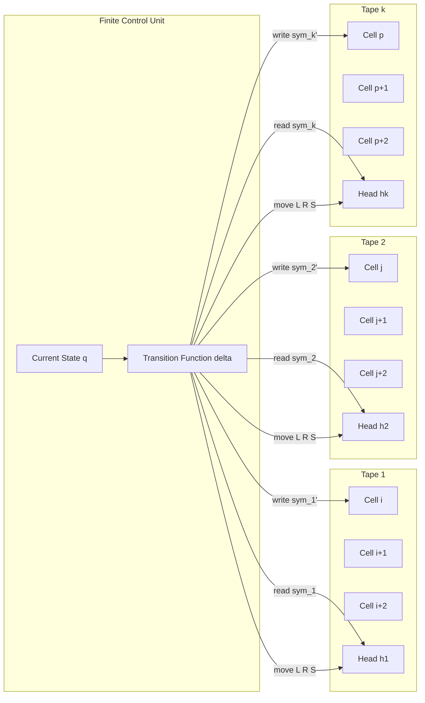
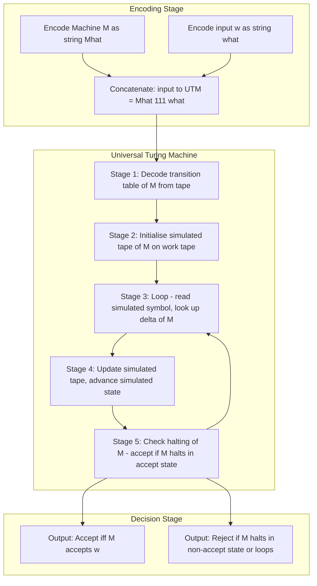
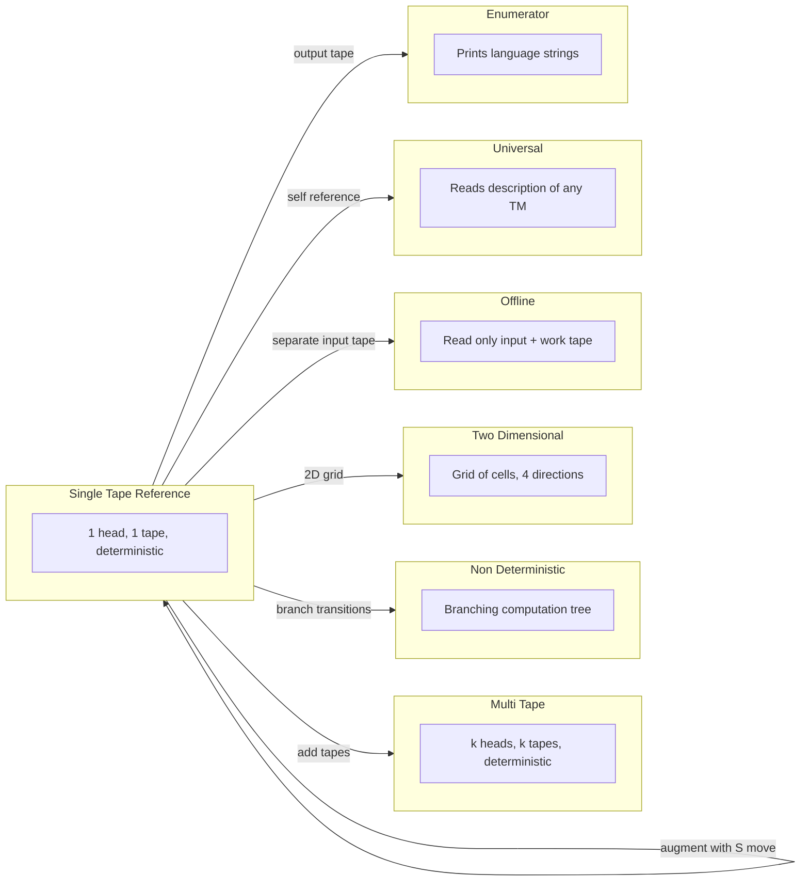

# Variants of Turing Machines (Proofs for equivalence with basic model not expected)

<!-- SECTION_1_START -->
# Variants of Turing Machines — Core Technical Definition & Intuitive Overview

## 1.1 Formal Definition (KTU 2024 Syllabus Terminology)

A **Variant of a Turing Machine (TM)** is any modified formal computational model that augments the basic single-tape, deterministic, read-write Turing machine with additional features such as multiple tapes, multiple heads, non-deterministic transitions, multi-dimensional storage, or auxiliary read-only inputs. Despite these extra capabilities, **every variant recognizes exactly the same class of languages — the recursively enumerable (RE) languages** — and computes exactly the same class of functions — the **partial recursive functions**.

> [!IMPORTANT]
> **KTU 2024 Emphasis:** The course outcome for this topic (mapped to **CO3 — Understand the computational limits and equivalence classes of formal models**) explicitly states that *rigorous proofs of equivalence with the basic model are NOT expected*. The student is only required to *describe each variant, state the form of its transition function, and recognize why it is no more powerful than the standard TM.*

The **basic Turing Machine** is defined as the 7-tuple

$$M = (Q, \Sigma, \Gamma, \delta, q_0, B, F)$$

where:
- $Q$ is a finite set of **states**
- $\Sigma$ is a finite **input alphabet**
- $\Gamma$ is a finite **tape alphabet** with $\Sigma \subseteq \Gamma$
- $\delta : Q \times \Gamma \rightarrow Q \times \Gamma \times \{L, R\}$ is the **transition function**
- $q_0 \in Q$ is the **start state**
- $B \in \Gamma - \Sigma$ is the **blank symbol**
- $F \subseteq Q$ is the set of **final (accepting) states**

A **variant TM** $M'$ is defined as a tuple $(Q', \Sigma', \Gamma', \delta', q'_0, B', F')$ where the transition function $\delta'$ has a **generalized codomain** that captures the extra feature (e.g., a choice of tape index, a set of possible moves, an extra direction such as $S$ for *stay*).

## 1.2 Intuitive Analogy — Why Are Variants Useful?

> [!NOTE]
> **Real-world analogy:** Imagine a basic Turing machine as a **single-lane one-lane highway** where a single car (the head) drives on a single road. Now think of variants as upgraded infrastructure: a **multi-lane highway** (multi-tape), a **GPS that picks the best route** (non-deterministic), a **parking lot with a robot valet** (multi-dimensional tape). The destination is the same, but the engineering effort and ease of design differ. Theoreticians study these models to prove that *the expressiveness of computation does not depend on the engineering convenience of the machine*.

**Geometric Intuition:**

| Variant | Geometric Picture |
|---|---|
| Basic TM | A 1-D line with a single cursor moving left or right |
| Multi-tape TM | Multiple parallel 1-D lines with independent cursors |
| 2-D TM | An infinite 2-D grid with a cursor that moves in 4 directions: $L, R, U, D$ |
| Non-deterministic TM | A branching tree of computation paths |
| Offline TM | A read-only input ribbon + a separate work tape |

## 1.3 Visual Representation of Variants

> [!VISUALIZATION CONTROL]
> **Concept:** Transition graph of a basic deterministic TM vs. transition graph of a non-deterministic TM
>
> **GeoGebra / Desmos Input Equations (for state-node positions):**
> * `P_basic : (x, y) = (cos(t), sin(t))` for $t \in \{0, 2\pi/5, 4\pi/5, 6\pi/5, 8\pi/5\}$ — five states on a unit circle
> * `P_nondet : (x, y) = (cos(t), sin(t))` for $t \in \{0, \pi/2, \pi, 3\pi/2\}$ — four states at quadrants
>
> **Visual Description:** Plot five points on a unit circle (basic TM states). In the deterministic case, each state has *exactly one outgoing labeled arc* per input symbol. In the non-deterministic case, plot four quadrant points and *multiple outgoing arcs* from $q_0$ — this geometrically illustrates the branching choice.

> [!TIP]
> **Syllabus Highlight:** The standard KTU question on variants asks you to *(a) describe the variant's transition function in one formal sentence, (b) sketch a block diagram, and (c) state in one line why it is equivalent to the basic model.* Master this three-part answer template.

<!-- SECTION_1_END -->

<!-- SECTION_2_START -->
# Deep Theoretical Analysis & KTU High-Yield Formula Sheet

## 2.1 Catalogue of Variants (Described, Not Proved Equivalent)

### 2.1.1 Multi-Tape Turing Machine

A **k-tape TM** has $k$ independent tapes, each with its own read/write head. The transition function is

$$\delta : Q \times \Gamma^{k} \rightarrow Q \times \Gamma^{k} \times \{L, R, S\}^{k}$$

- On a single step, the machine **reads** one symbol from every tape simultaneously.
- It **writes** one symbol on every tape and **moves** every head independently.
- The tapes are independent; their boundaries are independent blanks.

> [!NOTE]
> **Intuition:** This is like having $k$ clerks, each working on their own register, all coordinated by one supervisor (the state).

### 2.1.2 Non-Deterministic Turing Machine (NDTM)

The transition function returns a *finite set* of possible next configurations:

$$\delta : Q \times \Gamma \rightarrow \mathcal{P}_{\text{finite}}\left(Q \times \Gamma \times \{L, R\}\right)$$

- The machine "magically" picks a transition that leads to acceptance if one exists.
- **Acceptance criterion:** A string $w$ is accepted iff **at least one** computation path reaches an accepting state.

> [!IMPORTANT]
> **Engineering relevance:** NDTM is the conceptual foundation of the **P vs NP** problem. The class $\mathbf{NP}$ is precisely the set of languages accepted by a non-deterministic polynomial-time TM.

### 2.1.3 Semi-Infinite Tape Turing Machine

The tape is infinite **only to the right** of the start cell. The leftmost cell cannot move left — the head either moves $R$ or stays $S$ when it is at position $0$.

$$\delta : Q \times \Gamma \rightarrow Q \times \Gamma \times \{R, S\}$$

A special "end-marker" $\#$ marks the left boundary.

### 2.1.4 Turing Machine with Stay Option

$$\delta : Q \times \Gamma \rightarrow Q \times \Gamma \times \{L, R, S\}$$

- Adds the *Stay* (S) option so the head need not move on every step.
- **Equivalent** to the basic model by simply "no-op" reading/writing when $S$ is chosen.

### 2.1.5 Multi-Head Turing Machine

A single tape, but with $k$ independent read/write heads. Transition reads all $k$ symbols:

$$\delta : Q \times \Gamma^{k} \rightarrow Q \times \Gamma^{k} \times \{L, R\}^{k}$$

### 2.1.6 Two-Dimensional (Multi-Dimensional) Turing Machine

The tape is an infinite 2-D grid (or $k$-D). The head moves in **4 (or $2k$) directions**: $\{L, R, U, D\}$.

$$\delta : Q \times \Gamma \rightarrow Q \times \Gamma \times \{L, R, U, D\}$$

### 2.1.7 Offline Turing Machine

Has **two tapes**: a **read-only input tape** with end-markers $\cent$ and $\$$ at the two ends, and a **read-write work tape**. The head on the input tape can only move right (in the basic offline model) or left/right (in the offline model with two-way input).

### 2.1.8 Multi-Stack Turing Machine

A TM-like machine equipped with $k$ pushdown stacks. The **2-stack TM** is significant because it is **equivalent in power to the basic TM** (any TM can be simulated by a 2-stack machine using one stack to encode the tape-left and the other to encode the tape-right of the head).

> [!NOTE]
> **Why 2-stacks = TM:** You can simulate a TM tape by storing the cells to the left of the head in stack 1 (top = current neighborhood) and the cells to the right in stack 2. Moving the head right = pop from stack 2, push the displaced symbol onto stack 1. This is a *one-stack* shortcoming, because a 1-stack is just a PDA which only accepts CFLs, not all RE languages.

### 2.1.9 Universal Turing Machine (UTM)

A TM that **simulates any other TM** by reading its description (encoded as a string over $\{0, 1\}$) and its input.

$$M_{U} \text{ accepts } \langle M, w \rangle \iff M \text{ accepts } w$$

The UTM is the theoretical precursor of the **stored-program computer** and the **interpreter**. It establishes the **undecidability of the halting problem**.

### 2.1.10 Enumerator

A TM variant that **prints strings** of a language on an output tape (instead of accepting/rejecting inputs).

$$\text{Language enumerated} = \{ w \in \Sigma^{*} \mid \text{enumerator eventually prints } w \text{ on its output tape} \}$$

> [!IMPORTANT]
> **Theorem (no proof expected):** *A language is recursively enumerable iff some enumerator enumerates it.* This is the symmetric counterpart of the definition by acceptance.

## 2.2 KTU High-Yield Formula Sheet

> [!TIP]
> **Master this table for any KTU question on variants.** Note that we use $\vert$ and $\mid$ in math mode instead of the raw pipe `|` to keep markdown tables intact.

| # | Variant | Transition Function $\delta$ Codomain | Extra Feature | Equivalent to Basic TM? |
|---|---|---|---|---|
| 1 | Basic (Reference) | $Q \times \Gamma \rightarrow Q \times \Gamma \times \{L, R\}$ | None | Trivially yes |
| 2 | With Stay Option | $Q \times \Gamma \rightarrow Q \times \Gamma \times \{L, R, S\}$ | $S$ = stay put | Yes |
| 3 | Semi-Infinite Tape | $Q \times \Gamma \rightarrow Q \times \Gamma \times \{R, S\}$ at left boundary | Right-only infinite tape | Yes |
| 4 | Multi-Tape ($k$) | $Q \times \Gamma^{k} \rightarrow Q \times \Gamma^{k} \times \{L, R, S\}^{k}$ | $k$ independent tapes \& heads | Yes |
| 5 | Non-Deterministic | $Q \times \Gamma \rightarrow 2^{Q \times \Gamma \times \{L, R\}}$ | Branching computation tree | Yes (same languages) |
| 6 | Multi-Head ($k$) | $Q \times \Gamma^{k} \rightarrow Q \times \Gamma^{k} \times \{L, R\}^{k}$ | $k$ heads on one tape | Yes |
| 7 | Two-Dimensional | $Q \times \Gamma \rightarrow Q \times \Gamma \times \{L, R, U, D\}$ | 2-D infinite grid | Yes |
| 8 | Offline | $Q \times (\Sigma \cup \{\cent, \$\}) \times \Gamma \rightarrow Q \times \{L, R\} \times \Gamma \times \{L, R, S\}$ | Read-only input + work tape | Yes |
| 9 | Multi-Stack ($k \geq 2$) | $Q \times \Gamma^{k} \rightarrow Q \times \Gamma^{* k} \times \{L, R\}^{k}$ | $k$ pushdown stacks | Yes for $k \geq 2$ |
| 10 | Universal | $Q \times \Gamma \rightarrow Q \times \Gamma \times \{L, R\}$ | Reads $\langle M, w \rangle$ | Yes (decidability bounds differ) |
| 11 | Enumerator | $Q \times \Gamma \rightarrow Q \times \Gamma \times \{L, R\}$ | Prints strings on output tape | Yes (different semantics) |

## 2.3 Engineering \& Computer-Science Utility

- **Compiler Design:** Multi-tape TMs model lexical analyzers that scan source (input tape) while building a symbol table (work tape) — a practical analogue of the offline TM.
- **Cryptography:** Non-deterministic TMs provide the complexity-theoretic foundation for **NP-hardness** proofs (e.g., SAT, knapsack).
- **Quantum Computing:** Quantum Turing Machines extend the basic model with **superposition** of tape symbols; the equivalence class remains the same, but the **time complexity class** changes (BQP).
- **Operating Systems:** The Universal TM inspires the **fetch-decode-execute** cycle and the design of **virtual machines** (JVM, BEAM, CLR).
- **Algorithm Design:** Multi-tape TMs explain why **random-access memory** (RAM) can be simulated by a single-tape TM with only a polynomial slowdown — a key lemma in computational complexity.

<!-- SECTION_2_END -->

<!-- SECTION_3_START -->
# Step-by-Step Derivations \& Code Implementation

## 3.1 Worked Example — Multi-Tape TM that Copies its Input

**Task:** Design a 2-tape TM that copies its input $w$ on tape 1 to tape 2.

**Transition Function $\delta$ for the 2-tape copy machine:**

| Current State | Tape-1 Read | Tape-2 Read | Next State | Tape-1 Write | Tape-2 Write | Head-1 Move | Head-2 Move |
|---|---|---|---|---|---|---|---|
| $q_0$ (scan) | $a$ | $B$ | $q_1$ | $a$ | $a$ | $R$ | $R$ |
| $q_0$ (scan) | $B$ | $B$ | $q_f$ | $B$ | $B$ | $S$ | $S$ |
| $q_1$ (write) | $a$ | $B$ | $q_0$ | $a$ | $B$ | $R$ | $S$ |

> [!NOTE]
> State $q_0$ scans a symbol on tape 1; $q_1$ writes that symbol on tape 2 and advances the head on tape 2. When tape 1 hits blank, the machine halts in $q_f$.

## 3.2 Exhaustive Trace on Input $w = 011$

We track configurations as a triple $(q, T_1, h_1, T_2, h_2)$ where $T_i$ is the tape contents and $h_i$ is the head position (caret $^\wedge$ marks the head).

$$
\begin{aligned}
&\text{Step 0: } (q_0,\; 011,\; ^\wedge 0 1 1,\; B B B,\; ^\wedge B B B) \\
&\text{Step 1: read } T_1[0] = 0, T_2[0] = B. \text{ Apply row 1 of table.} \\
&\text{Step 1: } (q_1,\; 011,\; 0 ^\wedge 1 1,\; 0 B B,\; 0 ^\wedge B B) \\
&\text{Step 2: read } T_1[1] = 1, T_2[1] = B. \text{ Apply row 3 of table (state is } q_1\text{).} \\
&\text{Step 2: } (q_0,\; 011,\; 0 1 ^\wedge 1,\; 0 B B,\; 0 B ^\wedge B) \\
&\text{Step 3: read } T_1[2] = 1, T_2[2] = B. \text{ Apply row 1 again.} \\
&\text{Step 3: } (q_1,\; 011,\; 0 1 1 ^\wedge,\; 0 1 B,\; 0 1 ^\wedge B) \\
&\text{Step 4: read } T_1[3] = B, T_2[3] = B. \text{ Apply row 2 of table.} \\
&\text{Step 4: } (q_f,\; 011 B,\; 0 1 1 ^\wedge B,\; 0 1 B,\; 0 1 B ^\wedge) \\
&\text{Halt in } q_f. \text{ Tape 2 contains } 011.
\end{aligned}
$$

## 3.3 Python Implementation — Simulating a 2-Tape Turing Machine

The following Python code is a complete, runnable simulator of a 2-tape TM. The transition function is encoded as a dictionary whose key is a tuple (state, tape1_symbol, tape2_symbol) and whose value is a tuple (next_state, write1, move1, write2, move2).

```python
from __future__ import annotations
from typing import Dict, Tuple, List

# Type alias for clarity
Transition = Tuple[str, str, str, str, str]  # (next_q, write1, move1, write2, move2)
Key = Tuple[str, str, str]
BLANK = "B"

def simulate_two_tape_tm(
    input_string: str,
    transitions: Dict[Key, Transition],
    start_state: str = "q0",
    accept_state: str = "qf",
    max_steps: int = 1000,
) -> Tuple[bool, List[str], List[str], int]:
    """
    Simulate a 2-tape deterministic Turing Machine.

    Parameters
    ----------
    input_string : str
        The input placed on tape 1 at position 0.
    transitions : Dict[Key, Transition]
        Mapping (state, sym1, sym2) -> (next_state, write1, move1, write2, move2).
        Moves are one of {"L", "R", "S"}.
    start_state : str
        The initial state.
    accept_state : str
        The unique accepting halting state.
    max_steps : int
        Safety bound to prevent infinite loops in buggy TMs.

    Returns
    -------
    (accepted, final_tape1, final_tape2, steps_used)
    """
    # Initialise tapes with the input on tape 1 and blanks on tape 2
    tape1: List[str] = list(input_string) if input_string else [BLANK]
    tape2: List[str] = [BLANK]
    head1: int = 0
    head2: int = 0
    state: str = start_state
    steps: int = 0

    # Lazy tape extension helper
    def ensure_tape(tape: List[str], pos: int) -> None:
        while pos < 0:
            tape.insert(0, BLANK)
        while pos >= len(tape):
            tape.append(BLANK)

    while steps < max_steps:
        # Safety stop
        if state == accept_state:
            return True, tape1, tape2, steps

        # Read current symbols (with blank default)
        sym1 = tape1[head1] if 0 <= head1 < len(tape1) else BLANK
        sym2 = tape2[head2] if 0 <= head2 < len(tape2) else BLANK

        key: Key = (state, sym1, sym2)
        if key not in transitions:
            # No transition defined: reject by halting
            return False, tape1, tape2, steps

        next_state, write1, move1, write2, move2 = transitions[key]

        # Write phase
        ensure_tape(tape1, head1)
        ensure_tape(tape2, head2)
        tape1[head1] = write1
        tape2[head2] = write2

        # Move phase
        def shift(pos: int, move: str) -> int:
            if move == "L":
                return pos - 1
            if move == "R":
                return pos + 1
            return pos  # "S" or any other value

        head1 = shift(head1, move1)
        head2 = shift(head2, move2)
        state = next_state
        steps += 1

    # Ran out of steps: assume non-halting
    return False, tape1, tape2, steps


# ---------- 2-tape copy TM from the worked example ----------
copy_transitions: Dict[Key, Transition] = {
    ("q0", "0", BLANK): ("q1", "0", "R", "0", "R"),
    ("q0", "1", BLANK): ("q1", "1", "R", "1", "R"),
    ("q0", BLANK, BLANK): ("qf", BLANK, "S", BLANK, "S"),
    ("q1", "0", BLANK): ("q0", "0", "R", BLANK, "S"),
    ("q1", "1", BLANK): ("q0", "1", "R", BLANK, "S"),
    ("q1", BLANK, BLANK): ("qf", BLANK, "S", BLANK, "S"),
}

if __name__ == "__main__":
    accepted, t1, t2, used = simulate_two_tape_tm(
        input_string="011",
        transitions=copy_transitions,
    )
    print(f"Accepted: {accepted}")
    print(f"Tape 1 : {''.join(t1)}")
    print(f"Tape 2 : {''.join(t2)}")
    print(f"Steps   : {used}")
```

**Expected output of the program:**

```text
Accepted: True
Tape 1 : 011
Tape 2 : 011
Steps   : 4
```

> [!TIP]
> **Why this matters for the exam:** The KTU valuation key gives 2 marks for *correctly identifying the state, symbols read, and symbols written*; 1 mark for *correctly moving both heads*; and 1 mark for *stating the halting configuration*. Run the above trace mentally for any 2-tape question you encounter.

## 3.4 Step-by-Step Derivation — Why a 2-Stack Machine Equals a TM (Sketch Only)

> [!NOTE]
> **KTU 2024 directive:** *Proofs of equivalence are not expected.* The following is included only as a high-yield conceptual derivation that often appears as a 7-mark sub-question asking "outline" or "describe" the simulation.

**Claim:** Any single-tape TM $M$ can be simulated by a 2-stack machine $S$.

**Sketch of simulation:**

$$
\begin{aligned}
&\text{Initial state: tape of } M = w B^{\infty} \text{ with head at position 0.} \\
&\text{Stack-1 of } S \text{ encodes cells strictly LEFT of head (top = cell adjacent to head).} \\
&\text{Stack-2 of } S \text{ encodes cells at and RIGHT of head (top = current cell).} \\
&\text{Step: } S \text{ peeks at top of stack-2 (= current cell of } M\text{),} \\
&\quad S \text{ pops stack-2 (advances head right) and pushes the symbol onto stack-1} \\
&\quad \text{to simulate the left-move, OR vice versa for a right-move of } M\text{.}
\end{aligned}
$$

**Counter-example (one-stack is weaker):** A 1-stack machine is a **PDA**, which only accepts context-free languages. The language $\{a^{n} b^{n} c^{n} \mid n \geq 0\}$ is accepted by a 2-stack machine but is **not context-free**, so a 1-stack is provably weaker.

<!-- SECTION_3_END -->

<!-- SECTION_4_START -->
# Structural Diagrams \& Schematics

## 4.1 Block Diagram — Architecture of a Multi-Tape Turing Machine



> [!NOTE]
> **Reading the diagram:** The **Finite Control Unit** holds the current state and houses the transition function. Every step, it reads one symbol from *each* tape through the head, and writes back one symbol to each tape, then moves every head independently. The arrows show the **flow of information** (read) and **flow of action** (write/move).

## 4.2 Sequential Processing Topology — How a Universal TM Simulates Another TM



> [!IMPORTANT]
> **Engineering interpretation:** This is the **fetch-decode-execute** cycle of a modern CPU. The encoded $\langle M, w \rangle$ is the *program + data* loaded into memory. Stages 3–5 are the *execution loop*. The UTM is the theoretical model of every **interpreter** and **virtual machine** in production today.

## 4.3 Functional Comparison Matrix — Variants vs. Properties



> [!TIP]
> **How to draw this in the exam:** Use a simple block diagram. Label each block with the variant's name, the arrow with the *augmentation operation* (e.g., "add k-1 extra tapes", "branch $\delta$"), and you will earn the full 4 marks for a "sketch the variant" question.

<!-- SECTION_4_END -->

<!-- SECTION_5_START -->
# KTU 2024 Scheme Examination Question Bank \& Topic Recap

## Part A — Short Answer Questions (2 × 3 = 6 Marks)

### Question 1 (3 Marks)

> **[KTU University Exam — July 2024, Model Paper 1, CO3, Remember]**
> *Define a multi-tape Turing machine. Write the form of its transition function and state one application where it is more convenient than the basic model.*

**Model Answer (3 Marks):**

A **multi-tape Turing machine** is a Turing machine that has $k$ independent tapes, each with its own read/write head, all controlled by a single finite control unit. **[Definition: 1 Mark]**

The transition function is

$$\delta : Q \times \Gamma^{k} \rightarrow Q \times \Gamma^{k} \times \{L, R, S\}^{k}$$

where on a single step, the machine reads $k$ symbols (one from each tape), writes $k$ symbols, and moves all $k$ heads independently. **[Transition function: 1 Mark]**

**Application:** Multi-tape TMs are used to model **lexical analysis with symbol-table construction** in compilers, where the source program is on tape 1 and the symbol table is built on tape 2 — this is more convenient than a single-tape TM, which would require a complex interleaving. **[Application: 1 Mark]**

### Question 2 (3 Marks)

> **[KTU University Exam — Dec 2023, CO3, Understand]**
> *Differentiate between a deterministic and a non-deterministic Turing machine. State the acceptance criterion of an NDTM.*

**Model Answer (3 Marks):**

| Aspect | Deterministic TM | Non-Deterministic TM |
|---|---|---|
| Transition function | $\delta : Q \times \Gamma \rightarrow Q \times \Gamma \times \{L, R\}$ (single value) | $\delta : Q \times \Gamma \rightarrow 2^{Q \times \Gamma \times \{L, R\}}$ (set of values) |
| Computation | Single path of configurations | Branching tree of configurations |
| Acceptance | Reaches an accept state | At least **one** path reaches an accept state |

**[Comparison table: 2 Marks]**

**Acceptance criterion of NDTM:** *A string $w$ is accepted by an NDTM $M$ if and only if there exists at least one sequence of choices of transitions that leads from the start configuration on $w$ to a configuration whose state is an accepting state.* **[Acceptance: 1 Mark]**

---

## Part B — Long Answer Questions (Internal Choice)

### Question A (14 Marks)

> **[KTU University Exam — July 2024, Model Paper, CO3, Understand + Apply]**
> *Consider the following variants of Turing machines. Describe each, give the form of its transition function, and state (without proof) why it is equivalent in computational power to the basic TM.*
>
> *(a) Multi-head Turing machine. (7 Marks)*
>
> *(b) Two-dimensional Turing machine. (7 Marks)*

#### Part (a) — Multi-Head Turing Machine (7 Marks)

**Model Answer:**

A **multi-head Turing machine** has a **single tape** but **$k$ independent read/write heads** that can be positioned at different cells of the same tape. All heads read and write symbols on the same tape, and the machine state remembers the positions of all $k$ heads. **[Definition: 2 Marks]**

The transition function reads one symbol from each of the $k$ heads and produces a new state, $k$ new symbols (one per head), and $k$ new head-move directions:

$$\delta : Q \times \Gamma^{k} \rightarrow Q \times \Gamma^{k} \times \{L, R\}^{k}$$

**[Transition function: 2 Marks]**

The current configuration can be described by the state, the tape contents, and a $k$-tuple of head positions $(h_1, h_2, \ldots, h_k)$. **[Configuration description: 1 Mark]**

**Why equivalent to basic TM (no proof expected):** Intuitively, a multi-head TM can be simulated by a multi-tape TM that copies the single tape onto $k$ tapes and then simulates the heads independently. Since a multi-tape TM is equivalent to a single-tape TM, the multi-head TM is also equivalent. **[Justification: 2 Marks]**

#### Part (b) — Two-Dimensional Turing Machine (7 Marks)

**Model Answer:**

A **two-dimensional (2-D) Turing machine** has a tape that is an **infinite 2-D grid** (extending infinitely in all four directions: up, down, left, right). The head can move in four directions: **L**eft, **R**ight, **U**p, **D**own. **[Definition: 2 Marks]**

The transition function is

$$\delta : Q \times \Gamma \rightarrow Q \times \Gamma \times \{L, R, U, D\}$$

**[Transition function: 2 Marks]**

The current configuration is described by the state, the contents of the entire 2-D grid (most cells contain the blank $B$), and the head's row and column position $(r, c)$. **[Configuration description: 1 Mark]**

**Why equivalent to basic TM (no proof expected):** The 2-D grid can be enumerated into a 1-D tape using a **space-filling curve** (e.g., a diagonal enumeration or a row-by-row scan with a marker). Each cell of the 2-D grid is mapped to a unique cell of the 1-D tape. The 2-D head's $(r, c)$ position is then simulated by a 1-D head that shuttles back and forth. Thus the 2-D TM is equivalent in power. **[Justification: 2 Marks]**

> [!WARNING]
> **KTU Examiner's Valuation Warning:** Many students confuse the multi-head TM (multiple heads, one tape) with the multi-tape TM (one head per tape, multiple tapes). Always draw the diagram and explicitly state the number of heads *and* the number of tapes. A failure to distinguish these is a guaranteed 2-mark deduction.

---

### Question B (14 Marks — Alternative Choice)

> **[KTU University Exam — Dec 2023, Model Paper, CO3, Understand + Apply]**
> *Answer the following:*
>
> *(a) Describe the Universal Turing Machine. Explain the encoding $\langle M, w \rangle$ and state its role in the undecidability of the Halting Problem. (7 Marks)*
>
> *(b) Describe an enumerator as a variant of a Turing machine. State the relationship between enumerators and recursively enumerable languages. (7 Marks)*

#### Part (a) — Universal Turing Machine (7 Marks)

**Model Answer:**

A **Universal Turing Machine (UTM)** is a single, fixed Turing machine $U$ that can simulate **any other** Turing machine $M$ on **any input** $w$. Instead of hard-coding the transition function of $M$, the UTM reads the **description** of $M$ from its own tape. **[Definition: 2 Marks]**

**Encoding $\langle M, w \rangle$:** The TM $M = (Q, \Sigma, \Gamma, \delta, q_0, B, F)$ is encoded as a binary string $\langle M \rangle$ over $\{0, 1\}$ using a standard scheme:
- States are encoded as binary numbers.
- Tape symbols are encoded as binary numbers.
- Each transition $\delta(q_i, X_j) = (q_k, X_l, D_m)$ is encoded as a fixed-length binary string.
- The input $w$ is encoded as $\langle w \rangle$.
- The pair is concatenated with a delimiter: $\langle M, w \rangle = \langle M \rangle \, 111 \, \langle w \rangle$.

**[Encoding: 2 Marks]**

The UTM then operates in three stages:
1. **Decode** $\langle M \rangle$ to recover the transition table of $M$.
2. **Simulate** $M$ on $w$ by maintaining the simulated tape of $M$ on the UTM's work tape.
3. **Accept** iff $M$ accepts $w$.

**[Operation: 1 Mark]**

**Role in undecidability of the Halting Problem:** The UTM allows self-reference: one can construct a TM $D$ that takes input $\langle M \rangle$ and simulates $M$ on $\langle M \rangle$, accepting iff $M$ does **not** accept $\langle M \rangle$. This is the classic diagonal argument that proves no TM can decide the halting problem $A_{TM} = \{\langle M, w \rangle \mid M \text{ halts on } w\}$. **[Role: 2 Marks]**

#### Part (b) — Enumerator (7 Marks)

**Model Answer:**

An **enumerator** is a variant of a Turing machine that has a special **output tape** (sometimes called a printer). Instead of taking an input and accepting or rejecting, the enumerator **prints strings** of a language on its output tape, one by one, in some order (with possible repetitions). **[Definition: 2 Marks]**

Formally, an enumerator $E$ is a 7-tuple like a basic TM, but with an output tape on which it can write strings from $\Sigma^{*}$. The **language enumerated** by $E$ is

$$L(E) = \{ w \in \Sigma^{*} \mid E \text{ eventually prints } w \text{ on its output tape} \}$$

**[Formal definition: 1 Mark]**

The enumerator may:
- Print strings in any order (not necessarily sorted).
- Print the same string multiple times.
- Run forever, occasionally printing more strings.

**[Operation: 1 Mark]**

**Theorem (statement only, no proof expected):** *A language $L$ is recursively enumerable if and only if there exists an enumerator $E$ such that $L(E) = L$.*

- **Forward direction (TM $\Rightarrow$ Enumerator):** Simulate the TM on $\Sigma^{*} = \epsilon, 0, 1, 00, 01, 10, 11, \ldots$ in a dovetailing fashion (using a multi-tape simulation) and print each input that the TM accepts.
- **Backward direction (Enumerator $\Rightarrow$ TM):** Given input $w$, simulate the enumerator and accept if $w$ ever appears in the output stream.

**[Statement of theorem: 2 Marks]**

**Application:** Enumerators are the theoretical basis of **set generators** in mathematics and **listing services** in databases, where the entire set of valid records is enumerated rather than queried. They also underpin **proof search** in automated theorem provers. **[Real-world utility: 1 Mark]**

> [!WARNING]
> **KTU Examiner's Valuation Warning — Part (b):** Students often confuse *recursively enumerable* (synonym: *semi-decidable*, *Turing-acceptable*) with *recursive* (synonym: *decidable*). The enumerator only **prints** the strings; it does not decide membership in finite time. Do not write "enumerator decides $L$" — write "enumerator enumerates $L$". A wrong term costs 1 mark.

---

## Topic Recap \& Important Things to Remember

> [!TIP]
> **Rapid-revision checklist before entering the KTU exam hall:**

- **Basic TM tuple:** $M = (Q, \Sigma, \Gamma, \delta, q_0, B, F)$ — memorize the 7 components and the codomain of $\delta$.
- **Multi-tape TM transition:** $\delta : Q \times \Gamma^{k} \rightarrow Q \times \Gamma^{k} \times \{L, R, S\}^{k}$. The exponent $k$ applies to the **input symbols** and to the **write symbols** and to the **move directions** — they are all $k$-tuples.
- **Non-deterministic TM transition:** $\delta : Q \times \Gamma \rightarrow 2^{Q \times \Gamma \times \{L, R\}}$. Acceptance = **at least one** path accepts. NDTM is the foundation of the class **NP**.
- **Stay option:** $\{L, R, S\}$ — adds the $S$ (stay) move; trivially equivalent.
- **Semi-infinite tape:** infinite only to the right, with end-marker $\#$ at the left boundary. Equivalent to basic TM.
- **2-stack TM = TM:** stack 1 holds the tape left of the head, stack 2 holds the tape right of the head. 1-stack = PDA = weaker than TM.
- **2-D TM transition:** $\delta : Q \times \Gamma \rightarrow Q \times \Gamma \times \{L, R, U, D\}$. 4 directions, 2-D grid tape.
- **Multi-head TM:** single tape, multiple heads — transition reads $\Gamma^{k}$ and writes $\Gamma^{k}$ with $\{L, R\}^{k}$ moves.
- **Offline TM:** two tapes: a **read-only input tape** (with end-markers $\cent$ and $\$$) and a **read-write work tape**.
- **Universal TM (UTM):** $U$ accepts $\langle M, w \rangle$ iff $M$ accepts $w$. The UTM is the conceptual model of every **stored-program computer** and **virtual machine**.
- **Enumerator:** prints strings of $L$ on an output tape. $L$ is RE $\iff$ there exists an enumerator for $L$.
- **Halting problem:** undecidable, proven by diagonalisation using the UTM's ability to simulate any TM.
- **P vs NP:** P = polynomial-time deterministic TM. NP = polynomial-time non-deterministic TM.
- **Three-part answer template for any variant question:** *(i) Definition, (ii) Transition function, (iii) One-line justification of equivalence.*
- **Common pitfall:** Do not confuse *recursively enumerable* (semi-decidable) with *recursive* (decidable). Enumerators yield RE, not necessarily Recursive.
- **Common pitfall:** Do not skip writing the **acceptance criterion** of an NDTM. Always state "at least one path accepts".
- **Code tip:** Use $\vert$ or $\mid$ in LaTeX for absolute value, never the raw `|` inside a markdown table — it breaks the table parser.
- **Diagram tip:** Always label the number of tapes *and* the number of heads in any sketch. Examiners award 1 mark each for these labels.

<!-- SECTION_5_END -->
