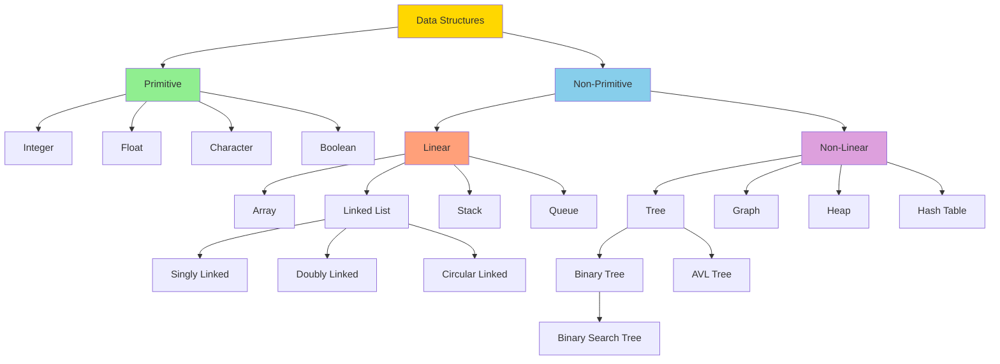
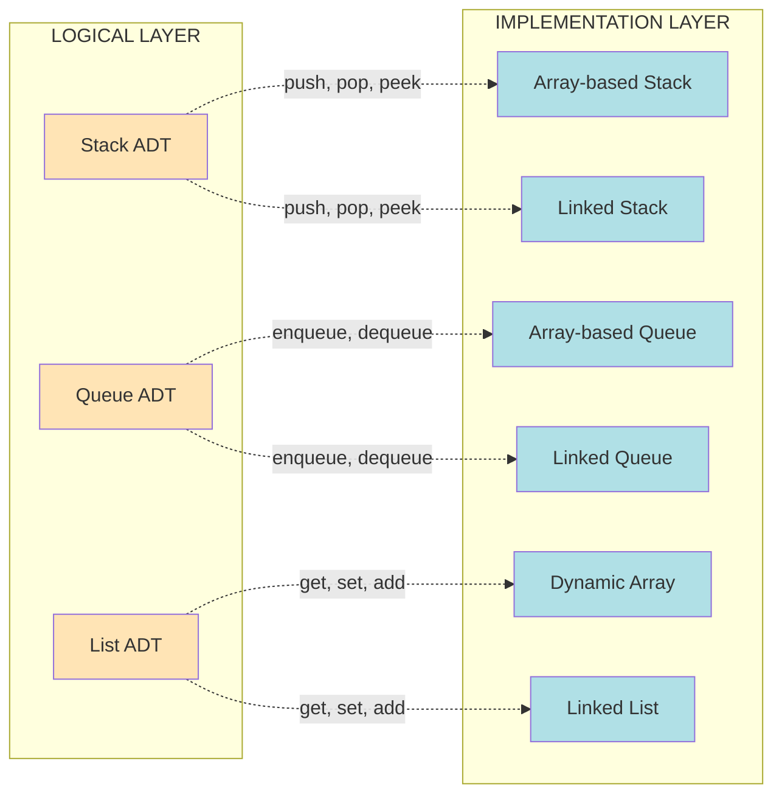
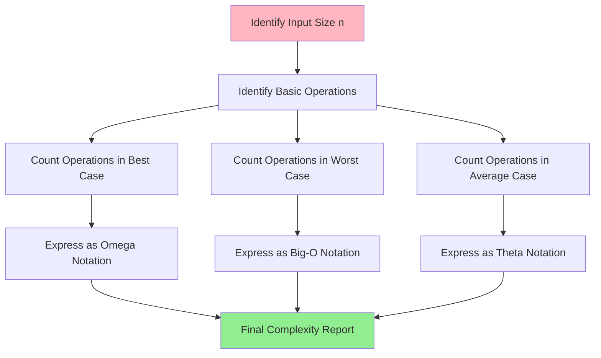
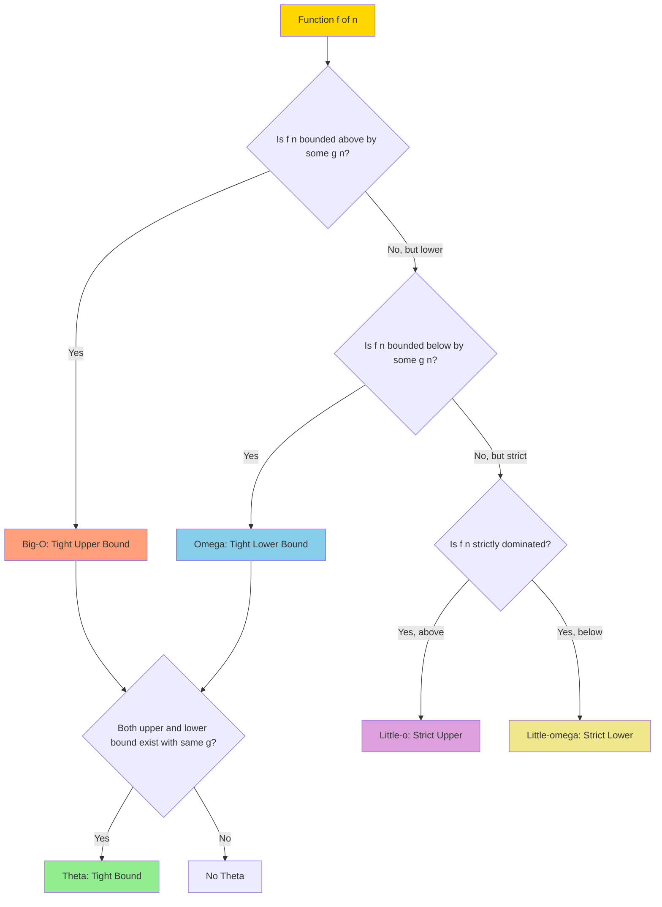
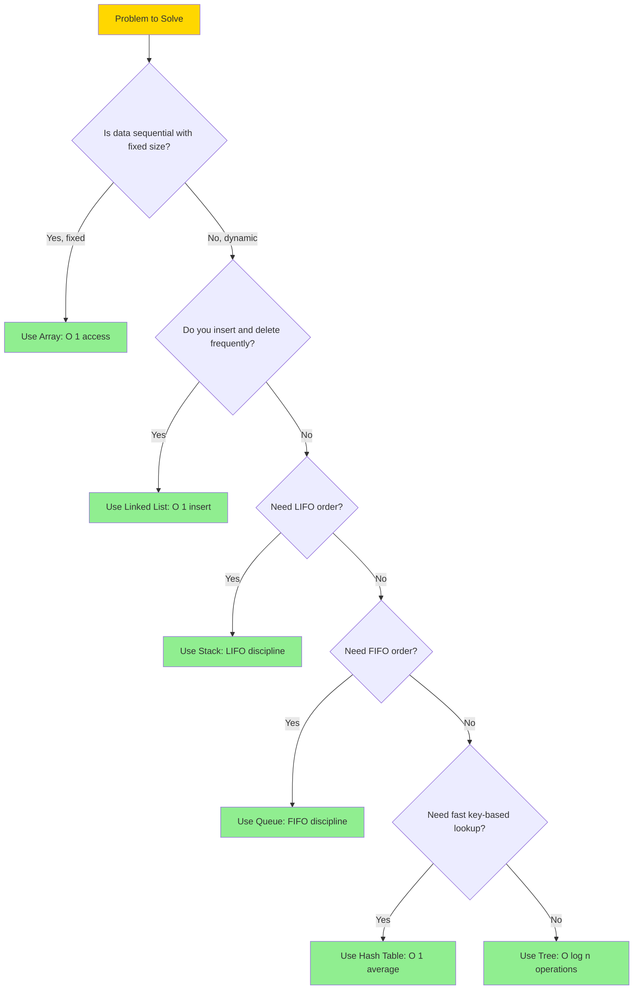

# Basic Concepts of Data Structures

<!-- SECTION_1_START -->
# 1. Core Technical Definition & Intuitive Overview

## 1.1 Data and Information

- **Data** refers to raw, unprocessed facts and figures that by themselves carry no specific meaning. Examples include a single number like `42`, a name like `"John"`, or a boolean value like `true`.
- **Information** is the processed, organized, and structured form of data that carries meaning and supports decision-making. For example, "John is 42 years old" is information derived from combining two data items.
- The transformation of **Data → Information → Knowledge → Wisdom** is the central information hierarchy in computer science.

> [!IMPORTANT]
> **KTU 2024 Syllabus Highlight:** A **Data Structure** is a specialized format for organizing, processing, retrieving, and storing data. It defines the relationship between data items and the operations that can be performed on them.

## 1.2 Formal Definition of Data Structure

A **Data Structure** is a named storage location (in memory or on disk) that can be used to store and organize data, along with the operations permitted on that data. A data structure is, therefore, a collection of data values, the relationships among them, and the functions or operations that can be applied to the data.

Mathematically, a data structure can be represented as a tuple:
$$DS = (D, R, O)$$
where $D$ is the set of data elements, $R$ is the set of relationships among them, and $O$ is the set of permissible operations.

> [!NOTE]
> **Definition (Knuth's Perspective):** Donald Knuth defines a data structure as a way to store and organize data in a computer so that it can be used efficiently. Efficiency is measured in terms of **time** (speed of operations) and **space** (memory consumed).

## 1.3 Conceptual Analogy / Intuition

Imagine a **library**. Books are the *data*, but the way they are organized — by shelf, by subject, by author — is the *data structure*. The librarian's index card system, the Dewey Decimal Classification, and the alphabetical arrangement are all different "structures" applied to the same data (books). A well-chosen structure lets you find a book in seconds; a poor structure might require hours.

In the same way, in programming:
- An **array** is like numbered lockers in a row.
- A **linked list** is like a treasure hunt where each clue points to the next.
- A **tree** is like a company org chart with one CEO at the top and branches going down.
- A **graph** is like a social network where everyone is connected to everyone else in arbitrary ways.

## 1.4 Classification of Data Structures

```
                        DATA STRUCTURES
                              |
        +---------------------+---------------------+
        |                                           |
   PRIMITIVE                              NON-PRIMITIVE
   (Basic / Atomic)                       (User-defined)
        |                                           |
   +----+----+                          +-----------+-----------+
   |         |                          |                       |
Integer   Float   Char, Boolean     LINEAR                NON-LINEAR
                                            |
                                  +---------+---------+----------+-------+
                                  |         |         |          |       |
                               Array    Linked   Stack     Queue    Hash
                                        List                       Table
```

### 1.4.1 Primitive Data Structures
These are the fundamental data types built directly into the language. They can hold a single value.
- **Integer** — `int` (e.g., `1, 100, -5`)
- **Float / Double** — `float`, `double` (e.g., `3.14, -0.5`)
- **Character** — `char` (e.g., `'A', 'z'`)
- **Boolean** — `bool` (e.g., `true, false`)

### 1.4.2 Non-Primitive Data Structures
These are derived from primitive types and can store multiple values organized in a specific way. They are categorized by the way data items are arranged and accessed.

**A. Linear Data Structures** — Data elements are arranged in a sequential, linear order; each element has a unique predecessor and successor (except first and last).
- **Array** — A fixed-size, contiguous block of memory holding elements of the same type.
- **Linked List** — A chain of nodes where each node holds data and a pointer to the next.
- **Stack** — A Last-In-First-Out (LIFO) structure.
- **Queue** — A First-In-First-Out (FIFO) structure.

**B. Non-Linear Data Structures** — Data elements are arranged in a hierarchical or networked manner, allowing multiple relationships.
- **Tree** — A hierarchical structure with a root node and child subtrees.
- **Graph** — A set of vertices connected by edges; can be directed or undirected.
- **Heap** — A specialized tree-based structure satisfying the heap property.
- **Hash Table** — A structure that maps keys to values using a hash function.

## 1.5 Abstract Data Type (ADT)

An **Abstract Data Type (ADT)** is a theoretical concept that defines a data type purely by its **behavior (semantics)** from the point of view of a user, specifically in terms of possible values, possible operations on data of this type, and the behavior of these operations.

> [!IMPORTANT]
> **Crucial Distinction:** An ADT is a **logical description** of *how* data is viewed and *what* operations can be performed, while a **Data Structure** is the **concrete implementation** of an ADT.

### Examples of ADTs:
| ADT | Logical Description | Possible Implementations |
|-----|---------------------|--------------------------|
| Stack | Insert/remove from one end (top), LIFO | Array, Linked List |
| Queue | Insert at rear, remove from front, FIFO | Array, Linked List, Circular Buffer |
| List | Ordered collection, random access | Array, Linked List |
| Dictionary | Key-value mapping, fast lookup | Hash Table, BST, Red-Black Tree |

## 1.6 Algorithm

An **Algorithm** is a finite, well-defined sequence of unambiguous instructions for solving a class of specific problems or performing a computation in a finite amount of time. It is the *procedure* or *recipe* that operates on a data structure.

### Characteristics of an Algorithm (Finiteness, Definiteness, etc.)
1. **Input** — Zero or more inputs are supplied externally.
2. **Output** — At least one output is produced.
3. **Finiteness** — The algorithm terminates after a finite number of steps.
4. **Definiteness** — Each instruction is clear and unambiguous.
5. **Effectiveness** — Each operation must be basic enough to be carried out exactly and in a finite length of time.

> [!VISUALIZATION CONTROL]
> **Concept:** Time vs. Space Complexity Trade-off
> **GeoGebra / Desmos Input Equations:**
> * $f(x) = x^2$ (representing $O(n^2)$ time, low space)
> * $g(x) = 2^x$ (representing $O(2^n)$ time, exponential growth)
> **Visual Description:** Plot these on the same axes. Observe how $g(x)$ grows much faster than $f(x)$, illustrating why algorithmic efficiency matters. The x-axis represents input size $n$ and the y-axis represents the number of operations.

## 1.7 The Need for Data Structures

Data structures are essential because they:
1. Enable **efficient data management** (storage and retrieval).
2. Provide **abstraction** (hiding implementation details via ADTs).
3. Allow **code reusability** and modularity.
4. Optimize **algorithm performance** (time and space).
5. Solve **real-world problems** like searching, sorting, routing, indexing, and AI inference.

## 1.8 Standard Metrics in Algorithm Analysis

- **Time Complexity ($T(n)$)** — The amount of computational time taken by an algorithm as a function of the input size $n$. Measured in number of basic operations.
- **Space Complexity ($S(n)$)** — The amount of memory (auxiliary + input) required by an algorithm as a function of the input size $n$. Measured in bytes or words.
- **Best Case ($\Omega$)** — Minimum time required for inputs of size $n$ (most favorable).
- **Average Case ($\Theta$ or expected)** — Expected time over all possible inputs of size $n$ (assumes a probability distribution).
- **Worst Case ($O$)** — Maximum time required for inputs of size $n$ (least favorable, but most useful for guarantees).

> [!NOTE]
> **Engineering Reality:** KTU and competitive programming always quote the **worst-case** time complexity because it gives a guaranteed upper bound. Best-case analysis is rarely informative (e.g., linear search has a best case of $O(1)$ when the element is first).

<!-- SECTION_1_END -->

<!-- SECTION_2_START -->
# 2. Deep Theoretical Analysis & KTU High-Yield Formula Sheet

## 2.1 Asymptotic Notations — The Heart of Complexity Analysis

**Asymptotic notations** are mathematical tools used to describe the running time (or space) of an algorithm in terms of input size $n$ as $n$ approaches infinity. They abstract away machine-dependent constants and focus on the *growth rate*.

### 2.1.1 Big-O Notation ($O$) — Upper Bound

$f(n) = O(g(n))$ if and only if there exist positive constants $c$ and $n_0$ such that:
$$0 \leq f(n) \leq c \cdot g(n) \quad \text{for all } n \geq n_0$$

**Meaning:** $f(n)$ grows *no faster* than $g(n)$. It describes the **worst-case** scenario.

> [!IMPORTANT]
> **Syllabus Highlight:** Big-O is the most commonly used notation in KTU exams. When a question asks "what is the time complexity?", the expected answer is almost always Big-O.

### 2.1.2 Omega Notation ($\Omega$) — Lower Bound

$f(n) = \Omega(g(n))$ if and only if there exist positive constants $c$ and $n_0$ such that:
$$0 \leq c \cdot g(n) \leq f(n) \quad \text{for all } n \geq n_0$$

**Meaning:** $f(n)$ grows *at least as fast* as $g(n)$. It describes the **best-case** scenario.

### 2.1.3 Theta Notation ($\Theta$) — Tight Bound

$f(n) = \Theta(g(n))$ if and only if there exist positive constants $c_1$, $c_2$, and $n_0$ such that:
$$0 \leq c_1 \cdot g(n) \leq f(n) \leq c_2 \cdot g(n) \quad \text{for all } n \geq n_0$$

**Meaning:** $f(n)$ grows *at the same rate* as $g(n)$. It describes an **average / exact** growth rate.

### 2.1.4 Little-O Notation ($o$) — Strict Upper Bound

$f(n) = o(g(n))$ if for every positive constant $c$, there exists an $n_0$ such that:
$$0 \leq f(n) < c \cdot g(n) \quad \text{for all } n \geq n_0$$

**Meaning:** $f(n)$ grows *strictly slower* than $g(n)$. The bound is not tight.

### 2.1.5 Little-Omega Notation ($\omega$) — Strict Lower Bound

$f(n) = \omega(g(n))$ if for every positive constant $c$, there exists an $n_0$ such that:
$$0 \leq c \cdot g(n) < f(n) \quad \text{for all } n \geq n_0$$

**Meaning:** $f(n)$ grows *strictly faster* than $g(n)$.

## 2.2 Visual Intuition for Asymptotic Notations

```
        f(n)
         |
    c2·g |---------  <- f(n) <= c2·g(n)        [Big-O]
         |        \
         |         \
         |----------\----------------------- f(n)
         |           \
    c1·g |------------\------------------  <- f(n) >= c1·g(n)   [Omega]
         |             \
         |              \
         |               \
         +---+---+---+---+---+--- n
             n0
        f(n) sandwiched between c1·g(n) and c2·g(n)  [Theta]
```

## 2.3 Rules for Asymptotic Analysis

### 2.3.1 Drop Lower-Order Terms
For large $n$, the dominant term matters. The smaller terms become negligible.
$$3n^2 + 5n + 100 = O(n^2)$$
The constants $3$, $5$, and $100$ are absorbed into the Big-O.

### 2.3.2 Drop Constant Multipliers
$$7n^3 = O(n^3)$$
$$1000n = O(n)$$

### 2.3.3 Polynomial Rule
For $f(n) = a_k n^k + a_{k-1} n^{k-1} + \dots + a_0$:
$$f(n) = O(n^k)$$

### 2.3.4 Logarithm Rule
Any logarithm base grows slower than any polynomial:
$$\log_b n = O(n^k) \quad \text{for any } k > 0$$

### 2.3.5 Common Growth Rate Hierarchy (Slowest → Fastest)
$$O(1) < O(\log \log n) < O(\log n) < O(\sqrt{n}) < O(n) < O(n \log n) < O(n^2) < O(n^3) < O(2^n) < O(n!) < O(n^n)$$

## 2.4 Standard Time Complexities of Operations (Preview)

| Data Structure | Access | Search | Insertion | Deletion |
|----------------|--------|--------|-----------|----------|
| Array | $O(1)$ | $O(n)$ | $O(n)$ | $O(n)$ |
| Linked List | $O(n)$ | $O(n)$ | $O(1)$ | $O(1)$ |
| Stack | $O(n)$ | $O(n)$ | $O(1)$ | $O(1)$ |
| Queue | $O(n)$ | $O(n)$ | $O(1)$ | $O(1)$ |
| Hash Table | N/A | $O(1)$ avg | $O(1)$ avg | $O(1)$ avg |
| Binary Search Tree | $O(\log n)$ avg | $O(\log n)$ avg | $O(\log n)$ avg | $O(\log n)$ avg |

## 2.5 KTU Formula Sheet / Cheat Sheet

| Concept | Formula / Definition | Notation | Use Case |
|---------|---------------------|----------|----------|
| Big-O Upper Bound | $f(n) \leq c \cdot g(n)$ for $n \geq n_0$ | $f(n) = O(g(n))$ | Worst-case time |
| Omega Lower Bound | $c \cdot g(n) \leq f(n)$ for $n \geq n_0$ | $f(n) = \Omega(g(n))$ | Best-case time |
| Theta Tight Bound | $c_1 \cdot g(n) \leq f(n) \leq c_2 \cdot g(n)$ | $f(n) = \Theta(g(n))$ | Average / exact |
| Master Theorem | $T(n) = aT(n/b) + f(n)$ | $\Theta(n^{\log_b a})$ | Divide & conquer |
| Space Complexity | $S(n) = \text{Input size} + \text{Auxiliary memory}$ | $S(n) = O(g(n))$ | Memory analysis |
| Recurrence relation | $T(n) = T(n-1) + O(1)$ | $O(n)$ | Linear recursion |
| Recurrence relation | $T(n) = T(n/2) + O(1)$ | $O(\log n)$ | Binary search |
| Recurrence relation | $T(n) = 2T(n/2) + O(1)$ | $O(n)$ | Tree traversal |
| Recurrence relation | $T(n) = 2T(n/2) + O(n)$ | $O(n \log n)$ | Merge sort |
| Recurrence relation | $T(n) = 2T(n-1) + O(1)$ | $O(2^n)$ | Subset enumeration |

> [!IMPORTANT]
> **Engineering Utility:** These notations are used in production systems to:
> - Compare competing algorithms before implementation.
> - Predict scalability under massive data (e.g., Google's search indexing, Facebook's social graph).
> - Identify bottlenecks during code reviews.
> - Make architectural decisions (e.g., choose hash table over linear search for $O(1)$ lookups).

<!-- SECTION_2_END -->

<!-- SECTION_3_START -->
# 3. Step-by-Step Derivations & Code/Symbolic Implementation

## 3.1 Worked Example: Proving $3n^2 + 5n + 100 = O(n^2)$

### Mathematical Derivation

We must find constants $c > 0$ and $n_0 \geq 1$ such that:
$$3n^2 + 5n + 100 \leq c \cdot n^2 \quad \text{for all } n \geq n_0$$

**Step 1:** For $n \geq 1$, we have $n \leq n^2$ and $1 \leq n^2$.

**Step 2:** Substitute the upper bounds:
$$3n^2 + 5n + 100 \leq 3n^2 + 5n^2 + 100n^2$$

**Step 3:** Combine like terms:
$$3n^2 + 5n^2 + 100n^2 = (3 + 5 + 100) \cdot n^2 = 108 \cdot n^2$$

**Step 4:** Therefore, choose $c = 108$ and $n_0 = 1$. The Big-O definition is satisfied.

$$\boxed{3n^2 + 5n + 100 = O(n^2)}$$

---

## 3.2 Worked Example: Linear Search Algorithm Complexity

### Algorithm (Python)
```python
def linear_search(arr: list[int], target: int) -> int:
    """
    Performs linear search on a list to find the target value.
    Returns the index of the target if found, else returns -1.
    
    Args:
        arr: List of integers to search through.
        target: Integer value to search for.
    
    Returns:
        Index of target in arr, or -1 if not found.
    """
    if not arr:
        raise ValueError("Input array must not be empty.")
    
    for index, value in enumerate(arr):
        if value == target:
            return index  # Element found
    return -1  # Element not found
```

### Step-by-Step Complexity Analysis

**Best Case ($\Omega$):** The target is at index $0$. The loop executes once. Number of operations = constant. 
$$T_{\text{best}}(n) = O(1)$$

**Worst Case ($O$):** The target is at the last index, or not in the array at all. The loop executes $n$ times. 
$$T_{\text{worst}}(n) = O(n)$$

**Average Case ($\Theta$):** Assuming the target has equal probability of being at any position, the expected number of comparisons is:
$$T_{\text{avg}}(n) = \frac{1 + 2 + 3 + \dots + n}{n} = \frac{1}{n} \cdot \frac{n(n+1)}{2} = \frac{n+1}{2} = O(n)$$

---

## 3.3 Worked Example: Binary Search Algorithm Complexity

### Algorithm (Python)
```python
def binary_search(arr: list[int], target: int) -> int:
    """
    Performs binary search on a SORTED list.
    Returns the index of target if found, else -1.
    
    Time Complexity: O(log n)
    Space Complexity: O(1) iterative, O(log n) recursive
    """
    if not arr:
        raise ValueError("Input array must not be empty.")
    
    left, right = 0, len(arr) - 1
    
    while left <= right:
        mid = (left + right) // 2
        
        if arr[mid] == target:
            return mid
        elif arr[mid] < target:
            left = mid + 1
        else:
            right = mid - 1
    
    return -1
```

### Recurrence Relation Derivation

Each iteration reduces the search space by half. The recurrence is:
$$T(n) = T\left(\frac{n}{2}\right) + O(1)$$

**Step 1:** Substitute $T(n/2) = T(n/4) + O(1)$:
$$T(n) = T\left(\frac{n}{4}\right) + 2 \cdot O(1)$$

**Step 2:** After $k$ iterations:
$$T(n) = T\left(\frac{n}{2^k}\right) + k \cdot O(1)$$

**Step 3:** The recursion ends when $\frac{n}{2^k} = 1$, i.e., $k = \log_2 n$.

**Step 4:** Substitute back:
$$T(n) = T(1) + \log_2 n \cdot O(1) = O(\log n)$$

$$\boxed{T_{\text{binary\_search}}(n) = O(\log n)}$$

---

## 3.4 Worked Example: Recursive Fibonacci Complexity

### Algorithm (Python)
```python
def fibonacci(n: int) -> int:
    """
    Naive recursive Fibonacci.
    Time Complexity: O(2^n)
    Space Complexity: O(n) call stack
    """
    if n < 0:
        raise ValueError("n must be non-negative.")
    if n <= 1:
        return n
    return fibonacci(n - 1) + fibonacci(n - 2)
```

### Recurrence Relation
$$T(n) = T(n-1) + T(n-2) + O(1)$$

Solving the characteristic equation $x^2 = x + 1$ gives the golden ratio $\phi = \frac{1 + \sqrt{5}}{2} \approx 1.618$. The solution is:
$$T(n) = O(\phi^n) = O(2^n)$$

> [!IMPORTANT]
> **Engineering Insight:** The naive Fibonacci is $O(2^n)$ — utterly unusable for $n > 40$. Using **memoization** or **dynamic programming**, the complexity drops to $O(n)$ — a massive real-world optimization used in compiler design and genomics.

---

## 3.5 Worked Example: Sum of First $n$ Natural Numbers

### Three Algorithmic Approaches

**Approach 1: Iterative Loop**
```python
def sum_iterative(n: int) -> int:
    """O(n) time, O(1) space."""
    if n < 0:
        raise ValueError("n must be non-negative.")
    total = 0
    for i in range(1, n + 1):
        total += i
    return total
```

**Approach 2: Mathematical Formula**
```python
def sum_formula(n: int) -> int:
    """O(1) time, O(1) space."""
    if n < 0:
        raise ValueError("n must be non-negative.")
    return n * (n + 1) // 2
```

**Approach 3: Recursion**
```python
def sum_recursive(n: int) -> int:
    """O(n) time, O(n) call stack space."""
    if n < 0:
        raise ValueError("n must be non-negative.")
    if n == 0:
        return 0
    return n + sum_recursive(n - 1)
```

### Comparative Analysis

| Approach | Time Complexity | Space Complexity | For $n = 10^9$ |
|----------|----------------|------------------|----------------|
| Iterative | $O(n)$ | $O(1)$ | ~3 seconds |
| Formula | $O(1)$ | $O(1)$ | < 1 microsecond |
| Recursive | $O(n)$ | $O(n)$ | Stack overflow likely |

> [!NOTE]
> **The Power of Algorithmic Thinking:** The formula approach is a constant-time solution to a problem the loop solves in linear time. For $n = 10^9$, the difference is the difference between a millisecond and an hour.

---

## 3.6 Worked Example: Time Complexity of Nested Loops

### Code
```python
def nested_loop_example(arr: list[int]) -> None:
    n = len(arr)
    for i in range(n):              # Outer loop: n iterations
        for j in range(n):          # Middle loop: n iterations
            for k in range(n):      # Inner loop: n iterations
                print(arr[i] + arr[j] + arr[k])
```

### Step-by-Step Analysis

**Step 1:** The innermost `print` statement is $O(1)$.

**Step 2:** The innermost `for k` loop runs $n$ times, each time doing $O(1)$ work. Total: $O(n)$.

**Step 3:** The middle `for j` loop runs $n$ times, each time invoking the inner loop ($O(n)$). Total: $n \cdot O(n) = O(n^2)$.

**Step 4:** The outer `for i` loop runs $n$ times, each time invoking the middle loop ($O(n^2)$). Total: $n \cdot O(n^2) = O(n^3)$.

$$\boxed{T(n) = O(n^3)}$$

---

## 3.7 Worked Example: Time Complexity of Logarithmic Loop

### Code
```python
def logarithmic_loop(n: int) -> int:
    count = 0
    i = 1
    while i < n:
        i = i * 2  # Doubles each iteration
        count += 1
    return count
```

### Step-by-Step Analysis

**Step 1:** The value of $i$ follows the sequence: $1, 2, 4, 8, 16, \dots, 2^k$.

**Step 2:** The loop terminates when $2^k \geq n$, i.e., $k \geq \log_2 n$.

**Step 3:** The number of iterations is $k = \log_2 n$.

$$\boxed{T(n) = O(\log n)}$$

---

## 3.8 Recurrence Relations Cheat Sheet (KTU Favourite)

| Algorithm | Recurrence | Solution |
|-----------|------------|----------|
| Binary Search | $T(n) = T(n/2) + O(1)$ | $O(\log n)$ |
| Merge Sort | $T(n) = 2T(n/2) + O(n)$ | $O(n \log n)$ |
| Quick Sort (avg) | $T(n) = 2T(n/2) + O(n)$ | $O(n \log n)$ |
| Quick Sort (worst) | $T(n) = T(n-1) + O(n)$ | $O(n^2)$ |
| Tower of Hanoi | $T(n) = 2T(n-1) + O(1)$ | $O(2^n)$ |
| Linear Search | $T(n) = T(n-1) + O(1)$ | $O(n)$ |
| Heap Sort | $T(n) = 2T(n/2) + O(\log n)$ | $O(n \log n)$ |
| Strassen's Matrix | $T(n) = 7T(n/2) + O(n^2)$ | $O(n^{2.81})$ |

<!-- SECTION_3_END -->

<!-- SECTION_4_START -->
# 4. Structural Diagrams & Schematics

## 4.1 Classification Hierarchy of Data Structures



## 4.2 ADT vs Data Structure Relationship



## 4.3 Algorithm Analysis Workflow



## 4.4 Memory Layout: Array vs Linked List

```mermaid
graph LR
    subgraph ARRAY["ARRAY - Contiguous Memory"]
        A0[Index 0: 10] --> A1[Index 1: 20] --> A2[Index 2: 30] --> A3[Index 3: 40]
    end
    
    subgraph LL["LINKED LIST - Scattered Nodes"]
        L0[Node0: 10 | Next] -.ptr.-> L1[Node1: 20 | Next]
        L1 -.ptr.-> L2[Node2: 30 | Next]
        L2 -.ptr.-> L3[Node3: 40 | NULL]
    end
    
    style ARRAY fill:#FFE4E1
    style LL fill:#E0FFFF
```

## 4.5 Asymptotic Notation Comparison Flow



## 4.6 Sequential Processing Topology Matrix — Choosing a Data Structure



<!-- SECTION_4_END -->

<!-- SECTION_5_START -->
# 5. KTU 2024 Scheme Examination Question Bank & Topic Recap

## Part A Questions (3 Marks Each)

### Question 1: Define Data Structure. Differentiate between primitive and non-primitive data structures. [3 Marks]
**Tags:** [KTU University Exam - July 2023] | **CO:** CO1 | **RBT Level:** Remember

**Model Answer:**

A **Data Structure** is a specialized format for organizing, processing, retrieving, and storing data in memory so that it can be accessed and used efficiently. It defines the relationship between data elements and the operations that can be performed on them.

**Differentiation:**

| Feature | Primitive | Non-Primitive |
|---------|-----------|---------------|
| Definition | Basic, built-in types | Derived from primitive types |
| Examples | `int`, `float`, `char`, `bool` | Array, Linked List, Stack, Tree |
| Storage | Single value | Multiple values, organized |
| Defined by | Programming language | Programmer |
| Size | Fixed (typically) | Can be dynamic |
| Complexity | Simple | More complex |

> [!Valuation Tip]
> [Defining Data Structure: 1 Mark] [Differentiating with at least 2 valid points: 2 Marks]

---

### Question 2: What is an Abstract Data Type (ADT)? Give two examples. [3 Marks]
**Tags:** [KTU University Exam - Dec 2023] | **CO:** CO1 | **RBT Level:** Understand

**Model Answer:**

An **Abstract Data Type (ADT)** is a theoretical concept that defines a data type solely by its behavior (semantics) from the user's perspective, in terms of possible values, possible operations, and the behavior of those operations — without specifying how the data is stored in memory (implementation).

**Two Examples:**

1. **Stack ADT** — A linear collection allowing insertion and deletion only from one end (the top). Operations: `push()`, `pop()`, `peek()`, `isEmpty()`. The internal representation (array or linked list) is hidden from the user.

2. **Queue ADT** — A linear collection allowing insertion at the rear and deletion from the front. Operations: `enqueue()`, `dequeue()`, `front()`, `isEmpty()`. Implementation can be circular array or linked list.

> [!Valuation Tip]
> [Definition of ADT: 1 Mark] [Example 1 with operations: 1 Mark] [Example 2 with operations: 1 Mark]

---

## Part B Questions (14 Marks Each — Module Internal Choice)

### Question A: Comprehensive Analysis of Asymptotic Notations and Complexity

**(a) Explain Big-O, Omega, and Theta asymptotic notations with suitable mathematical definitions. For each, give one example function. [7 Marks]**

**(b) Analyze the time complexity of the following code segment and express it in Big-O notation. Show step-by-step counting. [7 Marks]**

```python
def mystery(n: int) -> int:
    count = 0
    for i in range(n):
        for j in range(i, n):
            count += 1
    return count
```

**Tags:** [KTU University Exam - July 2024] | **CO:** CO1, CO2 | **RBT Level:** Understand, Apply

---

#### Part (a) Model Answer — 7 Marks

**Big-O Notation (Upper Bound) — 2.5 Marks**

$f(n) = O(g(n))$ if there exist positive constants $c$ and $n_0$ such that $0 \leq f(n) \leq c \cdot g(n)$ for all $n \geq n_0$.

[Stating formal definition: 1 Mark] [Interpretation as worst-case / upper bound: 0.5 Mark] [Example: $3n^2 + 5n = O(n^2)$: 1 Mark]

**Omega Notation (Lower Bound) — 2 Marks**

$f(n) = \Omega(g(n))$ if there exist positive constants $c$ and $n_0$ such that $0 \leq c \cdot g(n) \leq f(n)$ for all $n \geq n_0$.

[Stating formal definition: 1 Mark] [Interpretation as best-case / lower bound: 0.5 Mark] [Example: $n^2 + n = \Omega(n^2)$: 0.5 Mark]

**Theta Notation (Tight Bound) — 2.5 Marks**

$f(n) = \Theta(g(n))$ if there exist positive constants $c_1$, $c_2$, and $n_0$ such that $0 \leq c_1 \cdot g(n) \leq f(n) \leq c_2 \cdot g(n)$ for all $n \geq n_0$.

[Stating formal definition: 1 Mark] [Interpretation as average / exact growth: 0.5 Mark] [Example: $5n^3 + 10 = \Theta(n^3)$: 1 Mark]

---

#### Part (b) Model Answer — 7 Marks

**Step 1: Outer Loop Analysis** [1 Mark]
The outer `for i` loop runs for $i = 0, 1, 2, \dots, n-1$. Total iterations = $n$.

**Step 2: Inner Loop Analysis** [2 Marks]
The inner `for j` loop runs from $j = i$ to $j = n-1$. The number of iterations of the inner loop depends on the value of $i$:
- When $i = 0$: inner loop runs $n$ times.
- When $i = 1$: inner loop runs $n - 1$ times.
- When $i = 2$: inner loop runs $n - 2$ times.
- ...
- When $i = n - 1$: inner loop runs $1$ time.

**Step 3: Total Operation Count** [2 Marks]
$$T(n) = n + (n-1) + (n-2) + \dots + 1 = \frac{n(n+1)}{2}$$

[Stating the arithmetic series: 1 Mark] [Computing the sum: 1 Mark]

**Step 4: Big-O Simplification** [2 Marks]
$$T(n) = \frac{n^2 + n}{2} = \frac{1}{2} n^2 + \frac{1}{2} n$$

Applying asymptotic rules — drop the constant multiplier and the lower-order term:
$$T(n) = O(n^2)$$

[Showing the expansion: 1 Mark] [Final simplified Big-O expression: 1 Mark]

---

### Question B: Classification and Real-World Application of Data Structures

**(a) Classify data structures with a neat diagram. Explain linear and non-linear data structures with examples. [7 Marks]**

**(b) For each scenario below, identify the most suitable data structure and justify your choice with its time complexity: (i) Browser back-button history (ii) Process scheduling in an operating system (iii) Storing employee records searchable by employee ID [7 Marks]**

**Tags:** [KTU University Exam - Dec 2024] | **CO:** CO1, CO2 | **RBT Level:** Understand, Apply

---

#### Part (a) Model Answer — 7 Marks

**Classification Diagram — 3 Marks**

```
                    DATA STRUCTURES
                          |
            +-------------+-------------+
            |                           |
        PRIMITIVE                NON-PRIMITIVE
            |                           |
       (int, float,         +----------+----------+
        char, bool)         |                     |
                          LINEAR             NON-LINEAR
                            |                     |
                   Array, Linked List,    Tree, Graph, Heap,
                   Stack, Queue           Hash Table
```

[Drawing the complete classification tree with at least 3 levels: 3 Marks]

**Linear Data Structures — 2 Marks**

Data elements are arranged in a **sequential** order, where each element has a unique predecessor and successor (except the first and last).

[Defining linear: 1 Mark] [Examples: Array, Linked List, Stack, Queue: 1 Mark]

**Non-Linear Data Structures — 2 Marks**

Data elements are arranged in a **hierarchical or networked** manner, where one element can be connected to multiple others, allowing non-sequential traversal.

[Defining non-linear: 1 Mark] [Examples: Tree, Graph, Heap: 1 Mark]

---

#### Part (b) Model Answer — 7 Marks

**(i) Browser Back-Button History — 2.5 Marks**

**Suitable Data Structure: Stack (LIFO)**

**Justification:** When a user visits a new webpage, it is pushed onto the stack. Pressing the back button pops the most recently visited page. This LIFO discipline perfectly matches the user's mental model of "undoing" navigation.

[Stating Stack: 0.5 Mark] [LIFO matching browser behavior: 1 Mark] [Operations $O(1)$ push/pop: 1 Mark]

**(ii) Process Scheduling in an Operating System — 2 Marks**

**Suitable Data Structure: Queue (FIFO)**

**Justification:** The OS scheduler picks the process that has been waiting the longest (FIFO) for fair execution. The first process to arrive is the first to be dispatched to the CPU.

[Stating Queue: 0.5 Mark] [FIFO matching scheduling fairness: 1 Mark] [Operations $O(1)$ enqueue/dequeue: 0.5 Mark]

**(iii) Storing Employee Records Searchable by Employee ID — 2.5 Marks**

**Suitable Data Structure: Hash Table**

**Justification:** Employee IDs are unique keys. A hash table maps each ID to its record using a hash function, allowing constant-time lookup, insertion, and deletion on average — ideal for fast retrieval in HR systems.

[Stating Hash Table: 0.5 Mark] [Justifying key-based fast access: 1 Mark] [Operations $O(1)$ average: 1 Mark]

---

> [!WARNING]
> **KTU Examiner's Valuation Warning / Pitfall Callout:**
> 1. **Do NOT confuse ADT with Data Structure** — ADT is the *logical* description; Data Structure is the *physical* implementation. Marks are deducted if these terms are used interchangeably.
> 2. **When asked for time complexity, ALWAYS give Big-O** unless specifically asked for best-case (Omega) or tight bound (Theta). A common mistake is writing $O(n \log n)$ when the question explicitly asks for $\Theta(n \log n)$.
> 3. **For nested loops, count carefully.** A frequent error is treating `for i in range(n): for j in range(n)` as $O(n)$ instead of $O(n^2)$. Always count how many times the innermost statement executes.
> 4. **Drop lower-order terms correctly.** Writing $T(n) = 5n^2 + 3n = O(n^3)$ is WRONG. The correct answer is $O(n^2)$ because the dominant term is $n^2$.
> 5. **For recursive complexity, ALWAYS state the recurrence relation first** before solving. This earns the step-mark that is otherwise lost.
> 6. **Avoid missing the constants rule.** If the question asks for Big-O, you do NOT need to find the exact constant $c$ — but you MUST mention that such a constant exists. Saying just "yes, it's $O(n^2)$" without justification is incomplete.
> 7. **Space complexity includes input + auxiliary memory.** A common pitfall is forgetting to count the input size. For example, a function taking an array of size $n$ has $S(n) = n + O(1) = O(n)$ in the worst case.

---

## Topic Recap & Important Things to Remember

- **Data vs Information:** Data is raw; Information is processed, meaningful data.
- **Data Structure** = collection of data + relationships + permitted operations. Tuple form: $DS = (D, R, O)$.
- **Two Main Categories:** Primitive (`int`, `float`, `char`, `bool`) and Non-Primitive (Linear + Non-Linear).
- **Linear Structures:** Array, Linked List, Stack, Queue — sequential access pattern.
- **Non-Linear Structures:** Tree, Graph, Heap, Hash Table — hierarchical/networked access.
- **ADT (Abstract Data Type):** A *logical* specification of *what* operations do, not *how*. Examples: Stack, Queue, List, Dictionary.
- **Data Structure vs ADT:** ADT is the **blueprint**; Data Structure is the **building** constructed from it.
- **Algorithm:** A finite, well-defined, unambiguous sequence of steps for solving a problem. Must have input, output, finiteness, definiteness, effectiveness.
- **Three Asymptotic Notations (must memorize):**
  - $O(g(n))$ = **Upper bound** (worst case) — $f(n) \leq c \cdot g(n)$.
  - $\Omega(g(n))$ = **Lower bound** (best case) — $c \cdot g(n) \leq f(n)$.
  - $\Theta(g(n))$ = **Tight bound** (average / exact) — sandwiched.
- **Growth Rate Hierarchy (slowest to fastest):** $O(1) < O(\log n) < O(n) < O(n \log n) < O(n^2) < O(2^n) < O(n!)$.
- **Asymptotic Analysis Rules:** Drop lower-order terms; drop constant multipliers; use the dominant term.
- **Common Recurrences to Memorize:**
  - Linear recurrence $T(n) = T(n-1) + O(1) \Rightarrow O(n)$.
  - Halving recurrence $T(n) = T(n/2) + O(1) \Rightarrow O(\log n)$.
  - Divide-and-conquer $T(n) = 2T(n/2) + O(n) \Rightarrow O(n \log n)$.
- **Best, Worst, Average Cases:** Worst-case is the most commonly quoted (gives guaranteed bound). Best-case is rarely useful. Average-case requires a probability assumption.
- **Time Complexity $T(n)$:** Number of basic operations as a function of $n$.
- **Space Complexity $S(n)$:** Total memory used (input + auxiliary) as a function of $n$.
- **Linear Search:** $O(n)$ time, $O(1)$ space. Works on unsorted data.
- **Binary Search:** $O(\log n)$ time, $O(1)$ space (iterative). **Requires sorted data.**
- **Real-World Data Structure Mapping:** Browser back → Stack; OS scheduling → Queue; Dictionary → Hash Table; File system → Tree; Google Maps → Graph.
- **Constant-time $O(1)$:** Array index access, hash table insert/search/delete (avg), stack push/pop.
- **Logarithmic $O(\log n)$:** Binary search, balanced BST operations.
- **Linear $O(n)$:** Linear search, sum of array, single loop over $n$ elements.
- **Quadratic $O(n^2)$:** Nested loops over $n$, bubble sort, selection sort, insertion sort.
- **Quasi-linear $O(n \log n)$:** Merge sort, heap sort, quick sort (average).
- **Exponential $O(2^n)$:** Naive recursive Fibonacci, subset generation, Tower of Hanoi.
- **Master Theorem:** For $T(n) = aT(n/b) + f(n)$, compare $f(n)$ with $n^{\log_b a}$ to determine the case and solution.
- **Engineering Principle:** Always prefer algorithms with lower time complexity, but consider space-time tradeoffs and constant factors in practice.
- **KTU Exam Tip:** For 14-mark questions, ALWAYS show: (1) the recurrence or counting strategy, (2) the step-by-step derivation, (3) the final Big-O simplification. This structure fetches full marks.

<!-- SECTION_5_END -->
