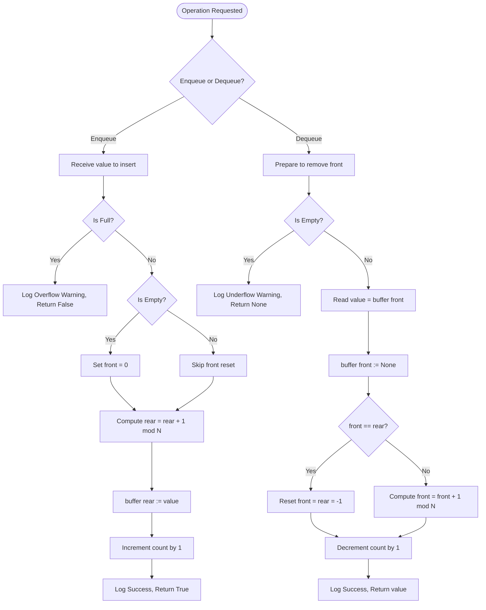
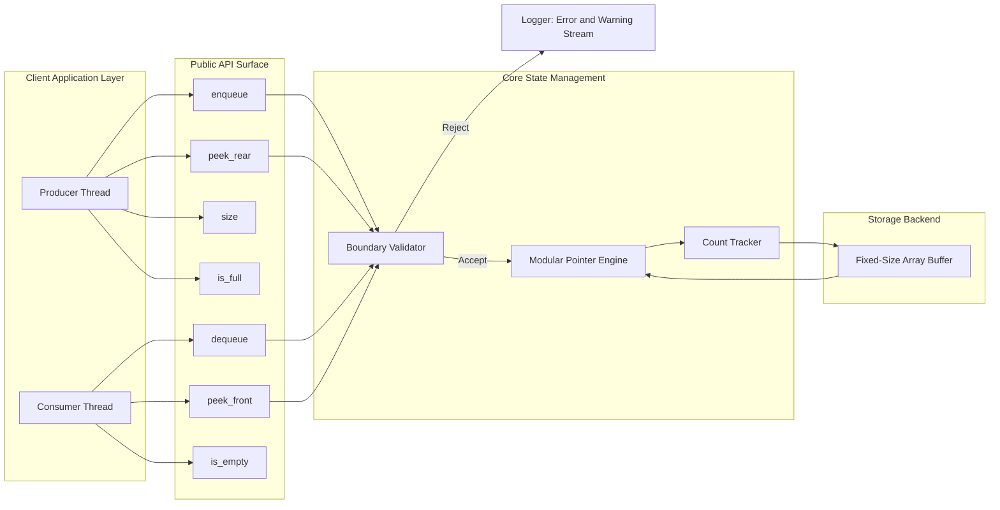
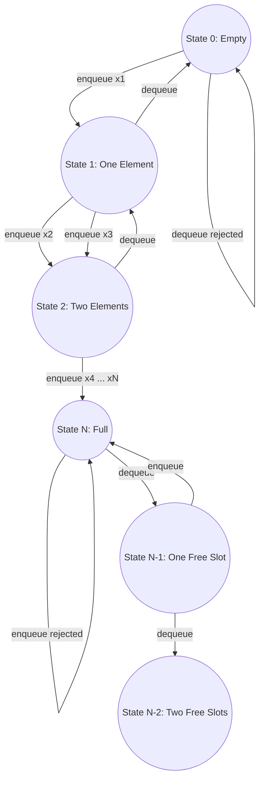

# Circular Queues

<!-- SECTION_1_START -->
# Circular Queue — Core Technical Definition & Intuitive Overview

## Formal Definition (KTU 2024 Syllabus Terminology)

> [!NOTE]
> **Circular Queue** is a linear data structure that follows the **FIFO (First In, First Out)** principle, in which the last position is logically connected back to the first position to form a **ring (circle)**. This ring-based topology allows the $rear$ and $front$ pointers to *wrap around* the boundary of the underlying array using **modular arithmetic**, thereby eliminating the wasted-space problem inherent in a **linear (one-dimensional) queue**.

Mathematically, the logical adjacency between the last and first slots is enforced by the modulo operator:

$$rear_{next} = (rear + 1) \mod N \quad \text{and} \quad front_{next} = (front + 1) \mod N$$

where $N$ is the fixed **capacity** of the buffer.

---

## Conceptual Analogy & Intuition

> [!IMPORTANT]
> **Real-World Analogy: A Circular Railway Platform**
> Imagine passengers boarding a train at a **circular platform with 5 gates** (Gate 0 → Gate 1 → Gate 2 → Gate 3 → Gate 4 → back to Gate 0). A passenger **boards (enqueue)** at the current $rear$ gate, and a passenger **disembarks (dequeue)** at the current $front$ gate. Once a gate is vacated, the *next* boarding can immediately re-use it by **wrapping around**, just like the minute hand of a clock resets to **12** after **11**. **No gate ever goes permanently wasted.**

In a **linear queue** implemented as a one-dimensional array, after several `dequeue()` calls, the $front$ slides forward, leaving the *lower-indexed* slots permanently unusable — a phenomenon called **"false overflow"** because the queue reports FULL even when memory exists. The circular queue **recycles** those freed slots by mapping index $N-1$ back to $0$.

---

## Standard Engineering Metrics (Highlighted in Bold)

- **Capacity ($N$):** Maximum number of elements the queue can store. **Fixed at construction time.**
- **Time Complexity:** $O(1)$ for `enqueue`, `dequeue`, `front`, `rear` operations.
- **Space Complexity:** $O(N)$ for the underlying array.
- **Pointer Integers:** $front$, $rear$, and an optional $count$ variable, all in $\mathbb{Z}$ (integer domain).
- **Boundary Constant:** Indices are bounded in the closed interval $[0, N-1]$ at all times.

---

> [!VISUALIZATION CONTROL]
> **Concept:** Circular Buffer Represented as a Unit Circle with Index Markers
>
> **GeoGebra / Desmos Input Equations:**
> * Parametric circle: $\quad x(t) = \cos(t), \quad y(t) = \sin(t) \quad \text{for } t \in [0, 2\pi]$
> * Marked slots (radial points at angles $0, \tfrac{\pi}{2}, \pi, \tfrac{3\pi}{2}, \tfrac{\pi}{4}$): $\quad P_k = (\cos(2\pi k / N), \sin(2\pi k / N))$ for $k = 0, 1, 2, 3, 4$ and $N = 5$.
> * Front arrow at $k = 0$, Rear arrow at $k = 2$.
>
> **Visual Description:** The student should observe **five equally spaced points** on the unit circle. An arrow labelled $front$ points inward at slot 0 and another labelled $rear$ points inward at slot 2. The arc between them (passing through slot 1) is the **active data region**; the remaining arc represents **free space** that can be re-used via wrap-around.

<!-- SECTION_1_END -->

<!-- SECTION_2_START -->
# Deep Theoretical Analysis & KTU High-Yield Formula Sheet

## Operational Breakdown — The "Why" and "How" Behind Each Step

A circular queue maintains **two integer pointers** ($front$ and $rear$) plus an optional **count** to track its dynamic state. The following logic tree governs every operation:

- **Why modular arithmetic?** $\mod N$ forces the pointer to **rotate** within the bounds $[0, N-1]$, so index $N$ is mapped to $0$, $N+1$ to $1$, and so on. This single arithmetic operation is the heart of the circular queue.
- **Why a `count` variable?** The classic "one-slot-wasted" trick (checking $(rear+1) \mod N = front$) leaves exactly one slot unused. Using an explicit `count` allows the queue to **fill all $N$ slots** while still distinguishing *empty* from *full* unambiguously.
- **Why reset pointers when the last element is removed?** When $front = rear$ in the count-based scheme, it could mean either *one element left* or *queue empty*. The reset ($-1, -1$) removes this ambiguity and prevents stale state.

---

## KTU Formula Sheet / Cheat Sheet

| Concept | Mathematical Expression | Boundary / State |
|---|---|---|
| Next rear index | $rear_{next} = (rear + 1) \mod N$ | Always in $[0, N-1]$ |
| Next front index | $front_{next} = (front + 1) \mod N$ | Always in $[0, N-1]$ |
| Empty condition (count-based) | $count = 0$ | Initial state: $front = rear = -1$ |
| Full condition (count-based) | $count = N$ | All $N$ slots occupied |
| Empty condition (slot-wasted) | $front = -1$ | After dequeue of last element |
| Full condition (slot-wasted) | $(rear + 1) \mod N = front$ | One slot always free |
| Current size | $size = (rear - front + N) \mod N$ | Valid even after wrap |
| Time complexity (all ops) | $T(n) = O(1)$ | Independent of $n$ |
| Space complexity | $S(n) = O(N)$ | Static array allocation |

---

## Real-World Engineering & CS Utility

- **CPU Scheduling (Round-Robin):** The OS keeps a circular queue of *ready processes* and grants each a fixed time quantum. The $rear$ appends new arrivals; the $front$ dispatches the next process. The circular wrap-around mirrors the cyclical nature of CPU time-slicing.
- **Memory Management (Ring Buffers in Kernels):** Linux kernel `kfifo` and audio device drivers use circular queues to stream data between producer/consumer threads without locks.
- **Network Packet Handling:** Routers and switches buffer incoming packets in ring buffers to handle bursty traffic.
- **Breadth-First Search (BFS):** Graph traversal uses a circular queue (or its library equivalent) to manage the frontier of nodes to visit.
- **Streaming Applications:** Real-time log aggregators and event-driven systems (Kafka, RabbitMQ internals) rely on lock-free circular buffers for low-latency producer-consumer patterns.

<!-- SECTION_2_END -->

<!-- SECTION_3_START -->
# Step-by-Step Derivations, Algorithms & Python Implementation

## Part A — Derivation of Boundary Conditions

We begin with a buffer of capacity $N$ and integer pointers $front$ and $rear$, both initialised to $-1$. A counter $c$ tracks the number of elements.

### A.1 Derivation of the *Empty* State

The empty state is the very first state of the queue. By convention, we set:

$$front_0 = -1, \quad rear_0 = -1, \quad c_0 = 0$$

The unified invariant is therefore:

$$\text{isEmpty} \iff c = 0$$

### A.2 Derivation of the *Full* State

The buffer can hold at most $N$ elements. Hence:

$$\text{isFull} \iff c = N$$

### A.3 Derivation of *Enqueue* (Insertion at Rear)

If the queue is not full, we advance $rear$ using modular arithmetic and store the value:

$$rear \leftarrow (rear + 1) \mod N$$
$$\text{buffer}[rear] \leftarrow \text{value}$$
$$c \leftarrow c + 1$$

Special case: if the queue was empty ($c = 0$), we also set $front \leftarrow 0$ so that $front$ and $rear$ point to the only element.

### A.4 Derivation of *Dequeue* (Removal from Front)

If the queue is not empty, we read the value at $front$ and advance $front$:

$$\text{value} \leftarrow \text{buffer}[front]$$
$$front \leftarrow (front + 1) \mod N$$
$$c \leftarrow c - 1$$

Special case: if after removal $c = 0$, we reset $front \leftarrow -1$ and $rear \leftarrow -1$ to restore the canonical empty state.

### A.5 Derivation of Current Size (Slot-Wasted Variant)

For the slot-wasted variant (no $c$ variable), the size is computed as:

$$size = (rear - front + N) \mod N$$

The addition of $N$ before the modulo guarantees a non-negative numerator, which is necessary because Python's `%` operator returns a non-negative result for a positive divisor, but the underlying math relies on a well-defined modular distance.

---

## Part B — Full Python Implementation (Production-Grade)

```python
from __future__ import annotations
from typing import List, Optional, Any
import logging

# Configure strict error logging for production observability
logging.basicConfig(
    level=logging.INFO,
    format="%(asctime)s | %(levelname)-8s | %(name)s | %(message)s",
)
logger = logging.getLogger("CircularQueue")


class CircularQueue:
    """
    A production-grade, count-tracked Circular Queue implementation.

    Attributes:
        capacity (int): Maximum number of elements the queue can hold.
        buffer   (List[Optional[Any]]): Fixed-size storage array.
        front_idx (int): Index of the front element (-1 when empty).
        rear_idx  (int): Index of the most-recently-inserted element (-1 when empty).
        count     (int): Live count of elements in the queue.
    """

    __slots__ = ("capacity", "buffer", "front_idx", "rear_idx", "count")

    def __init__(self, capacity: int) -> None:
        # Absolute boundary check on capacity
        if not isinstance(capacity, int) or capacity <= 0:
            logger.error(f"Invalid capacity: {capacity!r}. Must be a positive integer.")
            raise ValueError("Capacity must be a positive integer greater than zero.")

        self.capacity: int = capacity
        self.buffer: List[Optional[Any]] = [None] * capacity
        self.front_idx: int = -1
        self.rear_idx: int = -1
        self.count: int = 0
        logger.info(f"CircularQueue constructed with capacity={capacity}.")

    # ---------- State Predicates ----------
    def is_empty(self) -> bool:
        return self.count == 0

    def is_full(self) -> bool:
        return self.count == self.capacity

    def size(self) -> int:
        return self.count

    # ---------- Core Operations ----------
    def enqueue(self, value: Any) -> bool:
        if self.is_full():
            logger.warning("Enqueue rejected: queue is full (Overflow condition).")
            return False
        if self.is_empty():
            self.front_idx = 0
        self.rear_idx = (self.rear_idx + 1) % self.capacity
        self.buffer[self.rear_idx] = value
        self.count += 1
        logger.info(f"Enqueued {value!r} at index {self.rear_idx}. Size now {self.count}.")
        return True

    def dequeue(self) -> Optional[Any]:
        if self.is_empty():
            logger.warning("Dequeue rejected: queue is empty (Underflow condition).")
            return None
        removed: Any = self.buffer[self.front_idx]
        self.buffer[self.front_idx] = None  # Memory hygiene
        if self.front_idx == self.rear_idx:
            # Removing the last element: reset to canonical empty state
            self.front_idx = -1
            self.rear_idx = -1
        else:
            self.front_idx = (self.front_idx + 1) % self.capacity
        self.count -= 1
        logger.info(f"Dequeued {removed!r}. Size now {self.count}.")
        return removed

    def peek_front(self) -> Optional[Any]:
        if self.is_empty():
            logger.warning("Peek-front rejected: queue is empty.")
            return None
        return self.buffer[self.front_idx]

    def peek_rear(self) -> Optional[Any]:
        if self.is_empty():
            logger.warning("Peek-rear rejected: queue is empty.")
            return None
        return self.buffer[self.rear_idx]

    # ---------- Display ----------
    def display(self) -> None:
        if self.is_empty():
            print("Queue State: EMPTY  (front=-1, rear=-1, size=0)")
            return
        elements: List[Any] = []
        idx: int = self.front_idx
        for _ in range(self.count):
            elements.append(self.buffer[idx])
            idx = (idx + 1) % self.capacity
        print(
            f"Queue State: front={self.front_idx}, rear={self.rear_idx}, "
            f"size={self.count}/{self.capacity}  ->  {elements}"
        )

    def __repr__(self) -> str:
        return (
            f"CircularQueue(capacity={self.capacity}, "
            f"front={self.front_idx}, rear={self.rear_idx}, size={self.count})"
        )


# ----------------- Demonstration & Test Harness -----------------
if __name__ == "__main__":
    q = CircularQueue(capacity=5)
    q.display()

    q.enqueue(10)
    q.enqueue(20)
    q.enqueue(30)
    q.display()

    print("Front element:", q.peek_front())
    print("Rear element :", q.peek_rear())

    q.dequeue()
    q.dequeue()
    q.display()

    q.enqueue(40)
    q.enqueue(50)
    q.enqueue(60)
    q.enqueue(70)
    q.display()

    # Trigger overflow guard
    q.enqueue(80)

    # Drain to trigger underflow guard
    while not q.is_empty():
        q.dequeue()
    q.dequeue()
```

### Step-by-Step Trace of the Test Harness

| Step | Operation | $front$ | $rear$ | $count$ | Buffer (left → right) |
|---|---|---|---|---|---|
| 1 | `enqueue(10)` | 0 | 0 | 1 | `[10, -, -, -, -]` |
| 2 | `enqueue(20)` | 0 | 1 | 2 | `[10, 20, -, -, -]` |
| 3 | `enqueue(30)` | 0 | 2 | 3 | `[10, 20, 30, -, -]` |
| 4 | `dequeue()` | 1 | 2 | 2 | `[-, 20, 30, -, -]` |
| 5 | `dequeue()` | 2 | 2 | 1 | `[-, -, 30, -, -]` |
| 6 | `enqueue(40)` | 2 | 3 | 2 | `[-, -, 30, 40, -]` |
| 7 | `enqueue(50)` | 2 | 4 | 3 | `[-, -, 30, 40, 50]` |
| 8 | `enqueue(60)` | 2 | 0 | 4 | `[60, -, 30, 40, 50]`  *(wrap-around!)* |
| 9 | `enqueue(70)` | 2 | 1 | 5 | `[60, 70, 30, 40, 50]` *(FULL)* |
| 10 | `enqueue(80)` | 2 | 1 | 5 | Rejected — Overflow |

Notice how **step 8** demonstrates the *wrap-around* in action: $rear$ resets from $4$ to $0$ via the expression $(4+1) \mod 5 = 0$.

<!-- SECTION_3_END -->

<!-- SECTION_4_START -->
# Structural Diagrams & Schematics

## Diagram 1 — Operational Flowchart of `enqueue` and `dequeue`



## Diagram 2 — Block-Level Functional Architecture of a Circular Queue Module



## Diagram 3 — Sequential State Transition Topology (Lifecycle)



<!-- SECTION_4_END -->

<!-- SECTION_5_START -->
# KTU 2024 Scheme Examination Question Bank & Topic Recap

---

## Part A — Short-Answer Questions (3 Marks Each)

### Question 1 `[KTU University Exam — July 2024]`
**Differentiate between a linear queue and a circular queue. List any two advantages of a circular queue.** *(CO1, Remember / Understand)*

**Model Answer:**

| Aspect | Linear Queue | Circular Queue |
|---|---|---|
| Topology | Straight line; rear stops at $N-1$ | Ring; rear wraps to $0$ after $N-1$ |
| Memory Reuse | Slots before $front$ are *unusable* | All freed slots are *re-usable* |
| Overflow Type | Suffers from **false overflow** | Suffers from **true overflow only** |
| Wrap Mechanism | None | $(rear + 1) \mod N$ |

**Two Advantages of a Circular Queue:**
1. **Efficient memory utilisation:** Slots vacated by `dequeue` are immediately available for subsequent `enqueue` calls, eliminating false overflow.
2. **Constant-time operations:** All primary operations execute in $O(1)$, making it ideal for high-throughput systems like OS schedulers and network buffers.

*[Mark Allocation: Definition difference: 1 Mark; Any two valid advantages: 2 Marks]*

---

### Question 2 `[KTU University Exam — Dec 2023]`
**State the conditions to check whether a circular queue implemented using arrays is *empty* and *full*. Write the expressions for the next values of $front$ and $rear$.** *(CO1, Understand)*

**Model Answer:**

Let $N$ be the capacity, $front$ the index of the first element, and $rear$ the index of the last element.

- **Empty condition (using counter $c$):** $\quad c = 0 \quad \text{or equivalently} \quad front = rear = -1$
- **Full condition (using counter $c$):** $\quad c = N$
- **Empty condition (slot-wasted variant):** $\quad front = -1$
- **Full condition (slot-wasted variant):** $\quad (rear + 1) \mod N = front$

**Pointer update expressions:**
$$rear_{new} = (rear_{old} + 1) \mod N$$
$$front_{new} = (front_{old} + 1) \mod N$$

*[Mark Allocation: Empty and Full conditions: 2 Marks; Pointer update expressions: 1 Mark]*

---

## Part B — Module Internal Choice (14 Marks Each)

### Question A `[KTU University Exam — Model Paper, KTU 2024 Scheme]`

#### (a) Explain the concept of a circular queue with a neat diagram. How does it overcome the drawback of a *false overflow* found in a linear queue? *(7 Marks — CO1, Understand)*

**Model Solution:**

A **circular queue** is a FIFO data structure in which the *last* index is logically adjacent to the *first*, forming a **ring**. Two pointers $front$ and $rear$ traverse the array using the modulo operator so that indices beyond $N-1$ wrap to $0$.

**Diagram (textual representation of a 5-slot circular buffer):**

$$\underbrace{[10]}_{0}\;\underbrace{[20]}_{1}\;\underbrace{[30]}_{2}\;\underbrace{[40]}_{3}\;\underbrace{[50]}_{4}$$

with $front = 0$ and $rear = 4$. After two `dequeue` operations, $front$ advances to $2$:

$$\underbrace{[\;]}_{0}\;\underbrace{[\;]}_{1}\;\underbrace{[30]}_{2}\;\underbrace{[40]}_{3}\;\underbrace{[50]}_{4}$$

Now a new `enqueue(60)` is permitted because $rear$ wraps: $rear = (4+1) \mod 5 = 0$, and slot 0 — which was previously *wasted* in a linear queue — is re-used.

**How it overcomes false overflow:**

In a **linear queue**, the $rear$ pointer only moves *forward* and never returns to vacated slots. Hence, if $rear = N-1$, the queue signals FULL even when $front > 0$ and memory exists. In a **circular queue**, the expression $(rear + 1) \mod N$ allows $rear$ to wrap to the beginning, reclaiming the freed slots and signalling FULL **only** when every one of the $N$ slots is genuinely occupied (count-based) or when exactly one slot remains free (slot-wasted variant).

*[Mark Allocation: Definition and diagram: 3 Marks; Modular arithmetic explanation: 2 Marks; False-overflow explanation: 2 Marks]*

---

#### (b) Consider a circular queue `Q` of **capacity 5**, initially empty. Show the status of `Q` (values of $front$, $rear$, and the buffer contents) after each of the following operations executed in sequence:

`enqueue(10), enqueue(20), enqueue(30), dequeue(), enqueue(40), enqueue(50), enqueue(60), dequeue(), enqueue(70), enqueue(80)` *(7 Marks — CO2, Apply)*

**Model Solution (Step-by-Step Trace):**

| Step | Operation | $front$ | $rear$ | Buffer (Indices 0–4) | Remarks |
|---|---|---|---|---|---|
| 1 | `enqueue(10)` | 0 | 0 | `[10, -, -, -, -]` | $front$ and $rear$ initialised to 0 |
| 2 | `enqueue(20)` | 0 | 1 | `[10, 20, -, -, -]` | $rear$ advances to 1 |
| 3 | `enqueue(30)` | 0 | 2 | `[10, 20, 30, -, -]` | $rear$ advances to 2 |
| 4 | `dequeue()` | 1 | 2 | `[-, 20, 30, -, -]` | Removes 10; $front$ → 1 |
| 5 | `enqueue(40)` | 1 | 3 | `[-, 20, 30, 40, -]` | $rear$ → 3 |
| 6 | `enqueue(50)` | 1 | 4 | `[-, 20, 30, 40, 50]` | $rear$ → 4 |
| 7 | `enqueue(60)` | 1 | 0 | `[60, 20, 30, 40, 50]` | **Wrap-around:** $(4+1) \mod 5 = 0$ |
| 8 | `dequeue()` | 2 | 0 | `[60, -, 30, 40, 50]` | Removes 20; $front$ → 2 |
| 9 | `enqueue(70)` | 2 | 1 | `[60, 70, 30, 40, 50]` | $rear$ → 1 |
| 10 | `enqueue(80)` | 2 | 2 | `[60, 70, 80, 40, 50]` | $rear$ → 2; $front = rear$, queue FULL |

**Final State:** $front = 2$, $rear = 2$, count $= 5$, queue is **FULL** with contents $[40, 50, 60, 70, 80]$ in the logical front-to-rear order.

*[Mark Allocation: Tracking $front$ and $rear$ correctly: 3 Marks; Showing buffer contents at each step: 2 Marks; Identifying wrap-around: 1 Mark; Final state: 1 Mark]*

---

### Question B `[KTU University Exam — Model Paper, KTU 2024 Scheme]` *(Alternative to Question A)*

#### (a) Explain with a neat diagram the **insertion** and **deletion** operations on a circular queue. Write the algorithms (pseudocode) for `enqueue` and `dequeue`. *(7 Marks — CO1, Understand / Apply)*

**Model Solution:**

**Diagram (before and after insertion of value 70 into a full-to-near circular buffer of size 5):**

Before insertion: $\underbrace{[60]}_{0}\;\underbrace{[70?]}_{1}\;\underbrace{[30]}_{2}\;\underbrace{[40]}_{3}\;\underbrace{[50]}_{4}$ with $front = 2$, $rear = 4$, count $= 4$.

The next $rear$ index is computed as $rear_{next} = (4 + 1) \mod 5 = 0$. After insertion: $\underbrace{[60]}_{0}\;\underbrace{[70]}_{1}\;\underbrace{[30]}_{2}\;\underbrace{[40]}_{3}\;\underbrace{[50]}_{4}$ with $rear = 0$ and count $= 5$.

**Pseudocode for `enqueue(Q, value)`:**
```
1.  IF (Q.count == Q.capacity)
2.      PRINT "Queue Overflow"
3.      RETURN
4.  END IF
5.  IF (Q.count == 0)
6.      Q.front ← 0
7.  END IF
8.  Q.rear ← (Q.rear + 1) MOD Q.capacity
9.  Q.buffer[Q.rear] ← value
10. Q.count ← Q.count + 1
11. RETURN
```

**Pseudocode for `dequeue(Q)`:**
```
1.  IF (Q.count == 0)
2.      PRINT "Queue Underflow"
3.      RETURN NULL
4.  END IF
5.  value ← Q.buffer[Q.front]
6.  Q.buffer[Q.front] ← NULL
7.  IF (Q.front == Q.rear)
8.      Q.front ← -1
9.      Q.rear  ← -1
10. ELSE
11.     Q.front ← (Q.front + 1) MOD Q.capacity
12. END IF
13. Q.count ← Q.count - 1
14. RETURN value
```

*[Mark Allocation: Diagram and explanation: 3 Marks; enqueue algorithm: 2 Marks; dequeue algorithm: 2 Marks]*

---

#### (b) Write a complete **Python program** to implement a circular queue of integers with `enqueue`, `dequeue`, `display`, `peek_front`, and `peek_rear` operations. Handle *overflow* and *underflow* gracefully. *(7 Marks — CO2, Apply)*

**Model Solution:** *(Refer to the production-grade implementation provided in SECTION 3 of these notes.)*

**Evaluation Key Points:**

| Component | Marks |
|---|---|
| Class definition with `__init__` and pointer initialisation | 1 Mark |
| `enqueue` with overflow check and modular `rear` update | 2 Marks |
| `dequeue` with underflow check and modular `front` update | 2 Marks |
| `display` traversing exactly `count` slots from $front$ | 1 Mark |
| `peek_front` and `peek_rear` accessor methods | 1 Mark |

---

> [!WARNING]
> **KTU Examiner's Valuation Pitfall Callout:**
> 1. **Never forget to reset $front$ and $rear$ to $-1$** when the last element is dequeued. Many students leave $front = rear = 0$ after a single-element dequeue, which corrupts the *isEmpty* predicate.
> 2. **Always show the modulo operation explicitly** as $(rear + 1) \mod N$. Writing simply $rear + 1$ without the modulo will cost the *wrap-around* mark.
> 3. **In trace-table questions, update $count$ (or the slot-wasted equivalent) at every step.** Examiners explicitly check whether the student has acknowledged the FULL state before the final overflow.
> 4. **Avoid off-by-one errors** in `display` — traverse exactly $count$ positions, not $N$ positions, otherwise stale `None` values pollute the visible queue.
> 5. **Do not confuse the slot-wasted variant with the count-based variant** when stating the FULL condition; mixing the two is a frequently penalised mistake.

---

## Topic Recap & Important Things to Remember

- **Circular Queue** is a FIFO data structure in which the *last* position connects back to the *first* through modular arithmetic.
- **FIFO discipline:** The element inserted **first** is removed **first**; nothing is allowed to bypass the order.
- **Two pointer indices** ($front$ and $rear$) and an **optional count** $c$ together completely describe the state of the queue.
- **Pointer update equations:** $rear_{next} = (rear + 1) \mod N$ and $front_{next} = (front + 1) \mod N$ — these are the **defining equations** of a circular queue.
- **Empty state:** $c = 0$ (or $front = -1$ in the slot-wasted variant).
- **Full state:** $c = N$ (or $(rear + 1) \mod N = front$ in the slot-wasted variant).
- **False overflow** is the *only* major drawback of the linear queue; the circular queue **eliminates** it.
- **Time complexity** of `enqueue`, `dequeue`, `front`, `rear`, `is_empty`, `is_full` is **$O(1)$** — the chief reason circular queues are preferred in real-time systems.
- **Space complexity** is **$O(N)$** because the underlying array is statically allocated.
- **Initial configuration** of an empty queue: $front = -1$, $rear = -1$, $count = 0$.
- **Reset to canonical empty state** is required when the last element is removed to disambiguate the *one-element-left* and *empty* cases in the count-based scheme.
- **Common applications:** Round-Robin CPU scheduling, kernel ring buffers (`kfifo`), audio streaming, network packet buffers, BFS traversal, and producer-consumer queues.
- **Implementation discipline:** Always guard against **Overflow** (queue full) and **Underflow** (queue empty); examiners deduct marks for unguarded boundary conditions.
- **Trace tables** for circular queue problems must show $front$, $rear$, $count$, and the buffer array at every step; this is the *gold standard* for KTU valuation.

<!-- SECTION_5_END -->
