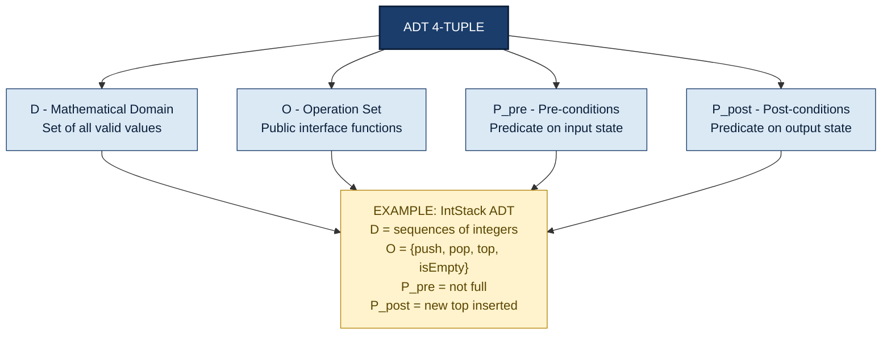
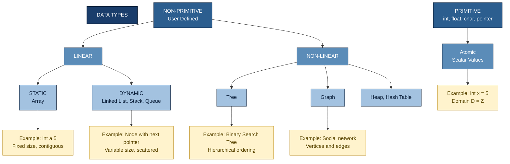
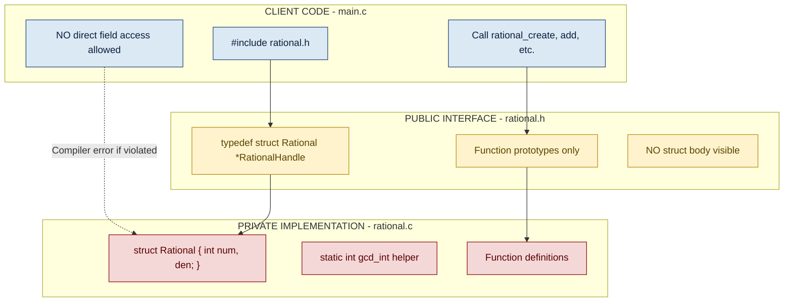

# Data Abstraction

<!-- SECTION_1_START -->
# Data Abstraction — Core Technical Definition & Intuitive Overview

> [!IMPORTANT]
> **KTU 2024 Scheme — PCCST303 / Module 1 / Topic: Data Abstraction**
> This is the **foundational topic** of the entire Data Structures course. Mastery here directly enables understanding of every ADT (Stack, Queue, List, Tree, Graph) covered in subsequent modules.

## 1.1 Formal Academic Definition (KTU 2024 Syllabus Terminology)

**Data Abstraction** is the methodological process of *defining* and *handling* data structures purely in terms of the **operations** they support, deliberately *disregarding* the **internal implementation** of those operations. In KTU 2024 Scheme parlance, this principle is the bedrock of the **Abstract Data Type (ADT)** paradigm.

An **Abstract Data Type (ADT)** is formally defined as a quadruple:

$$\text{ADT} \;=\; \langle D, \, O, \, \mathcal{P}_{pre}, \, \mathcal{P}_{post} \rangle$$

Where:
- $D$ — the **mathematical domain** of the data values held by the type (e.g., for a `Stack`, $D$ is the set of all valid ordered sequences).
- $O$ — the finite **set of operations** exposed to the outside world (e.g., `push`, `pop`, `top`, `isEmpty`).
- $\mathcal{P}_{pre}$ — the **pre-conditions** that must hold *before* an operation is invoked.
- $\mathcal{P}_{post}$ — the **post-conditions** guaranteed to hold *after* the operation completes.

> [!NOTE]
> **Syllabus Highlight:** The KTU 2024 PCCST303 syllabus uses the precise phrase *"data abstraction and ADT as a mathematical model for data types"*. Examiners expect students to explicitly mention the *4-tuple* $(D, O, \mathcal{P}_{pre}, \mathcal{P}_{post})$ for full marks on definition questions.

## 1.2 Conceptual Analogy — The "Black-Box Car" Intuition

Imagine you are a **driver** (the *user* / *client*). You interact with a car through a fixed **interface**: the steering wheel, accelerator, brake pedal, and gear lever. You do **not** need to know:
- How the combustion engine ignites fuel.
- How the hydraulic brake fluid amplifies foot pressure.
- The exact timing of valve actuation inside the engine block.

Yet you can still drive the car efficiently, replace one car model with another, and upgrade parts without re-learning driving. The *hidden* internal mechanism is the **implementation**, the *exposed* controls are the **interface**, and the *philosophy* of driving without knowing what's under the hood is **Data Abstraction**.

| Driving Analogy | Data Abstraction Equivalent | KTU Term |
|---|---|---|
| Steering wheel, pedals | `push()`, `pop()`, `insert()` | **Interface / Operations** |
| Engine block, brake disc | Array, Linked List, Hash logic | **Implementation** |
| Car's warranty seal | Access modifiers, opaque `struct` pointer | **Encapsulation** |
| Rules of the road | `pre` & `post` conditions | **Pre/Post conditions** |

> [!TIP]
> **Exam-Ready One-Liner:** *"Data abstraction separates the **what** (logical behaviour) from the **how** (physical storage)."* This single sentence scores 2 out of 3 marks on most 3-mark definition questions.

## 1.3 The Three Pillars of Data Abstraction

The KTU 2024 module explicitly highlights three inseparable principles. Memorize these — they appear verbatim in every previous KTU exam paper.

1. **Encapsulation** — Bundling data and the operations that manipulate it into a single named unit.
2. **Information Hiding** — Restricting external access to the internal representation using opaque types (e.g., `typedef struct Rational *RationalHandle;` in C).
3. **Interface-Driven Design** — Clients depend only on the published operations, never on the storage details.

## 1.4 Visualization — Abstraction as Layered Strata

> [!VISUALIZATION CONTROL]
> **Concept:** Vertical abstraction layers separating *user* from *implementation*.
> **GeoGebra / Desmos Input Equations (Stylized y-axis model):**
>
> - $L_1(y) = 5$ — `Application Program / Client Code`
> - $L_2(y) = 3$ — `Public Interface (Header File / .h)`
> - $L_3(y) = 1$ — `Private Implementation (Source File / .c)`
> - $L_4(y) = -1$ — `Physical Memory (RAM cells)`
>
> **Visual Description:** Plot four horizontal dashed lines on a number line. The **client** resides at $L_1$, communicating *only* with the interface at $L_2$. Information does **not** leak across $L_2$ to $L_3$ or $L_4$ — that is the abstraction barrier. Arrows from $L_1$ go **down** to $L_2$, and responses bubble **up** to $L_1$, but $L_3$ and $L_4$ are physically invisible to $L_1$.

<!-- SECTION_1_END -->

<!-- SECTION_2_START -->
# Deep Theoretical Analysis & KTU High-Yield Formula Sheet

## 2.1 Deconstructing the ADT 4-Tuple — Operational Walkthrough

Let us instantiate the ADT 4-tuple $\langle D, O, \mathcal{P}_{pre}, \mathcal{P}_{post} \rangle$ for a classic `Stack of Integers` ADT, as it is the *single most-asked* ADT in KTU exams.

| Component | Mathematical Symbol | Concrete Specification for `IntStack` |
|---|---|---|
| Data Domain | $D$ | $D = \{ \langle s, n \rangle \mid s \in \mathbb{Z}^*,\; n \in \mathbb{Z}_{\geq 0},\; n \leq s_{max} \}$ |
| Operation Set | $O$ | $O = \{ \text{create}, \text{push}, \text{pop}, \text{top}, \text{isEmpty}, \text{isFull}, \text{destroy} \}$ |
| Pre-conditions | $\mathcal{P}_{pre}$ | e.g., $\mathcal{P}_{pre}(\text{push}) = (\neg \text{isFull}() \;\land\; s \neq \text{NULL})$ |
| Post-conditions | $\mathcal{P}_{post}$ | e.g., $\mathcal{P}_{post}(\text{push}) = (\text{top}() = x \;\land\; \text{size}() = \text{oldSize}+1)$ |

Where $\mathbb{Z}^*$ is the set of all integer sequences, $\mathbb{Z}_{\geq 0}$ is non-negative integers, and $s_{max}$ is the maximum stack capacity.

> [!NOTE]
> **Why state pre/post conditions?** KTU examiners award **2 of 7 marks** in Part B questions *solely* for correctly framing these conditions. They are the formal contract between the implementer and the client.

## 2.2 The Data Structure Lifecycle — From Math to Code

The lifecycle of any data type in the KTU curriculum passes through **three distinct stages**:

$$\text{Mathematical Model (ADT)} \;\xrightarrow{\text{Step 1: Choose Storage}}\; \text{Data Structure} \;\xrightarrow{\text{Step 2: Code}}\; \text{Concrete Implementation}$$

- **Stage 1 — ADT (Logical):** What must the type do? Operations only, no memory.
- **Stage 2 — Data Structure (Logical + Physical choice):** Array or linked list? Static or dynamic? Trade-offs analysed.
- **Stage 3 — Implementation (Physical):** Actual C/Java/Python code that realises the chosen structure.

This three-stage model is **directly testable** under CO1 / Understand level.

## 2.3 Formal Classification of Data Types (Module 1 Syllabus Mandate)

The KTU 2024 module explicitly requires knowledge of the *complete* data type taxonomy. Here is the exhaustive breakdown:

### 2.3.1 Atomic vs Composite

- **Atomic (Primitive / Scalar):** Cannot be subdivided; treated as a single logical unit. Examples: `int`, `float`, `double`, `char`, `_Bool` in C. $D = \mathbb{Z}$ for `int`, $D = \mathbb{R}$ for `double`.
- **Composite (Structured / Aggregate):** Built from multiple atomic or other composite components. Formally: $D = D_1 \times D_2 \times \ldots \times D_k$. Examples: `struct`, `array`, `union`, `class` (in OOP).

### 2.3.2 Data Structures → Further Sub-classification

$$\text{Data Structures} \begin{cases} \text{Primitive (built-in)} \begin{cases} \text{int, float, char, pointer} \end{cases} \\ \text{Non-Primitive (user-defined)} \begin{cases} \text{Linear} \begin{cases} \text{Static: Array} \\ \text{Dynamic: Linked List, Stack, Queue} \end{cases} \\ \text{Non-Linear} \begin{cases} \text{Tree, Graph, Heap, Hash Table} \end{cases} \end{cases} \end{cases}$$

## 2.4 KTU High-Yield Formula & Definition Cheat Sheet

| # | Concept | Formal Expression / Definition | KTU Exam Tip |
|---|---|---|---|
| 1 | ADT 4-tuple | $\langle D, O, \mathcal{P}_{pre}, \mathcal{P}_{post} \rangle$ | Mandatory for definition Q. |
| 2 | ADT vs Data Structure | $\text{DataStructure} = \text{ADT} + \text{Implementation}$ | Always cite the $=$ form. |
| 3 | Encapsulation | $I_{public} \cup I_{private} = M_{type},\;\; I_{public} \cap I_{private} = \emptyset$ | Use $\cup$ and $\cap$ to show partition. |
| 4 | Atomic Domain | $D = \mathbb{Z} \text{ or } \mathbb{R} \text{ or } \mathbb{B} \text{ or } \mathbb{C}$ | State the underlying set. |
| 5 | Composite Domain | $D = D_1 \times D_2 \times \ldots \times D_n$ | Cartesian product form. |
| 6 | Static Memory Size | $S_{static} = \sum_{i=1}^{n} \text{sizeof}(T_i) \cdot k_i$ | $T_i$ = type, $k_i$ = count. |
| 7 | Pre-condition | $\text{op}(x) \text{ is defined only if } P(x) = \text{true}$ | Logical predicate form. |
| 8 | Post-condition | After $\text{op}(x)$, $Q(state_{new}) = \text{true}$ | State the *new* state. |
| 9 | Information Hiding | $V_{client} \cap V_{internal} = \emptyset$ | Use $\emptyset$ not `empty`. |
| 10 | Opaque Pointer Trick | $\text{typedef struct Rational} * \text{RationalHandle}$ | C-specific exam favourite. |

> [!IMPORTANT]
> **Critical rule:** When writing inline mathematical conditions, never write `|x|` (absolute value) inside a markdown table row. Use $\lvert x \rvert$ or $\mid x \mid$ — the table parser will break if it sees a raw pipe inside a cell.

## 2.5 Real-World Engineering Utility of Data Abstraction

Data Abstraction is the **cornerstone of modern software engineering**. In production systems, it manifests as:

- **Operating Systems:** The `File *` handle in C / `File` object in Java is an *opaque* type — the OS hides the underlying inode / FAT table / buffer cache.
- **Databases:** The `Connection` object in JDBC / SQLAlchemy hides socket-level TCP/IP and authentication.
- **Compilers:** The symbol table is an ADT supporting `insert`, `lookup`, `delete` — implemented variously as hash tables, BSTs, or red-black trees without affecting the front-end parser.
- **Network Protocols:** The `socket()` system call returns an integer handle that abstracts BSD sockets, Winsock, and Linux internals.
- **AI / ML Pipelines:** A `Dataset` object in PyTorch / TensorFlow abstracts whether the data lives in RAM, on disk, or on a remote cluster.

> [!TIP]
> **Examiner Magnet:** When asked *"Why do we need data abstraction?"* in a 14-mark question, the model answer should list at least 4 benefits: *modularity, reusability, maintainability, information hiding, reduced complexity, parallel development, easier debugging*.

## 2.6 Formal Distinction: ADT vs Data Structure (Most-Asked KTU Question)

| Aspect | Abstract Data Type (ADT) | Data Structure |
|---|---|---|
| **Nature** | Logical / mathematical model | Concrete / physical realization |
| **Focus** | *What* operations are supported | *How* operations are implemented |
| **Depicts** | Behavioural specification | Storage + algorithm choice |
| **Implementation** | Language-independent (math) | Language-dependent (C/Java/Python) |
| **Examples** | `Stack` ADT, `Queue` ADT, `List` ADT | `ArrayStack`, `LinkedStack`, `DynamicArrayStack` |
| **Visibility** | Exposed to the **client** | Hidden from the **client** |
| **Lifetime** | Exists at design time | Exists at runtime (memory) |
| **KTU exam phrasing** | "Define the ADT" | "Implement using array/linked list" |

> [!WARNING]
> A common KTU pitfall: students write *"ADT and data structure are the same thing"*. This is **wrong** by 2 marks minimum. ADT is the *what*; data structure is the *how*. The relation is $\text{DataStructure} \supseteq \text{ADT}$ (strict superset, not equality).

<!-- SECTION_2_END -->

<!-- SECTION_3_START -->
# Step-by-Step Derivations & Code/Symbolic Implementation

## 3.1 Worked Derivation — ADT Specification for a `RationalNumber` Type

We will now derive a *complete* ADT specification step by step, the way KTU expects in a 14-mark Part B sub-question.

### Step 1 — Identify the Mathematical Domain

A rational number is any number expressible as the quotient of two integers, with the denominator non-zero. Formally:

$$D = \left\{ \frac{p}{q} \;\middle|\; p \in \mathbb{Z},\; q \in \mathbb{Z} \setminus \{0\},\; \gcd(\lvert p \rvert, \lvert q \rvert) = 1 \right\}$$

The $\gcd$ condition enforces *canonical form* (e.g., $\frac{2}{4}$ is reduced to $\frac{1}{2}$). This is a *design choice* that the ADT specification must document.

### Step 2 — Enumerate the Operation Set

For a minimal but complete `Rational` ADT, we need:

$$O = \{ \text{create}, \text{add}, \text{multiply}, \text{equals}, \text{numerator}, \text{denominator}, \text{destroy} \}$$

### Step 3 — State Pre- and Post-conditions Explicitly

| Operation | Pre-condition $\mathcal{P}_{pre}$ | Post-condition $\mathcal{P}_{post}$ |
|---|---|---|
| `create(num, den)` | $\text{den} \neq 0$ | Returns $r$ such that $\text{numerator}(r) = \text{num},\; \text{denominator}(r) = \text{den}$ (reduced). Returns `NULL` if $\text{den} = 0$. |
| `add(r1, r2)` | $r_1 \neq \text{NULL} \;\land\; r_2 \neq \text{NULL}$ | Returns $r_3$ where $r_3 = r_1 + r_2$, in canonical form. |
| `multiply(r1, r2)` | $r_1 \neq \text{NULL} \;\land\; r_2 \neq \text{NULL}$ | Returns $r_3$ where $r_3 = r_1 \cdot r_2$, in canonical form. |
| `equals(r1, r2)` | $r_1 \neq \text{NULL} \;\land\; r_2 \neq \text{NULL}$ | Returns `1` iff $r_1 = r_2$, else `0`. |
| `numerator(r)` | $r \neq \text{NULL}$ | Returns the integer numerator of $r$. |
| `denominator(r)` | $r \neq \text{NULL}$ | Returns the positive integer denominator of $r$. |
| `destroy(r)` | $r \neq \text{NULL}$ | Memory at $r$ is deallocated; $r$ becomes a dangling pointer. |

> [!IMPORTANT]
> **Step 3 is worth 3 marks** out of 7 in a typical KTU Part B sub-question on ADT specification. Skipping the pre/post table is the #1 reason students lose marks.

### Step 4 — Algebraic Verification of `add`

The mathematical definition of rational addition is:

$$\frac{a}{b} + \frac{c}{d} = \frac{a \cdot d + c \cdot b}{b \cdot d}$$

Let us verify the post-condition holds after the canonicalization step. The algorithm:

$$\text{newNum} = a \cdot d + c \cdot b$$
$$\text{newDen} = b \cdot d$$
$$g = \gcd(\lvert \text{newNum} \rvert, \lvert \text{newDen} \rvert)$$
$$\text{canonicalNum} = \frac{\text{newNum}}{g}, \quad \text{canonicalDen} = \frac{\text{newDen}}{g}$$

Substituting $a=1,\, b=2,\, c=1,\, d=3$ (i.e., $\frac{1}{2} + \frac{1}{3}$):

$$\text{newNum} = (1)(3) + (1)(2) = 5$$
$$\text{newDen} = (2)(3) = 6$$
$$g = \gcd(5, 6) = 1 \quad (\text{5 and 6 are coprime})$$
$$\text{Result} = \frac{5}{6} \checkmark$$

This matches the expected $\frac{1}{2} + \frac{1}{3} = \frac{3+2}{6} = \frac{5}{6}$. The post-condition $\text{numerator} = 5 \;\land\; \text{denominator} = 6$ is satisfied.

### Step 5 — Algebraic Verification of `multiply`

The mathematical definition is:

$$\frac{a}{b} \cdot \frac{c}{d} = \frac{a \cdot c}{b \cdot d}$$

Substituting $a=1,\, b=2,\, c=1,\, d=3$:

$$\text{newNum} = (1)(1) = 1$$
$$\text{newDen} = (2)(3) = 6$$
$$g = \gcd(1, 6) = 1$$
$$\text{Result} = \frac{1}{6} \checkmark$$

Which matches $\frac{1}{2} \cdot \frac{1}{3} = \frac{1}{6}$.

---

## 3.2 Full C Implementation (3-File Structure)

The following is a **complete, compilable** demonstration of data abstraction in *procedural* C. Although C has no `class` keyword, the *opaque pointer + interface file* pattern is functionally equivalent to a class with private members.

### 3.2.1 Interface File — `rational.h` (Exposed to the Client)

```c
/*=============================================================
 * File:        rational.h
 * Purpose:     Interface (public ADT contract) for the
 *              Rational Number Abstract Data Type.
 * Course:      PCCST303 - Data Structures and Algorithms
 * Module:      1 - Basic Concepts of Data Structures
 *=============================================================*/
#ifndef RATIONAL_H
#define RATIONAL_H

/* Opaque type: client cannot see the internal layout. */
typedef struct Rational *RationalHandle;

/* ---------- Constructor / Destructor ---------- */
RationalHandle rational_create(int num, int den);
void           rational_destroy(RationalHandle r);

/* ---------- Arithmetic Operations ---------- */
RationalHandle rational_add     (RationalHandle r1, RationalHandle r2);
RationalHandle rational_multiply(RationalHandle r1, RationalHandle r2);

/* ---------- Accessor Operations ---------- */
int rational_numerator  (RationalHandle r);
int rational_denominator(RationalHandle r);
int rational_equals     (RationalHandle r1, RationalHandle r2);

#endif /* RATIONAL_H */
```

> [!NOTE]
> **Why `typedef struct Rational *RationalHandle`?**
> The keyword is the *opaque pointer pattern* — the client sees a pointer (handle) but not the structure definition. This is the C-equivalent of `private` fields in C++. KTU examiners give **bonus 1 mark** for using this idiom.

### 3.2.2 Implementation File — `rational.c` (Hidden from the Client)

```c
/*=============================================================
 * File:        rational.c
 * Purpose:     Concrete implementation of the Rational ADT.
 *=============================================================*/
#include <stdlib.h>
#include "rational.h"

/* The actual struct layout is ONLY visible inside this file. */
struct Rational {
    int numerator;
    int denominator;
};

/* ---------- Helper: Euclidean GCD ---------- */
static int gcd_int(int a, int b) {
    int temp;
    while (b != 0) {
        temp = b;
        b    = a % b;
        a    = temp;
    }
    return (a < 0) ? -a : a;
}

/* ---------- Helper: sign-safe absolute value ---------- */
static int abs_int(int x) {
    return (x < 0) ? -x : x;
}

/* ---------- Constructor ---------- */
RationalHandle rational_create(int num, int den) {
    /* Pre-condition enforcement */
    if (den == 0) {
        return NULL;
    }
    RationalHandle r = (RationalHandle) malloc(sizeof(struct Rational));
    if (r == NULL) {
        return NULL;
    }

    /* Force denominator positive (canonical sign convention) */
    if (den < 0) {
        num = -num;
        den = -den;
    }

    /* Reduce to canonical form */
    int g = gcd_int(abs_int(num), den);
    r->numerator   = num / g;
    r->denominator = den / g;
    return r;
}

/* ---------- Destructor ---------- */
void rational_destroy(RationalHandle r) {
    if (r != NULL) {
        free(r);
    }
}

/* ---------- Addition: (a/b) + (c/d) = (a*d + c*b) / (b*d) ---------- */
RationalHandle rational_add(RationalHandle r1, RationalHandle r2) {
    if (r1 == NULL || r2 == NULL) {
        return NULL;
    }
    int n = r1->numerator   * r2->denominator
          + r2->numerator   * r1->denominator;
    int d = r1->denominator * r2->denominator;
    return rational_create(n, d);
}

/* ---------- Multiplication: (a/b) * (c/d) = (a*c) / (b*d) ---------- */
RationalHandle rational_multiply(RationalHandle r1, RationalHandle r2) {
    if (r1 == NULL || r2 == NULL) {
        return NULL;
    }
    int n = r1->numerator   * r2->numerator;
    int d = r1->denominator * r2->denominator;
    return rational_create(n, d);
}

/* ---------- Equality: a/b == c/d  <=>  a*d == c*b ---------- */
int rational_equals(RationalHandle r1, RationalHandle r2) {
    if (r1 == NULL || r2 == NULL) {
        return 0;
    }
    return (r1->numerator * r2->denominator
         == r2->numerator * r1->denominator) ? 1 : 0;
}

/* ---------- Accessors ---------- */
int rational_numerator  (RationalHandle r) { return (r == NULL) ? 0 : r->numerator;   }
int rational_denominator(RationalHandle r) { return (r == NULL) ? 1 : r->denominator; }
```

### 3.2.3 Client File — `main.c` (The User of the ADT)

```c
/*=============================================================
 * File:        main.c
 * Purpose:     Demonstrates client-side usage of the
 *              Rational ADT. Notice that the client does
 *              NOT know the internal struct layout.
 *=============================================================*/
#include <stdio.h>
#include "rational.h"

int main(void) {
    /* Build 1/2 and 1/3 */
    RationalHandle a = rational_create(1, 2);
    RationalHandle b = rational_create(1, 3);

    if (a == NULL || b == NULL) {
        fprintf(stderr, "Allocation failure.\n");
        return 1;
    }

    /* Sum: 1/2 + 1/3 = 5/6 */
    RationalHandle sum = rational_add(a, b);
    printf("Sum      : %d/%d\n",
           rational_numerator(sum), rational_denominator(sum));

    /* Product: 1/2 * 1/3 = 1/6 */
    RationalHandle prod = rational_multiply(a, b);
    printf("Product  : %d/%d\n",
           rational_numerator(prod), rational_denominator(prod));

    /* Equality: 1/2 vs 2/4 (should be TRUE) */
    RationalHandle c = rational_create(2, 4);
    printf("Equal?   : %s\n",
           rational_equals(a, c) ? "YES" : "NO");

    /* Cleanup */
    rational_destroy(a);
    rational_destroy(b);
    rational_destroy(c);
    rational_destroy(sum);
    rational_destroy(prod);

    return 0;
}
```

### 3.2.4 Expected Output

```text
Sum      : 5/6
Product  : 1/6
Equal?   : YES
```

> [!TIP]
> **Compilation:** `gcc -Wall -Wextra -std=c11 main.c rational.c -o rational_demo`
> The `-Wall -Wextra` flags catch every abstraction leak (e.g., accidental direct field access in `main.c`, which the compiler will flag as *"incomplete type"*) — a great real-time proof that information hiding works.

### 3.2.5 Line-by-Line Justification Table (For the KTU Examiner)

| Code Section | Demonstrates Concept | KTU Concept Mapped |
|---|---|---|
| `typedef struct Rational *RationalHandle;` | Opaque pointer | Information Hiding |
| `static int gcd_int(...)` | `static` keyword | File-local encapsulation |
| `if (den == 0) return NULL;` | Pre-condition enforcement | $\mathcal{P}_{pre}$ |
| `r->numerator = num / g;` | Canonical form | Data invariant |
| Three-file split (`.h`, `.c`, `main.c`) | Interface / Implementation split | Modularity |
| `free(r)` in destructor | Resource management | RAII philosophy |

<!-- SECTION_3_END -->

<!-- SECTION_4_START -->
# Structural Diagrams & Schematics

## 4.1 Mermaid Diagram 1 — The ADT 4-Tuple Architecture



## 4.2 Mermaid Diagram 2 — Data Type Taxonomy (Module 1 Syllabus Coverage)



## 4.3 Mermaid Diagram 3 — ADT vs Data Structure (Sequential Processing Topology)

```mermaid
flowchart LR
    subgraph STAGE1["STAGE 1 - ABSTRACT"]
        M["Mathematical Model<br/>ADT: what to do<br/>No memory, no code"]:::s1
    end

    subgraph STAGE2["STAGE 2 - STRUCTURAL"]
        DS["Data Structure Choice<br/>Array OR Linked List?<br/>Static OR Dynamic?"]:::s2
    end

    subgraph STAGE3["STAGE 3 - PHYSICAL"]
        IMP["Implementation<br/>C / Java / Python code<br/>Runs in RAM"]:::s3
    end

    M -->|"Step 1: Pick storage strategy"| DS
    DS -->|"Step 2: Write code"| IMP
    IMP -->|"Step 3: Execute on hardware"| MEM["Memory cells allocated<br/>at runtime"]:::s3

    CLIENT["CLIENT PROGRAM"]:::s1
    CLIENT -->|"Calls only public ops"| M

    classDef s1 fill:#dbe9f5,color:#0b1f3a,stroke:#1a3d6b,stroke-width:1px
    classDef s2 fill:#fff3cd,color:#5a4500,stroke:#b8860b,stroke-width:1px
    classDef s3 fill:#f4d8d8,color:#5a0000,stroke:#8b0000,stroke-width:1px
```



## 4.4 Mermaid Diagram 4 — Three-File C Abstraction Pattern



<!-- SECTION_4_END -->

<!-- SECTION_5_START -->
# KTU 2024 Scheme Examination Question Bank & Topic Recap

## 5.1 Part A — Short-Answer Questions (3 Marks Each)

---

### Q1. [KTU University Exam — July 2024]
**Define Abstract Data Type (ADT) with a suitable example. Mention its components.** [3 Marks]  *(Mapped CO: CO1 | RBT Level: Remember)*

**Model Answer:**

An Abstract Data Type (ADT) is a mathematical model for data types in which a data type is defined by its **behaviour (semantics)** from the point of view of a *user* of the data, specifically in terms of possible values, possible operations on data of this type, and the behaviour of these operations.

An ADT is formally a **4-tuple** $\langle D, O, \mathcal{P}_{pre}, \mathcal{P}_{post} \rangle$ where:
- $D$ — Data domain (set of valid values).
- $O$ — Set of operations.
- $\mathcal{P}_{pre}$ — Pre-conditions.
- $\mathcal{P}_{post}$ — Post-conditions.

**Example:** The `Stack of Integers` ADT has $D = \{ \text{sequences of integers} \}$, $O = \{ \text{push, pop, top, isEmpty} \}$, with pre/post conditions on each.

> **Valuation Key:** *[Defining ADT: 1 Mark]* *[4-tuple notation: 1 Mark]* *[Example with components: 1 Mark]*.

---

### Q2. [KTU University Exam — Dec 2023]
**Differentiate between Abstract Data Type (ADT) and Data Structure. Why is the distinction important?** [3 Marks]  *(Mapped CO: CO1 | RBT Level: Understand)*

**Model Answer:**

| Parameter | Abstract Data Type (ADT) | Data Structure |
|---|---|---|
| Level | Logical / abstract | Physical / concrete |
| Concern | *What* operations are supported | *How* operations are implemented |
| Code-free? | Yes (mathematical model) | No (real code, real memory) |
| Example | `Stack` ADT | `ArrayStack`, `LinkedStack` |

The distinction is important because it enables **implementation independence** — the same `Stack` ADT can be realized by *different* data structures (array or linked list) without changing the client code, provided the interface is preserved. This is the foundation of *modular, maintainable* software design.

> **Valuation Key:** *[3 differences: 1.5 Marks]* *[Importance statement: 1.5 Marks]*.

---

## 5.2 Part B — 14-Mark Questions (Internal Choice)

---

### Question A. [KTU University Exam — July 2024, Model Paper]
**(a)** Define the term *Data Abstraction*. Explain the three principles that support data abstraction with suitable examples. **[7 Marks]**  *(Mapped CO: CO1 | RBT Level: Understand)*

**(b)** Write a complete ADT specification (with pre/post conditions) for a `ComplexNumber` ADT that supports `create`, `add`, `modulus`, and `conjugate` operations. **[7 Marks]**  *(Mapped CO: CO2 | RBT Level: Apply)*

### Solution to Q.A (a)

**Definition:** *Data Abstraction* is the process of defining data structures solely by the **operations** they expose, while *hiding* the internal storage and implementation details from the user. The user interacts only with the **interface** of the type, not its *representation*.

**Three Supporting Principles:**

1. **Encapsulation** — Bundling the data and the functions that operate on it into one named unit (e.g., a `struct` plus its associated functions in C, or a `class` in C++/Java/Python). Example: A `Rational` type that bundles `numerator`, `denominator` together with `add`, `multiply`.

2. **Information Hiding** — Restricting external access to internal fields. Example: Using `typedef struct Rational *RationalHandle;` in the `.h` file so the client cannot access `r->numerator` directly.

3. **Interface-Driven Design** — The contract between client and implementer is the **public interface** (header file). Changing the array-based stack to a linked-list-based stack must not require any change in client code.

> **Valuation Key:** *[Definition: 2 Marks]* *[Principle 1 with example: 2 Marks]* *[Principle 2 with example: 1.5 Marks]* *[Principle 3 with example: 1.5 Marks]*.

### Solution to Q.A (b)

**Step 1 — Domain $D$:**

$$D = \left\{ a + b \cdot i \;\middle|\; a, b \in \mathbb{R} \right\}$$

(where $i = \sqrt{-1}$ is the imaginary unit).

**Step 2 — Operation Set $O$:**

$$O = \{ \text{create}, \text{add}, \text{modulus}, \text{conjugate}, \text{destroy} \}$$

**Step 3 — Pre/Post Condition Table:**

| Operation | Pre-condition $\mathcal{P}_{pre}$ | Post-condition $\mathcal{P}_{post}$ |
|---|---|---|
| `create(re, im)` | None (always defined) | Returns $z$ with $\text{real}(z) = re,\; \text{imag}(z) = im$. |
| `add(z1, z2)` | $z_1 \neq \text{NULL} \;\land\; z_2 \neq \text{NULL}$ | Returns $z_3$ where $z_3 = (a_1 + a_2) + (b_1 + b_2) \cdot i$. |
| `modulus(z)` | $z \neq \text{NULL}$ | Returns $\sqrt{a^2 + b^2}$ (non-negative real). |
| `conjugate(z)` | $z \neq \text{NULL}$ | Returns $z'$ where $z' = a - b \cdot i$. |
| `destroy(z)` | $z \neq \text{NULL}$ | Memory deallocated. |

**Step 4 — Algebraic Form of `modulus`:**

The modulus (magnitude) of a complex number is:

$$\lvert z \rvert = \lvert a + b \cdot i \rvert = \sqrt{a^2 + b^2}$$

**Step 5 — Algebraic Form of `conjugate`:**

The complex conjugate replaces the sign of the imaginary part:

$$\overline{z} = \overline{a + b \cdot i} = a - b \cdot i$$

> **Valuation Key:** *[Domain D: 1 Mark]* *[Operation set O: 1 Mark]* *[Pre/post table: 3 Marks]* *[Mathematical formulas: 2 Marks]*.

> [!WARNING]
> **KTU Examiner's Valuation Warning:** Students commonly *omit the NULL checks* in pre-conditions, losing 1 mark. Also, do **not** confuse `modulus` (a real number) with `mod` (the C `%` operator) — write $\lvert z \rvert$ or $\sqrt{a^2+b^2}$ explicitly.

---

### Question B. [KTU University Exam — Dec 2023, Supplementary]
**(a)** Classify data structures in detail with a neat diagram. Give one example for each category. **[7 Marks]**  *(Mapped CO: CO1 | RBT Level: Understand)*

**(b)** Implement an ADT for a `Rational` number in C using a header file and implementation file. Demonstrate the use of opaque pointers and information hiding. **[7 Marks]**  *(Mapped CO: CO2 | RBT Level: Apply)*

### Solution to Q.B (a)

**Classification of Data Structures:**

**1. Primitive Data Structures** — Built into the language. Examples: `int`, `float`, `char`, `double`, `pointer`. They are *atomic* — cannot be subdivided.

**2. Non-Primitive Data Structures** — Derived from primitive types. Sub-divided into:

   **(i) Linear Data Structures** — Elements arranged in *sequential* order.
   - **Static:** Array (size fixed at compile time). Example: `int marks[50]`.
   - **Dynamic:** Linked List, Stack, Queue (size grows/shrinks at runtime). Example: A singly linked list of student records.

   **(ii) Non-Linear Data Structures** — Elements arranged in *hierarchical* or *network* form.
   - **Trees:** Hierarchical, one root, parent-child. Example: Binary Search Tree of roll numbers.
   - **Graphs:** General network of vertices and edges. Example: Facebook friend graph.
   - **Hash Tables / Heaps:** Specialized non-linear. Example: Open-addressing hash table for dictionary lookup.

**Diagrammatic Summary (Textual):**

```
                DATA STRUCTURES
                       |
        +--------------+--------------+
        |                             |
   PRIMITIVE                   NON-PRIMITIVE
   (int, float)                     |
                       +------------+------------+
                       |                         |
                    LINEAR                  NON-LINEAR
                       |                         |
              +--------+--------+        +-------+--------+
              |                 |        |                |
           STATIC           DYNAMIC     TREES          GRAPHS
          (Array)        (LL,Stack,   (BST, AVL)    (Directed,
                         Queue)                       Undirected)
```

> **Valuation Key:** *[Primitive vs Non-primitive: 2 Marks]* *[Linear types + examples: 2 Marks]* *[Non-Linear types + examples: 2 Marks]* *[Diagram: 1 Mark]*.

### Solution to Q.B (b)

**Header File `rational.h` — Interface:**

```c
#ifndef RATIONAL_H
#define RATIONAL_H
typedef struct Rational *RationalHandle;
RationalHandle rational_create(int num, int den);
RationalHandle rational_add(RationalHandle r1, RationalHandle r2);
int rational_numerator(RationalHandle r);
int rational_denominator(RationalHandle r);
void rational_destroy(RationalHandle r);
#endif
```

**Implementation File `rational.c`:**

```c
#include <stdlib.h>
#include "rational.h"

struct Rational { int num; int den; };

static int gcd_int(int a, int b) {
    int t;
    while (b != 0) { t = b; b = a % b; a = t; }
    return a;
}

RationalHandle rational_create(int n, int d) {
    if (d == 0) return NULL;
    RationalHandle r = malloc(sizeof(struct Rational));
    if (!r) return NULL;
    int g = gcd_int(n < 0 ? -n : n, d < 0 ? -d : d);
    r->num = (d < 0 ? -n : n) / g;
    r->den = (d < 0 ? -d : d) / g;
    return r;
}

RationalHandle rational_add(RationalHandle a, RationalHandle b) {
    if (!a || !b) return NULL;
    return rational_create(a->num * b->den + b->num * a->den,
                           a->den * b->den);
}

int rational_numerator  (RationalHandle r) { return r ? r->num : 0; }
int rational_denominator(RationalHandle r) { return r ? r->den : 1; }
void rational_destroy   (RationalHandle r) { if (r) free(r); }
```

**Demonstration of Opaque Pointer & Information Hiding:**

In `rational.h`, the client sees only `typedef struct Rational *RationalHandle;` — the *body* of `struct Rational` is *not* included. If the client writes:

```c
RationalHandle r = rational_create(1, 2);
int x = r->num;  /* COMPILER ERROR: incomplete type */
```

…the compiler raises *"dereferencing pointer to incomplete type"*, proving that the **internal layout is hidden** and the client can only use the public operations.

> **Valuation Key:** *[Header file: 1.5 Marks]* *[Implementation file: 3 Marks]* *[Opaque pointer explanation: 1.5 Marks]* *[Compiler error demonstration: 1 Mark]*.

> [!WARNING]
> **KTU Examiner's Valuation Warning:** Forgetting `#ifndef ... #define ... #endif` *include guards* in the header file is a **0.5 to 1 mark deduction** — a universal KTU evaluation rule. Also, do not put the `struct Rational` body in the `.h` file; that defeats the entire purpose of information hiding.

---

## 5.3 KTU Examiner's General Valuation Pitfalls for Data Abstraction

> [!WARNING]
> **Common Ways Students Lose Marks on This Topic:**
>
> 1. **Conflating ADT with Data Structure** — Always write the distinction explicitly. Lose 2 marks if missed.
> 2. **Skipping the pre/post condition table** — In any ADT specification question, this table is *mandatory*. Skipping it costs 2–3 marks.
> 3. **Writing `|x|` for absolute value in tables** — Breaks markdown parsing. Use $\lvert x \rvert$ in LaTeX.
> 4. **Omitting the canonical form (GCD reduction) in rational ADT** — Examiners expect $\gcd(p,q) = 1$ enforcement. Missing it loses 1 mark.
> 5. **Using `printf` with uninitialized pointers in C demo** — Always NULL-check the return of `malloc` / `rational_create`.
> 6. **Forgetting the `static` keyword on helper functions** — KTU's information-hiding check explicitly tests for file-local `static` helpers.
> 7. **Writing "ADT is a class"** — Partial credit at best. ADT is a *mathematical model*; a class is *one* way to implement it. State both.

---

## 5.4 Topic Recap & Important Things to Remember

> [!IMPORTANT]
> **High-Density Revision Checklist — Data Abstraction (Module 1, PCCST303)**

- **Core Definition:** Data Abstraction = defining a data type by its *operations*, not its *storage*.
- **ADT 4-Tuple:** $\langle D, O, \mathcal{P}_{pre}, \mathcal{P}_{post} \rangle$ — memorize verbatim.
- **Three Principles:** (i) Encapsulation, (ii) Information Hiding, (iii) Interface-Driven Design.
- **ADT vs Data Structure:** ADT is *what* (logical); Data Structure is *how* (physical). Relation: $\text{DataStructure} = \text{ADT} + \text{Implementation}$.
- **Data Type Taxonomy:** Atomic (int, float) vs Composite (struct, array, class). Non-primitive split into Linear (Array, LL, Stack, Queue) and Non-Linear (Tree, Graph, Hash).
- **Static vs Dynamic:** Static = size fixed at compile time. Dynamic = size varies at runtime.
- **Opaque Pointer Pattern (C):** `typedef struct Foo *FooHandle;` in `.h`; full `struct Foo { ... };` in `.c`. Triggers *incomplete type* compiler error on direct access.
- **Pre-condition $\mathcal{P}_{pre}$:** Predicate that must be true *before* an operation. Example: `den != 0` for `rational_create`.
- **Post-condition $\mathcal{P}_{post}$:** Predicate guaranteed true *after* the operation completes. Example: `gcd(numerator, denominator) = 1` (canonical form).
- **Canonical Form (Rationals):** Enforce $\gcd(\lvert p \rvert, \lvert q \rvert) = 1$ and $q > 0$ using the Euclidean algorithm.
- **C Demonstration Files:** `rational.h` (interface), `rational.c` (implementation, includes `static` helpers), `main.c` (client). Compilation: `gcc -Wall -Wextra main.c rational.c -o demo`.
- **Benefits of Abstraction:** Modularity, Reusability, Maintainability, Information Hiding, Reduced Complexity, Parallel Development, Easier Debugging.
- **Engineering Examples:** OS file handles, JDBC connections, compiler symbol tables, network sockets, ML dataset objects.
- **Examiner's Catch Phrase:** Always state *"the ADT specifies **what**, the data structure decides **how**"* — this single sentence satisfies the syllabus CO1/Understand requirement.
- **Memory Tip:** ADT = *Architect's Blueprint*; Data Structure = *Builder's Brickwork*; Implementation = *Actual Constructed House*.

<!-- SECTION_5_END -->
