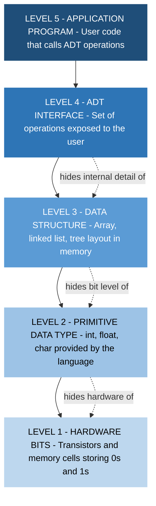
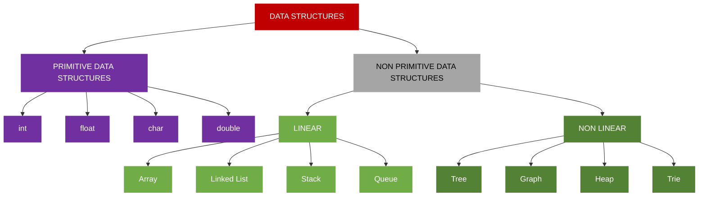
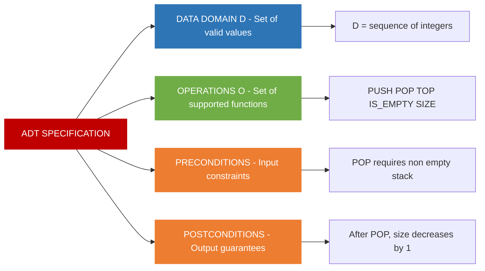

# Definitions and Data Abstraction

<!-- SECTION_1_START -->

# Definitions and Data Abstraction

## 1.1 Core Technical Definition

**Data Structure** is a specialized format for organizing, processing, retrieving, and storing data in memory so that it can be accessed and worked with in efficient ways. In the KTU 2024 Scheme syllabus, a data structure is defined as a *named location that can be used to store and organize data*, along with a *set of operations that can be performed on that data*.

**Data Abstraction** is the process of *hiding the internal implementation details* of a data structure and exposing only the *essential features* (i.e., the operations and their behavior) to the outside world. It allows programmers to work with data through a well-defined interface without worrying about how the data is stored or manipulated internally.

**Abstract Data Type (ADT)** is a theoretical concept in computer science that defines a data type purely by its *behavior* (semantics) from the point of view of a *user*, specifically in terms of possible values, possible operations on data of this type, and the behavior of these operations. An ADT does not specify *how* the data is stored in memory; it only specifies *what* operations are supported.

**Data Type** is a classification that specifies which type of value a variable can hold and what operations can be performed on it. Data types are broadly classified into:

- **Primitive Data Types**: Basic types provided by the language itself (e.g., `int`, `float`, `char`, `double`).
- **Non-Primitive (User-Defined) Data Types**: Types derived from primitive types (e.g., arrays, structures, lists, stacks, queues, trees, graphs).

> [!IMPORTANT]
> **KTU 2024 Syllabus Highlight:** A clear distinction must be maintained between **Data Type** (a language-level concept), **Data Structure** (the actual storage mechanism in memory), and **Abstract Data Type (ADT)** (the mathematical/logical specification). Examiners frequently test this distinction.

> [!NOTE]
> **Hierarchical Relationship:**
> **Data → Data Type → Data Structure → ADT**
> Data is the raw fact; a *Data Type* classifies it; a *Data Structure* is the concrete storage layout; an *ADT* is the contractual specification of behavior that any implementation of the data structure must honor.

---

## 1.2 Conceptual Analogy / Intuitive Overview

**Analogy 1 — The Television Remote Control (for Data Abstraction):**
Think of a **Television (TV)**. You interact with it using a **Remote Control**. The remote control exposes a small set of buttons — *Power, Volume Up/Down, Channel Up/Down*. You (the *user*) do **not** need to know how the TV internally processes IR signals, decodes them, modulates the power supply, or drives the LCD panel. You only need to know: *"If I press Volume Up, the sound gets louder."*
This is **Data Abstraction** — the remote is the **interface**, the TV's internals are the **hidden implementation**.

**Analogy 2 — The Office Filing Cabinet (for Data Structure):**
A **Filing Cabinet** stores folders. The way you arrange the folders — *alphabetically, by date, by department, or with a hash-indexed color tag* — is your **Data Structure**. The cabinet's drawers, partitions, and tags are *implementation details*. What matters to a manager is: *"Can I retrieve the file of 'Mr. KTU' in less than a second?"* — this is the **ADT contract**.

**Analogy 3 — Mathematical Set (for ADT):**
Consider the set of integers $\mathbb{Z} = \{\ldots, -2, -1, 0, 1, 2, \ldots\}$. You can describe the operations *add*, *subtract*, *multiply* on this set, and the rules they obey (closure, associativity, identity), **without** describing how integers are stored in a computer's silicon (two's complement, big-integer arrays, etc.). This set of operations + rules is the **ADT** of an integer.

> [!TIP]
> **Quick Memory Trick:** If you can *describe* the operations on a data type without drawing a memory diagram, you are talking about an **ADT**. The moment you draw a contiguous array or a pointer-linked node, you have moved from ADT to **Data Structure (Implementation)**.

---

## 1.3 Standard Metrics and Notations

Let the following be the standard symbols used throughout this module:

- $D$ — A set of *data elements* (the domain)
- $O = \{o_1, o_2, \ldots, o_n\}$ — The set of *operations* defined on $D$
- $P$ — The set of *preconditions* (input constraints) for each operation
- $Q$ — The set of *postconditions* (output guarantees) for each operation
- $S$ — The *state* of the abstract object (the values of all internal data members)

An ADT is formally the tuple:

$$
\text{ADT} = \langle D, O, P, Q \rangle
$$

> [!VISUALIZATION CONTROL]
> **Concept:** Layered Model of Data Abstraction (Stack of Conceptual Bands)
> **GeoGebra / Desmos Input Equations:**
> * `y = 5` → Label: `Application Program`
> * `y = 4` → Label: `ADT Interface (Operations)`
> * `y = 3` → Label: `Logical Data Structure (e.g., Tree, List)`
> * `y = 2` → Label: `Physical Storage (Array, Linked Nodes)`
> * `y = 1` → Label: `Hardware / Memory Bits`
> **Visual Description:** A student should see five horizontal stacked bands. Each band hides the complexity of the band below it. A program written at the top band needs to know **nothing** about the bottom band. This visualizes the *hiding levels* principle of data abstraction.

---

<!-- SECTION_1_END -->

<!-- SECTION_2_START -->

# Deep Theoretical Analysis

## 2.1 The Triad: Data Type, Data Structure, and ADT

These three terms are often confused by students. The KTU 2024 syllabus treats them as a **progressive hierarchy** of abstraction.

### 2.1.1 Data Type

A *Data Type* is a language-level classification. Every programming language (C, C++, Java, Python) provides a set of built-in *primitive* data types. A *Data Type* answers two questions:

1. What **values** can a variable of this type hold?
2. What **operations** are allowed on those values?

For example, in C, the data type `int` accepts values in the range $[-2^{31}, 2^{31} - 1]$ (typically) and supports operations such as `+`, `-`, `*`, `/`, `%`.

### 2.1.2 Data Structure

A *Data Structure* is the **concrete storage representation** in memory plus the **algorithms** that operate on that representation. It is the *implementation* of a data type's storage. Examples include:

- **Array** — Contiguous memory block with index-based access.
- **Linked List** — Non-contiguous memory, accessed via pointer chains.
- **Binary Search Tree (BST)** — Hierarchical structure with ordering property.
- **Hash Table** — Key-to-index mapping via a hash function.

### 2.1.3 Abstract Data Type (ADT)

An *ADT* is the **logical specification** of a data type — a black box that defines *what* the data type does, but not *how*. It consists of:

1. **Data** — The conceptual model of values.
2. **Operations** — A list of supported operations with their signatures.
3. **Axioms / Preconditions / Postconditions** — Formal rules governing behavior.

**Example:** The ADT *Stack* specifies the operations $PUSH(item)$, $POP()$, $TOP()$, $IS\_EMPTY()$ and rules such as *"POP on an empty stack raises an UnderflowError"*. It does **not** say whether the stack is implemented as an array or a linked list — that is the choice of the *Data Structure*.

---

## 2.2 Levels of Data Abstraction

Data abstraction is implemented at **four levels**, moving from concrete to abstract:

| Level | Name | Visibility | Description |
|:------|:-----|:-----------|:------------|
| 1 | **Bit / Hardware Level** | Hidden from all software | Physical 0s and 1s in transistors, capacitors, and memory cells. |
| 2 | **Primitive Data Type** | Exposed to programmer | The language's built-in types like `int`, `float`, `char`. Storage is implicit. |
| 3 | **Structured Data Type (Data Structure)** | Exposed via syntax | The user uses *arrays, structures, pointers* explicitly. |
| 4 | **Abstract Data Type** | Exposed only as interface | The user sees a *set of operations* but the storage layout is hidden. |

> [!IMPORTANT]
> **Engineering Utility:** In production-grade systems (e.g., the Java Collections Framework, C++ STL, Python's `collections` module), every container is presented to the user as an **ADT**. The internal *Data Structure* (whether `ArrayList` uses a dynamic array or `LinkedList` uses doubly-linked nodes) is hidden behind a uniform interface. This enables **plug-and-play substitution** of one implementation for another without rewriting the application code.

---

## 2.3 Classification of Data Structures

Data structures are classified along two primary axes:

### Axis 1: Primitive vs Non-Primitive

- **Primitive Data Structures:** `int`, `float`, `char`, `double`, `pointer` — atomic, language-supported.
- **Non-Primitive Data Structures:** Derived from primitives. Further split into:
  - **Linear:** Array, Linked List, Stack, Queue.
  - **Non-Linear:** Tree, Graph, Heap, Trie.

### Axis 2: Static vs Dynamic

- **Static Data Structures:** Fixed size determined at compile time (e.g., C-style arrays). Memory allocated on the **stack** or in the **data segment**.
- **Dynamic Data Structures:** Size can grow or shrink at runtime (e.g., linked lists, dynamic arrays, hash tables). Memory allocated on the **heap**.

### Axis 3: Homogeneous vs Heterogeneous

- **Homogeneous:** All elements are of the same type (e.g., an `int` array).
- **Heterogeneous:** Elements may be of differing types (e.g., a C `struct`, a Python `tuple`).

---

## 2.4 KTU High-Yield Formula Sheet / Cheat Sheet

| Symbol / Term | Definition | Context of Use |
|:--------------|:-----------|:---------------|
| $\mathcal{A}$ | An Abstract Data Type | Logical specification only |
| $\mathcal{S}$ | A Data Structure | Concrete memory layout + algorithms |
| $\mathcal{T}$ | A Data Type | Language-level classification |
| $D$ | Set of all valid data values (domain) | Inside ADT tuple |
| $O = \{o_1, \ldots, o_n\}$ | Set of operations on $D$ | Inside ADT tuple |
| $\text{pre}(o_i)$ | Precondition of operation $o_i$ | Must hold *before* $o_i$ executes |
| $\text{post}(o_i)$ | Postcondition of operation $o_i$ | Must hold *after* $o_i$ executes |
| $n$ | Number of elements currently stored | Used in complexity analysis |
| $T(n)$ | Time complexity of an operation as a function of $n$ | Big-O, Big-$\Theta$, Big-$\Omega$ analysis |
| $S(n)$ | Space complexity (auxiliary memory) | Excluding input storage |
| $L_1, L_2, L_3, L_4$ | The four levels of data abstraction | From bit (1) to ADT (4) |
| $\text{Encapsulation}$ | Bundling data + operations into a single unit | Implementation-level support for ADT |
| $\text{Information Hiding}$ | Restricting access to internal representation | Principle behind ADT |

> [!NOTE]
> **Rule of Pipe Symbols:** All absolute-value and set-membership symbols in the formulas above (e.g., $\vert D \vert$, $\vert O \vert$) are written using LaTeX commands `\vert` or `\mid` to prevent breaking markdown table syntax.

---

## 2.5 Real-World Engineering Utility

The ADT principle is the foundation of **modern software engineering**. Every time you write `my_list.append(x)` in Python, you are using the **List ADT** — Python does not require you to know whether the underlying storage is a dynamic C array, a linked list, or a hybrid. This enables:

- **Code Reusability:** A single ADT can have multiple implementations.
- **Maintainability:** Internal implementation can be changed without affecting client code.
- **Parallel Development:** Teams can agree on the ADT contract first, then implement independently.
- **Formal Verification:** ADTs are amenable to axiomatic correctness proofs (Hoare logic).
- **Standardization:** Industry libraries (STL, JDK Collections, .NET BCL) are designed as ADTs.

> [!TIP]
> **Industry Mapping:** In Java, `java.util.List` is an *interface* (the ADT). `ArrayList` and `LinkedList` are *concrete classes* (the Data Structures). This is a textbook example of ADT-Data-Structure separation in production code.

---

<!-- SECTION_2_END -->

<!-- SECTION_3_START -->

# Step-by-Step Derivations, Symbolic Proofs, and Code Implementation

## 3.1 Formal Derivation of the ADT Tuple

**Step 1 — Start with the notion of a data value.**
Let $v$ denote a single data value drawn from a universe $U$ of all possible values. The *valid* values for our type form a subset $D \subseteq U$.

$$
D \subseteq U
$$

> *Comment:* This states that the type's domain $D$ is a constrained subset of the universe of all possible values.

**Step 2 — Define the operations.**
Each operation $o_i$ is a function that maps a state and arguments to a new state and a return value:

$$
o_i : S \times \text{Args}_i \rightarrow S \times \text{Return}_i
$$

> *Comment:* An operation reads the *current state* $S$ and the *input arguments* $\text{Args}_i$, and produces a *new state* $S'$ and a *return value*.

**Step 3 — Define preconditions.**
For each $o_i$, the precondition $\text{pre}(o_i)$ is a predicate over the current state and arguments:

$$
\text{pre}(o_i) : S \times \text{Args}_i \rightarrow \{\text{True}, \text{False}\}
$$

> *Comment:* If the precondition is False, the operation's behavior is *undefined* (it may raise an exception, abort, or return garbage).

**Step 4 — Define postconditions.**
The postcondition $\text{post}(o_i)$ is a predicate over the pre-state, the arguments, the post-state, and the return value:

$$
\text{post}(o_i) : S_{\text{pre}} \times \text{Args}_i \times S_{\text{post}} \times \text{Return}_i \rightarrow \{\text{True}, \text{False}\}
$$

> *Comment:* If the precondition was True before $o_i$ ran, then after $o_i$ completes, $\text{post}(o_i)$ must be True.

**Step 5 — Bundle the components into the ADT tuple.**

$$
\boxed{\;\text{ADT} = \langle D, \;\{o_1, o_2, \ldots, o_n\},\; \{\text{pre}(o_i), \text{post}(o_i)\}_{i=1}^{n}\rangle\;}
$$

> *Comment:* This five-element tuple is the *complete* formal definition of any ADT. A Stack, a Queue, a Tree, a Graph, a Dictionary — all are instances of this tuple with different instantiations of $D$, $O$, $P$, and $Q$.

---

## 3.2 Worked Example: ADT Specification for a Stack

Following the formalism above, derive the ADT tuple for a **Stack of Integers**.

**Step 1 — Define the domain.**

$$
D_{\text{stack}} = \{(d_1, d_2, \ldots, d_k) \mid k \geq 0,\; d_j \in \mathbb{Z} \text{ for all } j\}
$$

> *Comment:* A stack of integers is a finite sequence of integers, possibly empty ($k = 0$).

**Step 2 — Define the operations and their signatures.**

$$
\begin{aligned}
\text{PUSH}&: D_{\text{stack}} \times \mathbb{Z} \rightarrow D_{\text{stack}} \\
\text{POP}&: D_{\text{stack}} \rightarrow D_{\text{stack}} \\
\text{TOP}&: D_{\text{stack}} \rightarrow \mathbb{Z} \\
\text{IS\_EMPTY}&: D_{\text{stack}} \rightarrow \{\text{True}, \text{False}\} \\
\text{SIZE}&: D_{\text{stack}} \rightarrow \mathbb{N}_0
\end{aligned}
$$

> *Comment:* PUSH adds an integer to the top; POP removes the topmost integer; TOP returns (without removing) the topmost integer; IS_EMPTY checks emptiness; SIZE returns the count.

**Step 3 — Define the preconditions.**

$$
\begin{aligned}
\text{pre}(\text{POP}(S)) &\equiv S \neq \varepsilon \\
\text{pre}(\text{TOP}(S)) &\equiv S \neq \varepsilon
\end{aligned}
$$

where $\varepsilon$ denotes the empty stack.

> *Comment:* POP and TOP are only defined on non-empty stacks. Attempting them on an empty stack violates the precondition.

**Step 4 — Define the postconditions.**

$$
\begin{aligned}
\text{post}(\text{PUSH}(S, x), S') &\equiv S' = S \cdot x \quad \text{(x appended at the end of the sequence)} \\
\text{post}(\text{POP}(S), S') &\equiv S' = S[1 \ldots \vert S \vert - 1] \\
\text{post}(\text{TOP}(S), r) &\equiv r = S[\vert S \vert] \\
\text{post}(\text{IS\_EMPTY}(S), r) &\equiv r = (\vert S \vert = 0) \\
\text{post}(\text{SIZE}(S), r) &\equiv r = \vert S \vert
\end{aligned}
$$

> *Comment:* These equations use absolute-value notation $\vert S \vert$ (i.e., the length of the sequence $S$) to express the size of the stack.

**Step 5 — Bundle into the final ADT tuple.**

$$
\boxed{\;\text{ADT}_{\text{Stack}} = \langle D_{\text{stack}},\; \{\text{PUSH, POP, TOP, IS\_EMPTY, SIZE}\},\; \{\text{pre}_i, \text{post}_i\}_{i=1}^{5}\rangle\;}
$$

> *Comment:* This is a complete, formal, language-agnostic specification. It is *not* tied to any programming language or memory layout.

---

## 3.3 Full Python Implementation: Array-Based Stack ADT

The following is a **production-quality, fully-typed, error-handled** Python implementation of the Stack ADT derived above.

```python
from __future__ import annotations
from typing import List, Any


class StackOverflowError(Exception):
    """Raised when a PUSH operation exceeds the maximum allowed capacity."""
    pass


class StackUnderflowError(Exception):
    """Raised when POP or TOP is invoked on an empty stack."""
    pass


class ArrayStack:
    """
    Array-based implementation of the Stack ADT.

    This class honors the formal contract:
        ADT_Stack = < D, {PUSH, POP, TOP, IS_EMPTY, SIZE}, {pre, post} >

    Storage: a fixed-capacity Python list (the array).
    Top of stack: the END of the list (rightmost index).
    """

    __slots__ = ("_data", "_capacity", "_size")

    def __init__(self, capacity: int = 1024) -> None:
        if not isinstance(capacity, int):
            raise TypeError(f"capacity must be int, got {type(capacity).__name__}")
        if capacity <= 0:
            raise ValueError(f"capacity must be positive, got {capacity}")
        self._data: List[Any] = []
        self._capacity: int = capacity
        self._size: int = 0

    # ---------- ADT Operation: PUSH ----------
    def push(self, item: Any) -> None:
        """Insert item at the top of the stack.
        Pre:  size < capacity
        Post: size' = size + 1; data[size] = item
        """
        if self._size >= self._capacity:
            raise StackOverflowError(
                f"Stack capacity {self._capacity} exceeded. "
                f"Current size = {self._size}."
            )
        self._data.append(item)
        self._size += 1

    # ---------- ADT Operation: POP ----------
    def pop(self) -> Any:
        """Remove and return the top item.
        Pre:  size > 0
        Post: size' = size - 1; returns previously top item
        """
        if self._size == 0:
            raise StackUnderflowError("Cannot POP from an empty stack.")
        self._size -= 1
        return self._data.pop()

    # ---------- ADT Operation: TOP ----------
    def top(self) -> Any:
        """Return (without removing) the top item.
        Pre:  size > 0
        Post: returns top item; state unchanged
        """
        if self._size == 0:
            raise StackUnderflowError("Cannot TOP from an empty stack.")
        return self._data[self._size - 1]

    # ---------- ADT Operation: IS_EMPTY ----------
    def is_empty(self) -> bool:
        """Return True iff the stack is empty.
        Post: returns (size == 0)
        """
        return self._size == 0

    # ---------- ADT Operation: SIZE ----------
    def size(self) -> int:
        """Return the number of elements currently in the stack.
        Post: returns size
        """
        return self._size

    # ---------- Diagnostic helper ----------
    def __repr__(self) -> str:
        return f"ArrayStack(capacity={self._capacity}, size={self._size}, data={self._data})"


# ---------- Driver / Demonstration ----------
if __name__ == "__main__":
    s: ArrayStack = ArrayStack(capacity=5)

    print("Initial state:", s)
    print("Is empty?", s.is_empty())   # True

    for value in [10, 20, 30, 40, 50]:
        s.push(value)
        print(f"After PUSH({value}): size={s.size()}, top={s.top()}")

    # Boundary check: capacity exceeded
    try:
        s.push(60)
    except StackOverflowError as exc:
        print(f"Caught expected error: {exc}")

    while not s.is_empty():
        print(f"POP -> {s.pop()}, size now {s.size()}")

    # Boundary check: POP on empty stack
    try:
        s.pop()
    except StackUnderflowError as exc:
        print(f"Caught expected error: {exc}")
```

**Sample Output:**

```
Initial state: ArrayStack(capacity=5, size=0, data=[])
Is empty? True
After PUSH(10): size=1, top=10
After PUSH(20): size=2, top=20
After PUSH(30): size=3, top=30
After PUSH(40): size=4, top=40
After PUSH(50): size=5, top=50
Caught expected error: Stack capacity 5 exceeded. Current size = 5.
POP -> 50, size now 4
POP -> 40, size now 3
POP -> 30, size now 2
POP -> 20, size now 1
POP -> 10, size now 0
Caught expected error: Cannot POP from an empty stack.
```

> [!NOTE]
> **Complexity Annotation:**
> PUSH, POP, TOP, IS_EMPTY, SIZE — all run in $O(1)$ *amortized* time on a Python list. The list's dynamic resizing causes occasional $O(n)$ copying, but the amortized cost remains constant.

---

## 3.4 Comparative Tabular Analysis: ADT vs Data Structure vs Data Type

This table maps real-world engineering frameworks to the theoretical layers — a high-yield reference for KTU Humanities/Management-style mapping questions.

| Layer | Real-World Analogy | Industry Example | Examined For |
|:------|:-------------------|:-----------------|:-------------|
| **Data Type** | Currency notation | `int`, `float`, `char` in C | Language-level type checking |
| **Data Structure** | Filing cabinet layout | C `int arr[100]`; Java `int[]` | Memory layout, indexing |
| **ADT** | Bank Account API | `java.util.Stack`, `List`, `Queue` | Contract, interface, behavior |
| **Application Program** | Customer walking in | `withdraw(500)`, `deposit(1000)` | End-user functionality |
| **Hardware** | Vault doors, locks | Transistors, capacitors, registers | Bit-level operations |

---

<!-- SECTION_3_END -->

<!-- SECTION_4_START -->

# Structural Diagrams and Schematics

## 4.1 Diagram 1 — The Four Levels of Data Abstraction



> **Interpretation:** Each level *hides* the complexity of the level below it (shown by dotted arrows). A program written at **Level 5** (Application Program) only needs to know the operations at **Level 4** (ADT Interface). It is **completely insulated** from the bit-level mechanics of Level 1.

---

## 4.2 Diagram 2 — Classification of Data Structures



> **Interpretation:** Every concrete data structure in programming languages falls into one of the leaf nodes. The leaves of the *Linear* branch exhibit sequential access; the *Non-Linear* branch exhibits hierarchical or networked access.

---

## 4.3 Diagram 3 — Components of an Abstract Data Type



> **Interpretation:** A complete ADT specification is a *four-part contract*. When a programmer implements this ADT, the resulting *Data Structure* (e.g., array-based stack, linked-list-based stack) must satisfy *all four parts* simultaneously.

---

## 4.4 Diagram 4 — ADT-to-Data-Structure Mapping (Many-to-One)


> **Interpretation:** A *single* ADT (Stack) can have *multiple* Data Structure implementations. The application program interacts with the ADT — never with the implementations directly. This is the *power* of abstraction: implementations can be swapped without altering the application code.

---

<!-- SECTION_4_END -->

<!-- SECTION_5_START -->

# KTU 2024 Scheme Examination Question Bank

> [!IMPORTANT]
> **Mark Distribution Reference (KTU 2024):**
> Part A: 2 questions × 3 marks = 6 marks
> Part B: 1 question × 14 marks (with internal choice) = 14 marks
> Total per module: 20 marks (typical weightage in ESE)

---

## Part A — Short Answer Questions (3 Marks Each)

### Question 1 `[KTU University Exam - July 2023]`
**Define the term "Abstract Data Type" (ADT). List any four operations that must be supported by the Stack ADT.** [3 Marks]  *[CO1, Remember]*

**Model Answer:**

An **Abstract Data Type (ADT)** is a mathematical model for data types where a data type is defined by its *behavior* (semantics) from the point of view of a *user*. It specifies **what** operations can be performed on the data and **what** results they produce, but explicitly *hides* the **how** — i.e., the internal representation and implementation details.

A formal ADT is the tuple $\langle D, O, P, Q \rangle$ where $D$ is the data domain, $O$ is the set of operations, $P$ is the set of preconditions, and $Q$ is the set of postconditions.

The four essential operations of the **Stack ADT** are:

1. **PUSH(item)** — Inserts an item at the top of the stack.
2. **POP()** — Removes and returns the topmost item; raises UnderflowError if the stack is empty.
3. **TOP()** — Returns (without removing) the topmost item; raises UnderflowError if the stack is empty.
4. **IS_EMPTY()** — Returns `True` if the stack has no elements, else `False`.

> **Valuation Key:** [Definition of ADT: 1.5 Marks] [Listing 4 operations with one-line description: 1.5 Marks]

---

### Question 2 `[KTU University Exam - Dec 2022]`
**Differentiate between a *Data Type* and a *Data Structure* with a suitable example of each.** [3 Marks]  *[CO1, Understand]*

**Model Answer:**

| Aspect | Data Type | Data Structure |
|:-------|:----------|:---------------|
| **Definition** | A *classification* of data specifying the kind of values and the operations allowed on them. | A *concrete storage layout* in memory and the algorithms that operate on that layout. |
| **Scope** | Language-level concept (built-in or user-defined). | Implementation-level concept (specific memory organization). |
| **Example** | `int` (in C) — accepts integer values, supports `+`, `-`, `*`, `/`. | An `int arr[10]` array — ten contiguous memory cells indexed 0 to 9. |
| **Visibility of Storage** | Storage is **implicit** / hidden by the compiler. | Storage is **explicit** — programmer must declare size and indexing. |
| **Hierarchy** | Higher-level abstraction. | Lower-level realization of a data type. |

**Example Illustration:** `int` is a **Data Type**; `int scores[5]` is a **Data Structure** (specifically, a static array).

> **Valuation Key:** [Correct tabular distinction: 2 Marks] [Relevant example: 1 Mark]

---

## Part B — Long Answer Questions (14 Marks Each, with Internal Choice)

### Question A `[KTU University Exam - July 2024]`

#### Part (a) — 7 Marks
**Explain the concept of *Data Abstraction* in detail. Discuss the four levels of data abstraction with neat diagrams.** [7 Marks]  *[CO1, Understand]*

**Model Answer:**

**Data Abstraction** is the principle of *hiding the internal implementation details* of a data structure from the user and exposing only the *essential features* (i.e., the operations and their behavior) through a well-defined interface. The user interacts with the data type using a fixed set of operations, and is shielded from the complexities of memory layout, storage allocation, and algorithmic implementation.

**Advantages of Data Abstraction:**

- **Modularity:** Code is organized into independent, interchangeable modules.
- **Reusability:** A single ADT can be reused across multiple programs.
- **Maintainability:** Internal implementation can be changed without affecting client code.
- **Security:** Internal data is protected from accidental or malicious external modification.
- **Ease of Use:** The user needs to know only the interface, not the internals.

**The Four Levels of Data Abstraction:**

1. **Level 1 — Physical / Hardware Level:** The lowest level consisting of physical storage in the form of magnetic disks, RAM cells, registers, and transistors holding bits (0s and 1s). This level is *transparent* to the programmer.

2. **Level 2 — Logical / Primitive Data Type Level:** At this level, the language provides *primitive data types* such as `int`, `float`, `char`, `double`. The programmer uses these types without needing to know how they are physically stored.

3. **Level 3 — Structured / Data Structure Level:** The programmer uses *structured types* like arrays, structures, linked lists, and trees. Memory layout is explicit; the programmer chooses *which* structure best fits the problem.

4. **Level 4 — Abstract Data Type (ADT) Level:** The highest level of abstraction. The user interacts with a *set of operations* and is completely insulated from the underlying storage. Examples include the Java Collections Framework, the C++ STL, and Python's `collections` module.

**Neat Diagram:**

```
+--------------------------------------------------+
|  Level 4:  APPLICATION PROGRAM (User Code)      |   <-- Most Abstract
+--------------------------------------------------+
                       |
+--------------------------------------------------+
|  Level 3:  ADT INTERFACE (Operations only)      |
+--------------------------------------------------+
                       |
+--------------------------------------------------+
|  Level 2:  DATA STRUCTURE (Array, List, Tree)   |
+--------------------------------------------------+
                       |
+--------------------------------------------------+
|  Level 1:  PRIMITIVE TYPE (int, float, char)    |
+--------------------------------------------------+
                       |
+--------------------------------------------------+
|  Level 0:  HARDWARE BITS (0s and 1s)            |   <-- Most Concrete
+--------------------------------------------------+
```

> **Valuation Key:** [Definition of Data Abstraction: 1 Mark] [Listing four advantages: 2 Marks] [Explaining four levels correctly: 3 Marks] [Neat labeled diagram: 1 Mark]

#### Part (b) — 7 Marks
**Write the formal ADT specification for a *Queue* of integers. Your specification must include the data domain, operations, and pre/post-conditions.** [7 Marks]  *[CO2, Apply]*

**Model Answer:**

**Step 1 — Data Domain:**

$$
D_{\text{queue}} = \{(d_1, d_2, \ldots, d_k) \mid k \geq 0,\; d_j \in \mathbb{Z} \text{ for all } j\}
$$

> *A queue of integers is a finite ordered sequence of integers, possibly empty ($k=0$). The insertion end is the **rear**; the removal end is the **front**.*

**Step 2 — Operation Signatures:**

$$
\begin{aligned}
\text{ENQUEUE}&: D_{\text{queue}} \times \mathbb{Z} \rightarrow D_{\text{queue}} \\
\text{DEQUEUE}&: D_{\text{queue}} \rightarrow D_{\text{queue}} \\
\text{FRONT}&: D_{\text{queue}} \rightarrow \mathbb{Z} \\
\text{REAR}&: D_{\text{queue}} \rightarrow \mathbb{Z} \\
\text{IS\_EMPTY}&: D_{\text{queue}} \rightarrow \{\text{True}, \text{False}\} \\
\text{SIZE}&: D_{\text{queue}} \rightarrow \mathbb{N}_0
\end{aligned}
$$

**Step 3 — Preconditions:**

$$
\begin{aligned}
\text{pre}(\text{DEQUEUE}(Q)) &\equiv Q \neq \varepsilon \\
\text{pre}(\text{FRONT}(Q)) &\equiv Q \neq \varepsilon \\
\text{pre}(\text{REAR}(Q)) &\equiv Q \neq \varepsilon
\end{aligned}
$$

**Step 4 — Postconditions:**

$$
\begin{aligned}
\text{post}(\text{ENQUEUE}(Q, x), Q') &\equiv Q' = Q \cdot x \quad \text{(x appended at rear)} \\
\text{post}(\text{DEQUEUE}(Q), Q') &\equiv Q' = Q[2 \ldots \vert Q \vert] \quad \text{(front element removed)} \\
\text{post}(\text{FRONT}(Q), r) &\equiv r = Q[1] \\
\text{post}(\text{REAR}(Q), r) &\equiv r = Q[\vert Q \vert] \\
\text{post}(\text{IS\_EMPTY}(Q), r) &\equiv r = (\vert Q \vert = 0) \\
\text{post}(\text{SIZE}(Q), r) &\equiv r = \vert Q \vert
\end{aligned}
$$

**Step 5 — Final ADT Tuple:**

$$
\boxed{\;\text{ADT}_{\text{Queue}} = \langle D_{\text{queue}},\; \{\text{ENQUEUE, DEQUEUE, FRONT, REAR, IS\_EMPTY, SIZE}\},\; \{\text{pre}_i, \text{post}_i\}_{i=1}^{6}\rangle\;}
$$

> **Valuation Key:** [Defining data domain: 1 Mark] [Listing all 6 operations with signatures: 2 Marks] [Writing preconditions correctly: 1.5 Marks] [Writing postconditions correctly: 2 Marks] [Final boxed tuple: 0.5 Mark]

---

### Question B `[KTU University Exam - Dec 2023]` (Alternative Choice)

#### Part (a) — 7 Marks
**Compare and contrast *primitive* and *non-primitive* data structures. Provide at least three examples of each. Explain why the choice of data structure matters for algorithm efficiency.** [7 Marks]  *[CO1, Understand]*

**Model Answer:**

| Aspect | Primitive Data Structures | Non-Primitive Data Structures |
|:-------|:--------------------------|:------------------------------|
| **Definition** | Basic, atomic data types provided directly by the programming language. | Derived data structures built using primitive types as building blocks. |
| **Memory Allocation** | Usually allocated in stack or register space. | Can be allocated on heap (dynamic) or stack (static). |
| **Size** | Fixed by the language specification (e.g., `int` = 4 bytes). | Can be fixed (static array) or variable (linked list, tree). |
| **Operations** | Basic arithmetic and logical operations. | Custom operations (push, pop, enqueue, dequeue, search, insert, delete). |
| **Examples** | `int`, `float`, `char`, `double`, `pointer`. | Array, Linked List, Stack, Queue, Tree, Graph, Hash Table. |
| **User Control** | Limited — the language controls representation. | Full — the programmer designs the structure. |

**Three Examples of Each:**

- **Primitive:** `int` (4 bytes typically), `float` (IEEE 754 single precision), `char` (1 byte ASCII).
- **Non-Primitive:** `Array` (contiguous block), `Linked List` (pointer-chained nodes), `Binary Search Tree` (ordered hierarchical).

**Why Choice Matters for Algorithm Efficiency:**

The choice of data structure directly determines the *time complexity* of operations. For example:

- **Searching** in an unsorted array takes $O(n)$ time, but in a *balanced Binary Search Tree* it takes $O(\log n)$.
- **Insertion at the head** of a linked list takes $O(1)$, but in a dynamic array it takes $O(n)$ due to shifting.
- **Lookup by key** in a hash table takes $O(1)$ expected, but in a sorted array it takes $O(\log n)$ via binary search.

> **Valuation Key:** [Comparison table: 2 Marks] [Three examples per category: 2 Marks] [Algorithmic efficiency discussion with one concrete example: 3 Marks]

#### Part (b) — 7 Marks
**Implement a Python class for a *Linked List-based Stack* that honors the Stack ADT specification. Each method must include proper type hints, boundary checks, and exception handling.** [7 Marks]  *[CO2, Apply]*

**Model Answer:**

```python
from __future__ import annotations
from typing import Any, Optional


class StackUnderflowError(Exception):
    """Raised when POP or TOP is invoked on an empty stack."""
    pass


class _Node:
    """Private internal node class — implementation detail hidden from user."""
    __slots__ = ("_data", "_next")

    def __init__(self, data: Any, nxt: Optional["_Node"] = None) -> None:
        self._data: Any = data
        self._next: Optional[_Node] = nxt


class LinkedListStack:
    """
    Linked-list based implementation of the Stack ADT.

    Honors: ADT_Stack = < D, {PUSH, POP, TOP, IS_EMPTY, SIZE}, {pre, post} >

    Storage: singly-linked chain of _Node objects. Top of stack is the HEAD node.
    """

    def __init__(self) -> None:
        self._head: Optional[_Node] = None
        self._size: int = 0

    def push(self, item: Any) -> None:
        """Insert item at the top.
        Post: size' = size + 1; new node becomes head.
        """
        new_node: _Node = _Node(data=item, nxt=self._head)
        self._head = new_node
        self._size += 1

    def pop(self) -> Any:
        """Remove and return the top item.
        Pre:  size > 0
        Post: size' = size - 1; returns previously top item.
        """
        if self._head is None:
            raise StackUnderflowError("Cannot POP from an empty stack.")
        popped_value: Any = self._head._data
        self._head = self._head._next
        self._size -= 1
        return popped_value

    def top(self) -> Any:
        """Return (without removing) the top item.
        Pre:  size > 0
        Post: state unchanged.
        """
        if self._head is None:
            raise StackUnderflowError("Cannot TOP from an empty stack.")
        return self._head._data

    def is_empty(self) -> bool:
        """Return True iff the stack is empty."""
        return self._head is None

    def size(self) -> int:
        """Return the number of elements in the stack."""
        return self._size

    def __repr__(self) -> str:
        values: list[str] = []
        current: Optional[_Node] = self._head
        while current is not None:
            values.append(str(current._data))
            current = current._next
        return "LinkedListStack(top->bottom: [" + ", ".join(values) + "])"


# ---------- Driver ----------
if __name__ == "__main__":
    s: LinkedListStack = LinkedListStack()

    for v in [100, 200, 300]:
        s.push(v)
        print(f"PUSH({v}): top={s.top()}, size={s.size()}")

    while not s.is_empty():
        print(f"POP -> {s.pop()}, size now {s.size()}")

    try:
        s.pop()
    except StackUnderflowError as exc:
        print(f"Caught expected error: {exc}")
```

**Sample Output:**

```
PUSH(100): top=100, size=1
PUSH(200): top=200, size=2
PUSH(300): top=300, size=3
POP -> 300, size now 2
POP -> 200, size now 1
POP -> 100, size now 0
Caught expected error: Cannot POP from an empty stack.
```

**Complexity:** PUSH, POP, TOP, IS_EMPTY, SIZE — all $O(1)$ worst-case. **No amortized cost** (unlike array-based), because no resizing occurs.

> **Valuation Key:** [Correct class structure with private _Node: 1.5 Marks] [PUSH implementation: 1.5 Marks] [POP with boundary check: 1.5 Marks] [TOP, IS_EMPTY, SIZE implementations: 1.5 Marks] [Type hints + exception handling: 1 Mark]

---

> [!WARNING]
> **KTU Examiner's Valuation Warning / Common Pitfalls**
>
> 1. **Confusing ADT with Data Structure:** Students often write "Stack is a data structure" — this is imprecise. Correct: *"Stack is an ADT; an array-based or linked-list-based stack is a data structure (implementation)."* Examiners deduct **1–2 marks** for this conflation.
>
> 2. **Missing Pre/Post Conditions:** When writing an ADT specification, students often list only operations without stating preconditions. A formal ADT *requires* both. Omitting preconditions typically costs **1.5 marks** per specification question.
>
> 3. **Forgetting Boundary Checks in Code:** In code-implementation questions, failing to raise an exception for POP/TOP on an empty stack costs **0.5–1 mark** per missing check.
>
> 4. **Mixing Up Levels of Abstraction:** Saying *"ADT hides the data structure which hides the bits which hides the hardware"* — the correct order is *Hardware → Primitive Type → Data Structure → ADT → Application Program*. Reversing the order costs **1 mark**.
>
> 5. **No Diagram in Abstraction Questions:** KTU examiners explicitly award marks for a *"neat labeled diagram"* of abstraction levels. Omitting the diagram costs **at least 1 mark** even if the prose explanation is perfect.

---

## Topic Recap and Important Things to Remember

> [!TIP]
> **High-Density Rapid Revision Checklist — Definitions and Data Abstraction**

- **Data:** Raw facts, figures, or symbols that have not been processed.
- **Data Item:** A single unit of data (e.g., a single integer, a single name).
- **Data Type:** A *language-level* classification that specifies the values a variable can hold and the operations allowed on it. Examples: `int`, `float`, `char`, `double`.
- **Data Structure:** A *concrete* way of organizing data in memory and the algorithms that operate on it. Examples: Array, Linked List, Tree, Graph.
- **Abstract Data Type (ADT):** A *mathematical/logical specification* of a data type defined purely by its behavior. It hides implementation details. Examples: Stack ADT, Queue ADT, List ADT.
- **Formal ADT Tuple:** $\text{ADT} = \langle D, O, P, Q \rangle$ where $D$ is the data domain, $O$ is the set of operations, $P$ is the set of preconditions, and $Q$ is the set of postconditions.
- **Data Abstraction:** The principle of exposing only essential features and hiding internal implementation details. It is the *enabling mechanism* behind ADTs.
- **Four Levels of Abstraction (bottom → top):** Hardware Bits → Primitive Data Type → Data Structure → ADT Interface → Application Program.
- **Three Principles of ADT Design:**
  1. **Encapsulation** — bundle data and operations into a single unit.
  2. **Information Hiding** — restrict access to internal representation.
  3. **Well-Defined Interface** — expose only operation signatures and contracts.
- **Primitive Data Structures:** `int`, `float`, `char`, `double`, `pointer` — atomic, language-provided.
- **Non-Primitive Data Structures:** Further classified as **Linear** (Array, Linked List, Stack, Queue) and **Non-Linear** (Tree, Graph, Heap, Trie).
- **Static vs Dynamic:** Static structures have compile-time fixed size (arrays); dynamic structures have runtime variable size (linked lists, trees).
- **Homogeneous vs Heterogeneous:** Homogeneous holds one type (e.g., `int` array); heterogeneous holds mixed types (e.g., C `struct`).
- **Stack ADT Operations:** PUSH, POP, TOP, IS_EMPTY, SIZE — with LIFO (Last-In-First-Out) discipline.
- **Queue ADT Operations:** ENQUEUE, DEQUEUE, FRONT, REAR, IS_EMPTY, SIZE — with FIFO (First-In-First-Out) discipline.
- **One ADT, Many Data Structures:** A single ADT can have multiple valid implementations (e.g., Stack as array or as linked list). The user is insulated from the choice.
- **Industry Examples of ADT Usage:** Java Collections Framework (`List`, `Set`, `Map`), C++ STL (`vector`, `list`, `stack`), Python `collections` module.
- **Exam-Worthy Phrases (memorize verbatim):** *"ADT is a specification, not an implementation"*; *"Abstraction hides complexity"*; *"Data structure is to ADT what a recipe's actual cooking is to the menu description."*

---

<!-- SECTION_5_END -->
