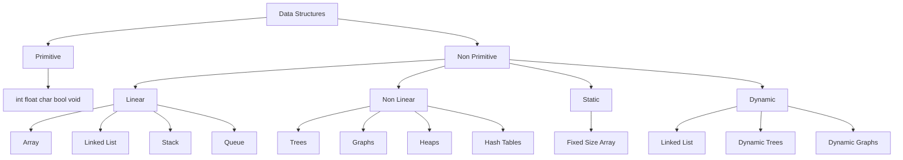
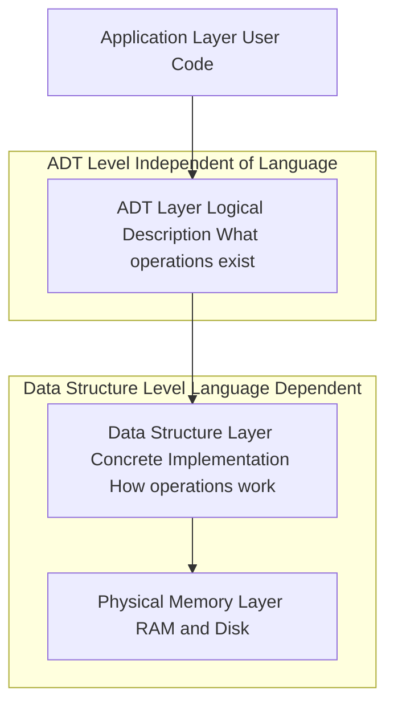
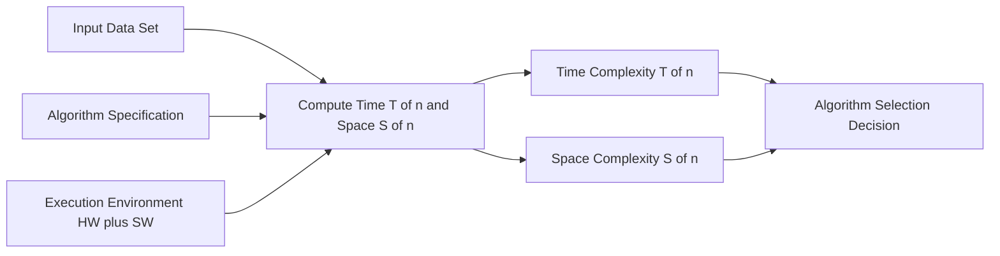
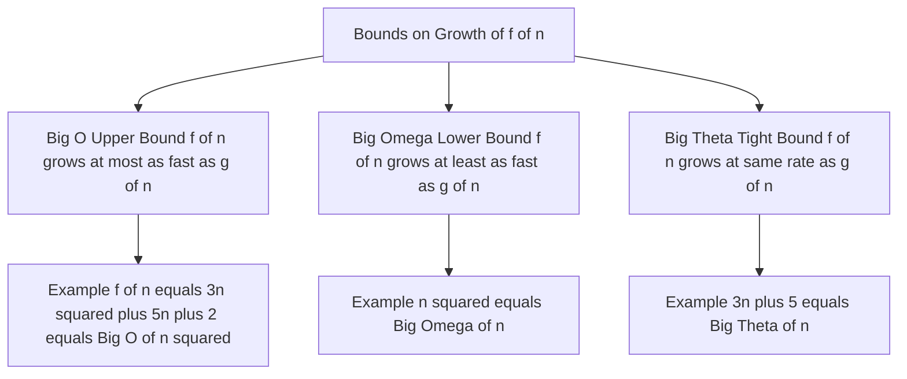

# Definitions

<!-- SECTION_1_START -->
# 📘 Module 1 — Basic Concepts of Data Structures: Definitions

## 1.1 What is Data?

In computer science, **data** is a raw, unprocessed collection of facts, figures, measurements, or observations that by itself carries no specific meaning. Once data is processed, organized, structured, or presented in a way that gives it context and meaning, it becomes **information**.

> [!IMPORTANT]
> **Data vs Information (KTU Syllabus Highlight)**
> - **Data** is the *input* — symbols, characters, numbers, images.
> - **Information** is the *output* — processed, organized data useful for decision-making.
> - The relationship: $$\text{Data} \xrightarrow{\text{Processing}} \text{Information}$$

### 🧠 Intuitive Analogy
Think of **data** as the *individual letters scattered on a table* — $D, A, T, A$. They have no meaning on their own. But once arranged correctly, they spell **"DATA"** — that meaningful arrangement is **information**. Similarly, numbers $5, 1, 0, 3, 6$ are raw data; together they could represent a date, a roll number, or a code — *interpretation* turns data into information.

## 1.2 What is an Information System?

An **information system** is a coordinated collection of components (people, hardware, software, data, procedures) that *collects, processes, stores, and disseminates* information to support decision-making, coordination, control, analysis, and visualization within an organization.

> [!NOTE]
> In the context of DSA, the **software component** of an information system is the *data structure layer* that ensures data is stored, retrieved, and manipulated efficiently.

## 1.3 What is a Data Structure?

A **data structure** is a *named, systematic way of organizing, storing, and managing data* in the memory of a computer so that it can be accessed and used efficiently. It defines:
- The **logical arrangement** of data (abstract view)
- The **storage representation** in memory (physical view)
- The **set of operations** that can be performed on the data

**Formal Definition (KTU 2024 Syllabus):**
> *"A data structure is a specialized format for organizing, processing, retrieving, and storing data. It defines the relationship between data items and the operations that can be performed on them."*

### 🧠 Intuitive Analogy — The Library Metaphor
Imagine a **library** with thousands of books:
- If you just *dump* books in a pile (no structure) → finding a book takes hours.
- If you arrange them **alphabetically by title** on shelves → finding is fast.
- If you add an **index card catalog** (auxiliary structure) → finding is instant.

The library's organizational scheme (shelves + index) is essentially a **data structure** for the books (data). The rules for insertion, deletion, and retrieval are the **operations** on that structure.

## 1.4 Abstract Data Type (ADT) — A Critical Distinction

An **Abstract Data Type (ADT)** is a *mathematical model* for data types. It specifies:
- **What** data is stored (the values)
- **What operations** can be performed (the behavior)

…**but not HOW** the data is stored or how the operations are implemented internally.

> [!IMPORTANT]
> **ADT ≠ Data Structure**
> - **ADT** is the *logical description* (the "what" and the "what can be done"). It is implementation-independent.
> - **Data Structure** is the *concrete realization* (the "how" — using arrays, pointers, structures, etc.) of an ADT.

### 🧠 Intuitive Analogy — The Car Steering Wheel
When you drive, you turn the **steering wheel** to change direction. You don't need to know how the rack-and-pinion mechanism, the power steering pump, or the tie rods actually work. The **steering wheel is the ADT** (logical interface) and the **mechanical linkage beneath is the data structure** (concrete implementation). Different cars (implementations) may use hydraulic, electric, or mechanical steering, but the *interface to the driver (ADT) remains the same*.

## 1.5 What is an Algorithm?

An **algorithm** is a *finite, well-defined, step-by-step sequence of unambiguous instructions* to solve a specific problem or perform a specific task in a finite amount of time.

> [!IMPORTANT]
> **KTU 2024 Definition:**
> *"An algorithm is a step-by-step procedure or set of rules that defines a finite sequence of operations to solve a particular class of problems or to perform a computation in a prescribed manner."*

### Five Essential Characteristics of an Algorithm (KDTU Standard)

1. **Input** — Zero or more well-defined inputs are supplied.
2. **Output** — At least one output is produced.
3. **Definiteness** — Every instruction is clear, unambiguous, and precisely defined.
4. **Finiteness** — The algorithm must terminate after a finite number of steps.
5. **Effectiveness** — Each operation must be basic enough to be carried out, in principle, by a person using only paper and pencil.

A sixth characteristic sometimes added in KTU textbooks is **Efficiency** — using minimal time and memory resources.

> [!VISUALIZATION CONTROL]
> **Concept:** Algorithmic workflow as a black-box transformation
> **GeoGebra / Desmos Input Equations:**
> * `f(x) = x^2 + 2x + 1` (function of one variable)
> * Points: `(0,1)`, `(1,4)`, `(2,9)`, `(3,16)`
> **Visual Description:** Plot the parabola. Observe how the *single input* $x$ on the horizontal axis is **deterministically transformed** into a *single output* $y$ on the vertical axis. This mirrors an algorithm: one well-defined input → one deterministic, well-defined output.

<!-- SECTION_1_END -->

<!-- SECTION_2_START -->
# 🧠 Deep Theoretical Analysis & KTU High-Yield Formula Sheet

## 2.1 Why Data Structures Matter

The choice of data structure directly impacts:
- **Time efficiency** — How fast can we search, insert, delete?
- **Space efficiency** — How much memory is consumed?
- **Maintainability** — How cleanly can we model real-world relationships?

A poorly chosen data structure can make an otherwise elegant algorithm impractically slow (e.g., searching an unsorted array of 10 million records).

## 2.2 Classification of Data Structures (KTU Module 1 Core)

Data structures are broadly classified into two top-level categories:

### A. Primitive Data Structures
These are the basic, built-in data types directly supported by the programming language at the machine level.

| Category | Examples in C | Examples in Python | Size |
|----------|---------------|--------------------|----|
| Integer | `int` | `int` | 2 or 4 bytes |
| Float | `float`, `double` | `float` | 4 or 8 bytes |
| Character | `char` | `str` (single char) | 1 byte |
| Boolean | `_Bool` (via `stdbool.h`) | `bool` | 1 byte |
| Void | `void` | `None` | 0 bytes |

### B. Non-Primitive (User-Defined) Data Structures
These are more complex structures derived from primitive types.

**Two orthogonal classification axes:**

1. **By Organization → Linear vs Non-Linear**
   - **Linear** — Elements arranged sequentially; each element has exactly one predecessor and one successor (except the ends). Examples: **Array, Linked List, Stack, Queue**.
   - **Non-Linear** — Elements arranged hierarchically or as a network; elements may have multiple predecessors and/or successors. Examples: **Trees, Graphs, Heaps, Hash Tables**.

2. **By Memory Allocation → Static vs Dynamic**
   - **Static** — Size fixed at compile time; allocated on the **stack** or in the data segment. Example: **Array**.
   - **Dynamic** — Size can grow/shrink at runtime; allocated on the **heap** via pointers. Examples: **Linked List, Tree, Graph, Dynamic Array**.

## 2.3 Standard Operations on Data Structures (KTU Must-Know)

Every data structure supports a standard set of operations:

| Operation | Purpose | Typical Use |
|-----------|---------|-------------|
| **Traverse** | Visit every element once | Printing, searching, aggregation |
| **Search** | Find the location of a given element | Lookup in a database |
| **Insert** | Add a new element | Building a list dynamically |
| **Delete** | Remove an existing element | Maintaining current inventory |
| **Sort** | Arrange elements in a specific order | Reporting, binary search |
| **Merge** | Combine two structures into one | Joining datasets |
| **Update** | Modify the value of an element | Editing records |

## 2.4 Algorithm Analysis — The Core Question

> *"Given a problem, how do we know which algorithm is 'better'?"*

We don't measure with a stopwatch (results depend on hardware). Instead, we analyze **asymptotic complexity** — how the running time or memory grows as the input size $n$ grows toward infinity.

## 2.5 KTU Asymptotic Notation Cheat Sheet

The three primary notations (defined for any non-negative function $g(n)$):

| Notation | Formal Definition (Math) | Intuitive Meaning | Common Name |
|----------|--------------------------|-------------------|-------------|
| $\mathcal{O}(g(n))$ | $f(n) = \mathcal{O}(g(n))$ if $\exists \; c > 0, \; n_0 > 0$ such that $0 \le f(n) \le c \cdot g(n)$ for all $n \ge n_0$ | $f(n)$ grows **no faster than** $g(n)$ | **Big-O** — Upper bound |
| $\Omega(g(n))$ | $f(n) = \Omega(g(n))$ if $\exists \; c > 0, \; n_0 > 0$ such that $0 \le c \cdot g(n) \le f(n)$ for all $n \ge n_0$ | $f(n)$ grows **no slower than** $g(n)$ | **Big-Omega** — Lower bound |
| $\Theta(g(n))$ | $f(n) = \Theta(g(n))$ if $\exists \; c_1, c_2 > 0, \; n_0 > 0$ such that $c_1 \cdot g(n) \le f(n) \le c_2 \cdot g(n)$ for all $n \ge n_0$ | $f(n)$ grows **at the same rate as** $g(n)$ | **Big-Theta** — Tight bound |

> [!IMPORTANT]
> **KTU Board Tip:** You must always state the **two constants** $c$ (and $n_0$) explicitly when proving any asymptotic relationship. Skipping them is a guaranteed 2-mark deduction.

A fourth notation occasionally tested: $o(g(n))$ — a *strict* upper bound (asymptotically strictly less than).

## 2.6 Common Complexity Classes — Growth Rate Hierarchy

$$\mathcal{O}(1) \;\;<\;\; \mathcal{O}(\log n) \;\;<\;\; \mathcal{O}(n) \;\;<\;\; \mathcal{O}(n \log n) \;\;<\;\; \mathcal{O}(n^2) \;\;<\;\; \mathcal{O}(n^3) \;\;<\;\; \mathcal{O}(2^n) \;\;<\;\; \mathcal{O}(n!)$$

## 2.7 KTU High-Yield Formula Sheet

| Concept | Formula / Definition | Unit / Domain |
|---------|----------------------|---------------|
| Array index access | $T(n) = \mathcal{O}(1)$ | Constant time |
| Linear search | $T(n) = \mathcal{O}(n)$ | Sequential scan |
| Binary search | $T(n) = \mathcal{O}(\log_2 n)$ | Requires sorted array |
| Logarithm property | $\log_a b = \dfrac{\log_c b}{\log_c a}$ | Change of base |
| Polynomial growth | $a_k n^k + a_{k-1} n^{k-1} + \ldots = \Theta(n^k)$ | Dominant term |
| Sum of first $n$ integers | $\sum_{i=1}^{n} i = \dfrac{n(n+1)}{2} = \Theta(n^2)$ | Arithmetic series |
| Sum of powers of 2 | $\sum_{i=0}^{n} 2^i = 2^{n+1} - 1 = \Theta(2^n)$ | Geometric series |
| Space of $n \times n$ matrix | $S(n) = n^2$ | Quadratic space |
| Stack/Queue basic ops | $T(n) = \mathcal{O}(1)$ | Push, pop, enqueue, dequeue |

## 2.8 Real-World Engineering Utility

- **Databases** use **B-trees** (and variants like B+ trees) for indexing — giving $\mathcal{O}(\log n)$ search.
- **Operating Systems** use **queues** for CPU scheduling (Round Robin) and **stacks** for function calls and recursion.
- **Social networks** (Facebook, LinkedIn) use **graphs** to model friendship/connection networks.
- **Compilers** use **symbol tables** (often hash tables) for variable lookup.
- **Routing algorithms** (Google Maps) use **graph shortest-path algorithms** (Dijkstra, A*).
- **Memory management** uses **stacks** (LIFO allocation) and **heaps** (free-list management).

<!-- SECTION_2_END -->

<!-- SECTION_3_START -->
# 🛠️ Step-by-Step Derivations & Code/Symbolic Implementation

## 3.1 Worked Example — Sum of First $n$ Natural Numbers (Algorithm Analysis)

**Problem:** Compute $S = 1 + 2 + 3 + \ldots + n$ for a given $n$.

**Algorithm 1 — Iterative approach:**

```python
def sum_iterative(n: int) -> int:
    """
    Compute the sum of the first n natural numbers iteratively.
    
    Args:
        n: A non-negative integer (n >= 0).
    
    Returns:
        The integer sum 1 + 2 + ... + n.
    
    Raises:
        ValueError: If n is negative.
    """
    if n < 0:
        raise ValueError("Input 'n' must be a non-negative integer.")
    
    total: int = 0      # 1 assignment  -- O(1)
    for i in range(1, n + 1):  # Loop runs n times
        total = total + i      # 1 addition + 1 assignment per iteration
    return total
```

### Exhaustive Time-Complexity Derivation

Let $T(n)$ denote the total number of elementary operations.

$$
\begin{aligned}
T(n) &= \underbrace{1}_{\text{initialization}} + \underbrace{n+1}_{\text{loop test}} + \underbrace{\sum_{i=1}^{n} 2}_{\text{2 ops per iteration}} + \underbrace{1}_{\text{return}} \\[4pt]
     &= 1 + (n+1) + 2n + 1 \\[4pt]
     &= 3n + 3
\end{aligned}
$$

Applying the dominant-term rule:

$$
T(n) = 3n + 3 = \Theta(n)
$$

So the iterative algorithm runs in **linear time** $\mathcal{O}(n)$.

**Algorithm 2 — Closed-form (Gauss) approach:**

```python
def sum_closed_form(n: int) -> int:
    """
    Compute the sum of the first n natural numbers using Gauss's formula.
    
    Args:
        n: A non-negative integer (n >= 0).
    
    Returns:
        The integer sum 1 + 2 + ... + n.
    
    Raises:
        ValueError: If n is negative.
    """
    if n < 0:
        raise ValueError("Input 'n' must be a non-negative integer.")
    return n * (n + 1) // 2
```

### Derivation of $T(n)$ for the Closed-Form

$$
\begin{aligned}
T(n) &= \underbrace{1}_{\text{input check}} + \underbrace{1}_{\text{multiplication}} + \underbrace{1}_{\text{addition}} + \underbrace{1}_{\text{division}} + \underbrace{1}_{\text{return}} \\[4pt]
     &= 5
\end{aligned}
$$

$$
T(n) = 5 = \Theta(1) = \mathcal{O}(1)
$$

**The closed-form version is exponentially faster for large $n$.** This is the *power of mathematical reformulation* — the algorithm itself didn't change in *correctness*, only in *structure*.

## 3.2 Worked Example — Asymptotic Proof (Big-O of $f(n) = 3n^2 + 5n + 2$)

**Claim:** $f(n) = 3n^2 + 5n + 2 = \mathcal{O}(n^2)$.

**Proof (by construction of witnesses $c$ and $n_0$):**

We need to find $c > 0$ and $n_0 \ge 1$ such that:
$$3n^2 + 5n + 2 \le c \cdot n^2 \quad \text{for all } n \ge n_0$$

**Step 1** — For $n \ge 1$, we have $n \le n^2$, so $5n \le 5n^2$. Also, $2 \le 2n^2$ for $n \ge 1$.

**Step 2** — Therefore:
$$3n^2 + 5n + 2 \le 3n^2 + 5n^2 + 2n^2 = 10n^2$$

**Step 3** — Choose $c = 10$ and $n_0 = 1$.

**Conclusion:** For all $n \ge 1$, $f(n) \le 10 \cdot n^2$. Hence $f(n) = \mathcal{O}(n^2)$. $\blacksquare$

> [!NOTE]
> **KTU Valuation Note:** A proof *must* explicitly state both witnesses. Stating "$f(n) = \mathcal{O}(n^2)$ because the dominant term is $n^2$" is **not** a formal proof — it is intuition. Always construct $c$ and $n_0$.

## 3.3 Worked Example — Growth Rate Comparison Table

The same algorithm-analysis framework applies to ALL non-primitive data structures. For reference, here is the standard KTU complexity table:

| Data Structure | Access | Search | Insertion | Deletion |
|----------------|--------|--------|-----------|----------|
| Array | $\mathcal{O}(1)$ | $\mathcal{O}(n)$ | $\mathcal{O}(n)$ | $\mathcal{O}(n)$ |
| Linked List | $\mathcal{O}(n)$ | $\mathcal{O}(n)$ | $\mathcal{O}(1)$ | $\mathcal{O}(1)$ |
| Stack (array-based) | $\mathcal{O}(n)$ | $\mathcal{O}(n)$ | $\mathcal{O}(1)$ | $\mathcal{O}(1)$ |
| Queue (array-based) | $\mathcal{O}(n)$ | $\mathcal{O}(n)$ | $\mathcal{O}(1)$ | $\mathcal{O}(1)$ |
| Hash Table | N/A | $\mathcal{O}(1)$ avg | $\mathcal{O}(1)$ avg | $\mathcal{O}(1)$ avg |
| Binary Search Tree | $\mathcal{O}(\log n)$ avg | $\mathcal{O}(\log n)$ avg | $\mathcal{O}(\log n)$ avg | $\mathcal{O}(\log n)$ avg |
| Binary Heap | $\mathcal{O}(1)$ | $\mathcal{O}(n)$ | $\mathcal{O}(\log n)$ | $\mathcal{O}(\log n)$ |

> *(Detailed derivations for these will appear in subsequent modules.)*

<!-- SECTION_3_END -->

<!-- SECTION_4_START -->
# 🗺️ Structural Diagrams & Schematics

## 4.1 Mermaid Block — Classification of Data Structures



## 4.2 Mermaid Block — ADT vs Data Structure (Layered View)



## 4.3 Mermaid Block — Algorithm Processing Pipeline



## 4.4 Mermaid Block — Asymptotic Notation Hierarchy



<!-- SECTION_5_START -->
# 🎯 KTU 2024 Scheme Examination Question Bank

---

## Part A — Short-Answer Questions (3 Marks Each)

> [!NOTE]
> **KTU Pattern:** Direct, definition-based questions. Answer length ≈ 1 page. No sub-parts.

### Q1. Define a data structure. Differentiate between primitive and non-primitive data structures. `[KTU University Exam — July 2024 | CO1 | Remember/Understand]`

**Model Answer (Board-Key Compliant):**

A **data structure** is a specialized way of organizing, storing, and managing data in computer memory so that it can be accessed and manipulated efficiently. It encapsulates the data, the relationships among the data items, and the operations that can be performed on the data.

**Difference Table:**

| Parameter | Primitive Data Structure | Non-Primitive Data Structure |
|-----------|--------------------------|------------------------------|
| **Definition** | Basic, built-in data types provided by the language | Derived / user-defined from primitives |
| **Also called** | Fundamental types | Composite / structured types |
| **Examples** | `int`, `float`, `char`, `double`, `bool` | Array, Stack, Queue, Linked List, Tree, Graph |
| **Memory** | Fixed, machine-level representation | Variable, constructed at higher level |
| **Operations** | Basic arithmetic, comparison, logical | Traversal, search, sort, insert, delete, merge |
| **Size** | Known and fixed at compile time | May be fixed or dynamic |

*Key points:*
- *Mentioning the term "specialized way of organizing data" — 1 mark*
- *Correct primitive examples — 1 mark*
- *Correct non-primitive examples + the comparison — 1 mark*

### Q2. List and briefly explain any four characteristics of an algorithm. `[KTU University Exam — Dec 2023 | CO1 | Remember]`

**Model Answer:**

The four essential characteristics of an algorithm are:

1. **Input** — An algorithm may take zero or more well-defined inputs. Example: For sorting, the unsorted array is the input.

2. **Output** — An algorithm must produce at least one output that has a specified relation to the input. Example: After sorting, the sorted array is the output.

3. **Definiteness** — Every instruction in the algorithm must be clear, precise, and unambiguous. There must be no ambiguity about what to do at any step.

4. **Finiteness** — The algorithm must terminate after executing a finite number of steps. An infinite loop violates this property.

*(Optional fifth: **Effectiveness** — every step must be basic enough to be carried out exactly and in finite time.)*

*Key points:*
- *Each characteristic name + 1-line description = 0.75 marks × 4 = 3 marks*

---

## Part B — Long-Answer Questions (14 Marks Each — Internal Choice)

> [!NOTE]
> **KTU Pattern:** Two sub-parts of **7 marks each** per question. Map: (a) Understand/Apply, (b) Apply/Analyze.

---

### ❓ Question A (14 Marks) — Abstract Data Type

**(a) Define Abstract Data Type (ADT). Explain how it differs from a data structure. List any three operations of the Stack ADT with their pre-conditions. [7 Marks] `[CO1, CO2 | Understand, Apply]`**

**Model Answer:**

**Definition [2 Marks]:** An **Abstract Data Type (ADT)** is a mathematical model for data types where a data type is defined by its *behavior* (semantics) from the point of view of a *user*, specifically in terms of possible values, possible operations on data of this type, and the behavior of these operations. An ADT does **not** specify *how* the data is stored in memory or *how* the operations are implemented — it only specifies the logical description.

**ADT vs Data Structure [2 Marks]:**

| Aspect | Abstract Data Type (ADT) | Data Structure |
|--------|--------------------------|----------------|
| **What it is** | Logical / mathematical description | Concrete implementation |
| **Focus** | *What* operations are allowed | *How* the operations are actually carried out |
| **Implementation** | Independent of language and representation | Tied to a specific language and memory layout |
| **Example** | Stack ADT: specifies `push` and `pop` semantics | Stack implemented using an array or a linked list |
| **Visibility** | Hides internal representation from the user | Exposes the storage layout and access logic |

**Stack ADT — Three Operations with Pre-conditions [3 Marks]:**

1. **`push(item)`** — Inserts `item` at the top of the stack.
   *Pre-condition:* Stack must not be full: `top < MAX_SIZE - 1`.

2. **`pop()`** — Removes and returns the topmost element.
   *Pre-condition:* Stack must not be empty: `top >= 0`.

3. **`peek()`** (or `top()`) — Returns the topmost element without removing it.
   *Pre-condition:* Stack must not be empty: `top >= 0`.

**Valuation Mark Distribution:**
- [Definition of ADT: 2 Marks]
- [Comparison table with at least 3 distinguishing points: 2 Marks]
- [Each operation with valid pre-condition: 1 Mark × 3 = 3 Marks]

---

**(b) Differentiate between linear and non-linear data structures. Give two examples of each. [7 Marks] `[CO1 | Understand]`**

**Model Answer:**

| Parameter | Linear Data Structure | Non-Linear Data Structure |
|-----------|----------------------|----------------------------|
| **Arrangement** | Elements are arranged in a **linear/sequential** order | Elements are arranged in a **hierarchical** or **network** order |
| **Traversal** | Single-level, sequential traversal possible | Multi-level traversal (e.g., DFS, BFS) required |
| **Levels** | Single level only | Multiple levels possible |
| **Relationships** | Each element has at most one predecessor and one successor | Elements may have multiple predecessors and/or successors |
| **Memory utilization** | Often less memory-efficient (sequential gaps) | Generally more memory-efficient (e.g., trees use pointers) |
| **Implementation complexity** | Simpler | More complex |
| **Examples** | Array, Linked List, Stack, Queue | Tree, Graph, Heap, Trie |

**Examples:**

- **Linear [1 Mark]:**
  1. **Array** — A contiguous block of memory holding elements of the same type, accessed via integer index.
  2. **Linked List** — A chain of nodes where each node holds data and a pointer to the next node.

- **Non-Linear [1 Mark]:**
  1. **Binary Tree** — A hierarchical structure where each node has at most two children (left and right).
  2. **Graph** — A set of vertices connected by edges; can represent arbitrary relationships.

**Valuation Mark Distribution:**
- [Tabular comparison with at least 5 valid differences: 3 Marks]
- [Two correct linear examples with 1-line description: 2 Marks]
- [Two correct non-linear examples with 1-line description: 2 Marks]

---

### ❓ Question B (14 Marks) — Algorithm Analysis

**(a) Explain the three asymptotic notations — Big-O, Big-Omega, and Big-Theta — with formal definitions and a graph sketch of each. [7 Marks] `[CO1, CO2 | Understand, Apply]`**

**Model Answer:**

**Formal Definitions [3 Marks — 1 each]:**

Let $f(n)$ and $g(n)$ be non-negative functions defined on the positive integers.

1. **Big-O Notation — $f(n) = \mathcal{O}(g(n))$:**
   We say $f(n) = \mathcal{O}(g(n))$ if there exist positive constants $c$ and $n_0$ such that:
   $$0 \le f(n) \le c \cdot g(n) \quad \text{for all } n \ge n_0$$
   It gives an **upper bound** on the growth rate of $f(n)$. In engineering, Big-O is the *most-used* notation because it represents the **worst-case** behavior.

2. **Big-Omega Notation — $f(n) = \Omega(g(n))$:**
   We say $f(n) = \Omega(g(n))$ if there exist positive constants $c$ and $n_0$ such that:
   $$0 \le c \cdot g(n) \le f(n) \quad \text{for all } n \ge n_0$$
   It gives a **lower bound** on the growth rate of $f(n)$.

3. **Big-Theta Notation — $f(n) = \Theta(g(n))$:**
   We say $f(n) = \Theta(g(n))$ if there exist positive constants $c_1$, $c_2$, and $n_0$ such that:
   $$c_1 \cdot g(n) \le f(n) \le c_2 \cdot g(n) \quad \text{for all } n \ge n_0$$
   It gives a **tight bound** — the function grows at the same asymptotic rate as $g(n)$.

**Graph Sketches [3 Marks — 1 each]:**

1. **Big-O:** The function $f(n)$ is sandwiched **below** by the curve $c \cdot g(n)$ for large $n$. Imagine $g(n) = n^2$ and $f(n) = 3n^2 + 2$ — the parabola $f(n)$ is always at or below $3 \cdot n^2$ for all $n \ge 1$.

2. **Big-Omega:** The function $f(n)$ is sandwiched **above** by the curve $c \cdot g(n)$ for large $n$. For example, $f(n) = n^2$ is $\Omega(n)$ since $n^2 \ge 1 \cdot n$ for all $n \ge 1$.

3. **Big-Theta:** The function $f(n)$ is sandwiched **between two parallel curves** $c_1 \cdot g(n)$ and $c_2 \cdot g(n)$ for large $n$. This is the *tightest* of the three.

**Worked Example [1 Mark]:** Prove $f(n) = 5n^3 + 2n^2 + n = \mathcal{O}(n^3)$.

- For $n \ge 1$, we have $5n^3 + 2n^2 + n \le 5n^3 + 2n^3 + n^3 = 8n^3$.
- Choose $c = 8$ and $n_0 = 1$. $\blacksquare$

**Valuation Mark Distribution:**
- [Each formal definition with constants: 1 Mark × 3 = 3 Marks]
- [Three graphical interpretations: 1 Mark × 3 = 3 Marks]
- [One worked example: 1 Mark]

---

**(b) Write an algorithm in Python to find the maximum element in an unsorted array. Analyze its time complexity using asymptotic notation. [7 Marks] `[CO2, CO3 | Apply, Analyze]`**

**Model Answer:**

**Python Algorithm [3 Marks]:**

```python
def find_max(arr: list[int]) -> int:
    """
    Returns the maximum element in a non-empty list of integers.
    
    Args:
        arr: A non-empty list of integers.
    
    Returns:
        The maximum value present in arr.
    
    Raises:
        ValueError: If arr is empty.
    """
    if not arr:
        raise ValueError("Input list must contain at least one element.")
    
    max_val: int = arr[0]               # 1 assignment  -- O(1)
    for element in arr:                  # Loop runs n times
        if element > max_val:            # 1 comparison per iteration
            max_val = element            # 1 assignment (worst case)
    return max_val
```

**Algorithm Analysis Steps [4 Marks]:**

Let $n$ be the length of the array. The `for` loop executes exactly $n$ times. Inside the loop, we perform one comparison and (at most) one assignment.

$$
\begin{aligned}
T(n) &= \underbrace{1}_{\text{init}} + \underbrace{n}_{\text{comparisons}} + \underbrace{n}_{\text{assignments (worst case)}} + \underbrace{1}_{\text{return}} \\[4pt]
     &= 2n + 2
\end{aligned}
$$

Dropping the constants and the lower-order term:

$$T(n) = \Theta(n) = \mathcal{O}(n)$$

**Big-O Proof:** $2n + 2 \le 4n$ for all $n \ge 1$. So $c = 4$, $n_0 = 1$. Hence $T(n) = \mathcal{O}(n)$. $\blacksquare$

**Best / Worst / Average Case:**

- **Best Case** — $T_{\min}(n) = \mathcal{O}(n)$ — even if the first element is the maximum, we still scan to confirm.
- **Worst Case** — $T_{\max}(n) = \mathcal{O}(n)$ — every element triggers an assignment.
- **Average Case** — $T_{\text{avg}}(n) = \mathcal{O}(n)$ — same order.

> All three cases are $\mathcal{O}(n)$ for this algorithm.

**Space Complexity:** $\mathcal{O}(1)$ — we use only a single auxiliary variable `max_val`, independent of $n$.

**Valuation Mark Distribution:**
- [Correct, working Python algorithm with type hints: 3 Marks]
- [Step-by-step $T(n)$ derivation with loop count: 2 Marks]
- [Final asymptotic bound + Big-O proof: 1 Mark]
- [Best/Worst/Average cases mentioned: 1 Mark]

---

> [!WARNING]
> **⚠️ KTU Examiner's Pitfall Callout**
> 1. **Never** write "$\mathcal{O}(n)$ because the loop runs $n$ times" as the *sole* justification. You must state the **constants $c$ and $n_0$** for a full-mark proof.
> 2. **Do not confuse Big-O with worst case.** Big-O is an *asymptotic upper bound*; in some cases (like randomized algorithms), average case may have a *tighter* bound than worst case.
> 3. **Do not write `f(n) = O(g(n))` and `O(g(n)) = f(n)` interchangeably** — the equals sign here is *one-directional*. The correct phrasing is "$f(n)$ **is** $\mathcal{O}(g(n))$".
> 4. Forgetting to mention **pre-conditions** in ADT operations (e.g., "stack must not be full" before `push`) costs 1–2 marks regularly.

---

## 📌 Topic Recap & Important Things to Remember

> **Rapid-Revision Checklist for Module 1 — Basic Concepts**

- **Data** = raw facts; **Information** = processed data. The pipeline is Data → Processing → Information.
- A **Data Structure** is a named way of organizing data for efficient access/modification.
- An **Abstract Data Type (ADT)** is the *logical* description; a **Data Structure** is the *physical* implementation. They are NOT the same.
- Data structures are classified as **Primitive** (`int`, `float`, `char`, `bool`, `void`) vs **Non-Primitive**.
- Non-primitive data structures are further classified as:
  - **Linear** (Array, Linked List, Stack, Queue) vs **Non-Linear** (Tree, Graph, Heap, Hash Table).
  - **Static** (size fixed at compile time, e.g., array) vs **Dynamic** (size grows/shrinks at runtime, e.g., linked list).
- The **standard operations** on any data structure: traverse, search, insert, delete, sort, merge, update.
- An **Algorithm** is a finite, well-defined, step-by-step procedure to solve a problem.
- **Five characteristics** of an algorithm: Input, Output, Definiteness, Finiteness, Effectiveness. (Some textbooks add a sixth: Efficiency.)
- **Algorithm Analysis** uses asymptotic notation to characterize running time and memory as $n \to \infty$.
- **Three primary asymptotic notations:**
  - $\mathcal{O}(g(n))$ — upper bound (worst case)
  - $\Omega(g(n))$ — lower bound (best case)
  - $\Theta(g(n))$ — tight bound (asymptotically exact)
- Formal definitions require **explicit witnesses** $c$, $c_1$, $c_2$, and $n_0$ — never omit them in proofs.
- **Complexity hierarchy** (slowest-growing to fastest): $\mathcal{O}(1) < \mathcal{O}(\log n) < \mathcal{O}(n) < \mathcal{O}(n \log n) < \mathcal{O}(n^2) < \mathcal{O}(n^3) < \mathcal{O}(2^n) < \mathcal{O}(n!)$.
- The closed-form formula $S = \dfrac{n(n+1)}{2}$ runs in $\mathcal{O}(1)$ — beating the iterative $\mathcal{O}(n)$ version. **Math beats brute force.**
- Array indexing is $\mathcal{O}(1)$; linked list search is $\mathcal{O}(n)$; binary search on a sorted array is $\mathcal{O}(\log n)$.
- Use **pipes carefully** in KTU answer scripts — present work in neat tables or step blocks to maximize readability marks.

<!-- SECTION_5_END -->
