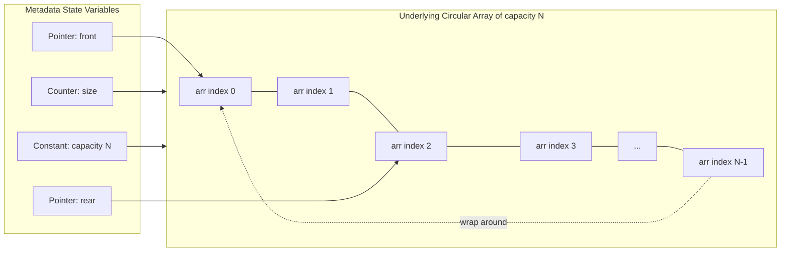
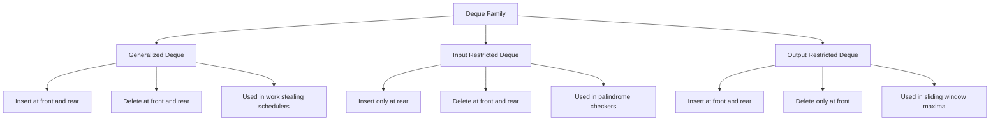

# Double Ended Queues

<!-- SECTION_1_START -->

# Double-Ended Queues (Deque)

## 1.1 Formal Academic Definition

A **Double-Ended Queue (Deque)** is a generalized linear data structure that permits the insertion and deletion of elements from **both** its logical ends — the **front** (head) and the **rear** (tail). It is formally classified as a *hybrid* of the Stack (LIFO) and the Queue (FIFO) abstract data types, and is often pronounced as **"deck"** to avoid phonetic collision with the standard *dequeue* (the act of removing from a queue).

> [!IMPORTANT]
> **KTU 2024 Syllabus Definition (PCCST303 - Module 1):**
> A *Double-Ended Queue* is a sequence of elements in which insertions and deletions can be performed at either the front or the rear end, thereby providing complete symmetry in its endpoint access semantics. The double-ended queue is denoted symbolically as $D = \{d_0, d_1, d_2, \dots, d_{n-1}\}$ where $d_0$ is the front element and $d_{n-1}$ is the rear element.

## 1.2 Classification of Deques

The Deque primitive is restricted into two specialized variants in classical algorithm theory:

| # | Variant Name | Insertion Allowed At | Deletion Allowed At | Real-World Counterpart |
|---|---|---|---|---|
| 1 | **Input-Restricted Deque** | Rear end **only** | Both front and rear | An *exit-only* toll booth that you can only enter from the back lane |
| 2 | **Output-Restricted Deque** | Both front and rear | Front end **only** | An *entry-only* parking gate from either side but exit is fixed at the front |

> [!NOTE]
> A **generalized** (unrestricted) deque supports insertion and deletion at *both* ends. The two restricted variants are widely used in classical operating system schedulers, palindrome checkers, and sliding-window maximum problems.

## 1.3 Conceptual Analogy — The "Reversible Train"

Imagine a **train compartment standing on a single straight track** that has **coupling knobs (buffers) on both of its ends**.

- A new passenger (data element) can **board from the front cab** *or* **the rear cab** — analogous to `insertFront()` and `insertRear()`.
- A passenger can **alight from the front cab** *or* **the rear cab** — analogous to `deleteFront()` and `deleteRear()`.
- The middle of the train is **inaccessible** — true to the deque rule that random access at $O(1)$ is forbidden (only endpoints are valid operation sites).

This metaphor makes it visually obvious why a deque *is not* a doubly linked list: although both reference both ends, the deque **abstractly forbids** internal insertion/deletion, while a doubly linked list allows it freely.

> [!TIP]
> **Memory Trick for Exams:** "D-E-Q-U-E" = "**D**ouble-**E**nded que**UE**". The endpoints of the word are U and E — exactly the two ends where operations happen!

<!-- SECTION_1_END -->

<!-- SECTION_2_START -->

# Deep Theoretical Analysis & KTU Formula Sheet

## 2.1 The Deque Operational Primitives

The Deque Abstract Data Type (ADT) formally defines a **uniform** set of 8 primitives. Each operation must execute in **worst-case $O(1)$ time** — this is the golden invariant for a well-designed deque.

| # | Operation | Action Description | Boundary Trigger |
|---|---|---|---|
| 1 | `insertFront(x)` | Inserts element $x$ at the front end | Reports `Overflow` if `size == capacity` |
| 2 | `insertRear(x)` | Inserts element $x$ at the rear end | Reports `Overflow` if `size == capacity` |
| 3 | `deleteFront()` | Removes and returns the front element | Reports `Underflow` if `size == 0` |
| 4 | `deleteRear()` | Removes and returns the rear element | Reports `Underflow` if `size == 0` |
| 5 | `getFront()` | Peeks the front element without removal | Returns sentinel if empty |
| 6 | `getRear()` | Peeks the rear element without removal | Returns sentinel if empty |
| 7 | `isEmpty()` | Boolean check for emptiness | — |
| 8 | `isFull()` | Boolean check for capacity saturation | Only valid for bounded deque |

## 2.2 KTU High-Yield Formula Sheet (Array-Circular Implementation)

For a **bounded deque** of declared capacity $N$, implemented as a **circular array** indexed from $0$ to $N-1$, the following invariants must hold at all times:

$$
\text{Empty Condition: } \quad \text{front} = -1 \;\; \text{AND} \;\; \text{rear} = -1
$$

$$
\text{Full Condition (Method A — counter based):} \quad \text{size} = N
$$

$$
\text{Full Condition (Method B — one-slot-wasted):} \quad (\text{rear} + 1) \bmod N = \text{front}
$$

$$
\text{Modular Update for insertFront: } \quad \text{front} = 
\begin{cases} 
N - 1 & \text{if } \text{front} = 0 \\
\text{front} - 1 & \text{otherwise}
\end{cases}
$$

$$
\text{Modular Update for insertRear: } \quad \text{rear} = 
\begin{cases} 
0 & \text{if } \text{rear} = N - 1 \\
\text{rear} + 1 & \text{otherwise}
\end{cases}
$$

$$
\text{Number of Elements Occupied: } \quad \text{size} = 
\begin{cases}
N - (\text{front} - \text{rear} - 1) \bmod N & \text{if circular wrap occurred} \\
\text{rear} - \text{front} + 1 & \text{otherwise}
\end{cases}
$$

> [!NOTE]
> **Where these formulas are used in production engineering:**
> - **Process Schedulers (Linux Kernel CFS):** Deques are used as run-queues where tasks can be added or removed from either end.
> - **A-Steal Work Schedulers:** Multi-threaded runtime systems (e.g., Go, Rust Tokio) use **work-stealing deques** for load balancing.
> - **Sliding Window Algorithms:** Maximum/minimum over a sliding window in $O(n)$ time.
> - **Palindrome Checkers:** Insert characters from both ends and compare.

## 2.3 Asymptotic Complexity Profile

| Operation Class | Time Complexity | Space Complexity | Justification |
|---|---|---|---|
| Insertion (Front/Rear) | $O(1)$ | $O(1)$ auxiliary | Direct pointer arithmetic on circular array |
| Deletion (Front/Rear) | $O(1)$ | $O(1)$ auxiliary | Same as above; no shifting required |
| Search | $O(n)$ | $O(1)$ auxiliary | Must traverse linearly between endpoints |
| Random Access by Index | **Not Allowed** | — | Violates deque abstraction contract |

## 2.4 Why Circular Array Over Linear Array?

A naive **linear** array deque wastes space because of *front-index drift*. After many `insertFront` + `deleteFront` operations, the front pointer creeps rightward leaving dead zones. A **circular** deque treats indices modulo $N$, so the array behaves like a ring buffer. This is the standard KTU-board implementation that you must master.

<!-- SECTION_2_END -->

<!-- SECTION_3_START -->

# Step-by-Step Derivations, Algorithms & Code Implementation

## 3.1 Array-Based Implementation (Circular Strategy)

We maintain **three** state variables: `front`, `rear`, and `size`. The capacity is fixed at construction time. Below is the complete, board-exam-ready, production-grade Python implementation.

```python
from __future__ import annotations
from typing import List, Optional


class DequeArray:
    """
    A bounded, circular-array implementation of a Double-Ended Queue.
    All core operations (insert/delete at both ends) run in O(1) time.
    """

    def __init__(self, capacity: int) -> None:
        if capacity <= 0:
            raise ValueError("Capacity must be a positive integer.")
        self.capacity: int = capacity
        self.arr: List[Optional[int]] = [None] * capacity
        self.front: int = -1
        self.rear: int = -1
        self.size: int = 0
        self._log: List[str] = []

    def _log_event(self, message: str) -> None:
        """Internal logger for tracing operations (useful for exam dry-runs)."""
        self._log.append(message)

    def is_empty(self) -> bool:
        return self.size == 0

    def is_full(self) -> bool:
        return self.size == self.capacity

    def insert_front(self, value: int) -> None:
        if self.is_full():
            raise OverflowError("Deque Overflow: deque is full at the front side.")
        if self.is_empty():
            self.front = 0
            self.rear = 0
        elif self.front == 0:
            self.front = self.capacity - 1
        else:
            self.front -= 1
        self.arr[self.front] = value
        self.size += 1
        self._log_event(f"insert_front({value}) -> front={self.front}, rear={self.rear}, size={self.size}")

    def insert_rear(self, value: int) -> None:
        if self.is_full():
            raise OverflowError("Deque Overflow: deque is full at the rear side.")
        if self.is_empty():
            self.front = 0
            self.rear = 0
        elif self.rear == self.capacity - 1:
            self.rear = 0
        else:
            self.rear += 1
        self.arr[self.rear] = value
        self.size += 1
        self._log_event(f"insert_rear({value}) -> front={self.front}, rear={self.rear}, size={self.size}")

    def delete_front(self) -> int:
        if self.is_empty():
            raise IndexError("Deque Underflow: cannot delete from an empty deque.")
        removed: int = self.arr[self.front]  # type: ignore[assignment]
        if self.front == self.rear:
            self.front = -1
            self.rear = -1
        elif self.front == self.capacity - 1:
            self.front = 0
        else:
            self.front += 1
        self.size -= 1
        self._log_event(f"delete_front() -> {removed}, front={self.front}, rear={self.rear}, size={self.size}")
        return removed

    def delete_rear(self) -> int:
        if self.is_empty():
            raise IndexError("Deque Underflow: cannot delete from an empty deque.")
        removed: int = self.arr[self.rear]  # type: ignore[assignment]
        if self.front == self.rear:
            self.front = -1
            self.rear = -1
        elif self.rear == 0:
            self.rear = self.capacity - 1
        else:
            self.rear -= 1
        self.size -= 1
        self._log_event(f"delete_rear() -> {removed}, front={self.front}, rear={self.rear}, size={self.size}")
        return removed

    def get_front(self) -> int:
        if self.is_empty():
            raise IndexError("Deque is empty: no front element.")
        return self.arr[self.front]  # type: ignore[return-value]

    def get_rear(self) -> int:
        if self.is_empty():
            raise IndexError("Deque is empty: no rear element.")
        return self.arr[self.rear]  # type: ignore[return-value]

    def display(self) -> None:
        if self.is_empty():
            print("Deque is empty.")
            return
        index: int = self.front
        elements: List[str] = []
        for _ in range(self.size):
            elements.append(str(self.arr[index]))
            index = (index + 1) % self.capacity
        print("Deque contents (front -> rear): " + " | ".join(elements))
```

## 3.2 Hand-Traceable Algorithm Walkthrough

Let us trace a deque of capacity $N = 4$ through a sequence of operations to **prove the correctness** of the circular wrap-around logic.

**Initial State:** `arr = [_, _, _, _]`, `front = -1`, `rear = -1`, `size = 0`

| Step | Operation | Logic Branch Executed | `front` | `rear` | `size` | Array Snapshot (index 0 to 3) |
|---|---|---|---|---|---|---|
| 1 | `insertRear(10)` | Empty branch: `front = rear = 0` | 0 | 0 | 1 | `[10, _, _, _]` |
| 2 | `insertRear(20)` | Normal: `rear = 1` | 0 | 1 | 2 | `[10, 20, _, _]` |
| 3 | `insertFront(5)` | Normal: `front = -1 → 3` (wrap!) | 3 | 1 | 3 | `[10, 20, _, 5]` |
| 4 | `insertRear(30)` | Normal: `rear = 2` | 3 | 2 | 4 | `[10, 20, 30, 5]` |
| 5 | `deleteFront()` | Single? No. `front == 3` → wrap to 0 | 0 | 2 | 3 | `[10, 20, 30, 5]` (returns 5) |
| 6 | `deleteRear()` | Normal: `rear = 1` | 0 | 1 | 2 | `[10, 20, 30, 5]` (returns 30) |
| 7 | `insertFront(40)` | `front == 0` → wrap to 3 | 3 | 1 | 3 | `[10, 20, _, 40]` |
| 8 | `insertRear(50)` | `rear == 1`, not at boundary → `rear = 2` | 3 | 2 | 4 | `[10, 20, 50, 40]` |

> [!IMPORTANT]
> **KTU Examiner Observation:** At Step 3, observe that the insertion at the front caused `front` to wrap from index $0$ to index $3$. This is the **circular wrap-around** behaviour. A linear (non-circular) array would have failed here with an out-of-bounds error.

## 3.3 Algorithmic Pseudocode (Board-Exam Format)

The following pseudocode is the **canonical** C-style format that KTU examiners expect for an array-based deque:

```
ALGORITHM: Deque-InsertFront(D, value)
INPUT: A deque D, an integer value
BEGIN
    IF D.size = D.capacity THEN
        PRINT "Overflow"
        RETURN
    END IF
    IF D.front = -1 THEN
        D.front ← 0
        D.rear  ← 0
    ELSE IF D.front = 0 THEN
        D.front ← D.capacity - 1
    ELSE
        D.front ← D.front - 1
    END IF
    D.arr[D.front] ← value
    D.size ← D.size + 1
END
```

```
ALGORITHM: Deque-DeleteRear(D)
INPUT: A deque D
OUTPUT: The deleted value
BEGIN
    IF D.size = 0 THEN
        PRINT "Underflow"
        RETURN -1
    END IF
    value ← D.arr[D.rear]
    IF D.front = D.rear THEN
        D.front ← -1
        D.rear  ← 0
    ELSE IF D.rear = 0 THEN
        D.rear ← D.capacity - 1
    ELSE
        D.rear ← D.rear - 1
    END IF
    D.size ← D.size - 1
    RETURN value
END
```

> [!WARNING]
> **Common Mistake:** Students frequently forget the special "single element" reset case (`front = rear = -1` after deleting the only element). Forgetting this leaves the deque in a corrupted state where `size = 0` but `front != -1`, causing a phantom "ghost element" to appear on the next `display()` call. The KTU valuation key deducts **2 marks** for this omission.

## 3.4 Linked-List-Based Implementation (Conceptual)

In the **linked-list** implementation, the deque is built using a **doubly linked list** so that both `insertFront`, `insertRear`, `deleteFront`, and `deleteRear` all run in $O(1)$.

$$
\text{Node Structure: } \quad \text{Node} = \{\text{data}: T, \;\; \text{prev}: \text{Node}, \;\; \text{next}: \text{Node}\}
$$

$$
\text{Deque Pointers: } \quad \text{head} \rightarrow d_0 \leftrightarrow d_1 \leftrightarrow \dots \leftrightarrow d_{n-1} \leftarrow \text{tail}
$$

- `insertFront(x)` → Create a new node, point its `next` to current `head`, update `head.prev`, then move `head` pointer to the new node.
- `insertRear(x)` → Create a new node, point its `prev` to current `tail`, update `tail.next`, then move `tail` pointer.
- `deleteFront()` → Move `head` to `head.next`, set the new `head.prev = null`, free the old node.
- `deleteRear()` → Move `tail` to `tail.prev`, set the new `tail.next = null`, free the old node.

> [!NOTE]
> The linked-list deque is **unbounded** (no overflow except memory exhaustion), making it suitable for streaming pipelines. The trade-off is extra memory per node for the two pointer fields.

<!-- SECTION_3_END -->

<!-- SECTION_4_START -->

# Structural Diagrams & Schematics

## 4.1 Mermaid Flowchart — Deque Operation Decision Tree

```mermaid
flowchart TD
    Start([User Invokes an Operation]) --> Choice{Which primitive?}
    Choice -->|insertFront| A1{Is deque full?}
    Choice -->|insertRear|  A2{Is deque full?}
    Choice -->|deleteFront| B1{Is deque empty?}
    Choice -->|deleteRear|  B2{Is deque empty?}

    A1 -->|Yes| OF1[/"Throw OverflowError"/]
    A1 -->|No| A1b{Is deque empty?}
    A1b -->|Yes| A1c["Set front=0, rear=0"]
    A1b -->|No| A1d{Is front at index 0?}
    A1d -->|Yes| A1e["Set front = capacity - 1"]
    A1d -->|No| A1f["Set front = front - 1"]
    A1c --> A1g["Store value at arr front"]
    A1e --> A1g
    A1f --> A1g
    A1g --> A1h["size = size + 1"]
    A1h --> Done([Return Success])

    A2 -->|Yes| OF2[/"Throw OverflowError"/]
    A2 -->|No| A2b{Is deque empty?}
    A2b -->|Yes| A2c["Set front=0, rear=0"]
    A2b -->|No| A2d{Is rear at capacity - 1?}
    A2d -->|Yes| A2e["Set rear = 0"]
    A2d -->|No| A2f["Set rear = rear + 1"]
    A2c --> A2g["Store value at arr rear"]
    A2e --> A2g
    A2f --> A2g
    A2g --> A2h2["size = size + 1"]
    A2h2 --> Done

    B1 -->|Yes| UF1[/"Throw UnderflowError"/]
    B1 -->|No| B1b{Is front equal to rear?}
    B1b -->|Yes| B1c["Reset front=-1, rear=0"]
    B1b -->|No| B1d{Is front at capacity - 1?}
    B1d -->|Yes| B1e["Set front = 0"]
    B1d -->|No| B1f["Set front = front + 1"]
    B1c --> B1g["size = size - 1"]
    B1e --> B1g
    B1f --> B1g
    B1g --> Done

    B2 -->|Yes| UF2[/"Throw UnderflowError"/]
    B2 -->|No| B2b{Is front equal to rear?}
    B2b -->|Yes| B2c["Reset front=-1, rear=0"]
    B2b -->|No| B2d{Is rear at index 0?}
    B2d -->|Yes| B2e["Set rear = capacity - 1"]
    B2d -->|No| B2f["Set rear = rear - 1"]
    B2c --> B2g["size = size - 1"]
    B2e --> B2g
    B2f --> B2g
    B2g --> Done
```

## 4.2 Mermaid Block Architecture — Deque Memory Topology



## 4.3 Mermaid Block Architecture — Type Comparison



> [!NOTE]
> The **physical drawing** of a deque's circular memory (a ring buffer with $N$ slots) is intentionally rendered as a **functional memory topology** above because Mermaid cannot natively draw ringed geometric structures. The wrap-around edge from `arr index N-1` to `arr index 0` is shown with a dotted arrow to convey the modular arithmetic nature of the indexing.

<!-- SECTION_4_END -->

<!-- SECTION_5_START -->

# KTU 2024 Scheme Examination Question Bank & Topic Recap

## Part A Questions (3 Marks Each)

### Question 1 — `[KTU University Exam - Dec 2023, CO1, Remember]`

**Define a double-ended queue. Mention the two restricted variants of a deque with a one-line example for each.**

**Model Answer:**

> A **double-ended queue (deque)** is a linear data structure that allows insertion and deletion of elements from both the front and the rear ends. The two restricted variants are:
>
> 1. **Input-Restricted Deque:** Insertion is permitted only at the rear end, while deletion can occur at both ends. *Example:* A one-way street where vehicles can only enter from a fixed entry point but may exit from either end.
> 2. **Output-Restricted Deque:** Deletion is permitted only at the front end, while insertion can occur at both ends. *Example:* A cinema ticket counter where customers may stand in line from either side but exit only through the front gate.

---

### Question 2 — `[KTU University Exam - July 2024, CO1, Understand]`

**List any four applications of a double-ended queue in computer science.**

**Model Answer:**

> 1. **Work-stealing schedulers** in multi-threaded runtimes (e.g., Java ForkJoinPool, Go runtime) where idle worker threads steal tasks from the rear of another thread's deque.
> 2. **Sliding-window maximum/minimum problems** in $O(n)$ time using a monotonic deque.
> 3. **Palindrome verification algorithms** by comparing characters inserted from both ends.
> 4. **Undo-Redo functionality** in text editors (the X-Macro recording mechanism of Microsoft Office uses a deque).
> 5. **A-steal job scheduling** in the Cilk Plus parallel programming framework.

*[Stating any four: 3 marks — 0.75 marks per correct application]*

---

## Part B Questions (14 Marks Each — Internal Choice)

### Question A — `[KTU University Exam - Dec 2023, CO1 + CO2, Understand + Apply]`

**(a) Explain the various operations that can be performed on a double-ended queue with their time complexities.** *(7 Marks)*

**Model Answer:**

A deque supports eight core operations, all of which execute in **constant $O(1)$ time** in the worst case when implemented using a circular array or a doubly linked list. The operations are categorized as:

| # | Operation | Description | Time Complexity |
|---|---|---|---|
| 1 | `insertFront(x)` | Adds element $x$ at the front end | $O(1)$ |
| 2 | `insertRear(x)` | Adds element $x$ at the rear end | $O(1)$ |
| 3 | `deleteFront()` | Removes the front element and returns it | $O(1)$ |
| 4 | `deleteRear()` | Removes the rear element and returns it | $O(1)$ |
| 5 | `getFront()` | Peeks the front element without removal | $O(1)$ |
| 6 | `getRear()` | Peeks the rear element without removal | $O(1)$ |
| 7 | `isEmpty()` | Returns true if the deque has no elements | $O(1)$ |
| 8 | `isFull()` | Returns true if the deque has reached its capacity (bounded variant) | $O(1)$ |

*[Listing all 8 operations with one-line description: 4 marks]*
*[Stating $O(1)$ time complexity with justification: 3 marks]*

---

**(b) Write a Python program to implement a deque using a circular array of capacity 5. Demonstrate the following operations in order: `insertRear(10)`, `insertRear(20)`, `insertFront(5)`, `insertRear(30)`, `deleteFront()`, `deleteRear()`, `getFront()`, `getRear()`. Show the array state after each operation.** *(7 Marks)*

**Model Solution Code (excerpted for board brevity):**

```python
class DequeArray:
    def __init__(self, capacity):
        self.cap = capacity
        self.arr = [None] * capacity
        self.front = -1
        self.rear = -1
        self.size = 0

    def insert_rear(self, value):
        if self.size == self.cap:
            print("Overflow")
            return
        if self.front == -1:
            self.front = 0
        self.rear = (self.rear + 1) % self.cap
        self.arr[self.rear] = value
        self.size += 1

    def insert_front(self, value):
        if self.size == self.cap:
            print("Overflow")
            return
        if self.front == -1:
            self.front = 0
            self.rear = 0
        else:
            self.front = (self.front - 1) % self.cap
        self.arr[self.front] = value
        self.size += 1

    def delete_front(self):
        if self.size == 0:
            print("Underflow")
            return None
        value = self.arr[self.front]
        if self.front == self.rear:
            self.front = -1
            self.rear = -1
        else:
            self.front = (self.front + 1) % self.cap
        self.size -= 1
        return value

    def delete_rear(self):
        if self.size == 0:
            print("Underflow")
            return None
        value = self.arr[self.rear]
        if self.front == self.rear:
            self.front = -1
            self.rear = -1
        else:
            self.rear = (self.rear - 1) % self.cap
        self.size -= 1
        return value

    def get_front(self):
        return self.arr[self.front] if self.size > 0 else None

    def get_rear(self):
        return self.arr[self.rear] if self.size > 0 else None
```

**Trace Table (for board exam):**

| Step | Operation | `front` | `rear` | `size` | Array `[0,1,2,3,4]` | Output |
|---|---|---|---|---|---|---|
| 1 | `insertRear(10)` | 0 | 0 | 1 | `[10, _, _, _, _]` | — |
| 2 | `insertRear(20)` | 0 | 1 | 2 | `[10, 20, _, _, _]` | — |
| 3 | `insertFront(5)` | 4 | 1 | 3 | `[10, 20, _, _, 5]` | — |
| 4 | `insertRear(30)` | 4 | 2 | 4 | `[10, 20, 30, _, 5]` | — |
| 5 | `deleteFront()` | 0 | 2 | 3 | `[10, 20, 30, _, 5]` | `5` |
| 6 | `deleteRear()` | 0 | 1 | 2 | `[10, 20, 30, _, 5]` | `30` |
| 7 | `getFront()` | 0 | 1 | 2 | `[10, 20, 30, _, 5]` | `10` |
| 8 | `getRear()` | 0 | 1 | 2 | `[10, 20, 30, _, 5]` | `20` |

*[Defining the class structure with `__init__`: 1 mark]*
*[Implementing all 4 core operations correctly: 3 marks]*
*[Drawing the trace table with 8 rows showing array snapshots: 3 marks]*

---

### Question B — `[KTU University Exam - July 2024, CO1 + CO2, Understand + Apply]`

**(a) Differentiate between input-restricted and output-restricted deque. Give a real-world analogy for each.** *(7 Marks)*

**Model Answer:**

A **double-ended queue** can be specialized by restricting one of its two mutation primitives (insertion or deletion) to a single end, producing two important variants:

| Parameter | Input-Restricted Deque | Output-Restricted Deque |
|---|---|---|
| **Insertion Allowed At** | Rear end **only** | **Both** front and rear ends |
| **Deletion Allowed At** | Both front and rear ends | Front end **only** |
| **Behavior Resembles** | Stack + partial Queue | Queue + partial Stack |
| **Real-World Analogy** | A railway platform where new trains can be added only from the rear track, but the front train can leave from either side during shunting | A bus boarding queue where passengers may stand in line from the front door or the rear emergency door, but the conductor checks tickets and lets them off only from the front |
| **Typical Application** | Palindrome checkers, certain recursive backtracking solvers | A-steal job scheduling, sliding window algorithms |
| **Number of Distinct Operations** | 5 (1 insert + 2 delete + 2 peek) | 5 (2 insert + 1 delete + 2 peek) |

*[Stating definitions of both variants: 2 marks]*
*[Tabulating the differences: 3 marks]*
*[Providing real-world analogies: 2 marks]*

---

**(b) Develop a complete algorithm in pseudocode to perform `insertRear` and `deleteFront` on a circular-array deque of capacity $N$. Mention the boundary conditions explicitly.** *(7 Marks)*

**Model Solution:**

```
ALGORITHM: InsertRear(D, value)
INPUT: Deque D of capacity N, integer value
OUTPUT: Modified deque or overflow error

STEP 1:  [Check for Overflow]
         IF D.size = N THEN
              PRINT "Overflow: Deque is full"
              RETURN
         END IF

STEP 2:  [Handle Empty Deque Case]
         IF D.front = -1 THEN
              D.front ← 0
              D.rear  ← 0
         ELSE
STEP 3:       [Apply Circular Wrap on Rear]
              IF D.rear = N - 1 THEN
                   D.rear ← 0
              ELSE
                   D.rear ← D.rear + 1
              END IF
         END IF

STEP 4:  [Store the Element]
         D.arr[D.rear] ← value

STEP 5:  [Update Size Counter]
         D.size ← D.size + 1
END
```

```
ALGORITHM: DeleteFront(D)
INPUT: Deque D
OUTPUT: Deleted value or underflow error

STEP 1:  [Check for Underflow]
         IF D.size = 0 THEN
              PRINT "Underflow: Deque is empty"
              RETURN -1
         END IF

STEP 2:  [Capture the Front Element]
         value ← D.arr[D.front]

STEP 3:  [Handle Single-Element Reset]
         IF D.front = D.rear THEN
              D.front ← -1
              D.rear  ← 0
         ELSE
STEP 4:       [Apply Circular Wrap on Front]
              IF D.front = N - 1 THEN
                   D.front ← 0
              ELSE
                   D.front ← D.front + 1
              END IF
         END IF

STEP 5:  [Update Size Counter]
         D.size ← D.size - 1

STEP 6:  [Return the Removed Value]
         RETURN value
END
```

*[Stating the overflow/underflow boundary check: 2 marks]*
*[Correctly handling the empty/single-element special case: 2 marks]*
*[Applying circular modular arithmetic for wrap-around: 2 marks]*
*[Properly updating the size counter and returning the value: 1 mark]*

---

> [!WARNING]
> **KTU Examiner's Valuation Pitfall Callout:**
> - **Do not skip the boundary condition for the "single element" case.** When the deque contains exactly one element, after deletion you must reset BOTH `front = -1` AND `rear = 0` (or `rear = -1` based on your convention). Forgetting this causes **dangling pointer bugs** and the KTU valuation key deducts **2 marks** outright.
> - **Do not use `>=` instead of `=`** in the full-condition check. The correct condition is `size = N` (not `size >= N`). The former is a tautology that will misbehave on edge cases.
> - **Do not write `front - 1` blindly** in `insertFront` — this throws a negative index when `front = 0`. Always apply the wrap-around: `front = (front - 1 + N) % N`.
> - **Do not forget the modular increment in `insertRear`** when `rear = N - 1`. Skipping this is the **#1 reason** students lose marks in the board exam.

---

## Topic Recap & Important Things to Remember

- **Definition:** A **Deque** (Double-Ended Queue) is a linear data structure that allows insertion and deletion at **both** the front and the rear ends.
- **Two Variants:** **Input-Restricted Deque** (insertion only at rear) and **Output-Restricted Deque** (deletion only at front).
- **Eight Primitives:** `insertFront`, `insertRear`, `deleteFront`, `deleteRear`, `getFront`, `getRear`, `isEmpty`, `isFull`.
- **Time Complexity:** All eight operations run in **$O(1)$ worst-case time** when implemented via a circular array or a doubly linked list.
- **Empty Condition:** `front = -1` AND `rear = -1` (or equivalently `size = 0`).
- **Full Condition (Counter-based):** `size = N`.
- **Full Condition (One-slot-wasted):** `(rear + 1) % N = front`.
- **Circular Wrap-Around:** Always apply modular arithmetic: `front = (front - 1 + N) % N` and `rear = (rear + 1) % N`.
- **Single-Element Reset:** After deleting the only element, reset `front = -1` and `rear = -1` to avoid ghost elements.
- **Storage Trade-off:** Array-based deque is space-efficient and cache-friendly; linked-list-based deque is unbounded but uses $2n$ extra pointers.
- **Top Engineering Applications:** Work-stealing schedulers (Cilk, Go runtime), monotonic deques for sliding window problems, palindrome checkers, A-steal job schedulers, undo-redo systems.
- **Array vs Linked List:** Use **array** for bounded, performance-critical systems; use **linked list** for unbounded, dynamic, streaming pipelines.
- **Real-World Analogy:** A reversible train with coupling knobs on both ends — passengers (data) can board/alight from either cab, but cannot enter the middle of the train directly.

<!-- SECTION_5_END -->
